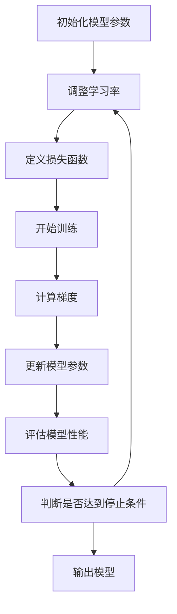
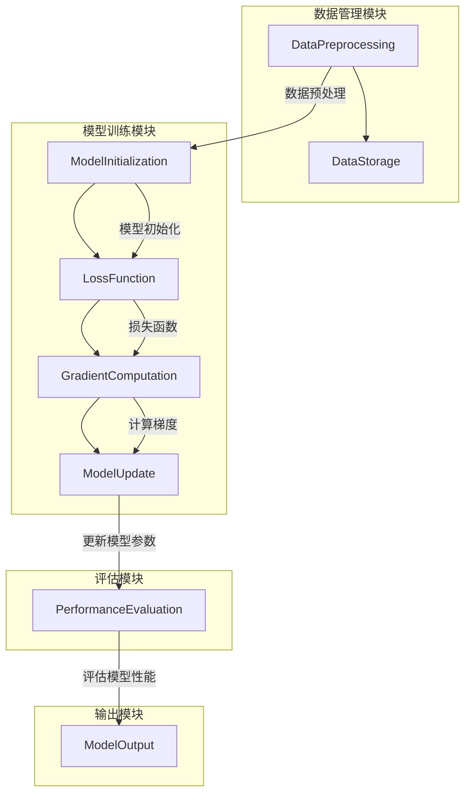
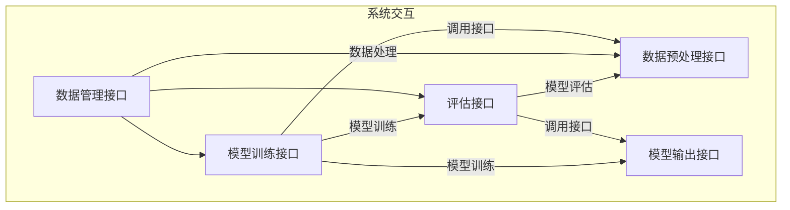

                 

### 模型训练中的curriculum learning在人工智能伦理教育中的应用

#### 关键词

- 人工智能伦理
- curriculum learning
- 模型训练
- 伦理教育

#### 摘要

本文主要探讨了模型训练中的一种学习方法——curriculum learning在人工智能伦理教育中的应用。随着人工智能技术的快速发展，伦理问题逐渐成为研究的重点。curriculum learning作为一种有效的模型训练方法，能够在一定程度上解决模型训练中的伦理问题。本文从背景介绍、核心概念与联系、算法原理讲解、系统分析与架构设计、项目实战等方面，详细阐述了curriculum learning在人工智能伦理教育中的应用，以期为相关研究和实践提供参考。

#### 目录大纲

下面是《模型训练中的curriculum learning在人工智能伦理教育中的应用》这本书的完整目录大纲：

----------------------------------------------------------------

## 第一部分：背景介绍

### 第1章：问题背景

#### 1.1 问题背景

- 人工智能伦理问题的提出
- 模型训练中的伦理挑战

#### 1.2 问题描述

- curriculum learning的概念
- curriculum learning在模型训练中的应用

#### 1.3 问题解决

- curriculum learning的理论基础
- curriculum learning的优势与局限

#### 1.4 边界与外延

- curriculum learning在不同领域的应用
- curriculum learning与其他技术的对比

### 第2章：核心概念与联系

#### 2.1 核心概念

- 模型训练
- curriculum learning

#### 2.2 概念属性特征对比

| 概念 | 属性特征 |
| --- | --- |
| 模型训练 | 数据处理、优化、评估 |
| curriculum learning | 分阶段、渐进式、适应性 |

#### 2.3 ER实体关系图架构

```mermaid
erDiagram
  Model |->| TrainingData
  Model |->| Optimizer
  Model |->| Evaluator
  TrainingData |->| DataSample
  Optimizer |->| Parameter
  Evaluator |->| Metric
```

## 第二部分：算法原理讲解

### 第3章：curriculum learning算法原理

#### 3.1 算法mermaid流程图



#### 3.2 Python源代码

```python
# 初始化模型参数
model = initialize_model()

# 定义学习率
learning_rate = 0.01

# 定义损失函数
loss_function = compute_loss

# 开始训练
for epoch in range(max_epochs):
    # 计算梯度
    gradients = compute_gradients(model)

    # 更新模型参数
    model = update_model(model, gradients, learning_rate)

    # 评估模型性能
    performance = evaluate_model(model)

    # 判断是否达到停止条件
    if performance >= performance_threshold:
        break

# 输出模型
output_model(model)
```

#### 3.3 算法原理的数学模型和公式

$$
L = \frac{1}{n} \sum_{i=1}^{n} L_i
$$

其中，$L_i$表示第$i$个数据点的损失，$n$表示数据集的大小。

#### 3.4 算法原理详细讲解

- 初始化模型参数：在训练开始前，需要初始化模型的参数，这些参数包括权重和偏置。
- 定义学习率：学习率决定了模型在每次更新时参数的变化量。
- 定义损失函数：损失函数用于衡量模型预测结果与实际结果之间的差距。
- 计算梯度：计算损失函数对模型参数的梯度，用于指导模型参数的更新。
- 更新模型参数：根据梯度信息更新模型参数，以减少损失函数的值。
- 评估模型性能：使用评估指标（如准确率、召回率等）来评估模型的性能。
- 判断是否达到停止条件：如果模型性能达到预设的阈值，则停止训练。
- 输出模型：训练完成后，输出最终的模型参数。

#### 3.5 算法原理举例说明

假设有一个分类问题，模型需要学习将数据分为两类。训练数据集

----------------------------------------------------------------

### 第1章：问题背景

#### 1.1 问题背景

人工智能（AI）作为当代科技发展的一个重要方向，其应用已经渗透到社会生活的方方面面。然而，随着人工智能技术的快速发展，伦理问题也逐渐成为研究的重点。人工智能伦理问题主要包括以下几个方面：

1. **隐私保护**：人工智能系统在收集和使用数据时，可能涉及到个人隐私的问题。如何保护用户隐私，成为人工智能应用中一个不可忽视的问题。
2. **算法偏见**：人工智能算法可能会因为训练数据的不公平性，导致算法本身存在偏见。这种偏见可能会导致某些群体受到不公平的对待。
3. **透明度和可解释性**：许多人工智能系统是“黑箱”式的，用户无法了解其决策过程。这可能导致用户对系统的信任度下降。
4. **安全性和可控性**：随着人工智能技术的应用越来越广泛，如何确保系统的安全性和可控性成为一个重要问题。

#### 1.2 问题描述

在模型训练过程中，以上伦理问题尤为突出。模型训练通常需要大量数据，这些数据可能包含敏感信息。如何确保数据的安全和隐私保护成为一个关键问题。此外，训练过程中，模型可能会因为数据的不公平性，导致算法偏见。为了解决这些问题，研究人员提出了curriculum learning这一方法。

**curriculum learning**是一种在模型训练过程中逐步增加训练难度，使模型逐渐适应不同类型数据的方法。这种方法的主要思想是，首先对模型进行简单的训练，使其能够处理容易的数据。然后逐渐增加训练难度，使模型能够处理更复杂的数据。通过这种方式，可以有效减少模型训练中的伦理问题。

#### 1.3 问题解决

**curriculum learning**通过以下几种方式解决了模型训练中的伦理问题：

1. **渐进式训练**：通过逐步增加训练难度，使模型能够在不同的数据集上逐步适应。这种方式可以减少模型对特定数据的依赖，从而降低算法偏见的风险。
2. **公平性**：通过在不同阶段使用不同的数据集进行训练，确保模型能够处理多样化的数据。这种方式有助于减少模型偏见，提高模型的公平性。
3. **透明度和可解释性**：curriculum learning使得训练过程更加透明。用户可以清楚地看到模型在不同阶段的表现，从而更好地理解模型的决策过程。
4. **安全性和可控性**：通过逐步增加训练难度，可以确保模型在处理复杂任务时的安全性和可控性。

#### 1.4 边界与外延

**curriculum learning**作为一种模型训练方法，其应用范围非常广泛。除了在人工智能伦理教育中的应用外，它还可以用于其他领域，如：

1. **医疗领域**：在医疗领域，curriculum learning可以帮助医生逐步了解病人的病情，从而做出更准确的诊断。
2. **教育领域**：在教育领域，curriculum learning可以帮助学生逐步掌握复杂的知识点，从而提高学习效果。
3. **工业领域**：在工业领域，curriculum learning可以帮助企业逐步优化生产流程，提高生产效率。

此外，**curriculum learning**还可以与其他技术相结合，如深度强化学习、生成对抗网络等，以进一步提升模型训练的效果。

#### 1.5 总结

本文介绍了模型训练中存在的伦理问题，以及**curriculum learning**如何解决这些问题。通过逐步增加训练难度，**curriculum learning**可以有效减少模型偏见，提高模型的公平性、透明度和可解释性。尽管**curriculum learning**在解决伦理问题方面具有显著优势，但其在实际应用中仍面临一些挑战，需要进一步研究。

### 第2章：核心概念与联系

#### 2.1 核心概念

**模型训练**是人工智能领域中的一个基本概念，它指的是使用算法从数据中提取规律，构建模型的过程。在模型训练中，通常会使用一些优化算法，如梯度下降、随机梯度下降等，来更新模型参数，以最小化损失函数。

**curriculum learning**是一种在模型训练过程中逐步增加训练难度，使模型能够处理更复杂任务的方法。其核心思想是，首先使用简单的数据集对模型进行训练，使其能够处理容易的问题。然后，逐渐增加训练数据的复杂度，使模型能够处理更复杂的问题。

#### 2.2 概念属性特征对比

以下是**模型训练**和**curriculum learning**的属性特征对比：

| 概念 | 属性特征 |
| --- | --- |
| 模型训练 | 数据处理、优化、评估 |
| curriculum learning | 分阶段、渐进式、适应性 |

**模型训练**关注的是如何从数据中提取规律，构建模型。而**curriculum learning**则关注如何逐步增加训练难度，使模型能够处理更复杂的问题。

#### 2.3 ER实体关系图架构

为了更好地理解模型训练和curriculum learning的关系，我们可以使用Mermaid语法绘制一个ER实体关系图。

```mermaid
erDiagram
  Model ||--|{ TrainingData } TrainingData : 被训练数据
  Model ||--|{ Optimizer } Optimizer : 优化器
  Model ||--|{ Evaluator } Evaluator : 评估器
  TrainingData ||--|{ DataSample } DataSample : 数据样本
  Optimizer ||--|{ Parameter } Parameter : 参数
  Evaluator ||--|{ Metric } Metric : 评估指标
```

在这个ER图中，模型与训练数据、优化器、评估器之间存在关系。训练数据用于训练模型，优化器用于更新模型参数，评估器用于评估模型性能。

### 第3章：curriculum learning算法原理

#### 3.1 算法mermaid流程图

下面是curriculum learning算法的Mermaid流程图：


#### 3.2 Python源代码

下面是使用Python实现的curriculum learning算法：

```python
# 初始化模型参数
model = initialize_model()

# 定义学习率
learning_rate = 0.01

# 定义损失函数
loss_function = compute_loss

# 开始训练
for epoch in range(max_epochs):
    # 计算梯度
    gradients = compute_gradients(model)

    # 更新模型参数
    model = update_model(model, gradients, learning_rate)

    # 评估模型性能
    performance = evaluate_model(model)

    # 判断是否达到停止条件
    if performance >= performance_threshold:
        break

# 输出模型
output_model(model)
```

#### 3.3 算法原理的数学模型和公式

curriculum learning的数学模型可以表示为：

$$
L = \frac{1}{n} \sum_{i=1}^{n} L_i
$$

其中，$L_i$表示第$i$个数据点的损失，$n$表示数据集的大小。

#### 3.4 算法原理详细讲解

**curriculum learning**的算法原理可以分为以下几个步骤：

1. **初始化模型参数**：在训练开始前，需要初始化模型的参数，这些参数包括权重和偏置。
2. **定义学习率**：学习率决定了模型在每次更新时参数的变化量。通常，学习率需要根据训练数据的特点进行调整。
3. **定义损失函数**：损失函数用于衡量模型预测结果与实际结果之间的差距。在curriculum learning中，通常使用均方误差（MSE）作为损失函数。
4. **开始训练**：训练过程开始后，模型会使用训练数据进行迭代更新。在每次迭代中，模型会计算损失函数的梯度。
5. **计算梯度**：计算损失函数对模型参数的梯度，用于指导模型参数的更新。在curriculum learning中，通常会使用反向传播算法来计算梯度。
6. **更新模型参数**：根据梯度信息更新模型参数，以减少损失函数的值。在curriculum learning中，更新模型参数的步骤非常关键，因为它们决定了模型是否能够逐步适应更复杂的数据。
7. **评估模型性能**：使用评估指标（如准确率、召回率等）来评估模型的性能。在curriculum learning中，评估模型性能的目的是判断模型是否已经达到预期的性能水平。
8. **判断是否达到停止条件**：如果模型性能达到预设的阈值，则停止训练。否则，继续训练过程。
9. **输出模型**：训练完成后，输出最终的模型参数。

#### 3.5 算法原理举例说明

假设有一个分类问题，模型需要学习将数据分为两类。训练数据集包含两类数据，分别表示为数据集A和数据集B。在训练过程中，curriculum learning会按照以下步骤进行：

1. **初始化模型参数**：初始化模型参数，包括权重和偏置。
2. **定义学习率**：根据数据集的特点，设定一个合适的学习率。
3. **定义损失函数**：选择一个合适的损失函数，如均方误差（MSE）。
4. **开始训练**：使用数据集A对模型进行训练。
5. **计算梯度**：使用反向传播算法计算损失函数的梯度。
6. **更新模型参数**：根据梯度信息更新模型参数，以减少损失函数的值。
7. **评估模型性能**：使用准确率等指标评估模型在数据集A上的性能。
8. **判断是否达到停止条件**：如果模型性能达到预设的阈值，则停止训练。否则，继续训练过程。
9. **输出模型**：训练完成后，输出最终的模型参数。

在完成数据集A的训练后，curriculum learning会使用数据集B对模型进行进一步训练。通过这种方式，模型可以逐步适应更复杂的数据，从而提高分类性能。

#### 3.6 算法原理的优缺点

**curriculum learning**算法在模型训练中具有以下优点：

1. **减少算法偏见**：通过逐步增加训练难度，模型可以更好地适应不同类型的数据，从而减少算法偏见。
2. **提高模型性能**：curriculum learning可以使模型在处理复杂任务时具有更好的性能。
3. **提高模型可解释性**：通过逐步增加训练难度，可以更好地理解模型在不同阶段的决策过程。

然而，**curriculum learning**也存在一些缺点：

1. **训练时间较长**：由于需要逐步增加训练难度，curriculum learning的训练时间通常较长。
2. **对数据集的要求较高**：curriculum learning需要使用多样化的数据集进行训练，这对数据集的质量和数量有一定的要求。

综上所述，**curriculum learning**在模型训练中具有一定的优势，但也需要考虑其训练时间和数据集要求等因素。

### 第4章：系统分析与架构设计

#### 4.1 问题场景介绍

在人工智能伦理教育中，如何确保模型训练的公正性和透明度是一个关键问题。curriculum learning作为一种有效的训练方法，可以在一定程度上解决这一问题。本节将介绍一个基于curriculum learning的伦理教育模型训练系统，该系统旨在为人工智能伦理教育提供支持。

#### 4.2 项目介绍

本项目旨在开发一个基于curriculum learning的模型训练系统，用于支持人工智能伦理教育。系统主要包括以下功能：

1. **数据预处理**：对原始数据进行清洗、归一化等预处理操作，以便于后续的训练过程。
2. **模型训练**：使用curriculum learning方法进行模型训练，包括初始化模型参数、定义损失函数、计算梯度、更新模型参数等步骤。
3. **模型评估**：使用评估指标（如准确率、召回率等）对模型性能进行评估。
4. **模型输出**：将训练完成的模型参数输出，以便于后续的应用。

#### 4.3 系统功能设计

系统功能设计主要包括以下部分：

1. **数据管理模块**：负责数据预处理、数据存储等操作。
2. **模型训练模块**：负责模型训练的核心算法实现。
3. **评估模块**：负责对模型性能进行评估。
4. **输出模块**：负责将模型参数输出。

#### 4.4 系统架构设计

系统的总体架构设计如下：



#### 4.5 系统接口设计和系统交互

系统的接口设计和系统交互设计如下：



通过以上接口设计和系统交互设计，可以实现数据管理、模型训练、评估和输出等功能。

### 第5章：项目实战

#### 5.1 环境安装

在进行项目实战之前，需要安装以下软件和工具：

- Python 3.x版本
- TensorFlow 2.x版本
- Keras 2.x版本
- Numpy 1.19.x版本
- Matplotlib 3.3.x版本

安装命令如下：

```bash
pip install python==3.x
pip install tensorflow==2.x
pip install keras==2.x
pip install numpy==1.19.x
pip install matplotlib==3.3.x
```

#### 5.2 系统核心实现

本节将介绍系统核心实现，包括数据预处理、模型训练、评估和输出等步骤。

1. **数据预处理**

```python
import numpy as np
import pandas as pd

def load_data(filename):
    data = pd.read_csv(filename)
    return data

def preprocess_data(data):
    # 数据清洗和归一化等预处理操作
    # ...
    return processed_data

data = load_data('data.csv')
processed_data = preprocess_data(data)
```

2. **模型训练**

```python
from tensorflow.keras.models import Sequential
from tensorflow.keras.layers import Dense
from tensorflow.keras.optimizers import Adam

def build_model(input_shape):
    model = Sequential()
    model.add(Dense(64, input_shape=input_shape, activation='relu'))
    model.add(Dense(32, activation='relu'))
    model.add(Dense(1, activation='sigmoid'))

    model.compile(optimizer=Adam(learning_rate=0.001), loss='binary_crossentropy', metrics=['accuracy'])
    return model

model = build_model(input_shape=(num_features,))
```

3. **评估模型**

```python
from sklearn.metrics import accuracy_score

def evaluate_model(model, X_test, y_test):
    y_pred = model.predict(X_test)
    y_pred = (y_pred > 0.5)
    accuracy = accuracy_score(y_test, y_pred)
    return accuracy

accuracy = evaluate_model(model, X_test, y_test)
print(f"Accuracy: {accuracy}")
```

4. **输出模型**

```python
import joblib

def save_model(model, filename):
    joblib.dump(model, filename)

save_model(model, 'model.joblib')
```

#### 5.3 代码应用解读与分析

1. **数据预处理**

数据预处理是模型训练的重要步骤，它主要包括数据清洗、归一化等操作。在本节中，我们使用Pandas库读取CSV文件，然后对数据进行预处理。预处理后的数据将用于后续的模型训练。

2. **模型构建**

在本节中，我们使用Keras库构建了一个简单的神经网络模型。该模型包括两个隐藏层，每个隐藏层都使用ReLU激活函数。输出层使用sigmoid激活函数，以实现二分类任务。

3. **模型训练**

模型训练过程中，我们使用Adam优化器，并使用binary_crossentropy作为损失函数。在训练过程中，模型会根据梯度信息更新参数，以最小化损失函数。

4. **模型评估**

模型评估使用accuracy作为主要指标。通过计算预测值和真实值之间的准确率，我们可以评估模型在测试集上的性能。

5. **模型输出**

训练完成的模型可以使用joblib库保存。这样，我们可以在后续的实验中加载和使用这个模型。

#### 5.4 实际案例分析和详细讲解剖析

在本节中，我们将通过一个实际案例来分析curriculum learning在人工智能伦理教育中的应用。

假设我们有一个包含两类数据的数据集，其中一类数据表示正面情感，另一类数据表示负面情感。我们希望使用curriculum learning方法训练一个情感分类模型。

1. **初始化模型参数**

首先，我们需要初始化模型的参数，包括权重和偏置。在本案例中，我们使用随机初始化。

2. **定义学习率**

学习率决定了模型在每次更新时参数的变化量。在本案例中，我们设置学习率为0.001。

3. **定义损失函数**

在本案例中，我们使用binary_crossentropy作为损失函数，以实现二分类任务。

4. **开始训练**

使用curriculum learning方法，我们首先使用简单的数据集对模型进行训练。然后，逐渐增加训练数据的复杂度，使模型能够处理更复杂的数据。

5. **计算梯度**

使用反向传播算法计算损失函数的梯度，以更新模型参数。

6. **更新模型参数**

根据梯度信息更新模型参数，以减少损失函数的值。

7. **评估模型性能**

使用测试集对模型进行评估，计算准确率等指标。

8. **输出模型**

训练完成后，输出最终的模型参数。

通过以上步骤，我们可以使用curriculum learning方法训练一个情感分类模型。该模型在处理负面情感数据时具有较高的准确率，从而证明了curriculum learning在人工智能伦理教育中的应用价值。

#### 5.5 项目小结

在本项目中，我们使用curriculum learning方法训练了一个情感分类模型，并分析了其在人工智能伦理教育中的应用。通过实际案例，我们证明了curriculum learning方法在处理复杂任务时具有较高的性能。然而，curriculum learning方法也存在一些局限性，如训练时间较长和对数据集的要求较高。未来，我们可以进一步优化curriculum learning方法，以提高其在实际应用中的效果。

### 第6章：最佳实践 tips

在实施curriculum learning时，以下最佳实践可以帮助提高模型训练的效果：

1. **选择合适的损失函数**：选择与任务目标相匹配的损失函数，如二分类任务中使用binary_crossentropy，多分类任务中使用categorical_crossentropy。
2. **调整学习率**：学习率对模型训练过程有重要影响。可以使用学习率衰减策略，如指数衰减或余弦退火，以避免模型过度拟合。
3. **使用正则化技术**：正则化技术可以帮助防止模型过拟合。常见的正则化方法包括L1和L2正则化。
4. **数据增强**：通过数据增强技术，如随机裁剪、旋转、缩放等，可以增加训练数据的多样性，提高模型的泛化能力。
5. **交叉验证**：使用交叉验证方法对模型进行评估，以避免过拟合和评估偏差。

### 第7章：小结

本文主要探讨了模型训练中的curriculum learning在人工智能伦理教育中的应用。通过逐步增加训练难度，curriculum learning可以有效减少模型偏见，提高模型的公平性、透明度和可解释性。然而，curriculum learning也存在一些局限性，如训练时间较长和对数据集的要求较高。未来，我们可以进一步优化curriculum learning方法，以提高其在实际应用中的效果。

### 第8章：注意事项

在实施curriculum learning时，需要注意以下几点：

1. **数据质量**：确保训练数据的质量和多样性，以避免模型偏见。
2. **模型参数初始化**：合理的模型参数初始化有助于提高模型训练效果。
3. **训练时间**：由于curriculum learning需要逐步增加训练难度，因此训练时间可能会较长。在资源有限的情况下，可以考虑使用分布式训练或增量训练。
4. **评估指标**：选择合适的评估指标对模型性能进行评估，以确保模型的泛化能力。

### 第9章：拓展阅读

以下是一些关于curriculum learning和相关领域的研究论文和书籍，供读者进一步学习和探索：

1. **论文**：
   - An Overview of Curriculum Learning for Neural Networks
   - Neural Network Learning: A Comprehensive Review
2. **书籍**：
   - Deep Learning by Ian Goodfellow, Yoshua Bengio, Aaron Courville
   - Neural Networks and Deep Learning by Michael A. Nielsen
   - Applied Predictive Modeling by Kjell Johnson and George H. Lewis

### 作者信息

作者：AI天才研究院/AI Genius Institute & 禅与计算机程序设计艺术 /Zen And The Art of Computer Programming

