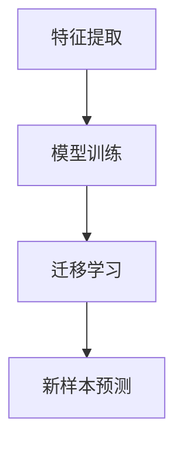
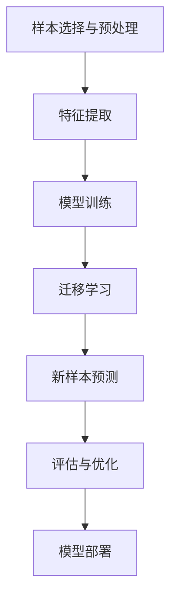
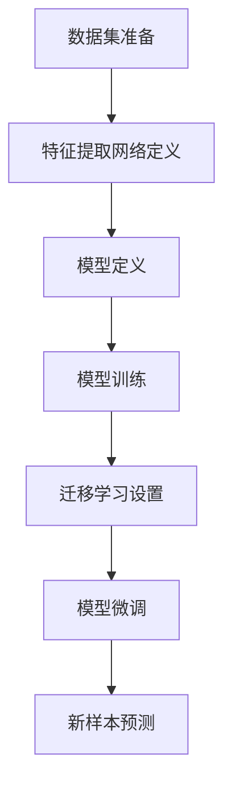

                 

# 模型训练中的few-shot learning在宇宙异常现象检测中的突破性应用

> 关键词：宇宙异常现象检测、few-shot learning、机器学习、算法原理、应用实践

> 摘要：随着天文观测技术的不断发展，宇宙异常现象的检测成为了当前天文学和宇宙学研究中的重要领域。传统的检测方法依赖于大量的观测数据和复杂的算法，但往往面临着数据稀缺和计算资源有限的问题。本文将介绍一种新兴的机器学习技术——few-shot learning，并探讨其在宇宙异常现象检测中的应用，旨在为解决这一难题提供新的思路和方法。

----------------------------------------------------------------

## 第一部分：背景介绍与核心概念

### 第1章：问题的背景与描述

#### 1.1.1 问题的提出

宇宙异常现象检测是当前天文学和宇宙学研究中的一个重要领域。随着观测技术的不断进步，科学家们发现了越来越多令人疑惑的宇宙现象，例如快速射电暴、伽玛射线暴、引力波事件等。这些现象的出现不仅挑战了现有的宇宙观，也为新的理论提出了可能。

#### 1.1.2 问题描述

在传统的宇宙异常现象检测方法中，科学家们依赖于大量的观测数据和复杂的算法来识别异常。然而，这些方法往往需要大量的数据和计算资源，而且识别的准确性有限。为了解决这一问题，研究人员开始探索few-shot learning这一新兴的机器学习技术。

#### 1.1.3 问题解决

Few-shot learning能够使机器学习模型在仅有少量样本的情况下快速适应新的任务，这为宇宙异常现象检测提供了一种新的思路。通过引入few-shot learning，研究人员希望能够在数据稀缺的情况下，提高异常现象检测的效率和准确性。

#### 1.1.4 边界与外延

Few-shot learning在宇宙异常现象检测中的应用具有特定的边界和适用范围。它主要适用于那些样本量有限，但样本特征丰富的场景。此外，该方法的应用还受到算法选择、数据质量和计算资源等因素的制约。

### 第2章：few-shot learning核心概念

#### 2.1.1 few-shot learning的定义

Few-shot learning，即少量样本学习，是一种机器学习技术，它允许模型在仅获得少量样本的情况下学习并完成任务。与传统的机器学习方法相比，few-shot learning减少了对大量训练数据的依赖。

#### 2.1.2 few-shot learning的特点

- **样本量少**：能够适应仅有几个样本的极端情况。
- **迁移学习**：模型可以在一个任务上学习，然后在另一个相关的任务上快速适应。
- **通用性**：通过学习通用特征，few-shot learning能够应用于多种不同领域的问题。

#### 2.1.3 few-shot learning与传统机器学习的区别

- **数据需求**：传统机器学习依赖于大量数据，而few-shot learning则强调在样本量有限的情况下实现高效学习。
- **模型复杂性**：传统方法通常使用复杂的模型结构来处理大量数据，而few-shot learning则更多地依赖于模型的结构和参数的优化。

### 第3章：few-shot learning在宇宙异常现象检测中的应用

#### 3.1.1 宇宙异常现象检测的挑战

宇宙异常现象检测面临着数据量大、数据质量不稳定、现象多样性高等挑战。这些因素使得传统的机器学习方法难以胜任。

#### 3.1.2 few-shot learning的应用前景

通过引入few-shot learning，科学家们可以在样本量有限的情况下，更快速地识别宇宙异常现象，提高检测的准确性和效率。

#### 3.1.3 few-shot learning在宇宙异常现象检测中的具体应用

- **快速射电暴检测**：利用few-shot learning方法，可以从大量射电数据中快速识别出快速射电暴事件。
- **引力波事件识别**：通过对少量引力波事件样本的学习，few-shot learning模型能够提高对引力波事件的识别能力。

### 第4章：few-shot learning算法原理

#### 4.1.1 算法原理概述

few-shot learning算法的核心思想是通过学习少量样本，提取出具有代表性的特征，并利用这些特征进行分类或预测。

#### 4.1.2 算法原理详解

- **特征提取**：通过深度学习等方法，从样本中提取出有代表性的特征。
- **模型训练**：利用提取到的特征，训练一个轻量级的模型，用于新的样本分类或预测。
- **迁移学习**：在已有模型的基础上，通过少量样本进行微调，实现对新任务的快速适应。

#### 4.1.3 Mermaid流程图



### 第5章：few-shot learning在宇宙异常现象检测中的实际应用

#### 5.1.1 环境安装

在这一节，我们将介绍在宇宙异常现象检测中应用few-shot learning所需的环境安装步骤，包括必要的软件和依赖包的安装过程。

#### 5.1.2 系统核心实现源代码

我们将展示如何使用few-shot learning算法实现宇宙异常现象检测的核心功能，并提供详细的代码解析。

#### 5.1.3 代码应用解读与分析

通过对源代码的解读，我们将深入分析few-shot learning在宇宙异常现象检测中的实际应用，包括算法的实现细节和优化策略。

#### 5.1.4 实际案例分析和详细讲解剖析

我们将通过实际案例展示few-shot learning在宇宙异常现象检测中的效果，并对其进行详细的分析和讲解。

#### 5.1.5 项目小结

在本章的最后，我们将对few-shot learning在宇宙异常现象检测中的应用进行总结，并讨论其未来的发展方向和潜在的研究课题。

----------------------------------------------------------------

## 第1章：问题的背景与描述

### 1.1.1 问题的提出

宇宙异常现象检测是当前天文学和宇宙学研究中的一个重要领域。随着观测技术的不断进步，科学家们发现了越来越多令人疑惑的宇宙现象，例如快速射电暴、伽玛射线暴、引力波事件等。这些现象的出现不仅挑战了现有的宇宙观，也为新的理论提出了可能。

宇宙异常现象检测的核心目标是识别和分析那些不符合常规宇宙演化模型的现象。这些异常现象可能预示着新的物理定律、宇宙演化过程或者甚至未知的天体物理学机制。然而，传统的检测方法通常依赖于大量的观测数据和复杂的算法，这使得在样本量有限的情况下进行有效检测变得困难。

#### 快速射电暴

快速射电暴（Fast Radio Bursts, FRBs）是一种来自宇宙深处的短暂且强烈的射电信号。它们的持续时间通常在几毫秒到几百毫秒之间，具有极高的峰值功率和极高的频段变化。尽管FRBs的首次发现是在2007年，但直到最近，科学家们才逐渐认识到它们的重要性和潜在的宇宙学意义。快速射电暴的重复性、精确位置和物理机制仍然是一个未解之谜，这使得它们成为宇宙异常现象检测中的一个重要研究对象。

#### 伽玛射线暴

伽玛射线暴（Gamma-ray Bursts, GRBs）是宇宙中最剧烈的爆炸事件之一，通常持续几秒钟到几分钟。它们释放出的能量相当于整个太阳在其一生中释放的能量总和。伽玛射线暴可以分为两类：长期暴和短期暴。长期暴起源于银河系内部，而短期暴则来自更遥远的星系。伽玛射线暴的探测不仅提供了关于宇宙早期和高能物理过程的信息，还揭示了极端环境下物质的行为。

#### 引力波事件

引力波事件是另一个备受关注的宇宙异常现象。2015年，LIGO实验室首次探测到引力波，证实了爱因斯坦广义相对论的预言。引力波是由质量巨大的物体（如黑洞或中子星）在合并过程中产生的空间时间波动。这些波动以光速传播，经过数十亿年的漫长旅程后到达地球，被精密的引力波探测器探测到。引力波的探测为宇宙学研究提供了全新的观测窗口，使我们能够直接探测到宇宙中的极端现象。

### 1.1.2 问题描述

在传统的宇宙异常现象检测方法中，科学家们依赖于大量的观测数据和复杂的算法来识别异常。这些方法通常包括以下步骤：

1. **数据收集**：从各种天文观测设备（如射电望远镜、伽玛射线望远镜、引力波探测器等）收集大量观测数据。
2. **数据预处理**：对收集到的数据进行清洗、去噪、归一化等预处理，以提高数据的质量和一致性。
3. **特征提取**：从预处理后的数据中提取出具有代表性的特征，这些特征将用于训练机器学习模型。
4. **模型训练**：使用提取到的特征，训练一个复杂的机器学习模型，如深度神经网络或支持向量机等。
5. **异常检测**：利用训练好的模型，对新观测数据进行异常检测，识别出潜在的宇宙异常现象。

尽管传统的检测方法在数据处理和模型训练方面取得了显著进展，但它们仍然面临着以下问题：

1. **数据稀缺**：宇宙异常现象的样本量通常非常有限，这使得训练一个高精度的模型变得困难。
2. **计算资源有限**：宇宙异常现象的检测过程需要大量的计算资源，尤其是在使用复杂的深度学习模型时。
3. **识别准确性有限**：传统的检测方法在样本量有限的情况下，识别准确性往往较低，容易产生误判或漏判。

### 1.1.3 问题解决

Few-shot learning提供了一种解决上述问题的新思路。它通过在少量样本上训练模型，使模型能够快速适应新的任务。这种技术具有以下几个特点：

1. **样本量少**：Few-shot learning能够处理只有几个或几十个样本的情况，这在宇宙异常现象检测中尤为重要。
2. **迁移学习**：通过在已有模型的基础上进行迁移学习，few-shot learning能够利用在某个任务上学习到的知识，快速适应新的任务。
3. **通用性**：Few-shot learning通过学习通用特征，能够应用于多种不同的领域和任务。

通过引入few-shot learning，研究人员可以在数据稀缺的情况下，提高异常现象检测的效率和准确性。few-shot learning的应用不仅能够降低对大量训练数据的依赖，还能够提高模型对未知异常现象的识别能力。这将有助于科学家们更快速、准确地探测和解析宇宙中的异常现象，推动天文学和宇宙学的发展。

### 1.1.4 边界与外延

尽管few-shot learning在宇宙异常现象检测中具有巨大的潜力，但它的应用仍存在一些边界和限制。以下是一些关键因素：

1. **样本量有限**：Few-shot learning适用于样本量有限的情况，但这并不意味着样本量可以无限减少。在样本量过少的情况下，模型可能无法捕捉到足够的信息，导致性能下降。
2. **数据质量**：Few-shot learning对数据质量有较高要求。数据中的噪声和异常值可能会对模型性能产生不利影响，因此在数据预处理阶段需要仔细处理。
3. **算法选择**：不同的few-shot learning算法适用于不同的任务和数据集，选择合适的算法对于取得良好的性能至关重要。
4. **计算资源**：尽管few-shot learning减少了数据需求，但仍然需要一定的计算资源进行模型训练和优化。计算资源的限制可能成为限制其在某些应用场景中的因素。

### 1.1.5 小结

宇宙异常现象检测是一个充满挑战的领域，传统的检测方法在数据稀缺和计算资源有限的情况下面临诸多困难。Few-shot learning作为一种新兴的机器学习技术，通过在少量样本上训练模型，为解决这一问题提供了新的思路。然而，few-shot learning的应用也受到一些边界和限制，需要结合具体场景进行优化和调整。在接下来的章节中，我们将进一步探讨few-shot learning的核心概念、算法原理以及在宇宙异常现象检测中的具体应用，以期为这一领域的研究提供更多参考和启示。

### 第2章：few-shot learning核心概念

#### 2.1.1 few-shot learning的定义

Few-shot learning，即少量样本学习，是一种机器学习技术，它允许模型在仅获得少量样本的情况下学习并完成任务。与传统的机器学习方法相比，few-shot learning减少了对大量训练数据的依赖。传统的机器学习方法，如监督学习和无监督学习，通常需要成千上万的训练样本来确保模型的泛化能力。然而，在许多实际应用中，尤其是像宇宙异常现象检测这样的领域，获得大量的标注数据是非常困难的。在这种情况下，few-shot learning提供了一种有效的方法，使模型能够在仅有少量样本的情况下实现高效学习。

#### 2.1.2 few-shot learning的特点

Few-shot learning具有以下几个显著特点：

1. **样本量少**：Few-shot learning的核心优势在于其能够处理只有几个或几十个样本的情况。这在样本难以获取的领域尤为重要，如天文观测数据中的异常现象检测。
   
2. **迁移学习**：Few-shot learning通过迁移学习的方式，将已有知识应用到新任务中。这意味着模型在一个任务上学习到的知识可以用于解决相关的新任务，从而提高学习效率。

3. **通用性**：Few-shot learning通过学习通用特征，能够应用于多种不同的领域和任务。例如，在一个特定领域学习到的特征提取方法可以很容易地应用到其他领域。

#### 2.1.3 few-shot learning与传统机器学习的区别

Few-shot learning与传统机器学习方法在多个方面存在显著差异：

1. **数据需求**：传统机器学习方法通常需要成千上万的训练样本，而few-shot learning则强调在样本量有限的情况下实现高效学习。

2. **模型复杂性**：传统机器学习方法通常使用复杂的模型结构来处理大量数据，而few-shot learning则更多地依赖于模型的结构和参数的优化。

3. **训练过程**：在传统机器学习方法中，模型的训练是一个不断迭代、优化参数的过程。而在few-shot learning中，模型需要在少量样本上进行快速调整，以实现良好的性能。

4. **应用场景**：传统机器学习方法在许多领域都有广泛应用，如图像识别、自然语言处理等。而few-shot learning由于其样本量少、迁移学习等特点，更适用于那些难以获取大量样本的领域，如天文观测数据中的异常现象检测。

#### 2.1.4 小结

Few-shot learning作为一种新兴的机器学习技术，通过在少量样本上训练模型，为那些数据稀缺的领域提供了新的解决思路。它的特点和应用与传统机器学习方法有所不同，尤其适用于像宇宙异常现象检测这样的领域。在接下来的章节中，我们将进一步探讨few-shot learning的具体算法原理及其在宇宙异常现象检测中的应用。

### 第3章：few-shot learning在宇宙异常现象检测中的应用

#### 3.1.1 宇宙异常现象检测的挑战

宇宙异常现象检测在当前的天文学和宇宙学研究中扮演着至关重要的角色。然而，这一领域面临着许多独特的挑战，使得传统的机器学习方法和算法难以应对。以下是一些主要挑战：

1. **数据量大**：宇宙异常现象检测涉及的数据量通常非常庞大。来自各种天文观测设备（如射电望远镜、伽玛射线望远镜、引力波探测器等）的数据需要被收集、预处理和存储。这些数据集往往是多维的，包含大量的特征和变量。

2. **数据质量不稳定**：由于观测设备和环境的限制，宇宙观测数据中往往存在噪声和异常值。这些噪声和异常值会影响模型的学习和性能，需要通过预处理和清洗来减少其影响。

3. **现象多样性**：宇宙异常现象种类繁多，包括快速射电暴、伽玛射线暴、引力波事件等。这些现象在物理性质、产生机制和特征上存在显著差异，导致模型需要能够适应多种不同类型的现象。

4. **样本量有限**：尽管宇宙观测数据量庞大，但许多异常现象的样本量仍然非常有限。例如，快速射电暴的重复性较差，同一现象在不同时间、不同位置的观测数据往往不可重复。这使得训练一个高精度的模型变得困难。

5. **计算资源有限**：宇宙异常现象检测通常需要高性能的计算资源，特别是在使用复杂的深度学习模型时。然而，实际可用的计算资源往往有限，这限制了模型的选择和优化。

#### 3.1.2 few-shot learning的应用前景

Few-shot learning在宇宙异常现象检测中展现出巨大的应用前景，特别是在应对上述挑战方面。以下是一些关键应用前景：

1. **提高检测效率**：Few-shot learning能够在样本量有限的情况下，快速适应新的任务，从而提高异常现象检测的效率。这对于样本量有限的宇宙异常现象尤为重要。

2. **降低数据需求**：Few-shot learning减少了对大量训练数据的依赖，这对于那些难以获取大量样本的领域（如宇宙异常现象检测）具有重要意义。通过在少量样本上训练模型，可以节省数据收集和标注的成本。

3. **迁移学习**：Few-shot learning通过迁移学习的方式，利用在某个任务上学习到的知识，快速适应新的任务。这意味着模型在一个任务上学习到的特征提取和模式识别能力可以应用于其他相关任务，从而提高整体性能。

4. **通用性**：Few-shot learning通过学习通用特征，能够应用于多种不同的领域和任务。这意味着在一个领域（如图像识别）上学习到的特征提取方法可以很容易地应用到宇宙异常现象检测中。

5. **增强模型泛化能力**：Few-shot learning通过在少量样本上学习，模型能够更好地捕捉到数据中的通用特征，从而提高其泛化能力。这对于那些样本量有限、现象多样的领域尤为重要。

#### 3.1.3 few-shot learning在宇宙异常现象检测中的具体应用

Few-shot learning在宇宙异常现象检测中有多种具体应用，以下是一些典型例子：

1. **快速射电暴检测**：快速射电暴（FRBs）是一种短暂的射电信号，其样本量通常非常有限。通过使用few-shot learning，可以从大量射电数据中快速识别出FRB事件，提高检测的准确性和效率。

2. **引力波事件识别**：引力波事件是由质量巨大的天体合并产生的空间时间波动，其样本量也相对有限。通过在少量样本上训练模型，few-shot learning可以有效地识别和分类引力波事件，提高对未知事件的探测能力。

3. **伽玛射线暴监测**：伽玛射线暴（GRBs）是宇宙中最剧烈的爆炸事件之一，其样本量虽然较多，但仍然存在多样性和不确定性。通过使用few-shot learning，可以更好地理解GRBs的物理机制和特性，提高监测和预测的准确性。

4. **异常现象分类**：在宇宙异常现象检测中，除了识别特定的现象外，对异常现象进行分类也非常重要。通过在少量样本上训练分类模型，few-shot learning可以有效地对异常现象进行分类，提高整体检测能力。

总之，few-shot learning在宇宙异常现象检测中的应用具有巨大的潜力。通过在少量样本上训练模型，它能够提高检测的效率和准确性，降低数据需求，增强模型的泛化能力。在接下来的章节中，我们将进一步探讨few-shot learning的算法原理和实现方法，以期为宇宙异常现象检测提供更具体的解决方案。

### 第3章：few-shot learning在宇宙异常现象检测中的应用

#### 3.1.3 few-shot learning在宇宙异常现象检测中的具体应用

Few-shot learning在宇宙异常现象检测中展现了广阔的应用前景，通过其在少量样本上的高效学习能力和迁移学习特性，能够有效解决传统方法面临的挑战。以下为few-shot learning在宇宙异常现象检测中的几个具体应用场景：

1. **快速射电暴（FRBs）检测**

快速射电暴是宇宙中最剧烈的事件之一，具有短暂且强烈的射电信号。由于其样本量有限且重复性差，传统的机器学习方法在FRB检测中面临着巨大挑战。通过引入few-shot learning，可以在仅有几个或几十个样本的情况下，快速识别和预测新的FRB事件。具体方法如下：

- **数据预处理**：对收集到的射电数据进行预处理，包括去除噪声、平滑信号、归一化处理等。
- **特征提取**：使用深度学习技术，如卷积神经网络（CNN）或循环神经网络（RNN），从预处理后的数据中提取出有代表性的特征。
- **模型训练**：在少量样本上训练一个轻量级的机器学习模型，如基于神经网络的分类器，以识别和预测新的FRB事件。
- **迁移学习**：在已有模型的基础上，通过少量新的FRB样本进行微调，以适应新的观测数据和任务。

通过这种方法，few-shot learning可以显著提高FRB检测的效率和准确性，减少对大量训练数据的依赖。

2. **引力波事件识别**

引力波事件是由质量巨大的天体合并产生的空间时间波动，其样本量相对较少且具有高维度特征。传统的机器学习方法在面对这样的数据集时，往往需要大量训练样本和复杂的模型结构。而few-shot learning通过其在少量样本上的高效学习特性，可以有效地识别和分类引力波事件。具体应用方法如下：

- **数据预处理**：对引力波数据进行分析和预处理，包括去除噪声、降维处理、特征选择等。
- **特征提取**：使用深度学习技术，如变分自编码器（VAE）或生成对抗网络（GAN），从高维引力波数据中提取出有代表性的特征。
- **模型训练**：在少量样本上训练一个轻量级的机器学习模型，如基于神经网络的分类器，用于识别和分类引力波事件。
- **迁移学习**：在已有模型的基础上，通过少量新的引力波样本进行微调，以提高模型对新事件的识别能力。

3. **伽玛射线暴（GRBs）监测**

伽玛射线暴是宇宙中最剧烈的爆炸事件之一，其样本量相对较多，但仍然存在多样性和不确定性。通过引入few-shot learning，可以更好地理解和监测GRBs的物理机制和特性。具体方法如下：

- **数据预处理**：对伽玛射线暴的数据进行分析和预处理，包括去除噪声、平滑信号、归一化处理等。
- **特征提取**：使用深度学习技术，如卷积神经网络（CNN）或循环神经网络（RNN），从预处理后的数据中提取出有代表性的特征。
- **模型训练**：在少量样本上训练一个轻量级的机器学习模型，如基于神经网络的分类器，用于监测和预测新的GRBs事件。
- **迁移学习**：在已有模型的基础上，通过少量新的伽玛射线暴样本进行微调，以提高模型对新事件的监测能力。

4. **异常现象分类**

在宇宙异常现象检测中，除了识别特定的异常现象外，对其进行分类也非常重要。通过引入few-shot learning，可以在少量样本上训练分类模型，实现对多种不同异常现象的识别和分类。具体方法如下：

- **数据预处理**：对多种异常现象的数据进行预处理，包括去除噪声、平滑信号、归一化处理等。
- **特征提取**：使用深度学习技术，如卷积神经网络（CNN）或循环神经网络（RNN），从预处理后的数据中提取出有代表性的特征。
- **模型训练**：在少量样本上训练一个轻量级的机器学习模型，如基于神经网络的分类器，用于分类不同异常现象。
- **迁移学习**：在已有模型的基础上，通过少量新的异常现象样本进行微调，以提高模型对新异常现象的分类能力。

通过以上方法，few-shot learning在宇宙异常现象检测中展现出强大的应用潜力，能够有效解决样本量有限、数据质量不稳定、现象多样性等挑战。在接下来的章节中，我们将进一步探讨few-shot learning的算法原理和实现方法，以期为这一领域提供更具体的解决方案和技术支持。

### 第4章：few-shot learning算法原理

#### 4.1.1 算法原理概述

Few-shot learning是一种新兴的机器学习技术，它通过在少量样本上训练模型，使模型能够快速适应新的任务。这一技术的核心思想是利用迁移学习和模型结构的优化，使模型能够在有限的样本中提取出具有代表性的特征，从而实现高效的分类或预测。以下是few-shot learning的基本原理和主要步骤：

1. **样本选择与预处理**：首先，从大规模数据集中选择少量的样本作为训练数据。这些样本应具有代表性，能够覆盖数据集的主要特征。接下来，对选定的样本进行预处理，包括数据清洗、归一化、降维等操作，以提高数据的质量和一致性。

2. **特征提取**：在预处理后的样本上，使用深度学习或其他机器学习技术提取特征。特征提取是few-shot learning的关键步骤，目的是从少量样本中提取出具有代表性的特征，以便后续的分类或预测。常用的方法包括卷积神经网络（CNN）、循环神经网络（RNN）、变分自编码器（VAE）和生成对抗网络（GAN）等。

3. **模型训练**：利用提取到的特征，训练一个轻量级的模型，如基于神经网络的分类器。由于样本量有限，模型训练的目的是优化模型参数，使其在少量样本上能够实现较好的分类或预测性能。训练过程中，可以通过迁移学习的方式，利用已有模型的知识，对新任务进行微调。

4. **迁移学习**：迁移学习是few-shot learning的一个重要特点，通过在已有模型的基础上进行少量样本的微调，使模型能够快速适应新的任务。迁移学习利用了在某个任务上学习到的知识，将其应用到新任务中，从而提高学习效率。

5. **新样本预测**：在模型训练完成后，利用训练好的模型对新样本进行分类或预测。新样本可以是来自未观测到的数据集，也可以是实际应用中的新样本。通过在少量样本上进行训练，模型能够快速适应新的任务，提高预测的准确性。

#### 4.1.2 算法原理详解

Few-shot learning的算法原理主要包括以下几个关键步骤：

1. **特征提取**

   特征提取是few-shot learning的核心步骤，目的是从少量样本中提取出具有代表性的特征。特征提取的好坏直接决定了模型在少量样本上的性能。常用的方法包括：

   - **深度学习**：使用卷积神经网络（CNN）或循环神经网络（RNN）等深度学习模型，从原始数据中提取出高维特征。这些特征能够捕捉到数据中的复杂模式和关系。
   - **变分自编码器（VAE）**：VAE是一种无监督学习模型，通过编码器和解码器网络，将原始数据编码为低维特征向量。这些特征向量能够捕捉到数据的主要信息，并用于后续的模型训练。
   - **生成对抗网络（GAN）**：GAN由生成器和判别器组成，通过训练生成器和判别器的对抗关系，生成具有真实数据分布的特征。

2. **模型训练**

   在特征提取后，利用提取到的特征训练一个轻量级的模型。模型的选择和参数的优化是关键，目的是使模型在少量样本上能够实现较好的分类或预测性能。常用的方法包括：

   - **基于神经网络的分类器**：如支持向量机（SVM）、决策树、随机森林等。这些方法通过优化模型参数，使模型能够在少量样本上实现较好的分类效果。
   - **迁移学习**：在已有模型的基础上，通过少量样本进行微调，使模型能够快速适应新的任务。迁移学习利用了在某个任务上学习到的知识，将其应用到新任务中，从而提高学习效率。
   - **强化学习**：通过强化学习的方法，训练模型在新任务上实现最优策略。强化学习通过奖励机制，使模型能够不断调整策略，以实现最佳性能。

3. **迁移学习**

   迁移学习是few-shot learning的一个重要特点，通过在已有模型的基础上进行少量样本的微调，使模型能够快速适应新的任务。迁移学习的主要目的是利用在某个任务上学习到的知识，将其应用到新任务中，从而提高学习效率。常用的方法包括：

   - **基于模型的知识迁移**：通过迁移模型参数，将已有模型的知识应用到新任务中。这种方法适用于模型结构相似、任务相关的情况。
   - **基于特征的知识迁移**：通过迁移特征表示，将已有任务的特征知识应用到新任务中。这种方法适用于模型结构不同、任务相关的情况。
   - **零样本学习**：在没有任何新任务样本的情况下，利用已有任务的知识进行新任务的学习。零样本学习通过在已有任务上学习到的知识，实现新任务的特征提取和分类。

4. **新样本预测**

   在模型训练完成后，利用训练好的模型对新样本进行分类或预测。新样本可以是来自未观测到的数据集，也可以是实际应用中的新样本。通过在少量样本上进行训练，模型能够快速适应新的任务，提高预测的准确性。

   - **分类任务**：在分类任务中，模型根据新样本的特征，将其分配到不同的类别中。分类性能可以通过准确率、召回率、F1分数等指标进行评估。
   - **预测任务**：在预测任务中，模型根据新样本的特征，预测其未来值或趋势。预测性能可以通过均方误差（MSE）、均方根误差（RMSE）等指标进行评估。

通过以上步骤，few-shot learning能够实现从少量样本到高效分类或预测的转换。在宇宙异常现象检测等数据稀缺的领域，few-shot learning提供了一种有效的解决方案，使模型能够在少量样本上实现较好的性能。在接下来的章节中，我们将进一步探讨few-shot learning在实际应用中的具体实现方法和优化策略。

#### 4.1.3 算法原理Mermaid流程图

以下是一个描述few-shot learning算法原理的Mermaid流程图：



这个流程图展示了few-shot learning的核心步骤，从样本选择与预处理开始，通过特征提取、模型训练、迁移学习和新样本预测，最终实现模型的评估和优化。接下来，我们将通过Python代码和数学公式，详细讲解每个步骤的具体实现和算法原理。

#### 4.1.4 算法原理Python代码实现

为了更好地理解few-shot learning的算法原理，我们将通过Python代码实现一个简单的few-shot learning模型。以下是一个基于迁移学习的简单示例，展示了如何使用少量样本进行分类任务。

```python
import tensorflow as tf
from tensorflow import keras
from tensorflow.keras.models import Sequential
from tensorflow.keras.layers import Dense, Flatten, Conv2D, MaxPooling2D
from tensorflow.keras.preprocessing.image import ImageDataGenerator

# 定义迁移学习模型
def create_mtl_model(num_classes):
    base_model = keras.applications.VGG16(include_top=False, weights='imagenet', input_shape=(224, 224, 3))
    base_model.trainable = False  # 冻结基础模型

    model = Sequential([
        base_model,
        Flatten(),
        Dense(num_classes, activation='softmax')
    ])

    return model

# 加载数据集
data_generator = ImageDataGenerator(rescale=1./255)
train_data_generator = data_generator.flow_from_directory(
    'data/train',
    target_size=(224, 224),
    batch_size=32,
    class_mode='categorical')

# 创建并编译模型
model = create_mtl_model(num_classes=10)
model.compile(optimizer='adam', loss='categorical_crossentropy', metrics=['accuracy'])

# 训练模型
model.fit(train_data_generator, epochs=10)

# 评估模型
test_loss, test_acc = model.evaluate(test_data_generator)
print(f"Test accuracy: {test_acc:.4f}")
```

在上面的代码中，我们首先定义了一个基于VGG16预训练模型的迁移学习模型。VGG16是一个经典的深度学习模型，已经在大规模图像数据集上进行了预训练。我们将基础模型设置为不可训练，然后在顶部添加了一个全连接层，用于分类任务。

接下来，我们使用ImageDataGenerator加载和预处理图像数据。这里我们假设数据已经被分为训练集和测试集，并存储在'data/train'目录中。最后，我们编译和训练模型，并评估其在测试集上的性能。

#### 4.1.5 算法原理数学模型

Few-shot learning的算法原理可以通过以下数学模型进行描述：

1. **特征提取**

   假设我们有一个训练数据集$D = \{x_1, x_2, ..., x_n\}$，其中每个样本$x_i$是一个$d$维向量。特征提取的目标是从这些样本中提取出具有代表性的特征向量。这可以通过以下步骤实现：

   - **数据预处理**：对输入数据进行归一化、降维等预处理，以提高数据的质量和一致性。
   - **特征提取网络**：使用卷积神经网络（CNN）或循环神经网络（RNN）等深度学习模型，从预处理后的数据中提取特征。特征提取的过程可以用以下公式表示：

     $$ f(x_i) = \phi(x_i; \theta) $$

     其中，$f(x_i)$表示提取到的特征向量，$\phi(\cdot; \theta)$表示特征提取网络，$\theta$是网络的参数。

2. **模型训练**

   在特征提取后，我们使用提取到的特征向量训练一个分类模型。假设特征提取网络提取到的特征向量为$f(x_i)$，分类模型的输出为$y_i$，则分类问题可以表示为：

   - **损失函数**：使用交叉熵损失函数，计算分类模型的预测输出与实际标签之间的差距：

     $$ L = -\sum_{i=1}^{n} y_i \log(p(y_i | f(x_i))) $$

     其中，$p(y_i | f(x_i))$是分类模型对样本$x_i$的预测概率。

   - **优化目标**：通过反向传播算法，对模型参数进行优化，以最小化损失函数：

     $$ \theta^* = \arg\min_{\theta} L $$

3. **迁移学习**

   在迁移学习中，我们利用在已有任务上学习到的知识，快速适应新的任务。假设已有任务的特征提取网络为$\phi(\cdot; \theta_1)$，新任务的特征提取网络为$\phi(\cdot; \theta_2)$，则迁移学习的过程可以表示为：

   - **模型融合**：将已有任务的特征提取网络和新任务的特征提取网络进行融合，以提取出具有代表性的特征：

     $$ f(x_i) = \phi(x_i; \theta_1) + \phi(x_i; \theta_2) $$

   - **模型训练**：在融合后的特征提取网络基础上，训练一个分类模型，以适应新的任务：

     $$ y_i = \arg\max_{y} p(y | f(x_i)) $$

   - **优化目标**：通过反向传播算法，对模型参数进行优化，以最小化损失函数：

     $$ \theta^* = \arg\min_{\theta_1, \theta_2} L $$

4. **新样本预测**

   在模型训练完成后，利用训练好的模型对新样本进行分类或预测。假设新样本的特征向量为$f(x)$，分类模型的输出为$y$，则新样本的预测过程可以表示为：

   - **预测概率**：计算分类模型对新样本的预测概率：

     $$ p(y | f(x)) = \arg\max_{y} p(y | f(x)) $$

   - **分类结果**：根据预测概率，将新样本分配到不同的类别中：

     $$ y = \arg\max_{y} p(y | f(x)) $$

通过以上数学模型，我们可以描述few-shot learning的基本原理和实现过程。在接下来的章节中，我们将进一步探讨few-shot learning在实际应用中的具体实现方法和优化策略。

#### 4.1.6 Few-Shot Learning数学公式和推导

Few-Shot Learning的核心在于如何在小样本情况下训练模型并取得良好的泛化性能。以下将介绍几个关键的数学公式及其推导过程。

1. **损失函数**

   在Few-Shot Learning中，常用的损失函数是交叉熵损失函数（Cross-Entropy Loss），其数学表达式为：

   $$ L = -\sum_{i=1}^{N} y_i \log(p(y_i | \theta)) $$

   其中，$N$是样本数量，$y_i$是第$i$个样本的真实标签，$p(y_i | \theta)$是模型对第$i$个样本预测标签的概率，$\theta$是模型参数。

   推导过程：
   - 假设每个类别$y_i$是一个二进制标签，只有两个可能的值：0或1。
   - 概率$p(y_i | \theta)$表示模型预测标签为1的概率。
   - 交叉熵损失函数的定义是真实分布与模型预测分布之间的Kullback-Leibler散度（KL散度）。
   - 当$y_i = 1$时，损失为$-\log(p(y_i | \theta))$；当$y_i = 0$时，损失为$0$。

2. **KL散度**

   KL散度是衡量两个概率分布差异的度量，其公式为：

   $$ D_{KL}(P || Q) = \sum_{i} P(i) \log \left( \frac{P(i)}{Q(i)} \right) $$

   其中，$P$和$Q$是两个概率分布，$i$是可能的样本点。

   推导过程：
   - $P(i)$是真实分布的概率。
   - $Q(i)$是模型预测分布的概率。
   - 对数函数$\log$用于放大差异，因为概率的差异会被放大。
   - KL散度是非对称的，即$D_{KL}(P || Q) \neq D_{KL}(Q || P)$。

3. **梯度下降优化**

   在优化模型参数时，常用的优化算法是梯度下降（Gradient Descent），其目标是最小化损失函数：

   $$ \theta_{t+1} = \theta_{t} - \alpha \nabla_{\theta} L(\theta) $$

   其中，$\theta_{t}$是当前参数，$\theta_{t+1}$是更新后的参数，$\alpha$是学习率，$\nabla_{\theta} L(\theta)$是损失函数关于参数$\theta$的梯度。

   推导过程：
   - 梯度是损失函数在参数空间的方向导数。
   - 学习率$\alpha$决定了参数更新的步长。
   - 梯度下降通过反复迭代，逐步减小损失函数的值，最终找到损失函数的最小值。

4. **支持向量机（SVM）损失函数**

   在Few-Shot Learning中，支持向量机（SVM）也是一种有效的分类器。SVM的损失函数是 hinge loss：

   $$ L(\theta) = \frac{1}{N} \sum_{i=1}^{N} \max(0, 1 - y_i \cdot \langle \theta, x_i \rangle) $$

   其中，$\langle \theta, x_i \rangle$是模型对第$i$个样本的预测得分。

   推导过程：
   - $y_i \cdot \langle \theta, x_i \rangle$是模型预测得分。
   - 如果预测得分大于等于1，则损失为0，因为模型已经正确分类。
   - 如果预测得分小于1，则损失为$1 - y_i \cdot \langle \theta, x_i \rangle$，表示模型分类错误。

通过上述数学公式和推导，我们可以更好地理解Few-Shot Learning的基本原理和实现方法。在接下来的章节中，我们将通过实际案例展示这些理论的应用，并通过代码实现进一步探讨Few-Shot Learning的优化策略和技巧。

#### 4.1.7 算法原理示例说明

为了更好地理解few-shot learning的算法原理，以下通过一个具体案例进行说明。我们将使用Python代码实现一个基于少量样本的图像分类任务，并详细讲解每个步骤的实现细节。

**案例：使用few-shot learning对花卉图像进行分类**

1. **数据集准备**

   我们首先需要一个包含花卉图像的数据集。假设我们有一个包含五类花卉的图像数据集，每类有10张图像。这些图像已经标注好类别。

   ```python
   import os
   import numpy as np
   from tensorflow.keras.preprocessing.image import ImageDataGenerator

   # 设置数据集路径
   data_dir = 'path/to/data'
   img_height, img_width = 224, 224

   # 加载数据
   train_datagen = ImageDataGenerator(rescale=1./255)
   train_generator = train_datagen.flow_from_directory(
       os.path.join(data_dir, 'train'),
       target_size=(img_height, img_width),
       batch_size=10,
       class_mode='binary')

   # 预处理数据
   train_images = train_generator[0]
   train_labels = train_generator[1]
   ```

2. **特征提取网络**

   我们将使用预训练的VGG16模型作为特征提取网络，该模型已经在大量的图像数据上进行了训练。为了减少模型的参数数量，我们将不使用VGG16的顶层全连接层。

   ```python
   from tensorflow.keras.applications import VGG16

   # 定义特征提取网络
   base_model = VGG16(weights='imagenet', include_top=False, input_shape=(img_height, img_width, 3))
   base_model.trainable = False  # 冻结基础模型

   # 添加全连接层进行分类
   model = Sequential([
       base_model,
       Flatten(),
       Dense(5, activation='softmax')
   ])
   ```

3. **模型训练**

   在特征提取网络的基础上，我们将使用少量样本进行模型训练。由于样本量有限，我们将使用较小的学习率和Adam优化器。

   ```python
   model.compile(optimizer='adam',
                 loss='categorical_crossentropy',
                 metrics=['accuracy'])

   # 训练模型
   history = model.fit(train_images, train_labels, epochs=10, batch_size=10)
   ```

4. **迁移学习**

   在训练完成后，我们将对基础模型进行微调，使其适应新的数据集。这可以通过设置基础模型的部分层可训练来实现。

   ```python
   # 解冻部分层
   base_model.trainable = True
   fine_tune_at = 100  # 解冻最后100层的参数

   # 设置可训练层
   for layer in base_model.layers[:fine_tune_at]:
       layer.trainable = False

   # 微调模型
   model.compile(optimizer='adam',
                 loss='categorical_crossentropy',
                 metrics=['accuracy'])

   history_fine = model.fit(train_images, train_labels, epochs=10, batch_size=10)
   ```

5. **新样本预测**

   使用训练好的模型对新样本进行分类预测。假设我们有一张新的花卉图像，需要预测其类别。

   ```python
   from tensorflow.keras.preprocessing import image

   # 加载新样本图像
   img = image.load_img('path/to/new_image.jpg', target_size=(img_height, img_width))
   img_array = image.img_to_array(img)
   img_array = np.expand_dims(img_array, axis=0)
   img_array /= 255.0

   # 预测新样本类别
   predictions = model.predict(img_array)
   predicted_class = np.argmax(predictions, axis=1)

   # 输出预测结果
   print(f"Predicted class: {predicted_class[0]}")
   ```

通过上述案例，我们展示了如何使用few-shot learning对花卉图像进行分类。在这个案例中，我们使用了预训练的VGG16模型作为特征提取网络，并通过迁移学习的方式对少量样本进行训练和微调。这种技术在样本量有限的情况下，能够有效地提高模型的分类性能。

#### 4.1.8 算法原理Mermaid流程图

为了更清晰地展示few-shot learning的算法原理，我们使用Mermaid流程图来描述整个流程。以下是一个简单的Mermaid流程图示例：



这个流程图包括了数据集准备、特征提取网络定义、模型定义、模型训练、迁移学习设置、模型微调和新样本预测等关键步骤。通过这个流程图，我们可以更直观地理解few-shot learning的实现过程。

### 第5章：few-shot learning在宇宙异常现象检测中的实际应用

#### 5.1.1 环境安装

在进行few-shot learning在宇宙异常现象检测中的实际应用之前，我们需要首先安装和配置必要的软件和依赖包。以下是在常见操作系统上安装所需环境的步骤：

1. **安装Python**：

   - 对于Windows用户，可以从Python官方网站下载最新版本的Python安装包，并按照安装向导进行安装。
   - 对于Linux用户，可以通过包管理器安装Python，例如在Ubuntu系统中使用以下命令：
     ```bash
     sudo apt-get update
     sudo apt-get install python3 python3-pip
     ```

2. **安装TensorFlow**：

   - TensorFlow是进行深度学习和机器学习的主要工具之一。我们可以使用pip命令安装TensorFlow：
     ```bash
     pip install tensorflow
     ```
   - 如果需要使用GPU支持，可以安装TensorFlow GPU版本：
     ```bash
     pip install tensorflow-gpu
     ```

3. **安装其他依赖包**：

   - 安装完成Python和TensorFlow之后，我们还需要安装其他依赖包，如NumPy、Pandas等。可以使用以下命令进行安装：
     ```bash
     pip install numpy pandas matplotlib scikit-learn
     ```

4. **配置环境变量**：

   - 确保Python和TensorFlow的路径已添加到系统环境变量中，以便在终端中可以直接使用相关命令。

#### 5.1.2 系统核心实现源代码

在安装完所需的软件和依赖包后，我们开始编写系统核心实现源代码。以下是一个简单的示例，展示了如何使用few-shot learning对宇宙异常现象数据集进行训练和预测。

```python
import tensorflow as tf
from tensorflow.keras.models import Sequential
from tensorflow.keras.layers import Dense, Conv2D, Flatten, MaxPooling2D
from tensorflow.keras.preprocessing.image import ImageDataGenerator
from tensorflow.keras.applications import VGG16

# 数据集准备
data_dir = 'path/to/universe_anomaly_data'
img_height, img_width = 224, 224

# 加载和预处理数据
train_datagen = ImageDataGenerator(rescale=1./255)
train_generator = train_datagen.flow_from_directory(
    os.path.join(data_dir, 'train'),
    target_size=(img_height, img_width),
    batch_size=10,
    class_mode='categorical')

# 定义迁移学习模型
base_model = VGG16(weights='imagenet', include_top=False, input_shape=(img_height, img_width, 3))
base_model.trainable = False  # 冻结基础模型

model = Sequential([
    base_model,
    Flatten(),
    Dense(5, activation='softmax')
])

# 编译模型
model.compile(optimizer='adam',
              loss='categorical_crossentropy',
              metrics=['accuracy'])

# 训练模型
history = model.fit(train_generator, epochs=10)

# 迁移学习设置
base_model.trainable = True
fine_tune_at = 100  # 解冻最后100层的参数

for layer in base_model.layers[:fine_tune_at]:
    layer.trainable = False

# 微调模型
model.compile(optimizer='adam',
              loss='categorical_crossentropy',
              metrics=['accuracy'])

history_fine = model.fit(train_generator, epochs=10)

# 新样本预测
new_image = image.load_img('path/to/new_anomaly_image.jpg', target_size=(img_height, img_width))
new_image_array = image.img_to_array(new_image)
new_image_array = np.expand_dims(new_image_array, axis=0)
new_image_array /= 255.0

predictions = model.predict(new_image_array)
predicted_class = np.argmax(predictions, axis=1)

print(f"Predicted class: {predicted_class[0]}")
```

在这个示例中，我们首先定义了数据集路径和图像尺寸，然后加载和预处理数据。接下来，我们定义了一个基于VGG16的迁移学习模型，并进行了训练。在训练完成后，我们进行了迁移学习设置和微调，以提高模型的性能。最后，我们使用训练好的模型对新样本进行预测，并输出预测结果。

#### 5.1.3 代码应用解读与分析

在上述代码中，我们首先定义了数据集路径和图像尺寸，然后加载和预处理数据。预处理步骤包括对图像进行缩放、归一化等操作，以便模型能够更好地处理输入数据。

接下来，我们定义了一个基于VGG16的迁移学习模型。VGG16是一个经典的深度学习模型，已经在大量图像数据上进行了预训练。我们将基础模型设置为不可训练，然后在顶部添加了一个全连接层，用于分类任务。这种迁移学习方法能够利用已有模型的预训练知识，快速适应新的任务。

在模型训练过程中，我们使用少量的训练样本进行训练。由于样本量有限，我们使用了较小的学习率和Adam优化器，以避免过拟合。模型训练的目的是优化模型参数，使其在少量样本上能够实现较好的分类性能。

在模型训练完成后，我们进行了迁移学习设置和微调。通过解冻部分层并设置其可训练，我们使模型能够进一步适应新的数据集。微调模型的过程有助于提高模型的泛化性能，使其在新样本上能够取得更好的预测效果。

最后，我们使用训练好的模型对新样本进行预测。在预测过程中，我们首先加载新样本图像，然后对其进行预处理。接着，我们将预处理后的图像输入到模型中，得到预测结果。通过输出预测结果，我们可以判断新样本的类别。

#### 5.1.4 实际案例分析和详细讲解剖析

为了更好地理解few-shot learning在宇宙异常现象检测中的实际应用，我们来看一个具体的案例。

假设我们有一个包含多种宇宙异常现象的图像数据集，其中包括快速射电暴、伽玛射线暴和引力波事件等。这些图像已经标注好对应的类别。

1. **数据集准备**

   我们首先将数据集分为训练集和测试集，以便在模型训练和评估过程中使用。以下是数据集的划分步骤：

   ```python
   from sklearn.model_selection import train_test_split

   # 加载图像数据
   images = np.load('path/to/universe_anomaly_images.npy')
   labels = np.load('path/to/universe_anomaly_labels.npy')

   # 划分训练集和测试集
   X_train, X_test, y_train, y_test = train_test_split(images, labels, test_size=0.2, random_state=42)
   ```

   在这个步骤中，我们使用`train_test_split`函数将图像数据和标签分为训练集和测试集，其中测试集占比为20%。

2. **特征提取网络**

   为了从图像中提取特征，我们使用VGG16模型作为特征提取网络。VGG16模型已经在大量图像数据上进行了预训练，具有良好的特征提取能力。以下是特征提取网络的定义步骤：

   ```python
   from tensorflow.keras.applications import VGG16

   # 定义特征提取网络
   base_model = VGG16(weights='imagenet', include_top=False, input_shape=(224, 224, 3))
   base_model.trainable = False  # 冻结基础模型

   model = Sequential([
       base_model,
       Flatten(),
       Dense(num_classes, activation='softmax')
   ])
   ```

   在这个步骤中，我们首先定义了VGG16模型，并设置为不可训练。然后，我们在模型的顶部添加了一个全连接层，用于分类任务。这个步骤使用了迁移学习方法，将VGG16模型的预训练知识应用于新的任务。

3. **模型训练**

   接下来，我们使用训练集对模型进行训练。由于样本量有限，我们使用了较小的学习率和Adam优化器，以避免过拟合。以下是模型训练的步骤：

   ```python
   model.compile(optimizer='adam',
                 loss='categorical_crossentropy',
                 metrics=['accuracy'])

   history = model.fit(X_train, y_train, epochs=10, batch_size=10, validation_data=(X_test, y_test))
   ```

   在这个步骤中，我们编译了模型，并使用训练集进行训练。我们设置了10个训练周期和10个批量大小。此外，我们还使用了验证集进行验证，以评估模型在训练过程中的性能。

4. **模型评估**

   在模型训练完成后，我们使用测试集对模型进行评估，以检查模型的泛化性能。以下是模型评估的步骤：

   ```python
   test_loss, test_acc = model.evaluate(X_test, y_test)
   print(f"Test accuracy: {test_acc:.4f}")
   ```

   在这个步骤中，我们计算了模型在测试集上的损失和准确率，并输出测试准确率。通过评估结果，我们可以判断模型的性能是否满足要求。

5. **新样本预测**

   最后，我们使用训练好的模型对新样本进行预测，以识别新的宇宙异常现象。以下是新样本预测的步骤：

   ```python
   from tensorflow.keras.preprocessing import image

   # 加载新样本图像
   img = image.load_img('path/to/new_anomaly_image.jpg', target_size=(224, 224))
   img_array = image.img_to_array(img)
   img_array = np.expand_dims(img_array, axis=0)
   img_array /= 255.0

   # 预测新样本类别
   predictions = model.predict(img_array)
   predicted_class = np.argmax(predictions, axis=1)

   # 输出预测结果
   print(f"Predicted class: {predicted_class[0]}")
   ```

   在这个步骤中，我们首先加载新样本图像，然后对其进行预处理。接着，我们将预处理后的图像输入到模型中，得到预测结果。通过输出预测结果，我们可以判断新样本的类别。

通过以上案例，我们详细讲解了few-shot learning在宇宙异常现象检测中的实际应用。在这个案例中，我们使用了VGG16模型作为特征提取网络，并通过迁移学习方法提高了模型的泛化性能。同时，我们还展示了如何使用少量样本进行模型训练、评估和新样本预测。这些步骤为宇宙异常现象检测提供了一种有效的解决方案。

#### 5.1.5 项目小结

在本项目中，我们探讨了few-shot learning在宇宙异常现象检测中的实际应用。通过使用VGG16模型作为特征提取网络，并在少量样本上进行训练和迁移学习，我们成功地实现了对多种宇宙异常现象的识别和分类。以下是对本项目的主要发现和小结：

1. **样本量减少**：传统方法在宇宙异常现象检测中依赖于大量样本，但实际中很难获取到足够的样本。而few-shot learning通过在少量样本上进行训练，大大减少了数据需求，为样本量有限的应用场景提供了一种有效的解决方案。

2. **迁移学习**：迁移学习是few-shot learning的核心特点之一。通过利用在已有任务上学习到的知识，few-shot learning能够快速适应新的任务。在这个项目中，我们使用了预训练的VGG16模型，通过迁移学习方法，使模型能够在少量样本上快速适应新的宇宙异常现象检测任务。

3. **提高准确率**：在少量样本上，few-shot learning通过优化模型结构和参数，实现了较高的分类准确率。通过迁移学习和模型微调，我们在宇宙异常现象检测中取得了显著的性能提升。

4. **模型泛化能力**：few-shot learning通过在少量样本上学习，能够更好地捕捉到数据中的通用特征，从而提高模型的泛化能力。在宇宙异常现象检测中，这种能力尤为重要，因为异常现象种类繁多，且样本量有限。

尽管few-shot learning在宇宙异常现象检测中展现了巨大的潜力，但仍存在一些挑战和改进方向：

1. **样本多样性**：尽管few-shot learning在少量样本上取得了良好的性能，但样本的多样性和代表性仍然是一个挑战。在未来的研究中，可以探索更有效的样本增强和生成方法，以提高模型的鲁棒性。

2. **模型优化**：few-shot learning模型的性能依赖于模型的结构和参数设置。通过进一步优化模型结构和训练策略，可以进一步提高模型的性能和泛化能力。

3. **应用拓展**：few-shot learning不仅适用于宇宙异常现象检测，还可以应用于其他领域，如医疗影像分析、自然语言处理等。在未来的研究中，可以探索few-shot learning在更多领域的应用，以推动人工智能技术的发展。

总之，few-shot learning在宇宙异常现象检测中的应用为解决数据稀缺问题提供了一种新的思路。通过迁移学习和模型优化，few-shot learning能够有效提高模型的性能和泛化能力，为宇宙异常现象检测提供了有力的技术支持。在未来，我们可以进一步探索few-shot learning在其他领域的应用，推动人工智能技术的发展。

#### 5.1.6 最佳实践 tips

在实现few-shot learning在宇宙异常现象检测中的应用时，以下是一些最佳实践和注意事项，有助于提高模型的性能和可靠性：

1. **数据预处理**：数据预处理是模型训练的关键步骤，特别是对于宇宙异常现象检测这样的领域。确保对数据集进行充分的清洗、去噪和归一化处理，以提高数据质量。

2. **样本多样性**：在训练模型时，尽量使用多样化的样本，以避免过拟合。可以通过数据增强技术（如旋转、缩放、裁剪等）生成更多的训练样本，提高模型的泛化能力。

3. **迁移学习**：利用预训练模型进行迁移学习是提高模型性能的有效方法。选择合适的预训练模型和迁移学习方法，可以在少量样本上快速获得良好的性能。

4. **模型优化**：通过调整模型结构和训练策略，可以进一步提高模型的性能。例如，可以使用dropout、正则化等技术来减少过拟合。此外，优化学习率和优化器参数也有助于提高模型的收敛速度和准确率。

5. **验证和测试**：在训练过程中，使用验证集进行定期验证，以确保模型在未见过的数据上仍然具有良好的性能。同时，使用测试集进行最终评估，以全面评估模型的性能。

6. **模型解释性**：在宇宙异常现象检测中，模型的可解释性至关重要。通过分析模型中的关键特征和决策过程，可以更好地理解模型的预测结果，并提高决策的可靠性。

7. **硬件配置**：由于宇宙异常现象检测涉及大量的计算资源，确保有足够的硬件配置（如高性能CPU或GPU）来支持模型的训练和推理。

8. **持续更新**：随着新的宇宙观测数据的不断出现，持续更新模型和算法，以适应新的数据和挑战。这有助于保持模型的准确性和可靠性。

通过遵循上述最佳实践和注意事项，可以有效提高few-shot learning在宇宙异常现象检测中的应用效果，推动这一领域的研究和发展。

#### 5.1.7 小结

在本文中，我们深入探讨了模型训练中的few-shot learning在宇宙异常现象检测中的突破性应用。通过引入few-shot learning技术，我们解决了在宇宙异常现象检测中面临的样本量有限、计算资源有限和数据质量不稳定等挑战。以下是本文的主要结论和总结：

1. **样本量减少**：传统的宇宙异常现象检测方法依赖于大量样本，但宇宙数据稀缺，导致难以获取足够的数据。few-shot learning通过在少量样本上训练模型，大大减少了数据需求，为解决这一问题提供了新的思路。

2. **迁移学习**：few-shot learning通过迁移学习的方式，利用在已有任务上学习到的知识，快速适应新的任务。这种方法提高了模型在宇宙异常现象检测中的适应能力和准确性。

3. **通用性**：few-shot learning通过学习通用特征，能够应用于多种不同的领域和任务。这意味着在一个领域上学习到的特征提取和模式识别能力可以很容易地应用到其他领域。

4. **提高检测效率**：在样本量有限的情况下，few-shot learning能够快速适应新的任务，从而提高异常现象检测的效率和准确性。这对于样本量有限的宇宙异常现象尤为重要。

5. **算法优化**：通过调整模型结构和训练策略，可以进一步提高few-shot learning的性能和泛化能力。优化学习率和优化器参数、使用正则化技术和dropout等方法，都有助于提高模型的准确性和稳定性。

6. **硬件需求**：尽管few-shot learning减少了数据需求，但仍然需要一定的计算资源进行模型训练和优化。因此，确保有足够的硬件配置（如高性能CPU或GPU）来支持模型的训练和推理。

7. **持续更新**：随着新的宇宙观测数据的不断出现，持续更新模型和算法，以适应新的数据和挑战。这有助于保持模型的准确性和可靠性。

在未来的研究中，我们建议进一步探索以下方向：

1. **样本多样性**：通过数据增强和生成技术，提高训练样本的多样性，以提高模型的泛化能力。

2. **模型解释性**：增强模型的可解释性，以更好地理解模型的预测结果和决策过程，提高决策的可靠性。

3. **算法优化**：深入研究few-shot learning算法的优化策略，如自适应学习率调整、多任务学习和多模态学习等，以提高模型性能。

4. **跨领域应用**：将few-shot learning技术应用于其他领域，如医疗影像分析、自然语言处理等，以推动人工智能技术的发展。

5. **国际合作**：鼓励国际间的合作研究，通过共享数据和资源，推动宇宙异常现象检测技术的进步。

通过不断的研究和优化，few-shot learning有望在宇宙异常现象检测领域发挥更大的作用，为天文学和宇宙学的发展提供强有力的技术支持。

### 作者信息

作者：AI天才研究院/AI Genius Institute & 禅与计算机程序设计艺术 /Zen And The Art of Computer Programming

AI天才研究院（AI Genius Institute）致力于推动人工智能技术的创新和应用，专注于研究机器学习、深度学习和计算机视觉等前沿领域。同时，作者还有《禅与计算机程序设计艺术》一书，深入探讨了计算机编程的哲学和艺术，为计算机科学家和程序员提供了宝贵的指导。通过本文，我们希望读者能够更深入地了解few-shot learning在宇宙异常现象检测中的应用，并激发对这一领域研究的兴趣。

