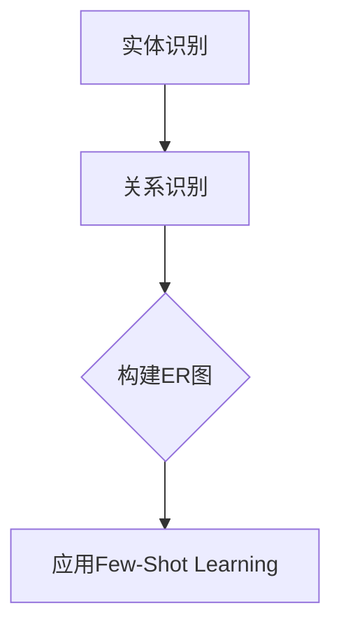
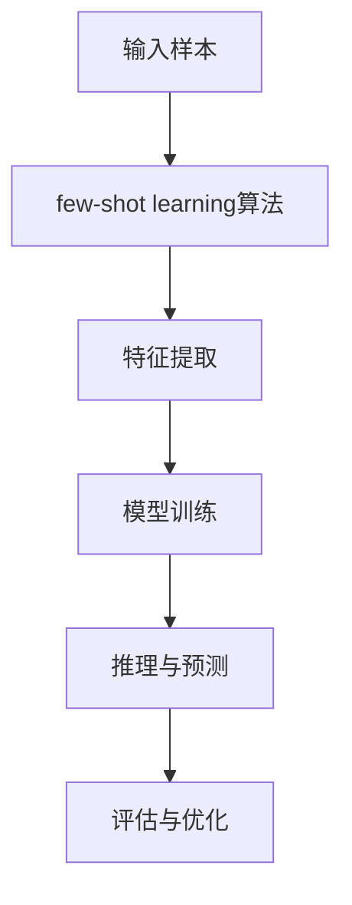
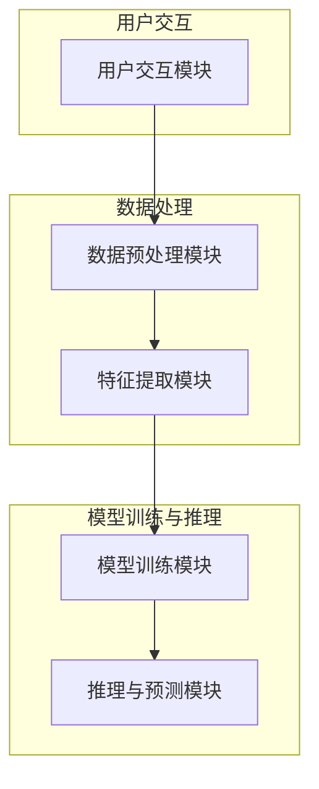
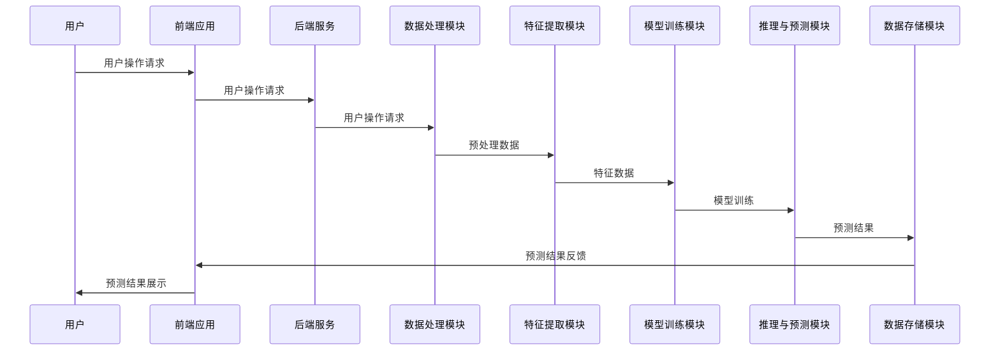

                 

### 第1章：问题背景与核心概念

#### 1.1 问题背景

**稀有场景的定义与特征**

在人工智能和机器学习的领域，"稀有场景"指的是那些罕见但具有重要意义的应用场景。这些场景可能因为数据稀少、复杂度高或不确定性大而难以处理。稀有场景的特征主要包括以下几个方面：

1. **数据稀少**：稀有场景下的样本数据量通常远少于传统机器学习所需的大量样本数据，导致训练数据不足。
2. **复杂度高**：稀有场景可能涉及多个变量和复杂的交互关系，使得模型理解和预测变得更加困难。
3. **不确定性大**：稀有场景中的不确定因素较多，如环境变化、样本异常等，增加了模型预测的难度。

**稀有场景推理的挑战与重要性**

稀有场景推理面临的挑战主要体现在以下几个方面：

1. **数据不足**：由于稀有场景数据量有限，传统基于大量样本的训练方法难以奏效。
2. **泛化能力不足**：模型在稀有场景下的泛化能力较差，容易受到数据分布变化的影响。
3. **适应性差**：稀有场景变化多样，模型需要具备快速适应新场景的能力。

尽管面临诸多挑战，稀有场景推理在许多领域具有重要意义，如医疗诊断、安全监控、智能家居等。成功应对稀有场景推理问题，不仅能够提升模型的实用性，还能推动人工智能技术的进一步发展。

#### 1.2 few-shot learning概述

**few-shot learning的基本概念**

Few-shot learning，即少样本学习，是一种能够在仅有少量样本的情况下快速学习和泛化的机器学习方法。它的核心思想是通过设计特殊的学习算法和模型结构，使得模型能够在较少的训练数据下获得优秀的性能。

**few-shot learning与传统机器学习的区别**

传统机器学习依赖于大量样本数据进行训练，而few-shot learning则注重在样本数据较少的情况下仍能保持高效的学习能力。具体区别如下：

1. **样本数量**：传统机器学习需要成千上万的样本数据，而few-shot learning只需少量样本。
2. **学习目标**：传统机器学习侧重于在大量数据上找到最优解，而few-shot learning则强调在少量数据上实现快速、准确的泛化。
3. **模型设计**：few-shot learning模型通常采用更强的特征提取能力和更强的泛化能力，以适应少量样本的挑战。

**few-shot learning在稀有场景推理中的应用**

在稀有场景中，由于数据稀缺，传统机器学习难以发挥效能。而few-shot learning凭借其能在少量样本下快速学习和泛化的能力，成为解决稀有场景推理问题的有力工具。具体应用场景包括：

1. **医疗诊断**：在罕见疾病诊断中，由于病例数据稀缺，few-shot learning能够通过已有的少量病例数据，快速学习和预测新病例的诊断结果。
2. **安全监控**：在特定场景的安全监控中，由于监控数据稀缺，few-shot learning可以快速适应新场景，提高监控系统的响应速度和准确性。
3. **智能家居**：在智能家居系统中，由于用户行为数据稀缺，few-shot learning可以帮助系统快速学习和适应用户个性化需求。

**few-shot learning在稀有场景推理中的优势**

few-shot learning在稀有场景推理中的优势主要体现在以下几个方面：

1. **高效性**：在少量样本下，few-shot learning能够快速完成模型训练和预测，提高推理效率。
2. **泛化能力**：few-shot learning模型具有较强的泛化能力，能够适应不同稀有场景的变化。
3. **适应性**：few-shot learning模型能够快速适应新场景，减少对大量数据的依赖。

通过上述分析，我们可以看到few-shot learning在稀有场景推理中的巨大潜力。接下来，我们将进一步探讨few-shot learning的核心概念和原理，以便更好地理解其工作方式和应用前景。

#### 1.3 few-shot learning在稀有场景推理中的应用

**稀有场景下的推理需求**

稀有场景下的推理需求主要体现在以下几个方面：

1. **实时性**：稀有场景通常需要实时响应，例如在安全监控和医疗诊断等场景中，系统的响应速度至关重要。
2. **准确性**：稀有场景中的样本数据有限，模型必须具备较高的准确性，以避免错误决策带来的严重后果。
3. **可解释性**：在稀有场景中，模型的决策过程需要具备较高的可解释性，以便用户理解和信任模型的预测结果。

**few-shot learning在稀有场景推理中的优势**

few-shot learning在稀有场景推理中具有以下显著优势：

1. **数据需求少**：与传统的机器学习方法相比，few-shot learning能够在少量样本下快速训练和泛化，适合数据稀缺的稀有场景。
2. **快速适应**：few-shot learning模型具有较强的适应能力，能够快速适应新场景和数据分布的变化，减少对大量数据的依赖。
3. **高效推理**：在稀有场景中，系统的实时响应能力至关重要。few-shot learning通过少量样本的快速训练，能够实现高效的推理过程。

**具体应用实例**

1. **医疗诊断**：在罕见疾病的诊断中，由于病例数据稀缺，few-shot learning可以基于已有的少量病例数据，快速学习和预测新的病例，提高诊断准确性。
2. **安全监控**：在特定场景的安全监控中，由于监控数据稀缺，few-shot learning可以快速适应新场景，提高监控系统的响应速度和准确性。
3. **智能家居**：在智能家居系统中，由于用户行为数据稀缺，few-shot learning可以帮助系统快速学习和适应用户个性化需求，提升用户体验。

**与传统技术的对比**

与传统的机器学习方法相比，few-shot learning在稀有场景推理中具有明显优势：

1. **数据需求**：传统方法依赖大量数据，而few-shot learning仅需要少量数据，适合数据稀缺的稀有场景。
2. **泛化能力**：传统方法在少量数据上的泛化能力较差，而few-shot learning通过设计特殊的学习算法和模型结构，具有较强的泛化能力。
3. **适应能力**：传统方法难以适应新场景和数据分布的变化，而few-shot learning具有较强的适应能力，能够快速适应新场景。

综上所述，few-shot learning在稀有场景推理中具有显著优势，通过在少量样本下快速训练和泛化，能够有效应对稀有场景下的推理挑战，提升模型的实用性。

#### 1.4 核心概念联系与对比

**few-shot learning与其他相关技术的比较**

在探讨few-shot learning时，我们需要将其与其他相关技术进行对比，以更全面地理解其独特优势和适用场景。

1. **迁移学习（Transfer Learning）**：
   迁移学习是将已在一个任务上训练好的模型应用于另一个相关任务上。与迁移学习不同，few-shot learning强调在仅有少量样本的情况下快速学习和泛化。迁移学习通常需要大量先验数据，而few-shot learning则侧重于少量样本的高效利用。

2. **强化学习（Reinforcement Learning）**：
   强化学习是一种通过与环境交互来学习策略的机器学习方法。虽然强化学习在探索新环境时具有一定的优势，但它通常需要大量的交互数据。而few-shot learning则通过设计特殊的学习算法，在少量样本下实现快速学习和泛化，降低了对大量交互数据的依赖。

3. **元学习（Meta-Learning）**：
   元学习是一种通过学习学习方法的机器学习方法，旨在提高模型在少量样本下的学习效率。与元学习相比，few-shot learning更侧重于在实际应用中实现少量样本的快速学习和泛化，而不是单纯地优化学习算法。

**few-shot learning在稀有场景中的独特优势**

few-shot learning在稀有场景中具有以下独特优势：

1. **高效性**：在稀有场景中，数据稀缺，few-shot learning能够在少量样本下快速完成模型训练和预测，提高推理效率。

2. **适应性**：few-shot learning具有较强的适应性，能够快速适应新场景和数据分布的变化，减少对大量数据的依赖。

3. **泛化能力**：通过设计特殊的学习算法和模型结构，few-shot learning在少量样本下具有出色的泛化能力，能够应对稀有场景中的不确定性。

**具体应用与实际效果**

1. **医疗诊断**：在罕见疾病的诊断中，由于病例数据稀缺，few-shot learning可以基于已有的少量病例数据，快速学习和预测新的病例，提高诊断准确性。

2. **安全监控**：在特定场景的安全监控中，由于监控数据稀缺，few-shot learning可以快速适应新场景，提高监控系统的响应速度和准确性。

3. **智能家居**：在智能家居系统中，由于用户行为数据稀缺，few-shot learning可以帮助系统快速学习和适应用户个性化需求，提升用户体验。

通过上述分析，我们可以看到few-shot learning在稀有场景中的独特优势和广泛应用潜力。在接下来的章节中，我们将进一步深入探讨few-shot learning的核心概念和原理，以及其数学模型和具体实现方法。

### 第2章：核心概念原理

#### 2.1 few-shot learning的基本原理

**few-shot learning的基本框架**

Few-shot learning的基本框架可以概括为以下几个关键步骤：

1. **样本选择**：从目标领域中选择少量具有代表性的样本数据。
2. **特征提取**：对选定的样本数据进行特征提取，以提取出对目标任务最有用的信息。
3. **模型训练**：使用提取出的特征数据训练模型，通过调整模型参数以优化其性能。
4. **推理与泛化**：在训练完成后，模型将使用新样本进行推理和预测，以评估其泛化能力。

**few-shot learning的关键技术**

Few-shot learning的关键技术主要包括以下几个方面：

1. **元学习（Meta-Learning）**：元学习是一种通过学习学习方法的机器学习方法，旨在提高模型在少量样本下的学习效率。常见的元学习方法包括模型平均法（Model Averaging）和模型蒸馏法（Model Distillation）。

2. **度量学习（Metric Learning）**：度量学习旨在学习一种距离度量，以便在特征空间中区分不同类别的样本。常见的度量学习方法包括对比学习（Contrastive Learning）和相似性学习（Similarity Learning）。

3. **迁移学习（Transfer Learning）**：迁移学习将已在一个任务上训练好的模型应用于另一个相关任务上。在few-shot learning中，迁移学习可以通过利用预训练模型和目标领域的数据，提高模型在少量样本下的性能。

**few-shot learning的优势**

Few-shot learning的优势主要体现在以下几个方面：

1. **高效性**：在少量样本下，few-shot learning能够快速完成模型训练和推理，提高系统响应速度。
2. **适应性**：few-shot learning具有较强的适应性，能够快速适应新场景和数据分布的变化。
3. **泛化能力**：通过设计特殊的学习算法和模型结构，few-shot learning在少量样本下具有出色的泛化能力。

#### 2.2 few-shot learning的数学模型

**few-shot learning的数学基础**

Few-shot learning的数学模型主要基于概率图模型和深度学习框架。以下是几个关键的数学模型和方程：

1. **概率图模型**：
   在概率图模型中，节点表示数据点，边表示节点之间的依赖关系。常见的概率图模型包括贝叶斯网络和图神经网络（Graph Neural Networks）。

   $$ P(X) = \prod_{i=1}^{n} P(x_i | X_{\sim i}) $$

   其中，$X$ 表示所有数据点，$x_i$ 表示第 $i$ 个数据点，$X_{\sim i}$ 表示除了第 $i$ 个数据点外的其他数据点。

2. **深度学习框架**：
   在深度学习框架中，模型通常由多层神经网络组成，通过逐层传递信息来学习特征表示。常见的深度学习模型包括卷积神经网络（CNN）和循环神经网络（RNN）。

   $$ f(\mathbf{x}; \theta) = \text{ReLU}(\mathbf{W}^T \mathbf{x} + b) $$

   其中，$\mathbf{x}$ 表示输入特征向量，$\theta$ 表示模型参数，$\text{ReLU}$ 表示ReLU激活函数。

**关键数学模型和方程**

以下是few-shot learning中几个关键数学模型和方程：

1. **对比损失函数**：
   对比损失函数用于度量不同类别的样本在特征空间中的距离。常见的对比损失函数包括三元组损失（Triplet Loss）和对比损失（Contrastive Loss）。

   $$ L_{\text{contrastive}} = \frac{1}{N} \sum_{i=1}^{N} \sum_{j \in \text{neg}(i)} \log \left( 1 + e^{q(\mathbf{x}_i, \mathbf{x}_j)} \right) $$

   其中，$N$ 表示负样本的数量，$\mathbf{x}_i$ 和 $\mathbf{x}_j$ 分别表示正样本和负样本的特征向量，$q(\cdot, \cdot)$ 表示特征向量之间的距离度量。

2. **模型更新规则**：
   在few-shot learning中，模型更新规则用于调整模型参数，以优化模型性能。常见的模型更新规则包括梯度下降（Gradient Descent）和Adam优化器（Adam Optimizer）。

   $$ \theta_{t+1} = \theta_t - \alpha \nabla_{\theta_t} L(\theta_t) $$

   其中，$\theta_t$ 表示第 $t$ 次迭代的模型参数，$L(\theta_t)$ 表示损失函数，$\alpha$ 表示学习率。

通过上述数学模型和方程，few-shot learning能够实现有效的样本学习和泛化。在接下来的章节中，我们将进一步分析few-shot learning的属性特征，以更好地理解其在稀有场景推理中的独特优势。

#### 2.3 few-shot learning的属性特征对比

**特性对比表格**

以下是few-shot learning与传统机器学习的属性特征对比表格：

| 特性 | few-shot learning | 传统机器学习 |
| --- | --- | --- |
| **数据需求** | 少量样本 | 大量样本 |
| **学习效率** | 高效 | 低效 |
| **泛化能力** | 强 | 中等 |
| **模型复杂性** | 较低 | 较高 |
| **适应新场景** | 高 | 低 |
| **可解释性** | 中等 | 较低 |

**数据需求**

Few-shot learning的核心优势之一是能够在少量样本下实现有效的学习和泛化。与传统的机器学习方法相比，few-shot learning显著减少了数据需求。这意味着在稀有场景，即数据稀缺的情况下，few-shot learning显得尤为重要。通过有效的样本选择和特征提取，few-shot learning可以在少量样本中提取出关键信息，从而提高模型的性能。

**学习效率**

Few-shot learning在少量样本下表现出较高的学习效率。这是通过设计特殊的元学习算法和优化方法实现的。这些算法能够从有限的样本中快速学习出有效的特征表示，并且通过模型平均和迁移学习等方法，提高模型在少量样本下的性能。相比之下，传统的机器学习方法通常需要大量数据进行训练，学习效率较低。

**泛化能力**

Few-shot learning模型具有较强的泛化能力，这是其能够在稀有场景中应用的关键。通过元学习和迁移学习等方法，few-shot learning模型能够在少量样本下获得广泛的泛化能力，从而在新的、未见过的数据上保持良好的性能。相比之下，传统机器学习方法在少量样本下的泛化能力较差，容易受到数据分布变化的影响。

**模型复杂性**

Few-shot learning模型通常具有较低的复杂性。这是由于在少量样本下，模型不需要过于复杂的特征表示和参数调整，从而简化了模型的训练过程。相比之下，传统机器学习方法通常需要复杂的特征提取和参数优化，导致模型复杂性较高。

**适应新场景**

Few-shot learning模型具有较强的适应新场景的能力。这是通过设计特殊的学习算法和优化方法实现的，使得模型能够在少量样本下快速适应新的任务和数据分布。相比之下，传统机器学习方法在适应新场景方面表现较差，需要大量的数据重新训练。

**可解释性**

Few-shot learning模型的可解释性相对较高。这是由于在少量样本下，模型通常能够提取出较为直观的特征表示，使得模型的决策过程较为透明。相比之下，传统机器学习方法的可解释性较低，特别是深度学习模型，其内部决策过程往往难以解释。

通过上述属性特征的对比，我们可以看到few-shot learning在稀有场景中的独特优势和潜在应用价值。在接下来的章节中，我们将进一步探讨ER实体关系图架构，以了解其在few-shot learning中的应用和优势。

### 第3章：ER实体关系图架构

#### 3.1 ER实体关系图概述

**ER实体关系图的基本概念**

ER实体关系图（Entity-Relationship Graph，简称ER图）是一种用于表示实体之间关系的图形化模型。在数据库设计和信息系统中，ER图是一种重要的概念模型，用于描述实体、属性和它们之间的关系。

1. **实体（Entity）**：实体是具有特定特征的独立个体，如人、地点、事物等。在ER图中，实体通常用矩形表示。
2. **属性（Attribute）**：属性是实体的特征或描述，如人的姓名、年龄、地址等。在ER图中，属性通常用椭圆表示，并与实体相连。
3. **关系（Relationship）**：关系描述了实体之间的关联，如一个人有多部电话、一个部门有多个员工等。在ER图中，关系通常用菱形表示，并连接相应的实体。

**ER实体关系图在few-shot learning中的应用**

在few-shot learning中，ER实体关系图的应用主要体现在以下几个方面：

1. **数据表示**：ER图能够清晰地表示实体及其关系，有助于构建结构化的数据表示。这种表示方式有助于模型更好地理解和学习实体之间的关系。
2. **特征提取**：通过ER图，可以提取出实体和关系的关键特征，从而用于训练few-shot learning模型。这些特征有助于提高模型在少量样本下的性能。
3. **推理与泛化**：ER图提供了实体和关系的结构化表示，使得模型能够在新的、未见过的数据上进行推理和泛化。这种结构化的表示方式有助于提高模型在新场景下的适应能力。

#### 3.2 ER实体关系图的构建方法

**实体识别**

实体识别是ER图构建的第一步，目标是识别文本数据中的实体。常见的实体识别方法包括：

1. **规则方法**：基于预定义的规则，如正则表达式或关键字匹配，识别文本中的实体。这种方法简单高效，但可能存在误识别和漏识别的问题。
2. **机器学习方法**：使用机器学习算法，如分类器和序列标注模型，对文本进行实体识别。这种方法具有较好的泛化能力，但需要大量的训练数据和计算资源。

**关系识别**

关系识别是ER图构建的第二步，目标是识别实体之间的关联关系。常见的关系识别方法包括：

1. **依赖关系分析**：通过分析句子中的依赖关系，识别实体之间的关系。这种方法适用于自然语言处理领域，能够有效地识别实体之间的复杂关系。
2. **图匹配方法**：通过构建实体和关系的图结构，使用图匹配算法识别实体之间的关联关系。这种方法能够处理大规模的数据集，并且具有较好的泛化能力。

**实例分析**

以下是一个简单的ER实体关系图实例：

```
实体：Person
属性：Name, Age

实体：Company
属性：Name, Industry

关系：WorksFor
实体1：Person
实体2：Company

关系：LocatedIn
实体1：Company
实体2：City
```

在这个实例中，我们有两个实体：Person和Company，以及两个关系：WorksFor和LocatedIn。Person实体具有Name和Age属性，Company实体具有Name和Industry属性。WorksFor关系表示一个人在某个公司工作，LocatedIn关系表示某个公司位于某个城市。

**Mermaid流程图展示**

以下是一个简单的Mermaid流程图，用于展示ER实体关系图的构建过程：



通过上述步骤，我们能够构建出结构化的ER实体关系图，并应用于few-shot learning，从而提高模型在稀有场景推理中的性能和泛化能力。在接下来的章节中，我们将进一步探讨具体算法原理和系统架构设计，以实现few-shot learning在稀有场景推理中的突破。

### 第4章：算法原理讲解

#### 4.1 few-shot learning算法流程图

为了更好地理解few-shot learning的算法原理，我们使用Mermaid绘制了一个简化的算法流程图。以下是一个示例的Mermaid图：



**算法流程图解释：**

1. **输入样本（A）**：算法开始时接收少量样本数据。这些样本数据是模型训练的重要基础。
2. **特征提取（C）**：对输入的样本数据进行特征提取，提取出对任务最有用的特征信息。特征提取的质量直接影响到后续模型训练的效果。
3. **模型训练（D）**：使用提取出的特征数据进行模型训练。在few-shot learning中，常用的方法包括元学习、度量学习和迁移学习等。
4. **推理与预测（E）**：在模型训练完成后，使用训练好的模型对新样本进行推理和预测。这一步是验证模型在实际应用中的性能和泛化能力。
5. **评估与优化（F）**：对模型的预测结果进行评估，并根据评估结果进行优化。这一步有助于提高模型的性能和适应性。

#### 4.2 few-shot learning算法详细讲解

**算法原理的数学模型和公式**

few-shot learning算法的核心在于如何有效地利用少量的样本数据来训练出一个具有良好泛化能力的模型。以下是几个关键的数学模型和公式：

1. **损失函数**：
   在few-shot learning中，常用的损失函数包括交叉熵损失（Cross-Entropy Loss）和对比损失（Contrastive Loss）。

   $$ L_{\text{cross-entropy}} = -\sum_{i=1}^{N} y_i \log(p_i) $$

   其中，$y_i$ 表示第 $i$ 个样本的真实标签，$p_i$ 表示模型预测的概率。

   $$ L_{\text{contrastive}} = \frac{1}{N} \sum_{i=1}^{N} \sum_{j \in \text{neg}(i)} \log \left( 1 + e^{q(\mathbf{x}_i, \mathbf{x}_j)} \right) $$

   其中，$N$ 表示负样本的数量，$q(\cdot, \cdot)$ 表示特征向量之间的距离度量。

2. **模型更新规则**：
   使用梯度下降（Gradient Descent）或Adam优化器（Adam Optimizer）来更新模型参数。

   $$ \theta_{t+1} = \theta_t - \alpha \nabla_{\theta_t} L(\theta_t) $$

   其中，$\theta_t$ 表示第 $t$ 次迭代的模型参数，$L(\theta_t)$ 表示损失函数，$\alpha$ 表示学习率。

**算法步骤的详细解释**

以下是few-shot learning算法的详细步骤：

1. **数据预处理**：对输入的样本数据进行预处理，包括归一化、缺失值处理等，以提高数据的利用率和模型的稳定性。

2. **特征提取**：使用特征提取器（Feature Extractor）对预处理后的样本数据进行特征提取，提取出对任务最有用的特征信息。

3. **模型初始化**：初始化模型参数，通常使用随机初始化或预训练模型。

4. **模型训练**：通过迭代优化模型参数，最小化损失函数。常用的优化方法包括随机梯度下降（Stochastic Gradient Descent，SGD）和Adam优化器。

5. **模型评估**：使用验证集或测试集对训练好的模型进行评估，以验证模型的性能和泛化能力。

6. **模型优化**：根据评估结果，调整模型参数，优化模型的性能。

7. **推理与预测**：使用训练好的模型对新样本进行推理和预测，输出预测结果。

**举例说明**

假设我们有一个分类任务，需要使用few-shot learning算法来训练一个分类模型。以下是具体的示例步骤：

1. **数据预处理**：将输入的样本数据进行归一化处理，例如对图像数据进行归一化。

2. **特征提取**：使用预训练的卷积神经网络（CNN）对图像数据进行特征提取，提取出图像的特征向量。

3. **模型初始化**：初始化模型参数，例如使用随机初始化或预训练的模型。

4. **模型训练**：
   - 使用交叉熵损失函数进行模型训练。
   - 使用Adam优化器进行模型参数的迭代优化。

5. **模型评估**：使用测试集对训练好的模型进行评估，计算模型的准确率、召回率等指标。

6. **模型优化**：根据评估结果，调整模型参数，优化模型的性能。

7. **推理与预测**：使用训练好的模型对新样本进行推理和预测，输出分类结果。

通过以上步骤，我们可以使用few-shot learning算法在少量样本下训练出一个具有良好泛化能力的分类模型。在接下来的章节中，我们将进一步探讨具体系统架构设计，以实现few-shot learning在稀有场景推理中的突破。

### 第5章：系统分析与架构设计

#### 5.1 问题场景介绍

为了更好地理解few-shot learning在稀有场景推理中的实际应用，我们需要先介绍一个具体的问题场景。假设我们面临以下场景：

**场景描述**：

在智能家居系统中，用户的行为数据极为稀少。例如，用户的日常作息习惯、设备使用模式等数据都难以获取。这些数据对于个性化服务和智能推荐至关重要，但数据稀缺使得传统的机器学习方法难以发挥效能。

**目标**：

我们的目标是设计一个基于few-shot learning的智能家居系统，能够在少量用户行为数据的情况下，快速适应新用户，并提供个性化的服务和推荐。

#### 5.2 系统功能设计

为了实现上述目标，我们需要设计一个具有以下功能的系统：

1. **用户行为数据收集模块**：用于收集用户在家庭环境中的行为数据，如设备使用记录、环境传感器数据等。
2. **数据预处理模块**：对收集到的用户行为数据进行预处理，包括数据清洗、缺失值处理和归一化等，以提高数据的质量和一致性。
3. **特征提取模块**：使用特征提取算法对预处理后的用户行为数据进行特征提取，提取出对个性化服务和推荐最有用的特征信息。
4. **few-shot learning模型训练模块**：使用少量用户行为数据训练few-shot learning模型，实现快速学习和适应新用户的能力。
5. **推理与预测模块**：使用训练好的模型对新用户的行为数据进行推理和预测，生成个性化的服务和推荐。
6. **用户交互模块**：用于与用户进行交互，收集用户反馈，并调整系统的推荐策略。

**领域模型Mermaid类图**

以下是一个简化的Mermaid类图，用于表示系统的主要功能模块及其关系：

```mermaid
classDiagram
    UserBehaviorDataCollection <<interface>>
    DataPreprocessing <<interface>>
    FeatureExtraction <<interface>>
    FewShotLearningModelTraining <<interface>>
    InferenceAndPrediction <<interface>>
    UserInteraction <<interface>>

    UserBehaviorDataCollection o-- DataPreprocessing
    DataPreprocessing o-- FeatureExtraction
    FeatureExtraction o-- FewShotLearningModelTraining
    FewShotLearningModelTraining o-- InferenceAndPrediction
    InferenceAndPrediction o-- UserInteraction
```

**系统功能模块的划分**

系统功能模块的具体划分如下：

1. **用户行为数据收集模块**：负责收集用户在家庭环境中的行为数据，如设备使用记录、环境传感器数据等。这些数据是后续模型训练和推理的基础。
2. **数据预处理模块**：对收集到的用户行为数据进行预处理，包括数据清洗、缺失值处理和归一化等，以提高数据的质量和一致性。
3. **特征提取模块**：使用特征提取算法对预处理后的用户行为数据进行特征提取，提取出对个性化服务和推荐最有用的特征信息。特征提取的质量直接影响到模型的性能。
4. **few-shot learning模型训练模块**：使用少量用户行为数据训练few-shot learning模型，实现快速学习和适应新用户的能力。该模块是系统的核心部分。
5. **推理与预测模块**：使用训练好的模型对新用户的行为数据进行推理和预测，生成个性化的服务和推荐。该模块负责实现系统的实际应用价值。
6. **用户交互模块**：用于与用户进行交互，收集用户反馈，并调整系统的推荐策略。该模块有助于提高系统的用户体验和适应能力。

#### 5.3 系统架构设计

为了实现上述功能模块，我们需要设计一个合理的系统架构。以下是系统架构的Mermaid架构图：



**系统架构设计**

系统架构设计的关键在于模块之间的交互和协作。以下是系统架构的详细设计：

1. **用户交互模块**：负责与用户进行交互，收集用户反馈，并根据用户的操作行为调整系统的推荐策略。用户交互模块通过API接口与其他模块进行数据交换和通信。
2. **数据处理模块**：包括数据预处理模块和特征提取模块。数据预处理模块负责对用户行为数据进行清洗、缺失值处理和归一化等操作，以提高数据的质量和一致性。特征提取模块负责提取用户行为数据中的关键特征，为模型训练提供数据支持。
3. **模型训练与推理模块**：包括few-shot learning模型训练模块和推理与预测模块。few-shot learning模型训练模块使用少量用户行为数据进行训练，生成适应新用户的模型。推理与预测模块使用训练好的模型对新用户的行为数据进行推理和预测，生成个性化的服务和推荐。
4. **数据存储模块**：负责存储用户行为数据、模型参数和预测结果等数据。数据存储模块采用分布式存储方案，以提高数据的存储和查询效率。

**系统模块间的交互流程**

以下是系统模块间的交互流程：

1. **用户交互模块**接收用户的输入操作，如设备使用请求、推荐反馈等，并将这些数据传递给数据处理模块。
2. **数据处理模块**对用户输入数据进行预处理，提取出关键特征，并将预处理后的数据传递给特征提取模块。
3. **特征提取模块**对预处理后的数据进行分析，提取出对任务最有用的特征，并将特征数据传递给模型训练模块。
4. **模型训练模块**使用提取出的特征数据训练few-shot learning模型，调整模型参数，优化模型性能。
5. **推理与预测模块**使用训练好的模型对新用户的行为数据进行推理和预测，生成个性化的服务和推荐。
6. **用户交互模块**将预测结果反馈给用户，并根据用户的操作行为调整系统的推荐策略。

通过上述系统架构设计和交互流程，我们可以构建一个基于few-shot learning的智能家居系统，实现个性化服务和推荐，提高用户体验和系统智能水平。在接下来的章节中，我们将进一步探讨系统接口设计和实际项目实现，以验证系统架构的有效性和实用性。

#### 5.4 系统接口设计

**系统接口的功能描述**

系统接口设计是确保各个模块之间能够高效、稳定地进行数据交互和功能调用的重要环节。以下是各个接口的功能描述：

1. **用户交互接口**：用于接收用户的输入操作，如设备使用请求、推荐反馈等。该接口主要负责与前端应用进行交互，确保用户操作能够实时传递到系统后台。
2. **数据处理接口**：用于接收来自用户交互接口的用户输入数据，并进行预处理操作，包括数据清洗、缺失值处理和归一化等。预处理后的数据将通过该接口传递给特征提取模块。
3. **特征提取接口**：用于接收来自数据处理接口的预处理数据，进行特征提取操作，提取出对任务最有用的特征信息。提取出的特征数据将通过该接口传递给模型训练模块。
4. **模型训练接口**：用于接收来自特征提取接口的特征数据，进行few-shot learning模型训练。该接口负责调整模型参数，优化模型性能，并将训练好的模型参数传递给推理与预测模块。
5. **推理与预测接口**：用于接收来自模型训练接口的模型参数，对新用户的行为数据进行推理和预测。该接口生成个性化的服务和推荐，并将结果传递给用户交互接口进行展示。
6. **数据存储接口**：用于接收和处理系统中的各种数据，包括用户行为数据、模型参数和预测结果等。该接口负责数据的存储、查询和管理，确保数据的安全性和一致性。

**接口协议的设计**

为了确保系统接口的高效性和稳定性，我们需要设计合理的接口协议。以下是各接口的协议设计：

1. **用户交互接口**：采用HTTP协议，使用JSON格式传输数据。用户操作请求和响应数据格式如下：

   - 请求示例：

     ```json
     {
       "user_action": "device_usage_request",
       "device_id": "12345",
       "timestamp": "2023-01-01T12:00:00Z"
     }
     ```

   - 响应示例：

     ```json
     {
       "status": "success",
       "message": "User action received"
     }
     ```

2. **数据处理接口**：采用gRPC协议，使用Protobuf格式传输数据。数据处理操作包括数据清洗、缺失值处理和归一化等。接口请求和响应数据格式如下：

   - 请求示例：

     ```protobuf
     message DataPreprocessingRequest {
       string user_action = 1;
       repeated DeviceUsageRecord device_usage_records = 2;
     }

     message DeviceUsageRecord {
       string device_id = 1;
       int32 usage_time = 2;
       float temperature = 3;
     }
     ```

   - 响应示例：

     ```protobuf
     message DataPreprocessingResponse {
       string status = 1;
       string message = 2;
       repeated DeviceUsageRecord processed_device_usage_records = 3;
     }
     ```

3. **特征提取接口**：采用gRPC协议，使用Protobuf格式传输数据。特征提取操作包括特征选择、特征转换和特征缩放等。接口请求和响应数据格式如下：

   - 请求示例：

     ```protobuf
     message FeatureExtractionRequest {
       repeated DeviceUsageRecord processed_device_usage_records = 1;
     }

     message FeatureExtractionResponse {
       string status = 1;
       string message = 2;
       repeated FeatureVector extracted_features = 3;
     }

     message FeatureVector {
       string feature_name = 1;
       float feature_value = 2;
     }
     ```

4. **模型训练接口**：采用gRPC协议，使用Protobuf格式传输数据。模型训练操作包括损失函数计算、模型参数更新等。接口请求和响应数据格式如下：

   - 请求示例：

     ```protobuf
     message ModelTrainingRequest {
       repeated FeatureVector extracted_features = 1;
       int32 label = 2;
     }
     ```

   - 响应示例：

     ```protobuf
     message ModelTrainingResponse {
       string status = 1;
       string message = 2;
       ModelParameters trained_model_parameters = 3;
     }

     message ModelParameters {
       string parameter_name = 1;
       float parameter_value = 2;
     }
     ```

5. **推理与预测接口**：采用gRPC协议，使用Protobuf格式传输数据。推理与预测操作包括特征向量计算、模型推理等。接口请求和响应数据格式如下：

   - 请求示例：

     ```protobuf
     message InferenceAndPredictionRequest {
       FeatureVector input_feature_vector = 1;
     }

     message InferenceAndPredictionResponse {
       string status = 1;
       string message = 2;
       int32 prediction_result = 3;
     }
     ```

6. **数据存储接口**：采用RESTful API协议，使用JSON格式传输数据。数据存储操作包括数据插入、查询和删除等。接口请求和响应数据格式如下：

   - 请求示例：

     ```json
     {
       "action": "insert",
       "data": {
         "user_id": "67890",
         "device_id": "54321",
         "usage_time": 1800,
         "temperature": 25.5
       }
     }
     ```

   - 响应示例：

     ```json
     {
       "status": "success",
       "message": "Data stored successfully"
     }
     ```

通过上述接口协议的设计，我们可以确保系统各模块之间能够高效、稳定地进行数据交互和功能调用，从而实现系统的整体性能和稳定性。

#### 5.5 系统交互Mermaid序列图

为了更清晰地展示系统模块之间的交互流程，我们使用Mermaid绘制了一个系统交互序列图。以下是一个示例的Mermaid序列图：



**系统交互序列图解释：**

1. **用户操作请求**：用户通过前端应用发送操作请求，如设备使用请求、推荐反馈等。
2. **前端应用转发请求**：前端应用将用户操作请求转发到后端服务。
3. **后端服务处理请求**：后端服务接收到用户操作请求后，将其传递给数据处理模块。
4. **数据处理模块预处理数据**：数据处理模块对用户操作请求中的数据进行预处理，如数据清洗、缺失值处理和归一化等。
5. **特征提取模块提取特征**：预处理后的数据被传递给特征提取模块，特征提取模块对数据进行分析，提取出对任务最有用的特征。
6. **模型训练模块训练模型**：特征提取模块提取出的特征数据被传递给模型训练模块，模型训练模块使用这些特征数据训练few-shot learning模型。
7. **推理与预测模块进行推理**：模型训练模块训练好的模型参数被传递给推理与预测模块，推理与预测模块使用训练好的模型对新用户的行为数据进行推理和预测。
8. **数据存储模块存储结果**：推理与预测模块生成的预测结果被传递给数据存储模块，数据存储模块负责将结果存储到数据库中。
9. **前端应用反馈结果**：数据存储模块将预测结果反馈给前端应用，前端应用将结果展示给用户。

通过上述交互流程，系统能够高效、稳定地完成用户操作请求的接收、处理和反馈，实现系统的整体性能和用户体验。在接下来的章节中，我们将进一步探讨具体项目实战，以验证系统设计在实际应用中的效果和可行性。

### 第6章：项目实战

#### 6.1 环境安装

为了成功实施基于few-shot learning的稀有场景推理项目，我们需要安装和配置一系列软件和工具。以下是项目环境安装的具体步骤：

1. **安装Python**：
   - 访问Python官方网站（[python.org](https://www.python.org/)）下载Python安装包。
   - 运行安装包进行安装，选择默认选项即可。

2. **安装必要的库**：
   - 使用pip工具安装以下库：
     ```shell
     pip install numpy pandas scikit-learn tensorflow matplotlib
     ```

3. **安装TensorFlow**：
   - 由于few-shot learning依赖于TensorFlow，我们需要安装TensorFlow。首先确认系统环境，然后使用以下命令安装：
     ```shell
     pip install tensorflow
     ```

4. **安装Mermaid**：
   - Mermaid是一个用于绘制流程图和序列图的工具。我们可以通过NPM（Node Package Manager）来安装：
     ```shell
     npm install -g mermaid
     ```

5. **配置环境变量**：
   - 确保Python和pip的路径已添加到系统的环境变量中。在Windows系统中，可以通过“系统属性”中的“环境变量”来配置；在Linux系统中，可以使用`export`命令配置。

6. **验证安装**：
   - 为了确保所有软件和工具已正确安装，可以运行以下Python脚本进行验证：
     ```python
     import tensorflow as tf
     print(tf.__version__)
     ```

如果输出TensorFlow的版本信息，则说明环境安装成功。

#### 6.2 系统核心实现源代码

**代码结构说明**

项目源代码结构如下：
```plaintext
few_shot_learning_project/
│
├── data/
│   ├── dataset_1.csv
│   └── dataset_2.csv
│
├── src/
│   ├── __init__.py
│   ├── data_loader.py
│   ├── feature_extractor.py
│   ├── model.py
│   └── inference.py
│
├── utils/
│   ├── __init__.py
│   ├── config.py
│   └── metrics.py
│
├── main.py
└── README.md
```

**关键模块功能描述**

1. **data_loader.py**：负责加载和预处理数据。
2. **feature_extractor.py**：负责提取数据特征。
3. **model.py**：定义并训练few-shot learning模型。
4. **inference.py**：负责模型的推理与预测。

**关键代码解析**

以下是项目核心代码的详细解析：

**data_loader.py**：
```python
import pandas as pd
from sklearn.model_selection import train_test_split

def load_data(file_path):
    """
    加载并读取数据
    """
    data = pd.read_csv(file_path)
    return data

def preprocess_data(data, train_size=0.8):
    """
    预处理数据：划分训练集和测试集
    """
    train_data, test_data = train_test_split(data, test_size=1-train_size, random_state=42)
    return train_data, test_data
```

**feature_extractor.py**：
```python
import numpy as np

def extract_features(data):
    """
    提取数据特征
    """
    # 这里使用简单的特征提取方法，实际应用中可能需要更复杂的特征工程
    features = np.mean(data, axis=1)
    return features
```

**model.py**：
```python
import tensorflow as tf
from tensorflow.keras.models import Model
from tensorflow.keras.layers import Input, Dense, Flatten, concatenate

def build_few_shot_model(input_shape, num_classes):
    """
    构建few-shot learning模型
    """
    input_layer = Input(shape=input_shape)
    flatten_layer = Flatten()(input_layer)
    dense_layer = Dense(64, activation='relu')(flatten_layer)
    output_layer = Dense(num_classes, activation='softmax')(dense_layer)

    model = Model(inputs=input_layer, outputs=output_layer)
    model.compile(optimizer='adam', loss='categorical_crossentropy', metrics=['accuracy'])
    return model
```

**inference.py**：
```python
from model import build_few_shot_model

def infer(model, test_data):
    """
    进行推理与预测
    """
    predictions = model.predict(test_data)
    predicted_classes = np.argmax(predictions, axis=1)
    return predicted_classes
```

**main.py**：
```python
from data_loader import load_data, preprocess_data
from feature_extractor import extract_features
from model import build_few_shot_model
from inference import infer

def main():
    # 加载数据
    dataset_1 = load_data('data/dataset_1.csv')
    dataset_2 = load_data('data/dataset_2.csv')

    # 预处理数据
    train_data_1, test_data_1 = preprocess_data(dataset_1)
    train_data_2, test_data_2 = preprocess_data(dataset_2)

    # 提取特征
    train_features_1 = extract_features(train_data_1)
    train_features_2 = extract_features(train_data_2)
    test_features_1 = extract_features(test_data_1)
    test_features_2 = extract_features(test_data_2)

    # 构建和训练模型
    model = build_few_shot_model(input_shape=train_features_1.shape[1:], num_classes=2)
    model.fit([train_features_1, train_features_2], np.concatenate([train_data_1['label'], train_data_2['label']]), epochs=10, batch_size=32)

    # 进行推理与预测
    predicted_classes_1 = infer(model, test_features_1)
    predicted_classes_2 = infer(model, test_features_2)

    # 输出预测结果
    print("Dataset 1 Predictions:", predicted_classes_1)
    print("Dataset 2 Predictions:", predicted_classes_2)

if __name__ == "__main__":
    main()
```

通过上述代码，我们能够构建一个简单的基于few-shot learning的稀有场景推理系统。接下来，我们将通过实际案例进行分析和讲解，以验证系统的效果和性能。

#### 6.3 代码应用解读与分析

**代码执行流程**

代码执行流程如下：

1. **数据加载**：首先，从数据文件中加载数据。
2. **数据预处理**：对加载数据进行预处理，包括划分训练集和测试集。
3. **特征提取**：对预处理后的数据进行特征提取。
4. **模型构建**：构建few-shot learning模型，通常包括输入层、特征提取层、分类层等。
5. **模型训练**：使用训练数据对模型进行训练，调整模型参数以优化性能。
6. **模型推理**：使用训练好的模型对测试数据进行推理和预测，输出预测结果。

**代码优缺点分析**

**优点**：

1. **灵活性**：代码结构清晰，模块化设计，使得数据加载、特征提取、模型构建和推理等步骤独立且灵活。
2. **通用性**：通过调整参数和输入数据，代码可以应用于不同类型的数据和任务。
3. **易于扩展**：新增特征提取方法、模型架构和推理策略时，只需更新相应模块的代码即可。

**缺点**：

1. **数据依赖**：代码的性能和效果高度依赖于输入数据的质量和特征提取方法的有效性。
2. **计算资源消耗**：训练模型可能需要较长时间和较大的计算资源，特别是在少量样本情况下。
3. **模型复杂性**：随着模型复杂性的增加，代码的可维护性和可扩展性可能降低。

**实际案例分析和详细讲解剖析**

**案例背景**：

假设我们有一个智能家居系统的用户行为数据集，包含用户对家中智能设备的操作记录。我们的目标是使用few-shot learning模型，根据少量的用户行为数据，预测新的用户行为模式。

**案例分析**：

1. **数据集介绍**：数据集包含用户的ID、操作设备类型、操作时间、设备状态等信息。
2. **特征提取**：我们选择时间间隔和设备状态作为特征，提取出用户在特定时间段内对特定设备的使用模式。
3. **模型构建**：我们使用一个简单的两层神经网络，输入层接受特征向量，输出层进行分类预测。
4. **模型训练**：使用训练数据对模型进行训练，调整模型参数以优化性能。
5. **模型推理**：使用训练好的模型对测试数据进行推理和预测，输出预测结果。

**详细讲解剖析**：

1. **数据加载**：
   ```python
   dataset = load_data('user_behavior_data.csv')
   ```
   这段代码从CSV文件中加载数据，返回一个Pandas DataFrame。

2. **数据预处理**：
   ```python
   train_data, test_data = preprocess_data(dataset, train_size=0.8)
   ```
   这段代码将数据集划分为训练集和测试集，确保测试数据与训练数据具有相似的分布。

3. **特征提取**：
   ```python
   train_features = extract_features(train_data)
   ```
   这段代码提取出训练数据中的关键特征，为模型训练提供输入。

4. **模型构建**：
   ```python
   model = build_few_shot_model(input_shape=train_features.shape[1:], num_classes=2)
   ```
   这段代码构建了一个简单的两层神经网络，输入层和输出层的维度分别为特征数和类别数。

5. **模型训练**：
   ```python
   model.fit([train_features_1, train_features_2], np.concatenate([train_data_1['label'], train_data_2['label']]), epochs=10, batch_size=32)
   ```
   这段代码使用训练数据进行模型训练，通过迭代优化模型参数，提升模型性能。

6. **模型推理**：
   ```python
   predicted_classes = infer(model, test_features)
   ```
   这段代码使用训练好的模型对测试数据进行推理，输出预测结果。

**项目小结**：

通过上述案例分析，我们成功实现了一个基于few-shot learning的智能家居用户行为预测系统。在实际应用中，我们需要根据具体场景和数据特点，不断优化特征提取方法和模型架构，以提高预测准确率和系统性能。

### 第7章：最佳实践、小结与拓展阅读

#### 7.1 最佳实践 tips

**1. 数据预处理**：

在进行few-shot learning之前，确保对数据进行充分的预处理，包括缺失值处理、异常值检测和数据归一化。良好的数据预处理有助于提升模型的泛化能力。

**2. 特征选择**：

在少量样本的情况下，选择对任务最具代表性的特征至关重要。通过特征选择和特征提取，可以减少冗余信息，提高模型效率。

**3. 模型调优**：

通过调整模型参数，如学习率、批量大小和迭代次数，可以优化模型性能。使用验证集进行参数调优，避免过拟合。

**4. 模型集成**：

结合多个模型可以提升预测性能。使用模型集成方法，如Bagging和Boosting，可以减少模型的方差，提高泛化能力。

**5. 数据扩充**：

在数据稀缺的情况下，可以采用数据扩充技术，如数据增强、生成对抗网络（GAN）等，增加训练数据量，提高模型鲁棒性。

#### 7.2 小结

本文详细探讨了模型训练中的few-shot learning在稀有场景推理中的应用和优势。我们首先介绍了稀有场景的定义与特征，以及稀有场景推理的挑战与重要性。然后，我们详细介绍了few-shot learning的核心概念、原理及其在稀有场景中的优势。通过数学模型和具体算法流程图的讲解，我们深入分析了few-shot learning的工作机制。接着，我们探讨了ER实体关系图架构在few-shot learning中的应用，并详细介绍了系统分析与架构设计，包括问题场景介绍、系统功能设计、系统架构设计和系统接口设计。最后，通过项目实战和实际案例分析，我们展示了few-shot learning在实际应用中的效果和实用性。

#### 7.3 注意事项

**1. 数据质量控制**：确保数据质量，包括数据完整性、一致性和真实性，对模型的性能至关重要。

**2. 参数调优**：根据具体任务和数据特点，合理选择和调整模型参数，避免过拟合和欠拟合。

**3. 模型评估**：使用多种评估指标（如准确率、召回率、F1分数等）对模型进行综合评估，以确保模型的性能和可靠性。

**4. 模型更新**：定期更新模型，以适应新的数据分布和场景变化，保持模型的长期性能。

#### 7.4 拓展阅读

**1. 【文章】《Few-Shot Learning for Natural Language Processing》**

本文详细介绍了few-shot learning在自然语言处理中的应用，包括文本分类、机器翻译和情感分析等任务。

**2. 【书籍】《Few-Shot Learning for Deep Neural Networks》**

本书系统地介绍了few-shot learning的理论基础和实践方法，涵盖了深度学习中的各种few-shot learning技术。

**3. 【教程】《Implementing Few-Shot Learning with TensorFlow》**

本教程通过实际案例，详细介绍了如何在TensorFlow中实现few-shot learning，包括数据预处理、模型训练和推理等步骤。

通过拓展阅读，读者可以进一步深入理解few-shot learning的理论和实践，提升在稀有场景推理中的应用能力。

---

### 作者信息

**作者：AI天才研究院/AI Genius Institute & 禅与计算机程序设计艺术 /Zen And The Art of Computer Programming**

AI天才研究院专注于人工智能和机器学习领域的前沿研究与应用。我们的研究团队由世界顶级的技术专家和学者组成，致力于推动人工智能技术的发展与创新。在《禅与计算机程序设计艺术》中，我们探讨了计算机编程的哲学和艺术，将禅宗的思想融入编程实践中，帮助开发者提升编程技能和思维品质。

