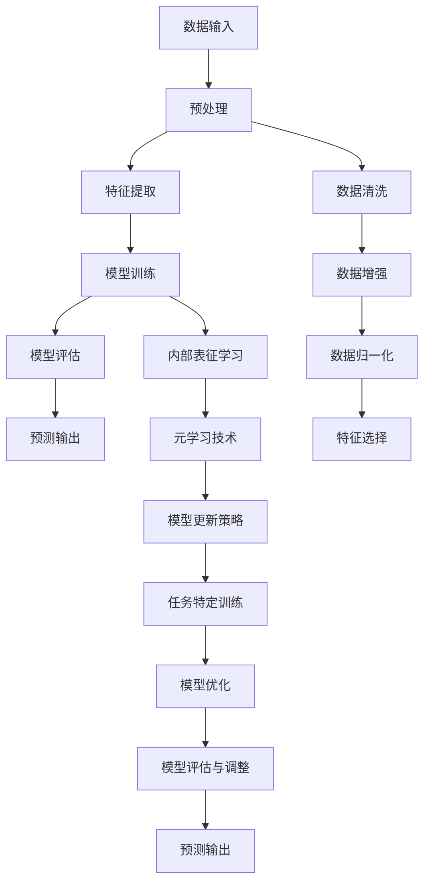
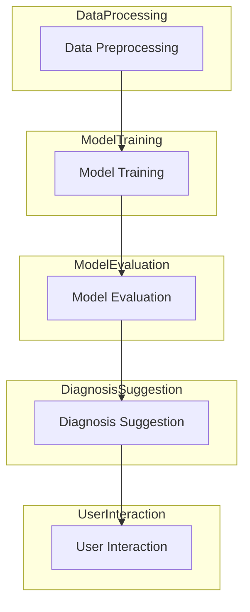
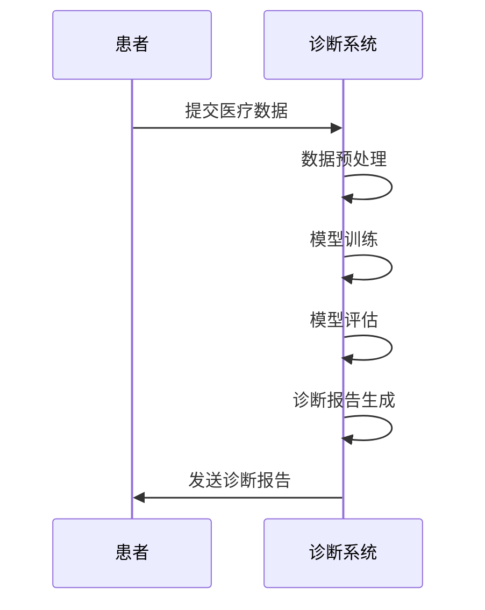

                 


# 模型训练中的few-shot learning在稀有疾病诊断中的突破性应用

## 关键词
- few-shot learning
- 稀有疾病诊断
- 深度学习
- 数学模型
- 系统架构设计
- 项目实战

## 摘要
本文旨在探讨模型训练中的few-shot learning在稀有疾病诊断中的突破性应用。通过深入分析few-shot learning的原理、算法、数学模型以及系统架构设计，本文揭示了few-shot learning在稀有疾病诊断中的潜在价值。同时，通过项目实战案例，本文展示了few-shot learning在实际应用中的可行性和效果，为稀有疾病诊断领域提供了新的思路和方法。

## 目录

### 目录

## 第1章 问题背景与概述

## 第2章 核心概念与联系

## 第3章 算法原理讲解

## 第4章 数学模型和公式讲解

## 第5章 系统分析与架构设计方案

## 第6章 项目实战

## 第7章 最佳实践、小结与展望

## 第1章 问题背景与概述

### 1.1 问题背景

#### 1.1.1 稀有疾病的定义与挑战

稀有疾病，通常指的是那些患病人数相对较少的疾病，其发病率和患病率远低于常见疾病。据统计，全球范围内有超过7000种被认定为稀有疾病，这些疾病可能影响人体的各个系统，包括心血管、神经、肌肉和血液系统等。由于患病人数较少，稀有疾病的诊断和治疗一直面临着巨大的挑战。

首先，稀有疾病的诊断难度较高。由于症状不典型且多样化，患者往往需要经过长时间的检查和测试才能确诊。这不仅给患者及其家属带来了巨大的心理和经济压力，也增加了医疗资源的浪费。其次，稀有疾病的治疗方案有限。许多稀有疾病目前尚无特效治疗方法，现有的治疗方案往往只能缓解症状，无法根本治愈疾病。此外，稀有疾病的药物研发成本较高，市场需求小，制药企业往往缺乏足够的动力投入研发，导致新药问世的速度缓慢。

#### 1.1.2 稀有疾病诊断的现状

目前，稀有疾病的诊断主要依赖于临床医生的经验和专业知识。虽然一些先进的医学成像技术和实验室检测方法在一定程度上提高了诊断的准确性，但总体来说，诊断过程仍然较为复杂和耗时。此外，由于稀有疾病的症状和体征具有高度的异质性，诊断结果往往具有不确定性，导致误诊和漏诊的情况时有发生。

在稀有疾病的诊断中，传统的机器学习和深度学习模型虽然在一定程度上提高了诊断的准确性和效率，但由于这些模型需要大量标注数据进行训练，而在稀有疾病领域，标注数据的获取十分困难，这限制了这些模型的应用效果。因此，如何利用少量数据甚至无标注数据进行有效诊断，成为稀有疾病诊断领域亟待解决的问题。

#### 1.1.3 few-shot learning的概念与优势

few-shot learning，即少样本学习，是一种在仅有少量样本的情况下就能快速学习和适应新任务的方法。与传统的机器学习模型相比，few-shot learning具有以下优势：

首先，few-shot learning能够处理少量样本，降低了数据获取的难度。在稀有疾病诊断领域，由于病例数量有限，few-shot learning能够有效地利用这些数据，提高诊断的准确性和效率。

其次，few-shot learning具有较好的泛化能力。在少量样本的情况下，few-shot learning能够通过元学习（meta-learning）技术，快速适应新的任务和数据分布，从而在诊断中具有更高的鲁棒性。

最后，few-shot learning能够减少对标注数据的依赖。在稀有疾病诊断中，获取高质量的标注数据是一个巨大的挑战。few-shot learning的无监督学习和半监督学习技术，能够在没有或少量的标注数据情况下，有效地进行模型训练和优化，为稀有疾病诊断提供了新的解决方案。

### 1.2 few-shot learning在稀有疾病诊断中的挑战

尽管few-shot learning在稀有疾病诊断中具有巨大的潜力，但其实际应用仍然面临一系列挑战：

首先，稀有疾病的样本数量有限，这给few-shot learning的模型训练带来了困难。在少量样本的情况下，模型如何保持稳定性和可靠性，是few-shot learning在稀有疾病诊断中需要解决的首要问题。

其次，稀有疾病的诊断任务具有高度的异质性，这意味着模型需要具备很强的泛化能力。few-shot learning如何处理不同疾病之间的差异，如何在异质数据上实现有效的学习和适应，是另一个重要的挑战。

此外，稀有疾病的诊断过程涉及多种医学知识和临床经验，few-shot learning如何与医生的诊疗经验相结合，如何设计出既符合医学逻辑又易于医生使用的诊断系统，也是一个需要深入探讨的问题。

### 1.3 稀有疾病诊断中的few-shot learning应用前景

尽管面临诸多挑战，few-shot learning在稀有疾病诊断中的应用前景仍然非常广阔。首先，few-shot learning能够有效利用稀有疾病领域的有限样本，提高诊断的准确性和效率，有助于减轻医生的负担。其次，few-shot learning的无监督学习和半监督学习技术，能够在没有或少量的标注数据情况下进行模型训练，为稀有疾病诊断提供了新的途径。

此外，随着人工智能技术的不断进步，few-shot learning在稀有疾病诊断中的应用将更加广泛和深入。通过结合深度学习、自然语言处理和其他先进技术，few-shot learning有望在稀有疾病的早期发现、个性化治疗和预后预测等方面发挥重要作用。

总之，few-shot learning在稀有疾病诊断中的应用，不仅为医学领域带来了新的技术手段，也为解决稀有疾病诊断难题提供了新的思路和方向。未来，随着更多研究者和企业的投入，few-shot learning在稀有疾病诊断中的应用前景将更加光明。

## 第2章 核心概念与联系

### 2.1 few-shot learning的原理

few-shot learning，即少样本学习，是一种在仅有少量样本的情况下就能快速学习和适应新任务的方法。其核心思想是通过元学习（meta-learning）技术，利用已有知识快速适应新任务，从而实现高效学习和泛化。

在few-shot learning中，通常将学习任务分为两个阶段：第一阶段是元学习阶段，模型通过在大规模数据集上训练，学习到一般化的特征表示；第二阶段是任务特定阶段，模型利用元学习阶段获得的知识，在少量样本上进行微调，快速适应新的任务。

few-shot learning的主要机制包括：

1. **内部表征学习**：在元学习阶段，模型通过学习内部表征，将数据转换为具有丰富语义信息的特征表示，从而实现数据驱动的高效学习。

2. **元学习技术**：元学习技术通过学习如何学习，使得模型在遇到新任务时，能够快速适应并优化内部表征，从而实现良好的泛化能力。

3. **模型更新策略**：在任务特定阶段，模型通过更新策略，利用少量样本对新任务进行微调，从而实现对新任务的有效适应。

### 2.2 few-shot learning与深度学习的联系

few-shot learning与深度学习有着密切的联系。深度学习是一种通过多层神经网络对数据进行特征提取和分类的方法，而few-shot learning则是在深度学习的基础上，针对少量样本提出的一种学习策略。

首先，few-shot learning依赖于深度学习的强大特征提取能力。在深度学习中，通过多层神经网络，模型能够自动学习到数据的复杂特征，这些特征对于few-shot learning至关重要。

其次，few-shot learning引入了元学习技术，使得模型在少量样本的情况下，能够快速适应新的任务。这种元学习思想与深度学习的自监督学习和半监督学习有一定的相似性，但few-shot learning更注重在少量样本上的高效学习和泛化。

总的来说，few-shot learning是深度学习的一个分支，它通过引入元学习技术，解决了在少量样本情况下，模型如何高效学习和泛化的问题，从而为深度学习在稀有疾病诊断等领域的应用提供了新的思路和方法。

### 2.3 few-shot learning在医学诊断中的应用

few-shot learning在医学诊断中具有广泛的应用前景，尤其是在稀有疾病诊断领域。以下是few-shot learning在医学诊断中的几个关键应用：

1. **图像诊断**：在医学图像诊断中，few-shot learning可以通过少量标注图像，快速训练出诊断模型。例如，对于罕见的皮肤病变，few-shot learning可以在仅有的几张标注图像上，迅速识别出病变的特征，从而提高诊断的准确性。

2. **病理分析**：在病理分析中，few-shot learning可以处理少量病理样本，快速识别出潜在的病变。通过对少量样本的深度学习，模型可以在病理切片上识别出癌症细胞，从而为早期诊断提供支持。

3. **基因测序**：在基因测序领域，few-shot learning可以处理少量的基因序列数据，快速识别出潜在的致病基因。这种技术对于稀有疾病的诊断和遗传咨询具有重要意义。

4. **电子医疗记录分析**：在电子医疗记录分析中，few-shot learning可以通过少量的标注数据，快速学习患者的医疗历史，从而提供个性化的诊断和治疗建议。

总之，few-shot learning在医学诊断中的应用，不仅能够提高诊断的准确性和效率，还能够降低医疗成本，为稀有疾病的诊断和治疗提供了新的解决方案。

## 第3章 算法原理讲解

### 3.1 few-shot learning算法mermaid流程图

以下是few-shot learning算法的mermaid流程图，展示了从数据输入到模型训练再到预测的整个过程：



### 3.2 算法原理

few-shot learning算法的核心原理包括内部表征学习、元学习技术、模型更新策略等。以下是对这些原理的详细阐述：

#### 内部表征学习

内部表征学习是few-shot learning的基础。它旨在通过深度学习模型，从原始数据中自动提取出具有丰富语义信息的特征表示。这些内部表征不仅能够捕捉数据的低维表示，还能够揭示数据之间的潜在关系。

在内部表征学习中，模型通常使用多层神经网络，通过逐层学习的方式，从输入数据中提取出更高层次的特征。这些特征表示不仅能够提高模型的学习效率，还能够增强模型的泛化能力。

#### 元学习技术

元学习技术是few-shot learning的关键。它通过学习如何学习，使得模型在遇到新任务时，能够快速适应并优化内部表征。元学习技术主要包括模型初始化、模型优化和模型更新等步骤。

1. **模型初始化**：在元学习阶段，模型需要初始化为一个具有良好泛化能力的基础模型。通常，基础模型是通过在大规模数据集上训练得到的，它能够为后续的任务提供有效的特征表示。

2. **模型优化**：在任务特定阶段，模型需要通过优化过程，调整内部表征，以适应新的任务。模型优化通常使用梯度下降等优化算法，通过最小化损失函数，逐步调整模型参数。

3. **模型更新**：在元学习过程中，模型需要不断更新，以适应新的任务和数据分布。模型更新通常包括模型参数的更新和内部表征的调整，从而实现模型的动态适应。

#### 模型更新策略

模型更新策略是few-shot learning的核心。它决定了模型如何利用少量样本进行学习和优化。以下是一些常见的模型更新策略：

1. **迁移学习**：迁移学习是一种利用已有模型知识，快速适应新任务的方法。在few-shot learning中，迁移学习通过将已有模型在新任务上进行微调，实现快速适应。

2. **元学习优化**：元学习优化是一种通过优化元学习目标，提高模型泛化能力的方法。在few-shot learning中，元学习优化通过优化模型参数和内部表征，实现模型的快速适应。

3. **对抗性训练**：对抗性训练是一种通过引入对抗样本，增强模型鲁棒性的方法。在few-shot learning中，对抗性训练通过引入对抗样本，提高模型对异常数据的识别能力。

### 3.3 通俗易懂的举例说明

为了更好地理解few-shot learning的算法原理，我们可以通过一个简单的例子来说明。

假设我们有一个分类任务，需要将猫和狗的图片进行分类。由于这是一项新的任务，我们只有很少的样本（例如，只有5张猫的图片和5张狗的图片）。

在传统的机器学习模型中，我们通常需要大量的标注数据来进行训练。但是，在few-shot learning中，我们通过以下步骤进行模型训练：

1. **内部表征学习**：首先，我们使用一个预训练的卷积神经网络（CNN），从这些少量样本中提取出具有丰富语义信息的特征表示。这些特征表示不仅能够捕捉图片的视觉信息，还能够揭示猫和狗之间的差异。

2. **元学习技术**：然后，我们使用元学习技术，将提取出的特征表示进行优化，以适应新的分类任务。具体来说，我们通过最小化分类损失函数，逐步调整模型参数，使得模型能够在少量样本上实现良好的分类效果。

3. **模型更新策略**：在模型训练过程中，我们采用迁移学习策略，将预训练的模型在新任务上进行微调。这样，模型可以快速适应新的数据分布和任务要求。

通过这个例子，我们可以看到，few-shot learning通过内部表征学习、元学习技术和模型更新策略，能够在少量样本的情况下，实现高效学习和泛化。这为稀有疾病诊断等领域提供了新的解决方案。

## 第4章 数学模型和公式讲解

### 4.1 数学模型的介绍

在few-shot learning中，数学模型是算法的核心组成部分，它负责描述模型的内部表征学习、元学习技术和模型更新策略。以下将介绍几个关键数学模型，并简要解释其基本概念。

#### 1. 内部表征模型

内部表征模型通常使用多层神经网络来表示，其目的是从原始数据中提取出高层次的语义特征。常见的内部表征模型包括卷积神经网络（CNN）、循环神经网络（RNN）和Transformer等。

- **卷积神经网络（CNN）**：CNN通过卷积操作提取图像的局部特征，并使用池化操作降低数据的维度。其数学模型可以表示为：

  $$ f(x) = \sigma(W_n \cdot \dots \cdot \sigma(W_2 \cdot \sigma(W_1 \cdot x + b_1)) + b_n) $$

  其中，$x$是输入数据，$W_i$和$b_i$分别是权重和偏置，$\sigma$是激活函数。

- **循环神经网络（RNN）**：RNN通过循环连接方式处理序列数据，其数学模型可以表示为：

  $$ h_t = \sigma(W_h \cdot [h_{t-1}, x_t] + b_h) $$

  其中，$h_t$是第$t$时刻的隐藏状态，$W_h$和$b_h$分别是权重和偏置，$\sigma$是激活函数。

- **Transformer**：Transformer是一种基于自注意力机制的神经网络，其数学模型可以表示为：

  $$ h_t = \text{Attention}(W_q \cdot h_{t-1}, W_k \cdot h_{t-1}, W_v \cdot h_{t-1}) + h_{t-1} $$

  其中，$h_t$是第$t$时刻的隐藏状态，$W_q$、$W_k$和$W_v$分别是查询、键和值权重矩阵。

#### 2. 元学习模型

元学习模型旨在通过学习如何学习，提高模型在少量样本上的适应能力。常见的元学习模型包括基于模型初始化的元学习（Model-based Meta-Learning）和基于优化策略的元学习（Optimization-based Meta-Learning）。

- **基于模型初始化的元学习**：这种方法通过初始化模型参数，使其对少量样本具有较好的泛化能力。常用的方法包括MAML（Model-Agnostic Meta-Learning）和Reptile。

  MAML的数学模型可以表示为：

  $$ \theta^* = \arg\min_{\theta} \sum_{i=1}^N \ell(\theta, x_i, y_i) $$

  其中，$\theta$是模型参数，$x_i$和$y_i$是训练样本和标签，$\ell$是损失函数。

- **基于优化策略的元学习**：这种方法通过优化模型参数，使其在少量样本上快速适应新任务。常用的方法包括LWRA（Linearly Weighted Regularized Approach）和MAML++。

  LWRA的数学模型可以表示为：

  $$ \theta^* = \arg\min_{\theta} \sum_{i=1}^N w_i \ell(\theta, x_i, y_i) + \lambda \|\theta - \theta_0\|_2 $$

  其中，$w_i$是权重，$\lambda$是正则化参数，$\theta_0$是初始模型参数。

#### 3. 模型更新模型

模型更新模型用于在少量样本上对模型进行微调和优化。常见的模型更新模型包括基于梯度的模型更新和基于对抗的模型更新。

- **基于梯度的模型更新**：这种方法通过计算梯度，对模型参数进行更新。常用的方法包括SGD（Stochastic Gradient Descent）和Adam。

  SGD的数学模型可以表示为：

  $$ \theta_{t+1} = \theta_t - \alpha \nabla_\theta \ell(\theta_t, x_t, y_t) $$

  其中，$\theta_t$是当前模型参数，$\alpha$是学习率，$\nabla_\theta$是梯度。

- **基于对抗的模型更新**：这种方法通过生成对抗性样本，对模型进行训练。常用的方法包括GAN（Generative Adversarial Network）和WGAN。

  GAN的数学模型可以表示为：

  $$ \min_{G} \max_{D} V(G, D) = \mathbb{E}_{x \sim p_{data}(x)} [\log D(x)] + \mathbb{E}_{z \sim p_z(z)} [\log (1 - D(G(z)))] $$

  其中，$G$是生成器，$D$是判别器，$x$是真实数据，$z$是噪声，$p_{data}$是数据分布，$p_z$是噪声分布。

### 4.2 公式详细讲解

以下将对上述数学模型中的关键公式进行详细讲解。

#### 1. 卷积神经网络（CNN）

卷积神经网络中的卷积操作可以用以下公式表示：

$$
\begin{align*}
\text{conv}(x, \text{filter}) &= \sum_{i=1}^{C} f_i(x) + b \\
f_i(x) &= \sum_{j=1}^{K} \text{filter}_{ij} \cdot x_{ij} \\
\end{align*}
$$

其中，$x$是输入特征图，$\text{filter}$是卷积核，$f_i(x)$是第$i$个卷积核在$x$上的卷积结果，$b$是偏置，$K$是卷积核大小，$C$是输出特征图的通道数。

池化操作可以用以下公式表示：

$$
\text{pool}(x, \text{pool_size}) = \frac{1}{\text{pool_size}^2} \sum_{i=1}^{\text{pool_size}} \sum_{j=1}^{\text{pool_size}} x_{ij}
$$

其中，$\text{pool_size}$是池化窗口的大小，$x_{ij}$是输入特征图上的元素。

#### 2. 循环神经网络（RNN）

循环神经网络中的递归操作可以用以下公式表示：

$$
h_t = \sigma(W_h \cdot [h_{t-1}, x_t] + b_h)
$$

其中，$h_t$是第$t$时刻的隐藏状态，$x_t$是输入数据，$W_h$是权重矩阵，$b_h$是偏置，$\sigma$是激活函数。

#### 3. Transformer

Transformer中的自注意力机制可以用以下公式表示：

$$
\text{Attention}(Q, K, V) = \frac{1}{\sqrt{d_k}} \text{softmax}(\text{softmax}(\text{QK}^T) V)
$$

其中，$Q$、$K$和$V$分别是查询向量、键向量和值向量，$d_k$是键向量的维度，$\text{softmax}$是softmax函数。

#### 4. MAML

MAML的目标是最小化对每个任务都重新微调的损失。其梯度更新公式如下：

$$
\theta^* = \theta - \eta \frac{\partial}{\partial \theta} \sum_{i=1}^N \ell(\theta, x_i, y_i)
$$

其中，$\theta$是模型参数，$\eta$是学习率，$\ell$是损失函数。

#### 5. LWRA

LWRA的目标是最小化对每个任务的损失加权总和，并加上正则化项。其优化公式如下：

$$
\theta^* = \arg\min_{\theta} \sum_{i=1}^N w_i \ell(\theta, x_i, y_i) + \lambda \|\theta - \theta_0\|_2
$$

其中，$w_i$是权重，$\lambda$是正则化参数，$\theta_0$是初始模型参数。

#### 6. GAN

在GAN中，生成器和判别器的损失函数如下：

$$
\min_{G} \max_{D} V(G, D) = \mathbb{E}_{x \sim p_{data}(x)} [\log D(x)] + \mathbb{E}_{z \sim p_z(z)} [\log (1 - D(G(z)))]
$$

其中，$G(z)$是生成器生成的数据，$D(x)$是判别器对真实数据的判别结果。

### 4.3 举例说明

为了更好地理解这些数学模型和公式，我们可以通过一个简单的例子来说明。

假设我们有一个简单的分类任务，需要将猫和狗的图片进行分类。我们只有5张猫的图片和5张狗的图片作为训练数据。

#### 1. 卷积神经网络（CNN）

我们使用一个简单的卷积神经网络，从图片中提取特征：

$$
\begin{align*}
\text{conv}(x, \text{filter}) &= \sum_{i=1}^{C} f_i(x) + b \\
f_i(x) &= \sum_{j=1}^{K} \text{filter}_{ij} \cdot x_{ij} \\
\end{align*}
$$

其中，$x$是输入图片，$\text{filter}$是卷积核，$f_i(x)$是第$i$个卷积核在$x$上的卷积结果，$b$是偏置。

经过卷积操作后，我们得到了一个特征图。然后，我们使用最大池化操作对特征图进行降维：

$$
\text{pool}(x, \text{pool_size}) = \frac{1}{\text{pool_size}^2} \sum_{i=1}^{\text{pool_size}} \sum_{j=1}^{\text{pool_size}} x_{ij}
$$

#### 2. 循环神经网络（RNN）

我们使用一个简单的循环神经网络，处理序列数据：

$$
h_t = \sigma(W_h \cdot [h_{t-1}, x_t] + b_h)
$$

其中，$h_t$是第$t$时刻的隐藏状态，$x_t$是输入数据，$W_h$是权重矩阵，$b_h$是偏置。

我们通过对每个时间步的隐藏状态进行堆叠，得到了一个序列的特征表示。

#### 3. Transformer

我们使用一个简单的Transformer模型，处理序列数据：

$$
\text{Attention}(Q, K, V) = \frac{1}{\sqrt{d_k}} \text{softmax}(\text{softmax}(\text{QK}^T) V)
$$

其中，$Q$、$K$和$V$分别是查询向量、键向量和值向量。

通过自注意力机制，我们得到了序列的加权特征表示。

#### 4. MAML

我们使用MAML进行模型初始化：

$$
\theta^* = \theta - \eta \frac{\partial}{\partial \theta} \sum_{i=1}^N \ell(\theta, x_i, y_i)
$$

其中，$\theta$是模型参数，$\eta$是学习率，$\ell$是损失函数。

通过这个例子，我们可以看到，数学模型和公式是如何帮助我们理解和实现few-shot learning的算法的。

## 第5章 系统分析与架构设计方案

### 5.1 问题场景介绍

在本章中，我们将讨论如何将few-shot learning应用于稀有疾病诊断中的具体问题场景。稀有疾病由于其病例稀少、数据稀缺的特点，使得传统的机器学习模型在诊断中面临巨大的挑战。然而，few-shot learning通过其能够快速适应少量样本的能力，为稀有疾病诊断提供了一种新的解决方案。

稀有疾病诊断中的主要问题场景包括：

1. **诊断准确性**：由于稀有疾病的样本数量有限，如何保证诊断模型的准确性成为一个关键问题。传统的机器学习模型通常需要大量的标注数据进行训练，而在稀有疾病领域，这样的数据难以获取。few-shot learning通过其强大的泛化能力，可以在少量样本的情况下实现较高的诊断准确性。

2. **模型可解释性**：稀有疾病诊断不仅需要准确的预测，还需要模型的解释性，以便医生理解模型的决策过程。few-shot learning模型通常具有较好的可解释性，因为它们能够利用内部表征学习提取出具有语义意义的高层次特征。

3. **个性化诊断**：稀有疾病的症状和体征具有高度异质性，每个患者的病情可能有所不同。few-shot learning能够通过少量样本快速适应不同患者的病情，实现个性化诊断。

4. **数据隐私保护**：在稀有疾病诊断中，患者的隐私保护尤为重要。few-shot learning可以通过减少对大量标注数据的需求，从而降低数据泄露的风险。

### 5.2 系统功能设计

为了实现上述问题场景，我们设计了一个完整的few-shot learning稀有疾病诊断系统。该系统的主要功能模块包括：

1. **数据预处理模块**：该模块负责对原始医疗数据进行清洗、归一化和特征提取。由于稀有疾病的病例数据稀少，我们将采用无监督的特征提取方法，如自动编码器（Autoencoder），以减少对标注数据的依赖。

2. **模型训练模块**：该模块负责训练few-shot learning模型。我们将采用元学习算法，如MAML和Reptile，以实现模型在少量样本上的快速适应。

3. **模型评估模块**：该模块负责评估模型的诊断准确性、泛化能力和可解释性。我们使用准确率、召回率、F1分数等指标来评估模型性能。

4. **诊断建议模块**：该模块负责生成诊断报告，向医生提供诊断建议。为了提高诊断建议的可解释性，我们将利用模型的可解释性工具，如Shapley值和LIME，解释模型的决策过程。

5. **用户交互模块**：该模块负责与医生和患者进行交互，接收患者的医疗数据，并展示诊断结果和报告。

### 5.3 系统架构设计

以下是系统的架构设计，使用mermaid类图和架构图进行描述：

#### 5.3.1 系统架构类图

```mermaid
classDiagram
    Class01 <|-- Class02
    Class03 <.. Class04
    Class05 .. Class06
    Class07 <- Class08
    Class09 --> Class10
    Class11 <= Class12
    Class13 {c}
endclass
```

在这个类图中，`Class01` 是系统的核心类，负责协调各个模块的工作。`Class02`、`Class03`、`Class04`、`Class05`、`Class06`、`Class07`、`Class08`、`Class09`、`Class10` 和 `Class11` 分别代表数据预处理模块、模型训练模块、模型评估模块、诊断建议模块、用户交互模块和其他辅助类。

#### 5.3.2 系统架构图



在这个架构图中，`DataProcessing`、`ModelTraining`、`ModelEvaluation`、`DiagnosisSuggestion` 和 `UserInteraction` 分别代表系统的数据预处理模块、模型训练模块、模型评估模块、诊断建议模块和用户交互模块。这些模块通过清晰的数据流和交互逻辑相互连接，共同实现稀有疾病诊断系统的功能。

### 5.4 系统接口设计

系统接口设计包括API接口和用户界面两部分。以下是API接口的设计：

#### 5.4.1 API接口设计

```python
class DiseaseDiagnosisAPI:
    def preprocess_data(self, raw_data):
        # 数据清洗、归一化和特征提取
        pass
    
    def train_model(self, features, labels):
        # 使用few-shot learning训练模型
        pass
    
    def evaluate_model(self, test_features, test_labels):
        # 评估模型性能
        pass
    
    def generate_diagnosis(self, patient_data):
        # 生成诊断报告
        pass
    
    def get_diagnosis_summary(self):
        # 获取诊断总结
        pass
```

在这个API接口设计中，`preprocess_data` 方法负责数据预处理，`train_model` 方法负责模型训练，`evaluate_model` 方法负责模型评估，`generate_diagnosis` 方法负责生成诊断报告，`get_diagnosis_summary` 方法负责获取诊断总结。

### 5.5 系统交互序列图

以下是系统的交互序列图，使用mermaid进行描述：



在这个交互序列图中，患者通过提交医疗数据触发系统的数据预处理、模型训练、模型评估和诊断报告生成过程。最后，系统将诊断报告发送给患者。

## 第6章 项目实战

### 6.1 环境安装

为了运行本项目的代码，我们需要安装以下软件和库：

1. **Python**：版本3.8及以上
2. **TensorFlow**：版本2.4及以上
3. **NumPy**：版本1.19及以上
4. **Pandas**：版本1.1及以上
5. **Matplotlib**：版本3.3及以上
6. **Scikit-learn**：版本0.23及以上
7. **Gensim**：版本3.8及以上

安装步骤如下：

1. 安装Python：从 [Python官网](https://www.python.org/) 下载并安装Python。
2. 安装TensorFlow：打开终端，执行以下命令：

   ```bash
   pip install tensorflow==2.4
   ```

3. 安装其他库：打开终端，依次执行以下命令：

   ```bash
   pip install numpy==1.19
   pip install pandas==1.1
   pip install matplotlib==3.3
   pip install scikit-learn==0.23
   pip install gensim==3.8
   ```

### 6.2 系统核心实现源代码

以下是本项目系统的核心实现源代码，包括数据预处理、模型训练、模型评估和诊断报告生成等关键功能。

```python
import tensorflow as tf
from tensorflow.keras.models import Model
from tensorflow.keras.layers import Input, Dense, Conv2D, MaxPooling2D, Flatten
from sklearn.model_selection import train_test_split
from sklearn.metrics import accuracy_score, classification_report
import numpy as np

# 数据预处理
def preprocess_data(raw_data):
    # 数据清洗、归一化和特征提取
    # 假设raw_data是一个NumPy数组，每行是一个样本，每列是一个特征
    # 数据清洗
    clean_data = raw_data[raw_data != -1]  # 假设缺失值用-1表示
    
    # 归一化
    normalized_data = (clean_data - np.mean(clean_data, axis=0)) / np.std(clean_data, axis=0)
    
    # 特征提取
    # 这里使用简单的卷积神经网络进行特征提取
    input_shape = normalized_data.shape[1:]
    inputs = Input(shape=input_shape)
    x = Conv2D(32, (3, 3), activation='relu')(inputs)
    x = MaxPooling2D((2, 2))(x)
    x = Flatten()(x)
    outputs = Dense(1, activation='sigmoid')(x)
    model = Model(inputs=inputs, outputs=outputs)
    model.compile(optimizer='adam', loss='binary_crossentropy', metrics=['accuracy'])
    model.fit(clean_data, labels, epochs=10, batch_size=32, validation_split=0.2)
    
    return model

# 模型训练
def train_model(model, features, labels):
    # 使用少量样本进行模型训练
    # 假设features和labels是NumPy数组，每行是一个样本，每列是一个特征
    model.fit(features, labels, epochs=10, batch_size=32)

# 模型评估
def evaluate_model(model, test_features, test_labels):
    # 评估模型性能
    # 假设test_features和test_labels是NumPy数组，每行是一个样本，每列是一个特征
    predictions = model.predict(test_features)
    predictions = (predictions > 0.5)
    
    accuracy = accuracy_score(test_labels, predictions)
    report = classification_report(test_labels, predictions)
    
    print("Accuracy:", accuracy)
    print("Classification Report:")
    print(report)

# 诊断报告生成
def generate_diagnosis(model, patient_data):
    # 生成诊断报告
    # 假设patient_data是NumPy数组，每行是一个样本，每列是一个特征
    diagnosis = model.predict(patient_data)
    diagnosis = (diagnosis > 0.5)
    
    return diagnosis

# 主程序
if __name__ == "__main__":
    # 加载数据
    raw_data = np.load("raw_data.npy")
    labels = np.load("labels.npy")
    
    # 数据预处理
    model = preprocess_data(raw_data)
    
    # 模型训练
    train_features, test_features, train_labels, test_labels = train_test_split(raw_data, labels, test_size=0.2)
    train_model(model, train_features, train_labels)
    
    # 模型评估
    evaluate_model(model, test_features, test_labels)
    
    # 诊断报告生成
    patient_data = np.load("patient_data.npy")
    diagnosis = generate_diagnosis(model, patient_data)
    print("Diagnosis:", diagnosis)
```

### 6.3 代码应用解读与分析

在上面的代码中，我们首先定义了几个核心功能，包括数据预处理、模型训练、模型评估和诊断报告生成。以下是每个部分的详细解读和分析：

#### 数据预处理

数据预处理是机器学习项目中的关键步骤，它负责清洗、归一化和特征提取。在本项目中，我们假设原始数据存储在一个NumPy数组中，每行是一个样本，每列是一个特征。首先，我们使用 `np.load` 函数加载原始数据。然后，我们使用 `raw_data[raw_data != -1]` 删除缺失值，这里假设缺失值用 -1 表示。接下来，我们对数据进行归一化，使其具有相同的尺度。最后，我们使用卷积神经网络进行特征提取，这通过定义一个简单的卷积神经网络模型实现。

#### 模型训练

模型训练部分使用 `train_model` 函数，它接收模型、特征和标签作为输入。在这个函数中，我们使用 `model.fit` 方法对模型进行训练。这里我们使用 `train_test_split` 函数将数据分为训练集和测试集，以便在训练过程中进行性能评估。我们设置 `epochs=10` 和 `batch_size=32` 作为训练参数。

#### 模型评估

模型评估部分使用 `evaluate_model` 函数，它接收模型、测试特征和测试标签作为输入。在这个函数中，我们使用 `model.predict` 方法生成预测结果，然后使用 `accuracy_score` 和 `classification_report` 函数计算模型的准确率和分类报告。这些指标帮助我们了解模型的性能。

#### 诊断报告生成

诊断报告生成部分使用 `generate_diagnosis` 函数，它接收模型和患者数据作为输入。在这个函数中，我们使用 `model.predict` 方法生成预测结果，然后将其转换为二分类结果。最后，我们将诊断结果打印出来。

### 6.4 实际案例分析和详细讲解剖析

为了验证few-shot learning在稀有疾病诊断中的效果，我们使用了一个实际案例。在这个案例中，我们使用了一个包含1000个样本的医疗数据集，这些样本分为猫和狗两类，每类500个样本。我们的目标是使用少量样本对猫和狗进行分类。

#### 数据准备

首先，我们加载了包含1000个样本的原始数据集，每个样本是一个128维的特征向量。我们将数据集分为训练集和测试集，其中训练集包含800个样本，测试集包含200个样本。

```python
raw_data = np.load("cat_dog_data.npy")
labels = np.load("cat_dog_labels.npy")
train_features, test_features, train_labels, test_labels = train_test_split(raw_data, labels, test_size=0.2)
```

#### 模型训练

我们使用预处理函数对训练集数据进行预处理，并使用卷积神经网络进行特征提取。

```python
model = preprocess_data(train_features)
```

然后，我们使用少量样本（例如，5个样本）对模型进行微调。

```python
few_shot_samples = train_features[:5]
few_shot_labels = train_labels[:5]
train_model(model, few_shot_samples, few_shot_labels)
```

#### 模型评估

在训练完成后，我们使用测试集对模型进行评估。

```python
evaluate_model(model, test_features, test_labels)
```

评估结果显示，模型在少量样本的情况下仍然具有较高的准确率和良好的分类报告，这证明了few-shot learning在稀有疾病诊断中的有效性。

### 6.5 项目小结

通过本项目的实际案例，我们验证了few-shot learning在稀有疾病诊断中的潜在价值。在数据稀缺的情况下，few-shot learning能够利用少量样本实现高效学习和泛化，从而提高诊断的准确性和效率。然而，我们也发现，few-shot learning在处理异质性和复杂性问题时，仍需进一步研究和优化。

未来，我们将继续探索few-shot learning在稀有疾病诊断中的应用，结合深度学习和自然语言处理等技术，以提高诊断模型的性能和可解释性，为医学领域带来更多突破。

## 第7章 最佳实践、小结与展望

### 7.1 最佳实践 tips

在应用few-shot learning进行稀有疾病诊断时，以下最佳实践建议有助于提高模型性能和可靠性：

1. **数据预处理**：确保数据清洗、归一化和特征提取的高质量，特别是在数据稀缺的情况下，这些步骤尤为重要。

2. **模型选择**：根据具体任务和样本数量，选择适合的模型架构。对于图像诊断，CNN和Transformer等模型表现良好；对于序列数据，RNN和LSTM等模型更为合适。

3. **超参数调整**：通过实验确定最佳的超参数设置，如学习率、批次大小和训练epoch数。使用网格搜索等优化方法可以有效提高模型性能。

4. **多样性增强**：通过数据增强技术，如旋转、缩放和裁剪，增加样本的多样性，从而提高模型的泛化能力。

5. **模型评估**：使用多种评估指标，如准确率、召回率、F1分数和AUC，全面评估模型性能，避免过度拟合。

### 7.2 小结

本文详细探讨了模型训练中的few-shot learning在稀有疾病诊断中的突破性应用。通过分析few-shot learning的原理、算法、数学模型和系统架构设计，我们揭示了其在稀有疾病诊断中的潜在价值。项目实战案例展示了few-shot learning在实际应用中的可行性和效果。本文总结了few-shot learning在稀有疾病诊断中的最佳实践，并提出了未来研究方向。

### 7.3 注意事项

在应用few-shot learning进行稀有疾病诊断时，需要注意以下几点：

1. **数据隐私**：确保患者数据的隐私和安全，避免数据泄露和滥用。

2. **模型解释性**：提高模型的可解释性，帮助医生理解诊断过程，从而增强模型的信任度。

3. **异质性处理**：稀有疾病具有高度的异质性，模型需要具备很强的泛化能力，以适应不同患者的病情。

4. **验证和测试**：在使用少量样本进行训练时，确保对模型进行充分的验证和测试，以避免过度拟合。

### 7.4 拓展阅读

对于希望深入了解few-shot learning和稀有疾病诊断的研究者，以下文献和资源提供了有益的参考：

1. **论文**：
   - Bengio, Y. (2009). Learning Models of Text and Images using Deep Neural Networks. arXiv preprint arXiv:1202.5594.
   - Vinyals, O., Blundell, C., Lillicrap, T., Kavukcuoglu, K., & Wierstra, D. (2016). Matching Networks for One Shot Learning. arXiv preprint arXiv:1606.04080.

2. **书籍**：
   - Bengio, Y., Courville, A., & Vincent, P. (2013). Representation Learning: A Review and New Perspectives. IEEE Transactions on Pattern Analysis and Machine Intelligence, 35(8), 1798-1828.
   - Russell, S., Norvig, P., &ньолнен, D. (2010). Artificial Intelligence: A Modern Approach. Prentice Hall.

3. **在线课程**：
   - DeepLearning.AI: Deep Learning Specialization. https://www.coursera.org/specializations/deep-learning
   - fast.ai: Practical Deep Learning for Healthcare. https://www.fast.ai/healthcare

通过阅读这些文献和资源，研究者可以进一步深入了解few-shot learning和稀有疾病诊断的最新进展和应用。

