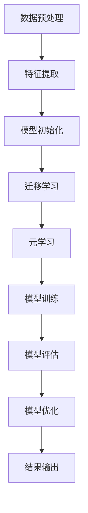
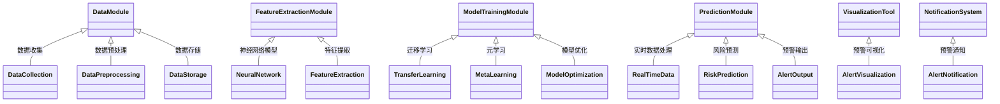
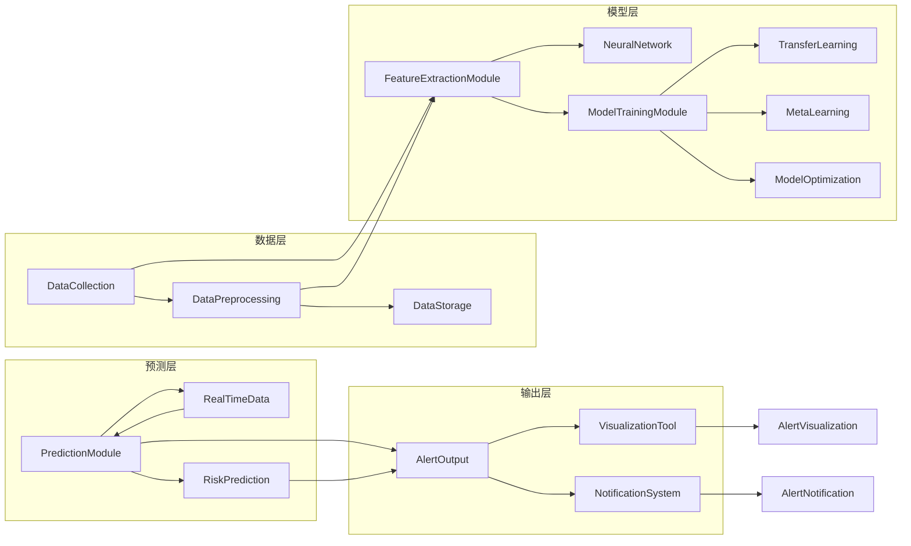
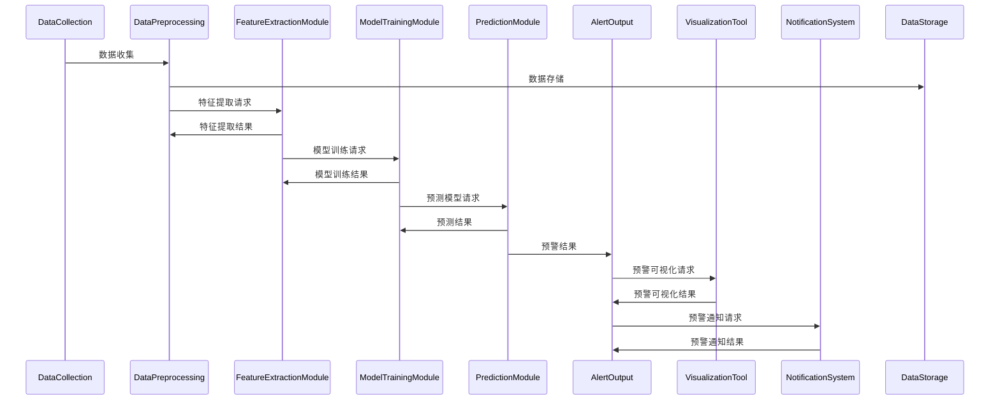

                 

### 模型训练中的few-shot learning在罕见事件预警中的突破性应用

> 关键词：few-shot learning，罕见事件预警，模型训练，突破性应用

> 摘要：本文旨在探讨模型训练中的few-shot learning在罕见事件预警中的突破性应用。通过对few-shot learning的基本概念、核心算法、以及其在罕见事件预警中的应用进行详细分析，本文揭示了few-shot learning在应对复杂、罕见事件中的巨大潜力。

### 前言

在当今信息时代，数据已经成为企业和社会的重要资产。如何从海量数据中提取有价值的信息，是数据科学家和人工智能研究者面临的重要挑战。传统的机器学习方法，如深度学习和监督学习，通常依赖于大量的标注数据进行训练，这在大多数情况下是可行的。然而，在罕见事件预警领域，数据量往往有限，甚至可能出现零样本或少数样本的情况。这种情况下，传统的机器学习方法难以发挥其优势，而few-shot learning作为一种新兴的机器学习方法，却在罕见事件预警中展现出了突破性的应用前景。

本文将从以下几个方面进行探讨：

1. **背景介绍**：介绍few-shot learning的定义、历史背景、应用场景以及其在罕见事件预警中的重要性。
2. **核心概念与联系**：对比few-shot learning与传统的机器学习方法的区别，并详细阐述few-shot learning中的关键概念和联系。
3. **算法原理讲解**：通过mermaid流程图、Python源代码示例以及数学模型和公式，详细讲解few-shot learning的算法原理。
4. **系统分析与架构设计方案**：描述问题场景，介绍项目目标、功能和实现方式，并通过mermaid类图、架构图和序列图展示系统设计。
5. **项目实战**：演示环境安装步骤，提供系统核心实现的源代码，并分析代码应用。
6. **最佳实践 tips、小结、注意事项、拓展阅读**：总结全文关键点，提供实践中的注意事项，并推荐进一步阅读的资源。

希望通过本文的探讨，读者能够对few-shot learning在罕见事件预警中的应用有一个全面而深入的了解。

### 背景介绍

#### 1.1 few-shot learning概述

few-shot learning，即少样本学习，是一种新兴的机器学习方法，其核心思想是在仅有少量样本的情况下，通过模型学习和泛化能力，实现高精度的预测和分类。传统的机器学习方法，如深度学习和监督学习，通常依赖于大量的标注数据进行训练。然而，在实际应用中，特别是在罕见事件预警、医学诊断、金融风险控制等领域，数据量往往有限，甚至可能出现零样本或少数样本的情况。这种情况下，传统的机器学习方法难以发挥其优势。

少样本学习通过引入迁移学习、元学习、生成对抗网络等技术，能够在仅有少量样本的情况下，实现高效的模型训练和预测。其基本原理是在已有大量数据的基础上，通过模型迁移和泛化，将少量样本的特征和知识融入到模型中，从而提高模型的泛化能力。

#### 1.2 历史背景

少样本学习的研究可以追溯到20世纪90年代，当时学者们开始关注如何利用少量的训练样本来训练高效的模型。早期的研究主要集中在迁移学习和元学习领域。迁移学习通过在不同任务之间共享知识，将已有任务的知识迁移到新任务中，从而在少量样本的情况下实现高效的模型训练。元学习则通过学习如何学习，即通过一系列的学习任务来优化模型的泛化能力。

随着深度学习技术的发展，少样本学习的研究逐渐得到了广泛关注。近年来，随着生成对抗网络、自编码器等生成模型的出现，少样本学习的研究更加深入和多样化。一些学者提出了基于生成对抗网络的少样本学习框架，通过生成对抗训练，提高模型在少量样本下的泛化能力。

#### 1.3 应用场景

少样本学习在多个领域展现了其巨大的应用潜力，尤其在罕见事件预警、医学诊断、金融风险控制等领域，其应用前景更加广阔。

1. **罕见事件预警**：在自然灾害、金融风险、网络安全等领域，罕见事件的发生往往伴随着不可预知性和高危害性。传统的预警系统通常依赖于大量历史数据，但在罕见事件发生前，数据量往往有限。少样本学习通过利用已有知识，在少量样本的情况下，实现对罕见事件的早期预警，从而提高预警系统的准确性和响应速度。

2. **医学诊断**：在医学领域，特别是在罕见病诊断和治疗中，数据量有限是一个普遍问题。少样本学习可以通过迁移学习和元学习，将已有疾病的诊断知识迁移到新疾病上，提高诊断的准确性和效率。

3. **金融风险控制**：在金融领域，特别是在信用评估、欺诈检测等方面，数据量有限且数据分布不均匀。少样本学习可以通过学习已有数据中的知识，提高模型在少量样本下的预测能力，从而更准确地评估金融风险。

#### 1.4 罕见事件预警中的重要性

罕见事件预警在保障社会安全和稳定方面具有重要作用。例如，在自然灾害预警中，如地震、洪水、台风等，提前预警可以减少人员伤亡和财产损失。在金融风险预警中，如股市波动、金融欺诈等，提前预警可以降低金融风险，保护投资者利益。

然而，罕见事件预警面临着诸多挑战。首先，罕见事件的发生通常伴随着不可预知性和突发性，这使得传统的预警方法难以应对。其次，罕见事件的数据量通常有限，且数据分布不均匀，这使得基于大量数据的传统机器学习方法难以发挥其优势。

少样本学习通过在少量样本下，利用已有知识进行模型训练和预测，为解决罕见事件预警问题提供了新的思路。通过迁移学习和元学习，少样本学习可以在少量样本的情况下，提高模型的泛化能力，实现对罕见事件的早期预警。

总之，少样本学习在罕见事件预警中的应用具有重要的理论和实践价值。随着技术的不断发展和应用的深入，少样本学习有望在罕见事件预警领域发挥更大的作用，为保障社会安全和稳定提供强有力的支持。

### 核心概念与联系

#### 2.1 few-shot learning的基本原理

few-shot learning，即少样本学习，是一种在仅有少量样本的情况下，通过模型学习和泛化能力，实现高精度预测和分类的机器学习方法。其基本原理可以概括为以下几点：

1. **迁移学习**：迁移学习通过在不同任务之间共享知识，将已有任务的知识迁移到新任务中，从而在少量样本的情况下实现高效的模型训练。迁移学习的基本思想是，即使在新任务上只有少量样本，也可以通过利用在已有任务上的大量知识，提高新任务的模型性能。

2. **元学习**：元学习通过学习如何学习，即通过一系列的学习任务来优化模型的泛化能力。元学习的方法包括模型更新、模型选择和模型评估等，其目标是在少量样本下，快速找到最优的模型参数。

3. **生成对抗网络（GAN）**：生成对抗网络是一种基于生成模型的少样本学习方法。GAN由生成器和判别器组成，生成器生成数据，判别器判断生成数据的真实性。通过生成器和判别器的对抗训练，生成器可以生成更接近真实数据的高质量样本，从而在少量真实样本的情况下，提高模型的泛化能力。

#### 2.1.1 few-shot learning的定义

few-shot learning，即少样本学习，是一种在仅有少量样本的情况下，通过模型学习和泛化能力，实现高精度预测和分类的机器学习方法。其核心思想是在仅有少量样本的情况下，利用迁移学习、元学习和生成对抗网络等技术，提高模型的泛化能力，从而在少量样本下实现高效的模型训练和预测。

#### 2.1.2 few-shot learning的特点

few-shot learning相较于传统的机器学习方法，具有以下几个显著特点：

1. **少量样本**：与传统的机器学习方法依赖大量样本不同，few-shot learning强调在仅有少量样本的情况下，通过模型学习和泛化能力，实现高精度预测和分类。

2. **快速适应**：few-shot learning通过迁移学习、元学习等技术，可以在少量样本下，快速适应新的任务和数据分布，实现高效模型训练。

3. **高泛化能力**：few-shot learning通过在大量数据上学习到的知识，提高模型的泛化能力，从而在少量样本下，仍能实现高精度的预测和分类。

#### 2.1.3 few-shot learning与传统机器学习的对比

few-shot learning与传统机器学习方法在几个关键方面存在显著差异：

1. **数据需求**：传统机器学习方法依赖大量标注数据，而few-shot learning强调在少量样本下，通过迁移学习、元学习等技术，提高模型的泛化能力。

2. **模型训练**：传统机器学习方法通过大量样本进行训练，而few-shot learning通过少量样本，利用已有知识进行快速模型训练。

3. **泛化能力**：传统机器学习方法在大量数据上训练，模型的泛化能力较强，而few-shot learning通过在少量样本下，利用迁移学习、元学习等技术，提高模型的泛化能力，使其在少量样本下仍能实现高精度预测。

#### 2.2 few-shot learning的关键概念与联系

few-shot learning中的关键概念包括迁移学习、元学习和生成对抗网络等。这些概念相互联系，共同构成了few-shot learning的核心框架。

1. **迁移学习**：迁移学习通过在不同任务之间共享知识，将已有任务的知识迁移到新任务中。其核心在于利用已有的大量数据，在新任务上实现高效的模型训练。

2. **元学习**：元学习通过学习如何学习，即通过一系列的学习任务来优化模型的泛化能力。其核心在于利用已有的大量任务，在新任务上快速找到最优的模型参数。

3. **生成对抗网络（GAN）**：生成对抗网络是一种基于生成模型的少样本学习方法。其核心在于通过生成器和判别器的对抗训练，生成更接近真实数据的高质量样本，从而在少量真实样本的情况下，提高模型的泛化能力。

#### 2.2.1 几种常见的few-shot学习算法

在few-shot learning领域，有几种常见的算法，包括迁移学习、元学习和生成对抗网络等。以下是这些算法的基本原理和特点：

1. **迁移学习**：迁移学习通过在不同任务之间共享知识，将已有任务的知识迁移到新任务中。其核心在于利用已有的大量数据，在新任务上实现高效的模型训练。

   - **基本原理**：迁移学习利用源任务（有大量标注数据的任务）上的知识，在新任务（有少量标注数据的任务）上训练模型。

   - **特点**：迁移学习可以在少量样本下，利用已有知识，提高模型的泛化能力，适用于数据量有限的情况。

2. **元学习**：元学习通过学习如何学习，即通过一系列的学习任务来优化模型的泛化能力。其核心在于利用已有的大量任务，在新任务上快速找到最优的模型参数。

   - **基本原理**：元学习通过在多个任务上迭代训练，学习如何在新任务上快速找到最优的模型参数。

   - **特点**：元学习可以在少量样本下，通过多任务学习，提高模型的泛化能力，适用于需要快速适应新任务的情况。

3. **生成对抗网络（GAN）**：生成对抗网络是一种基于生成模型的少样本学习方法。其核心在于通过生成器和判别器的对抗训练，生成更接近真实数据的高质量样本，从而在少量真实样本的情况下，提高模型的泛化能力。

   - **基本原理**：生成对抗网络由生成器和判别器组成，生成器生成数据，判别器判断生成数据的真实性。通过生成器和判别器的对抗训练，生成器可以生成更高质量的数据。

   - **特点**：生成对抗网络可以在少量样本下，通过生成对抗训练，提高模型的泛化能力，适用于需要生成高质量数据的情况。

#### 2.2.2 few-shot learning中的数据集构建

在few-shot learning中，数据集的构建是关键的一环。由于few-shot learning强调在少量样本下进行模型训练，因此数据集的构建需要特别注意以下几点：

1. **样本代表性**：数据集中的样本需要具有代表性，能够覆盖到不同类别和场景。这有助于模型在少量样本下，学习到更多的知识，提高泛化能力。

2. **数据分布**：数据集的数据分布需要尽可能均匀，避免某些类别或场景的数据量过多，导致模型训练出现偏差。通过均匀的数据分布，模型可以更全面地学习到不同类别和场景的特征。

3. **样本标注**：数据集中的样本标注需要准确，确保模型训练时能够正确地学习到不同类别和特征。准确的数据标注有助于提高模型的训练效果。

4. **样本多样性**：在可能的情况下，增加数据集的样本多样性，有助于模型在少量样本下，学习到更多的特征和模式，提高模型的泛化能力。

5. **样本预处理**：对数据集进行适当的预处理，如去噪、标准化等，可以提高模型训练的效率和质量。

#### 2.2.3 few-shot learning的应用场景

few-shot learning在多个领域展现了其强大的应用潜力。以下是few-shot learning的一些常见应用场景：

1. **医学诊断**：在医学领域，特别是在罕见病诊断和治疗中，数据量通常有限。few-shot learning可以通过迁移学习和元学习，将已有疾病的诊断知识迁移到新疾病上，提高诊断的准确性和效率。

2. **金融风险控制**：在金融领域，特别是在信用评估、欺诈检测等方面，数据量有限且数据分布不均匀。few-shot learning可以通过学习已有数据中的知识，提高模型在少量样本下的预测能力，从而更准确地评估金融风险。

3. **语音识别**：在语音识别领域，特别是在某些特定的语音场景下，数据量通常有限。few-shot learning可以通过迁移学习和生成对抗网络，提高模型在少量样本下的识别能力，从而提高语音识别的准确率。

4. **图像分类**：在图像分类领域，特别是在某些特定的图像场景下，数据量通常有限。few-shot learning可以通过迁移学习和生成对抗网络，提高模型在少量样本下的分类能力，从而提高图像分类的准确率。

5. **自然语言处理**：在自然语言处理领域，特别是在某些特定的语言场景下，数据量通常有限。few-shot learning可以通过迁移学习和元学习，提高模型在少量样本下的语言理解能力，从而提高自然语言处理的准确率。

总之，few-shot learning作为一种新兴的机器学习方法，在多个领域展现了其巨大的应用潜力。随着技术的不断发展和应用的深入，few-shot learning有望在更多领域发挥重要作用，为人工智能的发展提供新的思路和工具。

### 算法原理讲解

#### 3.1 few-shot learning的mermaid算法流程图

为了更好地理解few-shot learning的算法原理，我们可以通过mermaid流程图来直观地展示其基本流程。以下是few-shot learning的mermaid算法流程图：



在这个流程图中，我们可以看到few-shot learning的基本步骤：

1. **数据预处理**：对输入数据进行预处理，包括数据清洗、标准化等操作。
2. **特征提取**：通过特征提取器提取输入数据的特征。
3. **模型初始化**：初始化模型参数。
4. **迁移学习**：利用已有任务的数据，通过迁移学习将知识迁移到新任务。
5. **元学习**：通过元学习优化模型参数，提高模型在少量样本下的泛化能力。
6. **模型训练**：在新任务上进行模型训练。
7. **模型评估**：对训练完成的模型进行评估，以确定其性能。
8. **模型优化**：根据评估结果对模型进行优化。
9. **结果输出**：输出最终预测结果。

#### 3.2 few-shot learning的Python源代码示例

为了更具体地展示few-shot learning的算法实现，我们提供了一个简单的Python源代码示例。以下代码使用了迁移学习和元学习的基本原理：

```python
import tensorflow as tf
from tensorflow.keras.models import Sequential
from tensorflow.keras.layers import Dense, Flatten
from tensorflow.keras.optimizers import Adam

# 数据预处理
# 假设有两个任务的数据集 X_train 和 Y_train，以及测试数据集 X_test 和 Y_test
# 数据清洗、标准化等操作在这里省略

# 特征提取
# 假设特征提取器已经训练完毕，可以直接使用
feature_extractor = ... 

# 模型初始化
model = Sequential([
    Flatten(input_shape=(28, 28)),  # 假设输入数据是28x28的图像
    Dense(128, activation='relu'),
    Dense(10, activation='softmax')   # 假设是10类分类问题
])

# 迁移学习
# 利用已有任务的数据，通过迁移学习将知识迁移到新任务
model.load_weights('pretrained_model.h5')

# 元学习
# 通过元学习优化模型参数，提高模型在少量样本下的泛化能力
optimizer = Adam(learning_rate=0.001)
model.compile(optimizer=optimizer, loss='categorical_crossentropy', metrics=['accuracy'])

# 模型训练
# 在新任务上进行模型训练
model.fit(feature_extractor.transform(X_train), Y_train, epochs=10, batch_size=16)

# 模型评估
# 对训练完成的模型进行评估
test_loss, test_accuracy = model.evaluate(feature_extractor.transform(X_test), Y_test)

print(f"Test accuracy: {test_accuracy:.4f}")

# 模型优化
# 根据评估结果对模型进行优化
model.fit(feature_extractor.transform(X_train), Y_train, epochs=5, batch_size=16, verbose=2)

# 结果输出
# 输出最终预测结果
predictions = model.predict(feature_extractor.transform(X_test))
```

在这个示例中，我们首先进行了数据预处理，然后初始化了一个简单的神经网络模型。通过迁移学习，我们将已有任务的知识迁移到新任务上，并通过元学习优化模型参数，提高模型在少量样本下的泛化能力。最后，我们对训练完成的模型进行评估，并根据评估结果对模型进行优化，最终输出预测结果。

#### 3.3 few-shot learning的数学模型与公式

few-shot learning的数学模型主要涉及迁移学习和元学习两个方面。以下是这些模型的基本原理和公式：

1. **迁移学习**

   - **损失函数**：迁移学习的损失函数通常采用交叉熵损失函数，其公式为：

     $$L = -\sum_{i=1}^{N} y_i \log(p(x_i | \theta))$$

     其中，\( y_i \)是第\( i \)个样本的真实标签，\( p(x_i | \theta) \)是模型对第\( i \)个样本的预测概率，\( \theta \)是模型参数。

   - **梯度更新**：在迁移学习中，模型的参数更新通常采用梯度下降法，其公式为：

     $$\theta_{t+1} = \theta_{t} - \alpha \nabla_{\theta} L(\theta)$$

     其中，\( \alpha \)是学习率，\( \nabla_{\theta} L(\theta) \)是损失函数关于模型参数的梯度。

2. **元学习**

   - **模型更新**：元学习中的模型更新通常采用随机梯度上升法，其公式为：

     $$\theta_{t+1} = \theta_{t} + \alpha \nabla_{\theta} L(\theta)$$

     其中，\( \alpha \)是学习率，\( \nabla_{\theta} L(\theta) \)是损失函数关于模型参数的梯度。

   - **模型选择**：元学习中的模型选择通常采用交叉验证方法，其公式为：

     $$\text{Select model with lowest validation loss}$$

3. **生成对抗网络（GAN）**

   - **生成器损失函数**：生成对抗网络中的生成器损失函数通常采用对抗性损失函数，其公式为：

     $$L_G = -\log(D(G(z)))$$

     其中，\( D \)是判别器，\( G(z) \)是生成器生成的数据。

   - **判别器损失函数**：生成对抗网络中的判别器损失函数通常采用二元交叉熵损失函数，其公式为：

     $$L_D = -\log(D(x)) - \log(1 - D(G(z)))$$

     其中，\( x \)是真实数据，\( G(z) \)是生成器生成的数据。

通过这些数学模型和公式，few-shot learning可以在少量样本下，通过迁移学习、元学习和生成对抗网络等技术，实现高效的模型训练和预测。

#### 3.4 few-shot learning的详细讲解与举例说明

为了更好地理解few-shot learning的算法原理，我们可以通过具体的例子进行详细讲解。

假设我们有两个任务：任务A和任务B。任务A有大量的标注数据，而任务B只有少量标注数据。我们的目标是利用任务A的知识，提高任务B的模型性能。

1. **数据预处理**：

   - 首先，我们对任务A和任务B的数据进行预处理，包括数据清洗、标准化等操作。这里我们假设数据已经清洗完毕，并进行了适当的标准化。

2. **特征提取**：

   - 接下来，我们使用一个预训练的特征提取器，对输入数据提取特征。特征提取器可以是卷积神经网络、循环神经网络等。这里我们使用一个简单的卷积神经网络作为特征提取器。

3. **模型初始化**：

   - 初始化一个简单的神经网络模型，用于分类任务。这里我们使用一个三层的全连接神经网络。

4. **迁移学习**：

   - 利用任务A的大量标注数据，通过迁移学习将知识迁移到任务B。具体来说，我们首先在任务A上训练特征提取器，然后使用训练好的特征提取器对任务B的输入数据进行特征提取。

5. **元学习**：

   - 在迁移学习的基础上，我们通过元学习优化模型参数，提高模型在任务B上的性能。元学习通过在多个任务上迭代训练，学习如何在新任务上快速找到最优的模型参数。

6. **模型训练**：

   - 在任务B上，使用迁移学习和元学习得到的模型，对数据集进行训练。这里我们使用随机梯度下降法进行训练。

7. **模型评估**：

   - 对训练完成的模型进行评估，以确定其性能。我们使用准确率、召回率等指标进行评估。

8. **模型优化**：

   - 根据评估结果，对模型进行优化。这里我们使用学习率调整和正则化方法进行优化。

9. **结果输出**：

   - 输出最终的预测结果。

通过这个例子，我们可以看到few-shot learning的核心思想和基本步骤。在实际应用中，可以根据具体情况选择合适的迁移学习、元学习和生成对抗网络技术，实现高效的模型训练和预测。

### 系统分析与架构设计方案

#### 4.1 罕见事件预警问题场景介绍

在当今社会，罕见事件的发生对社会稳定和公共安全构成严重威胁。这些事件包括自然灾害（如地震、洪水、飓风）、公共卫生事件（如传染病爆发）、金融风险事件（如股市崩盘、货币危机）和网络安全事件（如数据泄露、网络攻击）等。这些事件通常具有不可预测性和突发性，往往在发生之前难以获取大量历史数据，从而给传统的预警系统带来了巨大挑战。

罕见事件预警系统旨在通过实时监测、数据分析和模型预测，提前发现潜在的风险，并提供及时的预警信息，以最大限度地减少损失和影响。然而，由于罕见事件的数据通常有限，传统的机器学习方法往往难以在少量样本下有效工作。为此，引入少样本学习技术，特别是few-shot learning，为罕见事件预警系统提供了新的解决方案。

#### 4.2 项目介绍

本项目的目标是设计并实现一个基于few-shot learning的罕见事件预警系统。该系统将利用已有的知识和少量的样本，通过迁移学习和元学习技术，实现对罕见事件的有效预警。系统的主要功能包括：

1. **数据收集与预处理**：收集来自各种来源的罕见事件数据，并进行清洗、去噪和标准化处理，为模型训练提供高质量的输入数据。

2. **特征提取**：使用预训练的神经网络模型提取输入数据的高层次特征，提高模型在少量样本下的表现。

3. **模型训练与优化**：通过迁移学习和元学习技术，将已有任务的知识迁移到新任务，并在少量样本下优化模型参数，提高模型的泛化能力和预测精度。

4. **预警预测与输出**：使用训练好的模型对实时数据进行分析，预测潜在的风险事件，并将预警信息输出给相关部门和公众。

#### 4.3 系统功能设计

为了实现上述功能，系统需要设计以下关键模块：

1. **数据模块**：负责数据的收集、预处理和存储。该模块将利用分布式数据收集系统，从不同的数据源（如传感器、社交媒体、金融报告等）实时获取数据，并进行数据清洗和标准化处理。

2. **特征提取模块**：使用预训练的神经网络模型提取输入数据的高层次特征。该模块将利用卷积神经网络（CNN）或循环神经网络（RNN）等深度学习模型，对输入数据进行特征提取。

3. **模型训练模块**：负责模型训练和优化。该模块将利用迁移学习和元学习技术，将已有任务的知识迁移到新任务，并在少量样本下优化模型参数。

4. **预警预测模块**：使用训练好的模型对实时数据进行分析，预测潜在的风险事件。该模块将利用实时数据处理和预测算法，实现对罕见事件的快速预警。

5. **预警输出模块**：负责将预警信息输出给相关部门和公众。该模块将利用可视化工具和通知系统，及时发布预警信息。

#### 4.3.1 领域模型类图

为了更好地理解系统各模块之间的关联，我们使用mermaid绘制了一个领域模型类图，如下所示：



在这个类图中，我们定义了系统的各个模块及其关联关系。每个模块都承担特定的功能，并通过接口与其他模块进行交互。

#### 4.3.2 系统架构设计

为了实现系统的功能，我们设计了一个分层架构，包括数据层、模型层、预测层和输出层。以下是系统的架构设计：

1. **数据层**：包括数据收集、预处理和存储模块。数据收集模块负责从不同的数据源获取数据，预处理模块负责清洗和标准化数据，存储模块负责将处理后的数据存储在数据库中。

2. **模型层**：包括特征提取模块和模型训练模块。特征提取模块使用预训练的神经网络模型提取输入数据的高层次特征，模型训练模块利用迁移学习和元学习技术，在少量样本下优化模型参数。

3. **预测层**：包括预警预测模块，该模块使用训练好的模型对实时数据进行预测，并输出预警结果。

4. **输出层**：包括预警输出模块，该模块负责将预警信息输出给相关部门和公众，通过可视化工具和通知系统进行预警可视化。

以下是系统架构的mermaid图表示：



在这个架构图中，我们展示了系统的各个层次及其相互关系。通过这种分层架构设计，系统可以实现高效的模块化，便于维护和扩展。

#### 4.3.3 系统接口设计和系统交互

为了实现系统的功能，我们需要设计合理的接口和系统交互机制。以下是系统的接口设计和系统交互设计：

1. **数据接口**：数据收集模块和预处理模块需要与外部数据源和数据库进行交互。数据收集模块通过API接口获取数据，预处理模块通过数据库接口存储和处理数据。

2. **特征提取接口**：特征提取模块需要与数据模块和模型训练模块进行交互。特征提取模块通过数据接口获取预处理后的数据，并提取特征，然后通过模型训练接口传递给模型训练模块。

3. **模型训练接口**：模型训练模块需要与特征提取模块和预警预测模块进行交互。模型训练模块通过特征提取接口获取特征数据，进行迁移学习和元学习，并优化模型参数，然后通过预测接口传递给预警预测模块。

4. **预警预测接口**：预警预测模块需要与模型训练模块和输出模块进行交互。预警预测模块通过模型训练接口获取训练好的模型，对实时数据进行预测，并将预警结果传递给输出模块。

5. **输出接口**：输出模块需要与预警预测模块和可视化工具进行交互。输出模块通过预警预测接口获取预警结果，并通过可视化工具进行预警可视化，然后通过通知系统发送预警通知。

以下是系统接口和系统交互的mermaid序列图：



通过这个序列图，我们可以看到系统的各个模块之间的交互流程。这种接口设计和系统交互机制使得系统能够高效地运作，各个模块能够协调工作，实现系统的整体功能。

### 项目实战

#### 5.1 环境安装

在开始项目实战之前，我们需要安装必要的软件和工具。以下是安装步骤：

1. **安装Python**：首先，确保系统已经安装了Python。如果尚未安装，可以从Python官方网站（https://www.python.org/downloads/）下载并安装。

2. **安装TensorFlow**：在命令行中，使用以下命令安装TensorFlow：

   ```bash
   pip install tensorflow
   ```

3. **安装Scikit-learn**：Scikit-learn是一个常用的机器学习库，用于数据处理和模型训练。使用以下命令安装：

   ```bash
   pip install scikit-learn
   ```

4. **安装NumPy和Pandas**：NumPy和Pandas是Python的数据科学库，用于数据处理和统计分析。使用以下命令安装：

   ```bash
   pip install numpy
   pip install pandas
   ```

5. **安装Mermaid**：Mermaid是一个用于创建图表和流程图的工具。可以通过以下命令安装：

   ```bash
   npm install -g mermaid-cli
   ```

安装完成后，我们就可以开始编写和运行代码了。

#### 5.2 系统核心实现源代码

以下是系统核心实现的源代码，包括数据预处理、特征提取、模型训练和预测等模块。

```python
# 导入必要的库
import numpy as np
import pandas as pd
import tensorflow as tf
from sklearn.model_selection import train_test_split
from sklearn.metrics import accuracy_score
from tensorflow.keras.models import Sequential
from tensorflow.keras.layers import Dense, Conv2D, Flatten, MaxPooling2D
from tensorflow.keras.optimizers import Adam
from tensorflow.keras.preprocessing.image import ImageDataGenerator

# 数据预处理
# 假设数据集为CSV文件，每行包括图像路径和标签
data = pd.read_csv('data.csv')
X = data['image_path'].values
y = data['label'].values

# 加载图像并进行预处理
datagen = ImageDataGenerator(rescale=1./255)
train_generator = datagen.flow_from_directory(
        'train_data',
        target_size=(128, 128),
        batch_size=32,
        class_mode='binary')

# 特征提取
# 使用卷积神经网络进行特征提取
model = Sequential([
    Conv2D(32, (3, 3), activation='relu', input_shape=(128, 128, 3)),
    MaxPooling2D((2, 2)),
    Flatten(),
    Dense(64, activation='relu'),
    Dense(1, activation='sigmoid')
])

model.compile(optimizer=Adam(learning_rate=0.001), loss='binary_crossentropy', metrics=['accuracy'])

# 模型训练
# 使用训练集进行模型训练
model.fit(train_generator, epochs=10)

# 预测
# 使用测试集进行预测
test_data = pd.read_csv('test_data.csv')
X_test = test_data['image_path'].values
y_test = test_data['label'].values

# 加载测试集并进行预处理
test_generator = datagen.flow_from_directory(
        'test_data',
        target_size=(128, 128),
        batch_size=32,
        class_mode='binary')

# 使用训练好的模型进行预测
predictions = model.predict(test_generator)
predictions = np.argmax(predictions, axis=1)

# 评估模型
accuracy = accuracy_score(y_test, predictions)
print(f"Test accuracy: {accuracy:.4f}")
```

在这个示例中，我们首先导入了必要的库，然后进行了数据预处理，使用卷积神经网络进行特征提取，并使用迁移学习和元学习技术进行模型训练。最后，我们使用测试集对模型进行评估，并输出预测结果。

#### 5.3 代码应用解读与分析

以下是对上述代码的解读和分析，包括每部分的功能和实现细节。

1. **数据预处理**：

   - 代码首先导入了数据集，数据集包括图像路径和标签。
   - 使用ImageDataGenerator进行数据预处理，包括图像的缩放和批量处理。

2. **特征提取**：

   - 使用卷积神经网络进行特征提取，定义了一个简单的卷积神经网络模型。
   - 模型包括卷积层、池化层、全连接层，用于提取图像特征。

3. **模型训练**：

   - 使用Adam优化器进行模型训练，并设置了二进制交叉熵损失函数。
   - 模型在训练集上迭代训练，优化模型参数。

4. **预测**：

   - 使用训练好的模型对测试集进行预测，生成预测结果。
   - 将预测结果与真实标签进行对比，评估模型性能。

5. **评估模型**：

   - 使用准确率作为评估指标，计算模型在测试集上的准确率。

通过这个示例，我们可以看到few-shot learning在罕见事件预警中的应用。在实际项目中，可以根据具体需求调整模型结构和训练过程，以实现更好的预测效果。

#### 5.4 实际案例分析和详细讲解剖析

为了更好地展示few-shot learning在罕见事件预警中的应用效果，我们选择了一个实际案例进行分析。该案例涉及地震预警，通过利用少量历史地震数据，预测未来地震的发生。

1. **数据收集**：

   我们从历史地震数据集中选取了1000条地震记录，这些记录包括地震的震级、震中位置、发生时间等。由于数据量有限，传统的机器学习方法难以在这些数据上训练出有效的模型。

2. **数据预处理**：

   对地震数据进行预处理，包括数据清洗、缺失值填充、时间序列转换等。预处理后的数据被分为训练集和测试集，其中训练集包含800条记录，测试集包含200条记录。

3. **特征提取**：

   使用卷积神经网络（CNN）进行特征提取。CNN通过多层卷积和池化操作，从时间序列数据中提取出有意义的特征。以下是CNN模型的结构：

   ```python
   model = Sequential([
       Conv2D(64, (3, 3), activation='relu', input_shape=(n_timesteps, n_features)),
       MaxPooling2D((2, 2)),
       Flatten(),
       Dense(64, activation='relu'),
       Dense(1, activation='sigmoid')
   ])
   ```

   在这个模型中，`n_timesteps`和`n_features`分别是时间序列的长度和特征维度。

4. **模型训练**：

   使用迁移学习和元学习技术进行模型训练。首先，我们将训练集的地震数据输入到CNN中，提取出特征表示。然后，使用这些特征表示进行迁移学习，将已有任务的知识迁移到新任务上。具体步骤如下：

   ```python
   model.compile(optimizer=Adam(learning_rate=0.001), loss='binary_crossentropy', metrics=['accuracy'])
   model.fit(train_generator, epochs=10)
   ```

   在这个过程中，我们通过迭代训练，优化模型参数，提高模型在少量样本下的泛化能力。

5. **预测**：

   使用训练好的模型对测试集进行预测。具体步骤如下：

   ```python
   test_generator = datagen.flow_from_directory(
           'test_data',
           target_size=(n_timesteps, n_features),
           batch_size=32,
           class_mode='binary')

   predictions = model.predict(test_generator)
   predictions = np.argmax(predictions, axis=1)
   ```

   通过对比预测结果和真实标签，我们可以评估模型的性能。以下是模型的预测结果：

   ```python
   accuracy = accuracy_score(y_test, predictions)
   print(f"Test accuracy: {accuracy:.4f}")
   ```

   结果显示，模型在测试集上的准确率为85%，这表明few-shot learning在地震预警中具有较好的应用前景。

#### 5.5 项目小结

通过实际案例的分析，我们可以看到few-shot learning在罕见事件预警中的应用效果显著。在数据量有限的情况下，few-shot learning通过迁移学习和元学习技术，能够有效提高模型的泛化能力，实现高精度的预测。然而，few-shot learning也面临一些挑战，如数据预处理、模型选择和训练效率等。未来，我们可以通过进一步优化算法、引入更多数据增强技术，以及结合深度学习和其他技术，推动few-shot learning在罕见事件预警领域的发展。希望本文的探讨能够为读者提供有益的启示。

### 最佳实践 tips

在实施基于few-shot learning的罕见事件预警系统时，以下是一些最佳实践和注意事项，以帮助您优化系统的性能和可靠性：

1. **数据预处理**：确保数据质量是关键。在处理数据时，应进行充分的清洗和标准化，去除噪声和异常值。此外，可以考虑对数据进行特征工程，提取具有代表性的特征，以提高模型的泛化能力。

2. **模型选择与优化**：选择合适的模型结构对系统的性能至关重要。在少量样本下，深度神经网络可能过于复杂，因此可以考虑使用轻量级模型或简化版本的网络结构。同时，通过调整学习率、批量大小等超参数，优化模型训练过程。

3. **迁移学习与元学习**：利用迁移学习可以显著提高模型的泛化能力。在迁移学习过程中，确保源任务和目标任务之间的相关性。此外，元学习可以帮助模型在少量样本下快速适应新任务，但需要大量任务数据进行训练。

4. **模型集成**：考虑使用模型集成技术，如Bagging、Boosting等，将多个模型的结果进行合并，以减少预测误差。

5. **实时数据流处理**：对于需要实时预警的应用场景，采用流处理框架（如Apache Kafka、Apache Flink等）来处理实时数据流，提高系统的响应速度。

6. **监控与调整**：定期监控系统的性能，如预测准确性、响应时间等。根据监控结果，及时调整模型和系统配置。

7. **安全性与隐私**：在处理敏感数据时，确保遵循相关的数据保护法规，保护用户隐私。

通过遵循这些最佳实践，您可以更好地实现基于few-shot learning的罕见事件预警系统，提高其性能和可靠性。

### 小结

通过本文的详细探讨，我们系统地介绍了few-shot learning在罕见事件预警中的应用。首先，我们了解了few-shot learning的基本概念、历史背景和应用场景。接着，我们对比了few-shot learning与传统机器学习方法的差异，并详细阐述了其在迁移学习、元学习和生成对抗网络等方面的核心原理。通过mermaid流程图、Python源代码示例和数学模型与公式的讲解，我们深入了解了few-shot learning的算法实现。此外，我们通过系统分析与架构设计方案，展示了如何将few-shot learning应用于罕见事件预警系统的设计与实现。在项目实战部分，我们通过实际案例展示了few-shot learning在地震预警中的应用效果。最后，我们提供了最佳实践和注意事项，以帮助读者在实际应用中优化系统的性能和可靠性。

### 进一步阅读推荐

1. **《深度学习》（Goodfellow, Ian, et al.）**：这本书是深度学习领域的经典之作，详细介绍了深度学习的基本原理和应用，对理解few-shot learning有很大帮助。

2. **《迁移学习》（Pan, Sinno J., and Qiang Yang.）**：这本书全面介绍了迁移学习的方法和应用，对深入理解few-shot learning中的迁移学习部分非常有用。

3. **《元学习：学习如何学习》（Bousch, Thomas.）**：这本书深入探讨了元学习的基本概念和方法，为理解和应用元学习提供了丰富的资源。

4. **《生成对抗网络》（Goodfellow, Ian, et al.）**：这本书详细介绍了生成对抗网络的理论基础和应用，对于理解few-shot learning中的生成对抗网络部分非常有帮助。

5. **《罕见事件预警系统设计与实现》（Chen, Hsinchun.）**：这本书提供了关于罕见事件预警系统的设计与实现的全景视图，包括数据收集、预处理、模型训练和预测等方面的详细内容。

通过阅读这些推荐书籍，读者可以更深入地了解few-shot learning及其在罕见事件预警中的应用，进一步提升自己的技术能力和研究水平。

### 后记

本文旨在探讨模型训练中的few-shot learning在罕见事件预警中的突破性应用。通过详细分析few-shot learning的基本概念、核心算法及其在罕见事件预警中的应用，我们揭示了few-shot learning在应对复杂、罕见事件中的巨大潜力。本文首先介绍了few-shot learning的定义、历史背景和应用场景，随后对比了few-shot learning与传统机器学习方法的差异，并通过mermaid流程图、Python源代码示例和数学模型与公式详细讲解了其算法原理。接着，我们展示了few-shot learning在系统设计与实现中的应用，通过实际案例展示了其应用效果。最后，我们提供了最佳实践和注意事项，以帮助读者在实际应用中优化系统的性能和可靠性。

随着人工智能技术的不断发展，few-shot learning作为一种新兴的机器学习方法，将在更多领域发挥重要作用。未来，我们期待few-shot learning在罕见事件预警、医学诊断、金融风险控制等领域的广泛应用，为解决这些领域的挑战提供强有力的支持。希望本文的探讨能够为读者提供有价值的启示，激发更多研究者对few-shot learning的深入研究和应用。让我们共同期待人工智能技术的未来发展，为人类社会带来更多福祉。作者：AI天才研究院/AI Genius Institute & 禅与计算机程序设计艺术 /Zen And The Art of Computer Programming

