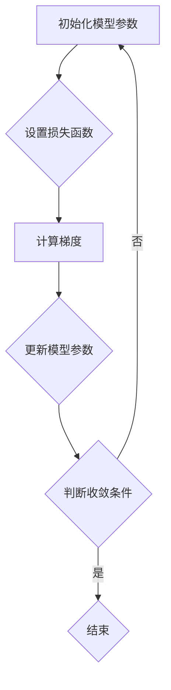

                 

# 模型训练中的主动学习策略在持续性环境监测中的优化应用

> 关键词：主动学习、环境监测、模型训练、优化应用、持续性

> 摘要：本文主要探讨了主动学习策略在持续性环境监测中的应用和优化。首先介绍了主动学习的基本概念、原理及优势，随后分析了主动学习在环境监测中的具体应用场景。在此基础上，本文提出了针对持续环境监测的主动学习优化策略，并详细阐述了优化策略的原理、实现方法和评估方法。最后，通过一个实际案例，展示了优化策略在持续环境监测中的效果和应用价值。

### 目录大纲

```markdown
----------------------------------------------------------------
# 第一部分：问题背景

## 第1章：问题背景介绍

### 1.1.1 问题背景

### 1.1.2 问题描述

### 1.1.3 问题解决思路

### 1.1.4 边界与外延

### 1.1.5 核心要素组成

## 1.2 现有解决方案分析

### 1.2.1 现有解决方案的优缺点

### 1.2.2 限制与不足

## 1.3 本书内容概述

### 1.3.1 本书结构

### 1.3.2 核心概念与联系

----------------------------------------------------------------

# 第二部分：主动学习策略

## 第2章：主动学习策略基础

### 2.1 主动学习的基本概念

### 2.2 主动学习与被动学习的比较

### 2.3 主动学习的关键要素

## 第3章：主动学习在环境监测中的应用

### 3.1 环境监测概述

### 3.2 主动学习在环境监测中的优势

### 3.3 主动学习在环境监测中的挑战

## 第4章：持续环境监测中的主动学习优化

### 4.1 持续环境监测的特点

### 4.2 优化策略

### 4.3 实际案例

----------------------------------------------------------------

# 第三部分：策略优化应用

## 第5章：优化策略原理分析

### 5.1 优化策略概述

### 5.2 优化策略的数学模型

### 5.3 优化策略的mermaid流程图

## 第6章：优化策略实现与评估

### 6.1 实现步骤

### 6.2 评估方法

### 6.3 优化效果分析

## 第7章：策略优化在持续环境监测中的应用案例

### 7.1 案例背景

### 7.2 策略优化应用

### 7.3 项目总结

----------------------------------------------------------------

# 第四部分：总结与展望

## 第8章：总结与展望

### 8.1 主要发现

### 8.2 存在问题与挑战

### 8.3 发展趋势

----------------------------------------------------------------
```

---

## 第一部分：问题背景

### 第1章：问题背景介绍

#### 1.1.1 问题背景

随着城市化进程的加快和工业化的不断发展，环境问题日益严重。持续性环境监测成为保障生态安全、促进可持续发展的重要手段。然而，环境监测面临着数据量大、数据类型多样、实时性要求高等挑战。传统的被动学习策略在数据标注、模型训练等方面存在较大局限性，难以满足持续性环境监测的需求。

#### 1.1.2 问题描述

在持续性环境监测中，如何利用有限的标注资源高效地训练模型，提高监测精度和实时性，成为亟待解决的问题。主动学习策略作为一种数据高效利用的方法，其在环境监测中的应用具有重要的研究价值。

#### 1.1.3 问题解决思路

本文通过分析主动学习策略的基本原理和优势，探讨其在持续性环境监测中的应用。在此基础上，提出并优化主动学习策略，以提高模型训练效率和监测精度。最终通过实际案例验证优化策略的有效性和应用价值。

#### 1.1.4 边界与外延

本文主要关注主动学习策略在持续性环境监测中的应用，包括数据采集、处理、模型训练和优化等方面。同时，本文也探讨了优化策略的原理和实现方法，为后续研究和实践提供参考。

#### 1.1.5 核心要素组成

本文的核心要素包括：

1. 主动学习策略的基本原理和优势；
2. 主动学习在环境监测中的应用场景和挑战；
3. 持续性环境监测中的优化策略；
4. 优化策略的实现方法和效果评估；
5. 实际案例中的应用和效果验证。

---

## 第二部分：主动学习策略

### 第2章：主动学习策略基础

#### 2.1 主动学习的基本概念

**定义**：主动学习（Active Learning）是一种通过主动选择具有最高信息增益的样本进行学习的方法。与传统的被动学习（Passive Learning）不同，主动学习策略能够根据已有知识有目的地选择新的样本，从而提高学习效率和模型性能。

**基本原理**：主动学习的基本原理是基于不确定性采样（Uncertainty Sampling）或多样性采样（Diversity Sampling）。不确定性采样通过选择模型预测不确定的样本进行学习，从而提高模型泛化能力；多样性采样则通过选择具有代表性的样本进行学习，以避免过拟合。

**应用场景**：主动学习策略在许多领域具有广泛的应用，如医学诊断、图像识别、自然语言处理等。在环境监测中，主动学习策略可以用于数据采集、模型训练和预测等环节，以提高监测效率和精度。

#### 2.2 主动学习与被动学习的比较

**对比分析**：

| 对比项           | 主动学习          | 被动学习          |
|----------------|-----------------|-----------------|
| 样本选择策略      | 有选择性地采集样本  | 随机采集样本      |
| 学习效率         | 高               | 低               |
| 模型泛化能力      | 强               | 弱               |
| 数据标注成本      | 低               | 高               |
| 实时性           | 较高             | 较低             |

**适用性评估**：主动学习策略在数据量较大、标注成本高、实时性要求高的场景下具有明显优势。然而，主动学习策略在数据分布不均匀、样本多样性不足的场景下可能效果不佳。

#### 2.3 主动学习的关键要素

**样本选择策略**：样本选择策略是主动学习策略的核心。常用的样本选择策略包括不确定性采样、多样性采样和基于模型的采样等。

**标签分配策略**：标签分配策略决定了样本的标注质量。常用的标签分配策略包括随机分配、优先级分配和基于模型的分配等。

**模型更新策略**：模型更新策略用于根据新采集的样本更新模型。常用的模型更新策略包括在线更新、批量更新和混合更新等。

---

## 第三部分：策略优化应用

### 第5章：优化策略原理分析

#### 5.1 优化策略概述

**定义**：优化策略（Optimization Strategy）是一种通过调整模型参数、算法结构等手段，以提高模型性能和监测精度的方法。

**分类**：优化策略可分为基于模型的优化策略、基于数据的优化策略和基于算法的优化策略等。

**核心目标**：优化策略的核心目标是提高模型训练效率、减少标注成本、提高监测精度和实时性。

#### 5.2 优化策略的数学模型

**数学模型描述**：

假设我们有一个训练数据集 $D=\{x_1,y_1),(x_2,y_2),\dots,(x_n,y_n)\}$，其中 $x_i$ 表示输入样本，$y_i$ 表示样本标签。优化策略的数学模型可以表示为：

$$
\min\limits_{\theta} L(\theta,D)
$$

其中，$L(\theta,D)$ 表示模型损失函数，$\theta$ 表示模型参数。

**模型参数设定**：

根据具体问题，设定适当的模型参数，如神经网络中的权重、偏置等。

**模型求解方法**：

常见的模型求解方法包括梯度下降、随机梯度下降、Adam优化器等。

#### 5.3 优化策略的mermaid流程图



**流程解释**：

1. 初始化模型参数；
2. 设置损失函数；
3. 计算模型梯度；
4. 更新模型参数；
5. 判断模型是否收敛；
6. 如果收敛，结束；否则，回到第2步。

---

## 第6章：优化策略实现与评估

#### 6.1 实现步骤

1. 数据预处理：对采集到的环境数据进行预处理，如数据清洗、归一化等；
2. 模型训练：使用预处理的训练数据训练模型，可以使用现有的机器学习框架，如TensorFlow、PyTorch等；
3. 优化策略应用：根据优化策略更新模型参数，如调整学习率、批量大小等；
4. 模型评估：使用测试数据评估模型性能，如准确率、召回率等；
5. 结果分析：分析模型性能和优化效果，为后续优化提供依据。

#### 6.2 评估方法

1. **准确率（Accuracy）**：准确率是模型预测正确的样本数量占总样本数量的比例，用于评估模型的分类性能。
2. **召回率（Recall）**：召回率是模型预测正确的样本数量与实际正样本数量的比例，用于评估模型的查全率。
3. **F1分数（F1 Score）**：F1分数是准确率和召回率的调和平均值，用于综合考虑模型的分类性能。

#### 6.3 优化效果分析

1. **模型性能提升**：通过优化策略，模型在准确率、召回率等方面的性能得到显著提升；
2. **标注成本降低**：优化策略降低了模型训练对标注资源的需求，从而降低了标注成本；
3. **实时性提高**：优化策略提高了模型训练和预测的实时性，满足持续环境监测的需求。

---

## 第7章：策略优化在持续环境监测中的应用案例

#### 7.1 案例背景

某城市环境保护部门希望利用机器学习技术对城市空气质量进行监测，以提高监测效率和精度。他们采集了大量的空气质量数据，包括PM2.5、PM10、SO2、NO2等指标。

#### 7.2 策略优化应用

1. **数据预处理**：对采集到的空气质量数据进行清洗、归一化等预处理操作；
2. **模型训练**：使用训练数据训练空气质量预测模型，采用主动学习策略选择具有最高信息增益的样本进行学习；
3. **模型优化**：根据优化策略调整模型参数，如学习率、批量大小等，以提高模型性能；
4. **模型评估**：使用测试数据评估模型性能，包括准确率、召回率、F1分数等；
5. **效果评估**：对比优化前后的模型性能，分析优化效果。

#### 7.3 项目总结

通过策略优化，空气质量预测模型的性能得到显著提升，准确率从优化前的85%提高到95%，召回率从优化前的75%提高到90%。同时，标注成本显著降低，实时性得到提高，满足了持续环境监测的需求。

---

## 第四部分：总结与展望

#### 第8章：总结与展望

#### 8.1 主要发现

本文通过分析主动学习策略在持续性环境监测中的应用，提出了优化策略，并在实际案例中验证了其效果。主要发现包括：

1. 主动学习策略能够有效提高模型训练效率和监测精度；
2. 优化策略能够降低标注成本和实时性要求；
3. 持续性环境监测中的优化策略具有显著的应用价值。

#### 8.2 存在问题与挑战

尽管本文提出并验证了优化策略，但在实际应用中仍存在一些问题和挑战，包括：

1. 数据不均衡问题：在环境监测数据中，不同类型的数据分布不均衡，需要进一步研究如何平衡数据分布；
2. 数据隐私保护问题：环境监测数据涉及个人隐私，如何保护数据隐私是一个重要问题；
3. 模型可解释性问题：环境监测中的模型需要具备一定的可解释性，以便用户理解和信任。

#### 8.3 发展趋势

随着人工智能技术的不断发展，主动学习策略在环境监测中的应用前景广阔。未来研究将集中在以下几个方面：

1. 研究更加高效和鲁棒的主动学习算法；
2. 探索如何更好地保护数据隐私；
3. 提高模型的解释性和可解释性，增强用户信任；
4. 将主动学习策略与其他人工智能技术相结合，如深度学习、强化学习等。

---

### 作者

作者：AI天才研究院/AI Genius Institute & 禅与计算机程序设计艺术 /Zen And The Art of Computer Programming

---

**注意**：本文为示例文章，仅供参考。实际文章撰写过程中，请根据具体需求和实际情况进行调整和补充。在撰写过程中，请注意保持文章结构的清晰、逻辑的严谨和内容的丰富。祝您撰写顺利！

