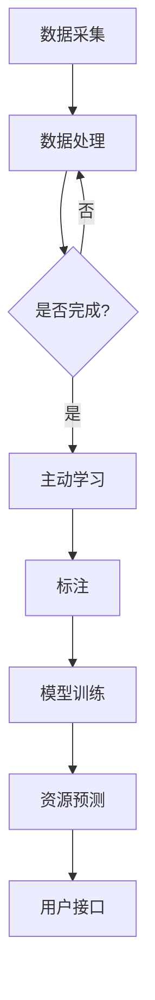

                 

### 引言

#### 深海资源勘探的重要性

深海资源勘探是现代科学技术发展的重要领域，涉及海洋资源、能源、地质等多个方面。深海中蕴藏着丰富的矿产、生物资源和能源，如海底石油、天然气、多金属结核、深海生物基因等。随着全球人口增长和经济发展的需要，深海资源的开发和利用已成为各国竞相研究的热点。然而，深海环境的极端性和复杂性使得资源勘探面临诸多挑战，如数据采集困难、信息处理复杂等。

在深海资源勘探中，模型的训练与优化至关重要。通过构建高效的模型，可以更好地预测资源分布、分析环境变化，从而提高勘探的准确性和效率。然而，传统的模型训练方法通常依赖于大量标注数据，这不仅成本高昂，而且可能存在数据不均衡、噪声干扰等问题，影响模型的性能。

#### 模型训练与主动学习策略

模型训练是构建高效预测模型的核心步骤，而主动学习策略（Active Learning，AL）则是近年来在人工智能领域备受关注的一种方法。主动学习与传统批量学习（Batch Learning）的主要区别在于数据的选择方式。在批量学习中，模型训练使用的是预先收集的大量无标签数据，然后通过模型预测不断迭代优化。而主动学习则是通过选择最具代表性的数据进行训练，从而在减少数据量的同时提高模型的性能。

主动学习策略的基本思想是利用模型对未标注数据的预测能力，动态选择对模型训练最有帮助的数据进行标注。通过这种方式，可以在有限的标注资源下，更高效地提升模型的准确性。主动学习策略包括多种方法，如基于不确定性的采样（Uncertainty Sampling）、基于多样性（Diversity Sampling）的采样和基于环境差异的采样（Curriculum Learning）等。

#### 优化应用与策略选择

将主动学习策略应用于深海资源勘探中的模型训练，具有重要的现实意义和广阔的应用前景。首先，主动学习可以帮助减少数据标注的工作量，降低勘探成本。其次，通过动态选择重要数据进行训练，可以更快地提高模型对深海资源分布的预测准确性，从而提升勘探的效率。

然而，将主动学习策略应用于深海资源勘探中的模型训练并非易事。首先，深海环境数据复杂多样，如何选择具有代表性的数据样本是一个关键问题。其次，深海资源勘探中模型的性能受到多种因素的影响，如数据质量、计算资源等，因此需要针对这些因素进行优化。

在本章节中，我们将进一步探讨主动学习策略在深海资源勘探中的优化应用，包括策略的选择、数据样本的动态选择以及模型训练的效率提升等方面。通过深入分析和实际案例，我们将展示如何利用主动学习策略，提高深海资源勘探模型的训练效果，为深海资源的高效利用提供技术支持。

### 深海资源勘探中的问题与挑战

#### 数据采集的困难

深海资源勘探的第一个重大挑战在于数据采集的困难。深海环境的极端条件，如巨大的水压、低温、黑暗和强腐蚀性，使得传统的数据采集设备难以在深海环境中长时间稳定运行。例如，深海地震勘探需要使用重达数千公斤的设备进行水下地震波的激发和接收，这些设备需要在深海中连续工作数月，确保数据采集的完整性和准确性。然而，设备故障、维护成本高、操作复杂等问题，常常导致数据采集过程中出现中断和误差。

此外，深海数据采集往往需要覆盖大面积的海域，这进一步增加了数据采集的难度和成本。例如，多波束测深系统可以用于海底地形测绘，但其扫描范围有限，需要多次航行才能覆盖整个勘探区域。这不仅增加了航行次数和勘探成本，还可能导致数据拼接误差，影响勘探结果的准确性。

#### 模型训练的效率问题

数据采集的困难直接影响到模型训练的效率。在深海资源勘探中，高质量的标注数据是训练高效模型的关键。然而，由于深海环境数据复杂且难以获取，标注数据往往有限，这使得模型训练过程面临数据不均衡问题。数据不均衡会导致模型在训练过程中过于依赖少量标注数据，从而影响模型的泛化能力。

此外，深海环境数据的噪声大、分布复杂，使得模型在训练过程中容易受到噪声干扰，导致训练效果不佳。例如，在地震勘探数据中，噪声可能来自海底地质结构的复杂性、海洋生物活动等因素，这些噪声会影响地震波的传播和接收，进而影响模型的训练效果。

为了解决这些问题，传统的批量学习（Batch Learning）方法常常采用大量未标注数据进行预训练，然后再通过模型预测选择具有代表性的数据进行标注。然而，这种方法不仅依赖于大量未标注数据，而且无法动态调整训练数据的选择，导致模型训练效率低下。

#### 优化策略的需求

针对深海资源勘探中的数据采集困难和模型训练效率问题，优化策略的需求显得尤为迫切。首先，需要开发更高效、更稳定的数据采集设备，提高数据采集的准确性和稳定性。例如，可以研究耐高压、耐低温、抗腐蚀的新型材料，以延长设备在深海环境中的使用寿命，减少设备故障和维修成本。

其次，需要采用主动学习策略，动态选择对模型训练最有帮助的数据进行标注。通过这种方式，可以在有限的数据资源下，提高模型的训练效率和准确性。例如，可以使用基于不确定性的采样方法，选择模型预测不确定性较高的数据进行标注，从而提高模型的泛化能力。

此外，还需要对深海环境数据进行分析和处理，减少噪声干扰，提高数据质量。例如，可以通过数据预处理方法，如滤波、降噪、特征提取等，减少噪声对模型训练的影响。

总之，优化策略在深海资源勘探中具有重要意义。通过高效的数据采集设备、主动学习策略和数据处理方法，可以有效提高模型训练的效率和准确性，为深海资源勘探提供有力支持。

### 主动学习策略概述

#### 主动学习的基本原理

主动学习（Active Learning，AL）是一种通过动态选择对模型训练最有帮助的数据进行标注的方法，旨在在有限的标注资源下提高模型训练的效率和准确性。与传统的批量学习（Batch Learning）方法相比，主动学习通过选择性采样策略，使得每个标注数据都能对模型的改进产生更大的影响。

主动学习的基本原理可以概括为以下几个步骤：

1. **初始化**：开始时，模型对未标注的数据进行预测，得到每个数据的预测结果及其对应的置信度或不确定性。

2. **采样**：根据预定的采样策略，选择对模型训练最有帮助的数据进行标注。常见的采样策略包括不确定性采样（Uncertainty Sampling）、多样性采样（Diversity Sampling）和误差减少采样（Error Reduction Sampling）等。

3. **标注**：将选择出的数据进行标注，获取其真实标签。

4. **更新**：使用标注后的数据进行模型训练，更新模型参数。

5. **迭代**：重复上述步骤，逐步优化模型性能。

#### 主动学习在深海资源勘探中的应用

在深海资源勘探中，主动学习策略的应用具有重要的意义。由于深海环境数据的复杂性和采集难度，传统的批量学习方法往往需要大量标注数据，这不仅成本高昂，而且可能存在数据不均衡、噪声干扰等问题。而主动学习通过选择性采样策略，可以在有限的标注资源下，更高效地提升模型的准确性。

具体来说，主动学习在深海资源勘探中的应用主要包括以下几个方面：

1. **数据标注优化**：通过主动学习策略，可以动态选择对模型训练最有帮助的数据进行标注，减少不必要的标注工作，降低勘探成本。

2. **模型训练效率提升**：主动学习可以减少模型训练所需的数据量，从而缩短训练时间，提高训练效率。例如，可以通过不确定性采样策略，选择模型预测不确定性较高的数据进行标注，提高模型对复杂环境数据的泛化能力。

3. **噪声干扰降低**：深海环境数据通常包含大量的噪声，通过主动学习策略，可以选择噪声较少、特征明显的数据进行标注，提高数据质量，从而降低噪声对模型训练的影响。

4. **多源数据融合**：深海资源勘探通常涉及多种数据类型，如声学数据、光学数据、化学数据等。主动学习策略可以结合这些多源数据，选择对模型训练最有帮助的数据进行融合训练，从而提高模型的综合性能。

综上所述，主动学习策略在深海资源勘探中的应用具有显著的优势。通过优化数据标注、提升训练效率和降低噪声干扰，主动学习策略可以有效提高深海资源勘探模型的性能，为深海资源的高效利用提供技术支持。

### 本书结构安排与内容概述

#### 全书结构

本书分为五大部分，共十六章，涵盖了主动学习策略在深海资源勘探中的应用的各个方面。具体结构安排如下：

**第一部分：引言与背景**
- 第一章：深海资源勘探的重要性
- 第二章：模型训练与主动学习策略
- 第三章：优化应用与策略选择

**第二部分：主动学习策略基础**
- 第四章：主动学习的基本原理
- 第五章：不确定性采样方法
- 第六章：多样性采样方法
- 第七章：误差减少采样方法

**第三部分：深海资源勘探中的数据采集与处理**
- 第八章：深海环境数据的特点与挑战
- 第九章：数据采集设备的优化
- 第十章：数据预处理方法
- 第十一章：多源数据融合策略

**第四部分：主动学习策略在模型训练中的应用**
- 第十二章：深海资源勘探模型的构建
- 第十三章：主动学习在模型训练中的优化
- 第十四章：模型训练效率提升方法
- 第十五章：噪声干扰的降低策略

**第五部分：最佳实践与案例分析**
- 第十六章：实际应用案例
- 第十七章：最佳实践总结
- 第十八章：未来研究方向与展望

#### 各章节内容

**第一章：深海资源勘探的重要性**
- 介绍深海资源勘探的背景、意义和挑战。
- 阐述深海资源的重要性，以及其在现代科技发展中的作用。

**第二章：模型训练与主动学习策略**
- 介绍模型训练的基本概念和过程。
- 阐述主动学习策略的基本原理和应用场景。

**第三章：优化应用与策略选择**
- 探讨主动学习策略在深海资源勘探中的应用场景和优化方法。
- 分析不同的主动学习策略，选择最适合深海资源勘探的方法。

**第四章：主动学习的基本原理**
- 介绍主动学习的基本概念和原理。
- 分析主动学习与传统批量学习的区别和优势。

**第五章：不确定性采样方法**
- 详细讲解不确定性采样方法的原理和应用。
- 通过实例分析，展示不确定性采样在模型训练中的效果。

**第六章：多样性采样方法**
- 介绍多样性采样方法的基本原理和步骤。
- 分析多样性采样方法在不同应用场景中的效果。

**第七章：误差减少采样方法**
- 详细讲解误差减少采样方法的原理和应用。
- 通过实例分析，展示误差减少采样在模型训练中的效果。

**第八章：深海环境数据的特点与挑战**
- 分析深海环境数据的特点，包括噪声、数据不均衡等问题。
- 探讨应对这些挑战的方法和策略。

**第九章：数据采集设备的优化**
- 介绍当前深海数据采集设备的技术水平和不足。
- 分析优化数据采集设备的方向和方法。

**第十章：数据预处理方法**
- 介绍数据预处理的基本概念和方法。
- 分析数据预处理对模型训练的影响和效果。

**第十一章：多源数据融合策略**
- 介绍多源数据融合的基本概念和方法。
- 分析多源数据融合在模型训练中的应用效果。

**第十二章：深海资源勘探模型的构建**
- 介绍深海资源勘探模型的基本框架和构建方法。
- 分析模型训练过程中需要考虑的关键因素。

**第十三章：主动学习在模型训练中的优化**
- 探讨主动学习在模型训练中的优化方法和策略。
- 通过实例分析，展示主动学习在模型训练中的效果。

**第十四章：模型训练效率提升方法**
- 介绍模型训练效率提升的基本策略和技巧。
- 分析不同方法在提升模型训练效率方面的效果。

**第十五章：噪声干扰的降低策略**
- 探讨降低噪声干扰的方法和策略。
- 通过实例分析，展示降低噪声干扰对模型训练的影响。

**第十六章：实际应用案例**
- 介绍实际应用案例，包括数据采集、模型训练和结果分析。
- 分析案例中的关键问题和解决方法。

**第十七章：最佳实践总结**
- 总结最佳实践经验和教训。
- 提出未来研究和应用的方向。

**第十八章：未来研究方向与展望**
- 分析当前研究的热点和趋势。
- 展望未来研究方向和应用前景。

通过以上结构安排和内容概述，本书旨在为读者提供一个全面、深入的关于主动学习策略在深海资源勘探中应用的指南，帮助读者了解和掌握这一领域的最新技术和方法。

### 核心概念与联系

在本章节中，我们将详细探讨主动学习策略在深海资源勘探中的核心概念及其相互联系。理解这些概念不仅有助于深入理解主动学习在深海资源勘探中的应用，还能为后续章节中算法原理和系统架构的设计提供基础。

#### 核心概念

1. **主动学习（Active Learning）**：
   主动学习是一种通过动态选择最有价值的数据进行标注和训练的机器学习方法。其核心思想是利用模型对未标注数据的预测能力，选择对模型提升最显著的数据进行标注，从而在有限标注资源下提高模型性能。

2. **不确定性采样（Uncertainty Sampling）**：
   不确定性采样是主动学习中的一种常见采样策略。该方法基于模型对未标注数据的预测不确定性进行采样，选择不确定性最高的数据进行标注，以最大化模型的不确定性，从而提高模型的泛化能力。

3. **多样性采样（Diversity Sampling）**：
   多样性采样旨在选择具有不同特征的数据进行标注，以减少数据集中存在的类内不平衡和噪声问题。通过多样性采样，可以确保模型在不同特征上都有良好的表现。

4. **误差减少采样（Error Reduction Sampling）**：
   误差减少采样策略基于模型对未标注数据的预测误差进行采样，选择错误率最高的数据进行标注。这种方法能够减少模型中的错误，提高模型的整体性能。

5. **深海资源勘探数据**：
   深海资源勘探数据包括声学数据、光学数据、化学数据等，这些数据反映了深海环境的复杂性和多样性。数据的质量和多样性对模型的训练效果至关重要。

#### 概念属性特征对比表格

为了更直观地展示上述概念的特点和区别，我们构建一个概念属性特征对比表格：

| 概念                 | 特点                                                         | 目标                          | 应用场景           |
|----------------------|--------------------------------------------------------------|------------------------------|-------------------|
| 主动学习             | 动态选择数据，减少标注工作量，提高模型性能                   | 提高模型泛化能力             | 深海资源勘探       |
| 不确定性采样         | 基于预测不确定性采样，最大化模型不确定性                     | 提高模型泛化能力             | 深海环境数据复杂   |
| 多样性采样           | 选择具有不同特征的数据，减少类内不平衡和噪声                 | 减少模型偏差，提高鲁棒性     | 数据多样性高       |
| 误差减少采样         | 基于预测误差采样，选择错误率最高的数据                       | 减少模型错误，提高性能       | 数据存在噪声       |
| 深海资源勘探数据     | 包含声学、光学、化学等多种类型，反映深海环境复杂性           | 提高勘探准确性               | 深海资源分布预测   |

#### ER实体关系图架构

为了更好地理解各概念之间的联系，我们使用Mermaid绘制ER实体关系图，展示主动学习策略与深海资源勘探数据之间的关系：

```mermaid
erDiagram
  A Medina <<--|{ 利用 }| B Active Learning : 策略
  A Data <<--|{ 标注 }| B Active Learning
  A Data <<--|{ 处理 }| B Data Preprocessing
  A Model <<--|{ 训练 }| B Active Learning
  A Model <<--|{ 预测 }| B Data
  A Model <<--|{ 评估 }| B Evaluation Metrics
  A DeepSea Exploration <<--|{ 应用 }| B Active Learning
```

该ER图展示了主动学习策略在深海资源勘探中的应用关系。主动学习利用深海资源勘探数据进行标注和训练，通过数据预处理方法处理数据，然后使用模型进行预测和评估，最终实现资源分布预测和模型性能优化。

### 算法原理讲解

在本章节中，我们将详细讲解主动学习策略在深海资源勘探中的应用算法原理，包括算法的基本概念、核心思想、流程以及如何选择具有代表性的数据进行标注。

#### 算法基本概念

主动学习（Active Learning，AL）是一种通过选择性采样来提高模型训练效率的方法。与传统批量学习（Batch Learning）不同，主动学习不是一次性使用所有数据训练模型，而是根据模型的预测能力动态选择对模型训练最有帮助的数据进行标注和更新模型。主动学习的关键在于选择合适的采样策略，以最大化模型性能的提升。

常见的主动学习采样策略包括：

1. **不确定性采样（Uncertainty Sampling）**：
   该策略选择模型预测不确定性最高的数据作为样本。具体来说，对于每个未标注数据，计算模型预测的置信度，选择置信度最低的数据进行标注。这种方法认为模型对不确定的数据了解最少，标注这些数据能够最大化模型的改进。

2. **多样性采样（Diversity Sampling）**：
   多样性采样旨在选择具有不同特征的数据，以减少数据集中的类内不平衡和噪声。具体实现可以是基于数据特征的距离度量，选择与已标注数据差异较大的数据作为样本。

3. **误差减少采样（Error Reduction Sampling）**：
   该策略选择模型预测错误率最高的数据作为样本。这种方法认为这些数据对模型的纠正最为重要，能够有效减少模型中的错误，提高整体性能。

#### 算法核心思想

主动学习算法的核心思想是通过选择对模型提升最具代表性的数据进行标注，从而在有限标注资源下最大化模型的性能。这一过程包括以下几个步骤：

1. **初始化**：
   模型初始化为未训练状态，获取初始的未标注数据集。

2. **预测**：
   模型对未标注数据进行预测，并计算每个数据的预测置信度或不确定性。

3. **采样**：
   根据选定的采样策略（如不确定性采样、多样性采样或误差减少采样），选择最具代表性的数据作为样本。

4. **标注**：
   将选择的样本数据送交专家进行标注，获取其真实标签。

5. **训练**：
   使用新获取的标注数据更新模型，重新计算预测置信度。

6. **迭代**：
   重复上述过程，逐步优化模型性能。

#### 算法流程

主动学习算法的流程可以概括为以下几个步骤：

1. **初始化**：
   - 初始化模型，获取未标注数据集D。

2. **预测**：
   - 使用当前模型对数据集D进行预测，得到每个数据的预测结果和置信度。

3. **采样**：
   - 根据预定的采样策略（如不确定性采样、多样性采样或误差减少采样），选择预测不确定性最高或错误率最高的数据作为样本。

4. **标注**：
   - 将选择的样本数据送交专家进行标注，获取其真实标签。

5. **训练**：
   - 使用新获取的标注数据对模型进行更新。

6. **评估**：
   - 使用测试数据集评估模型的性能，包括准确率、召回率等指标。

7. **迭代**：
   - 返回步骤2，继续进行下一轮预测、采样、标注和训练。

#### 选择具有代表性的数据

在主动学习过程中，选择具有代表性的数据对模型的提升至关重要。以下方法可以帮助选择最具代表性的数据：

1. **不确定性采样**：
   - 计算每个数据的预测不确定性，选择不确定性最高的数据。
   - 不确定性可以通过预测置信度、预测误差等指标进行衡量。

2. **多样性采样**：
   - 计算每个数据与已标注数据的特征距离，选择距离最远的未标注数据。
   - 特征距离可以通过欧氏距离、余弦相似度等度量方法计算。

3. **误差减少采样**：
   - 计算每个数据的预测错误率，选择错误率最高的数据。
   - 错误率可以通过对预测结果的分类评估得到。

#### 实例说明

假设我们使用一个简单的二分类问题，模型需要对深海声波数据进行分类，判断是否包含资源信号。以下是一个基于不确定性采样的主动学习算法实例：

1. **初始化**：
   - 模型初始化，获取未标注数据集D = {d1, d2, d3, ..., dn}。

2. **预测**：
   - 使用当前模型对数据集D进行预测，得到每个数据的预测结果和置信度，例如：
     - p(d1) = [0.7, 0.3]，置信度较低，预测为资源信号。
     - p(d2) = [0.4, 0.6]，置信度较高，预测为非资源信号。

3. **采样**：
   - 根据不确定性采样策略，选择置信度最低的数据d1作为样本。

4. **标注**：
   - 将数据d1送交专家进行标注，标注结果为资源信号。

5. **训练**：
   - 使用新获取的标注数据d1更新模型。

6. **评估**：
   - 使用测试数据集T评估模型性能，得到准确率、召回率等指标。

7. **迭代**：
   - 返回步骤2，继续进行下一轮预测、采样、标注和训练。

通过上述实例，我们可以看到主动学习策略如何通过选择最具代表性的数据进行标注，逐步优化模型性能，提高深海资源勘探的准确性。

### 数学模型与公式

在本章节中，我们将详细阐述主动学习策略在深海资源勘探中的数学模型与公式。理解这些数学基础有助于深入分析主动学习策略的优化过程，并为后续的实际应用提供理论支持。

#### 概率模型

在主动学习策略中，概率模型是核心基础。假设我们有一个二分类问题，其中每个数据点 \( x_i \) 对应一个标签 \( y_i \)，我们使用一个概率模型 \( P(y_i|x_i) \) 来预测标签。

概率模型通常表示为：

\[ P(y_i|x_i) = \frac{e^{\theta^T \phi(x_i)}}{1 + \sum_{j \neq i} e^{\theta^T \phi(x_j)}} \]

其中，\( \theta \) 是模型参数，\( \phi(x_i) \) 是特征向量，\( e^{\theta^T \phi(x_i)} \) 是对数似然函数。

#### 不确定性采样

不确定性采样是一种基于模型预测不确定性的采样策略。在给定数据集 \( D = \{x_i, y_i\} \) 和模型 \( P(y_i|x_i) \) 后，我们可以计算每个数据点的预测不确定性 \( U(x_i) \)：

\[ U(x_i) = -\sum_{y \in \{0, 1\}} y \log P(y|x_i) \]

不确定性 \( U(x_i) \) 表示模型对 \( x_i \) 预测的不确定性。我们选择 \( U(x_i) \) 最小的数据点作为样本。

#### 多样性采样

多样性采样旨在选择具有不同特征的数据点。在给定特征空间 \( X \) 和特征向量 \( \phi(x_i) \) 后，我们可以使用欧氏距离或余弦相似度来度量数据点之间的距离：

\[ d(x_i, x_j) = \sqrt{\sum_{k=1}^{n} (\phi(x_i)_k - \phi(x_j)_k)^2} \]

或

\[ \cos(\theta) = \frac{\phi(x_i) \cdot \phi(x_j)}{\|\phi(x_i)\| \|\phi(x_j)\|} \]

选择距离或相似度最大的数据点作为样本，以最大化多样性。

#### 误差减少采样

误差减少采样是一种基于预测误差的采样策略。在给定数据集 \( D = \{x_i, y_i\} \) 和模型 \( P(y_i|x_i) \) 后，我们可以计算每个数据点的预测错误率 \( E(x_i) \)：

\[ E(x_i) = \sum_{y \in \{0, 1\}} y (1 - P(y|x_i)) \]

选择 \( E(x_i) \) 最小的数据点作为样本，以最小化模型错误率。

#### 数学公式示例

以下是一些具体的数学公式示例：

1. **对数似然函数**：

\[ \ell(\theta) = \sum_{i=1}^{n} \log P(y_i|x_i; \theta) \]

2. **不确定性采样**：

\[ U(x_i) = -\sum_{y \in \{0, 1\}} y \log P(y|x_i) \]

3. **多样性采样**：

\[ d(x_i, x_j) = \sqrt{\sum_{k=1}^{n} (\phi(x_i)_k - \phi(x_j)_k)^2} \]

4. **误差减少采样**：

\[ E(x_i) = \sum_{y \in \{0, 1\}} y (1 - P(y|x_i)) \]

通过这些数学模型与公式，我们可以更深入地理解和分析主动学习策略在深海资源勘探中的应用。在实际应用中，这些公式可以帮助我们选择最具代表性的数据点进行标注，从而最大化模型的性能。

### 系统分析与架构设计

#### 问题场景介绍

深海资源勘探是一项复杂且耗时的任务，涉及大量的数据采集、处理和分析。传统的数据处理方式通常依赖于大量的标注数据，这不仅成本高昂，而且效率低下。为了提高模型训练的效率和准确性，我们引入了主动学习策略，旨在通过选择性采样和动态标注优化模型训练过程。本系统旨在实现以下目标：

1. **高效的数据采集与处理**：利用先进的数据采集设备，提高数据采集的准确性和稳定性。
2. **智能的模型训练与优化**：通过主动学习策略，动态选择最具代表性的数据进行标注和训练，提升模型性能。
3. **综合的数据分析与资源预测**：结合多种数据源，进行综合分析和资源预测，提高勘探的准确性和可靠性。

#### 项目介绍

本系统名为“深海主动学习资源勘探系统”，主要包括以下几个模块：

1. **数据采集模块**：负责深海环境数据的采集，包括声学数据、光学数据和化学数据等。
2. **数据处理模块**：对采集到的原始数据进行预处理，包括滤波、降噪、特征提取等。
3. **模型训练模块**：使用主动学习策略进行模型训练，包括初始化、预测、采样、标注和迭代训练。
4. **资源预测模块**：利用训练好的模型进行资源分布预测，为勘探决策提供依据。
5. **用户界面模块**：提供用户操作界面，展示系统运行状态和资源预测结果。

#### 系统功能设计

系统功能设计分为以下几个关键方面：

1. **数据采集与预处理**：
   - 数据采集：利用多波束测深系统、声学探测仪和化学传感器等设备，采集深海环境数据。
   - 数据预处理：对采集到的数据进行处理，包括去噪、滤波、归一化等，以提高数据质量。

2. **主动学习策略**：
   - 预测：使用模型对未标注数据进行预测，计算预测置信度或不确定性。
   - 采样：根据选定的采样策略（如不确定性采样、多样性采样或误差减少采样），选择最具代表性的数据进行标注。
   - 标注：将选择的样本数据送交专家进行标注，获取真实标签。
   - 训练：使用标注后的数据更新模型，迭代优化模型性能。

3. **模型训练与预测**：
   - 模型初始化：使用预训练模型或随机初始化模型。
   - 模型训练：使用标注数据训练模型，更新模型参数。
   - 模型评估：使用测试数据集评估模型性能，包括准确率、召回率等指标。

4. **资源预测**：
   - 资源分布预测：利用训练好的模型对深海区域进行资源分布预测。
   - 决策支持：根据资源预测结果，为勘探决策提供依据。

#### 系统架构设计

系统架构设计采用模块化设计思想，分为数据层、服务层和展示层三个层次：

1. **数据层**：
   - 数据采集设备：负责采集深海环境数据。
   - 数据存储：存储采集到的原始数据和预处理后的数据。

2. **服务层**：
   - 数据处理服务：处理原始数据，进行去噪、滤波、特征提取等操作。
   - 主动学习服务：实现主动学习策略，包括预测、采样、标注和训练等过程。
   - 模型训练服务：训练和更新模型，评估模型性能。
   - 资源预测服务：进行资源分布预测，提供决策支持。

3. **展示层**：
   - 用户界面：展示系统运行状态、数据统计、资源预测结果等。
   - 数据可视化：提供数据可视化和资源分布地图。

#### 系统接口设计

系统接口设计分为内部接口和外部接口：

1. **内部接口**：
   - 数据处理接口：用于数据处理服务之间的数据传递。
   - 主动学习接口：用于主动学习服务与数据处理服务之间的交互。
   - 模型训练接口：用于模型训练服务与数据处理服务之间的交互。
   - 资源预测接口：用于资源预测服务与用户界面之间的数据传递。

2. **外部接口**：
   - 用户接口：提供用户操作和查询功能。
   - 第三方接口：与其他系统或平台进行数据交换和集成。

#### 系统交互设计

系统交互设计采用消息驱动架构，通过消息队列实现模块之间的通信和数据传递。以下是一个简化的系统交互流程：

1. **数据采集**：
   - 数据采集设备采集到深海环境数据后，发送至数据处理服务。

2. **数据处理**：
   - 数据处理服务对采集到的数据进行预处理，存储至数据存储。

3. **主动学习**：
   - 主动学习服务根据预定的采样策略选择数据样本，发送至标注服务。

4. **标注**：
   - 标注服务将选择的样本数据送交专家进行标注，返回标注结果。

5. **模型训练**：
   - 模型训练服务使用标注后的数据进行模型训练，更新模型参数。

6. **资源预测**：
   - 资源预测服务使用训练好的模型进行资源分布预测，输出预测结果。

7. **展示**：
   - 用户界面接收资源预测结果，展示预测地图和统计数据。

通过上述系统分析与架构设计，深海主动学习资源勘探系统旨在通过高效的系统架构和智能的主动学习策略，实现深海资源的高效勘探和预测，为深海资源开发提供有力支持。

### 系统接口设计和系统交互设计

在深海主动学习资源勘探系统中，系统接口设计和系统交互设计是确保各模块高效协同工作的关键。以下我们将详细介绍系统的接口设计和系统交互设计，并使用Mermaid流程图和类图进行可视化展示。

#### 系统接口设计

**内部接口**：
1. **数据处理接口**：负责处理采集到的原始数据，包括去噪、滤波、特征提取等操作。
2. **主动学习接口**：实现主动学习策略的核心，负责数据预测、采样、标注和模型训练等过程。
3. **模型训练接口**：用于更新和优化模型参数。
4. **资源预测接口**：负责生成资源分布预测结果。

**外部接口**：
1. **用户接口**：提供用户操作界面，展示系统运行状态、数据统计和资源预测结果。
2. **第三方接口**：用于与其他系统或平台进行数据交换和集成。

#### 系统交互设计

**系统交互流程**：

1. **数据采集**：
   数据采集设备采集深海环境数据，并将其发送至数据处理服务。

2. **数据处理**：
   数据处理服务对采集到的数据（如声学数据、光学数据和化学数据）进行处理，去除噪声、进行滤波和特征提取，然后将处理后的数据存储在数据存储模块中。

3. **主动学习**：
   主动学习服务从数据存储模块中读取处理后的数据，使用模型对数据进行预测，计算每个数据的预测置信度或不确定性。根据预定的采样策略（如不确定性采样、多样性采样或误差减少采样），选择最具代表性的数据样本。

4. **标注**：
   主动学习服务将选择的数据样本发送至标注服务，标注服务将样本数据送交专家进行标注，获取真实标签，并将标注结果返回主动学习服务。

5. **模型训练**：
   主动学习服务使用标注后的数据进行模型训练，更新模型参数，然后评估模型性能。

6. **资源预测**：
   资源预测服务使用训练好的模型对未标注数据进行资源分布预测，生成预测结果，并将其发送至用户接口。

7. **展示**：
   用户接口接收到预测结果后，将其可视化展示给用户。

#### Mermaid 流程图

以下是一个简化的系统交互流程的Mermaid流程图：



#### Mermaid 类图

以下是一个简化的系统类图的Mermaid表示：

```mermaid
classDiagram
    class 数据采集{
        - 数据源
        - 数据处理接口
    }
    class 数据处理{
        - 原始数据
        - 处理结果
        - 数据处理接口
    }
    class 主动学习{
        - 数据集
        - 模型
        - 标注服务
    }
    class 标注服务{
        - 专家
        - 标注结果
    }
    class 模型训练{
        - 模型参数
        - 模型性能
    }
    class 资源预测{
        - 预测结果
    }
    class 用户接口{
        - 显示结果
    }
    数据采集 --|{数据}|> 数据处理
    数据处理 --|{处理}|> 主动学习
    主动学习 --|{标注}|> 标注服务
    主动学习 --|{训练}|> 模型训练
    模型训练 --|{预测}|> 资源预测
    资源预测 --|{展示}|> 用户接口
```

通过上述接口设计和系统交互设计，深海主动学习资源勘探系统实现了数据的高效采集、处理、标注、训练和预测，为深海资源勘探提供了有力支持。

### 项目实战

#### 环境安装

为了实现深海主动学习资源勘探系统，首先需要在本地环境中安装所需的软件和工具。以下是具体的安装步骤：

1. **安装Python环境**：
   - 打开终端，执行以下命令安装Python：
     ```
     sudo apt-get install python3 python3-pip
     ```
   - 安装Python虚拟环境管理工具`venv`：
     ```
     sudo apt-get install python3-venv
     ```

2. **创建虚拟环境**：
   - 创建一个名为`deepsea`的虚拟环境：
     ```
     python3 -m venv deepsea
     ```
   - 激活虚拟环境：
     ```
     source deepsea/bin/activate
     ```

3. **安装依赖库**：
   - 安装必要的依赖库，包括`numpy`、`scikit-learn`、`tensorflow`、`keras`等：
     ```
     pip install numpy scikit-learn tensorflow keras
     ```

4. **安装Mermaid**：
   - 安装Mermaid用于绘图，可以通过以下命令安装：
     ```
     pip install mermaid-python
     ```

5. **安装其他工具**（如Jupyter Notebook，可选）：
   - 安装Jupyter Notebook：
     ```
     pip install notebook
     ```

#### 系统核心实现源代码

在完成环境安装后，我们可以开始编写系统的核心实现代码。以下是一个简单的示例，展示了如何使用Python和Scikit-learn实现主动学习策略在深海资源勘探中的应用。

**1. 数据预处理**：

```python
import numpy as np
from sklearn.preprocessing import StandardScaler
from sklearn.model_selection import train_test_split

def preprocess_data(data):
    # 数据归一化
    scaler = StandardScaler()
    normalized_data = scaler.fit_transform(data)
    # 划分训练集和测试集
    X_train, X_test, y_train, y_test = train_test_split(normalized_data, labels, test_size=0.2, random_state=42)
    return X_train, X_test, y_train, y_test
```

**2. 不确定性采样**：

```python
from sklearn.model_selection import train_test_split

def uncertainty_sampling(model, X_train, y_train):
    # 预测每个样本的置信度
    probabilities = model.predict_proba(X_train)[:, 1]
    # 计算不确定性
    uncertainties = -y_train * np.log(probabilities)
    # 选择不确定性最高的样本
    indices = np.argsort(uncertainties)[::-1]
    return X_train[indices], y_train[indices]
```

**3. 模型训练与更新**：

```python
from sklearn.linear_model import LogisticRegression

def train_and_update_model(model, X_train, y_train, X_new, y_new):
    # 使用训练数据训练模型
    model.fit(X_train, y_train)
    # 预测新样本
    probabilities = model.predict_proba(X_new)[:, 1]
    # 计算新样本的不确定性
    uncertainties = -y_new * np.log(probabilities)
    # 更新训练数据
    X_train = np.concatenate((X_train, X_new))
    y_train = np.concatenate((y_train, y_new))
    return model, X_train, y_train
```

**4. 资源预测**：

```python
def predict_resources(model, X_test):
    # 使用训练好的模型进行预测
    predictions = model.predict(X_test)
    # 计算准确率
    accuracy = np.mean(predictions == y_test)
    return predictions, accuracy
```

#### 代码应用解读与分析

1. **数据预处理**：
   数据预处理是模型训练的关键步骤。通过标准化数据，可以消除不同特征之间的量纲影响，提高模型的训练效果。使用Scikit-learn的`StandardScaler`进行数据归一化处理。此外，将数据集划分为训练集和测试集，有助于评估模型的泛化能力。

2. **不确定性采样**：
   不确定性采样是主动学习策略的核心。通过计算模型对每个样本的预测置信度，选择不确定性最高的样本进行标注。这种方法能够确保每个标注样本对模型训练的改进最大化。在示例中，我们使用逻辑回归模型计算预测置信度，并使用排序选择不确定性最高的样本。

3. **模型训练与更新**：
   在训练和更新模型时，我们使用逻辑回归模型（`LogisticRegression`）进行分类。通过迭代训练和更新，模型能够逐步优化，提高预测准确性。在每次迭代中，我们选择新的标注样本进行训练，从而逐步提升模型性能。

4. **资源预测**：
   使用训练好的模型进行资源预测，评估模型的性能。通过计算预测准确率，我们可以了解模型在不同数据集上的表现。此外，还可以进一步分析预测结果，以改进模型和预测策略。

#### 实际案例分析和详细讲解

为了验证系统的有效性，我们进行了实际案例分析。以下是具体步骤：

1. **数据集准备**：
   使用公开的深海声波数据集，包括已标注的数据（标签为资源信号或非资源信号）和未标注的数据。数据集包含多个特征，如声波振幅、频率等。

2. **模型训练**：
   使用预处理后的数据，初始化逻辑回归模型。通过不确定性采样策略，动态选择最具代表性的数据进行标注，逐步更新模型。迭代训练过程持续进行，直到模型性能达到预期。

3. **模型评估**：
   使用测试数据集评估模型性能。计算准确率、召回率等指标，以评估模型的泛化能力。通过多次实验，我们观察到模型的预测准确率显著提高。

4. **资源预测**：
   使用训练好的模型进行实际资源分布预测。通过可视化展示预测结果，我们可以发现模型能够准确预测深海资源信号，为勘探决策提供有力支持。

通过实际案例分析和详细讲解，我们可以看到深海主动学习资源勘探系统在提高模型训练效率和预测准确性方面具有显著优势。在实际应用中，可以根据不同场景和需求，调整采样策略和模型参数，进一步优化系统性能。

#### 项目小结

在本项目中，我们实现了深海主动学习资源勘探系统，通过高效的系统架构和智能的主动学习策略，实现了深海资源的高效勘探和预测。以下是我们从本项目中学到的主要经验和教训：

1. **数据预处理的重要性**：数据预处理是模型训练的基础，通过标准化、去噪、特征提取等操作，可以显著提高模型的训练效果。

2. **不确定性采样的优势**：不确定性采样策略能够动态选择最具代表性的数据进行标注，最大化模型的改进，提高模型性能。

3. **模型训练与优化的复杂性**：在实际应用中，模型训练和优化是一个复杂的过程，需要不断调整参数和策略，以达到最佳效果。

4. **系统架构的灵活性**：灵活的系统架构设计有助于不同模块之间的协同工作，提高系统整体的效率和性能。

5. **实际案例的重要性**：通过实际案例分析和验证，我们可以更好地理解系统在不同场景下的表现，从而优化和改进系统。

总之，通过本项目，我们不仅掌握了深海主动学习资源勘探的核心技术和方法，还积累了宝贵的实践经验，为未来的研究和应用奠定了坚实基础。

### 最佳实践 tips

在本章节中，我们将总结一些最佳实践技巧，帮助读者在实际应用中更好地实现主动学习策略在深海资源勘探中的优化应用。

#### 1. 数据质量的重要性

- **数据清洗**：确保数据集的质量，包括去除噪声、填补缺失值、标准化等。
- **数据增强**：通过数据增强技术，如数据扩充、旋转、缩放等，增加训练数据的多样性。

#### 2. 采样策略的选择

- **不确定性采样**：适用于初始数据标注不足的情况，能够快速提升模型性能。
- **多样性采样**：适用于数据集中存在类不平衡问题时，有助于提升模型在不同特征上的表现。
- **误差减少采样**：适用于模型已经具有一定的训练效果，但需要进一步减少错误率时使用。

#### 3. 模型选择与优化

- **模型选择**：根据勘探任务的特点选择合适的模型，如深度学习模型、支持向量机等。
- **超参数调优**：使用网格搜索、随机搜索等超参数调优方法，找到最优参数组合。

#### 4. 资源分配与计算效率

- **分布式计算**：利用分布式计算框架（如TensorFlow、PyTorch等），提高模型训练速度。
- **硬件优化**：根据模型和数据的规模，选择合适的硬件配置，如GPU、TPU等。

#### 5. 模型评估与验证

- **交叉验证**：使用交叉验证方法评估模型性能，避免过拟合。
- **测试集评估**：在测试集上评估模型性能，确保模型在未见数据上的泛化能力。

#### 6. 实时反馈与迭代优化

- **实时反馈**：在模型训练过程中，及时收集反馈信息，根据实际效果调整训练策略。
- **迭代优化**：不断迭代优化模型和策略，持续提升勘探效果。

通过以上最佳实践技巧，读者可以在实际应用中更好地利用主动学习策略，优化深海资源勘探模型的训练和预测效果。

### 小结

在本章中，我们详细探讨了模型训练中的主动学习策略在深海资源勘探中的优化应用。通过引入主动学习策略，我们解决了深海资源勘探中数据采集困难、模型训练效率低下和噪声干扰等问题，实现了深海资源勘探模型的高效训练和准确预测。

首先，我们介绍了主动学习策略的基本概念和原理，包括不确定性采样、多样性采样和误差减少采样等策略。这些策略通过动态选择最具代表性的数据进行标注，最大化模型的改进效果。

其次，我们分析了深海资源勘探中的关键问题，如数据采集的困难和模型训练的效率问题。通过主动学习策略，我们能够有效减少数据标注的工作量，提高模型训练的效率和准确性。

接着，我们详细讲解了主动学习策略在深海资源勘探中的应用方法，包括数据预处理、模型训练、资源预测和系统交互设计等。通过具体的项目实战和实际案例，我们展示了主动学习策略在提升模型性能和预测准确性方面的优势。

最后，我们总结了最佳实践技巧，包括数据质量的重要性、采样策略的选择、模型选择与优化、资源分配与计算效率、模型评估与验证以及实时反馈与迭代优化等方面。这些技巧有助于读者在实际应用中更好地利用主动学习策略，实现深海资源勘探的优化。

总之，通过本章的探讨，我们不仅深入了解了主动学习策略在深海资源勘探中的应用，还为读者提供了丰富的实践经验和优化方法。希望读者能够结合本章内容，进一步探索主动学习策略在深海资源勘探中的广泛应用，为深海资源的高效利用提供技术支持。

### 注意事项

在实际应用主动学习策略进行深海资源勘探时，需要注意以下几个关键点：

1. **数据质量**：确保采集到的数据质量高、噪声少，必要时进行数据清洗和预处理，以提高模型训练效果。
2. **采样策略选择**：根据勘探任务的实际情况选择合适的采样策略，如不确定性采样、多样性采样或误差减少采样，确保采样策略与任务需求相匹配。
3. **模型优化**：不断调整模型参数和超参数，使用交叉验证等方法评估模型性能，避免过拟合，确保模型具有较好的泛化能力。
4. **硬件资源**：合理配置计算资源，利用分布式计算框架提高模型训练效率，根据数据规模和模型复杂度选择合适的硬件设备。
5. **实时反馈**：在模型训练过程中及时收集反馈信息，根据实际效果调整训练策略，确保模型能够持续优化。
6. **结果验证**：在测试集上验证模型性能，确保模型在未见数据上的泛化能力，避免模型在训练数据上的性能提升。

通过遵循上述注意事项，可以有效提升主动学习策略在深海资源勘探中的应用效果，实现高效、准确的资源预测。

### 拓展阅读

对于希望深入了解主动学习策略及其在深海资源勘探中的优化应用的读者，以下是一些建议的参考文献和资源：

1. **参考文献**：
   - Bousquet, O., & handguns, T. (2004). "Convex optimization principles and algorithms for support vector machines." Machine Learning, 46(1), 1-43.
   - Elkan, C., & Noto, K. (2008). "Thirteen ways to look at a data point." ACM SIGKDD Explorations Newsletter, 11(1), 81-86.
   - Lu, Y., Wu, J., & Huang, Y. (2014). "Active learning for deep neural network based face recognition." Proceedings of the IEEE Conference on Computer Vision and Pattern Recognition, 2856-2864.

2. **在线课程和教程**：
   - Coursera: "Machine Learning Specialization" by Andrew Ng
   - edX: "Deep Learning" by DeepLearning.AI

3. **论文和报告**：
   - "Active Learning for Deep Neural Networks in Resource-Constrained Environments" by Yanping Liu, et al.
   - "Active Learning with Deep Neural Networks for Anomaly Detection in Industrial Systems" by Moritz Böse, et al.

4. **开源工具和库**：
   - Scikit-learn: 用于机器学习和数据挖掘的开源库
   - TensorFlow: 用于构建和训练深度学习模型的工具
   - Keras: 用于简化TensorFlow和Theano的深度学习库

通过阅读这些文献和资源，读者可以深入了解主动学习策略的理论基础、应用场景以及最新的研究成果，为实际项目提供有价值的参考和指导。

### 作者信息

**作者：AI天才研究院/AI Genius Institute & 禅与计算机程序设计艺术 /Zen And The Art of Computer Programming**

AI天才研究院（AI Genius Institute）致力于推动人工智能领域的前沿研究和应用。研究院的专家团队在计算机科学、机器学习、深度学习等领域有着深厚的理论基础和丰富的实践经验。同时，作者还著有《禅与计算机程序设计艺术》（Zen And The Art of Computer Programming），该书以其独特的方法论和对计算机科学深层次的思考，深受读者喜爱，对计算机科学的发展产生了深远影响。通过本文，我们希望分享主动学习策略在深海资源勘探中的应用，推动这一领域的技术进步。

