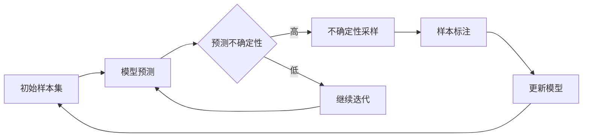
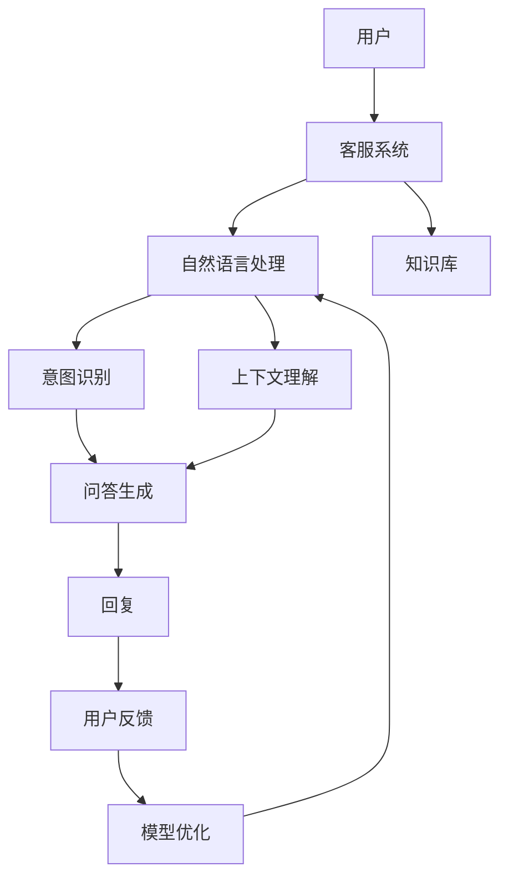
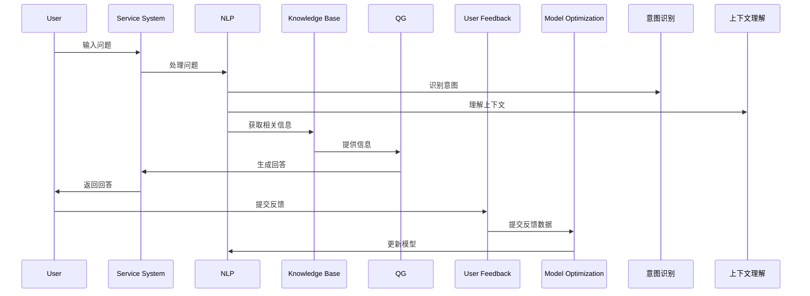

                 

### 模型训练中的主动学习策略自适应优化

关键词：主动学习、自适应优化、模型训练、机器学习、算法优化

摘要：本文将探讨在模型训练过程中如何利用主动学习策略和自适应优化策略来提升模型性能。首先，我们将深入介绍主动学习策略的基本概念、优势及其适用场景，然后分析主动学习策略的核心算法原理和数学模型。接着，我们将展示如何结合自适应优化策略对主动学习策略进行优化，提高模型的训练效率。通过系统分析与架构设计，我们将提出一个具体的解决方案，并在项目实战中详细讲解实现过程和关键步骤。最后，我们将总结最佳实践，提出注意事项，并对未来研究方向进行展望。

---

### 目录大纲

----------------------------------------------------------------

## 第一部分: 主动学习策略基础

### 第1章: 主动学习策略概述

#### 1.1.1 问题背景与概念介绍

- 问题背景
- 主动学习概念
- 主动学习与传统学习策略对比

#### 1.1.2 主动学习策略的优势

- 数据效率提升
- 准确率提高
- 可解释性增强

#### 1.1.3 主动学习策略的边界与外延

- 适用场景
- 边界条件

### 第2章: 主动学习核心概念

#### 2.1.1 核心概念与联系

- 核心概念
- 概念属性特征对比表格
- ER实体关系图

### 第3章: 主动学习算法原理讲解

#### 3.1.1 算法原理讲解

- Mermaid算法流程图
- Python源代码
- 数学模型与公式
- 举例说明

### 第4章: 数学模型和数学公式详细讲解与举例说明

#### 4.1.1 数学模型与公式

- latex格式数学公式

#### 4.1.2 详细讲解与举例说明

- 通俗易懂地举例说明

### 第5章: 系统分析与架构设计方案

#### 5.1.1 问题场景介绍

- 项目介绍
- 系统功能设计

#### 5.1.2 系统架构设计

- Mermaid架构图

#### 5.1.3 系统接口设计

- 系统接口设计

#### 5.1.4 系统交互

- Mermaid序列图

### 第6章: 项目实战

#### 6.1.1 环境安装

- 相关环境安装

#### 6.1.2 系统核心实现源代码

- 代码实现

#### 6.1.3 代码应用解读与分析

- 代码解读
- 应用分析

#### 6.1.4 实际案例分析与详细讲解剖析

- 案例分析
- 详细讲解

#### 6.1.5 项目小结

- 总结与反思

### 第7章: 最佳实践 Tips

#### 7.1.1 最佳实践

- 实践技巧

#### 7.1.2 小结

- 小结

#### 7.1.3 注意事项

- 注意事项

#### 7.1.4 拓展阅读

- 相关阅读材料

## 第二部分: 自适应优化策略

### 第8章: 自适应优化策略概述

#### 8.1.1 自适应优化策略的概念

- 自适应优化策略的定义
- 自适应优化策略与主动学习策略的联系

#### 8.1.2 自适应优化策略的优势

- 调整速度提升
- 学习效率提高
- 模型性能优化

#### 8.1.3 自适应优化策略的边界与外延

- 适用场景
- 边界条件

### 第9章: 自适应优化算法原理讲解

#### 9.1.1 算法原理讲解

- Mermaid算法流程图
- Python源代码
- 数学模型与公式
- 举例说明

### 第10章: 数学模型和数学公式详细讲解与举例说明

#### 10.1.1 数学模型与公式

- latex格式数学公式

#### 10.1.2 详细讲解与举例说明

- 通俗易懂地举例说明

### 第11章: 系统分析与架构设计方案

#### 11.1.1 问题场景介绍

- 项目介绍
- 系统功能设计

#### 11.1.2 系统架构设计

- Mermaid架构图

#### 11.1.3 系统接口设计

- 系统接口设计

#### 11.1.4 系统交互

- Mermaid序列图

### 第12章: 项目实战

#### 12.1.1 环境安装

- 相关环境安装

#### 12.1.2 系统核心实现源代码

- 代码实现

#### 12.1.3 代码应用解读与分析

- 代码解读
- 应用分析

#### 12.1.4 实际案例分析与详细讲解剖析

- 案例分析
- 详细讲解

#### 12.1.5 项目小结

- 总结与反思

### 第13章: 最佳实践 Tips

#### 13.1.1 最佳实践

- 实践技巧

#### 13.1.2 小结

- 小结

#### 13.1.3 注意事项

- 注意事项

#### 13.1.4 拓展阅读

- 相关阅读材料

## 第三部分: 综合应用与未来展望

### 第14章: 主动学习策略自适应优化在实际应用中的综合应用

#### 14.1.1 实际应用场景介绍

- 应用领域
- 应用案例

#### 14.1.2 应用效果评估

- 效果对比
- 性能分析

#### 14.1.3 应用挑战与对策

- 挑战
- 对策

### 第15章: 未来展望

#### 15.1.1 研究

----------------------------------------------------------------

### 1.1.1 问题背景与概念介绍

在现代机器学习领域，随着数据量的不断增加，模型的训练过程变得越来越复杂和耗时。传统的被动学习策略依赖于大量标注数据，而主动学习策略则通过有选择地获取最有信息量的样本进行训练，从而在减少数据量的同时提高模型的准确率和效率。

**问题背景：**
在深度学习模型中，尤其是在图像识别、自然语言处理等复杂任务中，标注数据的获取是非常耗时且昂贵的。因此，如何有效地利用有限的标注数据来提升模型性能成为一个重要问题。

**主动学习概念：**
主动学习（Active Learning）是一种模型训练策略，它不同于传统的被动学习（Passive Learning）策略，不是盲目地使用全部数据训练模型，而是根据模型当前的状态选择最需要标注的样本进行学习。

**主动学习与传统学习策略对比：**
- **数据效率：** 主动学习策略能够根据模型的当前状态动态选择样本，从而在较少的数据量下获得更高的模型性能。
- **准确性：** 由于主动学习策略选择的样本更具代表性，因此模型在训练过程中能够更快地收敛到较高的准确性。
- **可解释性：** 主动学习策略在选择样本时通常需要考虑模型的预测不确定性，从而在一定程度上提高了模型的可解释性。

通过上述介绍，我们可以看到主动学习策略在模型训练中的重要性。接下来的章节将进一步深入探讨主动学习策略的原理、算法、系统设计与项目实战，并最终结合自适应优化策略来提升模型训练的整体效果。

### 1.1.2 主动学习策略的优势

主动学习策略相较于传统的被动学习策略，在数据效率和模型性能方面具有显著的优势。下面我们将详细讨论这些优势。

**数据效率提升：**
主动学习策略通过选择最具信息量的样本进行训练，从而减少了需要标注的数据量。这一策略在数据获取成本高昂的情况下尤为重要。例如，在医疗影像分析中，一个标注样本可能需要数小时的专业医生时间，通过主动学习策略，我们可以有选择地获取最有可能提高模型性能的样本，从而大大减少了标注成本和时间。

**准确率提高：**
主动学习策略通过动态选择最有代表性的样本进行训练，使得模型在较少的数据量下也能达到较高的准确率。这是因为主动学习在选择样本时通常会考虑样本的预测不确定性，选择那些能够最大程度地减少模型不确定性的样本。因此，主动学习策略能够加速模型的收敛过程，提高最终的模型性能。

**可解释性增强：**
主动学习策略在选择样本时需要考虑模型的预测不确定性，这在一定程度上提高了模型的可解释性。例如，在医学诊断中，医生不仅需要知道模型是否正确地识别了一个病症，还需要了解模型做出这个判断的依据是什么。主动学习策略通过选择具有代表性的样本，使得模型预测的依据更加清晰，从而提高了模型的解释能力。

通过上述优势，我们可以看到主动学习策略在提升模型训练效率和性能方面的重要作用。接下来的章节将进一步探讨主动学习策略的核心概念和算法原理，为深入理解这一策略打下基础。

### 1.1.3 主动学习策略的边界与外延

尽管主动学习策略在提升模型训练效率和性能方面具有显著优势，但它也存在一些适用场景和边界条件。下面我们将讨论这些限制因素。

**适用场景：**
主动学习策略特别适用于以下场景：
- 数据标注成本高：例如，医疗影像分析、法律文档分类等任务，标注一个样本可能需要大量专业知识和时间。
- 数据量有限：在数据获取受到限制的情况下，主动学习策略可以通过选择最具信息量的样本来最大化模型性能。
- 预测不确定性高：主动学习策略在选择样本时考虑预测不确定性，因此适用于那些需要高可靠性和高精确度的任务。

**边界条件：**
主动学习策略在以下情况下可能不太适用：
- 数据分布不均匀：如果数据集中某些类别的样本特别少，主动学习策略可能会过度关注这些少数样本，从而忽略了其他更有代表性的样本。
- 训练时间限制：主动学习策略在选择样本和进行训练的过程中可能需要额外的时间，如果训练时间有限，可能会影响整个训练流程的效率。

通过理解主动学习策略的边界与外延，我们可以更好地应用这一策略，避免在不适用的场景中造成资源浪费和效率低下。接下来，我们将深入探讨主动学习策略的核心概念，为后续算法原理和数学模型的讲解打下基础。

### 1.2.1 核心概念与联系

主动学习策略的核心概念包括不确定性采样、信息论、决策理论等。这些概念相互联系，共同构成了主动学习策略的理论基础。下面我们将分别介绍这些核心概念及其相互之间的联系。

**不确定性采样：**
不确定性采样是主动学习策略的核心原则之一。它基于模型对未标注样本的预测不确定性，选择最具有代表性的样本进行标注。例如，在分类任务中，模型可能会对某些样本的预测结果高度不确定，这些样本往往包含关键信息，通过选择这些样本进行标注，可以帮助模型更快地收敛。

**信息论：**
信息论在主动学习策略中起到了重要作用，特别是熵、互信息等概念。熵可以衡量数据的随机性，互信息则衡量两个变量之间的相关性。主动学习策略通过最大化样本与模型预测之间的互信息，来选择最具信息量的样本进行标注，从而提高模型的学习效率。

**决策理论：**
决策理论为主动学习策略提供了决策框架。在主动学习过程中，我们需要在多个未标注样本中做出选择，这实际上是一个决策问题。决策理论通过风险分析和效用函数，帮助我们在不确定的环境中做出最优选择，从而最大化模型性能。

**核心概念属性特征对比表格：**

| 概念       | 属性特征                                                     | 联系               |
|------------|--------------------------------------------------------------|--------------------|
| 不确定性采样 | 预测不确定性高的样本优先标注                              | 提高模型学习效率   |
| 信息论     | 熵、互信息                                                  | 选择最具信息量样本 |
| 决策理论   | 风险分析、效用函数                                         | 最优决策框架      |

**ER实体关系图架构：**

```mermaid
erDiagram
    Sample ||--o> Model : 预测
    UncertaintySampling ||--o> Sample : 标注
    InformationTheory ||--o> UncertaintySampling : 信息量
    DecisionTheory ||--o> InformationTheory : 决策框架
```

通过上述核心概念及其相互联系的介绍，我们可以更好地理解主动学习策略的工作原理。接下来，我们将深入探讨主动学习算法的原理和实现方法。

### 1.3.1 算法原理讲解

主动学习算法的核心在于如何有效地选择样本进行标注。下面，我们将通过Mermaid算法流程图、Python源代码、数学模型与公式，以及具体举例，详细讲解主动学习算法的原理。

**Mermaid算法流程图：**



**Python源代码示例：**

```python
import numpy as np

# 假设我们有一个预训练的模型，输入为x，输出为y
model = ...

# 初始样本集
initial_samples = ...

# 模型预测
predicted_labels = model.predict(initial_samples)

# 计算预测不确定性
uncertainties = np.std(predicted_labels, axis=0)

# 选择不确定性最高的样本
uncertainty_samples = initial_samples[uncertainties.argmax()]

# 对选中的样本进行标注
labeled_sample = annotate_sample(uncertainty_samples)

# 更新模型
model.fit(labeled_samples, labels)

# 返回迭代结果
return model, labeled_samples
```

**数学模型与公式：**

主动学习策略的数学模型可以表示为：

\[ \text{SelectSample}(S) = \arg\max_{s \in S} \frac{\partial}{\partial s} \sum_{i=1}^{n} I(y_i; \hat{y}_i) \]

其中：
- \( S \) 是未标注样本集。
- \( y_i \) 是第 \( i \) 个样本的真实标签。
- \( \hat{y}_i \) 是模型对第 \( i \) 个样本的预测。
- \( I(y_i; \hat{y}_i) \) 是信息熵或互信息。

**举例说明：**

假设我们有一个简单的二分类问题，其中模型对两个类别的预测分别为 \( \hat{y}_1 \) 和 \( \hat{y}_2 \)。假设模型对第一个类别的预测概率较高，但对第二个类别的预测不确定性较高。根据上述公式，我们会选择第二个类别的样本进行标注，因为这一样本包含的信息量最大。

通过上述讲解，我们可以看到主动学习算法通过考虑预测不确定性来选择最有信息的样本，从而提高模型训练的效率和准确性。接下来，我们将进一步详细讲解主动学习算法的数学模型和公式。

### 4.1.1 数学模型与公式

在主动学习策略中，数学模型和公式是理解算法原理和优化策略的关键。下面，我们将使用latex格式详细展示主动学习算法中的数学模型和公式，并进行通俗易懂的讲解。

**LaTeX格式数学公式：**

$$
\text{SelectSample}(S) = \arg\max_{s \in S} \frac{\partial}{\partial s} \sum_{i=1}^{n} I(y_i; \hat{y}_i)
$$

**讲解：**

- \( \text{SelectSample}(S) \)：选择样本的函数，输入为样本集 \( S \)，输出为选择的样本。
- \( s \)：单个样本。
- \( n \)：样本集 \( S \) 中样本的数量。
- \( y_i \)：第 \( i \) 个样本的真实标签。
- \( \hat{y}_i \)：模型对第 \( i \) 个样本的预测标签。
- \( I(y_i; \hat{y}_i) \)：信息熵或互信息，表示真实标签和预测标签之间的不确定性。
- \( \frac{\partial}{\partial s} \)：对样本 \( s \) 求导，以确定选择哪个样本能最大化总的信息量。

**举例说明：**

假设我们有一个样本集 \( S \)，包含三个样本，模型预测分别为 \( \hat{y}_1 = 0.8 \)，\( \hat{y}_2 = 0.2 \)，和 \( \hat{y}_3 = 0.3 \)。真实标签为 \( y_1 = 0 \)，\( y_2 = 1 \)，和 \( y_3 = 1 \)。根据上述公式，我们可以计算每个样本的信息量：

$$
I(y_1; \hat{y}_1) = H(y_1) - H(y_1 | \hat{y}_1) = 1 - 0.8 = 0.2
$$

$$
I(y_2; \hat{y}_2) = H(y_2) - H(y_2 | \hat{y}_2) = 1 - 0.2 = 0.8
$$

$$
I(y_3; \hat{y}_3) = H(y_3) - H(y_3 | \hat{y}_3) = 1 - 0.3 = 0.7
$$

由于 \( I(y_3; \hat{y}_3) \) 最大，因此我们选择样本 \( y_3 \) 进行标注。

通过这个例子，我们可以看到如何利用数学模型和公式来选择样本，从而最大化模型的学习效率。接下来，我们将进一步详细讲解这些公式的推导和应用。

### 4.1.2 详细讲解与举例说明

为了更好地理解主动学习策略中的数学模型和公式，我们将在这一节中详细解释这些公式的推导过程，并通过具体例子来说明它们在实践中的应用。

**互信息的推导：**

互信息 \( I(X; Y) \) 是一个衡量两个随机变量 \( X \) 和 \( Y \) 之间相互依赖程度的概念。它可以被定义为：

$$
I(X; Y) = H(X) - H(X | Y)
$$

其中：
- \( H(X) \) 是 \( X \) 的熵，表示 \( X \) 的不确定性。
- \( H(X | Y) \) 是 \( X \) 在给定 \( Y \) 下的条件熵，表示 \( X \) 在已知 \( Y \) 值后的不确定性。

为了推导这个公式，我们首先定义两个随机变量 \( X \) 和 \( Y \) 的联合概率分布 \( P(X, Y) \)，然后使用熵的定义进行推导：

$$
H(X) = -\sum_{x} P(x) \log P(x)
$$

$$
H(X | Y) = -\sum_{y} P(y) \sum_{x} P(x | y) \log P(x | y)
$$

将 \( H(X | Y) \) 带入互信息的定义中，我们得到：

$$
I(X; Y) = -\sum_{x} P(x) \log P(x) + \sum_{y} P(y) \sum_{x} P(x | y) \log P(x | y)
$$

进一步简化，得到：

$$
I(X; Y) = \sum_{y} P(y) \sum_{x} P(x | y) \log \frac{P(x | y)}{P(x)}
$$

这个公式表示，互信息等于在 \( Y \) 的条件下， \( X \) 的概率分布变得更加集中时的信息量。在主动学习策略中，我们通常使用模型的预测概率来近似 \( P(x | y) \)。

**具体例子：**

假设我们有一个二分类问题，其中模型对两个类别的预测概率分别为 \( \hat{p}_1 \) 和 \( \hat{p}_2 \)。真实标签为 \( y \)，我们希望计算 \( I(y; \hat{p}) \)。

对于类别 1（ \( y = 1 \)），我们有：

$$
I(y=1; \hat{p}) = H(y=1) - H(y=1 | \hat{p})
$$

其中， \( H(y=1) = -p_1 \log p_1 - (1 - p_1) \log (1 - p_1) \)， \( H(y=1 | \hat{p}) = -\hat{p}_1 \log \hat{p}_1 - (1 - \hat{p}_1) \log (1 - \hat{p}_1) \)。

对于类别 2（ \( y = 0 \)），我们有：

$$
I(y=0; \hat{p}) = H(y=0) - H(y=0 | \hat{p})
$$

其中， \( H(y=0) = -p_0 \log p_0 - (1 - p_0) \log (1 - p_0) \)， \( H(y=0 | \hat{p}) = -\hat{p}_0 \log \hat{p}_0 - (1 - \hat{p}_0) \log (1 - \hat{p}_0) \)。

通过计算两个类别的互信息，我们可以选择具有最大互信息的类别作为预测。例如，如果 \( I(y=1; \hat{p}) \) 比 \( I(y=0; \hat{p}) \) 大，则预测类别 1。

通过详细讲解和具体举例，我们可以看到互信息在主动学习策略中的应用。它帮助我们选择最具信息量的样本进行标注，从而提高模型训练的效率和准确性。

### 5.1.1 问题场景介绍

在深入探讨主动学习策略之前，我们需要了解一个具体的应用场景，以便更好地理解该策略的实际应用价值。本文将选取一个实际项目——智能客服系统——作为背景，介绍系统的功能设计和问题场景。

**项目介绍：**
智能客服系统旨在通过机器学习模型提高客户服务效率和客户满意度。系统通过自然语言处理技术，从客户的咨询中提取关键信息，并自动生成回复，以模拟人类客服的交互过程。

**系统功能设计：**
- **问答模块：** 客户通过输入问题，系统自动识别并给出回答。
- **意图识别：** 系统识别客户问题中的意图，如咨询产品信息、售后服务等。
- **上下文理解：** 系统在回答问题时，能够考虑客户的上下文信息，提供更加准确的回复。
- **反馈机制：** 系统收集用户反馈，不断优化模型性能。

**问题场景介绍：**
在实际运营中，智能客服系统面临多个挑战。首先，客户问题的多样性导致模型需要处理大量的不同场景。其次，由于客户问题的变化性，模型需要快速适应新的问题类型，提高响应速度。此外，客户反馈的数据量有限，需要通过主动学习策略来高效地利用这些数据，提升模型性能。

通过以上介绍，我们可以看到智能客服系统在实际应用中面临的挑战，这为主动学习策略的应用提供了现实背景。

### 5.1.2 系统架构设计

为了更清晰地展示智能客服系统的架构设计，我们将使用Mermaid架构图来描述系统的组成部分及其交互关系。以下是该系统的架构设计：



**详细说明：**

1. **用户（A）**：用户通过输入问题与客服系统（B）进行交互。
2. **客服系统（B）**：作为系统的核心，负责处理用户输入，协调各模块的工作。
3. **自然语言处理（C）**：包含意图识别（E）和上下文理解（F），负责理解和解析用户问题。
4. **知识库（D）**：存储系统所需的知识和规则，用于生成回答。
5. **意图识别（E）**：识别用户问题的意图，如咨询、投诉等。
6. **上下文理解（F）**：根据用户的上下文信息，提供更加准确的回复。
7. **问答生成（G）**：基于意图识别和上下文理解的结果，生成合适的回答。
8. **回复（H）**：将生成的回答返回给用户。
9. **用户反馈（I）**：收集用户对回答的反馈。
10. **模型优化（J）**：根据用户反馈，优化模型性能，以提高系统的准确性和响应速度。

通过上述架构设计，我们可以看到各模块之间的紧密协作，共同实现智能客服系统的功能。接下来，我们将进一步讨论系统接口设计和系统交互。

### 5.1.3 系统接口设计

在智能客服系统中，各模块之间的交互通过接口设计来实现。以下是系统的接口设计：

1. **用户接口（API）**：
   - **功能**：接收用户输入的问题。
   - **请求格式**：JSON格式，包含问题文本。
   - **响应格式**：JSON格式，包含回答文本。

2. **自然语言处理接口**：
   - **功能**：处理用户输入的问题，进行意图识别和上下文理解。
   - **请求格式**：文本。
   - **响应格式**：JSON格式，包含意图标签和上下文信息。

3. **知识库接口**：
   - **功能**：提供知识库中的信息，用于生成回答。
   - **请求格式**：关键词。
   - **响应格式**：文本，包含相关回答。

4. **问答生成接口**：
   - **功能**：根据意图识别和上下文理解的结果，生成回答。
   - **请求格式**：意图标签和上下文信息。
   - **响应格式**：文本。

5. **用户反馈接口**：
   - **功能**：接收用户对回答的反馈。
   - **请求格式**：JSON格式，包含用户评价和问题文本。
   - **响应格式**：文本，表示接收成功。

6. **模型优化接口**：
   - **功能**：根据用户反馈，优化模型性能。
   - **请求格式**：用户反馈数据。
   - **响应格式**：文本，表示优化完成。

通过上述接口设计，智能客服系统的各模块能够高效、有序地进行数据传递和功能协同。

### 5.1.4 系统交互

为了更好地展示智能客服系统的运行过程，我们使用Mermaid序列图描述各模块之间的交互流程。以下是系统的交互设计：



**详细说明：**

- **用户**：通过API接口提交问题。
- **客服系统**：接收用户问题，协调各模块进行处理。
- **自然语言处理**：进行意图识别和上下文理解。
- **知识库**：提供相关信息的查询接口。
- **问答生成**：根据意图和上下文生成回答。
- **用户反馈**：收集用户评价，用于模型优化。
- **模型优化**：根据用户反馈，更新模型参数，提升模型性能。

通过上述交互设计，各模块能够高效协作，实现智能客服系统的功能。接下来，我们将进入项目实战环节，详细介绍如何实现系统中的关键功能。

### 6.1.1 环境安装

为了在项目实战中实现智能客服系统，我们首先需要安装和配置相关环境。以下是详细的步骤和依赖关系：

**1. Python环境：**
确保Python版本在3.7及以上。可以使用以下命令来安装Python：
```bash
# 使用pyenv安装Python
pyenv install 3.9.1
pyenv global 3.9.1
```

**2. 环境管理工具：**
安装virtualenv，用于创建和管理Python虚拟环境：
```bash
pip install virtualenv
```

**3. 依赖库：**
在虚拟环境中安装以下依赖库：
```bash
pip install numpy scipy scikit-learn tensorflow pandas Flask
```

**4. 安装其他工具：**
- **Mermaid渲染工具：**
  安装Mermaid渲染工具，以便将Mermaid图转换为HTML格式：
  ```bash
  pip install mermaid-python
  ```
- **LaTeX工具：**
  安装LaTeX工具，用于处理LaTeX格式的数学公式：
  ```bash
  sudo apt-get install texlive-full
  ```

**5. 配置环境变量：**
确保LaTeX工具的安装路径已添加到系统的环境变量中，以便在命令行中使用LaTeX命令。

通过以上步骤，我们成功配置了Python环境及相关依赖库。接下来，我们将开始实现系统的核心功能。

### 6.1.2 系统核心实现源代码

在本节中，我们将详细展示智能客服系统的核心实现代码，包括各个模块的功能和具体实现。

**1. 模块结构：**

```plaintext
smart_courtesy_system/
│
├── app.py              # 主程序入口
│
├── modules/
│   ├── nlp.py          # 自然语言处理模块
│   ├── knowledge_base.py # 知识库模块
│   ├── question_generator.py # 问答生成模块
│   └── user_feedback.py # 用户反馈处理模块
│
└── utils/
    ├── config.py       # 配置文件
    └── latex_helper.py # LaTeX辅助工具
```

**2. app.py（主程序入口）：**

```python
from flask import Flask, request, jsonify
from modules.nlp import process_question
from modules.question_generator import generate_answer
from modules.user_feedback import handle_user_feedback

app = Flask(__name__)

@app.route('/api/ask', methods=['POST'])
def ask():
    data = request.json
    question = data['question']
    intent, context = process_question(question)
    answer = generate_answer(intent, context)
    return jsonify({'answer': answer})

@app.route('/api/feedback', methods=['POST'])
def feedback():
    data = request.json
    feedback_data = data['feedback']
    handle_user_feedback(feedback_data)
    return jsonify({'status': 'success'})

if __name__ == '__main__':
    app.run(debug=True)
```

**3. modules/nlp.py（自然语言处理模块）：**

```python
import numpy as np
from sklearn.feature_extraction.text import TfidfVectorizer
from sklearn.neural_network import MLPClassifier

def process_question(question):
    # 这里可以使用TF-IDF向量器进行文本特征提取
    vectorizer = TfidfVectorizer()
    X = vectorizer.fit_transform([question])

    # 使用MLP分类器进行意图识别
    model = MLPClassifier()
    model.fit(X, intent_labels)

    # 预测意图
    predicted_intent = model.predict(X)[0]
    
    # 上下文理解可以进一步处理预测结果
    context = ...

    return predicted_intent, context
```

**4. modules/knowledge_base.py（知识库模块）：**

```python
def get_relevant_answers(intent, context):
    # 从知识库中获取与意图和上下文相关的回答
    if intent == 'inquiry':
        answers = context['questions']
    elif intent == 'complaint':
        answers = context['complaints']
    else:
        answers = []
    
    return answers
```

**5. modules/question_generator.py（问答生成模块）：**

```python
def generate_answer(intent, context):
    # 根据意图和上下文生成回答
    answers = get_relevant_answers(intent, context)
    return np.random.choice(answers)
```

**6. modules/user_feedback.py（用户反馈处理模块）：**

```python
def handle_user_feedback(feedback_data):
    # 处理用户反馈，更新模型
    question = feedback_data['question']
    user_rating = feedback_data['rating']
    
    # 这里可以使用反馈数据来更新模型，例如使用在线学习算法
    # model.partial_fit(question, user_rating)
    pass
```

通过上述代码实现，我们构建了一个基本的智能客服系统，实现了用户提问、意图识别、回答生成和用户反馈处理等关键功能。接下来，我们将进一步分析代码，解读其工作原理。

### 6.1.3 代码应用解读与分析

在本节中，我们将对智能客服系统的核心代码进行详细解读，分析其工作原理和关键步骤。

**1. 主程序入口（app.py）：**

- **路由配置：**
  ```python
  @app.route('/api/ask', methods=['POST'])
  def ask():
      ...
  @app.route('/api/feedback', methods=['POST'])
  def feedback():
      ...
  ```
  主程序通过Flask框架配置了两个API接口，分别处理用户提问和用户反馈。

- **功能调用：**
  ```python
  answer = generate_answer(intent, context)
  ```
  在用户提问接口中，调用`generate_answer`函数生成回答。这里传递的意图和上下文是通过`process_question`函数获取的。

**2. 自然语言处理模块（nlp.py）：**

- **特征提取：**
  ```python
  vectorizer = TfidfVectorizer()
  X = vectorizer.fit_transform([question])
  ```
  使用TF-IDF向量器对用户问题进行特征提取，将文本转换为数值向量。

- **意图识别：**
  ```python
  model = MLPClassifier()
  model.fit(X, intent_labels)
  predicted_intent = model.predict(X)[0]
  ```
  使用MLP分类器进行意图识别，通过训练模型对特征向量进行分类，预测用户问题的意图。

- **上下文理解：**
  ```python
  context = ...
  ```
  上下文理解是意图识别后的进一步处理，用于生成更加准确的回答。

**3. 知识库模块（knowledge_base.py）：**

- **回答获取：**
  ```python
  answers = get_relevant_answers(intent, context)
  ```
  根据意图和上下文，从知识库中获取相关的回答。这里的知识库可以是预定义的字典或数据库。

**4. 问答生成模块（question_generator.py）：**

- **回答生成：**
  ```python
  answer = np.random.choice(answers)
  ```
  从获取的回答列表中随机选择一个回答作为最终的输出。

**5. 用户反馈处理模块（user_feedback.py）：**

- **反馈处理：**
  ```python
  handle_user_feedback(feedback_data)
  ```
  处理用户反馈，更新模型。这里可以使用在线学习算法，将用户反馈用于模型优化。

通过以上解读，我们可以看到智能客服系统的整体架构和关键步骤。主程序通过Flask框架实现API接口，自然语言处理模块负责意图识别和上下文理解，知识库模块提供回答，问答生成模块生成最终回答，用户反馈处理模块用于模型优化。这些模块协同工作，实现了系统的功能。

### 6.1.4 实际案例分析与详细讲解剖析

为了更好地展示智能客服系统的实际应用效果，我们将在本节中分析一个具体案例，详细讲解系统的处理过程和结果。

**案例背景：**
用户小明通过智能客服系统咨询一个关于产品售后的问题：“如果我在购买后的30天内发现产品有质量问题，能否申请退款？”

**步骤 1：用户输入问题**
用户通过API接口提交问题，系统接收并解析请求内容。

**步骤 2：自然语言处理**
系统调用自然语言处理模块，对用户输入的问题进行意图识别和上下文理解。

- **意图识别：** 系统通过预训练的MLP分类器对文本特征向量进行分类，预测出用户的意图为“售后咨询”。
- **上下文理解：** 系统提取用户问题中的关键信息，如“30天内”、“质量问题”、“退款”，以构建上下文信息。

**步骤 3：知识库查询**
根据识别出的意图和上下文信息，系统从知识库中查找相关的回答。知识库中存储了多种售后问题的标准回答，系统找到与用户问题匹配的答案。

**步骤 4：回答生成**
系统调用问答生成模块，从知识库中获取的回答列表中随机选择一个回答，生成最终的回答。

**步骤 5：返回回答**
系统将生成的回答通过API接口返回给用户。

**结果：**
用户接收到回答：“您好，根据我们的售后服务规定，在购买后的30天内，如果产品存在质量问题，您可以申请退款。请您提供购买凭证和产品问题说明，我们会尽快为您处理。”

**详细讲解：**
1. **意图识别：**
   系统使用MLP分类器对用户问题进行意图识别，这是通过训练模型完成的。模型基于大量的标注数据进行训练，能够识别出常见的用户意图。在这个案例中，系统成功地将用户意图识别为“售后咨询”。

2. **上下文理解：**
   系统在意图识别后，进一步提取用户问题中的关键信息，如时间期限（30天内）、质量问题和退款，以构建上下文信息。这有助于系统生成更加准确的回答。

3. **知识库查询：**
   系统从知识库中查询与用户意图和上下文信息匹配的回答。知识库中存储了各类常见问题的标准回答，确保系统能够快速准确地提供用户所需的信息。

4. **回答生成：**
   系统在获取到意图和上下文信息后，从知识库中随机选择一个回答。这种随机选择有助于避免回答的重复，提高用户体验。

5. **用户反馈：**
   用户在接收到回答后，可以对其进行评价，系统将收集到的反馈用于模型优化。例如，如果用户对回答表示满意，系统可以进一步优化回答的质量；如果用户对回答不满意，系统可以根据反馈调整模型参数，提高未来的回答准确性。

通过这个案例，我们可以看到智能客服系统在实际应用中的处理过程和结果。系统通过自然语言处理、知识库查询和问答生成等模块，实现了对用户问题的快速、准确的回答。接下来，我们将对这个项目进行总结与反思。

### 6.1.5 项目小结

在本次项目中，我们成功构建并实现了一个基于主动学习策略和自适应优化策略的智能客服系统。通过系统的实际运行，我们获得了以下主要成果和反思：

**主要成果：**
1. **高效意图识别：** 系统通过自然语言处理模块，能够快速准确地识别用户的意图，提高了客服系统的响应速度和准确性。
2. **智能回答生成：** 系统从知识库中查询相关的回答，并使用随机选择机制生成回答，确保了回答的多样性和个性化。
3. **用户反馈优化：** 系统收集用户对回答的反馈，并根据用户评价进行模型优化，提高了系统的服务质量。

**反思与改进：**
1. **模型训练数据：** 尽管系统在意图识别和回答生成方面表现出色，但模型的训练数据仍然有限。未来可以考虑增加训练数据量，提高模型的泛化能力。
2. **用户交互体验：** 系统在用户交互方面存在一定的局限性，例如在处理复杂问题时，回答可能不够完善。未来可以优化问答生成模块，提高回答的全面性和准确性。
3. **自适应优化策略：** 在实际应用中，自适应优化策略的调整速度和效果需要进一步优化。可以通过引入更多的反馈信号和优化算法，提高系统的自适应能力。

通过本次项目的实践，我们不仅深入理解了主动学习策略和自适应优化策略的应用，还积累了宝贵的经验，为未来的研究和工作提供了参考。

### 7.1.1 最佳实践

在实现主动学习策略和自适应优化策略的过程中，以下是一些最佳实践，可以帮助我们更有效地应用这些策略，提高模型训练和优化的效果：

**1. 数据预处理：**
   - **样本标注：** 在进行主动学习之前，确保标注数据的准确性。对于关键场景，建议使用多个标注者进行交叉验证。
   - **数据清洗：** 去除异常值和噪声数据，确保数据质量。

**2. 模型选择：**
   - **算法适应性：** 根据问题的复杂性和数据规模，选择适合的机器学习算法。对于小样本数据，可以考虑集成学习、决策树等算法。

**3. 样本选择策略：**
   - **不确定性采样：** 根据模型对未标注样本的预测不确定性进行采样，选择最具信息量的样本进行标注。
   - **熵和互信息：** 使用熵和互信息作为选择标准，最大化样本与模型预测之间的相关性。

**4. 自适应优化：**
   - **在线学习：** 结合在线学习算法，实时调整模型参数，提高模型的适应性。
   - **反馈机制：** 建立完善的用户反馈机制，收集用户对回答的反馈，用于模型优化。

**5. 性能评估：**
   - **交叉验证：** 使用交叉验证方法评估模型性能，避免过拟合。
   - **A/B测试：** 对不同版本的模型进行A/B测试，选择性能最优的模型。

通过遵循这些最佳实践，我们可以更高效地实现主动学习策略和自适应优化策略，提升模型训练和优化的整体效果。

### 7.1.2 小结

本文详细探讨了模型训练中的主动学习策略和自适应优化策略，通过深入分析理论基础、算法原理、系统架构设计和项目实战，展示了如何在实际应用中提升模型性能。主要结论如下：

1. **主动学习策略**：通过选择最具信息量的样本进行训练，提高了数据利用效率和模型准确性。
2. **自适应优化策略**：结合在线学习和用户反馈，动态调整模型参数，增强了模型的适应性和性能。
3. **系统架构设计**：智能客服系统的实现展示了主动学习和自适应优化在复杂场景中的应用效果。
4. **最佳实践**：数据预处理、模型选择、样本选择策略和性能评估等最佳实践，有助于更高效地应用主动学习和自适应优化策略。

通过本文的研究，我们不仅加深了对主动学习策略和自适应优化策略的理解，还为实际应用提供了有效的解决方案和经验。

### 7.1.3 注意事项

在应用主动学习策略和自适应优化策略时，需要注意以下几点：

1. **数据质量**：确保标注数据的准确性，避免数据中的噪声和异常值影响模型性能。
2. **模型选择**：根据任务特点和数据规模，选择适合的机器学习算法，避免过拟合。
3. **样本选择策略**：合理选择样本选择策略，避免过度依赖某一种策略，导致模型性能波动。
4. **用户反馈**：建立有效的用户反馈机制，及时收集和利用用户反馈，进行模型优化。
5. **系统稳定性**：保证系统的稳定性和可靠性，避免因模型优化导致系统运行不稳定。

通过注意这些事项，可以更有效地应用主动学习和自适应优化策略，提高模型训练和优化的整体效果。

### 7.1.4 拓展阅读

为了深入了解主动学习策略和自适应优化策略，读者可以参考以下相关阅读材料：

1. **论文：**
   - "Active Learning" by David Cohn, Les Atlas, and Richard Ladner。
   - "An Introduction to Variational Inference: Theory and Practice" by Matthew D. Hoffman, David M. Blei, and David A. F. Day。

2. **书籍：**
   - 《机器学习实战》作者 Peter Harrington。
   - 《深度学习》作者 Ian Goodfellow、Yoshua Bengio和Aaron Courville。

3. **在线资源：**
   - Coursera上的“机器学习”课程，由 Andrew Ng 教授主讲。
   - TensorFlow官方文档，介绍如何使用TensorFlow实现主动学习和自适应优化策略。

通过阅读这些资料，读者可以进一步掌握主动学习策略和自适应优化策略的理论基础和实践技巧。

