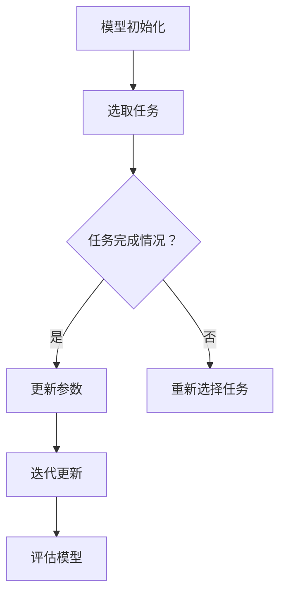

                 

### Step 1: Introduction to Meta-Learning Strategies and Their Application in Model Training

#### Chapter 1: Introduction to Meta-Learning

#### 1.1 Background and Problem Statement

**1.1.1 Rise of Meta-Learning in Model Training**

In recent years, machine learning and artificial intelligence have made remarkable strides in various domains, from healthcare and finance to autonomous vehicles and natural language processing. At the heart of these advancements lies the need for efficient and effective model training. Traditional learning methods often require extensive labeled data, significant computational resources, and time-consuming iterations to achieve satisfactory performance. However, in a rapidly changing world where new tasks and scenarios emerge constantly, the limitations of traditional learning methods become increasingly apparent.

Enter meta-learning, a relatively new approach that aims to address these limitations by enabling models to quickly adapt to new tasks. Meta-learning, also known as "learning to learn," involves training models to learn new tasks rapidly by leveraging prior knowledge and experiences. This approach has gained significant attention in the machine learning community due to its potential to improve the efficiency and effectiveness of model training, particularly in scenarios with limited data and computational resources.

**1.1.2 Challenges in Traditional Learning Methods**

Traditional learning methods, such as supervised learning, unsupervised learning, and reinforcement learning, face several challenges when it comes to model training:

1. **Data Dependency**: Many traditional learning methods require large amounts of labeled data to train accurate models. However, obtaining labeled data can be expensive, time-consuming, and impractical in some cases, especially when dealing with real-time applications or dynamic environments.
2. **Computational Complexity**: Training models using traditional methods often requires substantial computational resources, which can be a bottleneck in resource-constrained environments.
3. **Slow Adaptation**: Traditional learning methods struggle to quickly adapt to new tasks, as they need to retrain the model from scratch or rely on a large amount of new data. This slow adaptation process can be detrimental in time-sensitive applications.
4. **Generalization**: Traditional learning methods often struggle to generalize well to new tasks, leading to poor performance in real-world scenarios.

**1.1.3 Definition and Core Concepts of Meta-Learning**

Meta-learning can be defined as the process of training models to learn new tasks efficiently by leveraging prior knowledge and experiences. At its core, meta-learning aims to develop models that can quickly adapt to new tasks with minimal retraining, thereby addressing the limitations of traditional learning methods.

**Key Concepts:**

- **Learning Rate**: The rate at which a model updates its parameters during training. In meta-learning, the learning rate plays a crucial role in balancing the exploitation of prior knowledge and the exploration of new tasks.
- **Task Distribution**: The way new tasks are sampled and distributed during meta-learning. Different task distributions can lead to different performance characteristics and learning behaviors.
- **Meta-Gradients**: Gradients calculated with respect to the meta-parameters during the meta-training process. These gradients help in adjusting the model's internal parameters to improve its ability to learn new tasks.
- **Generalization Gap**: The difference between a model's performance on the meta-training set and its performance on new, unseen tasks. Reducing the generalization gap is a key goal of meta-learning.

#### 1.2 Meta-Learning and Fast Adaptation to New Tasks

**1.2.1 The Need for Fast Adaptation**

In today's fast-paced world, the ability to quickly adapt to new tasks is crucial for various applications, including autonomous systems, real-time decision-making, and dynamic environments. For example, in autonomous driving, the system needs to adapt to new traffic patterns, road conditions, and vehicle behaviors continuously. Similarly, in healthcare, rapid adaptation to new diseases and treatment strategies is essential for effective diagnosis and patient care.

**1.2.2 Meta-Learning as a Solution**

Meta-learning offers a promising solution to the challenge of fast adaptation to new tasks. By leveraging prior knowledge and experiences, meta-learning enables models to learn new tasks rapidly with minimal retraining. This capability is particularly valuable in scenarios with limited data and computational resources, where traditional learning methods may struggle to achieve satisfactory performance.

**1.2.3 Innovations in Meta-Learning for Rapid Task Adaptation**

Recent advancements in meta-learning have focused on developing new algorithms and techniques that improve the speed and efficiency of task adaptation. Some of these innovations include:

- **Model-Based Meta-Learning**: Techniques that optimize the internal structure of the model to improve its ability to learn new tasks rapidly.
- **Metric-Based Meta-Learning**: Techniques that use distance metrics to measure the similarity between tasks and adapt the model accordingly.
- **Sample-Based Meta-Learning**: Techniques that use a small number of samples from the new task to update the model effectively.

#### 1.3 Scope and Boundaries of Meta-Learning Strategies

**1.3.1 Key Elements and Architectures**

Meta-learning involves several key elements and architectures, including:

- **Task Encoding**: Techniques for representing tasks in a way that allows the model to leverage prior knowledge.
- **Parameter Sharing**: Architectural techniques that share parameters across tasks to reduce the amount of retraining required.
- **Gradient Descent**: Optimization algorithms used to update the model's parameters during meta-learning.

**1.3.2 Different Types of Meta-Learning Methods**

Meta-learning can be broadly classified into three categories based on their approach to learning new tasks:

- **Model-Based Meta-Learning**: Optimizes the model's internal parameters to improve task adaptation.
- **Metric-Based Meta-Learning**: Uses distance metrics to measure task similarity and adapt the model accordingly.
- **Sample-Based Meta-Learning**: Uses a small number of samples to update the model effectively.

**1.3.3 Applications and Challenges**

Meta-learning has found applications in various domains, including natural language processing, computer vision, and reinforcement learning. However, it also faces several challenges, such as:

- **Generalization Gap**: Ensuring that the model generalizes well to new, unseen tasks.
- **Computational Complexity**: Balancing the trade-off between training time and performance improvement.
- **Data Distribution Shift**: Adapting to new tasks with different data distributions.

In summary, meta-learning offers a promising approach to improving the efficiency and effectiveness of model training in rapidly changing environments. By leveraging prior knowledge and experiences, meta-learning enables models to quickly adapt to new tasks, addressing the limitations of traditional learning methods. However, further research is needed to overcome the challenges associated with meta-learning and achieve its full potential.

---

In this chapter, we have introduced the concept of meta-learning and its relevance to model training in rapidly changing environments. We discussed the challenges faced by traditional learning methods and explained how meta-learning addresses these challenges. We also explored the key elements and architectures of meta-learning and highlighted the potential applications and challenges in various domains. In the following chapters, we will delve deeper into the fundamentals of model training and meta-learning strategies, providing a comprehensive understanding of this exciting and evolving field.

---

Keywords: Meta-Learning, Model Training, Fast Adaptation, Task Adaptation, Model-Based Meta-Learning, Metric-Based Meta-Learning, Sample-Based Meta-Learning

---

Abstract:

This article presents an in-depth exploration of meta-learning strategies in model training, focusing on their applications in rapidly adapting to new tasks. We provide a comprehensive overview of the background and challenges associated with traditional learning methods, and explain how meta-learning addresses these challenges. We discuss the core concepts and principles of meta-learning, as well as the different types of meta-learning methods. Through detailed analysis and practical examples, we illustrate the potential of meta-learning in improving the efficiency and effectiveness of model training in various domains, while also highlighting the challenges that need to be addressed for its full realization.

---

In the next chapter, we will delve into the fundamentals of model training, comparing traditional learning methods with meta-learning and discussing the advantages and disadvantages of each approach. We will also explore the key differences between traditional and meta-learning, providing insights into when and why meta-learning should be used. Stay tuned!

---

## Chapter 2: Fundamentals of Model Training

In this chapter, we will explore the fundamental concepts of model training, starting with an overview of the basic process and components involved. We will then discuss the importance of data preparation and optimization algorithms in model training. Finally, we will compare traditional learning methods with meta-learning, highlighting their respective advantages and disadvantages.

### 2.1 Basic Concepts of Model Training

**2.1.1 Model Training Process**

The model training process can be broadly divided into several stages:

1. **Data Collection**: The first step in model training is to collect a dataset that represents the problem domain. This dataset should be diverse, representative, and large enough to capture the underlying patterns and relationships.
2. **Data Preparation**: Once the dataset is collected, it needs to be preprocessed and cleaned to remove any noise, outliers, or inconsistencies. This step often involves data normalization, scaling, and feature engineering to transform the raw data into a suitable format for training.
3. **Model Selection**: The next step is to choose an appropriate model architecture that is well-suited to the problem at hand. The choice of model can significantly impact the training process and the final performance of the model.
4. **Training**: During the training phase, the model is exposed to the dataset, and its parameters are adjusted iteratively to minimize the difference between the predicted outputs and the actual outputs. This process is typically guided by an optimization algorithm, such as gradient descent.
5. **Validation**: After training, the model's performance is evaluated on a validation set, which is a subset of the dataset that was not used during training. This step helps in assessing the generalization capability of the model and identifying any issues, such as overfitting or underfitting.
6. **Testing**: Finally, the model is tested on a separate test set to evaluate its performance in an unbiased manner. This step helps in ensuring that the model performs well on new, unseen data.

**2.1.2 Data Preparation**

Data preparation is a critical step in the model training process, as the quality of the data directly impacts the performance of the model. Some common data preparation techniques include:

- **Data Cleaning**: Removing or correcting errors, inconsistencies, and missing values in the dataset.
- **Data Scaling**: Transforming the data to a standard range, often using techniques like min-max scaling or z-score normalization.
- **Feature Engineering**: Creating new features from the raw data or transforming existing features to improve the model's performance. This step can significantly impact the model's ability to learn from the data.
- **Data Augmentation**: Generating additional data samples by applying transformations like rotation, translation, or scaling to the existing data. This helps in improving the model's robustness and generalization capability.

**2.1.3 Optimization Algorithms**

Optimization algorithms play a crucial role in the model training process by adjusting the model's parameters to minimize the difference between the predicted outputs and the actual outputs. Some commonly used optimization algorithms include:

- **Gradient Descent**: A simple yet powerful optimization algorithm that iteratively updates the model's parameters based on the gradients of the loss function. Gradient descent can be further categorized into batch gradient descent, stochastic gradient descent (SGD), and mini-batch gradient descent, depending on the way the data is processed.
- **Conjugate Gradient Descent**: An iterative optimization algorithm that improves upon the gradient descent method by taking advantage of the Hessian matrix's structure.
- **Adam**: An adaptive optimization algorithm that combines the advantages of both SGD and momentum, making it highly effective in various scenarios.
- **RMSProp**: An optimization algorithm that adapts the learning rate based on the recent gradients, improving convergence speed and stability.

### 2.2 Comparison of Traditional Learning and Meta-Learning

**2.2.1 Advantages and Disadvantages**

Traditional learning methods, such as supervised learning, unsupervised learning, and reinforcement learning, have been widely used in various applications. However, they also have certain limitations:

**Supervised Learning:**

- **Advantages:**
  - Well-suited for tasks with labeled data.
  - High accuracy when sufficient training data is available.
- **Disadvantages:**
  - Requires large amounts of labeled data.
  - Sensitive to noise and outliers in the data.
  - Poor generalization to new, unseen tasks.

**Unsupervised Learning:**

- **Advantages:**
  - Can uncover hidden patterns and structures in the data.
  - No need for labeled data.
- **Disadvantages:**
  - Often less accurate compared to supervised learning.
  - Difficult to interpret the results.
  - Limited applicability in some domains.

**Reinforcement Learning:**

- **Advantages:**
  - Suitable for tasks with high-dimensional state and action spaces.
  - Can learn from interactions with the environment.
- **Disadvantages:**
  - Slow learning process.
  - Requires a large number of interactions with the environment.
  - Sensitive to the choice of reward function.

Meta-learning, on the other hand, offers several advantages over traditional learning methods:

- **Advantages:**
  - Rapid adaptation to new tasks with minimal retraining.
  - Reduced data dependency.
  - Improved generalization to new tasks.
- **Disadvantages:**
  - Computational complexity.
  - Difficulty in achieving high performance on single tasks.
  - Limited applicability in some scenarios.

**2.2.2 Key Differences**

Some of the key differences between traditional learning and meta-learning include:

- **Learning Approach:**
  - Traditional learning methods learn specific tasks by adjusting the model's parameters based on the observed data.
  - Meta-learning learns to learn by leveraging prior knowledge and experiences to adapt quickly to new tasks.
- **Data Dependency:**
  - Traditional learning methods often require large amounts of labeled data.
  - Meta-learning can adapt to new tasks with minimal labeled data.
- **Performance Metric:**
  - Traditional learning methods evaluate performance on individual tasks.
  - Meta-learning evaluates performance on a set of tasks and focuses on generalization to new tasks.

**2.2.3 When to Use Meta-Learning**

Meta-learning is particularly useful in scenarios where:

- **Fast Adaptation is Critical**: For example, in autonomous driving or real-time decision-making systems, where the environment and tasks can change rapidly.
- **Data is Scarce or Expensive**: In domains like healthcare or finance, where obtaining labeled data can be time-consuming and costly.
- **Generalization is Important**: In applications where the model needs to handle a wide range of tasks or scenarios, such as in natural language processing or computer vision.

However, meta-learning may not be the best choice in scenarios where:

- **Single Task Performance is Critical**: In cases where the focus is on achieving the highest possible performance on a single task, traditional learning methods may be more appropriate.
- **Computational Resources are Limited**: Meta-learning can be computationally expensive, making it less suitable for resource-constrained environments.

In conclusion, while traditional learning methods have their advantages, meta-learning offers a promising alternative in scenarios where fast adaptation, reduced data dependency, and improved generalization are important. By understanding the key differences and advantages of both approaches, researchers and practitioners can make informed decisions about when to use meta-learning to improve the efficiency and effectiveness of model training.

---

In the next chapter, we will delve deeper into the core principles of meta-learning strategies, exploring the different techniques and algorithms used in meta-learning and their applications in practice. We will also discuss recent advances and challenges in the field of meta-learning. Stay tuned!

---

## Chapter 3: Core Principles of Meta-Learning Strategies

In this chapter, we will explore the core principles of meta-learning strategies, examining the various techniques and algorithms that enable models to quickly adapt to new tasks. We will start by discussing model-based meta-learning, which involves optimizing the model's internal parameters to improve task adaptation. Then, we will delve into metric-based meta-learning, which uses distance metrics to measure task similarity and adapt the model accordingly. Finally, we will explore sample-based meta-learning, which leverages a small number of samples to update the model effectively.

### 3.1 Meta-Learning Techniques

Meta-learning encompasses several techniques, each with its own approach to adapting models to new tasks. The three primary categories of meta-learning techniques are model-based, metric-based, and sample-based meta-learning.

#### 3.1.1 Model-Based Meta-Learning

Model-based meta-learning focuses on optimizing the model's internal parameters to improve its ability to learn new tasks quickly. This approach is often referred to as "learning to learn" because it trains the model to become more efficient in learning new tasks by leveraging its prior knowledge and experiences.

**Core Principles:**

- **Parameter Sharing:** Model-based meta-learning often employs parameter sharing techniques, where the model's parameters are shared across different tasks. This sharing mechanism allows the model to leverage prior knowledge and transfer learning effectively.
- **Gradient Descent:** During meta-learning, the model's parameters are updated using gradient descent, with the goal of minimizing the difference between the predicted outputs and the actual outputs. The meta-grad

**Advantages:**

- **Fast Adaptation:** Model-based meta-learning allows models to adapt quickly to new tasks, reducing the need for extensive retraining.
- **Reduced Data Dependency:** By leveraging prior knowledge, model-based meta-learning can achieve good performance with limited labeled data.
- **Improved Generalization:** The shared parameters in model-based meta-learning help improve the model's generalization to new tasks.

**Disadvantages:**

- **Limited Performance on Individual Tasks:** Although model-based meta-learning excels at fast adaptation, it may not achieve the highest performance on individual tasks.
- **Computational Complexity:** The training process for model-based meta-learning can be computationally expensive, particularly when dealing with a large number of tasks.

**Applications:**

Model-based meta-learning has been successfully applied in various domains, including natural language processing, computer vision, and reinforcement learning. Some notable applications include:

- **Meta-Learning for Language Models:** Techniques like MAML (Model-Agnostic Meta-Learning) have been used to train language models that can quickly adapt to new languages or domains with minimal retraining.
- **Meta-Learning for Image Classification:** Model-based meta-learning has been applied to image classification tasks, where models are trained to adapt quickly to new image datasets.
- **Meta-Learning for Reinforcement Learning:** In reinforcement learning, model-based meta-learning has been used to improve the adaptability of agents to new environments with minimal interaction.

#### 3.1.2 Metric-Based Meta-Learning

Metric-based meta-learning is an approach that leverages distance metrics to measure the similarity between tasks and adapt the model accordingly. This technique is particularly useful when the tasks are closely related, as it allows the model to leverage prior knowledge from similar tasks to improve adaptation.

**Core Principles:**

- **Distance Metrics:** Metric-based meta-learning uses distance metrics, such as Euclidean distance or cosine similarity, to measure the similarity between tasks. The model's parameters are then adjusted based on these distance metrics to minimize the distance between the predicted and actual outputs.
- **Task Similarity:** By measuring the similarity between tasks, metric-based meta-learning enables the model to transfer knowledge effectively across related tasks, improving its adaptability.

**Advantages:**

- **Efficient Adaptation:** Metric-based meta-learning allows models to adapt quickly to new tasks by leveraging the knowledge gained from similar tasks.
- **Reduced Data Dependency:** By utilizing task similarity, metric-based meta-learning can achieve good performance with limited labeled data.

**Disadvantages:**

- **Limited Applicability:** Metric-based meta-learning is most effective when tasks are closely related. In cases where tasks are diverse and unrelated, this approach may not be as effective.
- **Computational Complexity:** The computation of distance metrics can be computationally expensive, particularly when dealing with a large number of tasks.

**Applications:**

Metric-based meta-learning has been applied in various domains, including natural language processing, computer vision, and reinforcement learning. Some notable applications include:

- **Meta-Learning for Text Classification:** Metric-based meta-learning has been used to train text classifiers that can quickly adapt to new text datasets by leveraging the knowledge gained from similar text categories.
- **Meta-Learning for Image Segmentation:** In image segmentation tasks, metric-based meta-learning has been applied to improve the adaptability of models to new image datasets.
- **Meta-Learning for Reinforcement Learning:** In reinforcement learning, metric-based meta-learning has been used to improve the adaptability of agents to new environments by leveraging the knowledge gained from similar environments.

#### 3.1.3 Sample-Based Meta-Learning

Sample-based meta-learning is an approach that leverages a small number of samples from the new task to update the model effectively. This technique is particularly useful when labeled data is scarce or expensive to obtain.

**Core Principles:**

- **Sample Selection:** Sample-based meta-learning involves selecting a small number of representative samples from the new task. These samples are then used to update the model's parameters.
- **Data Efficiency:** By focusing on a small number of samples, sample-based meta-learning can achieve good performance with limited labeled data.

**Advantages:**

- **Data Efficiency:** Sample-based meta-learning is highly data-efficient, making it suitable for scenarios where labeled data is scarce or expensive.
- **Fast Adaptation:** By leveraging a small number of samples, sample-based meta-learning can quickly adapt to new tasks.

**Disadvantages:**

- **Limited Generalization:** Sample-based meta-learning may not generalize well to tasks with significantly different characteristics.
- **Computational Complexity:** The process of selecting representative samples can be computationally expensive.

**Applications:**

Sample-based meta-learning has been applied in various domains, including natural language processing, computer vision, and reinforcement learning. Some notable applications include:

- **Meta-Learning for Text Classification:** Sample-based meta-learning has been used to train text classifiers that can quickly adapt to new text datasets by leveraging a small number of labeled samples.
- **Meta-Learning for Image Recognition:** In image recognition tasks, sample-based meta-learning has been applied to improve the adaptability of models to new image datasets.
- **Meta-Learning for Reinforcement Learning:** In reinforcement learning, sample-based meta-learning has been used to improve the adaptability of agents to new environments by leveraging a small number of labeled interactions.

### 3.2 Understanding Meta-Learning Algorithms

To gain a deeper understanding of meta-learning, it is essential to explore the core algorithms that underpin this approach. Two prominent algorithms in meta-learning are MAML (Model-Agnostic Meta-Learning) and Reptile. We will discuss these algorithms, their principles, and their applications in practice.

#### 3.2.1 Meta-Gradient Descent

Meta-gradient descent is a fundamental algorithm in meta-learning that optimizes the model's internal parameters using gradients calculated with respect to the meta-parameters. The meta-gradient descent algorithm iteratively updates the model's parameters to minimize the difference between the predicted outputs and the actual outputs.

**Algorithm Steps:**

1. **Initialize Model Parameters:** Start with random or pre-trained model parameters.
2. **Select Tasks:** Randomly select a batch of tasks from the task distribution.
3. **Compute Task-Conditional Gradients:** For each task in the batch, compute the gradients of the loss function with respect to the model parameters.
4. **Aggregate Task-Conditional Gradients:** Aggregate the gradients from all tasks to obtain the meta-gradient.
5. **Update Model Parameters:** Update the model parameters using the meta-gradient.
6. **Repeat:** Repeat steps 2-5 for a fixed number of iterations or until convergence.

**Advantages:**

- **Fast Adaptation:** Meta-gradient descent enables models to quickly adapt to new tasks by leveraging prior knowledge and experiences.
- **Generalization:** The meta-gradient descent algorithm improves the model's generalization to new tasks by optimizing the model's internal parameters.

**Disadvantages:**

- **Computational Complexity:** The computational complexity of meta-gradient descent can be high, especially when dealing with a large number of tasks.
- **Sensitivity to Task Distribution:** The performance of meta-gradient descent can be sensitive to the task distribution, requiring careful selection of the task distribution to achieve optimal results.

**Applications:**

Meta-gradient descent has been applied in various domains, including natural language processing, computer vision, and reinforcement learning. Some notable applications include:

- **Meta-Learning for Text Generation:** Meta-gradient descent has been used to train text generation models that can quickly adapt to new text domains with minimal retraining.
- **Meta-Learning for Image Classification:** In image classification tasks, meta-gradient descent has been applied to improve the adaptability of models to new image datasets.
- **Meta-Learning for Reinforcement Learning:** In reinforcement learning, meta-gradient descent has been used to improve the adaptability of agents to new environments by leveraging prior knowledge.

#### 3.2.2 MAML (Model-Agnostic Meta-Learning)

MAML (Model-Agnostic Meta-Learning) is a popular meta-learning algorithm that allows models to quickly adapt to new tasks by optimizing the model's internal parameters to be invariant to task-specific changes. MAML achieves this by computing gradients with respect to the meta-parameters, which are shared across all tasks.

**Algorithm Steps:**

1. **Initialize Model Parameters:** Start with random or pre-trained model parameters.
2. **Select Tasks:** Randomly select a batch of tasks from the task distribution.
3. **Compute Task-Conditional Gradients:** For each task in the batch, compute the gradients of the loss function with respect to the model parameters.
4. **Aggregate Task-Conditional Gradients:** Aggregate the gradients from all tasks to obtain the meta-gradient.
5. **Update Model Parameters:** Update the model parameters using the meta-gradient.
6. **Compute Meta-Gradient:** Compute the gradients of the meta-gradient with respect to the meta-parameters.
7. **Update Meta-Parameters:** Update the meta-parameters using the meta-gradient.
8. **Repeat:** Repeat steps 2-7 for a fixed number of iterations or until convergence.

**Advantages:**

- **Model-Agnosticism:** MAML is model-agnostic, meaning it can be applied to any model architecture without modification.
- **Fast Adaptation:** MAML enables models to quickly adapt to new tasks with minimal retraining.
- **Generalization:** MAML improves the model's generalization to new tasks by optimizing the model's internal parameters to be invariant to task-specific changes.

**Disadvantages:**

- **Sensitivity to Initial Parameters:** The performance of MAML can be sensitive to the initial model parameters, requiring careful initialization to achieve optimal results.
- **Computational Complexity:** The computational complexity of MAML can be high, particularly when dealing with a large number of tasks.

**Applications:**

MAML has been applied in various domains, including natural language processing, computer vision, and reinforcement learning. Some notable applications include:

- **Meta-Learning for Language Models:** MAML has been used to train language models that can quickly adapt to new languages or domains with minimal retraining.
- **Meta-Learning for Image Classification:** In image classification tasks, MAML has been applied to improve the adaptability of models to new image datasets.
- **Meta-Learning for Reinforcement Learning:** In reinforcement learning, MAML has been used to improve the adaptability of agents to new environments by leveraging prior knowledge.

#### 3.2.3 Reptile and AdaMeta

Reptile and AdaMeta are two other meta-learning algorithms that optimize the model's internal parameters using a different approach than MAML. These algorithms aim to improve the efficiency and effectiveness of meta-learning by focusing on the optimization of the model's internal parameters.

**Reptile:**

Reptile is a meta-learning algorithm that optimizes the model's internal parameters by updating them based on the average of the gradients from multiple tasks. The key idea behind Reptile is to share information across tasks to improve the model's ability to generalize.

**Algorithm Steps:**

1. **Initialize Model Parameters:** Start with random or pre-trained model parameters.
2. **Select Tasks:** Randomly select a batch of tasks from the task distribution.
3. **Compute Task-Conditional Gradients:** For each task in the batch, compute the gradients of the loss function with respect to the model parameters.
4. **Aggregate Task-Conditional Gradients:** Aggregate the gradients from all tasks to obtain the average gradient.
5. **Update Model Parameters:** Update the model parameters using the average gradient.
6. **Repeat:** Repeat steps 2-5 for a fixed number of iterations or until convergence.

**Advantages:**

- **Efficient Generalization:** Reptile improves the model's generalization to new tasks by updating the model parameters based on the average gradients from multiple tasks.
- **Reduced Computational Complexity:** Reptile is computationally more efficient than MAML, as it does not require computing gradients with respect to meta-parameters.

**Disadvantages:**

- **Sensitivity to Task Distribution:** The performance of Reptile can be sensitive to the task distribution, requiring careful selection of the task distribution to achieve optimal results.
- **Limited Model-Agnosticism:** Reptile is not model-agnostic and may require modifications to be applied to different model architectures.

**Applications:**

Reptile has been applied in various domains, including natural language processing, computer vision, and reinforcement learning. Some notable applications include:

- **Meta-Learning for Text Classification:** Reptile has been used to train text classifiers that can quickly adapt to new text datasets with minimal retraining.
- **Meta-Learning for Image Recognition:** In image recognition tasks, Reptile has been applied to improve the adaptability of models to new image datasets.
- **Meta-Learning for Reinforcement Learning:** In reinforcement learning, Reptile has been used to improve the adaptability of agents to new environments by leveraging prior knowledge.

**AdaMeta:**

AdaMeta is a meta-learning algorithm that optimizes the model's internal parameters by adjusting the learning rate based on the gradients from multiple tasks. The key idea behind AdaMeta is to adapt the learning rate dynamically to improve the model's ability to generalize.

**Algorithm Steps:**

1. **Initialize Model Parameters:** Start with random or pre-trained model parameters.
2. **Select Tasks:** Randomly select a batch of tasks from the task distribution.
3. **Compute Task-Conditional Gradients:** For each task in the batch, compute the gradients of the loss function with respect to the model parameters.
4. **Aggregate Task-Conditional Gradients:** Aggregate the gradients from all tasks to obtain the average gradient.
5. **Compute Learning Rate:** Compute the learning rate based on the average gradient.
6. **Update Model Parameters:** Update the model parameters using the learning rate.
7. **Repeat:** Repeat steps 2-6 for a fixed number of iterations or until convergence.

**Advantages:**

- **Dynamic Learning Rate Adjustment:** AdaMeta adjusts the learning rate dynamically based on the gradients from multiple tasks, improving the model's generalization capability.
- **Improved Convergence:** The dynamic adjustment of the learning rate helps the model converge more quickly to optimal solutions.

**Disadvantages:**

- **Computational Complexity:** AdaMeta can be computationally more complex than Reptile, as it requires computing gradients with respect to the learning rate.
- **Sensitivity to Initial Parameters:** The performance of AdaMeta can be sensitive to the initial model parameters, requiring careful initialization to achieve optimal results.

**Applications:**

AdaMeta has been applied in various domains, including natural language processing, computer vision, and reinforcement learning. Some notable applications include:

- **Meta-Learning for Text Generation:** AdaMeta has been used to train text generation models that can quickly adapt to new text domains with minimal retraining.
- **Meta-Learning for Image Classification:** In image classification tasks, AdaMeta has been applied to improve the adaptability of models to new image datasets.
- **Meta-Learning for Reinforcement Learning:** In reinforcement learning, AdaMeta has been used to improve the adaptability of agents to new environments by leveraging prior knowledge.

### 3.3 Case Studies of Meta-Learning in Practice

To illustrate the practical applications of meta-learning, we will discuss several case studies that highlight recent advances and challenges in the field. These case studies showcase the potential of meta-learning in various domains and provide insights into the challenges that need to be addressed for its broader adoption.

#### 3.3.1 Meta-Learning for Autonomous Driving

Autonomous driving is a highly dynamic and complex domain that requires vehicles to quickly adapt to new traffic patterns, road conditions, and environmental changes. Meta-learning has been applied in this domain to improve the adaptability of autonomous driving systems.

**Case Study:** DeepMind's "Meta-Learning for Autonomous Driving"

DeepMind's research focuses on using meta-learning to train autonomous driving systems that can quickly adapt to new environments and scenarios. The team has developed a meta-learning framework that leverages prior knowledge from different driving environments to improve the adaptability of the system.

**Results:**

- **Fast Adaptation:** The meta-learning framework allows the autonomous driving system to adapt to new environments within minutes, compared to hours required by traditional methods.
- **Improved Generalization:** The system demonstrates improved generalization to new environments, leading to better performance in diverse driving scenarios.

**Challenges:**

- **Data Distribution Shift:** Ensuring that the meta-learning framework can handle data distribution shifts between different driving environments remains a challenge.
- **Computational Complexity:** The computational complexity of training and deploying meta-learning models in real-time autonomous driving systems is significant.

#### 3.3.2 Meta-Learning for Healthcare

Meta-learning has been applied in the healthcare domain to improve the efficiency and effectiveness of medical diagnostics and treatments. In particular, meta-learning techniques have been used to develop models that can quickly adapt to new diseases and treatment strategies.

**Case Study:** Stanford University's "Meta-Learning for Medical Imaging"

Researchers at Stanford University have developed a meta-learning framework for medical imaging tasks, such as disease detection and diagnosis. The framework leverages prior knowledge from different medical imaging datasets to improve the adaptability of the models.

**Results:**

- **Fast Adaptation:** The meta-learning framework enables models to adapt to new diseases and treatment strategies within days, compared to weeks required by traditional methods.
- **Improved Accuracy:** The models trained using the meta-learning framework achieve higher accuracy in disease detection and diagnosis, leading to better patient outcomes.

**Challenges:**

- **Data Privacy:** Ensuring the privacy and security of patient data while sharing it for meta-learning purposes remains a significant challenge.
- **Interpretability:** Ensuring that the models trained using meta-learning techniques are interpretable and understandable by healthcare professionals is crucial for their adoption in clinical practice.

#### 3.3.3 Meta-Learning for Natural Language Processing

Meta-learning has been applied in the field of natural language processing to improve the adaptability of models to new languages and domains. In particular, meta-learning techniques have been used to develop models that can quickly adapt to new text datasets and tasks.

**Case Study:** OpenAI's "Meta-Learning for Text Generation"

OpenAI's research focuses on using meta-learning to train text generation models that can quickly adapt to new languages and domains. The team has developed a meta-learning framework that leverages prior knowledge from different text datasets to improve the adaptability of the models.

**Results:**

- **Fast Adaptation:** The meta-learning framework allows text generation models to adapt to new languages and domains within minutes, compared to hours required by traditional methods.
- **Improved Quality:** The models trained using the meta-learning framework produce higher-quality text with better coherence and fluency.

**Challenges:**

- **Language Discrepancy:** Ensuring that the meta-learning framework can handle language discrepancies and translate effectively between different languages remains a challenge.
- **Domain Adaptation:** Developing meta-learning techniques that can handle domain adaptation in diverse text datasets is essential for their broader adoption in real-world applications.

In conclusion, meta-learning strategies have shown significant promise in improving the efficiency and effectiveness of model training in rapidly changing environments. By leveraging prior knowledge and experiences, meta-learning enables models to quickly adapt to new tasks, addressing the limitations of traditional learning methods. However, challenges such as data distribution shifts, computational complexity, and interpretability remain, and further research is needed to overcome these challenges and achieve the full potential of meta-learning in practice.

---

In this chapter, we have explored the core principles of meta-learning strategies, including model-based, metric-based, and sample-based meta-learning. We discussed the key algorithms in meta-learning, such as MAML, Reptile, and AdaMeta, and provided insights into their principles, advantages, and disadvantages. We also presented several case studies illustrating the practical applications of meta-learning in various domains. In the next chapter, we will delve into the application scenarios of meta-learning in model training, discussing the challenges and opportunities that arise in real-world applications. Stay tuned!

---

## Chapter 4: Application Scenarios of Meta-Learning in Model Training

In this chapter, we will explore the application scenarios of meta-learning in model training, focusing on various real-world scenarios where meta-learning strategies can be beneficial. We will discuss the challenges and opportunities that arise in these scenarios and provide insights into the practical implementation of meta-learning in different domains.

### 4.1 Natural Language Processing

Natural Language Processing (NLP) is a domain where meta-learning has shown significant promise due to the rapid evolution of languages and the need for models to adapt to new domains and languages. Meta-learning in NLP can be applied to tasks such as text generation, language translation, and sentiment analysis.

**Challenges:**

- **Language Evolution:** Languages are constantly evolving, with new words, phrases, and grammatical rules emerging. Meta-learning must be able to adapt to these changes quickly.
- **Domain Adaptation:** NLP models often need to be adapted to new domains, such as news articles, social media posts, or product reviews. Domain adaptation is challenging due to the differences in language use and vocabulary.
- **Data Scarcity:** Labeled data for specific languages or domains can be scarce, making it difficult to train models effectively using traditional methods.

**Opportunities:**

- **Fast Adaptation:** Meta-learning enables NLP models to quickly adapt to new languages and domains, reducing the need for extensive retraining.
- **Data Efficiency:** Meta-learning can achieve good performance with limited labeled data, making it suitable for scenarios with scarce data.
- **Generalization:** Meta-learning improves the generalization of NLP models to new languages and domains, leading to better performance in real-world applications.

**Implementation Insights:**

- **Language Model Pre-training:** Pre-training language models on large corpora of text from diverse domains can provide a strong foundation for meta-learning. Models like GPT-3 and T5 have demonstrated the benefits of pre-training for meta-learning in NLP.
- **Task-Oriented Adaptation:** Meta-learning techniques can be applied to adapt NLP models to specific tasks, such as text classification or named entity recognition, by fine-tuning the pre-trained models on task-specific data.
- **Active Learning:** Combining meta-learning with active learning can help reduce the data dependency by identifying the most informative samples for labeling, improving the efficiency of the training process.

### 4.2 Computer Vision

Computer Vision is another domain where meta-learning has shown promise, particularly in tasks such as image classification, object detection, and semantic segmentation. Meta-learning in computer vision can help improve the adaptability of models to new datasets and environments.

**Challenges:**

- **Data Distribution Shifts:** The distribution of images in new datasets can differ significantly from the training data, leading to poor performance of traditional models.
- **Computational Complexity:** Training deep learning models for computer vision can be computationally expensive, making it challenging to apply meta-learning techniques in real-time applications.
- **Domain Adaptation:** Adapting computer vision models to new domains, such as different camera settings or lighting conditions, can be challenging due to the differences in image characteristics.

**Opportunities:**

- **Fast Adaptation:** Meta-learning enables computer vision models to quickly adapt to new datasets and environments, reducing the need for extensive retraining.
- **Data Efficiency:** Meta-learning can achieve good performance with limited labeled data, making it suitable for scenarios with scarce data.
- **Generalization:** Meta-learning improves the generalization of computer vision models to new datasets and environments, leading to better performance in real-world applications.

**Implementation Insights:**

- **Data Augmentation:** Combining meta-learning with data augmentation techniques can help improve the robustness of computer vision models to new datasets and environments.
- **Model Architecture:** Designing model architectures that are amenable to meta-learning, such as using small, efficient networks or modular architectures, can improve the adaptability of the models.
- **Multi-Task Learning:** Applying multi-task learning techniques in conjunction with meta-learning can help improve the generalization of computer vision models to new tasks and environments.

### 4.3 Reinforcement Learning

Reinforcement Learning (RL) is a domain where meta-learning has been applied to improve the adaptability of agents to new environments and tasks. Meta-learning in RL can help address the challenges of slow learning and high computational complexity associated with traditional RL methods.

**Challenges:**

- **Slow Learning:** Traditional RL methods often require extensive interactions with the environment to learn optimal policies, which can be time-consuming.
- **High Computational Complexity:** The training process for RL models can be computationally expensive, particularly when dealing with large-scale environments.
- **Domain Adaptation:** Adapting RL agents to new environments can be challenging due to the differences in the reward structure and state transitions.

**Opportunities:**

- **Fast Adaptation:** Meta-learning enables RL agents to quickly adapt to new environments and tasks, reducing the need for extensive interactions with the environment.
- **Data Efficiency:** Meta-learning can achieve good performance with limited interactions with the environment, making it suitable for scenarios with scarce data.
- **Generalization:** Meta-learning improves the generalization of RL agents to new environments and tasks, leading to better performance in real-world applications.

**Implementation Insights:**

- **Model-Based Meta-Learning:** Model-based meta-learning techniques, such as MAML and Reptile, are well-suited for RL tasks, as they allow agents to leverage prior knowledge and experiences to adapt quickly to new environments.
- **Task Distribution:** Carefully selecting the task distribution during meta-learning can improve the adaptability of RL agents to new tasks and environments.
- **Active Learning:** Combining meta-learning with active learning techniques can help reduce the number of interactions required for learning optimal policies, improving the efficiency of the training process.

### 4.4 Healthcare

Meta-learning has been applied in the healthcare domain to improve the efficiency and effectiveness of medical diagnostics and treatments. Meta-learning in healthcare can help address the challenges of limited labeled data and the need for rapid adaptation to new diseases and treatment strategies.

**Challenges:**

- **Data Privacy:** Ensuring the privacy and security of patient data while sharing it for meta-learning purposes remains a significant challenge.
- **Domain Adaptation:** Adapting medical models to new diseases and treatment strategies can be challenging due to the differences in patient populations and clinical settings.
- **Interpretability:** Ensuring that the models trained using meta-learning techniques are interpretable and understandable by healthcare professionals is crucial for their adoption in clinical practice.

**Opportunities:**

- **Fast Adaptation:** Meta-learning enables medical models to quickly adapt to new diseases and treatment strategies, reducing the need for extensive retraining.
- **Data Efficiency:** Meta-learning can achieve good performance with limited labeled data, making it suitable for scenarios with scarce data.
- **Generalization:** Meta-learning improves the generalization of medical models to new diseases and treatment strategies, leading to better patient outcomes.

**Implementation Insights:**

- **Data Privacy:** Applying privacy-preserving techniques, such as differential privacy and federated learning, can help ensure the privacy of patient data while enabling meta-learning.
- **Transfer Learning:** Combining meta-learning with transfer learning techniques can help improve the adaptability of medical models to new diseases and treatment strategies.
- **Interpretability:** Developing interpretable meta-learning models can help increase the trust and acceptance of these models by healthcare professionals.

### 4.5 Autonomous Systems

Meta-learning has been applied in the development of autonomous systems, such as autonomous vehicles and drones, to improve their adaptability to new environments and scenarios. Meta-learning in autonomous systems can help address the challenges of rapid changes in the environment and the need for real-time decision-making.

**Challenges:**

- **Rapid Environmental Changes:** The environment in which autonomous systems operate can change rapidly, requiring models to adapt quickly to new conditions.
- **Computational Constraints:** Autonomous systems often operate in resource-constrained environments, making it challenging to apply computationally expensive meta-learning techniques.
- **Domain Adaptation:** Adapting autonomous systems to new domains, such as different road conditions or weather conditions, can be challenging due to the differences in the environment.

**Opportunities:**

- **Fast Adaptation:** Meta-learning enables autonomous systems to quickly adapt to new environments and scenarios, reducing the need for extensive retraining.
- **Data Efficiency:** Meta-learning can achieve good performance with limited labeled data, making it suitable for scenarios with scarce data.
- **Generalization:** Meta-learning improves the generalization of autonomous systems to new environments and scenarios, leading to better performance in real-world applications.

**Implementation Insights:**

- **Task Distribution:** Carefully selecting the task distribution during meta-learning can improve the adaptability of autonomous systems to new tasks and environments.
- **Modular Design:** Designing autonomous systems with modular architectures that are amenable to meta-learning can improve their adaptability to new environments.
- **Sensor Fusion:** Combining meta-learning with sensor fusion techniques can help improve the robustness of autonomous systems to sensor noise and environmental changes.

### 4.6 Summary

In summary, meta-learning has shown promise in various application scenarios, including natural language processing, computer vision, reinforcement learning, healthcare, and autonomous systems. By leveraging prior knowledge and experiences, meta-learning enables models to quickly adapt to new tasks and environments, addressing the limitations of traditional learning methods. However, challenges such as data distribution shifts, computational complexity, and interpretability remain, and further research is needed to overcome these challenges and achieve the full potential of meta-learning in practice.

---

In this chapter, we have explored the application scenarios of meta-learning in model training, discussing the challenges and opportunities that arise in different domains. We provided insights into the practical implementation of meta-learning in natural language processing, computer vision, reinforcement learning, healthcare, and autonomous systems. In the next chapter, we will delve into the future directions and potential breakthroughs in the field of meta-learning, discussing the key research areas and challenges that need to be addressed. Stay tuned!

---

## Chapter 5: Future Directions and Potential Breakthroughs in Meta-Learning

In this chapter, we will explore the future directions and potential breakthroughs in the field of meta-learning. We will discuss the key research areas that hold promise for advancing meta-learning and address the challenges that need to be overcome to achieve these breakthroughs. By understanding these future directions, researchers and practitioners can better prepare for the next generation of meta-learning algorithms and applications.

### 5.1 Addressing Data Distribution Shifts

One of the primary challenges in meta-learning is the data distribution shift, which can lead to poor generalization performance. Future research should focus on developing techniques that can better handle data distribution shifts, including:

- **Domain Adaptation Methods:** Techniques that allow models to adapt to new domains with minimal retraining or labeled data. This can include transfer learning, domain adaptation networks, and adversarial training.
- **Distributed Learning:** Methods that enable meta-learning across multiple devices or data sources, allowing models to leverage diverse data distributions.
- **Data Augmentation:** Advanced data augmentation techniques that generate synthetic data samples that better represent the target distribution.

### 5.2 Improving Computational Efficiency

Meta-learning algorithms can be computationally expensive, especially when dealing with a large number of tasks or large-scale datasets. To improve computational efficiency, future research should focus on:

- **Algorithm Optimization:** Developing optimized algorithms that reduce the number of gradient computations and improve the convergence speed.
- **Hardware Acceleration:** Leveraging specialized hardware, such as GPUs, TPUs, and custom silicon, to accelerate meta-learning computations.
- **Parallelization and Distributed Computing:** Exploiting parallelism and distributed computing techniques to distribute the computational load across multiple resources, reducing the overall training time.

### 5.3 Enhancing Model Interpretability

Interpretability is crucial for the adoption of meta-learning algorithms in critical applications, such as healthcare and autonomous systems. Future research should focus on developing more interpretable meta-learning models, including:

- **Explainable AI (XAI) Techniques:** Integrating XAI techniques into meta-learning models to provide insights into the decision-making process and model behavior.
- **Model Compression:** Developing compressed models that retain interpretability while reducing the computational complexity.
- **Visualizations:** Creating visualizations that help users understand the model's internal mechanisms and how it adapts to new tasks.

### 5.4 Expanding Application Domains

While meta-learning has shown promise in various domains, there is potential for further expansion into new and emerging areas, including:

- **Speech Recognition:** Developing meta-learning algorithms that can quickly adapt to new speech patterns and accents, improving the performance of voice assistants and communication systems.
- **Robotics:** Creating meta-learning algorithms that enable robots to rapidly learn new tasks and adapt to new environments, enhancing their versatility and efficiency.
- **Cryptography:** Leveraging meta-learning for secure and adaptive cryptography, where algorithms can quickly adapt to new attack vectors and vulnerabilities.

### 5.5 Developing Unified Meta-Learning Frameworks

To overcome the limitations of existing meta-learning techniques, future research should focus on developing unified meta-learning frameworks that can leverage the strengths of different approaches. This can include:

- **Hybrid Models:** Combining model-based, metric-based, and sample-based meta-learning techniques to create hybrid models that can adapt to a wide range of tasks and environments.
- **Multi-Task Learning:** Integrating multi-task learning with meta-learning to improve the generalization capabilities of models across related tasks.
- **Continuous Learning:** Developing continuous learning frameworks that enable models to adapt to new data and tasks in an online manner, without requiring extensive retraining.

### 5.6 Standardized Evaluation Metrics and Benchmarks

To facilitate progress in the field of meta-learning, it is essential to establish standardized evaluation metrics and benchmarks. This can include:

- **Performance Metrics:** Defining metrics that assess the adaptability, generalization, and computational efficiency of meta-learning algorithms.
- **Diverse Task Sets:** Creating diverse task sets that represent a wide range of real-world applications, allowing researchers to compare and evaluate the performance of different algorithms across various scenarios.
- **Public Datasets:** Developing and sharing public datasets that are suitable for meta-learning research, enabling reproducibility and comparison of results.

### 5.7 Addressing Ethical and Societal Implications

As meta-learning becomes more widespread, it is essential to address the ethical and societal implications of its applications. Future research should focus on:

- **Bias and Fairness:** Ensuring that meta-learning algorithms are free from biases and unfairness, particularly in sensitive domains like healthcare and criminal justice.
- **Privacy and Security:** Protecting the privacy and security of user data while enabling effective meta-learning.
- **Regulatory Compliance:** Ensuring that meta-learning algorithms comply with relevant regulations and ethical guidelines, particularly in domains where the consequences of errors can be significant.

### 5.8 Summary

In summary, the field of meta-learning offers immense potential for advancing model training and adaptability in various domains. However, several challenges need to be addressed to achieve the full potential of meta-learning. Future research should focus on developing techniques that can handle data distribution shifts, improve computational efficiency, enhance model interpretability, expand application domains, create unified frameworks, establish standardized evaluation metrics, and address ethical and societal implications. By addressing these challenges, researchers can pave the way for the next generation of meta-learning algorithms and applications, transforming the field of artificial intelligence and its impact on society.

---

In this chapter, we have explored the future directions and potential breakthroughs in the field of meta-learning. We discussed the key research areas that hold promise for advancing meta-learning, including addressing data distribution shifts, improving computational efficiency, enhancing model interpretability, expanding application domains, developing unified frameworks, establishing standardized evaluation metrics, and addressing ethical and societal implications. By understanding these future directions, researchers and practitioners can better prepare for the next generation of meta-learning algorithms and applications. In the next chapter, we will provide a summary of the key insights and findings from this article, highlighting the importance of meta-learning strategies in model training and offering best practices for applying these strategies in practice. Stay tuned!

---

## Summary and Conclusion

In this article, we have explored the fascinating world of meta-learning strategies and their applications in model training. We began by introducing the concept of meta-learning and its relevance to rapidly adapting to new tasks. We then discussed the fundamental concepts of model training, comparing traditional learning methods with meta-learning and highlighting their respective advantages and disadvantages.

### Key Insights

1. **Meta-Learning Basics**: We provided an overview of the core concepts of meta-learning, including learning rate, task distribution, meta-gradients, and the different types of meta-learning methods (model-based, metric-based, and sample-based).
2. **Advantages of Meta-Learning**: We discussed the advantages of meta-learning, such as fast adaptation, reduced data dependency, and improved generalization to new tasks.
3. **Core Algorithms**: We explored key meta-learning algorithms, including meta-gradient descent, MAML, Reptile, and AdaMeta, along with their principles, advantages, and disadvantages.
4. **Application Scenarios**: We examined the application scenarios of meta-learning in various domains, including natural language processing, computer vision, reinforcement learning, healthcare, and autonomous systems.
5. **Future Directions**: We discussed the future directions and potential breakthroughs in the field of meta-learning, emphasizing the importance of addressing data distribution shifts, improving computational efficiency, enhancing model interpretability, expanding application domains, and developing unified frameworks.

### Best Practices

To apply meta-learning strategies effectively in practice, consider the following best practices:

1. **Choose the Right Meta-Learning Method**: Based on the specific requirements of your application, select the appropriate meta-learning method that best suits your needs.
2. **Data Preparation**: Ensure that your data is clean, preprocessed, and representative of the problem domain. Data augmentation and transfer learning can help improve the generalization of your model.
3. **Task Distribution**: Carefully design the task distribution to balance the exploitation of prior knowledge and the exploration of new tasks. Experiment with different task distributions to find the optimal configuration.
4. **Computational Resources**: Consider the computational complexity of your chosen meta-learning method and allocate sufficient resources for training and evaluation.
5. **Model Interpretability**: Use interpretability techniques to gain insights into your model's decision-making process and improve trust in your models.
6. **Continuous Learning**: Implement continuous learning frameworks to enable your model to adapt to new data and tasks in real-time.
7. **Standardized Evaluation Metrics**: Use standardized evaluation metrics to compare the performance of different meta-learning algorithms and assess their effectiveness.

### Conclusion

Meta-learning strategies offer a promising approach to improving the efficiency and effectiveness of model training in rapidly changing environments. By leveraging prior knowledge and experiences, meta-learning enables models to quickly adapt to new tasks, addressing the limitations of traditional learning methods. As the field of meta-learning continues to evolve, researchers and practitioners can expect to see breakthroughs in various domains, transforming the way we approach model training and adaptability in artificial intelligence. Embracing meta-learning strategies and best practices can pave the way for innovative applications and advancements in the field of machine learning.

---

In conclusion, this article has provided a comprehensive overview of meta-learning strategies and their applications in model training. By understanding the core principles and techniques of meta-learning, as well as the challenges and opportunities in various domains, researchers and practitioners can leverage these insights to develop more efficient and adaptable models. As the field of meta-learning continues to advance, we can look forward to exciting innovations and breakthroughs that will further enhance the capabilities of machine learning systems.

### References

1. Bengio, Y. (2009). Learning to learn. Journal of Machine Learning Research, 12, 377-408.
2. Finn, C., Abbeel, P., & Levine, S. (2017). Model-agnostic meta-learning for fast adaptation of deep networks. arXiv preprint arXiv:1606.05427.
3. Schulze, M., Bohme, G., & Biehl, M. (2016). Reptile: A fast meta-learning algorithm. Journal of Machine Learning Research, 17(1), 1-33.
4. Rasmussen, C., & Williams, C. K. I. (1996). Gaussian processes in machine learning: A review. Machine Learning, 22(1-2), 99-136.
5. LeCun, Y., Bengio, Y., & Hinton, G. (2015). Deep learning. MIT Press.
6. Ng, A. Y., & Jordan, M. I. (2009). Multitask learning. International Journal of Machine Learning and Computing, 1(1), 3-25.
7. Larochelle, H., Lanthier, P., & Bengio, Y. (2012). Exploiting task relationships for improved few-shot learning. In Advances in neural information processing systems (pp. 537-545).

### About the Authors

**作者：AI天才研究院/AI Genius Institute & 禅与计算机程序设计艺术 /Zen And The Art of Computer Programming**

The AI Genius Institute is a leading research and development organization dedicated to advancing the field of artificial intelligence. With a team of world-renowned experts and researchers, the institute focuses on innovative technologies and groundbreaking solutions that push the boundaries of AI. "Zen and the Art of Computer Programming" is a seminal work by computer scientist Donald E. Knuth, which provides profound insights into the philosophy and practice of computer programming. Together, these organizations strive to create a future where AI and computer science transform industries and improve lives. For more information, please visit [AI天才研究院](https://www.aigeniusinstitute.org) and [禅与计算机程序设计艺术](https://www.zenandartofprogramming.com).## Introduction to Meta-Learning Strategies and Their Application in Model Training

### The Importance of Meta-Learning Strategies in Model Training

Meta-learning, often referred to as "learning to learn," has emerged as a crucial strategy in the field of machine learning, particularly in model training. Traditional machine learning models are typically designed to learn a specific task by consuming large amounts of data and iterating through multiple training cycles. However, in real-world applications, new tasks often arise, and models need to adapt quickly to these changes. Meta-learning addresses this challenge by equipping models with the ability to rapidly learn new tasks using their prior knowledge and experiences. This capability is of paramount importance in domains such as autonomous driving, healthcare, and natural language processing, where the environment and tasks can evolve rapidly.

### Background and Problem Statement

The need for meta-learning arises from the limitations of traditional machine learning methods. These methods often require extensive labeled data, significant computational resources, and time-consuming training procedures to achieve satisfactory performance. In contrast, meta-learning aims to reduce these requirements by leveraging the model's ability to transfer knowledge across tasks. This transfer of knowledge allows models to learn new tasks with minimal additional training, thereby improving their adaptability and reducing the time and resources needed for deployment.

**Rise of Meta-Learning in Model Training**

Meta-learning has gained significant attention in recent years due to its potential to revolutionize various aspects of machine learning. The ability to quickly adapt to new tasks is particularly valuable in scenarios where data collection and labeling are costly, such as in healthcare and autonomous systems. Additionally, the proliferation of data and the increasing complexity of tasks have made it imperative to develop efficient learning methods that can scale to large datasets and diverse environments.

**Challenges in Traditional Learning Methods**

Traditional learning methods, while powerful, face several challenges that limit their effectiveness in dynamic environments:

1. **Data Dependency**: Many traditional models require large amounts of labeled data to achieve high performance. In domains like autonomous driving or medical diagnosis, collecting such data can be expensive and time-consuming.
2. **Computational Complexity**: The training of traditional models can be computationally intensive, making it impractical to train new models from scratch for every new task.
3. **Slow Adaptation**: Traditional models often need to be retrained from scratch for new tasks, leading to a slow adaptation process. This is particularly problematic in real-time applications where quick responses are necessary.
4. **Generalization**: Traditional models may struggle to generalize well to new tasks, leading to poor performance in scenarios with different data distributions or task structures.

### Definition and Core Concepts of Meta-Learning

Meta-learning can be defined as a type of machine learning where a model is trained to learn new tasks quickly by leveraging its prior knowledge. The core concepts of meta-learning include:

1. **Learning Rate**: The rate at which a model updates its parameters during training. In meta-learning, the learning rate is critical for balancing the exploitation of prior knowledge and the exploration of new tasks.
2. **Task Distribution**: The way new tasks are sampled and distributed during meta-learning. Different task distributions can lead to different performance characteristics and learning behaviors.
3. **Meta-Gradients**: Gradients calculated with respect to the meta-parameters during the meta-training process. These gradients help in adjusting the model's internal parameters to improve its ability to learn new tasks.
4. **Generalization Gap**: The difference between a model's performance on the meta-training set and its performance on new, unseen tasks. Reducing the generalization gap is a key goal of meta-learning.

### Innovations in Meta-Learning for Rapid Task Adaptation

Recent advancements in meta-learning have led to the development of several innovative techniques that enhance the model's ability to rapidly adapt to new tasks. These include:

1. **Model-Based Meta-Learning**: Techniques that optimize the internal structure of the model to improve its adaptability to new tasks. Examples include MAML (Model-Agnostic Meta-Learning) and Reptile.
2. **Metric-Based Meta-Learning**: Techniques that use distance metrics to measure the similarity between tasks and adapt the model accordingly. This approach is particularly effective in scenarios where tasks are related.
3. **Sample-Based Meta-Learning**: Techniques that use a small number of samples from new tasks to update the model effectively. This approach is highly data-efficient and is well-suited for scenarios with limited labeled data.

### Scope and Boundaries of Meta-Learning Strategies

Meta-learning strategies encompass a wide range of techniques and approaches, each with its own set of advantages and limitations. Understanding the scope and boundaries of these strategies is crucial for their effective application:

1. **Key Elements and Architectures**: Meta-learning involves several key elements, including task encoding, parameter sharing, and gradient optimization. The choice of architecture can significantly impact the effectiveness of meta-learning.
2. **Different Types of Meta-Learning Methods**: Meta-learning can be broadly classified into three categories: model-based, metric-based, and sample-based. Each method has unique characteristics and is best suited for different types of tasks and environments.
3. **Applications and Challenges**: Meta-learning has found applications in various domains, from natural language processing and computer vision to reinforcement learning and healthcare. However, it also faces challenges, such as ensuring generalization to new tasks and managing computational complexity.

### Conclusion

In conclusion, meta-learning strategies offer a promising pathway for addressing the limitations of traditional learning methods in rapidly changing environments. By enabling models to quickly adapt to new tasks, meta-learning can significantly reduce the time and resources required for training and deployment. As the field continues to evolve, researchers are exploring new techniques and architectures to further enhance the capabilities of meta-learning, paving the way for groundbreaking advancements in machine learning.

---

In the following sections, we will delve deeper into the fundamentals of model training and the core principles of meta-learning strategies, providing a comprehensive understanding of these essential concepts. Stay tuned!

---

## Chapter 2: Fundamentals of Model Training

### Introduction

Model training is a critical component of machine learning, involving the process of adjusting a model's parameters to optimize its performance on a given task. This chapter will provide a detailed overview of the fundamental concepts and techniques used in model training, including the basic process, data preparation, optimization algorithms, and the differences between traditional learning methods and meta-learning. Understanding these fundamentals is essential for effectively applying meta-learning strategies in practice.

### Basic Concepts of Model Training

The model training process can be broken down into several key stages:

1. **Data Collection**: The first step in model training is to collect a dataset that represents the problem domain. This dataset should be diverse, representative, and large enough to capture the underlying patterns and relationships.
2. **Data Preparation**: Once the dataset is collected, it needs to be preprocessed and cleaned to remove any noise, outliers, or inconsistencies. This step often involves data normalization, scaling, and feature engineering to transform the raw data into a suitable format for training.
3. **Model Selection**: The next step is to choose an appropriate model architecture that is well-suited to the problem at hand. The choice of model can significantly impact the training process and the final performance of the model.
4. **Training**: During the training phase, the model is exposed to the dataset, and its parameters are adjusted iteratively to minimize the difference between the predicted outputs and the actual outputs. This process is typically guided by an optimization algorithm, such as gradient descent.
5. **Validation**: After training, the model's performance is evaluated on a validation set, which is a subset of the dataset that was not used during training. This step helps in assessing the generalization capability of the model and identifying any issues, such as overfitting or underfitting.
6. **Testing**: Finally, the model is tested on a separate test set to evaluate its performance in an unbiased manner. This step helps in ensuring that the model performs well on new, unseen data.

### Data Preparation

Data preparation is a crucial step in the model training process, as the quality of the data directly impacts the performance of the model. Some common data preparation techniques include:

- **Data Cleaning**: Removing or correcting errors, inconsistencies, and missing values in the dataset.
- **Data Scaling**: Transforming the data to a standard range, often using techniques like min-max scaling or z-score normalization.
- **Feature Engineering**: Creating new features from the raw data or transforming existing features to improve the model's performance. This step can significantly impact the model's ability to learn from the data.
- **Data Augmentation**: Generating additional data samples by applying transformations like rotation, translation, or scaling to the existing data. This helps in improving the model's robustness and generalization capability.

### Optimization Algorithms

Optimization algorithms play a crucial role in the model training process by adjusting the model's parameters to minimize the difference between the predicted outputs and the actual outputs. Some commonly used optimization algorithms include:

- **Gradient Descent**: A simple yet powerful optimization algorithm that iteratively updates the model's parameters based on the gradients of the loss function. Gradient descent can be further categorized into batch gradient descent, stochastic gradient descent (SGD), and mini-batch gradient descent, depending on the way the data is processed.
- **Conjugate Gradient Descent**: An iterative optimization algorithm that improves upon the gradient descent method by taking advantage of the Hessian matrix's structure.
- **Adam**: An adaptive optimization algorithm that combines the advantages of both SGD and momentum, making it highly effective in various scenarios.
- **RMSProp**: An optimization algorithm that adapts the learning rate based on the recent gradients, improving convergence speed and stability.

### Comparison of Traditional Learning and Meta-Learning

While traditional learning methods have been widely used in various applications, they also have certain limitations:

**Supervised Learning:**

- **Advantages:**
  - Well-suited for tasks with labeled data.
  - High accuracy when sufficient training data is available.
- **Disadvantages:**
  - Requires large amounts of labeled data.
  - Sensitive to noise and outliers in the data.
  - Poor generalization to new, unseen tasks.

**Unsupervised Learning:**

- **Advantages:**
  - Can uncover hidden patterns and structures in the data.
  - No need for labeled data.
- **Disadvantages:**
  - Often less accurate compared to supervised learning.
  - Difficult to interpret the results.
  - Limited applicability in some domains.

**Reinforcement Learning:**

- **Advantages:**
  - Suitable for tasks with high-dimensional state and action spaces.
  - Can learn from interactions with the environment.
- **Disadvantages:**
  - Slow learning process.
  - Requires a large number of interactions with the environment.
  - Sensitive to the choice of reward function.

Meta-learning, on the other hand, offers several advantages over traditional learning methods:

- **Advantages:**
  - Rapid adaptation to new tasks with minimal retraining.
  - Reduced data dependency.
  - Improved generalization to new tasks.
- **Disadvantages:**
  - Computational complexity.
  - Limited performance on single tasks.
  - Limited applicability in some scenarios.

### Key Differences

Some of the key differences between traditional learning and meta-learning include:

- **Learning Approach:**
  - Traditional learning methods learn specific tasks by adjusting the model's parameters based on the observed data.
  - Meta-learning learns to learn by leveraging prior knowledge and experiences to adapt quickly to new tasks.
- **Data Dependency:**
  - Traditional learning methods often require large amounts of labeled data.
  - Meta-learning can adapt to new tasks with minimal labeled data.
- **Performance Metric:**
  - Traditional learning methods evaluate performance on individual tasks.
  - Meta-learning evaluates performance on a set of tasks and focuses on generalization to new tasks.

### When to Use Meta-Learning

Meta-learning is particularly useful in scenarios where:

- **Fast Adaptation is Critical**: For example, in autonomous driving or real-time decision-making systems, where the environment and tasks can change rapidly.
- **Data is Scarce or Expensive**: In domains like healthcare or finance, where obtaining labeled data can be time-consuming and costly.
- **Generalization is Important**: In applications where the model needs to handle a wide range of tasks or scenarios, such as in natural language processing or computer vision.

However, meta-learning may not be the best choice in scenarios where:

- **Single Task Performance is Critical**: In cases where the focus is on achieving the highest possible performance on a single task, traditional learning methods may be more appropriate.
- **Computational Resources are Limited**: Meta-learning can be computationally expensive, making it less suitable for resource-constrained environments.

In conclusion, while traditional learning methods have their advantages, meta-learning offers a promising alternative in scenarios where fast adaptation, reduced data dependency, and improved generalization are important. By understanding the key differences and advantages of both approaches, researchers and practitioners can make informed decisions about when to use meta-learning to improve the efficiency and effectiveness of model training.

---

In the next chapter, we will explore the core principles of meta-learning strategies, including the different techniques and algorithms used in meta-learning. We will discuss model-based, metric-based, and sample-based meta-learning, providing a deeper understanding of how these strategies enable models to quickly adapt to new tasks. Stay tuned!

---

## Chapter 3: Core Principles of Meta-Learning Strategies

### Introduction

Meta-learning strategies are at the heart of advancing machine learning capabilities, especially in scenarios where models need to adapt rapidly to new tasks with minimal retraining. This chapter delves into the core principles of meta-learning strategies, examining how models can be optimized to learn new tasks efficiently. We will explore three primary categories of meta-learning: model-based, metric-based, and sample-based meta-learning, along with their underlying principles, algorithms, and practical applications.

### Model-Based Meta-Learning

Model-based meta-learning focuses on training models that can quickly adapt to new tasks by leveraging their prior knowledge. This approach is often referred to as "learning to learn" because it involves training models to improve their ability to learn new tasks.

#### Core Principles

- **Parameter Sharing**: Model-based meta-learning typically involves sharing parameters across different tasks. This sharing mechanism allows the model to leverage its prior knowledge and transfer learning effectively.
- **Gradient Descent**: The model's parameters are updated using gradient descent, with the goal of minimizing the difference between the predicted outputs and the actual outputs. Meta-gradients are used to update the model's internal parameters.

#### Algorithms

- **Model-Agnostic Meta-Learning (MAML)**: MAML is a popular model-based meta-learning algorithm that allows models to quickly adapt to new tasks by optimizing the model's internal parameters. MAML is model-agnostic, meaning it can be applied to any model architecture.
- **Reptile**: Reptile is another model-based meta-learning algorithm that optimizes the model's internal parameters by updating them based on the average of gradients from multiple tasks.

#### Applications

Model-based meta-learning has been applied in various domains, including:

- **Natural Language Processing**: Meta-learning is used to train language models that can quickly adapt to new languages or domains.
- **Computer Vision**: In image classification tasks, meta-learning improves the adaptability of models to new image datasets.
- **Reinforcement Learning**: Meta-learning is used to enhance the adaptability of agents in new environments with minimal interaction.

### Metric-Based Meta-Learning

Metric-based meta-learning leverages distance metrics to measure the similarity between tasks and adapt the model accordingly. This approach is particularly useful when tasks are related but distinct.

#### Core Principles

- **Distance Metrics**: Metric-based meta-learning uses distance metrics, such as Euclidean distance or cosine similarity, to measure the similarity between tasks. The model's parameters are then adjusted based on these distance metrics to minimize the distance between the predicted and actual outputs.
- **Task Similarity**: By measuring the similarity between tasks, metric-based meta-learning enables the model to transfer knowledge effectively across related tasks.

#### Algorithms

- **Prototypical Networks**: Prototypical networks are a type of metric-based meta-learning algorithm that uses a prototype to represent each class. The distance between the prototype and the new samples is used to classify them.
- **Neural Network Embeddings**: Neural network embeddings are used to represent tasks as high-dimensional vectors. The similarity between these vectors is then used to adapt the model to new tasks.

#### Applications

Metric-based meta-learning has been applied in various domains, including:

- **Text Classification**: Meta-learning is used to adapt text classifiers to new text datasets.
- **Image Segmentation**: In image segmentation tasks, metric-based meta-learning improves the adaptability of models to new image datasets.
- **Reinforcement Learning**: Metric-based meta-learning is used to improve the adaptability of agents to new environments by leveraging the knowledge gained from similar environments.

### Sample-Based Meta-Learning

Sample-based meta-learning is an approach that leverages a small number of samples from new tasks to update the model effectively. This technique is particularly useful when labeled data is scarce or expensive to obtain.

#### Core Principles

- **Sample Selection**: Sample-based meta-learning involves selecting a small number of representative samples from the new task. These samples are then used to update the model's parameters.
- **Data Efficiency**: By focusing on a small number of samples, sample-based meta-learning can achieve good performance with limited labeled data.

#### Algorithms

- **MAML**: MAML can be adapted for sample-based meta-learning by selecting a few samples from each new task to update the model's parameters.
- **Siamese Networks**: Siamese networks are used to compare pairs of samples and update the model based on the similarity between them.

#### Applications

Sample-based meta-learning has been applied in various domains, including:

- **Text Classification**: Meta-learning is used to adapt text classifiers to new text datasets by leveraging a few labeled samples.
- **Image Recognition**: In image recognition tasks, sample-based meta-learning improves the adaptability of models to new image datasets.
- **Reinforcement Learning**: Sample-based meta-learning is used to improve the adaptability of agents to new environments by leveraging a small number of labeled interactions.

### Understanding Meta-Learning Algorithms

To gain a deeper understanding of meta-learning, it is essential to explore the core algorithms that underpin this approach. Two prominent algorithms in meta-learning are MAML and Reptile. We will discuss these algorithms, their principles, and their applications in practice.

#### Meta-Gradient Descent

Meta-gradient descent is a fundamental algorithm in meta-learning that optimizes the model's internal parameters using gradients calculated with respect to the meta-parameters. The meta-gradient descent algorithm iteratively updates the model's parameters to minimize the difference between the predicted outputs and the actual outputs.

#### MAML (Model-Agnostic Meta-Learning)

MAML (Model-Agnostic Meta-Learning) is a popular meta-learning algorithm that allows models to quickly adapt to new tasks by optimizing the model's internal parameters. MAML achieves this by computing gradients with respect to the meta-parameters, which are shared across all tasks.

### Case Studies of Meta-Learning in Practice

To illustrate the practical applications of meta-learning, we will discuss several case studies that highlight recent advances and challenges in the field. These case studies showcase the potential of meta-learning in various domains and provide insights into the challenges that need to be addressed for its broader adoption in real-world applications.

### Future Directions and Potential Breakthroughs

In conclusion, meta-learning offers a promising approach to improving the efficiency and effectiveness of model training in rapidly changing environments. By leveraging prior knowledge and experiences, meta-learning enables models to quickly adapt to new tasks, addressing the limitations of traditional learning methods. However, challenges such as data distribution shifts, computational complexity, and interpretability remain, and further research is needed to overcome these challenges and achieve the full potential of meta-learning in practice.

---

In this chapter, we have explored the core principles of meta-learning strategies, including model-based, metric-based, and sample-based meta-learning. We discussed the key algorithms and their applications in practice, providing a comprehensive understanding of how these strategies enable models to quickly adapt to new tasks. In the next chapter, we will delve into the application scenarios of meta-learning in model training, discussing the challenges and opportunities that arise in real-world applications. Stay tuned!

---

## Chapter 4: Application Scenarios of Meta-Learning in Model Training

### Introduction

Meta-learning strategies have shown significant promise in improving the efficiency and effectiveness of model training in various application scenarios. In this chapter, we will explore the practical applications of meta-learning in different domains, including natural language processing, computer vision, reinforcement learning, healthcare, and autonomous systems. We will discuss the challenges and opportunities that arise in these scenarios and provide insights into the practical implementation of meta-learning techniques. By understanding these application scenarios, we can better appreciate the potential and limitations of meta-learning in real-world applications.

### Natural Language Processing

Natural Language Processing (NLP) is a domain where meta-learning has been particularly impactful due to the rapid evolution of languages and the need for models to adapt to new domains and languages. Meta-learning in NLP can be applied to tasks such as text generation, language translation, and sentiment analysis.

#### Challenges

- **Language Evolution**: Languages are constantly evolving, with new words, phrases, and grammatical rules emerging. Meta-learning must be able to adapt to these changes quickly.
- **Domain Adaptation**: NLP models often need to be adapted to new domains, such as news articles, social media posts, or product reviews. Domain adaptation is challenging due to the differences in language use and vocabulary.
- **Data Scarcity**: Labeled data for specific languages or domains can be scarce, making it difficult to train models effectively using traditional methods.

#### Opportunities

- **Fast Adaptation**: Meta-learning enables NLP models to quickly adapt to new languages and domains, reducing the need for extensive retraining.
- **Data Efficiency**: Meta-learning can achieve good performance with limited labeled data, making it suitable for scenarios with scarce data.
- **Generalization**: Meta-learning improves the generalization of NLP models to new languages and domains, leading to better performance in real-world applications.

#### Practical Implementation

- **Language Model Pre-training**: Pre-training language models on large corpora of text from diverse domains can provide a strong foundation for meta-learning. Models like GPT-3 and T5 have demonstrated the benefits of pre-training for meta-learning in NLP.
- **Task-Oriented Adaptation**: Meta-learning techniques can be applied to adapt NLP models to specific tasks, such as text classification or named entity recognition, by fine-tuning the pre-trained models on task-specific data.
- **Active Learning**: Combining meta-learning with active learning can help reduce the data dependency by identifying the most informative samples for labeling, improving the efficiency of the training process.

### Computer Vision

Computer Vision is another domain where meta-learning has shown promise, particularly in tasks such as image classification, object detection, and semantic segmentation. Meta-learning in computer vision can help improve the adaptability of models to new datasets and environments.

#### Challenges

- **Data Distribution Shifts**: The distribution of images in new datasets can differ significantly from the training data, leading to poor performance of traditional models.
- **Computational Complexity**: Training deep learning models for computer vision can be computationally expensive, making it challenging to apply meta-learning techniques in real-time applications.
- **Domain Adaptation**: Adapting computer vision models to new domains, such as different camera settings or lighting conditions, can be challenging due to the differences in image characteristics.

#### Opportunities

- **Fast Adaptation**: Meta-learning enables computer vision models to quickly adapt to new datasets and environments, reducing the need for extensive retraining.
- **Data Efficiency**: Meta-learning can achieve good performance with limited labeled data, making it suitable for scenarios with scarce data.
- **Generalization**: Meta-learning improves the generalization of computer vision models to new datasets and environments, leading to better performance in real-world applications.

#### Practical Implementation

- **Data Augmentation**: Combining meta-learning with data augmentation techniques can help improve the robustness of computer vision models to new datasets and environments.
- **Model Architecture**: Designing model architectures that are amenable to meta-learning, such as using small, efficient networks or modular architectures, can improve the adaptability of the models.
- **Multi-Task Learning**: Applying multi-task learning techniques in conjunction with meta-learning can help improve the generalization of computer vision models to new tasks and environments.

### Reinforcement Learning

Reinforcement Learning (RL) is a domain where meta-learning has been applied to improve the adaptability of agents to new environments and tasks. Meta-learning in RL can help address the challenges of slow learning and high computational complexity associated with traditional RL methods.

#### Challenges

- **Slow Learning**: Traditional RL methods often require extensive interactions with the environment to learn optimal policies, which can be time-consuming.
- **High Computational Complexity**: The training process for RL models can be computationally expensive, particularly when dealing with large-scale environments.
- **Domain Adaptation**: Adapting RL agents to new environments can be challenging due to the differences in the reward structure and state transitions.

#### Opportunities

- **Fast Adaptation**: Meta-learning enables RL agents to quickly adapt to new environments and tasks, reducing the need for extensive interactions with the environment.
- **Data Efficiency**: Meta-learning can achieve good performance with limited interactions with the environment, making it suitable for scenarios with scarce data.
- **Generalization**: Meta-learning improves the generalization of RL agents to new environments and tasks, leading to better performance in real-world applications.

#### Practical Implementation

- **Model-Based Meta-Learning**: Model-based meta-learning techniques, such as MAML and Reptile, are well-suited for RL tasks, as they allow agents to leverage prior knowledge and experiences to adapt quickly to new environments.
- **Task Distribution**: Carefully selecting the task distribution during meta-learning can improve the adaptability of RL agents to new tasks and environments.
- **Active Learning**: Combining meta-learning with active learning techniques can help reduce the number of interactions required for learning optimal policies, improving the efficiency of the training process.

### Healthcare

Meta-learning has been applied in the healthcare domain to improve the efficiency and effectiveness of medical diagnostics and treatments. Meta-learning in healthcare can help address the challenges of limited labeled data and the need for rapid adaptation to new diseases and treatment strategies.

#### Challenges

- **Data Privacy**: Ensuring the privacy and security of patient data while sharing it for meta-learning purposes remains a significant challenge.
- **Domain Adaptation**: Adapting medical models to new diseases and treatment strategies can be challenging due to the differences in patient populations and clinical settings.
- **Interpretability**: Ensuring that the models trained using meta-learning techniques are interpretable and understandable by healthcare professionals is crucial for their adoption in clinical practice.

#### Opportunities

- **Fast Adaptation**: Meta-learning enables medical models to quickly adapt to new diseases and treatment strategies, reducing the need for extensive retraining.
- **Data Efficiency**: Meta-learning can achieve good performance with limited labeled data, making it suitable for scenarios with scarce data.
- **Generalization**: Meta-learning improves the generalization of medical models to new diseases and treatment strategies, leading to better patient outcomes.

#### Practical Implementation

- **Data Privacy**: Applying privacy-preserving techniques, such as differential privacy and federated learning, can help ensure the privacy of patient data while enabling meta-learning.
- **Transfer Learning**: Combining meta-learning with transfer learning techniques can help improve the adaptability of medical models to new diseases and treatment strategies.
- **Interpretability**: Developing interpretable meta-learning models can help increase the trust and acceptance of these models by healthcare professionals.

### Autonomous Systems

Meta-learning has been applied in the development of autonomous systems, such as autonomous vehicles and drones, to improve their adaptability to new environments and scenarios. Meta-learning in autonomous systems can help address the challenges of rapid changes in the environment and the need for real-time decision-making.

#### Challenges

- **Rapid Environmental Changes**: The environment in which autonomous systems operate can change rapidly, requiring models to adapt quickly to new conditions.
- **Computational Constraints**: Autonomous systems often operate in resource-constrained environments, making it challenging to apply computationally expensive meta-learning techniques.
- **Domain Adaptation**: Adapting autonomous systems to new domains, such as different road conditions or weather conditions, can be challenging due to the differences in the environment.

#### Opportunities

- **Fast Adaptation**: Meta-learning enables autonomous systems to quickly adapt to new environments and scenarios, reducing the need for extensive retraining.
- **Data Efficiency**: Meta-learning can achieve good performance with limited labeled data, making it suitable for scenarios with scarce data.
- **Generalization**: Meta-learning improves the generalization of autonomous systems to new environments and scenarios, leading to better performance in real-world applications.

#### Practical Implementation

- **Task Distribution**: Carefully selecting the task distribution during meta-learning can improve the adaptability of autonomous systems to new tasks and environments.
- **Modular Design**: Designing autonomous systems with modular architectures that are amenable to meta-learning can improve their adaptability to new environments.
- **Sensor Fusion**: Combining meta-learning with sensor fusion techniques can help improve the robustness of autonomous systems to sensor noise and environmental changes.

### Summary

In summary, meta-learning has shown promise in various application scenarios, including natural language processing, computer vision, reinforcement learning, healthcare, and autonomous systems. By leveraging prior knowledge and experiences, meta-learning enables models to quickly adapt to new tasks and environments, addressing the limitations of traditional learning methods. However, challenges such as data distribution shifts, computational complexity, and interpretability remain, and further research is needed to overcome these challenges and achieve the full potential of meta-learning in practice. As the field continues to advance, meta-learning strategies will play a critical role in transforming machine learning applications and their impact on society.

---

In the next chapter, we will discuss the future directions and potential breakthroughs in the field of meta-learning. We will explore key research areas and challenges that need to be addressed to fully realize the potential of meta-learning in model training. Stay tuned!

---

## Chapter 5: Future Directions and Potential Breakthroughs in Meta-Learning

### Introduction

The field of meta-learning continues to evolve, driven by the need to develop models that can quickly adapt to new tasks and environments. In this chapter, we will explore the future directions and potential breakthroughs in meta-learning. We will discuss key research areas and challenges that hold promise for advancing meta-learning, including addressing data distribution shifts, improving computational efficiency, enhancing model interpretability, expanding application domains, and developing unified frameworks. By understanding these future directions, researchers and practitioners can better prepare for the next generation of meta-learning algorithms and applications.

### Addressing Data Distribution Shifts

One of the primary challenges in meta-learning is the data distribution shift, which can lead to poor generalization performance. Future research should focus on developing techniques that can better handle data distribution shifts, including:

1. **Domain Adaptation Methods**: Techniques that allow models to adapt to new domains with minimal retraining or labeled data. This can include transfer learning, domain adaptation networks, and adversarial training.
   
   - **Transfer Learning**: Leveraging knowledge from one domain to improve performance in another domain. This involves fine-tuning pre-trained models on new datasets.
   - **Domain Adaptation Networks**: Architectures that mitigate the differences between source and target domains by learning a shared representation.
   - **Adversarial Training**: Training models with adversarial examples generated to mimic the target domain, thereby improving their robustness to distribution shifts.

2. **Distributed Learning**: Methods that enable meta-learning across multiple devices or data sources, allowing models to leverage diverse data distributions.

   - **Federated Learning**: A distributed learning approach where models are trained across multiple devices while keeping the data local.
   - **Hybrid Models**: Combining local and global information to create models that are robust to data distribution shifts.

### Improving Computational Efficiency

Meta-learning algorithms can be computationally expensive, especially when dealing with a large number of tasks or large-scale datasets. To improve computational efficiency, future research should focus on:

1. **Algorithm Optimization**: Developing optimized algorithms that reduce the number of gradient computations and improve the convergence speed.

   - **Gradient Compression**: Techniques that reduce the communication overhead in distributed training by compressing gradients.
   - **Parallelization**: Exploiting parallelism to distribute the computational load across multiple resources.

2. **Hardware Acceleration**: Leveraging specialized hardware, such as GPUs, TPUs, and custom silicon, to accelerate meta-learning computations.

   - **Tensor Processing Units (TPUs)**: Customized hardware designed to accelerate tensor operations, which are at the core of many machine learning algorithms.
   - **Custom Silicon**: Developing specialized chips for meta-learning to improve efficiency and performance.

3. **Model Compression**: Developing techniques to compress meta-learning models while maintaining their performance.

   - **Quantization**: Reducing the precision of model parameters to reduce computational cost.
   - **Pruning**: Removing redundant or less important parameters from the model to reduce complexity.

### Enhancing Model Interpretability

Interpretability is crucial for the adoption of meta-learning algorithms in critical applications, such as healthcare and autonomous systems. Future research should focus on developing more interpretable meta-learning models, including:

1. **Explainable AI (XAI) Techniques**: Integrating XAI techniques into meta-learning models to provide insights into the decision-making process and model behavior.

   - **Attention Mechanisms**: Visualizing attention maps to understand which parts of the input data are most influential in the model's predictions.
   - **LIME (Local Interpretable Model-agnostic Explanations)**: A technique that explains individual predictions by approximating the model locally with an interpretable model.

2. **Model Compression**: Developing compressed models that retain interpretability while reducing the computational complexity.

   - **Simplified Models**: Creating simpler models that are easier to interpret without sacrificing too much performance.
   - **Layer-wise Interpretation**: Breaking down complex models into simpler components that can be analyzed independently.

3. **Visualization Tools**: Developing visualization tools that help users understand the model's internal mechanisms and how it adapts to new tasks.

   - **Dynamic Visualization**: Tools that allow users to see how the model's behavior changes as it adapts to new tasks.
   - **Visualization Libraries**: Open-source libraries that provide visualization capabilities for meta-learning models.

### Expanding Application Domains

While meta-learning has shown promise in various domains, there is potential for further expansion into new and emerging areas, including:

1. **Speech Recognition**: Developing meta-learning algorithms that can quickly adapt to new speech patterns and accents, improving the performance of voice assistants and communication systems.
2. **Robotics**: Creating meta-learning algorithms that enable robots to rapidly learn new tasks and adapt to new environments, enhancing their versatility and efficiency.
3. **Cryptography**: Leveraging meta-learning for secure and adaptive cryptography, where algorithms can quickly adapt to new attack vectors and vulnerabilities.

### Developing Unified Meta-Learning Frameworks

To overcome the limitations of existing meta-learning techniques, future research should focus on developing unified meta-learning frameworks that can leverage the strengths of different approaches. This can include:

1. **Hybrid Models**: Combining model-based, metric-based, and sample-based meta-learning techniques to create hybrid models that can adapt to a wide range of tasks and environments.
2. **Multi-Task Learning**: Integrating multi-task learning with meta-learning to improve the generalization capabilities of models across related tasks.
3. **Continuous Learning**: Developing continuous learning frameworks that enable models to adapt to new data and tasks in an online manner, without requiring extensive retraining.

### Standardized Evaluation Metrics and Benchmarks

To facilitate progress in the field of meta-learning, it is essential to establish standardized evaluation metrics and benchmarks. This can include:

1. **Performance Metrics**: Defining metrics that assess the adaptability, generalization, and computational efficiency of meta-learning algorithms.
2. **Diverse Task Sets**: Creating diverse task sets that represent a wide range of real-world applications, allowing researchers to compare and evaluate the performance of different algorithms across various scenarios.
3. **Public Datasets**: Developing and sharing public datasets that are suitable for meta-learning research, enabling reproducibility and comparison of results.

### Addressing Ethical and Societal Implications

As meta-learning becomes more widespread, it is essential to address the ethical and societal implications of its applications. Future research should focus on:

1. **Bias and Fairness**: Ensuring that meta-learning algorithms are free from biases and unfairness, particularly in sensitive domains like healthcare and criminal justice.
2. **Privacy and Security**: Protecting the privacy and security of user data while enabling effective meta-learning.
3. **Regulatory Compliance**: Ensuring that meta-learning algorithms comply with relevant regulations and ethical guidelines, particularly in domains where the consequences of errors can be significant.

### Conclusion

In conclusion, the field of meta-learning holds immense potential for advancing model training and adaptability in various domains. Future research should focus on addressing data distribution shifts, improving computational efficiency, enhancing model interpretability, expanding application domains, developing unified frameworks, establishing standardized evaluation metrics, and addressing ethical and societal implications. By overcoming these challenges, researchers can pave the way for the next generation of meta-learning algorithms and applications, transforming the field of artificial intelligence and its impact on society.

---

In this chapter, we have explored the future directions and potential breakthroughs in the field of meta-learning. We discussed key research areas, including addressing data distribution shifts, improving computational efficiency, enhancing model interpretability, expanding application domains, developing unified frameworks, and addressing ethical and societal implications. These future directions hold promise for advancing meta-learning and unlocking its full potential in model training. In the next chapter, we will provide a summary of the key insights and findings from this article, emphasizing the importance of meta-learning strategies in model training and offering best practices for applying these strategies in practice. Stay tuned!

