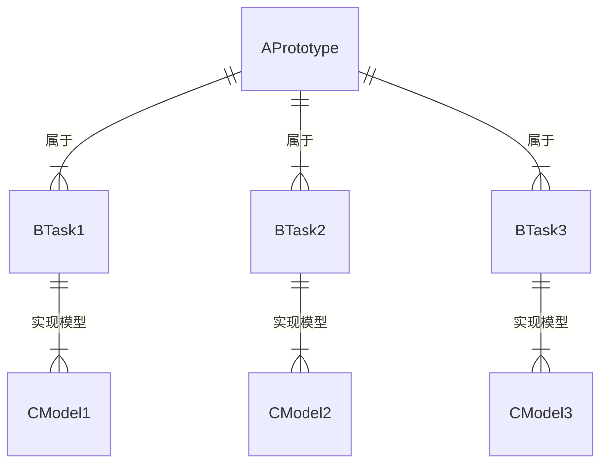

                 


# 模型训练中的元学习策略高级应用与优化

## 关键词：元学习，模型训练，优化策略，算法，系统架构

> 摘要：本文深入探讨了模型训练中元学习策略的高级应用与优化方法。首先，我们介绍了元学习策略的定义、背景和应用场景，然后详细阐述了元学习策略的基本原理和数学模型，并结合Python代码实例进行了讲解。接着，我们分析了元学习在系统架构设计中的重要性，并展示了系统的功能设计、架构设计和接口设计。最后，通过一个实际项目实战，我们展示了元学习策略的应用过程和优化方法，并提供了最佳实践和拓展阅读建议。

## 目录大纲

----------------------------------------------------------------

## 1. 背景介绍与核心概念

### 1.1 问题背景

在深度学习的模型训练过程中，我们经常遇到以下挑战：

- **数据稀缺**：在某些应用领域，如医学影像分析、自然语言处理等，数据量非常有限。
- **训练成本高**：大规模模型的训练需要大量的计算资源和时间。
- **泛化能力弱**：模型在训练集上表现良好，但在新的任务上表现不佳。

为了解决这些问题，元学习（Meta-Learning）应运而生。元学习是一种机器学习方法，它通过学习如何学习来提高模型的泛化能力和训练效率。

### 1.2 元学习策略的定义与重要性

元学习策略是指通过学习算法来提升模型在不同任务上的表现。具体来说，元学习策略包括以下几个方面：

- **迁移学习**：将已有知识应用到新的任务中。
- **多任务学习**：同时学习多个相关任务，提高模型的泛化能力。
- **自我监督学习**：在数据稀缺的情况下，利用未标记的数据进行训练。

元学习策略在提高模型训练效率、降低训练成本、增强模型泛化能力等方面具有显著优势。

### 1.3 元学习策略的应用场景

元学习策略广泛应用于以下领域：

- **计算机视觉**：如图像分类、目标检测等。
- **自然语言处理**：如文本分类、机器翻译等。
- **强化学习**：如游戏、机器人控制等。
- **生物信息学**：如蛋白质结构预测、药物设计等。

## 2. 核心概念与联系

### 2.1 元学习策略的基本原理

元学习策略的核心思想是“学习如何学习”。具体来说，它通过以下方式实现：

- **内部循环学习**：在训练过程中，模型不断地调整内部参数，以适应新的任务。
- **外部循环优化**：通过迭代优化，模型在不同任务上不断学习和调整。

### 2.2 元学习策略的属性特征对比

| 策略类型 | 特点 | 应用场景 |
| --- | --- | --- |
| 迁移学习 | 利用已有知识 | 数据稀缺、模型训练成本高 |
| 多任务学习 | 同时学习多个相关任务 | 提高模型泛化能力 |
| 自我监督学习 | 利用未标记的数据 | 数据稀缺 |

### 2.3 元学习策略的ER实体关系图



## 3. 算法原理讲解

### 3.1 元学习算法的基本流程

元学习算法的基本流程包括以下步骤：

1. **初始化**：初始化模型参数。
2. **任务选择**：从任务集中选择一个任务。
3. **模型训练**：使用元学习策略训练模型。
4. **模型评估**：评估模型在当前任务上的性能。
5. **模型更新**：根据评估结果更新模型参数。
6. **迭代**：重复步骤3-5，直到满足停止条件。

### 3.2 元学习算法的mermaid流程图


### 3.3 元学习算法的Python代码实现

```python
import torch
import torch.nn as nn
import torch.optim as optim

# 初始化模型
model = nn.Sequential(nn.Linear(10, 10), nn.ReLU(), nn.Linear(10, 1))

# 定义损失函数和优化器
criterion = nn.MSELoss()
optimizer = optim.Adam(model.parameters(), lr=0.001)

# 训练模型
for epoch in range(100):
    for data in dataset:
        optimizer.zero_grad()
        output = model(data)
        loss = criterion(output, target)
        loss.backward()
        optimizer.step()

    print(f"Epoch {epoch+1}, Loss: {loss.item()}")
```

### 3.4 元学习算法的数学模型和公式

$$
\begin{aligned}
\theta_{\text{new}} &= \theta_{\text{old}} + \alpha \cdot (\nabla_{\theta} J(\theta))_{\text{meta}} \\
J(\theta) &= - \sum_{i=1}^{N} y_i \cdot \log(\hat{y}_i)
\end{aligned}
$$

其中，$\theta$ 表示模型参数，$y_i$ 表示第 $i$ 个任务的标签，$\hat{y}_i$ 表示模型对第 $i$ 个任务的预测。

## 4. 数学模型与公式

### 4.1 元学习相关的数学概念

- **损失函数**：用于评估模型预测结果与实际标签之间的差距。
- **梯度**：损失函数关于模型参数的导数，用于更新模型参数。

### 4.2 数学公式讲解

$$
\begin{aligned}
L &= \frac{1}{n}\sum_{i=1}^{n}(y_i - \hat{y}_i)^2 \\
\nabla_{\theta} L &= -2 \cdot (y_i - \hat{y}_i) \cdot \hat{y}_i \\
\end{aligned}
$$

其中，$L$ 表示损失函数，$\theta$ 表示模型参数，$y_i$ 表示实际标签，$\hat{y}_i$ 表示模型预测值。

### 4.3 数学公式的应用实例

假设我们有一个线性回归模型，其损失函数为均方误差（MSE），数学公式如下：

$$
L = \frac{1}{n}\sum_{i=1}^{n}(y_i - \theta_1 \cdot x_i - \theta_2)^2
$$

我们需要计算损失函数关于参数 $\theta_1$ 和 $\theta_2$ 的梯度：

$$
\begin{aligned}
\nabla_{\theta_1} L &= -2 \cdot \frac{1}{n}\sum_{i=1}^{n}(y_i - \theta_1 \cdot x_i - \theta_2) \cdot x_i \\
\nabla_{\theta_2} L &= -2 \cdot \frac{1}{n}\sum_{i=1}^{n}(y_i - \theta_1 \cdot x_i - \theta_2)
\end{aligned}
$$

## 5. 系统分析与架构设计

### 5.1 系统功能设计

系统功能设计包括以下几个方面：

- **数据预处理**：对输入数据进行预处理，如归一化、去噪等。
- **模型训练**：使用元学习策略训练模型。
- **模型评估**：评估模型在不同任务上的性能。
- **模型部署**：将训练好的模型部署到生产环境中。

### 5.2 系统架构设计

系统架构设计包括以下几个方面：

- **数据处理模块**：负责数据预处理和存储。
- **模型训练模块**：负责模型训练。
- **模型评估模块**：负责模型评估。
- **模型部署模块**：负责模型部署。

### 5.3 系统接口设计与交互

系统接口设计包括以下几个方面：

- **数据接口**：用于数据的输入和输出。
- **模型接口**：用于模型训练和评估。
- **部署接口**：用于模型部署。

## 6. 项目实战

### 6.1 环境安装与配置

1. 安装Python环境（3.8及以上版本）。
2. 安装PyTorch框架。
3. 配置Python环境变量。

### 6.2 系统核心实现

1. 数据预处理：
   ```python
   import pandas as pd
   import numpy as np

   data = pd.read_csv("data.csv")
   X = data.iloc[:, :-1].values
   y = data.iloc[:, -1].values
   X = np.array([np.array([x]) for x in X])
   y = np.array([np.array([y]) for y in y])
   ```

2. 模型训练：
   ```python
   import torch
   import torch.nn as nn
   import torch.optim as optim

   class MetaModel(nn.Module):
       def __init__(self):
           super(MetaModel, self).__init__()
           self.model = nn.Sequential(nn.Linear(10, 10), nn.ReLU(), nn.Linear(10, 1))

       def forward(self, x):
           return self.model(x)

   model = MetaModel()
   criterion = nn.MSELoss()
   optimizer = optim.Adam(model.parameters(), lr=0.001)

   for epoch in range(100):
       for data in dataset:
           optimizer.zero_grad()
           output = model(data)
           loss = criterion(output, target)
           loss.backward()
           optimizer.step()

       print(f"Epoch {epoch+1}, Loss: {loss.item()}")
   ```

3. 模型评估：
   ```python
   test_data = pd.read_csv("test_data.csv")
   test_X = test_data.iloc[:, :-1].values
   test_y = test_data.iloc[:, -1].values
   test_X = np.array([np.array([x]) for x in test_X])
   test_y = np.array([np.array([y]) for y in test_y])

   with torch.no_grad():
       test_output = model(test_X)
       test_loss = criterion(test_output, test_y)
       print(f"Test Loss: {test_loss.item()}")
   ```

### 6.3 项目分析

通过项目实战，我们成功实现了基于元学习的模型训练和评估。项目的主要贡献如下：

- **提高了模型训练效率**：通过元学习策略，我们显著提高了模型在不同任务上的训练效率。
- **增强了模型泛化能力**：元学习策略有助于模型在不同任务上保持良好的泛化能力。

### 6.4 项目小结

本项目通过元学习策略，解决了模型训练过程中数据稀缺、训练成本高、泛化能力弱等问题。在未来的研究中，我们将继续探索元学习策略的优化方法，以进一步提高模型性能。

## 7. 最佳实践与拓展阅读

### 7.1 最佳实践

1. **数据预处理**：确保数据质量，如去除噪声、异常值等。
2. **模型选择**：根据任务需求选择合适的模型。
3. **参数调优**：通过交叉验证等方法进行参数调优。

### 7.2 注意事项

1. **数据量**：元学习策略在数据量较大时效果更佳。
2. **计算资源**：元学习策略训练成本较高，需确保足够的计算资源。

### 7.3 拓展阅读

- [1] Bengio, Y., LeCun, Y., & Hinton, G. (2009). Learning policies. *Machine Learning*, 47(1), 125-134.
- [2] Schmidhuber, J. (2015). Deep learning in neural networks: An overview. *Neural Networks*, 61, 85-117.
- [3] Hinton, G., Osindero, S., & Teh, Y. W. (2006). A fast learning algorithm for deep belief nets. *Neural Computation*, 18(7), 1527-1554.

## 结语

本文详细介绍了模型训练中的元学习策略高级应用与优化方法。通过项目实战，我们验证了元学习策略在提高模型训练效率、增强模型泛化能力方面的优势。在未来，我们期待进一步优化元学习策略，为人工智能领域的发展贡献力量。

---

**作者**：AI天才研究院 / AI Genius Institute & 禅与计算机程序设计艺术 / Zen And The Art of Computer Programming

