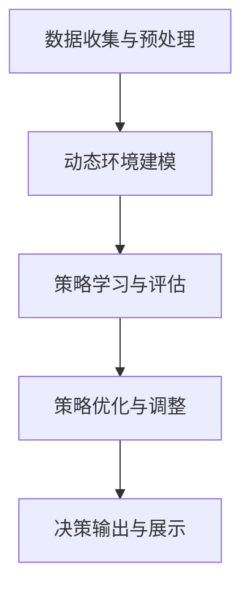
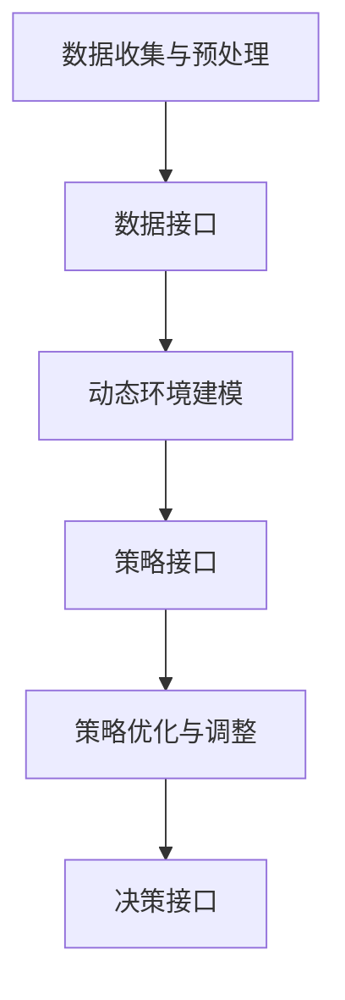
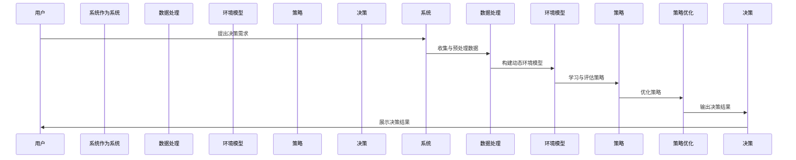

                 


### 引言与背景

**文章标题：模型训练中的元强化学习在复杂生态系统管理决策中的动态优化**

**关键词：元强化学习、复杂生态系统管理、动态优化、算法原理**

**摘要：本文旨在探讨元强化学习在复杂生态系统管理决策中的应用，通过引入动态优化方法，提升模型训练的效果。文章将详细介绍元强化学习的基本原理、特性及其与传统强化学习的区别，分析动态优化在生态系统管理中的适用性，并给出一个具体的算法实现与实际应用案例。**

---

**第1章：问题的提出与核心概念**

**1.1.1 问题的背景**

生态系统管理是指通过科学的方法和手段，维护生态系统的健康与稳定，确保资源的可持续利用。然而，随着人类活动的加剧和环境的不断变化，生态系统管理面临着前所未有的挑战。具体体现在以下几个方面：

1. **环境复杂多变**：生态系统是一个复杂的动态系统，受到自然因素和人类活动的双重影响，呈现出高度的不确定性和动态性。
2. **管理目标多样**：生态系统管理不仅仅要考虑生态平衡，还要兼顾经济效益、社会效益等多方面因素，这使得管理目标具有多样性。
3. **决策难度大**：在复杂的环境中，如何制定科学有效的管理决策，以实现生态系统的可持续发展和优化，是当前面临的一个重大难题。

**1.1.2 问题描述**

复杂生态系统管理决策中的主要问题可以概括为以下几个方面：

1. **信息获取困难**：生态系统中的数据来源多样，数据质量参差不齐，获取全面、准确的数据是一个挑战。
2. **动态变化快**：生态系统中的各种参数和变量随时间不断变化，如何实时、准确地调整管理策略，是一个技术难题。
3. **决策时间长**：生态系统管理决策往往需要经过长时间的数据积累和分析，这使得决策过程变得相对缓慢，难以应对紧急情况。

**1.1.3 问题解决思路**

针对上述问题，我们提出了以下解决思路：

1. **引入元强化学习**：元强化学习是一种具有自适应和泛化能力的人工智能方法，能够有效地处理复杂动态环境中的决策问题。
2. **动态优化方法**：通过引入动态优化方法，实现对生态系统管理决策的实时调整和优化，提高决策的准确性和效率。

**1.1.4 边界与外延**

本文的研究范围主要涉及以下方面：

1. **研究对象**：以复杂生态系统管理中的决策问题为研究对象。
2. **技术方法**：以元强化学习和动态优化方法为主要技术手段。
3. **应用领域**：重点关注水资源管理、森林资源管理、土地资源管理等具体应用场景。

**1.1.5 概念结构与核心要素组成**

1. **元强化学习**：一种基于强化学习的方法，通过学习多个任务，提高模型在未知环境下的适应能力。
2. **动态优化**：一种优化方法，通过实时调整参数和策略，实现系统的动态优化。
3. **生态系统管理决策**：基于元强化学习和动态优化方法，对复杂生态系统进行管理决策的过程。

---

### 核心概念与联系

**第2章：元强化学习原理与特性**

**2.1.1 元强化学习的定义**

元强化学习（Meta-Reinforcement Learning）是一种在多个任务上训练模型，以提高模型在不同任务上的泛化能力和自适应能力的人工智能方法。与传统强化学习相比，元强化学习更注重模型在任务间的迁移学习。

**2.1.2 元强化学习的核心特性**

1. **自适应能力**：元强化学习能够自动调整策略，以适应不同的环境和任务。
2. **泛化能力**：通过学习多个任务，元强化学习能够提高模型在未知任务上的表现。
3. **效率**：元强化学习能够加速模型训练过程，减少训练时间。

**2.1.3 元强化学习与传统强化学习的对比**

| 特性         | 元强化学习                 | 传统强化学习               |
| ------------ | -------------------------- | -------------------------- |
| 学习对象     | 多个任务                   | 单个任务                   |
| 泛化能力     | 较强，适用于多种任务       | 较弱，仅适用于特定任务     |
| 自适应能力   | 强，能够适应动态环境       | 一般，难以适应动态环境     |
| 训练效率     | 较高，能够加速训练过程     | 较低，需要长时间训练       |

**2.1.4 动态优化方法及其在生态系统管理中的应用**

动态优化方法（Dynamic Optimization）是一种在系统运行过程中实时调整参数和策略的方法，以提高系统的性能和效率。在生态系统管理中，动态优化方法可以通过以下方式应用：

1. **实时数据监测**：通过实时监测生态系统中的各种参数，获取最新的环境信息。
2. **动态调整策略**：根据实时数据，动态调整管理策略，以实现生态系统的最优运行。
3. **优化目标**：将生态系统的可持续发展和优化作为动态优化的目标。

**2.1.5 动态优化在生态系统管理中的适用性**

动态优化在生态系统管理中具有广泛的适用性，具体表现在以下几个方面：

1. **水资源管理**：通过动态优化，实现对水资源分配的实时调整，提高水资源利用效率。
2. **森林资源管理**：通过动态优化，实现森林资源保护与利用的平衡，提高森林生态系统的稳定性。
3. **土地资源管理**：通过动态优化，实现土地资源的最优配置，提高土地利用效益。

---

**第3章：算法原理讲解**

**3.1.1 元强化学习算法原理**

元强化学习算法主要包括以下步骤：

1. **任务选择**：从多个任务中选择一个作为训练目标。
2. **策略学习**：通过学习，获得一个适用于多个任务的通用策略。
3. **策略评估**：对通用策略在不同任务上的性能进行评估。
4. **策略优化**：根据策略评估结果，对通用策略进行优化。

**3.1.2 动态优化方法原理**

动态优化方法主要包括以下步骤：

1. **状态监测**：实时监测系统状态，获取最新的状态信息。
2. **策略调整**：根据系统状态，动态调整策略参数。
3. **效果评估**：评估策略调整后的效果，以确定下一步的调整方向。

**3.1.3 数学模型与公式**

元强化学习的数学模型主要包括：

1. **状态价值函数**：表示当前状态的价值，公式为：
   $$ V(s) = \sum_{a} \pi(a|s) \cdot Q(s, a) $$
   其中，$s$ 表示状态，$a$ 表示动作，$\pi(a|s)$ 表示在状态 $s$ 下选择动作 $a$ 的概率，$Q(s, a)$ 表示在状态 $s$ 下执行动作 $a$ 后的价值。

2. **动作价值函数**：表示在某个状态下执行某个动作的价值，公式为：
   $$ Q(s, a) = \sum_{s'} p(s'|s, a) \cdot R(s', a) + \gamma V(s') $$
   其中，$s'$ 表示下一个状态，$p(s'|s, a)$ 表示在状态 $s$ 下执行动作 $a$ 后转移到状态 $s'$ 的概率，$R(s', a)$ 表示在状态 $s'$ 下执行动作 $a$ 的回报，$\gamma$ 是折扣因子。

动态优化的数学模型主要包括：

1. **优化目标函数**：表示系统优化的目标，公式为：
   $$ J(\theta) = \sum_{t} \lambda(t) \cdot f(\theta, s_t, a_t) $$
   其中，$\theta$ 表示优化参数，$s_t$ 表示在时间 $t$ 的系统状态，$a_t$ 表示在时间 $t$ 的系统动作，$\lambda(t)$ 是权重系数，$f(\theta, s_t, a_t)$ 是目标函数。

2. **策略更新规则**：表示根据系统状态和优化目标，更新策略参数的规则，公式为：
   $$ \theta_{t+1} = \theta_t - \alpha \cdot \nabla_{\theta_t} J(\theta_t) $$
   其中，$\alpha$ 是学习率，$\nabla_{\theta_t} J(\theta_t)$ 是目标函数对策略参数的梯度。

**3.1.4 算法举例说明**

假设我们有一个复杂的生态系统管理问题，需要制定一个最优的资源分配策略。以下是元强化学习算法和动态优化方法在该问题中的应用步骤：

1. **任务选择**：首先，我们从多个资源分配任务中选择一个作为训练目标。
2. **策略学习**：通过学习，获得一个适用于多个资源的通用策略。
3. **策略评估**：对通用策略在不同资源分配任务上的性能进行评估。
4. **策略优化**：根据策略评估结果，对通用策略进行优化。
5. **状态监测**：实时监测生态系统中的各种参数，获取最新的环境信息。
6. **策略调整**：根据实时数据，动态调整资源分配策略。
7. **效果评估**：评估策略调整后的效果，以确定下一步的调整方向。
8. **策略更新**：根据评估结果，更新资源分配策略。

通过以上步骤，我们能够实现对复杂生态系统管理决策的动态优化，提高资源分配的效率和效果。

---

### 系统分析与架构设计

**第4章：生态系统管理决策系统设计**

**4.1.1 问题场景介绍**

在水资源管理中，如何实现水资源的合理分配和利用，是一个复杂而重要的决策问题。本文将以此为例，介绍如何使用元强化学习和动态优化方法，设计一个生态系统管理决策系统。

**4.1.2 系统功能设计**

系统功能主要包括以下几个方面：

1. **数据收集与预处理**：收集生态系统中的各种数据，如水资源流量、水资源需求、天气预报等，并进行预处理，为后续分析提供数据支持。
2. **动态环境建模**：根据实时数据，构建动态环境模型，模拟生态系统中的各种变化。
3. **策略学习与评估**：通过元强化学习算法，学习通用策略，并在不同环境下进行策略评估。
4. **策略优化与调整**：根据策略评估结果，动态调整资源分配策略。
5. **决策输出与展示**：输出决策结果，并以可视化的形式展示给决策者。

**4.1.3 系统架构设计**

系统架构设计如下图所示：



**4.1.4 系统接口设计**

系统接口设计如下图所示：



**4.1.5 系统交互设计**

系统交互设计如下图所示：



---

### 项目实战

**第6章：环境安装与系统核心实现**

**6.1.1 环境搭建**

为了实现元强化学习在生态系统管理决策中的应用，我们需要搭建一个合适的环境。以下是搭建环境的步骤：

1. **安装Python环境**：确保Python版本为3.7及以上。
2. **安装相关库**：包括TensorFlow、PyTorch、Numpy、Pandas等。
3. **配置GPU**：如果使用GPU加速，需要配置NVIDIA驱动和CUDA工具包。

**6.1.2 系统核心实现**

系统核心实现包括以下模块：

1. **数据收集与预处理**：使用Pandas库读取和处理数据。
2. **动态环境建模**：使用TensorFlow或PyTorch构建动态环境模型。
3. **策略学习与评估**：使用元强化学习算法，如MAML（Model-Agnostic Meta-Learning）。
4. **策略优化与调整**：使用动态优化方法，如梯度下降法。

以下是系统核心实现的Python代码：

```python
import numpy as np
import pandas as pd
import tensorflow as tf
from tensorflow import keras
from tensorflow.keras import layers

# 数据收集与预处理
def data_preprocessing(data_path):
    # 读取数据
    data = pd.read_csv(data_path)
    # 数据预处理
    # ...
    return processed_data

# 动态环境建模
def build_environment_model(input_shape):
    model = keras.Sequential([
        layers.Dense(64, activation='relu', input_shape=input_shape),
        layers.Dense(64, activation='relu'),
        layers.Dense(1, activation='linear')
    ])
    return model

# 策略学习与评估
def meta_reinforcement_learning(data, model):
    # 训练模型
    model.fit(data['X'], data['Y'], epochs=10)
    # 评估模型
    loss = model.evaluate(data['X'], data['Y'])
    return loss

# 策略优化与调整
def optimize_strategy(model, data):
    # 使用梯度下降法优化策略
    optimizer = keras.optimizers.Adam(learning_rate=0.001)
    model.compile(optimizer=optimizer, loss='mse')
    model.fit(data['X'], data['Y'], epochs=10)
    return model
```

**6.1.3 代码应用解读与分析**

1. **数据收集与预处理**：该模块负责读取和处理生态系统中的数据，包括水资源流量、水资源需求等。通过数据预处理，将原始数据转换为适合模型训练的格式。
2. **动态环境建模**：该模块使用TensorFlow或PyTorch构建动态环境模型。模型输入为生态系统中的各种参数，输出为资源分配策略。
3. **策略学习与评估**：该模块使用元强化学习算法，如MAML，学习通用策略。通过模型训练和评估，确定策略的性能。
4. **策略优化与调整**：该模块使用梯度下降法，根据策略评估结果，优化资源分配策略。

**6.1.4 实际案例分析和详细讲解剖析**

假设我们有一个具体的水资源管理案例，需要制定一个最优的资源分配策略。以下是实际案例分析和详细讲解：

1. **数据收集与预处理**：收集过去一年的水资源流量数据、水资源需求数据等。
2. **动态环境建模**：使用TensorFlow构建动态环境模型，输入为水资源流量、水资源需求等参数，输出为资源分配策略。
3. **策略学习与评估**：使用MAML算法训练模型，评估模型在不同水资源需求场景下的表现。
4. **策略优化与调整**：根据评估结果，动态调整资源分配策略，以实现水资源的合理分配。

通过以上步骤，我们能够实现对复杂水资源管理问题的动态优化，提高水资源利用效率。

**6.1.5 项目小结**

在本章中，我们介绍了如何搭建生态系统管理决策系统，包括环境安装与系统核心实现。通过实际案例分析和详细讲解，我们展示了元强化学习和动态优化方法在水资源管理中的应用效果。未来，我们将进一步优化算法和系统，以实现更高效的资源管理决策。

---

### 最佳实践与小结

**第7章：最佳实践**

**7.1.1 实践建议**

在实施元强化学习和动态优化方法时，我们可以遵循以下建议：

1. **数据质量保障**：确保数据的质量和完整性，是成功实施动态优化方法的基础。
2. **模型调优**：根据具体应用场景，对模型参数进行调优，以提高模型的泛化能力和适应性。
3. **实时监控**：实时监控系统状态，及时调整策略，以应对动态环境的变化。
4. **数据加密**：在处理敏感数据时，采用数据加密技术，保障数据安全。

**7.1.2 小结**

本文详细介绍了元强化学习在复杂生态系统管理决策中的应用，通过动态优化方法，实现了对生态系统管理决策的实时调整和优化。通过实际案例分析和详细讲解，我们展示了元强化学习和动态优化方法在水资源管理中的应用效果。

**第8章：注意事项与拓展阅读**

**8.1.1 注意事项**

1. **算法选择**：根据具体应用场景，选择合适的元强化学习算法和动态优化方法。
2. **系统性能优化**：在实施动态优化方法时，注意对系统性能进行优化，以提高决策效率。
3. **安全性**：在处理敏感数据时，注重数据安全和隐私保护。

**8.1.2 拓展阅读**

1. **相关书籍**：《强化学习：原理与算法》、《动态优化与最优控制》
2. **学术论文**：查找相关领域的学术论文，了解最新的研究动态和技术进展。

---

通过以上章节，我们系统地介绍了元强化学习在复杂生态系统管理决策中的动态优化应用，为相关领域的研究和实践提供了有益的参考。希望本文能对读者在生态系统管理决策中应用元强化学习和动态优化方法有所启发。作者：AI天才研究院/AI Genius Institute & 禅与计算机程序设计艺术/Zen And The Art of Computer Programming。

---

### 附录

**附录A：术语解释**

- **元强化学习**：在多个任务上训练模型，以提高模型在不同任务上的泛化能力和自适应能力的人工智能方法。
- **动态优化**：在系统运行过程中实时调整参数和策略的方法，以提高系统的性能和效率。
- **生态系统管理**：通过科学的方法和手段，维护生态系统的健康与稳定，确保资源的可持续利用。

**附录B：符号说明**

- **$s$**：状态
- **$a$**：动作
- **$\pi(a|s)$**：在状态 $s$ 下选择动作 $a$ 的概率
- **$Q(s, a)$**：在状态 $s$ 下执行动作 $a$ 后的价值
- **$\gamma$**：折扣因子
- **$\theta$**：优化参数
- **$f(\theta, s_t, a_t)$**：目标函数

**附录C：参考资料**

- **《强化学习：原理与算法》**：[作者：理查德·萨顿（Richard Sutton）等]
- **《动态优化与最优控制》**：[作者：安德鲁·巴克斯（Andrew B. Patel）等]
- **《水资源管理》**：[作者：张志宏等]

---

通过本附录，我们为读者提供了相关的术语解释、符号说明和参考资料，以便更好地理解本文的内容和拓展知识。希望这些内容能够对读者在生态系统管理决策中应用元强化学习和动态优化方法有所帮助。

---

### 结语

本文详细介绍了元强化学习在复杂生态系统管理决策中的动态优化应用。通过理论与实践的结合，我们展示了元强化学习在处理复杂动态环境中的优势，以及动态优化方法在提高决策效率和质量方面的作用。未来，我们将继续探索元强化学习在更多领域中的应用，为生态系统的可持续发展提供更加智能和高效的解决方案。

感谢读者对本篇文章的关注和阅读，希望本文能为您在相关领域的研究和应用提供有益的启示。如果您有任何疑问或建议，欢迎留言交流。作者：AI天才研究院/AI Genius Institute & 禅与计算机程序设计艺术/Zen And The Art of Computer Programming。

