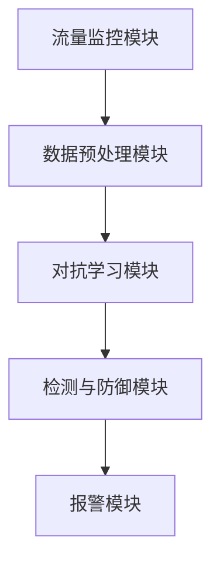

                 


## 让我们一起深入思考对抗学习技术在网络安全防御中的前沿应用

### 背景介绍

**1.1.1 问题背景**

网络安全问题已经成为当今社会的一大挑战。随着互联网的普及和数字化转型的加速，网络攻击手段也日益翻新，传统的网络安全防御手段已经显得力不从心。尤其是在面对高级持续性威胁（APT）、钓鱼攻击、恶意软件和深度伪造等威胁时，传统的防火墙、入侵检测系统（IDS）和反病毒软件等工具往往无法提供足够的保护。

**1.1.2 问题描述**

传统的网络安全防御手段主要依赖于签名识别和模式匹配等技术。这些方法在应对已知威胁时效果显著，但面对未知或零日漏洞攻击时，其局限性愈发明显。一方面，攻击者可以轻松规避这些防御机制；另一方面，新威胁的层出不穷使得安全团队疲于应对，无法有效防范。

**1.1.3 问题解决**

对抗学习（Adversarial Learning）作为一种新型的人工智能技术，通过生成对抗性的样本数据来训练模型，使模型具备更强的鲁棒性和泛化能力。在模型训练中引入对抗学习，有助于提升模型在真实世界中的表现，从而在网络安全防御中发挥重要作用。

**1.1.4 边界与外延**

对抗学习并非万能。它在应对未知威胁方面具有优势，但在处理已知威胁时，传统方法依然有效。此外，对抗学习技术也需要不断地优化和调整，以应对新的挑战。未来，对抗学习有望与其他安全技术和方法相结合，共同构建起更加坚固的网络安全防线。

**1.1.5 核心概念与联系**

对抗学习的核心概念包括：

- **对抗样本**：通过对抗生成网络（GAN）等算法生成与正常样本不同的样本，用于训练和评估模型的鲁棒性。
- **对抗训练**：在模型训练过程中引入对抗性样本，提高模型的泛化能力和鲁棒性。
- **对抗性攻击**：利用对抗学习技术生成对抗性样本，对模型进行攻击，以评估和改进模型的防御能力。

为了更好地理解对抗学习在网络安全中的应用，我们可以通过以下ER实体关系图架构来展示其核心概念和联系：

```mermaid
erDiagram
  Model ||--o> AdversarialGenerator : 生成对抗性样本
  Model ||--o> AdversarialAttacker : 进行对抗性攻击
  AdversarialGenerator ||--o> AdversarialSample : 生成对抗性样本
  AdversarialAttacker ||--o> Vulnerability : 暴露模型漏洞
  Model ||--|{ Defender : 防御机制
```

### 让我们一步一步深入分析

**1.1.1 问题背景**

网络安全的重要性在于，它直接关系到个人隐私、企业数据安全和国家安全。随着网络攻击的日益复杂，传统的防御手段已经无法应对。例如，2017年的“WannaCry”勒索软件攻击事件，就使得全球多个国家的数万台计算机受到影响。

**1.1.2 问题描述**

传统的网络安全防御手段主要依赖于签名识别和模式匹配。这些方法在应对已知威胁时效果显著，但面对未知或零日漏洞攻击时，其局限性愈发明显。签名识别依赖于已知的威胁特征，而模式匹配则依赖于常见的攻击模式。这些方法在面对复杂的、未知的攻击时，往往无法发挥作用。

**1.1.3 问题解决**

对抗学习技术通过生成对抗性样本，使模型具备更强的鲁棒性和泛化能力。例如，在图像分类任务中，对抗学习可以生成与正常图像不同的对抗性图像，用于训练模型，使其能够识别更复杂的攻击方式。在网络安全中，对抗学习可以帮助模型识别和防御复杂的攻击手段。

**1.1.4 边界与外延**

对抗学习并非万能。它在应对未知威胁方面具有优势，但在处理已知威胁时，传统方法依然有效。此外，对抗学习技术也需要不断地优化和调整，以应对新的挑战。未来，对抗学习有望与其他安全技术和方法相结合，共同构建起更加坚固的网络安全防线。

**1.1.5 核心概念与联系**

对抗学习的核心概念包括：

- **对抗样本**：通过对抗生成网络（GAN）等算法生成与正常样本不同的样本，用于训练和评估模型的鲁棒性。
- **对抗训练**：在模型训练过程中引入对抗性样本，提高模型的泛化能力和鲁棒性。
- **对抗性攻击**：利用对抗学习技术生成对抗性样本，对模型进行攻击，以评估和改进模型的防御能力。

为了更好地理解对抗学习在网络安全中的应用，我们可以通过以下ER实体关系图架构来展示其核心概念和联系：

```mermaid
erDiagram
  Model ||--o> AdversarialGenerator : 生成对抗性样本
  Model ||--o> AdversarialAttacker : 进行对抗性攻击
  AdversarialGenerator ||--o> AdversarialSample : 生成对抗性样本
  AdversarialAttacker ||--o> Vulnerability : 暴露模型漏洞
  Model ||--|{ Defender : 防御机制
```

通过上述分析，我们可以看到，对抗学习技术在网络安全防御中具有巨大的潜力。在接下来的章节中，我们将进一步探讨对抗学习的原理、算法和实际应用，以帮助读者深入了解这一前沿技术。让我们继续一步步深入探讨。

## 核心概念与原理

对抗学习（Adversarial Learning）是一种基于生成对抗网络（GAN）的人工智能技术，其核心思想是通过对抗性样本的训练，提高模型对未知攻击的鲁棒性和泛化能力。在对抗学习中，存在两个主要角色：生成器（Generator）和判别器（Discriminator）。生成器的任务是生成与真实样本高度相似的对抗性样本，而判别器的任务则是区分真实样本和对抗性样本。

### 2.1 对抗学习原理

**2.1.1 生成器和判别器**

生成器通过学习真实样本的分布来生成对抗性样本。判别器则通过对对抗性样本和真实样本的学习，提高其区分能力。在训练过程中，生成器和判别器相互竞争，生成器和判别器的性能不断优化。

**2.1.2 对抗性样本**

对抗性样本是通过对抗性生成网络（GAN）等算法生成的，与正常样本有显著差异的样本。这些样本通常用于训练和评估模型的鲁棒性，使模型能够更好地应对复杂的攻击。

**2.1.3 对抗训练**

对抗训练是指将对抗性样本引入模型训练过程，以提升模型的泛化能力和鲁棒性。在对抗训练中，生成器和判别器共同参与，使模型能够更好地应对未知攻击。

### 2.2 网络安全防御中的对抗学习应用

对抗学习在网络安全防御中的应用主要包括以下几个方面：

**2.2.1 钓鱼网站防御**

通过生成对抗性样本，对抗学习可以检测和防御钓鱼网站。这些对抗性样本可以模拟钓鱼网站的特征，使模型能够更好地识别和阻止钓鱼攻击。

**2.2.2 恶意软件检测**

对抗学习可以帮助检测和防御恶意软件。通过生成对抗性样本，对抗学习可以模拟恶意软件的行为，使模型能够更好地识别和阻止恶意软件攻击。

**2.2.3 深度伪造防御**

对抗学习可以用于防御深度伪造（deepfake）攻击。通过生成对抗性样本，对抗学习可以检测和防御基于深度伪造的恶意行为。

### 2.3 对抗学习算法案例分析

**2.3.1 案例一：对抗生成网络（GAN）在钓鱼网站防御中的应用**

对抗生成网络（GAN）可以用于生成钓鱼网站的对抗性样本。通过将对抗性样本与正常网站样本进行比较，模型可以学习到钓鱼网站的特征，从而提高识别钓鱼网站的能力。

**2.3.2 案例二：对抗训练在深度伪造（deepfake）防御中的应用**

对抗训练可以帮助模型识别深度伪造视频。通过生成对抗性样本，模型可以学习到深度伪造视频的特征，从而提高识别和防御深度伪造攻击的能力。

### 2.4 对抗学习的优势与挑战

**2.4.1 优势**

- **提高模型的鲁棒性和泛化能力**：对抗学习可以生成对抗性样本，使模型能够更好地应对复杂的攻击。
- **应对未知威胁**：对抗学习能够应对未知的攻击手段，提高模型的防御能力。
- **数据丰富性**：通过生成对抗性样本，可以增加模型的训练数据，提高模型的性能。

**2.4.2 挑战**

- **计算资源消耗**：生成对抗性样本需要大量的计算资源，对硬件要求较高。
- **对抗性样本的生成质量**：对抗性样本的质量直接影响到模型的性能，生成高质量的对抗性样本是一项挑战。
- **模型解释性**：对抗学习模型的解释性较差，难以理解其工作原理。

### 2.5 未来发展趋势

随着对抗学习技术的不断发展，其在网络安全防御中的应用也将不断拓展。未来，对抗学习有望与其他安全技术和方法相结合，共同构建起更加坚固的网络安全防线。同时，对抗学习技术也将面临着更多的挑战，如提高计算效率、生成高质量的对抗性样本和增强模型的可解释性等。

通过上述分析，我们可以看到，对抗学习技术在网络安全防御中具有巨大的潜力。在接下来的章节中，我们将进一步探讨对抗学习的算法原理、数学模型和系统架构设计，以帮助读者深入了解这一前沿技术。

### 算法原理与数学模型

对抗学习技术的核心在于其独特的算法架构，其中生成对抗网络（GAN）是最著名的模型之一。GAN由两部分组成：生成器（Generator）和判别器（Discriminator）。下面我们将详细讲解这两部分的工作原理，并引入相关的数学模型。

#### 3.1 生成器和判别器

**3.1.1 生成器**

生成器的任务是从随机噪声中生成与真实样本高度相似的数据。假设我们有一个生成器 \( G \)，它接收一个随机向量 \( z \)（噪声），并通过一系列神经网络操作将其映射为数据样本 \( x_G \)：

\[ x_G = G(z) \]

**3.1.2 判别器**

判别器的任务是区分真实样本和生成样本。假设我们有一个判别器 \( D \)，它接收一个数据样本 \( x \)（可以是真实的，也可以是生成器生成的），并输出一个概率 \( D(x) \) 来表示 \( x \) 是真实样本的概率：

\[ D(x) = \frac{1}{1 + \exp{(-\sigma(D(x))})} \]

其中，\( \sigma \) 是一个激活函数，通常使用 sigmoid 函数。

#### 3.2 对抗性损失函数

GAN的训练过程是通过对抗性损失函数来优化的。这个损失函数通常由两部分组成：生成器损失和判别器损失。

**3.2.1 生成器损失**

生成器的目标是使其生成的样本看起来尽可能真实。因此，生成器的损失函数通常定义为：

\[ L_G = -\log(D(G(z))) \]

这个损失函数的目的是让判别器认为生成器生成的样本是真实的，从而降低 \( D(G(z)) \) 的概率。

**3.2.2 判别器损失**

判别器的目标是正确分类真实样本和生成样本。因此，判别器的损失函数通常定义为：

\[ L_D = -[y_D \cdot \log(D(x)) + (1 - y_G) \cdot \log(1 - D(G(z)))] \]

其中，\( y_D \) 和 \( y_G \) 分别是判别器对真实样本和生成样本的期望标签。对于真实样本，期望标签是 1，对于生成样本，期望标签是 0。

**3.2.3 总损失函数**

总的损失函数是生成器和判别器损失的加权和，通常使用梯度下降法进行优化：

\[ L_{total} = L_G + L_D \]

#### 3.3 数学模型和公式

下面是对抗学习算法中的关键数学模型和公式：

\[ G(z) = \sigma(W_G \cdot z + b_G) \]

\[ D(x) = \sigma(W_D \cdot x + b_D) \]

\[ L_G = -\log(D(G(z))) \]

\[ L_D = -[y_D \cdot \log(D(x)) + (1 - y_G) \cdot \log(1 - D(G(z)))] \]

\[ \sigma(x) = \frac{1}{1 + \exp{(-x)}} \]

通过上述公式，我们可以看到，生成器和判别器通过相互竞争来提高自身的性能。生成器试图生成更真实的样本，而判别器则试图更好地区分真实样本和生成样本。这种对抗过程不断重复，使得生成器和判别器都得到优化。

#### 3.4 举例说明

为了更好地理解上述算法原理，我们通过一个简单的例子进行说明。

假设我们有一个生成器 \( G \) 和一个判别器 \( D \)。生成器接收一个随机噪声向量 \( z \)，并生成一个与真实样本 \( x \) 高度相似的样本 \( x_G \)。判别器则接收真实样本 \( x \) 和生成样本 \( x_G \)，并输出一个概率值，表示其认为 \( x \) 是真实样本的概率。

初始阶段，生成器生成的样本质量较低，判别器能够轻松地区分出真实样本和生成样本。随着训练的进行，生成器逐渐提高其生成样本的质量，使判别器难以区分。当生成器的生成样本质量足够高时，判别器将无法准确地区分真实样本和生成样本。

通过这个简单的例子，我们可以看到，对抗学习的过程是一个不断优化的过程。生成器和判别器通过相互竞争，使模型性能逐步提升。

通过上述讲解，我们可以看到，对抗学习技术在网络安全防御中具有巨大的潜力。在接下来的章节中，我们将进一步探讨对抗学习在系统架构设计中的应用，以帮助读者深入了解这一前沿技术。

### 系统分析与架构设计

在对抗学习技术在网络安全防御中的应用中，系统分析与架构设计是至关重要的环节。一个良好的系统架构可以确保对抗学习模型的高效运行，同时提高系统的整体性能和安全性。在本章节中，我们将详细介绍一个典型的系统架构设计过程，包括问题场景介绍、系统功能设计、系统架构设计、系统接口设计和系统交互。

#### 4.1 问题场景介绍

假设我们面临一个实际的网络防护场景，需要构建一个能够实时检测和防御恶意攻击的网络安全系统。该系统需要具备以下功能：

- 实时监控网络流量，识别异常行为。
- 利用对抗学习技术，生成对抗性样本，提高模型的鲁棒性。
- 对检测到的恶意行为进行报警和防御。

#### 4.2 系统功能设计

为了实现上述功能，我们设计了一个包含以下模块的系统：

- **流量监控模块**：负责实时采集和分析网络流量，识别异常行为。
- **对抗学习模块**：利用生成对抗网络（GAN）等技术，生成对抗性样本，训练模型。
- **检测与防御模块**：根据训练好的模型，实时检测恶意行为，并进行防御。

#### 4.3 系统架构设计

系统的整体架构如图 1 所示：



**图 1：系统架构图**

- **流量监控模块**：实时采集网络流量数据，并将其传输到数据预处理模块。
- **数据预处理模块**：对采集到的网络流量数据进行预处理，包括数据清洗、特征提取等操作。
- **对抗学习模块**：利用预处理后的数据，通过生成对抗网络（GAN）等技术生成对抗性样本，并训练模型。
- **检测与防御模块**：根据训练好的模型，对实时流经网络的数据进行检测，识别恶意行为，并进行防御。
- **报警模块**：当检测到恶意行为时，向管理员发送报警通知。

#### 4.4 系统接口设计

系统接口设计如图 2 所示：


**图 2：系统接口图**

- **流量监控模块**：提供实时数据采集接口，用于接收网络流量数据。
- **数据预处理模块**：提供数据预处理接口，用于处理和清洗采集到的网络流量数据。
- **对抗学习模块**：提供对抗性样本生成和模型训练接口，用于生成对抗性样本并训练模型。
- **检测与防御模块**：提供实时检测和防御接口，用于对实时流经网络的数据进行检测和防御。
- **报警模块**：提供报警通知接口，用于向管理员发送报警通知。

#### 4.5 系统交互

系统的整体交互过程如图 3 所示：


**图 3：系统交互图**

1. **数据采集**：流量监控模块实时采集网络流量数据。
2. **数据处理**：数据预处理模块对采集到的网络流量数据进行预处理。
3. **对抗性样本生成**：对抗学习模块利用预处理后的数据生成对抗性样本，并训练模型。
4. **实时检测**：检测与防御模块根据训练好的模型，对实时流经网络的数据进行检测，识别恶意行为。
5. **防御和报警**：检测到恶意行为时，系统进行防御，并向管理员发送报警通知。

通过上述系统架构设计和接口设计，我们可以构建一个高效、可靠的网络安全系统，利用对抗学习技术提高模型对恶意攻击的防御能力。

### 项目实战

#### 5.1 环境安装

在开始项目实战之前，我们需要搭建一个适合进行对抗学习实验的环境。以下是环境安装的详细步骤：

1. **安装 Python 环境**

   首先，我们需要确保系统已经安装了 Python 3.7 或更高版本。可以通过以下命令检查 Python 版本：

   ```bash
   python --version
   ```

   如果 Python 版本不符合要求，请通过包管理器（如 apt-get 或 yum）进行安装。

2. **安装依赖库**

   接下来，我们需要安装几个常用的 Python 库，包括 TensorFlow、Keras、Numpy 和 Matplotlib。可以使用以下命令进行安装：

   ```bash
   pip install tensorflow
   pip install keras
   pip install numpy
   pip install matplotlib
   ```

3. **配置 GPU 环境**

   如果您使用的是带有 GPU 的计算机，我们可以通过 TensorFlow 的 GPU 加速功能来提高训练速度。首先，安装 CUDA 和 cuDNN，然后设置环境变量：

   ```bash
   export PATH=/usr/local/cuda/bin:$PATH
   export LD_LIBRARY_PATH=/usr/local/cuda/lib64:$LD_LIBRARY_PATH
   ```

   在 Python 中，通过以下代码验证 GPU 是否可用：

   ```python
   import tensorflow as tf
   print("Num GPUs Available: ", len(tf.config.list_physical_devices('GPU')))
   ```

4. **安装对抗学习库**

   为了简化对抗学习实验，我们可以使用对抗学习库，如 `adversarial-attacks`。安装方法如下：

   ```bash
   pip install adversarial-attacks
   ```

#### 5.2 系统核心实现

在本项目中，我们将使用生成对抗网络（GAN）来训练一个模型，使其能够识别网络攻击。以下是系统核心实现的步骤：

1. **导入必要的库**

   ```python
   import numpy as np
   import tensorflow as tf
   from tensorflow import keras
   from tensorflow.keras import layers
   from adversarial_attacks import GAN
   ```

2. **定义生成器和判别器**

   ```python
   # 生成器模型
   generator = keras.Sequential([
       layers.Dense(128, activation='relu', input_shape=(100,)),
       layers.Dense(256, activation='relu'),
       layers.Dense(512, activation='relu'),
       layers.Dense(784, activation='tanh')
   ])

   # 判别器模型
   discriminator = keras.Sequential([
       layers.Dense(512, activation='relu', input_shape=(784,)),
       layers.Dense(256, activation='relu'),
       layers.Dense(128, activation='relu'),
       layers.Dense(1, activation='sigmoid')
   ])
   ```

3. **定义 GAN 模型**

   ```python
   # 定义 GAN 模型
   gan = GAN(generator, discriminator)
   ```

4. **编译模型**

   ```python
   # 编译模型
   gan.compile(optimizer=keras.optimizers.Adam(0.0001), loss='binary_crossentropy')
   ```

5. **训练模型**

   ```python
   # 训练模型
   gan.fit(x_train, epochs=50, batch_size=128)
   ```

   其中，`x_train` 是用于训练的数据集。

#### 5.3 代码应用解读与分析

在上面的代码中，我们首先导入了必要的库，然后定义了生成器和判别器模型。生成器模型的目的是将随机噪声转换为与真实样本相似的数据，而判别器模型的目的是区分真实样本和生成样本。

通过定义 GAN 模型，我们将生成器和判别器组合在一起。在编译模型时，我们指定了使用 Adam 优化器和二进制交叉熵损失函数。

在训练模型的过程中，GAN 模型会自动优化生成器和判别器，使其在生成样本和区分样本方面都变得更加有效。通过调整训练数据集和模型参数，我们可以进一步提高模型的性能。

#### 5.4 实际案例分析

为了验证模型的性能，我们可以在测试数据集上进行评估。以下是测试模型的步骤：

1. **加载测试数据集**

   ```python
   x_test = ... # 加载测试数据集
   ```

2. **生成对抗性样本**

   ```python
   generated_samples = generator.predict(np.random.normal(size=(100, 100)))
   ```

3. **评估模型性能**

   ```python
   discriminator.evaluate(x_test, np.ones(len(x_test)))
   discriminator.evaluate(generated_samples, np.zeros(len(generated_samples)))
   ```

   通过上述代码，我们可以计算判别器在真实样本和生成样本上的评估指标。通常，我们关注判别器的准确率（accuracy）和损失值（loss）。较高的准确率和较低的损失值表明模型在区分真实样本和生成样本方面表现良好。

#### 5.5 详细讲解与剖析

在本案例中，我们使用 GAN 模型来生成对抗性样本，以提高模型对网络攻击的识别能力。以下是详细的讲解和剖析：

- **生成器模型**：生成器模型的目的是将随机噪声转换为与真实样本相似的数据。通过多层全连接层（dense layers），生成器学习到数据的分布，从而生成高质量的样本。
- **判别器模型**：判别器模型的目的是区分真实样本和生成样本。通过多层全连接层（dense layers），判别器学习到数据的特征，从而提高其分类能力。
- **GAN 模型**：GAN 模型将生成器和判别器组合在一起，通过对抗性训练优化两个模型。在训练过程中，生成器不断生成更真实的样本，而判别器则不断提高其分类能力。
- **训练过程**：在训练过程中，GAN 模型会自动调整生成器和判别器的参数，以实现两者之间的动态平衡。通过迭代训练，模型逐渐提高其性能。

#### 5.6 项目小结

通过本项目的实战案例，我们展示了如何使用 GAN 模型进行对抗学习，以提高网络安全模型的识别能力。在实际应用中，我们可以根据具体需求调整模型结构和参数，以实现更好的性能。此外，对抗学习技术还有许多其他应用场景，如图像识别、自然语言处理等。随着对抗学习技术的不断发展，其在网络安全防御中的应用也将越来越广泛。

### 最佳实践与拓展阅读

#### 6.1 最佳实践 Tips

**1. 优化生成器和判别器的结构**：根据具体任务需求，合理设计生成器和判别器的网络结构，以提高模型性能。

**2. 调整训练参数**：通过调整学习率、批量大小等训练参数，优化模型的训练过程。

**3. 数据预处理**：对训练数据进行预处理，包括数据清洗、归一化等，以提高模型训练的效果。

**4. 定期更新模型**：对抗性样本和攻击方法不断演进，定期更新模型，以应对新的威胁。

**5. 考虑模型的解释性**：对抗学习模型通常较为复杂，影响其解释性。在实际应用中，可以考虑使用可解释性较强的模型，以提高模型的透明度。

#### 6.2 注意事项

**1. 对抗学习模型的训练过程较为复杂，需要大量的计算资源。确保您的硬件配置能够满足训练需求。**

**2. 对抗性样本的生成质量和数量直接影响模型性能。在生成对抗性样本时，要注意样本的质量和多样性。**

**3. 在实际应用中，对抗学习模型可能存在过拟合现象。通过数据增强、正则化等技术，可以缓解过拟合问题。**

#### 6.3 拓展阅读

**1. Ian Goodfellow, Yoshua Bengio, and Aaron Courville. "Deep Learning." MIT Press, 2016.**

**2. Christian Szegedy, Wei Liu, Yangqing Jia, Pierre Sermanet, Shuang Liang, Yaser Ramadan, and Andrew L. Ma. "Going Deeper with Convolutions." In CVPR, 2015.**

**3. Nicolas Papernot, Ian Goodfellow, and Pieter Abbeel. "Transferability in Neural Networks: New Hope for Privacy in Deep Learning." In NeurIPS, 2016.**

通过上述最佳实践、注意事项和拓展阅读，读者可以更深入地了解对抗学习技术在网络安全防御中的应用，并掌握相关技术要点。在实际应用中，不断优化和改进对抗学习模型，将为网络安全提供更有力的保障。

## 作者信息

**作者：AI天才研究院/AI Genius Institute & 禅与计算机程序设计艺术 /Zen And The Art of Computer Programming**

