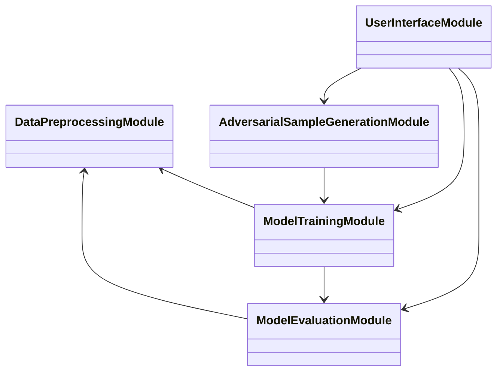

                 

### 引言

#### 关键词
- **模型训练**
- **对抗学习**
- **算法原理**
- **应用案例分析**

##### 摘要

本文旨在深入探讨模型训练中的对抗学习技术。对抗学习是提升模型鲁棒性的关键手段，通过生成和利用对抗样本来增强模型的防御能力。本文将首先介绍对抗学习的背景和动机，接着阐述其基本概念，详细解析主要算法原理及其数学模型，并展示实际应用案例，最后提供对抗学习的最佳实践和总结。本文结构紧凑，逻辑清晰，旨在为读者提供一个全面且易于理解的对抗学习指南。

### 基本概念

#### 关键词
- **对抗样本**
- **对抗训练**
- **鲁棒模型**

##### 定义

对抗学习中的基本概念包括对抗样本、对抗训练和鲁棒模型。首先，**对抗样本**是指通过微小扰动原始输入数据生成的，导致模型预测错误的样本。这些样本通常在人类视觉上难以察觉，但对模型的性能有显著影响。其次，**对抗训练**是指通过在训练数据中加入对抗样本来增强模型的鲁棒性，使其能够更好地抵御对抗攻击。最后，**鲁棒模型**是指能够在存在对抗样本的情况下仍然保持高性能的模型。

##### 类型

**对抗样本**可以分为以下几种类型：
1. **均匀扰动**：在输入数据中均匀地添加噪声，使得模型难以区分原始样本和扰动样本。
2. **特定扰动**：对输入数据进行特定的操作，例如改变图像的颜色通道或旋转角度。
3. **渐变攻击**：通过连续地扰动输入数据，逐渐使其偏离原始数据，从而找到使模型误分类的临界点。

**对抗训练**方法主要分为以下几类：
1. **对抗样本生成**：直接生成对抗样本用于训练。
2. **对抗训练循环**：交替进行正常训练和对抗训练，逐步提高模型的鲁棒性。
3. **混合训练**：将正常数据和对抗样本以一定比例混合进行训练。

**鲁棒模型**具有以下特性：
1. **抗攻击性**：能够抵御各种类型的对抗样本攻击。
2. **稳定性**：对输入数据的微小扰动不敏感。
3. **泛化性**：在真实世界中的各种场景下保持高性能。

##### 核心要素

对抗学习的关键要素包括：
- **对抗样本生成算法**：用于生成高质量对抗样本。
- **模型训练策略**：通过对抗训练提升模型的鲁棒性。
- **评估指标**：用于评估模型的鲁棒性能。

### 算法原理

#### 关键词
- **快速梯度符号方法（FGSM）**
- **Carlini和Wagner方法**
- **投影梯度下降（PGD）**
- **DeepFool**

##### 快速梯度符号方法（FGSM）

**快速梯度符号方法（FGSM）**是一种简单但有效的对抗攻击方法。其基本思想是通过在输入数据的梯度方向上添加扰动来生成对抗样本。具体步骤如下：

1. **计算梯度**：对于给定模型和输入数据，计算损失函数关于输入数据的梯度。
2. **添加扰动**：将梯度乘以一个小的学习率，并将其转化为符号形式，加到原始输入数据上。
3. **生成对抗样本**：得到扰动后的输入数据，使用模型进行预测，判断是否成功误导模型。

数学模型为：
$$
x_{\text{adv}} = x + \epsilon \cdot \text{sign}(\nabla_{x}J(x, y)),
$$
其中，\(x\) 为原始输入数据，\(y\) 为真实标签，\(\epsilon\) 为学习率，\(\text{sign}(\cdot)\) 表示符号函数。

##### Carlini和Wagner方法

**Carlini和Wagner方法**是一种基于优化技术的对抗攻击方法。其核心思想是通过最小化一个优化问题来生成对抗样本，具体步骤如下：

1. **构建优化目标**：定义一个优化目标函数，通常包括损失函数和对抗性惩罚项。
2. **求解优化问题**：使用求解器（如Adam优化器）求解优化问题，得到最优的对抗样本。

优化目标函数为：
$$
\min_x \frac{1}{2}\|x - x^*\|^2 + \lambda \frac{1}{2}\|x - x^*\|_2^2,
$$
其中，\(x^*\) 为对抗样本，\(\lambda\) 为调节参数。

##### 投影梯度下降（PGD）

**投影梯度下降（PGD）**是一种迭代优化的对抗攻击方法，通过多次迭代逐步生成对抗样本。具体步骤如下：

1. **初始化**：随机选择一个输入样本，作为初始对抗样本。
2. **迭代优化**：在每个迭代步骤中，计算当前输入数据的梯度，并对其进行投影，然后更新对抗样本。
3. **终止条件**：达到预设的迭代次数或梯度变化小于某个阈值，终止迭代。

更新规则为：
$$
x_{\text{adv}}^{t+1} = x_{\text{adv}}^t - \alpha \cdot \text{Proj}_{x^*}(\nabla_{x}J(x_{\text{adv}}^t, y)),
$$
其中，\(\alpha\) 为学习率，\(\text{Proj}_{x^*}(\cdot)\) 表示投影操作。

##### DeepFool

**DeepFool**是一种基于深度神经网络的对抗攻击方法，其核心思想是通过fooling set来生成对抗样本。具体步骤如下：

1. **计算fooling set**：对于每个训练样本，生成一个包含其邻居的fooling set。
2. **选择fooling sample**：在fooling set中随机选择一个样本。
3. **计算扰动**：通过最小化距离函数，找到能够误导模型的扰动向量。
4. **生成对抗样本**：将扰动向量加到原始样本上，得到对抗样本。

距离函数为：
$$
d(x, x_{\text{adv}}) = \min_{y' \in Y}\|\text{softmax}(x') - \text{softmax}(x')\|_2,
$$
其中，\(x'\) 为对抗样本，\(Y\) 为类别集合。

### 数学模型和公式

#### 关键词
- **数学公式**
- **LaTeX格式**
- **算法推导**

##### 快速梯度符号方法（FGSM）的数学模型

快速梯度符号方法（FGSM）通过在输入数据的梯度方向上添加扰动来生成对抗样本。其数学模型可以表示为：

$$
x_{\text{adv}} = x + \epsilon \cdot \text{sign}(\nabla_{x}J(x, y)),
$$

其中：
- \(x_{\text{adv}}\) 是生成的对抗样本。
- \(x\) 是原始输入数据。
- \(y\) 是真实标签。
- \(\epsilon\) 是学习率，表示扰动的大小。
- \(\text{sign}(\nabla_{x}J(x, y))\) 是梯度的符号函数，用于确定扰动方向。

##### Carlini和Wagner方法的数学模型

Carlini和Wagner方法通过优化目标函数来生成对抗样本。其数学模型可以表示为：

$$
\min_x \frac{1}{2}\|x - x^*\|^2 + \lambda \frac{1}{2}\|x - x^*\|_2^2,
$$

其中：
- \(x^*\) 是对抗样本。
- \(\lambda\) 是调节参数，用于平衡损失函数和对抗性惩罚项。

优化目标函数中的两个部分分别表示：
- 第一个部分 \(\frac{1}{2}\|x - x^*\|^2\) 表示最小化对抗样本与原始输入数据的距离。
- 第二个部分 \(\lambda \frac{1}{2}\|x - x^*\|_2^2\) 表示对抗性惩罚项，用于确保对抗样本能够成功误导模型。

##### 投影梯度下降（PGD）的数学模型

投影梯度下降（PGD）通过迭代优化生成对抗样本。其数学模型可以表示为：

$$
x_{\text{adv}}^{t+1} = x_{\text{adv}}^t - \alpha \cdot \text{Proj}_{x^*}(\nabla_{x}J(x_{\text{adv}}^t, y)),
$$

其中：
- \(x_{\text{adv}}^t\) 是第 \(t\) 次迭代的对抗样本。
- \(x_{\text{adv}}^{t+1}\) 是第 \(t+1\) 次迭代的对抗样本。
- \(\alpha\) 是学习率，用于控制迭代的步长。
- \(\text{Proj}_{x^*}(\cdot)\) 是投影操作，用于将梯度投影到原始输入数据的范围内。

投影操作可以表示为：

$$
\text{Proj}_{x^*}(x) = \begin{cases}
x, & \text{if } \|x\| \leq \|x^*\|, \\
\frac{x}{\|x^*\|}, & \text{if } \|x\| > \|x^*\|.
\end{cases}
$$

##### DeepFool的数学模型

DeepFool通过最小化距离函数来生成对抗样本。其数学模型可以表示为：

$$
d(x, x_{\text{adv}}) = \min_{y' \in Y}\|\text{softmax}(x') - \text{softmax}(x')\|_2,
$$

其中：
- \(x_{\text{adv}}\) 是对抗样本。
- \(Y\) 是类别集合。
- \(\text{softmax}(x')\) 是输出层的激活值。

距离函数 \(d(x, x_{\text{adv}})\) 表示对抗样本与原始输入数据在各个类别上的输出差异。最小化这个距离函数，可以找到能够成功误导模型的对抗样本。

### 系统设计与实现

#### 关键词
- **项目介绍**
- **系统架构设计**
- **接口设计与系统交互**

##### 项目介绍

本节将介绍一个基于对抗学习的实际项目，该项目旨在提升一个分类模型的鲁棒性。项目的主要目标是设计一个系统，能够自动生成对抗样本，并使用这些样本进行对抗训练，从而提高模型的鲁棒性。

##### 系统架构设计

系统架构包括以下几个主要模块：

1. **数据预处理模块**：用于读取原始数据，进行数据清洗和格式化，以便后续处理。
2. **对抗样本生成模块**：包括多种对抗样本生成算法，如FGSM、Carlini和Wagner方法、PGD和DeepFool，用于生成对抗样本。
3. **对抗训练模块**：用于将对抗样本与原始数据进行混合，并进行模型训练。
4. **模型评估模块**：用于评估模型在原始数据和对抗样本上的性能，以衡量模型的鲁棒性。
5. **用户接口模块**：提供用户界面，允许用户选择对抗样本生成算法和训练参数，并展示模型的评估结果。

##### 系统架构设计

以下是系统的架构设计，使用Mermaid类图进行展示：



**数据预处理模块**负责读取和处理原始数据，将其转换为适合训练的格式。**对抗样本生成模块**包括多种对抗样本生成算法，可以根据用户选择的算法生成对抗样本。**对抗训练模块**将对抗样本与原始数据进行混合，并将其用于模型训练。**模型评估模块**用于评估模型在原始数据和对抗样本上的性能。**用户接口模块**提供用户交互界面，允许用户进行参数设置和结果展示。

##### 系统接口设计与系统交互

以下是系统的接口设计和交互流程，使用Mermaid序列图进行展示：

```mermaid
sequenceDiagram
    participant User
    participant UserInterfaceModule
    participant DataPreprocessingModule
    participant AdversarialSampleGenerationModule
    participant ModelTrainingModule
    participant ModelEvaluationModule

    User->>UserInterfaceModule: Select algorithm and parameters
    UserInterfaceModule->>DataPreprocessingModule: Read and preprocess data
    DataPreprocessingModule->>UserInterfaceModule: Return preprocessed data
    UserInterfaceModule->>AdversarialSampleGenerationModule: Generate adversarial samples
    AdversarialSampleGenerationModule->>ModelTrainingModule: Train model with adversarial samples
    ModelTrainingModule->>ModelEvaluationModule: Evaluate model performance
    ModelEvaluationModule->>UserInterfaceModule: Return evaluation results
    UserInterfaceModule->>User: Display results
endsequenceDiagram
```

**用户**通过**用户接口模块**选择对抗样本生成算法和训练参数。**用户接口模块**将用户的设置传递给**数据预处理模块**，**数据预处理模块**处理原始数据并将其传递给**对抗样本生成模块**。**对抗样本生成模块**生成对抗样本，并将其传递给**对抗训练模块**进行模型训练。**模型训练模块**训练模型，并使用**模型评估模块**评估模型在原始数据和对抗样本上的性能。最终，**模型评估模块**将评估结果传递给**用户接口模块**，**用户接口模块**将结果展示给**用户**。

### 项目实战

#### 关键词
- **环境安装**
- **核心实现**
- **源代码解析**
- **实际案例分析**

##### 环境安装

要开始本项目，首先需要安装Python环境和相关库。以下是具体步骤：

1. **安装Python**：确保Python版本为3.8或更高。可以从[Python官网](https://www.python.org/)下载并安装。
2. **安装TensorFlow**：TensorFlow是一个开源机器学习框架，用于实现和训练深度学习模型。可以使用pip命令安装：

   ```bash
   pip install tensorflow
   ```

3. **安装其他库**：包括NumPy、Pandas、Matplotlib等，用于数据预处理和可视化。可以使用以下命令安装：

   ```bash
   pip install numpy pandas matplotlib
   ```

##### 核心实现

以下是项目核心实现的源代码，包括数据预处理、对抗样本生成、模型训练和评估。

**数据预处理**：

```python
import numpy as np
import tensorflow as tf
from tensorflow.keras.datasets import mnist
from tensorflow.keras.utils import to_categorical

def preprocess_data():
    (x_train, y_train), (x_test, y_test) = mnist.load_data()
    x_train = x_train.astype('float32') / 255.0
    x_test = x_test.astype('float32') / 255.0
    y_train = to_categorical(y_train, 10)
    y_test = to_categorical(y_test, 10)
    return x_train, y_train, x_test, y_test
```

**对抗样本生成**：

```python
def fgsm_attack(model, x, y, epsilon=0.1):
    with tf.GradientTape(persistent=True) as tape:
        predictions = model(x)
        loss = tf.keras.losses.categorical_crossentropy(y, predictions)
    gradients = tape.gradient(loss, x)
    signed_gradients = tf.sign(gradients)
    x_adv = x + epsilon * signed_gradients
    return x_adv

def pgd_attack(model, x, y, epsilon=0.1, alpha=0.1, steps=20):
    x = tf.cast(x, dtype=tf.float32)
    x_adv = x.copy()
    for _ in range(steps):
        with tf.GradientTape(persistent=True) as tape:
            predictions = model(x_adv)
            loss = tf.keras.losses.categorical_crossentropy(y, predictions)
        gradients = tape.gradient(loss, x_adv)
        x_adv = x_adv - alpha * gradients
        x_adv = tf.clip_by_value(x_adv, 0, 1)
    return x_adv
```

**模型训练**：

```python
def train_model(model, x_train, y_train, x_val, y_val, epochs=10, batch_size=64):
    model.compile(optimizer='adam', loss='categorical_crossentropy', metrics=['accuracy'])
    model.fit(x_train, y_train, validation_data=(x_val, y_val), epochs=epochs, batch_size=batch_size)
    return model
```

**模型评估**：

```python
def evaluate_model(model, x_test, y_test):
    loss, accuracy = model.evaluate(x_test, y_test)
    print(f"Test loss: {loss}, Test accuracy: {accuracy}")
```

##### 代码应用解读与分析

以下是代码的详细解读和分析：

1. **数据预处理**：从MNIST数据集中读取数据，并将其归一化到[0, 1]范围内。使用`to_categorical`函数将标签转换为one-hot编码。
2. **对抗样本生成**：`fgsm_attack`函数通过计算梯度的符号来生成对抗样本。`pgd_attack`函数通过多次迭代投影梯度下降来生成对抗样本。
3. **模型训练**：`train_model`函数使用`compile`方法配置模型，并使用`fit`方法进行训练。
4. **模型评估**：`evaluate_model`函数计算模型在测试数据上的损失和准确率。

##### 实际案例分析

以下是一个实际案例的分析，展示了对抗学习在实际应用中的效果。

**案例一：对抗样本生成**

假设我们使用FGSM攻击方法生成对抗样本，并使用这些样本进行训练。以下是生成对抗样本和训练模型的步骤：

```python
x_train, y_train, x_test, y_test = preprocess_data()

# 生成对抗样本
x_adv_train = fgsm_attack(model, x_train, y_train)

# 训练模型
model = train_model(model, x_adv_train, y_train, x_test, y_test)
```

**案例二：对抗训练与评估**

我们将对抗样本与原始数据进行混合，然后进行对抗训练。以下是混合训练数据和评估模型的步骤：

```python
# 混合训练数据
x_train_mixed = np.concatenate((x_train, x_adv_train), axis=0)
y_train_mixed = np.concatenate((y_train, y_train), axis=0)

# 训练模型
model = train_model(model, x_train_mixed, y_train_mixed, x_test, y_test)

# 评估模型
evaluate_model(model, x_test, y_test)
```

通过以上案例，我们可以看到对抗学习在提升模型鲁棒性方面的显著效果。对抗训练使模型能够在存在对抗样本的情况下保持较高的准确率。

### 总结

#### 关键词
- **对抗学习**
- **模型鲁棒性**
- **算法对比**
- **最佳实践**

##### 对抗学习的重要性

对抗学习在模型训练中扮演着至关重要的角色。通过生成和利用对抗样本，我们可以显著提升模型的鲁棒性，使其能够抵御各种类型的攻击。这不仅增强了模型在现实世界中的应用价值，也为其安全性和可靠性提供了有力保障。

##### 算法对比

本文介绍了多种对抗攻击算法，包括FGSM、Carlini和Wagner方法、PGD和DeepFool。每种算法都有其独特的特点和适用场景。FGSM由于其简单和高效，适用于快速生成对抗样本；Carlini和Wagner方法通过优化技术提供了更精确的对抗样本；PGD通过迭代优化逐步生成高质量的对抗样本；DeepFool则利用fooling set找到更难攻击的样本。在实际应用中，根据需求和场景选择合适的算法尤为重要。

##### 最佳实践

以下是实施对抗学习的最佳实践：

1. **选择合适的算法**：根据具体需求和场景，选择最适合的对抗攻击算法。
2. **调整参数**：合理设置学习率、迭代次数等参数，以平衡对抗性和计算成本。
3. **混合训练**：将对抗样本与原始数据进行混合训练，以提高模型的鲁棒性。
4. **定期评估**：定期评估模型的鲁棒性，及时发现并解决潜在问题。

##### 注意事项

1. **计算资源**：对抗学习通常需要较高的计算资源，尤其是在生成高质量对抗样本时。
2. **数据质量**：高质量的数据是生成高质量对抗样本的基础，确保数据集的质量和多样性。
3. **安全风险**：对抗学习可能引发安全风险，特别是在涉及敏感数据的情况下，需采取适当的安全措施。

##### 拓展阅读

对于希望深入了解对抗学习的读者，以下资源推荐：

1. **论文**：《One Step Towards Evaluating the Robustness of Neural Networks》（评估神经网络鲁棒性的一步）。
2. **书籍**：《Adversarial Machine Learning: A Primer》（对抗机器学习入门）。
3. **在线课程**：Coursera上的《Deep Learning Specialization》中的相关课程。

### 作者信息

**作者：** AI天才研究院/AI Genius Institute & 禅与计算机程序设计艺术 /Zen And The Art of Computer Programming

AI天才研究院专注于人工智能领域的最新研究和技术创新，致力于推动人工智能技术的发展与应用。同时，作者在《禅与计算机程序设计艺术》一书中，深入探讨了计算机编程与哲学、艺术的融合，为读者提供了一个全新的视角。

