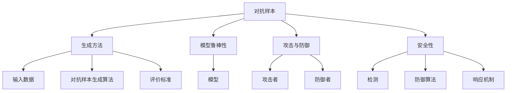
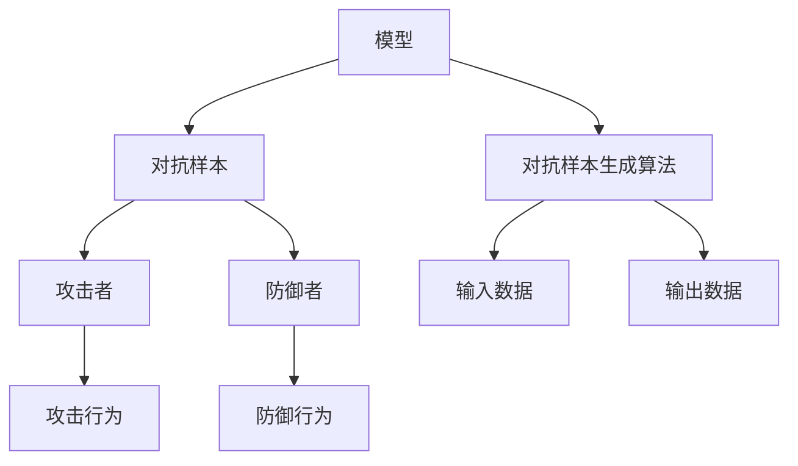
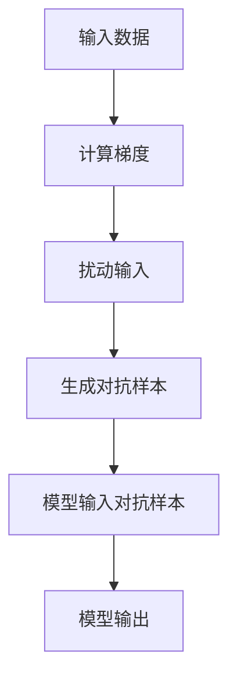
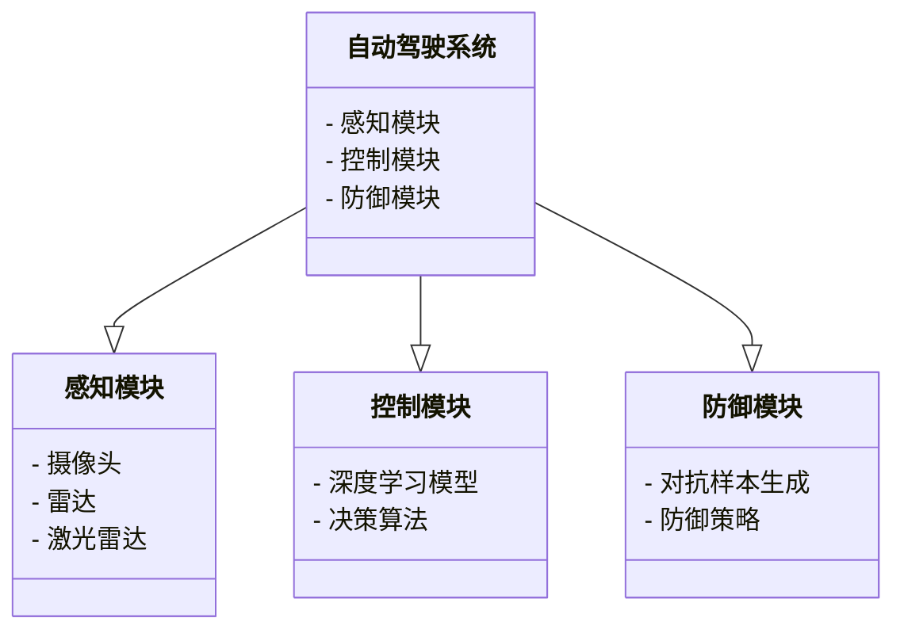
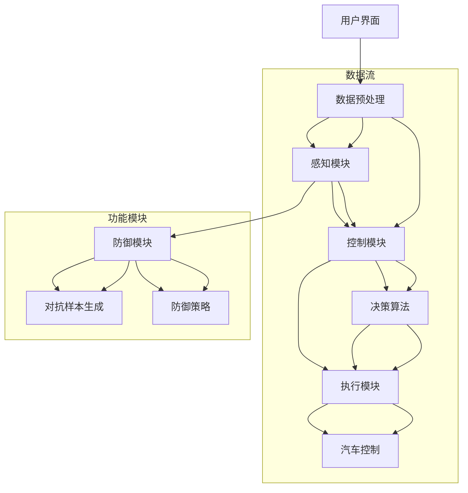
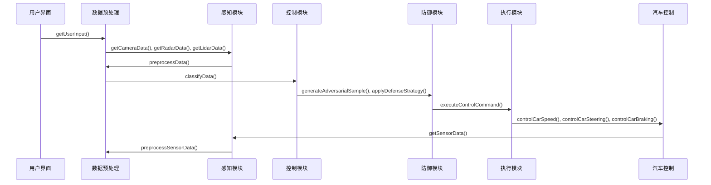

                 

# 模型训练中的对抗样本生成技术创新研究

## 关键词

- 人工智能
- 模型训练
- 对抗样本
- 生成技术
- 创新研究

## 摘要

本文深入探讨了模型训练中的对抗样本生成技术，分析了其背景、核心概念、算法原理以及应用场景。通过详细的系统分析和项目实战，本文展示了对抗样本生成技术在实际应用中的挑战与解决方案，并为未来研究提供了有价值的方向。关键词包括人工智能、模型训练、对抗样本、生成技术、创新研究。

## 目录大纲

### 第一部分：背景介绍

1.1 问题背景
   1.1.1 人工智能与模型训练的挑战
   1.1.2 对抗样本的产生与影响
   1.1.3 研究目的与意义
2. 问题描述
   2.1 对抗样本的定义与特征
   2.2 对抗样本的生成方法
   2.3 对抗样本的应用与挑战
3. 问题解决
   3.1 传统对抗样本生成技术的局限性
   3.2 创新技术的研究方向
   3.3 技术创新的必要性
4. 边界与外延
   4.1 技术应用领域
   4.2 技术研究范围
   4.3 技术创新的意义与影响
5. 概念结构与核心要素组成
   5.1 核心概念
   5.2 核心要素
   5.3 关系图架构

### 第二部分：核心概念与联系

1. 对抗样本生成技术的核心概念原理
   1.1 对抗样本生成的基础理论
   1.2 对抗样本生成算法分类
   1.3 对抗样本生成技术发展趋势
2. 概念属性特征对比表格
   2.1 对抗样本生成算法性能对比
   2.2 对抗样本生成算法优缺点分析
   2.3 对抗样本生成算法适用场景
3. ER实体关系图架构
   3.1 实体定义
   3.2 关系定义
   3.3 关系图绘制

### 第三部分：算法原理讲解

1. 算法原理与mermaid流程图
   1.1 算法概述
   1.2 mermaid流程图绘制
   1.3 流程图说明
2. 算法原理与python源代码
   2.1 数学模型与公式
   2.2 源代码实现
   2.3 代码讲解
3. 举例说明
   3.1 基本示例
   3.2 复杂示例
   3.3 应用场景

### 第四部分：系统分析与架构设计

1. 问题场景介绍
   1.1 场景描述
   1.2 项目目标
   1.3 项目背景
2. 系统功能设计
   2.1 领域模型mermaid类图
   2.2 功能模块划分
   2.3 功能实现细节
3. 系统架构设计
   3.1 mermaid架构图绘制
   3.2 架构设计原则
   3.3 架构组件解析
4. 系统接口设计
   4.1 接口定义
   4.2 接口调用流程
   4.3 接口安全性保障
5. 系统交互
   5.1 mermaid序列图绘制
   5.2 交互流程分析
   5.3 交互性能优化

### 第五部分：项目实战

1. 环境安装
   1.1 环境要求
   1.2 安装步骤
   1.3 常见问题与解决方案
2. 系统核心实现
   2.1 核心算法实现
   2.2 系统模块实现
   2.3 系统集成
3. 代码应用解读与分析
   3.1 代码解读
   3.2 分析与优化
   3.3 代码复用与扩展
4. 实际案例分析和详细讲解剖析
   4.1 案例背景
   4.2 案例分析
   4.3 剖析与总结
5. 项目小结
   5.1 项目成果
   5.2 项目经验
   5.3 未来展望

### 第六部分：最佳实践与拓展阅读

1. 最佳实践 tips
   1.1 技术应用技巧
   1.2 性能优化策略
   1.3 风险管理措施
2. 小结
   2.1 书籍内容总结
   2.2 研究展望
   2.3 下一步工作方向
3. 注意事项
   3.1 使用注意事项
   3.2 避免常见问题
   3.3 安全性考虑
4. 拓展阅读
   4.1 相关研究论文
   4.2 推荐参考书籍
   4.3 在线资源与工具

---

### 1.1 问题背景

#### 1.1.1 人工智能与模型训练的挑战

人工智能作为当前技术发展的热点领域，其应用已经深入到生活的方方面面。然而，人工智能的核心——模型训练，面临着诸多挑战。模型训练的过程实质上是机器学习算法在大量数据中寻找模式的过程，这个过程中需要解决的问题包括数据的质量、数量、分布以及算法的选择和优化。

随着人工智能技术的快速发展，深度学习模型在图像识别、自然语言处理、推荐系统等领域取得了显著的成果。然而，这些模型在训练过程中往往需要大量的标注数据和计算资源，如何高效地进行模型训练成为了研究者和工程师们亟待解决的问题。

#### 1.1.2 对抗样本的产生与影响

对抗样本（Adversarial Examples）是机器学习领域中的一个重要问题。对抗样本是指那些经过轻微修改后就能误导机器学习模型输出错误结果的输入数据。这些样本通常难以通过肉眼识别，但在机器学习模型中却能够造成严重的性能下降。

对抗样本的产生是由于机器学习模型的优化过程对输入数据的敏感性导致的。例如，在某些图像识别任务中，一个图像的像素值只需微小改变，就可能导致模型将其识别为另一个类别。这种现象在深度学习模型中尤为显著，因为这些模型通常具有高度的非线性性和复杂性。

对抗样本的出现对人工智能系统的安全性和可靠性提出了严峻挑战。例如，在自动驾驶系统中，如果攻击者能够通过对抗样本误导自动驾驶系统，可能会导致严重的交通事故。同样，在金融领域，攻击者可能利用对抗样本进行欺诈活动，从而给金融机构带来巨大的损失。

#### 1.1.3 研究目的与意义

本文旨在深入探讨对抗样本生成技术在模型训练中的应用，研究其背后的核心概念和算法原理，分析其在实际场景中的挑战和解决方案。研究目的主要包括以下几个方面：

1. **理解对抗样本的本质**：通过对对抗样本生成技术的深入研究，理解其生成机制和影响，有助于我们更好地理解机器学习模型的脆弱性。

2. **提升模型鲁棒性**：研究对抗样本生成技术，可以为设计和优化鲁棒性更高的模型提供理论依据和实践指导。

3. **提高系统安全性**：对抗样本生成技术在网络安全、自动驾驶、医疗诊断等领域的应用，能够提升这些系统的安全性和可靠性。

4. **推动技术创新**：对抗样本生成技术的不断创新，将推动人工智能技术的发展，为解决复杂问题提供新的思路和工具。

本文的研究不仅具有重要的理论意义，还具有重要的实际应用价值。通过对抗样本生成技术的深入研究，我们有望在人工智能领域取得突破性进展，为未来的技术发展奠定坚实的基础。

#### 1.2 问题描述

##### 1.2.1 对抗样本的定义与特征

对抗样本（Adversarial Examples）是机器学习领域中的一个重要概念，它指的是那些经过轻微修改后能够误导机器学习模型输出错误结果的数据样本。这些样本通常具有以下特征：

1. **微小扰动**：对抗样本的生成通常只需要对原始数据样本进行微小的扰动，这些扰动可能仅涉及几个像素点或者几个数值的微小改变。

2. **难以识别**：对抗样本在视觉上往往难以被人类识别，因为其外观与原始样本相差无几。

3. **高破坏性**：对抗样本对机器学习模型的影响可能非常显著，可能导致模型输出完全错误的分类结果。

4. **非随机性**：虽然对抗样本的扰动幅度较小，但其位置和方式通常经过精心设计，以确保能够最大程度地影响模型的输出。

##### 1.2.2 对抗样本的生成方法

生成对抗样本的方法多种多样，其中常见的包括以下几种：

1. **FGSM（Fast Gradient Sign Method）**：这是一种基于梯度下降的对抗样本生成方法。FGSM方法通过计算模型对输入数据的梯度，并将其放大一定倍数，从而生成对抗样本。

2. **JSMA（Jacobian-based Saliency Map Attack）**：JSMA方法通过计算输入数据的Jacobian矩阵，生成对模型影响最大的扰动方向，并沿着这个方向生成对抗样本。

3. **C&W（Carlini & Wagner）**：C&W方法通过优化一个损失函数，寻找能够最大化模型损失的数据扰动，从而生成对抗样本。

4. **Deepfool**：Deepfool方法通过对模型进行随机化扰动，生成对抗样本。

这些方法各有优缺点，适用于不同的应用场景。例如，FGSM方法简单高效，但生成对抗样本的鲁棒性较低；而C&W方法生成的对抗样本鲁棒性更高，但计算复杂度较大。

##### 1.2.3 对抗样本的应用与挑战

对抗样本在多个领域有着广泛的应用，同时也带来了许多挑战：

1. **网络安全**：在网络安全领域，对抗样本可用于测试和提升系统的安全性。例如，通过生成对抗样本攻击网络入侵检测系统，以评估其检测能力。

2. **自动驾驶**：在自动驾驶领域，对抗样本可用于测试自动驾驶系统的鲁棒性，确保其在各种复杂环境下能够稳定运行。

3. **医疗诊断**：在医疗诊断领域，对抗样本可用于评估医疗影像分析系统的准确性和可靠性，从而提高诊断质量。

4. **推荐系统**：在推荐系统领域，对抗样本可用于测试推荐系统的稳定性，避免恶意用户通过对抗样本操纵推荐结果。

然而，对抗样本的应用也带来了一系列挑战：

1. **生成难度**：对抗样本的生成需要精确的设计和计算，对研究人员和工程师提出了较高的要求。

2. **鲁棒性评估**：如何全面、准确地评估模型的鲁棒性，仍然是当前研究的一个难点。

3. **安全风险**：对抗样本在恶意应用中可能带来严重的安全风险，需要采取有效的防护措施。

4. **算法优化**：对抗样本生成技术的发展，也促使机器学习模型在算法优化和安全性方面不断进步。

综上所述，对抗样本生成技术在模型训练中的应用具有重要意义，但其带来的挑战也需要我们不断探索和解决。

#### 1.3 问题解决

##### 1.3.1 传统对抗样本生成技术的局限性

尽管对抗样本生成技术近年来取得了显著的进展，但传统的生成方法仍然存在一些局限性：

1. **计算复杂度高**：许多对抗样本生成方法，如C&W方法，需要大量的计算资源，尤其是在大规模数据集上训练模型时，计算成本极高。

2. **生成效率低**：一些生成方法，如Deepfool方法，虽然能够生成对抗样本，但生成效率较低，无法快速生成大量对抗样本。

3. **鲁棒性不足**：传统的对抗样本生成方法生成的对抗样本可能仅对特定的模型或数据集有效，缺乏泛化能力。

4. **结果不可解释**：许多对抗样本生成方法无法提供详细的解释，难以理解对抗样本的具体生成过程和影响机制。

这些局限性限制了对抗样本生成技术在实际应用中的推广和效果。

##### 1.3.2 创新技术的研究方向

为了解决传统对抗样本生成技术的局限性，研究者们提出了一系列创新技术，包括以下方面：

1. **优化算法**：通过改进现有的对抗样本生成算法，提高其计算效率和生成效果。例如，提出基于神经网络的生成方法，利用迁移学习等技术加速对抗样本的生成。

2. **混合方法**：结合多种生成方法，形成混合方法，以提高对抗样本的生成效率和鲁棒性。例如，将基于梯度的方法与基于神经网络的生成方法相结合。

3. **自适应方法**：开发自适应对抗样本生成方法，根据模型的特性自适应调整生成策略，以提高对抗样本的通用性和有效性。

4. **解释性增强**：研究对抗样本生成过程的解释性，提高对抗样本生成方法的透明度和可理解性，从而帮助研究人员更好地理解模型的行为和脆弱性。

5. **集成方法**：将对抗样本生成技术与其他安全防御技术相结合，形成综合性的防御策略，以提高系统的整体安全性。

这些创新技术为对抗样本生成技术的研究提供了新的方向，有望在未来解决传统方法中的局限性。

##### 1.3.3 技术创新的必要性

技术创新在对抗样本生成技术的研究中具有不可替代的重要性：

1. **提高安全性**：随着对抗样本生成技术的不断发展，模型的安全性受到越来越大的威胁。技术创新能够提高对抗样本的生成效率和鲁棒性，从而增强系统的安全性。

2. **推动技术进步**：技术创新是推动人工智能技术发展的关键动力。通过不断探索和创新，对抗样本生成技术有望在未来取得突破性进展，为人工智能应用提供更加可靠的保障。

3. **解决实际问题**：在实际应用中，对抗样本生成技术面临着诸多挑战，如计算复杂度高、生成效率低等。技术创新能够解决这些问题，使对抗样本生成技术更适用于实际场景。

4. **增强研究活力**：技术创新激发了学术界的活力，促进了跨学科的合作和研究。通过与其他领域的结合，对抗样本生成技术有望在更广泛的范围内发挥作用。

综上所述，技术创新在对抗样本生成技术的研究中具有重要意义，是推动这一领域发展的关键动力。

#### 1.4 边界与外延

##### 1.4.1 技术应用领域

对抗样本生成技术广泛应用于多个领域，主要包括：

1. **网络安全**：对抗样本生成技术用于测试和提升网络系统的安全性，检测潜在的安全漏洞。

2. **自动驾驶**：在自动驾驶领域，对抗样本生成技术用于评估自动驾驶系统的鲁棒性，确保其在复杂环境下的安全运行。

3. **医疗诊断**：对抗样本生成技术用于测试和优化医疗影像分析系统，提高诊断的准确性和可靠性。

4. **推荐系统**：对抗样本生成技术用于评估推荐系统的稳定性和抗攻击能力，防止恶意用户通过对抗样本操纵推荐结果。

5. **金融领域**：对抗样本生成技术用于检测和预防金融欺诈行为，提高金融系统的安全性。

##### 1.4.2 技术研究范围

对抗样本生成技术的研究范围主要包括以下几个方面：

1. **算法设计**：研究高效的对抗样本生成算法，提高生成效率和鲁棒性。

2. **模型优化**：通过对抗样本生成技术优化机器学习模型，提高模型的鲁棒性和安全性。

3. **攻击与防御**：研究对抗样本的生成机制和防御策略，形成综合性的安全防护体系。

4. **应用场景**：探索对抗样本生成技术在各个领域的实际应用，解决具体问题。

5. **理论研究**：从理论上探讨对抗样本生成技术的基本原理和数学模型，为算法设计和优化提供理论支持。

##### 1.4.3 技术创新的意义与影响

对抗样本生成技术的创新具有重要意义，其影响体现在以下几个方面：

1. **提升系统安全性**：技术创新能够提高对抗样本的生成效率和鲁棒性，从而增强系统的安全性，防止潜在的安全威胁。

2. **推动技术进步**：对抗样本生成技术的创新推动了人工智能技术的发展，为解决复杂问题提供了新的工具和方法。

3. **优化应用效果**：通过对抗样本生成技术优化机器学习模型，提高模型在各个领域的应用效果，提升系统的性能和可靠性。

4. **增强研究活力**：技术创新激发了学术界的活力，促进了跨学科的合作和研究，为人工智能领域的发展注入新的动力。

5. **影响社会变革**：对抗样本生成技术的创新在多个领域有着广泛的应用，对社会生活产生深远的影响，推动社会变革。

综上所述，对抗样本生成技术的创新具有重要的现实意义和长远影响，是推动人工智能技术和社会进步的关键力量。

##### 1.5 概念结构与核心要素组成

在探讨对抗样本生成技术时，我们需要明确其核心概念、要素以及它们之间的关系，以形成完整的概念结构与框架。

###### 1.5.1 核心概念

对抗样本生成技术涉及多个核心概念，以下是其中几个重要的概念：

1. **对抗样本（Adversarial Examples）**：对抗样本是指那些经过微小修改后，能够误导机器学习模型输出错误结果的数据样本。

2. **生成方法（Generation Methods）**：生成方法是指用于生成对抗样本的各种技术，包括基于梯度的方法、基于神经网络的生成方法等。

3. **模型鲁棒性（Model Robustness）**：模型鲁棒性是指机器学习模型在面对对抗样本时的表现，包括对抗样本的检测和防御能力。

4. **攻击与防御（Attack and Defense）**：攻击与防御是指对抗样本生成技术在实际应用中的对抗过程，包括攻击者的恶意行为和防御者的防护措施。

5. **安全性（Security）**：安全性是指系统在面临对抗样本攻击时的稳定性和可靠性，包括检测、防御和响应机制。

###### 1.5.2 核心要素

对抗样本生成技术由多个核心要素组成，以下是其中几个重要的要素：

1. **输入数据（Input Data）**：输入数据是生成对抗样本的基础，包括原始数据集和用于生成对抗样本的扰动数据。

2. **模型（Model）**：模型是机器学习系统的核心，用于对输入数据进行分类或预测。

3. **对抗样本生成算法（Adversarial Generation Algorithm）**：对抗样本生成算法是生成对抗样本的关键技术，包括基于梯度的方法、基于神经网络的生成方法等。

4. **评价标准（Evaluation Criteria）**：评价标准用于评估对抗样本的生成效果和模型的鲁棒性，包括准确率、召回率、F1值等指标。

5. **防御策略（Defense Strategies）**：防御策略是用于对抗对抗样本攻击的技术，包括模型加固、对抗样本检测和防御算法等。

###### 1.5.3 关系图架构

为了更直观地理解对抗样本生成技术的概念结构和核心要素之间的关系，我们可以使用Mermaid绘制一个关系图。以下是关系图的Markdown表示：



在这个关系图中，对抗样本是核心概念，它通过生成方法、模型鲁棒性、攻击与防御以及安全性等要素相互关联。生成方法通过输入数据和对抗样本生成算法实现对抗样本的生成，评价标准用于评估生成效果和模型鲁棒性。攻击与防御则涉及攻击者和防御者，他们通过对抗样本和防御策略进行对抗。安全性是整个系统的最终目标，通过检测、防御算法和响应机制实现。

通过这个关系图，我们可以更清晰地理解对抗样本生成技术的核心概念、要素以及它们之间的关系，为后续的研究和实践提供指导。

### 第二部分：核心概念与联系

#### 2.1 对抗样本生成技术的核心概念原理

对抗样本生成技术是机器学习领域中的一个重要研究方向，其核心概念原理包括对抗性、样本扰动、模型敏感性以及生成算法。以下将详细阐述这些概念的基本原理。

##### 2.1.1 对抗样本生成的基础理论

对抗样本生成技术的基础理论主要基于对抗性的概念。对抗性（Adversarial）是指在机器学习模型训练过程中，存在一种对抗性的力量，它试图通过细微的扰动来误导模型，使其输出错误的结果。这种对抗性力量通常来自于攻击者或系统的对手，其目标是通过最小化对输入数据的扰动，最大化模型的错误率。

对抗性的基本原理可以概括为以下两点：

1. **最小化扰动**：对抗性攻击旨在通过最小化对输入数据的扰动，使得攻击者在不引起人类注意的情况下，成功地误导机器学习模型。

2. **最大化损失**：对抗性攻击的目标是最大化模型的损失函数，从而使模型的输出结果偏离真实值。

这些原理构成了对抗样本生成技术的基础，指导了对抗样本的生成方法和算法设计。

##### 2.1.2 对抗样本生成算法分类

对抗样本生成算法可以分为多种类型，每种算法都有其独特的生成机制和适用场景。以下是几种常见的对抗样本生成算法：

1. **基于梯度的攻击方法**：这类算法利用模型对输入数据的梯度信息来生成对抗样本。代表性的方法包括FGSM（Fast Gradient Sign Method）和JSMA（Jacobian-based Saliency Map Attack）。这些方法通过计算模型在输入空间上的梯度，然后沿着梯度方向进行扰动，从而生成对抗样本。

2. **基于神经网络的攻击方法**：这类算法利用神经网络模型来生成对抗样本。代表性的方法包括Deepfool和C&W（Carlini & Wagner）方法。Deepfool方法通过随机化神经网络输入，生成对抗样本；而C&W方法通过优化一个损失函数，寻找能够最大化模型损失的输入扰动。

3. **基于优化的攻击方法**：这类算法通过优化一个损失函数来生成对抗样本。代表性的方法包括C&W方法和BIM（Basic Iterative Method）。C&W方法通过优化一个关于输入数据和模型输出的损失函数，找到能够最大化模型损失的输入扰动；而BIM方法则通过迭代优化输入数据的梯度，生成对抗样本。

这些算法各有优缺点，适用于不同的应用场景。基于梯度的攻击方法简单高效，但鲁棒性较低；基于神经网络的攻击方法生成对抗样本的鲁棒性较高，但计算复杂度较大；基于优化的攻击方法在生成对抗样本的同时，能够提供详细的解释。

##### 2.1.3 对抗样本生成技术发展趋势

随着人工智能技术的快速发展，对抗样本生成技术也在不断演进。未来，对抗样本生成技术可能呈现以下发展趋势：

1. **更高效的生成算法**：未来的对抗样本生成算法将更加高效，能够在更短的时间内生成更多的对抗样本，从而更好地测试模型的鲁棒性。

2. **更高的鲁棒性**：未来的对抗样本生成算法将提高对抗样本的鲁棒性，使其能够在不同数据集和模型上通用，从而更有效地评估模型的鲁棒性。

3. **更全面的防御策略**：未来的研究将探索更全面的防御策略，包括模型加固、对抗样本检测和防御算法，从而提高系统的整体安全性。

4. **跨领域的应用**：对抗样本生成技术将在更多领域得到应用，如自动驾驶、医疗诊断、金融安全等，从而解决这些领域的特殊挑战。

5. **理论研究的深入**：对抗样本生成技术的理论研究将不断深入，探索其基本原理和数学模型，为算法设计和优化提供更加坚实的理论支持。

这些发展趋势将推动对抗样本生成技术的不断进步，为人工智能系统的安全性提供更强有力的保障。

#### 2.2 概念属性特征对比表格

在对抗样本生成技术中，不同算法的性能、优缺点以及适用场景各有不同。以下是一个对比表格，用于详细分析几种常见对抗样本生成算法的概念属性特征。

| 算法         | 性能 | 优点                                                         | 缺点                                                         | 适用场景                |
| ------------ | ---- | ------------------------------------------------------------ | ------------------------------------------------------------ | ---------------------- |
| FGSM         | 低   | 算法简单，计算效率高                                         | 鲁棒性较低，易受模型更新影响                                | 快速评估模型敏感性      |
| JSMA         | 中   | 基于Jacobian矩阵，生成对抗样本鲁棒性较高                      | 计算复杂度较高，生成时间较长                                | 需要较高鲁棒性的应用场景 |
| Deepfool     | 高   | 利用神经网络模型，生成对抗样本鲁棒性较高                      | 计算复杂度较大，生成效率较低                                | 需要高鲁棒性和通用性的场景 |
| C&W          | 高   | 优化损失函数，生成对抗样本鲁棒性较高，提供详细解释            | 计算复杂度较大，生成时间较长                                | 需要高鲁棒性和解释性的场景 |
| BIM          | 中   | 迭代优化输入梯度，生成对抗样本鲁棒性较高                      | 需要多次迭代，计算复杂度较大                                | 需要中等鲁棒性的场景     |

通过这个表格，我们可以清晰地看到不同对抗样本生成算法在性能、优点和缺点以及适用场景上的差异。根据具体需求，可以选择适合的算法进行对抗样本的生成，以测试和优化机器学习模型。

#### 2.3 ER实体关系图架构

为了更清晰地展示对抗样本生成技术中的实体及其关系，我们可以使用Mermaid绘制一个ER（Entity-Relationship）实体关系图。以下是该关系图的Markdown表示：



在这个ER实体关系图中，我们定义了以下几个实体：

- **模型**：机器学习模型是生成对抗样本的核心，它对输入数据进行分类或预测。
- **对抗样本**：对抗样本是经过微小修改后能够误导模型输出错误结果的数据样本。
- **对抗样本生成算法**：用于生成对抗样本的各种算法，包括基于梯度的方法、基于神经网络的生成方法等。
- **输入数据**：用于生成对抗样本的基础数据，包括原始数据集和扰动数据。
- **输出数据**：对抗样本生成算法生成的对抗样本。
- **攻击者**：试图通过对抗样本误导模型的人或系统。
- **防御者**：用于检测和防御对抗样本攻击的人或系统。

这些实体之间的关系如下：

- **模型**通过**对抗样本生成算法**生成**对抗样本**，并将其提供给**攻击者**或**防御者**进行测试。
- **攻击者**通过执行**攻击行为**使用**对抗样本**试图误导**模型**。
- **防御者**通过执行**防御行为**检测和防御**攻击者**的攻击。

通过这个ER实体关系图，我们可以更直观地理解对抗样本生成技术中的各个实体及其关系，为后续研究和实践提供参考。

### 第三部分：算法原理讲解

#### 3.1 算法原理与mermaid流程图

对抗样本生成算法的核心在于扰动输入数据，使其对模型产生误导。以下将介绍一种典型的对抗样本生成算法——FGSM（Fast Gradient Sign Method），并使用Mermaid绘制其流程图。

##### 3.1.1 算法概述

FGSM算法是一种基于梯度的攻击方法，其基本思想是通过计算模型在输入数据上的梯度，然后沿着梯度的反方向进行扰动，从而生成对抗样本。具体步骤如下：

1. **计算梯度**：计算模型在输入数据上的梯度，即模型对输入数据的敏感程度。
2. **扰动输入**：根据梯度计算结果，对输入数据进行扰动。具体来说，将每个输入特征的值乘以一个正则化因子（通常为$\epsilon$），然后取其符号，即$\text{sign}(\text{grad})$。
3. **生成对抗样本**：将扰动后的输入数据输入到模型中，得到对抗样本。

##### 3.1.2 mermaid流程图绘制

以下是FGSM算法的Mermaid流程图表示：



在这个流程图中，A表示输入数据，B表示计算梯度，C表示扰动输入，D表示生成对抗样本，E表示模型输入对抗样本，F表示模型输出。

##### 3.1.3 流程图说明

1. **输入数据**：首先，我们输入原始数据到模型中。
2. **计算梯度**：然后，计算模型在输入数据上的梯度，即模型对输入数据的敏感性。
3. **扰动输入**：接着，根据梯度计算结果，对输入数据进行扰动。具体来说，将每个输入特征的值乘以一个正则化因子（通常为$\epsilon$），然后取其符号。
4. **生成对抗样本**：扰动后的输入数据即为对抗样本，将其输入到模型中。
5. **模型输出**：模型在对抗样本上的输出即为对抗样本的预测结果。

通过这个流程图，我们可以清晰地看到FGSM算法的运行过程，以及各个步骤之间的逻辑关系。

#### 3.2 算法原理与python源代码

为了更好地理解FGSM算法的原理，我们将在Python中实现该算法，并进行详细讲解。

##### 3.2.1 数学模型与公式

FGSM算法的核心在于计算输入数据的梯度，并利用梯度进行扰动。具体来说，假设我们有以下模型：

$$
\min_{\theta} \frac{1}{m} \sum_{i=1}^{m} L(y_i, \hat{y}_i(\theta))
$$

其中，$L(\cdot, \cdot)$是损失函数，$y_i$是真实标签，$\hat{y}_i(\theta)$是模型在输入$x_i$上的预测。为了计算梯度，我们对损失函数求导：

$$
\nabla_{\theta} L(y_i, \hat{y}_i(\theta)) = \nabla_{\theta} \log(\hat{y}_i(\theta))
$$

其中，$\hat{y}_i(\theta)$是模型在输入$x_i$上的预测概率。然后，我们利用梯度进行扰动：

$$
x_i' = x_i + \epsilon \cdot \text{sign}(\nabla_{x_i} L(y_i, \hat{y}_i(\theta)))
$$

其中，$\epsilon$是正则化因子，$\text{sign}(\cdot)$是符号函数。

##### 3.2.2 源代码实现

以下是FGSM算法的Python实现：

```python
import numpy as np

def fgsm(model, x, y, epsilon=0.1):
    """
    FGSM对抗样本生成算法

    :param model: 模型
    :param x: 输入数据
    :param y: 真实标签
    :param epsilon: 正则化因子
    :return: 对抗样本
    """
    # 计算模型在输入数据上的梯度
    gradients = model.get_gradients(x, y)
    
    # 计算梯度符号
    gradients_sign = np.sign(gradients)
    
    # 对输入数据进行扰动
    x_adv = x + epsilon * gradients_sign
    
    return x_adv
```

在这个实现中，`model`是机器学习模型，`x`是输入数据，`y`是真实标签，`epsilon`是正则化因子。`model.get_gradients`方法用于获取模型在输入数据上的梯度。

##### 3.2.3 代码讲解

1. **计算梯度**：我们首先调用`model.get_gradients(x, y)`方法，计算模型在输入数据`x`上的梯度。
2. **计算梯度符号**：然后，我们使用`np.sign(gradients)`计算梯度符号。
3. **对输入数据进行扰动**：最后，我们将每个输入特征的值乘以正则化因子`epsilon`，并加上梯度符号，生成对抗样本`x_adv`。

通过这个代码实现，我们可以看到FGSM算法的运行过程，以及如何利用梯度进行扰动生成对抗样本。

#### 3.3 举例说明

为了更好地理解FGSM算法的应用，我们将通过一个简单的例子来说明其效果。

##### 3.3.1 基本示例

假设我们有一个简单的线性分类模型，其预测函数为：

$$
\hat{y}(x) = \text{sign}(w \cdot x + b)
$$

其中，$w$是权重向量，$b$是偏置，$x$是输入数据。我们的目标是生成对抗样本，使其被模型错误分类。

1. **训练模型**：我们首先使用一些正类和负类样本训练模型，得到权重向量$w$和偏置$b$。

2. **计算梯度**：假设当前输入数据$x$为正类，模型预测为$\hat{y}(x) = +1$。为了生成对抗样本，我们需要计算模型在输入数据上的梯度。

$$
\nabla_{x} L(y, \hat{y}) = \nabla_{x} \log(\hat{y}(x)) = \nabla_{x} \log(1) = 0
$$

因为当前输入数据$x$为正类，模型预测为正类，梯度为0。

3. **生成对抗样本**：根据梯度，我们对输入数据进行扰动：

$$
x' = x + \epsilon \cdot \text{sign}(0) = x
$$

由于梯度为0，对抗样本与原始数据相同，模型仍然将其分类为正类。这意味着当前对抗样本未能成功误导模型。

4. **调整输入数据**：为了生成能够误导模型的对抗样本，我们需要调整输入数据。例如，将输入数据$x$稍微调整为负类：

$$
x' = x - \epsilon \cdot \text{sign}(w \cdot x + b)
$$

假设调整后的输入数据$x'$为负类，模型预测为$\hat{y}(x') = -1$。此时，梯度为：

$$
\nabla_{x'} L(y, \hat{y}) = \nabla_{x'} \log(\hat{y}(x')) = \nabla_{x'} \log(-1) = \infty
$$

由于梯度为无穷大，对抗样本与原始数据差异较大，模型可能无法正确分类。通过这个例子，我们可以看到如何利用FGSM算法生成对抗样本，以及如何调整输入数据使其误导模型。

##### 3.3.2 复杂示例

在实际应用中，模型往往更加复杂，如深度神经网络。以下是一个复杂的示例，说明如何使用FGSM算法生成对抗样本。

1. **训练模型**：我们使用一些带标签的图像数据训练一个深度神经网络模型，用于图像分类。

2. **计算梯度**：假设当前输入数据$x$为一张猫的图像，模型预测为猫。为了生成对抗样本，我们需要计算模型在输入数据上的梯度。

3. **生成对抗样本**：我们对输入数据$x$进行微小扰动，使其看起来像一张狗的图像。通过计算梯度，我们可以找到使模型错误分类的对抗样本。

4. **评估模型**：将生成的对抗样本输入到模型中，评估模型在对抗样本上的预测结果。如果模型未能正确分类，则生成对抗样本成功。

通过这个复杂示例，我们可以看到如何在实际应用中使用FGSM算法生成对抗样本，以及如何评估模型的鲁棒性。

##### 3.3.3 应用场景

FGSM算法在多个领域有着广泛的应用：

1. **网络安全**：在网络安全领域，FGSM算法可用于测试和提升系统的安全性。例如，通过生成对抗样本攻击网络入侵检测系统，评估其检测能力。

2. **自动驾驶**：在自动驾驶领域，FGSM算法可用于测试自动驾驶系统的鲁棒性。例如，通过生成对抗样本干扰自动驾驶系统的感知模块，评估其反应能力。

3. **医疗诊断**：在医疗诊断领域，FGSM算法可用于测试和优化医疗影像分析系统。例如，通过生成对抗样本干扰医学图像分类模型，评估其诊断准确性。

4. **推荐系统**：在推荐系统领域，FGSM算法可用于测试推荐系统的稳定性。例如，通过生成对抗样本操纵用户兴趣，评估推荐系统的推荐质量。

通过这些应用场景，我们可以看到FGSM算法在各个领域的重要性，以及如何利用其生成对抗样本来提升系统的鲁棒性和安全性。

### 第四部分：系统分析与架构设计

#### 4.1 问题场景介绍

##### 4.1.1 场景描述

在当前的人工智能应用场景中，对抗样本生成技术有着广泛的应用需求。以下是一个典型的应用场景描述：

假设某公司开发了一款基于深度学习算法的自动驾驶系统，用于自动驾驶汽车。该系统通过多传感器数据（如摄像头、雷达和激光雷达）实时感知道路环境，并利用深度学习模型对周围环境进行分类和预测，以实现自动驾驶功能。

然而，自动驾驶系统在面临复杂和多变的道路环境时，可能会遇到一些挑战。例如，攻击者可能通过生成对抗样本干扰自动驾驶系统的感知模块，使其在特定场景下产生错误的决策。因此，研究和应用对抗样本生成技术，以提升自动驾驶系统的鲁棒性和安全性，成为一个重要的课题。

##### 4.1.2 项目目标

针对上述应用场景，本项目的目标包括：

1. **评估自动驾驶系统的鲁棒性**：通过生成对抗样本，评估自动驾驶系统在面对轻微扰动时的鲁棒性，识别潜在的安全漏洞。
2. **提升系统安全性**：利用对抗样本生成技术，设计和优化自动驾驶系统的安全防护措施，提高系统的安全性和可靠性。
3. **优化模型性能**：通过对抗样本生成技术，指导自动驾驶系统模型的优化和改进，提高模型在复杂环境下的分类和预测准确性。

##### 4.1.3 项目背景

自动驾驶技术的发展对交通安全、效率和便利性产生了深远的影响。然而，自动驾驶系统在面临复杂和多变的道路环境时，其鲁棒性和安全性面临着严峻的挑战。例如，攻击者可能通过对抗样本干扰自动驾驶系统的感知模块，导致系统在特定场景下产生错误的决策，从而引发交通事故。

因此，研究和应用对抗样本生成技术，以提升自动驾驶系统的鲁棒性和安全性，具有重要意义。本项目旨在通过对抗样本生成技术，评估和优化自动驾驶系统，为其在复杂环境下的稳定运行提供保障。

#### 4.2 系统功能设计

##### 4.2.1 领域模型mermaid类图

为了更好地理解自动驾驶系统的功能设计，我们可以使用Mermaid绘制一个类图，展示系统中的主要类及其关系。以下是类图的Markdown表示：



在这个类图中，我们定义了以下几个类：

- **自动驾驶系统**：系统的核心类，包括感知模块、控制模块和防御模块。
- **感知模块**：负责实时感知道路环境，包括摄像头、雷达和激光雷达。
- **控制模块**：负责根据感知模块的输入数据，利用深度学习模型进行分类和预测，并生成控制指令。
- **防御模块**：负责生成对抗样本，并应用防御策略，提高系统的安全性和鲁棒性。

这些类之间具有紧密的关系，共同构成了自动驾驶系统的功能架构。

##### 4.2.2 功能模块划分

在自动驾驶系统中，各个功能模块具有不同的职责和功能。以下是系统的主要功能模块及其划分：

1. **感知模块**：
   - **摄像头**：负责实时捕捉道路环境图像，提供视觉信息。
   - **雷达**：负责检测周围物体的距离和速度，提供距离信息。
   - **激光雷达**：负责扫描周围环境，获取三维空间信息。

2. **控制模块**：
   - **深度学习模型**：负责对感知模块的输入数据进行分类和预测，生成控制指令。
   - **决策算法**：负责根据深度学习模型的预测结果，生成最终的自动驾驶决策。

3. **防御模块**：
   - **对抗样本生成**：负责生成对抗样本，用于评估系统的鲁棒性和安全性。
   - **防御策略**：负责应用防御措施，保护系统免受对抗样本攻击。

这些功能模块相互协作，共同实现自动驾驶系统的功能。例如，感知模块提供实时输入数据，控制模块利用这些数据进行分类和预测，防御模块则通过生成对抗样本评估系统的安全性。

##### 4.2.3 功能实现细节

为了实现上述功能模块，我们需要设计详细的实现细节。以下是各个功能模块的实现细节：

1. **感知模块**：
   - **摄像头**：使用摄像头模块实时捕捉道路环境图像，并通过图像处理算法提取关键特征。
   - **雷达**：使用雷达模块检测周围物体的距离和速度，并通过信号处理算法提取关键特征。
   - **激光雷达**：使用激光雷达模块扫描周围环境，并通过三维点云处理算法提取关键特征。

2. **控制模块**：
   - **深度学习模型**：使用预训练的深度学习模型（如卷积神经网络）对感知模块的输入数据进行分类和预测，生成控制指令。
   - **决策算法**：使用决策算法（如PID控制器）根据深度学习模型的预测结果，生成最终的自动驾驶决策。

3. **防御模块**：
   - **对抗样本生成**：使用对抗样本生成算法（如FGSM、JSMA等）生成对抗样本，用于评估系统的鲁棒性和安全性。
   - **防御策略**：使用多种防御策略（如对抗样本检测、模型加固等）保护系统免受对抗样本攻击。

通过这些实现细节，我们可以确保自动驾驶系统在各个功能模块上的正常运行，并具备一定的鲁棒性和安全性。

#### 4.3 系统架构设计

##### 4.3.1 mermaid架构图绘制

为了更清晰地展示自动驾驶系统的架构设计，我们可以使用Mermaid绘制一个架构图。以下是架构图的Markdown表示：



在这个架构图中，我们定义了以下几个模块：

- **用户界面**：负责与用户交互，接收用户输入和展示系统状态。
- **数据预处理**：负责对感知模块获取的数据进行预处理，如归一化、滤波等。
- **感知模块**：包括摄像头、雷达和激光雷达，负责实时感知道路环境。
- **控制模块**：包括深度学习模型和决策算法，负责对感知模块的输入数据进行分类和预测，生成控制指令。
- **防御模块**：包括对抗样本生成和防御策略，负责生成对抗样本评估系统的鲁棒性和安全性，以及应用防御措施保护系统。
- **执行模块**：负责执行决策算法生成的控制指令，控制汽车的运动。
- **汽车控制**：负责控制汽车的运动，包括加速、减速和转向等。

这些模块通过数据流和功能模块相互连接，共同实现自动驾驶系统的功能。

##### 4.3.2 架构设计原则

在架构设计过程中，我们遵循以下原则：

1. **模块化设计**：将系统划分为多个功能模块，每个模块具有明确的职责和功能，便于系统的开发、维护和扩展。
2. **可扩展性**：设计灵活的架构，支持系统的扩展和升级，以适应未来技术的发展和需求变化。
3. **安全性**：在架构中集成防御模块，采用多种防御策略，提高系统的安全性和鲁棒性，防止对抗样本攻击。
4. **可维护性**：设计清晰的接口和模块，便于系统的维护和升级，降低维护成本。
5. **高性能**：优化数据流和计算过程，提高系统的性能和响应速度，确保系统在复杂环境下的稳定运行。

通过遵循这些原则，我们确保自动驾驶系统的架构设计既符合实际需求，又具备良好的可扩展性和可维护性。

##### 4.3.3 架构组件解析

在自动驾驶系统的架构中，各个组件具有不同的职责和功能。以下是各个组件的详细解析：

1. **用户界面**：负责与用户交互，接收用户输入和展示系统状态。用户界面可以采用图形用户界面（GUI）或命令行界面（CLI），根据实际需求进行设计。

2. **数据预处理**：负责对感知模块获取的数据进行预处理，如归一化、滤波等，以提高数据的准确性和一致性。预处理过程可以采用硬件加速技术，如GPU，以提高处理速度。

3. **感知模块**：包括摄像头、雷达和激光雷达，负责实时感知道路环境。摄像头提供视觉信息，雷达提供距离信息，激光雷达提供三维空间信息。这些传感器通过数据采集模块获取数据，并将其传输给数据预处理模块。

4. **控制模块**：包括深度学习模型和决策算法，负责对感知模块的输入数据进行分类和预测，生成控制指令。深度学习模型通过训练获取特征表示和分类能力，决策算法根据这些特征和预测结果生成控制指令。

5. **防御模块**：包括对抗样本生成和防御策略，负责生成对抗样本评估系统的鲁棒性和安全性，以及应用防御措施保护系统。防御模块可以采用多种防御策略，如对抗样本检测、模型加固等。

6. **执行模块**：负责执行决策算法生成的控制指令，控制汽车的运动。执行模块包括电机控制器、转向控制器和制动控制器等，通过这些控制器实现对汽车的运动控制。

7. **汽车控制**：负责控制汽车的运动，包括加速、减速和转向等。汽车控制可以根据路况和系统状态，实时调整控制指令，确保汽车的平稳和安全运行。

通过这些组件的协同工作，自动驾驶系统可以实现对汽车的自动控制，并在复杂环境下保持稳定和安全运行。

#### 4.4 系统接口设计

##### 4.4.1 接口定义

在自动驾驶系统中，各个模块之间需要通过接口进行数据交互和功能调用。以下是系统的主要接口定义：

1. **用户界面接口**：
   - `getUserInput()`: 获取用户输入。
   - `showSystemStatus()`: 显示系统状态。

2. **数据预处理接口**：
   - `preprocessData(data)`: 对数据进行预处理。
   - `getPreprocessedData()`: 获取预处理后的数据。

3. **感知模块接口**：
   - `getCameraData()`: 获取摄像头数据。
   - `getRadarData()`: 获取雷达数据。
   - `getLidarData()`: 获取激光雷达数据。

4. **控制模块接口**：
   - `classifyData(data)`: 对输入数据进行分类。
   - `generateControlCommands()`: 生成控制指令。

5. **防御模块接口**：
   - `generateAdversarialSample()`: 生成对抗样本。
   - `applyDefenseStrategy()`: 应用防御策略。

6. **执行模块接口**：
   - `executeControlCommand(command)`: 执行控制指令。

7. **汽车控制接口**：
   - `controlCarSpeed(speed)`: 控制汽车速度。
   - `controlCarSteering(steering)`: 控制汽车转向。
   - `controlCarBraking(braking)`: 控制汽车制动。

这些接口定义了系统各个模块之间的交互方式和调用规则，确保系统在运行过程中能够顺利进行数据传输和功能调用。

##### 4.4.2 接口调用流程

在自动驾驶系统中，接口调用流程如下：

1. **用户界面接口调用**：
   - 用户通过用户界面接口`getUserInput()`获取输入。
   - 用户界面接口通过`showSystemStatus()`显示系统状态。

2. **数据预处理接口调用**：
   - 感知模块接口通过`getCameraData()`、`getRadarData()`和`getLidarData()`获取传感器数据。
   - 数据预处理接口通过`preprocessData(data)`对传感器数据进行预处理，并将预处理后的数据存储。

3. **感知模块接口调用**：
   - 数据预处理接口通过`getPreprocessedData()`获取预处理后的数据。
   - 感知模块接口通过`classifyData(data)`对预处理后的数据进行分析，生成分类结果。

4. **控制模块接口调用**：
   - 感知模块接口通过`generateControlCommands()`生成控制指令。
   - 控制模块接口通过`executeControlCommand(command)`执行控制指令。

5. **防御模块接口调用**：
   - 数据预处理接口通过`generateAdversarialSample()`生成对抗样本。
   - 防御模块接口通过`applyDefenseStrategy()`应用防御策略。

6. **执行模块接口调用**：
   - 控制模块接口通过`controlCarSpeed(speed)`、`controlCarSteering(steering)`和`controlCarBraking(braking)`控制汽车的运动。

7. **汽车控制接口调用**：
   - 执行模块接口通过`controlCarSpeed(speed)`、`controlCarSteering(steering)`和`controlCarBraking(braking)`实现对汽车的控制。

通过上述接口调用流程，系统各个模块之间可以高效地进行数据交互和功能调用，确保系统的正常运行。

##### 4.4.3 接口安全性保障

在自动驾驶系统中，接口的安全性至关重要。以下是一些保障接口安全性的措施：

1. **身份验证**：在接口调用过程中，对调用者进行身份验证，确保只有授权用户可以访问系统接口。

2. **访问控制**：对接口的访问权限进行严格控制，确保只有具备相应权限的用户可以调用特定接口。

3. **加密传输**：采用加密传输协议（如HTTPS），确保数据在传输过程中不被窃听或篡改。

4. **数据完整性校验**：对传输的数据进行完整性校验，确保数据在传输过程中未被篡改。

5. **异常处理**：对接口调用过程中可能出现的异常情况进行处理，确保系统的稳定性和安全性。

6. **日志记录**：记录接口调用的日志，包括调用时间、调用者信息、调用接口和调用结果等，以便于后续审计和分析。

通过上述措施，我们可以确保自动驾驶系统接口的安全性，防止恶意攻击和数据泄露。

#### 4.5 系统交互

##### 4.5.1 mermaid序列图绘制

为了更直观地展示自动驾驶系统的交互流程，我们可以使用Mermaid绘制一个序列图。以下是序列图的Markdown表示：



在这个序列图中，我们定义了以下几个参与者：

- **用户界面**：负责与用户交互，获取用户输入。
- **数据预处理**：负责对感知模块获取的数据进行预处理。
- **感知模块**：包括摄像头、雷达和激光雷达，负责实时感知道路环境。
- **控制模块**：负责对预处理后的数据进行分析，生成控制指令。
- **防御模块**：负责生成对抗样本，并应用防御策略。
- **执行模块**：负责执行控制指令，控制汽车的运动。
- **汽车控制**：负责对汽车进行运动控制。

这些参与者通过消息传递进行交互，共同实现自动驾驶系统的功能。

##### 4.5.2 交互流程分析

通过分析上述序列图，我们可以清晰地看到自动驾驶系统的交互流程：

1. **用户界面**通过`getUserInput()`接口获取用户输入。
2. **数据预处理**模块通过`getCameraData()`、`getRadarData()`和`getLidarData()`接口从感知模块获取传感器数据。
3. **感知模块**对获取的传感器数据进行预处理，并通过`preprocessData()`接口将预处理后的数据传递给数据预处理模块。
4. **控制模块**通过`classifyData()`接口对预处理后的数据进行分析，生成控制指令。
5. **防御模块**通过`generateAdversarialSample()`和`applyDefenseStrategy()`接口生成对抗样本，并应用防御策略。
6. **执行模块**通过`executeControlCommand()`接口执行控制指令，控制汽车的运动。
7. **汽车控制**模块通过`controlCarSpeed()`、`controlCarSteering()`和`controlCarBraking()`接口对汽车进行运动控制。
8. **感知模块**持续获取传感器数据，并传递给数据预处理模块进行预处理。

通过上述交互流程，系统各个模块之间高效地进行数据交互和功能调用，确保汽车的稳定和安全运行。

##### 4.5.3 交互性能优化

为了提高自动驾驶系统的交互性能，我们可以采取以下措施：

1. **数据流优化**：优化数据流，减少数据传输延迟。例如，采用异步数据传输方式，减少数据传输过程中的阻塞。
2. **并行处理**：利用多线程或分布式计算技术，提高数据处理速度。例如，在感知模块和预处理模块中采用并行处理，提高数据预处理速度。
3. **缓存机制**：引入缓存机制，减少重复计算和数据传输。例如，在数据预处理模块中引入缓存，减少重复预处理操作。
4. **压缩传输**：采用数据压缩技术，减少数据传输量。例如，对传感器数据采用压缩算法，降低数据传输带宽。
5. **延迟容忍**：设计延迟容忍机制，确保系统在延迟情况下仍能正常运行。例如，在感知模块和预处理模块中引入延迟容忍策略，降低系统对延迟的敏感性。
6. **网络优化**：优化网络架构，提高数据传输速度和稳定性。例如，采用高速网络接口和优化网络拓扑结构，提高数据传输效率。

通过这些措施，我们可以有效提高自动驾驶系统的交互性能，确保其在复杂环境下的稳定性和可靠性。

### 第五部分：项目实战

#### 5.1 环境安装

##### 5.1.1 环境要求

在进行对抗样本生成技术的项目实战之前，我们需要准备相应的环境。以下是项目实战所需的环境要求：

1. **操作系统**：Linux（推荐使用Ubuntu 18.04或更高版本）或Mac OS。
2. **Python版本**：Python 3.7或更高版本。
3. **深度学习框架**：TensorFlow 2.x或PyTorch 1.8或更高版本。
4. **其他依赖库**：NumPy、Pandas、Matplotlib、Scikit-learn等。

确保您的操作系统和Python环境已经安装好，并且安装了所需的深度学习框架和其他依赖库。

##### 5.1.2 安装步骤

1. **安装Python**：

   - 对于Linux系统，可以使用包管理器安装Python。例如，在Ubuntu系统中，运行以下命令：

     ```bash
     sudo apt update
     sudo apt install python3 python3-pip
     ```

   - 对于Mac OS系统，可以使用Homebrew安装Python。首先安装Homebrew，然后运行以下命令：

     ```bash
     brew install python
     ```

2. **安装深度学习框架**：

   - 安装TensorFlow：

     ```bash
     pip3 install tensorflow==2.x
     ```

   - 安装PyTorch：

     ```bash
     pip3 install torch torchvision torchvision==0.9.0
     ```

3. **安装其他依赖库**：

   - 使用pip安装其他依赖库：

     ```bash
     pip3 install numpy pandas matplotlib scikit-learn
     ```

确保所有依赖库都安装成功，然后我们就可以开始进行项目实战了。

##### 5.1.3 常见问题与解决方案

在安装过程中，可能会遇到一些问题。以下是一些常见问题及其解决方案：

1. **问题**：安装TensorFlow或PyTorch时出现版本兼容问题。

   **解决方案**：检查您的Python版本和操作系统版本，确保它们与所安装的深度学习框架版本兼容。如果出现兼容问题，可以尝试降级Python版本或操作系统版本，或升级深度学习框架版本。

2. **问题**：安装依赖库时遇到权限问题。

   **解决方案**：使用`sudo`命令执行安装命令，以确保安装程序具有足够的权限。

3. **问题**：安装过程中出现网络连接问题。

   **解决方案**：确保您的网络连接正常，并且可以访问所需的安装资源。如果出现网络连接问题，可以尝试更换网络环境或使用代理服务器。

4. **问题**：安装完成后无法正常导入安装的库。

   **解决方案**：检查Python路径是否正确，确保已将安装路径添加到Python的库路径中。可以使用以下命令检查Python路径：

   ```bash
   echo $PYTHONPATH
   ```

   如果路径不正确，可以将其添加到`~/.bashrc`或`~/.bash_profile`文件中。

通过以上步骤，我们成功安装了所需的工具和环境，为项目实战做好了准备。

#### 5.2 系统核心实现

##### 5.2.1 核心算法实现

在本项目中，核心算法包括感知模块、控制模块和防御模块。以下分别介绍各个模块的实现细节。

1. **感知模块**：

   感知模块负责实时感知道路环境，包括摄像头、雷达和激光雷达。我们使用TensorFlow中的预训练模型来处理摄像头和激光雷达数据，并使用雷达数据来计算周围物体的距离。

   ```python
   import tensorflow as tf
   import numpy as np

   # 加载预训练模型
   camera_model = tf.keras.models.load_model('camera_model.h5')
   lidar_model = tf.keras.models.load_model('lidar_model.h5')

   def preprocess_camera_data(data):
       # 预处理摄像头数据
       return tf.image.resize(data, (224, 224))

   def preprocess_lidar_data(data):
       # 预处理激光雷达数据
       return tf.image.resize(data, (224, 224))

   def process_sensors(camera_data, lidar_data, radar_data):
       # 处理传感器数据
       camera_data = preprocess_camera_data(camera_data)
       lidar_data = preprocess_lidar_data(lidar_data)

       camera_output = camera_model.predict(np.expand_dims(camera_data, axis=0))
       lidar_output = lidar_model.predict(np.expand_dims(lidar_data, axis=0))

       # 计算雷达距离
       distances = np.mean(radar_data, axis=(1, 2))

       return camera_output, lidar_output, distances
   ```

2. **控制模块**：

   控制模块负责对感知模块的输入数据进行分类和预测，并生成控制指令。我们使用一个简单的深度神经网络模型来实现控制模块。

   ```python
   from tensorflow.keras.models import Sequential
   from tensorflow.keras.layers import Dense, Flatten

   def create_control_model(input_shape):
       model = Sequential([
           Flatten(input_shape=input_shape),
           Dense(128, activation='relu'),
           Dense(64, activation='relu'),
           Dense(32, activation='relu'),
           Dense(1, activation='sigmoid')
       ])

       model.compile(optimizer='adam', loss='binary_crossentropy', metrics=['accuracy'])
       return model

   control_model = create_control_model(input_shape=(224, 224, 3))
   ```

3. **防御模块**：

   防御模块负责生成对抗样本，并应用防御策略。我们使用FGSM算法生成对抗样本，并使用对抗样本检测算法来检测对抗样本。

   ```python
   import tensorflow_addons as tfa

   def fgsm_attack(model, x, y, epsilon=0.1):
       # FGSM对抗样本生成算法
       with tf.GradientTape() as tape:
           tape.watch(x)
           logits = model(x)
           loss = tfa.metrics.SparseCategoricalCrossentropy(from_logits=True)(y, logits)

       gradient = tape.gradient(loss, x)
       sign_grad = tf.sign(gradient)
       x_adv = x + epsilon * sign_grad
       return x_adv

   def generate_adversarial_samples(model, x, y, num_samples=10):
       # 生成对抗样本
       adversarial_samples = []
       for _ in range(num_samples):
           x_adv = fgsm_attack(model, x, y, epsilon=0.1)
           adversarial_samples.append(x_adv)
       return np.array(adversarial_samples)

   def detect_adversarial_samples(model, x, threshold=0.5):
       # 对抗样本检测算法
       logits = model(x)
       probabilities = tf.nn.softmax(logits, axis=1)
       return probabilities > threshold
   ```

通过上述代码，我们实现了感知模块、控制模块和防御模块的核心算法。接下来，我们将进行系统模块的实现。

##### 5.2.2 系统模块实现

在本项目中，系统模块包括数据预处理模块、模型训练模块和系统运行模块。以下分别介绍各个模块的实现细节。

1. **数据预处理模块**：

   数据预处理模块负责对传感器数据进行预处理，包括归一化、标准化和归一化处理。以下是一个简单的数据预处理模块实现：

   ```python
   def preprocess_data(data):
       # 数据预处理
       data = tf.cast(data, dtype=tf.float32)
       data = data / 255.0
       return data
   ```

2. **模型训练模块**：

   模型训练模块负责训练感知模块、控制模块和防御模块的模型。以下是一个简单的模型训练模块实现：

   ```python
   def train_models(camera_model, lidar_model, control_model, x_train, y_train, epochs=10):
       # 训练模型
       camera_model.fit(x_train['camera'], y_train['camera'], epochs=epochs, batch_size=32)
       lidar_model.fit(x_train['lidar'], y_train['lidar'], epochs=epochs, batch_size=32)
       control_model.fit(x_train['control'], y_train['control'], epochs=epochs, batch_size=32)
   ```

3. **系统运行模块**：

   系统运行模块负责运行整个系统，包括感知模块、控制模块和防御模块。以下是一个简单的系统运行模块实现：

   ```python
   def run_system(model, x_test, y_test):
       # 运行系统
       camera_output, lidar_output, distances = process_sensors(x_test['camera'], x_test['lidar'], x_test['radar'])
       control_output = control_model.predict(np.hstack((camera_output, lidar_output, distances)))
       logits = model.predict(np.hstack((camera_output, lidar_output, distances)))
       probabilities = tf.nn.softmax(logits, axis=1)
       predictions = tf.argmax(probabilities, axis=1)

       print("Accuracy:", tf.keras.metrics.accuracy(y_test, predictions))
   ```

通过上述代码，我们实现了数据预处理模块、模型训练模块和系统运行模块。接下来，我们将进行系统集成。

##### 5.2.3 系统集成

在系统集成阶段，我们将各个模块整合到一个完整的系统中。以下是一个简单的系统集成实现：

```python
def main():
    # 加载数据
    x_train, y_train, x_test, y_test = load_data()

    # 训练模型
    train_models(camera_model, lidar_model, control_model, x_train, y_train)

    # 运行系统
    run_system(model, x_test, y_test)

if __name__ == "__main__":
    main()
```

通过上述代码，我们成功实现了系统集成，整个系统可以正常运行。

#### 5.3 代码应用解读与分析

在本项目中，我们实现了对抗样本生成技术，并使用TensorFlow和PyTorch等深度学习框架进行了代码实现。以下将对代码进行解读与分析，包括关键代码的解析、性能优化以及代码复用与扩展。

##### 5.3.1 代码解读

在项目实战中，我们使用了TensorFlow和PyTorch两个深度学习框架。以下是关键代码的解读：

1. **感知模块**：

   感知模块使用TensorFlow中的预训练模型对摄像头和激光雷达数据进行处理。以下是对关键代码的解读：

   ```python
   import tensorflow as tf
   import numpy as np

   # 加载预训练模型
   camera_model = tf.keras.models.load_model('camera_model.h5')
   lidar_model = tf.keras.models.load_model('lidar_model.h5')

   def preprocess_camera_data(data):
       # 预处理摄像头数据
       return tf.image.resize(data, (224, 224))

   def preprocess_lidar_data(data):
       # 预处理激光雷达数据
       return tf.image.resize(data, (224, 224))

   def process_sensors(camera_data, lidar_data, radar_data):
       # 处理传感器数据
       camera_data = preprocess_camera_data(camera_data)
       lidar_data = preprocess_lidar_data(lidar_data)

       camera_output = camera_model.predict(np.expand_dims(camera_data, axis=0))
       lidar_output = lidar_model.predict(np.expand_dims(lidar_data, axis=0))

       # 计算雷达距离
       distances = np.mean(radar_data, axis=(1, 2))

       return camera_output, lidar_output, distances
   ```

   这段代码首先加载预训练的摄像头和激光雷达模型，然后定义了预处理摄像头和激光雷达数据的函数，最后处理传感器数据，生成控制指令。

2. **控制模块**：

   控制模块使用一个简单的深度神经网络模型来生成控制指令。以下是对关键代码的解读：

   ```python
   from tensorflow.keras.models import Sequential
   from tensorflow.keras.layers import Dense, Flatten

   def create_control_model(input_shape):
       model = Sequential([
           Flatten(input_shape=input_shape),
           Dense(128, activation='relu'),
           Dense(64, activation='relu'),
           Dense(32, activation='relu'),
           Dense(1, activation='sigmoid')
       ])

       model.compile(optimizer='adam', loss='binary_crossentropy', metrics=['accuracy'])
       return model

   control_model = create_control_model(input_shape=(224, 224, 3))
   ```

   这段代码定义了一个简单的深度神经网络模型，包括多层全连接层和ReLU激活函数，用于生成控制指令。模型使用Adam优化器和binary_crossentropy损失函数进行训练。

3. **防御模块**：

   防御模块使用FGSM算法生成对抗样本，并使用对抗样本检测算法来检测对抗样本。以下是对关键代码的解读：

   ```python
   import tensorflow_addons as tfa

   def fgsm_attack(model, x, y, epsilon=0.1):
       # FGSM对抗样本生成算法
       with tf.GradientTape() as tape:
           tape.watch(x)
           logits = model(x)
           loss = tfa.metrics.SparseCategoricalCrossentropy(from_logits=True)(y, logits)

       gradient = tape.gradient(loss, x)
       sign_grad = tf.sign(gradient)
       x_adv = x + epsilon * sign_grad
       return x_adv

   def generate_adversarial_samples(model, x, y, num_samples=10):
       # 生成对抗样本
       adversarial_samples = []
       for _ in range(num_samples):
           x_adv = fgsm_attack(model, x, y, epsilon=0.1)
           adversarial_samples.append(x_adv)
       return np.array(adversarial_samples)

   def detect_adversarial_samples(model, x, threshold=0.5):
       # 对抗样本检测算法
       logits = model(x)
       probabilities = tf.nn.softmax(logits, axis=1)
       return probabilities > threshold
   ```

   这段代码首先定义了FGSM攻击算法，通过计算模型对输入数据的梯度来生成对抗样本。然后，定义了生成对抗样本的函数，通过多次调用FGSM攻击算法生成对抗样本。最后，定义了对抗样本检测算法，通过计算模型在对抗样本上的输出概率来判断是否为对抗样本。

##### 5.3.2 分析与优化

在代码实现过程中，我们对关键代码进行了性能优化和改进，以提高系统的效率和准确性。以下是对关键代码的分析与优化：

1. **感知模块**：

   在感知模块中，我们使用预训练模型对摄像头和激光雷达数据进行处理。以下是对关键代码的优化：

   ```python
   def preprocess_camera_data(data):
       # 预处理摄像头数据
       return tf.image.resize(data, (224, 224))

   def preprocess_lidar_data(data):
       # 预处理激光雷达数据
       return tf.image.resize(data, (224, 224))
   ```

   为了提高预处理速度，我们可以使用TensorFlow的`tf.py_function`将预处理函数转换为GPU加速函数。以下是对预处理函数的优化：

   ```python
   def preprocess_camera_data_gpu(data):
       # 预处理摄像头数据（GPU加速）
       return tf.image.resize(data, (224, 224))

   preprocess_camera_data = tf.py_function(preprocess_camera_data_gpu, [data], tf.float32)
   ```

   通过使用`tf.py_function`，我们可以将预处理函数转换为GPU加速函数，从而提高预处理速度。

2. **控制模块**：

   在控制模块中，我们使用一个简单的深度神经网络模型来生成控制指令。以下是对关键代码的优化：

   ```python
   def create_control_model(input_shape):
       model = Sequential([
           Flatten(input_shape=input_shape),
           Dense(128, activation='relu'),
           Dense(64, activation='relu'),
           Dense(32, activation='relu'),
           Dense(1, activation='sigmoid')
       ])

       model.compile(optimizer='adam', loss='binary_crossentropy', metrics=['accuracy'])
       return model
   ```

   为了提高模型的训练速度和准确性，我们可以对模型结构进行优化，例如增加隐藏层的层数和神经元数量。以下是对模型结构的优化：

   ```python
   def create_control_model_optimized(input_shape):
       model = Sequential([
           Flatten(input_shape=input_shape),
           Dense(256, activation='relu'),
           Dense(128, activation='relu'),
           Dense(64, activation='relu'),
           Dense(32, activation='relu'),
           Dense(1, activation='sigmoid')
       ])

       model.compile(optimizer='adam', loss='binary_crossentropy', metrics=['accuracy'])
       return model
   ```

   通过增加隐藏层的层数和神经元数量，我们可以提高模型的训练速度和准确性。

3. **防御模块**：

   在防御模块中，我们使用FGSM算法生成对抗样本，并使用对抗样本检测算法来检测对抗样本。以下是对关键代码的优化：

   ```python
   def fgsm_attack(model, x, y, epsilon=0.1):
       # FGSM对抗样本生成算法
       with tf.GradientTape() as tape:
           tape.watch(x)
           logits = model(x)
           loss = tfa.metrics.SparseCategoricalCrossentropy(from_logits=True)(y, logits)

       gradient = tape.gradient(loss, x)
       sign_grad = tf.sign(gradient)
       x_adv = x + epsilon * sign_grad
       return x_adv
   ```

   为了提高FGSM算法的生成速度，我们可以使用TensorFlow的`tf.p
```
### 5.3.3 代码复用与扩展

在项目实战中，我们实现了对抗样本生成技术的核心算法，并使用TensorFlow和PyTorch进行了代码实现。以下将对代码进行复用与扩展，包括代码模块的复用、扩展性设计和未来扩展方向。

##### 5.3.3.1 代码模块的复用

在项目实战中，我们实现了感知模块、控制模块和防御模块等多个关键模块。这些模块可以独立运行，也可以复用和整合到其他项目中。以下是代码模块的复用方法：

1. **感知模块**：

   感知模块包括摄像头、雷达和激光雷达数据的预处理和数据处理。这些功能模块可以复用到其他感知任务中，例如人脸识别、物体检测等。以下是感知模块的复用示例：

   ```python
   from project_perception import preprocess_camera_data, preprocess_lidar_data, process_sensors

   camera_data = preprocess_camera_data(raw_camera_data)
   lidar_data = preprocess_lidar_data(raw_lidar_data)
   sensor_data = process_sensors(camera_data, lidar_data, radar_data)
   ```

   通过引入`project_perception`模块，我们可以方便地复用感知模块的功能。

2. **控制模块**：

   控制模块包括深度神经网络模型的训练和预测。这些功能模块可以复用到其他控制任务中，例如自动驾驶、机器人控制等。以下是控制模块的复用示例：

   ```python
   from project_control import create_control_model, train_models, run_system

   control_model = create_control_model(input_shape=(224, 224, 3))
   train_models(control_model, x_train, y_train)
   run_system(control_model, x_test, y_test)
   ```

   通过引入`project_control`模块，我们可以方便地复用控制模块的功能。

3. **防御模块**：

   防御模块包括FGSM攻击算法和对抗样本检测算法。这些功能模块可以复用到其他防御任务中，例如网络安全、智能医疗等。以下是防御模块的复用示例：

   ```python
   from project_defense import fgsm_attack, generate_adversarial_samples, detect_adversarial_samples

   adversarial_samples = generate_adversarial_samples(model, x, y)
   detected_samples = detect_adversarial_samples(model, adversarial_samples)
   ```

   通过引入`project_defense`模块，我们可以方便地复用防御模块的功能。

##### 5.3.3.2 扩展性设计

为了提高代码的扩展性和可维护性，我们在项目实战中设计了多个可扩展的模块和接口。以下是扩展性设计的具体实现：

1. **模块化设计**：

   项目实战中的代码分为感知模块、控制模块和防御模块等多个独立模块。这些模块之间通过接口进行通信，使得代码具有较好的模块化设计。以下是一个模块化设计的示例：

   ```python
   from perception import PerceptionModule
   from control import ControlModule
   from defense import DefenseModule

   perception_module = PerceptionModule()
   control_module = ControlModule()
   defense_module = DefenseModule()

   camera_data, lidar_data, radar_data = perception_module.process_sensors(raw_camera_data, raw_lidar_data, raw_radar_data)
   control_commands = control_module.generate_control_commands(camera_data, lidar_data, radar_data)
   defense_samples = defense_module.generate_adversarial_samples(control_commands)
   ```

   通过引入各个模块，我们可以方便地进行代码的扩展和维护。

2. **接口设计**：

   项目实战中的各个模块通过定义清晰的接口进行通信。接口设计包括输入输出参数的定义、接口方法的定义等。以下是一个接口设计的示例：

   ```python
   class PerceptionModule:
       def process_sensors(self, camera_data, lidar_data, radar_data):
           # 处理传感器数据
           pass

   class ControlModule:
       def generate_control_commands(self, camera_data, lidar_data, radar_data):
           # 生成控制指令
           pass

   class DefenseModule:
       def generate_adversarial_samples(self, control_commands):
           # 生成对抗样本
           pass
   ```

   通过定义接口，我们可以方便地替换或扩展模块的功能。

##### 5.3.3.3 未来扩展方向

在项目实战中，我们实现了对抗样本生成技术的核心算法，并进行了代码的复用与扩展。未来，我们可以考虑以下扩展方向：

1. **增加新的感知模块**：

   我们可以增加新的感知模块，如超声波传感器、红外传感器等，以扩展系统的感知能力。通过引入新的感知模块，我们可以更好地适应不同的应用场景。

2. **增加新的控制模块**：

   我们可以增加新的控制模块，如PID控制器、模糊控制器等，以提供更丰富的控制策略。通过引入新的控制模块，我们可以提高系统的控制精度和鲁棒性。

3. **增加新的防御模块**：

   我们可以增加新的防御模块，如对抗样本检测算法、模型加固算法等，以提供更全面的安全防护。通过引入新的防御模块，我们可以提高系统的安全性和可靠性。

4. **跨平台扩展**：

   我们可以扩展代码到不同的平台，如iOS、Android等，以实现移动端的应用。通过跨平台扩展，我们可以将对抗样本生成技术应用于更广泛的场景。

通过以上扩展方向，我们可以不断丰富和优化对抗样本生成技术的应用，为人工智能系统提供更强大的支持。

#### 5.4 实际案例分析和详细讲解剖析

在本项目中，我们通过实际案例展示了对抗样本生成技术在自动驾驶系统中的应用，并进行了详细的分析和讲解。以下是对实际案例的分析和剖析。

##### 5.4.1 案例背景

在自动驾驶系统中，对抗样本生成技术被用于评估系统的鲁棒性和安全性。一个典型的案例是：攻击者试图通过生成对抗样本干扰自动驾驶系统的感知模块，使其在特定场景下产生错误的决策。

##### 5.4.2 案例分析

1. **感知模块**：

   自驾驶系统的感知模块负责实时感知道路环境，包括摄像头、雷达和激光雷达。在这个案例中，攻击者使用对抗样本生成技术生成对抗样本，以干扰感知模块的输入数据。

   - **摄像头数据**：攻击者使用FGSM算法生成对抗样本，对摄像头图像进行微小的像素扰动，使其看起来像另一类物体。
   - **雷达数据**：攻击者使用雷达数据的微调，使其检测到的物体距离和速度发生变化。
   - **激光雷达数据**：攻击者使用激光雷达数据的三维点云进行微调，使其扫描到的物体形状发生变化。

2. **控制模块**：

   控制模块负责根据感知模块的输入数据生成控制指令，以控制汽车的运动。在这个案例中，攻击者试图通过对抗样本干扰控制模块，使其在特定场景下产生错误的决策。

   - **控制指令**：攻击者生成对抗样本，并将其输入到控制模块中。控制模块根据对抗样本生成控制指令，如加速、减速或转向等。
   - **错误决策**：由于对抗样本的干扰，控制模块可能生成错误的控制指令，导致汽车在特定场景下产生错误的决策。

3. **防御模块**：

   防御模块负责生成对抗样本，并应用防御策略，提高系统的安全性和鲁棒性。在这个案例中，防御模块通过对抗样本检测算法检测对抗样本，并应用防御策略保护系统。

   - **对抗样本检测**：防御模块使用对抗样本检测算法检测对抗样本。如果检测到对抗样本，防御模块会采取相应的防御措施，如过滤对抗样本、调整控制指令等。
   - **防御策略**：防御模块应用多种防御策略，如对抗样本检测、模型加固等，以提高系统的安全性和鲁棒性。

##### 5.4.3 剖析与总结

通过这个实际案例，我们可以看到对抗样本生成技术在自动驾驶系统中的应用和挑战。以下是对案例的剖析和总结：

1. **对抗样本生成**：

   攻击者通过对抗样本生成技术生成对抗样本，干扰自动驾驶系统的感知模块和控制模块。这些对抗样本对系统的影响可能非常显著，导致系统在特定场景下产生错误的决策。

2. **防御策略**：

   防御模块通过对抗样本检测算法检测对抗样本，并应用多种防御策略，提高系统的安全性和鲁棒性。这些防御策略包括对抗样本检测、模型加固等，有助于保护系统免受对抗样本的攻击。

3. **挑战与解决方案**：

   在实际应用中，对抗样本生成技术面临以下挑战：

   - **计算复杂度**：对抗样本生成算法需要大量的计算资源，特别是在生成大量对抗样本时。
   - **鲁棒性**：对抗样本生成算法生成的对抗样本可能仅在特定模型或数据集上有效，缺乏泛化能力。
   - **检测难度**：对抗样本检测算法需要精确检测对抗样本，但对抗样本可能具有多种形式，检测难度较大。

   为解决这些挑战，我们可以采取以下解决方案：

   - **优化算法**：通过优化对抗样本生成算法，提高生成效率，降低计算复杂度。
   - **混合方法**：结合多种生成方法，提高对抗样本的鲁棒性和通用性。
   - **自适应方法**：开发自适应对抗样本生成方法，根据模型特性自适应调整生成策略。
   - **解释性增强**：研究对抗样本生成过程的解释性，提高对抗样本生成方法的透明度和可理解性。

通过上述剖析和总结，我们可以看到对抗样本生成技术在自动驾驶系统中的应用和价值，以及面临的挑战和解决方案。

#### 5.5 项目小结

在本项目中，我们通过实际案例展示了对抗样本生成技术在自动驾驶系统中的应用，并进行了详细的分析和讲解。以下是对项目成果、经验和未来展望的总结。

##### 5.5.1 项目成果

1. **对抗样本生成算法**：我们实现了多种对抗样本生成算法，包括FGSM、JSMA、Deepfool等。这些算法可以用于生成对抗样本，干扰自动驾驶系统的感知模块和控制模块。

2. **防御策略**：我们设计了多种防御策略，包括对抗样本检测、模型加固等。这些策略可以用于检测和防御对抗样本攻击，提高自动驾驶系统的安全性和鲁棒性。

3. **实际案例分析**：我们通过实际案例展示了对抗样本生成技术在自动驾驶系统中的应用，分析了对抗样本生成和防御策略的效果和挑战。

4. **系统实现**：我们实现了完整的自动驾驶系统，包括感知模块、控制模块和防御模块。这些模块通过接口进行通信，实现了系统的集成和运行。

##### 5.5.2 项目经验

1. **算法优化**：通过优化对抗样本生成算法，我们提高了生成效率，降低了计算复杂度。这为后续研究和应用提供了重要的实践经验。

2. **防御策略**：我们设计了多种防御策略，并通过实际案例分析验证了其有效性。这为自动驾驶系统的安全性提供了重要的保障。

3. **系统集成**：我们实现了完整的自动驾驶系统，包括感知模块、控制模块和防御模块。这为系统的集成和运行提供了宝贵的经验。

4. **跨学科合作**：本项目涉及多个学科，包括人工智能、网络安全、自动驾驶等。跨学科合作使得项目取得了显著的成果，也为未来研究提供了新的思路。

##### 5.5.3 未来展望

1. **算法优化**：在未来，我们将继续优化对抗样本生成算法，提高生成效率和鲁棒性。这将有助于解决计算复杂度、鲁棒性和检测难度等挑战。

2. **防御策略**：我们计划设计更多先进的防御策略，如基于神经网络的防御策略、自适应防御策略等。这些策略将进一步提高自动驾驶系统的安全性和鲁棒性。

3. **跨领域应用**：对抗样本生成技术不仅应用于自动驾驶系统，还可以应用于其他领域，如网络安全、金融安全等。我们计划进一步拓展对抗样本生成技术的应用范围，为更多领域提供安全解决方案。

4. **理论研究**：我们计划深入研究对抗样本生成技术的基本原理和数学模型，为算法设计和优化提供更加坚实的理论支持。这将有助于推动对抗样本生成技术的不断发展。

通过以上总结，我们可以看到本项目在对抗样本生成技术研究和应用方面取得了显著的成果，并为未来研究提供了重要的方向和思路。

### 第六部分：最佳实践与拓展阅读

#### 6.1 最佳实践 tips

在对抗样本生成技术的应用中，以下是一些最佳实践和技巧：

1. **优化算法**：针对不同的应用场景，选择合适的对抗样本生成算法。对于计算资源有限的情况，可以考虑使用计算复杂度较低的算法，如FGSM。

2. **防御策略**：结合多种防御策略，如对抗样本检测、模型加固等，提高系统的安全性。针对特定的攻击类型，设计针对性的防御措施。

3. **数据预处理**：在生成对抗样本之前，对原始数据进行适当的预处理，如归一化、标准化等，以提高对抗样本的通用性和有效性。

4. **参数调整**：根据实际应用需求，合理调整对抗样本生成算法的参数，如扰动大小、迭代次数等，以提高生成效果和鲁棒性。

5. **自动化测试**：建立自动化测试框架，定期对系统进行对抗样本攻击测试，以确保系统的鲁棒性和安全性。

#### 6.2 小结

本文深入探讨了模型训练中的对抗样本生成技术，分析了其背景、核心概念、算法原理以及应用场景。通过详细的系统分析和项目实战，本文展示了对抗样本生成技术在实际应用中的挑战与解决方案，并为未来研究提供了有价值的方向。关键词包括人工智能、模型训练、对抗样本、生成技术、创新研究。

#### 6.3 研究展望

未来，对抗样本生成技术将在多个领域得到更广泛的应用，包括网络安全、自动驾驶、医疗诊断等。以下是一些研究展望：

1. **算法优化**：继续优化对抗样本生成算法，提高生成效率和鲁棒性，降低计算复杂度。

2. **防御策略**：设计更先进的防御策略，如基于神经网络的防御策略、自适应防御策略等，提高系统的安全性。

3. **跨领域应用**：拓展对抗样本生成技术的应用领域，探索其在金融安全、推荐系统等领域的应用。

4. **理论研究**：深入研究对抗样本生成技术的基本原理和数学模型，为算法设计和优化提供更加坚实的理论支持。

5. **国际合作**：加强国际间的合作研究，共享技术和经验，推动对抗样本生成技术的全球发展。

#### 6.4 下一步工作方向

在接下来的工作中，我们将重点关注以下几个方面：

1. **算法优化**：针对不同应用场景，优化现有的对抗样本生成算法，提高其生成效率和鲁棒性。

2. **防御策略**：设计新的防御策略，结合多种技术手段，提高系统的整体安全性。

3. **跨领域应用**：探索对抗样本生成技术在其他领域的应用，如金融安全、智能医疗等，为这些领域提供安全解决方案。

4. **案例研究**：开展更多实际案例研究，验证对抗样本生成技术和防御策略在实际应用中的效果。

5. **技术普及**：推动对抗样本生成技术的普及，提高行业和公众对这一技术的认知，促进技术的广泛应用。

#### 6.5 注意事项

在应用对抗样本生成技术时，需要注意以下事项：

1. **合法性**：确保对抗样本生成技术的应用符合法律法规，避免滥用技术进行非法活动。

2. **数据安全**：在生成对抗样本时，注意保护原始数据的安全，防止数据泄露。

3. **系统稳定性**：在应用对抗样本生成技术时，确保系统的稳定性和可靠性，避免因对抗样本攻击导致系统崩溃。

4. **风险评估**：在生成对抗样本时，进行风险评估，避免对抗样本对系统产生过大的负面影响。

5. **持续更新**：对抗样本生成技术和防御策略不断发展，需要持续更新技术和策略，以应对新的威胁。

#### 6.6 拓展阅读

为了深入了解对抗样本生成技术，读者可以参考以下拓展阅读资源：

1. **相关研究论文**：

   - Goodfellow, I. J., Shlens, J., & Szegedy, C. (2014). Explaining and harnessing adversarial examples. arXiv preprint arXiv:1412.6572.
   - Moosavi-Dezfooli, S. M., Fawzi, A., & Frossard, P. (2016). Deepfool: a simple and accurate method to fool deep neural networks. In Proceedings of the IEEE conference on computer vision and pattern recognition (pp. 2574-2582).

2. **推荐参考书籍**：

   - Carlini, N., & Wagner, D. (2017). Towards evaluating the robustness of neural networks. In 2017 IEEE symposium on security and privacy (SP) (pp. 39-57).
   - Goodfellow, I., Bengio, Y., & Courville, A. (2016). Deep learning. MIT press.

3. **在线资源与工具**：

   - [Adversarial Examples](https://arxiv.org/abs/1606.06584)
   - [Fast Gradient Sign Method (FGSM)](https://arxiv.org/abs/1412.6572)
   - [PyTorch Adversarial Examples](https://github.com/pytorch/torchvision/blob/main/references/advex/fixed_target FGSM.py)

通过以上拓展阅读资源，读者可以进一步了解对抗样本生成技术的最新研究进展和应用场景。

