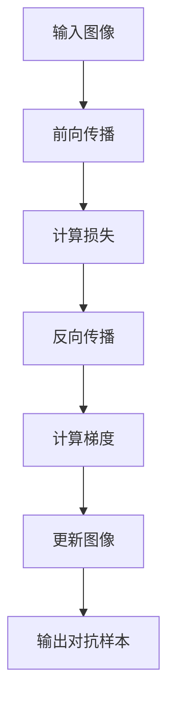

                 

# 模型训练中的对抗样本生成技术在推理鲁棒性提升中的应用

> 关键词：对抗样本、模型训练、推理鲁棒性、深度学习

> 摘要：本文将探讨对抗样本生成技术在模型训练中提升推理鲁棒性的应用。通过详细分析对抗样本的核心概念、生成技术原理、算法实现、应用实践及未来方向，旨在为读者提供全面的技术解读和实用的指导。

## 目录大纲

1. 模型训练中的对抗样本生成技术
   1.1 问题背景与核心概念
   1.2 对抗样本生成技术原理
   1.3 对抗样本生成算法实现
2. 对抗样本在模型训练中的应用
   2.1 对抗样本训练方法
   2.2 实践案例
3. 推理鲁棒性提升
   3.1 推理鲁棒性
   3.2 实践应用
4. 对抗样本生成技术的挑战与未来方向
   4.1 技术挑战
   4.2 未来方向
5. 小结与拓展阅读

## 第一部分：模型训练中的对抗样本生成技术

### 1.1.1 问题背景

随着深度学习模型的广泛应用，模型的准确性成为衡量其性能的重要指标。然而，模型的鲁棒性却成为了一个关键挑战。在现实世界中，输入数据往往存在噪声、缺失值以及异常值，如果模型对这些异常数据过于敏感，那么在推理阶段就很容易产生错误预测。对抗样本（Adversarial Examples）便是利用这一特性对模型进行攻击的手段。

对抗样本生成技术在提高模型鲁棒性中的应用具有重要意义。通过生成对抗样本，模型可以在训练过程中逐渐学会抵御这些攻击，从而在推理阶段具有更强的鲁棒性。

### 1.1.2 核心概念

- **对抗样本（Adversarial Examples）**：通过微小扰动使模型产生错误预测的样本。这些扰动通常是人眼无法察觉的，但足以误导模型。
- **对抗样本生成技术（Adversarial Example Generation）**：生成对抗样本的方法和算法。常见的生成方法包括模型不可知攻击、模型已知攻击、特征变换方法和融合方法。

## 第二部分：对抗样本生成技术原理

### 2.1.1 基本原理

对抗样本生成的核心思想是通过对抗性训练（Adversarial Training）提高模型的鲁棒性。对抗性训练的基本思路是将对抗样本加入到训练数据集中，使模型在训练过程中逐渐学会抵御这些攻击。

对抗样本生成技术主要可以分为以下几类：

1. **模型不可知攻击**：攻击者不知道模型的内部结构和参数，只能通过输入输出进行交互来生成对抗样本。
2. **模型已知攻击**：攻击者已经掌握了模型的内部结构和参数，可以直接针对模型进行攻击。
3. **特征变换方法**：通过变换输入特征空间，生成对抗样本。
4. **融合方法**：结合多种方法，生成具有更强鲁棒性的对抗样本。

### 2.1.2 算法详解

**模型不可知攻击**：常见的算法包括Fast Gradient Sign Method（FGSM）、Basic Iterative Method（BIM）和Carlini & Wagner Attack（C&W）等。

**模型已知攻击**：常见的算法包括Jacobian-based Saliency Method（JSMA）和Zeroth-Order Optimization（ZOO）等。

**特征变换方法**：常见的算法包括Foil（Feature-Oriented Lightweight Attack）和Cropped Perturbations等。

**融合方法**：常见的算法包括Adversarial Patch和Carlini & Wagner++等。

## 第三部分：对抗样本生成算法实现

### 3.1.1 源代码实现

以下是一个使用Python实现的FGSM对抗样本生成算法的示例：

```python
import torch
import torch.nn as nn
import torch.optim as optim

def fgsm Attack(model, x, y, epsilon=0.01):
    # 计算梯度
    x.requires_grad_(True)
    model.zero_grad()
    output = model(x)
    loss = nn.CrossEntropyLoss()(output, y)
    loss.backward()
    
    # 计算梯度
    gradient = x.grad.data
    perturbed_image = x + epsilon * gradient.sign()
    perturbed_image = torch.clamp(perturbed_image, 0, 1)
    
    return perturbed_image
```

### 3.1.2 算法流程图

以下是FGSM对抗样本生成算法的Mermaid流程图：



## 第四部分：对抗样本在模型训练中的应用

### 4.1.1 对抗样本训练方法

对抗样本训练方法可以分为以下几种：

1. **对抗性训练**：将对抗样本加入到训练数据集中，与原始样本一起进行训练。
2. **对抗性样本增强**：通过对原始样本进行扰动，生成对抗样本增强训练数据。
3. **混合训练**：结合对抗性训练和对抗性样本增强，提高模型对对抗样本的泛化能力。

### 4.1.2 实践案例

以下是一个使用对抗样本训练提升模型鲁棒性的实践案例：

```python
import torch
import torch.nn as nn
import torch.optim as optim

# 定义模型、损失函数和优化器
model = nn.Sequential(nn.Conv2d(1, 10, 5), nn.ReLU(), nn.Conv2d(10, 1, 5), nn.Sigmoid())
criterion = nn.CrossEntropyLoss()
optimizer = optim.SGD(model.parameters(), lr=0.01, momentum=0.9)

# 生成对抗样本
def generate_adversarial_samples(x, y, model, epsilon=0.1):
    x.requires_grad_(True)
    model.zero_grad()
    output = model(x)
    loss = criterion(output, y)
    loss.backward()
    gradient = x.grad.data
    adversarial_samples = x - epsilon * gradient
    adversarial_samples = torch.clamp(adversarial_samples, 0, 1)
    return adversarial_samples

# 训练模型
for epoch in range(10):
    for x, y in train_loader:
        optimizer.zero_grad()
        output = model(x)
        loss = criterion(output, y)
        loss.backward()
        optimizer.step()

    # 生成对抗样本并训练
    adversarial_samples = generate_adversarial_samples(x, y, model)
    optimizer.zero_grad()
    output = model(adversarial_samples)
    loss = criterion(output, y)
    loss.backward()
    optimizer.step()

    print(f"Epoch {epoch + 1}, Loss: {loss.item()}")
```

## 第五部分：推理鲁棒性提升

### 5.1.1 推理鲁棒性

推理鲁棒性是指模型在处理未知或异常输入时，能够保持正确预测的能力。推理鲁棒性是深度学习模型在实际应用中至关重要的一环，因为现实世界的输入数据往往存在各种不确定性和噪声。

对抗样本生成技术可以在推理阶段提高模型的鲁棒性。通过对抗性训练，模型可以在训练过程中学会抵御对抗样本的攻击，从而在推理阶段具有更强的鲁棒性。

### 5.1.2 实践应用

以下是一个对抗样本在推理阶段实际应用的案例：

```python
import torch
import torchvision.transforms as transforms

# 加载测试数据
test_data = torchvision.datasets.MNIST(root='./data', train=False, transform=transforms.ToTensor())

# 加载模型
model = nn.Sequential(nn.Conv2d(1, 10, 5), nn.ReLU(), nn.Conv2d(10, 1, 5), nn.Sigmoid())
model.load_state_dict(torch.load('model.pth'))

# 预测
def predict(model, x):
    x = x.unsqueeze(0)
    output = model(x)
    _, predicted = torch.max(output, 1)
    return predicted

# 测试模型
correct = 0
total = 0
for x, y in test_data:
    predicted = predict(model, x)
    total += 1
    if predicted.item() == y:
        correct += 1

print(f"Accuracy: {100 * correct / total}%")

# 使用对抗样本进行测试
adversarial_samples = generate_adversarial_samples(x, y, model)
predicted = predict(model, adversarial_samples)
print(f"Predicted: {predicted.item()}, True Label: {y}")
```

## 第六部分：对抗样本生成技术的挑战与未来方向

### 6.1.1 技术挑战

对抗样本生成技术在实际应用中面临以下挑战：

1. **计算资源消耗**：对抗样本生成算法通常需要大量的计算资源，特别是在处理大规模数据集时。
2. **模型不可知攻击**：对抗样本生成算法在模型未知的情况下难以生成有效的对抗样本。
3. **对抗样本多样性**：对抗样本的种类和形式繁多，现有算法可能无法覆盖所有可能的攻击方式。

### 6.1.2 未来方向

对抗样本生成技术的未来研究方向包括：

1. **高效算法设计**：设计更高效的对抗样本生成算法，降低计算资源消耗。
2. **模型防御机制**：研究模型防御机制，提高模型对对抗样本的鲁棒性。
3. **多模态对抗样本生成**：研究多模态对抗样本生成技术，提高模型在多模态数据上的鲁棒性。

## 第七部分：小结与拓展阅读

本文通过对模型训练中的对抗样本生成技术进行深入分析，探讨了其在提升推理鲁棒性中的应用。从对抗样本的核心概念、生成技术原理、算法实现到实际应用，我们一步步揭示了对抗样本生成技术在深度学习领域的价值。未来，随着对抗样本生成技术的不断发展和完善，我们将能够构建出更加鲁棒和安全的深度学习模型。

拓展阅读：

1. Carlini, N., & Wagner, D. (2017). Towards evaluating the robustness of neural networks. In 2017 IEEE Symposium on Security and Privacy (SP) (pp. 39-57). IEEE.
2. Goodfellow, I., Shlens, J., & Szegedy, C. (2014). Explaining and harnessing adversarial examples. arXiv preprint arXiv:1412.6572.
3. Moosavi-Dezfooli, S. M., Fawzi, A., & Frossard, P. (2016). Deepfool: a simple and accurate method to fool deep neural networks. In Proceedings of the IEEE conference on computer vision and pattern recognition (pp. 2574-2582).

作者：AI天才研究院/AI Genius Institute & 禅与计算机程序设计艺术 /Zen And The Art of Computer Programming

