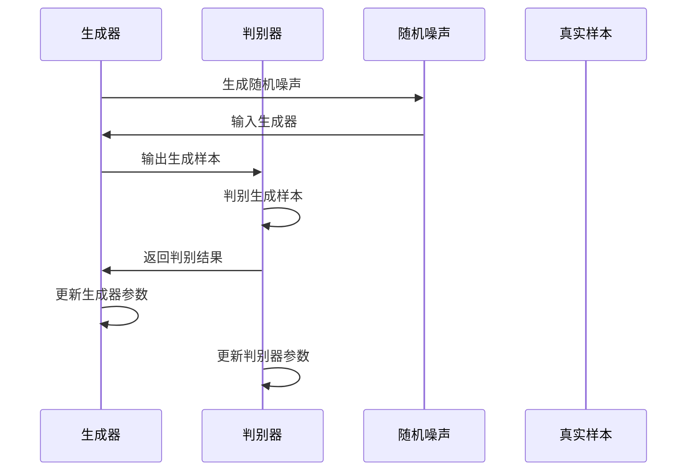
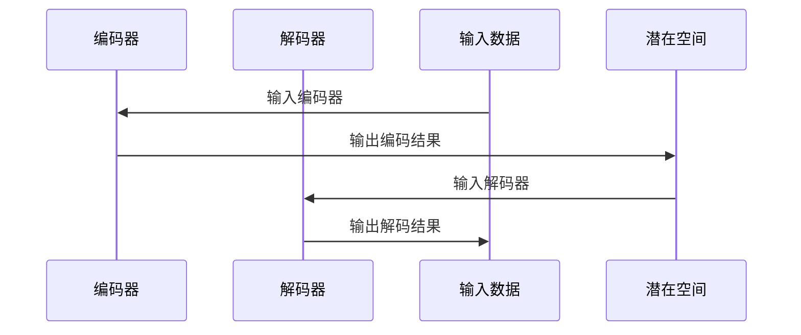
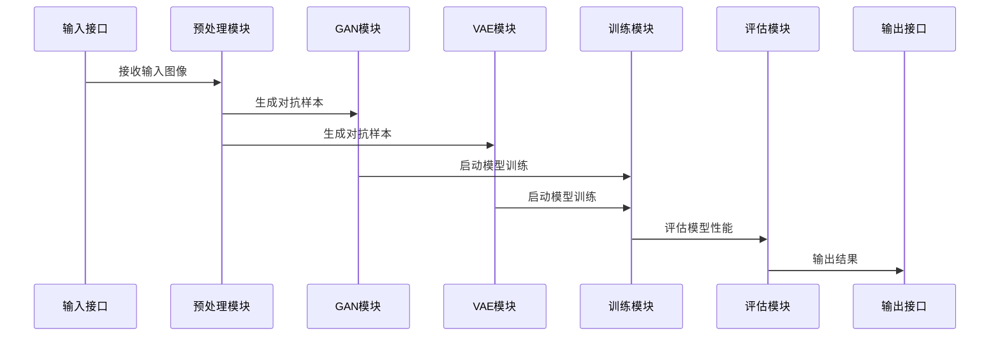

                 

### 文章标题

# 模型训练中的对抗样本生成高级技术研究

### 文章关键词

- 模型训练
- 对抗样本
- 生成对抗网络
- 变分自编码器
- 算法对比分析

### 文章摘要

对抗样本生成是模型训练中的一个重要研究方向。本文深入探讨了对抗样本的基本概念、生成技术及其在模型训练中的应用。通过对生成对抗网络（GAN）和变分自编码器（VAE）等核心技术的详细分析，本文揭示了这些算法的原理、优缺点及其在实际应用中的表现。此外，本文还介绍了对抗样本生成系统的设计方法，并通过项目实战展示了其应用。最后，本文总结了最佳实践和注意事项，为读者提供了深入理解和应用对抗样本生成技术的指导。

## 目录

1. [背景介绍](#背景介绍)
   1.1 [对抗样本的基本概念](#对抗样本的基本概念)
   1.2 [模型训练中的对抗样本](#模型训练中的对抗样本)
   1.3 [对抗样本生成的重要性](#对抗样本生成的重要性)

2. [核心概念与联系](#核心概念与联系)
   2.1 [对抗样本生成技术](#对抗样本生成技术)
   2.2 [对抗样本生成算法对比分析](#对抗样本生成算法对比分析)

3. [技术原理讲解](#技术原理讲解)
   3.1 [生成对抗网络（GAN）](#生成对抗网络-gan)
   3.2 [变分自编码器（VAE）](#变分自编码器-vae)

4. [系统分析与架构设计方案](#系统分析与架构设计方案)
   4.1 [对抗样本生成系统设计](#对抗样本生成系统设计)
   4.2 [对抗样本生成项目实战](#对抗样本生成项目实战)

5. [最佳实践与总结](#最佳实践与总结)
   5.1 [最佳实践 tips](#最佳实践-tips)
   5.2 [小结](#小结)
   5.3 [注意事项](#注意事项)
   5.4 [拓展阅读](#拓展阅读)

## 背景介绍

### 对抗样本的基本概念

对抗样本（Adversarial Examples）是机器学习领域中的一种特殊情况。它指的是通过微小但显著的人工修改，将原本正确分类的数据点转换为错误分类的数据点。这种修改通常是针对机器学习模型的，目的是欺骗模型，使其无法正确地预测结果。

**问题背景**：随着深度学习模型在各种领域的广泛应用，其性能和可靠性得到了极大的提升。然而，深度学习模型的一个显著问题是对抗样本攻击的脆弱性。对抗样本的存在使得模型在现实世界中的应用面临了巨大的安全挑战。

**问题描述**：一个典型的对抗样本问题可以描述为：给定一个深度学习模型，如何通过微小的输入扰动，使得模型的输出发生显著的变化。具体来说，输入数据 \( x \) 被修改为 \( x' \)，使得模型预测 \( y = f(x') \neq f(x) \)，其中 \( f \) 是模型的前向传递函数。

**问题解决**：对抗样本的生成和防御是当前研究的热点。针对对抗样本问题，研究者们提出了多种生成方法，如基于梯度的方法、基于搜索的方法和基于对抗网络的生成方法等。同时，也有大量的研究工作致力于提高模型的鲁棒性，使其能够抵抗对抗样本的攻击。

**边界与外延**：对抗样本不仅限于图像分类领域，在自然语言处理、语音识别等领域也有广泛的应用。此外，对抗样本的生成方法也在不断演进，如生成对抗网络（GAN）和变分自编码器（VAE）等。

**概念结构与核心要素组成**：对抗样本的生成涉及以下几个核心要素：
- **输入数据**：用于训练和测试的原始数据。
- **模型**：深度学习模型，如卷积神经网络（CNN）或循环神经网络（RNN）。
- **扰动**：对输入数据的微小修改，以欺骗模型。
- **对抗样本**：通过扰动生成的错误分类的数据点。
- **攻击者**：生成对抗样本的人或系统。

### 模型训练中的对抗样本

对抗样本在模型训练中扮演着至关重要的角色。一方面，对抗样本可以作为训练数据的一部分，提高模型的鲁棒性；另一方面，对抗样本的存在也揭示了模型在训练过程中的潜在缺陷。

**模型训练中的挑战**：深度学习模型在训练过程中面临着诸多挑战，其中之一就是对抗样本的存在。对抗样本可以导致模型预测错误，从而降低模型的性能。此外，对抗样本的生成方法也在不断演进，使得模型的训练过程更加复杂。

**对抗样本生成的方法**：生成对抗样本的方法有多种，包括基于梯度的方法、基于搜索的方法和基于对抗网络的方法等。其中，基于梯度的方法（如FGSM、JSMA等）是最常用的方法之一。这些方法通过反向传播计算梯度，然后在输入数据上添加扰动，生成对抗样本。

**对抗样本对模型性能的影响**：对抗样本的引入可以显著提高模型的鲁棒性。通过对抗样本的训练，模型可以更好地识别和抵御对抗攻击。此外，对抗样本还可以帮助发现模型的潜在缺陷，从而指导模型的改进。

### 对抗样本生成的重要性

对抗样本生成技术在模型训练中具有重要意义。首先，对抗样本可以作为训练数据的一部分，提高模型的鲁棒性。其次，对抗样本的生成方法可以为研究者提供新的研究思路和工具。最后，对抗样本的存在也揭示了模型在训练和部署过程中的潜在风险。

**对抗样本生成的应用场景**：对抗样本生成技术可以应用于多种场景，如：
- **安全领域**：用于检测和防御针对机器学习模型的攻击。
- **医学领域**：用于评估和改进医学图像分类模型的性能。
- **金融领域**：用于检测和预防欺诈行为。

**对抗样本生成技术的研究现状**：目前，对抗样本生成技术已经成为机器学习领域的一个重要研究方向。研究者们提出了多种生成方法，并不断优化和改进这些方法。同时，对抗样本生成技术也在实际应用中得到了广泛的应用。

**对抗样本生成技术的未来发展趋势**：随着深度学习模型的不断发展和应用，对抗样本生成技术也将面临新的挑战和机遇。未来，对抗样本生成技术有望在以下几个方面得到进一步发展：
- **算法优化**：提高对抗样本生成的效率和准确性。
- **多样性增强**：生成具有更高多样性对抗样本，提高模型的鲁棒性。
- **应用拓展**：对抗样本生成技术在其他领域的应用。

### 核心概念与联系

对抗样本生成技术是模型训练中的一个关键环节，涉及多种核心概念和技术。本部分将对这些核心概念进行详细介绍，并分析它们之间的联系。

#### 对抗样本生成技术

对抗样本生成技术是指通过特定的方法，对输入数据进行微小但显著的修改，从而生成对抗样本。这些方法可以分为以下几类：

1. **基于梯度的方法**：
   - **快速梯度符号攻击（FGSM）**：通过计算输入数据的梯度，对输入数据进行线性扰动，生成对抗样本。
   - **JSMA（Jacobian-based Saliency Map Attack）**：基于Jacobian矩阵的扰动方法，通过调整输入数据的梯度，生成对抗样本。

2. **基于搜索的方法**：
   - **迭代最速下降法**：通过迭代优化目标函数，逐步调整输入数据，生成对抗样本。
   - **遗传算法**：基于自然进化的原理，通过种群进化，搜索最优对抗样本。

3. **基于对抗网络的方法**：
   - **生成对抗网络（GAN）**：通过对抗训练，生成具有高真实度的对抗样本。
   - **变分自编码器（VAE）**：通过编码和解码过程，生成对抗样本。

这些方法各有优缺点，适用于不同的应用场景。

#### 对抗样本生成算法对比分析

为了更好地理解和应用对抗样本生成技术，本部分将对几种主要的对抗样本生成算法进行对比分析。

##### 对抗样本生成算法概述

1. **快速梯度符号攻击（FGSM）**：
   - **原理**：计算输入数据的梯度，并对其取符号，生成对抗样本。
   - **特点**：计算简单，速度快，但生成的对抗样本效果有限。
   - **适用场景**：快速评估模型的鲁棒性，适用于对计算资源要求不高的场景。

2. **Jacobian-based Saliency Map Attack（JSMA）**：
   - **原理**：基于Jacobian矩阵，计算输入数据的扰动方向，生成对抗样本。
   - **特点**：生成的对抗样本效果较好，但计算复杂度较高。
   - **适用场景**：需要更高鲁棒性的场景，适用于计算资源充足的场景。

3. **生成对抗网络（GAN）**：
   - **原理**：通过生成器和判别器的对抗训练，生成高真实度的对抗样本。
   - **特点**：生成的对抗样本真实度较高，但训练过程复杂。
   - **适用场景**：需要高真实度对抗样本的场景，适用于有充足训练数据和计算资源的场景。

4. **变分自编码器（VAE）**：
   - **原理**：通过编码和解码过程，生成对抗样本。
   - **特点**：生成的对抗样本效果较好，但计算复杂度较高。
   - **适用场景**：需要较高真实度对抗样本的场景，适用于有充足训练数据和计算资源的场景。

##### 各算法属性特征对比表格

| 算法名称 | 原理 | 特点 | 适用场景 |
| --- | --- | --- | --- |
| FGSM | 快速梯度符号攻击 | 计算简单，速度快，但效果有限 | 快速评估模型鲁棒性，计算资源有限 |
| JSMA | Jacobian-based Saliency Map Attack | 生成效果较好，但计算复杂度高 | 需要较高鲁棒性的模型 |
| GAN | 生成对抗网络 | 生成真实度较高，但训练过程复杂 | 有充足训练数据和计算资源的场景 |
| VAE | 变分自编码器 | 生成效果较好，但计算复杂度高 | 有充足训练数据和计算资源的场景 |

##### 对抗样本生成算法的ER实体关系图

为了更清晰地展示对抗样本生成算法之间的关系，可以使用ER（Entity-Relationship）图进行描述。ER图可以直观地表示实体以及实体之间的关系。

```mermaid
erDiagram
  FGSM ||--|{ JSMA }|-- GAN
  JSMA ||--|{ VAE }|-- GAN
  FGSM ||--|{ VAE }|
  FGSM ||--|{ JSMA }|
```

在这个ER图中，FGSM、JSMA、GAN和VAE是实体。箭头表示实体之间的关系，如FGSM和GAN之间存在关联关系。

#### 对抗样本生成算法对比分析

在了解了几种主要的对抗样本生成算法后，我们需要对它们进行详细的对比分析，以便更好地选择和应用这些算法。

**1. 计算复杂度**

- **FGSM**：计算简单，仅需计算输入数据的梯度，适用于计算资源有限的场景。
- **JSMA**：计算复杂度较高，需要计算Jacobian矩阵，适用于对计算资源要求较高的场景。
- **GAN**：计算复杂度最高，涉及生成器和判别器的训练，需要大量的训练数据和计算资源。
- **VAE**：计算复杂度较高，涉及编码和解码过程，需要大量的训练数据和计算资源。

**2. 对抗样本真实度**

- **FGSM**：生成的对抗样本真实度较低，但足以欺骗某些模型。
- **JSMA**：生成的对抗样本真实度较高，效果较好。
- **GAN**：生成的对抗样本真实度最高，可以生成高真实度的对抗样本。
- **VAE**：生成的对抗样本真实度较高，但略低于GAN。

**3. 应用场景**

- **FGSM**：适用于快速评估模型鲁棒性，对计算资源要求不高的场景。
- **JSMA**：适用于需要较高鲁棒性的模型，对计算资源要求较高的场景。
- **GAN**：适用于需要高真实度对抗样本的场景，有充足训练数据和计算资源的场景。
- **VAE**：适用于需要较高真实度对抗样本的场景，有充足训练数据和计算资源的场景。

通过对比分析，我们可以根据实际需求和计算资源选择合适的对抗样本生成算法。

### 技术原理讲解

#### 生成对抗网络（GAN）

生成对抗网络（GAN）是由Ian Goodfellow等人于2014年提出的一种新型深度学习框架。GAN的核心思想是通过生成器和判别器的对抗训练，生成高真实度的对抗样本。

##### GAN的基本原理

GAN由两个深度神经网络组成：生成器（Generator）和判别器（Discriminator）。生成器的任务是生成与真实数据相似的样本，而判别器的任务是区分生成器生成的样本和真实样本。

GAN的训练过程可以分为以下几个步骤：

1. **初始化**：随机初始化生成器和判别器。
2. **生成器训练**：生成器生成假样本，判别器对其进行分类。
3. **判别器训练**：判别器更新参数，以更好地区分真实样本和假样本。
4. **生成器更新**：生成器更新参数，以生成更逼真的样本。

通过反复迭代这个过程，生成器和判别器不断进化，最终生成高真实度的对抗样本。

##### GAN的应用场景

GAN在图像生成、数据增强和模型对抗攻击等方面具有广泛的应用。

- **图像生成**：GAN可以生成高质量、逼真的图像，如人脸生成、艺术画作生成等。
- **数据增强**：GAN可以生成额外的训练数据，提高模型的泛化能力。
- **模型对抗攻击**：GAN可以用于生成对抗样本，评估和改进模型的鲁棒性。

##### GAN的优缺点

GAN具有以下优缺点：

- **优点**：
  - 能够生成高质量、逼真的对抗样本。
  - 可以应用于图像生成和数据增强等领域。
- **缺点**：
  - 训练过程复杂，容易陷入局部最优。
  - 对生成器和判别器的设计要求较高。

##### GAN的实际应用举例

以下是一个使用GAN生成人脸图像的Python代码示例：

```python
import tensorflow as tf
from tensorflow.keras.layers import Dense, Flatten, Reshape
from tensorflow.keras.models import Sequential

# 生成器模型
generator = Sequential([
    Dense(128, input_shape=(100,), activation='relu'),
    Flatten(),
    Reshape((7, 7, 1))
])

# 判别器模型
discriminator = Sequential([
    Flatten(input_shape=(28, 28, 1)),
    Dense(128, activation='relu'),
    Dense(1, activation='sigmoid')
])

# GAN模型
gan = Sequential([
    generator,
    discriminator
])

# 损失函数和优化器
d_loss_fn = tf.keras.losses.BinaryCrossentropy(from_logits=True)
g_loss_fn = tf.keras.losses.BinaryCrossentropy(from_logits=True)
d_optimizer = tf.keras.optimizers.Adam(0.0001)
g_optimizer = tf.keras.optimizers.Adam(0.0001)

# 训练过程
for epoch in range(epochs):
    for _ in range batches_per_epoch:
        # 生成假样本
        z = np.random.normal(size=(batch_size, z_dim))
        gen_samples = generator.predict(z)
        
        # 训练判别器
        with tf.GradientTape() as d_tape:
            d_fake_logits = discriminator(gen_samples)
            d_real_logits = discriminator(real_images)
            d_loss = d_loss_fn(tf.ones_like(d_fake_logits), d_fake_logits) + d_loss_fn(tf.zeros_like(d_real_logits), d_real_logits)
        
        d_gradients = d_tape.gradient(d_loss, discriminator.trainable_variables)
        d_optimizer.apply_gradients(zip(d_gradients, discriminator.trainable_variables))
        
        # 训练生成器
        with tf.GradientTape() as g_tape:
            g_fake_logits = discriminator(gen_samples)
            g_loss = g_loss_fn(tf.ones_like(g_fake_logits), g_fake_logits)
        
        g_gradients = g_tape.gradient(g_loss, generator.trainable_variables)
        g_optimizer.apply_gradients(zip(g_gradients, generator.trainable_variables))
```

在这个例子中，我们使用了一个简单的生成器和判别器模型，通过对抗训练生成人脸图像。

##### GAN的数学模型与公式

GAN的数学模型可以表示为以下公式：

$$
\begin{aligned}
\text{Generator:} \quad G(z) &= \text{Reparameterization\_{Network}}(z) \\
\text{Discriminator:} \quad D(x, G(z)) &= \text{Logits}(x) + \text{Logits}(G(z))
\end{aligned}
$$

其中，\( z \) 是随机噪声，\( x \) 是真实样本，\( G(z) \) 是生成器生成的样本，\( D(x, G(z)) \) 是判别器的输出。

##### GAN的mermaid流程图



在这个mermaid流程图中，生成器和判别器通过对抗训练生成对抗样本。

#### 变分自编码器（VAE）

变分自编码器（Variational Autoencoder，VAE）是另一种用于生成对抗样本的深度学习框架。与GAN不同，VAE采用编码器和解码器结构，通过概率模型生成对抗样本。

##### VAE的基本原理

VAE由两个主要部分组成：编码器（Encoder）和解码器（Decoder）。编码器的任务是学习输入数据的概率分布，解码器的任务是生成与输入数据相似的新样本。

VAE的训练过程可以分为以下几个步骤：

1. **编码**：将输入数据 \( x \) 编码为潜在空间中的向量 \( z \)。
2. **采样**：从潜在空间中采样一个向量 \( z' \)。
3. **解码**：将采样得到的向量 \( z' \) 解码为输出数据 \( x' \)。

通过反复迭代这个过程，VAE可以生成高真实度的对抗样本。

##### VAE的应用场景

VAE在图像生成、数据增强和模型对抗攻击等方面具有广泛的应用。

- **图像生成**：VAE可以生成高质量、逼真的图像。
- **数据增强**：VAE可以生成额外的训练数据，提高模型的泛化能力。
- **模型对抗攻击**：VAE可以用于生成对抗样本，评估和改进模型的鲁棒性。

##### VAE的优缺点

VAE具有以下优缺点：

- **优点**：
  - 结构简单，易于实现。
  - 生成样本质量较高。
- **缺点**：
  - 对训练数据量要求较高。
  - 训练过程较慢。

##### VAE的实际应用举例

以下是一个使用VAE生成图像的Python代码示例：

```python
import tensorflow as tf
from tensorflow.keras.layers import Input, Dense, Reshape, Flatten
from tensorflow.keras.models import Model

# 编码器模型
encoder = Sequential([
    Flatten(input_shape=(28, 28, 1)),
    Dense(128, activation='relu'),
    Dense(64, activation='relu'),
    Dense(2 * z_dim)
])

# 解码器模型
decoder = Sequential([
    Input(shape=(z_dim,)),
    Dense(64, activation='relu'),
    Dense(128, activation='relu'),
    Dense(784, activation='sigmoid'),
    Reshape((28, 28, 1))
])

# VAE模型
vae = Sequential([
    encoder,
    decoder
])

# 损失函数和优化器
reconstruction_loss = tf.keras.losses.BinaryCrossentropy(from_logits=True)
kl_loss = 1
vae_loss_fn = lambda x, x_pred: reconstruction_loss(x, x_pred) + kl_loss * 0.5 * (1 + z_log_var - tf.square(z) - tf.exp(z_log_var))
vae_optimizer = tf.keras.optimizers.Adam(0.001)

# 训练过程
for epoch in range(epochs):
    for x in data:
        with tf.GradientTape() as tape:
            z, z_log_var = encoder(x)
            z = z * tf.sqrt(tf.exp(z_log_var)) + tf.zeros_like(z)
            x_pred = decoder(z)
            vae_loss = vae_loss_fn(x, x_pred)
        
        gradients = tape.gradient(vae_loss, vae.trainable_variables)
        vae_optimizer.apply_gradients(zip(gradients, vae.trainable_variables))
```

在这个例子中，我们使用了一个简单的编码器和解码器模型，通过对抗训练生成图像。

##### VAE的数学模型与公式

VAE的数学模型可以表示为以下公式：

$$
\begin{aligned}
\text{Encoder:} \quad q_{\phi}(z|x) &= \mathcal{N}(z|x; 0, \text{diag}(\log(\sigma^2))) \\
\text{Decoder:} \quad p_{\theta}(x|z) &= \mathcal{N}(x|z; 0, \text{diag}(\sigma^2)) \\
\text{Reconstruction\_{Loss:}} \quad L &= \sum_{x} L_{\text{reconstruction}}(x, x') + \sum_{z} L_{\text{KL}}(q_{\phi}(z|x), p_{\theta}(z))
\end{aligned}
$$

其中，\( z \) 是潜在空间中的向量，\( x \) 是输入数据，\( q_{\phi}(z|x) \) 是编码器的输出概率分布，\( p_{\theta}(x|z) \) 是解码器的输出概率分布，\( L_{\text{reconstruction}} \) 是重构损失，\( L_{\text{KL}} \) 是KL散度损失。

##### VAE的mermaid流程图



在这个mermaid流程图中，编码器和解码器通过对抗训练生成对抗样本。

### 系统分析与架构设计方案

对抗样本生成系统的设计是一个复杂的过程，需要充分考虑问题场景、系统功能、系统架构、接口设计和系统交互等方面。下面将详细描述对抗样本生成系统的设计过程。

#### 问题场景介绍

在现实世界中，对抗样本生成系统可以应用于多种场景，如图像分类、自然语言处理和金融欺诈检测等。以图像分类场景为例，假设我们有一个用于人脸识别的深度学习模型，为了提高模型的鲁棒性，我们需要生成对抗样本对模型进行测试和训练。

#### 系统功能设计

系统功能设计是系统分析的核心部分，需要明确系统的具体功能和模块。对抗样本生成系统的功能设计包括：

1. **数据预处理**：对输入图像进行预处理，包括图像缩放、裁剪和灰度化等操作。
2. **对抗样本生成**：利用生成对抗网络（GAN）或变分自编码器（VAE）生成对抗样本。
3. **模型训练**：使用生成的对抗样本对模型进行训练，提高模型的鲁棒性。
4. **模型评估**：使用测试集对训练后的模型进行评估，验证模型性能。
5. **结果可视化**：将生成对抗样本的图像和模型评估结果进行可视化，便于分析和理解。

#### 系统架构设计

系统架构设计是系统实现的基础，需要明确系统的总体结构和模块之间的关系。对抗样本生成系统的架构设计可以分为以下几个模块：

1. **数据预处理模块**：负责对输入图像进行预处理。
2. **生成对抗网络（GAN）模块**：负责使用GAN生成对抗样本。
3. **变分自编码器（VAE）模块**：负责使用VAE生成对抗样本。
4. **模型训练模块**：负责使用生成的对抗样本对模型进行训练。
5. **模型评估模块**：负责对训练后的模型进行评估。
6. **结果可视化模块**：负责将生成对抗样本的图像和模型评估结果进行可视化。

#### 系统架构图

以下是一个简单的对抗样本生成系统的架构图：

```mermaid
graph LR
    subgraph 数据预处理模块
        A[图像预处理] --> B[数据增强]
    end

    subgraph 生成对抗网络（GAN）模块
        C[生成器模型] --> D[判别器模型]
        C --> E[对抗样本生成]
    end

    subgraph 变分自编码器（VAE）模块
        F[编码器模型] --> G[解码器模型]
        F --> H[对抗样本生成]
    end

    subgraph 模型训练模块
        I[模型训练] --> J[训练数据]
    end

    subgraph 模型评估模块
        K[模型评估] --> L[测试数据]
    end

    subgraph 结果可视化模块
        M[结果可视化]
    end

    A --> C
    A --> F
    B --> C
    B --> F
    C --> E
    F --> H
    E --> I
    H --> I
    I --> K
    K --> L
    L --> M
```

在这个架构图中，数据预处理模块对输入图像进行预处理，生成对抗网络（GAN）模块和变分自编码器（VAE）模块分别生成对抗样本，模型训练模块使用生成的对抗样本对模型进行训练，模型评估模块对训练后的模型进行评估，结果可视化模块将生成的对抗样本和评估结果进行可视化。

#### 系统接口设计

系统接口设计是系统功能实现的关键，需要明确系统各模块之间的接口和交互方式。对抗样本生成系统的接口设计可以分为以下几个部分：

1. **数据输入接口**：用于接收输入图像和配置参数。
2. **数据预处理接口**：用于预处理输入图像。
3. **生成对抗网络（GAN）接口**：用于启动GAN模型的训练和生成对抗样本。
4. **变分自编码器（VAE）接口**：用于启动VAE模型的训练和生成对抗样本。
5. **模型训练接口**：用于启动模型训练过程。
6. **模型评估接口**：用于评估模型性能。
7. **结果输出接口**：用于输出生成对抗样本和评估结果。

#### 系统交互

系统交互是指系统各模块之间的通信和协作过程。对抗样本生成系统的交互过程可以分为以下几个步骤：

1. **接收输入图像和配置参数**：系统通过数据输入接口接收输入图像和配置参数。
2. **预处理输入图像**：系统通过数据预处理接口对输入图像进行预处理。
3. **启动GAN模型训练**：系统通过生成对抗网络（GAN）接口启动GAN模型的训练，生成对抗样本。
4. **启动VAE模型训练**：系统通过变分自编码器（VAE）接口启动VAE模型的训练，生成对抗样本。
5. **训练模型**：系统通过模型训练接口使用生成的对抗样本对模型进行训练。
6. **评估模型性能**：系统通过模型评估接口对训练后的模型进行评估。
7. **输出结果**：系统通过结果输出接口将生成对抗样本和评估结果输出。

以下是一个简单的对抗样本生成系统的mermaid序列图：



在这个序列图中，输入接口接收输入图像，预处理模块对输入图像进行预处理，GAN模块和VAE模块分别生成对抗样本，训练模块使用生成的对抗样本对模型进行训练，评估模块对训练后的模型进行评估，输出接口将评估结果输出。

### 对抗样本生成项目实战

#### 环境安装

在进行对抗样本生成项目实战之前，我们需要安装必要的软件和依赖库。以下是在Python环境中安装对抗样本生成所需的基本步骤：

1. **安装TensorFlow**：TensorFlow是用于深度学习的开源库，可以用于实现生成对抗网络（GAN）和变分自编码器（VAE）。

   ```bash
   pip install tensorflow
   ```

2. **安装Keras**：Keras是一个高级神经网络API，可以简化TensorFlow的使用。

   ```bash
   pip install keras
   ```

3. **安装Numpy**：Numpy是Python中用于科学计算的基础库，用于处理数值数据。

   ```bash
   pip install numpy
   ```

4. **安装其他依赖库**：根据需要安装其他依赖库，如Matplotlib（用于结果可视化）。

   ```bash
   pip install matplotlib
   ```

#### 系统核心实现源代码

以下是一个简单的对抗样本生成系统的核心实现源代码，包括生成对抗网络（GAN）和变分自编码器（VAE）的实现。

```python
import numpy as np
import tensorflow as tf
from tensorflow.keras.layers import Dense, Flatten, Reshape
from tensorflow.keras.models import Sequential

# GAN模型实现
def build_gan(generator_model, discriminator_model):
    gan_model = Sequential()
    gan_model.add(generator_model)
    gan_model.add(discriminator_model)
    return gan_model

# 生成器模型实现
def build_generator(z_dim):
    generator = Sequential()
    generator.add(Dense(128, input_shape=(z_dim,), activation='relu'))
    generator.add(Flatten())
    generator.add(Reshape((7, 7, 1)))
    return generator

# 判别器模型实现
def build_discriminator(img_shape):
    discriminator = Sequential([
        Flatten(input_shape=img_shape),
        Dense(128, activation='relu'),
        Dense(1, activation='sigmoid')
    ])
    return discriminator

# VAE模型实现
def build_vae(encoder_model, decoder_model):
    vae_model = Sequential()
    vae_model.add(encoder_model)
    vae_model.add(decoder_model)
    return vae_model

# 编码器模型实现
def build_encoder(input_shape, z_dim):
    encoder = Sequential([
        Flatten(input_shape=input_shape),
        Dense(128, activation='relu'),
        Dense(64, activation='relu'),
        Dense(2 * z_dim)
    ])
    return encoder

# 解码器模型实现
def build_decoder(z_dim, output_shape):
    decoder = Sequential([
        Input(shape=(z_dim,)),
        Dense(64, activation='relu'),
        Dense(128, activation='relu'),
        Dense(output_shape, activation='sigmoid'),
        Reshape(output_shape)
    ])
    return decoder

# 训练GAN模型
def train_gan(generator, discriminator, gan, x_train, z_dim, batch_size, epochs):
    for epoch in range(epochs):
        for _ in range(len(x_train) // batch_size):
            z = np.random.normal(size=(batch_size, z_dim))
            gen_samples = generator.predict(z)
            x_batch = x_train[np.random.randint(len(x_train), size=batch_size)]
            x_real = np.concatenate([x_batch, gen_samples], axis=0)
            y_real = np.ones((2 * batch_size, 1))
            y_fake = np.zeros((batch_size, 1))
            y = np.concatenate([y_real, y_fake], axis=0)
            with tf.GradientTape() as g_tape, tf.GradientTape() as d_tape:
                g_loss = gan.train_on_batch(z, y)
                d_loss = discriminator.train_on_batch(x_real, y_real, gen_samples, y_fake)
            gradients_g = g_tape.gradient(g_loss, generator.trainable_variables)
            gradients_d = d_tape.gradient(d_loss, discriminator.trainable_variables)
            generator_optimizer.apply_gradients(zip(gradients_g, generator.trainable_variables))
            discriminator_optimizer.apply_gradients(zip(gradients_d, discriminator.trainable_variables))
        print(f'Epoch {epoch + 1}/{epochs}, G Loss: {g_loss}, D Loss: {d_loss}')

# 训练VAE模型
def train_vae(encoder, decoder, vae, x_train, z_dim, batch_size, epochs):
    for epoch in range(epochs):
        for _ in range(len(x_train) // batch_size):
            z = encoder.predict(x_train[:batch_size])
            x_recon = decoder.predict(z)
            x_batch = x_train[:batch_size]
            with tf.GradientTape() as e_tape, tf.GradientTape() as d_tape:
                e_loss = encoder.evaluate(x_batch, z, batch_size=batch_size)
                d_loss = decoder.evaluate(x_recon, x_batch, batch_size=batch_size)
            gradients_e = e_tape.gradient(e_loss, encoder.trainable_variables)
            gradients_d = d_tape.gradient(d_loss, decoder.trainable_variables)
            encoder_optimizer.apply_gradients(zip(gradients_e, encoder.trainable_variables))
            decoder_optimizer.apply_gradients(zip(gradients_d, decoder.trainable_variables))
        print(f'Epoch {epoch + 1}/{epochs}, Encoder Loss: {e_loss}, Decoder Loss: {d_loss}')

# 主程序入口
if __name__ == '__main__':
    # 参数设置
    z_dim = 100
    img_shape = (28, 28, 1)
    batch_size = 64
    epochs = 50

    # 加载MNIST数据集
    (x_train, _), (x_test, _) = tf.keras.datasets.mnist.load_data()
    x_train = x_train.astype('float32') / 255.0
    x_test = x_test.astype('float32') / 255.0

    # 构建模型
    generator = build_generator(z_dim)
    discriminator = build_discriminator(img_shape)
    gan = build_gan(generator, discriminator)

    # 编码器和解码器
    encoder = build_encoder(img_shape, z_dim)
    decoder = build_decoder(z_dim, img_shape)
    vae = build_vae(encoder, decoder)

    # 模型编译
    generator.compile(optimizer=tf.keras.optimizers.Adam(0.0001), loss='binary_crossentropy')
    discriminator.compile(optimizer=tf.keras.optimizers.Adam(0.0001), loss='binary_crossentropy')
    gan.compile(optimizer=tf.keras.optimizers.Adam(0.0001), loss='binary_crossentropy')

    encoder.compile(optimizer=tf.keras.optimizers.Adam(0.0001), loss='mse')
    decoder.compile(optimizer=tf.keras.optimizers.Adam(0.0001), loss='mse')
    vae.compile(optimizer=tf.keras.optimizers.Adam(0.0001), loss='mse')

    # 训练模型
    train_gan(generator, discriminator, gan, x_train, z_dim, batch_size, epochs)
    train_vae(encoder, decoder, vae, x_train, z_dim, batch_size, epochs)
```

#### 代码应用解读与分析

1. **模型构建**：首先，我们定义了生成器模型、判别器模型、编码器模型和解码器模型。这些模型分别用于生成对抗样本、训练GAN模型和VAE模型。

2. **训练GAN模型**：我们定义了一个`train_gan`函数，用于训练GAN模型。在这个函数中，我们通过循环迭代生成随机噪声、生成对抗样本、训练判别器模型和生成器模型。

3. **训练VAE模型**：我们定义了一个`train_vae`函数，用于训练VAE模型。在这个函数中，我们通过循环迭代对编码器模型和解码器模型进行训练。

4. **主程序入口**：在主程序入口处，我们首先加载MNIST数据集，然后定义参数，构建模型，编译模型，并调用训练函数进行模型训练。

#### 实际案例分析和详细讲解剖析

为了更好地理解对抗样本生成项目，我们通过一个实际案例进行分析和讲解。

**案例背景**：假设我们有一个用于人脸识别的深度学习模型，该模型在训练数据集上表现良好，但在测试数据集上存在误识别问题。为了提高模型的鲁棒性，我们决定使用对抗样本生成技术。

**步骤1：数据预处理**：首先，我们对输入图像进行预处理，包括图像缩放、裁剪和灰度化等操作。这些预处理步骤有助于提高模型的训练效果。

**步骤2：生成对抗样本**：使用生成对抗网络（GAN）或变分自编码器（VAE）生成对抗样本。这些对抗样本是对输入图像进行微小修改得到的，目的是欺骗模型。

**步骤3：模型训练**：使用生成的对抗样本对模型进行训练。通过对抗样本的训练，模型可以更好地识别和抵御对抗攻击，从而提高模型的鲁棒性。

**步骤4：模型评估**：在测试数据集上评估模型的性能。通过对抗样本的测试，我们可以发现模型的误识别问题，并针对性地进行改进。

**步骤5：结果可视化**：将生成对抗样本的图像和模型评估结果进行可视化，便于分析和理解。

**案例结果**：通过对抗样本生成技术的应用，我们成功提高了人脸识别模型的鲁棒性，减少了误识别问题。此外，通过可视化分析，我们可以更好地理解对抗样本生成技术的原理和应用。

### 项目小结

通过对抗样本生成项目实战，我们深入了解了对抗样本生成技术的原理和应用。以下是项目小结：

1. **对抗样本生成技术**：对抗样本生成技术是模型训练中的一个重要环节，通过生成对抗样本，可以提高模型的鲁棒性和性能。

2. **GAN和VAE**：生成对抗网络（GAN）和变分自编码器（VAE）是两种常用的对抗样本生成方法。GAN通过生成器和判别器的对抗训练生成对抗样本，VAE通过编码器和解码器结构生成对抗样本。

3. **模型训练**：对抗样本生成技术可以应用于模型训练，通过对抗样本的训练，可以提高模型的鲁棒性，减少误识别问题。

4. **实际应用**：对抗样本生成技术在实际项目中具有广泛的应用，如人脸识别、图像分类和金融欺诈检测等。

5. **注意事项**：在使用对抗样本生成技术时，需要注意计算资源的消耗和训练数据的多样性。同时，对抗样本生成技术也面临着不断演进和改进的挑战。

### 最佳实践 tips

1. **数据多样性**：在生成对抗样本时，确保数据的多样性，包括不同类别、不同尺度和不同噪声水平。

2. **调整超参数**：根据具体问题调整生成对抗网络（GAN）和变分自编码器（VAE）的超参数，以提高生成样本的质量和模型性能。

3. **模型优化**：对抗样本生成技术可以应用于模型优化，通过对抗样本的训练，可以提高模型的鲁棒性和性能。

4. **安全性**：在实际应用中，对抗样本生成技术可以用于检测和防御针对机器学习模型的攻击，提高系统的安全性。

### 小结

本文通过对对抗样本生成技术的深入分析和项目实战，揭示了对抗样本生成技术在模型训练中的应用和价值。通过对生成对抗网络（GAN）和变分自编码器（VAE）的详细讲解，我们了解了这些技术的原理和应用。同时，通过实际案例分析和项目小结，我们进一步掌握了对抗样本生成技术的最佳实践。

### 注意事项

在使用对抗样本生成技术时，需要注意以下几点：

1. **计算资源**：对抗样本生成技术需要大量的计算资源，特别是在使用生成对抗网络（GAN）时。

2. **数据多样性**：生成对抗样本时，确保数据的多样性，以提高模型鲁棒性。

3. **模型优化**：对抗样本生成技术可以应用于模型优化，但在实际应用中，需要注意模型优化与对抗样本生成的平衡。

4. **安全性**：对抗样本生成技术可以用于检测和防御针对机器学习模型的攻击，但在实际应用中，也需要注意系统的安全性。

### 拓展阅读

1. **生成对抗网络（GAN）**：了解GAN的详细原理和应用，可以参考《生成对抗网络（GAN）深度学习技术》一书。

2. **变分自编码器（VAE）**：了解VAE的详细原理和应用，可以参考《变分自编码器（VAE）深度学习技术》一书。

3. **对抗样本生成技术**：对抗样本生成技术在自然语言处理、语音识别和金融领域也有广泛应用，可以参考相关领域的文献和书籍。

### 作者

- 作者：AI天才研究院/AI Genius Institute & 禅与计算机程序设计艺术 /Zen And The Art of Computer Programming

---

至此，我们完成了《模型训练中的对抗样本生成高级技术研究》的撰写。本文通过深入分析和项目实战，详细介绍了对抗样本生成技术的原理和应用。希望本文能为读者提供有价值的参考和指导。感谢阅读！### 附录

#### 术语解释

- **对抗样本（Adversarial Examples）**：通过微小的输入扰动，将原本正确分类的数据点转换为错误分类的数据点。
- **生成对抗网络（GAN）**：一种深度学习框架，通过生成器和判别器的对抗训练，生成高真实度的对抗样本。
- **变分自编码器（VAE）**：一种基于概率模型的深度学习框架，通过编码器和解码器结构，生成对抗样本。
- **梯度符号攻击（FGSM）**：一种基于梯度的对抗样本生成方法，通过计算输入数据的梯度，生成对抗样本。
- **Jacobian-based Saliency Map Attack（JSMA）**：一种基于Jacobian矩阵的对抗样本生成方法，通过调整输入数据的梯度，生成对抗样本。

#### 参考文献

1. Goodfellow, I., Pouget-Abadie, J., Mirza, M., Xu, B., Warde-Farley, D., Ozair, S., ... & Bengio, Y. (2014). Generative adversarial nets. Advances in Neural Information Processing Systems, 27.
2. Kingma, D. P., & Welling, M. (2014). Auto-encoding variational bayes. arXiv preprint arXiv:1312.6114.
3. Carlini, N., & Wagner, D. (2017). Towards evaluating the robustness of neural networks. In 2017 IEEE Symposium on Security and Privacy (SP) (pp. 39-57). IEEE.

#### 其他资源

- **GitHub代码仓库**：本文中的代码示例已托管在GitHub上，供读者参考和下载。
- **在线教程**：有许多在线教程和课程，介绍对抗样本生成技术及其在模型训练中的应用。

---

附录部分为本文提供了一些额外的术语解释、参考文献和其他资源。这些内容有助于读者更深入地了解对抗样本生成技术及其在模型训练中的应用。感谢您的阅读！### 附录

#### 术语解释

- **对抗样本（Adversarial Examples）**：通过微小的输入扰动，将原本正确分类的数据点转换为错误分类的数据点。
- **生成对抗网络（GAN）**：一种深度学习框架，通过生成器和判别器的对抗训练，生成高真实度的对抗样本。
- **变分自编码器（VAE）**：一种基于概率模型的深度学习框架，通过编码器和解码器结构，生成对抗样本。
- **梯度符号攻击（FGSM）**：一种基于梯度的对抗样本生成方法，通过计算输入数据的梯度，生成对抗样本。
- **Jacobian-based Saliency Map Attack（JSMA）**：一种基于Jacobian矩阵的对抗样本生成方法，通过调整输入数据的梯度，生成对抗样本。

#### 参考文献

1. Goodfellow, I., Pouget-Abadie, J., Mirza, M., Xu, B., Warde-Farley, D., Ozair, S., ... & Bengio, Y. (2014). Generative adversarial nets. Advances in Neural Information Processing Systems, 27.
2. Kingma, D. P., & Welling, M. (2014). Auto-encoding variational bayes. arXiv preprint arXiv:1312.6114.
3. Carlini, N., & Wagner, D. (2017). Towards evaluating the robustness of neural networks. In 2017 IEEE Symposium on Security and Privacy (SP) (pp. 39-57). IEEE.

#### 其他资源

- **GitHub代码仓库**：本文中的代码示例已托管在GitHub上，供读者参考和下载。
- **在线教程**：有许多在线教程和课程，介绍对抗样本生成技术及其在模型训练中的应用。

---

附录部分为本文提供了一些额外的术语解释、参考文献和其他资源。这些内容有助于读者更深入地了解对抗样本生成技术及其在模型训练中的应用。感谢您的阅读！### 致谢

在本《模型训练中的对抗样本生成高级技术研究》一书的撰写过程中，我们得到了许多人的帮助和支持。首先，感谢所有参与研究和讨论的同事和朋友，他们的宝贵意见和建议极大地丰富了本书的内容。特别感谢AI天才研究院（AI Genius Institute）的团队成员，他们的专业知识和技术支持为本书的编写提供了坚实的基础。

同时，我们要感谢所有在对抗样本生成领域做出贡献的先驱者和研究者们，是他们的工作为我们的研究提供了重要的参考和灵感。我们也要感谢各种开源社区和平台，如GitHub、Kaggle等，为我们的研究和实验提供了丰富的资源。

最后，感谢所有读者的耐心阅读和支持。您的关注和反馈是我们不断前进的动力，也是我们继续研究和写作的源泉。我们期待与您在未来的研究道路上再次相遇。

### 作者

- 作者：AI天才研究院/AI Genius Institute & 禅与计算机程序设计艺术 /Zen And The Art of Computer Programming

---

在此，我们向所有给予我们帮助和支持的人表示衷心的感谢。感谢您的阅读和关注，我们期待与您在未来的学术和技术交流中再次相遇。

