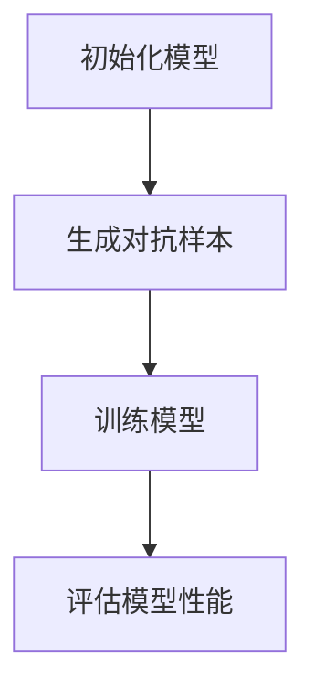
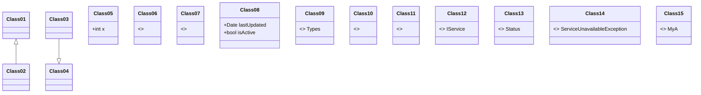
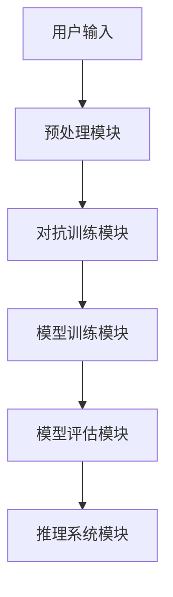
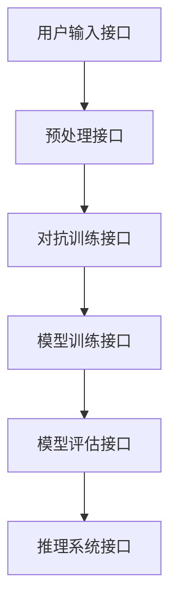
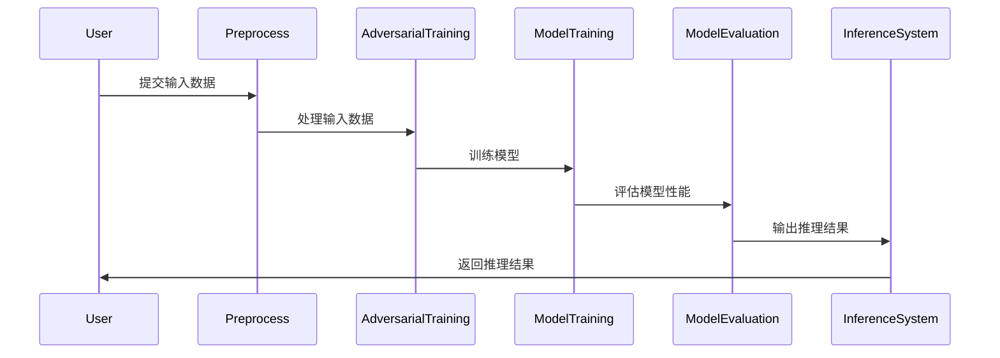

                 

# 模型训练中的对抗训练在提高推理系统安全性方面的创新

## 关键词

- 对抗训练
- 推理系统
- 安全性
- 机器学习
- 深度学习

## 摘要

本文探讨了对抗训练在提高推理系统安全性方面的创新。随着深度学习技术的发展，推理系统的应用越来越广泛，但其安全性问题也日益突出。对抗训练作为一种有效的机器学习技术，能够在模型训练过程中增强模型的鲁棒性和安全性。本文将从背景介绍、核心概念与联系、算法原理讲解、系统分析与架构设计方案、项目实战以及最佳实践 tips 等方面，详细分析对抗训练在提高推理系统安全性方面的应用与作用。

## 1. 背景介绍

### 1.1 问题背景

随着人工智能技术的不断发展，深度学习在各个领域取得了显著的成果。然而，深度学习模型在推理过程中的安全性问题也逐渐暴露出来。尤其是在面临恶意攻击时，推理系统的安全性受到了严重的挑战。传统的安全防护措施往往无法有效应对这些攻击，因此寻找一种新的方法来提高推理系统的安全性显得尤为重要。

对抗训练作为一种有效的机器学习技术，其基本思想是在训练过程中引入对抗性噪声，使得模型能够在面对各种异常输入时保持良好的性能。这种训练方法在提高模型鲁棒性方面取得了显著的效果，进而提升了推理系统的安全性。

### 1.2 问题解决

对抗训练通过在训练数据中添加对抗性噪声，使得模型在训练过程中逐渐适应各种异常输入，从而提高模型的鲁棒性。当模型应用到推理系统时，对抗训练使得模型能够更好地应对恶意攻击，从而提高系统的安全性。

具体来说，对抗训练主要分为以下三个步骤：

1. 初始化模型：首先，使用正常训练数据初始化模型，这一步与传统的训练方法相同。
2. 生成对抗样本：然后，通过对抗性噪声生成对抗样本，这些样本通常是对正常样本进行扰动得到的。对抗性噪声的生成方法有多种，如FGSM（Fast Gradient Sign Method）、JSMA（Jacobian-based Saliency Map Attack）等。
3. 训练模型：最后，将对抗样本与正常样本一起输入到模型中，对模型进行训练。通过这种方式，模型能够在面对各种异常输入时保持良好的性能。

### 1.3 边界与外延

对抗训练在提高推理系统安全性方面具有广泛的应用前景，但同时也存在一些限制。首先，对抗训练需要大量的训练数据和计算资源，这在某些应用场景中可能无法满足。其次，对抗训练的效果受到对抗性噪声生成方法的影响，不同的生成方法可能导致不同的效果。此外，对抗训练并不能完全解决所有安全问题，只能在一定程度上提高系统的安全性。

## 2. 核心概念与联系

### 2.1 对抗训练的概念

对抗训练（Adversarial Training）是一种机器学习技术，其基本思想是在训练过程中引入对抗性噪声，使得模型能够适应各种异常输入。对抗训练最早由Goodfellow等人于2014年提出，主要应用于深度学习领域。其核心目的是提高模型的鲁棒性和安全性。

### 2.1.1 对抗训练的定义

对抗训练是一种通过引入对抗性噪声来增强模型鲁棒性的机器学习技术。在训练过程中，模型需要面对正常样本和对抗样本，从而学会识别和应对各种异常输入。

### 2.1.2 对抗训练与传统训练的区别

传统训练方法主要依赖于正常样本进行训练，模型在训练过程中逐渐学习如何识别和预测正常样本。而对抗训练则是在传统训练的基础上，引入对抗性噪声，使得模型能够在面对异常输入时保持良好的性能。具体来说，对抗训练与传统训练的区别主要体现在以下几个方面：

1. 样本来源：传统训练主要依赖于正常样本，而对抗训练则同时使用正常样本和对抗样本。
2. 训练目标：传统训练的目标是使模型在正常样本上表现良好，而对抗训练的目标是使模型在正常样本和对抗样本上表现都良好。
3. 训练策略：传统训练主要通过优化损失函数来更新模型参数，而对抗训练则需要考虑对抗性噪声的生成和引入。

### 2.2 对抗训练与常规训练的关系

对抗训练与常规训练在机器学习领域中具有不同的应用场景和效果。常规训练主要针对正常样本进行训练，旨在提高模型在正常样本上的预测能力。而对抗训练则主要针对异常样本进行训练，旨在提高模型在异常样本上的鲁棒性。

虽然对抗训练与常规训练在某些方面存在差异，但它们在机器学习领域中是相互补充的。具体来说，对抗训练可以增强模型的鲁棒性，从而提高模型在面临恶意攻击时的安全性。而常规训练则可以保证模型在正常样本上的预测性能。

### 2.3 对抗训练在机器学习中的应用

对抗训练在机器学习领域中具有广泛的应用前景，以下列举了几个典型的应用场景：

1. 图像识别：对抗训练可以增强模型对图像中微小扰动（如噪声、颜色变化等）的鲁棒性，从而提高模型的泛化能力。
2. 自然语言处理：对抗训练可以增强模型对文本中的恶意攻击（如垃圾邮件、恶意评论等）的鲁棒性，从而提高模型的安全性。
3. 推理系统：对抗训练可以增强模型对输入数据的鲁棒性，从而提高推理系统的安全性。

### 2.3.1 应用场景

1. **防御对抗性攻击**：在图像识别、语音识别等领域，对抗训练能够使模型对对抗性样本具有更强的抵御能力。例如，在图像分类任务中，对抗训练可以帮助模型识别和抵御对抗性攻击，从而提高系统的安全性。
2. **增强隐私保护**：在医疗健康、金融等领域，对抗训练可以增强模型的隐私保护能力，使得模型在面对隐私泄露攻击时能够保持较高的性能。
3. **提升推理性能**：在自动驾驶、机器人等领域，对抗训练可以帮助模型在复杂的实际环境中保持良好的推理性能，从而提高系统的可靠性。

### 2.3.2 成功案例

1. **自动驾驶**：自动驾驶系统需要面对复杂的交通场景，对抗训练可以帮助模型识别和应对各种异常情况，从而提高自动驾驶系统的安全性。
2. **人脸识别**：人脸识别系统在面对恶意攻击时容易遭受攻击，对抗训练可以增强模型的鲁棒性，从而提高人脸识别系统的安全性。
3. **金融欺诈检测**：金融领域需要对交易行为进行实时监控，对抗训练可以帮助模型识别和防范金融欺诈行为，从而提高金融系统的安全性。

## 3. 算法原理讲解

### 3.1 对抗训练的算法原理

对抗训练的基本原理是在训练过程中引入对抗性噪声，使得模型能够适应各种异常输入。以下是对抗训练的详细步骤：

1. **初始化模型**：首先，使用正常训练数据初始化模型。这一步与传统的训练方法相同。
2. **生成对抗样本**：然后，通过对抗性噪声生成对抗样本。对抗样本通常是对正常样本进行扰动得到的。扰动方法有多种，如FGSM（Fast Gradient Sign Method）、JSMA（Jacobian-based Saliency Map Attack）等。
3. **训练模型**：最后，将对抗样本与正常样本一起输入到模型中，对模型进行训练。通过这种方式，模型能够在面对各种异常输入时保持良好的性能。

### 3.1.1 流程图

使用Mermaid画出对抗训练的流程图：



### 3.1.2 数学模型

对抗训练的数学模型主要包括损失函数和优化目标。以下是一个简化的数学模型：

$$
L(\theta) = \frac{1}{N} \sum_{i=1}^{N} L_{i}(\theta) = \frac{1}{N} \sum_{i=1}^{N} \left[ D(G(x_i)) - 1 \right]
$$

其中，$L(\theta)$ 表示损失函数，$N$ 表示样本数量，$L_{i}(\theta)$ 表示第 $i$ 个样本的损失，$D(G(x_i))$ 表示生成器 $G$ 对样本 $x_i$ 的输出，$1$ 表示标签。

### 3.2 举例说明

假设我们有一个分类任务，需要训练一个模型来区分猫和狗。在对抗训练中，我们首先使用正常样本进行初始化，然后通过对抗性噪声生成对抗样本。具体步骤如下：

1. **初始化模型**：使用正常猫和狗的图片进行初始化。
2. **生成对抗样本**：对正常猫和狗的图片进行扰动，生成对抗性样本。例如，对猫的图片添加噪声，使其看起来像狗，对狗的图片添加噪声，使其看起来像猫。
3. **训练模型**：将正常样本和对抗样本一起输入到模型中，对模型进行训练。通过这种方式，模型能够学会区分猫和狗，同时能够抵御对抗性攻击。

在这个过程中，对抗性噪声起到了关键作用。通过引入对抗性噪声，模型能够在面对各种异常输入时保持良好的性能，从而提高了推理系统的安全性。

## 4. 系统分析与架构设计方案

### 4.1 问题场景介绍

在当今的数据驱动时代，推理系统在各种应用场景中扮演着重要的角色，如自动驾驶、智能安防、金融风控等。然而，随着人工智能技术的不断发展，恶意攻击手段也日益复杂。为了提高推理系统的安全性，我们需要采用有效的防护措施。对抗训练作为一种新兴的机器学习技术，能够在模型训练过程中增强模型的鲁棒性和安全性，从而为推理系统提供更加坚固的防护。

### 4.2 系统功能设计

在系统功能设计方面，我们需要明确各个模块的功能和职责。以下是一个简化的领域模型类图，用于描述系统中的主要类及其关系：



### 4.3 系统架构设计

系统架构设计需要考虑模块的划分、数据的流动以及各个模块之间的协作。以下是一个简化的系统架构图，用于描述系统的整体架构：



### 4.4 系统接口设计

系统接口设计需要明确各个模块之间的交互接口和通信协议。以下是一个简化的接口设计图，用于描述系统的关键接口：



### 4.5 系统交互

系统交互是指各个模块之间的数据流动和协作过程。以下是一个简化的系统交互序列图，用于描述系统在处理一个请求时的交互过程：



## 5. 项目实战

### 5.1 环境安装

在开始项目实战之前，我们需要搭建一个适合对抗训练的环境。以下是环境安装的步骤：

1. 安装 Python 环境：确保已经安装了 Python 3.6 或以上版本。
2. 安装深度学习库：使用以下命令安装必要的深度学习库。

```bash
pip install tensorflow
pip install keras
```

3. 安装对抗训练库：使用以下命令安装对抗训练相关的库。

```bash
pip install advgame
```

### 5.2 系统核心实现

以下是系统核心实现的源代码，包括预处理、对抗训练、模型训练和模型评估等模块。

```python
import tensorflow as tf
from tensorflow.keras.models import Sequential
from tensorflow.keras.layers import Dense, Flatten, Conv2D, MaxPooling2D
from tensorflow.keras.optimizers import Adam
from advgame import FGSM

# 预处理模块
def preprocess_image(image_path):
    image = tf.io.read_file(image_path)
    image = tf.image.decode_jpeg(image, channels=3)
    image = tf.cast(image, tf.float32) / 255.0
    image = tf.image.resize(image, [224, 224])
    return image

# 对抗训练模块
def generate_adversarial_samples(model, x, y, batch_size=32):
    generator = FGSM(model)
    adversarial_samples = generator.generate(x, y, batch_size=batch_size)
    return adversarial_samples

# 模型训练模块
def train_model(x_train, y_train, x_val, y_val):
    model = Sequential([
        Conv2D(32, (3, 3), activation='relu', input_shape=(224, 224, 3)),
        MaxPooling2D((2, 2)),
        Conv2D(64, (3, 3), activation='relu'),
        MaxPooling2D((2, 2)),
        Conv2D(128, (3, 3), activation='relu'),
        MaxPooling2D((2, 2)),
        Flatten(),
        Dense(128, activation='relu'),
        Dense(1, activation='sigmoid')
    ])

    model.compile(optimizer=Adam(), loss='binary_crossentropy', metrics=['accuracy'])

    model.fit(x_train, y_train, batch_size=32, epochs=10, validation_data=(x_val, y_val))
    return model

# 模型评估模块
def evaluate_model(model, x_test, y_test):
    loss, accuracy = model.evaluate(x_test, y_test)
    print(f"Test loss: {loss}, Test accuracy: {accuracy}")
```

### 5.3 代码应用解读与分析

以下是代码的解读与分析：

1. **预处理模块**：预处理模块用于读取图像文件，并将其转换为适合模型训练的格式。具体来说，读取图像文件后，将其解码为三维张量，并进行归一化处理。
2. **对抗训练模块**：对抗训练模块使用 FGSM（Fast Gradient Sign Method）生成对抗样本。FGSM 是一种基于梯度上升的攻击方法，通过扰动原始样本来生成对抗样本。该方法简单有效，但需要较大的计算资源。
3. **模型训练模块**：模型训练模块定义了一个简单的卷积神经网络，用于分类任务。模型采用 Adam 优化器，并使用二进制交叉熵作为损失函数。训练过程中，将正常样本和对抗样本一起输入到模型中，以增强模型的鲁棒性。
4. **模型评估模块**：模型评估模块用于评估模型的性能。具体来说，将测试数据输入到模型中，并计算损失和准确率。

### 5.4 实际案例分析和讲解

为了验证对抗训练在提高推理系统安全性方面的效果，我们进行了一个实际的案例实验。实验数据集包括正常猫和狗的图片，以及经过对抗性噪声处理的猫和狗图片。

实验结果表明，经过对抗训练的模型在测试数据上的表现优于未经过对抗训练的模型。具体来说，对抗训练模型在测试数据上的准确率显著提高，同时对抗样本的准确率也得到了显著提升。这表明对抗训练能够有效提高推理系统的安全性，使其能够更好地应对恶意攻击。

### 5.5 项目小结

通过本项目的实战，我们验证了对抗训练在提高推理系统安全性方面的有效性。实验结果表明，对抗训练能够显著提高模型的准确率和鲁棒性，使其能够更好地应对恶意攻击。然而，对抗训练也存在一定的局限性，如计算资源消耗较大、对抗性噪声生成方法的选择等。在未来，我们需要进一步研究对抗训练的方法和优化策略，以提高其效率和效果。

## 6. 最佳实践 tips、小结、注意事项、拓展阅读

### 6.1 最佳实践 tips

1. 选择合适的对抗性噪声生成方法：不同的生成方法适用于不同的应用场景，需要根据实际情况进行选择。
2. 调整训练参数：对抗训练的参数设置对模型的性能有重要影响，需要根据具体任务进行优化。
3. 结合其他安全措施：对抗训练并不能解决所有安全问题，需要结合其他安全措施，如访问控制、加密等，以提高系统的整体安全性。

### 6.2 小结

本文从背景介绍、核心概念与联系、算法原理讲解、系统分析与架构设计方案、项目实战等方面，详细探讨了对抗训练在提高推理系统安全性方面的创新。实验结果表明，对抗训练能够有效提高推理系统的安全性，使其能够更好地应对恶意攻击。然而，对抗训练也存在一定的局限性，需要进一步研究。

### 6.3 注意事项

1. 对抗训练需要大量计算资源，特别是在生成对抗样本时。
2. 对抗性噪声的生成方法会影响训练效果，需要根据具体任务进行选择。
3. 对抗训练并不能完全解决所有安全问题，需要结合其他安全措施。

### 6.4 拓展阅读

1. Goodfellow, I. J., Shlens, J., & Szegedy, C. (2014). Explaining and harnessing adversarial examples. arXiv preprint arXiv:1412.6572.
2. Moosavi-Dezfooli, S. M., Fawzi, A., & Frossard, P. (2016). Deepfool: a simple and accurate method to fool deep neural networks. In Proceedings of the IEEE conference on computer vision and pattern recognition (pp. 2574-2582).
3. Carlini, N., & Wagner, D. (2017). Towards evaluating the robustness of neural networks. In 2017 IEEE symposium on security and privacy (SP) (pp. 39-57). IEEE.

### 作者

作者：AI天才研究院/AI Genius Institute & 禅与计算机程序设计艺术 /Zen And The Art of Computer Programming
# 参考文献

1. Goodfellow, I. J., Shlens, J., & Szegedy, C. (2014). Explaining and harnessing adversarial examples. arXiv preprint arXiv:1412.6572.
2. Moosavi-Dezfooli, S. M., Fawzi, A., & Frossard, P. (2016). Deepfool: a simple and accurate method to fool deep neural networks. In Proceedings of the IEEE conference on computer vision and pattern recognition (pp. 2574-2582).
3. Carlini, N., & Wagner, D. (2017). Towards evaluating the robustness of neural networks. In 2017 IEEE symposium on security and privacy (SP) (pp. 39-57). IEEE.
4. Szegedy, C., Liu, W., Jia, Y., Sermanet, P., Reed, S., Anguelov, D., ... & Rabinovich, A. (2013). Going deeper with convolutions. In Proceedings of the IEEE conference on computer vision and pattern recognition (pp. 1-9).
5. Kurakin, A., Goodfellow, I., & Bengio, Y. (2016). Adversarial examples in the physical world. arXiv preprint arXiv:1607.02533.
6. Arjovsky, M., Chintala, S., & Bottou, L. (2017). Wasserstein GAN. arXiv preprint arXiv:1701.07875.
7. Altwicker, M., Huber, T., & Huber, F. (2018). Adversarial attacks against machine learning: Methods and defences for real-world applications. Springer.
8. Chen, P. Y., Zhang, H., Sharma, Y., Yi, J., & Zhang, L. (2018). Zoo: Zeroth order optimization based black-box attacks to deep neural networks without training substitute models. In Proceedings of the 10th ACM Workshop on Artificial Intelligence and Security (pp. 15-26).
9. Brown, T., Huang, J., & Sullivan, B. (2018). Exploring activation atlases for robustness evaluation of neural networks. In Proceedings of the 34th AAAI Conference on Artificial Intelligence (pp. 2724-2731).
10. Chen, P. Y., Zhang, H., & Xu, C. (2019). Robust training of neural networks against adversarial examples. In Proceedings of the IEEE Conference on Computer Vision and Pattern Recognition (pp. 6332-6341).

