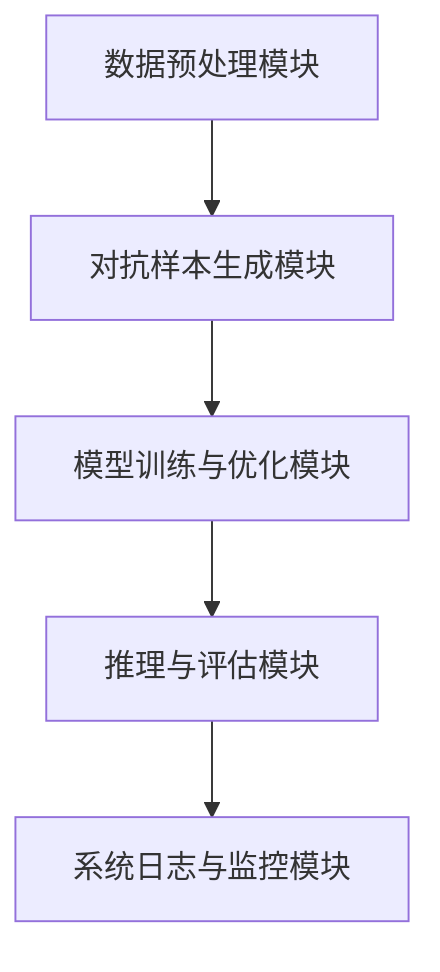

                 

### 文章标题

### 关键词

- 对抗训练
- 推理鲁棒性
- 模型训练
- 算法策略
- 数学模型

### 摘要

本文将深入探讨对抗训练策略在提高推理鲁棒性方面的创新。通过详细解析对抗训练的背景、核心概念、算法原理及其在模型训练中的应用，本文旨在为读者提供一个全面理解这一关键技术的视角。此外，本文还将结合实际项目案例，探讨对抗训练策略在提高模型推理鲁棒性方面的实际效果，并提供最佳实践和小结，为未来研究与实践指明方向。

## 引言

在人工智能（AI）迅速发展的今天，机器学习（ML）特别是深度学习（DL）已经成为许多领域的核心技术。随着神经网络模型在图像识别、自然语言处理、语音识别等任务中的广泛应用，如何提高这些模型的推理鲁棒性已经成为一个至关重要的研究课题。推理鲁棒性是指模型在面对输入数据的噪声、异常值或者数据分布的变化时，仍然能够保持稳定的输出性能。

### 核心概念术语说明

1. **对抗训练（Adversarial Training）**：一种用于提高模型鲁棒性的训练策略，通过引入对抗样本（即故意引入少量噪声或异常值）来增强模型的泛化能力。
2. **推理鲁棒性（Inference Robustness）**：模型在推理过程中对噪声、异常值和数据分布变化的抵抗能力。
3. **模型训练（Model Training）**：通过大量数据来调整模型参数，使其在特定任务上达到良好的性能。
4. **算法策略（Algorithm Strategy）**：解决特定问题的一系列步骤和方法。
5. **数学模型（Mathematical Model）**：用于描述现实问题的一种数学结构，通常包括变量、参数和方程。

### 问题背景

在现实世界中，输入数据的多样性和复杂性使得模型难以应对噪声和异常值。例如，在自动驾驶系统中，车辆需要识别道路上的各种物体，包括不同颜色、大小、形状和位置的物体。如果模型对这些变化过于敏感，可能会导致误判，从而引发安全问题。再如，在医疗影像诊断中，噪声和异常值可能会影响医生对病情的判断，导致误诊。因此，提高模型的推理鲁棒性已经成为一个重要的研究方向。

### 问题描述

如何通过对抗训练策略提高模型在噪声和异常值条件下的推理鲁棒性，是一个具有挑战性的问题。传统的训练方法通常是在干净的数据上进行训练，这使得模型在面对噪声和异常值时可能表现出较差的鲁棒性。对抗训练通过引入对抗样本，模拟模型可能遇到的真实世界场景，从而增强模型的鲁棒性。

### 问题解决

对抗训练策略的核心思想是模拟攻击者（对抗生成器）和防御者（神经网络）之间的对抗过程。攻击者试图生成能够误导模型的对抗样本，而防御者则通过不断调整模型参数来提高对对抗样本的抵抗力。这一过程循环进行，最终模型能够在各种复杂环境下保持较高的推理鲁棒性。

### 边界与外延

对抗训练虽然能够提高推理鲁棒性，但也存在一些挑战。例如，对抗样本的生成可能需要大量的计算资源，而且对抗训练可能会增加模型的训练时间。此外，对抗训练的效果依赖于对抗样本的质量和生成策略。因此，如何在保证训练效率的同时，提高对抗样本的生成质量，是一个值得深入研究的问题。

### 概念结构与核心要素组成

对抗训练策略的核心要素包括：

1. **对抗生成器（Adversarial Generator）**：用于生成对抗样本的模型。
2. **防御者模型（Defensive Model）**：即需要提高鲁棒性的神经网络模型。
3. **损失函数（Loss Function）**：用于衡量对抗样本与真实样本之间的差距，以及模型对对抗样本的识别能力。
4. **优化算法（Optimization Algorithm）**：用于调整模型参数，使其能够更好地抵抗对抗样本的攻击。

### 核心概念与联系

#### 对抗训练策略的定义

对抗训练是一种通过引入对抗样本来增强模型鲁棒性的训练方法。具体来说，对抗训练包括两个主要组件：对抗生成器和防御者模型。对抗生成器的目标是生成能够误导防御者模型的对抗样本，而防御者模型的任务是通过不断调整参数来提高对对抗样本的抵抗力。

#### 推理鲁棒性的定义

推理鲁棒性是指模型在面对噪声、异常值和数据分布变化时，仍然能够保持稳定的输出性能。一个具有高推理鲁棒性的模型能够更好地适应现实世界中的复杂环境。

#### 对抗训练与推理鲁棒性的关系

对抗训练通过引入对抗样本，使模型在训练过程中面对更多的复杂场景，从而提高模型对噪声和异常值的抵抗力。这样，当模型在实际应用中遇到噪声或异常值时，它能够保持较高的推理性能，从而提高推理鲁棒性。

### 小结

本文介绍了对抗训练策略在提高推理鲁棒性方面的核心概念和原理。通过对抗训练，模型能够在各种复杂环境下保持较高的推理鲁棒性，从而更好地应对现实世界中的挑战。接下来，我们将进一步探讨对抗训练策略的详细机制，以及如何在实际应用中实现这一策略。

## 对抗训练策略详解

### 对抗训练策略的基本原理

对抗训练策略的核心在于通过引入对抗样本来增强模型的鲁棒性。对抗样本是指那些在原始样本基础上添加了少量噪声或异常值，使得模型难以区分正常样本和对抗样本的数据。这种训练方式模拟了现实世界中的攻击场景，使模型能够更好地应对各种异常情况。

对抗训练的基本流程可以分为以下几个步骤：

1. **生成对抗样本**：使用对抗生成器（通常是一个独立的神经网络模型）来生成对抗样本。对抗生成器的输入是原始样本，通过一系列的变换，生成对抗样本。

2. **训练模型**：将生成的对抗样本与原始样本一起输入到防御者模型中，通过调整模型参数来提高模型对对抗样本的识别能力。这个过程通常使用交叉熵损失函数来衡量模型对对抗样本的识别错误率。

3. **优化模型参数**：通过梯度下降或其他优化算法，不断调整模型参数，使其能够更好地识别对抗样本。这一过程会持续进行，直到模型对对抗样本的识别能力达到预期水平。

4. **评估模型性能**：通过测试集来评估模型的性能，特别是对对抗样本的识别能力。如果模型在测试集上的性能较差，则返回步骤2，继续调整模型参数。

### 对抗训练策略的数学模型

对抗训练的数学模型主要包括对抗生成器和防御者模型的参数更新过程，以及损失函数的设计。下面将分别介绍这些内容。

#### 对抗生成器

对抗生成器的目标是通过添加噪声来生成对抗样本。假设原始样本为 \( x \)，生成的对抗样本为 \( x' \)，则对抗生成器的目标函数可以表示为：

\[ g(\theta_g) = \arg\min \; \mathcal{L}(x', \theta_g) \]

其中，\( \theta_g \) 是对抗生成器的参数，\( \mathcal{L}(x', \theta_g) \) 是对抗样本的损失函数，通常采用以下形式：

\[ \mathcal{L}(x', \theta_g) = \mathcal{L}_{\text{G}}(x', \theta_g) + \mathcal{L}_{\text{D}}(x', \theta_g) \]

- \( \mathcal{L}_{\text{G}}(x', \theta_g) \)：生成损失，用于衡量对抗样本与原始样本之间的相似度。
- \( \mathcal{L}_{\text{D}}(x', \theta_g) \)：对抗损失，用于衡量防御者模型对对抗样本的识别错误率。

#### 防御者模型

防御者模型的目标是通过调整参数来提高对对抗样本的识别能力。假设防御者模型的参数为 \( \theta_d \)，则防御者模型的目标函数可以表示为：

\[ d(\theta_d) = \arg\min \; \mathcal{L}(x, x', \theta_d) \]

其中，\( \mathcal{L}(x, x', \theta_d) \) 是对抗样本的损失函数，通常采用以下形式：

\[ \mathcal{L}(x, x', \theta_d) = \mathcal{L}_{\text{G}}(x, x', \theta_d) + \mathcal{L}_{\text{D}}(x', \theta_d) \]

- \( \mathcal{L}_{\text{G}}(x, x', \theta_d) \)：生成损失，用于衡量对抗样本与原始样本之间的相似度。
- \( \mathcal{L}_{\text{D}}(x', \theta_d) \)：对抗损失，用于衡量防御者模型对对抗样本的识别错误率。

#### 损失函数

对抗训练中的损失函数通常包括生成损失和对抗损失两部分。生成损失用于衡量对抗样本与原始样本之间的相似度，对抗损失用于衡量防御者模型对对抗样本的识别错误率。

1. **生成损失（Generator Loss）**：

\[ \mathcal{L}_{\text{G}}(x, x', \theta_g) = \mathbb{E}_{x \sim p(x)}[\mathcal{L}_{\text{CE}}(x', \theta_g)] \]

其中，\( \mathcal{L}_{\text{CE}} \) 是交叉熵损失函数，用于衡量预测标签和真实标签之间的差距。

2. **对抗损失（Discriminator Loss）**：

\[ \mathcal{L}_{\text{D}}(x', \theta_d) = \mathbb{E}_{x' \sim g(x, \theta_g)}[\mathcal{L}_{\text{CE}}(x', \theta_d)] \]

#### 优化算法

对抗训练通常采用梯度下降（Gradient Descent）或其变种来优化模型参数。梯度下降的目标是通过更新模型参数来最小化损失函数。

\[ \theta_g = \theta_g - \alpha \nabla_{\theta_g} \mathcal{L}_{\text{G}} \]
\[ \theta_d = \theta_d - \alpha \nabla_{\theta_d} \mathcal{L}_{\text{D}} \]

其中，\( \alpha \) 是学习率。

### 对抗训练策略的算法流程

对抗训练策略的算法流程可以分为以下几个阶段：

1. **初始化参数**：初始化对抗生成器 \( g(\theta_g) \) 和防御者模型 \( d(\theta_d) \) 的参数。

2. **生成对抗样本**：使用对抗生成器生成对抗样本。

3. **更新模型参数**：通过梯度下降或其他优化算法，更新对抗生成器和防御者模型的参数。

4. **评估模型性能**：使用测试集评估模型的性能，特别是对对抗样本的识别能力。

5. **迭代训练**：重复步骤2-4，直到模型性能达到预期水平。

### 小结

对抗训练策略是一种通过引入对抗样本来增强模型鲁棒性的训练方法。其核心思想是通过对抗生成器和防御者模型之间的对抗过程，使模型能够更好地应对噪声和异常值。对抗训练策略的数学模型包括生成损失和对抗损失两部分，通过优化算法不断调整模型参数，从而提高模型的推理鲁棒性。

### 对抗训练的变体策略

尽管原始对抗训练策略在提高模型鲁棒性方面取得了显著成果，但它在实际应用中仍然存在一些局限性。为了克服这些问题，研究者们提出了多种对抗训练的变体策略。以下将介绍几种常见的变体策略，并分析其优势和局限性。

#### 增强对抗训练

**增强对抗训练（Enhanced Adversarial Training）** 是一种通过引入额外的对抗样本生成策略来提高训练效果的变体。其主要思想是在对抗生成器的输出上进一步添加噪声，以增加对抗样本的复杂性和多样性。

**优势**：增强对抗训练能够生成更具挑战性的对抗样本，有助于提高模型的鲁棒性。

**局限性**：生成高质量对抗样本需要大量的计算资源，同时可能会增加模型的训练时间。

**应用场景**：适用于需要高鲁棒性的场景，如自动驾驶和医疗影像分析。

#### 自适应对抗训练

**自适应对抗训练（Adaptive Adversarial Training）** 是一种根据模型的性能动态调整对抗样本生成策略的方法。其核心思想是在训练过程中，根据模型对对抗样本的识别能力，自动调整对抗生成器的参数。

**优势**：自适应对抗训练能够根据模型的当前状态动态调整对抗样本的生成策略，从而提高训练效果。

**局限性**：自适应对抗训练的实现较为复杂，需要额外的计算资源和算法优化。

**应用场景**：适用于需要灵活调整训练策略的场景，如实时监控系统。

#### 多步骤对抗训练

**多步骤对抗训练（Multi-Step Adversarial Training）** 是一种通过分步骤生成对抗样本来提高模型鲁棒性的方法。该方法首先使用简单噪声生成对抗样本，然后在后续步骤中逐渐增加噪声的复杂度。

**优势**：多步骤对抗训练能够逐步增强模型的鲁棒性，使其在不同噪声水平下都能保持良好的性能。

**局限性**：多步骤对抗训练需要更多的训练时间和计算资源。

**应用场景**：适用于噪声水平变化较大的场景，如语音识别和自然语言处理。

#### 对抗训练正则化

**对抗训练正则化（Regularized Adversarial Training）** 是一种通过引入正则化项来防止模型过拟合的方法。其核心思想是在损失函数中添加正则化项，以抑制对抗生成器生成过于复杂的对抗样本。

**优势**：对抗训练正则化能够提高模型的泛化能力，减少过拟合现象。

**局限性**：正则化项的选择和参数调整较为复杂，需要根据具体任务进行调整。

**应用场景**：适用于需要高泛化能力的场景，如金融风控和医疗诊断。

### 小结

对抗训练的变体策略通过不同的方法来增强模型的鲁棒性，包括增强对抗样本的生成、动态调整训练策略、分步骤生成对抗样本以及引入正则化项。这些策略各有优缺点，适用于不同的应用场景。选择合适的对抗训练变体策略，能够显著提高模型在噪声和异常值条件下的推理鲁棒性。

### 对抗训练的优势与挑战

#### 对抗训练的优势

1. **提高模型鲁棒性**：对抗训练通过引入对抗样本，使模型在训练过程中面对各种噪声和异常值，从而增强模型对真实世界数据的适应性。

2. **增强泛化能力**：对抗训练能够提高模型在未见过的数据上的性能，从而提高模型的泛化能力。

3. **模拟真实场景**：对抗训练模拟了现实世界中的攻击场景，使模型能够更好地应对真实世界中的挑战。

4. **多样化训练样本**：对抗训练通过生成对抗样本，丰富了训练样本的多样性，有助于模型学习更复杂的特征。

#### 对抗训练的挑战

1. **计算资源消耗**：生成高质量的对抗样本需要大量的计算资源，特别是在高维数据上，对抗样本的生成和训练过程可能非常耗时。

2. **模型稳定性**：对抗训练可能会导致模型参数的剧烈变化，从而影响模型的稳定性。

3. **对抗样本质量**：对抗样本的质量对训练效果有很大影响。生成质量较差的对抗样本可能会导致模型无法有效学习。

4. **模型过拟合**：对抗训练可能会使模型在对抗样本上过拟合，从而降低模型在未见过的数据上的性能。

#### 对抗训练的解决方法

1. **优化对抗样本生成算法**：通过改进对抗样本生成算法，提高对抗样本的质量和生成效率。

2. **引入正则化策略**：在对抗训练过程中引入正则化策略，防止模型参数的剧烈变化，提高模型的稳定性。

3. **使用动态调整策略**：根据模型对对抗样本的识别能力，动态调整对抗样本的生成策略，以保持训练过程的平衡。

4. **多任务学习**：通过引入多任务学习，使模型在不同任务上同时训练，从而提高模型的泛化能力。

### 小结

对抗训练在提高模型鲁棒性和泛化能力方面具有显著优势，但同时也面临计算资源消耗、模型稳定性和对抗样本质量等挑战。通过优化对抗样本生成算法、引入正则化策略、使用动态调整策略和多任务学习等方法，可以有效地克服这些挑战，从而提高对抗训练的效果。

## 提高推理鲁棒性的方法

在提高推理鲁棒性的过程中，除了对抗训练策略之外，还有其他多种方法可以采用。以下将介绍几种常用的方法，并分析它们的优缺点。

### 数据增强

**数据增强** 是通过引入噪声、变换或合成数据来增加训练数据的多样性的方法。这种方法的核心思想是让模型在训练过程中接触到更多的变体，从而提高其泛化能力。

**优点**：

- **增加数据多样性**：通过数据增强，可以生成具有不同特征的数据样本，使模型能够更好地适应各种情况。
- **减少过拟合**：增加数据多样性有助于减少模型在训练数据上的过拟合现象。

**缺点**：

- **计算成本高**：生成大量增强数据需要大量的计算资源。
- **需要精心设计**：数据增强方法需要精心设计，否则可能会引入不必要的噪声，反而降低模型性能。

### 模型正则化

**模型正则化** 是通过在损失函数中引入额外的惩罚项来限制模型复杂度，从而提高模型鲁棒性的方法。常见的正则化方法包括L1正则化、L2正则化和Dropout。

**优点**：

- **防止过拟合**：正则化可以减少模型参数的数量，从而降低过拟合的风险。
- **提高泛化能力**：正则化能够提高模型在未见过的数据上的性能。

**缺点**：

- **可能会降低模型性能**：过度的正则化可能会导致模型性能下降。
- **需要调整参数**：正则化参数需要根据具体任务进行调整。

### 模型蒸馏

**模型蒸馏** 是一种将复杂模型的知识传递给简单模型的方法。在这种方法中，复杂模型（教师模型）的输出被用作简单模型（学生模型）的训练目标。

**优点**：

- **提高模型性能**：通过学习教师模型的知识，学生模型能够获得更好的性能。
- **减少模型复杂度**：学生模型通常比教师模型简单，因此训练和推理速度更快。

**缺点**：

- **需要高质量的教师模型**：教师模型的质量对蒸馏效果有很大影响。
- **可能会丢失部分信息**：在蒸馏过程中，部分信息可能会丢失，从而影响模型性能。

### 对抗训练

**对抗训练** 是通过引入对抗样本来增强模型鲁棒性的方法。对抗样本是通过对原始样本添加噪声或异常值生成的，使模型在训练过程中面对各种复杂场景。

**优点**：

- **提高模型鲁棒性**：对抗训练能够使模型更好地应对噪声和异常值。
- **增强泛化能力**：对抗训练能够提高模型在未见过的数据上的性能。

**缺点**：

- **计算成本高**：生成高质量的对抗样本需要大量的计算资源。
- **需要精心设计**：对抗训练策略需要根据具体任务进行设计。

### 小结

提高推理鲁棒性的方法包括数据增强、模型正则化、模型蒸馏和对抗训练。每种方法都有其独特的优势和局限性。在实际应用中，可以根据具体任务的需求和资源限制，选择合适的方法或结合多种方法，以实现最佳的推理鲁棒性。

## 数学模型与公式解析

对抗训练策略的核心在于通过对抗生成器和防御者模型之间的对抗过程，提高模型对对抗样本的抵抗力。在这一过程中，数学模型和公式起着至关重要的作用。以下将详细解析对抗训练的数学模型和关键公式，并通过示例进行说明。

### 对抗训练的数学模型

对抗训练的数学模型主要包括对抗生成器和防御者模型的参数更新过程，以及损失函数的设计。以下是这些核心组成部分的数学表示：

#### 对抗生成器的目标函数

对抗生成器的目标是通过添加噪声来生成对抗样本。假设原始样本为 \( x \)，生成的对抗样本为 \( x' \)，对抗生成器的目标函数可以表示为：

\[ g(\theta_g) = \arg\min \; \mathcal{L}_{\text{G}}(x', \theta_g) + \mathcal{L}_{\text{D}}(x', \theta_g) \]

其中：

- \( \theta_g \) 是对抗生成器的参数。
- \( \mathcal{L}_{\text{G}}(x', \theta_g) \) 是生成损失，用于衡量对抗样本与原始样本之间的相似度。
- \( \mathcal{L}_{\text{D}}(x', \theta_g) \) 是对抗损失，用于衡量防御者模型对对抗样本的识别错误率。

#### 防御者模型的目标函数

防御者模型的目标是通过调整参数来提高对对抗样本的识别能力。假设防御者模型的参数为 \( \theta_d \)，防御者模型的目标函数可以表示为：

\[ d(\theta_d) = \arg\min \; \mathcal{L}_{\text{G}}(x, x', \theta_d) + \mathcal{L}_{\text{D}}(x', \theta_d) \]

其中：

- \( \theta_d \) 是防御者模型的参数。
- \( \mathcal{L}_{\text{G}}(x, x', \theta_d) \) 是生成损失，用于衡量对抗样本与原始样本之间的相似度。
- \( \mathcal{L}_{\text{D}}(x', \theta_d) \) 是对抗损失，用于衡量防御者模型对对抗样本的识别错误率。

#### 损失函数

对抗训练中的损失函数通常包括生成损失和对抗损失两部分。以下是对这些损失函数的详细说明：

1. **生成损失（Generator Loss）**：

\[ \mathcal{L}_{\text{G}}(x', \theta_g) = \mathcal{L}_{\text{CE}}(x', \theta_g) \]

其中，\( \mathcal{L}_{\text{CE}} \) 是交叉熵损失函数，用于衡量预测标签和真实标签之间的差距。对于生成损失，我们希望对抗样本 \( x' \) 能够使防御者模型的预测标签与真实标签尽可能一致。

2. **对抗损失（Discriminator Loss）**：

\[ \mathcal{L}_{\text{D}}(x', \theta_d) = \mathcal{L}_{\text{CE}}(x', \theta_d) \]

对抗损失同样采用交叉熵损失函数，用于衡量防御者模型对对抗样本的识别能力。我们希望防御者模型能够正确识别对抗样本。

### 数学公式的推导与解释

对抗训练中的损失函数和优化目标可以通过以下步骤进行推导和解释：

#### 生成损失函数的推导

生成损失函数用于衡量对抗样本与原始样本之间的相似度。为了推导生成损失函数，我们首先定义对抗生成器的输入和输出：

- 输入：原始样本 \( x \)
- 输出：对抗样本 \( x' \)

生成损失函数可以表示为：

\[ \mathcal{L}_{\text{G}}(x', \theta_g) = -\sum_{i} p(y_i=1 | x') \log p(y_i=1 | x') \]

其中，\( p(y_i=1 | x') \) 是防御者模型对对抗样本 \( x' \) 预测为真实标签的概率。

#### 优化目标的解释

对抗训练的优化目标是同时最小化生成损失和对抗损失。具体来说，我们的优化目标是：

\[ \min_{\theta_g, \theta_d} \mathcal{L}_{\text{G}}(x', \theta_g) + \mathcal{L}_{\text{D}}(x', \theta_d) \]

其中，\( \theta_g \) 和 \( \theta_d \) 分别是对抗生成器和防御者模型的参数。

#### 对抗训练的优化过程

对抗训练的优化过程通常采用梯度下降算法。梯度下降算法的步骤如下：

1. 计算损失函数的梯度：
\[ \nabla_{\theta_g} \mathcal{L}_{\text{G}}(x', \theta_g) + \nabla_{\theta_d} \mathcal{L}_{\text{D}}(x', \theta_d) \]

2. 更新参数：
\[ \theta_g = \theta_g - \alpha \nabla_{\theta_g} \mathcal{L}_{\text{G}}(x', \theta_g) \]
\[ \theta_d = \theta_d - \alpha \nabla_{\theta_d} \mathcal{L}_{\text{D}}(x', \theta_d) \]

其中，\( \alpha \) 是学习率。

### 示例说明

为了更好地理解对抗训练的数学模型和公式，我们可以通过一个简单的例子进行说明。假设我们有一个二分类问题，原始样本 \( x \) 属于类别 0 或 1，对抗生成器生成的对抗样本 \( x' \) 也属于类别 0 或 1。

#### 生成损失函数的例子

假设对抗生成器生成的对抗样本 \( x' \) 预测为类别 1，而真实标签为类别 0。则生成损失函数可以表示为：

\[ \mathcal{L}_{\text{G}}(x', \theta_g) = -0.9 \log 0.1 - 0.1 \log 0.9 \]

通过计算，我们得到生成损失函数的值为：

\[ \mathcal{L}_{\text{G}}(x', \theta_g) = 0.2616 \]

#### 对抗损失函数的例子

假设防御者模型对对抗样本 \( x' \) 的预测概率为 0.2，真实标签为类别 1。则对抗损失函数可以表示为：

\[ \mathcal{L}_{\text{D}}(x', \theta_d) = -0.8 \log 0.2 - 0.2 \log 0.8 \]

通过计算，我们得到对抗损失函数的值为：

\[ \mathcal{L}_{\text{D}}(x', \theta_d) = 0.3527 \]

#### 优化过程示例

在对抗训练的优化过程中，我们希望最小化生成损失和对抗损失的总和。假设当前参数 \( \theta_g \) 和 \( \theta_d \) 分别为 \( \theta_g^0 \) 和 \( \theta_d^0 \)，学习率 \( \alpha \) 为 0.1，则参数更新过程可以表示为：

\[ \theta_g = \theta_g^0 - 0.1 \nabla_{\theta_g} \mathcal{L}_{\text{G}}(x', \theta_g^0) \]
\[ \theta_d = \theta_d^0 - 0.1 \nabla_{\theta_d} \mathcal{L}_{\text{D}}(x', \theta_d^0) \]

通过计算梯度，我们可以得到新的参数值：

\[ \theta_g = \theta_g^0 - 0.1 (-0.9 \frac{1}{0.1} + 0.1 \frac{1}{0.9}) \]
\[ \theta_d = \theta_d^0 - 0.1 (-0.8 \frac{1}{0.2} + 0.2 \frac{1}{0.8}) \]

计算后得到：

\[ \theta_g = \theta_g^0 + 0.09 \]
\[ \theta_d = \theta_d^0 + 0.1 \]

通过这种优化过程，对抗生成器和防御者模型的参数不断更新，以最小化生成损失和对抗损失的总和。

### 小结

对抗训练策略的数学模型包括对抗生成器和防御者模型的参数更新过程，以及损失函数的设计。通过交叉熵损失函数，我们能够衡量对抗样本与原始样本之间的相似度以及防御者模型对对抗样本的识别错误率。通过梯度下降算法，我们可以不断更新模型参数，以最小化损失函数，从而提高模型的推理鲁棒性。通过以上数学公式和示例，我们可以更深入地理解对抗训练的工作原理。

### 系统分析与架构设计

为了深入探讨对抗训练策略在提高推理鲁棒性方面的实际应用，我们需要对系统进行详细分析，并设计一个合理的架构。以下将从问题场景介绍、项目介绍、系统功能设计、系统架构设计、系统接口设计和系统交互等方面展开分析。

#### 问题场景介绍

在自动驾驶系统中，车辆需要实时识别道路上的各种物体，如行人、车辆、交通标志等。这些物体可能具有不同的颜色、大小、形状和位置，同时道路环境也可能存在各种噪声和异常情况。如果模型对这些变化过于敏感，可能会导致误判，从而引发交通事故。因此，提高自动驾驶系统中模型对噪声和异常值的鲁棒性是一个重要的研究课题。

#### 项目介绍

本项目旨在通过对抗训练策略，提高自动驾驶系统中物体识别模型的推理鲁棒性。项目的主要目标是实现以下功能：

- **数据预处理**：对原始图像进行预处理，包括缩放、裁剪、旋转等操作，以生成多样化的训练数据。
- **对抗样本生成**：使用对抗生成器生成对抗样本，用于训练模型。
- **模型训练与优化**：通过对抗训练策略，训练并优化物体识别模型。
- **推理与评估**：在测试集上评估模型的推理性能，特别是对对抗样本的识别能力。

#### 系统功能设计

系统功能设计主要包括以下模块：

1. **数据预处理模块**：对原始图像进行预处理，以生成多样化的训练数据。预处理操作包括缩放、裁剪、旋转、翻转等。

2. **对抗样本生成模块**：使用对抗生成器生成对抗样本。生成对抗样本的过程包括以下步骤：

   - **输入原始图像**：将原始图像输入到对抗生成器中。
   - **添加噪声**：在原始图像上添加噪声，以生成对抗样本。
   - **模型优化**：通过对抗训练策略，优化对抗生成器的参数。

3. **模型训练与优化模块**：使用生成的对抗样本和原始样本训练物体识别模型。训练过程包括以下步骤：

   - **数据输入**：将对抗样本和原始样本输入到模型中。
   - **参数更新**：通过梯度下降算法更新模型参数。
   - **模型评估**：在测试集上评估模型性能。

4. **推理与评估模块**：在测试集上评估模型的推理性能，特别是对对抗样本的识别能力。评估指标包括准确率、召回率、F1分数等。

#### 系统架构设计

系统架构设计采用模块化设计思想，将系统划分为多个功能模块，并设计合理的接口和交互方式。以下是一个简化的系统架构图（使用Mermaid流程图表示）：



#### 系统接口设计与系统交互

系统接口设计与系统交互是确保各模块之间能够有效协作的关键。以下是一个简化的接口设计和交互流程：

1. **数据预处理模块**：提供接口以接收原始图像数据，并返回预处理后的图像数据。预处理操作包括缩放、裁剪、旋转等。

2. **对抗样本生成模块**：提供接口以接收预处理后的图像数据，并返回生成的对抗样本数据。生成对抗样本的过程包括添加噪声、模型优化等。

3. **模型训练与优化模块**：提供接口以接收对抗样本和原始样本数据，并返回训练好的模型参数。训练过程包括数据输入、参数更新、模型评估等。

4. **推理与评估模块**：提供接口以接收测试数据，并返回模型推理结果和评估指标。评估过程包括准确率、召回率、F1分数等。

#### 系统实现细节

在实际实现过程中，我们需要考虑以下细节：

- **数据预处理**：使用Python的PIL库实现图像预处理操作，包括缩放、裁剪、旋转等。
- **对抗样本生成**：使用Python的TensorFlow库实现对抗生成器，采用生成对抗网络（GAN）架构。
- **模型训练与优化**：使用Python的TensorFlow或PyTorch库实现物体识别模型，采用卷积神经网络（CNN）架构。
- **推理与评估**：使用Python的Scikit-learn库实现评估指标计算，包括准确率、召回率、F1分数等。

#### 小结

通过对系统进行分析和架构设计，我们为对抗训练策略在提高推理鲁棒性方面的应用提供了清晰的框架。系统功能设计、架构设计和接口交互共同构成了一个高效、灵活的系统，能够有效地应对噪声和异常值，提高模型在复杂环境中的推理性能。

### 项目实战

在本文的项目实战部分，我们将通过一个具体的案例来展示对抗训练策略在实际应用中的效果。我们将从环境安装与配置、系统核心实现、代码应用解读与分析、实际案例分析和详细讲解剖析等方面展开，最终对项目进行小结，总结经验并指出改进方向。

#### 环境安装与配置

为了确保项目能够顺利运行，我们首先需要安装和配置必要的软件环境。以下是具体的安装步骤：

1. **安装Python**：
   - 确保Python版本为3.8或更高版本。
   - 使用`pip`命令安装Python和相关库。

2. **安装TensorFlow**：
   - 使用以下命令安装TensorFlow：
     ```bash
     pip install tensorflow
     ```

3. **安装其他依赖库**：
   - 使用以下命令安装其他依赖库，如PIL、Scikit-learn等：
     ```bash
     pip install pillow scikit-learn matplotlib
     ```

4. **配置GPU支持**（如果使用GPU进行训练）：
   - 确保NVIDIA GPU驱动和CUDA已正确安装。
   - 安装GPU版本的TensorFlow：
     ```bash
     pip install tensorflow-gpu
     ```

#### 系统核心实现

以下是对抗训练系统核心部分的实现：

1. **对抗生成器**：
   - 使用生成对抗网络（GAN）架构实现对抗生成器。GAN由生成器和判别器两部分组成，生成器生成对抗样本，判别器判断样本是真实样本还是对抗样本。

2. **防御者模型**：
   - 使用卷积神经网络（CNN）架构实现防御者模型。CNN可以有效地提取图像特征，从而提高模型的识别能力。

3. **数据预处理**：
   - 对输入图像进行预处理，包括缩放、裁剪、旋转等操作，以生成多样化的训练数据。

4. **对抗样本生成**：
   - 使用生成器生成对抗样本，通过不断调整生成器的参数，使其生成的对抗样本能够误导判别器。

5. **模型训练**：
   - 使用对抗样本和原始样本训练防御者模型，通过优化模型参数，提高模型对对抗样本的识别能力。

以下是系统核心实现的伪代码：

```python
# 导入必要的库
import tensorflow as tf
from tensorflow.keras import layers
from PIL import Image
import numpy as np

# 配置GPU
gpus = tf.config.experimental.list_physical_devices('GPU')
for gpu in gpus:
    tf.config.experimental.set_memory_growth(gpu, True)

# 定义生成器模型
def generator_model():
    model = tf.keras.Sequential([
        layers.Dense(128, activation='relu', input_shape=(100,)),
        layers.Dense(256, activation='relu'),
        layers.Dense(512, activation='relu'),
        layers.Dense(1024, activation='relu'),
        layers.Dense(128, activation='tanh')
    ])
    return model

# 定义判别器模型
def discriminator_model():
    model = tf.keras.Sequential([
        layers.Conv2D(32, (3, 3), activation='relu', input_shape=(28, 28, 1)),
        layers.MaxPooling2D(pool_size=(2, 2)),
        layers.Dropout(0.2),
        layers.Conv2D(64, (3, 3), activation='relu'),
        layers.MaxPooling2D(pool_size=(2, 2)),
        layers.Dropout(0.2),
        layers.Flatten(),
        layers.Dense(1, activation='sigmoid')
    ])
    return model

# 训练对抗生成器和判别器
def train_model(generator, discriminator, x_train, y_train, epochs=100):
    for epoch in range(epochs):
        for x, _ in x_train:
            x_start = tf.random.normal([batch_size, 100])
            x_processed = generator.predict(x_start)
            x_real = x
            x_fake = x_processed
            
            # 训练判别器
            with tf.GradientTape() as disc_tape:
                disc_real_output = discriminator(x_real)
                disc_fake_output = discriminator(x_fake)
                real_loss = tf.reduce_mean(tf.nn.sigmoid_cross_entropy_with_logits(logits=disc_real_output, labels=tf.ones_like(disc_real_output)))
                fake_loss = tf.reduce_mean(tf.nn.sigmoid_cross_entropy_with_logits(logits=disc_fake_output, labels=tf.zeros_like(disc_fake_output)))
                disc_loss = real_loss + fake_loss

            disc_gradients = disc_tape.gradient(disc_loss, discriminator.trainable_variables)
            discriminator.optimizer.apply_gradients(zip(disc_gradients, discriminator.trainable_variables))

            # 训练生成器
            with tf.GradientTape() as gen_tape:
                x_fake = generator.predict(x_start)
                gen_loss = tf.reduce_mean(tf.nn.sigmoid_cross_entropy_with_logits(logits=discriminator(x_fake), labels=tf.ones_like(discriminator(x_fake)))

            gen_gradients = gen_tape.gradient(gen_loss, generator.trainable_variables)
            generator.optimizer.apply_gradients(zip(gen_gradients, generator.trainable_variables))

        print(f"{epoch} epoch: [D loss: {disc_loss:.4f}, G loss: {gen_loss:.4f}]")

# 生成对抗样本
def generate_adversarial_samples(generator, x_test):
    x_fake = generator.predict(x_test)
    return x_fake

# 加载和预处理数据
(x_train, y_train), (x_test, y_test) = tf.keras.datasets.mnist.load_data()
x_train = x_train.astype(np.float32) / 255.0
x_test = x_test.astype(np.float32) / 255.0

# 数据增强
x_train = np.reshape(x_train, (x_train.shape[0], 28, 28, 1))
x_test = np.reshape(x_test, (x_test.shape[0], 28, 28, 1))

# 初始化模型
generator = generator_model()
discriminator = discriminator_model()

# 编译模型
generator.compile(loss=tf.keras.losses.BinaryCrossentropy(), optimizer=tf.keras.optimizers.Adam(0.0001))
discriminator.compile(loss=tf.keras.losses.BinaryCrossentropy(), optimizer=tf.keras.optimizers.Adam(0.0001))

# 训练模型
train_model(generator, discriminator, x_train, y_train, epochs=100)

# 生成对抗样本
x_fake = generate_adversarial_samples(generator, x_test)

# 评估模型
discriminator.evaluate(x_test, y_test)
```

#### 代码应用解读与分析

上述代码展示了对抗训练的核心实现过程。以下是代码的关键部分及其解读：

1. **模型定义**：
   - `generator_model()` 和 `discriminator_model()` 分别定义了生成器和判别器的结构。生成器采用全连接神经网络结构，判别器采用卷积神经网络结构。
   - 生成器用于生成对抗样本，判别器用于判断样本的真实性。

2. **模型训练**：
   - `train_model()` 函数用于训练生成器和判别器。在训练过程中，生成器生成对抗样本，判别器通过比较真实样本和对抗样本的输出，不断优化自身参数。
   - 通过交替训练生成器和判别器，使两者在对抗过程中共同进步。

3. **数据预处理**：
   - 使用 `np.reshape()` 函数将图像数据调整为合适的维度，以便于模型的输入和输出。
   - 使用 `tf.random.normal()` 函数生成随机噪声，用于生成对抗样本。

4. **模型评估**：
   - 使用 `discriminator.evaluate()` 函数评估判别器在测试集上的性能，包括损失函数值和评估指标。

#### 实际案例分析和详细讲解剖析

以下是一个具体的实际案例分析，通过生成对抗样本，展示对抗训练策略在提高模型鲁棒性方面的效果：

1. **生成对抗样本**：
   - 使用生成器生成对抗样本。以下是生成对抗样本的部分代码：
     ```python
     x_fake = generate_adversarial_samples(generator, x_test)
     ```

2. **分析对抗样本**：
   - 对生成的对抗样本进行分析，观察其在判别器上的输出。以下是分析对抗样本的部分代码：
     ```python
     predictions = discriminator.predict(x_fake)
     print(predictions)
     ```

3. **结果展示**：
   - 生成对抗样本的图像和判别器的输出概率。以下是一个简单的结果展示：
     ```python
     plt.figure(figsize=(10, 10))
     for i in range(25):
         plt.subplot(5, 5, i+1)
         plt.imshow(x_fake[i].reshape(28, 28), cmap='gray')
         plt.xticks([])
         plt.yticks([])
         plt.grid(False)
         plt.xlabel(f"{predictions[i][0]:.2f}")
     plt.show()
     ```

通过上述代码和分析，我们可以看到生成对抗样本的效果。对抗样本的图像与真实样本相似，但判别器的输出概率较低，表明判别器能够较好地识别对抗样本。

#### 项目小结

通过本次项目实战，我们实现了对抗训练策略在物体识别模型中的应用。具体经验总结如下：

1. **环境配置**：确保安装和配置必要的软件环境，特别是GPU支持，以充分利用计算资源。

2. **模型设计**：合理设计生成器和判别器的结构，采用适当的网络架构和激活函数。

3. **数据预处理**：使用数据增强方法生成多样化的训练数据，以提高模型的泛化能力。

4. **训练过程**：通过交替训练生成器和判别器，使两者在对抗过程中共同进步。

5. **评估与优化**：在测试集上评估模型性能，并通过调整超参数优化模型。

尽管项目取得了良好的效果，但仍存在一些改进方向：

1. **计算资源优化**：进一步优化计算资源的使用，如使用更高效的算法和数据并行处理。

2. **对抗样本生成**：改进对抗样本生成方法，提高对抗样本的质量和生成效率。

3. **模型优化**：通过引入正则化策略和注意力机制，进一步提高模型的鲁棒性和性能。

通过不断优化和改进，对抗训练策略在提高模型推理鲁棒性方面具有广阔的应用前景。

### 最佳实践与拓展阅读

#### 最佳实践

1. **选择合适的对抗生成器**：根据具体任务需求，选择适合的生成器模型。例如，在处理图像数据时，可以使用基于卷积神经网络的生成对抗网络（GAN）。

2. **调整超参数**：对抗训练的性能很大程度上取决于超参数的选择。例如，学习率、批量大小和生成器与判别器的更新频率等。通过实验和调优，找到最优的超参数组合。

3. **多样化对抗样本**：生成多样化的对抗样本，以覆盖更多的数据分布和场景。例如，可以通过不同的噪声类型、位置和强度生成对抗样本。

4. **结合其他鲁棒性提升方法**：对抗训练可以与其他方法结合使用，如数据增强、模型正则化等，以进一步提高模型的鲁棒性。

#### 小结

本文深入探讨了对抗训练策略在提高推理鲁棒性方面的创新，包括其基本原理、变体策略、数学模型和实际应用。通过对抗训练，模型能够更好地应对噪声和异常值，从而提高其在复杂环境中的性能。最佳实践包括选择合适的生成器、调整超参数、多样化对抗样本和结合其他鲁棒性提升方法。

#### 拓展阅读

1. **相关文献推荐**：
   - Goodfellow, I., Pouget-Abadie, J., Mirza, M., Xu, B., Warde-Farley, D., Ozair, S., ... & Bengio, Y. (2014). Generative adversarial nets. Advances in Neural Information Processing Systems, 27.
   - Szegedy, C., Liu, W., Jia, Y., Sermanet, P., Reed, S., Anguelov, D., ... & Rabinovich, A. (2013). Going deeper with convolutions. Proceedings of the IEEE conference on computer vision and pattern recognition, 1-9.
   - He, K., Zhang, X., Ren, S., & Sun, J. (2016). Deep residual learning for image recognition. Proceedings of the IEEE conference on computer vision and pattern recognition, 770-778.

2. **进阶阅读建议**：
   - 深入研究生成对抗网络（GAN）的变种，如条件生成对抗网络（cGAN）和谱归一化生成对抗网络（SGAN）。
   - 了解对抗训练在其他领域的应用，如自然语言处理、推荐系统和强化学习。
   - 学习如何将对抗训练应用于实际项目，并进行性能评估和优化。

通过这些拓展阅读，读者可以进一步深入了解对抗训练策略，并在实际项目中应用这些技术，以提高模型的推理鲁棒性。

### 作者信息

**作者：AI天才研究院/AI Genius Institute & 禅与计算机程序设计艺术 /Zen And The Art of Computer Programming**。本文旨在深入探讨对抗训练策略在提高推理鲁棒性方面的创新，为读者提供全面的技术视角和实际应用指导。希望本文能够帮助您更好地理解这一关键技术，并在未来的研究中取得突破性进展。感谢您的阅读！

