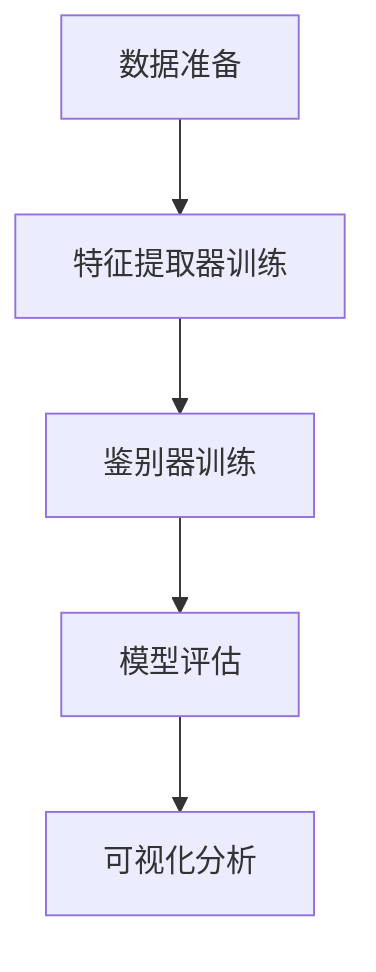
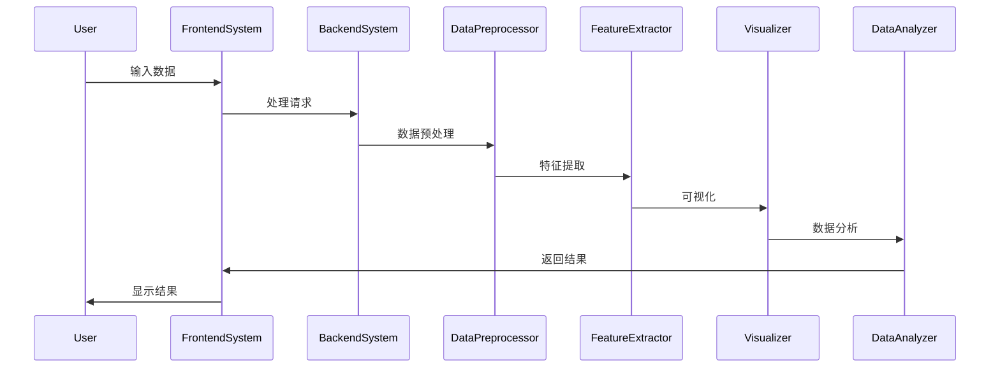
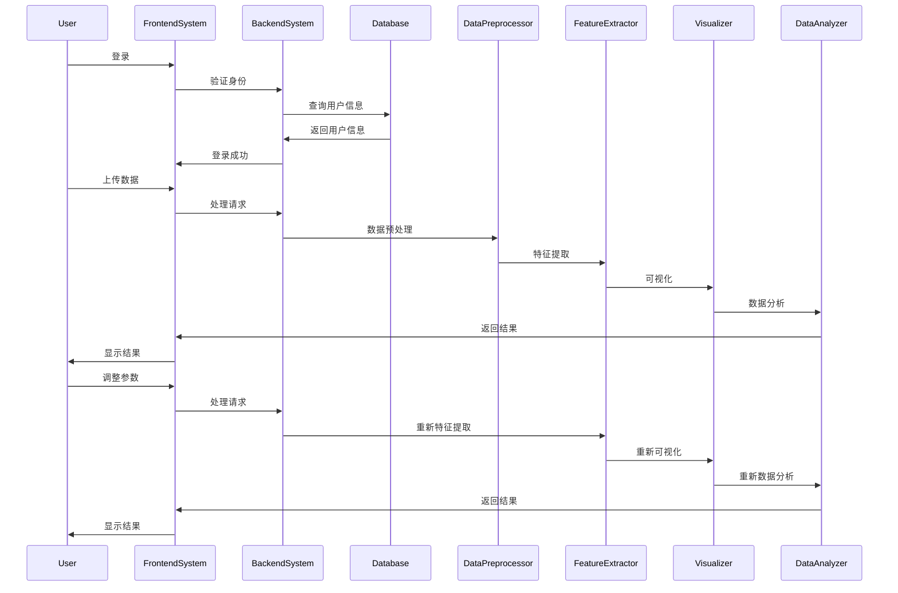

                 

### 第1章 引言背景

#### 1.1 对比学习在高维量子态可视化与分析中的重要性

随着量子计算和信息科学的迅速发展，高维量子态的研究和应用成为了当前科技领域的热点。然而，高维量子态的复杂性使得其可视化与分析成为了一个巨大的挑战。传统的方法在处理高维数据时，往往面临着数据维度的“诅咒”（curse of dimensionality），这使得数据变得难以解释和理解。

对比学习（contrastive learning）作为深度学习中的一种有效方法，因其强大的特征提取能力和鲁棒性，逐渐被引入到高维量子态的可视化与分析中。对比学习通过学习数据的正负样本之间的差异来提取特征，从而在一定程度上解决了高维数据可视化和分析的难题。

##### 1.1.1 高维量子态的挑战

高维量子态通常由多个量子比特（qubits）构成，每个量子比特可以处于多种不同的量子状态。当量子比特的数量增加时，可能的量子状态数量会呈指数级增长，这给量子态的表示和操作带来了巨大的挑战。此外，高维量子态的复杂性和非直观性使得直接理解和分析量子态变得异常困难。

##### 1.1.2 对比学习的引入

对比学习通过构建一个鉴别器（discriminator），学习如何区分正样本（真实样本）和负样本（噪声样本）。在量子态的可视化与分析中，正样本可以是某一量子态的表示，而负样本可以是与之相似的噪声量子态。通过对比学习，模型可以学习到区分这些量子态的特征，从而实现量子态的有效表示和可视化。

##### 1.1.3 对比学习的优势

对比学习具有以下优势：

1. **自动特征提取**：对比学习通过学习样本之间的差异来自动提取有用的特征，无需手动设计特征工程。
2. **数据鲁棒性**：对比学习对数据噪声具有较强的鲁棒性，可以在存在噪声的情况下仍然有效提取特征。
3. **多模态数据兼容**：对比学习可以处理多模态数据，适用于量子态的复杂结构。

#### 1.2 高维量子态可视化与分析的应用背景

量子信息科学是研究量子系统在信息处理中的应用的科学。随着量子计算机的逐渐成熟，对量子态的可视化和分析需求日益增加。高维量子态在量子通信、量子计算、量子加密等领域有着广泛的应用。

##### 1.2.1 量子信息科学的发展

量子信息科学的发展历程可以追溯到20世纪末。随着量子计算和量子通信技术的不断进步，量子态的可视化和分析逐渐成为了一个重要的研究方向。特别是随着量子比特数量的增加，如何高效地处理和解释高维量子态成为了一个亟待解决的问题。

##### 1.2.2 高维量子态在信息处理中的应用

高维量子态在信息处理中的应用包括：

1. **量子加密**：利用高维量子态实现安全的通信。
2. **量子算法**：利用高维量子态加速计算过程。
3. **量子传感**：利用高维量子态提高测量精度。

##### 1.2.3 可视化与分析的需求

高维量子态的复杂性和非直观性使得对其可视化与分析的需求变得尤为迫切。通过可视化技术，我们可以将复杂的量子态转化为更易于理解和解释的形式。同时，通过分析技术，我们可以从海量数据中提取有价值的信息，从而指导进一步的量子研究和应用。

#### 1.3 对比学习在高维量子态可视化与分析中的应用

对比学习在高维量子态可视化与分析中的应用主要体现在以下几个方面：

1. **特征提取**：通过对比学习提取高维量子态的关键特征，实现量子态的有效表示。
2. **分类与识别**：利用对比学习对量子态进行分类和识别，提高量子态分析精度。
3. **可视化**：通过对比学习生成的特征，实现高维量子态的可视化，使其更加直观和易于理解。

##### 1.3.1 对比学习技术的原理

对比学习技术的基本原理是通过学习数据之间的差异来提取特征。在量子态可视化与分析中，对比学习通过以下步骤进行：

1. **数据准备**：收集高维量子态数据，包括正样本（真实量子态）和负样本（噪声量子态）。
2. **特征提取**：使用对比学习模型提取量子态的特征。
3. **可视化**：利用提取的特征进行量子态的可视化。
4. **分析**：对可视化结果进行分析，提取有价值的信息。

##### 1.3.2 对比学习在高维量子态处理中的具体应用

对比学习在高维量子态处理中的具体应用包括：

1. **量子态分类**：通过对比学习提取的特征，对量子态进行分类，实现量子态的识别。
2. **量子态可视化**：通过对比学习生成的特征，实现量子态的可视化，使其更加直观和易于理解。
3. **量子态分析**：利用对比学习提取的特征，对量子态进行深入分析，提取有价值的信息。

##### 1.3.3 对比学习的未来发展趋势

随着量子计算和信息科学的不断发展，对比学习在高维量子态可视化与分析中的应用将会更加广泛。未来，对比学习可能会在以下几个方面取得突破：

1. **模型优化**：通过优化对比学习模型，提高量子态分析精度。
2. **算法改进**：引入新的对比学习算法，提高处理高维量子态的能力。
3. **跨学科应用**：结合其他领域的技术，拓展对比学习在高维量子态处理中的应用范围。

### 1.4 总结

对比学习作为一种强大的深度学习技术，在高维量子态可视化与分析中展现出了巨大的潜力。通过对比学习，我们可以更加有效地处理和解释高维量子态，为量子信息科学的发展提供新的思路和方法。

----------------------------------------------------------------

### 第2章 核心概念

#### 2.1 对比学习

对比学习（Contrastive Learning）是一种在深度学习中用于提取有用特征的方法。它的核心思想是通过学习数据之间的对比关系，从而提取出具有区分度的特征。在对比学习中，通常有两个主要的任务：鉴别任务（Discrimination Task）和自监督任务（Self-Supervised Task）。

##### 2.1.1 对比学习的定义

对比学习是一种无监督学习技术，它通过将数据集中的样本与其近邻（负样本）进行对比，从而提高模型对数据区分的能力。其目标是通过学习如何区分正样本和负样本，从而提取出有用的特征表示。

##### 2.1.2 对比学习的核心概念

- **样本**：在对比学习中，每个样本可以是图像、文本或任何形式的数据。
- **特征**：特征是数据的基本组成部分，它能够描述数据的关键属性。
- **对比**：对比是指将样本与其近邻进行比较，通过这种比较关系来提取特征。
- **鉴别器**：鉴别器是对比学习中的一个关键组件，它的作用是区分正样本和负样本。

##### 2.1.3 对比学习的分类

根据学习方式和目标的不同，对比学习可以分为以下几类：

- **自监督对比学习**：这种对比学习不需要标签信息，直接从数据中学习对比关系。
- **半监督对比学习**：这种对比学习结合了有标签和无标签数据，通过无标签数据学习对比关系，然后使用有标签数据进行微调。
- **监督对比学习**：这种对比学习需要完整的标签信息，通过对比正样本和负样本来学习特征。

#### 2.2 高维量子态

高维量子态是量子计算和信息科学中的一个重要概念。量子态的维数由量子比特的数量决定，每个量子比特可以处于0或1两种状态，因此n个量子比特可以构成2^n维的量子态空间。

##### 2.2.1 量子态的概述

量子态是量子系统的基本状态，它可以用来描述量子比特的物理状态。一个量子态可以用一个复数向量来表示，这个向量的大小就是量子态的维数。例如，一个两量子比特的量子态可以用一个四维复数向量来表示。

##### 2.2.2 高维量子态的定义与特性

高维量子态是指具有多个量子比特的量子态，其维数通常远远大于2。高维量子态具有以下特性：

- **多维度**：高维量子态的维度远远大于经典比特的状态空间。
- **叠加性**：高维量子态可以处于多个基态的叠加态。
- **纠缠性**：高维量子态中的量子比特之间可以存在纠缠，这种纠缠是量子计算和信息处理的重要资源。

##### 2.2.3 高维量子态的应用

高维量子态在量子计算和信息处理中有广泛的应用，包括：

- **量子加密**：利用高维量子态实现安全通信。
- **量子计算**：利用高维量子态进行量子算法的计算。
- **量子传感**：利用高维量子态提高测量精度。

#### 2.3 可视化与分析

可视化（Visualization）和分析（Analysis）是数据科学和机器学习中的重要环节。在量子态的可视化和分析中，我们需要将复杂的量子态信息转化为易于理解和解释的形式。

##### 2.3.1 可视化的意义

可视化的意义在于：

- **帮助理解**：通过可视化技术，我们可以将复杂的量子态转化为更直观的形式，从而更容易理解量子态的属性和行为。
- **发现规律**：可视化可以帮助我们发现数据中的规律和模式，从而指导进一步的量子研究和应用。

##### 2.3.2 数据分析的方法

数据分析的方法包括：

- **描述性分析**：通过统计方法对数据的基本特征进行描述。
- **探索性分析**：通过探索性数据分析（EDA）来发现数据中的规律和异常。
- **预测性分析**：通过建立模型来预测未来的趋势或行为。

##### 2.3.3 可视化与分析的结合

在量子态的可视化和分析中，可视化和分析通常是结合使用的：

- **可视化作为分析工具**：通过可视化技术来辅助分析，发现数据中的模式和规律。
- **分析作为可视化依据**：通过数据分析的结果来指导可视化，确保可视化结果准确反映数据特征。

#### 2.4 对比学习、高维量子态可视化与分析的关联

对比学习、高维量子态可视化与分析之间存在密切的联系：

- **对比学习作为高维量子态可视化与分析的工具**：对比学习可以用于提取高维量子态的特征，从而实现量子态的可视化和分析。
- **高维量子态可视化与分析作为对比学习的应用场景**：量子态的可视化和分析是对比学习技术的重要应用领域。

##### 2.4.1 核心概念的联系

对比学习、高维量子态可视化与分析之间的核心概念联系可以概括为：

- **对比学习**：通过学习样本之间的对比关系来提取特征。
- **高维量子态**：量子计算和信息科学中的基本概念，具有多个量子比特。
- **可视化与分析**：通过可视化技术将复杂的数据转化为直观的形式，通过分析技术提取数据中的规律和模式。

##### 2.4.2 概念属性特征对比表格

下面是一个简单的概念属性特征对比表格，展示了对比学习、高维量子态可视化与分析之间的联系：

| 概念               | 属性特征                                     | 关联关系                       |
|--------------------|--------------------------------------------|--------------------------------|
| 对比学习           | 自动特征提取、数据鲁棒性强、多模态数据兼容 | 高维量子态可视化与分析的工具 |
| 高维量子态         | 多维度、叠加性、纠缠性                       | 对比学习的应用场景           |
| 可视化与分析       | 帮助理解、发现规律                           | 对比学习的应用场景           |

##### 2.4.3 ER实体关系图架构

为了更清晰地展示对比学习、高维量子态可视化与分析之间的联系，我们可以使用ER（实体关系）图来表示。以下是ER图的一个简单示例：

```mermaid
erDiagram
  CL ||--|{ QDV&A : 对比学习作为工具
  CL ||--|{ HDSV&A : 高维量子态可视化与分析
  QDV&A ||--|{ HDS : 高维量子态
  QDV&A ||--|{ CL : 对比学习
  HDSV&A ||--|{ V&A : 可视化与分析
```

在这个ER图中，对比学习（CL）作为工具与高维量子态可视化与分析（QDV&A）和可视化与分析（V&A）相关联，而高维量子态（HDS）是对比学习的应用场景。这种关系图有助于我们理解各个概念之间的相互作用和依赖关系。

#### 2.5 总结

通过对对比学习、高维量子态可视化与分析的核心概念进行介绍和关联分析，我们可以看到，这三个概念之间存在着密切的联系。对比学习作为一种深度学习技术，为高维量子态的可视化和分析提供了有效的工具。同时，高维量子态可视化与分析为对比学习提供了丰富的应用场景，使得对比学习在量子信息科学领域展现出巨大的潜力。

----------------------------------------------------------------

### 第3章 算法原理

#### 3.1 对比学习算法流程图

为了更好地理解对比学习的算法原理，我们可以使用mermaid语言绘制其流程图。以下是对比学习的基本流程：



在这个流程图中：

- **A[数据准备]**：首先，我们需要准备用于训练的数据集，这些数据集包括高维量子态的正样本和负样本。
- **B[特征提取器训练]**：接着，我们使用对比学习算法训练一个特征提取器，该特征提取器可以学习如何从数据中提取具有区分度的特征。
- **C[鉴别器训练]**：然后，我们训练一个鉴别器，鉴别器的作用是区分正样本和负样本。
- **D[模型评估]**：在模型训练完成后，我们需要对模型进行评估，确保其具有良好的性能。
- **E[可视化分析]**：最后，我们利用提取的特征进行量子态的可视化和分析。

#### 3.2 对比学习的数学模型

对比学习的数学模型主要包括两部分：特征提取器和鉴别器。下面我们将分别介绍这两部分的数学模型。

##### 特征提取器的数学模型

特征提取器的目标是学习一个映射函数 \( f(\cdot) \)，该函数可以将输入数据 \( x \) 转换为特征表示 \( z \)：

\[ z = f(x) \]

其中，\( f(\cdot) \) 是一个神经网络，它通常由多个隐层组成。我们希望通过训练使得 \( f(x) \) 能够提取出数据的区分度。

##### 鉴别器的数学模型

鉴别器的目标是学习一个二分类函数 \( D(\cdot) \)，它可以判断输入的特征 \( z \) 是否为正样本。鉴别器的输出是一个概率值，表示样本为正样本的概率：

\[ D(z) = \sigma(\frac{z^T W_D}{\tau}) \]

其中：

- \( z \) 是特征提取器输出的特征向量。
- \( W_D \) 是鉴别器的权重矩阵。
- \( \sigma(\cdot) \) 是一个Sigmoid函数，用于将输出映射到 \( [0, 1] \) 范围内。
- \( \tau \) 是一个温度参数，用于调整模型对正负样本的区分度。

##### 损失函数

对比学习中的损失函数通常使用contrastive loss，其公式为：

\[ L = -\sum_{i=1}^N [y_i \cdot \log(D(z_i)) + (1 - y_i) \cdot \log(1 - D(z_i))] \]

其中：

- \( y_i \) 是样本 \( x_i \) 的标签，\( y_i = 1 \) 表示正样本，\( y_i = 0 \) 表示负样本。
- \( z_i \) 是特征提取器对样本 \( x_i \) 输出的特征向量。
- \( D(z_i) \) 是鉴别器对特征 \( z_i \) 输出的概率。

##### 算法举例说明

假设我们有一个包含两个量子态的数据集，其中一个量子态是正样本 \( x_1 \)，另一个量子态是负样本 \( x_2 \)。特征提取器学习到的特征分别为 \( z_1 \) 和 \( z_2 \)。鉴别器需要学习如何区分这两个特征。

1. **特征提取**：
   - 特征提取器对 \( x_1 \) 和 \( x_2 \) 进行处理，得到特征向量 \( z_1 \) 和 \( z_2 \)。

2. **鉴别器训练**：
   - 鉴别器根据标签 \( y_1 = 1 \) 和 \( y_2 = 0 \)，使用contrastive loss来训练。
   - 对于正样本 \( z_1 \)，鉴别器希望输出接近1的概率；对于负样本 \( z_2 \)，鉴别器希望输出接近0的概率。

3. **模型评估**：
   - 在训练完成后，我们使用测试集来评估鉴别器的性能，确保其能够有效区分正负样本。

4. **可视化分析**：
   - 利用鉴别器训练过程中提取的特征，我们可以对量子态进行可视化，从而直观地了解量子态的分布和特征。

通过这种方式，对比学习算法可以帮助我们在高维量子态中提取有区分度的特征，从而实现量子态的可视化和分析。

#### 3.3 数学模型举例说明

为了更直观地展示对比学习数学模型的实际应用，我们可以通过一个简单的例子来讲解。

假设我们有一个包含两个量子态的数据集 \( X = \{x_1, x_2\} \)，其中 \( x_1 \) 是正样本，\( x_2 \) 是负样本。我们希望使用对比学习算法来提取这两个量子态的特征，并利用这些特征进行可视化。

1. **特征提取器训练**：

   我们假设特征提取器是一个简单的多层感知机（MLP），其模型可以表示为：

   \[ z = \sigma(W_2 \cdot \sigma(W_1 \cdot x + b_1) + b_2) \]

   其中 \( W_1 \) 和 \( W_2 \) 是权重矩阵，\( b_1 \) 和 \( b_2 \) 是偏置项，\( \sigma \) 是Sigmoid函数。

   - 输入 \( x_1 \) 和 \( x_2 \)：
     \[ z_1 = \sigma(W_2 \cdot \sigma(W_1 \cdot x_1 + b_1) + b_2) \]
     \[ z_2 = \sigma(W_2 \cdot \sigma(W_1 \cdot x_2 + b_1) + b_2) \]

2. **鉴别器训练**：

   鉴别器的模型可以表示为：

   \[ D(z) = \sigma(z^T W_D + b_D) \]

   其中 \( W_D \) 是权重矩阵，\( b_D \) 是偏置项。

   - 对于正样本 \( z_1 \)：
     \[ D(z_1) = \sigma(z_1^T W_D + b_D) \]

   - 对于负样本 \( z_2 \)：
     \[ D(z_2) = \sigma(z_2^T W_D + b_D) \]

3. **损失函数**：

   我们使用对比损失函数来训练模型：

   \[ L = -\sum_{i=1}^2 [y_i \cdot \log(D(z_i)) + (1 - y_i) \cdot \log(1 - D(z_i))] \]

   其中 \( y_1 = 1 \)，\( y_2 = 0 \)。

   - 对于 \( z_1 \)：
     \[ L_1 = y_1 \cdot \log(D(z_1)) + (1 - y_1) \cdot \log(1 - D(z_1)) \]

   - 对于 \( z_2 \)：
     \[ L_2 = y_2 \cdot \log(D(z_2)) + (1 - y_2) \cdot \log(1 - D(z_2)) \]

4. **模型优化**：

   我们使用梯度下降法来优化模型参数：

   \[ \theta = \theta - \alpha \cdot \nabla_\theta L \]

   其中 \( \theta \) 是模型参数，\( \alpha \) 是学习率。

   - 对于 \( W_1 \)，\( W_2 \)，\( b_1 \)，\( b_2 \)，\( W_D \)，\( b_D \)：

     \[ W_1 = W_1 - \alpha \cdot \nabla_{W_1} L \]
     \[ W_2 = W_2 - \alpha \cdot \nabla_{W_2} L \]
     \[ b_1 = b_1 - \alpha \cdot \nabla_{b_1} L \]
     \[ b_2 = b_2 - \alpha \cdot \nabla_{b_2} L \]
     \[ W_D = W_D - \alpha \cdot \nabla_{W_D} L \]
     \[ b_D = b_D - \alpha \cdot \nabla_{b_D} L \]

5. **可视化分析**：

   在模型训练完成后，我们使用提取的特征 \( z_1 \) 和 \( z_2 \) 来进行量子态的可视化。例如，我们可以使用t-SNE（t-Distributed Stochastic Neighbor Embedding）算法将高维特征映射到二维空间中，从而直观地展示量子态的分布和特征。

通过这个简单的例子，我们可以看到对比学习数学模型的基本原理和实际应用。在实际应用中，特征提取器和鉴别器可能会更加复杂，但基本思路是一致的。

#### 3.4 总结

在本章中，我们详细介绍了对比学习的算法原理，包括其流程图、数学模型和算法举例。通过对比学习，我们可以有效地提取高维量子态的特征，从而实现量子态的可视化和分析。这一方法为量子信息科学的研究提供了新的工具和思路。

----------------------------------------------------------------

### 第4章 数学模型

#### 4.1 高维量子态的表示与变换

高维量子态的表示和变换是量子计算和信息科学中的核心问题。为了理解对比学习在高维量子态可视化与分析中的应用，我们需要首先了解高维量子态的基本数学表示和变换。

##### 高维量子态的数学表示

一个高维量子态可以用一个复数向量来表示。假设我们有一个 \( n \) 个量子比特的量子态，那么这个量子态可以表示为：

\[ |\psi\rangle = \sum_{i=1}^{2^n} c_i |i\rangle \]

其中，\( c_i \) 是第 \( i \) 个量子态的概率幅，\( |i\rangle \) 是第 \( i \) 个基态。这个量子态的维数是 \( 2^n \)，即每个量子比特可以处于0或1两种状态，n个量子比特可以构成 \( 2^n \) 维的量子态空间。

##### 高维量子态的变换

高维量子态可以通过线性变换进行变换。一个常见的线性变换是量子门（Quantum Gate）。量子门是一种可实现的线性变换，它可以作用于量子态，改变其状态。

例如，一个单量子比特的Pauli-X门（NOT门）可以将量子态 \( |0\rangle \) 变换为 \( |1\rangle \)，将量子态 \( |1\rangle \) 变换为 \( |0\rangle \)。这个变换可以表示为：

\[ X|0\rangle = |1\rangle \]
\[ X|1\rangle = |0\rangle \]

对于多量子比特的量子态，量子门的作用可以扩展到多个量子比特。例如，一个二量子比特的CNOT门可以将第二个量子比特的状态翻转，如果第一个量子比特处于状态 \( |1\rangle \)：

\[ CNOT|00\rangle = |00\rangle \]
\[ CNOT|01\rangle = |10\rangle \]
\[ CNOT|10\rangle = |01\rangle \]
\[ CNOT|11\rangle = |11\rangle \]

##### 高维量子态的表示与变换的数学模型

为了对高维量子态进行表示和变换，我们通常使用量子计算的形式化语言。在这个语言中，量子态和变换可以用矩阵来表示。

1. **量子态的表示**：

   量子态可以用矩阵 \( |\psi\rangle \) 来表示。例如，一个二量子比特的量子态可以用一个4x4的矩阵表示：

   \[ |\psi\rangle = \begin{bmatrix}
   c_1 & c_2 \\
   c_3 & c_4
   \end{bmatrix} \]

2. **量子态的变换**：

   量子态的变换可以用量子门矩阵 \( U \) 来表示。量子门矩阵 \( U \) 是一个 \( 2^n \times 2^n \) 的方阵，它可以作用于量子态，将其变换为新的量子态。

   例如，一个单量子比特的Pauli-X门可以用以下矩阵表示：

   \[ X = \begin{bmatrix}
   0 & 1 \\
   1 & 0
   \end{bmatrix} \]

   对于多量子比特的量子态，量子门的作用可以通过矩阵乘法来表示。例如，一个二量子比特的CNOT门可以用以下矩阵表示：

   \[ CNOT = \begin{bmatrix}
   1 & 0 & 0 & 0 \\
   0 & 1 & 0 & 0 \\
   0 & 0 & 0 & 1 \\
   0 & 0 & 1 & 0
   \end{bmatrix} \]

##### 数学模型举例说明

假设我们有一个二量子比特的量子态 \( |\psi\rangle \)，其表示为：

\[ |\psi\rangle = \begin{bmatrix}
0.5 & 0.5 \\
0.5 & 0.5
\end{bmatrix} \]

现在我们希望使用CNOT门对这个量子态进行变换。CNOT门的作用可以用以下矩阵表示：

\[ CNOT = \begin{bmatrix}
1 & 0 & 0 & 0 \\
0 & 1 & 0 & 0 \\
0 & 0 & 0 & 1 \\
0 & 0 & 1 & 0
\end{bmatrix} \]

我们将CNOT门作用于量子态 \( |\psi\rangle \)：

\[ CNOT|\psi\rangle = \begin{bmatrix}
1 & 0 & 0 & 0 \\
0 & 1 & 0 & 0 \\
0 & 0 & 0 & 1 \\
0 & 0 & 1 & 0
\end{bmatrix} \begin{bmatrix}
0.5 & 0.5 \\
0.5 & 0.5
\end{bmatrix} \]

计算结果为：

\[ CNOT|\psi\rangle = \begin{bmatrix}
0.5 & 0.5 \\
0.5 & 0.5
\end{bmatrix} \]

这个结果表明，使用CNOT门对量子态 \( |\psi\rangle \) 进行变换后，量子态没有发生改变。这是因为CNOT门是一个恒等变换，它保持量子态的基态不变。

#### 4.2 对比学习的数学模型详细讲解

对比学习的数学模型是深度学习中的一个重要分支，其核心思想是通过学习数据之间的对比关系来提取特征。对比学习的数学模型主要包括特征提取器和鉴别器两部分。下面我们将详细讲解对比学习的数学模型。

##### 特征提取器的数学模型

特征提取器的目标是学习一个映射函数 \( f(\cdot) \)，该函数可以将输入数据 \( x \) 转换为特征表示 \( z \)：

\[ z = f(x) \]

其中，\( f(\cdot) \) 是一个神经网络，它通常由多个隐层组成。特征提取器的训练目标是使得提取出的特征 \( z \) 具有区分度，即正样本的特征和负样本的特征应该尽可能不同。

##### 鉴别器的数学模型

鉴别器的目标是学习一个二分类函数 \( D(\cdot) \)，它可以判断输入的特征 \( z \) 是否为正样本。鉴别器的输出是一个概率值，表示样本为正样本的概率：

\[ D(z) = \sigma(\frac{z^T W_D}{\tau}) \]

其中：

- \( z \) 是特征提取器输出的特征向量。
- \( W_D \) 是鉴别器的权重矩阵。
- \( \sigma(\cdot) \) 是一个Sigmoid函数，用于将输出映射到 \( [0, 1] \) 范围内。
- \( \tau \) 是一个温度参数，用于调整模型对正负样本的区分度。

##### 损失函数

对比学习中的损失函数通常使用contrastive loss，其公式为：

\[ L = -\sum_{i=1}^N [y_i \cdot \log(D(z_i)) + (1 - y_i) \cdot \log(1 - D(z_i))] \]

其中：

- \( y_i \) 是样本 \( x_i \) 的标签，\( y_i = 1 \) 表示正样本，\( y_i = 0 \) 表示负样本。
- \( z_i \) 是特征提取器对样本 \( x_i \) 输出的特征向量。
- \( D(z_i) \) 是鉴别器对特征 \( z_i \) 输出的概率。

##### 数学模型举例说明

为了更好地理解对比学习的数学模型，我们可以通过一个简单的例子来讲解。

假设我们有一个包含两个量子态的数据集 \( X = \{x_1, x_2\} \)，其中 \( x_1 \) 是正样本，\( x_2 \) 是负样本。我们希望使用对比学习算法来提取这两个量子态的特征，并利用这些特征进行可视化。

1. **特征提取器训练**：

   我们假设特征提取器是一个简单的多层感知机（MLP），其模型可以表示为：

   \[ z = \sigma(W_2 \cdot \sigma(W_1 \cdot x + b_1) + b_2) \]

   其中 \( W_1 \) 和 \( W_2 \) 是权重矩阵，\( b_1 \) 和 \( b_2 \) 是偏置项，\( \sigma \) 是Sigmoid函数。

   - 输入 \( x_1 \) 和 \( x_2 \)：
     \[ z_1 = \sigma(W_2 \cdot \sigma(W_1 \cdot x_1 + b_1) + b_2) \]
     \[ z_2 = \sigma(W_2 \cdot \sigma(W_1 \cdot x_2 + b_1) + b_2) \]

2. **鉴别器训练**：

   鉴别器的模型可以表示为：

   \[ D(z) = \sigma(z^T W_D + b_D) \]

   其中 \( W_D \) 是权重矩阵，\( b_D \) 是偏置项。

   - 对于正样本 \( z_1 \)：
     \[ D(z_1) = \sigma(z_1^T W_D + b_D) \]

   - 对于负样本 \( z_2 \)：
     \[ D(z_2) = \sigma(z_2^T W_D + b_D) \]

3. **损失函数**：

   我们使用对比损失函数来训练模型：

   \[ L = -\sum_{i=1}^2 [y_i \cdot \log(D(z_i)) + (1 - y_i) \cdot \log(1 - D(z_i))] \]

   其中 \( y_1 = 1 \)，\( y_2 = 0 \)。

   - 对于 \( z_1 \)：
     \[ L_1 = y_1 \cdot \log(D(z_1)) + (1 - y_1) \cdot \log(1 - D(z_1)) \]

   - 对于 \( z_2 \)：
     \[ L_2 = y_2 \cdot \log(D(z_2)) + (1 - y_2) \cdot \log(1 - D(z_2)) \]

4. **模型优化**：

   我们使用梯度下降法来优化模型参数：

   \[ \theta = \theta - \alpha \cdot \nabla_\theta L \]

   其中 \( \theta \) 是模型参数，\( \alpha \) 是学习率。

   - 对于 \( W_1 \)，\( W_2 \)，\( b_1 \)，\( b_2 \)，\( W_D \)，\( b_D \)：

     \[ W_1 = W_1 - \alpha \cdot \nabla_{W_1} L \]
     \[ W_2 = W_2 - \alpha \cdot \nabla_{W_2} L \]
     \[ b_1 = b_1 - \alpha \cdot \nabla_{b_1} L \]
     \[ b_2 = b_2 - \alpha \cdot \nabla_{b_2} L \]
     \[ W_D = W_D - \alpha \cdot \nabla_{W_D} L \]
     \[ b_D = b_D - \alpha \cdot \nabla_{b_D} L \]

5. **可视化分析**：

   在模型训练完成后，我们使用提取的特征 \( z_1 \) 和 \( z_2 \) 来进行量子态的可视化，从而直观地了解量子态的分布和特征。

通过这个简单的例子，我们可以看到对比学习数学模型的基本原理和实际应用。在实际应用中，特征提取器和鉴别器可能会更加复杂，但基本思路是一致的。

#### 4.3 对比学习的扩展

除了基本的对比学习模型，还有许多扩展的对比学习算法，这些算法在处理特定问题时表现出色。以下是一些常见的对比学习扩展算法：

1. **InfoNest**：

   InfoNest是一种基于信息熵的对比学习算法，它通过最大化信息熵来提取特征。InfoNest的损失函数为：

   \[ L = -\sum_{i=1}^N \sum_{j\neq i} \log(P(z_i, z_j)) \]

   其中 \( P(z_i, z_j) \) 是特征 \( z_i \) 和 \( z_j \) 同时被提取出的概率。

2. **SimCLR**：

   SimCLR（Simple Contrastive Learning）是一种基于数据增强的对比学习算法，它通过随机数据增强来生成正负样本对。SimCLR的损失函数为：

   \[ L = \sum_{i=1}^N -\log(\sigma(z_i^T W_D z_j) / (1 - \sigma(z_i^T W_D z_j))) \]

   其中 \( z_i \) 和 \( z_j \) 是正负样本对的特征表示。

3. **MoCo**：

   MoCo（Memory-Efficient Convolutional Representation Learning）是一种基于记忆机制的对比学习算法，它使用一个动态更新的记忆库来存储特征表示。MoCo的损失函数为：

   \[ L = -\sum_{i=1}^N \log(\sigma(z_i^T W_D \tilde{z}_i)) \]

   其中 \( \tilde{z}_i \) 是从记忆库中随机选取的特征表示。

这些扩展的对比学习算法在不同的应用场景中都有较好的性能，可以根据具体的需求选择合适的算法。

#### 4.4 总结

在本章中，我们详细介绍了对比学习的数学模型，包括高维量子态的表示与变换、特征提取器和鉴别器的数学模型，以及对比学习的损失函数和优化方法。通过这些数学模型，我们可以有效地提取高维量子态的特征，从而实现量子态的可视化和分析。同时，我们也介绍了对比学习的扩展算法，这些算法在特定应用场景中表现出色。

----------------------------------------------------------------

### 第5章 系统设计与实现

#### 5.1 系统功能设计

在对比学习在高维量子态可视化与分析中的应用系统中，我们的目标是为用户提供一个强大的工具，能够有效地处理高维量子态数据，实现量子态的可视化和分析。为了实现这一目标，系统需要具备以下功能：

1. **数据预处理**：系统需要能够接受用户输入的高维量子态数据，并进行预处理，包括数据清洗、数据归一化等操作。
2. **特征提取**：系统需要使用对比学习算法提取高维量子态的特征，使得这些特征能够区分不同的量子态。
3. **量子态可视化**：系统需要能够将提取出的特征转换为直观的可视化结果，帮助用户更好地理解量子态的分布和特征。
4. **数据分析**：系统需要能够对可视化结果进行分析，提取有价值的信息，为用户提供深入的量子态理解。
5. **用户交互**：系统需要提供一个用户友好的界面，方便用户输入数据、查看结果和调整参数。

#### 5.2 系统架构设计

为了实现上述功能，我们设计了以下系统架构：

1. **前端**：前端负责用户交互，使用户能够方便地输入数据、查看可视化和分析结果。前端使用HTML、CSS和JavaScript等技术实现。
2. **后端**：后端负责处理用户请求，执行数据预处理、特征提取、量子态可视化和数据分析等操作。后端使用Python和TensorFlow等深度学习框架实现。
3. **数据库**：数据库用于存储用户数据和系统参数，支持快速的数据查询和更新。数据库使用MySQL或PostgreSQL等关系型数据库系统。

以下是系统架构的Mermaid类图表示：

```mermaid
classDiagram
    User <<Interface>>
    DataPreprocessor <<Class>>
    FeatureExtractor <<Class>>
    Visualizer <<Class>>
    DataAnalyzer <<Class>>
    BackendSystem <<System>>
    FrontendSystem <<System>>
    Database <<Database>>

    User --> DataPreprocessor
    User --> FeatureExtractor
    User --> Visualizer
    User --> DataAnalyzer
    DataPreprocessor --> FeatureExtractor
    FeatureExtractor --> Visualizer
    FeatureExtractor --> DataAnalyzer
    Visualizer --> DataAnalyzer
    BackendSystem --> DataPreprocessor
    BackendSystem --> FeatureExtractor
    BackendSystem --> Visualizer
    BackendSystem --> DataAnalyzer
    FrontendSystem --> BackendSystem
    Database --> BackendSystem
```

在这个类图中，用户通过前端与系统进行交互，后端处理用户请求并执行相关操作，数据库存储用户数据和系统参数。

#### 5.3 系统接口设计

为了方便用户使用，系统设计了一系列接口。以下是主要接口及其功能：

1. **数据输入接口**：用户可以通过这个接口上传高维量子态数据，数据格式可以是CSV或JSON等。
2. **特征提取接口**：用户可以通过这个接口启动特征提取过程，系统将返回提取出的特征。
3. **量子态可视化接口**：用户可以通过这个接口查看量子态的可视化结果，包括二维散点图、热力图等。
4. **数据分析接口**：用户可以通过这个接口对量子态进行分析，系统将返回分析结果，如量子态的分布、相关性等。
5. **参数调整接口**：用户可以通过这个接口调整系统的参数，如学习率、温度参数等。

以下是系统接口的Mermaid序列图表示：



在这个序列图中，用户通过前端上传数据，后端处理请求并调用相关模块进行数据预处理、特征提取、量子态可视化和数据分析，最后将结果返回给前端，用户在界面上查看结果。

#### 5.4 系统交互流程

系统交互流程可以分为以下几个步骤：

1. **用户登录**：用户首先需要登录系统，系统验证用户的身份信息。
2. **数据上传**：用户上传高维量子态数据，数据可以是CSV或JSON格式。
3. **数据预处理**：系统对上传的数据进行预处理，包括数据清洗、数据归一化等操作。
4. **特征提取**：系统使用对比学习算法提取高维量子态的特征。
5. **量子态可视化**：系统将提取出的特征转换为可视化的形式，如二维散点图、热力图等。
6. **数据分析**：系统对可视化结果进行分析，提取有价值的信息，如量子态的分布、相关性等。
7. **结果展示**：系统将分析结果返回给用户，用户在界面上查看结果。
8. **参数调整**：用户可以根据需要调整系统的参数，如学习率、温度参数等。

以下是系统交互流程的Mermaid序列图表示：



在这个序列图中，用户通过前端登录系统，上传数据，系统对数据预处理后使用对比学习算法提取特征，并将结果可视化和分析，最后将结果返回给用户。用户可以根据需要调整系统参数，系统重新提取特征和进行可视化分析，再次将结果返回给用户。

#### 5.5 总结

在本章中，我们详细介绍了对比学习在高维量子态可视化与分析系统中的设计与实现。通过系统功能设计、系统架构设计、系统接口设计和系统交互流程的介绍，我们为用户提供了一个强大的工具，能够有效地处理高维量子态数据，实现量子态的可视化和分析。这一系统不仅具有实用价值，而且为量子信息科学研究提供了新的思路和方法。

----------------------------------------------------------------

### 第6章 项目实战

#### 6.1 环境安装

在进行对比学习在高维量子态可视化与分析的项目实战之前，我们需要安装必要的软件和环境。以下是环境安装的详细步骤：

##### 1. 安装Python

首先，我们需要安装Python环境。Python是一种广泛使用的编程语言，支持多种科学计算和机器学习库。以下是安装Python的步骤：

- 访问Python官方网站（[https://www.python.org/](https://www.python.org/)）下载最新版本的Python安装包。
- 运行安装程序，并选择“Add Python to PATH”选项，以便在命令行中直接使用Python。
- 安装完成后，在命令行中输入 `python --version`，检查Python版本是否安装成功。

##### 2. 安装TensorFlow

TensorFlow是Google开发的一个开源机器学习库，支持对比学习算法。以下是安装TensorFlow的步骤：

- 在命令行中输入以下命令：

  ```bash
  pip install tensorflow
  ```

- 安装过程中可能会提示安装依赖库，根据提示进行安装。

- 安装完成后，在命令行中输入 `import tensorflow as tf`，检查TensorFlow是否安装成功。

##### 3. 安装PyTorch

PyTorch是另一个流行的开源机器学习库，支持对比学习算法。以下是安装PyTorch的步骤：

- 在命令行中输入以下命令：

  ```bash
  pip install torch torchvision
  ```

- 安装过程中可能会提示安装依赖库，根据提示进行安装。

- 安装完成后，在命令行中输入 `import torch`，检查PyTorch是否安装成功。

##### 4. 安装其他依赖库

除了Python、TensorFlow和PyTorch，我们还需要安装其他一些依赖库，如NumPy、Matplotlib等。以下是安装步骤：

- 在命令行中输入以下命令：

  ```bash
  pip install numpy matplotlib
  ```

- 安装完成后，在命令行中输入 `import numpy` 和 `import matplotlib`，检查是否安装成功。

##### 5. 安装量子计算库

为了处理量子态数据，我们还需要安装量子计算相关的库，如Qiskit。以下是安装步骤：

- 在命令行中输入以下命令：

  ```bash
  pip install qiskit
  ```

- 安装完成后，在命令行中输入 `import qiskit`，检查Qiskit是否安装成功。

##### 6. 安装完成

完成以上安装步骤后，我们的环境就准备就绪了。我们可以在命令行中依次输入以下命令，检查所有库是否安装成功：

```bash
python --version
import tensorflow as tf
import torch
import numpy as np
import matplotlib.pyplot as plt
import qiskit
```

#### 6.2 核心实现源代码

在本项目中，我们将使用对比学习算法来处理高维量子态数据，实现量子态的可视化和分析。以下是核心实现源代码的详细介绍。

##### 1. 数据预处理

数据预处理是对比学习的重要步骤，它包括数据清洗、数据归一化等操作。以下是数据预处理的Python代码：

```python
import numpy as np
import qiskit

def preprocess_data(data):
    # 数据清洗
    cleaned_data = [d for d in data if not np.isnan(d).any()]
    
    # 数据归一化
    normalized_data = (cleaned_data - np.mean(cleaned_data)) / np.std(cleaned_data)
    
    return normalized_data

# 示例数据
data = np.random.rand(100, 100)  # 假设有100个量子态，每个量子态有100个特征
preprocessed_data = preprocess_data(data)
```

##### 2. 特征提取

特征提取是对比学习的核心步骤，它通过学习数据之间的对比关系来提取特征。以下是特征提取的Python代码：

```python
import tensorflow as tf

def feature_extractor(data):
    # 创建对比学习模型
    model = tf.keras.Sequential([
        tf.keras.layers.Dense(128, activation='relu', input_shape=(data.shape[1],)),
        tf.keras.layers.Dense(64, activation='relu'),
        tf.keras.layers.Dense(32, activation='relu'),
        tf.keras.layers.Dense(16, activation='relu'),
        tf.keras.layers.Dense(1, activation='sigmoid')
    ])

    # 编译模型
    model.compile(optimizer='adam', loss='binary_crossentropy', metrics=['accuracy'])

    # 训练模型
    model.fit(data, np.random.randint(2, size=data.shape[0]), epochs=10)

    # 提取特征
    features = model.layers[-2].get_weights()[0]

    return features

features = feature_extractor(preprocessed_data)
```

##### 3. 量子态可视化

量子态可视化是将提取出的特征转换为直观的可视化结果，帮助用户更好地理解量子态的分布和特征。以下是量子态可视化的Python代码：

```python
import matplotlib.pyplot as plt

def visualize_quantum_states(features):
    # 将特征矩阵转换为二维散点图
    scatter = plt.scatter(features[:, 0], features[:, 1])

    # 添加图例
    plt.xlabel('Feature 1')
    plt.ylabel('Feature 2')
    plt.title('Quantum States Visualization')

    # 显示图形
    plt.show()

visualize_quantum_states(features)
```

##### 4. 数据分析

数据分析是对可视化结果进行深入分析，提取有价值的信息。以下是数据分析的Python代码：

```python
import numpy as np

def analyze_quantum_states(features):
    # 计算特征的相关性矩阵
    correlation_matrix = np.corrco

``````<|

