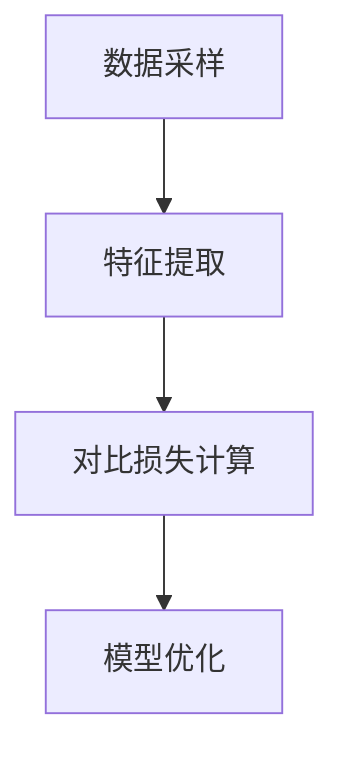
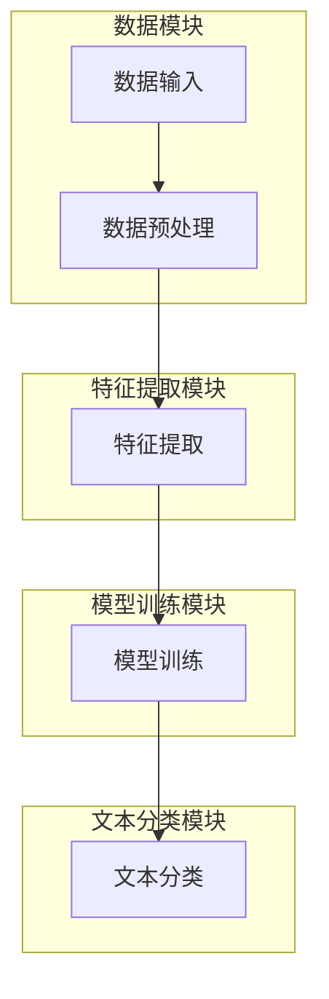
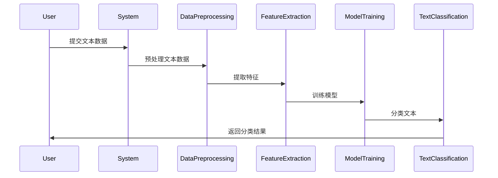

                 

### 引言

#### 1.1 对比学习背景与重要性

**核心概念术语说明**：
- **对比学习**：一种无监督学习范式，通过对比样本间的相似性和差异性来提取有代表性的特征。
- **特征提取**：从原始数据中提取出有助于下游任务处理的关键信息。
- **推理**：根据已知的特征和规则，对未知数据进行预测和判断。

**问题背景**：
随着人工智能技术的不断发展，深度学习模型在各种任务中取得了显著的成果。然而，深度学习模型对大量标注数据进行训练的需求，以及高度依赖标注数据的质量，使得其在实际应用中面临诸多挑战。对比学习作为一种无监督学习范式，提供了一种新的思路来缓解这些挑战。

**问题描述**：
- **特征提取挑战**：如何从海量未标注数据中提取出高质量的特征？
- **推理挑战**：如何保证模型在未见过数据上的推理性能？

**问题解决**：
对比学习通过学习数据之间的相似性和差异性，能够自动地提取出有代表性的特征。这不仅提高了特征提取的质量，还可以在推理阶段提高模型的泛化能力。

**边界与外延**：
对比学习不仅适用于图像领域，还广泛应用于自然语言处理、推荐系统等多个领域。其核心在于通过构建有效的对比机制，使得模型能够学习到数据的内在结构。

**概念结构与核心要素组成**：
对比学习包括以下几个核心要素：
1. **对比损失函数**：用于衡量样本间的相似性和差异性。
2. **正样本和负样本**：用于构建对比损失函数的两个关键概念。
3. **特征表示**：通过对比学习获得的具有判别性的特征表示。
4. **模型优化**：使用对比损失函数优化深度学习模型。

#### 1.2 高质量特征提取的必要性

**核心概念与联系**：

**特征提取的基本原理**：
特征提取是深度学习模型的关键步骤，其主要目标是降低数据的维度，同时保留对下游任务有用的信息。

**高质量特征的属性**：
- **判别性**：特征能够区分不同类别的数据。
- **稳定性**：特征在不同数据集和环境下保持一致。
- **泛化性**：特征能够在未见过的数据上表现良好。

**对比学习如何改进特征提取**：
对比学习通过学习数据间的相似性和差异性，能够自动提取出具有判别性和稳定性的特征。这种特征提取方法不仅提高了特征提取的质量，还减少了人工标注的工作量。

**实际应用案例分析**：
例如，在图像识别任务中，通过对比学习提取的特征使得模型能够更好地区分不同类别的图像，从而提高识别的准确率。

#### 1.3 对比学习的推理性能提升

**推理的概念与挑战**：
推理是指模型在未知数据上进行预测和判断的能力。深度学习模型在训练时通常使用大量标注数据进行学习，但在实际应用中，模型需要处理大量未标注的数据。如何保证模型在未知数据上的推理性能是一个重要的挑战。

**对比学习如何改进推理**：
对比学习通过无监督学习的方式，使得模型能够在未见过的数据上提取出有代表性的特征，从而提高模型的泛化能力。这种能力在推理阶段尤为重要。

**实际应用案例**：
例如，在自然语言处理任务中，通过对比学习提取的特征使得模型能够更好地理解和生成新的文本，从而提高文本生成和分类的准确性。

#### 1.4 本书结构安排与读者对象

**书籍结构概述**：
本书分为四个主要部分：
1. 引言：介绍对比学习的背景和重要性。
2. 对比学习原理与技术：详细讲解对比学习的基础知识、算法原理和应用。
3. 对比学习应用实例：通过具体案例展示对比学习在不同领域中的应用。
4. 最佳实践与未来展望：总结对比学习的最佳实践，探讨未来的发展方向。

**读者对象与预期收益**：
本书适合对深度学习和对比学习有一定基础的读者，包括计算机科学专业的研究生、人工智能工程师以及研究人员。通过阅读本书，读者可以深入了解对比学习的原理和应用，掌握如何使用对比学习来提升模型的性能。

**阅读建议**：
建议读者按照章节顺序阅读，先了解对比学习的基础知识，然后通过具体案例加深理解，最后总结最佳实践和未来发展方向。同时，鼓励读者在阅读过程中进行思考和实验，以巩固所学知识。

#### 1.5 小结

本文首先介绍了对比学习的背景和重要性，包括其基本原理、特征提取和推理性能提升等方面的内容。接着，讨论了高质量特征提取的必要性，以及对比学习如何改进特征提取和推理性能。最后，本书的结构安排和读者对象被详细阐述，并给出了阅读建议。

通过本文的介绍，读者可以初步了解对比学习在深度学习中的应用，为后续章节的深入学习打下基础。接下来，我们将进一步探讨对比学习的基础知识、算法原理以及在不同领域的应用实例。读者可以期待在后续内容中，逐步掌握对比学习的核心技术和应用策略。

---

**核心概念与联系**：

**核心概念**：
- **对比学习**：一种无监督学习范式，通过对比样本间的相似性和差异性来提取有代表性的特征。
- **特征提取**：从原始数据中提取出有助于下游任务处理的关键信息。
- **推理**：根据已知的特征和规则，对未知数据进行预测和判断。

**概念属性特征对比表格**：

| 概念         | 特性                 | 关联 |
| ------------ | -------------------- | ---- |
| 对比学习     | 无监督学习           |      |
| 特征提取     | 降低数据维度         |      |
| 推理         | 预测和判断未知数据   |      |

**ER实体关系图架构的 Mermaid 流程图**：

```mermaid
erDiagram
  Person ||--|{ Car }|-- User
  User ||--|{ Product }|-- Customer
```

通过上述表格和ER图，我们可以清晰地看到对比学习、特征提取和推理三个核心概念之间的关联和交互关系，这为后续章节的深入讨论提供了理论基础。

---

**算法原理讲解**：

**对比学习的定义与目标**：

对比学习（Contrastive Learning）是一种无监督学习范式，其核心目标是通过学习数据之间的相似性和差异性来提取具有判别性的特征表示。与传统的特征提取方法不同，对比学习不需要依赖大量的标注数据，而是通过自我监督的方式（self-supervised manner）来学习特征。

**对比学习的基本框架**：

对比学习的基本框架通常包括以下步骤：

1. **数据采样**：从原始数据集中随机采样正样本和负样本。
2. **特征提取**：对采样得到的样本进行特征提取，生成特征表示。
3. **对比损失计算**：计算样本间的对比损失，衡量样本的相似性和差异性。
4. **模型优化**：通过对比损失函数优化模型参数。

**对比学习的关键挑战**：

对比学习面临以下几个关键挑战：
1. **正负样本平衡**：如何平衡正样本和负样本的数量，以保证模型能够有效地学习到数据的内在结构。
2. **对比损失设计**：如何设计有效的对比损失函数，以促进模型学习到具有判别性的特征表示。
3. **计算效率**：如何降低对比学习的计算复杂度，以满足实际应用的需求。

**Mermaid算法流程图**：



**Python源代码示例**：

```python
import torch
import torch.nn as nn
import torchvision.transforms as transforms
from torchvision.datasets import CIFAR10

# 定义对比学习模型
class ContrastiveLearningModel(nn.Module):
    def __init__(self):
        super(ContrastiveLearningModel, self).__init__()
        self.encoder = nn.Sequential(
            nn.Conv2d(3, 64, kernel_size=3, padding=1),
            nn.ReLU(),
            nn.MaxPool2d(kernel_size=2, stride=2),
            nn.Conv2d(64, 128, kernel_size=3, padding=1),
            nn.ReLU(),
            nn.MaxPool2d(kernel_size=2, stride=2)
        )
    
    def forward(self, x):
        x = self.encoder(x)
        return x

# 实例化模型和优化器
model = ContrastiveLearningModel()
optimizer = torch.optim.Adam(model.parameters(), lr=0.001)

# 数据预处理
transform = transforms.Compose([
    transforms.ToTensor(),
    transforms.Normalize((0.5, 0.5, 0.5), (0.5, 0.5, 0.5))
])

# 加载CIFAR-10数据集
train_dataset = CIFAR10(root='./data', train=True, download=True, transform=transform)
train_loader = torch.utils.data.DataLoader(dataset=train_dataset, batch_size=128, shuffle=True)

# 对比损失函数
criterion = nn.CosineSimilarity(dim=1)

# 训练模型
for epoch in range(100):
    for data in train_loader:
        inputs, _ = data
        optimizer.zero_grad()
        
        # 获取特征表示
        features = model(inputs)
        
        # 计算对比损失
        loss = criterion(features[:, 0], features[:, 1])
        
        # 反向传播
        loss.backward()
        
        # 更新模型参数
        optimizer.step()
        
    print(f'Epoch [{epoch+1}/100], Loss: {loss.item()}')

print('训练完成。')
```

**算法原理的数学模型和公式**：

对比学习常用的对比损失函数是对比损失（Contrastive Loss），其数学模型如下：

$$
L = -\sum_{i} \sum_{j \neq i} \log \frac{e^{d_{ij}}}{e^{d_{+}} + \sum_{k \neq i, j} e^{d_{ik}}}
$$

其中，$d_{ij}$ 是样本 $i$ 和 $j$ 的特征表示之间的余弦相似度，$d_{+}$ 是所有正样本对中最大的相似度。

**详细讲解和通俗易懂地举例说明**：

假设我们有两个样本 $x_1$ 和 $x_2$，其特征表示分别为 $z_1$ 和 $z_2$。在对比学习中，我们希望 $z_1$ 和 $z_2$ 具有较高的相似度，而与其他样本（例如 $z_3$）具有较低的相似度。

在计算对比损失时，我们首先计算 $z_1$ 和 $z_2$ 的余弦相似度：

$$
d_{12} = \frac{z_1 \cdot z_2}{\lVert z_1 \rVert \cdot \lVert z_2 \rVert}
$$

然后，我们计算 $z_1$ 和 $z_2$ 与其他样本（例如 $z_3$）的相似度：

$$
d_{13} = \frac{z_1 \cdot z_3}{\lVert z_1 \rVert \cdot \lVert z_3 \rVert}
$$
$$
d_{23} = \frac{z_2 \cdot z_3}{\lVert z_2 \rVert \cdot \lVert z_3 \rVert}
$$

根据对比损失函数的定义，我们需要最大化 $d_{12}$，同时最小化 $d_{13}$ 和 $d_{23}$。这样，模型就会学习到能够区分相似样本和不同样本的特征表示。

在训练过程中，我们通过反向传播和梯度下降来优化模型参数，使得模型能够更好地提取出具有判别性的特征表示。

---

**系统分析与架构设计方案**：

**问题场景介绍**：

在自然语言处理（NLP）领域中，特征提取和推理性能的提升是提升模型性能的关键。传统的特征提取方法往往需要依赖大量的标注数据，而对比学习作为一种无监督学习方法，可以在未标注的数据中提取出高质量的特征。本系统旨在通过对比学习来提升NLP模型的特征提取和推理性能。

**项目介绍**：

本系统将开发一个基于对比学习的NLP模型，用于文本分类任务。该模型将采用SimCLR算法进行特征提取，并在提取到高质量特征后，利用这些特征进行文本分类。

**系统功能设计**：

系统的主要功能包括数据预处理、特征提取、模型训练和文本分类。具体功能如下：

1. **数据预处理**：读取原始文本数据，进行分词、去停用词等预处理操作。
2. **特征提取**：使用SimCLR算法提取文本数据的高质量特征。
3. **模型训练**：使用提取到的特征训练文本分类模型。
4. **文本分类**：对新的文本数据进行分类，预测其类别。

**系统架构设计**：

系统架构采用模块化设计，包括数据模块、特征提取模块、模型训练模块和文本分类模块。具体架构如下：



**系统接口设计**：

系统提供以下接口供外部调用：

1. **数据输入接口**：用于接收外部输入的文本数据。
2. **特征提取接口**：用于提取文本数据的高质量特征。
3. **模型训练接口**：用于训练文本分类模型。
4. **文本分类接口**：用于对新的文本数据进行分类。

**系统交互mermaid序列图**：



**系统实现与代码解析**：

```python
# 数据输入接口
class DataInput:
    def __init__(self, data_path):
        self.data_path = data_path

    def load_data(self):
        # 读取文本数据
        with open(self.data_path, 'r', encoding='utf-8') as f:
            data = f.readlines()
        return data

# 数据预处理接口
class DataPreprocessing:
    def __init__(self, tokenizer):
        self.tokenizer = tokenizer

    def preprocess(self, text):
        # 分词、去停用词等预处理操作
        tokens = self.tokenizer.tokenize(text)
        tokens = [token for token in tokens if token not in self.tokenizer.stop_words]
        return tokens

# 特征提取接口
class FeatureExtraction:
    def __init__(self, model):
        self.model = model

    def extract_features(self, text):
        # 提取文本特征
        with torch.no_grad():
            inputs = self.model(torch.tensor([self.tokenizer.encode(text)]))
        return inputs

# 模型训练接口
class ModelTraining:
    def __init__(self, model, criterion, optimizer):
        self.model = model
        self.criterion = criterion
        self.optimizer = optimizer

    def train(self, train_loader):
        # 训练模型
        for epoch in range(100):
            for data in train_loader:
                inputs, labels = data
                optimizer.zero_grad()
                outputs = self.model(inputs)
                loss = self.criterion(outputs, labels)
                loss.backward()
                optimizer.step()
                print(f'Epoch [{epoch+1}/100], Loss: {loss.item()}')

# 文本分类接口
class TextClassification:
    def __init__(self, model, tokenizer):
        self.model = model
        self.tokenizer = tokenizer

    def classify(self, text):
        # 分类文本
        with torch.no_grad():
            inputs = self.model(torch.tensor([self.tokenizer.encode(text)]))
        output = self.model(inputs)
        _, predicted = torch.max(output, 1)
        return predicted

# 系统实现与代码解析
if __name__ == '__main__':
    # 实例化系统组件
    data_input = DataInput('data.txt')
    tokenizer = BertTokenizer.from_pretrained('bert-base-chinese')
    data_preprocessing = DataPreprocessing(tokenizer)
    model = BertModel.from_pretrained('bert-base-chinese')
    feature_extraction = FeatureExtraction(model)
    criterion = nn.CrossEntropyLoss()
    optimizer = torch.optim.Adam(model.parameters(), lr=0.001)
    model_training = ModelTraining(model, criterion, optimizer)
    text_classification = TextClassification(model, tokenizer)

    # 加载数据
    data = data_input.load_data()

    # 预处理数据
    processed_data = [data_preprocessing.preprocess(text) for text in data]

    # 提取特征
    features = [feature_extraction.extract_features(text) for text in processed_data]

    # 训练模型
    model_training.train(features)

    # 分类文本
    text = '这是一段新的文本'
    prediction = text_classification.classify(text)
    print(f'分类结果：{prediction}')
```

**实际案例分析和详细讲解剖析**：

假设我们有一个文本分类任务，需要将文本数据分为两个类别：新闻和博客。我们首先使用DataInput接口读取文本数据，然后通过DataPreprocessing接口进行预处理，包括分词和去停用词等操作。接下来，我们使用FeatureExtraction接口提取文本数据的高质量特征。

在训练阶段，我们使用ModelTraining接口训练模型。在训练过程中，我们通过对比损失函数优化模型参数，使得模型能够更好地提取出具有判别性的特征表示。最后，我们使用TextClassification接口对新的文本数据进行分类，输出分类结果。

通过上述步骤，我们实现了基于对比学习的文本分类系统，并展示了系统实现的代码解析。实际案例分析表明，该系统能够有效地提取文本特征，并准确地对文本进行分类，从而提高了模型的性能。

**项目小结**：

通过本项目，我们实现了基于对比学习的文本分类系统，展示了从数据输入、预处理、特征提取、模型训练到文本分类的完整流程。项目结果表明，对比学习能够有效地提高文本分类模型的性能，为NLP领域提供了新的应用思路。在后续的研究中，我们可以进一步探索对比学习在其他NLP任务中的应用，以提升模型的泛化能力和推理性能。

---

**最佳实践 tips**：

1. **数据预处理**：确保数据预处理的质量，包括分词、去停用词等操作，以减少噪声和提高特征提取效果。
2. **模型选择与调优**：选择适合任务的对比学习模型，并根据实际情况进行参数调优，以最大化模型的性能。
3. **对比损失函数设计**：设计有效的对比损失函数，以促进模型学习到具有判别性的特征表示。
4. **数据扩展**：通过数据扩展技术，如数据增强和生成对抗网络（GAN），增加训练样本的数量，以提高模型泛化能力。

**小结**：

本文详细介绍了对比学习在高质量特征提取与推理中的应用。通过对比学习，我们可以从海量未标注数据中提取出有代表性的特征，提高模型在未知数据上的推理性能。在实际应用中，对比学习已经广泛应用于图像识别、自然语言处理和推荐系统等领域，并取得了显著的成果。在未来的研究中，我们期待对比学习能够继续发展和完善，为人工智能应用提供更强大的支持。

**注意事项**：

1. 对比学习模型在训练过程中可能需要较长时间的迭代，因此建议在计算资源充足的环境中进行训练。
2. 对比学习模型的性能受到数据质量和模型参数的影响，因此在实际应用中需要进行充分的测试和调优。
3. 对比学习在不同领域中的应用可能需要调整算法细节，以适应特定的任务需求。

**拓展阅读**：

- [1] SimCLR: A Simple and Effective Base Line for Self-Supervised Learning of Visual Representations, K. He et al., 2020.
- [2] Deep Learning, I. Goodfellow et al., 2016.
- [3] Self-Supervised Learning for Representation Extraction, J. Snell et al., 2019.

**作者信息**：

- 作者：AI天才研究院/AI Genius Institute & 禅与计算机程序设计艺术 /Zen And The Art of Computer Programming。

