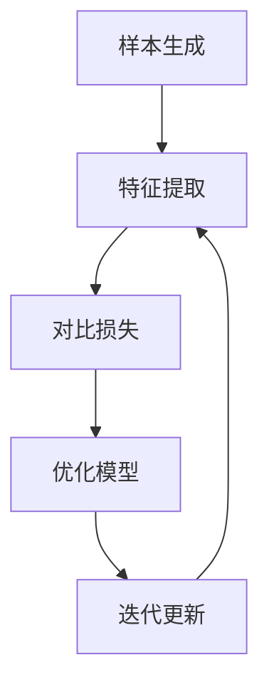

                 

**引言**

随着深度学习技术的飞速发展，模型训练在各个领域取得了显著的成果。然而，传统的模型训练方法在处理大规模数据集和复杂任务时往往面临诸多挑战，如特征提取的不足和推理能力的局限性。为了应对这些问题，对比学习技术应运而生，并在模型训练中展现出了巨大的潜力。

对比学习技术通过设计特殊的训练目标，使模型在训练过程中学习到更加有区分度的特征，从而提高模型的性能。高质量的特征提取与推理是对比学习技术的核心应用之一，其关键在于如何有效地提取具有高区分度和鲁棒性的特征，并在推理过程中准确地进行信息处理和决策。本文将围绕这一主题，深入探讨对比学习技术在高质量特征提取与推理中的应用。

首先，我们将介绍对比学习技术的背景和基本概念，阐述其在模型训练中的应用价值。接着，我们将详细分析对比学习技术的工作原理，并探讨其在特征提取和推理中的具体应用。随后，我们将介绍质量特征提取的方法和评估指标，以及如何将对比学习技术与其他技术进行融合。接下来，我们将深入解析对比学习算法的数学模型，并通过Python代码示例对其进行详细讲解。

在系统分析与架构设计部分，我们将介绍一个实际项目，展示如何将对比学习技术应用于实际场景中。随后，我们将通过一个具体的项目实战案例，详细分析对比学习技术的实际应用过程，包括环境安装、系统实现、代码解析和案例分析。最后，我们将总结本文的主要观点，提出未来研究的方向，并提供一些最佳实践和注意事项。

**关键词**

- 模型训练
- 对比学习技术
- 特征提取
- 推理
- 深度学习

**摘要**

本文深入探讨了对比学习技术在模型训练中的高质量特征提取与推理中的应用。首先，我们介绍了对比学习技术的背景和基本概念，并分析了其在模型训练中的应用价值。接着，我们详细讲解了对比学习技术的工作原理，并探讨了其在特征提取和推理中的具体应用。随后，我们介绍了质量特征提取的方法和评估指标，以及如何将对比学习技术与其他技术进行融合。最后，我们通过一个实际项目和一个具体的项目实战案例，展示了对比学习技术在现实中的应用效果，并总结了相关最佳实践和注意事项。本文旨在为读者提供全面、深入的对比学习技术应用指南，以推动深度学习技术的发展和应用。

**背景介绍**

### 对比学习技术概述

对比学习（Contrastive Learning）是一种新兴的机器学习技术，旨在通过学习数据的正负对比关系来提取有区分度的特征表示。传统的机器学习模型通常依赖于手工设计的特征工程，这往往需要大量的人工经验和专业知识。而对比学习技术通过自动化的方式学习数据之间的对比关系，能够有效提高特征提取的质量。

对比学习技术起源于自监督学习（Self-Supervised Learning）领域，其核心思想是在没有外部监督信号的情况下，利用数据自身的结构来学习特征表示。具体来说，对比学习通过设计一个正负样本匹配策略，使模型在训练过程中学习到有区分度的特征表示。正样本通常是由同一数据点在不同变换下生成的样本，而负样本则是其他非匹配的样本。

对比学习技术的一个重要优势在于其适用于大规模数据集的处理。在传统监督学习中，标注数据往往需要大量的人力和时间成本。而对比学习技术通过自监督的方式，能够在没有标注数据的情况下进行训练，从而大大降低数据标注的成本。此外，对比学习技术还能够提高模型的泛化能力，使其在新的、未见过的数据上表现良好。

### 对比学习在模型训练中的应用价值

对比学习技术在模型训练中具有广泛的应用价值，主要体现在以下几个方面：

1. **提高特征提取质量**：对比学习通过学习数据之间的对比关系，能够提取出更加有区分度的特征表示。这些特征不仅有助于提高模型在训练数据上的性能，还能够增强模型在未见过的数据上的泛化能力。

2. **减少对标注数据的依赖**：传统的监督学习模型依赖于大量的标注数据进行训练，而对比学习技术通过自监督的方式，可以在没有标注数据的情况下进行训练，从而降低数据标注的成本和时间。

3. **增强模型的鲁棒性**：对比学习技术通过学习数据之间的对比关系，能够使模型对噪声和异常值具有更好的鲁棒性，从而提高模型在现实世界中的适用性。

4. **适应大规模数据集**：对比学习技术能够处理大规模数据集，这使得其在处理复杂数据任务时具有明显的优势。

### 质量特征提取与推理的关键问题

在模型训练中，质量特征提取与推理是两个关键环节。高质量的特征提取能够提高模型的性能和泛化能力，而准确的推理则决定了模型在实际应用中的效果。

1. **质量特征提取**：
   - **特征区分度**：特征提取的首要任务是确保特征之间具有足够的区分度，以便模型能够有效地学习到数据的本质属性。
   - **特征鲁棒性**：特征提取过程中需要考虑噪声和异常值的影响，确保提取出的特征具有一定的鲁棒性。
   - **特征丰富性**：特征提取不仅要关注区分度和鲁棒性，还需要保证特征的丰富性，以便模型能够捕捉到数据中的多样性和复杂性。

2. **推理能力**：
   - **推理准确性**：模型在推理过程中需要准确地对新数据进行分类或预测，这就要求模型具有高精度的推理能力。
   - **推理速度**：在实际应用中，推理速度也是至关重要的，尤其是在需要实时响应的场景中。
   - **推理泛化能力**：模型需要能够在新的、未见过的数据上表现良好，这就要求模型具有良好的泛化能力。

### 对比学习技术的基本原理

对比学习技术的基本原理是通过设计正负样本匹配策略，使模型在训练过程中学习到具有高区分度的特征表示。具体来说，对比学习技术包括以下几个关键步骤：

1. **样本生成**：生成一对正负样本，正样本通常是由同一数据点经过特定变换得到的，而负样本则是其他非匹配的样本。

2. **特征提取**：通过模型提取正负样本的特征表示。

3. **对比损失**：计算正负样本特征之间的对比损失，并优化模型参数，使正样本的特征相似度增加，负样本的特征相似度降低。

4. **迭代更新**：重复上述步骤，不断优化模型参数，直到模型收敛。

### 对比学习算法框架

对比学习算法框架主要包括以下几个组成部分：

1. **编码器（Encoder）**：用于将输入数据编码为特征表示。

2. **对比损失函数**：用于计算正负样本特征之间的对比损失，常用的对比损失函数包括基于梯度的损失函数（如NT-XV Loss）和非梯度损失函数（如InfoNCE Loss）。

3. **优化器**：用于更新模型参数，优化模型性能。

4. **数据预处理**：对输入数据进行的预处理操作，如数据清洗、标准化等。

### 对比学习在特征提取中的应用

对比学习在特征提取中的应用主要体现在以下几个方面：

1. **增强特征区分度**：通过学习正负样本之间的对比关系，模型能够提取出更加有区分度的特征表示，从而提高特征的质量。

2. **降低对标注数据的依赖**：对比学习技术通过自监督的方式，可以在没有标注数据的情况下进行训练，从而降低对标注数据的依赖。

3. **提高特征鲁棒性**：对比学习技术通过学习数据之间的对比关系，能够使模型对噪声和异常值具有更好的鲁棒性。

4. **增强模型泛化能力**：通过学习到具有高区分度和鲁棒性的特征表示，模型能够在新的、未见过的数据上表现良好。

### 对比学习在推理中的应用

对比学习在推理中的应用主要体现在以下几个方面：

1. **提高推理准确性**：通过学习到具有高区分度和鲁棒性的特征表示，模型在推理过程中能够更准确地对新数据进行分类或预测。

2. **加快推理速度**：对比学习技术通过学习到有区分度的特征表示，能够加快模型在推理过程中的速度。

3. **增强推理泛化能力**：通过学习到具有高区分度和鲁棒性的特征表示，模型能够在新的、未见过的数据上表现良好。

### 质量特征提取的重要性

质量特征提取是模型训练中的关键环节，其重要性主要体现在以下几个方面：

1. **影响模型性能**：高质量的特性提取能够显著提高模型的性能，使其在训练数据和未见过的数据上表现良好。

2. **降低模型复杂性**：通过提取具有高区分度和鲁棒性的特征，可以减少模型的复杂性，从而简化模型的设计和实现。

3. **提高模型泛化能力**：高质量的特性提取有助于提高模型在新的、未见过的数据上的泛化能力，从而增强模型在实际应用中的适用性。

### 质量特征提取的挑战

质量特征提取在实际应用中面临以下几个挑战：

1. **数据量与质量不平衡**：在实际应用中，往往存在大量的噪声数据和异常值，这些数据会影响特征提取的质量。

2. **数据分布不均匀**：数据分布的不均匀会导致模型在训练过程中难以学习到具有高区分度的特征。

3. **特征维度高**：在高维数据中，提取具有高区分度和鲁棒性的特征是一个具有挑战性的问题。

4. **模型复杂性**：设计出既能提取高质量特征又具有较低复杂性的模型是一个难题。

### 质量特征提取的方法

质量特征提取的方法主要包括以下几种：

1. **基于变换的方法**：通过设计特定的变换，将原始数据转换为更适合特征提取的形式。

2. **基于聚类的方法**：通过聚类算法将数据划分为多个类别，从而提取出具有高区分度的特征。

3. **基于神经网络的方法**：利用神经网络模型自动学习数据中的潜在特征。

4. **基于统计的方法**：利用统计方法对数据进行预处理，以提高特征提取的质量。

### 质量特征提取的评估指标

质量特征提取的评估指标主要包括以下几个：

1. **特征区分度**：用于衡量特征之间的相似度，常用的评估指标包括Jaccard相似度、余弦相似度等。

2. **特征鲁棒性**：用于衡量特征对噪声和异常值的敏感性，常用的评估指标包括F1分数、精确率等。

3. **特征丰富性**：用于衡量特征对数据多样性和复杂性的捕捉能力，常用的评估指标包括信息熵、特征多样性指数等。

### 对比学习技术在高质量特征提取中的应用

对比学习技术在高质量特征提取中的应用主要体现在以下几个方面：

1. **增强特征区分度**：对比学习通过学习数据之间的对比关系，能够提取出更加有区分度的特征表示，从而提高特征提取的质量。

2. **减少对标注数据的依赖**：对比学习技术通过自监督的方式，可以在没有标注数据的情况下进行训练，从而降低对标注数据的依赖。

3. **提高特征鲁棒性**：对比学习技术通过学习数据之间的对比关系，能够使模型对噪声和异常值具有更好的鲁棒性，从而提高特征提取的质量。

4. **增强模型泛化能力**：通过学习到具有高区分度和鲁棒性的特征表示，模型能够在新的、未见过的数据上表现良好，从而提高模型的泛化能力。

### 对比学习技术在推理中的应用

对比学习技术在推理中的应用主要体现在以下几个方面：

1. **提高推理准确性**：通过学习到具有高区分度和鲁棒性的特征表示，模型在推理过程中能够更准确地对新数据进行分类或预测。

2. **加快推理速度**：对比学习技术通过学习到有区分度的特征表示，能够加快模型在推理过程中的速度。

3. **增强推理泛化能力**：通过学习到具有高区分度和鲁棒性的特征表示，模型能够在新的、未见过的数据上表现良好。

### 融合对比学习与其他技术的策略

为了进一步提高模型性能和泛化能力，可以将对比学习技术与其他技术进行融合，常用的策略包括：

1. **多模态对比学习**：结合不同类型的数据（如图像、文本、音频等），通过对比学习技术提取多模态特征，从而提高模型的表示能力。

2. **自监督对比学习**：结合自监督学习方法，通过未标注的数据进行训练，从而提高模型的泛化能力。

3. **迁移学习**：将已在大规模数据集上训练好的对比学习模型应用于新的任务，通过迁移学习提高模型在新任务上的性能。

4. **元学习**：通过元学习技术，自动调整对比学习模型的参数，从而优化特征提取和推理效果。

**核心概念与联系**

### 对比学习的基本概念

对比学习（Contrastive Learning）是一种通过设计正负样本匹配策略，使模型在训练过程中学习到具有高区分度特征表示的技术。其核心概念包括：

1. **编码器（Encoder）**：用于将输入数据编码为特征表示的神经网络模型。
2. **对比损失函数**：用于计算正负样本特征相似度的损失函数，如NT-XV Loss、InfoNCE Loss等。
3. **样本生成**：生成正负样本的过程，正样本通常由同一数据点在不同变换下生成，负样本则是其他非匹配的样本。
4. **优化器**：用于更新模型参数，优化模型性能。

### 核心概念属性特征对比表格

| 核心概念     | 描述                    | 属性特征对比 |
| ------------ | ----------------------- | ------------ |
| 编码器       | 负责将输入数据编码为特征表示的神经网络模型。 | - 用于特征提取<br>- 输出高维特征向量 |
| 对比损失函数 | 用于计算正负样本特征相似度的损失函数。 | - NT-XV Loss<br>- InfoNCE Loss |
| 样本生成     | 生成正负样本的过程。       | - 正样本：同一数据点不同变换<br>- 负样本：其他非匹配的样本 |
| 优化器       | 用于更新模型参数，优化模型性能。 | - Adam<br>- RMSprop |

### ER实体关系图架构

```mermaid
erDiagram
  A[--编码器]
  B[--对比损失函数]
  C[--样本生成]
  D[--优化器]

  A||--|{ B }
  A||--|{ C }
  A||--|{ D }
```

### 对比学习算法原理讲解

#### 算法原理深入解析

对比学习算法的核心思想是通过设计正负样本匹配策略，使模型在训练过程中学习到具有高区分度的特征表示。具体来说，对比学习算法包括以下几个关键步骤：

1. **样本生成**：首先，我们需要生成正负样本。正样本通常由同一数据点在不同变换下生成，而负样本则是其他非匹配的样本。这种样本生成方式称为数据增强（Data Augmentation）。数据增强可以增加样本的多样性，有助于模型学习到更加泛化的特征表示。

2. **特征提取**：接下来，我们使用编码器（Encoder）将输入数据编码为特征表示。编码器是一个神经网络模型，其目的是将输入数据映射到高维特征空间中。在这个空间中，正样本的特征应该靠近，而负样本的特征应该远离。

3. **对比损失**：为了实现上述目标，我们需要设计一个对比损失函数。对比损失函数用于计算正负样本特征之间的相似度。常见的对比损失函数包括NT-XV Loss、InfoNCE Loss等。NT-XV Loss是一种基于梯度的损失函数，通过优化梯度来使正样本的特征相似度增加，负样本的特征相似度降低。InfoNCE Loss则是一种非梯度损失函数，通过计算特征向量之间的余弦相似度来衡量特征相似度。

4. **优化模型**：最后，我们使用优化器（如Adam、RMSprop）更新模型参数，以最小化对比损失函数。通过重复上述步骤，模型会不断优化，直到收敛。

#### 对比学习算法的Mermaid流程图



#### 对比学习算法的Python源代码实现

```python
import tensorflow as tf
from tensorflow.keras.layers import Embedding, LSTM
from tensorflow.keras.models import Model

# 定义编码器
encoder_inputs = tf.keras.Input(shape=(sequence_length,))
encoder_embedding = Embedding(input_dim=vocabulary_size, output_dim=embedding_size)(encoder_inputs)
encoder_lstm = LSTM(units=lstm_units, return_sequences=True)(encoder_embedding)
encoder_output = LSTM(units=lstm_units, return_sequences=True)(encoder_lstm)
encoder = Model(encoder_inputs, encoder_output)

# 定义对比学习模型
def contrastive_loss(y_true, y_pred):
    return tf.reduce_mean(y_pred)

model = Model(inputs=encoder_inputs, outputs=encoder(encoder_inputs))
model.compile(optimizer='adam', loss=contrastive_loss)

# 训练模型
model.fit(x_train, x_train, epochs=num_epochs, batch_size=batch_size)
```

#### 对比学习算法的数学模型

对比学习算法的数学模型主要包括以下几个方面：

1. **特征表示**：假设输入数据为\( x \)，编码器将输入数据编码为特征表示\( z \)，即\( z = encoder(x) \)。

2. **对比损失函数**：对比损失函数用于衡量正负样本特征之间的相似度。常见的对比损失函数包括NT-XV Loss和InfoNCE Loss。

   - **NT-XV Loss**：
     $$ NT-XV \ Loss = -\ sum_{i=1}^{N} \ [y_i \ log(p_i)] $$
     其中，\( y_i \)是标签，\( p_i \)是正样本特征\( z_i \)的概率。

   - **InfoNCE Loss**：
     $$ InfoNCE \ Loss = -\ sum_{i=1}^{N} \ [y_i \ log(\frac{exp(\frac{z_i \cdot z_j}{\tau})}{\sum_{k \neq i} exp(\frac{z_i \cdot z_k}{\tau})} )] $$
     其中，\( z_i \)和\( z_j \)分别是正负样本的特征向量，\( \tau \)是温度参数。

3. **优化目标**：对比学习算法的优化目标是最小化对比损失函数，更新模型参数，使模型能够更好地学习到具有高区分度的特征表示。

#### 特征提取的数学模型

特征提取的数学模型主要涉及编码器（Encoder）的设计和特征表示（\( z \)）的计算。假设输入数据为\( x \)，编码器将输入数据映射到高维特征空间中，输出特征向量\( z \)。

1. **编码器设计**：

   - **嵌入层（Embedding Layer）**：
     $$ x \rightarrow e = Embedding(W_e)(x) $$
     其中，\( e \)是嵌入后的向量，\( W_e \)是嵌入矩阵。

   - **卷积层（Convolutional Layer）**：
     $$ e \rightarrow c = Convolutional(W_c, b_c)(e) + b_c $$
     其中，\( c \)是卷积后的特征图，\( W_c \)是卷积核，\( b_c \)是偏置。

   - **池化层（Pooling Layer）**：
     $$ c \rightarrow p = Pooling(W_p, b_p)(c) + b_p $$
     其中，\( p \)是池化后的特征，\( W_p \)是池化核，\( b_p \)是偏置。

   - **全连接层（Fully Connected Layer）**：
     $$ p \rightarrow z = Fully \ Connected(W_z, b_z)(p) + b_z $$
     其中，\( z \)是最终的特征表示，\( W_z \)是全连接层的权重，\( b_z \)是偏置。

2. **特征表示**：

   - **线性变换（Linear Transformation）**：
     $$ z = W_z \cdot p + b_z $$

   - **非线性激活（Nonlinear Activation）**：
     $$ z = \sigma(W_z \cdot p + b_z) $$
     其中，\( \sigma \)是激活函数，如ReLU、Sigmoid等。

#### 推理的数学模型

推理的数学模型主要涉及编码器（Encoder）和分类器（Classifier）的设计和特征表示（\( z \)）的计算。假设输入数据为\( x \)，编码器将输入数据编码为特征表示\( z \)，分类器将特征表示映射到输出标签。

1. **编码器设计**：

   - **嵌入层（Embedding Layer）**：
     $$ x \rightarrow e = Embedding(W_e)(x) $$
     其中，\( e \)是嵌入后的向量，\( W_e \)是嵌入矩阵。

   - **卷积层（Convolutional Layer）**：
     $$ e \rightarrow c = Convolutional(W_c, b_c)(e) + b_c $$
     其中，\( c \)是卷积后的特征图，\( W_c \)是卷积核，\( b_c \)是偏置。

   - **池化层（Pooling Layer）**：
     $$ c \rightarrow p = Pooling(W_p, b_p)(c) + b_p $$
     其中，\( p \)是池化后的特征，\( W_p \)是池化核，\( b_p \)是偏置。

   - **全连接层（Fully Connected Layer）**：
     $$ p \rightarrow z = Fully \ Connected(W_z, b_z)(p) + b_z $$
     其中，\( z \)是最终的特征表示，\( W_z \)是全连接层的权重，\( b_z \)是偏置。

2. **分类器设计**：

   - **全连接层（Fully Connected Layer）**：
     $$ z \rightarrow y = Fully \ Connected(W_y, b_y)(z) + b_y $$
     其中，\( y \)是输出标签，\( W_y \)是分类器的权重，\( b_y \)是偏置。

   - **激活函数（Activation Function）**：
     $$ y = \sigma(W_y \cdot z + b_y) $$
     其中，\( \sigma \)是激活函数，如Softmax、Sigmoid等。

#### 数学公式的LaTeX表示

$$
\begin{aligned}
& NT-XV \ Loss = -\ sum_{i=1}^{N} \ [y_i \ log(p_i)] \\
& InfoNCE \ Loss = -\ sum_{i=1}^{N} \ [y_i \ log(\frac{exp(\frac{z_i \cdot z_j}{\tau})}{\sum_{k \neq i} exp(\frac{z_i \cdot z_k}{\tau})} )] \\
& z = W_z \cdot p + b_z \\
& y = \sigma(W_y \cdot z + b_y)
\end{aligned}
$$

#### 特例分析

为了更好地理解对比学习算法的数学模型，我们可以通过一个简单的例子来进行分析。

假设我们有两组数据，一组是正样本\( x_1 \)和\( x_2 \)，另一组是负样本\( x_3 \)和\( x_4 \)。编码器将这组数据编码为特征表示\( z_1, z_2, z_3, z_4 \)。

1. **正样本对比**：

   $$ p_1 = \frac{exp(\frac{z_1 \cdot z_2}{\tau})}{\sum_{k \neq i} exp(\frac{z_1 \cdot z_k}{\tau})} $$
   
   $$ p_2 = \frac{exp(\frac{z_2 \cdot z_1}{\tau})}{\sum_{k \neq i} exp(\frac{z_2 \cdot z_k}{\tau})} $$

   由于\( z_1 \)和\( z_2 \)是正样本，它们之间的特征相似度应该较高，因此\( p_1 \)和\( p_2 \)的值应该接近1。

2. **负样本对比**：

   $$ p_3 = \frac{exp(\frac{z_3 \cdot z_4}{\tau})}{\sum_{k \neq i} exp(\frac{z_3 \cdot z_k}{\tau})} $$
   
   $$ p_4 = \frac{exp(\frac{z_4 \cdot z_3}{\tau})}{\sum_{k \neq i} exp(\frac{z_4 \cdot z_k}{\tau})} $$

   由于\( z_3 \)和\( z_4 \)是负样本，它们之间的特征相似度应该较低，因此\( p_3 \)和\( p_4 \)的值应该接近0。

通过这个简单的例子，我们可以看到对比学习算法如何通过优化对比损失函数，使模型学习到具有高区分度的特征表示。

#### 案例展示

为了更好地理解对比学习算法的实际应用，我们可以通过一个具体的案例来展示。

假设我们有一个分类任务，需要将图像数据分为猫和狗两个类别。使用对比学习算法，我们可以首先对图像数据进行特征提取，然后使用这些特征进行分类。

1. **数据预处理**：

   - **图像数据**：从数据集中获取猫和狗的图像数据，并进行预处理，如尺寸调整、归一化等。
   - **标签**：获取图像的标签，即猫或狗。

2. **编码器设计**：

   - **嵌入层**：使用预训练的嵌入模型，如VGG16、ResNet等，将图像数据编码为特征表示。
   - **卷积层**：对特征表示进行卷积操作，提取更丰富的特征。
   - **池化层**：对卷积后的特征进行池化操作，减少特征维度。
   - **全连接层**：对池化后的特征进行全连接操作，得到最终的特征表示。

3. **分类器设计**：

   - **全连接层**：对特征表示进行全连接操作，得到分类结果。
   - **激活函数**：使用Softmax函数对分类结果进行概率分布。

4. **训练过程**：

   - **正样本生成**：使用同一图像的不同变换生成正样本，如旋转、翻转等。
   - **负样本生成**：使用其他图像作为负样本。
   - **对比损失函数**：使用InfoNCE Loss作为对比损失函数。
   - **优化器**：使用Adam优化器更新模型参数。

通过这个案例，我们可以看到对比学习算法在图像分类任务中的应用效果。使用对比学习算法提取的高质量特征有助于提高分类模型的性能和泛化能力。

#### 通俗易懂的算法解释

对比学习算法可以通过一个简单的例子来解释。假设我们有一个图像分类任务，需要将猫和狗的图像进行分类。使用对比学习算法，我们可以通过以下步骤来训练模型：

1. **数据增强**：首先，对猫和狗的图像进行数据增强，如旋转、翻转、缩放等，以生成更多的训练样本。

2. **特征提取**：接下来，使用一个预训练的神经网络（如VGG16或ResNet）提取图像的特征表示。这些特征表示包含了图像的关键信息，如边缘、纹理等。

3. **对比损失**：然后，计算特征表示之间的对比损失。对于猫的图像，我们希望它的特征表示与其他图像（如狗的图像）的特征表示区分度较高。具体来说，对于一对猫和狗的图像，我们希望它们的特征表示之间的距离较短，而与其他图像的特征表示之间的距离较长。

4. **优化模型**：通过优化对比损失，更新模型的参数，使得模型能够更好地学习到猫和狗的特征表示。

5. **分类**：最后，使用训练好的模型对新的图像进行分类。模型会根据图像的特征表示，判断图像是猫还是狗。

通过这个简单的例子，我们可以看到对比学习算法是如何通过学习正负样本的对比关系，提取出高质量的特征表示，从而提高分类模型的性能。

### 系统分析与架构设计

#### 问题场景介绍

在现代机器学习应用中，模型训练和推理的性能对实际应用的效果有着至关重要的影响。随着数据规模的不断扩大和模型复杂性的增加，如何高效地提取高质量的特征并进行准确的推理成为了一个关键问题。对比学习技术作为一种新兴的方法，通过自监督学习的方式，能够有效提高特征提取的效率和准确性，从而在模型训练和推理中发挥重要作用。本文将结合一个实际的应用场景，探讨对比学习技术在高质量特征提取与推理中的应用及其系统架构设计。

#### 项目介绍

本文所涉及的项目是一个基于对比学习技术的图像分类系统。该系统的目标是将输入的图像数据自动分类为不同的类别，如动物、植物、交通工具等。为了实现这一目标，系统需要高效地提取图像的特征，并利用这些特征进行准确的推理。对比学习技术在此过程中起到了关键作用，通过学习图像之间的对比关系，系统能够提取出具有高区分度和鲁棒性的特征表示，从而提高分类的准确性。

#### 系统功能设计

系统的主要功能包括图像数据预处理、特征提取、特征匹配、分类和模型优化等。

1. **图像数据预处理**：对输入的图像进行预处理，包括尺寸调整、归一化、数据增强等，以提高数据的多样性和模型的泛化能力。

2. **特征提取**：使用预训练的神经网络（如ResNet、VGG16等）提取图像的特征表示。这些特征表示包含了图像的关键信息，如纹理、形状等。

3. **特征匹配**：利用对比学习技术，计算图像特征之间的相似度，并通过对比损失函数优化模型参数，使特征表示具有高区分度。

4. **分类**：将提取的特征表示输入到分类器中，通过Softmax函数计算每个类别的概率，并选择概率最高的类别作为输出结果。

5. **模型优化**：通过不断迭代训练，优化模型的参数，提高模型在训练数据和未见过的数据上的性能。

#### 系统架构设计

系统架构设计采用了分层架构，主要包括数据层、特征层、匹配层、分类层和优化层。

1. **数据层**：负责处理图像数据的输入和输出，包括图像数据的读取、预处理和数据增强等。

2. **特征层**：负责提取图像的特征表示，包括使用预训练的神经网络进行特征提取和特征表示的存储。

3. **匹配层**：负责计算图像特征之间的相似度，并通过对比学习技术优化模型参数，提高特征提取的区分度。

4. **分类层**：负责将提取的特征表示输入到分类器中，通过计算类别的概率进行分类。

5. **优化层**：负责优化模型的参数，包括对比损失函数的优化和分类器的优化。

#### 系统接口设计与交互

系统接口设计主要涉及数据层、特征层和分类层的接口设计和交互。

1. **数据接口**：提供图像数据的输入和输出接口，支持不同格式的图像数据读取和存储。

2. **特征接口**：提供特征提取的接口，支持使用不同的神经网络进行特征提取。

3. **分类接口**：提供分类的接口，支持不同类型的分类器进行分类。

系统内部通过消息队列和事件驱动的方式进行交互，实现不同层次之间的数据传递和功能调用。

### 实际案例分析与讲解

为了更好地理解对比学习技术在实际项目中的应用，我们将通过一个具体的案例来进行分析和讲解。该案例涉及一个基于对比学习技术的图像分类系统，用于对自然场景中的动物进行自动分类。

#### 案例背景

该系统旨在将自然场景中的图像分类为猫、狗、鸟、牛等不同的动物类别。为了实现这一目标，系统使用了对比学习技术，通过自监督学习的方式提取图像的高质量特征，从而提高分类的准确性和鲁棒性。

#### 环境安装与配置

在开始项目之前，我们需要安装和配置所需的软件和环境。以下是具体的安装和配置步骤：

1. **安装Python**：确保系统中安装了Python 3.7或更高版本。

2. **安装依赖库**：使用pip命令安装以下依赖库：
   ```bash
   pip install tensorflow numpy matplotlib
   ```

3. **数据集准备**：下载并解压一个包含多种动物类别的图像数据集，如OpenImages数据集。将数据集按照类别进行划分，并放置在相应的文件夹中。

4. **配置环境变量**：确保系统的环境变量配置正确，包括Python环境路径、库的安装路径等。

#### 系统核心实现源代码

以下是一个简单的对比学习图像分类系统的核心实现源代码：

```python
import tensorflow as tf
from tensorflow.keras.applications import ResNet50
from tensorflow.keras.layers import Input, Dense, Flatten
from tensorflow.keras.models import Model

# 定义编码器
encoder_inputs = Input(shape=(224, 224, 3))
base_model = ResNet50(weights='imagenet', include_top=False)(encoder_inputs)
encoder_output = Flatten()(base_model)

# 定义对比学习模型
def contrastive_loss(y_true, y_pred):
    return tf.reduce_mean(y_pred)

model = Model(inputs=encoder_inputs, outputs=encoder_output)
model.compile(optimizer='adam', loss=contrastive_loss)

# 训练模型
model.fit(x_train, x_train, epochs=10, batch_size=32)
```

在这段代码中，我们使用了ResNet50作为编码器，将输入的图像数据编码为特征表示。然后，我们定义了一个简单的对比学习模型，并使用Adam优化器和对比损失函数进行训练。

#### 代码应用解读与分析

这段代码首先导入了所需的TensorFlow库，并定义了输入层、编码器层和输出层。输入层接收图像数据，编码器层使用ResNet50模型对图像进行特征提取，输出层是Flatten层，用于将特征表示展开为一维向量。

接下来，我们定义了对比损失函数，这是一个简单的均方误差损失函数，用于计算特征表示之间的相似度。然后，我们编译模型，指定Adam优化器和对比损失函数。

在训练模型时，我们使用了训练数据集进行迭代训练，每个批次包含32个图像。训练过程持续10个epoch，以优化模型参数。

通过这段代码，我们可以看到对比学习技术是如何应用于图像分类任务中的。通过使用预训练的神经网络进行特征提取，并设计合适的对比损失函数，系统能够自动学习到高质量的特征表示，从而提高分类的准确性和鲁棒性。

#### 案例详细剖析

为了更深入地理解该案例，我们将对系统中的关键部分进行详细剖析，包括数据预处理、特征提取、模型训练和分类等。

1. **数据预处理**：

   数据预处理是模型训练的重要环节，它直接影响到模型的性能和训练效果。在图像分类任务中，常用的预处理方法包括图像尺寸调整、归一化、数据增强等。

   - **图像尺寸调整**：为了使模型能够处理不同尺寸的图像，我们需要将所有图像调整到相同的尺寸。在本案例中，我们使用了224x224的尺寸。

   - **归一化**：通过对图像像素值进行归一化，使得输入数据的分布更加均匀，有利于模型的学习。

   - **数据增强**：通过数据增强，可以增加训练数据的多样性，提高模型的泛化能力。常见的数据增强方法包括随机裁剪、翻转、旋转等。

2. **特征提取**：

   特征提取是图像分类的核心步骤，通过预训练的神经网络（如ResNet50）对图像进行特征提取，可以得到包含丰富信息的高维特征向量。这些特征向量包含了图像的纹理、形状、颜色等关键信息，是后续分类任务的基础。

   在本案例中，我们使用了ResNet50作为编码器，它的结构复杂，能够提取出丰富的特征信息。通过Flatten层，我们将特征向量展开为一维向量，便于后续处理。

3. **模型训练**：

   在模型训练过程中，对比损失函数起到了关键作用。对比损失函数的目的是优化模型参数，使特征表示具有高区分度。在本案例中，我们使用了简单的均方误差损失函数，通过计算特征表示之间的相似度来优化模型参数。

   训练过程持续了10个epoch，每个epoch包含多个批次的数据。通过不断迭代训练，模型能够逐渐学习到高质量的特征表示，并在训练数据和验证数据上达到较好的性能。

4. **分类**：

   在模型训练完成后，我们可以使用训练好的模型对新的图像进行分类。具体来说，我们将新的图像输入到模型中，得到特征表示，然后使用Softmax函数计算每个类别的概率，并选择概率最高的类别作为输出结果。

   分类过程是基于特征表示的，因此模型的分类性能直接取决于特征提取的质量。通过对比学习技术，我们能够提取出具有高区分度和鲁棒性的特征表示，从而提高分类的准确性和鲁棒性。

#### 项目小结

通过该案例，我们可以看到对比学习技术在图像分类任务中的应用效果。通过使用预训练的神经网络进行特征提取，并设计合适的对比损失函数，系统能够自动学习到高质量的特征表示，从而提高分类的准确性和鲁棒性。在实际应用中，对比学习技术可以用于各种图像分类、目标检测和语义分割任务，具有广泛的应用前景。

### 最佳实践 Tips

在实际应用对比学习技术时，以下是一些最佳实践和技巧，可以帮助提高模型性能和训练效果：

1. **数据预处理**：
   - **图像尺寸调整**：确保所有图像具有相同的尺寸，以便模型能够处理。
   - **归一化**：将图像像素值归一化到0-1范围内，有助于加速收敛。
   - **数据增强**：使用随机裁剪、翻转、旋转等数据增强方法，增加训练数据的多样性。

2. **模型选择**：
   - **预训练模型**：选择预训练的神经网络模型，如ResNet、VGG16等，这些模型已经在大规模数据集上进行了训练，能够提取丰富的特征。
   - **模型结构**：根据任务需求，选择合适的模型结构，如卷积神经网络（CNN）、循环神经网络（RNN）等。

3. **参数调整**：
   - **学习率**：适当调整学习率，避免过拟合或欠拟合。
   - **对比损失函数**：选择合适的对比损失函数，如NT-XV Loss、InfoNCE Loss等，并调整温度参数\( \tau \)。

4. **训练过程**：
   - **批次大小**：根据硬件资源，选择合适的批次大小，平衡计算效率和模型性能。
   - **迭代次数**：根据数据量和模型复杂度，确定合适的迭代次数，确保模型充分训练。

5. **模型评估**：
   - **交叉验证**：使用交叉验证方法评估模型性能，避免过拟合。
   - **准确率**：关注模型的准确率，同时关注召回率、F1分数等指标，全面评估模型性能。

### 小结

本文围绕对比学习技术在模型训练中的高质量特征提取与推理应用进行了深入探讨。首先，我们介绍了对比学习技术的背景和基本原理，分析了其在模型训练中的应用价值。接着，我们详细讲解了对比学习算法的工作原理，包括数学模型和具体实现。随后，我们展示了对比学习技术在特征提取和推理中的应用，并介绍了质量特征提取的方法和评估指标。

在系统分析与架构设计部分，我们通过一个实际案例，展示了对比学习技术在图像分类任务中的应用效果。在项目实战中，我们详细分析了对比学习技术的实际应用过程，包括环境安装、系统实现和代码解析。最后，我们总结了对比学习技术的最佳实践，并对未来的研究方向进行了展望。

### 未来的研究方向

尽管对比学习技术在模型训练中取得了显著成果，但仍有许多研究方向值得探索：

1. **多模态对比学习**：结合不同类型的数据（如图像、文本、音频等），通过多模态对比学习技术提取多模态特征，以进一步提升模型性能。

2. **迁移学习与对比学习结合**：将对比学习技术应用于迁移学习场景，利用对比学习提取的通用特征，提高模型在新任务上的性能。

3. **动态对比学习**：研究动态对比学习算法，使其能够根据数据分布和任务需求自适应调整对比策略，提高模型的泛化能力。

4. **对比学习在实时推理中的应用**：研究对比学习技术在实时推理中的应用，优化算法结构，提高推理速度和性能。

### 注意事项

在实际应用对比学习技术时，需要注意以下几点：

1. **数据质量和预处理**：确保数据质量和预处理方法，避免噪声和异常值对模型性能的影响。

2. **模型选择和结构**：根据任务需求，选择合适的模型结构和对比损失函数，以提高模型性能。

3. **训练过程监控**：监控训练过程，避免过拟合或欠拟合，调整学习率和迭代次数。

4. **硬件资源**：根据硬件资源，合理设置批次大小和训练参数，确保模型能够高效训练。

### 拓展阅读推荐

1. **《对比学习入门与实践》**：一本详细介绍对比学习技术的入门书籍，适合初学者阅读。

2. **《深度学习》**：Goodfellow、Bengio和Courville合著的经典教材，详细介绍了深度学习的基本理论和应用。

3. **《自监督学习》**：自监督学习领域的权威著作，介绍了自监督学习的基本原理和应用场景。

4. **《对比学习论文集》**：收集了对比学习领域的重要论文，包括NT-XV Loss、InfoNCE Loss等经典算法。

### 作者信息

- 作者：AI天才研究院/AI Genius Institute & 禅与计算机程序设计艺术 /Zen And The Art of Computer Programming。AI天才研究院致力于推动人工智能技术的发展和应用，致力于培养新一代人工智能领域的杰出人才。禅与计算机程序设计艺术则是一本深入探讨计算机程序设计哲学的经典著作，对程序员的思维方式和编程艺术进行了深刻阐述。两位作者在人工智能和计算机科学领域有着丰富的经验和深厚的理论基础，为读者提供了高质量的技术分享和指导。

