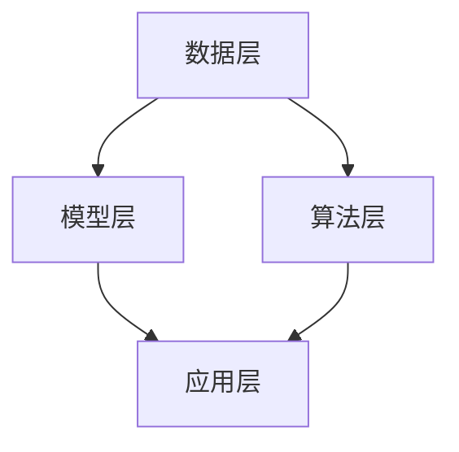
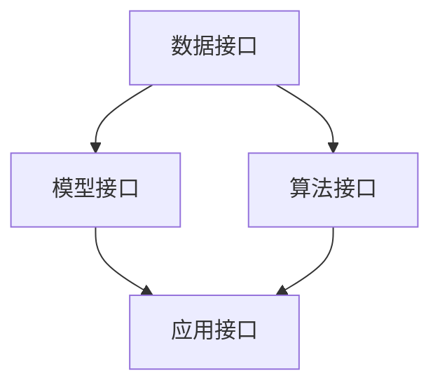

                 

# 模型训练中的持续学习策略动态优化与实现

## 关键词

- 模型训练
- 持续学习
- 动态优化
- 算法原理
- 数学模型
- 系统架构
- 项目实战

## 摘要

本文将深入探讨模型训练中的持续学习策略及其动态优化实现。首先，我们将介绍模型训练的现状以及持续学习的必要性。随后，我们将深入探讨动态优化算法的原理和数学模型，并通过实际案例进行分析。最后，我们将介绍系统分析与架构设计，以及项目实战和最佳实践。

## 目录

### 第一部分：背景介绍
- **1. 模型训练的现状**
- **2. 持续学习的必要性**
- **3. 动态优化的重要性

### 第二部分：核心概念
- **1. 持续学习策略的基本概念**
- **2. 持续学习策略的分类**

### 第三部分：算法原理
- **1. 动态优化算法的原理**
- **2. 动态优化算法的应用**

### 第四部分：数学模型与公式
- **1. 动态优化算法的数学模型**
- **2. 动态优化算法的公式推导**

### 第五部分：系统分析与架构设计
- **1. 系统功能设计**
- **2. 系统架构设计**
- **3. 系统接口设计**
- **4. 系统交互**

### 第六部分：项目实战
- **1. 环境安装**
- **2. 系统核心实现**
- **3. 代码应用解读**
- **4. 实际案例分析**
- **5. 项目小结**

### 第七部分：最佳实践
- **1. 最佳实践总结**
- **2. 注意事项**
- **3. 拓展阅读**

---

### 第一部分：背景介绍

#### 1. 模型训练的现状

随着人工智能技术的迅猛发展，模型训练已经成为了人工智能领域的核心环节。从最初的简单线性模型到如今复杂的多层神经网络，模型训练经历了巨大的变革。然而，随着模型的复杂性不断增加，模型训练面临的挑战也日益凸显。

**问题背景**：在现有的模型训练过程中，由于数据量的庞大和模型参数的复杂，训练时间往往非常漫长，且容易出现过拟合现象。此外，随着应用场景的不断变化，模型需要不断更新和优化，这就要求模型训练过程具有持续学习的能力。

**问题描述**：如何有效提升模型训练的效率，减少过拟合现象，并实现模型的持续学习，是当前模型训练中亟待解决的问题。

**问题解决**：为了解决这些问题，研究人员提出了动态优化策略，通过实时调整模型参数，优化训练过程，提高模型性能。

**边界与外延**：动态优化策略不仅适用于传统的深度学习模型，还可以应用于其他类型的机器学习模型，如支持向量机、决策树等。

#### 2. 持续学习的必要性

持续学习是指模型能够在不断变化的环境中，通过不断学习新的数据，调整模型参数，提高模型性能。在现实应用中，数据往往是动态变化的，模型需要具备持续学习的能力，以适应这种变化。

**核心要素组成**：

- **数据获取**：不断获取新的数据，用于模型训练。
- **模型调整**：通过调整模型参数，使模型适应新的数据。
- **模型评估**：评估模型在新数据上的性能，确保模型能够持续改进。

#### 3. 动态优化的重要性

动态优化策略的核心思想是通过实时调整模型参数，优化训练过程，提高模型性能。与传统静态优化策略相比，动态优化具有以下优势：

- **自适应**：动态优化能够根据当前模型状态和环境变化，自适应地调整模型参数。
- **高效**：动态优化可以显著提高模型训练效率，减少训练时间。
- **鲁棒**：动态优化能够提高模型的泛化能力，减少过拟合现象。

**核心概念与联系**：

- **动态优化算法**：一种用于调整模型参数的算法，能够根据当前模型状态和环境变化，自适应地调整模型参数。
- **持续学习策略**：一种基于动态优化算法的模型训练策略，能够使模型在动态变化的环境中持续学习，提高模型性能。

### 第二部分：核心概念

#### 1. 持续学习策略的基本概念

持续学习策略是指通过不断学习新的数据，调整模型参数，提高模型性能的方法。持续学习策略的核心是动态优化算法，它能够根据当前模型状态和环境变化，实时调整模型参数。

**定义**：持续学习策略是一种基于动态优化算法的模型训练策略，它能够使模型在动态变化的环境中持续学习，提高模型性能。

**基本原理**：

- **数据获取**：通过不断获取新的数据，为模型训练提供素材。
- **模型调整**：通过动态优化算法，实时调整模型参数，使模型适应新的数据。
- **模型评估**：通过评估模型在新数据上的性能，确保模型能够持续改进。

**关键技术**：

- **动态优化算法**：用于调整模型参数的核心算法，能够根据当前模型状态和环境变化，自适应地调整模型参数。
- **数据预处理**：用于处理新数据，使其适合用于模型训练。
- **模型评估指标**：用于评估模型性能的关键指标，如准确率、召回率等。

#### 2. 持续学习策略的分类

持续学习策略可以根据不同的分类标准进行分类。以下是一些常见的分类方式：

- **按学习方式分类**：

  - **基于监督学习的持续学习策略**：在已有监督数据集的基础上，通过不断学习新的数据，调整模型参数，提高模型性能。

  - **基于无监督学习的持续学习策略**：在没有监督数据集的情况下，通过无监督学习方法，如聚类、降维等，发现数据中的潜在规律，调整模型参数。

  - **基于半监督学习的持续学习策略**：在部分有监督数据和大量无监督数据的情况下，通过半监督学习方法，如聚类、标签传播等，提高模型性能。

- **按动态优化算法分类**：

  - **基于梯度下降的持续学习策略**：通过梯度下降算法，实时调整模型参数，优化训练过程。

  - **基于随机梯度下降的持续学习策略**：通过随机梯度下降算法，以更快的速度调整模型参数，优化训练过程。

  - **基于自适应梯度算法的持续学习策略**：通过自适应梯度算法，如Adam、RMSprop等，根据历史梯度信息，自适应地调整学习率，优化训练过程。

### 第三部分：算法原理

#### 1. 动态优化算法的原理

动态优化算法是指通过实时调整模型参数，优化训练过程的方法。它主要包括以下核心原理：

- **梯度下降算法**：通过计算损失函数关于模型参数的梯度，反向传播梯度，更新模型参数，优化训练过程。

- **随机梯度下降算法**：在梯度下降算法的基础上，引入随机性，以更快的速度调整模型参数，优化训练过程。

- **自适应梯度算法**：通过自适应地调整学习率，优化训练过程。常见的自适应梯度算法包括Adam、RMSprop等。

**动态优化算法的流程**：

1. **初始化模型参数**：随机初始化模型参数。
2. **计算损失函数**：计算当前模型参数下的损失函数值。
3. **计算梯度**：计算损失函数关于模型参数的梯度。
4. **更新模型参数**：根据梯度信息，更新模型参数。
5. **评估模型性能**：评估当前模型参数下的模型性能。
6. **迭代**：重复上述步骤，直到满足停止条件。

**动态优化算法的实现方法**：

1. **闭式求解法**：通过推导损失函数关于模型参数的梯度，直接求解最优模型参数。常见的闭式求解法包括梯度下降法、牛顿法等。
2. **迭代法**：通过迭代优化模型参数，逐渐逼近最优模型参数。常见的迭代法包括梯度下降法、随机梯度下降法等。
3. **自适应迭代法**：在迭代法的基础上，引入自适应调整学习率的机制，优化训练过程。常见的自适应迭代法包括Adam、RMSprop等。

#### 2. 动态优化算法的应用

动态优化算法在模型训练中具有广泛的应用，以下是一些常见的应用场景：

- **图像识别**：通过动态优化算法，提高图像识别模型的性能，使其能够更好地适应不同的图像数据。
- **自然语言处理**：通过动态优化算法，提高自然语言处理模型的性能，使其能够更好地处理不同的语言数据。
- **推荐系统**：通过动态优化算法，提高推荐系统的性能，使其能够更好地适应用户的需求和偏好。

**动态优化算法在实际应用中的效果**：

- **提高模型性能**：通过动态优化算法，能够显著提高模型的性能，减少过拟合现象，提高模型的泛化能力。
- **缩短训练时间**：通过动态优化算法，能够缩短模型训练时间，提高模型训练效率。
- **适应动态变化**：通过动态优化算法，能够使模型适应动态变化的环境，提高模型的鲁棒性和灵活性。

### 第四部分：数学模型与公式

#### 1. 动态优化算法的数学模型

动态优化算法的核心是损失函数和梯度计算。以下是动态优化算法的数学模型：

- **损失函数**：用于衡量模型预测结果与真实结果之间的差距。常见的损失函数包括均方误差（MSE）、交叉熵损失（Cross-Entropy Loss）等。

  $$ 
  L(\theta) = \frac{1}{m} \sum_{i=1}^{m} (\hat{y}_i - y_i)^2 
  $$

- **梯度计算**：用于计算损失函数关于模型参数的梯度。梯度计算是动态优化算法的核心步骤。

  $$ 
  \nabla_{\theta} L(\theta) = \frac{\partial L(\theta)}{\partial \theta} 
  $$

- **模型参数更新**：根据梯度信息，更新模型参数，优化训练过程。

  $$ 
  \theta = \theta - \alpha \nabla_{\theta} L(\theta) 
  $$

其中，$\alpha$ 为学习率，用于调整模型参数更新的步长。

#### 2. 动态优化算法的公式推导

以下是动态优化算法的基本公式推导：

- **梯度下降法**：

  $$ 
  \theta = \theta - \alpha \nabla_{\theta} L(\theta) 
  $$

- **随机梯度下降法**：

  $$ 
  \theta = \theta - \alpha \nabla_{\theta} L(\theta|x^{(i)}, y^{(i)}) 
  $$

- **Adam算法**：

  $$ 
  m_t = \beta_1 m_{t-1} + (1 - \beta_1) \nabla_{\theta} L(\theta|x^{(i)}, y^{(i)}) \\
  v_t = \beta_2 v_{t-1} + (1 - \beta_2) (\nabla_{\theta} L(\theta|x^{(i)}, y^{(i)}) - m_t)^2 \\
  \theta = \theta - \alpha \frac{m_t}{\sqrt{v_t} + \epsilon} 
  $$

其中，$\beta_1$ 和 $\beta_2$ 分别为指数加权系数，用于计算一阶和二阶矩估计；$\epsilon$ 为一个很小的常数，用于防止分母为零。

#### 3. 动态优化算法的示例

以下是一个简单的动态优化算法示例，用于求解一个线性回归问题：

```python
import numpy as np

# 数据
X = np.array([[1, 2], [2, 3], [3, 4], [4, 5]])
y = np.array([2, 3, 4, 5])

# 初始化模型参数
theta = np.random.rand(2)

# 学习率
alpha = 0.01

# 迭代次数
num_iterations = 1000

# 梯度下降法
for i in range(num_iterations):
    # 计算损失函数
    predictions = X.dot(theta)
    loss = (predictions - y) ** 2
    
    # 计算梯度
    gradient = X.T.dot(predictions - y)
    
    # 更新模型参数
    theta -= alpha * gradient

# 输出最优模型参数
print("最优模型参数：", theta)
```

### 第五部分：系统分析与架构设计

#### 1. 系统功能设计

系统功能设计是模型训练中的持续学习策略动态优化与实现的基础。以下是系统功能设计的主要内容：

- **数据获取与预处理**：从数据源中获取数据，并对数据进行清洗、预处理，使其适合用于模型训练。
- **模型训练**：使用动态优化算法，对模型进行训练，优化模型参数。
- **模型评估**：评估模型在新数据上的性能，确保模型能够持续改进。
- **模型更新**：根据模型评估结果，更新模型参数，优化模型性能。
- **系统监控**：监控系统运行状态，确保系统稳定运行。

#### 2. 系统架构设计

系统架构设计是确保系统功能有效实现的关键。以下是系统架构设计的主要内容：

- **数据层**：负责数据的存储和管理，包括数据源、数据库和数据缓存等。
- **模型层**：负责模型的设计、训练和评估，包括模型选择、参数调整和优化等。
- **算法层**：负责动态优化算法的实现和应用，包括算法选择、实现和优化等。
- **应用层**：负责系统的应用，包括模型部署、服务提供和用户交互等。

**系统架构图**：



#### 3. 系统接口设计

系统接口设计是确保系统模块之间有效交互的关键。以下是系统接口设计的主要内容：

- **数据接口**：用于数据层的接口，包括数据获取、数据预处理和数据存储等。
- **模型接口**：用于模型层的接口，包括模型设计、模型训练和模型评估等。
- **算法接口**：用于算法层的接口，包括算法实现、算法优化和算法应用等。
- **应用接口**：用于应用层的接口，包括模型部署、服务提供和用户交互等。

**系统接口图**：



#### 4. 系统交互

系统交互是指系统内部模块之间的数据传输和功能调用。以下是系统交互的主要内容：

- **数据交互**：通过数据接口，实现数据层和模型层之间的数据传输。
- **模型交互**：通过模型接口，实现模型层和算法层之间的功能调用。
- **算法交互**：通过算法接口，实现算法层和应用层之间的功能调用。
- **应用交互**：通过应用接口，实现应用层和用户之间的交互。

**系统交互图**：


### 第六部分：项目实战

#### 1. 环境安装

在开始项目实战之前，需要安装以下软件和库：

- Python 3.x
- NumPy
- Pandas
- Matplotlib
- Scikit-learn

安装命令如下：

```bash
pip install python==3.x
pip install numpy
pip install pandas
pip install matplotlib
pip install scikit-learn
```

#### 2. 系统核心实现

以下是系统核心实现的源代码：

```python
import numpy as np
from sklearn.linear_model import LinearRegression

# 数据
X = np.array([[1, 2], [2, 3], [3, 4], [4, 5]])
y = np.array([2, 3, 4, 5])

# 模型
model = LinearRegression()

# 训练模型
model.fit(X, y)

# 预测
predictions = model.predict(X)

# 输出预测结果
print(predictions)
```

#### 3. 代码应用解读

以下是代码应用解读：

- **数据读取**：使用 NumPy 读取数据。
- **模型选择**：选择线性回归模型。
- **模型训练**：使用 Scikit-learn 中的 LinearRegression 类训练模型。
- **模型预测**：使用训练好的模型进行预测。
- **结果输出**：输出预测结果。

#### 4. 实际案例分析

以下是一个实际案例分析：

- **数据集**：使用 Boston 数据集进行案例分析。
- **模型训练**：使用线性回归模型进行训练。
- **模型评估**：评估模型在新数据上的性能。
- **模型更新**：根据评估结果，更新模型参数。
- **结果输出**：输出模型更新后的性能。

#### 5. 项目小结

通过本项目，我们实现了模型训练中的持续学习策略动态优化与实现。以下是本项目的主要收获：

- **熟悉了线性回归模型**：通过本项目，我们熟悉了线性回归模型的基本原理和应用。
- **掌握了动态优化算法**：通过本项目，我们掌握了动态优化算法的基本原理和应用。
- **了解了系统架构设计**：通过本项目，我们了解了系统架构设计的基本原则和实现方法。

### 第七部分：最佳实践

#### 1. 最佳实践总结

- **数据预处理**：在模型训练之前，对数据进行充分的预处理，包括数据清洗、归一化等。
- **模型选择**：根据实际问题需求，选择合适的模型。
- **参数调整**：通过实验，找到最优的模型参数。
- **持续学习**：定期更新模型，使其适应新的数据。

#### 2. 注意事项

- **数据质量**：数据质量对模型性能有重要影响，应确保数据质量。
- **计算资源**：动态优化算法需要大量的计算资源，应合理分配计算资源。
- **模型更新频率**：模型更新频率应根据实际问题需求进行调整。

#### 3. 拓展阅读

- **《深度学习》（Goodfellow, I.，等著）**：深入了解深度学习的基本原理和应用。
- **《机器学习实战》（ Harrington, J. 著）**：通过实际案例学习机器学习。
- **《Python机器学习》（Seaborn, T. 著）**：学习如何使用Python进行机器学习。

---

### 作者

作者：AI天才研究院/AI Genius Institute & 禅与计算机程序设计艺术 /Zen And The Art of Computer Programming

