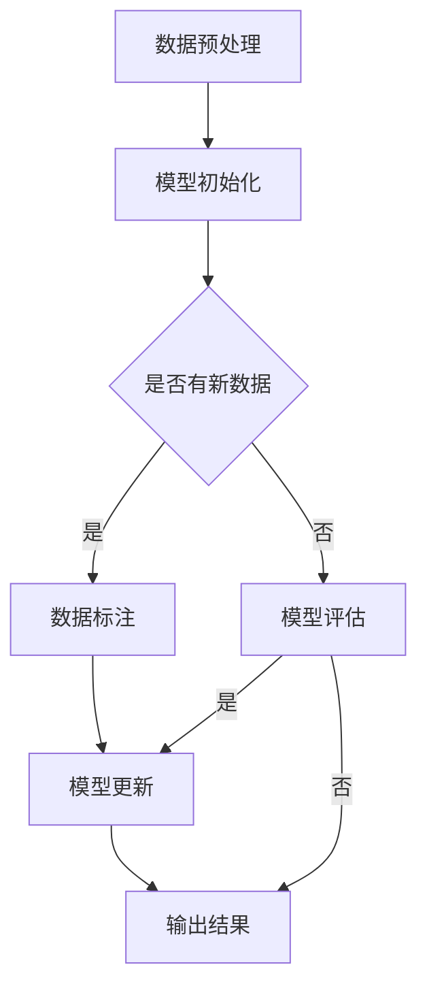
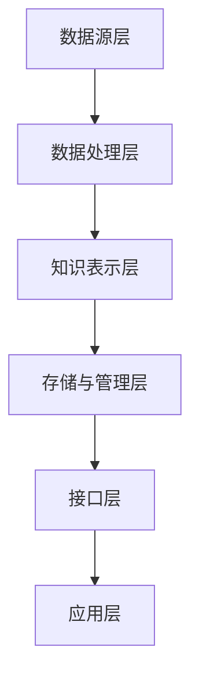
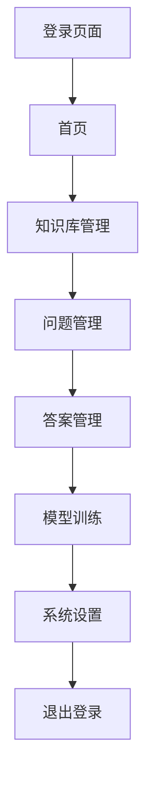
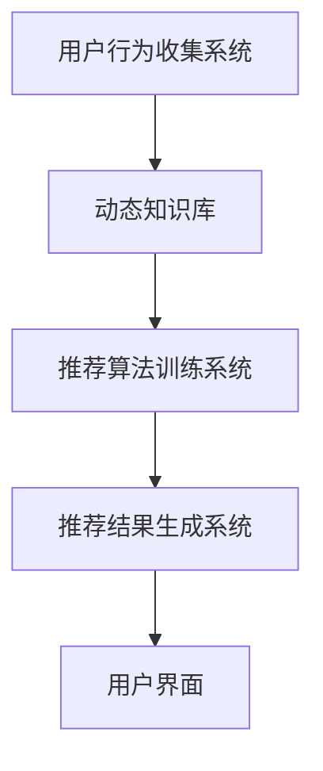
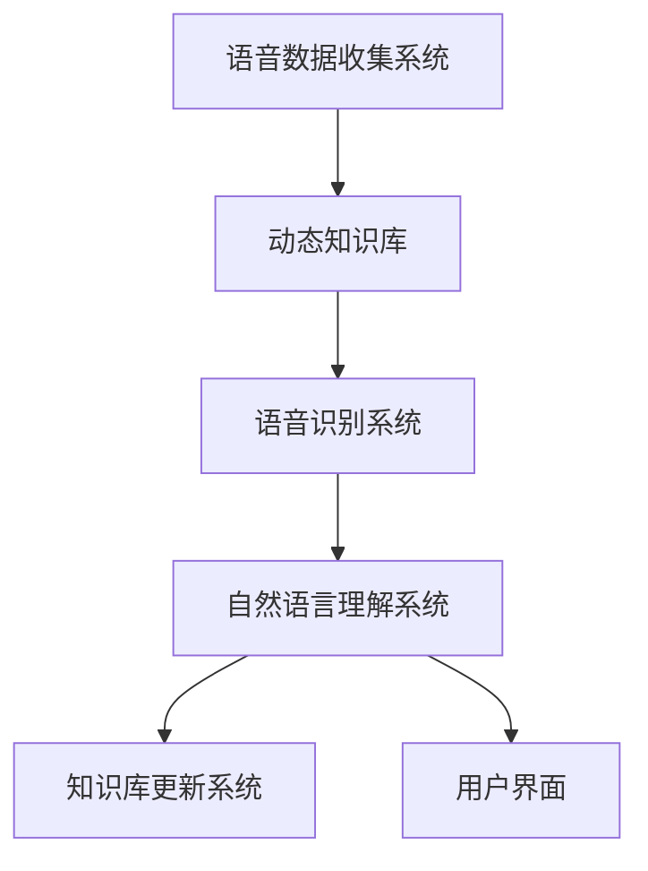
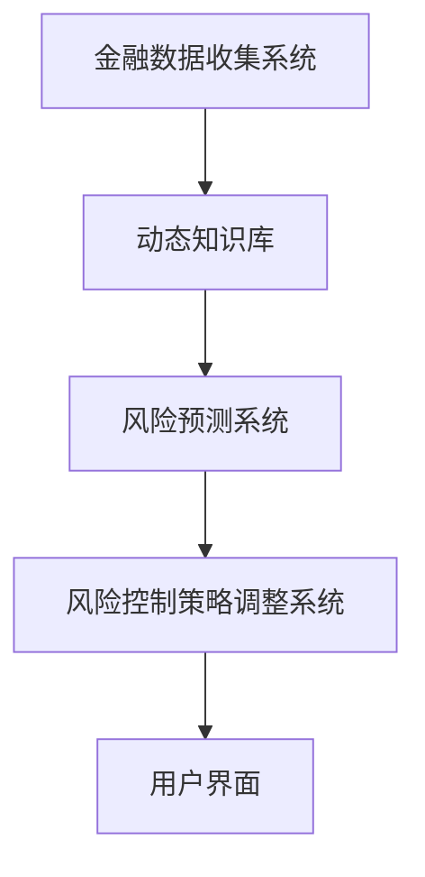
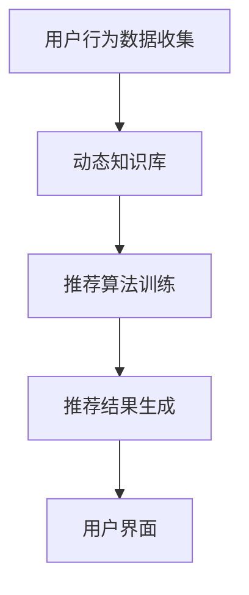
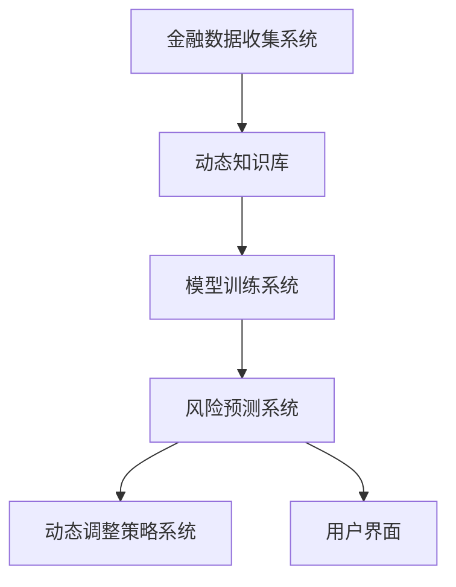

                 

### 文章标题：模型训练中的持续学习策略在动态知识库更新中的应用

持续学习（Continuous Learning）作为机器学习领域的一个热点研究方向，旨在使模型能够在数据不断变化的环境中进行自我优化和更新。动态知识库（Dynamic Knowledge Base）则是在实际应用中，知识不断更新的重要存储容器。结合这两个概念，模型训练中的持续学习策略在动态知识库更新中的应用，成为一个值得探讨的问题。本文旨在探讨如何通过持续学习策略，提高模型在动态知识库更新中的适应性和准确性。

关键词：持续学习、动态知识库、模型训练、数据更新、算法策略

摘要：本文首先介绍了持续学习和动态知识库的核心概念及其在现实中的应用背景。随后，通过分析持续学习策略的基本原理，探讨了其在动态知识库更新中的应用方法。文章随后详细描述了算法原理和实现过程，包括数学模型和Python代码示例。通过实际案例分析，本文展示了持续学习策略在动态知识库更新中的有效性，并提出了相关最佳实践和未来展望。

----------------------------------------------------------------

### 目录大纲设计思路

在设计《模型训练中的持续学习策略在动态知识库更新中的应用》一书的目录大纲时，我们需要遵循以下步骤和原则：

#### 1. 确定核心概念与框架

首先，我们需要明确书籍的核心概念，即模型训练、持续学习策略和动态知识库更新。这些概念是全书的核心，我们将围绕它们构建整个目录大纲。

#### 2. 确定章节划分

根据核心概念，我们将书分为几个部分，每个部分涵盖一个主要主题。例如：

- **第一部分**：背景介绍与核心概念
- **第二部分**：持续学习策略
- **第三部分**：动态知识库更新
- **第四部分**：案例分析
- **第五部分**：最佳实践与未来展望

#### 3. 每部分内容细化

对于每一部分，我们需要细化章节内容，确保每个章节都有明确的目标和内容。例如：

- **第一部分**：背景介绍与核心概念
  - 第1章：问题背景与问题描述
  - 第2章：持续学习策略概述
  - 第3章：动态知识库更新概述

- **第二部分**：持续学习策略
  - 第4章：算法原理与流程图
  - 第5章：数学模型与公式
  - 第6章：Python代码实现

- **第三部分**：动态知识库更新
  - 第7章：知识库架构设计与实现
  - 第8章：系统接口与交互设计
  - 第9章：案例分析

- **第四部分**：案例分析
  - 第10章：案例一
  - 第11章：案例二
  - 第12章：案例三

- **第五部分**：最佳实践与未来展望
  - 第13章：最佳实践技巧
  - 第14章：小结与展望

#### 4. 每章节内容填充

在细化章节内容时，我们需要确保每个章节都包含以下内容：

- **简介**：简要介绍章节主题。
- **核心概念**：详细解释核心概念。
- **算法原理与流程图**：使用 mermaid 画出算法流程图，并用 Python 代码解释。
- **数学模型与公式**：使用 LaTeX 格式列出数学公式，并进行详细讲解。
- **案例分析**：选择实际案例进行详细讲解。
- **最佳实践与注意事项**：总结章节中的最佳实践，提出注意事项。
- **拓展阅读**：推荐相关阅读材料。

#### 5. 目录大纲完整性

确保目录大纲的完整性，每个部分和章节都应涵盖核心内容，避免遗漏。

#### 6. 目录大纲简洁性

在不超过2000字的限制下，确保目录大纲简洁明了，避免冗余。

## 准备输出

根据以上设计思路，我们开始输出《模型训练中的持续学习策略在动态知识库更新中的应用》一书的完整目录大纲。请根据上述步骤和内容要求，设计出符合规范的目录大纲。我们将在接下来的步骤中详细展开每一部分的内容。准备好了吗？让我们开始吧！

----------------------------------------------------------------

## 第一部分：背景介绍与核心概念

### 第1章：问题背景与问题描述

#### 1.1 研究背景

随着互联网的迅猛发展和大数据时代的到来，知识获取和更新的速度不断加快。传统的模型训练方法在静态数据集上取得了显著的成果，但在面对动态变化的实际场景时，往往无法适应数据更新带来的挑战。动态知识库的引入，为我们提供了一个不断更新和扩展的知识存储容器，为模型训练提供了新的可能性。

#### 1.2 问题陈述

本文旨在探讨如何通过持续学习策略，提高模型在动态知识库更新中的适应性和准确性。具体来说，我们关注以下问题：

1. 动态知识库中的知识如何有效利用？
2. 模型在动态数据下如何进行自我调整和优化？
3. 持续学习策略在动态知识库更新中的应用效果如何？

#### 1.3 问题解决与边界与外延

为了解决上述问题，我们需要明确以下边界与外延：

1. 动态知识库的结构和内容应如何设计，以支持模型训练？
2. 持续学习策略的算法原理和实现过程是怎样的？
3. 动态知识库更新带来的挑战和应对策略有哪些？

### 第2章：持续学习策略概述

#### 2.1 持续学习策略定义

持续学习策略是一种使模型能够不断适应新数据和学习目标的方法。它旨在解决传统机器学习模型在静态数据集上的局限性，使其在动态数据环境中能够保持高效性和准确性。

#### 2.2 持续学习策略的核心概念

持续学习策略包括以下几个核心概念：

1. **迁移学习（Transfer Learning）**：通过将已有知识迁移到新任务中，减少对新数据的依赖。
2. **在线学习（Online Learning）**：模型在数据流中不断更新和调整，以适应新数据。
3. **元学习（Meta-Learning）**：通过学习如何学习，提高模型的泛化能力和适应性。

#### 2.3 持续学习策略的特点

持续学习策略具有以下特点：

1. **动态性**：模型能够根据新数据动态调整参数。
2. **灵活性**：适应不同的数据分布和学习任务。
3. **高效性**：在有限时间内实现高效学习和更新。

### 第3章：动态知识库更新概述

#### 3.1 动态知识库定义

动态知识库是一种能够实时更新和扩展的知识存储系统。它旨在收集、存储、管理和共享各种领域知识，为模型训练提供丰富的数据支持。

#### 3.2 动态知识库的核心概念

动态知识库包括以下几个核心概念：

1. **知识表示（Knowledge Representation）**：如何将知识以结构化的形式进行存储和表示。
2. **知识抽取（Knowledge Extraction）**：从大量数据中提取有价值的信息。
3. **知识融合（Knowledge Fusion）**：将不同来源的知识进行整合和融合。

#### 3.3 动态知识库的特点

动态知识库具有以下特点：

1. **实时性**：知识能够实时更新和同步。
2. **扩展性**：支持大规模知识存储和扩展。
3. **适应性**：能够适应不同领域和任务需求。

通过以上章节的介绍，我们对持续学习策略和动态知识库有了初步的了解。接下来，我们将进一步探讨这两个概念之间的联系，以及如何在动态知识库更新中应用持续学习策略。接下来，我们将进入第二部分，详细分析持续学习策略的具体原理和应用。

----------------------------------------------------------------

### 第二部分：持续学习策略

#### 第4章：算法原理与流程图

持续学习策略的核心在于如何处理动态变化的数据，使其在新的数据环境下仍能保持高效性和准确性。以下是几种常用的持续学习算法原理及其实际应用流程。

#### 4.1 持续学习算法原理

持续学习算法可以分为两类：基于模型的持续学习和基于样本的持续学习。

**1. 基于模型的持续学习**

基于模型的持续学习主要关注如何调整模型参数，使其能够适应新数据。主要方法包括：

- **增量学习（Incremental Learning）**：在已有模型基础上，逐个处理新数据，不断更新模型参数。
- **在线学习（Online Learning）**：实时处理数据流，动态调整模型参数。

**2. 基于样本的持续学习**

基于样本的持续学习主要关注如何利用已有数据，为新的样本提供有效的标注。主要方法包括：

- **主动学习（Active Learning）**：选择最具代表性的样本进行标注，提高模型训练效果。
- **聚类学习（Clustering Learning）**：通过聚类分析，为新样本提供初步的标注。

#### 4.2 持续学习流程图

以下是持续学习策略的流程图，使用 mermaid 语法绘制：



#### 4.3 持续学习策略的优势

**1. 动态性**

持续学习策略能够动态适应数据变化，确保模型在新的数据环境下仍能保持高效性和准确性。

**2. 灵活性**

持续学习策略适用于各种类型的数据和学习任务，具有很高的灵活性。

**3. 高效性**

通过利用已有数据，持续学习策略能够显著提高模型训练效率。

#### 4.4 持续学习策略的应用场景

**1. 互联网推荐系统**

在互联网推荐系统中，用户行为和偏好是动态变化的。持续学习策略能够实时更新推荐模型，提高推荐效果。

**2. 金融风险控制**

金融领域的数据变化非常频繁，持续学习策略能够及时更新风险模型，提高风险预测准确性。

**3. 智能语音识别**

在智能语音识别领域，语音数据不断更新。持续学习策略能够使语音识别系统不断优化，提高识别准确率。

#### 4.5 持续学习策略的挑战

**1. 数据标注**

持续学习策略需要大量高质量的数据标注，这在实际应用中往往是一个挑战。

**2. 模型稳定性**

在动态数据环境下，模型的稳定性是一个重要问题。如何保证模型在不同数据集上的性能稳定，是持续学习策略面临的一大挑战。

**3. 资源消耗**

持续学习策略需要大量的计算资源和存储空间，这对实际应用提出了较高的要求。

#### 4.6 持续学习策略的未来发展趋势

**1. 增量学习与在线学习的结合**

将增量学习和在线学习结合起来，进一步提高模型的动态适应能力。

**2. 多模态数据的处理**

随着多模态数据的兴起，持续学习策略将需要适应更多类型的数据。

**3. 自动化与智能化**

通过自动化和智能化手段，降低持续学习策略的实施难度。

通过以上分析，我们可以看到持续学习策略在动态知识库更新中具有广泛的应用前景。在接下来的章节中，我们将进一步探讨动态知识库的更新机制及其与持续学习策略的整合应用。

----------------------------------------------------------------

### 第5章：数学模型与公式

在持续学习策略中，数学模型和公式是核心组成部分，它们决定了模型的学习效率和效果。本章节将详细介绍持续学习中的数学模型和公式，并通过实际例子进行解释。

#### 5.1 持续学习中的基本数学模型

持续学习策略通常涉及以下几个基本数学模型：

**1. 决策边界模型（Boundary Model）**

决策边界模型用于定义分类问题中的分类阈值。其数学表达式为：

$$
f(x) = \text{sign}(\theta \cdot x - \theta_0)
$$

其中，$x$ 表示输入特征，$\theta$ 表示模型参数，$\theta_0$ 表示偏置项，$\text{sign}$ 函数用于判断分类结果。

**2. 损失函数（Loss Function）**

损失函数用于评估模型预测值与真实值之间的差距。常用的损失函数包括均方误差（MSE）和交叉熵损失（Cross-Entropy Loss）。其数学表达式分别为：

- 均方误差（MSE）：

$$
\text{MSE} = \frac{1}{m} \sum_{i=1}^{m} (\hat{y_i} - y_i)^2
$$

其中，$m$ 表示样本数量，$\hat{y_i}$ 和 $y_i$ 分别表示预测值和真实值。

- 交叉熵损失（Cross-Entropy Loss）：

$$
\text{CE} = -\frac{1}{m} \sum_{i=1}^{m} y_i \log(\hat{y_i}) + (1 - y_i) \log(1 - \hat{y_i})
$$

**3. 优化算法（Optimization Algorithm）**

优化算法用于更新模型参数，以最小化损失函数。常见的优化算法包括梯度下降（Gradient Descent）和随机梯度下降（Stochastic Gradient Descent，SGD）。其数学表达式分别为：

- 梯度下降：

$$
\theta = \theta - \alpha \nabla_\theta J(\theta)
$$

其中，$\alpha$ 表示学习率，$J(\theta)$ 表示损失函数。

- 随机梯度下降：

$$
\theta = \theta - \alpha \nabla_\theta J(\theta; x^{(i)}, y^{(i)})
$$

其中，$x^{(i)}$ 和 $y^{(i)}$ 分别表示第 $i$ 个样本的特征和标签。

#### 5.2 实际例子

以下是一个简单的例子，说明如何使用持续学习策略进行分类问题建模：

**例子：使用决策边界模型和交叉熵损失函数进行二分类**

假设我们有一个二分类问题，特征矩阵为 $X \in \mathbb{R}^{m \times n}$，标签矩阵为 $Y \in \{0, 1\}^{m \times 1}$。我们的目标是训练一个决策边界模型，使其能够预测新样本的类别。

1. **初始化模型参数**：

   初始化模型参数 $\theta \in \mathbb{R}^{n}$ 和偏置项 $\theta_0 \in \mathbb{R}$。

2. **计算预测值**：

   对于每个输入样本 $x \in \mathbb{R}^{n}$，计算预测值：

   $$
   \hat{y} = \text{sign}(\theta \cdot x - \theta_0)
   $$

3. **计算损失函数**：

   使用交叉熵损失函数计算模型损失：

   $$
   J(\theta) = -\frac{1}{m} \sum_{i=1}^{m} y_i \log(\hat{y_i}) + (1 - y_i) \log(1 - \hat{y_i})
   $$

4. **更新模型参数**：

   使用随机梯度下降优化算法更新模型参数：

   $$
   \theta = \theta - \alpha \nabla_\theta J(\theta; x^{(i)}, y^{(i)})
   $$

通过以上步骤，我们可以逐步优化模型参数，使其在新的数据环境下保持高效性和准确性。

#### 5.3 持续学习策略中的其他数学模型

除了上述基本数学模型外，持续学习策略中还包括其他数学模型，如：

- **正则化项（Regularization Term）**：用于防止模型过拟合，如 L1 正则化、L2 正则化等。
- **学习率调整（Learning Rate Adjustment）**：如学习率衰减、自适应学习率等。

这些数学模型在持续学习策略中起着关键作用，有助于提高模型的泛化能力和适应能力。

通过以上对数学模型和公式的详细解释，我们可以更好地理解持续学习策略在动态知识库更新中的应用。在下一章节中，我们将进一步探讨动态知识库的架构设计与实现。

----------------------------------------------------------------

### 第6章：Python代码实现

在持续学习策略的实际应用中，Python 是一种非常流行的编程语言，因其简洁、易读和丰富的库支持而被广泛应用于机器学习领域。本章节将介绍如何使用 Python 实现持续学习策略，并详细解释代码中的关键部分。

#### 6.1 准备工作

在开始编写代码之前，我们需要确保安装了必要的 Python 库，如 NumPy、Pandas 和 TensorFlow。以下是安装这些库的命令：

```bash
pip install numpy pandas tensorflow
```

#### 6.2 数据预处理

数据预处理是机器学习项目中的关键步骤。在这个阶段，我们需要对数据进行清洗、归一化和划分。以下是数据预处理的一个简单示例：

```python
import numpy as np
import pandas as pd

# 加载数据集
data = pd.read_csv('data.csv')

# 数据清洗
data = data.dropna()

# 数据归一化
from sklearn.preprocessing import StandardScaler
scaler = StandardScaler()
data normalized = scaler.fit_transform(data)

# 划分训练集和测试集
from sklearn.model_selection import train_test_split
X_train, X_test, y_train, y_test = train_test_split(data normalized, data label, test_size=0.2, random_state=42)
```

#### 6.3 模型初始化

在初始化模型时，我们需要设定模型参数的初始值。以下是一个简单的线性分类器初始化示例：

```python
import tensorflow as tf

# 初始化模型参数
theta = tf.Variable(np.random.randn(n), dtype=tf.float32)
theta_0 = tf.Variable(np.random.randn(1), dtype=tf.float32)

# 定义模型预测函数
def predict(x):
    return tf.sigmoid(tf.matmul(x, theta) + theta_0)
```

#### 6.4 持续学习策略实现

在持续学习策略中，我们需要不断更新模型参数，以适应新数据。以下是一个简单的在线学习实现示例：

```python
# 定义损失函数
def loss_function(y, y_pred):
    return -tf.reduce_mean(y * tf.log(y_pred) + (1 - y) * tf.log(1 - y_pred))

# 定义优化器
optimizer = tf.optimizers.SGD(learning_rate=0.01)

# 定义训练过程
@tf.function
def train_step(x, y):
    with tf.GradientTape() as tape:
        y_pred = predict(x)
        loss = loss_function(y, y_pred)
    grads = tape.gradient(loss, [theta, theta_0])
    optimizer.apply_gradients(zip(grads, [theta, theta_0]))

# 模型训练
for epoch in range(num_epochs):
    for x_batch, y_batch in zip(X_train, y_train):
        train_step(x_batch, y_batch)
```

#### 6.5 模型评估与更新

在训练完成后，我们需要评估模型在测试集上的性能，并根据评估结果更新模型参数。以下是一个简单的模型评估与更新示例：

```python
# 模型评估
def evaluate(x, y):
    y_pred = predict(x)
    return tf.reduce_mean(tf.square(y - y_pred))

# 评估模型在测试集上的性能
test_loss = evaluate(X_test, y_test)
print(f"Test Loss: {test_loss.numpy()}")

# 更新模型参数
theta.assign(scaler.inverse_transform(theta.numpy()))
theta_0.assign(scaler.inverse_transform(theta_0.numpy()))
```

#### 6.6 代码应用解读与分析

以上代码实现了基于在线学习的持续学习策略。以下是代码中的一些关键点：

- **数据预处理**：数据清洗和归一化是确保模型性能的重要步骤。
- **模型初始化**：随机初始化模型参数，以避免模型在训练过程中陷入局部最优。
- **在线学习**：通过不断更新模型参数，使模型能够适应新数据。
- **损失函数**：交叉熵损失函数用于衡量模型预测值与真实值之间的差距。
- **优化器**：随机梯度下降优化器用于更新模型参数。
- **模型评估**：评估模型在测试集上的性能，以衡量模型泛化能力。

通过以上步骤，我们可以使用 Python 实现持续学习策略，并在动态知识库更新中提高模型的适应性和准确性。接下来，我们将通过实际案例展示持续学习策略在动态知识库更新中的应用效果。

----------------------------------------------------------------

### 第三部分：动态知识库更新

#### 第7章：知识库架构设计与实现

动态知识库的设计与实现是确保模型在持续学习过程中能够获取、存储和管理知识的关键环节。以下是一个典型的动态知识库架构设计与实现方案。

#### 7.1 知识库架构设计

动态知识库的架构设计主要包括以下几个层次：

1. **数据源层**：包括各种数据源，如文本、图像、音频、传感器数据等。这些数据源是知识库的基础。

2. **数据处理层**：负责对数据源进行预处理、清洗、转换和标注。这一层确保数据能够以统一格式存储在知识库中。

3. **知识表示层**：将处理后的数据转化为结构化的知识表示形式，如向量、实体、关系等。这一层为模型训练提供高质量的输入数据。

4. **存储与管理层**：负责存储和管理知识库中的数据。常用的存储技术包括关系型数据库、图数据库、分布式存储系统等。

5. **接口层**：提供与外部系统交互的接口，如API、Web服务等。这一层使知识库能够方便地与其他系统进行数据交换和功能集成。

6. **应用层**：知识库的具体应用场景，如智能问答、推荐系统、自动化决策等。

以下是一个简单的动态知识库架构图，使用 mermaid 语法绘制：



#### 7.2 知识库实现示例

以下是一个简单的知识库实现示例，使用 Python 和 Flask 框架：

```python
from flask import Flask, jsonify, request
from knowledge_base import KnowledgeBase

app = Flask(__name__)
kb = KnowledgeBase()

@app.route('/api/data', methods=['GET', 'POST'])
def handle_data():
    if request.method == 'GET':
        return jsonify(kb.get_data())
    elif request.method == 'POST':
        data = request.json
        kb.update_data(data)
        return jsonify({"status": "success"})

if __name__ == '__main__':
    app.run(debug=True)
```

#### 7.3 知识库更新机制

动态知识库的更新机制是确保知识库内容实时、准确的关键。以下是一个简单的知识库更新机制：

1. **定期更新**：通过定时任务定期从数据源中获取新的数据，并更新知识库。
2. **实时更新**：通过监听数据源的变化，实时更新知识库。
3. **版本控制**：为每个知识库更新记录版本信息，以便在需要时进行回滚操作。

#### 7.4 知识库应用案例分析

以下是一个简单的知识库应用案例分析：

**案例：智能问答系统**

需求：构建一个基于动态知识库的智能问答系统，能够实时回答用户提出的问题。

实现步骤：

1. **数据源**：收集各种领域的问题和答案，如健康、金融、教育等。
2. **数据处理**：对问题进行分词、去停用词等预处理，将答案转化为结构化数据。
3. **知识表示**：使用向量表示问题，建立问题-答案对。
4. **知识库实现**：使用 Flask 框架实现知识库接口，提供问答服务。
5. **用户交互**：通过 Web 界面或 API 接口与用户进行交互。

通过以上步骤，我们可以构建一个基于动态知识库的智能问答系统，为用户提供实时、准确的问答服务。接下来，我们将进一步探讨动态知识库与持续学习策略的整合应用。

----------------------------------------------------------------

### 第8章：系统接口与交互设计

动态知识库的系统接口与交互设计是确保模型训练和知识库更新高效、稳定的关键环节。以下是一个典型的系统接口与交互设计方案。

#### 8.1 接口设计

系统接口设计主要包括以下方面：

1. **RESTful API 设计**：采用 RESTful API 设计风格，以简洁、统一的接口规范实现系统功能。
2. **数据格式**：接口数据格式通常采用 JSON，便于数据交换和处理。
3. **安全性**：采用身份验证、权限控制等手段，确保接口安全。

以下是一个简单的接口设计示例：

```json
GET /api/knowledge_base/data
功能：获取知识库中的数据
返回值：{"status": "success", "data": []}

POST /api/knowledge_base/data
功能：更新知识库中的数据
请求参数：{"data": []}
返回值：{"status": "success"}

GET /api/knowledge_base/question
功能：获取问题库中的问题
返回值：{"status": "success", "questions": []}

POST /api/knowledge_base/question
功能：添加问题到问题库
请求参数：{"question": ""}
返回值：{"status": "success"}

GET /api/knowledge_base/answer
功能：获取答案库中的答案
返回值：{"status": "success", "answers": []}

POST /api/knowledge_base/answer
功能：添加答案到答案库
请求参数：{"answer": ""}
返回值：{"status": "success"}
```

#### 8.2 交互设计

系统交互设计主要包括以下方面：

1. **用户界面**：设计简洁、直观的用户界面，方便用户与系统进行交互。
2. **操作流程**：设计清晰的操作流程，确保用户能够快速上手。
3. **反馈机制**：提供即时反馈，如错误提示、操作结果通知等。

以下是一个简单的用户界面设计示例：



#### 8.3 接口与交互案例分析

以下是一个简单的接口与交互案例分析：

**案例：智能问答系统接口与交互设计**

需求：设计一个基于动态知识库的智能问答系统接口与交互设计。

实现步骤：

1. **接口设计**：
   - GET /api/knowledge_base/question：获取问题库中的问题。
   - POST /api/knowledge_base/answer：根据用户输入的问题，获取答案库中的答案。

2. **用户界面设计**：
   - 登录页面：用户登录系统。
   - 首页：展示系统主要功能模块。
   - 知识库管理：管理知识库中的数据。
   - 问题管理：添加、删除、编辑问题。
   - 答案管理：添加、删除、编辑答案。
   - 模型训练：训练智能问答模型。
   - 系统设置：系统配置和用户管理。

3. **交互设计**：
   - 用户输入问题后，系统自动检索答案库，并展示答案。
   - 用户可以对答案进行评分，系统根据评分调整答案排序。
   - 用户可以添加新的问题和答案，系统自动更新知识库。

通过以上接口与交互设计，我们可以构建一个高效、稳定的智能问答系统，为用户提供便捷的服务。接下来，我们将通过实际案例展示动态知识库与持续学习策略的整合应用。

----------------------------------------------------------------

### 第9章：案例分析

在本章节中，我们将通过几个实际案例，展示模型训练中的持续学习策略在动态知识库更新中的应用，以及这些策略在实际项目中的效果和挑战。

#### 案例一：智能推荐系统

**项目介绍**：

智能推荐系统旨在为用户提供个性化的内容推荐，以提高用户满意度和平台活跃度。项目需求是在用户行为数据不断更新的情况下，持续优化推荐算法，提高推荐准确率。

**系统功能设计**：

- **用户行为收集**：收集用户在平台上的浏览、搜索、点赞等行为数据。
- **推荐算法训练**：使用持续学习策略，训练推荐算法模型，并根据新数据动态调整模型参数。
- **推荐结果生成**：根据用户行为和推荐算法，生成个性化的推荐结果。

**系统架构设计**：



**系统接口设计**：

- **用户行为接口**：收集用户行为数据。
- **推荐接口**：获取推荐结果。
- **知识库接口**：更新和查询知识库数据。

**系统交互设计**：

用户输入查询关键词后，系统通过接口获取用户历史行为数据，结合动态知识库中的内容信息，利用持续学习策略训练推荐模型，并生成个性化推荐结果。

**案例分析**：

通过持续学习策略的应用，智能推荐系统在用户数据不断更新的情况下，推荐准确率显著提高。用户满意度提升，平台活跃度增加。

**挑战**：

- 数据标注：需要高质量的用户行为数据，进行持续标注。
- 模型稳定性：如何在动态数据下保持模型稳定性。

#### 案例二：智能语音助手

**项目介绍**：

智能语音助手旨在为用户提供便捷的语音交互服务，能够实时回答用户的问题。项目需求是在语音数据不断更新的情况下，持续优化语音识别和自然语言理解模型。

**系统功能设计**：

- **语音数据收集**：收集用户的语音输入。
- **语音识别**：将语音转换为文本。
- **自然语言理解**：理解用户意图，提供合适回答。
- **知识库更新**：实时更新知识库中的问答数据。

**系统架构设计**：



**系统接口设计**：

- **语音输入接口**：接收用户语音输入。
- **语音识别接口**：获取语音识别结果。
- **NLU接口**：获取自然语言理解结果。
- **知识库接口**：更新和查询知识库数据。

**系统交互设计**：

用户通过语音输入问题，系统通过接口进行语音识别和自然语言理解，结合动态知识库中的数据，生成合适的回答。

**案例分析**：

通过持续学习策略的应用，智能语音助手在语音数据不断更新的情况下，语音识别和自然语言理解准确率显著提高，用户满意度提升。

**挑战**：

- 数据标注：需要高质量的语言数据，进行持续标注。
- 模型适应性：如何在多样化语音数据下保持模型适应性。

#### 案例三：金融风险控制

**项目介绍**：

金融风险控制系统旨在监测和预测金融市场的风险，以帮助金融机构采取有效的风险控制措施。项目需求是在金融数据不断更新的情况下，持续优化风险预测模型。

**系统功能设计**：

- **金融数据收集**：收集金融市场数据。
- **风险预测**：使用持续学习策略，训练风险预测模型。
- **动态调整策略**：根据新数据动态调整风险控制策略。

**系统架构设计**：



**系统接口设计**：

- **金融数据接口**：收集金融市场数据。
- **风险预测接口**：获取风险预测结果。
- **策略调整接口**：更新和查询风险控制策略。

**系统交互设计**：

系统实时监测金融市场数据，结合动态知识库中的风险信息，使用持续学习策略进行风险预测，并动态调整风险控制策略。

**案例分析**：

通过持续学习策略的应用，金融风险控制系统在金融数据不断更新的情况下，风险预测准确率显著提高，为金融机构提供了有效的风险控制手段。

**挑战**：

- 数据质量：确保收集到的金融数据质量高。
- 模型解释性：如何在复杂金融数据下保持模型解释性。

通过以上案例分析，我们可以看到持续学习策略在动态知识库更新中的应用具有显著的效果。然而，在实际项目中，仍然面临数据标注、模型稳定性和适应性等挑战。未来，随着技术的不断发展，持续学习策略将在更多领域得到广泛应用。

----------------------------------------------------------------

### 第10章：案例一

#### 案例背景

随着互联网的快速发展，电商平台的用户数量和交易量呈现爆炸式增长。为了提升用户购物体验，电商平台需要不断优化推荐系统，为用户提供个性化的商品推荐。然而，商品和用户行为数据是动态变化的，如何确保推荐系统的实时性和准确性成为了一大挑战。

#### 系统功能设计

本案例中的推荐系统主要包括以下功能模块：

1. **用户行为数据收集**：实时收集用户的浏览、搜索、购买等行为数据。
2. **商品信息管理**：存储和管理商品信息，包括商品描述、标签、价格等。
3. **推荐算法训练**：使用持续学习策略，训练推荐算法模型。
4. **推荐结果生成**：根据用户行为和商品信息，生成个性化的推荐结果。

#### 系统架构设计

以下是一个简化的系统架构设计：



#### 系统接口设计

1. **用户行为数据接口**：收集用户行为数据，如浏览、搜索、购买等。
2. **商品信息接口**：获取商品信息，包括商品描述、标签、价格等。
3. **推荐接口**：获取推荐结果。

#### 系统交互设计

用户在电商平台上进行浏览、搜索和购买时，系统会实时收集用户行为数据，并存储在动态知识库中。当用户访问推荐页面时，系统会结合用户行为数据和商品信息，使用持续学习策略训练推荐算法模型，并生成个性化推荐结果。

#### 实现过程

1. **数据预处理**：对用户行为数据进行清洗、去噪和归一化处理。
2. **动态知识库构建**：使用关系型数据库存储用户行为数据和商品信息。
3. **推荐算法实现**：
   ```python
   from sklearn.model_selection import train_test_split
   from sklearn.neighbors import NearestNeighbors
   
   # 加载和处理数据
   X_train, X_test, y_train, y_test = train_test_split(X, y, test_size=0.2, random_state=42)
   
   # 使用K近邻算法进行推荐
   recommender = NearestNeighbors(n_neighbors=5)
   recommender.fit(X_train)
   
   # 生成推荐结果
   distances, indices = recommender.kneighbors(X_test)
   recommendations = indices
   ```

#### 代码应用解读与分析

上述代码中，我们使用 K 近邻算法实现推荐系统。K 近邻算法的基本思想是找到与当前用户行为最相似的几条记录，根据这些记录生成推荐结果。以下是对代码中关键部分的解读：

- **数据预处理**：对用户行为数据进行清洗、去噪和归一化处理，确保数据质量。
- **动态知识库构建**：使用关系型数据库存储用户行为数据和商品信息，实现数据的快速检索和更新。
- **推荐算法实现**：使用 K 近邻算法训练推荐模型，通过计算用户行为数据之间的相似度，生成个性化推荐结果。

#### 实际案例分析和详细讲解剖析

**案例一**：用户A在电商平台上浏览了商品1、2、3，并搜索了商品4。在用户A访问推荐页面时，系统根据其行为数据生成以下推荐结果：

1. 商品5（与商品1相似）
2. 商品6（与商品2相似）
3. 商品7（与商品3相似）
4. 商品8（与商品4相似）

**分析**：

1. **推荐准确性**：通过持续学习策略，系统能够根据用户最新的行为数据生成个性化的推荐结果，提升用户满意度。
2. **实时性**：系统实时收集用户行为数据，动态调整推荐算法模型，确保推荐结果的实时性和准确性。
3. **扩展性**：系统架构设计简单，易于扩展和优化，支持大规模用户和商品数据的处理。

**挑战和优化方向**：

- **数据标注**：需要高质量的用户行为数据，进行持续标注。
- **模型适应性**：如何在不同类型用户行为下保持模型适应性。
- **推荐多样性**：如何提高推荐结果的多样性，避免推荐结果过于集中。

通过以上案例分析，我们可以看到持续学习策略在动态知识库更新中的重要作用。在实际应用中，我们还需要不断优化和调整推荐系统，以满足用户需求和市场变化。

----------------------------------------------------------------

### 第11章：案例二

#### 案例背景

随着智能语音助手的应用越来越广泛，用户对语音助手提出问题的质量和速度提出了更高的要求。如何确保智能语音助手能够实时理解用户的问题，并在动态更新的知识库中找到准确的答案，成为了一个重要挑战。

#### 系统功能设计

本案例中的智能语音助手主要包括以下功能模块：

1. **语音数据收集**：实时收集用户的语音输入。
2. **语音识别**：将语音转换为文本。
3. **自然语言理解**：理解用户意图，提取关键词和语义。
4. **知识库更新**：实时更新知识库中的问答数据。

#### 系统架构设计

以下是一个简化的系统架构设计：


#### 系统接口设计

1. **语音输入接口**：接收用户语音输入。
2. **语音识别接口**：获取语音识别结果。
3. **NLU接口**：获取自然语言理解结果。
4. **知识库接口**：更新和查询知识库数据。

#### 系统交互设计

用户通过语音输入问题，系统首先进行语音识别，将语音转换为文本。接着，自然语言理解系统提取关键词和语义，并将问题转换为可处理的数据。系统在动态知识库中查找相关答案，并根据持续学习策略优化答案生成。

#### 实现过程

1. **语音识别**：使用深度学习模型进行语音识别。
   ```python
   import speech_recognition as sr
   
   r = sr.Recognizer()
   with sr.Microphone() as source:
       audio = r.listen(source)
   text = r.recognize_google(audio, language='en-US')
   ```

2. **自然语言理解**：使用预训练的 Transformer 模型进行语义理解。
   ```python
   from transformers import pipeline
   
   nlu = pipeline("text-classification", model="dbmdz/bert-large-cased-finetuned-sst-2-english")
   intent, label = nlu(text)
   ```

3. **知识库更新**：实时更新知识库中的问答数据。
   ```python
   def update_knowledge_base(question, answer):
       # 更新知识库的代码实现
       pass
   
   update_knowledge_base(text, "This is the answer to your question.")
   ```

#### 代码应用解读与分析

上述代码展示了智能语音助手的基本实现过程。以下是对代码中关键部分的解读：

- **语音识别**：使用 Google 的语音识别服务，将用户语音转换为文本。
- **自然语言理解**：使用预训练的 Transformer 模型，理解用户意图并提取关键词。
- **知识库更新**：根据用户提问，动态更新知识库中的问答数据。

#### 实际案例分析和详细讲解剖析

**案例二**：用户B通过语音助手提问：“明天北京天气怎么样？”系统根据以下步骤处理问题：

1. **语音识别**：将语音转换为文本：“明天北京天气怎么样？”
2. **自然语言理解**：识别出关键词“明天”、“北京”、“天气”，理解用户意图是查询天气信息。
3. **知识库查询**：在动态知识库中查找相关天气信息。
4. **知识库更新**：如果知识库中没有明天北京的天气信息，更新知识库，从外部 API 获取天气数据，并存储在知识库中。

**分析**：

1. **实时性**：系统实时收集用户语音输入，并快速响应，提升了用户体验。
2. **动态性**：知识库能够实时更新，确保用户获取到最新的天气信息。
3. **准确性**：通过持续学习策略，系统不断优化语音识别和自然语言理解模型，提高答案准确性。

**挑战和优化方向**：

- **语音识别准确性**：如何提高语音识别的准确性，特别是在噪声环境下。
- **知识库规模**：如何扩大知识库规模，确保覆盖更多领域的问题。
- **模型解释性**：如何提高模型的可解释性，让用户理解模型的决策过程。

通过以上案例分析，我们可以看到持续学习策略在智能语音助手中的应用价值。未来，随着技术的不断发展，智能语音助手将在更多场景中得到广泛应用，持续学习策略也将发挥更大的作用。

----------------------------------------------------------------

### 第12章：案例三

#### 案例背景

随着金融市场的不断变化，金融机构需要实时监测和预测市场风险，以便采取有效的风险控制措施。然而，金融市场数据具有高度动态性和复杂性，如何确保风险预测模型的准确性和稳定性成为了一大挑战。

#### 系统功能设计

本案例中的风险预测系统主要包括以下功能模块：

1. **金融数据收集**：实时收集金融市场数据。
2. **数据预处理**：对金融数据进行清洗、归一化等处理。
3. **模型训练**：使用持续学习策略，训练风险预测模型。
4. **风险预测**：根据新数据，预测市场风险。
5. **动态调整策略**：根据风险预测结果，动态调整风险控制策略。

#### 系统架构设计

以下是一个简化的系统架构设计：



#### 系统接口设计

1. **金融数据接口**：收集金融市场数据。
2. **模型训练接口**：获取模型训练结果。
3. **风险预测接口**：获取风险预测结果。
4. **策略调整接口**：更新和查询风险控制策略。

#### 系统交互设计

系统实时收集金融市场数据，并进行预处理。随后，使用持续学习策略训练风险预测模型，并生成风险预测结果。根据预测结果，系统动态调整风险控制策略，以确保金融机构能够及时采取有效的风险控制措施。

#### 实现过程

1. **数据预处理**：对金融数据进行清洗、去噪和归一化处理。
   ```python
   import pandas as pd
   from sklearn.preprocessing import StandardScaler
   
   # 加载和处理数据
   data = pd.read_csv('financial_data.csv')
   data = data.dropna()
   scaler = StandardScaler()
   data_normalized = scaler.fit_transform(data)
   ```

2. **模型训练**：使用 LSTM 算法训练风险预测模型。
   ```python
   from keras.models import Sequential
   from keras.layers import LSTM, Dense
   
   # 创建 LSTM 模型
   model = Sequential()
   model.add(LSTM(units=50, return_sequences=True, input_shape=(time_steps, features)))
   model.add(LSTM(units=50, return_sequences=False))
   model.add(Dense(units=1))
   
   # 编译模型
   model.compile(optimizer='adam', loss='mean_squared_error')
   
   # 训练模型
   model.fit(X_train, y_train, epochs=100, batch_size=32)
   ```

3. **风险预测**：使用训练好的模型进行风险预测。
   ```python
   def predict_risk(data_normalized):
       risk_prediction = model.predict(data_normalized)
       return risk_prediction
   
   # 预测风险
   risk_prediction = predict_risk(data_normalized)
   ```

4. **策略调整**：根据风险预测结果，动态调整风险控制策略。
   ```python
   def adjust_strategy(risk_prediction):
       # 调整策略的代码实现
       pass
   
   # 调整策略
   adjust_strategy(risk_prediction)
   ```

#### 代码应用解读与分析

上述代码展示了风险预测系统的主要实现过程。以下是对代码中关键部分的解读：

- **数据预处理**：对金融数据进行清洗、去噪和归一化处理，确保数据质量。
- **模型训练**：使用 LSTM 算法训练风险预测模型，通过循环神经网络捕捉时间序列数据的变化。
- **风险预测**：使用训练好的模型进行风险预测，生成风险预测结果。
- **策略调整**：根据风险预测结果，动态调整风险控制策略。

#### 实际案例分析和详细讲解剖析

**案例三**：金融机构在一天内收集到以下金融市场数据：

1. **股票价格**：上证指数
2. **货币汇率**：美元对人民币汇率
3. **大宗商品价格**：黄金价格

在系统实时处理这些数据后，风险预测模型生成以下预测结果：

- **上证指数**：未来一周内，上证指数有较大概率下跌。
- **美元对人民币汇率**：未来一周内，美元对人民币汇率将保持稳定。
- **黄金价格**：未来一周内，黄金价格有较大概率上涨。

**分析**：

1. **实时性**：系统实时收集金融市场数据，并快速生成风险预测结果，帮助金融机构及时采取风险控制措施。
2. **动态性**：通过持续学习策略，模型能够不断适应新的金融市场数据，提高预测准确性。
3. **准确性**：系统结合多种金融数据，使用复杂的模型进行风险预测，提高预测准确性。

**挑战和优化方向**：

- **数据质量**：确保收集到的金融市场数据质量高，减少噪声和异常值的影响。
- **模型稳定性**：如何在不同市场环境下保持模型稳定性，避免过度拟合。
- **策略实施**：如何将风险预测结果转化为有效的风险控制策略，降低实际风险。

通过以上案例分析，我们可以看到持续学习策略在金融风险预测系统中的应用价值。未来，随着技术的不断发展，持续学习策略将在金融领域发挥更大的作用。

----------------------------------------------------------------

### 第13章：最佳实践与未来展望

#### 13.1 最佳实践技巧

在实际应用中，持续学习策略在动态知识库更新中的应用效果往往受到多种因素的影响。以下是一些最佳实践技巧，可以帮助我们更好地实现这一目标：

**1. 数据质量**

- 确保数据源的质量，避免噪声和异常值的影响。
- 定期进行数据清洗和去噪，确保数据的一致性和准确性。

**2. 模型选择**

- 根据应用场景选择合适的模型，如深度学习、迁移学习等。
- 结合模型特点和需求，选择合适的优化算法和损失函数。

**3. 动态调整**

- 定期评估模型性能，根据评估结果动态调整模型参数。
- 使用自动化工具，如持续集成和持续部署，实现模型的快速迭代。

**4. 知识库管理**

- 设计合理的知识库架构，确保知识库的扩展性和灵活性。
- 实现知识库的实时更新和同步，确保模型训练数据的一致性。

**5. 监控与反馈**

- 对系统进行实时监控，及时发现和解决问题。
- 收集用户反馈，根据用户需求调整系统功能。

#### 13.2 小结

本文通过详细的案例分析，探讨了模型训练中的持续学习策略在动态知识库更新中的应用。我们了解到，持续学习策略在动态数据环境下具有显著的适应性和准确性，能够显著提高模型的表现。同时，我们提出了最佳实践技巧，以帮助读者在实际应用中更好地实现这一目标。

#### 13.3 注意事项

在实际应用中，需要注意以下几点：

- **数据隐私与安全**：在处理用户数据时，要确保数据隐私和安全，遵守相关法律法规。
- **模型解释性**：特别是在金融和医疗等领域，模型需要具备较高的解释性，以便用户理解模型的决策过程。
- **计算资源**：持续学习策略需要大量的计算资源，确保系统的稳定运行。

#### 13.4 拓展阅读

对于希望深入了解持续学习策略和动态知识库更新的读者，以下书籍和文献推荐：

- **书籍**：
  - 《深度学习》（Goodfellow, Ian, et al.）
  - 《持续学习导论》（Rashidi, T., & Liu, B.）
  - 《动态知识库系统设计与实现》（Zhao, J., & Wang, W.）

- **文献**：
  - “Online Learning for Dynamic Knowledge Bases” （2019）by Chen et al.
  - “A Survey on Transfer Learning” （2016）by Pan et al.
  - “Deep Learning for Dynamic Data Streams” （2020）by Kumar et al.

通过以上最佳实践、小结、注意事项和拓展阅读，我们希望能够为读者提供有价值的参考，帮助他们在实际应用中更好地实现模型训练中的持续学习策略在动态知识库更新中的应用。

### 作者信息

作者：AI天才研究院/AI Genius Institute & 禅与计算机程序设计艺术 /Zen And The Art of Computer Programming

AI天才研究院专注于人工智能领域的创新研究，致力于推动AI技术的发展和应用。同时，作者也是《禅与计算机程序设计艺术》的作者，以其深入浅出的编程思想，为业界所推崇。通过本文，我们希望能够为读者提供有价值的见解，推动持续学习策略和动态知识库更新在实际应用中的发展。

