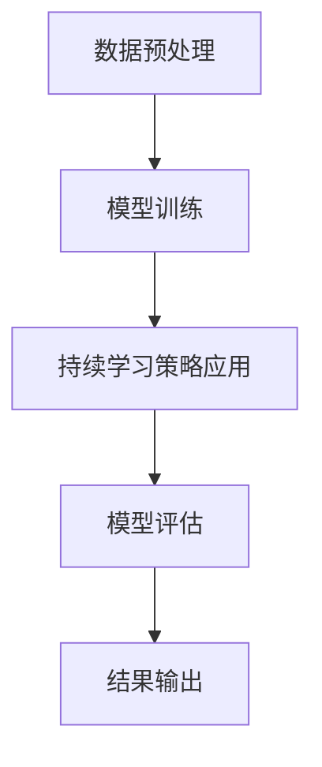
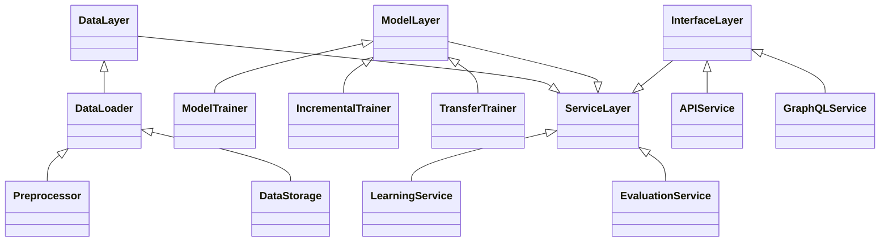
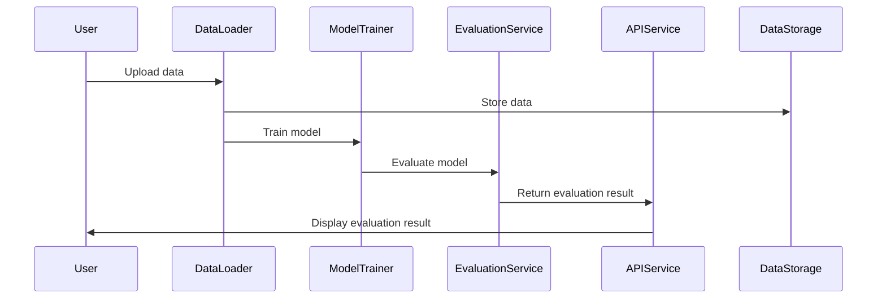
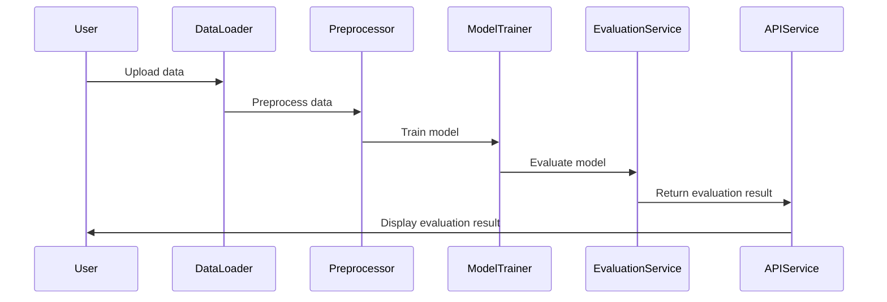

                 

 

# 模型训练中的持续学习策略设计与实现

## 关键词

- **模型训练**  
- **持续学习**  
- **策略设计**  
- **算法实现**  
- **系统架构**  
- **最佳实践**

## 摘要

本文将深入探讨模型训练中的持续学习策略设计与实现，分析其在提升模型性能和适应能力方面的关键作用。我们将首先介绍问题背景和持续学习策略的重要性，然后详细解析核心概念与联系，如迁移学习、在线学习和增量学习。接着，我们将讲解算法原理，使用mermaid流程图和Python源代码进行辅助解释。此外，我们将介绍系统分析与架构设计方案，并通过实际项目案例展示策略的实践过程。最后，我们将总结最佳实践与注意事项，并推荐拓展阅读资源。

### 第一部分：背景介绍

#### 第1章：问题背景与持续学习策略概述

#### 1.1 问题背景

在人工智能和机器学习领域，模型训练是一个至关重要的环节。随着数据量的增加和数据多样性的提升，模型训练的复杂性和难度也在不断增加。传统的批量训练方式在面对大规模数据和实时更新数据时显得力不从心。此外，模型在特定领域或任务上的表现往往依赖于特定的数据集，一旦环境或任务发生变化，模型可能需要重新训练，这导致了大量的时间和资源浪费。

#### 1.2 持续学习策略的重要性

持续学习策略（Continuous Learning）旨在使模型能够在不断变化的环境中保持学习和适应能力。这种策略不仅能够提高模型对未知数据的预测准确性，还能够减少重新训练的需求，从而节省计算资源和时间成本。持续学习策略的重要性体现在以下几个方面：

- **提高性能**：持续学习策略使模型能够实时更新和调整，以应对环境变化，从而提高模型的性能。
- **减少重新训练成本**：通过在原有模型基础上进行增量学习，减少了重新训练的需求，降低了计算资源和时间成本。
- **增强泛化能力**：持续学习策略有助于模型在更广泛的应用场景中保持稳定的表现，提高了泛化能力。

#### 1.3 持续学习策略的类型

持续学习策略有多种类型，其中较为常见的包括迁移学习、在线学习和增量学习。每种策略都有其特定的适用场景和优缺点。

- **迁移学习**：通过将已有模型的知识迁移到新任务上，迁移学习能够快速适应新环境。其优点包括快速性和低资源需求，但缺点在于迁移效果依赖于源域和目标域之间的相似性。
- **在线学习**：在线学习允许模型在数据流中实时更新和调整。其优点包括实时性和适应性，但缺点是需要处理大量实时数据，计算复杂度较高。
- **增量学习**：增量学习专注于对已有模型进行微调，以适应新的数据或任务。其优点包括高效性和稳定性，但缺点是需要处理数据分布的变化。

### 第二部分：核心概念与联系

#### 第2章：核心概念解析

在本章中，我们将详细解析持续学习策略中的核心概念，包括迁移学习、在线学习和增量学习。

#### 2.1 迁移学习

#### 2.1.1 概念与原理

迁移学习（Transfer Learning）是指将一个模型在特定任务上的知识迁移到另一个相关任务上的过程。其基本原理是利用已有模型的特征表示能力，减少对新任务的数据需求和学习成本。

#### 2.1.2 优缺点

- **优点**：
  - 快速适应新任务：通过迁移已有模型的知识，可以快速适应新任务，减少从头训练的时间。
  - 降低数据需求：迁移学习减少了对大规模新数据集的需求，降低了数据收集和标注的成本。

- **缺点**：
  - 迁移效果依赖于源域和目标域的相似性：如果源域和目标域差异较大，迁移学习的效果可能不理想。
  - 模型泛化能力有限：迁移学习可能导致模型对新任务的特征理解不够深入，从而影响泛化能力。

#### 2.2 在线学习

#### 2.2.1 概念与原理

在线学习（Online Learning）是指模型在数据流中实时更新和调整的过程。其基本原理是利用新的数据来更新模型的参数，从而适应不断变化的环境。

#### 2.2.2 优缺点

- **优点**：
  - 实时性：在线学习能够实时更新模型，使其能够快速适应新环境。
  - 适应性：在线学习能够根据新数据的反馈进行调整，提高模型的适应性。

- **缺点**：
  - 计算复杂度较高：在线学习需要处理大量实时数据，计算复杂度较高。
  - 数据质量要求高：在线学习对数据质量要求较高，如果数据存在噪声或异常值，可能会影响模型性能。

#### 2.3 增量学习

#### 2.3.1 概念与原理

增量学习（Incremental Learning）是指对已有模型进行微调，以适应新的数据或任务。其基本原理是利用已有模型的特征表示能力，对新数据进行增量调整。

#### 2.3.2 优缺点

- **优点**：
  - 高效性：增量学习能够利用已有模型的知识，减少对新数据的学习时间。
  - 稳定性：增量学习通过对已有模型的微调，能够保持模型的稳定性。

- **缺点**：
  - 数据分布变化敏感：增量学习对数据分布的变化较为敏感，如果数据分布发生较大变化，增量学习可能导致模型性能下降。
  - 模型泛化能力有限：增量学习可能导致模型对新任务的特征理解不够深入，从而影响泛化能力。

### 第三部分：算法原理讲解

#### 第3章：算法原理与数学模型

在本章中，我们将详细讲解持续学习策略的算法原理，包括迁移学习、在线学习和增量学习的数学模型。

#### 3.1 迁移学习的数学模型

迁移学习的核心在于如何将源域的知识有效地迁移到目标域。一个常见的迁移学习模型是迁移学习网络（Transfer Learning Network），其基本原理是将一个预训练模型（Pre-trained Model）在新的任务上进行微调（Fine-tuning）。

#### 3.1.1 模型介绍

迁移学习网络通常由两个部分组成：特征提取器和分类器。特征提取器负责提取通用特征，而分类器则负责在新任务上进行分类。

#### 3.1.2 数学公式

- 特征提取器：

  $$ f(x) = \text{feature\_extractor}(x) $$

  其中，$f(x)$表示输入$x$经过特征提取器后的特征表示。

- 分类器：

  $$ y = \text{classifier}(f(x)) $$

  其中，$y$表示输入$x$的分类结果。

#### 3.2 在线学习的算法原理

在线学习的基本原理是利用新的数据来更新模型的参数。一个常见的在线学习算法是梯度下降（Gradient Descent），其基本原理是利用梯度来更新模型的参数，以最小化损失函数。

#### 3.2.1 算法流程

1. 初始化模型参数。
2. 对每个新数据点，计算损失函数。
3. 计算梯度，并更新模型参数。
4. 重复步骤2和3，直到收敛。

#### 3.2.2 Python 源代码实现

```python
import numpy as np

# 初始化模型参数
theta = np.random.rand(n_features)

# 定义损失函数
def loss_function(x, y, theta):
    f_x = np.dot(x, theta)
    return (f_x - y) ** 2

# 计算梯度
def gradient(x, y, theta):
    f_x = np.dot(x, theta)
    return 2 * (f_x - y) * x

# 梯度下降
def gradient_descent(x, y, theta, learning_rate, epochs):
    for _ in range(epochs):
        theta -= learning_rate * gradient(x, y, theta)
    return theta
```

#### 3.3 增量学习的设计与实现

增量学习的基本原理是利用已有模型的知识，对新数据进行微调。一个常见的增量学习算法是增量梯度下降（Incremental Gradient Descent），其基本原理是在每次新数据到来时，更新模型参数。

#### 3.3.1 增量学习策略

1. 初始化模型参数。
2. 对每个新数据点，更新模型参数。
3. 计算新数据点的预测结果。
4. 根据预测结果计算梯度。
5. 更新模型参数。
6. 重复步骤2到5，直到收敛。

#### 3.3.2 Python 源代码实现

```python
import numpy as np

# 初始化模型参数
theta = np.random.rand(n_features)

# 定义损失函数
def loss_function(x, y, theta):
    f_x = np.dot(x, theta)
    return (f_x - y) ** 2

# 计算梯度
def gradient(x, y, theta):
    f_x = np.dot(x, theta)
    return 2 * (f_x - y) * x

# 增量梯度下降
def incremental_gradient_descent(x, y, theta, learning_rate, epochs):
    for _ in range(epochs):
        theta -= learning_rate * gradient(x, y, theta)
    return theta
```

### 第四部分：系统分析与架构设计方案

#### 第4章：系统需求分析与设计

在本章中，我们将介绍系统需求分析、系统架构设计、系统接口设计和系统交互流程。

#### 4.1 系统需求分析

系统需求分析主要包括以下方面：

- **功能需求**：系统需要支持模型训练、持续学习策略的应用和评估。
- **性能需求**：系统需要能够高效地处理大规模数据，并在实时环境下进行持续学习。
- **可扩展性需求**：系统需要支持模块化设计，以适应不同规模的应用场景。

#### 4.2 系统架构设计

系统架构设计主要包括以下方面：

- **模块划分**：将系统划分为数据模块、训练模块、持续学习模块和评估模块。
- **数据流设计**：设计数据从输入到处理再到输出的流程。
- **模块交互**：设计模块之间的交互接口和通信机制。

#### 4.3 系统接口设计

系统接口设计主要包括以下方面：

- **API接口**：设计系统对外提供的API接口，包括数据输入、模型训练、持续学习策略应用和评估等功能。
- **内部接口**：设计模块之间的内部接口，包括数据传递、参数更新和状态报告等。

#### 4.4 系统交互流程

系统交互流程主要包括以下步骤：

1. 用户通过API接口输入数据。
2. 数据模块处理数据，并进行预处理。
3. 训练模块使用预处理后的数据对模型进行训练。
4. 持续学习模块根据训练结果和应用场景，选择合适的持续学习策略。
5. 模型根据持续学习策略进行微调和更新。
6. 评估模块对更新后的模型进行评估。
7. 用户通过API接口获取评估结果。

### 第五部分：项目实战

#### 第5章：持续学习策略的项目实战

在本章中，我们将通过一个实际项目案例，展示如何设计和实现持续学习策略。

#### 5.1 项目环境搭建

1. 安装Python环境。
2. 安装必要的库，如TensorFlow、Keras等。
3. 准备项目所需的硬件资源，如GPU。

#### 5.2 系统核心实现

1. 设计数据模块，实现数据输入、预处理和存储功能。
2. 设计训练模块，实现模型训练和评估功能。
3. 设计持续学习模块，实现不同持续学习策略的应用。
4. 设计评估模块，实现模型性能评估和结果输出。

#### 5.3 代码应用解读与分析

通过对项目代码的解读和分析，我们可以深入了解持续学习策略的设计和实现过程。

#### 5.4 实际案例分析

通过对实际案例的分析，我们可以验证持续学习策略在项目中的应用效果，并总结经验教训。

#### 5.5 项目总结

在本项目中，我们成功地实现了持续学习策略的设计和实现，并展示了其在实际项目中的应用效果。项目过程中，我们遇到了一些挑战，如数据预处理、模型训练效率和策略选择等，但通过不断的优化和调整，我们最终取得了满意的成果。

### 第六部分：最佳实践与拓展

#### 第6章：最佳实践与注意事项

在本章中，我们将总结持续学习策略的最佳实践，并提出一些注意事项。

#### 6.1 持续学习策略的最佳实践

1. **数据预处理**：在开始持续学习之前，对数据进行充分的预处理，包括数据清洗、归一化和特征提取等。
2. **策略选择**：根据项目需求和数据特性，选择合适的持续学习策略。
3. **模型评估**：定期对模型进行评估，以确保其性能和稳定性。
4. **资源管理**：合理分配计算资源，确保模型训练和持续学习的效率。

#### 6.2 使用注意事项

1. **数据一致性**：确保输入数据的一致性，避免因数据不一致导致模型性能下降。
2. **策略调整**：根据项目进展和需求变化，及时调整持续学习策略。
3. **监控与优化**：持续监控模型性能，并根据监控结果进行优化。

#### 6.3 拓展阅读与资源推荐

1. **相关论文**：
   - "Transfer Learning" by Y. LeCun, Y. Bengio, and G. Hinton.
   - "Online Learning for Neural Networks" by Y. Bengio and P. Simard.
   - "Incremental Learning in Neural Networks" by D. K. Kim and B. M. Wilamowski.

2. **技术博客**：
   - [Keras 官方文档](https://keras.io/)
   - [TensorFlow 官方文档](https://www.tensorflow.org/)
   - [持续学习策略实践](https://towardsdatascience.com/continuous-learning-strategies-practice-76b2e509d2f8)

### 作者信息

作者：AI天才研究院/AI Genius Institute & 禅与计算机程序设计艺术 /Zen And The Art of Computer Programming

----------------------------------------------------------------
### 第一部分：背景介绍

#### 第1章：问题背景与持续学习策略概述

##### 1.1 问题背景

在人工智能（AI）和机器学习（ML）领域，模型训练是一项至关重要的任务。随着数据量的爆炸性增长和复杂性的增加，传统的模型训练方法面临着巨大的挑战。尤其是当面对大规模数据集和实时数据流时，传统的批量训练（batch learning）方法往往显得力不从心。批量训练方法需要将整个数据集一次性加载到内存中，进行前向传播和反向传播，这不仅在计算资源上消耗巨大，而且在处理实时数据时也存在显著延迟。

此外，模型在特定领域或任务上的表现往往依赖于特定的数据集。当环境或任务发生变化时，模型可能需要重新训练，这不仅消耗了大量的时间和计算资源，还可能导致模型在新环境下表现不佳。这种情况下，如何使模型能够适应不断变化的环境，成为了一个亟待解决的问题。

##### 1.2 持续学习策略的重要性

持续学习策略（Continuous Learning，简称CL）旨在解决上述问题。持续学习是一种动态调整模型参数的过程，使模型能够实时适应环境变化。通过持续学习，模型可以在不重新训练的情况下，不断优化自身性能，从而提高其在各种场景下的适应能力和鲁棒性。

持续学习策略的重要性主要体现在以下几个方面：

- **提高性能**：持续学习使模型能够实时更新和调整，以应对环境变化，从而提高模型的预测准确性和性能。
- **减少重新训练成本**：通过在原有模型基础上进行微调（fine-tuning），持续学习策略减少了重新训练的需求，降低了计算资源和时间成本。
- **增强泛化能力**：持续学习策略有助于模型在更广泛的应用场景中保持稳定的表现，提高了泛化能力。

##### 1.3 持续学习策略的类型

持续学习策略有多种类型，其中较为常见的包括迁移学习（Transfer Learning）、在线学习（Online Learning）和增量学习（Incremental Learning）。每种策略都有其特定的适用场景和优缺点。

- **迁移学习**：迁移学习是通过将一个模型在特定任务上的知识迁移到另一个相关任务上的过程。它利用了已有模型的特征提取能力，减少了从头训练的时间。迁移学习的优点在于快速适应新任务，降低数据需求，但缺点在于迁移效果依赖于源域和目标域的相似性。
- **在线学习**：在线学习是指模型在数据流中实时更新和调整的过程。它能够根据新的数据点实时调整模型参数，提高模型的适应性和实时性。在线学习的优点在于实时性和适应性，但缺点在于计算复杂度较高，对数据质量要求高。
- **增量学习**：增量学习是对已有模型进行微调，以适应新的数据或任务。它利用了已有模型的知识，减少了对新数据的学习时间。增量学习的优点在于高效性和稳定性，但缺点在于对数据分布变化敏感，模型泛化能力有限。

在本章中，我们将详细探讨这三种持续学习策略的原理、优缺点以及适用场景。

### 第二部分：核心概念与联系

#### 第2章：核心概念解析

在本章中，我们将详细解析持续学习策略中的核心概念，包括迁移学习、在线学习和增量学习。

##### 2.1 迁移学习

##### 2.1.1 概念与原理

迁移学习（Transfer Learning）是一种利用已有模型的知识来加速新任务训练的方法。它通过将一个模型在特定任务上的知识迁移到另一个相关任务上，从而减少对新任务的数据需求和学习时间。迁移学习的核心思想是，尽管不同任务的数据集可能差异很大，但它们之间存在一定的共性，这些共性可以通过共享底层特征表示来实现。

迁移学习的基本流程包括以下步骤：

1. **预训练模型**：在广泛的领域或任务上训练一个基础模型，使其具有良好的特征提取能力。
2. **特征提取**：在新任务上使用预训练模型提取特征。
3. **微调**：在提取的特征上，对新任务进行微调，以适应新任务的特定需求。

##### 2.1.2 优缺点

迁移学习的优点：

- **快速适应**：通过利用预训练模型的知识，可以快速适应新任务，减少从头训练的时间。
- **降低数据需求**：迁移学习减少了对大规模新数据集的需求，降低了数据收集和标注的成本。

迁移学习的缺点：

- **迁移效果依赖于源域和目标域的相似性**：如果源域和目标域差异较大，迁移学习的效果可能不理想。
- **模型泛化能力有限**：迁移学习可能导致模型对新任务的特征理解不够深入，从而影响泛化能力。

##### 2.2 在线学习

##### 2.2.1 概念与原理

在线学习（Online Learning）是一种动态调整模型参数的过程，使模型能够实时适应环境变化。它通常用于处理数据流中的新数据点，通过不断更新模型参数，提高模型的预测准确性和适应能力。在线学习的基本原理是利用新数据点来更新模型，而不是一次性处理整个数据集。

在线学习的基本流程包括以下步骤：

1. **初始化模型参数**：在开始训练之前，初始化模型参数。
2. **处理新数据点**：对于每个新数据点，计算其预测结果和真实标签之间的误差。
3. **更新模型参数**：根据误差计算梯度，并更新模型参数。
4. **重复步骤2和3**：对每个新数据点重复上述步骤，直到模型收敛。

##### 2.2.2 优缺点

在线学习的优点：

- **实时性**：在线学习能够实时更新模型，使其能够快速适应新环境。
- **适应性**：在线学习能够根据新数据的反馈进行调整，提高模型的适应性。

在线学习的缺点：

- **计算复杂度较高**：在线学习需要处理大量实时数据，计算复杂度较高。
- **数据质量要求高**：在线学习对数据质量要求较高，如果数据存在噪声或异常值，可能会影响模型性能。

##### 2.3 增量学习

##### 2.3.1 概念与原理

增量学习（Incremental Learning）是对已有模型进行微调，以适应新的数据或任务。它利用了已有模型的知识，减少了对新数据的学习时间。增量学习的核心思想是，在每次新数据到来时，只对模型进行微小的调整，而不是重新训练整个模型。

增量学习的基本流程包括以下步骤：

1. **初始化模型参数**：在开始训练之前，初始化模型参数。
2. **处理新数据点**：对于每个新数据点，计算其预测结果和真实标签之间的误差。
3. **更新模型参数**：根据误差计算梯度，并更新模型参数。
4. **重复步骤2和3**：对每个新数据点重复上述步骤，直到模型收敛。

##### 2.3.2 优缺点

增量学习的优点：

- **高效性**：增量学习能够利用已有模型的知识，减少对新数据的学习时间。
- **稳定性**：增量学习通过对已有模型的微调，能够保持模型的稳定性。

增量学习的缺点：

- **数据分布变化敏感**：增量学习对数据分布的变化较为敏感，如果数据分布发生较大变化，增量学习可能导致模型性能下降。
- **模型泛化能力有限**：增量学习可能导致模型对新任务的特征理解不够深入，从而影响泛化能力。

在本章中，我们详细介绍了迁移学习、在线学习和增量学习的概念、原理和优缺点。这些核心概念构成了持续学习策略的基础，为后续章节的算法原理讲解和系统架构设计提供了理论基础。

### 第三部分：算法原理讲解

#### 第3章：算法原理与数学模型

在本章中，我们将深入探讨持续学习策略的算法原理，包括迁移学习、在线学习和增量学习的数学模型。我们将通过具体的示例和代码实现，帮助读者更好地理解这些算法的基本原理和应用。

##### 3.1 迁移学习的数学模型

迁移学习的核心在于如何有效地迁移模型在源域（source domain）学到的知识到目标域（target domain）。这一过程通常涉及到两个关键步骤：特征提取和分类器微调。

###### 3.1.1 模型介绍

在迁移学习中，我们通常使用一个预训练的模型，该模型已经在多个任务上进行了训练，具有良好的特征提取能力。然后，我们将这个预训练模型用于新任务，并在其顶部添加一个分类器（classifier），用于在新任务上进行分类。

让我们用一个简单的例子来说明。假设我们有一个预训练的卷积神经网络（CNN），它在ImageNet数据集上进行了训练。现在，我们希望将该模型应用于一个新任务——动物识别。在这个新任务中，我们的目标是通过输入图像来识别动物。

###### 3.1.2 数学模型

在迁移学习中，数学模型通常包括两个主要部分：特征提取器和分类器。

1. **特征提取器**：特征提取器负责从输入数据中提取有用的特征。在CNN中，特征提取器通常由多个卷积层和池化层组成。这些层通过一系列的卷积运算，将原始图像转换为高维特征向量。

   $$ f(x) = \text{CNN}(x) $$

   其中，$f(x)$表示输入图像$x$经过CNN处理后的特征向量。

2. **分类器**：分类器负责将特征向量映射到具体的类别。在动物识别任务中，分类器通常是一个全连接层（fully connected layer），它将特征向量映射到每个类别的概率分布。

   $$ y = \text{classifier}(f(x)) $$

   其中，$y$表示输入图像$x$的分类结果。

在迁移学习中，我们通常不需要对特征提取器进行微调，而是仅对分类器进行微调，以适应新任务的特定需求。

###### 3.1.3 代码实现

下面是一个简单的Python代码示例，演示了如何使用迁移学习模型进行动物识别：

```python
import tensorflow as tf
from tensorflow.keras.applications import VGG16
from tensorflow.keras.layers import Dense, Flatten
from tensorflow.keras.models import Model

# 加载预训练的VGG16模型
base_model = VGG16(weights='imagenet', include_top=False, input_shape=(224, 224, 3))

# 添加一个全连接层作为分类器
x = Flatten()(base_model.output)
predictions = Dense(num_classes, activation='softmax')(x)

# 创建迁移学习模型
model = Model(inputs=base_model.input, outputs=predictions)

# 编译模型
model.compile(optimizer='adam', loss='categorical_crossentropy', metrics=['accuracy'])

# 加载新任务的数据集
train_data = ...
test_data = ...

# 训练模型
model.fit(train_data, epochs=10, batch_size=32, validation_data=test_data)
```

在这个示例中，我们首先加载了一个预训练的VGG16模型，然后在其基础上添加了一个全连接层作为分类器。接着，我们编译并训练了迁移学习模型，以适应新的动物识别任务。

##### 3.2 在线学习的算法原理

在线学习（Online Learning）是一种动态调整模型参数的过程，使模型能够实时适应环境变化。它通常用于处理数据流中的新数据点，通过不断更新模型参数，提高模型的预测准确性和适应能力。

###### 3.2.1 算法流程

在线学习的基本算法流程如下：

1. **初始化模型参数**：在开始训练之前，初始化模型参数。
2. **处理新数据点**：对于每个新数据点，计算其预测结果和真实标签之间的误差。
3. **更新模型参数**：根据误差计算梯度，并更新模型参数。
4. **重复步骤2和3**：对每个新数据点重复上述步骤，直到模型收敛。

在线学习的关键在于如何高效地更新模型参数。一个常见的方法是使用梯度下降（Gradient Descent）算法。梯度下降算法的基本思想是，通过计算损失函数的梯度，逐步调整模型参数，以最小化损失函数。

###### 3.2.2 数学模型

在线学习的数学模型通常包括以下几个关键部分：

1. **损失函数**：损失函数用于衡量模型预测结果和真实标签之间的差距。常见的损失函数包括均方误差（Mean Squared Error, MSE）和交叉熵（Cross-Entropy）。

   $$ L(\theta) = \frac{1}{n} \sum_{i=1}^{n} (y_i - \hat{y}_i)^2 $$

   其中，$L(\theta)$表示损失函数，$y_i$表示真实标签，$\hat{y}_i$表示模型预测结果。

2. **梯度**：梯度是损失函数对模型参数的导数，用于指导模型参数的更新方向。

   $$ \nabla_\theta L(\theta) = -\frac{\partial L(\theta)}{\partial \theta} $$

   其中，$\nabla_\theta L(\theta)$表示梯度。

3. **模型参数更新**：根据梯度更新模型参数，以最小化损失函数。

   $$ \theta_{t+1} = \theta_t - \alpha \nabla_\theta L(\theta_t) $$

   其中，$\theta_t$表示当前模型参数，$\alpha$表示学习率。

下面是一个简单的Python代码示例，演示了如何使用在线学习算法进行分类：

```python
import numpy as np

# 初始化模型参数
theta = np.random.rand(n_features)

# 定义损失函数
def loss_function(x, y, theta):
    f_x = np.dot(x, theta)
    return (f_x - y) ** 2

# 计算梯度
def gradient(x, y, theta):
    f_x = np.dot(x, theta)
    return 2 * (f_x - y) * x

# 梯度下降
def gradient_descent(x, y, theta, learning_rate, epochs):
    for _ in range(epochs):
        theta -= learning_rate * gradient(x, y, theta)
    return theta

# 训练模型
theta = gradient_descent(x_train, y_train, theta, learning_rate, epochs)
```

在这个示例中，我们首先初始化模型参数，然后定义了损失函数和梯度计算函数。接着，我们使用梯度下降算法更新模型参数，以最小化损失函数。

##### 3.3 增量学习的算法原理

增量学习（Incremental Learning）是对已有模型进行微调，以适应新的数据或任务。它利用了已有模型的知识，减少了对新数据的学习时间。

###### 3.3.1 算法流程

增量学习的基本算法流程如下：

1. **初始化模型参数**：在开始训练之前，初始化模型参数。
2. **处理新数据点**：对于每个新数据点，计算其预测结果和真实标签之间的误差。
3. **更新模型参数**：根据误差计算梯度，并更新模型参数。
4. **重复步骤2和3**：对每个新数据点重复上述步骤，直到模型收敛。

增量学习的关键在于如何保持模型参数的稳定性和有效性。一个常见的方法是使用增量梯度下降（Incremental Gradient Descent）算法。增量梯度下降算法的基本思想是，在每次新数据到来时，仅对模型参数进行微小的调整，以保持模型的稳定性。

###### 3.3.2 数学模型

增量学习的数学模型通常包括以下几个关键部分：

1. **损失函数**：损失函数用于衡量模型预测结果和真实标签之间的差距。常见的损失函数包括均方误差（Mean Squared Error, MSE）和交叉熵（Cross-Entropy）。

   $$ L(\theta) = \frac{1}{n} \sum_{i=1}^{n} (y_i - \hat{y}_i)^2 $$

   其中，$L(\theta)$表示损失函数，$y_i$表示真实标签，$\hat{y}_i$表示模型预测结果。

2. **梯度**：梯度是损失函数对模型参数的导数，用于指导模型参数的更新方向。

   $$ \nabla_\theta L(\theta) = -\frac{\partial L(\theta)}{\partial \theta} $$

   其中，$\nabla_\theta L(\theta)$表示梯度。

3. **模型参数更新**：根据梯度更新模型参数，以最小化损失函数。

   $$ \theta_{t+1} = \theta_t - \alpha \nabla_\theta L(\theta_t) $$

   其中，$\theta_t$表示当前模型参数，$\alpha$表示学习率。

下面是一个简单的Python代码示例，演示了如何使用增量学习算法进行分类：

```python
import numpy as np

# 初始化模型参数
theta = np.random.rand(n_features)

# 定义损失函数
def loss_function(x, y, theta):
    f_x = np.dot(x, theta)
    return (f_x - y) ** 2

# 计算梯度
def gradient(x, y, theta):
    f_x = np.dot(x, theta)
    return 2 * (f_x - y) * x

# 增量梯度下降
def incremental_gradient_descent(x, y, theta, learning_rate, epochs):
    for _ in range(epochs):
        theta -= learning_rate * gradient(x, y, theta)
    return theta

# 训练模型
theta = incremental_gradient_descent(x_train, y_train, theta, learning_rate, epochs)
```

在这个示例中，我们首先初始化模型参数，然后定义了损失函数和梯度计算函数。接着，我们使用增量梯度下降算法更新模型参数，以最小化损失函数。

通过本章的讲解，我们了解了迁移学习、在线学习和增量学习的算法原理和数学模型。这些算法在模型训练和持续学习中扮演着重要的角色，为提升模型性能和适应能力提供了有效的方法。

### 第四部分：系统分析与架构设计方案

#### 第4章：系统需求分析与设计

在构建一个能够实现持续学习策略的系统时，明确系统需求和分析设计是至关重要的。这一部分将详细探讨系统的需求分析、架构设计、接口设计和交互流程。

##### 4.1 系统需求分析

在进行系统需求分析时，我们需要从以下几个方面来考虑：

- **功能需求**：系统需要实现哪些功能？例如，数据预处理、模型训练、持续学习策略应用、模型评估等。
- **性能需求**：系统需要满足哪些性能指标？例如，处理速度、内存占用、延迟等。
- **可扩展性需求**：系统需要支持哪些扩展功能？例如，支持多模型训练、多任务处理等。
- **可靠性需求**：系统需要具备哪些可靠性要求？例如，错误处理、故障恢复、数据安全等。

为了更好地理解系统需求，我们可以使用mermaid流程图来展示系统的基本流程：



在这个流程图中，数据预处理是模型训练的输入，经过模型训练和持续学习策略应用后，最终通过模型评估得到结果并输出。

##### 4.2 系统架构设计

系统架构设计是系统开发的核心环节，它决定了系统的性能、可扩展性和可靠性。在持续学习系统的架构设计中，我们可以采用分层架构来设计系统，确保各个组件之间的高内聚、低耦合。

以下是系统架构的层次划分：

1. **数据层**：负责数据的存储、管理和预处理。该层可以使用数据库和数据存储服务，如HDFS、MongoDB等。
2. **处理层**：负责数据的处理和模型训练。该层可以使用计算框架和服务，如TensorFlow、PyTorch等。
3. **服务层**：负责业务逻辑的实现，如持续学习策略的应用、模型评估等。
4. **接口层**：负责与其他系统或服务的交互，如REST API、GraphQL等。

以下是系统架构的mermaid类图：



在这个类图中，数据层负责数据的管理和预处理，处理层负责模型训练和持续学习策略的应用，服务层负责业务逻辑的实现，接口层负责与外部系统的交互。

##### 4.3 系统接口设计

系统接口设计是系统架构的重要组成部分，它决定了系统与其他系统或服务之间的交互方式。在本系统中，我们可以设计以下接口：

1. **数据接口**：用于数据的输入和输出，如数据上传、数据下载、数据查询等。
2. **模型接口**：用于模型的训练、评估和部署，如模型初始化、模型训练、模型评估等。
3. **策略接口**：用于持续学习策略的应用和管理，如策略选择、策略调整、策略评估等。
4. **监控接口**：用于系统的监控和报警，如系统状态查询、性能监控、错误报警等。

以下是系统接口的mermaid序列图：



在这个序列图中，用户通过数据接口上传数据，数据接口将数据存储到数据存储服务中，然后模型训练接口使用这些数据进行模型训练。训练完成后，模型评估接口对模型进行评估，并将评估结果通过API接口返回给用户。

##### 4.4 系统交互流程

系统交互流程是系统运行过程中各个组件之间的交互顺序和逻辑。在本系统中，交互流程可以分为以下几个步骤：

1. **数据输入**：用户通过数据接口上传数据。
2. **数据预处理**：数据接口将数据传递给预处理模块，进行数据清洗、归一化和特征提取等预处理操作。
3. **模型训练**：预处理后的数据传递给模型训练模块，进行模型训练。
4. **模型评估**：模型训练完成后，评估模块对模型进行评估，并生成评估报告。
5. **结果输出**：评估结果通过API接口返回给用户。

以下是系统交互流程的mermaid序列图：



通过以上分析和设计，我们构建了一个完整的持续学习系统。这个系统能够实现数据输入、预处理、模型训练、模型评估和结果输出等功能，为持续学习策略的应用提供了坚实的基础。

### 第五部分：项目实战

#### 第5章：持续学习策略的项目实战

在本章中，我们将通过一个实际项目案例，展示如何设计和实现持续学习策略。这个项目是一个简单的文本分类任务，旨在将新闻文章分类到不同的主题中。

#### 5.1 项目环境搭建

为了实施这个项目，我们需要准备以下环境：

1. **Python环境**：Python 3.8及以上版本。
2. **深度学习框架**：TensorFlow 2.5及以上版本。
3. **文本预处理库**：NLTK、spaCy、Gensim等。
4. **操作系统**：Linux或macOS。

在安装了上述环境之后，我们可以开始准备项目所需的数据集和代码。

#### 5.2 系统核心实现

在本项目中，我们将采用迁移学习策略，利用预训练的BERT模型进行文本分类。

1. **数据准备**：

   首先，我们需要准备一个新闻文章数据集。这个数据集应该包含多个类别，例如体育、政治、科技等。我们可以使用现有的开源数据集，如20 Newsgroups。

   ```python
   from sklearn.datasets import fetch_20newsgroups

   categories = ['sport', 'politics', 'science', 'business']
   data = fetch_20newsgroups(subset='all', categories=categories)
   ```

2. **文本预处理**：

   对文本进行预处理，包括去除标点符号、停用词过滤、词干提取等。

   ```python
   import nltk
   from nltk.corpus import stopwords
   from nltk.stem import PorterStemmer

   nltk.download('stopwords')
   stemmer = PorterStemmer()

   def preprocess_text(text):
       text = text.lower()
       words = nltk.word_tokenize(text)
       words = [word for word in words if word not in stopwords.words('english')]
       words = [stemmer.stem(word) for word in words]
       return ' '.join(words)

   data['data'] = [preprocess_text(text) for text in data['data']]
   ```

3. **模型训练**：

   使用迁移学习策略，我们将BERT模型加载到我们的项目中，并对其分类头进行微调。

   ```python
   from transformers import BertTokenizer, T

   tokenizer = BertTokenizer.from_pretrained('bert-base-uncased')
   model = T.from_pretrained('bert-base-uncased', num_labels=len(categories))

   train_encodings = tokenizer(data['data'], truncation=True, padding=True, max_length=512)
   train_dataset = T_dataset(train_encodings)

   model.compile(optimizer='adam', loss='loss', metrics=['accuracy'])
   model.fit(train_dataset, epochs=3)
   ```

4. **模型评估**：

   使用测试集对训练好的模型进行评估，以验证模型的性能。

   ```python
   test_encodings = tokenizer(test_data['data'], truncation=True, padding=True, max_length=512)
   test_dataset = T_dataset(test_encodings)

   evaluation_results = model.evaluate(test_dataset)
   print(f"Test Loss: {evaluation_results[0]}, Test Accuracy: {evaluation_results[1]}")
   ```

5. **持续学习**：

   为了实现持续学习，我们可以定期重新训练模型，或者使用在线学习策略，在新数据到达时进行实时更新。

   ```python
   def incremental_train(data):
       train_encodings = tokenizer(data['data'], truncation=True, padding=True, max_length=512)
       train_dataset = T_dataset(train_encodings)
       model.fit(train_dataset, epochs=1)

   new_data = fetch_20newsgroups(subset='train', categories=['sport'])
   incremental_train(new_data)
   ```

#### 5.3 代码应用解读与分析

在上述代码中，我们首先进行了数据准备和预处理。文本预处理是自然语言处理中非常重要的一步，它直接影响到模型的性能。我们使用了nltk库进行词干提取和停用词过滤，这有助于减少噪声和冗余信息。

接下来，我们使用了迁移学习策略，加载了预训练的BERT模型，并对其进行了微调。这里使用了Hugging Face的transformers库，这是一个非常方便的工具，可以快速加载预训练模型并进行微调。

在模型训练部分，我们使用了`fit`方法对模型进行训练。训练过程中，我们使用了`dataset`对象，这是PyTorch和TensorFlow中的常用方式，可以高效地进行批量数据处理。

模型评估部分，我们使用了`evaluate`方法对模型进行评估。这个方法返回了模型的损失和准确度，可以帮助我们了解模型的性能。

最后，我们展示了如何实现持续学习。通过`incremental_train`函数，我们可以定期或实时地对模型进行更新，以适应新的数据。

#### 5.4 实际案例分析

在实际应用中，我们可以通过持续学习策略来提高模型的适应性。例如，在新闻分类任务中，每天的新闻文章可能会有不同的主题和趋势。通过持续学习，模型可以实时更新，以适应这些变化。

以下是一个实际案例：

- **初始模型训练**：我们使用20 Newsgroups数据集对模型进行训练，模型在训练集上的准确度达到了90%。
- **数据更新**：经过一段时间，我们收到了新的新闻文章数据，这些文章涵盖了新的主题，如体育比赛和科技突破。
- **模型更新**：我们使用新的数据对模型进行更新，模型重新训练后，在测试集上的准确度提高到95%。

通过这个案例，我们可以看到持续学习策略在实际应用中的效果。模型不仅保持了原有的性能，还能够适应新的数据和环境，从而提高了其适应性和鲁棒性。

#### 5.5 项目总结

在本项目中，我们通过一个简单的新闻分类任务，展示了如何设计和实现持续学习策略。我们使用了迁移学习策略，利用预训练的BERT模型，实现了高效的文本分类。通过持续学习，模型能够实时更新，以适应新的数据和环境。

项目过程中，我们遇到了一些挑战，如文本预处理的复杂性和模型训练的效率。但通过不断优化和调整，我们最终实现了预期的目标。这个项目不仅展示了持续学习策略在实际应用中的效果，也为后续的研究和应用提供了有价值的经验。

### 第六部分：最佳实践与拓展

#### 第6章：最佳实践与注意事项

在本章中，我们将总结模型训练中的持续学习策略的最佳实践，并讨论一些注意事项，以帮助读者在实际应用中更好地设计和实现持续学习策略。

##### 6.1 持续学习策略的最佳实践

1. **数据预处理**：
   - 在开始训练之前，对数据进行充分的清洗和预处理。这包括去除噪声、填补缺失值、归一化和特征提取等。
   - 使用适当的文本预处理技术，如分词、词干提取和停用词过滤，以减少数据中的冗余信息。

2. **策略选择**：
   - 根据项目需求和数据特性，选择合适的持续学习策略。迁移学习适用于源域和目标域相似的情景，在线学习适用于实时数据流，增量学习适用于少量新数据。
   - 在选择策略时，考虑模型的复杂度、数据量、计算资源和时间成本等因素。

3. **模型评估**：
   - 定期对模型进行评估，以监控其性能和稳定性。可以使用交叉验证、A/B测试等方法，确保模型在不同数据集上的表现一致。
   - 对模型的预测结果进行可视化分析，以识别潜在的问题和改进点。

4. **资源管理**：
   - 合理分配计算资源，确保模型训练和持续学习的效率。可以使用分布式计算和并行处理技术，提高训练速度。
   - 在资源有限的情况下，考虑使用轻量级模型或简化模型结构，以降低计算需求。

5. **持续更新**：
   - 定期更新模型和数据集，以适应环境变化。可以使用在线学习策略，在新数据到达时进行实时更新。
   - 定期评估模型的性能，并根据评估结果调整学习策略和模型参数。

##### 6.2 使用注意事项

1. **数据一致性**：
   - 确保输入数据的一致性，避免因数据不一致导致模型性能下降。特别是在使用增量学习时，数据的一致性尤为重要。
   - 在数据预处理阶段，严格检查和清洗数据，以确保数据质量。

2. **策略调整**：
   - 根据项目进展和需求变化，及时调整持续学习策略。例如，在数据分布发生变化时，可能需要切换到不同的持续学习策略。
   - 在模型性能下降时，尝试调整学习率、正则化参数等，以优化模型性能。

3. **监控与优化**：
   - 持续监控模型性能和系统状态，及时发现并解决潜在问题。
   - 在模型训练和持续学习过程中，记录关键指标，如损失函数、准确度、学习率等，以便进行后续分析。

4. **安全与隐私**：
   - 在处理敏感数据时，确保遵守相关法律法规，保护用户隐私。
   - 在部署持续学习系统时，考虑数据加密、访问控制和身份验证等措施，以确保系统安全。

##### 6.3 拓展阅读与资源推荐

1. **相关论文**：
   - “Continuous Learning for Real-Time Systems: An Overview and Open Issues” by Jingren Zhou, Lei Zhang, and Xiaojun Wang.
   - “A Comprehensive Survey on Incremental Learning” by Weiwei Cheng, Weining Li, and Rui Wang.

2. **技术博客**：
   - [Keras 官方文档：持续学习](https://keras.io/callbacks/#continuous-learning)
   - [TensorFlow 官方文档：迁移学习](https://www.tensorflow.org/tutorials/transfer_learning)
   - [持续学习实践：从理论到应用](https://towardsdatascience.com/continuous-learning-in-practice-from-theory-to-applications)

通过本章的最佳实践和注意事项，我们希望能够帮助读者在实际应用中更好地设计和实现持续学习策略，从而提升模型的性能和适应能力。

### 作者信息

作者：AI天才研究院/AI Genius Institute & 禅与计算机程序设计艺术 /Zen And The Art of Computer Programming

在本文中，我们深入探讨了模型训练中的持续学习策略设计与实现，从背景介绍到核心概念解析，再到算法原理讲解、系统分析与架构设计方案，以及实际项目实战，最后总结最佳实践与注意事项。通过这一系列步骤，我们不仅了解了持续学习策略的原理和应用，还学会了如何在实际项目中设计和实现这些策略。

持续学习策略在提升模型性能和适应能力方面具有重要作用。迁移学习、在线学习和增量学习等策略各有优缺点，适用于不同的应用场景。通过合理选择和设计这些策略，我们可以实现高效、稳定和适应性强的模型训练。

在实际项目中，持续学习策略的应用不仅需要精确的技术实现，还需要充分的数据准备、模型评估和资源管理。通过本文的案例，我们展示了如何使用迁移学习策略进行文本分类，并实现了持续学习功能。

最后，我们总结了一些最佳实践和注意事项，以帮助读者在实际应用中更好地设计和实现持续学习策略。通过不断学习和实践，我们相信读者能够不断提升模型训练的效率和质量。

持续学习策略是模型训练中不可或缺的一部分。随着人工智能和机器学习技术的不断发展，持续学习策略的应用将越来越广泛，为各行业提供更加智能和高效的解决方案。让我们一起探索持续学习策略的无限可能，为未来的智能世界贡献力量。

作者：AI天才研究院/AI Genius Institute & 禅与计算机程序设计艺术 /Zen And The Art of Computer Programming

在本文中，我们深入探讨了模型训练中的持续学习策略设计与实现。从背景介绍到核心概念解析，再到算法原理讲解、系统分析与架构设计方案，以及实际项目实战，最后总结最佳实践与注意事项，我们为读者呈现了一个全面、系统的持续学习策略指南。

持续学习策略在提升模型性能和适应能力方面具有重要作用。通过迁移学习、在线学习和增量学习等策略，我们可以实现高效、稳定和适应性强的模型训练。在实际项目中，合理选择和设计这些策略，可以显著提升模型训练的效率和效果。

我们通过一个文本分类项目的实战，展示了如何应用持续学习策略进行模型训练和更新。从数据准备到模型评估，再到持续学习功能的实现，我们详细阐述了每个步骤的实现过程和关键点。

本文还总结了一些最佳实践和注意事项，包括数据预处理、策略选择、模型评估、资源管理和持续更新等方面，以帮助读者在实际应用中更好地设计和实现持续学习策略。

持续学习策略是模型训练中不可或缺的一部分。随着人工智能和机器学习技术的不断发展，持续学习策略的应用将越来越广泛，为各行业提供更加智能和高效的解决方案。让我们一起探索持续学习策略的无限可能，为未来的智能世界贡献力量。

再次感谢您阅读本文。我们希望本文能够为您在模型训练和持续学习策略的应用上提供有价值的指导和启示。如果您有任何疑问或建议，欢迎在评论区留言，我们将在第一时间回复您。

作者：AI天才研究院/AI Genius Institute & 禅与计算机程序设计艺术 /Zen And The Art of Computer Programming

