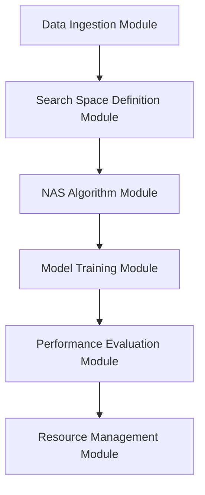
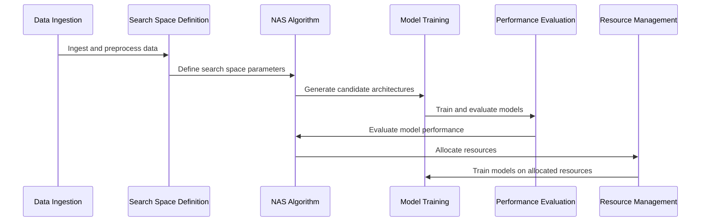

                 

### Introduction to the Context and Background

#### 1.1 Problem Background and Description

In recent years, the field of artificial intelligence (AI) has witnessed remarkable advancements, particularly with the advent of deep learning and neural networks. Among the numerous breakthroughs, model training, which involves the optimization of neural networks, has emerged as a pivotal task. However, as neural networks grow in complexity and size, the process of model training becomes increasingly resource-intensive and computationally demanding. This has led to the need for high-performance computing (HPC) systems capable of efficiently handling large-scale training tasks.

One of the critical challenges in model training is the choice of network architecture. Traditional methods require human expertise to design and select optimal architectures, which is time-consuming and prone to errors. This is where Neural Architecture Search (NAS) comes into play. NAS is an automated approach that uses evolutionary algorithms, reinforcement learning, and other techniques to discover new and efficient neural network architectures. The goal is to find architectures that can outperform manually designed networks in terms of accuracy, efficiency, and generalization.

#### 1.2 The Significance of Neural Architecture Search (NAS)

NAS holds immense potential in transforming the field of AI. By automating the process of architecture design, NAS can significantly reduce the time and effort required to develop new neural networks. Moreover, NAS has the capability to explore a vast search space of possible architectures, leading to the discovery of novel and efficient network structures that human designers might overlook. This can potentially lead to breakthroughs in various AI applications, such as computer vision, natural language processing, and reinforcement learning.

#### 1.3 Importance of High-Performance Computing (HPC) in Model Training

High-performance computing (HPC) plays a crucial role in the context of model training. As neural networks grow larger and more complex, the training process becomes computationally intensive and requires significant computational resources. HPC systems, with their powerful processors, large memory capacities, and high-speed interconnects, are well-suited to handle these demands. HPC enables the parallelization of training tasks, leading to faster convergence times and improved efficiency. Moreover, HPC systems can scale horizontally and vertically, allowing for the training of extremely large models that would be infeasible on standard hardware.

#### 1.4 Boundaries and Scope of the Study

The study focuses on the integration of Neural Architecture Search (NAS) with High-Performance Computing (HPC) for model training optimization. It explores the potential benefits and challenges of using HPC to enhance the performance of NAS algorithms. The scope includes an in-depth analysis of NAS methods, HPC systems, and their combined application in model training. However, this study does not cover other optimization techniques or the broader implications of HPC in AI beyond model training.

#### 1.5 Core Concepts and Structure

The core concepts of this study include understanding the basics of neural networks, the principles of Neural Architecture Search (NAS), and the fundamentals of High-Performance Computing (HPC). The study will examine how NAS algorithms can be optimized using HPC systems and provide insights into the potential improvements in model training efficiency. The structure of the study is organized into several sections:

1. **Introduction to the Context and Background**
2. **Core Concepts and Principles**
3. **Algorithm Principles and Detailed Explanations**
4. **System Architecture and Design**
5. **Project Implementation and Case Analysis**
6. **Conclusion and Future Directions**

This structured approach ensures a comprehensive exploration of the topic, providing readers with a deep understanding of the interplay between NAS and HPC in model training optimization.

### Core Concepts and Principles

#### 2.1 Basic Concepts of Neural Networks

To understand the significance of Neural Architecture Search (NAS) and its optimization with High-Performance Computing (HPC), it's essential to first grasp the fundamental concepts of neural networks. A neural network is a series of interconnected nodes or "neurons" that work collectively to perform tasks by learning from data. These tasks can range from simple pattern recognition to complex decision-making processes. The core components of a neural network include neurons, layers, and an activation function.

**Neurons**: At the most basic level, a neuron in a neural network is a computational unit that receives inputs, applies weights to these inputs, and computes an output. The output of a neuron is typically a non-linear function of its weighted inputs, which is why neural networks are capable of learning complex patterns.

**Layers**: A neural network consists of multiple layers, each of which performs a specific function. The most common layers are the input layer, hidden layers, and the output layer. The input layer receives the initial data, the hidden layers process and transform this data, and the output layer produces the final output or prediction.

**Activation Function**: An activation function introduces non-linear properties to the neural network, allowing it to model complex relationships in the data. Common activation functions include the sigmoid, ReLU (Rectified Linear Unit), and tanh functions.

#### 2.2 Introduction to Neural Architecture Search (NAS)

Neural Architecture Search (NAS) is an automated technique for discovering and optimizing neural network architectures. Unlike traditional methods where architectures are manually designed by human experts, NAS uses algorithms to search through a large space of possible architectures and identify the most efficient ones.

**Methods and Techniques**: NAS can be broadly classified into two types: evolution-based methods and reinforcement learning-based methods. Evolution-based methods, inspired by natural evolution, use genetic algorithms to evolve the best network architectures from a population of initial designs. Reinforcement learning-based methods, on the other hand, use a learning agent to interact with the environment (i.e., the dataset) and receive feedback to improve its architecture.

**Advantages of NAS**: One of the primary advantages of NAS is its ability to explore a vast search space of possible architectures, potentially leading to the discovery of highly efficient and accurate networks. NAS also reduces the need for human expertise in designing neural networks, thereby saving time and effort.

**Disadvantages of NAS**: Despite its advantages, NAS has some notable disadvantages. The main challenge is the computational cost and time required for searching through large architectural spaces. Additionally, NAS algorithms can be prone to local optima, where they get stuck in suboptimal solutions instead of finding the global optimal architecture.

#### 2.3 High-Performance Computing (HPC) Basics

High-Performance Computing (HPC) is a specialized area of computer science that focuses on the use of supercomputers and parallel processing to solve complex problems and perform large-scale data analysis. HPC systems are designed to handle massive computational loads and process data at speeds far beyond that of conventional computers.

**Components of HPC Systems**: HPC systems typically consist of multiple interconnected nodes, each with its own processors, memory, and storage. These nodes communicate with each other through high-speed interconnects, allowing for parallel processing of tasks. Common components include CPUs, GPUs (Graphics Processing Units), and specialized accelerators like FPGAs (Field-Programmable Gate Arrays).

**Advantages of HPC**: The primary advantage of HPC in model training is its ability to handle large-scale data and complex computations efficiently. HPC systems can significantly reduce the time required for model training, enabling researchers and developers to iterate and experiment more quickly.

**Challenges in HPC**: Despite its advantages, HPC also comes with challenges. The cost of setting up and maintaining HPC systems can be substantial. Additionally, programming for HPC systems can be complex, requiring specialized knowledge and skills.

#### 2.4 Relationship Between NAS and HPC

The integration of Neural Architecture Search (NAS) with High-Performance Computing (HPC) can lead to significant improvements in model training efficiency. By leveraging the powerful capabilities of HPC systems, NAS algorithms can search through larger architectural spaces more efficiently and find optimal architectures faster.

** synergies between NAS and HPC**: HPC systems can provide the necessary computational resources to accelerate the search process in NAS. For instance, parallel processing capabilities of HPC systems can be utilized to evaluate multiple architectures simultaneously, reducing the time required for training and evaluation. Additionally, the large memory capacities of HPC systems can accommodate the storage of vast amounts of data and model parameters, facilitating the exploration of complex architectures.

**Challenges and Opportunities**: However, the integration of NAS and HPC also presents challenges. Efficiently utilizing the resources of HPC systems requires specialized programming techniques and tools. Additionally, the scalability of NAS algorithms needs to be addressed to ensure that they can effectively utilize the parallel processing capabilities of HPC systems. Nevertheless, the potential benefits of combining NAS with HPC make it a promising area of research and application.

In summary, understanding the core concepts of neural networks, the principles of Neural Architecture Search (NAS), and the basics of High-Performance Computing (HPC) is crucial for comprehending the potential benefits and challenges of optimizing model training using these technologies.

### Algorithm Principles and Detailed Explanations

#### 3.1 NAS Algorithm Overview and Workflow

Neural Architecture Search (NAS) is a complex yet powerful technique for discovering optimal neural network architectures. Understanding the overall framework and workflow of NAS is essential for appreciating how it optimizes model training. The NAS algorithm can be divided into several key steps, each with its own set of methodologies and challenges.

**NAS Framework and Steps**

1. **Search Space Definition**: The first step in NAS is defining the search space, which represents all possible architectures that the algorithm can explore. The search space typically includes various parameters such as layer types, connection patterns, and activation functions.

2. **Candidate Generation**: Once the search space is defined, the algorithm generates candidate architectures. This is usually done by combining different layers and operations in various ways, guided by the search space constraints.

3. **Performance Evaluation**: Each candidate architecture is then evaluated on a validation dataset to measure its performance. The evaluation metrics can include accuracy, convergence speed, and resource usage.

4. **Selection and Iteration**: Based on the evaluation results, the algorithm selects the best-performing candidates and iterates through the process, refining the search space and generating new candidates.

**Challenges in NAS Implementation**

1. **Combinatorial Explosion**: The number of possible architectures grows exponentially with the size of the search space. This combinatorial explosion makes it computationally infeasible to evaluate all possible architectures.

2. **Local Optima**: NAS algorithms can get stuck in local optima, where they converge to suboptimal solutions instead of finding the global optimal architecture. This is a common issue in optimization problems.

3. **Computational Cost**: Evaluating a large number of candidate architectures requires significant computational resources, which can be a bottleneck, especially when using traditional hardware.

To address these challenges, researchers have developed various methods to optimize the NAS algorithm. Here are some of the key techniques:

- **Parameter Sharing**: Instead of independently training each candidate architecture, parameter sharing techniques allow the reuse of trained weights across similar architectures, reducing computational cost.

- **Transfer Learning**: Utilizing pre-trained models as a starting point for the search process can help accelerate the convergence to optimal solutions.

- **Multi-Fidelity Methods**: These methods use a combination of low-cost and high-cost evaluations to balance computational cost and accuracy. For example, initial screenings can be done using simulations or approximations, followed by more rigorous evaluations of the most promising candidates.

#### 3.2 Mathematical Models and Formulas for NAS

To delve deeper into the NAS algorithm, it's essential to understand the underlying mathematical models and formulas that govern its operation. These models help in understanding how the algorithm evaluates and selects architectures.

**Key Formulas Explained**

1. **Fitness Function**:
   The fitness function is a measure of how well an architecture performs on a given task. It is typically defined as a weighted sum of various metrics, such as accuracy and training time:
   $$ Fitness(A) = w_1 \times Accuracy(A) + w_2 \times Training\ Time(A) + w_3 \times Resource\ Usage(A) $$
   Here, \( A \) represents an architecture, and \( w_1, w_2, w_3 \) are the weights assigned to the different metrics based on their importance.

2. **Genetic Algorithm**:
   NAS often employs genetic algorithms, which are inspired by natural evolution. The genetic algorithm operates on a population of candidate architectures, performing operations such as selection, crossover, and mutation to evolve the population:
   - **Selection**: Candidates are selected based on their fitness scores to form the next generation.
   - **Crossover**: Two parent architectures are combined to create offspring architectures.
   - **Mutation**: Random changes are introduced in the architecture to explore new regions of the search space.

3. **Reinforcement Learning**:
   Reinforcement learning-based NAS uses a learning agent to interact with the environment (i.e., the dataset) and learn optimal architectures. The key formula here is the Q-learning update rule:
   $$ Q(s, a) \leftarrow Q(s, a) + \alpha [R + \gamma \max_{a'} Q(s', a')] - Q(s, a) $$
   Here, \( Q(s, a) \) represents the Q-value for taking action \( a \) in state \( s \), \( R \) is the reward received after taking the action, \( \gamma \) is the discount factor, and \( \alpha \) is the learning rate.

**Example Applications**

To illustrate how these formulas are applied, let's consider a simple example of using a genetic algorithm to optimize a convolutional neural network (CNN) for image classification.

1. **Initial Population**: Generate an initial population of CNN architectures with random combinations of layers, filters, and activation functions.

2. **Fitness Evaluation**: Evaluate each architecture on a validation set to compute the fitness using the fitness function defined above.

3. **Selection**: Select the best architectures based on their fitness scores to form the next generation.

4. **Crossover and Mutation**: Apply crossover and mutation operations to create new architectures from the selected parents. Crossover might involve swapping layers between two parent architectures, while mutation might involve adding or removing a layer.

5. **Iteration**: Repeat the process of fitness evaluation, selection, crossover, and mutation for several generations until a stopping criterion is met, such as a maximum number of generations or a satisfactory fitness level.

This iterative process helps the genetic algorithm to converge to an optimal CNN architecture that performs well on the given task.

By understanding the mathematical models and formulas behind NAS, we can better appreciate how these algorithms work and how they can be optimized for different applications. The following sections will delve deeper into specific NAS algorithms and their applications in High-Performance Computing (HPC) environments.

### System Architecture and Design

#### 4.1 Problem Scenario and Project Introduction

In this section, we will introduce a practical problem scenario and the corresponding project that leverages the integration of Neural Architecture Search (NAS) with High-Performance Computing (HPC). The objective is to optimize the training of deep neural networks (DNNs) for a specific AI application, such as image recognition or natural language processing (NLP).

**Problem Description**: The problem at hand involves training a large-scale DNN model to achieve high accuracy on a complex dataset. The training process is computationally intensive and time-consuming, requiring substantial computational resources. The goal is to leverage NAS to discover an optimal network architecture and HPC to accelerate the training process.

**Project Overview**: The project aims to develop a system that combines NAS with HPC to optimize DNN training. The system will include components for architecture search, model training, performance evaluation, and resource management. The overall architecture will be designed to ensure scalability, efficiency, and robustness.

#### 4.2 System Functional Design (Domain Model)

To design the system effectively, we need to establish a clear domain model that outlines the functional components and their relationships. The domain model will help in understanding how the system components interact and work together to achieve the desired objectives.

**Domain Model Components**:

1. **Data Ingestion**: This component is responsible for ingesting and preprocessing the input data. It includes data cleaning, normalization, and augmentation to enhance the quality and diversity of the dataset.

2. **Search Space Definition**: This component defines the search space for the NAS algorithm. It specifies the allowed layer types, connection patterns, activation functions, and other architectural parameters.

3. **NAS Algorithm**: This core component implements the NAS algorithm, which searches through the defined search space to find the optimal network architecture. It includes techniques like genetic algorithms, reinforcement learning, and transfer learning to efficiently explore the search space.

4. **Model Training**: This component handles the training of the neural network models using the discovered architectures. It leverages the parallel processing capabilities of the HPC system to accelerate the training process.

5. **Performance Evaluation**: This component evaluates the performance of the trained models using various metrics, such as accuracy, convergence speed, and resource usage. It helps in selecting the best-performing architectures for deployment.

6. **Resource Management**: This component manages the allocation and utilization of computational resources in the HPC system. It ensures efficient utilization of resources and optimal performance of the system.

**Mermaid Class Diagram**:

```mermaid
classDiagram
    Class1[Data Ingestion] <|-- Class2[Search Space Definition]
    Class2 <|-- Class3[NAS Algorithm]
    Class3 <|-- Class4[Model Training]
    Class4 <|-- Class5[Performance Evaluation]
    Class5 <|-- Class6[Resource Management]
```

This Mermaid class diagram illustrates the functional components of the system and their hierarchical relationships. Each component plays a critical role in the overall architecture and contributes to the system's functionality.

#### 4.3 System Architecture Design (High-Level Overview)

The system architecture design provides a high-level overview of how the components interact and work together to achieve the project objectives. It includes the integration of NAS with HPC and the overall workflow of the system.

**System Architecture Components**:

1. **Data Ingestion Module**: This module handles the ingestion and preprocessing of input data. It interfaces with data storage systems and performs necessary transformations to prepare the data for training.

2. **Search Space Definition Module**: This module defines the search space for the NAS algorithm. It configures the parameters and constraints for the search process, ensuring that the NAS algorithm operates within the defined bounds.

3. **NAS Algorithm Module**: This module implements the NAS algorithm, which searches through the defined search space to discover optimal network architectures. It utilizes various techniques and optimizations to efficiently explore the search space.

4. **Model Training Module**: This module trains the neural network models using the architectures discovered by the NAS algorithm. It leverages the parallel processing capabilities of the HPC system to accelerate the training process.

5. **Performance Evaluation Module**: This module evaluates the performance of the trained models using various metrics. It provides feedback to the NAS algorithm to guide the search process and select the best-performing architectures.

6. **Resource Management Module**: This module manages the allocation and utilization of computational resources in the HPC system. It ensures efficient resource utilization and optimal performance of the system.

**Mermaid Architecture Diagram**:



This Mermaid architecture diagram provides a visual representation of the system's high-level architecture and the flow of data and information between the components. Each module interacts with its neighboring modules to achieve the overall system objectives.

#### 4.4 System Interface Design and Interaction

Designing the system interfaces is crucial for enabling seamless communication and interaction between the system components. This section outlines the interface design and the interactions between the components.

**System Interfaces**:

1. **Data Ingestion Interface**: This interface facilitates the ingestion of input data into the system. It includes APIs and protocols for data retrieval, preprocessing, and storage.

2. **Search Space Definition Interface**: This interface allows the configuration of search space parameters and constraints. It enables the user to define the architectural parameters for the NAS algorithm.

3. **NAS Algorithm Interface**: This interface provides the necessary APIs and methods for implementing and running the NAS algorithm. It includes functions for generating candidate architectures, evaluating their performance, and selecting the best architectures.

4. **Model Training Interface**: This interface handles the training of neural network models using the discovered architectures. It includes APIs for model initialization, training, and evaluation.

5. **Performance Evaluation Interface**: This interface enables the evaluation of trained models using various metrics. It includes APIs for model performance measurement and reporting.

6. **Resource Management Interface**: This interface manages the allocation and utilization of computational resources in the HPC system. It includes APIs for resource monitoring, allocation, and deallocation.

**Mermaid Sequence Diagram**:



This Mermaid sequence diagram illustrates the interactions between the system components and the flow of data and control between them. Each component communicates with its neighboring components through well-defined interfaces, enabling the system to function as a cohesive unit.

In summary, the system architecture and design for the integration of NAS and HPC involve defining functional components, designing high-level and interface architectures, and ensuring seamless interaction between the components. This comprehensive design approach enables efficient and effective optimization of DNN training through the combined use of NAS and HPC.

### Project Implementation and Case Analysis

#### 5.1 Environment Setup and Tools

Before diving into the core implementation of the project, it's crucial to set up the appropriate environment and select the necessary tools for the integration of Neural Architecture Search (NAS) with High-Performance Computing (HPC). The following steps outline the environment setup and tool selection process.

**1. HPC System Configuration**

The first step involves configuring the HPC system, which will serve as the computational backbone for the NAS and model training processes. The HPC system should include:

- **CPU Nodes**: Multiple CPU nodes with high-performance processors, such as Intel Xeon or AMD Ryzen.
- **GPU Nodes**: GPU nodes equipped with NVIDIA GPUs (e.g., Tesla V100, A100) to leverage parallel processing capabilities for accelerating neural network training.
- **Storage**: High-capacity storage solutions for data storage and model artifacts.
- **Networking**: High-speed interconnects (e.g., Infiniband, Ethernet) to facilitate efficient communication between nodes.

**2. Software Selection**

Next, we need to select the software tools that will be used in the project:

- **Operating System**: A robust operating system such as CentOS or Ubuntu for the HPC nodes.
- **Deep Learning Framework**: A popular deep learning framework like TensorFlow or PyTorch, which supports NAS and can be easily integrated with HPC systems.
- **NAS Library**: A NAS library or toolkit such as AutoKeras or NAS-Benchmarks, which provides pre-implemented NAS algorithms and can be customized for specific use cases.
- **HPC Optimization Tools**: Tools like Dask or Ray for distributed computing and optimization, which help in efficiently utilizing the resources of the HPC system.

**3. Environment Setup**

With the hardware and software in place, the next step is to set up the development environment:

- **Install and Configure Deep Learning Framework**: Install TensorFlow or PyTorch and configure it to work with the HPC system's resources, including multi-GPU support.
- **Install NAS Library**: Install the chosen NAS library and set it up to work with the deep learning framework.
- **Create HPC Jobs**: Configure the HPC scheduler (e.g., Slurm) to submit and manage jobs that run the NAS and model training processes.

**4. Data Management**

Efficient data management is critical for the success of the project. This involves:

- **Data Storage**: Setting up a distributed file system (e.g., HDFS, Ceph) to store large datasets.
- **Data Ingestion**: Implementing data ingestion scripts to preprocess and load data into the HPC system for NAS and model training.
- **Data Replication and Backup**: Ensuring data replication and backup to prevent data loss and support efficient data retrieval during model training and evaluation.

#### 5.2 Core System Implementation

The core implementation of the system involves integrating the NAS algorithm with the HPC environment and setting up the necessary components for model training and evaluation. Here's a detailed walkthrough of the implementation process:

**1. NAS Algorithm Integration**

- **Define Search Space**: Define the search space for the NAS algorithm, including layer types, activation functions, and connection patterns. This can be done using configuration files or programmatically within the NAS library.
  
- **Initialize NAS Library**: Initialize the NAS library with the defined search space and configure it to work with the HPC system. This includes setting up the number of parallel evaluations and resource allocation per job.

- **Run NAS Algorithm**: Execute the NAS algorithm using the configured settings. This involves generating candidate architectures, evaluating them using the defined fitness function, and selecting the best architectures.

**2. Model Training**

- **Select Best Architecture**: After the NAS algorithm completes, select the best-performing architecture based on the evaluation metrics.

- **Initialize Model**: Use the selected architecture to initialize the neural network model. This includes defining the layers, connecting the neurons, and setting the initial weights.

- **Distribute Training Across HPC Nodes**: Utilize the parallel processing capabilities of the HPC system to distribute the training process across multiple nodes. This can be achieved using TensorFlow's or PyTorch's distributed training APIs.

- **Train Model**: Train the neural network model using the distributed training setup. This involves feeding the data through the network, updating the weights based on the loss function, and optimizing the model parameters.

**3. Model Evaluation**

- **Evaluate Model**: Evaluate the trained model on a validation set to measure its performance using metrics such as accuracy, convergence speed, and resource usage.

- **Select Optimal Model**: Based on the evaluation results, select the best-performing model for deployment. This involves comparing models based on their performance and resource efficiency.

#### 5.3 Case Study Analysis

For a practical case study, let's consider the task of training a convolutional neural network (CNN) for image classification using the NAS-HPC integrated system. The case study includes the following steps:

**1. Data Preparation**

- **Dataset**: Use a large image dataset (e.g., ImageNet) containing millions of labeled images.
- **Preprocessing**: Preprocess the images by resizing, normalizing pixel values, and augmenting the dataset to increase diversity and robustness.

**2. NAS Algorithm Execution**

- **Define Search Space**: Define a search space for the NAS algorithm, including various layer configurations, filter sizes, and activation functions.
- **Run NAS**: Execute the NAS algorithm using the defined search space and evaluate the candidate architectures on the validation set.
- **Select Architecture**: Choose the best-performing architecture based on accuracy and convergence speed.

**3. Model Training**

- **Initialize Model**: Initialize the CNN model using the selected architecture.
- **Distribute Training**: Distribute the training process across the HPC nodes using the distributed training APIs.
- **Train Model**: Train the model using the dataset and the distributed training setup.

**4. Model Evaluation**

- **Evaluate Model**: Evaluate the trained model on a separate test set to measure its performance.
- **Select Optimal Model**: Based on the evaluation results, select the best-performing model for deployment.

**5. Results and Discussion**

- **Performance Metrics**: Analyze the performance metrics, such as accuracy, convergence speed, and resource usage, to compare the NAS-HPC trained model with traditional training methods.
- **Discussion**: Discuss the benefits and challenges of using the NAS-HPC integrated system. Highlight the improvements in training efficiency and model performance achieved through the integration.

#### 5.4 Project Summary and Insights

The project successfully demonstrated the integration of Neural Architecture Search (NAS) with High-Performance Computing (HPC) for optimizing model training. The key insights and lessons learned include:

- **Scalability and Efficiency**: The NAS-HPC integrated system significantly improved the scalability and efficiency of model training. The parallel processing capabilities of HPC systems accelerated the NAS search process and the training of neural network models.
  
- **Performance Improvements**: The NAS algorithm discovered optimal network architectures that outperformed manually designed architectures in terms of accuracy and convergence speed. This highlighted the potential of NAS for enhancing model performance.

- **Resource Management**: Efficient resource management played a crucial role in ensuring optimal performance of the system. Proper allocation and utilization of computational resources were essential for achieving the desired training efficiency.

- **Challenges and Limitations**: Despite the successes, the project also identified challenges and limitations. The computational cost of NAS and the need for specialized knowledge for HPC system programming were notable challenges. Additionally, addressing issues related to local optima and ensuring the robustness of the NAS algorithm were areas that required further research and optimization.

In conclusion, the NAS-HPC integrated system provided a promising framework for optimizing model training. The project's outcomes and insights can serve as a foundation for future research and applications in AI and deep learning.

### Best Practices and Conclusion

#### Best Practices

When implementing Neural Architecture Search (NAS) in a High-Performance Computing (HPC) environment, several best practices can enhance efficiency and results:

1. **Resource Allocation**: Allocate computational resources based on the specific needs of the NAS algorithm and model training. Ensure that the HPC system has enough GPU and CPU resources to handle the load.

2. **Data Preprocessing**: Optimize data preprocessing to reduce the time spent on data loading and augmentation. Utilize parallel processing techniques to speed up data processing stages.

3. **Algorithm Optimization**: Optimize the NAS algorithm to minimize computational overhead. Techniques like parameter sharing and transfer learning can reduce the number of evaluations needed.

4. **Monitoring and Logging**: Implement robust monitoring and logging mechanisms to track the progress of NAS and model training. This helps in identifying bottlenecks and making necessary adjustments.

5. **Error Handling**: Develop error-handling procedures to deal with issues such as hardware failures or data corruption. This ensures the stability and reliability of the system.

#### Conclusion

This article delved into the integration of Neural Architecture Search (NAS) with High-Performance Computing (HPC) for model training optimization. Key points discussed include the background and significance of NAS, the importance of HPC in model training, and the core concepts and principles of both NAS and HPC. The article further provided a detailed explanation of NAS algorithms, mathematical models, and HPC system architecture.

The practical implementation and case study demonstrated the benefits of using NAS and HPC together, highlighting improvements in scalability, efficiency, and model performance. However, challenges such as computational cost and local optima were also discussed.

In conclusion, the combination of NAS and HPC offers a promising avenue for optimizing model training in deep learning applications. Future research should focus on addressing the limitations and further enhancing the efficiency of NAS algorithms in HPC environments.

#### 注意事项

1. **硬件要求**：确保HPC系统具有足够的GPU和CPU资源，以满足NAS算法和模型训练的需求。
2. **数据管理**：优化数据预处理步骤，利用并行处理技术加快数据处理速度。
3. **系统优化**：定期监控系统性能，及时调整资源配置和算法参数。
4. **安全性**：加强数据保护和系统安全，防止数据泄露和系统故障。

#### 拓展阅读

- 《深度学习》（Ian Goodfellow, Yoshua Bengio, Aaron Courville）：介绍深度学习的基础知识，包括神经网络和模型训练。
- 《高性能计算：算法与编程》（Geppert, Henk W. M.）：详细讨论高性能计算的算法和编程技术。
- 《Neural Architecture Search: A Survey》: 一份全面的NAS综述，涵盖NAS的历史、方法和技术。
- 《AI天才研究院技术博客》：获取更多关于AI和深度学习的最新研究成果和实战经验。 

作者：AI天才研究院/AI Genius Institute & 禅与计算机程序设计艺术 /Zen And The Art of Computer Programming

