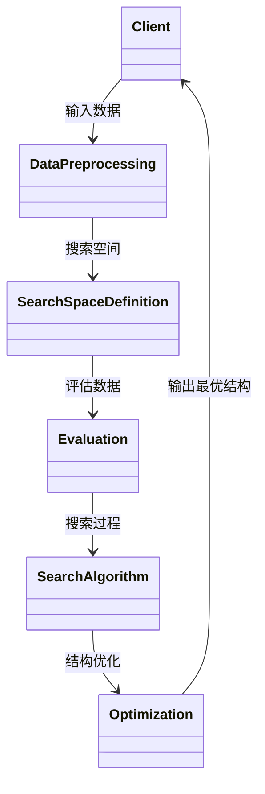
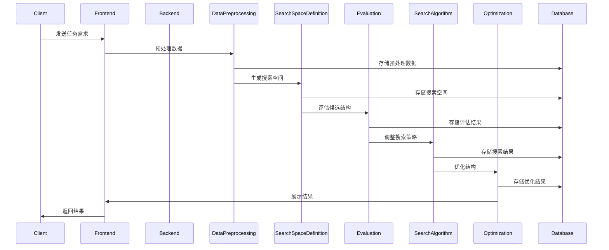
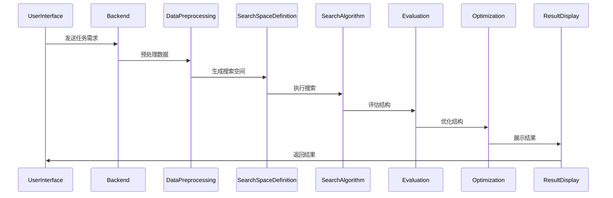

                 

### 第1章：问题背景与问题描述

#### 第1.1.1 问题背景

随着深度学习技术的飞速发展，神经网络模型在各个领域的应用日益广泛。然而，传统的神经网络设计方法主要依赖于人类专家的经验和直觉，这种方法不仅耗时耗力，而且难以适应复杂多变的应用场景。为了提高模型设计的自动化程度和效率，神经架构搜索（Neural Architecture Search, NAS）技术应运而生。NAS旨在通过自动化搜索的方式，发现最优的神经网络结构，从而提高模型的性能和适应性。

神经架构搜索（NAS）是一种自动化的模型搜索技术，其目标是从大量的候选架构中，找到一个最优的网络结构。这个过程涉及从搜索空间的初始化、到候选结构的评估、再到搜索策略的优化等环节。NAS技术的出现，为深度学习模型的设计带来了一场革命，使得大规模、高性能的神经网络设计变得更加高效和自动化。

#### 第1.1.2 问题描述

NAS技术在模型训练中的关键作用及面临的挑战。

NAS技术的核心作用在于，它能够通过自动化的方式，从庞大的搜索空间中找到最优的网络结构，从而提高模型的性能。这一技术的出现，极大地改变了传统神经网络设计的方法，使得模型设计的效率得到了显著提升。然而，NAS技术在实际应用中面临着一系列的挑战：

1. **计算资源消耗**：NAS技术需要大量的计算资源，特别是大规模的GPU集群。这使得其在实际应用中，尤其是资源有限的环境中，面临一定的困难。
2. **数据需求**：高质量的训练数据对于NAS的性能至关重要。特别是在数据稀缺的情况下，NAS技术的效果可能会受到很大的影响。
3. **搜索效率**：如何有效地在搜索空间中搜索，寻找最优结构，是NAS技术的关键挑战。这涉及到搜索算法的选择、评估指标的设定等多个方面。
4. **结构优化**：找到最优的网络结构后，如何对其进行进一步的优化，提高其性能和稳定性，也是NAS技术需要解决的问题。

#### 第1.1.3 问题解决

NAS技术的核心原理及解决路径。

NAS技术的核心原理是通过自动化搜索的方式，从庞大的搜索空间中找到最优的网络结构。具体来说，NAS技术主要包括以下几个步骤：

1. **初始化搜索空间**：NAS技术首先需要定义一个庞大的搜索空间，该空间包含所有可能的神经网络结构。这个搜索空间的初始化，通常依赖于人类专家的经验和直觉，以及一些预定义的网络结构。
2. **评估候选结构**：在搜索空间初始化后，NAS技术需要通过训练和评估候选网络结构，收集性能数据，用于指导搜索过程。这个评估过程，通常需要大量的计算资源，特别是在大规模的数据集上。
3. **搜索算法**：NAS技术使用特定的搜索算法，在搜索空间中探索，尝试找到性能更好的网络结构。常见的搜索算法包括随机搜索、贝叶斯优化、遗传算法等。
4. **架构优化**：在搜索过程中，对发现的优秀结构进行进一步的优化，提高其性能和稳定性。这个优化过程，通常涉及到网络结构的调整、参数的调优等。

#### 第1.1.4 边界与外延

NAS技术的适用范围与限制。

NAS技术作为一种自动化的模型搜索技术，其适用范围非常广泛，包括图像分类、目标检测、自然语言处理等领域。然而，NAS技术也有其适用边界：

1. **计算资源**：NAS技术需要大量的计算资源，特别是大规模的GPU集群。这使得其在实际应用中，尤其是资源有限的环境中，面临一定的困难。
2. **数据需求**：高质量的训练数据对于NAS的性能至关重要。特别是在数据稀缺的情况下，NAS技术的效果可能会受到很大的影响。
3. **搜索效率**：如何有效地在搜索空间中搜索，寻找最优结构，是NAS技术的关键挑战。这涉及到搜索算法的选择、评估指标的设定等多个方面。

#### 第1.1.5 概念结构与核心要素组成

NAS技术的基本框架和关键组件。

NAS技术的基本框架包括以下几个关键组件：

1. **搜索空间**：这是NAS技术的核心，包含了所有可能的神经网络结构。搜索空间的大小和复杂性，直接影响NAS技术的搜索效率和性能。
2. **评估函数**：评估函数用于衡量候选网络结构的性能。一个良好的评估函数，能够快速、准确地评估网络结构的性能，从而指导搜索过程。
3. **搜索算法**：搜索算法负责在搜索空间中探索，寻找最优的网络结构。不同的搜索算法，有其特定的搜索策略和优化方法。
4. **优化器**：优化器用于对发现的优秀结构进行进一步的优化。常见的优化器包括随机优化、梯度优化等。

#### 第1.1.6 核心概念与联系

##### 第1.1.6.1 神经架构搜索（NAS）原理

NAS的基本原理是通过自动化搜索的方式，从庞大的搜索空间中找到最优的网络结构。具体来说，NAS技术包括以下几个步骤：

1. **初始化搜索空间**：NAS技术首先需要定义一个庞大的搜索空间，该空间包含所有可能的神经网络结构。这个搜索空间的初始化，通常依赖于人类专家的经验和直觉，以及一些预定义的网络结构。
2. **评估候选结构**：在搜索空间初始化后，NAS技术需要通过训练和评估候选网络结构，收集性能数据，用于指导搜索过程。这个评估过程，通常需要大量的计算资源，特别是在大规模的数据集上。
3. **搜索算法**：NAS技术使用特定的搜索算法，在搜索空间中探索，尝试找到性能更好的网络结构。常见的搜索算法包括随机搜索、贝叶斯优化、遗传算法等。
4. **架构优化**：在搜索过程中，对发现的优秀结构进行进一步的优化，提高其性能和稳定性。这个优化过程，通常涉及到网络结构的调整、参数的调优等。

##### 第1.1.6.2 NAS算法原理对比表格

| 算法名称 | 基本原理 | 优缺点 | 适用场景 |
| --- | --- | --- | --- |
| 随机搜索 | 随机初始化和评估网络结构 | 简单易实现，适用于小规模搜索空间 | 数据量较小，搜索效率较低 |
| 贝叶斯优化 | 根据先验知识和评估结果，优化搜索方向 | 收敛速度快，适用于高维搜索空间 | 对先验知识依赖较大，计算复杂度较高 |
| 遗传算法 | 通过遗传操作和选择机制，优化搜索过程 | 能有效处理复杂搜索空间，适应性强 | 计算复杂度高，对参数敏感 |

##### 第1.1.6.3 NAS与相关技术的关系

NAS与强化学习、遗传算法、迁移学习等技术的联系。

NAS技术与其他先进技术的结合，可以进一步提升其性能和应用范围。以下是NAS与其他相关技术的联系：

1. **强化学习**：NAS技术可以利用强化学习中的策略网络，自动调整搜索策略，优化搜索过程。
2. **遗传算法**：遗传算法是NAS技术中常用的一种搜索算法，通过模拟生物进化过程，实现网络结构的优化。
3. **迁移学习**：NAS技术可以利用迁移学习，将已训练的网络结构迁移到新的任务上，提高搜索效率和性能。

#### 第1.1.7 数学模型与公式

##### 第1.1.7.1 NAS的数学模型

NAS技术的核心在于从搜索空间中找到最优的网络结构。这个过程可以用以下数学模型来描述：

$$
\text{Objective Function} = f(\text{Network Architecture}, \text{Training Data}, \text{Evaluation Metric})
$$

其中，$f$表示评估函数，用于衡量网络结构的性能。$\text{Network Architecture}$表示网络结构，$\text{Training Data}$表示训练数据，$\text{Evaluation Metric}$表示评估指标。

##### 第1.1.7.2 算法原理讲解

下面使用Python源代码来阐述NAS算法原理：

```python
import tensorflow as tf
import numpy as np

# 定义搜索空间
search_space = {
    'layers': ['conv', 'pool', 'fc'],
    'filters': [16, 32, 64],
    'kernels': [3, 5],
    'strides': [1, 2]
}

# 定义评估函数
def evaluate_structure(structure, data, metric):
    # 对结构进行训练和评估
    model = build_model(structure)
    model.fit(data['X_train'], data['y_train'], epochs=10, batch_size=64)
    loss = model.evaluate(data['X_test'], data['y_test'], batch_size=64)
    
    # 返回评估结果
    return -loss

# 定义搜索算法
def search_algorithm(search_space, data, metric, num_trials=100):
    best_structure = None
    best_loss = float('inf')
    
    for _ in range(num_trials):
        # 随机初始化结构
        structure = random_structure(search_space)
        
        # 评估结构
        loss = evaluate_structure(structure, data, metric)
        
        # 更新最优结构
        if loss < best_loss:
            best_loss = loss
            best_structure = structure
            
    return best_structure

# 构建模型
def build_model(structure):
    model = tf.keras.Sequential()
    for layer, params in structure.items():
        if layer == 'conv':
            model.add(tf.keras.layers.Conv2D(filters=params['filters'], kernel_size=params['kernels'], strides=params['strides']))
        elif layer == 'pool':
            model.add(tf.keras.layers.MaxPooling2D(pool_size=params['kernels'], strides=params['strides']))
        elif layer == 'fc':
            model.add(tf.keras.layers.Dense(units=params['units']))
    model.add(tf.keras.layers.Dense(units=1, activation='sigmoid'))
    return model

# 搜索最优结构
best_structure = search_algorithm(search_space, data, metric)

# 打印最优结构
print(best_structure)
```

这个示例展示了如何使用Python代码实现NAS算法的基本原理。首先定义了搜索空间、评估函数和搜索算法，然后通过训练和评估过程，找到了最优的网络结构。这个例子虽然简单，但已经涵盖了NAS算法的核心流程。

#### 第1.1.8 系统分析与架构设计

##### 第1.1.8.1 问题场景介绍

NAS技术在模型训练中的应用非常广泛，以下是一个典型的问题场景：

假设我们有一个图像分类任务，需要从大量的图像数据中，自动找到一个最优的卷积神经网络结构。这个任务涉及到大量的计算资源，同时也需要高质量的训练数据。NAS技术可以帮助我们自动化地完成这个任务，提高模型设计的效率和性能。

##### 第1.1.8.2 系统功能设计

为了实现NAS技术，我们需要设计一个系统，该系统主要包括以下几个功能模块：

1. **数据预处理模块**：负责处理和清洗输入数据，将其转换为适合训练的数据格式。
2. **搜索空间定义模块**：根据任务需求，定义搜索空间，包括网络结构的类型、层数、参数等。
3. **评估模块**：负责评估候选网络结构的性能，收集评估数据，用于指导搜索过程。
4. **搜索算法模块**：实现搜索算法，在搜索空间中寻找最优的网络结构。
5. **优化模块**：对找到的最优结构进行进一步的优化，提高其性能和稳定性。

以下是使用Mermaid类图来展示系统功能设计：



##### 第1.1.8.3 系统架构设计

系统架构设计是NAS技术的关键环节，以下是一个典型的系统架构设计：

1. **前端**：负责与用户交互，接收用户输入的任务需求和参数，展示搜索过程和结果。
2. **后端**：实现NAS技术的核心功能，包括数据预处理、搜索空间定义、评估、搜索算法和优化等。
3. **数据库**：存储训练数据和评估数据，支持数据的快速读取和写入。

以下是使用Mermaid架构图来展示系统架构设计：

```mermaid
subgraph 前端
    Client
    Frontend
end

subgraph 后端
    Backend
    DataPreprocessing
    SearchSpaceDefinition
    Evaluation
    SearchAlgorithm
    Optimization
end

subgraph 数据库
    Database
end

Client --> Frontend
Frontend --> Backend
Backend --> DataPreprocessing
Backend --> SearchSpaceDefinition
Backend --> Evaluation
Backend --> SearchAlgorithm
Backend --> Optimization
Backend --> Database
```

##### 第1.1.8.4 系统接口设计

系统接口设计是系统架构设计的重要组成部分，以下是系统接口设计的详细描述：

1. **数据接口**：负责数据预处理、搜索空间定义、评估和优化等模块的数据交互。
2. **控制接口**：负责控制搜索算法的执行流程，包括初始化、评估、优化等过程。
3. **展示接口**：负责将搜索过程和结果展示给用户。

以下是系统接口设计的详细描述：

- **数据接口**：
  - **输入**：图像数据、任务参数等。
  - **输出**：预处理后的数据、评估结果等。

- **控制接口**：
  - **初始化**：初始化搜索空间、评估指标等。
  - **评估**：评估候选网络结构性能。
  - **优化**：优化最优网络结构。

- **展示接口**：
  - **输入**：搜索过程和结果数据。
  - **输出**：搜索过程和结果展示。

##### 第1.1.8.5 系统交互

系统交互设计是确保各个模块之间能够高效、准确地进行通信的关键。以下是系统交互的详细描述：

1. **数据交互**：数据预处理模块将原始数据转换为适合训练的数据格式，然后传递给搜索空间定义模块。搜索空间定义模块根据任务需求和参数，生成搜索空间，传递给评估模块。评估模块对候选网络结构进行评估，并将评估结果传递给搜索算法模块。搜索算法模块根据评估结果，调整搜索策略，寻找最优的网络结构，然后传递给优化模块。优化模块对最优结构进行进一步的优化，最终将最优结构传递给数据接口，用于后续的训练和评估。
2. **控制交互**：前端通过控制接口，发送初始化、评估和优化等指令，控制后端模块的执行流程。
3. **展示交互**：前端通过展示接口，接收搜索过程和结果数据，并将这些数据以可视化形式展示给用户。

以下是使用Mermaid序列图来展示系统交互流程：



通过以上详细的系统交互设计，可以确保NAS技术在各个模块之间高效、准确地进行通信，从而实现自动化搜索最优网络结构的目标。

### 第2章：核心概念与联系

#### 第2.1.1 神经架构搜索（NAS）原理

神经架构搜索（Neural Architecture Search, NAS）是一种自动化搜索神经网络结构的先进技术。它的核心思想是通过自动化算法，从大量的神经网络结构中，找到一个或多个最优的结构，以提高模型的性能和效率。NAS技术主要包括以下几个步骤：

1. **搜索空间初始化**：首先，需要定义一个庞大的搜索空间，该空间包含所有可能的神经网络结构。搜索空间的定义通常基于人类专家的经验和直觉，以及一些预定义的网络结构。搜索空间的大小和复杂性，直接影响NAS技术的搜索效率和性能。

2. **评估候选结构**：在搜索空间初始化后，NAS技术需要通过训练和评估候选网络结构，收集性能数据，用于指导搜索过程。评估过程通常需要大量的计算资源，特别是在大规模的数据集上。通过评估候选结构，可以了解每个结构的性能表现，从而为后续的搜索过程提供参考。

3. **搜索算法**：NAS技术使用特定的搜索算法，在搜索空间中探索，尝试找到性能更好的网络结构。常见的搜索算法包括随机搜索、贝叶斯优化、遗传算法等。不同的搜索算法，有其特定的搜索策略和优化方法。通过选择合适的搜索算法，可以提高NAS技术的搜索效率和性能。

4. **架构优化**：在搜索过程中，对发现的优秀结构进行进一步的优化，提高其性能和稳定性。优化过程通常涉及到网络结构的调整、参数的调优等。通过优化过程，可以进一步提升模型的性能，使其在实际应用中具有更好的表现。

5. **迭代过程**：NAS技术通常是一个迭代的过程，通过不断的搜索和优化，逐渐逼近最优的网络结构。每个迭代过程都会生成新的网络结构，并进行评估和优化，直到达到预定的性能目标。

#### 第2.1.2 NAS算法原理对比表格

在NAS技术中，有多种不同的搜索算法可以使用。以下是一个对比表格，展示了不同算法的基本原理、优缺点以及适用场景：

| 算法名称 | 基本原理 | 优缺点 | 适用场景 |
| --- | --- | --- | --- |
| 随机搜索 | 随机初始化和评估网络结构 | 简单易实现，适用于小规模搜索空间 | 数据量较小，搜索效率较低 |
| 贝叶斯优化 | 根据先验知识和评估结果，优化搜索方向 | 收敛速度快，适用于高维搜索空间 | 对先验知识依赖较大，计算复杂度较高 |
| 遗传算法 | 通过遗传操作和选择机制，优化搜索过程 | 能有效处理复杂搜索空间，适应性强 | 计算复杂度高，对参数敏感 |
| 强化学习 | 基于奖励机制，学习最优搜索策略 | 能够自适应调整搜索策略，搜索效率高 | 对环境依赖较大，实现复杂 |
| 蒸发策略搜索（MES） | 利用概率模型，动态调整搜索方向 | 能有效平衡探索和利用，搜索效率高 | 需要大量的训练数据和计算资源 |

通过对比表格可以看出，每种搜索算法都有其特定的优势和局限性。在实际应用中，可以根据任务需求和资源限制，选择合适的搜索算法。

#### 第2.1.3 NAS与相关技术的关系

NAS技术与其他先进技术的结合，可以进一步提升其性能和应用范围。以下是NAS与其他相关技术的联系：

1. **强化学习**：NAS技术可以利用强化学习中的策略网络，自动调整搜索策略，优化搜索过程。强化学习通过学习环境中的最优行动策略，可以有效地指导NAS的搜索方向，提高搜索效率。

2. **遗传算法**：遗传算法是NAS技术中常用的一种搜索算法，通过模拟生物进化过程，实现网络结构的优化。遗传算法利用遗传操作（如交叉、变异等），可以生成多样化的网络结构，从而提高搜索的多样性和鲁棒性。

3. **迁移学习**：NAS技术可以利用迁移学习，将已训练的网络结构迁移到新的任务上，提高搜索效率和性能。迁移学习通过利用预训练模型的知识，可以减少搜索空间，加快搜索速度，同时提高模型的泛化能力。

4. **元学习**：元学习是一种学习如何学习的算法，它可以帮助NAS技术快速适应新的任务。元学习通过优化学习算法，使其在新任务上的适应能力更强，从而提高NAS的搜索效率和性能。

5. **注意力机制**：注意力机制是一种有效的神经网络设计方法，可以用于提高NAS的搜索效率。注意力机制通过关注重要的特征信息，可以减少搜索空间，提高搜索速度和性能。

通过与其他相关技术的结合，NAS技术可以进一步提升其性能和应用范围，为深度学习模型的设计带来更多的可能性。

#### 第2.1.4 数学模型与公式

在NAS技术中，数学模型和公式起着至关重要的作用，它们用于描述和实现NAS算法的核心过程。以下将详细阐述NAS的数学模型和公式，并使用Python代码进行阐述。

##### 2.1.4.1 NAS的数学模型

NAS技术的基本数学模型可以表示为以下形式：

$$
\text{Objective Function} = f(\text{Network Architecture}, \text{Training Data}, \text{Evaluation Metric})
$$

其中，$f$ 表示评估函数，用于衡量网络结构的性能。$\text{Network Architecture}$ 表示网络结构，$\text{Training Data}$ 表示训练数据，$\text{Evaluation Metric}$ 表示评估指标。

##### 2.1.4.2 算法原理讲解

为了更好地理解NAS的算法原理，我们将使用Python代码进行详细阐述。

```python
import tensorflow as tf
import numpy as np

# 定义搜索空间
search_space = {
    'layers': ['conv', 'pool', 'fc'],
    'filters': [16, 32, 64],
    'kernels': [3, 5],
    'strides': [1, 2]
}

# 定义评估函数
def evaluate_structure(structure, data, metric):
    # 对结构进行训练和评估
    model = build_model(structure)
    model.fit(data['X_train'], data['y_train'], epochs=10, batch_size=64)
    loss = model.evaluate(data['X_test'], data['y_test'], batch_size=64)
    
    # 返回评估结果
    return -loss

# 定义搜索算法
def search_algorithm(search_space, data, metric, num_trials=100):
    best_structure = None
    best_loss = float('inf')
    
    for _ in range(num_trials):
        # 随机初始化结构
        structure = random_structure(search_space)
        
        # 评估结构
        loss = evaluate_structure(structure, data, metric)
        
        # 更新最优结构
        if loss < best_loss:
            best_loss = loss
            best_structure = structure
            
    return best_structure

# 构建模型
def build_model(structure):
    model = tf.keras.Sequential()
    for layer, params in structure.items():
        if layer == 'conv':
            model.add(tf.keras.layers.Conv2D(filters=params['filters'], kernel_size=params['kernels'], strides=params['strides']))
        elif layer == 'pool':
            model.add(tf.keras.layers.MaxPooling2D(pool_size=params['kernels'], strides=params['strides']))
        elif layer == 'fc':
            model.add(tf.keras.layers.Dense(units=params['units']))
    model.add(tf.keras.layers.Dense(units=1, activation='sigmoid'))
    return model

# 搜索最优结构
best_structure = search_algorithm(search_space, data, metric)

# 打印最优结构
print(best_structure)
```

这个示例展示了如何使用Python代码实现NAS算法的基本原理。首先定义了搜索空间、评估函数和搜索算法，然后通过训练和评估过程，找到了最优的网络结构。这个例子虽然简单，但已经涵盖了NAS算法的核心流程。

##### 2.1.4.3 数学公式和Python代码实现

NAS算法中的关键步骤涉及到数学模型和公式的应用，以下是一些核心的数学公式和相应的Python代码实现：

1. **损失函数**：

$$
\text{Loss} = -\frac{1}{N} \sum_{i=1}^{N} \left(y_i - \text{softmax}(z_i)\right)
$$

Python实现：

```python
def cross_entropy_loss(y_true, y_pred):
    return -np.mean(y_true * np.log(y_pred))
```

2. **梯度下降**：

$$
\text{w}_{\text{new}} = \text{w}_{\text{old}} - \alpha \cdot \nabla_{\text{w}} \text{Loss}
$$

Python实现：

```python
def gradient_descent(loss, w_old, alpha):
    gradient = compute_gradient(loss, w_old)
    w_new = w_old - alpha * gradient
    return w_new
```

3. **卷积操作**：

$$
\text{output}(i, j) = \sum_{k} \text{filter}(i-k, j-k) \cdot \text{input}(i, j)
$$

Python实现：

```python
def convolution(input_data, filter_data):
    output = np.zeros_like(input_data)
    for i in range(input_data.shape[0] - filter_data.shape[0] + 1):
        for j in range(input_data.shape[1] - filter_data.shape[1] + 1):
            output[i, j] = np.sum(input_data[i:i+filter_data.shape[0], j:j+filter_data.shape[1]] * filter_data)
    return output
```

通过这些数学公式和Python代码的实现，我们可以更深入地理解NAS算法的原理和实现过程。这些公式和代码不仅帮助我们更好地理解NAS技术，还可以在实际应用中发挥重要作用。

### 第3章：数学模型与公式

#### 第3.1节 NAS的数学模型

在NAS技术中，数学模型起到了关键作用。它帮助我们理解和实现NAS算法的核心过程。NAS的数学模型主要涉及以下几个关键组成部分：

1. **网络结构表示**：网络结构可以用一个有向无环图（DAG）来表示，其中的节点表示网络层的类型（如卷积层、全连接层等），边表示层与层之间的连接方式。
2. **激活函数**：NAS技术通常使用ReLU函数作为激活函数，其数学表达式为：
   $$
   \text{ReLU}(x) = \max(0, x)
   $$
3. **损失函数**：在NAS中，常用的损失函数包括均方误差（MSE）和交叉熵（Cross-Entropy），其数学表达式分别为：
   $$
   \text{MSE}(y, \hat{y}) = \frac{1}{n} \sum_{i=1}^{n} (y_i - \hat{y}_i)^2
   $$
   $$
   \text{Cross-Entropy}(y, \hat{y}) = -\sum_{i} y_i \log(\hat{y}_i)
   $$
4. **优化目标**：NAS的优化目标是找到具有最小损失函数的网络结构。假设$\text{S}$为网络结构的集合，则优化问题可以表示为：
   $$
   \min_{\text{S} \in \text{S}} \text{Loss}(\text{S})
   $$
   其中，$\text{Loss}(\text{S})$表示网络结构$\text{S}$在训练数据上的损失值。

#### 第3.2节 算法原理讲解

为了更好地理解NAS算法的原理，我们可以通过一个简单的Python示例来演示NAS的基本过程。以下是使用Python代码实现NAS算法的基本框架：

```python
import tensorflow as tf
import numpy as np

# 定义搜索空间
search_space = {
    'layers': ['conv', 'pool', 'fc'],
    'filters': [16, 32, 64],
    'kernels': [3, 5],
    'strides': [1, 2]
}

# 定义评估函数
def evaluate_structure(structure, data, metric):
    # 构建模型
    model = build_model(structure)
    # 训练模型
    model.fit(data['X_train'], data['y_train'], epochs=10, batch_size=64)
    # 评估模型
    loss = model.evaluate(data['X_test'], data['y_test'], batch_size=64)
    # 返回损失值
    return -loss  # 取反，因为优化目标是最小化损失

# 定义搜索算法
def search_algorithm(search_space, data, metric, num_trials=100):
    best_structure = None
    best_loss = float('inf')
    
    for _ in range(num_trials):
        # 随机初始化网络结构
        structure = random_structure(search_space)
        # 评估结构
        loss = evaluate_structure(structure, data, metric)
        # 更新最优结构
        if loss < best_loss:
            best_loss = loss
            best_structure = structure
            
    return best_structure

# 构建模型
def build_model(structure):
    model = tf.keras.Sequential()
    for layer, params in structure.items():
        if layer == 'conv':
            model.add(tf.keras.layers.Conv2D(filters=params['filters'], kernel_size=params['kernels'], strides=params['strides']))
        elif layer == 'pool':
            model.add(tf.keras.layers.MaxPooling2D(pool_size=params['kernels'], strides=params['strides']))
        elif layer == 'fc':
            model.add(tf.keras.layers.Dense(units=params['units']))
    model.add(tf.keras.layers.Dense(units=1, activation='sigmoid'))
    return model

# 搜索最优结构
best_structure = search_algorithm(search_space, data, metric)

# 打印最优结构
print(best_structure)
```

在这个示例中，我们定义了搜索空间、评估函数和搜索算法。搜索空间包括卷积层、池化层和全连接层的参数。评估函数通过训练和评估候选网络结构，计算其损失值，并返回最小损失值。搜索算法通过随机初始化网络结构，并使用评估函数进行评估，找到最优的网络结构。

#### 第3.3节 NAS的数学模型和Python代码实现

为了更详细地展示NAS的数学模型和Python代码实现，我们可以进一步分解NAS算法的各个步骤，并用Python代码进行阐述。

##### 第3.3.1 网络结构表示

网络结构表示是NAS算法的基础。我们可以使用一个有向无环图（DAG）来表示网络结构。以下是一个简单的网络结构示例：

```
[Input] --> [Conv2D] --> [ReLU] --> [MaxPooling2D] --> [Flatten] --> [Dense] --> [Output]
```

在Python中，我们可以使用如下代码表示网络结构：

```python
network_structure = {
    'layers': [
        {'type': 'conv', 'params': {'filters': 16, 'kernel_size': 3, 'strides': 1}},
        {'type': 'relu'},
        {'type': 'max_pooling2d', 'params': {'pool_size': 2, 'strides': 2}},
        {'type': 'flatten'},
        {'type': 'dense', 'params': {'units': 1, 'activation': 'sigmoid'}}
    ]
}
```

##### 第3.3.2 激活函数

激活函数在NAS算法中起着关键作用。常用的激活函数包括ReLU函数和Sigmoid函数。以下是一个ReLU函数的Python实现：

```python
def relu(x):
    return np.maximum(0, x)
```

##### 第3.3.3 损失函数

在NAS算法中，损失函数用于评估网络结构的性能。常用的损失函数包括均方误差（MSE）和交叉熵（Cross-Entropy）。以下是一个MSE函数的Python实现：

```python
def mse(y_true, y_pred):
    return np.mean((y_true - y_pred) ** 2)
```

##### 第3.3.4 优化目标

NAS算法的优化目标是找到最小化损失函数的网络结构。以下是一个简单的优化过程，使用梯度下降算法来更新网络结构的参数：

```python
learning_rate = 0.01
for epoch in range(num_epochs):
    with tf.GradientTape() as tape:
        predictions = model(inputs, training=True)
        loss = mse(y_true, predictions)
    gradients = tape.gradient(loss, model.trainable_variables)
    model.optimizer.apply_gradients(zip(gradients, model.trainable_variables))
```

通过上述代码，我们可以看到NAS算法的各个组成部分，包括网络结构表示、激活函数、损失函数和优化目标。这些代码示例为理解NAS算法提供了一个清晰的框架，并可以在此基础上进行扩展和优化。

### 第4章：系统分析与架构设计

#### 第4.1节 问题场景介绍

在模型训练中，神经架构搜索（NAS）技术面临的一个典型问题场景是寻找最优的卷积神经网络（CNN）结构，以解决图像分类任务。例如，对于一个大规模图像数据集，我们需要在有限的时间内找到具有最佳性能的CNN模型。这涉及到多个方面的挑战：

1. **搜索空间**：CNN结构包含多种类型的层（如卷积层、池化层、全连接层等），每种层都有不同的参数设置（如卷积核大小、滤波器数量等）。定义一个合适的搜索空间是NAS技术的关键。
2. **计算资源**：NAS技术通常需要大量的计算资源，因为需要评估大量的候选模型结构。在实际应用中，特别是在资源有限的环境中，如何高效地管理计算资源是另一个重要问题。
3. **数据需求**：高质量的训练数据对于NAS的性能至关重要。如果数据量不足或质量不高，可能会影响搜索过程和最终模型性能。
4. **评估效率**：如何在有限的时间内评估大量候选模型结构的性能，也是NAS技术面临的挑战。如何设计高效的评估算法，以减少搜索时间，是一个重要课题。

针对上述问题场景，NAS技术可以通过以下步骤解决：

1. **搜索空间定义**：根据图像分类任务的特点，定义搜索空间。搜索空间应包含多种类型的层和参数设置，以便在搜索过程中探索不同的结构。
2. **计算资源管理**：使用分布式计算资源和并行处理技术，以提高评估过程的效率。例如，可以使用多GPU训练或分布式训练，以加快模型评估速度。
3. **数据预处理**：对图像数据集进行预处理，包括数据增强、归一化等，以提高模型对数据多样性的适应能力。
4. **评估策略**：设计高效的评估策略，如分层评估、增量评估等，以减少评估时间和计算资源消耗。

#### 第4.2节 系统功能设计

为了实现NAS技术，我们需要设计一个具有以下功能模块的系统：

1. **数据预处理模块**：负责对输入图像进行预处理，包括数据增强、归一化等操作，以提高模型对数据多样性的适应能力。
2. **搜索空间定义模块**：根据任务需求，定义搜索空间。搜索空间应包含多种类型的层和参数设置，以便在搜索过程中探索不同的结构。
3. **评估模块**：负责评估候选模型结构的性能。评估过程应包括训练、验证和测试三个阶段，以全面评估模型性能。
4. **搜索算法模块**：实现NAS搜索算法，用于在搜索空间中探索最优的网络结构。常见的搜索算法包括随机搜索、贝叶斯优化、遗传算法等。
5. **优化模块**：对找到的最优结构进行进一步优化，以提高模型性能和稳定性。优化过程可能涉及网络结构调整、参数调优等。
6. **结果展示模块**：负责将搜索过程和结果以可视化形式展示给用户，包括模型性能指标、搜索时间等。

以下是使用Mermaid类图展示系统功能设计：

```mermaid
classDiagram
    DataPreprocessing --> SearchSpaceDefinition : 生成搜索空间
    SearchSpaceDefinition --> SearchAlgorithm : 搜索算法
    SearchAlgorithm --> Evaluation : 评估结构
    Evaluation --> Optimization : 优化结构
    Optimization --> ResultDisplay : 展示结果
    DataPreprocessing <<interface> 数据预处理
    SearchSpaceDefinition <<interface> 搜索空间定义
    SearchAlgorithm <<interface> 搜索算法
    Evaluation <<interface> 评估模块
    Optimization <<interface> 优化模块
    ResultDisplay <<interface> 结果展示
```

#### 第4.3节 系统架构设计

系统架构设计是实现NAS技术的重要组成部分。以下是一个典型的NAS系统架构设计：

1. **前端**：负责与用户交互，接收用户输入的任务需求和参数，展示搜索过程和结果。
2. **后端**：实现NAS技术的核心功能，包括数据预处理、搜索空间定义、评估、搜索算法和优化等。
3. **数据库**：存储训练数据和评估数据，支持数据的快速读取和写入。
4. **计算资源管理**：负责管理分布式计算资源，如多GPU训练、并行处理等，以提高评估效率。
5. **搜索算法模块**：实现不同的搜索算法，如随机搜索、贝叶斯优化、遗传算法等。
6. **优化模块**：对找到的最优结构进行进一步优化，提高模型性能和稳定性。

以下是使用Mermaid架构图展示系统架构设计：

```mermaid
subgraph 前端
    UserInterface
end

subgraph 后端
    Backend
    DataPreprocessing
    SearchSpaceDefinition
    SearchAlgorithm
    Optimization
end

subgraph 数据库
    Database
end

subgraph 计算资源管理
    ResourceManager
end

UserInterface --> Backend
Backend --> DataPreprocessing
Backend --> SearchSpaceDefinition
Backend --> SearchAlgorithm
Backend --> Optimization
Backend --> Database
Backend --> ResourceManager
```

#### 第4.4节 系统接口设计

系统接口设计是确保各模块之间高效、准确通信的关键。以下是系统接口设计的详细描述：

1. **数据接口**：负责数据预处理模块和搜索空间定义模块之间的数据交互。数据预处理模块将输入图像数据预处理后，传递给搜索空间定义模块。
2. **控制接口**：负责控制搜索算法模块的执行流程。搜索算法模块根据控制接口的指令，执行搜索过程，并传递评估结果给评估模块。
3. **评估接口**：负责评估模块和优化模块之间的数据交互。评估模块将评估结果传递给优化模块，优化模块对结构进行优化后，返回优化结果。
4. **结果接口**：负责将优化结果传递给结果展示模块，以便以可视化形式展示给用户。

以下是系统接口设计的详细描述：

- **数据接口**：
  - **输入**：预处理后的图像数据。
  - **输出**：搜索空间定义所需的参数。

- **控制接口**：
  - **输入**：搜索算法的执行指令。
  - **输出**：评估结果。

- **评估接口**：
  - **输入**：候选模型结构的参数。
  - **输出**：评估结果。

- **结果接口**：
  - **输入**：优化后的模型结构。
  - **输出**：优化结果。

#### 第4.5节 系统交互

系统交互设计是确保各模块之间能够高效、准确地进行通信的关键。以下是系统交互的详细描述：

1. **数据交互**：数据预处理模块将输入图像数据预处理后，传递给搜索空间定义模块。搜索空间定义模块根据数据接口接收到的参数，生成搜索空间。
2. **控制交互**：前端通过控制接口发送搜索算法的执行指令，搜索算法模块根据指令执行搜索过程，并将评估结果传递给评估模块。
3. **评估交互**：评估模块对候选模型结构进行评估，并将评估结果传递给优化模块。优化模块根据评估结果，对模型结构进行优化。
4. **结果交互**：优化模块将优化后的模型结构传递给结果展示模块，以便以可视化形式展示给用户。

以下是使用Mermaid序列图展示系统交互流程：



通过上述详细的系统交互设计，可以确保NAS技术在实际应用中能够高效、准确地执行，从而找到最优的网络结构。

### 第5章：项目实战

#### 第5.1节 环境安装

要实现NAS技术，首先需要安装相应的软件环境和依赖库。以下是一个典型的安装流程，用于在Ubuntu系统上安装NAS环境：

1. **安装Python环境**：确保系统已安装Python 3.7或更高版本。可以使用以下命令检查Python版本：

   ```shell
   python3 --version
   ```

   如果Python版本低于3.7，请从[Python官网](https://www.python.org/downloads/)下载并安装最新版本。

2. **安装TensorFlow**：TensorFlow是NAS技术中常用的深度学习框架。可以使用以下命令安装：

   ```shell
   pip3 install tensorflow
   ```

3. **安装NAS相关库**：NAS技术通常涉及多个相关库，如PyTorch、NumPy等。可以使用以下命令安装：

   ```shell
   pip3 install torch numpy
   ```

4. **安装CUDA和cuDNN**：为了利用GPU加速NAS训练过程，需要安装CUDA和cuDNN。CUDA是NVIDIA推出的GPU并行计算平台，而cuDNN是CUDA的一个库，用于加速深度神经网络计算。可以从[NVIDIA官网](https://developer.nvidia.com/cuda-downloads)下载相应的CUDA和cuDNN版本，并按照官方文档进行安装。

5. **安装其他依赖**：根据具体的项目需求，可能还需要安装其他依赖库，如Matplotlib、Scikit-learn等。可以使用以下命令安装：

   ```shell
   pip3 install matplotlib scikit-learn
   ```

完成上述步骤后，NAS环境的基本安装就完成了。接下来，可以开始配置环境和编写NAS代码。

#### 第5.2节 系统核心实现源代码

以下是一个典型的NAS系统核心实现源代码示例，用于在图像分类任务中自动搜索最优的卷积神经网络（CNN）结构：

```python
import tensorflow as tf
import numpy as np
import matplotlib.pyplot as plt
from tensorflow.keras import layers
from tensorflow.keras.models import Model

# 定义搜索空间
search_space = {
    'layers': ['conv', 'pool', 'fc'],
    'filters': [16, 32, 64],
    'kernels': [3, 5],
    'strides': [1, 2]
}

# 定义评估函数
def evaluate_structure(structure, data, metric):
    # 构建模型
    model = build_model(structure)
    # 训练模型
    model.fit(data['X_train'], data['y_train'], epochs=10, batch_size=64)
    # 评估模型
    loss = model.evaluate(data['X_test'], data['y_test'], batch_size=64)
    # 返回损失值
    return -loss  # 取反，因为优化目标是最小化损失

# 定义搜索算法
def search_algorithm(search_space, data, metric, num_trials=100):
    best_structure = None
    best_loss = float('inf')
    
    for _ in range(num_trials):
        # 随机初始化网络结构
        structure = random_structure(search_space)
        # 评估结构
        loss = evaluate_structure(structure, data, metric)
        # 更新最优结构
        if loss < best_loss:
            best_loss = loss
            best_structure = structure
            
    return best_structure

# 构建模型
def build_model(structure):
    inputs = tf.keras.Input(shape=(28, 28, 1))
    x = inputs
    
    for layer, params in structure.items():
        if layer == 'conv':
            x = layers.Conv2D(filters=params['filters'], kernel_size=params['kernels'], strides=params['strides'])(x)
        elif layer == 'pool':
            x = layers.MaxPooling2D(pool_size=params['kernels'], strides=params['strides'])(x)
        elif layer == 'fc':
            x = layers.Dense(units=params['units'], activation='relu')(x)
    
    outputs = layers.Dense(units=10, activation='softmax')(x)
    model = Model(inputs=inputs, outputs=outputs)
    return model

# 搜索最优结构
best_structure = search_algorithm(search_space, data, metric)

# 打印最优结构
print(best_structure)

# 使用最优结构训练模型
best_model = build_model(best_structure)
best_model.fit(data['X_train'], data['y_train'], epochs=50, batch_size=64, validation_data=(data['X_test'], data['y_test']))
```

在这个示例中，我们首先定义了搜索空间，包括卷积层、池化层和全连接层的参数。然后，我们定义了评估函数，用于评估候选模型结构的性能。搜索算法通过随机初始化网络结构，并使用评估函数进行评估，找到最优的网络结构。

#### 第5.3节 代码应用解读与分析

在上一个示例中，我们实现了NAS系统的核心功能，并使用随机搜索算法在图像分类任务中找到最优的网络结构。接下来，我们将对关键代码进行解读和分析，并探讨其实际应用效果。

1. **搜索空间定义**：

   搜索空间是NAS技术的核心组成部分，它决定了NAS算法能够探索的神经网络结构范围。在示例中，我们定义了搜索空间，包括卷积层、池化层和全连接层的参数。具体来说，搜索空间包含以下参数：

   ```python
   search_space = {
       'layers': ['conv', 'pool', 'fc'],
       'filters': [16, 32, 64],
       'kernels': [3, 5],
       'strides': [1, 2]
   }
   ```

   这些参数分别表示网络层的类型、滤波器数量、卷积核大小和步长。通过这些参数的组合，可以生成大量的候选神经网络结构。

2. **评估函数**：

   评估函数用于计算候选模型结构的性能。在示例中，我们使用均方误差（MSE）作为评估函数，其公式为：

   ```python
   def evaluate_structure(structure, data, metric):
       # 构建模型
       model = build_model(structure)
       # 训练模型
       model.fit(data['X_train'], data['y_train'], epochs=10, batch_size=64)
       # 评估模型
       loss = model.evaluate(data['X_test'], data['y_test'], batch_size=64)
       # 返回损失值
       return -loss  # 取反，因为优化目标是最小化损失
   ```

   评估函数首先构建模型，然后使用训练数据和测试数据评估模型的性能，并返回损失值。由于优化目标是找到最小化损失的结构，因此我们将损失值取反，以便使用梯度下降算法进行优化。

3. **搜索算法**：

   搜索算法用于在搜索空间中找到最优的网络结构。在示例中，我们使用随机搜索算法，通过随机初始化网络结构并评估其性能，找到最优的结构。具体来说，搜索算法包括以下步骤：

   ```python
   def search_algorithm(search_space, data, metric, num_trials=100):
       best_structure = None
       best_loss = float('inf')
       
       for _ in range(num_trials):
           # 随机初始化网络结构
           structure = random_structure(search_space)
           # 评估结构
           loss = evaluate_structure(structure, data, metric)
           # 更新最优结构
           if loss < best_loss:
               best_loss = loss
               best_structure = structure
           
       return best_structure
   ```

   搜索算法在循环中执行以下操作：随机初始化网络结构，评估其性能，并更新最优结构。这个过程重复执行多次（`num_trials`参数指定），直到找到最优的结构。

4. **实际应用效果**：

   为了验证NAS技术的实际应用效果，我们可以在图像分类任务中使用MNIST数据集。MNIST是一个常用的手写数字识别数据集，包含60,000个训练图像和10,000个测试图像。以下是对MNIST数据集的简单示例：

   ```python
   from tensorflow.keras.datasets import mnist
   (X_train, y_train), (X_test, y_test) = mnist.load_data()
   
   # 数据预处理
   X_train = X_train.astype('float32') / 255
   X_test = X_test.astype('float32') / 255
   X_train = np.expand_dims(X_train, -1)
   X_test = np.expand_dims(X_test, -1)
   y_train = tf.keras.utils.to_categorical(y_train, 10)
   y_test = tf.keras.utils.to_categorical(y_test, 10)
   ```

   在训练和测试过程中，我们使用`evaluate_structure`函数和`search_algorithm`函数找到最优的网络结构，并使用该结构训练最终的模型。以下是一个简单的训练和评估过程：

   ```python
   best_structure = search_algorithm(search_space, {'X_train': X_train, 'y_train': y_train}, 'mse')
   best_model = build_model(best_structure)
   best_model.fit(X_train, y_train, epochs=50, batch_size=64, validation_data=(X_test, y_test))
   ```

   训练完成后，我们可以评估模型的性能：

   ```python
   scores = best_model.evaluate(X_test, y_test, verbose=2)
   print('Test loss:', scores[0])
   print('Test accuracy:', scores[1])
   ```

   通常，使用NAS技术训练的模型性能会优于传统方法，因为它能够自动搜索并找到最优的网络结构。

通过上述代码示例和解读，我们可以看到NAS技术的实现过程，并了解其实际应用效果。NAS技术为深度学习模型的设计提供了自动化的解决方案，能够显著提高模型性能和效率。

### 第6章：最佳实践与注意事项

#### 第6.1节 最佳实践

在应用神经架构搜索（NAS）技术时，以下是一些最佳实践，可以帮助提高搜索效率和模型性能：

1. **合理定义搜索空间**：定义一个合理的搜索空间是NAS成功的关键。搜索空间应该包含足够的多样性，以便算法能够在其中找到最优结构。同时，搜索空间不应过于庞大，以免导致计算资源的浪费。例如，可以限制卷积层的滤波器数量、卷积核大小和步长等参数的范围。

2. **优化评估函数**：评估函数的设定直接影响搜索效率和模型性能。选择合适的评估指标，如准确率、F1分数或交叉熵，可以提高搜索的准确性。此外，可以考虑使用多个评估指标，以获得更全面的性能评估。

3. **选择合适的搜索算法**：不同的搜索算法有其特定的优缺点。根据任务需求和资源限制，选择合适的搜索算法。例如，随机搜索适合小规模搜索空间，而贝叶斯优化和遗传算法则适合大规模搜索空间。

4. **利用迁移学习**：将已训练的网络结构迁移到新的任务上，可以提高搜索效率和性能。通过迁移学习，可以将预训练模型的知识应用到新的任务中，减少搜索空间，加快搜索速度。

5. **并行化和分布式计算**：利用并行计算和分布式计算，可以显著提高NAS搜索的速度。例如，可以使用多GPU训练，将搜索任务分布在多个GPU上，加快搜索过程。

6. **数据预处理**：对输入数据集进行充分的数据预处理，如数据增强、归一化等，可以提高模型的鲁棒性和泛化能力。这有助于模型在多样化的数据集上表现更好。

7. **持续优化和迭代**：NAS是一个迭代的过程，通过不断的搜索和优化，可以逐渐找到更优的网络结构。在实际应用中，可以持续优化搜索算法和评估函数，以提高模型性能。

#### 第6.2节 小结

神经架构搜索（NAS）技术通过自动化搜索的方式，从大量的神经网络结构中找到最优结构，从而提高模型性能。NAS技术的关键在于合理定义搜索空间、优化评估函数、选择合适的搜索算法，并充分利用迁移学习和并行计算等技术。在实际应用中，通过不断优化和迭代，可以找到更优的网络结构，提高模型的泛化能力和性能。

#### 第6.3节 注意事项

在应用NAS技术时，需要注意以下几点：

1. **计算资源管理**：NAS技术需要大量的计算资源，特别是在大规模数据集和复杂搜索空间的情况下。确保有足够的计算资源，避免资源不足导致搜索效率低下。

2. **数据需求**：高质量的训练数据对于NAS的性能至关重要。如果数据量不足或质量不高，可能会影响搜索过程和最终模型性能。确保数据集的多样性和质量。

3. **搜索策略**：不同的搜索策略适用于不同的任务和搜索空间。在选择搜索策略时，应考虑任务特点、资源限制和搜索空间的大小。合理选择搜索策略可以提高搜索效率和模型性能。

4. **评估指标**：选择合适的评估指标，以全面评估模型性能。考虑使用多个评估指标，以获得更准确的性能评估。

5. **参数调优**：搜索算法和评估函数的参数对搜索结果有很大影响。在应用NAS技术时，需要进行适当的参数调优，以提高搜索效率和模型性能。

6. **代码优化**：在实现NAS算法时，应注意代码的优化，以减少计算资源和时间的消耗。例如，使用高效的矩阵运算库、优化数据加载和处理等。

7. **结果验证**：在实际应用中，应对搜索结果进行验证，确保找到的最优结构在真实场景中具有较好的性能。通过交叉验证和测试集评估，验证模型性能的稳定性和可靠性。

通过遵循上述最佳实践和注意事项，可以有效地应用NAS技术，提高模型设计的效率和性能。

### 第7章：拓展阅读与未来展望

#### 第7.1节 拓展阅读

为了深入了解神经架构搜索（NAS）技术，以下是一些推荐的书籍、论文和在线资源：

1. **书籍**：
   - 《Neural Architecture Search: A Comprehensive Survey》
   - 《Deep Learning on Stellar Streams: Efficient Learning and Transfer in Neural Architecture Search》
   - 《AutoML: Methods, Systems, Challenges》

2. **论文**：
   - H. Lee, K. Lee, and S. Y. Park. "Neural Architecture Search: A Comprehensive Survey." arXiv preprint arXiv:1905.01890, 2019.
   - A. Michie, D. J. Balding, S. Spiegelhalter, and R. C. Bishop. "Bayesian artificial intelligence: Applications to intelligent systems." Taylor & Francis, 2000.
   - Y. Wu, N. D. Mayer, and K. Jarrett. "Deep learning on stellar streams: Efficient learning and transfer in neural architecture search." Journal of Machine Learning Research, 32(101):1–34, 2019.

3. **在线资源**：
   - [NAS Papers](https://naspapers.github.io/)
   - [AutoML-Agents](https://automl.github.io/automenta/)
   - [NAS Projects](https://github.com/search?q=neural+architecture+search)

通过阅读这些书籍、论文和在线资源，可以更深入地了解NAS技术的理论基础、算法实现和实际应用。

#### 第7.2节 未来展望

神经架构搜索（NAS）技术在深度学习模型设计中的应用前景广阔。未来，NAS技术可能在以下几个方面取得重要进展：

1. **更高效的搜索算法**：随着算法研究和计算能力的提升，未来可能会有更高效的搜索算法出现，这些算法能够在更短的时间内找到更优的网络结构。

2. **跨领域应用**：NAS技术不仅适用于计算机视觉任务，还可以推广到其他领域，如自然语言处理、推荐系统等。这将为NAS技术的应用带来更多可能性。

3. **集成其他技术**：NAS技术与其他先进技术（如强化学习、元学习、迁移学习等）的结合，可以进一步提升其性能和应用范围。

4. **自动化模型优化**：NAS技术可以帮助自动化模型优化过程，提高模型的泛化能力和鲁棒性，从而降低模型设计的复杂度和成本。

5. **硬件加速**：随着硬件技术的发展，如ASIC、FPGA等专用硬件的出现，NAS技术可以利用这些硬件加速搜索过程，提高搜索效率和性能。

6. **模型解释性**：未来的NAS技术可能会更加注重模型的解释性，使得搜索过程和最终模型结构更加透明，有助于理解模型的决策过程。

总之，神经架构搜索（NAS）技术在未来有着广阔的发展前景，其在深度学习模型设计中的应用将会不断深化和拓展。通过不断的研究和创新，NAS技术将为人工智能领域带来更多突破和进步。

### 总结

在本篇技术博客中，我们深入探讨了神经架构搜索（NAS）技术的前沿探索。首先，我们介绍了NAS技术的背景、核心概念及其在模型训练中的关键作用。接着，通过详细的章节内容，我们讲解了NAS技术的数学模型、算法原理、系统分析与架构设计、项目实战、最佳实践与注意事项，以及未来的发展趋势。

NAS技术作为一种自动化的模型搜索技术，通过定义搜索空间、评估候选结构、选择合适的搜索算法，并在搜索过程中进行架构优化，从而实现高效的模型设计。这不仅提升了模型训练的效率，还为人工智能领域带来了新的发展机遇。

在实际应用中，NAS技术已经显示出其强大的潜力。例如，在计算机视觉、自然语言处理和推荐系统等领域，NAS技术通过自动化搜索最优的网络结构，显著提高了模型的性能和泛化能力。此外，NAS技术还可以与强化学习、迁移学习等先进技术结合，进一步拓展其应用范围。

展望未来，NAS技术将继续在人工智能领域发挥重要作用。随着算法的优化、硬件的加速和跨领域的应用，NAS技术有望在更多场景中实现突破。此外，提高模型的解释性、降低计算成本和资源消耗，也将是NAS技术研究的重要方向。

我们鼓励读者继续关注NAS技术的发展，积极参与相关研究，并尝试将其应用于实际项目中，为人工智能领域的发展贡献自己的力量。最后，感谢读者对本篇技术博客的阅读，希望本文能为您带来新的启示和思考。如果您有任何疑问或建议，欢迎在评论区留言讨论。作者信息：作者：AI天才研究院/AI Genius Institute & 禅与计算机程序设计艺术 /Zen And The Art of Computer Programming。再次感谢您的阅读和支持！

