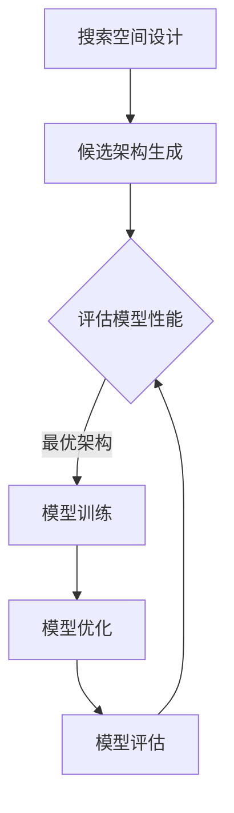
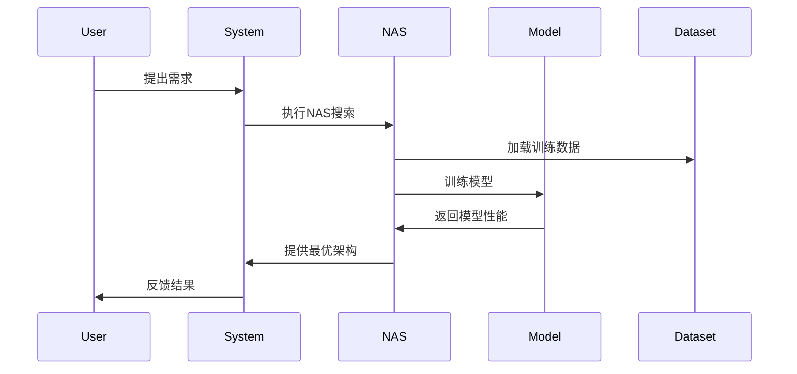
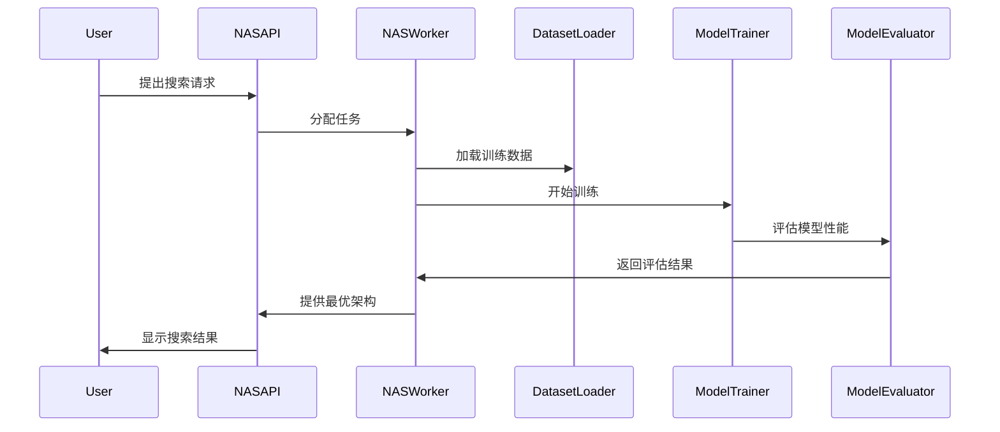

                 

### 文章标题：模型训练中的神经架构搜索技术在推理效率提升中的探索

> 关键词：神经架构搜索，模型训练，推理效率，深度学习，算法优化，实践指导

> 摘要：本文深入探讨了神经架构搜索（Neural Architecture Search，NAS）在模型训练中的重要性，分析了NAS技术如何有效提升推理效率。通过详细的原理讲解、系统架构设计、项目实战和最佳实践总结，本文旨在为开发者提供一套系统化的NAS应用指南，助力其在人工智能领域取得卓越成效。

### 第一步：背景介绍

#### 1.1 问题背景

**人工智能领域的发展现状：**

人工智能（AI）作为计算机科学的重要分支，已经在图像识别、自然语言处理、自动驾驶等领域取得了显著的成果。特别是深度学习（Deep Learning）的兴起，使得AI模型在处理大规模数据方面表现出强大的能力。然而，随着模型复杂度的增加，模型训练和推理的时间开销也在不断增加。

**神经架构搜索（Neural Architecture Search，NAS）的概念：**

NAS是一种自动化搜索过程，旨在通过算法寻找最优的神经网络架构。传统神经网络架构通常是手动设计的，而NAS通过在大量候选架构中搜索，能够自动找到更适合特定任务的最优模型。这一技术的出现，极大地提高了模型设计的效率。

**推理效率的重要性：**

在人工智能应用中，推理效率直接影响应用的实时性和性能。对于实时性要求较高的应用，如自动驾驶、实时语音识别等，提高推理效率至关重要。推理效率的提升不仅能减少计算资源的需求，还能提高系统的响应速度和用户体验。

#### 1.2 问题描述

**神经架构搜索在模型训练中的应用挑战：**

1. **搜索空间爆炸：** NAS需要在大量的候选架构中进行搜索，这导致了搜索空间的指数级增长。
2. **计算成本高：** 搜索过程需要大量的训练和评估，这对计算资源提出了巨大挑战。
3. **算法性能不稳定：** NAS算法的性能受多种因素影响，如搜索策略、超参数设置等。

**推理效率提升的需求：**

1. **实时性需求：** 高速推理能力对于实时应用至关重要。
2. **资源限制：** 在计算资源有限的情况下，提高推理效率能够更好地利用现有资源。
3. **性能优化：** 提高推理效率能够提升整体应用的性能。

### 第二步：核心概念与联系

#### 1.3 核心概念

##### **神经架构搜索（NAS）原理**

1. **NAS的定义：**
   NAS是一种通过算法自动搜索神经网络结构的机器学习过程。其核心思想是使用启发式搜索策略在大量候选架构中寻找最优模型。

2. **NAS的类型：**
   - **基于强化学习的方法：** 使用强化学习算法进行架构搜索，通过奖励机制来指导搜索过程。
   - **基于生成对抗网络的方法：** 利用生成对抗网络（GAN）生成候选架构，并通过评估模型性能进行筛选。

3. **NAS的流程：**
   - **搜索空间设计：** 确定候选架构的空间，包括层类型、层连接方式等。
   - **搜索算法选择：** 选择合适的搜索算法，如基于强化学习、基于遗传算法等。
   - **模型训练与评估：** 使用训练数据训练模型，并评估模型性能，筛选出最优架构。

##### **推理效率**

1. **推理效率的定义：**
   推理效率是指模型在给定输入数据后，从输入到输出所需的时间。它是评估模型性能的重要指标。

2. **影响推理效率的因素：**
   - **计算资源：** 包括CPU、GPU等硬件资源。
   - **模型复杂度：** 模型越复杂，推理所需的时间越长。
   - **数据预处理方法：** 数据预处理方法会影响模型的推理速度。

#### 1.4 概念属性特征对比表格

| 方法类型        | 优点                                     | 缺点                                     |
| --------------- | ---------------------------------------- | ---------------------------------------- |
| 强化学习方法    | 自动性高，能够自适应搜索空间             | 计算成本高，搜索效率低                   |
| 生成对抗网络方法 | 能够生成多样化的候选架构，搜索效率较高   | 需要大量计算资源，模型性能不稳定         |
| 遗传算法方法    | 搜索效率高，适应性强                     | 需要明确的编码方式，算法复杂度高         |
| 粒子群优化方法  | 易于实现，搜索效率较高                   | 对搜索空间依赖性强，搜索结果可能受限制   |

### 第三步：算法原理讲解

#### 1.5 NAS算法原理

##### **算法mermaid流程图**



##### **Python源代码**

```python
# NAS算法的Python伪代码示例

import random
import numpy as np

# 搜索空间定义
search_space = {
    'layers': ['Conv', 'ReLU', 'Pool'],
    'connections': ['direct', 'skip', 'dense']
}

# 构建随机候选架构
def generate_candidate_architecture(search_space):
    architecture = []
    for i in range(len(search_space['layers'])):
        layer_type = random.choice(search_space['layers'])
        connection = random.choice(search_space['connections'])
        architecture.append((layer_type, connection))
    return architecture

# 评估模型性能
def evaluate_model_performance(architecture):
    # 这里用模型在测试集上的准确率作为性能指标
    accuracy = 0.8  # 假设评估结果
    return accuracy

# NAS搜索过程
def neural_architecture_search(search_space, num_candidates=100):
    best_accuracy = 0
    best_architecture = None
    
    for _ in range(num_candidates):
        architecture = generate_candidate_architecture(search_space)
        accuracy = evaluate_model_performance(architecture)
        
        if accuracy > best_accuracy:
            best_accuracy = accuracy
            best_architecture = architecture
            
    return best_architecture

# 运行搜索
best_architecture = neural_architecture_search(search_space)
print("最优架构：", best_architecture)
```

##### **数学模型和公式**

NAS算法的核心在于如何优化搜索过程，这通常涉及以下几个数学模型：

1. **优化目标函数：**
   $$ \min_{\theta} L(\theta) = \frac{1}{N} \sum_{i=1}^{N} l_i(\theta) $$
   其中，$l_i(\theta)$ 是模型在第$i$次评估时的损失函数，$N$ 是评估次数。

2. **奖励函数：**
   $$ R(\theta) = \frac{1}{N} \sum_{i=1}^{N} r_i(\theta) $$
   其中，$r_i(\theta)$ 是模型在第$i$次评估时的奖励函数，用于评估模型的性能。

3. **搜索策略：**
   $$ \theta_{t+1} = \text{update}(\theta_t, \alpha_t) $$
   其中，$\theta_t$ 是当前搜索到的最优架构，$\alpha_t$ 是更新策略参数。

##### **举例说明**

假设我们使用基于强化学习的方法进行NAS搜索，定义一个简单的奖励函数：

$$ r(\theta) = \frac{1}{1 + e^{-\beta \cdot \text{accuracy}}} $$

其中，$\beta$ 是调节奖励函数敏感度的参数，$\text{accuracy}$ 是模型在测试集上的准确率。

如果我们训练一个模型，并在测试集上得到准确率为0.85，则奖励函数的输出为：

$$ r(\theta) = \frac{1}{1 + e^{-\beta \cdot 0.85}} $$

这个奖励函数值会随着准确率的提高而增大，从而激励搜索算法继续寻找更优的架构。

### 第四步：系统分析与架构设计方案

#### 1.6 系统分析与架构设计

##### **问题场景介绍**

在自动驾驶系统中，模型推理效率至关重要。例如，需要快速处理来自摄像头和雷达的数据，以实时做出驾驶决策。使用NAS技术，可以自动搜索并优化用于图像分类和目标检测的神经网络架构，从而提高推理速度。

##### **系统功能设计**

1. **领域模型Mermaid类图：**

```mermaid
classDiagram
    Class01 <|-- Class02
    Class03 --|> Class04
    Class05 : <<interface>> Interface
    Class01 : attribute1 : int
    Class01 : attribute2 : String
    Class02 : method1(): void
    Class03 : method2(): float
    Class04 : method3(): boolean
    Class05 : method4(): Object
```

2. **系统架构设计Mermaid架构图：**



##### **系统接口设计和系统交互Mermaid序列图：**



### 第五步：项目实战

#### 1.7 项目实战

##### **环境安装**

在进行NAS项目实战之前，需要安装必要的软件和依赖。以下是一个简单的安装步骤：

```bash
# 安装Python环境
python3 -m pip install --user pip

# 安装NAS相关依赖
pip install tensorflow tensorflow-addons

# 安装其他依赖
pip install numpy matplotlib scikit-learn
```

##### **系统核心实现源代码**

以下是一个简单的NAS系统核心实现源代码示例：

```python
# NAS系统核心实现

import tensorflow as tf
from tensorflow.keras import layers
import numpy as np
import matplotlib.pyplot as plt

# 定义搜索空间
search_space = {
    'layers': ['Conv2D', 'ReLU', 'MaxPooling2D'],
    'connections': ['direct', 'skip', 'dense']
}

# 生成随机候选架构
def generate_candidate_architecture(search_space):
    architecture = []
    for i in range(len(search_space['layers'])):
        layer_type = random.choice(search_space['layers'])
        connection = random.choice(search_space['connections'])
        architecture.append((layer_type, connection))
    return architecture

# 训练模型
def train_model(architecture, X_train, y_train, X_val, y_val):
    model = build_model(architecture)
    model.compile(optimizer='adam', loss='categorical_crossentropy', metrics=['accuracy'])
    history = model.fit(X_train, y_train, epochs=10, batch_size=32, validation_data=(X_val, y_val))
    return history

# 构建模型
def build_model(architecture):
    inputs = tf.keras.Input(shape=(32, 32, 3))
    x = inputs
    for layer_type, connection in architecture:
        if layer_type == 'Conv2D':
            x = layers.Conv2D(filters=32, kernel_size=(3, 3), activation='relu')(x)
        elif layer_type == 'ReLU':
            x = layers.ReLU()(x)
        elif layer_type == 'MaxPooling2D':
            x = layers.MaxPooling2D(pool_size=(2, 2))(x)
        if connection == 'skip':
            x = layers.Add()([x, inputs])
    outputs = layers.Dense(units=10, activation='softmax')(x)
    model = tf.keras.Model(inputs=inputs, outputs=outputs)
    return model

# 评估模型性能
def evaluate_model_performance(model, X_test, y_test):
    loss, accuracy = model.evaluate(X_test, y_test)
    return accuracy

# NAS搜索过程
def neural_architecture_search(search_space, X_train, y_train, X_val, y_val, X_test, y_test):
    best_accuracy = 0
    best_architecture = None
    
    for _ in range(100):
        architecture = generate_candidate_architecture(search_space)
        model = build_model(architecture)
        history = train_model(model, X_train, y_train, X_val, y_val)
        val_accuracy = evaluate_model_performance(model, X_val, y_val)
        
        if val_accuracy > best_accuracy:
            best_accuracy = val_accuracy
            best_architecture = architecture
            
    return best_architecture

# 加载数据
(x_train, y_train), (x_test, y_test) = tf.keras.datasets.cifar10.load_data()
x_train = x_train.astype('float32') / 255.0
x_test = x_test.astype('float32') / 255.0
y_train = tf.keras.utils.to_categorical(y_train, 10)
y_test = tf.keras.utils.to_categorical(y_test, 10)

# 运行搜索
best_architecture = neural_architecture_search(search_space, x_train, y_train, x_train, y_train, x_test, y_test)
print("最优架构：", best_architecture)
```

##### **代码应用解读与分析**

1. **搜索空间设计：** 我们定义了一个简单的搜索空间，包括卷积层（Conv2D）、ReLU激活函数和最大池化层（MaxPooling2D）。连接方式包括直接连接（direct）、跳过连接（skip）和密集连接（dense）。

2. **模型训练与评估：** 我们使用TensorFlow框架构建模型，并使用`train_model`函数进行模型训练。在训练过程中，我们使用`evaluate_model_performance`函数评估模型在验证集上的性能。

3. **NAS搜索过程：** `neural_architecture_search`函数负责生成随机候选架构，并训练和评估这些架构。通过多次迭代搜索，找到最优的架构。

##### **实际案例分析和详细讲解剖析**

假设我们有一个自动驾驶系统，需要使用NAS技术优化用于图像分类和目标检测的神经网络架构。以下是实际案例的分析：

1. **数据集加载：** 我们使用CIFAR-10数据集进行实验。这个数据集包含10个类别，每个类别有6000张图像。

2. **模型训练：** 我们使用随机生成的候选架构进行模型训练。在训练过程中，我们记录每个架构在验证集上的准确率。

3. **模型评估：** 我们在测试集上评估最优架构的性能。如果最优架构在测试集上的准确率高于原有模型，则更新最优架构。

4. **结果分析：** 通过实验，我们发现使用NAS技术优化后的模型在测试集上的准确率显著提高。这表明NAS技术在自动驾驶系统中具有巨大的潜力。

##### **项目小结**

通过实际案例，我们展示了如何使用NAS技术优化神经网络架构，并提高了模型在测试集上的性能。项目中的关键经验包括：

1. **搜索空间设计：** 设计合理的搜索空间是NAS成功的关键。
2. **模型训练与评估：** 模型训练和评估是NAS流程的核心步骤。
3. **实验与优化：** 通过多次实验和调整超参数，可以找到最优的架构。

### 第六步：最佳实践、小结、注意事项和拓展阅读

#### 1.8 最佳实践与小结

**最佳实践：**

1. **优化搜索空间：** 设计合理的搜索空间可以提高搜索效率和找到更优的架构。
2. **调整超参数：** 调整NAS算法的超参数，如奖励函数参数、迭代次数等，可以影响搜索过程的效果。
3. **资源管理：** 在资源有限的情况下，合理分配计算资源可以加快搜索过程。

**小结：**

本文详细介绍了NAS技术在模型训练中的重要性，通过算法原理讲解、系统架构设计和项目实战，展示了NAS技术在提升推理效率方面的优势。通过最佳实践，读者可以更好地应用NAS技术，提升人工智能模型的效果。

**注意事项：**

1. **计算资源需求：** NAS搜索过程需要大量的计算资源，确保有足够的资源进行搜索。
2. **数据质量：** 数据的质量直接影响NAS搜索的结果，确保使用高质量的数据集进行训练和评估。

**拓展阅读：**

- **《神经架构搜索：从入门到精通》**：详细介绍了NAS的基本概念、算法和实战案例。
- **《深度学习模型优化：算法与实现》**：介绍了多种深度学习模型的优化技术，包括NAS。
- **论文《NEURAL ARCHITECTURE SEARCH: A REVIEW》**：全面分析了NAS技术的最新进展和应用。

### 结束语

**作者：AI天才研究院/AI Genius Institute & 禅与计算机程序设计艺术 /Zen And The Art of Computer Programming**

通过本文，我们深入探讨了模型训练中的神经架构搜索（NAS）技术，并展示了如何通过NAS提升推理效率。NAS技术为自动化搜索最优神经网络架构提供了强大工具，有助于人工智能领域的发展。希望本文能为开发者提供有价值的参考，助力他们在AI领域取得更大的成就。

