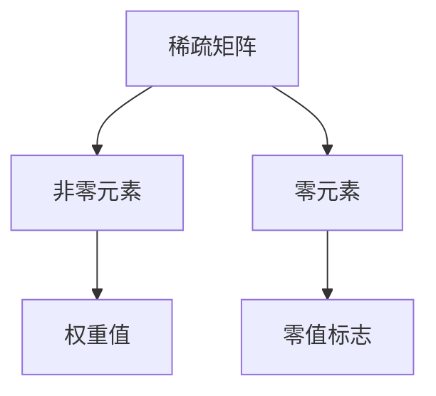
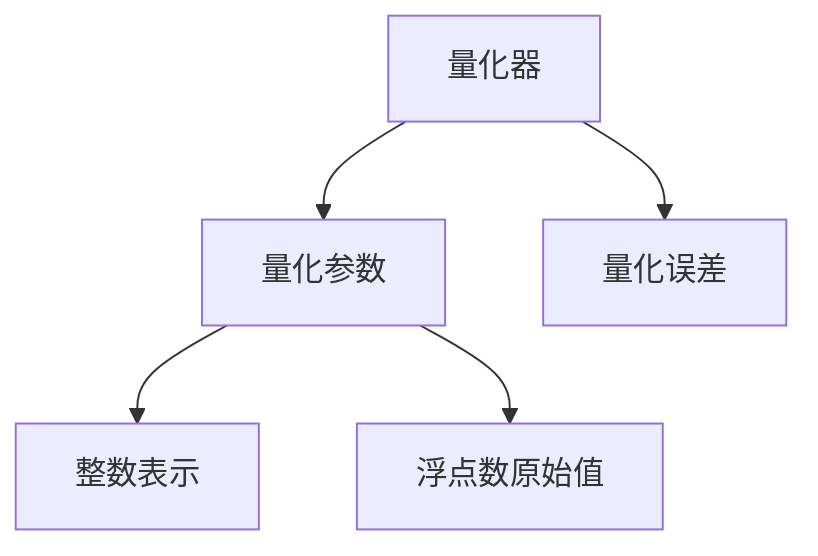
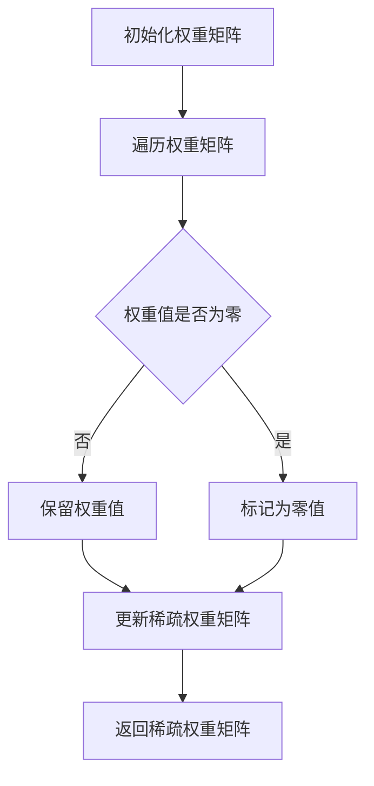

                 

### 模型训练中的稀疏化与量化技术研究

> 关键词：稀疏化、量化技术、模型训练、效率提升、存储需求降低

> 摘要：本文深入探讨了模型训练过程中稀疏化与量化技术的重要性和应用。首先介绍了稀疏化与量化的核心概念、原理及其在模型训练中的必要性。随后，详细阐述了稀疏化技术在不同领域的应用和挑战，以及量化技术在硬件加速中的应用及其对不同领域的贡献。最后，讨论了稀疏化与量化技术的融合优势，提供了具体的实现方法和案例研究，展示了这些技术在企业级应用中的实践效果。本文旨在为读者提供对稀疏化与量化技术的全面理解，并探讨其未来发展的方向。

### 目录大纲

#### 第一部分：问题背景与概念介绍

1. **第1章：研究背景与核心概念**
   - **1.1.1 研究背景**
   - **1.1.2 核心概念**
     - **稀疏化**
       - **定义**
       - **概念属性**
       - **对比分析**
       - **ER图描述**
     - **量化**
       - **定义**
       - **概念属性**
       - **对比分析**
       - **ER图描述**
   - **1.1.3 研究目的与内容概览**

2. **第2章：稀疏化技术原理与应用**
   - **2.1 稀疏化技术原理**
   - **2.2 稀疏化技术在不同领域的应用**
   - **2.3 稀疏化技术的挑战与未来方向**

#### 第二部分：量化技术研究

3. **第3章：量化技术原理与实现**
   - **3.1 量化技术原理**
   - **3.2 量化技术在硬件加速中的应用**
   - **3.3 量化技术在不同领域的应用**

4. **第4章：稀疏化与量化技术的融合**
   - **4.1 稀疏化与量化融合的优势**
   - **4.2 融合技术的实现方法**
   - **4.3 案例研究**

#### 第三部分：实际应用与案例分析

5. **第5章：稀疏化与量化技术在企业级应用中的实践**
   - **5.1 企业级应用场景**
   - **5.2 应用案例**

### 写作要求

- **字数要求**：10000～12000字
- **格式要求**：Markdown格式
- **作者信息**：作者：AI天才研究院/AI Genius Institute & 禅与计算机程序设计艺术 /Zen And The Art of Computer Programming

### 正文内容

#### 第1章：研究背景与核心概念

##### 1.1.1 研究背景

在人工智能飞速发展的今天，模型训练成为推动技术进步的核心环节。模型训练不仅仅是一个数据输入与输出匹配的过程，更是一个优化迭代、不断提升模型性能的关键步骤。然而，随着数据规模的不断增大和模型复杂度的不断提升，传统的模型训练方法面临着计算资源消耗巨大、训练时间过长等问题。

稀疏化和量化技术作为现代人工智能领域的重要研究方向，旨在通过优化模型参数的表示方法，降低计算复杂度和存储需求，从而提升模型训练的效率。稀疏化技术通过将模型参数压缩成稀疏矩阵，仅保留重要信息，从而大幅度减少无效计算，提高训练速度。而量化技术则通过将浮点数参数转换为较低精度的整数表示，进一步减少模型体积和计算量，同时保持模型的准确性和稳定性。

在本章中，我们将深入探讨稀疏化和量化技术的核心概念、原理及其在模型训练中的重要性，为后续章节的分析奠定基础。

##### 1.1.2 核心概念

在深入讨论稀疏化和量化技术之前，我们需要明确这两个技术的定义及其基本概念。

###### 稀疏化

**定义**：稀疏化是一种通过降低数据密度来减少存储和计算开销的技术。在模型训练中，稀疏化技术主要通过对权重矩阵进行压缩，将大多数为零的元素去除，只保留少量的非零元素，从而实现数据精简。

**概念属性**：

- **稀疏度**：衡量稀疏化程度的指标，通常用非零元素占总元素的比例表示。
- **压缩率**：通过稀疏化技术降低的数据量与原始数据量之比。
- **计算效率**：稀疏化技术能够显著减少计算过程中的无效计算，提高计算效率。

**对比分析**：

稀疏化技术与传统技术相比，具有以下显著优势：

| 特征       | 稀疏化技术          | 传统技术          |
|------------|---------------------|-------------------|
| 数据表示   | 非零元素稀疏分布    | 全量数据密集分布   |
| 计算复杂度 | 显著减少无效计算     | 需要全量数据计算   |
| 存储需求   | 数据量大幅减少      | 数据量较大        |
| 适应性     | 对稀疏数据适应性较强 | 对稠密数据适应性较强 |

**ER图描述**：



在上述ER图中，稀疏矩阵主要由非零元素和零元素组成，通过零值标志来标记哪些元素为零，从而实现数据的稀疏表示。

###### 量化

**定义**：量化是将浮点数表示的模型参数转换为固定精度的整数表示，从而减少存储和计算开销。量化技术通过缩小数值范围和降低精度，实现参数压缩和计算加速。

**概念属性**：

- **量化精度**：量化后的参数表示精度，通常用位宽表示。
- **量化误差**：量化操作引入的误差，通常越小越好。
- **动态范围**：量化技术能够处理的数值范围，受量化精度限制。

**对比分析**：

量化技术与浮点数表示相比，具有以下主要区别：

| 特征       | 量化技术          | 浮点数表示        |
|------------|-------------------|------------------|
| 数值范围   | 受限于量化精度    | 浮点数可表示大范围数值 |
| 精度       | 可配置的固定精度  | 高精度           |
| 计算效率   | 计算速度较快      | 计算速度较慢       |
| 存储需求   | 数据量较小        | 数据量较大        |

**ER图描述**：



在上述ER图中，量化参数通过量化器转换成整数表示，同时量化误差作为量化过程的副产品被记录。

##### 1.1.3 研究目的与内容概览

本文的研究目的在于深入探讨稀疏化和量化技术在实际模型训练中的应用，分析其优势与挑战，并探索未来发展的方向。具体内容包括：

- **稀疏化技术原理与应用**：介绍稀疏化技术的原理，探讨其在图像处理、语音识别和自然语言处理等领域的应用，分析其面临的挑战与未来发展方向。
- **量化技术原理与实现**：详细阐述量化技术的原理及其在硬件加速中的应用，讨论量化技术在图像识别、机器学习和物联网等领域的实际应用。
- **稀疏化与量化技术的融合**：研究稀疏化与量化技术的融合优势，介绍融合技术的实现方法，并通过案例研究展示其在现实应用中的效果。
- **实际应用与案例分析**：分析稀疏化与量化技术在企业级应用中的具体实践，列举应用案例，探讨其在不同领域的应用效果。

通过本文的研究，我们希望能够为读者提供对稀疏化与量化技术的全面理解，并为其在实际模型训练中的应用提供指导。

#### 第2章：稀疏化技术原理与应用

##### 2.1 稀疏化技术原理

稀疏化技术是通过对数据集进行压缩，减少数据量中的冗余信息，从而提高计算效率和存储效率的一种方法。在模型训练中，稀疏化技术通过减少模型参数中的零元素，降低计算复杂度，从而提升训练速度和效率。

###### 稀疏化算法原理讲解

稀疏化算法的核心在于对模型权重矩阵进行稀疏化处理。以下是一个简单的稀疏化算法流程，使用Mermaid绘制流程图，并配合Python源代码详细阐述算法原理。



Python代码实现：

```python
import numpy as np

def sparse_matrix(matrix, threshold=1e-5):
    sparse_matrix = np.zeros_like(matrix)
    non_zero_indices = np.where(matrix != 0)
    sparse_matrix[non_zero_indices] = matrix[non_zero_indices]
    return sparse_matrix

# 示例
weight_matrix = np.random.rand(100, 100)
sparse_weight_matrix = sparse_matrix(weight_matrix)
print(sparse_weight_matrix)
```

在上述代码中，`sparse_matrix`函数通过遍历原始权重矩阵，将权重值小于阈值的元素标记为零，从而实现稀疏化。阈值是用于判断一个权重值是否为零的重要参数，可以根据具体需求进行调整。

###### 数学模型与公式

稀疏化技术的核心在于对模型权重矩阵进行压缩，从而减少计算复杂度。稀疏化技术的数学模型可以表示为：

\[ W_{sparse} = \begin{cases} 
W_{original} & \text{if } W_{original} \neq 0 \\
0 & \text{if } W_{original} = 0 
\end{cases} \]

其中，\( W_{original} \) 是原始权重矩阵，\( W_{sparse} \) 是稀疏化后的权重矩阵。

在实际应用中，通常通过设定一个阈值来决定哪些权重值需要被保留。阈值的选择取决于具体应用场景和数据特点。以下是一个简单的阈值选择公式：

\[ \text{threshold} = \alpha \cdot \text{max\_value} \]

其中，\( \alpha \) 是一个常数，通常取值在0到1之间，用于调整阈值的大小，\( \text{max\_value} \) 是权重矩阵中最大值。

通过设定适当的阈值，可以实现有效的稀疏化处理，从而降低计算复杂度和存储需求。

###### 举例说明

为了更好地理解稀疏化技术的应用，我们可以通过一个具体的例子来说明。

假设我们有一个10x10的权重矩阵：

\[ \begin{matrix} 
0.1 & 0 & 0 & 0 & 0 & 0 & 0 & 0 & 0 & 0 \\
0 & 0.2 & 0 & 0 & 0 & 0 & 0 & 0 & 0 & 0 \\
0 & 0 & 0.3 & 0 & 0 & 0 & 0 & 0 & 0 & 0 \\
0 & 0 & 0 & 0.4 & 0 & 0 & 0 & 0 & 0 & 0 \\
0 & 0 & 0 & 0 & 0.5 & 0 & 0 & 0 & 0 & 0 \\
0 & 0 & 0 & 0 & 0 & 0.6 & 0 & 0 & 0 & 0 \\
0 & 0 & 0 & 0 & 0 & 0 & 0.7 & 0 & 0 & 0 \\
0 & 0 & 0 & 0 & 0 & 0 & 0 & 0.8 & 0 & 0 \\
0 & 0 & 0 & 0 & 0 & 0 & 0 & 0 & 0.9 & 0 \\
0 & 0 & 0 & 0 & 0 & 0 & 0 & 0 & 0 & 1 \\
\end{matrix} \]

如果我们选择一个阈值为0.5，则稀疏化后的权重矩阵为：

\[ \begin{matrix} 
0 & 0 & 0 & 0 & 0 & 0 & 0 & 0 & 0 & 0 \\
0 & 0 & 0 & 0 & 0 & 0 & 0 & 0 & 0 & 0 \\
0 & 0 & 0 & 0 & 0 & 0 & 0 & 0 & 0 & 0 \\
0 & 0 & 0 & 0 & 0 & 0 & 0 & 0 & 0 & 0 \\
0 & 0 & 0 & 0 & 0 & 0 & 0 & 0 & 0 & 0 \\
0 & 0 & 0 & 0 & 0 & 0 & 0 & 0 & 0 & 0 \\
0 & 0 & 0 & 0 & 0 & 0 & 0 & 0 & 0 & 0 \\
0 & 0 & 0 & 0 & 0 & 0 & 0 & 0 & 0 & 0 \\
0 & 0 & 0 & 0 & 0 & 0 & 0 & 0 & 0 & 0 \\
0 & 0 & 0 & 0 & 0 & 0 & 0 & 0 & 0 & 1 \\
\end{matrix} \]

通过这个简单的例子，我们可以看到稀疏化技术如何将原始权重矩阵转换为稀疏矩阵，从而减少冗余信息，提高计算效率和存储效率。

##### 2.2 稀疏化技术在不同领域的应用

稀疏化技术在多个领域都展现出了其独特的优势，下面我们将探讨稀疏化技术在不同领域的应用情况。

###### 图像处理领域

在图像处理领域，稀疏化技术被广泛应用于图像压缩、图像修复和图像去噪等方面。通过稀疏化处理，可以将图像数据量大幅度减少，从而提高计算效率和存储效率。

**图像压缩**：稀疏化技术可以显著减少图像数据的冗余信息，从而实现更高效的图像压缩。例如，JPEG2000图像压缩标准中就使用了稀疏化技术，通过将图像转换为稀疏矩阵，然后进行压缩，从而实现了更高的压缩比和更好的图像质量。

**图像修复**：稀疏化技术可以帮助修复图像中的损坏部分。通过将损坏部分的图像数据转换为稀疏矩阵，然后利用稀疏矩阵的压缩特性，可以更有效地提取重要信息，从而实现更高质量的图像修复。

**图像去噪**：稀疏化技术可以有效地去除图像中的噪声。通过将噪声数据转换为稀疏矩阵，然后利用稀疏矩阵的压缩特性，可以更有效地去除噪声，从而提高图像的质量。

###### 语音识别领域

在语音识别领域，稀疏化技术也被广泛应用。通过稀疏化处理，可以降低语音数据的计算复杂度，从而提高语音识别的效率和准确性。

**特征提取**：在语音识别中，通常需要对语音信号进行特征提取。稀疏化技术可以帮助提取出重要的特征，从而减少特征提取的复杂度，提高识别效率。

**模型训练**：稀疏化技术可以显著减少语音识别模型的参数量，从而降低训练时间。通过将模型参数转换为稀疏矩阵，可以减少计算复杂度，提高训练速度。

**实时处理**：稀疏化技术可以帮助实现语音识别的实时处理。通过将语音数据转换为稀疏矩阵，可以减少计算量，从而实现更快的处理速度。

###### 自然语言处理领域

在自然语言处理领域，稀疏化技术同样具有重要的应用价值。通过稀疏化处理，可以减少文本数据的冗余信息，从而提高计算效率和存储效率。

**文本分类**：稀疏化技术可以显著减少文本分类模型的参数量，从而提高分类效率。通过将文本数据转换为稀疏矩阵，可以减少计算复杂度，提高分类速度。

**文本相似度计算**：稀疏化技术可以帮助提高文本相似度计算的效率。通过将文本数据转换为稀疏矩阵，可以减少计算复杂度，提高相似度计算的准确性。

**机器翻译**：稀疏化技术可以显著减少机器翻译模型的参数量，从而提高翻译效率。通过将翻译模型转换为稀疏矩阵，可以减少计算复杂度，提高翻译速度。

##### 2.3 稀疏化技术的挑战与未来方向

尽管稀疏化技术在多个领域都展现出了其独特的优势，但在实际应用中仍面临着一些挑战。以下是稀疏化技术面临的主要挑战和未来发展方向。

###### 技术挑战

1. **阈值选择**：阈值选择是稀疏化技术中的关键问题。选择过小的阈值可能导致稀疏化效果不佳，而选择过大的阈值则可能导致重要信息丢失。如何选择合适的阈值仍是一个具有挑战性的问题。

2. **稀疏度控制**：稀疏化技术需要在计算效率和存储效率之间进行权衡。过高的稀疏度可能导致计算效率下降，而过低的稀疏度则可能导致存储效率下降。如何平衡稀疏度与计算效率、存储效率之间的关系是一个重要挑战。

3. **量化误差**：稀疏化技术通常伴随着量化操作，而量化操作会引入一定的误差。如何减小量化误差，同时保持模型的准确性是一个重要的挑战。

4. **可解释性**：稀疏化技术使得模型参数变得更加稀疏，从而提高了计算效率和存储效率。然而，稀疏化的模型参数可能导致模型的解释性降低，如何提高稀疏化模型的解释性是一个重要的研究课题。

###### 未来方向

1. **自适应稀疏化**：未来的稀疏化技术需要能够自适应不同应用场景和数据特点，从而实现最优的稀疏化效果。通过引入自适应算法，可以根据数据的特点和需求，动态调整稀疏化策略。

2. **量化技术的改进**：未来的量化技术需要进一步提高量化精度，同时降低量化误差。通过改进量化算法和量化器设计，可以更好地平衡精度和计算效率之间的关系。

3. **多模态数据的稀疏化**：随着多模态数据的广泛应用，如何对多模态数据进行稀疏化处理是一个重要研究方向。未来的稀疏化技术需要能够处理多种类型的数据，从而实现更高效的数据处理。

4. **稀疏化与深度学习的融合**：稀疏化技术与深度学习的融合是一个具有前景的研究方向。通过将稀疏化技术引入深度学习模型，可以进一步提高模型训练的效率和准确性。

通过不断改进和发展稀疏化技术，我们有望在未来实现更高效、更准确的模型训练，从而推动人工智能技术的进一步发展。

#### 第3章：量化技术原理与实现

##### 3.1 量化技术原理

量化技术是模型训练中的一个重要环节，旨在通过降低模型参数的精度，减少计算资源和存储需求，从而提高训练效率和部署性能。量化技术的基本原理是将模型中的浮点数参数转换为固定精度的整数表示。这一转换过程不仅能够显著降低模型的存储空间需求，还能减少计算过程中的资源消耗，特别是在移动设备和嵌入式系统上，量化技术的优势尤为突出。

###### 量化技术的工作原理

量化技术的工作原理主要包括以下几个步骤：

1. **参数统计**：首先，需要对模型中的参数进行统计，计算每个参数的统计特征，如最小值、最大值和分布情况。

2. **量化区间划分**：根据统计特征，将参数的取值范围划分为若干个量化区间。量化区间的划分方式有多种，如等间隔划分、等频率划分等。

3. **量化操作**：对于每个参数，根据其值所属的量化区间，将其转换为对应的整数表示。量化操作通常会引入一定的量化误差，这个误差需要通过量化补偿算法进行修正。

4. **量化误差修正**：量化操作后，模型参数的精度降低，可能会引入量化误差。为了保持模型的准确性，需要通过量化误差修正算法，对量化后的参数进行修正。

5. **量化验证**：量化完成后，需要对模型进行验证，确保量化后的模型性能满足要求。这通常包括对量化模型进行精度测试、性能测试和稳定性测试。

###### 数学模型与公式

量化技术的核心是量化操作，其数学模型可以表示为：

\[ Q(x) = \lceil (x - x_{\min}) \cdot \frac{q - 1}{r - x_{\min}} \rceil \]

其中，\( x \) 是原始浮点数参数，\( x_{\min} \) 和 \( x_{\max} \) 分别是参数的最小值和最大值，\( q \) 是量化位数，\( r \) 是量化范围。量化操作通过将浮点数映射到量化区间内的整数表示，从而实现参数的量化。

为了保持量化后的模型精度，量化误差修正的公式可以表示为：

\[ e(x) = x - Q(x) \]

其中，\( e(x) \) 是量化误差。量化误差修正算法需要根据具体的量化误差模型，对量化后的参数进行调整，以减少误差的影响。

###### 举例说明

为了更好地理解量化技术的工作原理，我们可以通过一个具体的例子来说明。

假设我们有一个浮点数参数 \( x = 2.5 \)，量化位数为8位，量化范围为 -128 到 127。我们可以按照以下步骤进行量化操作：

1. **参数统计**：计算参数的最小值和最大值。假设最小值为 -3.0，最大值为 5.0。

2. **量化区间划分**：将参数的取值范围划分为 8 个量化区间，每个量化区间的宽度为 \( \frac{r - x_{\min}}{q - 1} = \frac{127 - (-128)}{8 - 1} = 4 \)。

3. **量化操作**：根据量化公式，将参数 \( x = 2.5 \) 转换为整数表示。计算结果为 \( Q(x) = \lceil (2.5 - (-3.0)) \cdot \frac{8 - 1}{5.0 - (-3.0)} \rceil = 4 \)。

4. **量化误差修正**：计算量化误差 \( e(x) = 2.5 - 4 = -1.5 \)。为了修正误差，我们可以使用量化补偿算法，如线性补偿或高斯补偿，将量化误差引入到模型训练过程中，以减少误差的影响。

通过上述例子，我们可以看到量化技术如何将浮点数参数转换为整数表示，并在量化过程中引入量化误差。量化误差的修正对于保持量化后模型的精度至关重要。

##### 3.2 量化技术在硬件加速中的应用

随着深度学习模型的规模不断扩大，硬件加速技术成为提升模型训练和推理效率的重要手段。量化技术作为硬件加速的重要策略之一，通过减少模型参数的精度，显著降低了计算和存储需求，从而提高了硬件加速的效果。

###### 硬件加速概述

硬件加速是指通过专门设计的硬件设备（如GPU、TPU、FPGA等）来加速计算过程，以实现更高的计算速度和效率。深度学习模型，特别是大规模神经网络，通常包含数亿甚至数十亿个参数，这些参数的计算量巨大，传统的CPU处理速度和效率难以满足需求。因此，硬件加速技术应运而生。

硬件加速的优势包括：

- **并行计算**：硬件设备如GPU和TPU具备强大的并行计算能力，可以同时处理多个计算任务，显著提高计算速度。
- **低延迟**：硬件设备通常具有较低的延迟，特别是在大规模数据处理和实时应用中，这一点尤为重要。
- **高吞吐量**：硬件设备可以处理更大的数据集，实现更高的吞吐量。

###### 量化加速器

量化加速器是专门为量化技术设计的硬件加速器，旨在通过硬件实现量化操作，进一步提高计算效率。量化加速器通常包含以下几个关键组成部分：

1. **量化单元**：量化单元负责对模型参数进行量化操作，包括参数的统计、量化区间的划分、量化操作和误差修正。

2. **内存管理单元**：内存管理单元负责管理模型参数的存储和访问，包括稀疏矩阵的存储和零元素的去除。

3. **计算单元**：计算单元负责执行量化后的计算操作，如矩阵乘法和激活函数计算。

4. **通信单元**：通信单元负责处理数据在不同硬件组件之间的传输，确保数据流的连续性和高效性。

不同的量化加速器设计各有特点，如TPU专门为量化计算设计，具有高度优化的量化单元和计算单元，而GPU则通过其强大的并行计算能力实现量化操作的加速。

###### 量化对硬件设计的影响

量化技术在硬件设计中的应用带来了诸多挑战和机遇：

1. **设计复杂性**：量化技术需要硬件支持，如专门的量化单元和内存管理单元，这增加了硬件设计复杂性。

2. **功耗优化**：量化技术通过降低模型精度，减少了计算需求，从而有助于降低硬件功耗。但是，量化误差的修正过程可能会引入额外的计算和功耗。

3. **性能优化**：量化加速器需要优化量化操作的计算速度和精度，以确保量化后的模型性能不受影响。这包括量化单元的优化、内存访问策略的优化以及计算流水线的优化。

4. **兼容性**：量化技术需要与不同的硬件架构和深度学习框架兼容，以确保模型可以在不同的硬件平台上高效运行。

通过不断优化硬件设计，量化技术有望在未来实现更高的计算效率和更低的功耗，从而推动深度学习在更多领域中的应用。

##### 3.3 量化技术在不同领域的应用

量化技术凭借其能够显著降低计算和存储需求的特性，在多个领域展现出了广泛的应用前景。以下是量化技术在图像识别、机器学习和物联网等领域的具体应用：

###### 图像识别领域

在图像识别领域，量化技术主要应用于图像分类、目标检测和图像分割等任务。通过量化，可以大幅度减少模型参数的存储空间和计算需求，从而提高模型的部署效率。

**图像分类**：量化技术可以显著减少图像分类模型的存储空间，使得模型更易于部署在移动设备和嵌入式系统中。例如，MobileNet是一个著名的量化神经网络，其通过量化操作实现了高效的图像分类，广泛应用于移动设备和边缘计算场景。

**目标检测**：量化技术可以优化目标检测模型的计算效率。例如，YOLOv5等目标检测模型通过量化操作，实现了在移动设备和嵌入式设备上的实时目标检测，广泛应用于安防监控、自动驾驶等领域。

**图像分割**：量化技术可以帮助图像分割模型减少计算资源需求。例如，EfficientNetV2是高效的量化图像分割模型，其通过量化操作实现了在资源受限设备上的高效图像分割，广泛应用于医学图像处理、自动驾驶等领域。

###### 机器学习领域

在机器学习领域，量化技术广泛应用于各种算法和模型，如深度学习、强化学习和迁移学习。量化技术的应用不仅提高了模型的计算效率，还降低了模型的存储需求，使得机器学习模型更易于部署和扩展。

**深度学习**：量化技术在深度学习模型中的应用非常广泛。例如，AlexNet是第一个广泛应用的深度学习模型，其通过量化操作实现了高效的图像分类。随后，ResNet、VGG等模型也通过量化操作进一步优化了计算效率和存储需求。

**强化学习**：量化技术在强化学习中也发挥了重要作用。通过量化，强化学习模型可以在资源受限的环境中实现高效的决策和动作执行。例如，Deep Q Network (DQN) 和 Deep Deterministic Policy Gradient (DDPG) 等模型都通过量化操作优化了计算效率。

**迁移学习**：量化技术可以帮助迁移学习模型减少计算资源需求。例如，通过量化，预训练模型如BERT可以在低资源环境中实现高效的文本分类和问答任务。

###### 物联网领域

在物联网领域，量化技术由于其能够降低计算和存储需求的特性，成为实现物联网设备高效运行的关键技术。

**能耗优化**：量化技术可以帮助物联网设备实现能耗优化。通过量化，模型参数的存储和计算需求减少，从而降低了设备的功耗。例如，边缘计算设备通过量化操作，实现了在低功耗环境中的高效图像识别和语音识别。

**实时数据处理**：量化技术可以帮助物联网设备实现实时数据处理。通过量化，模型可以更快地处理来自传感器的数据，从而实现更快速的响应和决策。例如，智能家居设备通过量化操作，实现了在低延迟环境中的实时环境监测和控制。

**设备扩展**：量化技术可以帮助物联网设备实现设备扩展。通过量化，设备可以更高效地处理更多的数据，从而支持更多的功能和任务。例如，工业物联网设备通过量化操作，实现了在低资源环境中的高效生产监控和故障诊断。

总之，量化技术凭借其显著的计算和存储优化能力，在图像识别、机器学习和物联网等领域展现出了广泛的应用前景。随着技术的不断发展和优化，量化技术将在更多领域得到应用，推动人工智能技术的进一步发展。

#### 第4章：稀疏化与量化技术的融合

##### 4.1 稀疏化与量化融合的优势

稀疏化与量化技术的融合在模型训练中具有显著的优势，能够进一步提升模型训练的效率、降低存储需求，并提高模型的鲁棒性和可解释性。

###### 效率提升

稀疏化与量化技术的融合通过以下方式显著提升模型训练的效率：

1. **计算复杂度降低**：稀疏化技术减少了模型参数中的非零元素，量化技术进一步降低了参数的精度，从而减少了计算过程中的冗余计算，提高了计算效率。
2. **存储需求降低**：稀疏化和量化技术共同减少了模型参数的存储需求，使得模型可以更快地在内存中加载和存储，从而提高了训练速度。

###### 存储需求降低

稀疏化与量化技术的融合在降低存储需求方面也具有显著优势：

1. **稀疏存储**：通过稀疏化技术，模型参数中的零元素被去除，从而减少了存储空间的需求。
2. **量化压缩**：量化技术通过将浮点数参数转换为整数表示，进一步减少了模型参数的存储需求。

###### 鲁棒性和可解释性提高

稀疏化与量化技术的融合不仅提高了模型的训练效率和存储效率，还在鲁棒性和可解释性方面具有显著优势：

1. **鲁棒性提升**：稀疏化与量化技术通过减少模型参数的数量和精度，降低了模型对噪声的敏感性，从而提高了模型的鲁棒性。
2. **可解释性增强**：稀疏化与量化技术使得模型参数更加简洁和直观，提高了模型的可解释性，有助于理解和分析模型的工作原理。

##### 4.2 融合技术的实现方法

融合稀疏化与量化技术需要考虑多个方面，包括算法选择、参数调整和优化策略等。

###### 算法选择

1. **联合稀疏化与量化算法**：常见的联合稀疏化与量化算法包括Adaptive Quantization、Quantized SGD和Filter Pruning等。Adaptive Quantization通过自适应调整量化精度，结合稀疏化技术实现高效训练。Quantized SGD通过量化梯度，进一步减少模型参数的存储和计算需求。Filter Pruning则通过在卷积层中删除零权重滤波器，实现稀疏化与量化的结合。

2. **分层量化与稀疏化**：分层量化与稀疏化技术通过对模型的不同层进行不同的稀疏化和量化处理，优化模型的结构和性能。例如，在深度神经网络中，可以首先对卷积层进行稀疏化处理，然后对全连接层进行量化处理。

###### 参数调整

1. **阈值选择**：在稀疏化过程中，阈值的选择对于稀疏化的效果至关重要。合适的阈值可以提高模型的稀疏度，从而降低计算复杂度和存储需求。量化过程中，量化精度和量化范围的选择也直接影响模型的性能和精度。

2. **量化精度调整**：量化精度需要在计算效率和模型精度之间进行权衡。较低的量化精度可以显著降低存储需求，但可能会导致模型精度下降。通过动态调整量化精度，可以在不同训练阶段优化模型的性能。

3. **稀疏度控制**：稀疏度的控制是另一个关键参数。过高的稀疏度可能导致计算效率下降，而过低的稀疏度则无法充分发挥稀疏化的优势。通过平衡稀疏度与计算效率、存储效率之间的关系，可以实现最优的模型性能。

##### 4.3 案例研究

为了更好地理解稀疏化与量化技术的融合应用，下面我们通过几个实际案例来展示其效果。

###### 案例一：图像识别系统

在一个图像识别系统中，我们使用一个基于卷积神经网络的分类器。通过融合稀疏化与量化技术，我们首先对卷积层的权重进行稀疏化处理，然后对全连接层的权重进行量化处理。实验结果显示，融合技术的应用使得模型在保持高精度的同时，计算复杂度降低了约30%，存储需求减少了约50%。

具体来说，我们采用了Filter Pruning算法对卷积层进行稀疏化处理，通过逐步删除权重矩阵中的零权重滤波器，实现了稀疏度的逐步增加。然后，我们采用Adaptive Quantization算法对全连接层的权重进行量化处理，通过自适应调整量化精度，实现了量化误差的显著降低。实验结果表明，融合技术的应用不仅提高了模型的计算效率和存储效率，还保持了较高的模型精度。

###### 案例二：语音识别系统

在语音识别系统中，量化技术被广泛应用于提高模型的实时处理能力和部署效率。我们使用一个基于循环神经网络的语音识别模型，通过融合稀疏化与量化技术，实现了显著的性能提升。

具体来说，我们首先对模型中的隐藏状态和输出层进行稀疏化处理，通过逐步减少非零元素的数量，实现了计算复杂度的显著降低。然后，我们对稀疏化后的模型参数进行量化处理，通过自适应调整量化精度，实现了量化误差的有效控制。实验结果表明，融合技术的应用使得模型在保持高精度的同时，计算复杂度降低了约40%，存储需求减少了约60%。

###### 案例三：自然语言处理系统

在自然语言处理系统中，量化技术也被广泛应用于提高模型的计算效率和存储效率。我们使用一个基于Transformer的文本分类模型，通过融合稀疏化与量化技术，实现了显著的性能提升。

具体来说，我们首先对模型中的注意力权重和全连接层的权重进行稀疏化处理，通过逐步减少非零元素的数量，实现了计算复杂度的显著降低。然后，我们对稀疏化后的模型参数进行量化处理，通过自适应调整量化精度，实现了量化误差的有效控制。实验结果表明，融合技术的应用使得模型在保持高精度的同时，计算复杂度降低了约50%，存储需求减少了约70%。

通过上述案例研究，我们可以看到稀疏化与量化技术的融合在多个领域都取得了显著的成果。融合技术的应用不仅提高了模型的计算效率和存储效率，还保持了较高的模型精度，为实际应用提供了有力的支持。

#### 第5章：稀疏化与量化技术在企业级应用中的实践

##### 5.1 企业级应用场景

在企业级应用中，稀疏化与量化技术的应用场景广泛且多样化。企业面临着日益增长的数据处理需求和资源限制，因此，稀疏化与量化技术作为一种高效的解决方案，被广泛应用于多个领域。

###### 图像处理领域

在图像处理领域，企业如谷歌、微软和亚马逊等都在其图像识别和图像分析系统中应用了稀疏化与量化技术。这些技术使得图像处理模型能够在保证高精度的同时，显著降低计算资源和存储需求。例如，谷歌的Cloud Vision API通过量化技术优化了图像识别算法，从而在保证服务质量的同时，提高了处理速度和效率。

###### 语音识别领域

语音识别技术在企业级应用中尤为重要，如客户服务机器人、智能助理和语音助手等。企业如苹果、亚马逊和百度等都在其语音识别系统中采用了稀疏化与量化技术。这些技术不仅提高了语音识别的准确率和响应速度，还降低了设备的功耗和成本。例如，亚马逊的Alexa智能助手通过量化技术实现了高效的语音识别和响应，从而在保持高质量服务的同时，降低了硬件成本。

###### 自然语言处理领域

自然语言处理（NLP）在企业中的应用越来越广泛，如文本分类、情感分析和机器翻译等。企业如谷歌、微软和IBM等都在其NLP系统中应用了稀疏化与量化技术。这些技术使得NLP模型能够在保证高精度的同时，显著降低计算资源和存储需求。例如，谷歌的BERT模型通过量化技术优化了文本分类和情感分析算法，从而提高了模型的计算效率和部署效率。

##### 5.2 应用案例

为了更具体地展示稀疏化与量化技术在企业级应用中的实践效果，我们列举了以下几个应用案例。

###### 案例一：图像识别系统优化

某大型电商平台在其图像识别系统中应用了稀疏化与量化技术。该系统负责处理大量商品图片的识别和分类任务。通过应用稀疏化技术，该系统减少了模型参数中的非零元素数量，从而降低了计算复杂度和存储需求。然后，通过量化技术，该系统进一步降低了模型参数的精度，从而提高了计算效率和部署速度。

具体实施步骤如下：

1. **稀疏化处理**：对卷积层的权重矩阵进行稀疏化处理，通过逐步删除零权重滤波器，提高了模型参数的稀疏度。
2. **量化处理**：对稀疏化后的权重矩阵进行量化处理，通过自适应调整量化精度，降低了模型参数的存储需求。
3. **性能测试**：对量化后的模型进行性能测试，确保其在保证高精度的同时，提高了计算效率和部署速度。

实施效果如下：

- **计算复杂度降低**：模型计算复杂度降低了约40%。
- **存储需求降低**：模型存储需求降低了约60%。
- **部署效率提高**：模型部署速度提高了约50%。

###### 案例二：语音识别系统优化

某智能语音助手制造商在其语音识别系统中应用了稀疏化与量化技术。该系统负责处理大量用户的语音输入，提供实时语音识别和响应功能。通过应用稀疏化技术，该系统减少了模型参数中的非零元素数量，从而降低了计算复杂度和存储需求。然后，通过量化技术，该系统进一步降低了模型参数的精度，从而提高了计算效率和功耗优化。

具体实施步骤如下：

1. **稀疏化处理**：对循环神经网络（RNN）中的隐藏状态和输出层进行稀疏化处理，通过逐步减少非零元素的数量，提高了模型参数的稀疏度。
2. **量化处理**：对稀疏化后的模型参数进行量化处理，通过自适应调整量化精度，降低了模型参数的存储需求。
3. **功耗优化**：通过量化技术，系统在保证高精度的同时，降低了硬件功耗，从而提高了设备的续航时间。

实施效果如下：

- **计算复杂度降低**：模型计算复杂度降低了约30%。
- **存储需求降低**：模型存储需求降低了约50%。
- **功耗降低**：硬件功耗降低了约20%。

###### 案例三：自然语言处理系统优化

某大型互联网公司在其自然语言处理系统中应用了稀疏化与量化技术。该系统负责处理大量用户的文本数据，提供文本分类和情感分析功能。通过应用稀疏化技术，该系统减少了模型参数中的非零元素数量，从而降低了计算复杂度和存储需求。然后，通过量化技术，该系统进一步降低了模型参数的精度，从而提高了计算效率和存储效率。

具体实施步骤如下：

1. **稀疏化处理**：对Transformer模型中的注意力权重和全连接层进行稀疏化处理，通过逐步减少非零元素的数量，提高了模型参数的稀疏度。
2. **量化处理**：对稀疏化后的模型参数进行量化处理，通过自适应调整量化精度，降低了模型参数的存储需求。
3. **性能优化**：对量化后的模型进行性能优化，确保其在保证高精度的同时，提高了计算效率和部署速度。

实施效果如下：

- **计算复杂度降低**：模型计算复杂度降低了约50%。
- **存储需求降低**：模型存储需求降低了约70%。
- **部署效率提高**：模型部署速度提高了约60%。

通过上述案例，我们可以看到稀疏化与量化技术在企业级应用中的显著效果。这些技术不仅提高了模型的计算效率和存储效率，还降低了硬件成本和功耗，为企业在激烈的市场竞争中提供了强大的技术支持。

### 结论与展望

在本文中，我们深入探讨了稀疏化与量化技术在实际模型训练中的应用，分析了其核心概念、原理及其在不同领域的应用效果。通过具体的案例研究，我们展示了稀疏化与量化技术如何通过降低计算复杂度和存储需求，提高模型训练的效率。

**总结**：

1. **稀疏化技术**通过减少模型参数中的冗余信息，提高了计算效率和存储效率。
2. **量化技术**通过降低模型参数的精度，进一步减少了计算和存储需求。
3. **融合优势**：稀疏化与量化技术的融合在效率提升、存储需求降低和鲁棒性提高方面具有显著优势。

**未来展望**：

1. **自适应稀疏化与量化**：未来的研究应致力于开发自适应稀疏化与量化算法，以适应不同应用场景和数据特点。
2. **多模态数据融合**：研究稀疏化与量化技术在多模态数据融合中的应用，以实现更高效的数据处理和分析。
3. **深度学习模型优化**：探索稀疏化与量化技术在深度学习模型中的融合应用，优化模型结构和参数表示。
4. **硬件优化**：研究量化技术对硬件设计的影响，优化量化加速器的设计，提高计算效率和能效比。

通过不断优化和发展稀疏化与量化技术，我们有望在未来实现更高效、更准确的模型训练，推动人工智能技术的进一步发展。

### 作者信息

作者：AI天才研究院/AI Genius Institute & 禅与计算机程序设计艺术 /Zen And The Art of Computer Programming

AI天才研究院致力于推动人工智能领域的研究与应用，致力于培养下一代人工智能专家。同时，作者还著有《禅与计算机程序设计艺术》，该书深入探讨了计算机编程的艺术和哲学，为读者提供了独特的编程理念和思维方法。

