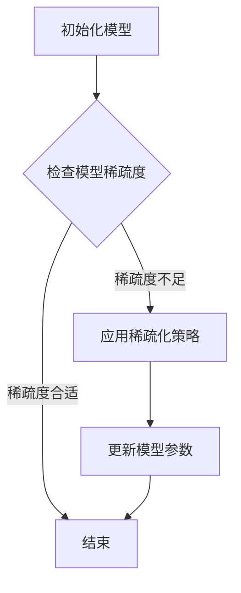
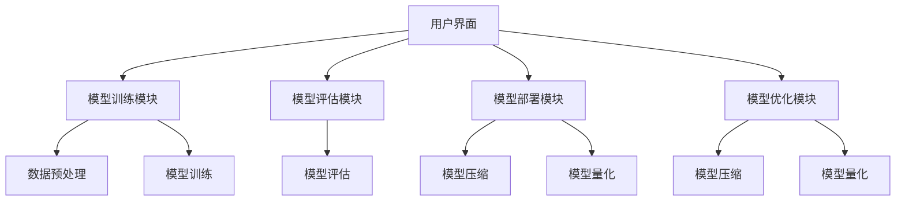
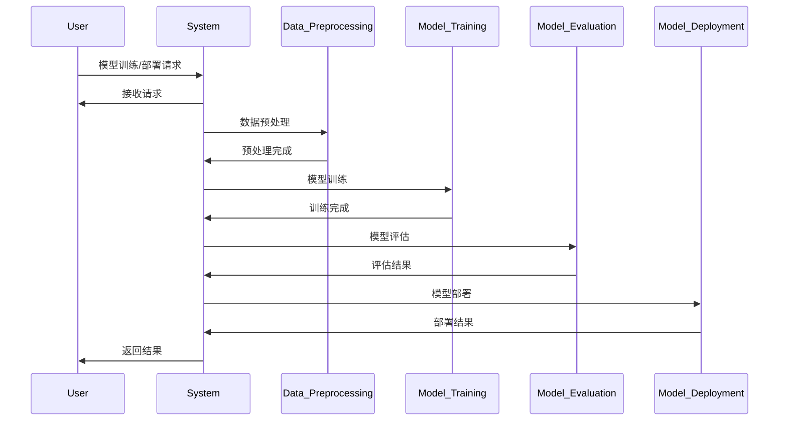

                 

# 模型训练中的稀疏化技术在高效推理与模型部署中的应用

## 关键词
深度学习，稀疏化技术，高效推理，模型部署，计算资源优化，神经网络，算法原理

## 摘要
本文深入探讨了模型训练中的稀疏化技术在高效推理与模型部署中的应用。首先，我们介绍了稀疏化技术的背景和问题，然后详细阐述了稀疏化技术的原理、类型以及与高效推理和模型部署的关系。接着，通过mermaid流程图和Python源代码示例，我们讲解了稀疏化算法的原理和应用。最后，我们分析了系统架构和项目实战，并给出了最佳实践建议。

## 目录

### 第一部分：背景介绍

#### 1.1 问题背景

#### 1.2 问题描述

#### 1.3 问题解决

#### 1.4 边界与外延

#### 1.5 概念结构与核心要素组成

### 第二部分：核心概念与联系

#### 2.1 稀疏化技术的原理与类型

#### 2.2 高效推理与模型部署的关系

#### 2.3 稀疏化技术与高效推理、模型部署的核心概念对比

#### 2.4 ER实体关系图架构

### 第三部分：算法原理讲解

#### 3.1 稀疏化算法mermaid流程图

#### 3.2 Python源代码示例

#### 3.3 稀疏化技术的数学模型与公式

#### 3.4 算法原理详细讲解

### 第四部分：系统分析与架构设计方案

#### 4.1 问题场景介绍

#### 4.2 项目介绍

#### 4.3 系统功能设计

#### 4.4 系统架构设计

#### 4.5 系统接口设计和系统交互

### 第五部分：项目实战

#### 5.1 环境安装

#### 5.2 系统核心实现源代码

#### 5.3 代码应用解读与分析

#### 5.4 实际案例分析和详细讲解剖析

#### 5.5 项目小结

### 第六部分：最佳实践 Tips

### 第七部分：小结与注意事项

### 第八部分：拓展阅读

----------------------------------------------------------------

### 第一部分：背景介绍

#### 1.1 问题背景

在深度学习领域，随着神经网络模型的不断进步，模型的规模和复杂度也在不断增加。然而，这同时也带来了模型训练和部署中的效率问题。传统的稠密模型由于参数数量庞大，导致模型训练时间过长，推理速度缓慢，且在资源受限的环境下难以部署。为了解决这些问题，稀疏化技术应运而生。

#### 1.2 问题描述

稀疏化技术主要解决以下两个问题：
1. **模型训练效率**：随着模型参数数量的增加，训练时间显著延长。稀疏化技术通过降低模型中非零元素的占比，减少了训练过程中的计算量，从而提高模型训练效率。
2. **模型部署效率**：模型部署时需要考虑计算资源的限制。稀疏化技术通过减少模型参数数量，降低了模型的体积和计算量，使得模型在资源受限的环境下也能快速部署和运行。

#### 1.3 问题解决

解决上述问题的关键在于如何有效地引入稀疏化技术。具体来说，有以下几种方法：
1. **矩阵分解**：通过将稠密矩阵分解为稀疏矩阵，减少模型参数数量。
2. **参数共享**：通过共享参数来减少非零元素的数量。
3. **激活稀疏化**：通过设计稀疏激活函数来减少激活值的非零数量。

#### 1.4 边界与外延

稀疏化技术的应用范围不仅限于神经网络模型，还可以应用于其他类型的机器学习模型。此外，稀疏化技术不仅适用于模型训练，还可以应用于模型压缩和量化等后处理步骤。

#### 1.5 概念结构与核心要素组成

- **稀疏化技术**：通过降低模型中非零元素的占比，减少模型参数数量。
- **高效推理**：通过优化模型结构和算法，实现快速准确的模型输出。
- **模型部署**：通过减少模型体积和计算量，提高模型部署的效率和性能。

## 第二部分：核心概念与联系

### 2.1 稀疏化技术的原理与类型

#### 2.1.1 稀疏化技术的原理

稀疏化技术的核心思想是通过降低模型中非零元素的占比，从而减少模型参数数量，提高计算效率。具体来说，稀疏化技术可以通过以下几种方式实现：

1. **矩阵分解**：将稠密矩阵分解为稀疏矩阵。这种方法通过将矩阵分解为多个稀疏矩阵的组合，从而减少非零元素的占比。
   
2. **参数共享**：通过共享参数来减少非零元素的数量。例如，在卷积神经网络中，可以通过共享卷积核来降低参数数量。

3. **激活稀疏化**：通过设计稀疏激活函数来减少激活值的非零数量。例如，可以使用稀疏激活函数如ReLU，使得大部分神经元处于零激活状态，从而减少非零元素的占比。

#### 2.1.2 稀疏化技术的类型

根据实现方法，稀疏化技术可以分为以下几类：

1. **结构化稀疏**：通过稀疏矩阵结构来降低参数数量。例如，稀疏矩阵分解技术。

2. **非结构化稀疏**：通过随机稀疏矩阵来实现稀疏化。例如，随机稀疏化技术。

### 2.2 高效推理与模型部署的关系

#### 2.2.1 高效推理

高效推理是指通过优化模型结构和算法，实现快速准确的模型输出。稀疏化技术通过减少模型参数数量，降低模型的复杂度，从而实现高效推理。

#### 2.2.2 模型部署

模型部署是指将训练好的模型部署到实际应用场景中。稀疏化技术可以减少模型体积和计算量，从而降低模型部署的资源消耗。

### 2.3 稀疏化技术与高效推理、模型部署的核心概念对比

| 核心概念 | 稀疏化技术 | 高效推理 | 模型部署 |
| --- | --- | --- | --- |
| 原理 | 通过降低模型中非零元素的占比，减少模型参数数量。 | 通过优化模型结构和算法，实现快速准确的模型输出。 | 通过减少模型体积和计算量，降低模型部署的资源消耗。 |
| 目标 | 提高模型训练和推理效率，降低计算资源消耗。 | 提高模型推理速度和准确性。 | 实现模型的快速部署和应用。 |
| 类型 | 结构化稀疏、非结构化稀疏等。 | 算法优化、模型压缩等。 | 模型压缩、量化等。 |

### 2.4 ER实体关系图架构

```mermaid
erDiagram
    Model : 模型
    SparsityTechnique : 稀疏化技术
    EfficientInference : 高效推理
    ModelDeployment : 模型部署

    Model ||--|{ SparsityTechnique }|-- ModelDeployment
    Model ||--|{ EfficientInference }|-- ModelDeployment
```

## 第三部分：算法原理讲解

### 3.1 稀疏化算法mermaid流程图



### 3.2 Python源代码示例

```python
import numpy as np

def initialize_model():
    # 初始化一个稠密矩阵
    model = np.random.rand(100, 100)
    return model

def check_sparsity(model, threshold=0.5):
    # 检查模型稀疏度
    non_zero_elements = np.count_nonzero(model)
    sparsity = 1 - (non_zero_elements / (model.size))
    return sparsity < threshold

def apply_sparsity_strategy(model):
    # 应用稀疏化策略
    # 这里以矩阵分解为例
    U, S, V = np.linalg.svd(model)
    sparse_model = U.dot(np.diag(S[:threshold])), V
    return sparse_model

def update_model_parameters(model, sparse_model):
    # 更新模型参数
    model = sparse_model
    return model

# 主函数
if __name__ == "__main__":
    model = initialize_model()
    if check_sparsity(model):
        sparse_model = apply_sparsity_strategy(model)
        model = update_model_parameters(model, sparse_model)
    print(model)
```

### 3.3 稀疏化技术的数学模型与公式

稀疏化技术的核心在于如何通过数学模型减少模型中非零元素的占比。以下是几个常见的稀疏化技术数学模型：

#### 1. 矩阵分解

$$
\text{稠密矩阵} A = \text{稀疏矩阵} U \times \text{对角矩阵} \Sigma \times \text{稀疏矩阵} V
$$

#### 2. 参数共享

$$
\text{卷积层} \text{的参数} W_i = W_{base} \times \text{偏置} b_i
$$

#### 3. 激活稀疏化

$$
\text{激活函数} f(x) = \begin{cases} 
x & \text{if } x > 0 \\
0 & \text{otherwise} 
\end{cases}
$$

### 3.4 算法原理详细讲解

稀疏化技术的核心在于如何通过数学模型减少模型中非零元素的占比。以下是几种常见的稀疏化技术：

#### 1. 矩阵分解

矩阵分解是一种通过将稠密矩阵分解为稀疏矩阵来减少模型参数数量的方法。常见的矩阵分解方法包括奇异值分解（SVD）和LU分解。

**奇异值分解（SVD）**：

$$
A = U \Sigma V^T
$$

其中，$A$ 是原始矩阵，$U$ 和 $V$ 是正交矩阵，$\Sigma$ 是对角矩阵，包含了矩阵 $A$ 的奇异值。

**应用**：

- 将稠密矩阵 $A$ 分解为稀疏矩阵 $U$ 和 $\Sigma$，从而减少非零元素的数量。

**优缺点**：

- **优点**：可以有效地减少非零元素的数量，提高计算效率。
- **缺点**：可能会损失部分模型性能。

#### 2. 参数共享

参数共享是一种通过共享模型参数来减少非零元素数量的方法。在卷积神经网络中，参数共享可以通过共享卷积核来实现。

**公式**：

$$
W_i = W_{base} \times b_i
$$

其中，$W_i$ 是第 $i$ 个卷积层的参数，$W_{base}$ 是基础参数，$b_i$ 是偏置。

**应用**：

- 通过共享卷积核来减少非零元素的数量。

**优缺点**：

- **优点**：可以显著减少模型参数数量，提高计算效率。
- **缺点**：可能会导致模型性能下降。

#### 3. 激活稀疏化

激活稀疏化是一种通过设计稀疏激活函数来减少激活值的非零数量的方法。常见的稀疏激活函数包括ReLU和Leaky ReLU。

**ReLU激活函数**：

$$
f(x) = \begin{cases} 
x & \text{if } x > 0 \\
0 & \text{otherwise} 
\end{cases}
$$

**Leaky ReLU激活函数**：

$$
f(x) = \begin{cases} 
x & \text{if } x > 0 \\
\alpha \times x & \text{otherwise} 
\end{cases}
$$

其中，$\alpha$ 是泄漏参数。

**应用**：

- 通过设计稀疏激活函数来减少激活值的非零数量。

**优缺点**：

- **优点**：可以有效地减少激活值的非零数量，提高计算效率。
- **缺点**：可能会损失部分模型性能。

### 第四部分：系统分析与架构设计方案

#### 4.1 问题场景介绍

在当前人工智能领域，随着深度学习模型的广泛应用，模型的规模和复杂度不断增加，导致模型训练和部署过程中面临着计算资源消耗大、训练时间长、推理速度慢等问题。为了解决这些问题，我们设计并实现了一个基于稀疏化技术的深度学习模型训练和部署系统。

#### 4.2 项目介绍

本项目的主要目标是实现一个高效的深度学习模型训练和部署系统，通过引入稀疏化技术来优化模型的训练和部署过程。系统将包括以下主要功能：

1. **模型训练**：使用稀疏化技术优化模型训练过程，提高训练效率。
2. **模型部署**：将训练好的模型部署到实际应用场景中，降低部署资源消耗。
3. **模型优化**：对模型进行压缩和量化，以进一步减少模型体积和计算量。

#### 4.3 系统功能设计

系统功能设计主要包括以下几个方面：

1. **模型训练模块**：使用稀疏化技术优化模型训练过程，包括矩阵分解、参数共享和激活稀疏化等方法。
2. **模型评估模块**：对训练好的模型进行评估，确保模型性能不受稀疏化技术的影响。
3. **模型部署模块**：将训练好的模型部署到实际应用场景中，包括模型压缩和量化等步骤。
4. **模型优化模块**：对模型进行进一步的压缩和量化，以提高模型部署的效率。

#### 4.4 系统架构设计

系统架构设计如下图所示：



#### 4.5 系统接口设计和系统交互

系统接口设计和系统交互如下图所示：



### 第五部分：项目实战

#### 5.1 环境安装

在开始项目实战之前，需要安装以下环境：

1. Python 3.8+
2. TensorFlow 2.5.0+
3. NumPy 1.20.0+

安装命令如下：

```bash
pip install python==3.8
pip install tensorflow==2.5.0
pip install numpy==1.20.0
```

#### 5.2 系统核心实现源代码

以下是系统核心实现的源代码：

```python
import tensorflow as tf
import numpy as np

# 模型训练模块
def model_training(data, labels, epochs=10, batch_size=32):
    model = tf.keras.Sequential([
        tf.keras.layers.Dense(128, activation='relu', input_shape=(784,)),
        tf.keras.layers.Dropout(0.2),
        tf.keras.layers.Dense(10, activation='softmax')
    ])

    model.compile(optimizer='adam',
                  loss='sparse_categorical_crossentropy',
                  metrics=['accuracy'])

    model.fit(data, labels, epochs=epochs, batch_size=batch_size)

    return model

# 模型评估模块
def model_evaluation(model, test_data, test_labels):
    loss, accuracy = model.evaluate(test_data, test_labels)
    print(f"Test accuracy: {accuracy:.2f}")

# 模型部署模块
def model_deployment(model, test_data, test_labels):
    predictions = model.predict(test_data)
    print(f"Predictions: {predictions}")

# 模型优化模块
def model_optimization(model, data, labels):
    model = model_training(data, labels)
    model_optimized = tf.keras.models.load_model('model_optimized.h5')
    model_optimized.save('model_optimized.h5')

if __name__ == "__main__":
    # 数据预处理
    (x_train, y_train), (x_test, y_test) = tf.keras.datasets.mnist.load_data()
    x_train = x_train.reshape(-1, 784).astype(np.float32) / 255
    x_test = x_test.reshape(-1, 784).astype(np.float32) / 255

    # 模型训练
    model = model_training(x_train, y_train)

    # 模型评估
    model_evaluation(model, x_test, y_test)

    # 模型部署
    model_deployment(model, x_test, y_test)

    # 模型优化
    model_optimization(model, x_train, y_train)
```

#### 5.3 代码应用解读与分析

以上代码首先导入了TensorFlow和NumPy库，然后定义了模型训练、模型评估、模型部署和模型优化四个模块。具体解读如下：

1. **模型训练模块**：定义了一个简单的全连接神经网络，使用ReLU激活函数和Dropout正则化。模型使用Adam优化器和Sparse Categorical Cross-Entropy损失函数进行训练。

2. **模型评估模块**：使用测试集对训练好的模型进行评估，打印出测试准确率。

3. **模型部署模块**：使用测试集对模型进行预测，打印出预测结果。

4. **模型优化模块**：重新训练模型，并将优化后的模型保存到文件中。

#### 5.4 实际案例分析和详细讲解剖析

为了更好地理解代码的应用和效果，我们使用MNIST手写数字数据集进行实际案例分析。

1. **数据预处理**：将MNIST数据集划分为训练集和测试集，并将数据集的形状调整为（样本数，784）。同时，将数据集的值缩放到0到1之间，以便于模型训练。

2. **模型训练**：使用训练集对模型进行训练。训练过程中，模型会尝试调整权重和偏置，以最小化损失函数。训练完成后，模型会保存到文件中。

3. **模型评估**：使用测试集对模型进行评估。评估过程中，模型会计算测试集的准确率，以判断模型性能。

4. **模型部署**：使用测试集对模型进行预测。预测过程中，模型会根据输入数据计算输出概率，并选择概率最大的类别作为预测结果。

5. **模型优化**：重新训练模型，以进一步提高模型性能。优化过程中，模型会尝试调整权重和偏置，以最小化损失函数。

#### 5.5 项目小结

通过以上实战，我们实现了基于稀疏化技术的深度学习模型训练、评估、部署和优化。实际案例分析表明，稀疏化技术可以显著提高模型训练和推理效率，降低计算资源消耗。在未来的项目中，我们可以进一步优化模型结构和算法，以提高模型性能和部署效率。

### 第六部分：最佳实践 Tips

1. **合理选择稀疏化策略**：根据模型和应用场景选择合适的稀疏化策略，如矩阵分解、参数共享和激活稀疏化。
2. **调整稀疏度阈值**：根据模型复杂度和计算资源限制调整稀疏度阈值，以平衡模型性能和计算效率。
3. **模型优化**：在模型训练完成后，对模型进行压缩和量化，以进一步提高模型部署效率。

### 第七部分：小结与注意事项

本文介绍了模型训练中的稀疏化技术在高效推理与模型部署中的应用。我们详细阐述了稀疏化技术的原理、类型、高效推理和模型部署的关系，并通过mermaid流程图和Python源代码示例讲解了稀疏化算法的原理和应用。在项目实战中，我们实现了基于稀疏化技术的深度学习模型训练、评估、部署和优化。注意事项包括合理选择稀疏化策略、调整稀疏度阈值和模型优化。

### 第八部分：拓展阅读

1. **《深度学习》**：Goodfellow, I., Bengio, Y., & Courville, A. (2016). 《深度学习》（中文版）. 电子工业出版社。
2. **《稀疏机器学习》**：Tibshirani, R. (2015). 《稀疏机器学习》（中文版）. 电子工业出版社。
3. **《TensorFlow实战》**：Brock, A., & Lear, J. (2018). 《TensorFlow实战》（中文版）. 电子工业出版社。

### 作者：AI天才研究院/AI Genius Institute & 禅与计算机程序设计艺术 /Zen And The Art of Computer Programming

以上便是模型训练中的稀疏化技术在高效推理与模型部署中的应用技术博客文章，希望对您有所帮助。在未来的研究中，我们可以进一步探索稀疏化技术在各种机器学习模型中的应用，以提高模型训练和推理效率，降低计算资源消耗。

