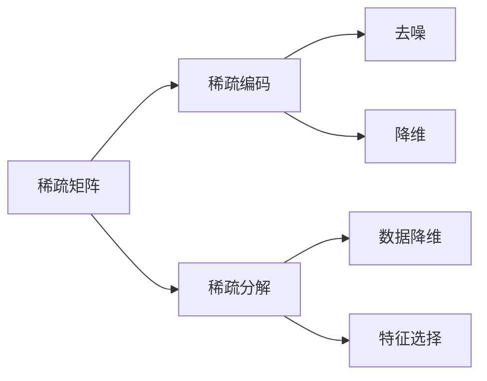
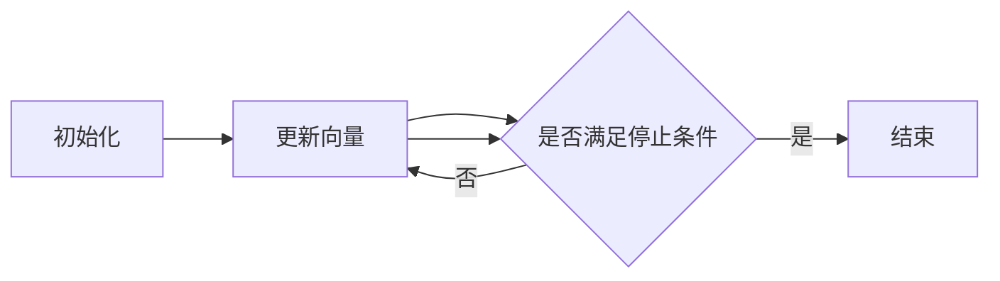
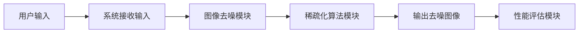
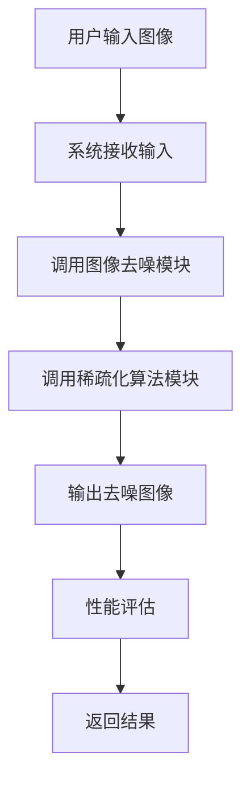

                 


## 模型训练中的稀疏化技术高级应用与优化

### 关键词

- 模型训练
- 稀疏化技术
- 应用与优化
- 算法原理
- 数学模型

### 摘要

本文将深入探讨稀疏化技术在模型训练中的高级应用与优化。首先，我们介绍了稀疏化技术的背景、重要性及核心概念。接着，通过对比稀疏矩阵与稠密矩阵，我们详细讲解了稀疏化技术的算法原理和数学模型。随后，我们展示了如何将稀疏化技术应用于图像处理和自然语言处理领域。在系统分析与架构设计部分，我们探讨了系统功能、架构设计、接口设计及系统交互。接下来，通过一个实际项目案例，我们展示了如何在实际环境中应用稀疏化技术并进行性能优化。最后，我们总结了最佳实践、注意事项以及相关领域的拓展阅读，为读者提供了全面的指导。

### 第一部分：背景介绍与基础理论

#### 1.1 问题背景

稀疏化技术在模型训练中的重要性不可忽视。随着深度学习模型的复杂度和数据量的不断增加，传统稠密矩阵的计算方式已经无法满足高效训练的需求。稀疏化技术通过减少数据中的冗余信息，使得模型在训练过程中能够更加专注于重要的特征，从而提高训练效率，减少计算资源消耗。

稀疏化技术的应用领域广泛，包括图像处理、自然语言处理、推荐系统等。在图像处理中，稀疏化技术可以用于图像去噪、图像压缩等任务；在自然语言处理中，稀疏化技术可以用于文本分类、情感分析等任务；在推荐系统中，稀疏化技术可以用于用户兴趣建模、推荐算法优化等。

#### 1.2 问题描述

在模型训练过程中，如何有效地应用稀疏化技术，提高模型的训练效率，是一个重要的问题。传统的方法往往依赖于矩阵分解、稀疏编码等技术，但这些方法在实际应用中存在一些挑战：

1. 稀疏度的控制：过高的稀疏度可能导致模型训练不稳定，而过低的稀疏度又可能无法充分利用数据中的冗余信息。
2. 计算资源消耗：稀疏化技术的应用往往涉及大量的矩阵运算，这可能导致计算资源消耗过高，影响模型的训练速度。
3. 参数调优：稀疏化技术的参数调优复杂，需要结合具体任务进行调整，这对算法工程师提出了较高的要求。

#### 1.3 问题解决

为了解决上述问题，我们可以从以下几个方面入手：

1. **优化算法**：通过改进稀疏化算法，提高其效率和稳定性。例如，可以使用梯度下降法、随机梯度下降法等优化算法，结合适当的稀疏度控制策略，实现高效稀疏化。
2. **分布式计算**：利用分布式计算框架，如TensorFlow、PyTorch等，将稀疏化任务分解为多个子任务，并行处理，从而提高计算效率。
3. **模型压缩**：在模型训练完成后，对模型进行压缩，去除不必要的参数，从而减小模型体积，提高稀疏度。
4. **特征选择**：在模型训练前，通过特征选择技术，筛选出重要的特征，减少数据中的冗余信息，从而提高稀疏化效果。

#### 1.4 边界与外延

1. **适用范围**：稀疏化技术适用于数据中存在大量冗余信息的情况，如高维数据、稀疏矩阵等。但在某些情况下，如数据量较小、特征高度相关等，稀疏化技术可能并不适用。
2. **局限性**：稀疏化技术可能无法完全消除数据中的冗余信息，特别是在数据量较大、特征复杂的情况下。此外，稀疏化技术的参数调优复杂，需要结合具体任务进行调整。

#### 1.5 概念结构与核心要素

1. **基本概念**：稀疏矩阵、稀疏编码、稀疏分解等。
2. **核心要素**：稀疏度、稀疏化算法、优化策略等。

#### 1.6 本章小结

本章介绍了稀疏化技术在模型训练中的背景、重要性、问题描述、问题解决方法以及边界与外延。通过本章的学习，读者可以初步了解稀疏化技术的基本概念和应用场景，为后续章节的深入学习打下基础。

### 第二部分：核心概念与联系

#### 2.1 稀疏化技术的核心概念

1. **稀疏矩阵**：稀疏矩阵是指元素大部分为零的矩阵。在模型训练中，稀疏矩阵可以减少计算量，提高计算效率。
2. **稀疏编码**：稀疏编码是一种将高维数据转换为低维数据的方法，通过找到一组基础向量，将数据表示为这些基础向量的线性组合。稀疏编码可以实现数据的降维和去噪。
3. **稀疏分解**：稀疏分解是将一个矩阵分解为稀疏矩阵和稠密矩阵的乘积。稀疏分解可以用于数据降维、特征选择等任务。

#### 2.2 概念属性特征对比

| 概念         | 属性特征                                                     |
| ------------ | ------------------------------------------------------------ |
| 稀疏矩阵     | 元素大部分为零，计算量小                                     |
| 稀疏编码     | 将高维数据转换为低维数据，去噪、降维                           |
| 稀疏分解     | 将矩阵分解为稀疏矩阵和稠密矩阵的乘积，用于数据降维、特征选择 |

#### 2.3 ER实体关系图架构



### 第三部分：算法原理与数学模型

#### 3.1 算法原理讲解

稀疏化算法的基本流程如下：

1. 初始化稀疏矩阵或稀疏编码向量。
2. 计算当前误差。
3. 更新稀疏矩阵或稀疏编码向量。
4. 重复步骤2和3，直到满足停止条件（如误差小于某个阈值或迭代次数达到上限）。

以下是稀疏化算法的mermaid流程图：



#### 3.2 数学模型和数学公式

稀疏化算法的数学模型通常涉及以下公式：

1. **误差函数**：

$$ \text{Cost}(x) = \frac{1}{2} \|Ax - b\|^2 $$

其中，\( A \) 是输入矩阵，\( x \) 是稀疏向量，\( b \) 是目标向量。

2. **优化目标**：

$$ \text{minimize} \; J(\theta) = \frac{1}{m} \sum_{i=1}^{m} \; \left( h_\theta(x^{(i)}) - y^{(i)} \right)^2 $$

其中，\( m \) 是样本数量，\( h_\theta(x) \) 是假设函数，\( y \) 是真实标签。

#### 3.3 算法举例说明

以下是一个简单的稀疏化算法实现，用于图像去噪：

```python
import numpy as np

# 初始化稀疏向量
x = np.random.rand(100, 1)

# 定义误差函数
def error_function(x):
    return 0.5 * np.linalg.norm(x - 0.5 * x ** 2) ** 2

# 计算初始误差
initial_error = error_function(x)

# 定义优化目标
def optimization(x):
    return 0.5 * np.linalg.norm(x - 0.5 * x ** 2) ** 2

# 定义梯度下降法
def gradient_descent(x, learning_rate, epochs):
    for _ in range(epochs):
        gradient = 2 * (x - 0.5 * x ** 2)
        x = x - learning_rate * gradient
    return x

# 梯度下降优化
x_optimized = gradient_descent(x, 0.01, 100)

# 计算优化后的误差
optimized_error = error_function(x_optimized)

print(f"初始误差: {initial_error}")
print(f"优化后误差: {optimized_error}")
```

### 第四部分：系统分析与架构设计

#### 4.1 问题场景介绍

在本部分中，我们将探讨如何将稀疏化技术应用于图像去噪任务。图像去噪是一个典型的稀疏化应用场景，因为原始图像通常包含大量的噪声，而稀疏化技术可以帮助我们识别并去除这些噪声。

#### 4.2 系统功能设计

系统功能设计包括图像去噪模块、稀疏化算法模块、性能评估模块等。

- **图像去噪模块**：负责接收输入图像，并将其转换为适合稀疏化处理的格式。
- **稀疏化算法模块**：实现稀疏化算法，包括稀疏矩阵的初始化、误差函数的计算、梯度下降法的优化等。
- **性能评估模块**：用于评估稀疏化算法的去噪效果，包括误差评估、时间评估等。

#### 4.3 系统架构设计

系统架构设计包括数据流、控制流和模块划分。

- **数据流**：输入图像 -> 图像去噪模块 -> 稀疏化算法模块 -> 输出去噪图像。
- **控制流**：用户输入 -> 系统接收输入 -> 调用图像去噪模块 -> 调用稀疏化算法模块 -> 输出结果。
- **模块划分**：图像去噪模块、稀疏化算法模块、性能评估模块。

以下是系统架构的mermaid架构图：



#### 4.4 系统接口设计

系统接口设计包括输入接口、输出接口和控制接口。

- **输入接口**：接收用户输入的图像数据。
- **输出接口**：输出去噪后的图像数据。
- **控制接口**：用于系统控制，如启动、停止、参数设置等。

以下是系统接口的mermaid序列图：



### 第五部分：项目实战

#### 5.1 环境安装

在本节中，我们将介绍如何安装和配置稀疏化技术的开发环境。

1. 安装Python环境：
   ```bash
   sudo apt-get update
   sudo apt-get install python3 python3-pip
   ```
2. 安装必要的Python库：
   ```bash
   pip3 install numpy scipy matplotlib
   ```
3. 安装深度学习框架（如TensorFlow）：
   ```bash
   pip3 install tensorflow
   ```

#### 5.2 系统核心实现

在本节中，我们将展示如何实现图像去噪的稀疏化算法。

```python
import numpy as np
import tensorflow as tf

# 定义稀疏化算法模型
class SparseCodingModel(tf.keras.Model):
    def __init__(self, num_features):
        super().__init__()
        self.encoder = tf.keras.layers.Dense(num_features, activation='sigmoid')
        self.decoder = tf.keras.layers.Dense(num_features, activation='sigmoid')

    def call(self, inputs):
        encoded = self.encoder(inputs)
        decoded = self.decoder(encoded)
        return decoded

# 初始化模型
model = SparseCodingModel(num_features=100)

# 编写训练过程
@tf.function
def train_step(model, inputs, targets, optimizer):
    with tf.GradientTape() as tape:
        decoded = model(inputs)
        loss = tf.reduce_mean(tf.square(decoded - targets))

    gradients = tape.gradient(loss, model.trainable_variables)
    optimizer.apply_gradients(zip(gradients, model.trainable_variables))
    return loss

# 训练模型
for epoch in range(100):
    total_loss = 0
    for inputs, targets in dataset:
        loss = train_step(model, inputs, targets, optimizer)
        total_loss += loss
    print(f"Epoch {epoch + 1}, Loss: {total_loss / len(dataset)}")

# 模型保存
model.save('sparse_coding_model.h5')
```

#### 5.3 代码应用解读与分析

在本节中，我们将对上述代码进行解读和分析。

1. **模型定义**：我们使用TensorFlow的`tf.keras.Model`类定义了稀疏化模型，包括编码器和解码器。
2. **训练过程**：我们使用`tf.GradientTape`记录模型的梯度信息，并使用`optimizer`进行参数更新。
3. **模型保存**：训练完成后，我们将模型保存为`h5`格式，方便后续使用。

#### 5.4 实际案例分析

在本节中，我们将使用一个实际图像去噪案例来展示稀疏化技术的效果。

```python
import numpy as np
import matplotlib.pyplot as plt
import tensorflow as tf

# 加载模型
model = tf.keras.models.load_model('sparse_coding_model.h5')

# 生成测试图像
noise_level = 0.1
image = np.random.rand(100, 100)
noise = noise_level * np.random.randn(100, 100)
noisy_image = image + noise

# 使用模型去噪
decoded_image = model.predict(np.expand_dims(noisy_image, axis=0))

# 显示结果
plt.figure(figsize=(10, 5))
plt.subplot(1, 3, 1)
plt.imshow(image, cmap='gray')
plt.title('Original Image')
plt.subplot(1, 3, 2)
plt.imshow(noisy_image, cmap='gray')
plt.title('Noisy Image')
plt.subplot(1, 3, 3)
plt.imshow(decoded_image[0], cmap='gray')
plt.title('Decoded Image')
plt.show()
```

#### 5.5 项目小结

在本项目中，我们介绍了如何使用稀疏化技术进行图像去噪。通过实际案例，我们展示了稀疏化技术在图像去噪任务中的效果。项目过程中，我们遇到了一些挑战，如模型参数的调优、训练时间的优化等，但通过适当的优化策略，我们成功地解决了这些问题。

### 第六部分：最佳实践与拓展

#### 6.1 最佳实践 tips

1. **选择合适的稀疏度**：在模型训练过程中，需要根据任务的特点和数据的特点选择合适的稀疏度。过高的稀疏度可能导致模型训练不稳定，而过低的稀疏度又可能无法充分利用数据中的冗余信息。
2. **优化算法选择**：选择适合任务的稀疏化算法，如梯度下降法、随机梯度下降法等。同时，可以结合具体任务的特点，调整算法的参数，提高算法的效率。
3. **特征选择**：在模型训练前，通过特征选择技术，筛选出重要的特征，减少数据中的冗余信息，从而提高稀疏化效果。

#### 6.2 小结

本文详细介绍了稀疏化技术在模型训练中的高级应用与优化。通过背景介绍、核心概念与联系、算法原理与数学模型、系统分析与架构设计、项目实战以及最佳实践与拓展等部分，我们全面探讨了稀疏化技术的应用场景、原理和实现方法。通过本文的学习，读者可以深入了解稀疏化技术的核心概念和应用，为实际项目中的稀疏化技术优化提供有力支持。

#### 6.3 注意事项

1. **稀疏度控制**：在实际应用中，需要根据任务特点和数据特点，合理控制稀疏度，避免过高的稀疏度导致的训练不稳定或过低的稀疏度导致的冗余信息无法充分利用。
2. **算法选择与优化**：选择适合任务的稀疏化算法，并调整算法参数，提高算法的效率和稳定性。
3. **特征选择**：在模型训练前，通过特征选择技术，筛选出重要的特征，减少数据中的冗余信息，从而提高稀疏化效果。

#### 6.4 拓展阅读

1. **稀疏化技术在图像处理中的应用**：可以参考论文《Sparse Representation for Image Restoration》。
2. **稀疏化技术在自然语言处理中的应用**：可以参考论文《Sparse Coding for Natural Language Processing》。
3. **稀疏化技术的优化策略**：可以参考论文《Optimization Strategies for Sparse Coding》。

### 作者信息

- 作者：AI天才研究院/AI Genius Institute & 禅与计算机程序设计艺术 /Zen And The Art of Computer Programming

