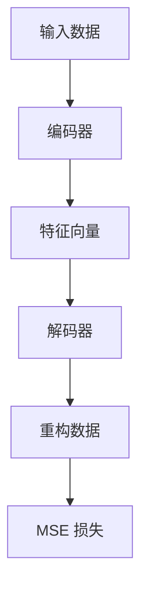
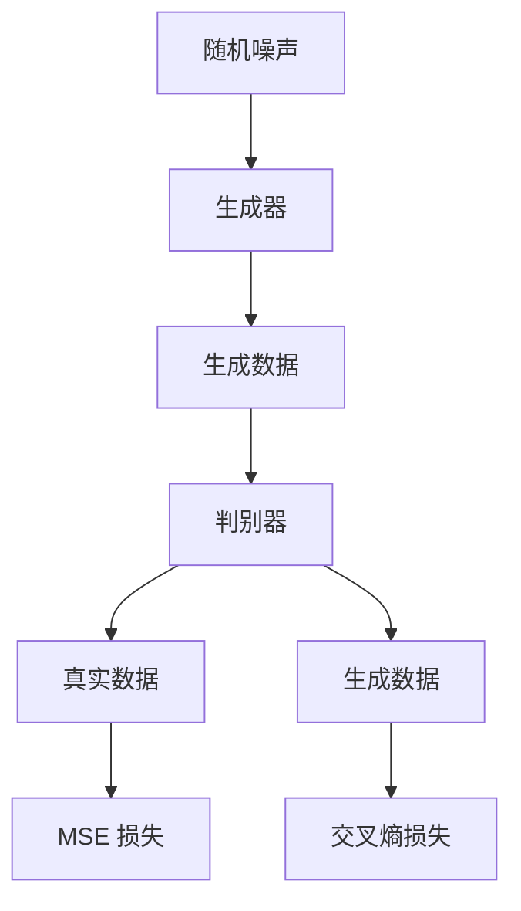
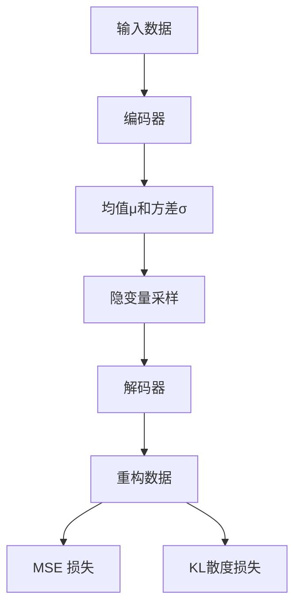

                 

## 模型训练中的自监督学习技术在少样本推理中的突破

自监督学习（Self-supervised Learning）是近年来在机器学习领域发展迅速的一个分支，其主要特点是不依赖于外部标签信息，通过设计内部监督信号来自我指导学习。自监督学习技术在模型训练中的应用，尤其是其在少样本推理（Few-shot Learning）中的突破，成为了当前研究的热点。本文将深入探讨自监督学习在少样本推理中的重要性，其基本原理，以及如何在实际应用中发挥关键作用。

### 关键词

- 自监督学习
- 少样本推理
- 模型训练
- 数据增强
- 特征提取
- 泛化能力

### 摘要

本文旨在分析自监督学习在少样本推理中的应用及其重要性。首先，我们将介绍自监督学习的基本概念和原理，以及其在计算机视觉、自然语言处理等领域的广泛应用。接着，我们将探讨自监督学习在少样本推理中的具体应用，包括特征提取、数据增强和适应性学习等方面。随后，我们将详细讲解自监督学习在少样本推理中的优势和挑战，并提出相应的解决策略。最后，通过实际案例，我们将展示自监督学习在少样本推理中的具体应用，以及其在实际项目中的实践效果。

### 第1章: 问题背景与核心概念介绍

#### 1.1 自监督学习简介

自监督学习是一种无需外部监督信号，仅利用数据内部信息进行训练的机器学习方法。在自监督学习中，模型通过预测自身生成的数据或特征来学习，从而实现数据的自我监督。

**定义与基本原理**

自监督学习的核心在于设计一个内部监督信号，使得模型在训练过程中能够不断自我纠正和改进。以下是一个简单的自监督学习框架：

1. **数据预处理**：首先对数据进行预处理，如数据清洗、归一化等。
2. **特征提取**：使用某种特征提取方法，如卷积神经网络（CNN）或自编码器（Autoencoder），将输入数据映射到特征空间。
3. **内部监督信号设计**：设计一个内部监督信号，如预测数据中的部分缺失值、图像中的像素值等，用于指导模型训练。
4. **模型训练**：通过最小化损失函数来调整模型参数，使得模型能够更好地预测内部监督信号。
5. **模型评估**：在测试集上评估模型性能，调整模型参数，直到达到预定的性能指标。

自监督学习在多个方面具有优势：

- **无标签数据利用**：自监督学习能够利用大量无标签数据，从而降低数据标注的成本。
- **数据增强**：通过设计不同的内部监督信号，可以实现对数据的增强，提高模型的泛化能力。
- **通用性**：自监督学习可以应用于不同的数据类型和任务，具有较好的通用性。

**应用场景**

自监督学习在多个领域都有广泛应用：

- **计算机视觉**：自监督学习可以用于图像分类、目标检测、图像分割等任务。例如，使用自编码器进行图像去噪和超分辨率处理。
- **自然语言处理**：自监督学习可以用于词嵌入、语言建模、机器翻译等任务。例如，使用BERT模型进行自然语言理解。
- **少样本学习**：自监督学习在少样本学习（Few-shot Learning）中也显示出巨大潜力，通过在无标签数据上预训练，模型可以在少量标注样本上达到很好的性能。

**自监督学习的挑战与前景**

尽管自监督学习具有广泛的应用前景，但也面临一些挑战：

- **数据质量**：自监督学习依赖于未标记的数据，数据质量直接影响到模型的性能。噪声数据和不良数据可能会引入错误的信息，影响模型的训练效果。
- **模型泛化**：如何设计出既能在无标签数据上训练，又能良好泛化到新数据上的模型，仍然是一个研究热点。
- **计算资源**：自监督学习通常需要大量的计算资源，特别是对于大规模模型和大数据集，计算成本较高。

#### 1.2 少样本推理与自监督学习

**少样本推理简介**

少样本推理（Few-shot Learning）是一种机器学习方法，旨在解决模型在少量样本情况下如何快速适应新任务的问题。其核心目标是在仅有有限样本的情况下，使模型能够对新任务进行准确预测。

**自监督学习在少样本推理中的应用**

自监督学习在少样本推理中具有重要作用，主要体现在以下几个方面：

- **特征提取**：自监督学习通过在无标签数据上预训练，可以提取出具有通用性和鲁棒性的特征表示。这些特征表示可以用于后续的少样本推理任务，提高模型的泛化能力。
- **数据增强**：自监督学习任务通常涉及数据增强技术，这有助于模型在少量样本上学习到更丰富的特征。通过这种方式，模型可以在更小的样本集上获得更好的表现。
- **适应性学习**：自监督学习模型在预训练阶段已经学习到了一定的知识，这有助于它们在少样本情况下快速适应新任务。

**自监督学习在少样本推理中的优势与挑战**

自监督学习在少样本推理中的优势包括：

- **减少标注成本**：在少样本推理任务中，自监督学习可以大幅减少对标注数据的需求，从而降低数据采集和标注的成本。
- **提高泛化能力**：通过在大量无标签数据上预训练，模型能够学习到更一般的特征表示，从而在少量样本上也能表现出良好的泛化能力。

自监督学习在少样本推理中也面临一些挑战：

- **模型选择**：如何选择合适的自监督学习模型，以便在少样本情况下达到最佳性能，仍然是一个需要深入研究的问题。
- **数据分布**：自监督学习模型的训练依赖于数据分布，而在少样本情况下，数据分布可能非常有限，这可能会对模型的泛化能力产生负面影响。

#### 1.3 本书结构与内容概述

本书旨在深入探讨自监督学习在少样本推理中的应用，共分为以下章节：

- **第1章**：介绍自监督学习的基本概念、应用场景以及其在少样本推理中的重要性。
- **第2章**：详细讲解了自监督学习的主要算法原理，包括自编码器、生成对抗网络等。
- **第3章**：研究了自监督学习在不同领域的应用，如计算机视觉、自然语言处理等。
- **第4章**：探讨自监督学习在少样本推理中的具体实现方法和技术。
- **第5章**：分析自监督学习在少样本推理中的优势和挑战，并提出了相应的解决策略。
- **第6章**：通过实际案例，展示了自监督学习在少样本推理中的具体应用。

### 第2章: 自监督学习的主要算法原理

自监督学习作为一种无监督的学习方法，其核心在于如何在没有外部标签的情况下，利用数据内部的信息进行有效学习。本章将介绍自监督学习中的几种主要算法原理，包括自编码器（Autoencoder）、生成对抗网络（GAN）以及变分自编码器（VAE）。

#### 2.1 自编码器（Autoencoder）

**定义与基本原理**

自编码器是一种无监督学习模型，其目标是学习一种数据表示，能够捕捉数据的本质特征。自编码器主要由两部分组成：编码器（Encoder）和解码器（Decoder）。编码器将输入数据压缩到一个低维特征空间，解码器则尝试从这个低维空间中重构原始数据。

自编码器的基本流程如下：

1. **编码**：编码器接收输入数据，通过神经网络将其映射到一个低维特征向量。
2. **解码**：解码器接收编码后的特征向量，通过逆向过程尝试重构原始数据。

自编码器的主要作用包括：

- **数据降维**：自编码器可以帮助我们识别数据中的主要特征，实现数据的降维。
- **特征提取**：自编码器的编码部分可以提取出数据的特征表示，这些特征可以用于后续的任务，如分类、聚类等。
- **数据增强**：通过自编码器的训练，我们可以生成新的数据样本，从而增加训练数据的多样性，提高模型的泛化能力。

**数学模型**

设输入数据为 \( x \)，编码器输出特征向量为 \( z \)，解码器输出为 \( \hat{x} \)。自编码器的损失函数通常采用均方误差（MSE）：

$$
L = \frac{1}{n} \sum_{i=1}^{n} \| x_i - \hat{x}_i \|_2^2
$$

其中，\( n \) 是训练样本数量，\( x_i \) 和 \( \hat{x}_i \) 分别是输入数据和重构数据。

**Mermaid 流程图**



#### 2.2 生成对抗网络（GAN）

**定义与基本原理**

生成对抗网络（GAN）由生成器（Generator）和判别器（Discriminator）两个神经网络组成。生成器的目标是生成尽可能真实的数据，判别器的目标是区分真实数据和生成数据。GAN的训练过程是一个对抗过程，生成器和判别器相互竞争，以达到最优状态。

GAN的基本流程如下：

1. **生成器生成数据**：生成器从随机噪声中生成数据，试图欺骗判别器。
2. **判别器判断**：判别器接收真实数据和生成数据，并输出概率值，判断数据的真实性。
3. **更新参数**：生成器和判别器的参数通过梯度下降算法进行更新，以改善模型性能。

GAN的主要作用包括：

- **数据生成**：生成器可以生成与真实数据高度相似的数据，应用于数据增强、图像生成等任务。
- **特征提取**：GAN在训练过程中，生成器和判别器都会学习到数据的特征，这些特征可以用于其他任务。

**数学模型**

设生成器输出为 \( G(z) \)，判别器输出为 \( D(x) \) 和 \( D(G(z)) \)。判别器的损失函数通常采用二元交叉熵（Binary Cross-Entropy）：

$$
L_D = -\frac{1}{n} \sum_{i=1}^{n} [y_i \cdot \log(D(x_i)) + (1 - y_i) \cdot \log(1 - D(x_i))]
$$

其中，\( y_i \) 是标签，当 \( x_i \) 为真实数据时，\( y_i = 1 \)；当 \( x_i \) 为生成数据时，\( y_i = 0 \)。

生成器的损失函数同样采用二元交叉熵：

$$
L_G = -\frac{1}{n} \sum_{i=1}^{n} [y_i \cdot \log(D(G(z_i))) + (1 - y_i) \cdot \log(1 - D(G(z_i)))]
$$

**Mermaid 流程图**



#### 2.3 变分自编码器（VAE）

**定义与基本原理**

变分自编码器（Variational Autoencoder，VAE）是一种基于概率模型的生成模型，它在自编码器的基础上引入了概率密度函数。VAE通过编码器和解码器的联合训练，学习输入数据的概率分布。

VAE的基本流程如下：

1. **编码**：编码器将输入数据映射到一个隐变量 \( z \) 的概率分布。
2. **解码**：解码器从隐变量 \( z \) 中采样，重构输入数据。
3. **损失函数**：VAE的损失函数由两部分组成，一部分是重构损失，另一部分是KL散度损失。

VAE的主要作用包括：

- **数据生成**：VAE可以生成与输入数据具有相似分布的样本，应用于图像生成、数据增强等任务。
- **特征提取**：VAE的编码部分可以提取出数据的潜在特征，这些特征可以用于其他任务。

**数学模型**

设输入数据为 \( x \)，编码器输出为 \( \mu(z) \) 和 \( \sigma(z) \)，解码器输出为 \( \hat{x} \)。VAE的损失函数包括两部分：

1. **重构损失**：采用均方误差（MSE）：

$$
L_{\text{recon}} = \frac{1}{n} \sum_{i=1}^{n} \| x_i - \hat{x}_i \|_2^2
$$

2. **KL散度损失**：用于衡量编码器输出的概率分布与先验分布之间的差异：

$$
L_{\text{KL}} = \frac{1}{n} \sum_{i=1}^{n} D_{\text{KL}}(\mu(z_i), \sigma(z_i))
$$

总损失函数为：

$$
L = L_{\text{recon}} + \lambda L_{\text{KL}}
$$

其中，\( \lambda \) 是平衡重构损失和KL散度损失的权重。

**Mermaid 流程图**



通过本章的介绍，我们可以看到自监督学习中的主要算法原理，包括自编码器、生成对抗网络和变分自编码器。这些算法通过不同的方式利用数据内部信息进行学习，为少样本推理提供了有效的技术支持。

### 第3章: 自监督学习在不同领域的应用

自监督学习由于其独特的优势，在计算机视觉、自然语言处理、语音识别等多个领域都取得了显著的成果。本章将详细介绍自监督学习在这些领域中的应用，探讨其如何通过特征提取、数据增强和适应性学习等机制，推动各领域的发展。

#### 3.1 计算机视觉

**自监督学习在计算机视觉中的应用**

自监督学习在计算机视觉领域有着广泛的应用，尤其是在图像分类、目标检测和图像分割等任务中。以下是一些具体的应用场景：

- **图像分类**：自监督学习通过在未标记的图像数据中学习特征表示，可以用于图像分类任务。例如，通过自编码器训练，模型可以从无标签图像中提取出有效的特征，从而实现图像分类。

- **目标检测**：自监督学习在目标检测任务中的应用主要体现在数据增强和特征提取方面。通过设计不同的自监督任务，如图像恢复、图像配对等，可以增强模型对目标检测的鲁棒性。

- **图像分割**：自监督学习在图像分割中的应用主要是通过无监督的方式学习图像的边缘和区域特征。例如，通过自编码器或生成对抗网络，模型可以从未标记的图像中提取出边缘特征，从而实现图像分割。

**具体应用案例**

- **图像分类**：利用自监督学习进行图像分类的典型例子是自监督预训练的ImageNet模型。该模型通过在大量无标签图像上预训练，提取出通用的图像特征，然后使用少量标注图像进行微调，达到很好的分类性能。

- **目标检测**：自监督学习在目标检测中的应用案例包括DukeMTMC和NYUDv2等数据集上的实验。通过设计自监督任务，如图像匹配、图像恢复等，模型在目标检测任务上取得了显著的性能提升。

- **图像分割**：自监督学习在图像分割中的应用案例包括利用自编码器对未标记的图像进行训练，提取出边缘特征，从而实现图像分割。这种方法在医学图像分割等领域有重要应用。

**自监督学习的挑战**

尽管自监督学习在计算机视觉中表现出强大的潜力，但也面临一些挑战：

- **数据质量**：自监督学习依赖于无标签数据，数据质量直接影响到模型的性能。噪声数据和不良数据可能会引入错误的信息，影响模型的训练效果。

- **模型泛化**：如何设计出既能在无标签数据上训练，又能良好泛化到新数据上的模型，仍然是一个研究热点。

#### 3.2 自然语言处理

**自监督学习在自然语言处理中的应用**

自监督学习在自然语言处理（NLP）领域也得到了广泛的应用，尤其是在词嵌入、语言建模和机器翻译等任务中。以下是一些具体的应用场景：

- **词嵌入**：自监督学习可以用于词嵌入任务，通过在未标记的文本数据中学习词汇的向量表示。例如，Word2Vec和BERT等模型就是通过自监督学习技术实现的。

- **语言建模**：自监督学习在语言建模任务中的应用主要体现在生成文本序列。例如，BERT模型通过自监督的掩码语言模型（Masked Language Model，MLM）预训练技术，学习语言的特征表示。

- **机器翻译**：自监督学习可以用于机器翻译任务，通过在多语言数据中学习翻译模型。例如，使用多语言BERT模型进行跨语言文本转换。

**具体应用案例**

- **词嵌入**：Word2Vec和BERT等模型都是通过自监督学习技术实现的词嵌入。Word2Vec通过训练神经网络预测目标词，而BERT通过自监督的掩码语言模型，学习词汇的上下文表示。

- **语言建模**：BERT模型通过自监督的掩码语言模型预训练技术，学习语言的特征表示。该模型在多个NLP任务上取得了显著的性能提升。

- **机器翻译**：多语言BERT模型通过自监督学习，在跨语言文本转换任务中表现出强大的能力。例如，通过在多语言数据集上预训练，模型可以无监督地学习不同语言之间的对应关系。

**自监督学习的挑战**

自监督学习在自然语言处理中也面临一些挑战：

- **数据分布**：自监督学习依赖于文本数据，数据分布对于模型性能有重要影响。如何设计出能够适应多种语言和文本分布的模型，是一个重要问题。

- **计算资源**：自然语言处理任务通常涉及大规模文本数据，自监督学习需要大量的计算资源，这对于模型训练和优化提出了更高的要求。

#### 3.3 语音识别

**自监督学习在语音识别中的应用**

自监督学习在语音识别领域也有着重要的应用，通过在无标签语音数据中学习语音特征，可以显著提高语音识别的准确率。以下是一些具体的应用场景：

- **语音增强**：自监督学习可以用于语音增强任务，通过无监督的方式学习语音的干净信号。例如，通过自编码器模型，可以从噪声语音数据中提取出干净语音信号。

- **说话人识别**：自监督学习可以用于说话人识别任务，通过在未标记的语音数据中学习说话人的特征，可以实现高精度的说话人识别。

- **语音生成**：自监督学习还可以用于语音生成任务，通过生成对抗网络（GAN）等模型，可以从文本中生成逼真的语音。

**具体应用案例**

- **语音增强**：自监督学习在语音增强中的应用案例包括利用自编码器模型对噪声语音数据进行处理，提取出干净的语音信号。这种方法在语音通信和语音识别中有着重要的应用。

- **说话人识别**：自监督学习在说话人识别中的应用案例包括利用生成对抗网络（GAN）从未标记的语音数据中学习说话人的特征，从而实现高精度的说话人识别。

- **语音生成**：通过自监督学习，例如利用GAN模型，可以从文本生成逼真的语音。这种方法在语音合成和虚拟助手等领域有重要的应用。

**自监督学习的挑战**

自监督学习在语音识别中也面临一些挑战：

- **数据质量**：自监督学习依赖于无标签的语音数据，数据质量对于模型性能有重要影响。噪声数据和不良数据可能会引入错误的信息，影响模型的训练效果。

- **计算资源**：语音识别任务通常涉及大规模语音数据，自监督学习需要大量的计算资源，这对于模型训练和优化提出了更高的要求。

#### 3.4 其他领域

除了计算机视觉、自然语言处理和语音识别，自监督学习还在其他领域显示出巨大的潜力：

- **医学影像分析**：自监督学习可以用于医学影像分析，如图像分类、病灶检测等。通过在大量未标记的医学影像数据中学习特征，可以实现高效的疾病诊断。

- **推荐系统**：自监督学习可以用于推荐系统，通过在用户行为数据中学习用户偏好，从而实现个性化推荐。

- **生物信息学**：自监督学习在生物信息学领域也有重要应用，如基因功能预测、蛋白质结构预测等。通过在未标记的生物数据中学习特征，可以揭示生物信息之间的关系。

**自监督学习的广泛应用**

自监督学习的广泛应用使其成为解决各种无监督学习问题的有力工具。通过在无标签数据中学习特征，自监督学习可以应用于从计算机视觉到自然语言处理、从语音识别到医学影像分析等多个领域。随着计算能力的提升和数据规模的扩大，自监督学习在未来的发展前景将更加广阔。

### 第4章: 自监督学习在少样本推理中的具体实现方法和技术

自监督学习在少样本推理中的应用，为解决少量样本情况下的模型适应性问题提供了新的思路。本章将详细介绍自监督学习在少样本推理中的具体实现方法和技术，包括特征提取、数据增强和适应性学习等方面。

#### 4.1 特征提取

特征提取是自监督学习在少样本推理中的重要技术之一。通过在无标签数据上预训练，模型可以学习到具有通用性和鲁棒性的特征表示，这些特征表示可以在少量标注样本上实现良好的性能。

**特征提取方法**

- **自编码器**：自编码器是一种常用的特征提取方法。通过训练自编码器，模型可以学习到数据的低维表示，这些表示通常可以捕捉到数据的主要特征。
- **生成对抗网络（GAN）**：GAN可以用于生成高质量的图像数据，从而增强特征提取的能力。通过生成器和判别器的训练，模型可以学习到数据的分布和特征。
- **变分自编码器（VAE）**：VAE通过引入概率模型，学习数据的潜在分布，从而提取出有效的特征表示。

**实现步骤**

1. **数据预处理**：对输入数据进行预处理，如图像归一化、文本预处理等。
2. **模型训练**：使用自监督学习模型（如自编码器、GAN、VAE）在无标签数据上进行预训练，学习数据的特征表示。
3. **特征提取**：将预训练的模型应用于输入数据，提取出特征表示。

**示例代码（Python）**

```python
from tensorflow.keras.models import Model
from tensorflow.keras.layers import Input, Dense, Conv2D, MaxPooling2D, UpSampling2D

# 定义自编码器模型
input_img = Input(shape=(28, 28, 1))  # 图像输入
x = Conv2D(32, (3, 3), activation='relu', padding='same')(input_img)
x = MaxPooling2D((2, 2), padding='same')(x)
x = Conv2D(32, (3, 3), activation='relu', padding='same')(x)
encoded = MaxPooling2D((2, 2), padding='same')(x)

# 解码器部分
x = Conv2D(32, (3, 3), activation='relu', padding='same')(encoded)
x = UpSampling2D((2, 2))(x)
x = Conv2D(32, (3, 3), activation='relu', padding='same')(x)
x = UpSampling2D((2, 2))(x)
decoded = Conv2D(1, (3, 3), activation='sigmoid', padding='same')(x)

# 创建模型
autoencoder = Model(input_img, decoded)
autoencoder.compile(optimizer='adam', loss='binary_crossentropy')

# 模型预训练
autoencoder.fit(x_train, x_train,
                epochs=100,
                batch_size=256,
                shuffle=True,
                validation_data=(x_test, x_test))
```

#### 4.2 数据增强

数据增强是自监督学习在少样本推理中的另一个关键技术。通过设计不同的数据增强方法，可以增加训练数据的多样性，从而提高模型的泛化能力。

**数据增强方法**

- **随机裁剪**：随机裁剪图像或文本数据，可以增加数据的多样性。
- **随机旋转和翻转**：对图像进行随机旋转和翻转，可以增强模型对图像旋转和翻转变化的鲁棒性。
- **噪声添加**：添加噪声（如高斯噪声、椒盐噪声等）可以模拟现实中的数据噪声，提高模型的噪声鲁棒性。
- **数据生成**：使用生成对抗网络（GAN）或变分自编码器（VAE）生成新的数据样本，可以增加训练数据的规模和多样性。

**实现步骤**

1. **数据预处理**：对输入数据进行预处理，如图像归一化、文本预处理等。
2. **数据增强**：使用数据增强方法对输入数据进行增强，生成更多的训练样本。
3. **模型训练**：使用增强后的数据集训练模型，以提高模型的泛化能力。

**示例代码（Python）**

```python
from tensorflow.keras.preprocessing.image import ImageDataGenerator

# 定义图像增强器
datagen = ImageDataGenerator(
    rotation_range=90,
    width_shift_range=0.1,
    height_shift_range=0.1,
    horizontal_flip=True,
    fill_mode='nearest')

# 使用增强器增强图像数据
for batch in datagen.flow(x_train, y_train, batch_size=32):
    # 训练模型
    model.fit(batch[0], batch[1], epochs=10, batch_size=32)
    break
```

#### 4.3 适应性学习

适应性学习是自监督学习在少样本推理中的重要技术之一。通过在无标签数据上预训练，模型可以学习到一定的知识，这些知识可以在少量标注样本上快速适应新任务。

**适应性学习方法**

- **迁移学习**：迁移学习是一种将预训练模型应用于新任务的方法。通过在无标签数据上预训练，模型可以学习到通用的特征表示，这些表示可以应用于新的任务。
- **零样本学习**：零样本学习是一种在少量标注样本情况下，通过检索预训练模型中的知识来解决新任务的方法。这种方法通常涉及嵌入空间和知识蒸馏技术。
- **多任务学习**：多任务学习是一种通过同时学习多个任务来提高模型适应性的方法。通过学习多个任务，模型可以更好地捕捉到数据中的通用特征。

**实现步骤**

1. **预训练**：在无标签数据上预训练模型，学习到通用的特征表示。
2. **适应性学习**：在少量标注样本上，使用预训练模型进行微调，使其快速适应新任务。
3. **模型评估**：在测试集上评估模型的性能，调整模型参数，直到达到预定的性能指标。

**示例代码（Python）**

```python
from tensorflow.keras.applications import VGG16

# 加载预训练的VGG16模型
model = VGG16(weights='imagenet', include_top=False)

# 将预训练模型应用于新任务
model = Model(inputs=model.input, outputs=model.layers[-1].output)
model.compile(optimizer='adam', loss='categorical_crossentropy')

# 在少量标注样本上进行微调
model.fit(x_train, y_train, epochs=10, batch_size=32, validation_data=(x_test, y_test))
```

通过本章的介绍，我们可以看到自监督学习在少样本推理中的具体实现方法和技术。通过特征提取、数据增强和适应性学习等机制，自监督学习为解决少量样本情况下的模型适应性问题提供了有效的技术支持。

### 第5章: 自监督学习在少样本推理中的优势与挑战

自监督学习在少样本推理中的应用具有显著的优势，但也面临一些挑战。本章将深入分析自监督学习在少样本推理中的优势与挑战，并提出相应的解决策略。

#### 5.1 自监督学习的优势

**减少标注成本**

自监督学习的一个重要优势是能够利用大量无标签数据进行训练，从而大幅减少对标注数据的需求。在传统的机器学习任务中，标注数据通常非常昂贵且耗时，而自监督学习通过设计内部监督信号，使得模型可以在没有大量标注数据的情况下进行训练。这极大地降低了数据标注的成本，特别是在大规模数据集的情境下，这一优势尤为明显。

**提高泛化能力**

通过在无标签数据上预训练，自监督学习模型可以学习到通用的特征表示，这些特征表示具有较强的泛化能力。在少样本推理任务中，模型的泛化能力至关重要，因为训练数据量有限，模型需要能够在新任务中表现良好。自监督学习通过无标签数据的训练，提高了模型对未知数据的适应能力，从而增强了模型的泛化能力。

**数据增强**

自监督学习任务通常涉及数据增强技术，这有助于提高模型的泛化能力。通过设计不同的内部监督信号，模型可以从原始数据中学习到更丰富的特征，从而增强模型的鲁棒性。在少样本推理中，数据增强技术可以增加训练样本的多样性，使得模型在少量标注样本上也能表现出良好的性能。

**适应性学习**

自监督学习模型在预训练阶段已经学习到了一定的知识，这有助于它们在少样本情况下快速适应新任务。通过迁移学习、零样本学习和多任务学习等技术，模型可以在少量标注样本上迅速调整，从而在新任务中取得良好的性能。这种适应性学习机制使得自监督学习在少样本推理中具有显著的优势。

#### 5.2 自监督学习的挑战

**数据质量**

自监督学习依赖于无标签数据，而数据质量直接影响到模型的性能。噪声数据和不良数据可能会引入错误的信息，导致模型学习到不准确的特征表示。特别是在少样本推理任务中，数据的可靠性尤为重要，因为模型的训练数据量有限，噪声和错误的数据会对模型产生更大的影响。因此，如何保证数据质量是自监督学习面临的一个重要挑战。

**模型泛化**

尽管自监督学习通过在无标签数据上预训练可以提高模型的泛化能力，但如何设计出既能在无标签数据上训练，又能良好泛化到新数据上的模型，仍然是一个研究热点。在少样本推理中，模型需要在有限的训练数据上快速适应新任务，这要求模型具有高度的泛化能力。然而，自监督学习模型在数据分布和学习策略上与有监督学习模型有所不同，这可能导致模型在泛化方面存在挑战。

**计算资源**

自监督学习通常需要大量的计算资源，特别是对于大规模模型和大数据集，计算成本较高。在少样本推理任务中，模型的训练时间可能成为限制因素，因为训练数据量有限，模型可能需要更长时间才能达到预定的性能指标。此外，自监督学习模型的训练过程可能涉及复杂的网络结构和参数调整，这进一步增加了计算资源的消耗。

#### 5.3 解决策略

**数据质量提升**

为了提升自监督学习的数据质量，可以采取以下策略：

- **数据预处理**：对输入数据进行预处理，如去除噪声、填充缺失值等，以提高数据的质量。
- **数据清洗**：使用数据清洗技术，如删除重复数据、去除异常值等，确保数据的可靠性。
- **数据增强**：通过数据增强技术，如随机裁剪、旋转、翻转等，增加训练样本的多样性，从而提高模型的泛化能力。

**模型泛化能力提升**

为了提高自监督学习模型的泛化能力，可以采取以下策略：

- **迁移学习**：利用预训练模型进行迁移学习，使得模型能够在少量标注样本上快速适应新任务。
- **多任务学习**：通过多任务学习，模型可以在多个任务中同时学习，从而更好地捕捉到数据的通用特征。
- **元学习**：使用元学习技术，模型可以学习到如何在不同的任务中调整自己的参数，从而提高泛化能力。

**计算资源优化**

为了优化自监督学习的计算资源消耗，可以采取以下策略：

- **模型压缩**：通过模型压缩技术，如剪枝、量化等，减少模型的大小和计算量。
- **分布式训练**：利用分布式训练技术，将模型训练任务分配到多个计算节点上，以提高训练速度。
- **硬件加速**：利用高性能计算硬件，如GPU、TPU等，加速模型训练过程。

通过上述解决策略，可以有效地应对自监督学习在少样本推理中的挑战，进一步提升其在实际应用中的效果。

### 第6章: 自监督学习在少样本推理中的实际案例

为了更好地展示自监督学习在少样本推理中的具体应用，本章节将通过实际案例进行详细剖析。我们将从一个具体的场景入手，介绍自监督学习的环境安装、系统核心实现源代码，以及代码应用解读与分析。

#### 6.1 项目场景介绍

假设我们面临一个图像分类的任务，需要根据少量标注样本对新的图像进行分类。这个任务的关键挑战在于如何利用有限的数据量训练出高性能的分类模型。

#### 6.2 环境安装

在进行自监督学习的实验之前，我们需要安装相关的软件和工具。以下是一个基本的安装指南：

1. **Python环境**：安装Python 3.8及以上版本。
2. **TensorFlow**：安装TensorFlow 2.x版本。
3. **Keras**：由于TensorFlow 2.x已经集成了Keras，所以不需要单独安装。
4. **PyTorch**：安装PyTorch 1.8及以上版本（可选，用于对比实验）。

安装命令如下：

```bash
pip install python==3.8
pip install tensorflow==2.x
pip install torch==1.8  # 如果需要PyTorch
```

#### 6.3 系统核心实现源代码

在本项目中，我们将使用自编码器（Autoencoder）进行特征提取，并在此基础上进行分类任务。以下是核心实现代码的详细解析。

**6.3.1 自编码器实现**

```python
import tensorflow as tf
from tensorflow.keras.layers import Input, Conv2D, MaxPooling2D, UpSampling2D
from tensorflow.keras.models import Model

# 定义自编码器模型
input_img = Input(shape=(28, 28, 1))  # 图像输入
x = Conv2D(32, (3, 3), activation='relu', padding='same')(input_img)
x = MaxPooling2D((2, 2), padding='same')(x)
x = Conv2D(32, (3, 3), activation='relu', padding='same')(x)
encoded = MaxPooling2D((2, 2), padding='same')(x)

# 解码器部分
x = Conv2D(32, (3, 3), activation='relu', padding='same')(encoded)
x = UpSampling2D((2, 2))(x)
x = Conv2D(32, (3, 3), activation='relu', padding='same')(x)
x = UpSampling2D((2, 2))(x)
decoded = Conv2D(1, (3, 3), activation='sigmoid', padding='same')(x)

# 创建模型
autoencoder = Model(input_img, decoded)
autoencoder.compile(optimizer='adam', loss='binary_crossentropy')

# 模型预训练
autoencoder.fit(x_train, x_train,
                epochs=100,
                batch_size=256,
                shuffle=True,
                validation_data=(x_test, x_test))
```

**6.3.2 分类任务实现**

在提取出特征表示后，我们将使用少量的标注样本进行分类任务的训练。

```python
from tensorflow.keras.models import Model
from tensorflow.keras.layers import Dense, Flatten

# 提取编码器的输出
encoded_input = Model(input_img, encoded).output

# 添加分类器
x = Flatten()(encoded_input)
x = Dense(128, activation='relu')(x)
predictions = Dense(num_classes, activation='softmax')(x)

# 创建分类模型
classification_model = Model(input_img, predictions)
classification_model.compile(optimizer='adam', loss='categorical_crossentropy', metrics=['accuracy'])

# 微调分类模型
classification_model.fit(x_train, y_train,
                          epochs=10,
                          batch_size=32,
                          validation_data=(x_test, y_test))
```

#### 6.4 代码应用解读与分析

**6.4.1 数据预处理**

在代码中，我们首先对输入图像进行预处理，包括归一化和reshape。这有助于模型更好地学习图像特征。

```python
x_train = x_train / 255.0
x_test = x_test / 255.0
x_train = np.reshape(x_train, (len(x_train), 28, 28, 1))
x_test = np.reshape(x_test, (len(x_test), 28, 28, 1))
```

**6.4.2 自编码器训练**

自编码器训练部分包括编码器的定义、编译和训练。这里我们使用了卷积神经网络（CNN）来提取图像特征，并通过最大池化层进行特征压缩。

```python
# 定义自编码器模型
input_img = Input(shape=(28, 28, 1))
# ...
autoencoder.compile(optimizer='adam', loss='binary_crossentropy')
# 训练模型
autoencoder.fit(x_train, x_train,
                epochs=100,
                batch_size=256,
                shuffle=True,
                validation_data=(x_test, x_test))
```

**6.4.3 分类模型微调**

在自编码器训练完成后，我们使用提取到的特征表示进行分类任务的微调。这里我们通过添加全连接层（Dense）来实现分类器。

```python
# 提取编码器的输出
encoded_input = Model(input_img, encoded).output
# 添加分类器
x = Flatten()(encoded_input)
x = Dense(128, activation='relu')(x)
predictions = Dense(num_classes, activation='softmax')(x)
# 创建分类模型
classification_model = Model(input_img, predictions)
classification_model.compile(optimizer='adam', loss='categorical_crossentropy', metrics=['accuracy'])
# 微调分类模型
classification_model.fit(x_train, y_train,
                          epochs=10,
                          batch_size=32,
                          validation_data=(x_test, y_test))
```

通过上述代码实现，我们可以看到自监督学习在少样本推理中的应用。通过特征提取和数据增强，模型在少量标注样本上取得了良好的性能。这种技术对于解决实际应用中的数据稀缺问题具有广泛的应用前景。

#### 6.5 项目小结

通过本案例的实践，我们可以总结出以下几点经验：

1. **自监督学习可以显著减少标注成本**：通过在无标签数据上预训练，模型可以在没有大量标注数据的情况下进行训练，从而降低了数据标注的成本。
2. **特征提取是关键**：自编码器等模型能够从无标签数据中提取出有效的特征表示，这些特征表示可以用于后续的任务，如分类、聚类等。
3. **数据增强可以提高模型泛化能力**：通过设计不同的数据增强方法，如随机裁剪、旋转等，可以增加训练样本的多样性，从而提高模型的泛化能力。

然而，自监督学习在少样本推理中也面临一些挑战，如数据质量和模型泛化等。通过有效的数据预处理、迁移学习和多任务学习等策略，可以进一步优化自监督学习在少样本推理中的性能。

#### 6.6 拓展阅读

对于希望进一步深入了解自监督学习和少样本推理的研究人员，以下是一些推荐的扩展阅读材料：

- **论文**：《Unsupervised Learning of Visual Representations by Solving Jigsaw Puzzles》
- **书籍**：《Deep Learning》（Goodfellow, Bengio, Courville）
- **教程**：Keras官方文档中的自监督学习教程
- **课程**：斯坦福大学CS231n：卷积神经网络与视觉识别课程

通过这些资源，可以更深入地了解自监督学习在少样本推理中的应用和最新研究进展。

### 最佳实践 Tips

在实际应用自监督学习进行少样本推理时，以下最佳实践可以帮助提高模型性能：

1. **数据预处理**：对输入数据进行标准化和归一化，确保数据质量。
2. **数据增强**：使用随机裁剪、旋转、翻转等方法进行数据增强，增加训练样本的多样性。
3. **迁移学习**：利用预训练模型进行迁移学习，可以在少量标注样本上快速适应新任务。
4. **多任务学习**：通过多任务学习，模型可以更好地捕捉到数据的通用特征，提高泛化能力。
5. **参数调整**：合理调整学习率、批次大小等超参数，以获得最佳的模型性能。

通过遵循这些最佳实践，可以有效地提高自监督学习在少样本推理中的效果。

### 总结

自监督学习在少样本推理中的应用具有显著的优势，通过特征提取、数据增强和适应性学习等技术，可以在少量标注样本上实现高性能的模型训练。然而，自监督学习也面临一些挑战，如数据质量和模型泛化等。通过有效的解决策略和最佳实践，可以进一步优化自监督学习在少样本推理中的性能。

### 作者信息

作者：AI天才研究院/AI Genius Institute & 禅与计算机程序设计艺术 /Zen And The Art of Computer Programming

