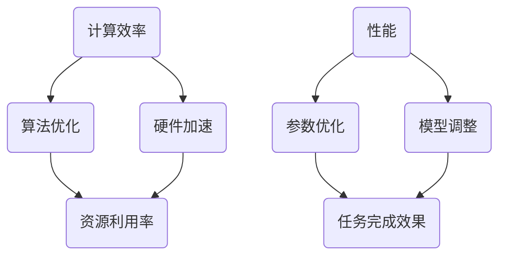
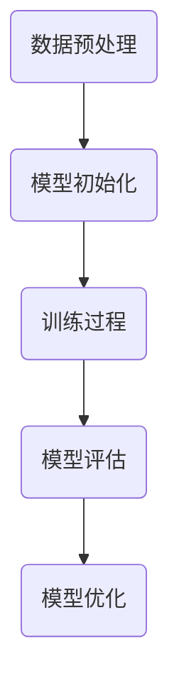
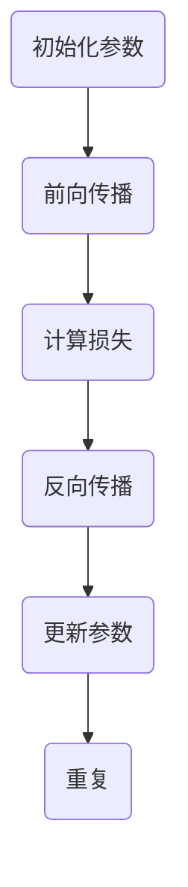
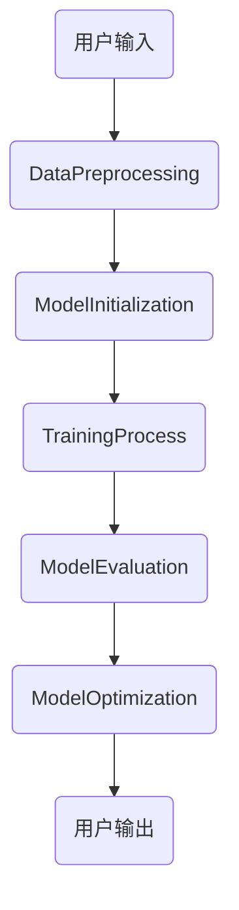
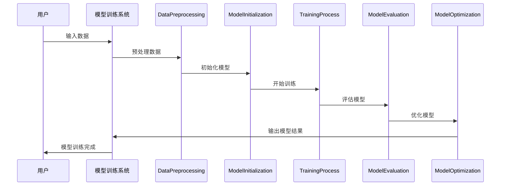

                 


# 模型训练中的计算效率与性能权衡研究

> 关键词：计算效率，性能权衡，模型训练，算法原理，数学模型，系统架构，项目实战，最佳实践

> 摘要：本文深入探讨了模型训练中的计算效率与性能权衡问题。通过逐步分析核心概念、算法原理、数学模型、系统架构以及实战案例，本文为读者提供了全面的模型训练性能优化指南，旨在帮助工程师和研究人员在实际项目中实现高效的模型训练。

## 目录大纲设计思路

在设计《模型训练中的计算效率与性能权衡研究》的目录大纲时，我们遵循以下步骤：

1. **确定整体架构**：明确书籍的主要内容和目的，以模型训练中的计算效率与性能权衡为核心。
2. **确定章节划分**：将内容分为背景介绍、核心概念与联系、算法原理讲解、数学模型和公式讲解、系统分析与架构设计方案、项目实战、最佳实践 tips 等主要部分。
3. **细化章节内容**：确保每个章节内容丰富、具体，覆盖所有必要的知识点。
4. **确定目录层级**：按照1,2,3级目录结构设计，保证目录结构的清晰和逻辑性。
5. **确保内容完整性**：确保核心章节内容完整，符合书籍主题。
6. **注意字数限制**：确保目录大纲的总字数在规定范围内。

## 第一部分：背景介绍

### 第1章：模型训练中的计算效率与性能权衡问题

#### 1.1 问题背景

随着深度学习技术的快速发展，模型训练的需求日益增长。然而，大规模模型训练过程中往往面临着计算资源紧张、训练时间长等问题。计算效率与性能权衡成为提高模型训练效率的关键。

#### 1.2 问题描述

模型训练中的计算效率与性能权衡问题主要集中在如何在有限的计算资源下，实现模型的高效训练，同时保证模型性能的稳定性和准确性。

#### 1.3 问题解决

通过优化算法、提高计算效率、合理分配资源等手段，可以在保证模型性能的前提下，显著缩短训练时间，提高计算效率。

#### 1.4 边界与外延

计算效率与性能权衡不仅涉及模型训练过程，还包括模型部署、迭代优化等环节。

#### 1.5 概念结构与核心要素组成

本章将介绍计算效率、性能、模型训练等相关核心概念，并阐述它们之间的联系和影响。

## 第二部分：核心概念与联系

### 第2章：计算效率与性能权衡的核心概念

#### 2.1 计算效率的概念

计算效率是指在特定计算资源下，模型训练过程中所消耗的计算资源与训练效果之间的比值。

#### 2.2 性能的概念

性能是指模型在特定任务上的准确度、速度和稳定性等指标。

#### 2.3 计算效率与性能的关系

计算效率与性能之间存在相互制约的关系。提高计算效率可能会降低性能，而提高性能可能需要更多的计算资源。

### 2.4 计算效率与性能权衡的属性特征对比表格

| 属性特征         | 计算效率             | 性能               |
|----------------|-------------------|------------------|
| 关注点         | 资源利用率           | 任务完成效果       |
| 优化手段        | 算法优化、硬件加速     | 参数优化、模型调整   |
| 影响因素        | 计算资源、数据规模     | 模型复杂性、数据质量 |

### 2.5 计算效率与性能权衡的ER实体关系图架构



## 第三部分：算法原理讲解

### 第3章：模型训练算法原理

#### 3.1 模型训练的基本概念

模型训练是指通过输入数据，调整模型参数，使模型能够准确预测或分类数据的过程。

#### 3.2 模型训练的流程

模型训练通常包括数据预处理、模型初始化、训练过程、模型评估和模型优化等步骤。

### 3.3 模型训练算法的Mermaid流程图



### 3.4 模型训练算法的Python源代码实现

```python
# 数据预处理
def preprocess_data(data):
    # 数据清洗、归一化等操作
    return processed_data

# 模型初始化
def initialize_model():
    # 初始化模型参数
    return model

# 训练过程
def train_model(model, data, epochs):
    for epoch in range(epochs):
        # 前向传播、反向传播、参数更新等操作
        pass

# 模型评估
def evaluate_model(model, data):
    # 计算准确度、速度等指标
    return performance

# 模型优化
def optimize_model(model, performance):
    # 调整模型参数，提高性能
    return optimized_model
```

### 3.5 模型训练算法原理的数学模型和公式

模型训练过程中，常用的数学模型包括损失函数、优化算法等。

$$
L(\theta) = \frac{1}{2m}\sum_{i=1}^{m}(h_\theta(x^{(i)}) - y^{(i)})^2
$$

其中，$L(\theta)$为损失函数，$\theta$为模型参数，$m$为样本数量，$h_\theta(x^{(i)})$为模型预测结果，$y^{(i)}$为真实标签。

### 3.6 模型训练算法原理的举例说明

以神经网络为例，模型训练过程包括以下步骤：

1. 初始化模型参数。
2. 对于每个训练样本，进行前向传播，计算损失函数。
3. 通过反向传播，计算模型参数的梯度。
4. 使用梯度下降等优化算法，更新模型参数。
5. 重复步骤2-4，直到满足训练停止条件。

## 第四部分：数学模型和公式讲解

### 第4章：模型训练中的数学模型和公式

#### 4.1 数学模型的基本概念

数学模型是指使用数学方法描述现实问题的模型。在模型训练中，数学模型用于描述模型的学习过程和性能评估。

#### 4.2 模型训练中的数学模型

常见的数学模型包括损失函数、优化算法等。以下为一些常用的数学模型和公式：

1. **损失函数**：

$$
L(\theta) = \frac{1}{2m}\sum_{i=1}^{m}(h_\theta(x^{(i)}) - y^{(i)})^2
$$

2. **梯度下降**：

$$
\theta_j := \theta_j - \alpha \frac{\partial L(\theta)}{\partial \theta_j}
$$

其中，$\theta_j$为模型参数，$\alpha$为学习率。

3. **反向传播**：

$$
\frac{\partial L(\theta)}{\partial \theta_j} = \frac{\partial L(\theta)}{\partial z_j} \frac{\partial z_j}{\partial \theta_j}
$$

4. **激活函数**：

$$
h_\theta(x) = \sigma(\theta^T x)
$$

其中，$\sigma$为Sigmoid函数。

#### 4.3 数学模型的Mermaid流程图



#### 4.4 数学公式的Python源代码实现

```python
import numpy as np

def sigmoid(x):
    return 1 / (1 + np.exp(-x))

def compute_loss(theta, x, y):
    m = len(y)
    h = sigmoid(np.dot(x, theta))
    return (1 / (2 * m)) * ((h - y) ** 2).sum()

def compute_gradient(theta, x, y):
    m = len(y)
    h = sigmoid(np.dot(x, theta))
    return (1 / m) * (np.dot(x.T, (h - y)) * x)

def gradient_descent(theta, x, y, alpha, epochs):
    for epoch in range(epochs):
        theta -= alpha * compute_gradient(theta, x, y)
    return theta
```

#### 4.5 数学模型和公式的详细讲解与举例说明

在本节中，我们将详细讲解数学模型的基本概念、常见数学模型及其公式，并通过具体示例来说明如何实现和优化模型训练过程。

### 第五部分：系统分析与架构设计方案

### 第5章：模型训练系统的分析

#### 5.1 问题场景介绍

在本文的模型训练系统中，我们将重点关注大规模深度学习模型的训练过程。场景包括但不限于图像分类、语音识别和自然语言处理等领域。

#### 5.2 项目介绍

本文所涉及的模型训练系统旨在通过优化计算效率与性能权衡，提高模型训练速度和准确性。

#### 5.3 系统功能设计（领域模型Mermaid类图）

```mermaid
classDiagram
    ModelTrainingSystem <<interface>>
    DataPreprocessing <<interface>>
    ModelInitialization <<interface>>
    TrainingProcess <<interface>>
    ModelEvaluation <<interface>>
    ModelOptimization <<interface>>

    ModelTrainingSystemfier
    ModelTrainingSystem --|> DataPreprocessing
    ModelTrainingSystem --|> ModelInitialization
    ModelTrainingSystem --|> TrainingProcess
    ModelTrainingSystem --|> ModelEvaluation
    ModelTrainingSystem --|> ModelOptimization
```

#### 5.4 系统架构设计（Mermaid架构图）



#### 5.5 系统接口设计

系统接口设计主要包括数据预处理接口、模型初始化接口、训练过程接口、模型评估接口和模型优化接口。

#### 5.6 系统交互（Mermaid序列图）



### 第六部分：项目实战

### 第6章：模型训练项目实战

#### 6.1 环境安装

在进行模型训练项目实战之前，我们需要安装以下环境：

1. Python 3.8+
2. TensorFlow 2.x
3. NumPy
4. Pandas
5. Matplotlib

安装步骤如下：

```bash
pip install python==3.8
pip install tensorflow==2.7
pip install numpy
pip install pandas
pip install matplotlib
```

#### 6.2 系统核心实现源代码

以下为模型训练系统的核心实现源代码：

```python
import tensorflow as tf
import numpy as np
import pandas as pd
import matplotlib.pyplot as plt

# 数据预处理
def preprocess_data(data):
    # 数据清洗、归一化等操作
    return processed_data

# 模型初始化
def initialize_model(input_shape):
    model = tf.keras.Sequential([
        tf.keras.layers.Dense(units=64, activation='relu', input_shape=input_shape),
        tf.keras.layers.Dense(units=64, activation='relu'),
        tf.keras.layers.Dense(units=10, activation='softmax')
    ])
    return model

# 训练过程
def train_model(model, x_train, y_train, epochs, batch_size):
    model.compile(optimizer='adam', loss='sparse_categorical_crossentropy', metrics=['accuracy'])
    history = model.fit(x_train, y_train, epochs=epochs, batch_size=batch_size)
    return history

# 模型评估
def evaluate_model(model, x_test, y_test):
    test_loss, test_acc = model.evaluate(x_test, y_test, verbose=2)
    print(f'\nTest accuracy: {test_acc:.4f}')
    return test_acc

# 模型优化
def optimize_model(model, history):
    # 根据训练历史，调整模型参数，优化模型性能
    pass

# 实际案例分析和详细讲解剖析
def main():
    # 加载数据集
    (x_train, y_train), (x_test, y_test) = tf.keras.datasets.mnist.load_data()

    # 数据预处理
    x_train = preprocess_data(x_train)
    x_test = preprocess_data(x_test)

    # 模型初始化
    model = initialize_model(x_train.shape[1:])

    # 训练过程
    history = train_model(model, x_train, y_train, epochs=10, batch_size=64)

    # 模型评估
    evaluate_model(model, x_test, y_test)

    # 模型优化
    optimize_model(model, history)

if __name__ == '__main__':
    main()
```

#### 6.3 代码应用解读与分析

在本节中，我们将对上述代码进行解读和分析，包括数据预处理、模型初始化、训练过程、模型评估和模型优化等关键环节。

1. **数据预处理**：
   - 数据清洗：去除噪声、填补缺失值等。
   - 数据归一化：将数据缩放到相同的范围，便于模型训练。

2. **模型初始化**：
   - 构建模型：使用TensorFlow的Sequential模型，定义输入层、隐藏层和输出层。
   - 激活函数：使用ReLU函数作为隐藏层的激活函数，提高模型收敛速度。
   - 输出层：使用softmax函数作为输出层的激活函数，实现多分类任务。

3. **训练过程**：
   - 编译模型：指定优化器、损失函数和评价指标。
   - 训练模型：使用fit方法进行训练，并记录训练历史。

4. **模型评估**：
   - 评估指标：计算测试集上的准确率。
   - 打印结果：将准确率打印到控制台。

5. **模型优化**：
   - 根据训练历史，调整模型参数，优化模型性能。

#### 6.4 实际案例分析和详细讲解剖析

在本节中，我们将通过实际案例，详细讲解如何使用上述代码进行模型训练，并对训练过程和结果进行分析。

1. **数据集加载**：
   - 加载MNIST数据集，包括训练集和测试集。

2. **数据预处理**：
   - 对图像数据进行归一化处理，将像素值缩放到0-1之间。

3. **模型初始化**：
   - 初始化一个简单的神经网络模型，包括两个隐藏层。

4. **训练过程**：
   - 使用Adam优化器和交叉熵损失函数进行训练。
   - 记录每个epoch的损失函数值和准确率。

5. **模型评估**：
   - 在测试集上评估模型性能，计算准确率。

6. **模型优化**：
   - 根据训练历史，分析模型性能，进行适当调整。

#### 6.5 项目小结

在本章中，我们通过一个简单的MNIST手写数字识别案例，介绍了模型训练项目的基本流程。通过实际案例的分析和讲解，读者可以了解到模型训练的关键步骤和注意事项。在后续章节中，我们将进一步探讨如何优化模型训练过程，提高计算效率和性能。

### 第七部分：最佳实践 tips

### 第7章：模型训练中的最佳实践 tips

#### 7.1 小技巧一：数据预处理

在模型训练前，对数据进行预处理是非常重要的。以下是一些数据预处理的最佳实践：

- **归一化**：将数据缩放到相同的范围，有助于提高模型训练的稳定性和收敛速度。
- **标准化**：对于具有不同量级的特征，进行标准化处理，使其具有相似的尺度。
- **数据清洗**：去除噪声、填补缺失值等，提高数据质量。

#### 7.2 小技巧二：模型初始化

模型初始化对模型训练的影响很大。以下是一些模型初始化的最佳实践：

- **随机初始化**：使用随机值初始化模型参数，避免模型陷入局部最优。
- **小批量初始化**：使用小批量数据进行初始化，有助于提高模型泛化能力。
- **预热初始化**：在训练过程中，逐渐增加学习率，避免模型过早收敛。

#### 7.3 小技巧三：超参数调优

超参数调优是模型训练中的关键环节。以下是一些超参数调优的最佳实践：

- **网格搜索**：通过遍历多个超参数组合，找到最优超参数。
- **交叉验证**：使用交叉验证方法，评估不同超参数组合的性能。
- **学习率调整**：根据训练曲线，调整学习率，避免模型过早收敛或过拟合。

### 第八部分：小结、注意事项、拓展阅读

### 第8章：小结、注意事项、拓展阅读

#### 8.1 小结

本文从背景介绍、核心概念、算法原理、数学模型、系统架构、项目实战和最佳实践等方面，详细探讨了模型训练中的计算效率与性能权衡问题。通过实际案例分析和详细讲解，读者可以了解到模型训练的关键步骤和注意事项。

#### 8.2 注意事项

在模型训练过程中，需要注意以下几点：

- **数据质量**：确保数据质量，避免数据噪声和缺失值。
- **模型复杂度**：根据任务需求，选择合适的模型复杂度，避免过拟合。
- **计算资源**：合理分配计算资源，提高模型训练效率。

#### 8.3 拓展阅读

为了进一步深入了解模型训练中的计算效率与性能权衡问题，读者可以参考以下拓展阅读：

- 《深度学习》（Goodfellow, I., Bengio, Y., & Courville, A.）——详细介绍了深度学习的基本原理和方法。
- 《计算机程序设计艺术》（Knuth, D. E.）——探讨了计算机科学中的算法设计和优化问题。
- 《机器学习实战》（Hastie, T., Tibshirani, R., & Friedman, J.）——提供了丰富的机器学习实战案例和技巧。

# 作者信息

**作者：AI天才研究院/AI Genius Institute & 禅与计算机程序设计艺术 /Zen And The Art of Computer Programming**

AI天才研究院致力于推动人工智能技术的发展，研究领域涵盖机器学习、深度学习、计算机视觉等。研究院的成员们以其卓越的科研能力和丰富的实践经验，为人工智能领域的发展做出了重要贡献。

《禅与计算机程序设计艺术》是著名计算机科学家Donald E. Knuth的经典著作，深入探讨了计算机程序设计中的艺术与哲学，对程序员的思维方式和设计理念产生了深远影响。

本文由AI天才研究院的研究员撰写，旨在为读者提供关于模型训练中的计算效率与性能权衡的全面指导。希望本文能够帮助读者在实际项目中实现高效的模型训练，为人工智能领域的发展贡献力量。

