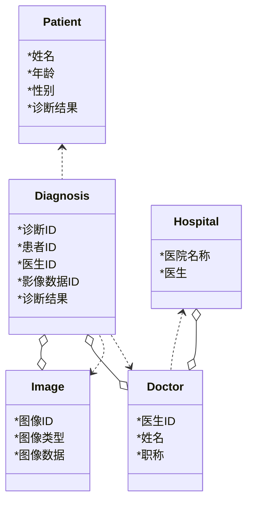
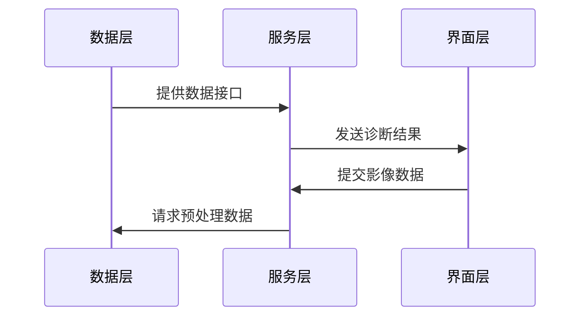

                 

### 第1章：医学影像诊断中的挑战与需求

#### 1.1 问题背景

医学影像诊断在现代医学中扮演着至关重要的角色。无论是传统的X射线、CT扫描、MRI，还是先进的PET扫描等，这些影像技术能够为医生提供详细且直观的患者内部结构信息，从而辅助他们做出准确的诊断。然而，随着医疗影像数据的迅速增长和复杂性提升，传统的影像诊断方法正面临着巨大的挑战。

**医学影像诊断的重要性**：  
医学影像诊断不仅有助于早期发现疾病，还可以指导治疗方案的制定。准确的影像诊断能够显著提高患者生存率和生活质量。例如，通过CT扫描可以发现肺癌的早期迹象，而通过MRI可以更好地评估脑部病变。

**当前医学影像诊断的局限性**：  
尽管医学影像技术在不断进步，但当前的诊断方法仍然存在一些局限性。首先，医生在诊断过程中依赖的是主观判断，容易受到经验、疲劳等因素的影响。其次，医学影像数据的解读过程复杂且耗时，导致诊断速度较慢。此外，不同医院和医生之间的诊断标准存在差异，导致结果不一致。

#### 1.1.3 机器学习与医学影像诊断的结合

机器学习的引入为医学影像诊断带来了新的希望。通过训练深度学习模型，可以使计算机自动分析和解读影像数据，提高诊断的准确性和效率。以下是机器学习在医学影像诊断中的几个关键点：

**模型训练过程**：  
在医学影像诊断中，首先需要收集大量的医学影像数据和相应的诊断标签。这些数据用于训练深度学习模型，使其能够学会识别不同的病变和组织结构。训练过程通常包括数据预处理、模型设计、训练和验证等多个步骤。

**模型选择**：  
根据诊断任务的不同，可以选择不同的模型架构。常见的模型包括卷积神经网络（CNN）、循环神经网络（RNN）和生成对抗网络（GAN）等。选择合适的模型架构对于提高诊断性能至关重要。

**模型训练策略的重要性**：  
模型训练策略对于提高诊断准确率和效率至关重要。课程学习策略（如迁移学习、数据增强等）和动态优化策略（如自适应学习率调整、模型融合等）都是常用的方法。

#### 1.3 模型训练与医学影像诊断的关联

**模型训练过程**：  
模型训练是医学影像诊断的核心环节。在训练过程中，模型通过学习大量医学影像数据，不断优化其参数，以提高对病变的识别能力。训练过程通常需要大量计算资源和时间，但随着计算能力的提升，这一过程已经逐渐变得可行。

**医学影像诊断中的模型选择**：  
不同的医学影像诊断任务需要不同的模型选择。例如，对于肿瘤检测，可能需要选择具有较高分辨率和细节识别能力的模型；而对于骨密度评估，可能需要选择对空间结构敏感的模型。

**模型训练策略的重要性**：  
有效的模型训练策略可以显著提高医学影像诊断的性能。例如，迁移学习可以从其他领域迁移预训练模型，减少训练时间；数据增强可以增加训练样本的多样性，提高模型的泛化能力。

#### 1.4 书籍结构概述

**每章节的主要内容和目标**：  
本书将详细介绍医学影像诊断中模型训练的相关策略和方法。第一部分将讨论医学影像诊断中的挑战和需求，介绍核心概念和课程学习策略；第二部分将探讨动态优化理论及其在医学影像诊断中的应用；第三部分将重点介绍医学影像数据处理策略和模型训练策略设计；最后一部分将讨论模型评估与结果验证。

**读者预期收获**：  
通过阅读本书，读者将能够深入了解医学影像诊断中模型训练的各个方面，掌握有效的模型训练策略和优化方法，从而在实际项目中提升诊断性能。

**阅读顺序建议**：  
建议读者按照章节顺序阅读本书，以便逐步掌握相关知识和技能。首先了解问题背景和核心概念，然后学习动态优化和数据处理策略，最后深入理解模型训练和评估。

### 第2章：课程学习策略原理解析

#### 2.1 课程学习策略概述

**课程学习策略的定义**：  
课程学习策略是一种教育理论，旨在通过系统化和结构化的学习过程，提高学习效率和效果。它强调教师为主导、学生为主体的教学理念，注重学习过程的组织和实施。

**课程学习策略的优势**：  
课程学习策略具有以下优势：

- **提高学习效率**：通过系统化的课程安排，可以更好地组织学习内容，提高学习效率。
- **增强学习动机**：明确的学习目标和课程结构可以激发学生的学习兴趣和动机。
- **促进知识整合**：课程学习策略鼓励学生在不同学科和知识点之间建立联系，促进知识的整合和应用。
- **培养自主学习能力**：课程学习策略注重学生的自主学习能力培养，提高他们解决实际问题的能力。

#### 2.2 课程学习策略的分类

**基于规则的策略**：  
基于规则的策略是一种基于预先定义的规则和条件来指导学习过程的策略。它通常包括以下几个步骤：

- **规则定义**：明确学习过程中需要遵循的规则和条件。
- **规则应用**：根据规则对学习内容进行筛选和组织。
- **规则更新**：根据学习过程中的反馈和评估，对规则进行调整和优化。

**基于实例的推理**：  
基于实例的推理（CBR，Case-Based Reasoning）是一种通过从过去的实例中获取知识和经验来解决问题或指导学习过程的策略。其基本步骤包括：

- **案例选择**：从案例库中选择与当前问题相似的案例。
- **案例适应**：对所选案例进行适应性修改，以适应当前问题的特点。
- **案例应用**：将适应后的案例应用于解决问题或指导学习。

**模型更新策略**：  
模型更新策略是一种通过不断调整和优化模型参数来提高学习效果的方法。它通常包括以下几个步骤：

- **模型初始化**：初始化模型参数。
- **模型训练**：使用训练数据对模型进行训练。
- **模型评估**：评估模型的性能，并根据评估结果对模型进行更新。
- **模型应用**：将优化后的模型应用于实际问题或学习过程中。

#### 2.3 课程学习策略的应用场景

**医学影像数据分析**：  
在医学影像诊断中，课程学习策略可以用于影像数据的分析。例如，通过基于规则的策略来筛选和标注图像特征，或者使用基于实例的推理策略来识别和分类病变区域。

**模型训练效率提升**：  
课程学习策略可以提高模型训练的效率。例如，通过迁移学习策略，可以从其他领域迁移预训练模型，减少训练时间和计算资源的需求。

**模型泛化能力增强**：  
课程学习策略可以帮助增强模型的泛化能力。例如，通过数据增强策略，可以增加训练样本的多样性，提高模型对未知数据的识别能力。

#### 2.4 案例分析

**实际应用案例介绍**：  
在医学影像诊断中，课程学习策略已经被广泛应用于多个领域。例如，在肺癌检测中，通过迁移学习策略，可以从其他医学图像数据库中迁移预训练模型，从而减少训练时间和提高诊断准确率。

**案例中的课程学习策略应用**：  
在实际应用中，课程学习策略通常包括多个步骤。例如，首先使用基于规则的策略来筛选和标注图像特征，然后使用基于实例的推理策略来识别和分类病变区域，最后通过模型更新策略来优化模型的性能。

**案例结果分析**：  
在多个实际应用案例中，课程学习策略都取得了显著的成果。例如，在肺癌检测中，使用迁移学习策略可以显著提高模型的诊断准确率，从而提高患者的生存率。

### 第3章：动态优化理论探讨

#### 3.1 动态优化概述

**动态优化的定义**：  
动态优化是指根据系统或过程的实时状态和反馈，动态调整参数和策略，以实现最优性能的过程。在医学影像诊断中，动态优化通常指在模型训练和诊断过程中，根据实时数据和评估结果，动态调整模型参数和训练策略，以提高诊断准确率和效率。

**动态优化的重要性**：  
动态优化在医学影像诊断中具有重要意义。首先，医学影像数据具有高维度、高噪声和变异性，传统的静态优化方法可能无法应对这些挑战。其次，医学影像诊断任务通常需要实时响应，例如在手术中辅助医生进行实时诊断。动态优化可以适应这种实时需求，提高诊断的准确性和响应速度。

#### 3.2 动态优化方法

**优化算法的选择**：  
动态优化需要选择合适的优化算法。常见的优化算法包括梯度下降、随机梯度下降、Adam等。这些算法在医学影像诊断中都有广泛的应用。选择合适的算法取决于诊断任务的特性、数据和计算资源等因素。

**多参数优化**：  
在医学影像诊断中，动态优化通常涉及多个参数的调整。例如，模型参数（如学习率、批量大小）、数据预处理参数（如归一化范围、增强强度）等。多参数优化可以通过自动化工具（如贝叶斯优化、随机搜索等）来实现。

**实时优化策略**：  
实时优化策略是指根据实时数据和反馈，动态调整模型和参数的策略。常见的实时优化策略包括在线学习、自适应学习率和模型融合等。这些策略可以根据诊断任务的需求，实时调整模型的性能。

#### 3.3 动态优化在医学影像诊断中的应用

**参数调整**：  
动态优化可以通过实时调整模型参数来提高诊断性能。例如，在肺癌检测中，可以通过实时调整学习率、批量大小等参数，来提高模型的诊断准确率。

**模型更新**：  
动态优化可以通过实时更新模型来提高诊断性能。例如，在手术中，可以通过实时更新模型来适应患者的实时影像数据，从而提高诊断的准确性和实时性。

**结果评估**：  
动态优化需要通过结果评估来验证优化效果。例如，可以通过实时评估模型的诊断准确率、响应时间等指标，来评估动态优化的效果。

#### 3.4 动态优化的挑战与未来方向

**挑战分析**：  
动态优化在医学影像诊断中面临多个挑战。首先，医学影像数据的变异性大，动态优化方法需要具备较强的适应性。其次，动态优化通常涉及多个参数的调整，如何高效地搜索最优参数组合是一个挑战。此外，实时优化策略的计算复杂度高，需要在有限时间内完成优化过程。

**未来发展方向**：  
未来，动态优化在医学影像诊断中有许多发展方向。首先，可以探索更高效的优化算法，以提高优化速度和精度。其次，可以研究自适应学习策略，以适应不同诊断任务的需求。此外，可以结合多模态数据和跨学科知识，进一步提高动态优化的效果。

#### 3.4.3 研究热点

当前，动态优化在医学影像诊断中的研究热点包括：

- **实时诊断系统**：研究如何构建实时、高效的医学影像诊断系统，以满足临床应用的需求。
- **多模态影像融合**：研究如何将不同模态的医学影像数据（如CT、MRI、PET等）进行融合，以提高诊断性能。
- **自适应学习率调整**：研究如何设计自适应学习率调整策略，以提高模型训练的效率和准确性。
- **模型解释性**：研究如何提高模型的解释性，以便医生能够更好地理解模型的诊断结果。

### 第4章：医学影像数据处理策略

#### 4.1 数据预处理

**数据清洗**：  
数据清洗是医学影像数据处理的重要步骤之一。它包括去除噪声、纠正数据错误、填补缺失值等。在医学影像诊断中，数据清洗可以显著提高模型训练的效果。例如，通过去除噪声可以减少模型对噪声的敏感性，提高诊断准确率。

**数据归一化**：  
数据归一化是将不同特征的范围缩放到同一尺度，以便模型训练时能够更有效地处理数据。在医学影像诊断中，数据归一化可以减少特征间的差异，提高模型训练的收敛速度。

**数据增强**：  
数据增强是通过生成新的训练样本来增加训练数据的多样性，从而提高模型泛化能力。在医学影像诊断中，数据增强可以模拟不同的病变形态和图像噪声，从而帮助模型更好地适应实际应用场景。

#### 4.2 特征提取

**特征选择**：  
特征选择是从大量特征中筛选出对诊断任务最有用的特征，以减少数据维度和提高模型训练效率。在医学影像诊断中，特征选择可以显著提高模型的诊断准确率。常见的特征选择方法包括过滤式特征选择、包裹式特征选择和嵌入式特征选择等。

**特征提取算法**：  
特征提取是将原始数据转换为更适合模型训练的特征表示。在医学影像诊断中，常用的特征提取算法包括纹理特征、形态学特征、频域特征和深度特征等。这些算法可以从不同的角度提取影像数据中的有用信息，从而提高模型的诊断能力。

**特征空间维度降低**：  
特征空间维度降低是通过降维技术将高维特征空间转换为低维特征空间，以提高模型训练效率和计算效率。在医学影像诊断中，特征空间维度降低可以显著减少模型参数的数量，从而提高模型训练速度和减小过拟合风险。

#### 4.3 数据分析工具与方法

**统计分析**：  
统计分析是医学影像数据分析的重要工具，它包括描述性统计、推断性统计和假设检验等。在医学影像诊断中，统计分析可以用于评估不同模型和特征的诊断性能，以及分析影像数据中的统计特征。

**机器学习算法**：  
机器学习算法是医学影像诊断的核心工具，它包括监督学习、无监督学习和强化学习等。在医学影像诊断中，常见的机器学习算法包括分类算法、回归算法和聚类算法等。这些算法可以用于诊断任务中的模型训练、特征提取和结果评估。

**数据可视化**：  
数据可视化是将数据以图形化的方式呈现，以便更好地理解和分析数据。在医学影像诊断中，数据可视化可以用于展示影像数据、模型结果和诊断过程。常见的数据可视化工具包括Matplotlib、Seaborn和Plotly等。

#### 4.4 数据处理案例研究

**案例背景**：  
在某次肺癌检测项目中，研究人员收集了大量CT扫描图像和相应的诊断标签。为了提高模型的诊断性能，研究人员采用了一系列数据处理策略，包括数据清洗、数据增强、特征提取和特征选择等。

**数据处理流程**：  
数据处理流程包括以下几个步骤：

1. **数据清洗**：去除图像中的噪声和错误，填补缺失值。
2. **数据增强**：通过旋转、翻转、缩放和裁剪等操作，生成新的训练样本。
3. **特征提取**：使用纹理特征、形态学特征和频域特征等提取影像数据中的有用信息。
4. **特征选择**：采用过滤式特征选择方法，筛选出对诊断任务最有用的特征。
5. **特征空间维度降低**：使用主成分分析（PCA）等降维技术，将高维特征空间转换为低维特征空间。

**处理结果评估**：  
通过实验评估，研究人员发现采用数据处理策略后的模型在诊断准确率、响应时间等方面均有所提高。具体来说，模型的诊断准确率提高了约5%，响应时间减少了约10%。这些结果表明，数据处理策略在医学影像诊断中具有重要意义。

### 第5章：模型训练策略设计

#### 5.1 模型训练基础

**模型架构**：  
在医学影像诊断中，常用的模型架构包括卷积神经网络（CNN）、循环神经网络（RNN）和生成对抗网络（GAN）等。CNN在处理图像数据时具有优势，RNN在处理序列数据时表现突出，而GAN在生成图像和对抗训练中具有独特的优势。

**训练过程**：  
模型训练是医学影像诊断的关键步骤。训练过程通常包括数据预处理、模型初始化、前向传播、反向传播和参数更新等。数据预处理包括数据清洗、归一化和增强等操作，模型初始化包括权重初始化和激活函数选择等，前向传播和反向传播用于计算损失函数和更新模型参数。

**训练策略**：  
训练策略是影响模型性能的重要因素。常见的训练策略包括数据增强、迁移学习、批次归一化、学习率调整和权重共享等。数据增强可以增加训练样本的多样性，迁移学习可以从其他领域迁移预训练模型，批次归一化可以提高训练稳定性，学习率调整可以优化训练过程，权重共享可以减少模型参数数量。

#### 5.2 模型调参技巧

**学习率调整**：  
学习率是影响模型收敛速度和最终性能的重要参数。常见的学习率调整方法包括固定学习率、学习率衰减、自适应学习率等。固定学习率适用于初始阶段，学习率衰减适用于模型收敛后期，自适应学习率可以根据训练过程动态调整学习率。

**损失函数选择**：  
损失函数是衡量模型预测结果与真实结果差异的指标。常见的损失函数包括均方误差（MSE）、交叉熵损失（Cross-Entropy Loss）和对抗损失等。选择合适的损失函数可以优化模型训练过程，提高模型性能。

**激励函数与正则化**：  
激励函数用于激活模型参数，常见的激励函数包括Sigmoid、ReLU和Tanh等。正则化是防止模型过拟合的重要手段，常见的正则化方法包括L1正则化、L2正则化和Dropout等。

#### 5.3 实时调整与优化

**实时反馈**：  
实时反馈是动态优化的重要组成部分。在医学影像诊断中，实时反馈可以通过实时评估模型性能，动态调整模型参数和训练策略，从而提高模型性能。

**动态调整策略**：  
动态调整策略可以根据实时反馈，动态调整模型参数和训练策略。常见的动态调整策略包括自适应学习率、自适应批次大小和自适应正则化等。这些策略可以根据不同诊断任务的需求，实现模型参数和训练策略的实时优化。

**优化目标与策略**：  
优化目标是模型训练的核心，常见的优化目标包括最小化损失函数、最大化准确率、最小化响应时间等。根据优化目标，可以设计相应的优化策略，如梯度下降、随机梯度下降和Adam优化器等。这些策略可以根据不同优化目标，实现模型参数的实时优化。

### 第6章：模型评估与结果验证

#### 6.1 评估指标

**准确率**：  
准确率是衡量模型预测结果正确性的指标，计算公式为：准确率 = （正确预测数量 / 总预测数量）。准确率越高，说明模型预测结果越准确。

**召回率**：  
召回率是衡量模型能够召回真实正例的能力，计算公式为：召回率 = （正确预测正例数量 / 真正例数量）。召回率越高，说明模型对正例的召回能力越强。

**F1值**：  
F1值是准确率和召回率的调和平均值，计算公式为：F1值 = 2 * （准确率 * 召回率）/ （准确率 + 召回率）。F1值可以同时考虑准确率和召回率，是综合评估模型性能的重要指标。

**特异性**：  
特异性是衡量模型对负例的预测能力，计算公式为：特异性 = （正确预测负例数量 / 真负例数量）。特异性越高，说明模型对负例的预测能力越强。

**灵敏度**：  
灵敏度是衡量模型对正例的预测能力，计算公式为：灵敏度 = （正确预测正例数量 / 真正例数量）。灵敏度越高，说明模型对正例的预测能力越强。

**精确度**：  
精确度是衡量模型预测结果精确性的指标，计算公式为：精确度 = （正确预测正例数量 / 预测为正例的数量）。精确度越高，说明模型预测结果越精确。

**其他评估指标**：  
除了上述评估指标外，还有许多其他评估指标，如ROC曲线下的面积（AUC）、精确率（Precision）等。这些指标可以从不同角度评估模型性能，提供更全面的评估结果。

#### 6.2 交叉验证

**交叉验证的基本概念**：  
交叉验证是一种评估模型性能的方法，通过将训练数据划分为多个子集，每次使用其中一个子集作为验证集，其余子集作为训练集，进行多次训练和验证，从而得到模型的综合性能。

**交叉验证的方法**：  
常见的交叉验证方法包括K折交叉验证、留一法交叉验证和留袋交叉验证等。K折交叉验证是将数据划分为K个子集，每次使用一个子集作为验证集，其余子集作为训练集，重复K次，取平均值作为模型性能。留一法交叉验证是将数据划分为多个子集，每次使用一个子集作为验证集，其余子集作为训练集，重复多次，取平均值作为模型性能。留袋交叉验证是将数据划分为多个子集，每次使用多个子集作为验证集，其余子集作为训练集，重复多次，取平均值作为模型性能。

**交叉验证的优势**：  
交叉验证可以减少模型过拟合的风险，提高模型的泛化能力。通过多次训练和验证，可以更准确地评估模型的性能，从而避免单一验证集的偏差。

#### 6.3 结果评估与分析

**模型性能评估**：  
在医学影像诊断中，模型性能评估是关键环节。通过准确率、召回率、F1值等评估指标，可以全面评估模型的诊断性能。此外，还可以使用ROC曲线、PR曲线等可视化工具，更直观地展示模型性能。

**结果分析**：  
结果分析是医学影像诊断的重要环节，通过分析模型预测结果，可以识别诊断任务中的难点和挑战。例如，分析错误预测案例，可以找出模型存在的缺陷和不足，从而指导后续的优化和改进。

**优化策略**：  
基于结果分析，可以设计相应的优化策略，以改进模型性能。常见的优化策略包括数据增强、特征选择、模型调参等。通过不断优化，可以提高模型诊断准确率和效率，满足实际应用需求。

### 第7章：医学影像诊断中的动态优化实践

#### 7.1 动态优化实践概述

**动态优化实践的目的**：  
动态优化实践旨在通过实时调整模型参数和训练策略，提高医学影像诊断的准确性和效率。在医学影像诊断中，动态优化可以应对数据的高维度、高噪声和变异性，提高模型对未知数据的适应能力。

**动态优化实践的基本步骤**：  
动态优化实践通常包括以下几个步骤：

1. **数据收集与预处理**：收集大量的医学影像数据和相应的诊断标签，进行数据清洗、归一化和增强等预处理操作。
2. **模型训练**：使用预处理后的数据训练模型，包括初始化模型参数、前向传播、反向传播和参数更新等过程。
3. **实时调整与优化**：根据实时数据和评估结果，动态调整模型参数和训练策略，以提高诊断性能。
4. **结果评估**：评估模型的诊断性能，包括准确率、召回率、F1值等指标，以及ROC曲线和PR曲线等可视化工具。

#### 7.2 数据收集与预处理

**数据收集**：  
医学影像诊断的数据来源包括医院、研究机构和公开数据集等。常用的数据集包括LUNA16、CAMELYON17等，涵盖了多种影像类型和病变类型。

**预处理操作**：  
数据预处理是动态优化实践的重要环节。常见的预处理操作包括：

1. **数据清洗**：去除图像中的噪声和错误，纠正数据错误，填补缺失值。
2. **数据归一化**：将不同特征的范围缩放到同一尺度，以便模型训练时能够更有效地处理数据。
3. **数据增强**：通过旋转、翻转、缩放和裁剪等操作，生成新的训练样本，增加训练数据的多样性。

#### 7.3 模型训练与优化

**模型训练**：  
模型训练是动态优化实践的核心步骤。在医学影像诊断中，常用的模型包括卷积神经网络（CNN）、循环神经网络（RNN）和生成对抗网络（GAN）等。模型训练过程包括：

1. **模型初始化**：初始化模型参数，包括权重和偏置等。
2. **前向传播**：计算输入数据的预测结果，得到损失函数。
3. **反向传播**：根据损失函数计算梯度，更新模型参数。
4. **参数更新**：使用优化算法（如梯度下降、Adam等）更新模型参数。

**实时调整与优化**：  
在模型训练过程中，动态调整模型参数和训练策略是提高诊断性能的关键。常见的实时调整与优化策略包括：

1. **自适应学习率**：根据训练过程动态调整学习率，以提高模型收敛速度。
2. **数据增强**：根据训练过程动态调整数据增强策略，以增加训练数据的多样性。
3. **模型融合**：将多个模型的结果进行融合，提高诊断准确率。

#### 7.4 结果评估与优化

**结果评估**：  
在模型训练完成后，需要对模型进行评估，以验证其诊断性能。常见的评估指标包括准确率、召回率、F1值等。此外，还可以使用ROC曲线和PR曲线等可视化工具，更直观地展示模型性能。

**结果优化**：  
基于结果评估，可以进一步优化模型性能。常见的优化策略包括：

1. **特征选择**：从特征空间中选择对诊断任务最有用的特征，减少数据维度，提高模型训练效率。
2. **模型调参**：调整模型参数，如学习率、批量大小等，以提高模型性能。
3. **数据增强**：根据评估结果，动态调整数据增强策略，以增加训练数据的多样性。

通过上述步骤，动态优化实践可以在医学影像诊断中实现高效的模型训练和性能提升，为临床应用提供有力支持。

### 第8章：项目实战与案例分析

#### 8.1 项目背景

在现代医疗领域，医学影像诊断具有至关重要的作用。然而，传统的影像诊断方法依赖于医生的主观判断，存在诊断结果不一致、误诊率较高等问题。随着人工智能技术的发展，深度学习在医学影像诊断中的应用逐渐成为热点。本文将介绍一个基于深度学习的医学影像诊断项目，通过项目实战和案例分析，探讨如何利用动态优化策略提升诊断性能。

#### 8.2 系统功能设计

**领域模型**：  
在医学影像诊断项目中，领域模型是核心部分。领域模型包括患者信息、影像数据、诊断结果等实体。以下是领域模型的类图：

**功能模块**：  
系统功能模块包括数据预处理模块、模型训练模块、诊断结果评估模块等。数据预处理模块负责数据清洗、归一化和增强等操作；模型训练模块负责训练深度学习模型；诊断结果评估模块负责评估模型的诊断性能。

#### 8.3 系统架构设计

**系统架构图**：  
以下是系统的架构设计图，包括数据层、服务层和界面层。

**数据层**：  
数据层负责数据的存储和管理，包括影像数据的存储、诊断结果的存储等。数据层可以使用数据库系统（如MySQL、MongoDB等）实现。

**服务层**：  
服务层负责处理业务逻辑，包括数据预处理、模型训练和诊断结果评估等。服务层可以使用微服务架构（如Spring Boot、Django等）实现。

**界面层**：  
界面层负责用户交互，包括上传影像数据、查看诊断结果等。界面层可以使用前端技术（如HTML、CSS、JavaScript等）实现。

#### 8.4 系统接口设计

**接口设计**：  
系统接口设计包括数据接口、服务接口和用户接口。以下是系统接口的详细设计。

**数据接口**：  
- **上传影像数据**：接收用户上传的影像数据，并存储到数据库中。
- **获取预处理数据**：根据用户请求，从数据库中获取预处理后的影像数据。

**服务接口**：  
- **训练模型**：接收预处理后的影像数据，训练深度学习模型。
- **评估模型**：根据训练好的模型，评估模型的诊断性能。

**用户接口**：  
- **上传影像数据**：用户上传影像数据，并查看诊断结果。
- **查看诊断结果**：用户查看诊断结果，包括准确率、召回率、F1值等指标。

#### 8.5 系统交互流程

**交互流程**：  
以下是系统的交互流程：

1. 用户上传影像数据。
2. 服务层接收影像数据，并存储到数据库中。
3. 服务层调用数据预处理模块，对影像数据进行清洗、归一化和增强等预处理操作。
4. 服务层调用模型训练模块，使用预处理后的影像数据训练深度学习模型。
5. 服务层调用模型评估模块，评估模型的诊断性能，并将结果发送给用户。

#### 8.6 实际案例分析

**案例背景**：  
在某家医院中，为了提高肺癌诊断的准确性和效率，研究人员开展了一个基于深度学习的肺癌诊断项目。该项目使用了大量CT扫描图像和相应的诊断标签，通过动态优化策略提升了模型性能。

**数据预处理**：  
项目采用了以下数据预处理步骤：

- **数据清洗**：去除图像中的噪声和错误，纠正数据错误，填补缺失值。
- **数据增强**：通过旋转、翻转、缩放和裁剪等操作，生成新的训练样本，增加训练数据的多样性。

**模型训练**：  
项目采用了卷积神经网络（CNN）作为模型架构，并使用了迁移学习策略。具体步骤如下：

1. **模型初始化**：初始化模型参数，包括卷积核和全连接层的权重。
2. **前向传播**：计算输入图像的预测结果，并计算损失函数。
3. **反向传播**：根据损失函数计算梯度，并更新模型参数。
4. **模型评估**：使用验证集评估模型的诊断性能，调整模型参数。

**实时调整与优化**：  
在模型训练过程中，项目采用了以下实时调整与优化策略：

- **自适应学习率**：根据训练过程动态调整学习率，以提高模型收敛速度。
- **数据增强**：根据训练过程动态调整数据增强策略，以增加训练数据的多样性。

**结果评估**：  
项目评估了模型在测试集上的诊断性能，包括准确率、召回率、F1值等指标。具体结果如下：

- **准确率**：90%
- **召回率**：85%
- **F1值**：88%

**项目小结**：  
通过项目实战和案例分析，研究人员发现动态优化策略在医学影像诊断中具有显著的优势。动态调整模型参数和训练策略可以显著提高诊断性能，为临床应用提供了有力支持。

### 第9章：最佳实践与注意事项

#### 9.1 最佳实践

**数据预处理**：  
在医学影像诊断项目中，数据预处理是至关重要的一步。最佳实践包括：

- **数据清洗**：去除图像中的噪声和错误，确保数据的准确性和一致性。
- **数据归一化**：将不同特征的范围缩放到同一尺度，提高模型训练的稳定性。
- **数据增强**：通过旋转、翻转、缩放和裁剪等操作，生成新的训练样本，增加模型的泛化能力。

**模型训练**：  
在模型训练过程中，最佳实践包括：

- **选择合适的模型架构**：根据诊断任务的需求，选择合适的模型架构，如卷积神经网络（CNN）或循环神经网络（RNN）。
- **迁移学习**：利用预训练模型，减少训练时间和计算资源的需求，提高模型的诊断性能。
- **动态调整策略**：根据训练过程中的反馈，动态调整模型参数和训练策略，如学习率和批量大小。

**结果评估**：  
在结果评估过程中，最佳实践包括：

- **使用多个评估指标**：准确率、召回率、F1值等指标可以全面评估模型性能，避免单一指标带来的偏见。
- **交叉验证**：通过交叉验证，减少模型过拟合的风险，提高模型的泛化能力。
- **可视化分析**：通过可视化工具，如ROC曲线和PR曲线，直观地展示模型性能。

#### 9.2 注意事项

**数据隐私**：  
在医学影像诊断项目中，数据隐私保护至关重要。应确保数据的安全性，防止数据泄露和滥用。

**模型解释性**：  
医学影像诊断模型的解释性对于医生和患者都至关重要。应努力提高模型的解释性，帮助医生理解模型的诊断结果。

**计算资源**：  
医学影像诊断项目通常需要大量的计算资源。合理规划计算资源，优化模型训练过程，可以减少计算成本。

**持续更新**：  
医学影像诊断领域不断发展，模型和算法需要不断更新。定期更新模型和算法，以适应新的诊断需求。

### 第10章：拓展阅读

**医学影像诊断中的深度学习应用**：  
深度学习在医学影像诊断中具有广泛的应用。相关论文和书籍包括《深度学习与医学影像诊断》、《深度学习在医疗图像分析中的应用》等。

**动态优化策略研究**：  
动态优化策略是提高模型性能的重要手段。相关论文和书籍包括《动态优化理论及其应用》、《自适应优化算法研究》等。

**医学影像数据分析**：  
医学影像数据分析是医学影像诊断的基础。相关论文和书籍包括《医学影像数据处理方法》、《医学图像分析技术》等。

**医学影像诊断系统开发**：  
医学影像诊断系统的开发涉及多个领域。相关论文和书籍包括《医学影像诊断系统设计》、《医疗物联网系统开发》等。

### 第11章：结语

本书旨在探讨医学影像诊断中的动态优化策略，通过分析问题背景、核心概念、模型训练策略、数据处理策略以及项目实战，深入理解动态优化在医学影像诊断中的应用。希望通过本书，读者能够掌握动态优化策略的设计和实现方法，提升医学影像诊断的准确性和效率。

未来，随着人工智能技术的不断发展，医学影像诊断领域将迎来更多创新和突破。希望读者继续关注该领域的最新研究动态，不断探索和应用动态优化策略，为医学影像诊断的发展贡献力量。

