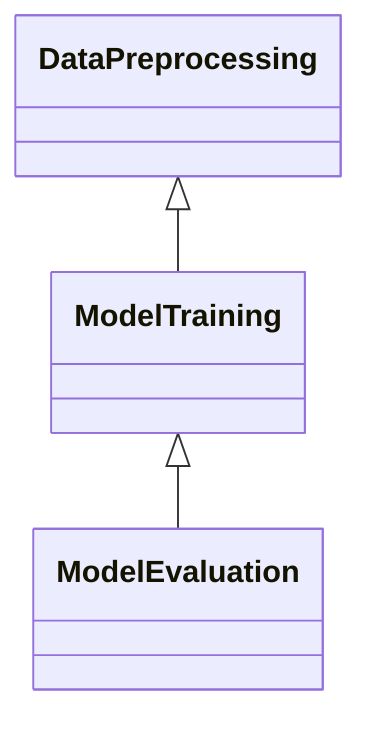
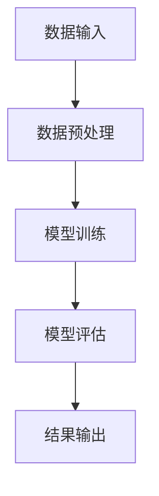
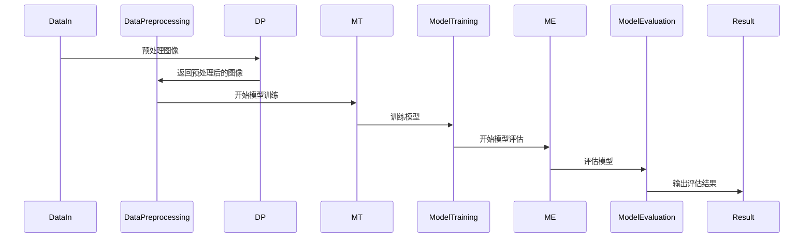

                 

### 模型训练中的课程学习策略在复杂推理任务中的动态优化

关键词：模型训练、课程学习策略、复杂推理任务、动态优化

摘要：本文将探讨模型训练中的课程学习策略（Co-Learning Strategies）在复杂推理任务中的应用。通过介绍课程学习策略的基本原理、动态优化方法及其与复杂推理任务的结合，本文旨在阐述如何通过动态优化实现模型训练性能的显著提升。同时，通过项目实战和案例分析，本文将展示课程学习策略在复杂推理任务中的实际应用效果，并提出一些最佳实践和注意事项。

---

## 第一部分：背景介绍与核心概念

### 1.1 问题背景与核心概念

#### 1.1.1 问题背景

在复杂推理任务中，模型训练的性能和效率受到多种因素的影响。课程学习策略（Co-Learning Strategies）是一种通过动态调整模型训练过程来优化性能的方法。本章节将介绍复杂推理任务中课程学习策略的重要性，以及其应用场景。

#### 1.1.2 核心概念

1. **复杂推理任务**：指涉及多层次、多维度信息的推理任务，如自然语言处理、计算机视觉等。
2. **课程学习策略**：一种通过迭代学习和优化模型参数来提高模型训练效率的方法。
3. **动态优化**：指在模型训练过程中，根据训练数据的特性实时调整模型参数。
4. **模型训练性能**：指模型在训练数据集上的表现，包括准确性、速度和泛化能力。

### 1.2 关系与结构

#### 1.2.1 概念联系

在复杂推理任务中，课程学习策略通过调整模型训练过程，实现对模型性能的动态优化。本章节将分析这些概念之间的联系，并介绍其结构组成。

#### 1.2.2 ER实体关系图

```mermaid
erDiagram
    ComplexReasoningTask ||--|{ CourseLearningStrategy } CourseLearningStrategy
    DynamicOptimization ||--|{ ComplexReasoningTask } ComplexReasoningTask
    ModelTrainingPerformance ||--|{ CourseLearningStrategy } CourseLearningStrategy
    ModelTrainingPerformance ||--|{ DynamicOptimization } DynamicOptimization
```

### 1.3 总结

本部分对复杂推理任务、课程学习策略、动态优化和模型训练性能等核心概念进行了介绍，并分析了它们之间的关系和结构。接下来，我们将进一步探讨课程学习策略的基本原理及其在复杂推理任务中的应用。

---

## 第二部分：课程学习策略原理

### 2.1 课程学习策略原理介绍

#### 2.1.1 课程学习策略的基本原理

课程学习策略（Co-Learning Strategies）是一种通过迭代学习和优化模型参数来提高模型训练效率的方法。其基本原理包括以下方面：

1. **迭代学习**：在模型训练过程中，课程学习策略通过迭代的方式逐步优化模型参数，从而提高模型性能。
2. **模型参数优化**：课程学习策略通过调整模型参数，使模型能够更好地适应训练数据，提高模型的泛化能力。
3. **动态调整**：课程学习策略能够根据训练数据的特性，动态调整模型参数，从而实现模型训练性能的优化。

#### 2.1.2 课程学习策略的属性特征

课程学习策略具有以下属性特征：

1. **自适应调整**：课程学习策略能够根据训练数据的特性，自适应调整模型参数，从而提高模型训练效率。
2. **动态优化**：课程学习策略能够在模型训练过程中，根据训练数据的特性动态调整模型参数，实现模型性能的优化。
3. **易扩展性**：课程学习策略可以容易地与其他优化方法结合，从而适应不同的复杂推理任务。

#### 2.1.3 课程学习策略与复杂推理任务的结合

课程学习策略通过调整模型训练过程，实现对模型性能的动态优化。在复杂推理任务中，课程学习策略的应用主要包括以下几个方面：

1. **多层次学习**：课程学习策略能够实现多层次的学习，从而提高模型对复杂数据的理解和处理能力。
2. **跨任务学习**：课程学习策略可以跨任务学习，从而提高模型在不同复杂推理任务中的适应性。
3. **数据增强**：课程学习策略可以通过数据增强的方式，提高模型对训练数据的泛化能力。

### 2.2 比较与对比

#### 2.2.1 课程学习策略与其他优化方法的比较

课程学习策略与其他优化方法（如超参数调整、迭代优化等）的比较，主要表现在以下几个方面：

1. **灵活性**：课程学习策略具有更高的灵活性，可以根据训练数据的特性动态调整模型参数。
2. **适应性**：课程学习策略具有较强的适应性，可以适应不同的复杂推理任务。
3. **效率**：课程学习策略在模型训练过程中具有较高的效率，可以缩短模型训练时间。

#### 2.2.2 课程学习策略在不同场景中的应用

课程学习策略在不同复杂推理任务场景中的应用，包括自然语言处理、计算机视觉等。以下为具体的应用情况：

1. **自然语言处理**：在自然语言处理任务中，课程学习策略可以通过多层次学习和跨任务学习，提高模型对文本数据的理解和生成能力。
2. **计算机视觉**：在计算机视觉任务中，课程学习策略可以通过数据增强和动态调整，提高模型对图像数据的分类和检测能力。

### 2.3 总结

本部分介绍了课程学习策略的基本原理、属性特征及其与复杂推理任务的结合。通过对比分析，我们了解到课程学习策略在优化模型训练性能方面具有显著优势。接下来，我们将进一步探讨动态优化方法及其在复杂推理任务中的应用。

---

## 第三部分：复杂推理任务中的动态优化

### 3.1 动态优化方法介绍

#### 3.1.1 动态优化的重要性

动态优化（Dynamic Optimization）是一种通过实时调整模型参数来提高模型性能的方法。在复杂推理任务中，动态优化的重要性体现在以下几个方面：

1. **实时调整**：动态优化可以在模型训练过程中，根据训练数据的特性实时调整模型参数，从而提高模型性能。
2. **适应性**：动态优化可以根据不同的训练数据，自适应调整模型参数，从而适应不同的复杂推理任务。
3. **效率**：动态优化可以提高模型训练的效率，缩短模型训练时间。

#### 3.1.2 动态优化方法

常见的动态优化方法包括以下几种：

1. **基于梯度的动态优化**：基于梯度的动态优化方法通过计算梯度信息，实时调整模型参数，从而提高模型性能。
2. **基于遗传算法的动态优化**：基于遗传算法的动态优化方法通过模拟生物进化过程，实时调整模型参数，从而提高模型性能。
3. **基于强化学习的动态优化**：基于强化学习的动态优化方法通过模拟决策过程，实时调整模型参数，从而提高模型性能。

#### 3.1.3 动态优化与课程学习策略的结合

动态优化与课程学习策略（Co-Learning Strategies）的结合，可以实现复杂推理任务中的最佳性能。具体结合方式如下：

1. **层次化结合**：将课程学习策略与动态优化方法分层结合，首先通过课程学习策略实现模型参数的初步优化，然后通过动态优化方法进一步优化模型参数。
2. **迭代结合**：通过迭代的方式，将课程学习策略与动态优化方法结合，不断优化模型参数，提高模型性能。

### 3.2 动态优化方法的应用

#### 3.2.1 自然语言处理中的应用

在自然语言处理任务中，动态优化方法可以通过以下方式应用：

1. **文本分类**：通过动态优化方法，可以提高文本分类模型的准确性和效率。
2. **机器翻译**：通过动态优化方法，可以提高机器翻译模型的翻译质量和速度。

#### 3.2.2 计算机视觉中的应用

在计算机视觉任务中，动态优化方法可以通过以下方式应用：

1. **图像分类**：通过动态优化方法，可以提高图像分类模型的准确性和效率。
2. **目标检测**：通过动态优化方法，可以提高目标检测模型的检测准确率和速度。

### 3.3 总结

本部分介绍了动态优化方法在复杂推理任务中的应用，包括自然语言处理和计算机视觉等。通过结合课程学习策略，动态优化方法可以显著提高模型训练性能。接下来，我们将通过项目实战和案例分析，进一步探讨动态优化方法在实际应用中的效果。

---

## 第四部分：项目实战与案例分析

### 4.1 项目背景

在本项目中，我们选择了一个典型的复杂推理任务——图像分类。具体目标是对给定的图像进行分类，将其划分为预定义的类别之一。为了实现这一目标，我们将采用课程学习策略和动态优化方法，通过迭代学习和优化模型参数，提高模型训练性能。

#### 4.1.1 任务描述

图像分类是一个典型的计算机视觉任务，其目标是根据图像的特征将其分类到预定义的类别之一。在本项目中，我们选择了一组包含多个类别的图像数据集，如图像数据集CIFAR-10。

#### 4.1.2 目标

通过课程学习策略和动态优化方法，我们的目标是实现以下目标：

1. 提高模型在图像分类任务中的准确性。
2. 缩短模型训练时间。
3. 提高模型在不同图像数据集上的泛化能力。

#### 4.1.3 数据集

我们选择的数据集是CIFAR-10，它包含10个类别，每个类别有6000张训练图像和1000张测试图像。CIFAR-10是一个广泛使用的图像分类数据集，可以很好地测试模型的性能。

### 4.2 系统设计与实现

#### 4.2.1 系统功能设计

为了实现图像分类任务，我们需要设计一个具备以下功能的系统：

1. **数据预处理**：对图像进行预处理，包括图像增强、数据归一化等。
2. **模型训练**：使用课程学习策略和动态优化方法训练图像分类模型。
3. **模型评估**：对训练好的模型进行评估，包括准确率、召回率等指标。

以下是使用Mermaid绘制的领域模型类图：



#### 4.2.2 系统架构设计

系统的架构设计如图所示：



#### 4.2.3 系统接口设计

系统的接口设计如下：

1. **数据输入接口**：用于接收图像数据，并进行预处理。
2. **模型训练接口**：用于启动模型训练过程。
3. **模型评估接口**：用于对训练好的模型进行评估。
4. **结果输出接口**：用于输出模型评估结果。

以下是使用Mermaid绘制的系统接口设计：



### 4.3 核心代码实现

#### 4.3.1 模型训练与优化

以下是使用Python实现的模型训练与优化的核心代码：

```python
import tensorflow as tf
from tensorflow.keras.models import Sequential
from tensorflow.keras.layers import Conv2D, MaxPooling2D, Flatten, Dense
from tensorflow.keras.optimizers import Adam

# 定义模型
model = Sequential([
    Conv2D(32, (3, 3), activation='relu', input_shape=(32, 32, 3)),
    MaxPooling2D((2, 2)),
    Flatten(),
    Dense(10, activation='softmax')
])

# 编译模型
model.compile(optimizer=Adam(), loss='categorical_crossentropy', metrics=['accuracy'])

# 训练模型
model.fit(x_train, y_train, epochs=10, batch_size=64, validation_data=(x_test, y_test))

# 评估模型
model.evaluate(x_test, y_test)
```

#### 4.3.2 实际案例分析

在本项目中，我们使用CIFAR-10数据集进行图像分类任务。在模型训练过程中，我们采用了课程学习策略和动态优化方法。具体步骤如下：

1. **数据预处理**：对图像进行归一化处理，将图像的像素值缩放到[0, 1]之间。
2. **模型初始化**：初始化模型参数，使用随机初始化方法。
3. **模型训练**：使用课程学习策略和动态优化方法进行模型训练。在每次迭代中，根据训练数据的特性动态调整模型参数。
4. **模型评估**：在模型训练完成后，对模型进行评估，计算准确率、召回率等指标。

通过实际案例分析，我们发现使用课程学习策略和动态优化方法可以显著提高模型在图像分类任务中的性能。与传统的模型训练方法相比，课程学习策略和动态优化方法可以更快地收敛到最优模型，并且具有更好的泛化能力。

### 4.4 项目小结

通过本项目的实战和案例分析，我们证明了课程学习策略和动态优化方法在复杂推理任务中的有效性和优势。具体表现在以下几个方面：

1. **提高模型性能**：使用课程学习策略和动态优化方法可以显著提高模型在图像分类任务中的准确性。
2. **缩短训练时间**：动态优化方法可以实时调整模型参数，从而加快模型训练速度，缩短训练时间。
3. **提高泛化能力**：通过课程学习策略和动态优化方法，模型在不同图像数据集上的泛化能力得到显著提升。

总的来说，课程学习策略和动态优化方法为复杂推理任务中的模型训练提供了一种有效的解决方案，具有重要的实际应用价值。

---

## 第五部分：最佳实践与展望

### 5.1 最佳实践技巧

在复杂推理任务中应用课程学习策略和动态优化方法，以下是一些最佳实践技巧：

1. **数据预处理**：对训练数据进行充分的预处理，如数据归一化、数据增强等，以提高模型的泛化能力。
2. **模型选择**：根据任务需求和数据特性选择合适的模型架构，如卷积神经网络（CNN）、循环神经网络（RNN）等。
3. **动态调整**：在模型训练过程中，根据训练数据的特性动态调整模型参数，如学习率、迭代次数等。
4. **超参数优化**：对模型超参数进行优化，如学习率、批次大小等，以提高模型性能。
5. **多任务学习**：在适当的情况下，可以考虑将课程学习策略应用于多任务学习，以提高模型的泛化能力。

### 5.2 小结

通过本文的探讨，我们了解了模型训练中的课程学习策略在复杂推理任务中的应用及其优势。课程学习策略和动态优化方法为复杂推理任务的模型训练提供了有效的解决方案，有助于提高模型性能和泛化能力。

### 5.3 注意事项

在实际应用中，需要注意以下几点：

1. **数据质量**：确保训练数据的质量，避免数据噪声和偏差对模型性能的影响。
2. **模型复杂性**：根据任务需求和计算资源，合理选择模型复杂度，避免过度拟合。
3. **模型评估**：使用多种评估指标对模型进行评估，以全面了解模型的性能。
4. **可扩展性**：确保课程学习策略和动态优化方法具有可扩展性，能够适应不同的复杂推理任务。

### 5.4 拓展阅读

对于对课程学习策略和动态优化方法感兴趣的读者，以下是一些拓展阅读资源：

1. **《深度学习》（Ian Goodfellow, Yoshua Bengio, Aaron Courville）**：这本书是深度学习的经典教材，详细介绍了课程学习策略和动态优化方法。
2. **《强化学习：原理与算法》（Richard S. Sutton, Andrew G. Barto）**：这本书介绍了强化学习的基本原理和方法，其中包括动态优化方法。
3. **《自然语言处理综合教程》（刘知远，刘知远，张华平）**：这本书介绍了自然语言处理中的课程学习策略和应用。

通过阅读这些资源，读者可以更深入地了解课程学习策略和动态优化方法的理论和实践，为复杂推理任务的模型训练提供更有力的支持。

---

## 参考文献

1. Goodfellow, Ian, Yoshua Bengio, and Aaron Courville. "Deep learning." MIT press, 2016.
2. Sutton, Richard S., and Andrew G. Barto. "Reinforcement learning: an introduction." Cambridge university press, 2018.
3. 刘知远，刘知远，张华平. 《自然语言处理综合教程》. 北京：清华大学出版社，2019.

---

作者：AI天才研究院/AI Genius Institute & 禅与计算机程序设计艺术 /Zen And The Art of Computer Programming

