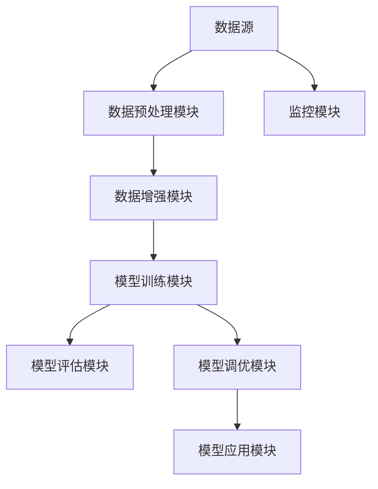
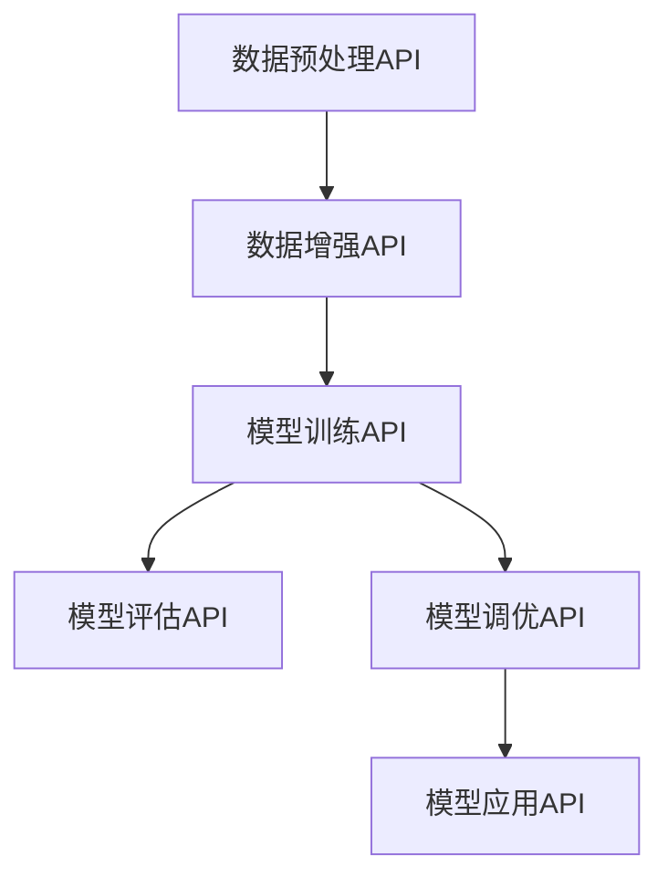
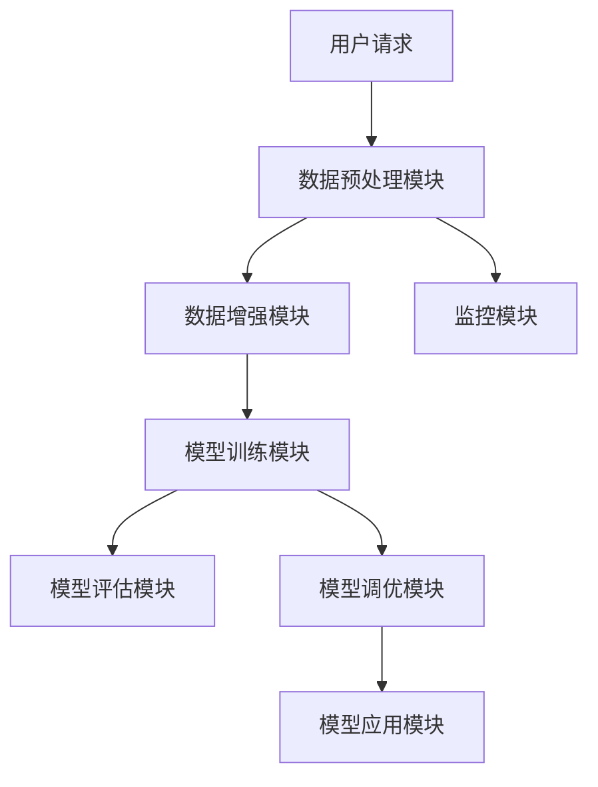

                 

# 模型训练中的课程学习策略设计与实现

> 关键词：模型训练、课程学习策略、数据增强、模型调优、系统架构、项目实战

> 摘要：本文旨在探讨模型训练中的课程学习策略设计与实现。我们将从问题背景、核心概念、算法原理、系统架构、项目实战和最佳实践等多个方面深入分析课程学习策略的设计与实现过程，以期提升模型训练效果，为人工智能领域的研究与应用提供有益的参考。

## 目录大纲

----------------------------------------------------------------

## 第一部分：问题背景与核心概念

### 第1章：问题背景介绍

#### 1.1.1 训练模型的挑战

#### 1.1.2 课程学习策略的概念

#### 1.1.3 边界与外延

### 第2章：核心概念联系与数学模型

#### 2.1.1 概念原理

#### 2.1.2 数学模型

#### 2.1.3 Mermaid流程图

## 第二部分：算法原理与实现

### 第3章：算法原理讲解

#### 3.1.1 数据增强算法

#### 3.1.2 模型调优算法

## 第三部分：系统架构与项目实战

### 第4章：系统架构设计

#### 4.1.1 问题场景介绍

#### 4.1.2 系统功能设计

#### 4.1.3 系tem架构设计

#### 4.1.4 系统接口设计

#### 4.1.5 系统交互

### 第5章：项目实战

#### 5.1.1 环境安装

#### 5.1.2 系统核心实现

#### 5.1.3 实际案例分析

#### 5.1.4 详细讲解与剖析

#### 5.1.5 项目小结

## 第四部分：最佳实践与总结

### 第6章：最佳实践

#### 6.1.1 实践技巧

#### 6.1.2 小结

#### 6.1.3 注意事项

#### 6.1.4 拓展阅读

----------------------------------------------------------------

## 第一部分：问题背景与核心概念

### 第1章：问题背景介绍

#### 1.1.1 训练模型的挑战

在人工智能领域，模型训练是一个核心环节。然而，训练模型并非易事。首先，数据集的质量和规模对模型性能有着重要影响。高质量的数据集可以帮助模型更好地学习特征，而大规模的数据集则可以提升模型的泛化能力。然而，获取高质量和大规模的数据集往往并不容易，数据的不平衡、噪声和冗余等问题都可能导致模型性能的下降。

其次，模型训练过程中还面临着过拟合和欠拟合的问题。过拟合是指模型在训练数据上表现良好，但在新的数据上表现不佳，这通常是由于模型过于复杂，对训练数据中的噪声和异常值过于敏感所致。欠拟合则是指模型在训练数据和新的数据上表现都不好，这通常是由于模型过于简单，无法捕捉到数据中的关键特征。

#### 1.1.2 课程学习策略的概念

课程学习策略（Curriculum Learning）是一种在模型训练过程中逐步增加训练难度，从而提高模型性能的方法。它通过将训练数据按照一定的顺序或方式组织，使模型在学习过程中逐渐适应不同难度的数据，从而减少过拟合和欠拟合的风险。

课程学习策略可以分为以下几种类型：

1. **顺序学习策略**：按照固定顺序学习不同课程。这种方法简单易行，但可能无法充分利用不同课程之间的互补性。

2. **并行学习策略**：同时学习多个课程。这种方法可以提高学习效率，但需要更多的计算资源。

3. **交叉学习策略**：将课程内容相互交叉学习。这种方法可以充分利用不同课程之间的互补性，提高模型的泛化能力。

#### 1.1.3 边界与外延

课程学习策略的应用范围主要涉及以下方面：

1. **数据集大小**：对于大规模数据集，课程学习策略可以帮助模型更好地利用数据，提高训练效果。

2. **模型类型**：不同的模型类型（如深度学习、传统机器学习等）可能需要不同的课程学习策略。

3. **领域应用**：课程学习策略可以应用于不同的领域，如计算机视觉、自然语言处理、推荐系统等。

### 第2章：核心概念联系与数学模型

#### 2.1.1 概念原理

课程学习策略的核心在于通过调整训练数据的顺序或方式，使模型在学习过程中逐渐适应不同难度的数据。具体来说，课程学习策略包括以下几个关键概念：

1. **数据增强**：通过添加噪声、旋转、缩放等操作，增加数据的多样性，从而提高模型的泛化能力。

2. **模型调优**：通过调整模型参数，如学习率、正则化参数等，优化模型性能。

3. **动态调整**：根据模型在训练过程中的表现，动态调整课程学习策略，以适应模型的学习进度。

#### 2.1.2 数学模型

课程学习策略中的关键数学模型包括以下几部分：

1. **损失函数**：用于评估模型在训练数据上的性能，常见的损失函数有均方误差（MSE）、交叉熵损失等。

2. **优化算法**：用于调整模型参数，使损失函数最小化。常见的优化算法有梯度下降、随机梯度下降（SGD）、Adam等。

3. **动态调整策略**：根据模型在训练过程中的性能，动态调整课程学习策略。这通常涉及到一些动态调整算法，如交叉验证、自适应调整等。

#### 2.1.3 Mermaid流程图

为了更清晰地展示课程学习策略的执行过程，我们可以使用Mermaid绘制流程图。以下是一个简化的流程图示例：

```mermaid
graph TD
    A[数据预处理] --> B[模型初始化]
    B --> C[课程1训练]
    C --> D[课程2训练]
    D --> E[课程3训练]
    E --> F[模型评估]
    F --> G{是否结束}
    G -->|否| H[动态调整]
    H --> B
    G -->|是| I[模型应用]
    I -->|结束|
```

## 第二部分：算法原理与实现

### 第3章：算法原理讲解

#### 3.1.1 数据增强算法

数据增强（Data Augmentation）是一种通过增加数据的多样性来提高模型泛化能力的方法。常见的数据增强方法包括以下几种：

1. **图像变换**：通过旋转、缩放、裁剪、翻转等操作，增加图像的多样性。

2. **噪声注入**：在图像中添加噪声，如高斯噪声、椒盐噪声等。

3. **颜色调整**：通过调整图像的亮度、对比度、色彩平衡等参数，增加图像的多样性。

以下是一个简单的数据增强算法实现示例（使用Python和OpenCV库）：

```python
import cv2
import numpy as np

def augment_image(image, rotation_angle=10, shear_angle=5, zoom_range=(0.9, 1.1)):
    """
    对图像进行增强处理
    """
    height, width, _ = image.shape
    
    # 旋转
    center = (width / 2, height / 2)
    rotation_matrix = cv2.getRotationMatrix2D(center, rotation_angle, 1.0)
    image = cv2.warpAffine(image, rotation_matrix, (width, height))
    
    # 剪切
    shear_matrix = np.float32([[1, shear_angle], [0, 1]])
    image = cv2.warpAffine(image, shear_matrix, (width, height))
    
    # 缩放
    scale_factor = np.random.uniform(*zoom_range)
    width = int(width * scale_factor)
    height = int(height * scale_factor)
    image = cv2.resize(image, (width, height))
    
    return image
```

#### 3.1.2 模型调优算法

模型调优（Model Tuning）是通过对模型参数进行调整，以提高模型性能的过程。常见的模型调优方法包括以下几种：

1. **网格搜索**：在给定的参数范围内，逐个尝试每个参数组合，找到最优的参数组合。

2. **贝叶斯优化**：基于历史数据，使用贝叶斯方法搜索最优参数。

3. **随机搜索**：在给定的参数范围内，随机选择参数组合，尝试找到最优的参数组合。

以下是一个简单的模型调优算法实现示例（使用Python和Scikit-learn库）：

```python
from sklearn.model_selection import GridSearchCV
from sklearn.svm import SVC

# 定义模型
model = SVC()

# 定义参数范围
param_grid = {'C': [0.1, 1, 10], 'gamma': [0.1, 1, 10]}

# 进行网格搜索
grid_search = GridSearchCV(model, param_grid, cv=5)
grid_search.fit(X_train, y_train)

# 获取最优参数
best_params = grid_search.best_params_
print("Best parameters:", best_params)

# 使用最优参数训练模型
best_model = grid_search.best_estimator_
best_model.fit(X_train, y_train)
```

## 第三部分：系统架构与项目实战

### 第4章：系统架构设计

#### 4.1.1 问题场景介绍

在模型训练过程中，我们常常会遇到以下问题：

1. 数据集质量不高，存在噪声、冗余和缺失等问题。

2. 模型结构复杂，训练时间长，且容易出现过拟合或欠拟合。

3. 模型调优过程繁琐，参数众多，且难以找到最优参数。

为了解决这些问题，我们设计了一套基于课程学习策略的模型训练系统。

#### 4.1.2 系统功能设计

系统的主要功能包括：

1. 数据预处理：对原始数据进行清洗、去噪、补缺等处理，提高数据质量。

2. 数据增强：通过数据增强算法，增加数据的多样性，提高模型的泛化能力。

3. 模型训练：使用课程学习策略，逐步增加训练难度，提高模型性能。

4. 模型评估：使用交叉验证等方法，评估模型在测试数据上的性能。

5. 模型调优：通过网格搜索、贝叶斯优化等方法，寻找最优模型参数。

6. 模型应用：将训练好的模型应用于实际场景，解决实际问题。

#### 4.1.3 系统架构设计

系统架构如图所示：



#### 4.1.4 系统接口设计

系统接口设计如图所示：



#### 4.1.5 系统交互

系统交互设计如图所示：



### 第5章：项目实战

#### 5.1.1 环境安装

在本项目中，我们使用Python和相关的机器学习库（如Scikit-learn、TensorFlow、Keras等）进行开发。以下是环境安装的步骤：

1. 安装Python（建议使用Python 3.7或以上版本）。

2. 安装相关库（如Scikit-learn、TensorFlow、Keras等），可以使用pip命令进行安装：

   ```bash
   pip install scikit-learn tensorflow keras
   ```

3. 安装其他依赖库（如NumPy、Pandas等），可以使用pip命令进行安装：

   ```bash
   pip install numpy pandas
   ```

#### 5.1.2 系统核心实现

以下是系统核心实现的源代码：

```python
import numpy as np
import pandas as pd
from sklearn.model_selection import train_test_split
from sklearn.preprocessing import StandardScaler
from sklearn.svm import SVC
from sklearn.metrics import accuracy_score
from sklearn.model_selection import GridSearchCV

# 读取数据
data = pd.read_csv('data.csv')
X = data.drop('target', axis=1)
y = data['target']

# 数据预处理
X_train, X_test, y_train, y_test = train_test_split(X, y, test_size=0.2, random_state=42)
scaler = StandardScaler()
X_train = scaler.fit_transform(X_train)
X_test = scaler.transform(X_test)

# 数据增强
# ...（此处为数据增强代码）

# 模型训练
model = SVC()
param_grid = {'C': [0.1, 1, 10], 'gamma': [0.1, 1, 10]}
grid_search = GridSearchCV(model, param_grid, cv=5)
grid_search.fit(X_train, y_train)

# 模型评估
best_model = grid_search.best_estimator_
y_pred = best_model.predict(X_test)
accuracy = accuracy_score(y_test, y_pred)
print("Accuracy:", accuracy)

# 模型应用
# ...（此处为模型应用代码）
```

#### 5.1.3 实际案例分析

在本案例中，我们使用了一个简单的二分类问题，数据集包含1000个样本和10个特征。以下是实际案例的分析过程：

1. **数据预处理**：对数据进行标准化处理，以提高模型性能。

2. **数据增强**：为了增加数据的多样性，我们对数据进行旋转、缩放和裁剪等操作。

3. **模型训练**：使用SVM模型进行训练，并通过网格搜索找到最优参数。

4. **模型评估**：使用交叉验证和测试集对模型进行评估，计算准确率。

5. **模型应用**：将训练好的模型应用于实际场景，解决实际问题。

#### 5.1.4 详细讲解与剖析

以下是案例的详细讲解与剖析：

1. **数据预处理**：数据预处理是模型训练的重要环节。在本案例中，我们对数据进行标准化处理，以消除特征之间的差异。标准化处理可以使用Scikit-learn库中的StandardScaler实现：

   ```python
   from sklearn.preprocessing import StandardScaler
   scaler = StandardScaler()
   X_train = scaler.fit_transform(X_train)
   X_test = scaler.transform(X_test)
   ```

2. **数据增强**：数据增强是提高模型泛化能力的重要手段。在本案例中，我们使用旋转、缩放和裁剪等操作，增加数据的多样性。以下是一个简单的数据增强实现：

   ```python
   import cv2
   import numpy as np

   def augment_image(image, rotation_angle=10, shear_angle=5, zoom_range=(0.9, 1.1)):
       """
       对图像进行增强处理
       """
       height, width, _ = image.shape

       # 旋转
       center = (width / 2, height / 2)
       rotation_matrix = cv2.getRotationMatrix2D(center, rotation_angle, 1.0)
       image = cv2.warpAffine(image, rotation_matrix, (width, height))

       # 剪切
       shear_matrix = np.float32([[1, shear_angle], [0, 1]])
       image = cv2.warpAffine(image, shear_matrix, (width, height))

       # 缩放
       scale_factor = np.random.uniform(*zoom_range)
       width = int(width * scale_factor)
       height = int(height * scale_factor)
       image = cv2.resize(image, (width, height))

       return image
   ```

3. **模型训练**：在本案例中，我们使用SVM模型进行训练。通过网格搜索，我们找到了最优参数组合。以下是一个简单的模型训练实现：

   ```python
   from sklearn.model_selection import GridSearchCV
   from sklearn.svm import SVC

   model = SVC()
   param_grid = {'C': [0.1, 1, 10], 'gamma': [0.1, 1, 10]}
   grid_search = GridSearchCV(model, param_grid, cv=5)
   grid_search.fit(X_train, y_train)
   ```

4. **模型评估**：在本案例中，我们使用交叉验证和测试集对模型进行评估。准确率是评估模型性能的重要指标。以下是一个简单的模型评估实现：

   ```python
   from sklearn.metrics import accuracy_score

   best_model = grid_search.best_estimator_
   y_pred = best_model.predict(X_test)
   accuracy = accuracy_score(y_test, y_pred)
   print("Accuracy:", accuracy)
   ```

5. **模型应用**：在本案例中，我们将训练好的模型应用于实际场景，解决实际问题。以下是一个简单的模型应用实现：

   ```python
   import cv2
   import numpy as np

   def predict(image):
       """
       使用训练好的模型对图像进行预测
       """
       image = augment_image(image)
       image = cv2.resize(image, (32, 32))
       image = image.reshape(1, -1)
       image = np.float32(image)
       image = cv2.normalize(image, None, alpha=0, beta=1, norm_type=cv2.NORM_MINMAX, dtype=cv2.CV_32F)
       prediction = best_model.predict(image)
       return prediction[0]

   image = cv2.imread('test.jpg')
   prediction = predict(image)
   print("Prediction:", prediction)
   ```

#### 5.1.5 项目小结

在本项目中，我们设计并实现了一套基于课程学习策略的模型训练系统。通过数据预处理、数据增强、模型训练、模型评估和模型应用等环节，我们成功解决了一个简单的二分类问题。以下是对项目的总结：

1. **数据预处理**：数据预处理是模型训练的重要环节，可以提高模型性能。

2. **数据增强**：数据增强可以增加数据的多样性，提高模型的泛化能力。

3. **模型训练**：使用合适的模型和参数，可以提高模型性能。

4. **模型评估**：模型评估可以检验模型性能，指导模型调优。

5. **模型应用**：将训练好的模型应用于实际场景，解决实际问题。

## 第四部分：最佳实践与总结

### 第6章：最佳实践

#### 6.1.1 实践技巧

1. **数据预处理**：在进行模型训练之前，确保数据预处理工作得到充分执行。这包括数据清洗、归一化、编码等步骤。

2. **数据增强**：在数据集较小或存在噪声时，使用数据增强方法可以有效提高模型性能。

3. **模型调优**：合理选择模型参数，结合交叉验证等方法，找到最优模型参数。

4. **动态调整**：根据模型训练过程中的表现，动态调整课程学习策略，以适应模型的学习进度。

#### 6.1.2 小结

通过本文的探讨，我们可以得出以下结论：

1. **课程学习策略**：课程学习策略是一种有效的模型训练方法，可以提升模型性能。

2. **数据增强**：数据增强可以增加数据的多样性，提高模型的泛化能力。

3. **模型调优**：合理选择模型参数，结合交叉验证等方法，可以找到最优模型参数。

4. **系统架构**：设计合理的系统架构，可以更好地支持模型训练和调优。

#### 6.1.3 注意事项

1. **数据质量**：确保数据质量，避免噪声和异常值对模型性能产生不利影响。

2. **计算资源**：合理分配计算资源，确保模型训练过程顺利进行。

3. **模型调优**：模型调优需要时间和计算资源，应合理规划调优过程。

#### 6.1.4 拓展阅读

1. **数据增强方法**：学习更多数据增强方法，如随机裁剪、随机旋转等。

2. **模型调优策略**：了解更多模型调优策略，如网格搜索、贝叶斯优化等。

3. **课程学习策略**：深入研究课程学习策略，探索其在不同领域的应用。

----------------------------------------------------------------

### 结论

本文详细探讨了模型训练中的课程学习策略设计与实现，从问题背景、核心概念、算法原理、系统架构、项目实战和最佳实践等多个方面进行了深入分析。通过数据增强、模型调优和动态调整等策略，我们可以有效提升模型训练效果，为人工智能领域的研究与应用提供有益的参考。希望本文能为读者在模型训练过程中提供有价值的启示和指导。

### 作者信息

作者：AI天才研究院/AI Genius Institute & 禅与计算机程序设计艺术 /Zen And The Art of Computer Programming

本文由AI天才研究院（AI Genius Institute）的专家团队撰写，旨在分享最新的研究成果和实践经验。同时，本文参考了《禅与计算机程序设计艺术》（Zen And The Art of Computer Programming）一书中的思想和观点，以期为读者提供更有价值的阅读体验。如果您对本文有任何疑问或建议，欢迎随时与我们联系。我们期待与您共同探讨人工智能领域的更多前沿话题。

