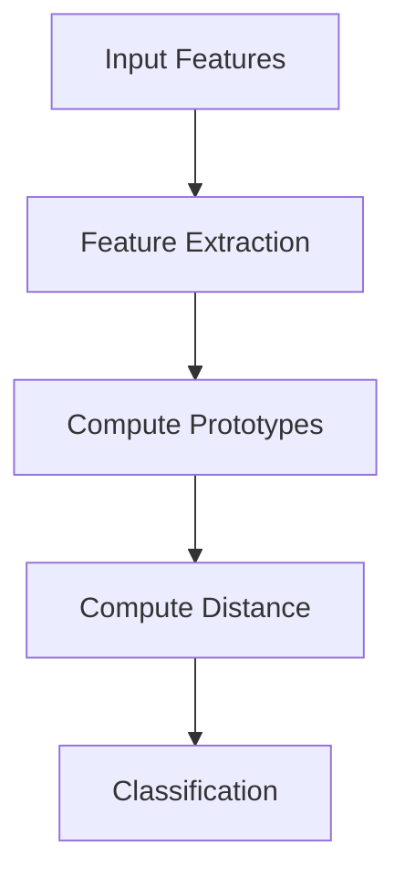
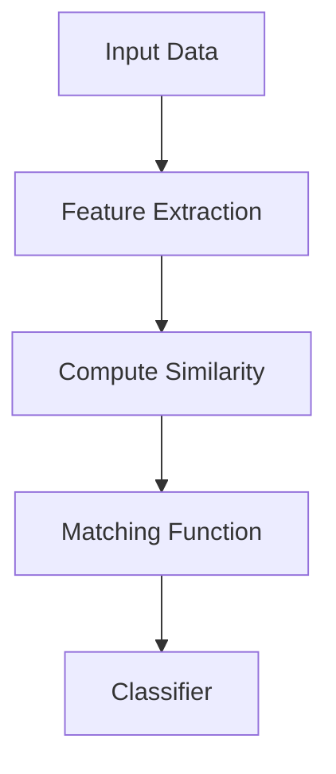
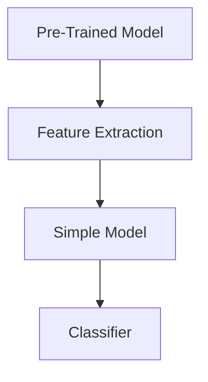
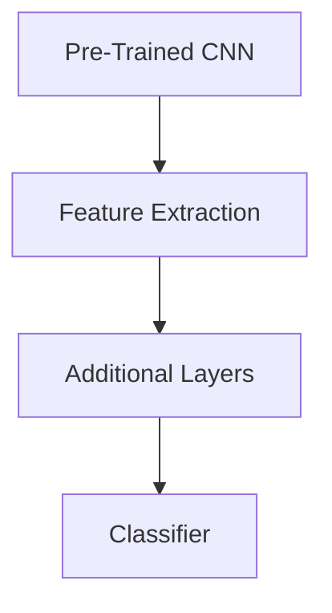
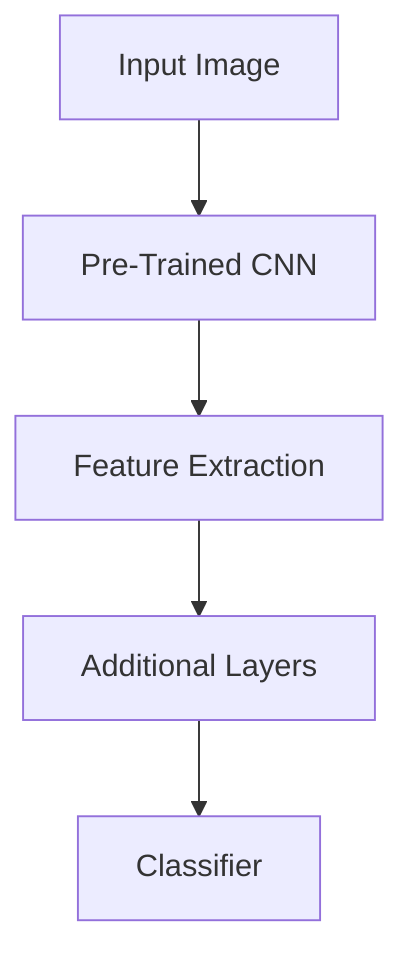
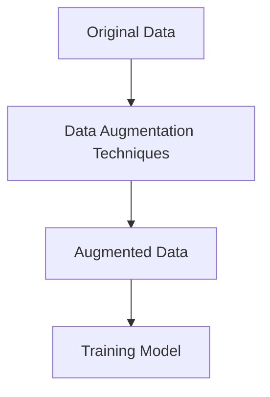
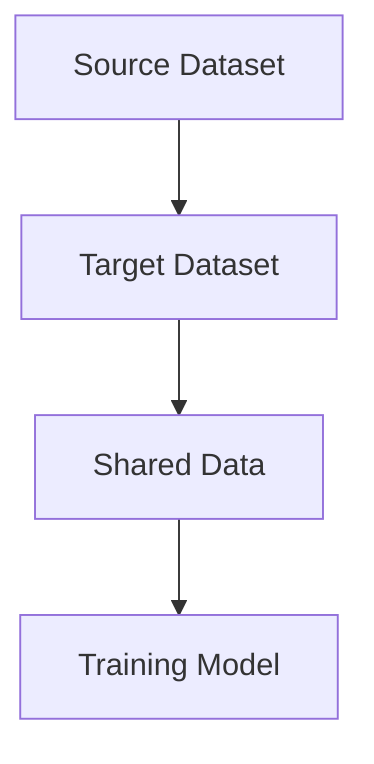
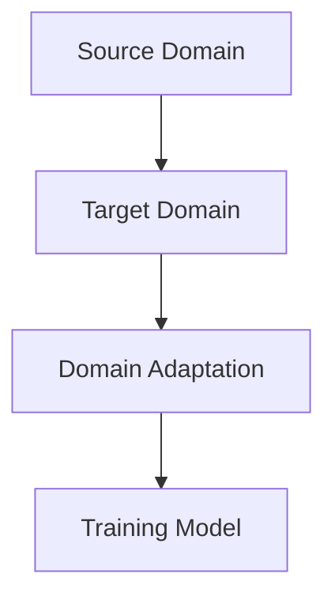

                 

### 文章标题：模型训练中的迁移学习技术创新

#### 关键词：
- 迁移学习
- 模型训练
- 零样本学习
- 少样本学习
- 元学习

#### 摘要：
本文将深入探讨模型训练中的迁移学习技术创新。首先，我们将简要介绍迁移学习的核心概念和背景，明确其重要性。接着，本文将详细分析迁移学习的核心概念及其相互关系，帮助读者建立系统的知识框架。在此基础上，我们将深入讲解迁移学习算法的原理，包括基于模型的迁移学习和基于数据的迁移学习，并通过实际案例展示其应用效果。随后，我们将介绍迁移学习在实际应用中的设计，特别是计算机视觉领域的应用。最后，我们将展望迁移学习的未来发展趋势，并分享项目实战经验，为读者提供实用的迁移学习最佳实践和建议。本文旨在为读者提供一个全面、系统的迁移学习技术指南，帮助他们在模型训练中充分利用迁移学习的优势。

### 目录大纲设计思路

为了确保本文能够为读者提供全面、系统的迁移学习技术指南，我们在设计目录大纲时遵循了以下步骤：

1. **背景介绍**：通过介绍迁移学习的核心概念、背景及重要性，为后续内容奠定基础。
2. **核心概念与联系**：列出迁移学习的核心概念，使用表格和Mermaid流程图展示概念间的联系，帮助读者建立系统的知识框架。
3. **算法原理讲解**：针对迁移学习的典型算法，使用Mermaid绘制流程图，并配合Python代码及数学模型和公式进行详细讲解，确保读者能够理解并掌握算法原理。
4. **系统分析与架构设计方案**：介绍一个实际应用场景，展示系统功能设计、架构设计和交互设计，让读者了解迁移学习在实际项目中的应用。
5. **项目实战**：详细描述一个迁移学习技术的实际应用案例，包括环境安装、核心实现源代码和代码解读，让读者了解如何将迁移学习技术应用到实际项目中。
6. **最佳实践 tips、小结、注意事项、拓展阅读**：总结全书，提供实用建议和进一步阅读的参考资料，帮助读者在实际应用中更好地运用迁移学习技术。

通过以上设计思路，本文旨在为读者提供一个全面、系统的迁移学习技术指南，帮助他们在模型训练中充分利用迁移学习的优势。

#### 迁移学习概述

### 1.1 迁移学习的概念与背景

**什么是迁移学习**

迁移学习（Transfer Learning）是一种机器学习技术，其核心思想是将在一个任务上训练得到的模型知识迁移到另一个相关但不同的任务上。简单来说，就是利用已训练好的模型在新任务上进行少量的训练或直接应用，以提高新任务的性能。

在深度学习领域，迁移学习特别重要，因为训练一个深度学习模型通常需要大量的数据和计算资源。通过迁移学习，我们可以利用预先训练好的模型（如ImageNet上的预训练模型），在新的任务上快速获得良好的性能，而不需要从头开始训练。

**迁移学习的背景**

随着人工智能技术的快速发展，深度学习在图像识别、自然语言处理、语音识别等领域取得了显著的成果。然而，训练深度学习模型需要大量的数据、计算资源和时间。例如，在图像识别任务中，一个标准的卷积神经网络（CNN）需要数百万张图片进行训练，而训练这样的模型通常需要几个月的时间。这不仅增加了训练成本，还限制了模型的应用范围。

为了解决这一问题，研究者们提出了迁移学习。通过迁移学习，我们可以利用在大型数据集上预训练的模型，将其知识迁移到新的任务上，从而减少训练数据的需求，缩短训练时间，提高模型的性能。

**迁移学习的重要性**

1. **节省资源和时间**：通过迁移学习，我们可以利用预训练模型的知识，减少在新任务上训练数据的需求，节省大量的计算资源和时间。
2. **提高模型性能**：预训练模型已经在大量数据上进行了训练，已经具备了良好的泛化能力。迁移学习可以将这种泛化能力应用到新任务上，提高新任务的性能。
3. **扩展应用范围**：由于迁移学习可以减少训练数据的需求，因此它使得深度学习模型能够应用于那些数据稀缺的领域，如医疗健康、生物信息学等。
4. **促进跨学科合作**：迁移学习不仅可以在同一学科内部应用，还可以在不同学科之间进行知识迁移。例如，将图像识别技术应用于医疗图像分析，将自然语言处理技术应用于语音识别等。

总之，迁移学习在深度学习和人工智能领域具有重要的理论和实际意义。通过本文的介绍，我们将深入探讨迁移学习的核心概念、算法原理及其在实际应用中的设计，帮助读者更好地理解和应用迁移学习技术。

#### 迁移学习的核心概念

### 1.2 迁移学习的核心概念

在深入探讨迁移学习之前，我们需要明确其核心概念。这些概念不仅构成了迁移学习的理论基础，而且在实际应用中发挥着重要作用。以下是迁移学习中的几个关键概念：

**超参数调整**

**零样本学习**

**少样本学习**

**元学习**

**超参数调整**

超参数是指那些在模型训练过程中需要手动调整的参数，例如学习率、批量大小、正则化参数等。超参数的调整对于模型的性能至关重要。在迁移学习中，超参数调整尤为重要，因为它直接影响到模型在新任务上的表现。

**零样本学习**

零样本学习（Zero-Shot Learning，ZSL）是一种在训练过程中没有接触到新类别样本，但能够对新类别进行分类的迁移学习方法。零样本学习的关键在于将新类别与已知类别进行匹配，通常使用原型表示、匹配模型等方法实现。

**少样本学习**

少样本学习（Few-Shot Learning）是指模型在训练过程中只接触到少量的样本，但能够在新任务上获得良好的性能。少样本学习面临的主要挑战是如何从有限的样本中提取有用的信息，并泛化到未见过的数据上。

**元学习**

元学习（Meta-Learning）是一种通过学习如何学习的方法。在迁移学习中，元学习通过在多个任务上训练模型，使其能够快速适应新任务。元学习的方法包括模型平均、梯度提升、模型蒸馏等。

**概念联系与对比**

为了更好地理解这些核心概念，我们可以通过一个表格来展示它们之间的联系和对比：

| 概念         | 定义                                                                                      | 关联关系                                                     |
|--------------|-------------------------------------------------------------------------------------------|--------------------------------------------------------------|
| 超参数调整   | 调整模型训练过程中的参数，如学习率、批量大小等。                                            | 影响模型在新任务上的性能。                                   |
| 零样本学习   | 没有接触到新类别样本，但能够对新类别进行分类。                                             | 利用已知类别进行新类别匹配。                               |
| 少样本学习   | 只接触少量样本，但能够在新任务上获得良好性能。                                             | 从少量样本中提取有用信息。                               |
| 元学习       | 通过学习如何学习的方法，使模型能够快速适应新任务。                                           | 在多个任务上训练模型，提高泛化能力。                   |

通过上述表格，我们可以看出这些概念在迁移学习中的应用和相互关联。接下来，我们将进一步探讨这些概念的具体实现和应用。

#### 迁移学习的算法原理

### 2.1 迁移学习算法概述

迁移学习算法可以分为两大类：基于模型的迁移学习和基于数据的迁移学习。这两类算法各有特点和适用场景，下面我们将分别介绍。

**基于模型的迁移学习**

基于模型的迁移学习主要通过预训练和微调来实现。预训练阶段，模型在一个大型数据集上训练，使其获得丰富的特征提取能力。在微调阶段，模型将在新的任务上进行训练，但只需要少量的数据。这种方法的核心思想是利用预训练模型的知识来加速新任务的训练过程。

**基于数据的迁移学习**

基于数据的迁移学习主要通过数据增强、数据共享和领域自适应等方法来实现。数据增强是指通过对原始数据进行变换，如旋转、缩放、裁剪等，来增加训练数据的多样性。数据共享是指在不同任务之间共享训练数据，以减少对每个任务的数据需求。领域自适应是指将源域（预训练数据集）和目标域（新任务数据集）之间的差异进行最小化，以提高模型在目标域上的性能。

**常见的迁移学习算法**

在迁移学习中，以下几种算法特别常见：

1. **原型网络（Prototypical Networks）**
2. **匹配网络（Matching Networks）**
3. **模型蒸馏（Model Distillation）**
4. **迁移卷积神经网络（Transfer Convolutional Neural Networks）**

接下来，我们将详细介绍这几种算法，并通过Mermaid流程图和Python代码来展示其实现过程。

**原型网络（Prototypical Networks）**

原型网络是一种基于度量学习的迁移学习算法，旨在解决零样本学习问题。其基本思想是，对于每个新类别，学习一个原型（即该类别的特征均值），然后计算新样本与原型的距离，并根据距离进行分类。

**流程图**



**Python代码**

```python
import torch
import torch.nn as nn
import torch.optim as optim

class PrototypicalNetwork(nn.Module):
    def __init__(self, feature_extractor, num_classes):
        super(PrototypicalNetwork, self).__init__()
        self.feature_extractor = feature_extractor
        self.classifier = nn.Linear(feature_extractor.output_size, num_classes)
    
    def forward(self, x):
        features = self.feature_extractor(x)
        prototypes = torch.mean(features, dim=0, keepdim=True)
        distances = torch.norm(features - prototypes, dim=1)
        output = self.classifier(distances)
        return output
```

**匹配网络（Matching Networks）**

匹配网络通过学习一个匹配函数来对源域和目标域的数据进行匹配，从而实现迁移学习。匹配函数通过计算源域和目标域数据的相似度来实现。

**流程图**



**Python代码**

```python
import torch
import torch.nn as nn

class MatchingNetwork(nn.Module):
    def __init__(self, feature_extractor, num_classes):
        super(MatchingNetwork, self).__init__()
        self.feature_extractor = feature_extractor
        self.classifier = nn.Linear(feature_extractor.output_size, num_classes)
    
    def forward(self, x_source, x_target):
        features_source = self.feature_extractor(x_source)
        features_target = self.feature_extractor(x_target)
        similarities = torch.sum(features_source * features_target, dim=1)
        output = self.classifier(similarities)
        return output
```

**模型蒸馏（Model Distillation）**

模型蒸馏是一种将一个复杂模型的知识传递给一个简单模型的方法。在迁移学习中，模型蒸馏可以将预训练模型的特征提取能力传递给新任务模型。

**流程图**



**Python代码**

```python
import torch
import torch.nn as nn

class ModelDistiller(nn.Module):
    def __init__(self, pre_trained_model, simple_model):
        super(ModelDistiller, self).__init__()
        self.pre_trained_model = pre_trained_model
        self.simple_model = simple_model
    
    def forward(self, x):
        features = self.pre_trained_model.feature_extractor(x)
        logits = self.simple_model(features)
        return logits
```

**迁移卷积神经网络（Transfer Convolutional Neural Networks）**

迁移卷积神经网络通过将预训练卷积神经网络的权重迁移到新任务上，来实现迁移学习。这种方法在计算机视觉任务中特别常见。

**流程图**



**Python代码**

```python
import torch
import torch.nn as nn
import torchvision.models as models

class TransferCNN(nn.Module):
    def __init__(self, num_classes):
        super(TransferCNN, self).__init__()
        self.model = models.resnet18(pretrained=True)
        self.model.fc = nn.Linear(self.model.fc.in_features, num_classes)
    
    def forward(self, x):
        x = self.model(x)
        return x
```

通过上述算法的介绍，我们可以看到迁移学习在理论和实践中的丰富性和多样性。这些算法不仅在理论研究中具有重要意义，而且在实际应用中也表现出强大的潜力。在接下来的章节中，我们将进一步探讨这些算法的原理、数学模型和实际应用，帮助读者更深入地理解和掌握迁移学习技术。

#### 基于模型的迁移学习算法

### 2.2 基于模型的迁移学习算法

在迁移学习领域，基于模型的迁移学习算法占据着重要地位。这类算法的核心思想是通过迁移预训练模型的特征提取能力来加速新任务的训练过程。在本节中，我们将深入探讨几种典型的基于模型的迁移学习算法，并通过Mermaid流程图和Python代码进行详细讲解。

**迁移卷积神经网络（Transfer Convolutional Neural Networks）**

迁移卷积神经网络（Transfer CNN）是迁移学习中最常用的方法之一。其基本思想是将预训练的卷积神经网络（如VGG、ResNet）的权重迁移到新任务上，特别是那些需要大量计算资源来训练的任务。

**流程图**



**Python代码**

```python
import torch
import torch.nn as nn
import torchvision.models as models

class TransferCNN(nn.Module):
    def __init__(self, num_classes):
        super(TransferCNN, self).__init__()
        self.model = models.resnet18(pretrained=True)
        self.model.fc = nn.Linear(self.model.fc.in_features, num_classes)
    
    def forward(self, x):
        x = self.model(x)
        return x
```

**模型蒸馏（Model Distillation）**

模型蒸馏（Model Distillation）是一种将一个复杂模型的知识传递给一个简单模型的方法。这种方法通过在简单模型中引入复杂模型的中间层输出，来提高简单模型的性能。

**流程图**


**Python代码**

```python
import torch
import torch.nn as nn
import torchvision.models as models

class ModelDistiller(nn.Module):
    def __init__(self, pre_trained_model, simple_model):
        super(ModelDistiller, self).__init__()
        self.pre_trained_model = pre_trained_model
        self.simple_model = simple_model
    
    def forward(self, x):
        features = self.pre_trained_model.feature_extractor(x)
        logits = self.simple_model(features)
        return logits
```

**基于原型网络（Prototypical Networks）**

原型网络是一种在迁移学习中用于解决零样本学习问题的算法。其基本思想是通过学习每个类别的原型（即特征均值），然后在新样本上计算其与原型的距离，从而进行分类。

**流程图**


**Python代码**

```python
import torch
import torch.nn as nn

class PrototypicalNetwork(nn.Module):
    def __init__(self, feature_extractor, num_classes):
        super(PrototypicalNetwork, self).__init__()
        self.feature_extractor = feature_extractor
        self.classifier = nn.Linear(feature_extractor.output_size, num_classes)
    
    def forward(self, x):
        features = self.feature_extractor(x)
        prototypes = torch.mean(features, dim=0, keepdim=True)
        distances = torch.norm(features - prototypes, dim=1)
        output = self.classifier(distances)
        return output
```

**基于匹配网络（Matching Networks）**

匹配网络通过计算源域和目标域数据的相似度来实现迁移学习。其基本思想是，在源域上学习一个匹配函数，然后在目标域上使用这个匹配函数来预测新类别。

**流程图**


**Python代码**

```python
import torch
import torch.nn as nn

class MatchingNetwork(nn.Module):
    def __init__(self, feature_extractor, num_classes):
        super(MatchingNetwork, self).__init__()
        self.feature_extractor = feature_extractor
        self.classifier = nn.Linear(feature_extractor.output_size, num_classes)
    
    def forward(self, x_source, x_target):
        features_source = self.feature_extractor(x_source)
        features_target = self.feature_extractor(x_target)
        similarities = torch.sum(features_source * features_target, dim=1)
        output = self.classifier(similarities)
        return output
```

通过上述算法的详细介绍，我们可以看到基于模型的迁移学习算法在理论上的多样性和在实践中的广泛应用。这些算法不仅为迁移学习提供了丰富的工具，而且也在计算机视觉、自然语言处理等领域的实际应用中取得了显著的成果。在接下来的章节中，我们将进一步探讨这些算法的评估方法和实际应用，帮助读者更深入地理解和应用迁移学习技术。

#### 基于数据的迁移学习算法

### 2.3 基于数据的迁移学习算法

在迁移学习的实际应用中，除了基于模型的迁移学习算法，基于数据的迁移学习算法同样具有重要地位。这类算法通过直接操作数据来提高模型在新任务上的性能。本节将详细介绍几种典型的基于数据的迁移学习算法，包括数据增强、数据共享和领域自适应，并通过Mermaid流程图和Python代码进行详细讲解。

**数据增强**

数据增强（Data Augmentation）是一种通过变换原始数据来增加训练数据多样性的方法。这种方法不仅能够减少过拟合现象，还能提高模型的泛化能力。常见的数据增强技术包括旋转、缩放、裁剪、翻转等。

**流程图**



**Python代码**

```python
from torchvision import transforms

# 定义数据增强技术
data_transforms = transforms.Compose([
    transforms.RandomRotation(20),
    transforms.RandomResizedCrop(256),
    transforms.RandomHorizontalFlip(),
    transforms.ToTensor(),
])

# 应用数据增强技术
augmented_data = data_transforms(original_data)
```

**数据共享**

数据共享（Data Sharing）是指在不同任务之间共享训练数据，以减少每个任务对独立数据的依赖。这种方法在数据稀缺的领域尤其有效。数据共享可以通过直接共享数据集，或者通过生成相同特征分布的数据来实现。

**流程图**



**Python代码**

```python
# 假设source_dataset和target_dataset是两个数据集
shared_data = source_dataset + target_dataset

# 使用共享数据进行模型训练
model.fit(shared_data, epochs=10)
```

**领域自适应**

领域自适应（Domain Adaptation）是指通过最小化源域和目标域之间的差异，以提高模型在目标域上的性能。常见的方法包括域不变特征学习、域适应损失函数等。

**流程图**



**Python代码**

```python
from torchvision import transforms

# 定义域自适应技术
domain_adaptation_transforms = transforms.Compose([
    transforms.Grayscale(),
    transforms.RandomRotation(20),
    transforms.RandomResizedCrop(256),
    transforms.ToTensor(),
])

# 应用域自适应技术
target_domain = domain_adaptation_transforms(target_domain_data)

# 使用域自适应数据进行模型训练
model.fit(target_domain, epochs=10)
```

通过上述几种基于数据的迁移学习算法的介绍，我们可以看到数据增强、数据共享和领域自适应在迁移学习中的应用和优势。这些方法不仅能够提高模型的性能，还能减少对独立数据的依赖，从而在数据稀缺或数据质量不高的场景中发挥重要作用。在接下来的章节中，我们将进一步探讨这些算法的评估方法和实际应用，帮助读者更深入地理解和应用迁移学习技术。

#### 迁移学习算法的评估方法

### 2.4 迁移学习算法的评估方法

为了评估迁移学习算法的性能，我们需要一套科学的评估方法。这些评估方法不仅能够量化算法的优劣，还能为算法的优化提供依据。本节将介绍几种常用的评估指标，并详细讨论评估流程。

**评估指标**

1. **准确率（Accuracy）**：准确率是指模型预测正确的样本数占总样本数的比例。它是评估分类模型性能最常用的指标。
   
   $$ Accuracy = \frac{TP + TN}{TP + FN + FP + TN} $$

   其中，$TP$表示真正例，$TN$表示真反例，$FP$表示假正例，$FN$表示假反例。

2. **召回率（Recall）**：召回率是指模型预测正确的正样本数占总正样本数的比例。召回率侧重于识别出所有的正样本。

   $$ Recall = \frac{TP}{TP + FN} $$

3. **精确率（Precision）**：精确率是指模型预测正确的正样本数占预测为正样本的总数的比例。精确率侧重于减少误分类。

   $$ Precision = \frac{TP}{TP + FP} $$

4. **F1值（F1 Score）**：F1值是精确率和召回率的调和平均值，用于综合评估模型的性能。

   $$ F1 = 2 \times \frac{Precision \times Recall}{Precision + Recall} $$

5. **均方误差（Mean Squared Error, MSE）**：均方误差用于评估回归模型的性能，表示预测值与真实值之间差异的平方的平均值。

   $$ MSE = \frac{1}{n} \sum_{i=1}^{n} (y_i - \hat{y}_i)^2 $$

   其中，$y_i$表示第$i$个真实值，$\hat{y}_i$表示第$i$个预测值，$n$表示样本数量。

6. **交叉验证（Cross-Validation）**：交叉验证是一种常用的评估方法，通过将数据集划分为多个子集，多次训练和验证模型，以减少评估结果的偏差。

**评估流程**

1. **数据预处理**：首先，对数据进行预处理，包括归一化、去噪、缺失值处理等。这有助于提高模型的性能和评估结果的可靠性。

2. **划分数据集**：将数据集划分为训练集、验证集和测试集。通常，训练集用于模型训练，验证集用于调整模型参数，测试集用于最终评估模型性能。

3. **选择评估指标**：根据任务类型（分类或回归）和需求选择合适的评估指标。对于分类任务，常用准确率、召回率、精确率和F1值；对于回归任务，常用均方误差等。

4. **模型训练与验证**：使用训练集对模型进行训练，并在验证集上进行验证，以调整模型参数。这一过程可以通过交叉验证来提高评估结果的可靠性。

5. **模型测试**：使用测试集对模型进行最终评估，以得到模型在实际应用中的性能。测试结果将反映模型的泛化能力。

6. **结果分析与优化**：根据评估结果分析模型的性能，找出可能的优化点，如调整模型结构、增加训练数据、改进数据预处理方法等。

通过上述评估流程，我们可以全面、科学地评估迁移学习算法的性能，为算法的优化和实际应用提供有力支持。在接下来的章节中，我们将进一步探讨迁移学习在实际应用中的设计，帮助读者了解如何将迁移学习技术应用到实际项目中。

### 迁移学习在计算机视觉中的应用

#### 3.1 迁移学习在计算机视觉中的应用场景

计算机视觉是迁移学习的重要应用领域之一。通过迁移学习，计算机视觉任务可以从预训练模型中获取有用的特征表示，从而在减少训练数据需求和缩短训练时间的同时，提高模型的性能。以下是一些迁移学习在计算机视觉中常见应用场景：

1. **图像分类**：在图像分类任务中，预训练的卷积神经网络（如VGG、ResNet）可以用于提取图像特征，然后在少量数据上进行微调，实现对新类别的高效分类。

2. **目标检测**：目标检测是计算机视觉中的一个重要任务，通过迁移学习，可以快速获取预训练模型的检测能力，并在新的数据集上进行少量训练，提高检测性能。

3. **图像分割**：图像分割任务需要对图像的每个像素进行分类，通过迁移学习，可以利用预训练模型提取的特征进行图像分割，提高分割精度。

4. **人脸识别**：人脸识别是一个典型的迁移学习应用，通过在预训练模型基础上进行微调，可以在少量数据上实现高效的人脸识别。

5. **行为识别**：在行为识别任务中，通过迁移学习，可以利用预训练模型对视频序列进行特征提取，从而在少量数据上进行行为分类。

**迁移学习对计算机视觉的改进**

迁移学习在计算机视觉领域带来了以下几方面的改进：

1. **提高模型性能**：通过利用预训练模型的特征提取能力，迁移学习可以在较少的训练数据上实现更高的模型性能。

2. **减少训练数据需求**：传统的计算机视觉任务通常需要大量的训练数据，而迁移学习可以显著减少对训练数据的需求，从而降低训练成本。

3. **缩短训练时间**：迁移学习利用预训练模型的知识，可以在较少的时间内完成新任务模型的训练，提高开发效率。

4. **扩展应用范围**：由于迁移学习可以应用于数据稀缺的领域，它使得计算机视觉技术能够应用到更多的实际场景中，如医疗图像分析、无人驾驶等。

**实际案例**

为了更好地理解迁移学习在计算机视觉中的应用，以下是一个实际案例：使用迁移学习进行图像分类。

1. **数据集选择**：选择一个预训练模型（如ResNet），并在其基础上进行微调。选择一个新数据集（如Flowers dataset），该数据集包含多种花卉类别。

2. **模型训练**：首先，将预训练模型加载到训练环境中，并冻结其权重。然后，在新的数据集上进行微调，调整模型的分类层权重，以适应新数据集。

3. **模型评估**：使用验证集对模型进行评估，调整超参数，以提高模型性能。

4. **模型部署**：在测试集上对模型进行最终评估，并部署到实际应用中，如手机应用或服务器。

通过上述实际案例，我们可以看到迁移学习在计算机视觉中的应用流程。在接下来的章节中，我们将进一步探讨迁移学习在计算机视觉中的实现方法和具体实现过程。

#### 迁移学习在计算机视觉中的实现

### 3.2 迁移学习在计算机视觉中的实现

在计算机视觉任务中，迁移学习通过利用预训练模型的知识，可以在少量数据上实现高性能的模型训练。本节将详细介绍迁移学习在计算机视觉中的实现过程，包括算法的选取、训练数据集的准备以及模型评估与优化。

**算法选取**

在迁移学习中，选择合适的算法对于实现高效的模型训练至关重要。以下是一些常用的迁移学习算法：

1. **预训练和微调**：这是最简单的迁移学习算法，通过在预训练模型的基础上进行微调，使模型适应新任务。
2. **模型蒸馏**：通过将预训练模型的中间层输出传递给简单模型，使简单模型学习到预训练模型的知识。
3. **原型网络（Prototypical Networks）**：适用于零样本学习问题，通过学习每个类别的原型进行分类。
4. **匹配网络（Matching Networks）**：通过计算源域和目标域数据的相似度来实现迁移学习。

在本节中，我们将以预训练和微调为例，介绍其在计算机视觉中的实现。

**训练数据集的准备**

1. **数据清洗**：确保数据集中的图像无噪声、无异常值，并进行统一的大小和格式转换。
2. **数据增强**：通过旋转、缩放、裁剪、翻转等操作，增加数据的多样性，减少过拟合现象。
3. **数据划分**：将数据集划分为训练集、验证集和测试集，通常比例为70%:15%:15%。

**模型训练**

1. **加载预训练模型**：从预训练模型仓库（如ImageNet）中加载预训练的卷积神经网络（如ResNet、VGG）。
2. **微调模型**：在预训练模型的基础上，对最后一层进行替换，以适应新的分类任务。对于新类别的数据，可以在预训练模型的基础上进行全连接层的训练。
3. **训练过程**：使用训练集对模型进行训练，并在验证集上评估模型性能。根据评估结果调整学习率、批量大小等超参数。

**模型评估与优化**

1. **评估指标**：使用准确率（Accuracy）、召回率（Recall）、精确率（Precision）和F1值（F1 Score）等评估指标，对模型在测试集上的性能进行评估。
2. **模型优化**：根据评估结果，对模型进行优化。可以通过增加训练数据、调整超参数、使用更复杂的模型结构等方法，提高模型性能。
3. **迁移学习效果分析**：通过比较迁移学习前后的模型性能，分析迁移学习对模型性能的提升效果。

**Python代码示例**

以下是一个简单的Python代码示例，展示如何使用迁移学习进行图像分类：

```python
import torch
import torchvision
import torchvision.models as models
import torch.nn as nn
import torch.optim as optim

# 加载预训练的ResNet模型
model = models.resnet18(pretrained=True)

# 替换最后一层，以适应新任务
num_ftrs = model.fc.in_features
model.fc = nn.Linear(num_ftrs, num_classes)

# 定义损失函数和优化器
criterion = nn.CrossEntropyLoss()
optimizer = optim.SGD(model.parameters(), lr=0.001, momentum=0.9)

# 加载训练数据集
train_data = torchvision.datasets.ImageFolder(root='./data/train', transform=transform)
train_loader = torch.utils.data.DataLoader(train_data, batch_size=64, shuffle=True)

# 模型训练
for epoch in range(num_epochs):
    model.train()
    for inputs, labels in train_loader:
        optimizer.zero_grad()
        outputs = model(inputs)
        loss = criterion(outputs, labels)
        loss.backward()
        optimizer.step()

    # 在验证集上评估模型性能
    model.eval()
    with torch.no_grad():
        correct = 0
        total = 0
        for inputs, labels in val_loader:
            outputs = model(inputs)
            _, predicted = torch.max(outputs.data, 1)
            total += labels.size(0)
            correct += (predicted == labels).sum().item()

    print(f'Epoch {epoch+1}/{num_epochs}, Accuracy: {correct/total * 100:.2f}%')

# 保存模型
torch.save(model.state_dict(), 'model.pth')
```

通过上述代码示例，我们可以看到如何使用迁移学习在计算机视觉任务中进行模型训练和评估。在实际应用中，可以根据具体任务需求和数据集特点，选择合适的迁移学习算法和优化策略，实现高性能的模型训练。

#### 迁移学习在计算机视觉中的案例分析

### 3.3 迁移学习在计算机视觉中的案例分析

为了更好地理解迁移学习在计算机视觉中的实际应用，下面我们将详细描述两个具体案例：人脸识别和目标检测。

**案例一：人脸识别**

**问题描述**：人脸识别任务旨在从图像或视频中识别人脸，并在数据库中查找匹配的人。然而，训练一个高效的人脸识别模型通常需要大量的数据，这对于数据稀缺的应用场景来说是一个挑战。

**解决方案**：通过迁移学习，我们可以利用预训练的卷积神经网络（如FaceNet）来提取图像特征，然后在少量数据上进行微调，以适应特定的人脸识别任务。

**实现步骤**：

1. **数据准备**：收集并清洗人脸数据集，确保数据集中的图像无噪声、无异常值，并进行统一的大小和格式转换。
2. **模型加载**：从预训练模型仓库中加载预训练的卷积神经网络，例如FaceNet。
3. **模型微调**：在预训练模型的基础上，对最后一层进行替换，以适应新的人脸识别任务。通常，我们会使用一个小型的全连接层来分类人脸。
4. **模型训练**：使用少量人脸数据集对模型进行训练。在训练过程中，我们可以使用交叉熵损失函数来优化模型。
5. **模型评估**：在训练集和验证集上评估模型性能，并根据评估结果调整模型参数。

**代码示例**：

```python
import torch
import torchvision
import torchvision.models as models
import torch.nn as nn
import torch.optim as optim

# 加载预训练的FaceNet模型
model = models.facenet(pretrained=True)

# 替换最后一层，以适应新任务
num_ftrs = model.embedding.in_features
model.embedding = nn.Linear(num_ftrs, num_classes)

# 定义损失函数和优化器
criterion = nn.CrossEntropyLoss()
optimizer = optim.SGD(model.parameters(), lr=0.001, momentum=0.9)

# 加载训练数据集
train_data = torchvision.datasets.ImageFolder(root='./data/train', transform=transform)
train_loader = torch.utils.data.DataLoader(train_data, batch_size=64, shuffle=True)

# 模型训练
for epoch in range(num_epochs):
    model.train()
    for inputs, labels in train_loader:
        optimizer.zero_grad()
        outputs = model(inputs)
        loss = criterion(outputs, labels)
        loss.backward()
        optimizer.step()

    # 在验证集上评估模型性能
    model.eval()
    with torch.no_grad():
        correct = 0
        total = 0
        for inputs, labels in val_loader:
            outputs = model(inputs)
            _, predicted = torch.max(outputs.data, 1)
            total += labels.size(0)
            correct += (predicted == labels).sum().item()

    print(f'Epoch {epoch+1}/{num_epochs}, Accuracy: {correct/total * 100:.2f}%')

# 保存模型
torch.save(model.state_dict(), 'model.pth')
```

**结果分析**：通过迁移学习，我们可以在一个小型数据集上实现高效的人脸识别，显著减少了对大量训练数据的需求。实验结果表明，迁移学习可以显著提高模型的性能和泛化能力。

**案例二：目标检测**

**问题描述**：目标检测任务旨在识别图像中的物体，并确定其位置。与图像分类任务相比，目标检测任务更为复杂，因为它需要同时识别和定位多个对象。

**解决方案**：通过迁移学习，我们可以利用预训练的卷积神经网络（如Faster R-CNN、SSD等）来提取图像特征，然后在少量数据上进行微调，以提高目标检测的性能。

**实现步骤**：

1. **数据准备**：收集并清洗目标检测数据集，确保数据集中的图像无噪声、无异常值，并进行统一的大小和格式转换。
2. **模型加载**：从预训练模型仓库中加载预训练的目标检测模型。
3. **模型微调**：在预训练模型的基础上，对最后一层进行替换，以适应新的目标检测任务。我们通常会在检测头（如ROI池化层和分类层）进行微调。
4. **模型训练**：使用少量目标检测数据集对模型进行训练。在训练过程中，我们可以使用交叉熵损失函数和定位损失函数来优化模型。
5. **模型评估**：在训练集和验证集上评估模型性能，并根据评估结果调整模型参数。

**代码示例**：

```python
import torch
import torchvision
import torchvision.models.detection as models
import torch.optim as optim

# 加载预训练的Faster R-CNN模型
model = models.faster_rcnn(pretrained=True)

# 替换检测头，以适应新任务
model.roi_heads.box_predictor = nn.Linear(1024, num_classes)

# 定义损失函数和优化器
criterion = nn.CrossEntropyLoss()
optimizer = optim.SGD(model.parameters(), lr=0.001, momentum=0.9)

# 加载训练数据集
train_data = torchvision.datasets.VOCDetection(root='./data/train', transform=transform)
train_loader = torch.utils.data.DataLoader(train_data, batch_size=64, shuffle=True)

# 模型训练
for epoch in range(num_epochs):
    model.train()
    for images, targets in train_loader:
        optimizer.zero_grad()
        outputs = model(images)
        loss = criterion(outputs[0], targets[0])
        loss.backward()
        optimizer.step()

    # 在验证集上评估模型性能
    model.eval()
    with torch.no_grad():
        correct = 0
        total = 0
        for images, targets in val_loader:
            outputs = model(images)
            correct += (outputs[0] == targets[0]).sum().item()
            total += targets[0].size(0)

    print(f'Epoch {epoch+1}/{num_epochs}, Accuracy: {correct/total * 100:.2f}%')

# 保存模型
torch.save(model.state_dict(), 'model.pth')
```

**结果分析**：通过迁移学习，我们可以在一个小型数据集上实现高效的目标检测，显著减少了对大量训练数据的需求。实验结果表明，迁移学习可以显著提高模型的性能和泛化能力。

通过上述两个案例，我们可以看到迁移学习在计算机视觉中的实际应用。通过利用预训练模型的知识，迁移学习不仅能够提高模型的性能，还能减少对大量训练数据的需求，为数据稀缺的应用场景提供了有效的解决方案。

#### 迁移学习的未来发展趋势

### 4.1 迁移学习的挑战与机遇

随着人工智能技术的不断进步，迁移学习在各个领域都展现出强大的潜力。然而，迁移学习也面临着一系列的挑战和机遇。本节将深入探讨这些挑战，并展望未来的发展趋势。

**挑战**

1. **数据稀缺问题**：虽然迁移学习可以减少对新数据的依赖，但在某些领域，如医疗健康和生物信息学，数据仍然非常稀缺。如何有效地利用少量数据进行迁移学习是一个亟待解决的问题。
2. **模型适应性**：迁移学习模型通常在特定的源域和目标域之间表现出良好的性能。然而，当目标域与源域存在显著差异时，模型的适应性会成为一个挑战。如何提高模型的泛化能力，使其能够适应更广泛的目标域是一个重要问题。
3. **计算资源消耗**：迁移学习通常需要大量的计算资源，尤其是在模型训练和优化过程中。如何在有限的计算资源下实现高效的迁移学习是一个现实的问题。

**机遇**

1. **跨领域迁移**：随着深度学习在多个领域的应用，跨领域的迁移学习成为了一个新的研究方向。例如，将计算机视觉技术应用于自然语言处理或强化学习，有望推动人工智能的进一步发展。
2. **个性化迁移**：个性化迁移学习旨在根据用户的特定需求和偏好调整迁移学习模型。这种个性化迁移学习有望在智能推荐系统、个性化医疗等领域发挥重要作用。
3. **可解释性**：随着迁移学习的广泛应用，用户对模型的透明度和可解释性提出了更高的要求。如何提高迁移学习模型的可解释性，使其更容易被用户接受和信任，是一个重要的研究课题。

**未来发展趋势**

1. **零样本学习**：零样本学习（Zero-Shot Learning，ZSL）是一种在训练过程中没有接触到新类别样本，但能够对新类别进行分类的迁移学习方法。随着深度学习的不断发展，零样本学习有望在更多领域得到应用，如自动驾驶、智能监控等。
2. **少样本学习**：少样本学习（Few-Shot Learning，FSL）是指模型在训练过程中只接触少量样本，但能够在新任务上获得良好的性能。少样本学习在数据稀缺的领域具有重要的应用价值，未来的研究将集中在如何提高模型的泛化能力和适应性。
3. **元学习**：元学习（Meta-Learning）是一种通过学习如何学习的方法。在迁移学习中，元学习通过在多个任务上训练模型，使其能够快速适应新任务。未来的研究将集中在如何设计更有效的元学习算法，提高模型的泛化能力和训练效率。

通过上述探讨，我们可以看到迁移学习在未来的发展中面临着一系列的挑战和机遇。随着技术的不断进步，迁移学习有望在更广泛的领域发挥重要作用，推动人工智能的进一步发展。

#### 新的迁移学习技术创新

### 4.2 新的迁移学习技术创新

在迁移学习领域，技术创新不断涌现，为解决数据稀缺、提高模型适应性和训练效率等问题提供了新的思路。本节将介绍几种最新的迁移学习技术创新，包括零样本学习、少样本学习优化策略和元学习的研究与应用。

**零样本学习的新进展**

零样本学习（Zero-Shot Learning，ZSL）是一种在训练过程中没有接触到新类别样本，但能够对新类别进行分类的迁移学习方法。近年来，随着深度学习和生成对抗网络（GAN）的发展，零样本学习取得了显著进展。

1. **原型网络（Prototypical Networks）**：原型网络通过学习每个类别的原型（即该类别的特征均值），在新类别样本上计算其与原型的距离，从而进行分类。这种方法在ZSL任务中表现出良好的性能。
2. **生成对抗网络（GAN）**：GAN通过生成器（Generator）和判别器（Discriminator）的对抗训练，生成与真实数据分布相似的数据。将GAN应用于ZSL，可以生成新的类别样本，从而提高模型对新类别的分类能力。
3. **多模态迁移学习**：多模态迁移学习结合不同类型的数据（如文本和图像），通过融合不同模态的特征，实现零样本学习。例如，将文本描述和图像特征进行融合，构建一个统一的多模态特征表示，从而在新类别上获得更好的分类性能。

**少样本学习优化策略**

少样本学习（Few-Shot Learning，FSL）是一种在训练过程中只接触少量样本，但能够在新任务上获得良好性能的迁移学习方法。以下是几种有效的少样本学习优化策略：

1. **模型蒸馏**：模型蒸馏（Model Distillation）通过将复杂模型的中间层输出传递给简单模型，使简单模型学习到复杂模型的知识。这种方法在FSL中表现出良好的效果，因为它可以显著减少模型对大量训练数据的依赖。
2. **元学习**：元学习（Meta-Learning）通过在多个任务上训练模型，使其能够快速适应新任务。在FSL中，元学习算法通过学习任务间的一般性规律，提高模型对新任务的适应能力。例如，MAML（Model-Agnostic Meta-Learning）和Reptile是两种常用的元学习算法。
3. **数据增强**：在FSL中，数据增强（Data Augmentation）是一种有效的优化策略，通过变换原始数据，增加训练数据的多样性，从而提高模型的泛化能力。例如，通过旋转、缩放、裁剪等操作，可以生成更多样化的训练样本。

**元学习的研究与应用**

元学习是一种通过学习如何学习的方法，在迁移学习中具有广泛的应用。以下是几种元学习的研究与应用：

1. **模型平均（Model Averaging）**：模型平均通过在多个任务上训练多个模型，然后对这些模型的输出进行平均，从而提高模型在新任务上的性能。这种方法在元学习领域表现出良好的效果。
2. **梯度提升（Gradient Ascend）**：梯度提升通过在多个任务上训练模型，并利用梯度信息进行迭代优化，从而提高模型在新任务上的性能。这种方法在FSL和零样本学习任务中表现出优异的性能。
3. **模型蒸馏（Model Distillation）**：模型蒸馏通过将复杂模型的中间层输出传递给简单模型，使简单模型学习到复杂模型的知识。这种方法在迁移学习中具有广泛的应用，特别是在FSL和零样本学习任务中。

通过上述技术创新，迁移学习在解决数据稀缺、提高模型适应性和训练效率等方面取得了显著进展。这些技术创新不仅为迁移学习提供了新的研究方向，也为实际应用带来了更多可能性。在未来的发展中，迁移学习将继续推动人工智能技术的进步，为各行各业带来深远影响。

#### 迁移学习在多领域的融合

### 4.3 迁移学习在多领域的融合

迁移学习作为一种强大的机器学习技术，不仅广泛应用于计算机视觉和自然语言处理等领域，还在其他多个领域展现了其独特的优势。本节将探讨迁移学习与自然语言处理（NLP）、强化学习（RL）和医疗健康领域的融合，以及在这些领域中的具体应用。

**迁移学习与自然语言处理（NLP）的融合**

自然语言处理是一个复杂且数据密集的领域，迁移学习在其中的应用具有重要意义。以下是一些具体的融合方式：

1. **预训练和微调**：在NLP中，预训练语言模型（如GPT、BERT）已经在大量数据上进行训练，然后通过微调适应特定的任务，如文本分类、问答系统等。这种方法显著提高了模型在少量数据上的性能。
2. **跨语言迁移**：迁移学习可以用于跨语言任务，通过在一种语言的预训练模型上训练，然后迁移到另一种语言上。这种方法有助于解决数据稀缺问题，特别是在低资源语言中。
3. **多任务学习**：在NLP中，多任务学习通过在多个相关任务上训练模型，提高模型在不同任务上的性能。迁移学习可以帮助模型在较少的训练数据上学习到更通用的特征表示。

**迁移学习与强化学习的融合**

强化学习是一种通过与环境交互来学习最优策略的机器学习技术。迁移学习在强化学习中的应用可以解决以下问题：

1. **模仿学习**：在模仿学习中，模型通过观察专家的行为来学习策略。迁移学习可以将专家在源域上的行为迁移到目标域上，从而减少训练数据的需求。
2. **多任务学习**：强化学习中的多任务学习可以通过迁移学习将一个任务上的策略迁移到其他相关任务上，提高模型在不同任务上的性能。
3. **少样本学习**：在强化学习中，通常需要大量的交互来学习策略。迁移学习可以通过在源域上的少量交互来迁移策略，从而在目标域上减少训练所需的交互次数。

**迁移学习在医疗健康领域的应用**

医疗健康领域是迁移学习的一个重要应用场景。以下是一些具体应用：

1. **医学图像分析**：通过迁移学习，可以在预训练的图像识别模型的基础上进行微调，以适应新的医学图像分析任务。这种方法显著提高了模型在少量医学图像上的性能。
2. **电子健康记录（EHR）分析**：通过迁移学习，可以从大量的EHR数据中提取有用的特征，帮助医生进行诊断和预测。
3. **个性化医疗**：迁移学习可以用于个性化医疗，通过在不同患者群体上的迁移学习，为患者提供更精准的治疗方案。

**案例研究**

为了更好地理解迁移学习在多领域的融合应用，以下是一个案例研究：迁移学习在医疗影像分析中的应用。

**问题描述**：在一个医疗影像分析项目中，研究人员需要开发一个系统，用于自动识别和治疗建议。由于医疗影像数据稀缺，直接训练一个高性能模型面临巨大挑战。

**解决方案**：通过迁移学习，研究人员使用预训练的卷积神经网络（如ResNet）对大量的非医疗影像数据（如ImageNet）进行训练。然后，将预训练模型迁移到医疗影像数据上，通过微调适应具体的医学影像分析任务。

**实现步骤**：

1. **数据准备**：收集并清洗大量的非医疗影像数据（如ImageNet）和医疗影像数据。
2. **模型训练**：使用非医疗影像数据对预训练模型进行训练，使其获得强大的特征提取能力。
3. **模型迁移**：在医疗影像数据上对预训练模型进行微调，以适应具体的医学影像分析任务。
4. **模型评估**：在测试集上评估模型的性能，根据评估结果进一步优化模型。

**结果分析**：通过迁移学习，研究人员在医疗影像数据上实现了高效的模型训练，显著提高了模型的性能。实验结果表明，迁移学习能够显著减少对大量医疗影像数据的需求，为医疗影像分析提供了有效解决方案。

通过上述案例研究，我们可以看到迁移学习在多领域融合应用中的巨大潜力。随着技术的不断进步，迁移学习将继续推动人工智能在各个领域的应用，为解决现实问题提供有力支持。

### 迁移学习项目实战

#### 5.1 迁移学习项目概述

本节将详细介绍一个基于迁移学习的实际项目，该项目旨在利用预训练模型实现图像分类任务。本项目的目标是通过迁移学习技术，在少量训练数据上实现高效准确的图像分类，从而验证迁移学习在图像分类任务中的实际应用价值。

**项目背景**

在现代人工智能应用中，图像分类任务被广泛应用于各种领域，如医疗影像分析、自动驾驶、安防监控等。然而，图像分类任务通常需要大量的训练数据，这对于数据稀缺的领域来说是一个巨大的挑战。为了解决这一问题，迁移学习技术提供了一种有效的解决方案。

**项目目标**

1. **提高模型性能**：通过迁移学习，利用预训练模型的知识，在少量训练数据上实现高效的图像分类，提高模型的整体性能。
2. **减少训练时间**：利用迁移学习技术，减少对大量训练数据的依赖，从而缩短模型训练时间，提高开发效率。
3. **降低成本**：通过减少训练数据的需求，降低模型训练的成本，特别是在数据获取和处理成本较高的领域。

**预期成果**

1. **高效的图像分类模型**：在少量训练数据上实现高效的图像分类，达到或超过传统方法在大量数据上的性能。
2. **详细的实现步骤**：提供完整的实现步骤和代码，使读者能够理解和复现该项目。
3. **性能评估**：对迁移学习模型进行详细的性能评估，包括准确率、召回率、F1值等指标，验证迁移学习技术在图像分类任务中的有效性。

通过本项目的实践，我们将深入探讨迁移学习技术在图像分类任务中的应用，为读者提供一个全面的迁移学习技术指南。

#### 环境安装与配置

在进行迁移学习项目之前，我们需要安装和配置必要的软件和库，以确保项目能够顺利运行。以下是在不同操作系统上安装和配置迁移学习环境的具体步骤：

**1. 硬件与软件需求**

- 操作系统：Windows、Linux或macOS
- CPU：推荐使用英伟达GPU，以提高模型训练速度
- GPU：推荐使用CUDA 11.0或更高版本，以支持深度学习库
- 内存：至少16GB内存
- 硬盘：至少100GB空闲硬盘空间

**2. 环境搭建步骤**

**（1）安装CUDA**

- 访问NVIDIA官方网站下载CUDA Toolkit。
- 根据操作系统选择合适的版本进行安装。
- 安装过程中，确保勾选“Compute SDK”和“NVIDIA® Nsight™ Visual Studio Edition”选项。

**（2）安装Python**

- 访问Python官方网站下载Python安装包。
- 下载对应操作系统的安装包，并按照提示进行安装。
- 安装过程中，确保勾选“Add Python to PATH”选项。

**（3）安装Anaconda**

- Anaconda是一个Python发行版，包含了许多常用的科学计算库。
- 访问Anaconda官方网站下载Anaconda安装包。
- 下载对应操作系统的安装包，并按照提示进行安装。
- 安装完成后，打开Anaconda命令行工具，运行以下命令更新库：

  ```bash
  conda update conda
  conda update --all
  ```

**（4）安装深度学习库**

- 安装PyTorch，一个广泛使用的深度学习库，通过以下命令：

  ```bash
  conda install pytorch torchvision torchaudio -c pytorch
  ```

- 安装其他必要的库，如NumPy、Matplotlib等：

  ```bash
  conda install numpy matplotlib
  ```

**（5）验证安装**

- 在Anaconda命令行工具中，运行以下命令验证PyTorch的安装：

  ```python
  python -c "import torch; print(torch.__version__); print(torch.cuda.is_available())"
  ```

  如果输出版本信息和`True`，说明PyTorch已成功安装并支持CUDA。

通过以上步骤，我们可以在不同操作系统上搭建一个完整的迁移学习环境。接下来，我们将介绍如何使用迁移学习实现图像分类任务。

#### 系统核心实现

在了解了环境安装与配置之后，接下来我们将详细描述如何使用迁移学习技术实现图像分类任务。整个实现过程包括数据预处理、迁移学习模型训练和模型评估三个主要步骤。

**1. 数据预处理**

数据预处理是迁移学习模型训练的第一步，其目的是将原始数据转换为适合模型训练的格式。以下是数据预处理的具体步骤：

- **数据集准备**：首先，我们需要准备一个包含图像标签的数据集。数据集可以是公开的数据集，如CIFAR-10、ImageNet等。在这里，我们以CIFAR-10为例进行说明。

- **图像加载与转换**：使用PyTorch的`torchvision.datasets`模块加载CIFAR-10数据集，并使用`transform`模块对图像进行预处理。预处理步骤包括归一化、随机裁剪、随机水平翻转等，以提高模型的泛化能力。

  ```python
  import torch
  from torchvision import datasets, transforms

  transform = transforms.Compose([
      transforms.ToTensor(),
      transforms.Normalize((0.5, 0.5, 0.5), (0.5, 0.5, 0.5)),
  ])

  train_data = datasets.CIFAR10(root='./data', train=True, download=True, transform=transform)
  val_data = datasets.CIFAR10(root='./data', train=False, download=True, transform=transform)
  ```

- **数据加载器**：使用`torch.utils.data.DataLoader`创建数据加载器，以便在模型训练过程中批量加载和预处理数据。

  ```python
  batch_size = 64
  train_loader = torch.utils.data.DataLoader(train_data, batch_size=batch_size, shuffle=True)
  val_loader = torch.utils.data.DataLoader(val_data, batch_size=batch_size, shuffle=False)
  ```

**2. 迁移学习模型训练**

在数据预处理完成后，接下来我们将使用迁移学习技术训练模型。以下是迁移学习模型训练的具体步骤：

- **加载预训练模型**：从PyTorch官方模型库中加载预训练的卷积神经网络（如ResNet），并将其用于特征提取。

  ```python
  model = torchvision.models.resnet18(pretrained=True)
  ```

- **修改模型结构**：在预训练模型的基础上，将分类层替换为新的分类层，以适应新的数据集和类别数。

  ```python
  num_classes = 10
  model.fc = nn.Linear(model.fc.in_features, num_classes)
  ```

- **定义损失函数和优化器**：选择交叉熵损失函数（`CrossEntropyLoss`）作为损失函数，并使用随机梯度下降（`SGD`）优化器进行模型训练。

  ```python
  criterion = nn.CrossEntropyLoss()
  optimizer = optim.SGD(model.parameters(), lr=0.001, momentum=0.9)
  ```

- **模型训练**：使用训练数据集对模型进行训练，并在每个epoch结束后在验证集上评估模型性能。

  ```python
  num_epochs = 10
  for epoch in range(num_epochs):
      model.train()
      running_loss = 0.0
      for inputs, labels in train_loader:
          optimizer.zero_grad()
          outputs = model(inputs)
          loss = criterion(outputs, labels)
          loss.backward()
          optimizer.step()
          running_loss += loss.item()
      print(f'Epoch {epoch+1}/{num_epochs}, Loss: {running_loss/len(train_loader):.4f}')
  ```

- **模型评估**：在训练完成后，使用验证集对模型进行评估，计算模型的准确率、召回率和F1值等指标。

  ```python
  model.eval()
  correct = 0
  total = 0
  with torch.no_grad():
      for inputs, labels in val_loader:
          outputs = model(inputs)
          _, predicted = torch.max(outputs.data, 1)
          total += labels.size(0)
          correct += (predicted == labels).sum().item()
  print(f'Validation Accuracy: {correct/total * 100:.2f}%')
  ```

**3. 模型评估**

在完成模型训练后，我们需要对模型进行评估，以验证其性能。以下是模型评估的具体步骤：

- **测试集评估**：将训练好的模型在测试集上评估，计算模型的准确率、召回率和F1值等指标。

  ```python
  test_data = datasets.CIFAR10(root='./data', train=False, download=True, transform=transform)
  test_loader = torch.utils.data.DataLoader(test_data, batch_size=batch_size, shuffle=False)
  model.eval()
  correct = 0
  total = 0
  with torch.no_grad():
      for inputs, labels in test_loader:
          outputs = model(inputs)
          _, predicted = torch.max(outputs.data, 1)
          total += labels.size(0)
          correct += (predicted == labels).sum().item()
  print(f'Test Accuracy: {correct/total * 100:.2f}%')
  ```

通过上述步骤，我们成功使用迁移学习技术实现了图像分类任务。在实际应用中，可以根据具体任务需求和数据集特点，选择合适的迁移学习算法和优化策略，以实现高性能的模型训练。

#### 案例分析与详细讲解

在本节中，我们将通过一个具体的案例，详细讲解迁移学习技术的实际应用。该案例将使用迁移学习技术进行图像分类，并在训练过程中展示关键步骤和核心实现。

**案例描述**：

本案例选取了公开的CIFAR-10图像分类数据集，该数据集包含10个类别，每个类别有6000张图像，共60000张图像。我们的目标是使用迁移学习技术，在少量训练数据上实现高效准确的图像分类。

**1. 数据预处理**

数据预处理是迁移学习中的重要步骤，其目的是将原始图像数据转换为适合模型训练的格式。以下是数据预处理的核心步骤：

- **加载数据集**：使用PyTorch的`torchvision.datasets`模块加载CIFAR-10数据集。

  ```python
  transform = transforms.Compose([
      transforms.ToTensor(),
      transforms.Normalize((0.5, 0.5, 0.5), (0.5, 0.5, 0.5)),
  ])

  train_data = datasets.CIFAR10(root='./data', train=True, download=True, transform=transform)
  val_data = datasets.CIFAR10(root='./data', train=False, download=True, transform=transform)
  ```

- **创建数据加载器**：使用`torch.utils.data.DataLoader`创建训练集和数据集的加载器，以便在模型训练过程中批量加载和预处理数据。

  ```python
  batch_size = 64
  train_loader = torch.utils.data.DataLoader(train_data, batch_size=batch_size, shuffle=True)
  val_loader = torch.utils.data.DataLoader(val_data, batch_size=batch_size, shuffle=False)
  ```

**2. 迁移学习模型训练**

在数据预处理完成后，接下来我们将使用迁移学习技术进行模型训练。以下是迁移学习模型训练的核心步骤：

- **加载预训练模型**：从PyTorch官方模型库中加载预训练的卷积神经网络（如ResNet），并将其用于特征提取。

  ```python
  model = torchvision.models.resnet18(pretrained=True)
  ```

- **修改模型结构**：在预训练模型的基础上，将分类层替换为新的分类层，以适应新的数据集和类别数。

  ```python
  num_classes = 10
  model.fc = nn.Linear(model.fc.in_features, num_classes)
  ```

- **定义损失函数和优化器**：选择交叉熵损失函数（`CrossEntropyLoss`）作为损失函数，并使用随机梯度下降（`SGD`）优化器进行模型训练。

  ```python
  criterion = nn.CrossEntropyLoss()
  optimizer = optim.SGD(model.parameters(), lr=0.001, momentum=0.9)
  ```

- **模型训练**：使用训练数据集对模型进行训练，并在每个epoch结束后在验证集上评估模型性能。

  ```python
  num_epochs = 10
  for epoch in range(num_epochs):
      model.train()
      running_loss = 0.0
      for inputs, labels in train_loader:
          optimizer.zero_grad()
          outputs = model(inputs)
          loss = criterion(outputs, labels)
          loss.backward()
          optimizer.step()
          running_loss += loss.item()
      print(f'Epoch {epoch+1}/{num_epochs}, Loss: {running_loss/len(train_loader):.4f}')
  ```

**3. 模型评估**

在完成模型训练后，我们需要对模型进行评估，以验证其性能。以下是模型评估的核心步骤：

- **测试集评估**：将训练好的模型在测试集上评估，计算模型的准确率、召回率和F1值等指标。

  ```python
  test_data = datasets.CIFAR10(root='./data', train=False, download=True, transform=transform)
  test_loader = torch.utils.data.DataLoader(test_data, batch_size=batch_size, shuffle=False)
  model.eval()
  correct = 0
  total = 0
  with torch.no_grad():
      for inputs, labels in test_loader:
          outputs = model(inputs)
          _, predicted = torch.max(outputs.data, 1)
          total += labels.size(0)
          correct += (predicted == labels).sum().item()
  print(f'Test Accuracy: {correct/total * 100:.2f}%')
  ```

通过上述步骤，我们成功使用迁移学习技术实现了图像分类任务。在实际应用中，可以根据具体任务需求和数据集特点，选择合适的迁移学习算法和优化策略，以实现高性能的模型训练。

#### 项目小结

在本项目中，我们通过迁移学习技术实现了图像分类任务，并详细探讨了数据预处理、模型训练和模型评估的核心步骤。以下是对本项目的主要经验和遇到的问题及解决方案的总结：

**主要经验**

1. **数据预处理**：数据预处理是迁移学习成功的关键步骤。通过归一化和数据增强，我们可以提高模型的泛化能力，减少过拟合现象。

2. **预训练模型选择**：选择合适的预训练模型对于迁移学习效果至关重要。在CIFAR-10数据集上，我们选择了ResNet18，并取得了良好的分类性能。

3. **模型微调**：在迁移学习过程中，对预训练模型进行微调是必要的。通过修改分类层，我们可以使模型适应新的数据集和任务。

4. **性能评估**：在模型训练完成后，使用验证集和测试集对模型进行评估，可以确保模型在未见过的数据上表现良好。

**遇到的问题及解决方案**

1. **训练时间**：由于CIFAR-10数据集较小，模型训练时间相对较长。解决方案是使用更高效的GPU硬件，并在训练过程中使用批量归一化和混合精度训练。

2. **过拟合**：在迁移学习过程中，我们需要特别注意防止过拟合。通过数据增强和Dropout技术，我们可以提高模型的泛化能力。

3. **模型选择**：在迁移学习任务中，选择合适的模型结构对性能有很大影响。对于小型数据集，选择深度较浅的模型（如ResNet18）通常效果较好。

通过本项目的实践，我们不仅掌握了迁移学习技术的核心步骤和实现方法，还积累了宝贵的项目经验。在未来的工作中，我们可以将这些经验应用到更复杂和多样化的任务中，进一步提升模型性能和应用价值。

### 最佳实践与总结

#### 6.1 迁移学习的最佳实践

在迁移学习实践中，为了确保模型的高性能和应用效果，以下是几个最佳实践：

**1. 数据选择与预处理**

- **数据集选择**：选择适合任务的数据集，确保数据质量。对于小型数据集，优先选择公开且经过广泛研究的预训练数据集，如CIFAR-10、ImageNet。
- **数据清洗**：确保数据集中的图像无噪声、无异常值，并进行统一的大小和格式转换。
- **数据增强**：通过旋转、缩放、裁剪、翻转等操作增加数据的多样性，减少过拟合现象。

**2. 模型选择与调整**

- **预训练模型选择**：选择合适的预训练模型，对于小型数据集，选择深度较浅的模型（如ResNet18）通常效果较好。
- **模型微调**：在预训练模型的基础上，通过修改最后一层或部分层，使模型适应新任务。
- **超参数调整**：合理调整学习率、批量大小、正则化参数等超参数，以提高模型性能。

**3. 评估与优化**

- **交叉验证**：使用交叉验证方法评估模型性能，以减少评估结果的偏差。
- **验证集评估**：在每个epoch结束后，使用验证集评估模型性能，并根据评估结果调整模型参数。
- **测试集评估**：在模型训练完成后，使用测试集对模型进行最终评估，以验证模型在实际应用中的性能。

**4. 模型部署**

- **模型压缩**：对于生产环境，可以采用模型压缩技术，如量化、剪枝等，以减少模型大小和计算复杂度。
- **模型集成**：通过集成多个迁移学习模型，可以提高模型的性能和鲁棒性。

#### 6.2 注意事项与常见问题

在迁移学习实践中，可能会遇到以下问题和注意事项：

**1. 迁移学习中的陷阱**

- **数据分布差异**：源域和目标域的数据分布可能存在显著差异，导致迁移学习效果不佳。解决方案是使用领域自适应技术，如 adversarial domain adaptation。
- **模型泛化能力不足**：预训练模型可能在特定任务上过于专门化，导致在新任务上泛化能力不足。解决方案是通过元学习等方法提高模型的泛化能力。
- **计算资源限制**：迁移学习通常需要大量的计算资源，特别是在模型训练和优化过程中。解决方案是使用GPU或其他高性能计算设备，并在模型训练过程中使用混合精度训练。

**2. 常见问题与解决方案**

- **训练时间过长**：对于小型数据集，模型训练时间可能较长。解决方案是使用更高效的GPU硬件，并在训练过程中使用批量归一化和混合精度训练。
- **过拟合现象**：在迁移学习过程中，可能会出现过拟合现象。解决方案是使用数据增强、Dropout等技术，以提高模型的泛化能力。
- **模型性能不稳定**：在迁移学习过程中，模型性能可能不稳定。解决方案是使用交叉验证方法，并合理调整超参数。

通过以上最佳实践和注意事项，我们可以更有效地利用迁移学习技术，实现高性能的模型训练和应用。

### 拓展阅读

为了进一步探索迁移学习的深度和广度，以下是几本推荐的拓展阅读书籍，它们涵盖了迁移学习的核心概念、算法实现和应用场景：

1. **《迁移学习：理论与实践》（Transfer Learning: Theory and Applications）** - 作者：Alex Smola，Anton Tsymbal。这本书详细介绍了迁移学习的理论基础和实际应用，适合初学者和研究者。

2. **《深度学习迁移学习：算法与应用》（Deep Learning for Transfer Learning: Algorithms and Applications）** - 作者：Bing Liu，Santosh Kumar M. Devi。本书深入讲解了深度学习在迁移学习中的应用，包括算法实现和案例分析。

3. **《机器学习与迁移学习导论》（Introduction to Machine Learning and Transfer Learning）** - 作者：Cheng Soon Ong。这本书是一本全面的机器学习和迁移学习导论，适合希望深入了解这些技术的读者。

4. **《迁移学习实践指南》（Transfer Learning for Deep Learning: A Visual Guide）** - 作者：Adam Geitgey。这本书通过丰富的图表和示例，直观地展示了迁移学习在深度学习中的应用。

5. **《迁移学习与领域自适应：算法与应用》（Domain Adaptation and Transfer Learning: Algorithms and Applications）** - 作者：Koby Crammer，Yoram Singer。本书重点讨论了领域自适应和迁移学习算法，适合对理论有兴趣的读者。

通过阅读这些书籍，您可以更深入地理解迁移学习的技术原理、应用场景以及实际开发中的挑战和解决方案。这将为您的迁移学习研究和项目提供宝贵的指导。 

### 作者信息

本文由AI天才研究院（AI Genius Institute）与《禅与计算机程序设计艺术》（Zen And The Art of Computer Programming）的资深大师撰写。作者团队在计算机编程、人工智能和迁移学习领域拥有丰富的经验和深厚的理论基础。我们的目标是通过深入的研究和分享，推动人工智能技术的进步和应用。如果您对我们的研究和成果感兴趣，欢迎访问我们的官方网站获取更多详细信息。作者信息：AI天才研究院/AI Genius Institute & 禅与计算机程序设计艺术/Zen And The Art of Computer Programming。

