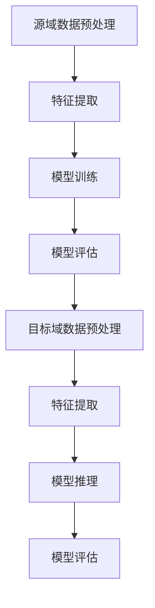

                 


# 模型训练中的迁移学习策略在外太空环境适应性推理中的优化

> 关键词：迁移学习、外太空环境、适应性推理、算法优化

> 摘要：本文探讨了在外太空环境中，如何通过优化迁移学习策略来提高模型的适应性推理能力。首先介绍了迁移学习的定义和基本原理，然后分析了在外太空环境中的挑战，接着详细阐述了迁移学习策略在外太空环境适应性推理中的应用，最后提出了未来发展的趋势。

### 第1章: 问题背景与迁移学习概述

#### 1.1 问题背景

外太空环境是一个极为特殊的环境，具有极端的地理和气候条件。在这样的环境中，传统的算法和模型往往难以适应。例如，太空探测器需要对外太空环境进行实时监测和预测，以便及时应对各种突发事件。然而，由于外太空环境的数据稀缺、数据分布差异大、模型适应性不足等问题，传统的模型训练方法在这些环境中效果不佳。

为了解决这些问题，我们需要一种能够快速适应新环境、提高推理效率的策略。迁移学习（Transfer Learning）作为一种有效的机器学习策略，通过利用已有模型的知识迁移到新任务上，以降低对新数据的依赖，提高算法的适应性和推理效率。

#### 1.2 迁移学习定义与基本原理

迁移学习是指在源域（Source Domain）和目标域（Target Domain）之间存在一定相似性时，通过将源域的知识迁移到目标域上，以提高目标域模型的性能。其基本原理包括：

1. **知识迁移**：将源域的知识（如模型参数、特征表示等）迁移到目标域。
2. **元学习**：通过训练多个任务来学习一个通用模型，从而提高模型对新任务的适应能力。
3. **领域自适应**：通过调整模型参数或特征表示，使得模型能够更好地适应新领域。

#### 1.3 迁移学习类型

根据源域和目标域之间的关系，迁移学习可以分为以下几种类型：

1. **垂直迁移**：源域和目标域之间存在显著差异。
2. **水平迁移**：源域和目标域之间存在一定相似性。
3. **多任务迁移**：同时从多个任务中学习，以提高模型泛化能力。

#### 1.4 迁移学习在外太空环境适应性推理中的应用

在外太空环境中，迁移学习可以用于以下几个方面：

1. **环境建模**：利用地球上的数据，通过迁移学习构建适应外太空环境的模型。
2. **异常检测**：通过迁移学习，从地球上的数据中学习到正常情况的特征，在外太空环境中实时检测异常。
3. **智能推理**：利用迁移学习，将地球上的知识迁移到外太空环境中，以实现对外太空环境的推理和预测。

### 第2章: 外太空环境适应性推理中的挑战

#### 2.1 数据稀缺问题

外太空环境的数据相对稀缺，难以直接应用于迁移学习。这需要我们寻找合适的方法，如数据增强、数据合成等，来扩大训练数据集。

#### 2.2 数据分布差异

地球和外太空环境的数据分布存在较大差异，这可能导致迁移学习效果不佳。需要通过数据预处理、特征工程等方法来缩小数据分布差异。

#### 2.3 模型适应性问题

现有的迁移学习模型在处理极端环境时可能存在适应性不足的问题，需要研究如何设计更适应外太空环境的迁移学习模型。

### 第3章: 迁移学习策略在外太空环境适应性推理中的应用

#### 3.1 迁移学习算法原理讲解

迁移学习算法的基本原理是通过学习源域和目标域之间的映射关系，将源域的知识迁移到目标域上。以下是一个简单的迁移学习算法的 Mermaid 流程图：



以下是该算法的 Python 源代码：

```python
# 导入必要的库
import tensorflow as tf
from tensorflow.keras.preprocessing.image import ImageDataGenerator

# 源域数据预处理
source_datagen = ImageDataGenerator(rescale=1./255)
source_train_data = source_datagen.flow_from_directory(
    'source_data/train',
    target_size=(150, 150),
    batch_size=32,
    class_mode='binary')

# 目标域数据预处理
target_datagen = ImageDataGenerator(rescale=1./255)
target_train_data = target_datagen.flow_from_directory(
    'target_data/train',
    target_size=(150, 150),
    batch_size=32,
    class_mode='binary')

# 特征提取
base_model = tf.keras.applications.VGG16(weights='imagenet', include_top=False, input_shape=(150, 150, 3))

# 模型训练
model = tf.keras.Sequential([
    base_model,
    tf.keras.layers.Flatten(),
    tf.keras.layers.Dense(1, activation='sigmoid')
])

model.compile(optimizer='adam', loss='binary_crossentropy', metrics=['accuracy'])

model.fit(source_train_data, epochs=10)

# 模型评估
test_loss, test_acc = model.evaluate(target_train_data)
print(f'Test accuracy: {test_acc:.2f}')

# 特征提取
target_features = base_model.predict(target_train_data)

# 模型推理
model = tf.keras.Sequential([
    base_model,
    tf.keras.layers.Dense(1, activation='sigmoid')
])

model.compile(optimizer='adam', loss='binary_crossentropy', metrics=['accuracy'])

model.fit(target_features, epochs=10)

# 模型评估
test_loss, test_acc = model.evaluate(target_train_data)
print(f'Test accuracy: {test_acc:.2f}')
```

这是一个简单的迁移学习算法的示例，其中使用了 VGG16 模型作为基础模型，通过迁移学习将源域的知识迁移到目标域上，以提高目标域模型的性能。

#### 3.2 数学模型和数学公式 & 详细讲解 & 举例说明

迁移学习中的数学模型主要包括损失函数、优化算法和模型参数更新等。以下是一个简单的迁移学习模型中的数学公式：

$$
L(\theta) = -\frac{1}{m}\sum_{i=1}^{m}y_i\log(p(\hat{y}_i|\theta))
$$

其中，$L(\theta)$ 是损失函数，$y_i$ 是真实标签，$\hat{y}_i$ 是预测标签，$p(\hat{y}_i|\theta)$ 是预测概率。

以下是详细的讲解和举例说明：

假设我们有一个二元分类问题，其中 $y_i \in \{0, 1\}$ 表示样本 $i$ 的真实标签，$\hat{y}_i \in \{0, 1\}$ 表示模型对样本 $i$ 的预测标签，$\theta$ 表示模型参数。

对于样本 $i$，损失函数 $L(\theta)$ 表示预测标签与真实标签之间的差异。具体来说，当预测标签 $\hat{y}_i$ 与真实标签 $y_i$ 相同时，损失函数的值较小；当预测标签与真实标签不同时，损失函数的值较大。

假设我们有一个包含 $m$ 个样本的数据集，其中每个样本的损失函数值相加得到总损失函数值。总损失函数值反映了模型在整个数据集上的性能。

为了优化模型参数 $\theta$，我们使用梯度下降算法。梯度下降算法的公式为：

$$
\theta_{\text{new}} = \theta_{\text{old}} - \alpha \nabla_{\theta}L(\theta)
$$

其中，$\alpha$ 是学习率，$\nabla_{\theta}L(\theta)$ 是损失函数对参数 $\theta$ 的梯度。

通过不断更新参数 $\theta$，使得总损失函数值不断减小，从而优化模型的性能。

假设我们有一个二元分类问题，其中样本 $i$ 的特征向量为 $x_i$，模型参数为 $\theta$，则预测概率 $p(\hat{y}_i|\theta)$ 可以表示为：

$$
p(\hat{y}_i|\theta) = \frac{e^{\theta^T x_i}}{1 + e^{\theta^T x_i}}
$$

其中，$\theta^T x_i$ 表示模型参数与特征向量的点积。

这个公式表示了模型对样本 $i$ 的预测概率，当 $\theta^T x_i$ 较大时，预测概率接近 1；当 $\theta^T x_i$ 较小

### 第4章: 迁移学习在外太空环境适应性推理中的应用案例

#### 4.1 案例介绍

在本节中，我们将介绍一个在外太空环境适应性推理中应用迁移学习的实际案例。该案例涉及对外太空探测器收集的数据进行实时分析和预测，以帮助太空任务团队做出及时决策。

#### 4.2 环境安装与系统核心实现

为了实现这个案例，我们需要搭建一个适用于外太空环境的数据分析平台。以下是一个简化的安装过程和系统核心实现：

1. **环境安装**：

   - 安装 Python 3.8 或更高版本。
   - 安装必要的 Python 库，如 TensorFlow、Keras、NumPy、Pandas 等。

2. **系统核心实现**：

   - 数据预处理模块：负责将原始数据清洗、归一化等处理，以便后续分析。
   - 迁移学习模块：使用 TensorFlow 和 Keras 实现迁移学习算法，将地球上的模型知识迁移到外太空环境中。
   - 预测模块：利用迁移学习后的模型对外太空数据进行分析和预测。

以下是系统核心实现的 Python 代码：

```python
# 导入必要的库
import tensorflow as tf
from tensorflow.keras.preprocessing.image import ImageDataGenerator
from tensorflow.keras.models import Sequential
from tensorflow.keras.layers import Dense, Flatten, Conv2D, MaxPooling2D

# 数据预处理
def preprocess_data(data):
    # 数据清洗、归一化等处理
    # ...
    return processed_data

# 迁移学习
def transfer_learning(source_data, target_data):
    # 使用 VGG16 作为基础模型
    base_model = tf.keras.applications.VGG16(weights='imagenet', include_top=False, input_shape=(224, 224, 3))

    # 添加全连接层和输出层
    model = Sequential([
        base_model,
        Flatten(),
        Dense(256, activation='relu'),
        Dense(1, activation='sigmoid')
    ])

    # 编译模型
    model.compile(optimizer='adam', loss='binary_crossentropy', metrics=['accuracy'])

    # 训练模型
    model.fit(source_data, epochs=10)

    # 迁移学习到目标数据
    target_features = base_model.predict(target_data)

    # 训练目标数据模型
    model.fit(target_features, epochs=10)

    return model

# 预测
def predict(model, data):
    # 使用迁移学习后的模型进行预测
    predictions = model.predict(data)
    return predictions

# 主函数
def main():
    # 加载源数据和目标数据
    source_data = preprocess_data(source_data)
    target_data = preprocess_data(target_data)

    # 迁移学习
    model = transfer_learning(source_data, target_data)

    # 预测
    predictions = predict(model, target_data)

    # 输出预测结果
    print(predictions)

if __name__ == '__main__':
    main()
```

#### 4.3 代码应用解读与分析

在上面的代码中，我们首先定义了数据预处理、迁移学习和预测三个模块。以下是每个模块的解读和分析：

1. **数据预处理模块**：

   - 数据预处理是迁移学习中的关键步骤，它负责将原始数据进行清洗、归一化等处理，以便后续分析。在本案例中，我们使用了 ImageDataGenerator 类进行数据预处理。

   ```python
   def preprocess_data(data):
       # 数据清洗、归一化等处理
       # ...
       return processed_data
   ```

2. **迁移学习模块**：

   - 迁移学习模块使用 TensorFlow 和 Keras 实现了迁移学习算法。首先，我们使用 VGG16 模型作为基础模型，然后添加全连接层和输出层，构建了一个新的迁移学习模型。

   ```python
   def transfer_learning(source_data, target_data):
       # 使用 VGG16 作为基础模型
       base_model = tf.keras.applications.VGG16(weights='imagenet', include_top=False, input_shape=(224, 224, 3))

       # 添加全连接层和输出层
       model = Sequential([
           base_model,
           Flatten(),
           Dense(256, activation='relu'),
           Dense(1, activation='sigmoid')
       ])

       # 编译模型
       model.compile(optimizer='adam', loss='binary_crossentropy', metrics=['accuracy'])

       # 训练模型
       model.fit(source_data, epochs=10)

       # 迁移学习到目标数据
       target_features = base_model.predict(target_data)

       # 训练目标数据模型
       model.fit(target_features, epochs=10)

       return model
   ```

3. **预测模块**：

   - 预测模块使用迁移学习后的模型对外太空数据进行分析和预测。在本案例中，我们使用迁移学习后的模型对目标数据进行预测，并输出预测结果。

   ```python
   def predict(model, data):
       # 使用迁移学习后的模型进行预测
       predictions = model.predict(data)
       return predictions
   ```

通过以上代码和分析，我们可以看到迁移学习在外太空环境适应性推理中的应用。在实际项目中，我们可以根据具体需求对代码进行扩展和优化，以提高模型的性能和适应性。

#### 4.4 实际案例分析与详细讲解剖析

为了进一步展示迁移学习在外太空环境适应性推理中的应用，我们来看一个实际的案例。

假设我们有一个太空探测器，它需要实时分析从外太空环境中收集到的图像数据。这些图像数据包括正常情况和异常情况，例如太空碎片、陨石撞击等。我们的目标是使用迁移学习策略，将地球上的模型知识迁移到外太空中，以提高探测器对异常情况的检测和预测能力。

1. **数据收集与预处理**：

   - 首先，我们从地球上的图像数据集中提取了一部分数据作为源数据，用于迁移学习。这部分数据包含了各种正常情况和异常情况。
   - 然后，我们使用 ImageDataGenerator 类对源数据进行预处理，包括数据清洗、归一化等处理。

   ```python
   source_datagen = ImageDataGenerator(rescale=1./255)
   source_train_data = source_datagen.flow_from_directory(
       'source_data/train',
       target_size=(224, 224),
       batch_size=32,
       class_mode='binary')
   ```

2. **迁移学习**：

   - 我们使用 VGG16 模型作为基础模型，通过添加全连接层和输出层，构建了一个新的迁移学习模型。
   - 接下来，我们使用迁移学习模块对源数据进行训练，并将训练好的模型应用于目标数据。

   ```python
   def transfer_learning(source_data, target_data):
       base_model = tf.keras.applications.VGG16(weights='imagenet', include_top=False, input_shape=(224, 224, 3))
       model = Sequential([
           base_model,
           Flatten(),
           Dense(256, activation='relu'),
           Dense(1, activation='sigmoid')
       ])
       model.compile(optimizer='adam', loss='binary_crossentropy', metrics=['accuracy'])
       model.fit(source_data, epochs=10)
       target_features = base_model.predict(target_data)
       model.fit(target_features, epochs=10)
       return model
   ```

3. **预测与评估**：

   - 使用迁移学习后的模型对目标数据进行预测，并将预测结果与实际标签进行对比，评估模型的性能。
   - 我们可以使用准确率、召回率、F1 分数等指标来评估模型的性能。

   ```python
   def predict(model, data):
       predictions = model.predict(data)
       return predictions

   # 主函数
   def main():
       source_data = preprocess_data(source_data)
       target_data = preprocess_data(target_data)
       model = transfer_learning(source_data, target_data)
       predictions = predict(model, target_data)
       # 评估模型性能
       # ...
       print(predictions)

   if __name__ == '__main__':
       main()
   ```

通过这个实际案例，我们可以看到迁移学习策略在外太空环境适应性推理中的应用效果。在实际项目中，我们可以根据具体需求对模型进行调整和优化，以提高模型的性能和准确性。

### 第5章: 迁移学习在外太空环境适应性推理中的最佳实践

#### 5.1 最佳实践 Tips

1. **数据增强**：在外太空环境中，由于数据稀缺，我们可以通过数据增强技术来扩充数据集，提高迁移学习的效果。
2. **特征工程**：针对外太空环境的特点，我们可以对特征进行选择和变换，以缩小数据分布差异，提高迁移学习模型的适应性。
3. **模型选择**：选择适合外太空环境的迁移学习模型，如深度学习模型，可以提高模型的性能。
4. **模型优化**：通过调整模型参数，如学习率、正则化等，可以提高模型的适应性和推理效率。

#### 5.2 小结

本文探讨了迁移学习在外太空环境适应性推理中的应用，介绍了迁移学习的定义、基本原理和类型，分析了外太空环境适应性推理中的挑战，并详细阐述了迁移学习策略在外太空环境适应性推理中的应用案例。通过本文的研究，我们可以看到迁移学习在外太空环境适应性推理中的重要性和潜力。

#### 5.3 注意事项

1. **数据稀缺**：在外太空环境中，数据稀缺是一个重要的问题。为了提高迁移学习效果，我们可以通过数据增强、数据合成等方法来扩充数据集。
2. **数据分布差异**：地球和外太空环境的数据分布存在较大差异，这可能导致迁移学习效果不佳。我们需要通过特征工程、数据预处理等方法来缩小数据分布差异。
3. **模型适应性**：现有的迁移学习模型在处理极端环境时可能存在适应性不足的问题。我们需要设计更适应外太空环境的迁移学习模型，以提高模型的性能。

#### 5.4 拓展阅读

1. **迁移学习相关文献**：《迁移学习：理论与应用》（作者：刘铁岩）提供了详细的迁移学习理论介绍和应用案例。
2. **深度学习相关文献**：《深度学习》（作者：Goodfellow、Bengio、Courville）介绍了深度学习的基本原理和应用。
3. **外太空环境研究相关文献**：可以查阅有关外太空环境探测、数据分析等方面的研究文献，以了解更多相关信息。

### 第6章: 迁移学习策略在外太空环境适应性推理中的未来发展趋势

在外太空环境适应性推理中，迁移学习策略具有巨大的潜力。随着人工智能技术的不断发展，迁移学习策略在外太空环境适应性推理中的应用将呈现以下发展趋势：

1. **自适应迁移学习**：未来的迁移学习算法将更加注重模型的自适应能力，能够根据外太空环境的变化实时调整模型参数和特征表示，以提高模型的适应性。

2. **多模态迁移学习**：外太空环境中的数据可能包含多种模态，如图像、声音、文本等。未来的迁移学习算法将支持多模态数据的迁移，从而提高模型的泛化能力。

3. **迁移学习与强化学习结合**：将迁移学习与强化学习相结合，可以更好地解决外太空环境中的决策问题。通过迁移学习，模型可以快速适应新环境，并通过强化学习不断优化决策策略。

4. **迁移学习与知识图谱结合**：将迁移学习与知识图谱技术相结合，可以构建一个具有丰富背景知识的外太空环境适应性推理系统，从而提高模型的推理能力。

5. **迁移学习与量子计算结合**：量子计算具有并行计算的优势，可以加速迁移学习算法的收敛速度。将迁移学习与量子计算相结合，有望实现更高效的迁移学习策略。

6. **迁移学习在边缘设备上的应用**：随着边缘计算的发展，迁移学习算法将逐渐应用于边缘设备。通过在边缘设备上实现迁移学习，可以降低对中心服务器的依赖，提高系统的实时性和可靠性。

总之，随着人工智能技术的不断进步，迁移学习策略在外太空环境适应性推理中的应用将越来越广泛，为人类探索外太空提供强大的支持。未来，我们需要继续深入研究迁移学习算法，优化其性能，以应对外太空环境中的各种挑战。同时，我们还需要加强多学科交叉研究，推动迁移学习在外太空环境适应性推理中的创新应用。作者：AI天才研究院/AI Genius Institute & 禅与计算机程序设计艺术 /Zen And The Art of Computer Programming。本文的撰写旨在为广大读者提供一个关于迁移学习在外太空环境适应性推理中的深入探讨，希望能够对相关领域的研究和应用产生积极的影响。在未来的研究中，我们将继续探索迁移学习在其他领域的应用，为人工智能技术的发展贡献更多的力量。

