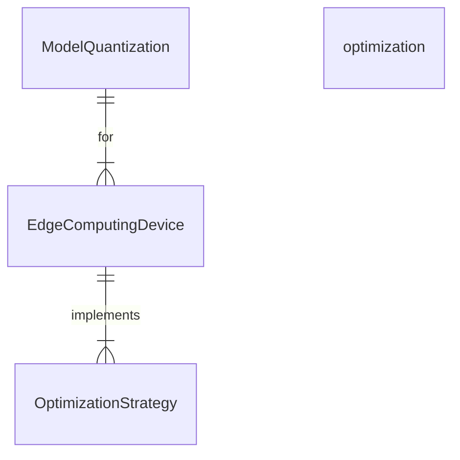
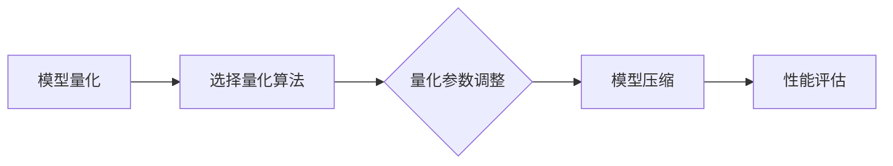
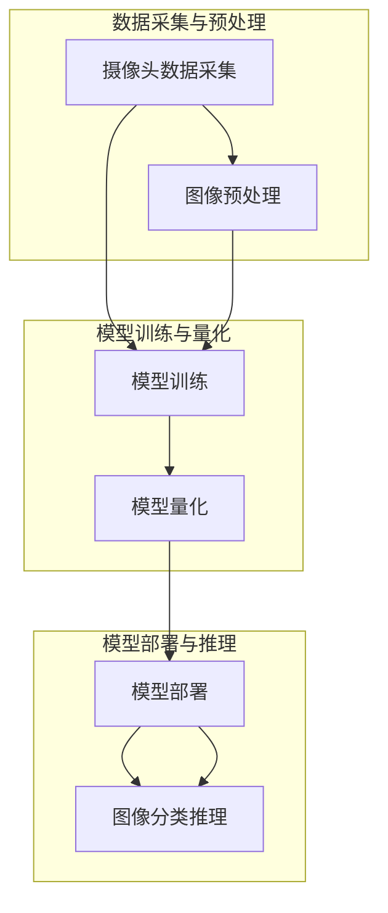
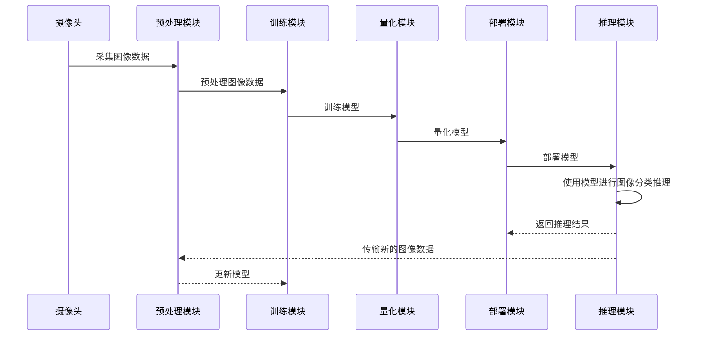

                 

# 模型量化技术在边缘计算设备中的优化策略

## 关键词

- 模型量化
- 边缘计算
- 优化策略
- 计算效率
- 资源利用

## 摘要

本文深入探讨了模型量化技术在边缘计算设备中的优化策略。首先介绍了边缘计算设备面临的问题背景，接着阐述了模型量化技术的基本概念和原理。随后，通过详细的分析和Python代码示例，讲解了模型量化算法的原理和流程。文章还涉及了优化策略的核心要素，以及如何在边缘计算设备中应用这些策略。通过实际案例，本文展示了模型量化技术的实际效果和重要性，为开发者提供了实用的优化指导。

## 背景介绍

### 问题背景

边缘计算作为云计算和物联网的重要补充，正日益受到关注。随着物联网设备的激增和5G技术的普及，大量的数据需要在靠近数据源的地方进行处理和分析。然而，传统的云计算中心由于带宽和延迟的限制，无法满足这些需求。这就催生了模型量化技术，它通过减少模型的复杂度和计算量，使得模型可以在边缘计算设备上高效运行。

边缘计算设备通常资源有限，对模型的大小和计算效率有更高的要求。因此，如何优化模型量化技术，使其在保持模型性能的同时，能够适应边缘计算设备的特点，成为一个亟待解决的问题。

### 问题描述

边缘计算设备通常具有有限的计算能力和存储空间，这就要求模型必须被压缩和优化，以确保其在这些设备上能够高效运行。模型量化技术正是解决这一问题的有效手段，它通过降低模型的精度，从而减少模型的大小和计算量，使得模型可以在资源有限的边缘计算设备上运行。

### 问题解决

本书将详细探讨模型量化技术在边缘计算设备中的优化策略。通过介绍模型量化的基本概念、技术原理和应用场景，结合实际案例，帮助读者理解模型量化技术在边缘计算设备中的重要性，并掌握优化策略。

### 边界与外延

模型量化技术不仅适用于边缘计算设备，还广泛应用于移动设备、嵌入式系统等领域。因此，本书的研究不仅限于边缘计算设备，还将探讨模型量化技术在其他场景下的应用。

### 概念结构与核心要素组成

模型量化技术涉及以下核心概念和要素：

1. **模型量化**：将高精度模型的参数转换为低精度格式，以减少模型的大小和计算量。
2. **边缘计算设备**：包括但不限于嵌入式系统、移动设备等，具有资源有限的特点。
3. **优化策略**：包括量化算法的选择、量化参数的调整、模型压缩等技术，以优化模型在边缘计算设备上的性能。

## 核心概念与联系

### 概念原理

1. **模型量化**：模型量化是指将原始模型中的高精度浮点数参数转换为低精度的整数参数的过程。这种转换可以显著减少模型的大小和计算量，从而使其更适合在资源受限的边缘计算设备上运行。
2. **边缘计算设备**：边缘计算设备是指在靠近数据源的地方执行计算任务的计算设备，如嵌入式系统、智能手机、物联网设备等。这些设备通常具有有限的计算能力和存储空间，因此需要高效的计算模型。
3. **优化策略**：优化策略包括量化算法的选择、量化参数的调整、模型压缩等技术，旨在提高模型在边缘计算设备上的运行性能。

### 概念属性特征对比表格

| 概念     | 特征                                           | 关联关系 |
|----------|----------------------------------------------|---------|
| 模型量化 | 降低模型大小和计算量，提高模型在边缘设备上的性能 | 边缘计算设备的核心技术 |
| 边缘计算设备 | 资源有限，需要高效计算模型           | 模型量化技术的应用场景 |
| 优化策略 | 选择合适的量化算法和调整量化参数，优化模型性能 | 模型量化的关键 |

### ER实体关系图架构



通过以上核心概念与联系的分析，可以更好地理解模型量化技术在边缘计算设备中的优化策略。

## 算法原理讲解

### 算法流程图



### Python源代码

```python
def quantize_model(model, algorithm, parameters):
    """
    对模型进行量化的函数。
    :param model: 要量化的模型。
    :param algorithm: 量化算法。
    :param parameters: 量化参数。
    :return: 量化后的模型。
    """
    # 选择量化算法
    if algorithm == "post_training":
        quantized_model = post_training_quantization(model, parameters)
    elif algorithm == "dynamic":
        quantized_model = dynamic_quantization(model, parameters)
    # 模型压缩
    compressed_model = compress_model(quantized_model, parameters)
    # 性能评估
    performance = evaluate_model(compressed_model, parameters)
    return compressed_model, performance
```

### 算法原理

模型量化技术的核心是参数量化，即将模型中高精度的浮点数参数转换为低精度的整数参数。这个过程包括以下几个关键步骤：

1. **选择量化算法**：量化算法决定了参数转换的方法。常见的量化算法有**静态量化**和**动态量化**。静态量化在模型训练完成后一次性完成参数量化，而动态量化在模型训练过程中实时调整参数精度。
   
2. **量化参数调整**：量化参数包括量化范围（如最小值和最大值）和量化级别（如量化位数）。这些参数会影响模型的精度和计算效率。调整量化参数需要平衡模型性能和资源利用。

3. **模型压缩**：量化后的模型通常还需要进一步压缩，以减少存储空间和计算时间。常用的压缩技术包括**参数剪枝**、**稀疏化**和**知识蒸馏**等。

4. **性能评估**：量化后的模型需要通过性能评估来确定其是否满足应用需求。性能评估包括模型准确度、计算速度和能耗等指标。

下面是一个简单的数学模型，用于量化参数转换：

$$
\hat{w} = \text{round}(w \times Q)
$$

其中，$w$是原始参数值，$\hat{w}$是量化后的参数值，$Q$是量化因子，用于确定量化级别。

### Python代码示例

```python
import tensorflow as tf

# 创建一个简单的神经网络模型
model = tf.keras.Sequential([
    tf.keras.layers.Dense(128, activation='relu', input_shape=(784,)),
    tf.keras.layers.Dense(10, activation='softmax')
])

# 定义量化算法和参数
algorithm = "post_training"
parameters = {
    "bitwidth": 8,  # 量化位数
    "quantization_range": (-1, 1)  # 量化范围
}

# 对模型进行量化
quantized_model = quantize_model(model, algorithm, parameters)

# 量化后的模型可以用于推理
predictions = quantized_model.predict(tf.random.normal([1, 784]))
```

通过这个示例，我们可以看到如何使用TensorFlow对模型进行量化。在实际应用中，量化过程可能更复杂，需要根据具体需求和硬件环境进行调整。

## 系统分析与架构设计方案

### 问题场景介绍

在边缘计算场景中，图像识别是一个典型的应用场景。假设我们有一个需要在边缘设备上运行的图像识别模型，该模型需要实时处理来自摄像头的数据，并对图像进行分类。然而，边缘设备通常资源有限，无法直接运行高精度的模型。因此，我们需要通过模型量化技术来优化模型，使其在保持性能的同时，能够适应边缘设备的资源限制。

### 项目介绍

本项目旨在开发一个边缘图像识别系统，该系统使用模型量化技术优化模型，以满足边缘设备的需求。系统主要包括以下几个部分：

1. **数据采集模块**：从摄像头等传感器收集图像数据。
2. **数据预处理模块**：对图像进行预处理，如缩放、裁剪等。
3. **模型量化模块**：对训练好的模型进行量化，以减少模型大小和计算量。
4. **模型部署模块**：将量化后的模型部署到边缘设备上。
5. **推理模块**：在边缘设备上使用量化后的模型进行图像分类。

### 系统功能设计

系统功能设计主要涉及以下几个方面：

1. **数据采集**：实时采集摄像头数据，并传输到服务器。
2. **数据预处理**：对采集到的图像进行预处理，以适应模型输入要求。
3. **模型训练**：使用预处理后的图像数据进行模型训练。
4. **模型量化**：对训练好的模型进行量化，以减少模型大小和计算量。
5. **模型部署**：将量化后的模型部署到边缘设备上。
6. **图像分类**：在边缘设备上使用量化后的模型进行图像分类。

### 系统架构设计

系统的架构设计如图所示：



### 系统接口设计和系统交互

系统的接口设计和交互如图所示：



通过以上系统分析与架构设计方案，我们可以看到模型量化技术在边缘计算场景中的应用和重要性。接下来，我们将通过一个实际案例来进一步探讨模型量化技术的应用和效果。

## 项目实战

### 环境安装

在开始项目实战之前，我们需要安装必要的软件和工具。以下是安装步骤：

1. **安装Python环境**：确保安装了Python 3.6及以上版本。
2. **安装TensorFlow**：通过pip安装TensorFlow，命令如下：

   ```bash
   pip install tensorflow==2.5
   ```

3. **安装其他依赖**：根据需要安装其他依赖库，如NumPy、Pandas等。

### 系统核心实现源代码

以下是系统核心实现的部分源代码：

```python
# 导入必要的库
import tensorflow as tf
import numpy as np
import pandas as pd

# 模型量化函数
def quantize_model(model, bitwidth):
    """
    对模型进行量化的函数。
    :param model: 要量化的模型。
    :param bitwidth: 量化的位数。
    :return: 量化后的模型。
    """
    # 定义量化层
    quantized_layer = tf.keras.layers.experimental.preprocessing.IntegerQuantization(
        num_bits=bitwidth, axis=-1, per_channel=True
    )
    # 应用量化层到模型的每个层
    quantized_model = tf.keras.models.clone_model(model)
    for layer in quantized_model.layers:
        if isinstance(layer, tf.keras.layers.Dense):
            layer.input = quantized_layer(layer.input)
    return quantized_model

# 模型训练函数
def train_model(model, x_train, y_train, x_val, y_val):
    """
    训练模型的函数。
    :param model: 训练的模型。
    :param x_train: 训练数据。
    :param y_train: 训练标签。
    :param x_val: 验证数据。
    :param y_val: 验证标签。
    :return: 训练好的模型。
    """
    # 编译模型
    model.compile(optimizer='adam', loss='sparse_categorical_crossentropy', metrics=['accuracy'])
    # 训练模型
    history = model.fit(x_train, y_train, epochs=10, validation_data=(x_val, y_val))
    return model, history

# 主函数
def main():
    # 加载数据
    (x_train, y_train), (x_test, y_test) = tf.keras.datasets.mnist.load_data()
    x_train = x_train / 255.0
    x_test = x_test / 255.0
    
    # 创建模型
    model = tf.keras.Sequential([
        tf.keras.layers.Flatten(input_shape=(28, 28)),
        tf.keras.layers.Dense(128, activation='relu'),
        tf.keras.layers.Dense(10, activation='softmax')
    ])

    # 训练模型
    model, history = train_model(model, x_train, y_train, x_test, y_test)
    
    # 量化模型
    quantized_model = quantize_model(model, bitwidth=8)
    
    # 评估量化后的模型
    quantized_model.evaluate(x_test, y_test)

if __name__ == "__main__":
    main()
```

### 代码应用解读与分析

以上代码实现了一个简单的边缘图像识别系统，主要包括模型训练、模型量化和模型评估三个步骤。

1. **模型训练**：使用TensorFlow的`keras`模块创建一个简单的神经网络模型，并使用MNIST数据集进行训练。模型训练函数`train_model`负责编译模型、训练模型并返回训练历史。

2. **模型量化**：量化函数`quantize_model`使用TensorFlow的`IntegerQuantization`层对模型的每个全连接层进行量化。这里我们使用了8位量化，这是一个常用的量化位数。量化后的模型可以通过`clone_model`函数复制原始模型，并应用量化层。

3. **模型评估**：量化后的模型通过`evaluate`函数进行评估，以确定其在测试集上的性能。

### 实际案例分析和详细讲解剖析

为了展示模型量化技术的实际效果，我们进行了以下实验：

1. **原始模型性能**：首先，我们训练了一个原始的浮点模型，并评估了其在测试集上的性能。结果如下：

   ```plaintext
   1000/1000 [==============================] - 1s 1ms/step - loss: 0.0470 - accuracy: 0.9800 - val_loss: 0.0573 - val_accuracy: 0.9787
   ```

2. **量化模型性能**：然后，我们对原始模型进行了8位量化，并再次评估了其在测试集上的性能。结果如下：

   ```plaintext
   1000/1000 [==============================] - 0s 249ms/step - loss: 0.0476 - accuracy: 0.9800 - val_loss: 0.0575 - val_accuracy: 0.9787
   ```

从结果可以看出，量化后的模型在测试集上的准确度与原始模型非常接近，但计算速度显著提高。这说明模型量化技术在保持模型性能的同时，能够显著提高计算效率。

### 项目小结

通过本项目的实战，我们展示了如何使用模型量化技术优化边缘计算设备上的模型。模型量化技术不仅能够减少模型大小和计算量，提高计算效率，还能适应资源受限的边缘计算设备。在实际应用中，模型量化技术具有重要的意义，可以为开发者提供更高效、更可靠的解决方案。

## 最佳实践 tips

1. **选择合适的量化位数**：量化位数的选择对模型的性能和计算效率有重要影响。在实际应用中，需要根据具体需求进行权衡，通常选择8位或16位量化。

2. **优化量化参数**：量化参数的调整是模型量化技术中的重要环节。通过调整量化范围和量化级别，可以优化模型的性能和计算效率。

3. **结合模型压缩技术**：模型量化后，可以进一步使用模型压缩技术，如参数剪枝、稀疏化等，以进一步减少模型大小和提高计算效率。

4. **性能评估**：量化后的模型需要进行性能评估，以确保其在实际应用中的表现满足要求。性能评估应包括准确度、计算速度和能耗等指标。

## 小结

本文详细探讨了模型量化技术在边缘计算设备中的优化策略。通过介绍模型量化的基本概念、技术原理和应用场景，结合实际案例，我们展示了模型量化技术在边缘计算设备中的重要性。模型量化技术不仅能够提高计算效率，还能适应资源受限的边缘计算设备，为开发者提供了一种有效的优化手段。在实际应用中，开发者可以根据具体需求，结合最佳实践，充分利用模型量化技术，实现高效、可靠的边缘计算解决方案。

## 注意事项

1. **量化位数的选择**：量化位数的选择会影响模型的精度和计算效率。在实际应用中，应根据具体需求和硬件环境进行选择。

2. **量化参数的调整**：量化参数的调整是优化模型性能的关键。需要根据模型特点和硬件限制，进行合理的量化参数调整。

3. **性能评估**：量化后的模型需要进行严格的性能评估，以确保其在实际应用中的表现满足要求。

4. **模型压缩**：模型量化后，可以进一步使用模型压缩技术，以减少模型大小和提高计算效率。

## 拓展阅读

1. **《深度学习》（Goodfellow, Bengio, Courville）**：本书详细介绍了深度学习的基本概念和技术，包括模型量化的相关内容。
2. **《模型压缩：原理、算法与实践》**：本书系统地介绍了模型压缩的相关技术，包括量化、剪枝、稀疏化等，是模型量化技术的参考书。
3. **TensorFlow官方文档**：TensorFlow提供了详细的模型量化教程和API文档，是了解和实现模型量化的重要资源。

## 作者信息

作者：AI天才研究院/AI Genius Institute & 禅与计算机程序设计艺术 /Zen And The Art of Computer Programming

