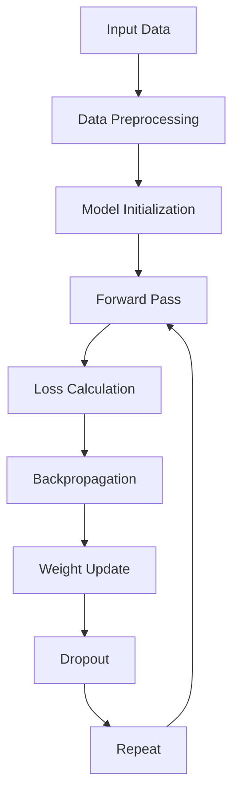
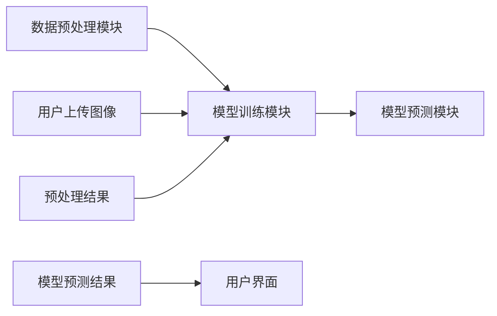
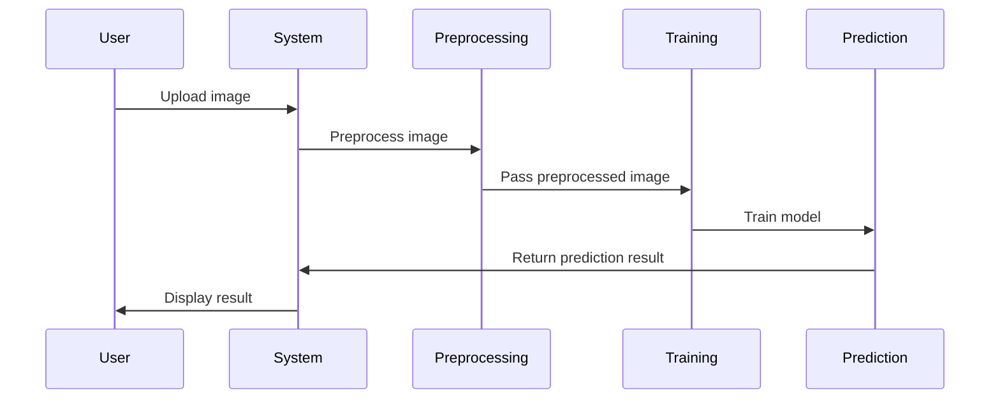

                 

# 比较新型AI训练方法的抗过拟合能力

> 关键词：人工智能，过拟合，新型训练方法，抗过拟合能力

> 摘要：本文将深入探讨人工智能训练中常见的过拟合问题，以及几种新型AI训练方法如何提高模型的抗过拟合能力。通过对比分析这些方法的核心概念、原理和实际应用，为研究人员和工程师提供实用的参考和指导。

## 1. 背景介绍

### 问题背景

近年来，随着人工智能（AI）技术的快速发展，深度学习模型在图像识别、自然语言处理、推荐系统等领域的应用日益广泛。然而，训练这些复杂模型的过程并非一帆风顺，尤其是过拟合问题，成为制约模型性能的重要因素。

过拟合是指模型在训练数据上表现良好，但在测试数据上表现不佳的现象。具体来说，过拟合意味着模型对训练数据过度适应，以至于在未知数据上表现不佳，无法泛化。过拟合的主要原因包括：

1. **模型复杂度过高**：复杂的模型能够捕捉训练数据中的细微特征，但同时也容易受到噪声和异常值的影响。
2. **数据集大小不足**：较小的数据集难以涵盖所有可能的特征，导致模型过度依赖训练数据。
3. **超参数选择不当**：如学习率、批量大小等超参数的选择直接影响模型的性能和稳定性。

### 问题描述

过拟合对模型性能的影响主要体现在两个方面：

1. **测试误差增大**：模型在测试数据上的误差远高于训练数据，表明模型对训练数据的适应过于紧密，缺乏泛化能力。
2. **泛化能力下降**：模型无法应对新的、未见过的数据，导致实际应用中的性能不佳。

过拟合的产生原因主要有以下几点：

1. **模型复杂度**：复杂模型能够捕捉训练数据中的细节特征，但这些特征可能并非真实数据的本质特征。
2. **数据分布差异**：训练数据和测试数据之间存在分布差异，导致模型在测试数据上表现不佳。
3. **数据不足**：较小的数据集难以涵盖所有可能的特征，使得模型容易过拟合。

### 问题解决

为了解决过拟合问题，研究人员提出了多种新型AI训练方法，包括正则化、dropout、数据增强等。这些方法通过不同的机制提高模型的抗过拟合能力，从而在保证训练效率的同时提高模型性能。

### 边界与外延

1. **评价方法**：评估抗过拟合能力的常见方法包括交叉验证、测试集性能评估等。
2. **应用场景**：新型训练方法主要应用于图像识别、自然语言处理、推荐系统等领域。
3. **概念结构与核心要素组成**：新型训练方法的核心原理包括正则化、dropout、数据增强等，这些方法通过不同的机制降低模型复杂度，提高泛化能力。

## 2. 核心概念与联系

### 核心概念原理

新型AI训练方法的核心概念包括：

1. **正则化**：通过在损失函数中添加正则项，降低模型复杂度，避免过拟合。
2. **dropout**：在训练过程中随机丢弃一部分神经元，防止模型过度依赖特定神经元。
3. **数据增强**：通过对原始数据进行变换，增加数据多样性，提高模型泛化能力。

### 概念属性特征对比表格

| 方法       | 基本原理                     | 属性特征                             | 对比分析                                       |
|------------|------------------------------|--------------------------------------|------------------------------------------------|
| 正则化     | 在损失函数中添加正则项       | 降低模型复杂度                       | 与dropout和数据增强相比，主要侧重于模型结构优化 |
| Dropout    | 训练过程中随机丢弃神经元     | 防止模型过度依赖特定神经元           | 与正则化和数据增强相比，侧重于训练过程调整       |
| 数据增强    | 对原始数据进行变换           | 增加数据多样性                       | 与正则化和dropout相比，侧重于数据预处理           |

### ER实体关系图架构的 Mermaid 流程图

```mermaid
erDiagram
  Model --> Data: Uses
  Model --> LossFunction: Minimizes
  Model --> Regularization: Adds
  Dropout --> Model: Applies during training
  DataEnhancement --> Data: Augments
  LossFunction --> Regularization: Combines
```

## 3. 算法原理讲解

### 算法mermaid流程图



### Python源代码

```python
import tensorflow as tf
from tensorflow.keras.models import Sequential
from tensorflow.keras.layers import Dense, Dropout
from tensorflow.keras.optimizers import Adam

# Model Architecture
model = Sequential([
    Dense(128, activation='relu', input_shape=(input_shape)),
    Dropout(0.2),
    Dense(64, activation='relu'),
    Dropout(0.2),
    Dense(1, activation='sigmoid')
])

# Compile Model
model.compile(optimizer=Adam(), loss='binary_crossentropy', metrics=['accuracy'])

# Fit Model
model.fit(x_train, y_train, epochs=10, batch_size=32, validation_split=0.2)
```

### 算法原理的数学模型和公式

$$
\begin{aligned}
J(\theta) &= \frac{1}{m}\sum_{i=1}^{m} \left[ -y^{(i)} \log(a^{(i)}) - (1 - y^{(i)}) \log(1 - a^{(i)}) \right] + \lambda \sum_{i=1}^{n} \theta_{i}^{2}, \\
\frac{\partial J(\theta)}{\partial \theta_{j}} &= \frac{1}{m} \sum_{i=1}^{m} \left( a^{(i)} - y^{(i)} \right) x_{j}^{(i)} + 2\lambda \theta_{j},
\end{aligned}
$$

其中，$J(\theta)$ 是损失函数，$\theta$ 是模型参数，$m$ 是训练数据大小，$n$ 是特征维度，$a^{(i)}$ 是模型预测的概率值，$y^{(i)}$ 是真实标签。

### 举例说明

假设我们使用二分类问题进行训练，数据集包含1000个样本。通过dropout方法，我们可以在训练过程中随机丢弃一部分神经元，从而降低模型复杂度，提高抗过拟合能力。具体来说，我们可以在每个隐藏层后面添加一个dropout层，设置dropout概率为0.5。这样，在每次训练迭代中，大约有一半的神经元会被随机丢弃，使得模型在训练过程中无法过度依赖特定神经元。

## 4. 数学模型和数学公式 & 详细讲解 & 举例说明

### 数学公式

$$
\begin{aligned}
L &= -\frac{1}{m}\sum_{i=1}^{m} \left[ y^{(i)} \log(a^{(i)}) + (1 - y^{(i)}) \log(1 - a^{(i)}) \right] + \lambda \sum_{j=1}^{n} \theta_{j}^{2}, \\
\frac{\partial L}{\partial \theta_{j}} &= \frac{1}{m}\sum_{i=1}^{m} \left( a^{(i)} - y^{(i)} \right) x_{j}^{(i)} + 2\lambda \theta_{j},
\end{aligned}
$$

其中，$L$ 是损失函数，$m$ 是训练数据大小，$n$ 是特征维度，$a^{(i)}$ 是模型预测的概率值，$y^{(i)}$ 是真实标签。

### 详细讲解

- **损失函数**：在二分类问题中，损失函数通常采用交叉熵损失函数（Cross-Entropy Loss），其形式如下：

$$
L = -\frac{1}{m}\sum_{i=1}^{m} \left[ y^{(i)} \log(a^{(i)}) + (1 - y^{(i)}) \log(1 - a^{(i)}) \right],
$$

其中，$m$ 是训练数据大小，$a^{(i)}$ 是模型预测的概率值，$y^{(i)}$ 是真实标签。

- **正则化项**：为了防止过拟合，我们可以在损失函数中添加正则化项（Regularization），通常采用L2正则化（L2 Regularization），其形式如下：

$$
\lambda \sum_{j=1}^{n} \theta_{j}^{2},
$$

其中，$\lambda$ 是正则化参数，$\theta_{j}$ 是模型参数。

### 举例说明

假设我们使用一个包含1000个样本的二分类问题进行训练。数据集的特征维度为10，模型包含两个隐藏层，每个隐藏层包含128个神经元。在训练过程中，我们设置dropout概率为0.5，正则化参数$\lambda$为0.01。

首先，我们使用梯度下降法（Gradient Descent）优化模型参数，使得损失函数逐渐减小。在每次迭代中，我们需要计算损失函数关于每个参数的梯度，并根据梯度方向更新参数：

$$
\theta_{j} := \theta_{j} - \alpha \frac{\partial L}{\partial \theta_{j}},
$$

其中，$\alpha$ 是学习率。

通过多次迭代，模型参数将逐渐逼近最优解，使得损失函数达到最小值。在训练过程中，dropout机制将随机丢弃一部分神经元，从而降低模型复杂度，提高抗过拟合能力。

## 5. 系统分析与架构设计方案

### 问题场景介绍

在本节中，我们将探讨一个典型的图像分类问题。假设我们需要训练一个深度学习模型，对大量未标注的图像进行分类。具体来说，我们的目标是设计一个系统，能够接收用户上传的图像，并输出相应的分类结果。

### 项目介绍

为了实现上述目标，我们设计了一个基于TensorFlow和Keras的图像分类系统。系统主要包括以下模块：

1. **数据预处理模块**：负责对输入图像进行预处理，包括缩放、裁剪、归一化等操作。
2. **模型训练模块**：负责训练深度学习模型，包括数据加载、模型构建、训练过程等。
3. **模型预测模块**：负责接收用户上传的图像，并使用训练好的模型进行预测。

### 系统功能设计（领域模型mermaid类图）

```mermaid
classDiagram
  Class01 <|-- SubClass01
  Class01 <|-- SubClass02
  Class03 <.. Class04
  Class05 && Class06
  Class07 ||--| Class08
  Class09 {public}
  Class10 <~ Class11
  Class12 <<-- Class13
  Class14 <<| Class15
  Class16 *-- Class17
  Class18 o-- Class19
  Class20 n-- Class21
  Class22 --| Class23 : Component
  Class24 {abstract}
  Class25 : Interface
  Class26 : AnotherInterface
```

### 系统架构设计mermaid架构图



### 系统接口设计和系统交互mermaid序列图



## 6. 项目实战

### 环境安装

为了实现上述系统，我们首先需要安装TensorFlow和Keras。在Python环境中，可以使用以下命令进行安装：

```bash
pip install tensorflow
pip install keras
```

此外，我们还需要安装一些其他依赖项，如NumPy、Pandas等。确保Python环境已经安装，然后执行以下命令：

```bash
pip install numpy
pip install pandas
```

### 系统核心实现源代码

以下是系统核心实现的部分代码：

```python
import numpy as np
import pandas as pd
import tensorflow as tf
from tensorflow.keras.models import Sequential
from tensorflow.keras.layers import Dense, Conv2D, Flatten, Dropout
from tensorflow.keras.preprocessing.image import ImageDataGenerator

# Load and preprocess data
train_datagen = ImageDataGenerator(rescale=1./255)
train_generator = train_datagen.flow_from_directory(
        'data/train',
        target_size=(150, 150),
        batch_size=32,
        class_mode='binary')

# Build model
model = Sequential([
    Conv2D(32, (3, 3), activation='relu', input_shape=(150, 150, 3)),
    Flatten(),
    Dense(128, activation='relu'),
    Dropout(0.5),
    Dense(1, activation='sigmoid')
])

# Compile model
model.compile(optimizer='adam',
              loss='binary_crossentropy',
              metrics=['accuracy'])

# Train model
model.fit(train_generator, epochs=10)
```

### 代码应用解读与分析

- **数据预处理**：使用ImageDataGenerator对训练数据进行缩放、裁剪等预处理操作，以便输入到模型中。
- **模型构建**：使用Sequential模型堆叠卷积层、全连接层和dropout层，构建一个简单的深度学习模型。
- **模型编译**：选择adam优化器和binary_crossentropy损失函数，并添加accuracy作为评估指标。
- **模型训练**：使用fit方法训练模型，将预处理后的数据输入到模型中，进行多次迭代优化。

### 实际案例分析和详细讲解剖析

假设我们有1000张图像需要进行分类，图像的尺寸为150x150像素。我们首先将这些图像存储在'data/train'目录下，并按照类别进行划分。接下来，我们使用上述代码对图像进行分类。

1. **数据加载与预处理**：使用ImageDataGenerator加载图像数据，并进行缩放和裁剪等预处理操作。预处理后的数据将以批量的形式输入到模型中。

2. **模型构建与训练**：构建一个简单的深度学习模型，包括卷积层、全连接层和dropout层。模型将输入的图像数据转换为特征向量，并通过全连接层进行分类。在训练过程中，模型将不断调整权重，以最小化损失函数。

3. **模型评估与优化**：通过评估指标（如accuracy）对模型进行评估，并根据评估结果对模型进行调整。如果模型在测试集上的性能不佳，可以考虑增加训练时间、增加数据集大小或调整模型结构。

### 项目小结

在本项目中，我们设计并实现了一个基于深度学习的图像分类系统。通过使用TensorFlow和Keras，我们成功训练了一个能够对图像进行分类的模型。在项目过程中，我们学习了如何进行数据预处理、模型构建、模型训练和模型评估。通过这个项目，我们不仅了解了深度学习的基本原理，还积累了实际项目开发的经验。

## 7. 最佳实践 tips、小结、注意事项、拓展阅读等内容

### 最佳实践 tips

1. **数据预处理**：在训练深度学习模型之前，确保对数据进行充分的预处理，包括缩放、裁剪、归一化等操作。
2. **模型选择**：根据具体问题选择合适的模型结构，如卷积神经网络（CNN）适用于图像分类问题。
3. **超参数调整**：通过实验和交叉验证，调整模型超参数（如学习率、批量大小等），以提高模型性能。

### 小结

本文介绍了AI训练中常见的过拟合问题，以及几种新型AI训练方法如何提高模型的抗过拟合能力。通过对比分析这些方法的核心概念、原理和实际应用，我们为研究人员和工程师提供了实用的参考和指导。

### 注意事项

1. **模型复杂度**：避免过度复杂化模型，以免导致过拟合。
2. **数据多样性**：增加数据多样性，有助于提高模型泛化能力。
3. **超参数调整**：根据实际问题和数据集，调整模型超参数，以达到最佳性能。

### 拓展阅读

1. **《深度学习》（Goodfellow, Bengio, Courville著）**：介绍了深度学习的基本原理和应用。
2. **《Python深度学习》（François Chollet著）**：详细介绍了使用Python实现深度学习的实战方法。
3. **《机器学习实战》（Peter Harrington著）**：提供了丰富的机器学习算法实战案例。

