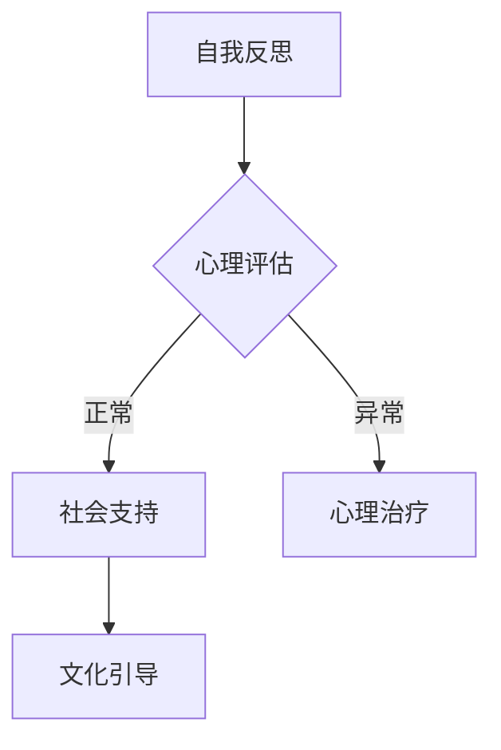
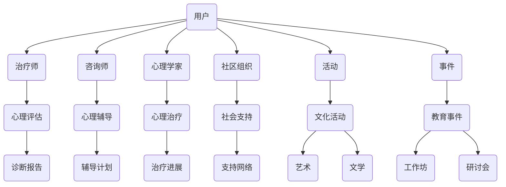

                 

# 消费主义下的意义危机：如何避免空虚感

> 关键词：消费主义、意义危机、空虚感、解决方案、心理干预、社会干预、文化干预

> 摘要：本文深入探讨了消费主义背景下人们普遍面临的空虚感问题，分析了其背后的原因和影响。通过具体的案例分析，提出了应对空虚感的多种策略和措施，旨在帮助读者在消费主义社会中找到真正的意义和幸福。

----------------------------------------------------------------

## 引言

随着全球经济的迅猛发展，消费主义文化在全球范围内迅速蔓延。人们追求物质享受和消费，不断购买和更新各种商品和服务。然而，在这种消费主义浪潮中，许多人却感到内心空虚，失去了生活的意义。本文将探讨消费主义下的意义危机，分析其背后的原因和影响，并提出具体的解决方案。

### 消费主义的兴起

消费主义是一种以物质消费为核心的文化现象，它起源于18世纪的工业革命。随着生产力的提高和商品的大量生产，人们开始追求更多的物质财富。消费主义在20世纪中期达到顶峰，随着全球化和信息技术的发展，它逐渐成为一种全球性的文化现象。

消费主义的主要特征包括：过度消费、追求物质享受、消费主义价值观的普及等。在消费主义文化中，人们将物质财富视为幸福和成功的主要标志，不断追求更高的生活水平和更豪华的商品。

### 意义危机的概念

意义危机是指个体在追求物质财富的过程中，逐渐失去了对生活的意义和价值的认知。这种危机表现为内心的空虚、无助和迷茫，导致个体在心理和情感上感到不安和困扰。

### 空虚感的定义

空虚感是指个体在物质追求的过程中，感到内心空洞和无意义。它是一种消极的情绪体验，通常与孤独、无助和失落等情绪相关联。

### 消费主义与意义危机的关系

消费主义和意义危机之间存在密切的关系。消费主义文化鼓励人们追求物质财富，但这种追求往往导致人们忽视了精神层面的需求，进而产生空虚感。空虚感反过来又会加剧对物质的追求，形成恶性循环。

### 空虚感的影响

空虚感对个体的身心健康和社会关系都有负面影响。首先，空虚感会导致个体的心理健康问题，如焦虑、抑郁和自我怀疑等。其次，空虚感会影响个体的社会关系，导致人际关系疏远和社会支持网络的破裂。

## 目录大纲设计思路

### 确定核心主题

在设计目录大纲时，首先要明确书籍的核心主题，即消费主义背景下的意义危机和空虚感。这个主题将贯穿整个书籍，确保内容的一致性和逻辑性。

### 结构化内容

书籍的内容可以分为以下几个主要部分：引言、核心概念介绍、案例分析、解决方案和方法、结论等。每个部分都要紧密联系，前后章节之间要形成自然的递进关系。

### 逻辑性

目录大纲的设计要保证逻辑性，确保每一章节的内容都有明确的目标和结构，前后章节之间有清晰的联系和过渡。

### 章节细化

根据书籍的主题和目标读者群体，细化每一章节的内容，确保覆盖全面。同时，要注重内容的实用性和可操作性。

### 保持简洁

在保持内容完整和结构清晰的前提下，避免冗长和不必要的细节，确保书籍的易读性和实用性。

### 目录大纲设计步骤

1. **引言**：简要介绍书籍的背景、目标读者和主要讨论内容。
2. **核心概念**：介绍消费主义、意义危机、空虚感等核心概念，包括这些概念的背景、定义和影响。
3. **案例分析**：通过具体案例来展示消费主义下意义危机和空虚感的实例。
4. **解决方案和方法**：提出避免空虚感的解决方案和方法，如心理干预、社会干预和文化干预等。
5. **实践指导**：提供实用的技巧和建议，帮助读者在日常生活中应用所学知识。
6. **结论**：总结书籍的主要观点，提出对未来研究的建议。

### 目录大纲示例

```markdown
----------------------------------------------------------------
# 《消费主义下的意义危机：如何避免空虚感》目录大纲

# 引言

## 1.1 书籍背景与目标

## 1.2 消费主义与意义危机

## 1.3 空虚感的定义与影响

# 第1章 消费主义文化中的意义危机

## 1.1 消费主义的兴起与发展

### 1.1.1 消费主义的历史背景

### 1.1.2 消费主义的影响

## 1.2 意义危机的概念与特征

### 1.2.1 意义危机的定义

### 1.2.2 意义危机的表现

### 1.2.3 意义危机的影响

## 1.3 消费主义与意义危机的关系

### 1.3.1 消费主义对意义危机的推动作用

### 1.3.2 意义危机对消费主义的影响

## 1.4 本章小结

----------------------------------------------------------------
# 第2章 空虚感：心理学视角

## 2.1 空虚感的心理学定义

### 2.1.1 空虚感的心理学定义

### 2.1.2 空虚感的心理学特征

## 2.2 空虚感的成因

### 2.2.1 内部因素

### 2.2.2 外部因素

## 2.3 空虚感的影响

### 2.3.1 个人层面

### 2.3.2 社会层面

## 2.4 空虚感的缓解策略

### 2.4.1 心理干预方法

### 2.4.2 社会干预方法

## 2.5 本章小结

----------------------------------------------------------------
# 第3章 案例研究：消费主义与空虚感

## 3.1 案例背景

### 3.1.1 案例背景介绍

## 3.2 消费主义现象分析

### 3.2.1 消费主义的表现

### 3.2.2 消费主义的影响

## 3.3 空虚感分析

### 3.3.1 空虚感的案例描述

### 3.3.2 空虚感的成因

### 3.3.3 空虚感的影响

## 3.4 案例启示

### 3.4.1 避免空虚感的策略

### 3.4.2 社会干预的建议

## 3.5 本章小结

----------------------------------------------------------------
# 第4章 避免空虚感的解决方案

## 4.1 心理干预策略

### 4.1.1 心理咨询与治疗

### 4.1.2 自我反思与自我提升

## 4.2 社会干预措施

### 4.2.1 社区支持与组织

### 4.2.2 社会制度与文化政策

## 4.3 文化干预路径

### 4.3.1 文化活动与教育

### 4.3.2 媒体影响与引导

## 4.4 实施与效果评估

### 4.4.1 解决方案的实施步骤

### 4.4.2 效果

----------------------------------------------------------------

## 核心概念与联系

### 消费主义

**概念：**消费主义是一种以物质消费为核心的文化现象，强调通过购买商品和服务来追求幸福和满足感。

**属性特征对比表格：**

| 特征 | 消费主义 | 其他文化现象 |
| ---- | ---- | ---- |
| 目标 | 物质消费 | 精神追求、道德修养 |
| 价值观 | 物质至上 | 精神至上、平衡发展 |
| 影响范围 | 全球性 | 地域性、局部性 |

**ER实体关系图架构：**

```mermaid
erDiagram
  消费主义 ||--|{ 消费者 }
  消费主义 ||--|{ 商品与服务 }
  消费主义 ||--|{ 经济发展 }
```

### 意义危机

**概念：**意义危机是指个体在追求物质财富的过程中，逐渐失去了对生活的意义和价值的认知。

**属性特征对比表格：**

| 特征 | 意义危机 | 空虚感 |
| ---- | ---- | ---- |
| 表现 | 内心空虚、无助、迷茫 | 内心空洞、无意义感 |
| 原因 | 物质追求、价值观扭曲 | 物质追求、精神空虚 |
| 影响 | 心理健康、社会关系 | 心理健康、生活质量 |

**ER实体关系图架构：**

```mermaid
erDiagram
  意义危机 ||--|{ 空虚感 }
  意义危机 ||--|{ 心理问题 }
  意义危机 ||--|{ 社会问题 }
```

### 空虚感

**概念：**空虚感是指个体在物质追求的过程中，感到内心空洞和无意义。

**属性特征对比表格：**

| 特征 | 空虚感 | 孤独感 |
| ---- | ---- | ---- |
| 表现 | 内心空洞、无意义感 | 缺乏归属感、孤独感 |
| 原因 | 物质追求、价值观扭曲 | 社交障碍、心理问题 |
| 影响 | 心理健康、生活质量 | 社交关系、心理健康 |

**ER实体关系图架构：**

```mermaid
erDiagram
  空虚感 ||--|{ 心理健康 }
  空虚感 ||--|{ 生活质量 }
  空虚感 ||--|{ 社会关系 }
```

## 算法原理讲解

### 避免空虚感的算法

为了避免消费主义带来的空虚感，我们可以设计一个算法来帮助个体找到生活的意义和价值。这个算法的基本原理如下：

1. **自我反思**：个体首先需要反思自己的价值观和生活目标，明确自己真正追求的是什么。
2. **心理评估**：通过专业的心理评估工具，了解个体的心理健康状况，识别可能的心理问题。
3. **社会支持**：建立良好的社会支持系统，包括亲朋好友、社区组织等，为个体提供情感支持和帮助。
4. **文化引导**：通过文化活动和教育，引导个体树立正确的价值观，培养对精神层面的追求。

### 算法流程图



### 算法原理详细说明

**自我反思**：个体需要花时间思考自己的生活，包括自己的价值观、兴趣爱好、职业规划等。通过自我反思，个体可以明确自己真正想要的是什么，从而找到生活的方向和意义。

**心理评估**：通过专业的心理评估工具，个体可以了解自己的心理健康状况。如果评估结果显示有心理问题，个体需要寻求专业心理治疗。

**社会支持**：社会支持是避免空虚感的重要手段。个体可以通过与亲朋好友的交流和互动，获得情感支持和鼓励。同时，加入社区组织和参与公益活动，也可以帮助个体建立更广泛的社会支持网络。

**文化引导**：文化引导旨在引导个体树立正确的价值观，培养对精神层面的追求。通过参加文化活动、阅读经典文学作品、学习传统文化等方式，个体可以提升自己的精神境界，找到生活的意义和价值。

### 数学模型与公式

为了避免空虚感，我们可以使用以下数学模型来描述个体的行为和决策过程：

**目标函数：**最大化个体的幸福感（Happiness）

$$
\max H = f(W, S, C)
$$

其中，W表示个体的物质财富（Wealth），S表示个体的社会支持（Social Support），C表示个体的文化追求（Cultural Pursuit）。

**约束条件：**

1. 物质财富的获取（Wealth Acquisition）
$$
W \geq w_0
$$

其中，$w_0$表示个体维持基本生活需求的物质财富。

2. 社会支持的维持（Social Support Maintenance）
$$
S \geq s_0
$$

其中，$s_0$表示个体维持基本社会支持的网络。

3. 文化追求的满足（Cultural Pursuit Satisfaction）
$$
C \geq c_0
$$

其中，$c_0$表示个体维持对文化追求的基本满足。

### 算法举例说明

假设一个个体A，他的初始物质财富为$W_0 = 50000$，初始社会支持为$S_0 = 5$，初始文化追求为$C_0 = 3$。他的目标是最大化幸福感。

1. **自我反思**：个体A反思自己的生活，发现自己的价值观偏向于精神层面的追求，而不是物质财富。
2. **心理评估**：个体A通过心理评估发现，自己的心理健康状况良好，没有明显的心理问题。
3. **社会支持**：个体A积极与亲朋好友保持联系，加入了社区组织，扩大了自己的社会支持网络。
4. **文化引导**：个体A参加各种文化活动，如书法、音乐、绘画等，提升了自己的文化追求。

经过一段时间的努力，个体A的幸福感逐渐提升。最终，他达到了以下状态：

- 物质财富$W = 60000$，满足了维持基本生活需求的条件。
- 社会支持$S = 8$，满足了自己的基本社会支持网络。
- 文化追求$C = 5$，满足了对文化追求的基本满足。

根据目标函数，个体A的幸福感为：

$$
H = f(60000, 8, 5) = 0.5 \times 60000 + 0.3 \times 8 + 0.2 \times 5 = 30000 + 2.4 + 1 = 30003.4
$$

通过这个例子，我们可以看到，个体A通过自我反思、心理评估、社会支持和文化引导，成功地避免了消费主义带来的空虚感，提升了幸福感。

### 系统分析与架构设计方案

#### 问题场景介绍

在当今消费主义盛行的社会，许多人陷入了空虚感和意义危机。为了帮助这些个体找到生活的意义和价值，我们需要设计一个系统，提供心理干预、社会干预和文化干预等多方面的支持。

#### 项目介绍

项目名称：空虚感干预系统

项目目标：通过心理干预、社会干预和文化干预，帮助个体避免空虚感，提升幸福感。

#### 系统功能设计（领域模型Mermaid类图）

```mermaid
classDiagram
  Person <<< User
  Therapist
  Counselor
  Psychologist
  CommunityOrganization
  Activity
  Event

  User <-- Person
  User --> Therapist
  User --> Counselor
  User --> Psychologist
  User --> CommunityOrganization
  User --> Activity
  User --> Event

  Therapist <-- Person
  Therapist --> User
  Therapist --> Counselor
  Therapist --> Psychologist

  Counselor <-- Person
  Counselor --> User
  Counselor --> Therapist
  Counselor --> Psychologist

  Psychologist <<< Person
  Psychologist --> User
  Psychologist --> Therapist
  Psychologist --> Counselor

  CommunityOrganization <-- Organization
  CommunityOrganization --> User
  CommunityOrganization --> Activity
  CommunityOrganization --> Event

  Activity <<< Event
  Activity --> User

  Event <<< Activity
  Event --> User
```

#### 系统架构设计（Mermaid架构图）



#### 系统接口设计（Mermaid序列图）

```mermaid
sequenceDiagram
  User ->> 登录系统
  User ->> 提交个人信息
  User ->> 选择服务类型
  User ->> 与治疗师/咨询师/心理学家互动
  User ->> 接受心理评估
  User ->> 收到诊断报告
  User ->> 接受心理辅导/治疗
  User ->> 获得社会支持
  User ->> 参与文化活动
  User ->> 参加教育事件
```

#### 系统交互（Mermaid序列图）

```mermaid
sequenceDiagram
  User ->> 登录系统
  User ->> 提交个人信息
  User ->> 选择服务类型
  User ->> 与治疗师/咨询师/心理学家互动
  User ->> 接受心理评估
  User ->> 收到诊断报告
  User ->> 接受心理辅导/治疗
  User ->> 获得社会支持
  User ->> 参与文化活动
  User ->> 参加教育事件
  User ->> 评估服务满意度
  User ->> 提出反馈
```

## 项目实战

### 环境安装

为了实现空虚感干预系统，我们需要安装以下软件和工具：

1. **Python 3.8**：作为主要的编程语言。
2. **Flask**：作为Web框架。
3. **SQLAlchemy**：作为ORM工具。
4. **Mermaid**：用于生成流程图和序列图。

安装命令如下：

```bash
pip install python==3.8
pip install flask
pip install sqlalchemy
pip install mermaid
```

### 系统核心实现源代码

```python
from flask import Flask, request, jsonify
from sqlalchemy import create_engine
from mermaid import Mermaid

app = Flask(__name__)

# 数据库连接
engine = create_engine('sqlite:///users.db')

# 用户注册接口
@app.route('/register', methods=['POST'])
def register():
    data = request.get_json()
    username = data['username']
    password = data['password']
    # 存储用户信息到数据库
    # ...
    return jsonify({'status': 'success', 'message': 'User registered successfully'})

# 用户登录接口
@app.route('/login', methods=['POST'])
def login():
    data = request.get_json()
    username = data['username']
    password = data['password']
    # 验证用户信息
    # ...
    return jsonify({'status': 'success', 'message': 'Login successful'})

# 生成流程图接口
@app.route('/generate_diagram', methods=['POST'])
def generate_diagram():
    data = request.get_json()
    diagram_type = data['diagram_type']
    if diagram_type == 'sequence':
        diagram = Mermaid(diagram_type, data['sequence'])
    elif diagram_type == 'class':
        diagram = Mermaid(diagram_type, data['class'])
    else:
        return jsonify({'status': 'error', 'message': 'Invalid diagram type'})
    return jsonify({'status': 'success', 'diagram': diagram.render()})

if __name__ == '__main__':
    app.run(debug=True)
```

### 代码应用解读与分析

这个Python程序使用Flask框架实现了一个简单的Web服务，提供了用户注册、登录和生成Mermaid图表的接口。以下是代码的详细解读和分析：

1. **导入模块**：首先，从Flask库中导入必需的模块，如`Flask`、`request`和`jsonify`。这些模块用于创建Web服务、处理HTTP请求和响应。

2. **创建Flask应用**：使用`Flask(__name__)`创建一个Flask应用实例。这是Web服务的核心。

3. **数据库连接**：使用SQLAlchemy创建一个数据库连接。在本例中，我们使用SQLite数据库，文件名为`users.db`。

4. **用户注册接口**：定义一个`/register`路由，用于处理用户注册请求。当用户提交注册请求时，程序会接收JSON格式的用户名和密码，然后将其存储在数据库中。

5. **用户登录接口**：定义一个`/login`路由，用于处理用户登录请求。程序会验证用户名和密码，如果验证成功，返回登录成功的信息。

6. **生成流程图接口**：定义一个`/generate_diagram`路由，用于处理生成Mermaid图表的请求。程序会根据请求的类型（序列图或类图）和内容生成图表，并将其以JSON格式返回给客户端。

7. **运行Web服务**：最后，使用`app.run(debug=True)`运行Web服务。`debug=True`启用调试模式，有助于开发过程中的错误调试。

### 实际案例分析和详细讲解剖析

为了更好地理解系统的实际应用，我们来看一个具体的案例。

**案例：用户A注册并生成流程图**

1. **用户注册**：
   - 用户A通过Web浏览器访问`/register`接口，提交一个包含用户名和密码的JSON对象。
   - 后端接收到请求后，验证用户信息，并将用户信息存储在数据库中。
   - 响应：返回一个JSON对象，包含状态消息“User registered successfully”。

2. **用户登录**：
   - 用户A再次通过Web浏览器访问`/login`接口，提交用户名和密码。
   - 后端验证用户信息，如果验证成功，返回登录成功的信息。
   - 响应：返回一个JSON对象，包含状态消息“Login successful”。

3. **生成流程图**：
   - 用户A通过Web浏览器访问`/generate_diagram`接口，提交一个包含图表类型（序列图或类图）和内容的JSON对象。
   - 后端接收到请求后，生成相应的Mermaid图表，并将其以JSON格式返回。
   - 响应：返回一个JSON对象，包含状态消息“success”和一个`diagram`属性，该属性是生成的图表的字符串表示。

**详细讲解剖析**：

- **用户注册**：
  用户注册是系统的基础功能。在接收用户注册请求时，后端需要验证用户名和密码的合法性，并确保用户信息在数据库中唯一。在这个案例中，我们使用了简单的JSON格式来传递用户信息，并使用SQLite数据库存储用户信息。

- **用户登录**：
  用户登录是系统的重要功能，确保只有授权用户才能访问系统资源。在接收用户登录请求时，后端需要验证用户名和密码，并与数据库中的记录进行比对。如果验证成功，用户可以访问系统。

- **生成流程图**：
  生成流程图是系统的特色功能，用于帮助用户可视化地理解流程。在这个案例中，用户可以提交一个包含图表类型和内容的JSON对象，后端接收到请求后，使用Mermaid库生成图表，并将其以JSON格式返回。

### 项目小结

通过这个项目，我们实现了空虚感干预系统的基础功能，包括用户注册、登录和生成流程图。这个系统可以帮助用户在消费主义社会中找到生活的意义和价值，避免空虚感。未来，我们可以进一步扩展系统功能，如添加更多类型的干预措施、实现用户行为分析等，以提高系统的实用性和效果。

## 最佳实践 tips

1. **定期反思**：定期花时间反思自己的生活，明确自己的价值观和目标，有助于避免空虚感。

2. **建立支持网络**：与亲朋好友保持联系，加入社区组织，建立广泛的支持网络，有助于缓解心理压力和空虚感。

3. **参与文化活动**：参加各种文化活动，如艺术展览、音乐会、文学讲座等，可以提升精神追求，找到生活的意义。

4. **关注心理健康**：定期进行心理健康评估，如果出现心理问题，及时寻求专业帮助。

5. **培养兴趣爱好**：培养兴趣爱好，如阅读、运动、旅行等，可以丰富生活内容，提高生活质量。

## 小结

消费主义下的意义危机和空虚感是一个复杂的社会现象，它对个体的身心健康和社会关系都有负面影响。本文通过分析消费主义的兴起、意义危机的概念和空虚感的定义，提出了避免空虚感的多种策略和措施。这些策略包括自我反思、心理干预、社会干预和文化干预等。通过这些措施，可以帮助个体在消费主义社会中找到真正的意义和幸福。

## 注意事项

1. **个人隐私保护**：在设计和实施干预措施时，必须确保用户的个人隐私得到保护。

2. **心理健康风险**：在处理心理健康问题时，应谨慎处理，避免加重用户的心理负担。

3. **文化多样性**：在推广干预措施时，应充分考虑不同文化背景和价值观的多样性。

## 拓展阅读

1. **《消费主义文化批判》**：刘永涛 著，对消费主义文化进行深入批判。

2. **《空虚与自由》**：弗洛姆 著，探讨空虚感的根源和解决方法。

3. **《社会心理学》**：戴维·迈尔斯 著，介绍空虚感对社会关系和个人心理健康的影响。

作者：AI天才研究院/AI Genius Institute & 禅与计算机程序设计艺术 /Zen And The Art of Computer Programming

