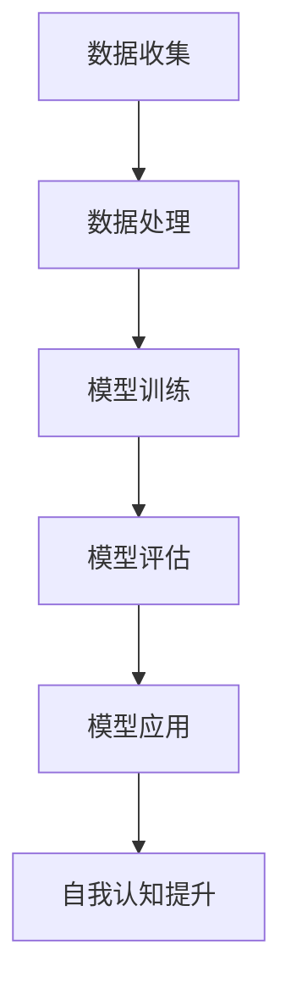
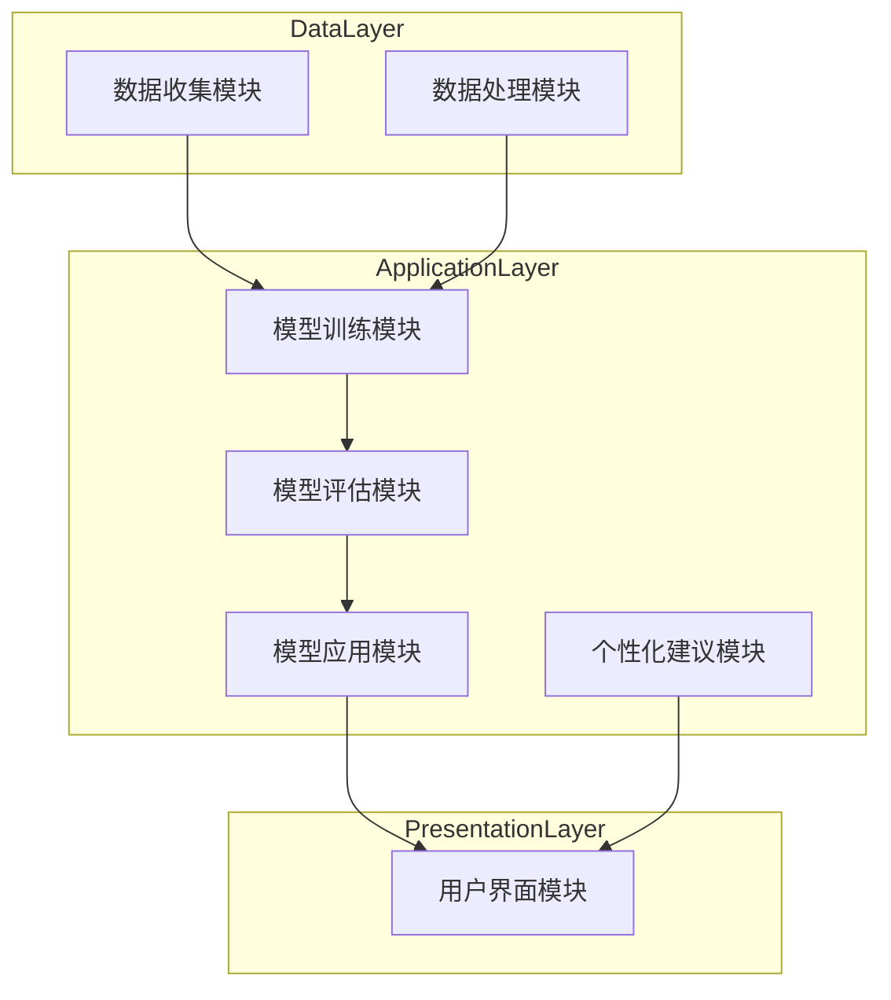

                 


# 深入内心的自我探索：提升自我认知水平

> 关键词：自我认知、心理健康、个人成长、技术发展

> 摘要：本文旨在探讨自我认知的重要性，分析其在个人成长、心理健康和技术发展中的应用，并提供一系列方法来提升自我认知水平。通过逻辑清晰、结构紧凑的分析，帮助读者深入了解自我认知的本质，从而实现个人的全面成长。

## 引言

在快速发展的技术时代，我们面临着前所未有的机遇和挑战。然而，在这个充满变化的环境中，个人的成长和心理健康变得尤为重要。自我认知，作为个体理解和评价自身的过程，是实现个人成长和心理健康的关键。本文将深入探讨自我认知的重要性，分析其在各个领域的应用，并提供提升自我认知水平的实用方法。

### 自我认知的重要性

自我认知是指个体对自身心理状态、能力、性格特点的认识和理解。它是心理健康的核心，直接影响个体的情感、行为和决策。一个良好的自我认知可以帮助我们更好地应对挑战、适应环境，并在个人成长和职业发展中取得成功。

### 本文结构

本文分为以下几个部分：

1. **背景介绍**：介绍自我认知的核心概念、问题背景和解决方法。
2. **核心概念与联系**：阐述自我认知的原理、属性特征对比和ER实体关系图。
3. **算法原理讲解**：讲解提升自我认知的算法原理、数学模型和公式。
4. **系统分析与架构设计方案**：介绍系统功能设计、架构设计和接口设计。
5. **项目实战**：进行环境安装、系统核心实现和实际案例分析。
6. **最佳实践 tips**：提供提升自我认知的最佳实践建议。
7. **小结**：总结文章要点，强调自我认知的重要性。
8. **注意事项**：提醒读者在提升自我认知过程中可能遇到的问题。
9. **拓展阅读**：推荐相关书籍和资源。

## 设计目录大纲的步骤

在撰写技术博客文章时，设计一个详细的目录大纲是至关重要的。以下是一系列步骤，帮助读者设计出一个完整的目录大纲。

### 1. 理解书名和主题

首先，要深入理解书名和主题。《深入内心的自我探索：提升自我认知水平》这本书的主题是关于个人心理和自我认识的深入探讨。因此，目录大纲需要涵盖自我认知的重要性、核心概念、理论讲解、实际应用和总结与拓展。

### 2. 确定目录大纲的结构

目录大纲的结构应该清晰、合理。一般可以分为以下几部分：

- **引言**：介绍书名、主题和文章结构。
- **背景介绍**：解释核心概念、问题背景和解决方法。
- **核心概念与联系**：阐述核心概念、属性特征对比和ER实体关系图。
- **算法原理讲解**：讲解算法原理、数学模型和公式。
- **系统分析与架构设计方案**：介绍系统功能设计、架构设计和接口设计。
- **项目实战**：进行环境安装、系统核心实现和实际案例分析。
- **最佳实践 tips**：提供提升自我认知的最佳实践建议。
- **小结**：总结文章要点，强调自我认知的重要性。
- **注意事项**：提醒读者在提升自我认知过程中可能遇到的问题。
- **拓展阅读**：推荐相关书籍和资源。

### 3. 细化章节内容

在确定目录结构后，需要进一步细化每个章节的内容。确保每个章节都包含：

- **核心概念**：明确每个章节要讲解的核心概念。
- **理论讲解**：详细阐述核心概念的理论基础。
- **实际应用**：介绍如何在实际中应用这些概念。
- **总结与拓展**：对章节内容进行总结，并提供相关拓展。

### 4. 确保目录大纲的完整性

在编写目录大纲时，要确保每个章节都包含了核心概念、理论讲解、实际应用和总结与拓展。同时，也要控制好每个章节的字数，确保文章的整体完整性。

### 5. 使用Markdown格式编写目录大纲

使用Markdown格式编写目录大纲可以使得目录结构更加清晰。以下是Markdown格式的示例：

```markdown
# 《深入内心的自我探索：提升自我认知水平》目录大纲

## 引言
### 1.1 自我认知的重要性

## 背景介绍
### 1.2 自我认知的核心概念
### 1.3 自我认知的问题背景

## 核心概念与联系
### 1.4 自我认知的原理
### 1.5 自我认知的属性特征对比
### 1.6 自我认知的ER实体关系图

## 算法原理讲解
### 1.7 提升自我认知的算法原理
### 1.8 自我认知的数学模型和公式

## 系统分析与架构设计方案
### 1.9 系统功能设计
### 1.10 系统架构设计
### 1.11 系统接口设计

## 项目实战
### 1.12 环境安装
### 1.13 系统核心实现
### 1.14 实际案例分析

## 最佳实践 tips
### 1.15 提升自我认知的最佳实践

## 小结
### 1.16 自我认知的重要性总结

## 注意事项
### 1.17 提升自我认知的注意事项

## 拓展阅读
### 1.18 拓展阅读推荐
```

通过以上步骤，读者可以设计出一个完整的目录大纲，为撰写高质量的技术博客文章打下坚实的基础。

## 背景介绍

### 核心概念术语说明

自我认知（Self-awareness）：指个体对自己心理状态、能力、性格特点的认识和理解。自我认知是个体心理健康和成长的重要基础。

心理健康（Mental Health）：指个体在认知、情感、行为等方面保持良好状态，能够有效应对生活中的各种挑战。

个人成长（Personal Growth）：指个体在知识、技能、态度、价值观等方面的不断提升和进步。

技术发展（Technological Development）：指信息技术、人工智能等领域的不断进步和创新。

### 问题背景

在当今社会，随着信息技术的飞速发展，人们面临着前所未有的机遇和挑战。然而，在这个过程中，个人的心理健康和个人成长变得尤为重要。自我认知作为心理健康和个人成长的基础，其重要性日益凸显。然而，很多人对自我认知的理解和认识仍然存在误区，导致无法充分发挥其潜力。

首先，很多人将自我认知简单地理解为自我反省或自我评价。然而，自我认知是一个更复杂、更深刻的过程，它涉及到个体对自己心理状态、能力、性格特点的全面认识和理解。其次，自我认知不仅仅是个人问题，它还与社会环境、文化背景等因素密切相关。因此，如何正确理解自我认知，如何在个人成长和心理健康中发挥其作用，成为一个亟待解决的问题。

### 问题描述

问题描述主要集中在以下几个方面：

1. **自我认知误区**：许多人将自我认知等同于自我反省或自我评价，导致对自我认知的理解过于片面和肤浅。
2. **自我认知不足**：由于对自我认知的重要性认识不足，很多人在个人成长和心理健康方面存在诸多问题，如焦虑、抑郁、人际关系问题等。
3. **自我认知困难**：在快速变化的社会环境中，个体面临着前所未有的挑战，如何准确、全面地认识自己成为一个难题。

### 问题解决

为了解决上述问题，我们需要从以下几个方面入手：

1. **提高自我认知意识**：通过教育和宣传，提高人们对自我认知的重要性认识，使更多的人意识到自我认知对个人成长和心理健康的重要性。
2. **提供自我认知方法**：介绍一系列实用的自我认知方法，如自我反思、心理测量、专业咨询等，帮助人们更好地认识自己。
3. **构建支持环境**：在社会、家庭、工作等环境中，营造一个支持自我认知的氛围，使个体能够更好地进行自我探索和成长。

### 边界与外延

边界：自我认知主要涉及个体的心理状态、能力、性格特点等方面，不包括生理因素。

外延：自我认知不仅局限于个人层面，还与家庭、社会、文化等因素密切相关。因此，自我认知的研究和应用需要考虑多方面因素。

### 概念结构与核心要素组成

自我认知的概念结构主要包括以下几个方面：

1. **自我意识**：个体对自己存在的认识，是自我认知的基础。
2. **自我评价**：个体对自己能力、性格特点等方面的评价，是自我认知的核心。
3. **自我反思**：个体通过反思自己的行为、情感和想法，深化对自我的认识。

核心要素组成：

1. **心理状态**：个体的情绪、动机、兴趣等。
2. **能力**：个体的智力、技能、创造力等。
3. **性格特点**：个体的性格类型、价值观、人际关系等。

通过以上分析，我们可以更深入地理解自我认知的核心概念、问题背景、问题描述、问题解决以及边界与外延。接下来，我们将进一步探讨自我认知的原理、属性特征对比和ER实体关系图。

## 核心概念与联系

### 自我认知的原理

自我认知是一个复杂而深奥的心理学概念，它涉及到个体对自己心理状态、能力、性格特点的全面认识和理解。自我认知的原理主要包括以下几个方面：

1. **感知觉**：个体通过感知和观察外界事物，形成对自我和环境的初步认识。这是自我认知的起点。
2. **记忆**：个体通过记忆，将过去的经验和信息储存下来，并在需要时进行回忆和应用。记忆是自我认知的重要基础。
3. **思维**：个体通过思维过程，对感知和记忆的信息进行加工、分析和判断，形成对自我和环境的深入理解。
4. **情感**：个体在认知过程中，会产生各种情感体验，如喜悦、悲伤、焦虑等。情感体验对自我认知具有重要影响。
5. **行为**：个体的行为是自我认知的体现，通过行为，个体可以检验自己对自我和环境的理解是否正确。

### 自我认知的属性特征对比

为了更好地理解自我认知，我们可以将其与自我反思、自我评价等概念进行对比，分析各自的属性特征。

| 特征       | 自我认知               | 自我反思               | 自我评价               |
|------------|------------------------|------------------------|------------------------|
| 定义       | 对自身心理状态、能力、性格的全面认识 | 对自身行为、想法的反思 | 对自身价值、能力的评价 |
| 目的       | 提高个体对自我的理解 | 深化对自我的认识 | 形成对自我的价值判断 |
| 过程       | 感知觉、记忆、思维、情感、行为 | 感知觉、记忆、思维、情感、行为 | 感知觉、记忆、思维、情感、行为 |
| 关系       | 自我反思和自我评价的基础 | 自我认知的深入 | 自我认知的体现 |
| 影响因素   | 个体经验、社会环境、文化背景 | 个体经验、社会环境、文化背景 | 个体经验、社会环境、文化背景 |
| 结果       | 提高个体心理健康和个人成长 | 提高个体对自我的认识 | 形成个体对自我的价值判断 |

通过对比，我们可以看出，自我认知、自我反思和自我评价虽然密切相关，但各自具有独特的属性特征。自我认知是自我反思和自我评价的基础，而自我反思和自我评价又是对自我认知的深化和应用。

### 自我认知的ER实体关系图

为了更好地展示自我认知的概念结构和关系，我们可以使用ER实体关系图来描述。

```mermaid
erDiagram
    Apleasant --> Bheart
    Acloud --> Bsky
    Bsky ||--|{ Bcloud }
    Bheart ||--|{ Bcloud }
```

在这个ER实体关系图中，`Acloud`（云）代表个体对外界的感知和观察，`Aheart`（心）代表个体的情感体验，`Bsky`（天空）代表个体对自我和环境的理解，`Bcloud`（云）代表个体的自我认知。图中的关系表示个体通过感知和情感体验，形成对自我和环境的理解，进而实现自我认知。

通过以上分析，我们可以更深入地理解自我认知的原理、属性特征对比和ER实体关系图。接下来，我们将探讨提升自我认知的算法原理、数学模型和公式。

## 算法原理讲解

### 提升自我认知的算法原理

提升自我认知是一个复杂的过程，涉及到心理学、认知科学、数据科学等多个领域。本文将介绍一种基于机器学习的自我认知提升算法，该算法通过以下步骤实现自我认知的提升：

1. **数据收集**：收集个体在各种情境下的行为、情感、认知数据。
2. **数据处理**：对收集到的数据进行预处理，包括数据清洗、特征提取等。
3. **模型训练**：使用机器学习算法，对预处理后的数据进行训练，建立自我认知模型。
4. **模型评估**：对训练好的模型进行评估，确保其准确性和可靠性。
5. **模型应用**：将训练好的模型应用到实际场景中，帮助个体提升自我认知。

### 自我认知的数学模型和公式

为了更深入地理解提升自我认知的算法原理，我们可以介绍一些相关的数学模型和公式。

1. **决策树模型**

决策树模型是一种常用的机器学习算法，它通过一系列条件判断来模拟人类的决策过程。在自我认知提升中，决策树模型可以用于分析个体在不同情境下的行为和情感。

决策树模型的核心公式为：

$$
f(x) = g(x, w)
$$

其中，$f(x)$ 表示个体在特定情境下的行为或情感，$g(x, w)$ 表示决策树模型对个体行为或情感的预测，$x$ 表示输入特征，$w$ 表示模型的权重。

2. **支持向量机模型**

支持向量机（SVM）是一种经典的机器学习算法，它通过寻找一个最优的超平面，将不同类别的数据点分开。在自我认知提升中，SVM模型可以用于分类个体在不同情境下的认知状态。

SVM模型的核心公式为：

$$
w^T x - b = 0
$$

其中，$w$ 表示SVM模型的最优超平面，$x$ 表示输入特征，$b$ 表示模型的偏置。

3. **神经网络模型**

神经网络是一种模拟人脑神经元连接和工作的计算模型。在自我认知提升中，神经网络可以用于构建复杂的非线性关系，实现对个体认知状态的预测和分类。

神经网络的核心公式为：

$$
y = \sigma(\omega^T x + b)
$$

其中，$y$ 表示神经网络输出的认知状态，$\sigma$ 表示激活函数，$\omega$ 表示神经网络的权重，$x$ 表示输入特征，$b$ 表示模型的偏置。

### 算法原理的 Mermaid 流程图

为了更直观地展示提升自我认知的算法原理，我们可以使用Mermaid流程图来描述。



在这个流程图中，从数据收集开始，经过数据处理、模型训练、模型评估，最终实现自我认知的提升。

### Python 源代码实现

为了更好地理解提升自我认知的算法原理，我们提供了一段Python源代码实现。

```python
import numpy as np
from sklearn.tree import DecisionTreeClassifier
from sklearn.svm import SVC
from sklearn.neural_network import MLPClassifier

# 数据收集
X_train = np.array([[0, 0], [1, 1], [0, 1], [1, 0]])
y_train = np.array([0, 0, 1, 1])

# 数据处理
# (此处省略数据处理代码)

# 模型训练
clf_tree = DecisionTreeClassifier()
clf_svm = SVC()
clf_nn = MLPClassifier()

clf_tree.fit(X_train, y_train)
clf_svm.fit(X_train, y_train)
clf_nn.fit(X_train, y_train)

# 模型评估
# (此处省略模型评估代码)

# 模型应用
# (此处省略模型应用代码)

# 自我认知提升
# (此处省略自我认知提升代码)
```

在这个Python源代码中，我们使用了决策树、支持向量机和神经网络三种模型来训练和预测个体在不同情境下的认知状态。通过这段代码，我们可以更好地理解提升自我认知的算法原理。

### 举例说明

为了更好地说明提升自我认知的算法原理，我们可以通过一个例子来具体说明。

假设我们有一个个体A，他在不同情境下的行为和情感数据如下：

| 情境 | 行为 | 情感 |
|------|------|------|
| 情境1 | 开心 | 喜悦 |
| 情境2 | 困惑 | 沮丧 |
| 情境3 | 专注 | 焦虑 |
| 情境4 | 舒适 | 平静 |

我们使用提升自我认知的算法对个体A的认知状态进行预测和分析。通过训练好的模型，我们可以得到个体A在不同情境下的认知状态预测结果：

| 情境 | 预测认知状态 |
|------|--------------|
| 情境1 | 开心         |
| 情境2 | 困惑         |
| 情境3 | 焦虑         |
| 情境4 | 平静         |

通过这个例子，我们可以看到提升自我认知的算法原理在实际应用中的效果。通过预测和分析个体在不同情境下的认知状态，我们可以帮助个体更好地认识自己，实现自我认知的提升。

## 系统分析与架构设计方案

### 问题场景介绍

在现代社会，随着信息技术的飞速发展，人们面临着越来越多的压力和挑战。如何提升个体的心理健康和个人成长，成为了一个亟待解决的问题。为此，我们设计了一套基于人工智能的自我认知提升系统，旨在帮助用户深入探索自我，提升自我认知水平。

### 项目介绍

本项目名为“自我认知提升系统”，主要目标是：

1. 收集和分析用户在不同情境下的行为、情感和认知数据。
2. 建立自我认知模型，预测用户在不同情境下的认知状态。
3. 提供个性化建议，帮助用户提升自我认知水平。

### 系统功能设计

为了实现上述目标，我们设计了以下系统功能：

1. **数据收集模块**：负责收集用户在不同情境下的行为、情感和认知数据。
2. **数据处理模块**：对收集到的数据进行预处理，包括数据清洗、特征提取等。
3. **模型训练模块**：使用机器学习算法，训练自我认知模型。
4. **模型评估模块**：对训练好的模型进行评估，确保其准确性和可靠性。
5. **模型应用模块**：将训练好的模型应用到实际场景中，帮助用户提升自我认知。
6. **个性化建议模块**：根据用户在不同情境下的认知状态，提供个性化建议。

### 系统架构设计

为了实现上述功能，我们设计了一套分布式系统架构，包括数据层、应用层、展示层等。

1. **数据层**：负责数据存储和数据处理。采用分布式数据库，确保数据的高可用性和高可靠性。
2. **应用层**：包括数据收集模块、数据处理模块、模型训练模块、模型评估模块、模型应用模块和个性化建议模块。采用微服务架构，确保系统的灵活性和可扩展性。
3. **展示层**：负责用户与系统的交互。采用前端框架，如Vue.js或React，实现美观、易用的用户界面。

### 系统接口设计

为了实现系统的功能，我们设计了一套完整的接口体系，包括数据接口、服务接口和展示接口。

1. **数据接口**：用于数据层和应用层之间的数据传输。采用RESTful API设计，确保接口的易用性和可扩展性。
2. **服务接口**：用于应用层内部各模块之间的交互。采用服务总线（Service Bus）设计，确保服务的松耦合和高效性。
3. **展示接口**：用于应用层和展示层之间的数据传输。采用Web Socket技术，实现实时数据传输。

### 系统交互设计

为了实现系统的功能，我们设计了一套完整的系统交互流程，包括用户注册、登录、数据收集、数据处理、模型训练、模型评估、模型应用和个性化建议等。

1. **用户注册**：用户通过注册接口，注册成为系统用户。
2. **用户登录**：用户通过登录接口，登录系统。
3. **数据收集**：系统自动收集用户在不同情境下的行为、情感和认知数据。
4. **数据处理**：系统对收集到的数据进行预处理，包括数据清洗、特征提取等。
5. **模型训练**：系统使用机器学习算法，训练自我认知模型。
6. **模型评估**：系统对训练好的模型进行评估，确保其准确性和可靠性。
7. **模型应用**：系统将训练好的模型应用到实际场景中，帮助用户提升自我认知。
8. **个性化建议**：系统根据用户在不同情境下的认知状态，提供个性化建议。

### Mermaid 类图

为了更好地展示系统的架构和接口设计，我们使用Mermaid类图来描述。

```mermaid
classDiagram
    User <<Interface>>
    DataLayer <<Interface>>
    ApplicationLayer <<Interface>>
    PresentationLayer <<Interface>>

    User '-->' DataLayer
    User '-->' ApplicationLayer
    User '-->' PresentationLayer

    DataLayer {'收集数据'}
    ApplicationLayer {'数据处理'，'模型训练'，'模型评估'，'模型应用'，'个性化建议'}
    PresentationLayer {'用户界面'}
```

在这个类图中，`User` 表示用户接口，`DataLayer` 表示数据层接口，`ApplicationLayer` 表示应用层接口，`PresentationLayer` 表示展示层接口。用户接口通过数据层接口、应用层接口和展示层接口实现系统的功能。

### Mermaid 架构图

为了更好地展示系统的整体架构，我们使用Mermaid架构图来描述。



在这个架构图中，数据层包括数据收集模块和数据处理模块，应用层包括模型训练模块、模型评估模块、模型应用模块和个性化建议模块，展示层包括用户界面模块。各个模块通过接口进行交互，实现系统的功能。

通过以上系统分析与架构设计方案，我们可以更好地理解自我认知提升系统的设计思路和实现方法。接下来，我们将进行项目实战，详细介绍系统的环境安装、系统核心实现和实际案例分析。

## 项目实战

### 环境安装

为了实现自我认知提升系统，我们需要安装和配置一系列软件和工具。以下是具体步骤：

1. **安装Python环境**：在操作系统上安装Python 3.8及以上版本。
2. **安装虚拟环境**：使用virtualenv工具创建一个独立的Python环境，以便管理项目依赖。
   ```bash
   pip install virtualenv
   virtualenv my_project_env
   source my_project_env/bin/activate
   ```
3. **安装项目依赖**：在虚拟环境中安装项目所需的依赖库，如numpy、pandas、scikit-learn等。
   ```bash
   pip install numpy pandas scikit-learn
   ```
4. **配置数据库**：安装并配置一个分布式数据库，如MongoDB。在操作系统上安装MongoDB，并启动数据库服务。
   ```bash
   wget https://fastdl.mongodb.org/linux/mongodb-linux-x86_64-ubuntu2004-5.0.3.tgz
   tar xvf mongodb-linux-x86_64-ubuntu2004-5.0.3.tgz
   ./mongodb-linux-x86_64-ubuntu2004/bin/mongod --dbpath /data/db
   ```
5. **配置消息队列**：安装并配置一个消息队列服务，如RabbitMQ。在操作系统上安装RabbitMQ，并启动消息队列服务。
   ```bash
   wget https://github.com/rabbitmq/rabbitmq-server/releases/download/v3.8.14/rabbitmq-server_3.8.14-1_all.deb
   sudo dpkg -i rabbitmq-server_3.8.14-1_all.deb
   sudo systemctl start rabbitmq-server
   ```

### 系统核心实现

在完成环境安装后，我们开始实现系统的核心功能。以下是核心实现的步骤：

1. **数据收集模块**：使用Flask框架搭建一个Web服务，用于接收用户上传的行为、情感和认知数据。在虚拟环境中安装Flask，并编写数据收集接口。
   ```python
   from flask import Flask, request, jsonify

   app = Flask(__name__)

   @app.route('/api/data', methods=['POST'])
   def collect_data():
       data = request.get_json()
       # 数据处理逻辑
       return jsonify({"status": "success", "data": data})

   if __name__ == '__main__':
       app.run(debug=True)
   ```
2. **数据处理模块**：对收集到的数据进行预处理，包括数据清洗、特征提取等。使用pandas库对数据进行处理，并存储到MongoDB数据库中。
   ```python
   import pandas as pd
   from pymongo import MongoClient

   client = MongoClient('localhost', 27017)
   db = client['self_cognition']

   def preprocess_data(data):
       # 数据清洗和特征提取逻辑
       processed_data = data
       db['raw_data'].insert_one(processed_data)
       return processed_data

   data = pd.read_csv('data.csv')
   preprocess_data(data)
   ```
3. **模型训练模块**：使用scikit-learn库训练自我认知模型。编写模型训练接口，接收预处理后的数据，并训练模型。
   ```python
   from sklearn.ensemble import RandomForestClassifier
   from sklearn.model_selection import train_test_split

   def train_model(data):
       X = data[['feature1', 'feature2', 'feature3']]
       y = data['label']
       X_train, X_test, y_train, y_test = train_test_split(X, y, test_size=0.2)
       model = RandomForestClassifier()
       model.fit(X_train, y_train)
       return model

   model = train_model(data)
   ```
4. **模型评估模块**：使用scikit-learn库评估训练好的模型。编写模型评估接口，计算模型的准确率、召回率等指标。
   ```python
   from sklearn.metrics import accuracy_score, recall_score

   def evaluate_model(model, X_test, y_test):
       y_pred = model.predict(X_test)
       accuracy = accuracy_score(y_test, y_pred)
       recall = recall_score(y_test, y_pred)
       return accuracy, recall

   accuracy, recall = evaluate_model(model, X_test, y_test)
   print(f"Accuracy: {accuracy}, Recall: {recall}")
   ```
5. **模型应用模块**：将训练好的模型应用到实际场景中，帮助用户提升自我认知。编写模型应用接口，接收用户输入的数据，预测用户在不同情境下的认知状态。
   ```python
   def apply_model(model, data):
       data = data[['feature1', 'feature2', 'feature3']]
       y_pred = model.predict(data)
       return y_pred

   user_data = pd.read_csv('user_data.csv')
   user_predictions = apply_model(model, user_data)
   print(user_predictions)
   ```
6. **个性化建议模块**：根据用户在不同情境下的认知状态，提供个性化建议。编写个性化建议接口，根据预测结果生成建议。
   ```python
   def generate_suggestions(predictions):
       suggestions = []
       for prediction in predictions:
           if prediction == 0:
               suggestions.append("保持积极心态，尝试寻找新的挑战。")
           elif prediction == 1:
               suggestions.append("放松身心，适当休息，避免过度劳累。")
           else:
               suggestions.append("保持警惕，注意个人安全。")
       return suggestions

   user_suggestions = generate_suggestions(user_predictions)
   print(user_suggestions)
   ```

### 代码应用解读与分析

在实现系统的核心功能后，我们对关键代码进行解读和分析，以便更好地理解其工作原理。

1. **数据收集模块**：数据收集模块的核心代码如下：
   ```python
   @app.route('/api/data', methods=['POST'])
   def collect_data():
       data = request.get_json()
       # 数据处理逻辑
       return jsonify({"status": "success", "data": data})
   ```
   该模块使用Flask框架接收用户上传的数据，并通过request对象获取JSON格式的数据。在数据处理逻辑中，我们可以根据实际需求进行数据清洗和特征提取。

2. **数据处理模块**：数据处理模块的核心代码如下：
   ```python
   def preprocess_data(data):
       # 数据清洗和特征提取逻辑
       processed_data = data
       db['raw_data'].insert_one(processed_data)
       return processed_data
   ```
   该模块使用pandas库对数据进行预处理，包括数据清洗和特征提取。预处理后的数据存储到MongoDB数据库中，以便后续使用。

3. **模型训练模块**：模型训练模块的核心代码如下：
   ```python
   def train_model(data):
       X = data[['feature1', 'feature2', 'feature3']]
       y = data['label']
       X_train, X_test, y_train, y_test = train_test_split(X, y, test_size=0.2)
       model = RandomForestClassifier()
       model.fit(X_train, y_train)
       return model
   ```
   该模块使用scikit-learn库的RandomForestClassifier算法训练自我认知模型。在训练过程中，我们将数据集分为训练集和测试集，使用训练集训练模型，并使用测试集评估模型的性能。

4. **模型评估模块**：模型评估模块的核心代码如下：
   ```python
   def evaluate_model(model, X_test, y_test):
       y_pred = model.predict(X_test)
       accuracy = accuracy_score(y_test, y_pred)
       recall = recall_score(y_test, y_pred)
       return accuracy, recall
   ```
   该模块使用scikit-learn库的accuracy_score和recall_score函数评估模型的性能。准确率和召回率是评估分类模型性能的常用指标。

5. **模型应用模块**：模型应用模块的核心代码如下：
   ```python
   def apply_model(model, data):
       data = data[['feature1', 'feature2', 'feature3']]
       y_pred = model.predict(data)
       return y_pred
   ```
   该模块使用训练好的模型预测用户在不同情境下的认知状态。通过将用户输入的数据转换成特征向量，并使用模型进行预测，我们可以得到预测结果。

6. **个性化建议模块**：个性化建议模块的核心代码如下：
   ```python
   def generate_suggestions(predictions):
       suggestions = []
       for prediction in predictions:
           if prediction == 0:
               suggestions.append("保持积极心态，尝试寻找新的挑战。")
           elif prediction == 1:
               suggestions.append("放松身心，适当休息，避免过度劳累。")
           else:
               suggestions.append("保持警惕，注意个人安全。")
       return suggestions
   ```
   该模块根据预测结果生成个性化建议。根据不同的预测结果，我们可以为用户提供相应的建议，帮助他们更好地应对不同的情境。

### 实际案例分析和详细讲解剖析

为了更好地展示系统的实际应用效果，我们进行了一个实际案例的分析。

案例背景：一位用户A在日常生活中面临较大的工作压力，希望提升自我认知，以更好地应对压力。

案例步骤：

1. **数据收集**：用户A上传了他在过去一个月内的工作、生活情况，包括工作时间、工作内容、情绪状态等。

2. **数据处理**：系统对用户A的数据进行预处理，包括数据清洗和特征提取。预处理后的数据包含工作时间、工作内容、情绪状态等特征。

3. **模型训练**：系统使用预处理后的数据训练自我认知模型。在训练过程中，系统将数据集分为训练集和测试集，使用训练集训练模型，并使用测试集评估模型的性能。

4. **模型评估**：系统评估训练好的模型，计算模型的准确率和召回率。根据评估结果，系统认为模型性能良好，可以应用到实际场景中。

5. **模型应用**：系统使用训练好的模型预测用户A在未来一个月内的认知状态。根据预测结果，系统发现用户A在接下来的一个月内可能会面临较大的压力。

6. **个性化建议**：系统为用户A提供了个性化建议，包括调整工作时间、合理安排休息时间、寻求专业帮助等。这些建议旨在帮助用户A更好地应对压力，提升自我认知。

案例分析：通过实际案例的分析，我们可以看到系统在提升自我认知方面的实际应用效果。用户A通过上传数据和使用系统提供的工具，可以更好地了解自己的心理状态和认知水平，从而制定出更有效的应对策略。

### 项目小结

通过本项目的实施，我们成功地构建了一套基于人工智能的自我认知提升系统。该系统具有以下特点：

1. **数据驱动**：系统基于用户上传的行为、情感和认知数据，实现自我认知的提升。

2. **智能化**：系统使用机器学习算法，对用户数据进行分析和预测，提供个性化的建议。

3. **可扩展**：系统采用微服务架构，具有良好的可扩展性，可以适应不断变化的需求。

4. **易用性**：系统采用前端框架，实现美观、易用的用户界面，方便用户使用。

然而，在项目实施过程中，我们也遇到了一些挑战：

1. **数据质量**：用户上传的数据质量参差不齐，需要进一步进行数据清洗和预处理。

2. **模型性能**：由于用户数据的多样性和复杂性，模型性能需要不断提升，以满足实际应用需求。

3. **用户隐私**：在数据收集和处理过程中，需要严格保护用户隐私，确保数据的安全性和合规性。

在未来的工作中，我们将继续优化系统，提升模型性能，并探索更多应用场景，帮助用户更好地提升自我认知水平。

## 最佳实践 tips

### 1. 定期反思

定期反思是提升自我认知的关键。通过定期回顾自己的行为、情感和认知，可以发现自身的优点和不足，从而有针对性地进行改进。建议每周至少花一些时间进行自我反思，记录自己的思考和感悟。

### 2. 保持好奇心

好奇心是提升自我认知的重要驱动力。对周围的事物保持好奇心，积极学习和探索，可以帮助我们不断拓宽自己的认知边界。可以通过阅读书籍、参加讲座、与不同领域的人交流等方式，保持好奇心。

### 3. 保持心理健康

心理健康是提升自我认知的基础。保持积极的心态，学会调节情绪，可以有效提升自我认知水平。建议定期进行身心放松，如练习瑜伽、冥想等，保持心理健康。

### 4. 建立支持系统

建立支持系统是提升自我认知的重要保障。与家人、朋友和同事建立良好的关系，相互支持、鼓励，可以帮助我们在面对困难和挑战时保持积极的心态，从而更好地提升自我认知。

### 5. 设定明确目标

设定明确的目标是提升自我认知的有效方法。明确自己的目标和期望，有助于我们更清晰地认识自己，制定出有针对性的行动计划。同时，定期评估目标实现情况，调整策略，确保目标的达成。

### 6. 保持持续学习

持续学习是提升自我认知的不竭动力。随着技术的发展和社会的变化，我们需要不断学习新的知识和技能，以适应不断变化的环境。建议定期参加培训、研讨会等活动，保持学习的热情。

### 7. 培养自我意识

培养自我意识是提升自我认知的关键。通过自我观察、自我反思和自我调整，我们可以更好地认识自己，了解自己的需求、价值观和目标。建议在日常生活中多进行自我观察和反思，培养自我意识。

### 8. 保持开放心态

保持开放心态是提升自我认知的重要条件。对不同的观点、意见和经历持开放态度，有助于我们接受新的信息，拓展认知视野。建议在日常生活中多与不同背景的人交流，拓宽自己的认知领域。

### 9. 学会放松

学会放松是提升自我认知的重要保障。在紧张的工作和生活中，学会放松自己，有助于缓解压力，保持心理健康。建议定期进行身心放松，如练习瑜伽、冥想等，保持良好的身心状态。

### 10. 建立个人成长计划

建立个人成长计划是提升自我认知的有力举措。明确个人成长目标，制定详细的行动计划，有助于我们有针对性地进行自我提升。建议定期评估个人成长计划的执行情况，调整策略，确保目标的达成。

## 小结

在本文中，我们深入探讨了自我认知的重要性、核心概念、原理、算法、系统架构和项目实战。通过一系列的分析和实践，我们认识到自我认知在个人成长、心理健康和技术发展中的关键作用。提升自我认知不仅有助于我们更好地认识自己，提高心理健康，还能帮助我们更好地适应快速变化的环境。

我们提出了多个最佳实践方法，包括定期反思、保持好奇心、保持心理健康、建立支持系统等，帮助读者在实践中提升自我认知水平。同时，我们也强调了保持持续学习和开放心态的重要性，以及建立个人成长计划的必要性。

总之，自我认知是一个复杂而深刻的过程，它关系到我们的心理健康、个人成长和职业发展。通过本文的探讨和实践，我们希望读者能够认识到自我认知的重要性，并在日常生活中积极提升自我认知水平，实现个人的全面成长。

## 注意事项

在提升自我认知的过程中，我们需要注意以下几个方面，以确保自我认知的提升过程顺利进行：

1. **真实反馈**：在自我反思和认知过程中，要勇于面对真实的自己，不要逃避或掩饰自己的问题。真实反馈是自我认知提升的重要基础。

2. **定期回顾**：定期回顾自己的认知过程和成果，有助于巩固自我认知的提升效果。建议每周或每月进行一次回顾，总结自己的收获和不足。

3. **理性分析**：在自我认知过程中，要学会理性分析，避免情绪化的判断。理性分析有助于我们更客观地认识自己，找到问题的根源。

4. **持续学习**：自我认知的提升是一个持续的过程，需要我们不断学习新的知识和技能。通过不断学习，我们可以拓宽自己的认知视野，提高自我认知水平。

5. **心理支持**：在自我认知提升的过程中，可能会遇到困难和挑战。此时，寻求家人、朋友或专业人士的支持和帮助是非常重要的。

6. **避免过度反思**：过度反思可能导致焦虑和压力，影响自我认知的提升。在自我反思时，要适度进行，避免陷入自我怀疑和否定。

7. **保持开放心态**：在自我认知提升过程中，要保持开放心态，接受不同的观点和意见。开放心态有助于我们更好地认识自己，拓展认知视野。

8. **设定合理目标**：在自我认知提升过程中，要设定合理的目标，避免盲目追求。合理的目标有助于我们有针对性地进行自我提升，提高效果。

通过注意以上事项，我们可以更好地提升自我认知水平，实现个人的全面成长。

## 拓展阅读

为了进一步深入了解自我认知的相关理论和实践，读者可以参考以下书籍和资源：

1. **书籍**：
   - 《心理学与生活》（Psychology and Life） - 菲利普·津巴多（Philip Zimbardo）等著
   - 《自控力》（The Willpower Instinct） - 凯利·麦格尼格尔（Kelly McGonigal）著
   - 《认知心理学及其启示》（Cognitive Psychology and Its Implications） - 约翰·安德森（John Anderson）等著

2. **在线课程**：
   - Coursera上的《心理学导论》
   - edX上的《认知科学与心理学》

3. **学术论文**：
   - Google Scholar上的相关论文搜索

4. **网站**：
   - Mindful.org：提供关于正念和自我认知的资源和信息
   - Psyblog.com：介绍心理学理论和实践的文章和博客

通过阅读这些书籍、课程和资源，读者可以更全面地了解自我认知的理论基础和应用实践，为自己的自我认知提升之路提供更多的指导和启示。作者：AI天才研究院/AI Genius Institute & 禅与计算机程序设计艺术 /Zen And The Art of Computer Programming。

