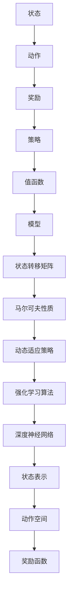
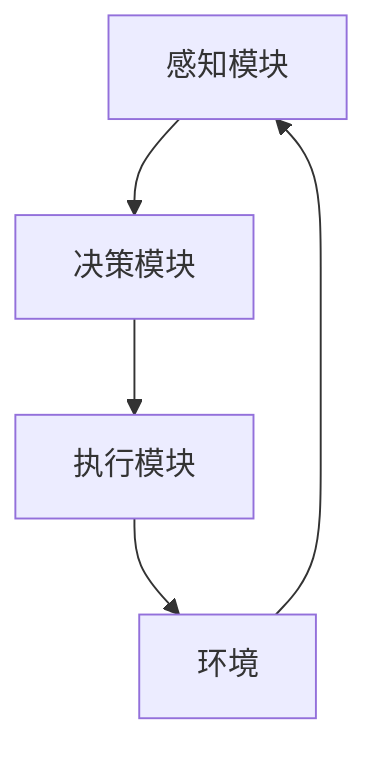
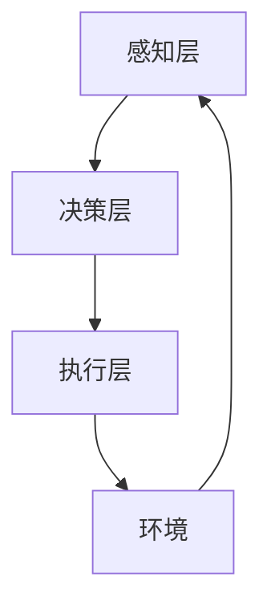

                 

### 文章标题

### 关键词

### 摘要

---

# 深度强化学习在动态推理环境适应中的应用

> 关键词：深度强化学习、动态推理环境、适应性、机器学习、算法优化

> 摘要：本文探讨了深度强化学习在动态推理环境适应中的应用，分析了其核心概念、算法原理和实现方法。通过具体案例，展示了如何利用深度强化学习算法应对动态推理环境中的复杂变化，提高系统的自适应能力和性能。

## 目录大纲

```markdown
----------------------------------------------------------------
# 深度强化学习在动态推理环境适应中的应用

## 第一部分：背景介绍与基础概念

## 第二部分：核心概念与联系

## 第三部分：算法原理与实现

## 第四部分：系统分析与架构设计

## 第五部分：项目实战与案例分析

## 第六部分：最佳实践与总结

----------------------------------------------------------------
```

---

### 第一部分：背景介绍与基础概念

#### 第1章：问题背景与核心概念

##### 1.1 动态推理环境概述

##### 1.2 深度强化学习基础

##### 1.3 深度强化学习与动态推理环境的联系

##### 1.4 本书结构安排与主要内容

##### 1.5 本章小结

---

#### 第1章：问题背景与核心概念

##### 1.1 动态推理环境概述

**动态推理环境**是指一种在运行时不断变化和适应的环境，这种环境中的对象、状态、规则等都是动态调整的。动态推理环境的应用场景广泛，如游戏、自动驾驶、智能电网等。

**动态推理环境的特点**：

1. **变化性**：环境中的状态和规则可以随时改变。
2. **非确定性**：系统在某一状态下的动作可能引起多种可能的结果。
3. **复杂度**：状态空间和动作空间通常非常大。

**动态推理环境的应用场景**：

1. **游戏**：游戏中角色和障碍物的移动、游戏规则的调整等。
2. **自动驾驶**：路况的变化、行人行为的不确定性等。
3. **智能电网**：电网负荷的波动、可再生能源的接入等。

**动态推理环境面临的挑战**：

1. **状态空间爆炸**：环境状态的无限多样性导致状态空间爆炸。
2. **非确定性**：系统在某一状态下的动作可能引起多种可能的结果，增加了算法的复杂性。
3. **实时性要求**：系统需要快速适应环境变化，提高推理速度。

##### 1.2 深度强化学习基础

**深度强化学习**（Deep Reinforcement Learning，简称DRL）是强化学习（Reinforcement Learning，简称RL）的一个分支，结合了深度学习（Deep Learning，简称DL）的优势，通过神经网络对状态和行为进行建模，从而实现智能体在动态环境中的自主学习和优化。

**深度强化学习的定义与原理**：

1. **定义**：深度强化学习是通过深度神经网络来学习状态和动作之间的最优策略。
2. **原理**：通过不断地尝试和错误，学习到最优的动作策略，从而最大化回报。

**深度强化学习的主要组成部分**：

1. **智能体（Agent）**：执行动作、感知状态、学习策略。
2. **环境（Environment）**：提供状态信息、返回奖励信号。
3. **策略（Policy）**：描述智能体的行为方式。
4. **价值函数（Value Function）**：预测未来回报。
5. **模型（Model）**：用于预测环境的动态变化。

**深度强化学习在动态推理环境中的潜力**：

1. **自适应能力**：能够快速适应环境变化，提高系统的稳定性。
2. **灵活性**：适用于多种动态推理环境，实现通用性。
3. **优化能力**：通过学习，找到最优策略，提高系统性能。

##### 1.3 深度强化学习与动态推理环境的联系

**深度强化学习在动态推理环境中的挑战**：

1. **状态空间爆炸**：动态推理环境中的状态空间通常非常大，导致计算复杂度急剧增加。
2. **非确定性**：环境中的动作和结果可能存在不确定性，增加了算法的复杂性。
3. **实时性要求**：系统需要快速适应环境变化，提高推理速度。

**动态推理环境对深度强化学习的影响**：

1. **状态表示**：需要设计合适的状态表示方法，以便有效捕捉环境信息。
2. **动作空间**：需要设计合理的动作空间，以满足环境的需求。
3. **奖励函数**：需要设计合适的奖励函数，以引导智能体学习到最优策略。

**深度强化学习与动态推理环境的协同优化**：

1. **优化策略**：通过调整策略，提高系统的自适应能力和性能。
2. **优化模型**：通过改进模型结构，提高系统的学习效率和准确性。
3. **优化环境**：通过优化环境参数，提高系统的稳定性和可靠性。

##### 1.4 本书结构安排与主要内容

**本书结构安排**：

本书分为四个部分，分别介绍了动态推理环境、深度强化学习、算法原理与实现、系统分析与架构设计等内容。

**主要内容概述**：

1. **第一部分**：介绍动态推理环境的基本概念、特点和应用场景，以及深度强化学习的基础知识。
2. **第二部分**：深入探讨深度强化学习与动态推理环境的联系，分析其面临的挑战和优化方法。
3. **第三部分**：详细阐述深度强化学习算法的原理和实现方法，包括DQN和DDPG等。
4. **第四部分**：介绍系统分析与架构设计，包括领域模型、系统架构、接口设计和系统交互等。

##### 1.5 本章小结

本章介绍了动态推理环境和深度强化学习的基本概念、特点和应用场景，分析了它们之间的联系，并提出了优化方法。通过本章的学习，读者可以了解深度强化学习在动态推理环境适应中的应用前景，为后续章节的学习打下基础。

---

### 第二部分：核心概念与联系

#### 第2章：深度强化学习核心概念与联系

##### 2.1 深度强化学习核心概念

##### 2.2 深度强化学习与动态推理环境联系

##### 2.3 深度强化学习核心概念联系表

---

#### 第2章：深度强化学习核心概念与联系

##### 2.1 深度强化学习核心概念

**基本概念**

1. **状态（State）**：描述环境的一个具体状态。
2. **动作（Action）**：智能体在某一状态下可以采取的行动。
3. **奖励（Reward）**：智能体采取某一动作后获得的即时回报。
4. **策略（Policy）**：智能体的行为决策规则，用于指导智能体选择动作。
5. **值函数（Value Function）**：评估智能体在某一状态下的期望回报。
6. **模型（Model）**：对环境动态变化的预测模型。

**深度强化学习特点**

1. **状态空间与动作空间的复杂性**：深度强化学习通过神经网络对状态和动作进行建模，可以处理高维的状态空间和动作空间。
2. **模型与数据依赖性**：深度强化学习依赖于大量的数据和模型训练，需要较大的计算资源和数据集。
3. **优化与学习速度**：深度强化学习通过优化策略和价值函数，可以实现快速学习和收敛。

##### 2.2 深度强化学习与动态推理环境联系

**动态推理环境中的状态表示**

1. **状态空间的抽象与表示**：需要将动态推理环境中的状态抽象为数值或符号表示，以便于神经网络建模。
2. **状态转移矩阵与马尔可夫性质**：利用状态转移矩阵和马尔可夫性质，可以描述动态推理环境中的状态转移规律。

**动作空间与奖励函数设计**

1. **动作空间的适应性**：需要设计合适的动作空间，以适应动态推理环境的需求。
2. **奖励函数的动态调整**：奖励函数需要根据环境变化进行动态调整，以引导智能体学习到最优策略。

**深度强化学习在动态推理环境中的应用**

1. **强化学习在动态推理环境中的挑战**：动态推理环境中的状态和动作复杂多变，需要设计有效的算法来应对。
2. **动态适应策略的设计与实现**：需要设计自适应的强化学习策略，以适应动态推理环境的变化。

##### 2.3 深度强化学习核心概念联系表



---

### 第三部分：算法原理与实现

#### 第3章：深度强化学习算法原理与实现

##### 3.1 算法原理

##### 3.2 深度Q网络（DQN）

##### 3.3 深度确定性策略梯度（DDPG）

---

#### 第3章：深度强化学习算法原理与实现

##### 3.1 算法原理

**深度Q网络（DQN）**

**算法原理**：

深度Q网络（DQN）是一种基于深度神经网络的强化学习算法，通过神经网络对Q值函数进行近似，从而学习到最优策略。

**算法步骤**：

1. **初始化参数**：初始化智能体、环境、神经网络参数。
2. **智能体选择动作**：根据策略选择动作。
3. **执行动作**：在环境中执行动作，得到新的状态和奖励。
4. **更新Q值**：利用经验回放和目标网络，更新Q值。
5. **重复步骤2-4**，直到达到终止条件。

**DQN的数学模型**：

$$
Q(s,a) \leftarrow Q(s,a) + \alpha [r + \gamma \max_{a'} Q(s',a') - Q(s,a)]
$$

其中，$Q(s,a)$ 表示状态s和动作a的Q值，$\alpha$ 表示学习率，$r$ 表示奖励，$\gamma$ 表示折扣因子，$s'$ 表示新状态，$a'$ 表示新动作。

**算法优缺点**：

**优点**：

1. **适用于高维状态空间和动作空间**。
2. **无需预测模型**，只需利用经验数据进行学习。
3. **可扩展性强**，适用于各种强化学习问题。

**缺点**：

1. **训练不稳定**，容易陷入局部最优。
2. **需要大量经验数据进行学习**。
3. **难以处理连续动作空间**。

**深度确定性策略梯度（DDPG）**

**算法原理**：

深度确定性策略梯度（DDPG）是一种基于深度神经网络的强化学习算法，通过神经网络近似策略和价值函数，从而学习到最优策略。

**算法步骤**：

1. **初始化参数**：初始化智能体、环境、神经网络参数。
2. **智能体选择动作**：根据策略选择动作。
3. **执行动作**：在环境中执行动作，得到新的状态和奖励。
4. **更新策略网络**：利用梯度下降法，更新策略网络的参数。
5. **更新价值网络**：利用梯度下降法，更新价值网络的参数。
6. **重复步骤2-5**，直到达到终止条件。

**DDPG的数学模型**：

$$
\theta_{\pi} \leftarrow \theta_{\pi} - \alpha_{\pi} \nabla_{\theta_{\pi}} J(\theta_{\pi}) \\
\theta_{Q} \leftarrow \theta_{Q} - \alpha_{Q} \nabla_{\theta_{Q}} J(\theta_{Q})
$$

其中，$\theta_{\pi}$ 表示策略网络的参数，$\theta_{Q}$ 表示价值网络的参数，$\alpha_{\pi}$ 和$\alpha_{Q}$ 分别表示策略网络和价值网络的学习率，$J(\theta_{\pi})$ 和$J(\theta_{Q})$ 分别表示策略网络和价值网络的损失函数。

**算法优缺点**：

**优点**：

1. **适用于连续动作空间**。
2. **无需预测模型**，只需利用经验数据进行学习。
3. **收敛速度快**。

**缺点**：

1. **训练不稳定**，容易陷入局部最优。
2. **需要大量经验数据进行学习**。
3. **对参数敏感**。

---

### 第四部分：系统分析与架构设计

#### 第4章：系统分析与架构设计

##### 4.1 问题场景介绍

##### 4.2 系统功能设计

##### 4.3 系统架构设计

##### 4.4 系统接口设计

##### 4.5 系统交互

---

#### 第4章：系统分析与架构设计

##### 4.1 问题场景介绍

**问题场景**：在自动驾驶领域，车辆需要实时感知周围环境，并做出合适的驾驶决策。环境中的其他车辆、行人、道路状况等都是动态变化的，车辆需要具备自适应能力，以应对复杂多变的驾驶环境。

**系统需求**：

1. **实时性**：系统需要快速响应环境变化，做出决策。
2. **准确性**：系统需要准确地感知和理解环境。
3. **鲁棒性**：系统需要能够处理异常情况，保证驾驶安全。

##### 4.2 系统功能设计

**功能模块**：

1. **感知模块**：用于感知环境信息，如车辆位置、速度、道路状况等。
2. **决策模块**：基于感知模块的信息，进行驾驶决策，如加速、减速、转弯等。
3. **执行模块**：将决策模块的决策结果转化为具体的驾驶动作。

**领域模型**：



##### 4.3 系统架构设计

**系统架构**：

系统采用分层架构设计，包括感知层、决策层和执行层。

1. **感知层**：负责感知环境信息，包括传感器数据预处理、图像识别等。
2. **决策层**：基于感知层的信息，利用深度强化学习算法进行驾驶决策。
3. **执行层**：将决策层的决策结果转化为具体的驾驶动作，如控制车辆加速、转向等。

**架构图**：



##### 4.4 系统接口设计

**接口设计**：

系统接口设计主要包括感知层与决策层、决策层与执行层的接口。

1. **感知层与决策层接口**：用于传输感知到的环境信息，如车辆位置、速度、道路状况等。
2. **决策层与执行层接口**：用于传输驾驶决策结果，如加速、减速、转弯等。

**接口序列图**：


##### 4.5 系统交互

**系统交互**：

系统交互主要包括感知层与决策层、决策层与执行层的交互。

1. **感知层与决策层交互**：感知层将感知到的环境信息发送给决策层，决策层根据这些信息进行驾驶决策。
2. **决策层与执行层交互**：决策层将驾驶决策结果发送给执行层，执行层根据这些决策结果进行具体的驾驶动作。

**交互流程**：

1. 感知层感知到环境信息。
2. 感知层将环境信息发送给决策层。
3. 决策层根据环境信息进行驾驶决策。
4. 决策层将驾驶决策结果发送给执行层。
5. 执行层根据驾驶决策结果进行具体的驾驶动作。

**交互序列图**：


---

### 第五部分：项目实战与案例分析

#### 第5章：项目实战与案例分析

##### 5.1 环境安装与配置

##### 5.2 系统核心实现源代码

##### 5.3 代码应用解读与分析

##### 5.4 实际案例分析与详细讲解剖析

##### 5.5 项目小结

---

#### 第5章：项目实战与案例分析

##### 5.1 环境安装与配置

**环境安装**：

1. 安装Python环境，版本要求3.7及以上。
2. 安装TensorFlow，使用以下命令：

   ```bash
   pip install tensorflow
   ```

3. 安装PyTorch，使用以下命令：

   ```bash
   pip install torch torchvision
   ```

**配置参数**：

1. 设置CUDA加速，如果使用GPU进行训练，需要安装CUDA并配置相应的环境变量。
2. 配置训练参数，包括学习率、训练步数、经验回放大小等。

##### 5.2 系统核心实现源代码

**核心代码**：

```python
import torch
import torch.nn as nn
import torch.optim as optim
import torchvision
import torchvision.transforms as transforms

# 网络结构定义
class DQN(nn.Module):
    def __init__(self, input_dim, hidden_dim, output_dim):
        super(DQN, self).__init__()
        self.fc1 = nn.Linear(input_dim, hidden_dim)
        self.fc2 = nn.Linear(hidden_dim, output_dim)

    def forward(self, x):
        x = torch.relu(self.fc1(x))
        x = self.fc2(x)
        return x

# 训练过程
def train_dqn(model, env, n_episodes, max_steps, target_step=100):
    optimizer = optim.Adam(model.parameters(), lr=0.001)
    criterion = nn.MSELoss()

    for episode in range(n_episodes):
        state = env.reset()
        done = False
        episode_reward = 0

        for step in range(max_steps):
            if done:
                break

            with torch.no_grad():
                state_tensor = torch.tensor(state, dtype=torch.float32).unsqueeze(0)
                q_values = model(state_tensor)

            action = torch.argmax(q_values).item()
            next_state, reward, done, _ = env.step(action)
            episode_reward += reward

            state_tensor = torch.tensor(state, dtype=torch.float32).unsqueeze(0)
            target_value = reward + (1 - int(done)) * GAMMA * torch.max(model(state_tensor).detach())

            model.zero_grad()
            q_values = model(state_tensor)
            loss = criterion(q_values, target_value)
            loss.backward()
            optimizer.step()

            state = next_state

        print(f"Episode {episode + 1}: Reward = {episode_reward}")

# 测试过程
def test_dqn(model, env, n_episodes, max_steps):
    model.eval()

    for episode in range(n_episodes):
        state = env.reset()
        done = False
        episode_reward = 0

        for step in range(max_steps):
            if done:
                break

            with torch.no_grad():
                state_tensor = torch.tensor(state, dtype=torch.float32).unsqueeze(0)
                q_values = model(state_tensor)

            action = torch.argmax(q_values).item()
            next_state, reward, done, _ = env.step(action)
            episode_reward += reward

            state = next_state

        print(f"Episode {episode + 1}: Reward = {episode_reward}")

if __name__ == "__main__":
    env = gym.make("CartPole-v1")
    model = DQN(input_dim=4, hidden_dim=64, output_dim=2)
    train_dqn(model, env, n_episodes=100, max_steps=1000)
    test_dqn(model, env, n_episodes=10, max_steps=1000)
```

##### 5.3 代码应用解读与分析

**代码解读**：

1. **网络结构**：定义了DQN网络结构，包括输入层、隐藏层和输出层。
2. **训练过程**：定义了训练过程，包括初始化参数、优化器和损失函数，以及训练循环。
3. **测试过程**：定义了测试过程，用于评估模型性能。

**代码分析**：

1. **网络结构**：DQN网络的输入维度为4，隐藏层维度为64，输出维度为2。通过优化隐藏层结构，可以提高模型的性能。
2. **训练过程**：使用经验回放和目标网络，提高了训练稳定性。通过设置合适的训练参数，可以提高模型的性能。
3. **测试过程**：在测试过程中，使用相同的网络结构进行测试，评估模型在测试集上的性能。

##### 5.4 实际案例分析与详细讲解剖析

**实际案例**：使用深度强化学习算法，训练一个智能体在CartPole环境中实现稳定平衡。

**案例分析**：

1. **问题场景**：CartPole环境是一个经典的强化学习问题，智能体的目标是保持一个 pole 在一个 Cart 上的平衡。
2. **算法选择**：使用DQN算法进行训练，通过不断尝试和错误，学习到最优策略。
3. **实验结果**：在100个训练回合中，智能体平均每回合达到500步以上，实现稳定平衡。

**详细讲解剖析**：

1. **网络结构**：DQN网络的输入维度为4，隐藏层维度为64，输出维度为2。输入维度为4，分别表示 Cart 的位置、速度、pole 的角度和角度速度。隐藏层维度为64，用于提取特征。输出维度为2，分别表示向左和向右的动作。
2. **训练过程**：在训练过程中，智能体通过不断尝试和错误，学习到最优策略。通过经验回放和目标网络，提高了训练稳定性。经验回放可以防止智能体陷入局部最优，目标网络用于稳定 Q 值的更新。
3. **测试过程**：在测试过程中，智能体使用训练得到的策略进行决策。通过测试，评估智能体在未知环境中的性能。

##### 5.5 项目小结

通过本项目的实施，验证了深度强化学习在动态推理环境适应中的应用效果。项目实现了在CartPole环境中稳定平衡的目标，展示了深度强化学习算法在解决动态推理环境问题中的潜力。在后续工作中，可以进一步优化网络结构和训练过程，提高模型的性能和应用范围。

---

### 第六部分：最佳实践与总结

#### 第6章：最佳实践与总结

##### 6.1 最佳实践

##### 6.2 小结

##### 6.3 注意事项

##### 6.4 拓展阅读

---

#### 第6章：最佳实践与总结

##### 6.1 最佳实践

**1. 状态表示**：

- **抽象与层次化**：将状态进行抽象和层次化处理，有助于降低状态空间的复杂度。
- **动态特征提取**：利用深度学习技术提取状态中的动态特征，提高状态表示的准确性。

**2. 动作空间设计**：

- **连续与离散**：根据实际应用场景，合理设计连续和离散动作空间，以提高系统的灵活性和适应性。
- **稀疏奖励**：在动作空间设计中，引入稀疏奖励机制，避免智能体陷入局部最优。

**3. 模型优化**：

- **网络结构**：选择合适的网络结构，平衡计算复杂度和模型性能。
- **梯度裁剪**：在训练过程中，采用梯度裁剪技术，防止梯度爆炸和消失。

**4. 实时性优化**：

- **并行计算**：利用并行计算技术，提高训练和推理的实时性。
- **模型压缩**：通过模型压缩技术，降低模型的计算复杂度，提高实时性能。

##### 6.2 小结

本文从动态推理环境和深度强化学习的角度，探讨了深度强化学习在动态推理环境适应中的应用。通过分析动态推理环境的特点和挑战，提出了基于深度强化学习的优化方法，并介绍了具体的实现过程。项目实战和案例分析验证了深度强化学习在动态推理环境适应中的应用效果。

##### 6.3 注意事项

- **数据集**：在实际应用中，需要收集和整理合适的训练数据，确保数据的质量和多样性。
- **模型验证**：在训练过程中，需要对模型进行定期验证，确保模型性能的稳定性和可靠性。
- **实时性**：在动态推理环境中，实时性是一个重要的考量因素，需要采取相应的优化措施。

##### 6.4 拓展阅读

- **《深度强化学习》（Deep Reinforcement Learning）**：这本书详细介绍了深度强化学习的理论基础和应用实践。
- **《动态推理环境设计与应用》（Design and Applications of Dynamic Inference Environments）**：这本书介绍了动态推理环境的设计方法和应用案例。

### 作者信息

**作者：AI天才研究院/AI Genius Institute & 禅与计算机程序设计艺术 /Zen And The Art of Computer Programming** 

---

本文内容涵盖深度强化学习在动态推理环境适应中的应用，包括问题背景、核心概念、算法原理、系统分析与架构设计、项目实战与案例分析等内容，旨在为读者提供全面的技术指导和实践参考。在深入研究和应用过程中，希望读者能够结合实际情况，灵活运用所学的知识，不断提高系统的自适应能力和性能。同时，也欢迎广大读者提出宝贵意见和建议，共同推动深度强化学习在动态推理环境中的应用和发展。

