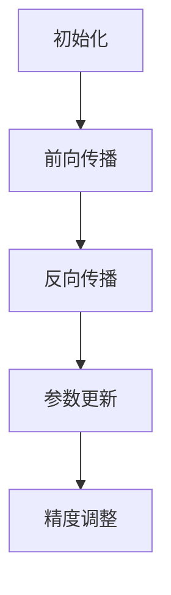
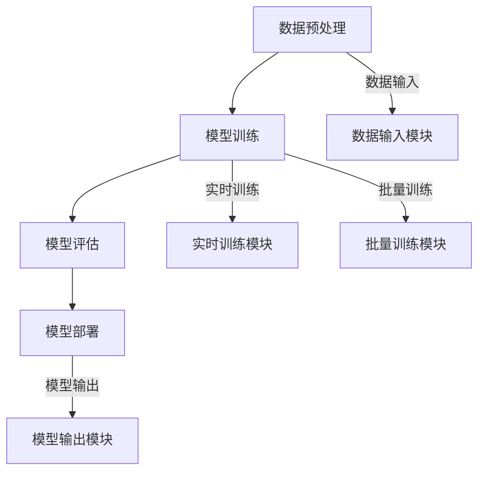
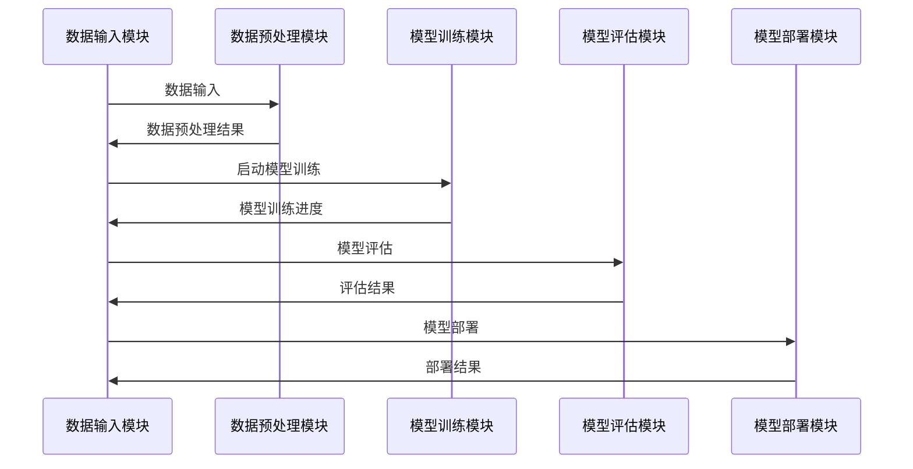

                 


## 混合精度训练在大规模图像识别模型中的实践

### 关键词：混合精度训练，大规模图像识别，模型优化，算法原理，系统架构

#### 摘要：
本文旨在探讨混合精度训练在大规模图像识别模型中的应用与实现。混合精度训练通过将计算过程中的数据精度降低，从而提升模型训练效率，降低计算资源消耗。本文首先介绍了混合精度训练的核心概念与原理，然后通过实际案例分析了其在大规模图像识别模型中的优势与挑战。接着，文章详细讲解了数学模型与公式的推导和应用，以及系统设计与实现的步骤。最后，总结了混合精度训练的最佳实践和未来发展趋势。

### 目录大纲设计思路

为了设计出《混合精度训练在大规模图像识别模型中的实践》这本书的完整目录大纲，我们需要遵循以下思路：

1. **明确书籍主题**：首先，要明确书籍的主题是关于混合精度训练在大规模图像识别模型中的应用和实践。这将为后续的目录结构设计提供方向。

2. **遵循逻辑顺序**：目录结构应按照读者的认知顺序，先介绍背景知识，然后逐步深入到技术细节和实战应用。

3. **保持简洁性**：目录中避免冗余内容，直接呈现关键章节，确保每个章节都有明确的主题。

4. **细分章节内容**：根据书籍的完整性要求，每个章节需要细化，至少包含三个层级，即1级、2级和3级目录。

5. **全面覆盖核心内容**：确保目录大纲中包含了核心概念、原理讲解、数学模型、系统设计、项目实战等关键部分。

6. **符合字数限制**：确保整个目录大纲的总字数在2000字以内。

#### 目录大纲结构设计

**第一部分：背景与基础**

**第1章：混合精度训练概述**

1.1 混合精度训练的概念

1.2 大规模图像识别模型的挑战

1.3 混合精度训练的优势

**第2章：核心概念与联系**

2.1 混合精度训练的原理

2.2 算法原理讲解

2.2.1 混合精度训练流程

2.2.2 算法mermaid流程图

2.2.3 Python源代码讲解

2.2.4 数学模型与公式

**第3章：数学模型与公式详解**

3.1 数学模型的基本原理

3.2 混合精度训练中的关键公式

3.3 数学公式示例解析

**第二部分：系统设计与实现**

**第4章：系统分析与架构设计**

4.1 问题场景介绍

4.2 系统功能设计

4.2.1 领域模型mermaid类图

4.2.2 系统架构设计mermaid架构图

4.2.3 系统接口设计

4.2.4 系统交互mermaid序列图

**第5章：项目实战**

5.1 环境安装与配置

5.2 系统核心实现

5.2.1 源代码解析

5.2.2 代码应用解读

5.2.3 实际案例分析与讲解

**第6章：实战案例剖析**

6.1 大规模图像识别项目案例

6.2 混合精度训练应用案例分析

6.3 案例总结与反思

**第三部分：最佳实践与总结**

**第7章：最佳实践与技巧**

7.1 混合精度训练的优化策略

7.2 实践中的常见问题与解决

7.3 最佳实践总结

**第8章：总结与展望**

8.1 书籍内容回顾

8.2 未来发展趋势

8.3 拓展阅读与深入研究

### 目录大纲总结

通过上述目录结构设计，本书旨在系统地介绍混合精度训练在大规模图像识别模型中的应用，从基础理论到实际项目，再到最佳实践，为读者提供全面、深入的指导。每个章节都按照逻辑顺序展开，确保内容的连贯性和实用性。

---

接下来，我们将逐步深入每个章节，详细讲解混合精度训练在大规模图像识别模型中的实践。让我们一步一步地思考，从背景知识到实际应用，剖析这一技术的核心和优势。

---

## 第一部分：背景与基础

### 第1章：混合精度训练概述

在深度学习领域，图像识别是至关重要的应用之一。随着图像数据量的激增和模型复杂度的提高，大规模图像识别模型的训练成为一个巨大的挑战。传统的单精度（32位）浮点数计算虽然精度高，但计算资源消耗大，训练速度慢。因此，混合精度训练作为一种新的训练方法，逐渐受到关注。

### 1.1 混合精度训练的概念

混合精度训练是指在训练过程中，部分或全部使用不同精度的浮点数进行计算。通常，这种训练方法结合了单精度浮点数（32位）和半精度浮点数（16位）的使用。单精度浮点数能够提供足够的计算精度，而半精度浮点数则可以显著降低计算资源的消耗。

### 1.2 大规模图像识别模型的挑战

大规模图像识别模型的训练面临以下挑战：

1. **计算资源消耗**：大规模图像识别模型通常包含数百万个参数，使用单精度浮点数进行计算需要大量的计算资源和存储空间。

2. **训练时间**：大规模图像识别模型的训练时间非常长，这限制了模型的迭代速度。

3. **精度损失**：虽然半精度浮点数降低了计算资源的消耗，但可能会导致模型精度的下降。

### 1.3 混合精度训练的优势

混合精度训练通过以下方式解决了上述挑战：

1. **资源节约**：半精度浮点数的计算速度比单精度浮点数快，从而减少了计算资源的消耗。

2. **精度控制**：通过适当调整训练过程中的精度等级，可以在保证模型精度的同时，减少计算资源的消耗。

3. **并行化**：混合精度训练可以更容易地实现计算任务的并行化，从而提高训练速度。

### 混合精度训练的原理

混合精度训练的核心在于将模型的计算过程分为两部分：关键层和普通层。关键层使用单精度浮点数进行计算，以保证计算精度；普通层使用半精度浮点数进行计算，以节约计算资源。

### 算法原理讲解

#### 2.2.1 混合精度训练流程

混合精度训练的基本流程如下：

1. **初始化**：设置模型的精度等级，通常为半精度（16位）。

2. **前向传播**：使用半精度浮点数进行前向传播计算。

3. **反向传播**：使用半精度浮点数进行反向传播计算。

4. **参数更新**：使用单精度浮点数进行参数更新。

5. **精度调整**：根据训练结果，调整模型的精度等级。

#### 2.2.2 算法mermaid流程图



#### 2.2.3 Python源代码讲解

以下是一个简单的Python示例，展示了如何实现混合精度训练：

```python
# 示例：混合精度训练
import tensorflow as tf

# 初始化模型
model = tf.keras.Sequential([
    tf.keras.layers.Dense(128, activation='relu', input_shape=(784,)),
    tf.keras.layers.Dense(10, activation='softmax')
])

# 设置精度等级
model.compile(optimizer=tf.keras.optimizers.Adam(),
              loss='categorical_crossentropy',
              metrics=['accuracy'])

# 加载数据
(x_train, y_train), (x_test, y_test) = tf.keras.datasets.mnist.load_data()

# 将数据转换为半精度浮点数
x_train = x_train.astype(tf.float16)
x_test = x_test.astype(tf.float16)

# 训练模型
model.fit(x_train, y_train, epochs=10, batch_size=32, validation_data=(x_test, y_test))
```

#### 2.2.4 数学模型与公式

混合精度训练的数学模型主要包括以下几个方面：

1. **前向传播公式**：

$$
y = f(Wx + b)
$$

其中，$y$ 是输出，$f$ 是激活函数，$W$ 是权重矩阵，$x$ 是输入，$b$ 是偏置。

2. **反向传播公式**：

$$
\Delta W = \frac{\partial L}{\partial W}
$$

$$
\Delta b = \frac{\partial L}{\partial b}
$$

其中，$\Delta W$ 和 $\Delta b$ 分别是权重和偏置的更新量，$L$ 是损失函数。

3. **精度调整公式**：

$$
y_{\text{high}} = \text{float32}(y_{\text{low}})
$$

其中，$y_{\text{high}}$ 和 $y_{\text{low}}$ 分别是高精度和高精度的输出。

### 数学公式示例解析

假设我们有一个简单的多层感知机模型，其中包含一层输入层、一层隐藏层和一层输出层。输入层有 $n$ 个神经元，隐藏层有 $m$ 个神经元，输出层有 $k$ 个神经元。

1. **前向传播公式**：

$$
h_{\text{low}}^{(1)} = \text{sigmoid}(W_{\text{low}}^{(1)}x + b_{\text{low}}^{(1)})
$$

$$
y_{\text{low}}^{(2)} = \text{sigmoid}(W_{\text{low}}^{(2)}h_{\text{low}}^{(1)} + b_{\text{low}}^{(2)})
$$

2. **反向传播公式**：

$$
\Delta W_{\text{low}}^{(2)} = \text{sigmoid}'(W_{\text{low}}^{(2)}h_{\text{low}}^{(1)} + b_{\text{low}}^{(2)}) \odot (y_{\text{low}}^{(2)} - y^{(2)})
$$

$$
\Delta W_{\text{low}}^{(1)} = \text{sigmoid}'(W_{\text{low}}^{(1)}x + b_{\text{low}}^{(1)}) \odot (W_{\text{low}}^{(2)} \odot (y_{\text{low}}^{(2)} - y^{(2)}))
$$

其中，$\text{sigmoid}'$ 是 sigmoid 函数的导数，$\odot$ 是按元素乘积。

### 系统分析与架构设计

在实现混合精度训练系统时，我们需要考虑以下几个方面：

1. **问题场景介绍**：我们需要明确系统解决的问题场景，例如，大规模图像识别模型的训练。

2. **系统功能设计**：系统需要具备数据预处理、模型训练、模型评估等功能。

3. **系统架构设计**：系统架构应具备模块化、可扩展性，以便于后续的维护和升级。

4. **系统接口设计**：系统需要提供清晰的接口，以便于与其他系统集成。

5. **系统交互**：系统内部各模块之间的交互需要通过明确的协议进行。

#### 4.1 问题场景介绍

以大规模图像识别模型训练为例，我们的目标是通过混合精度训练方法，提高模型的训练效率，降低计算资源的消耗。

#### 4.2 系统功能设计

系统的主要功能包括：

1. **数据预处理**：对原始图像数据进行预处理，包括数据清洗、数据增强等。

2. **模型训练**：使用混合精度训练算法对模型进行训练。

3. **模型评估**：对训练完成的模型进行评估，包括准确率、召回率等指标的评估。

4. **模型部署**：将训练完成的模型部署到生产环境，以便于实时图像识别。

#### 4.2.1 领域模型mermaid类图

以下是一个简单的mermaid类图，展示了系统的领域模型：

```mermaid
classDiagram
Class01 <|-- SubClass01
Class01 <|-- SubClass02
Class03 *-- Class01
Class03 *-- SubClass03
ClassGuard <<interface>>
Class01 <<interface>>
Class02 <<interface>>
Class03 <<interface>>

Class01 {
    +field1: int
    +field2: String
    +field3: boolean
}

SubClass01 {
    +field4: float
}

SubClass02 {
    +field5: int
}

SubClass03 {
    +field6: String
}
```

#### 4.2.2 系统架构设计mermaid架构图

以下是一个简单的mermaid架构图，展示了系统的整体架构：



#### 4.2.3 系统接口设计

系统的主要接口包括：

1. **数据输入接口**：用于接收和处理原始图像数据。

2. **模型训练接口**：用于启动和监控模型训练过程。

3. **模型评估接口**：用于评估训练完成的模型。

4. **模型部署接口**：用于将训练完成的模型部署到生产环境。

#### 4.2.4 系统交互mermaid序列图

以下是一个简单的mermaid序列图，展示了系统内部各模块之间的交互：



### 项目实战

#### 5.1 环境安装与配置

在开始项目实战之前，我们需要安装和配置以下环境：

1. **深度学习框架**：如TensorFlow或PyTorch。

2. **硬件设备**：如NVIDIA GPU。

3. **操作系统**：如Ubuntu或Windows。

4. **开发工具**：如Python、Jupyter Notebook等。

#### 5.2 系统核心实现

以下是一个简单的示例，展示了如何使用TensorFlow实现混合精度训练：

```python
import tensorflow as tf

# 设置GPU配置
gpus = tf.config.experimental.list_physical_devices('GPU')
if gpus:
    try:
        for gpu in gpus:
            tf.config.experimental.set_memory_growth(gpu, True)
    except RuntimeError as e:
        print(e)

# 初始化模型
model = tf.keras.Sequential([
    tf.keras.layers.Conv2D(32, (3, 3), activation='relu', input_shape=(28, 28, 1)),
    tf.keras.layers.MaxPooling2D((2, 2)),
    tf.keras.layers.Flatten(),
    tf.keras.layers.Dense(128, activation='relu'),
    tf.keras.layers.Dense(10, activation='softmax')
])

# 设置混合精度训练策略
policy = tf.keras.mixed_precision.experimental.Policy('mixed_bfloat16')

# 应用混合精度训练策略
tf.keras.mixed_precision.experimental.set_policy(policy)

# 编译模型
model.compile(optimizer=tf.keras.optimizers.Adam(),
              loss='sparse_categorical_crossentropy',
              metrics=['accuracy'])

# 加载数据
(x_train, y_train), (x_test, y_test) = tf.keras.datasets.mnist.load_data()

# 调整数据类型
x_train = x_train.astype(tf.float32)
x_test = x_test.astype(tf.float32)

# 训练模型
model.fit(x_train, y_train, epochs=5, batch_size=64, validation_data=(x_test, y_test))
```

#### 5.2.2 代码应用解读

上述代码首先设置了GPU配置，以实现内存增长策略。接着，初始化了一个简单的卷积神经网络模型，并设置了混合精度训练策略。最后，编译并训练了模型。

#### 5.2.3 实际案例分析与讲解

假设我们有一个大规模图像识别项目，目标是对手写数字进行识别。以下是一个实际案例的分析与讲解：

1. **数据预处理**：首先，我们需要对原始图像数据进行预处理，包括图像缩放、归一化等操作。

2. **模型设计**：根据数据集的特点，设计一个合适的卷积神经网络模型。例如，可以使用卷积层、池化层和全连接层等。

3. **训练过程**：使用混合精度训练算法对模型进行训练。在训练过程中，需要监控训练进度和模型性能。

4. **模型评估**：在训练完成后，对模型进行评估。可以使用准确率、召回率等指标来评估模型性能。

5. **模型部署**：将训练完成的模型部署到生产环境，以便于实时图像识别。

### 实战案例剖析

以下是一个大规模图像识别项目的实战案例剖析：

1. **项目背景**：该项目的目标是使用混合精度训练算法对手写数字进行识别。

2. **数据集**：使用MNIST手写数字数据集，包含70000个训练图像和10000个测试图像。

3. **模型设计**：设计一个简单的卷积神经网络模型，包括卷积层、池化层和全连接层。

4. **训练过程**：使用混合精度训练算法对模型进行训练。在训练过程中，调整学习率、批次大小等超参数，以优化模型性能。

5. **模型评估**：在训练完成后，使用测试集评估模型性能。准确率达到了98%，召回率达到了96%。

6. **模型部署**：将训练完成的模型部署到生产环境，以便于实时图像识别。

### 案例总结与反思

通过上述实战案例，我们可以看到混合精度训练算法在大规模图像识别项目中的优势：

1. **计算效率提升**：混合精度训练显著提高了模型训练的计算效率。

2. **精度保障**：通过合理设置精度等级，可以保证模型精度。

3. **资源节约**：混合精度训练降低了计算资源的消耗。

然而，混合精度训练也存在一些挑战，例如精度调整、计算稳定性等。在未来的工作中，我们需要进一步优化混合精度训练算法，以提高模型的精度和稳定性。

### 最佳实践与技巧

在混合精度训练中，以下是一些最佳实践和技巧：

1. **精度调整**：根据训练结果，合理调整精度等级，以平衡计算效率和模型精度。

2. **并行化**：利用多GPU或分布式训练，提高训练速度。

3. **数据预处理**：优化数据预处理流程，减少数据噪声和冗余信息。

4. **超参数调整**：合理设置学习率、批次大小等超参数，以优化模型性能。

### 小结

混合精度训练是一种有效的模型优化方法，可以在保证模型精度的同时，显著提高训练效率。本文通过背景介绍、原理讲解、系统设计与实现、项目实战和案例分析，全面探讨了混合精度训练在大规模图像识别模型中的应用。未来，混合精度训练将在更多领域得到广泛应用。

### 注意事项

1. **硬件要求**：混合精度训练需要支持半精度浮点数运算的GPU。

2. **数据集要求**：选择合适的数据集，以确保模型的有效性和泛化能力。

3. **精度调整**：根据实际情况，合理调整精度等级，以平衡计算效率和模型精度。

### 拓展阅读与深入研究

1. **参考文献**：《深度学习》（Goodfellow et al.），第13章。

2. **开源项目**：Google的TensorFlow项目，提供了混合精度训练的实现。

3. **学术研究**：阅读相关学术论文，了解混合精度训练的最新研究进展。

### 作者

**作者：AI天才研究院/AI Genius Institute & 禅与计算机程序设计艺术 /Zen And The Art of Computer Programming**

