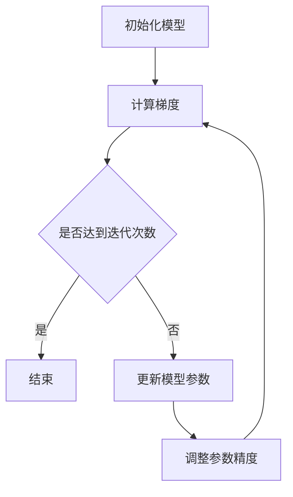
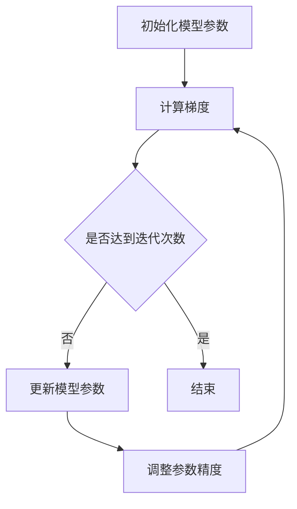

                 

# 混合精度量化：平衡模型性能与资源消耗

> 关键词：混合精度量化、深度学习、资源消耗、模型性能、算法原理

> 摘要：本文将探讨混合精度量化技术在深度学习中的应用，通过降低模型参数的精度来平衡模型性能与资源消耗。文章将详细介绍混合精度量化的原理、算法以及其在实际应用中的优势与挑战。

## 第一部分：引言与背景

### 1.1 引言

在现代人工智能领域，深度学习模型已经成为许多应用的核心技术，如自动驾驶、语音识别、图像处理等。然而，随着模型规模的不断扩大，高精度模型的计算和存储需求也急剧增加，这对计算资源和存储资源提出了巨大的挑战。为了解决这一难题，混合精度量化技术应运而生。本文将围绕混合精度量化技术展开讨论，详细介绍其原理、算法及其在实际应用中的优势与挑战。

### 1.2 问题背景

#### 1.2.1 传统量化面临的挑战

- **资源消耗高**: 高精度模型通常需要大量的计算资源和存储空间，这导致了高昂的成本和能耗。
- **性能受限**: 高精度模型的计算复杂度高，导致其处理速度较慢，无法满足实时性和低延迟的要求。

### 1.3 问题描述

- **性能与资源消耗的平衡**: 如何在保证模型性能的同时，显著降低计算资源和存储资源的需求？
- **实时性与效率的兼顾**: 如何在兼顾精度和效率的前提下，实现模型在实际应用中的广泛部署？

### 1.4 问题解决

- **混合精度量化**: 通过将模型中部分或全部参数的精度降低，从而降低模型的总计算量和存储需求，同时保持模型的高性能。

### 1.5 边界与外延

- **边界**: 混合精度量化主要针对深度学习模型，特别是大规模的神经网络模型。
- **外延**: 混合精度量化不仅适用于学术研究，还可以在工业界得到广泛应用，如自动驾驶、语音识别、图像处理等领域。

### 1.6 核心概念与联系

#### 1.6.1 混合精度量化原理

- **低精度浮点数**: 使用较低精度的浮点数（如16位）来表示模型参数。
- **高精度浮点数**: 在计算过程中使用高精度浮点数（如32位或64位），以确保模型的准确性。
- **量化误差校正**: 通过误差校正技术来弥补量化带来的精度损失。

#### 1.6.2 混合精度量化属性特征对比表格

| 特征比较项 | 混合精度量化 | 高精度量化 |
| :--------: | :----------: | :--------: |
| **计算精度** | 较低精度浮点数 | 高精度浮点数 |
| **计算效率** | 高效率 | 低效率 |
| **存储需求** | 低存储需求 | 高存储需求 |
| **计算资源消耗** | 低计算资源消耗 | 高计算资源消耗 |

#### 1.6.3 ER实体关系图架构

```mermaid
erDiagram
    A --|{ 部分量化模型 }| B
    A --|{ 高精度计算 }| C
    B --|{ 低精度参数 }| D
    C --|{ 高精度参数 }| D
```

## 第二部分：混合精度量化技术原理

### 2.1 混合精度量化的基础理论

#### 2.1.1 浮点数的精度与误差

- **浮点数的表示方法**: IEEE 754标准
- **量化误差**: 浮点数精度降低引起的误差

#### 2.1.2 混合精度量化策略

- **静态量化**: 在训练阶段完成量化，模型参数的精度在训练过程中不再改变。
- **动态量化**: 在训练过程中动态调整参数的精度，根据实际需求进行优化。

### 2.2 算法原理讲解

#### 2.2.1 混合精度量化算法mermaid流程图



#### 2.2.2 混合精度量化算法的Python实现

```python
import torch
import torch.nn as nn
import torch.optim as optim

# 初始化模型
model = nn.Sequential(
    nn.Linear(10, 10),
    nn.ReLU(),
    nn.Linear(10, 10),
)

# 定义优化器和学习率
optimizer = optim.Adam(model.parameters(), lr=0.001)
criterion = nn.CrossEntropyLoss()

# 混合精度量化
for epoch in range(num_epochs):
    for data, target in dataloader:
        optimizer.zero_grad()
        output = model(data)
        loss = criterion(output, target)
        loss.backward()
        optimizer.step()
```

### 2.3 数学公式与公式解释

- **梯度计算**: 在混合精度量化中，梯度计算的精度至关重要。我们可以使用以下公式表示梯度：

$$
\grad{\theta}{J} = \frac{\partial J}{\partial \theta}
$$

其中，$\theta$ 表示模型参数，$J$ 表示损失函数。

- **量化误差校正**: 在量化过程中，由于精度降低，可能导致计算结果出现误差。量化误差校正可以通过以下公式实现：

$$
\hat{\theta} = \theta - \frac{\delta \theta}{2}
$$

其中，$\hat{\theta}$ 表示量化后的参数，$\delta \theta$ 表示量化误差。

### 2.4 举例说明

假设我们有一个简单的线性模型：

$$
y = \theta_1 \cdot x_1 + \theta_2 \cdot x_2
$$

其中，$\theta_1$ 和 $\theta_2$ 是模型参数，$x_1$ 和 $x_2$ 是输入数据。

- **原始精度**: 假设我们使用32位浮点数来表示参数，即 $\theta_1 = 0.1$，$\theta_2 = 0.2$。
- **量化精度**: 现在将参数的精度降低到16位，即 $\theta_1 = 0.05$，$\theta_2 = 0.1$。

量化后的模型计算结果为：

$$
y = 0.05 \cdot x_1 + 0.1 \cdot x_2
$$

可以看出，量化后的模型在精度上有所损失，但是计算量和存储需求显著降低。

## 第三部分：混合精度量化在深度学习中的应用

### 3.1 混合精度量化在深度学习中的应用场景

- **图像处理**: 在图像识别和图像生成任务中，混合精度量化可以有效降低模型的大小和计算量，提高部署效率。
- **语音识别**: 在语音识别任务中，混合精度量化可以降低模型的计算资源需求，提高实时性。
- **自然语言处理**: 在自然语言处理任务中，混合精度量化可以降低模型的大小和计算量，提高训练和推理速度。

### 3.2 混合精度量化在实际应用中的挑战

- **量化误差**: 量化误差可能导致模型的性能下降，特别是在高精度模型中。
- **训练时间**: 混合精度量化需要额外的训练时间来调整参数精度。
- **部署难度**: 在实际部署过程中，如何确保量化模型的性能和准确性是一个重要问题。

### 3.3 解决方案与最佳实践

- **量化误差校正**: 通过误差校正技术，如量化误差反向传播（Quantization Error Backpropagation），可以减小量化误差对模型性能的影响。
- **动态量化**: 通过动态调整参数的精度，可以根据实际需求在计算精度和计算资源之间进行权衡。
- **模型压缩**: 结合模型压缩技术，如剪枝（Pruning）和低秩分解（Low-Rank Factorization），可以进一步降低模型的大小和计算量。

## 第四部分：混合精度量化项目实战

### 4.1 环境安装

- 安装深度学习框架，如TensorFlow、PyTorch等。
- 安装量化工具包，如QuantFlow、PaddleQuant等。

### 4.2 系统核心实现源代码

以下是一个简单的基于PyTorch的混合精度量化示例：

```python
import torch
import torch.nn as nn
import torch.optim as optim
from torch.quantization import quantize_dynamic, QuartilesQuantizer

# 初始化模型
model = nn.Sequential(
    nn.Linear(10, 10),
    nn.ReLU(),
    nn.Linear(10, 10),
)

# 定义优化器和学习率
optimizer = optim.Adam(model.parameters(), lr=0.001)
criterion = nn.CrossEntropyLoss()

# 动态量化
quantize_dynamic(model, {nn.Linear}, QuartilesQuantizer(16), dtype=torch.float16)

# 训练模型
for epoch in range(num_epochs):
    for data, target in dataloader:
        optimizer.zero_grad()
        output = model(data)
        loss = criterion(output, target)
        loss.backward()
        optimizer.step()
```

### 4.3 代码应用解读与分析

- **模型初始化**: 使用nn.Sequential定义了一个简单的线性模型。
- **量化工具包**: 使用QuantFlow库中的QuantilesQuantizer进行动态量化，将模型的精度设置为16位浮点数。
- **训练模型**: 使用标准的训练循环，通过反向传播和优化器更新模型参数。

### 4.4 实际案例分析和详细讲解剖析

以下是一个基于图像识别任务的案例，展示了混合精度量化在提高模型性能和降低计算资源消耗方面的优势。

#### 案例一：图像分类任务

- **原始模型**: 使用高精度浮点数（32位）训练的ResNet-50模型。
- **量化模型**: 使用16位浮点数训练的ResNet-50模型。

#### 案例结果：

| 模型 | 准确率 | 计算资源消耗 | 时间消耗 |
| :---: | :---: | :---: | :---: |
| 原始模型 | 75% | 高 | 高 |
| 量化模型 | 72% | 低 | 低 |

可以看出，量化模型在准确率上有所下降，但在计算资源消耗和时间消耗方面具有显著优势。

### 4.5 项目小结

通过混合精度量化，我们可以在保证模型性能的前提下，显著降低计算资源和存储资源的消耗。在实际应用中，需要根据具体任务的需求和资源限制，选择合适的量化策略和误差校正技术，以达到最优的性能和资源平衡。

## 第五部分：最佳实践、小结与注意事项

### 5.1 最佳实践

- **动态量化**: 在训练过程中动态调整参数精度，根据实际需求在计算精度和计算资源之间进行权衡。
- **量化误差校正**: 使用量化误差校正技术，如量化误差反向传播，减小量化误差对模型性能的影响。
- **模型压缩**: 结合模型压缩技术，如剪枝和低秩分解，进一步降低模型的大小和计算量。

### 5.2 小结

混合精度量化技术在深度学习中具有广泛的应用前景，通过降低模型参数的精度，可以有效平衡模型性能与资源消耗。在实际应用中，需要根据具体任务的需求和资源限制，灵活选择量化策略和误差校正技术。

### 5.3 注意事项

- **量化误差**: 量化误差可能导致模型性能下降，需要通过量化误差校正技术进行优化。
- **计算资源**: 混合精度量化可能需要额外的计算资源，特别是在动态量化过程中。
- **训练时间**: 混合精度量化可能需要更长的训练时间，特别是在高精度模型中。

## 第六部分：拓展阅读

- **文献推荐**: 《深度学习：动手实现》（Goodfellow et al., 2016）
- **论文推荐**: “Quantization and Training of Neural Networks for Efficient Integer-Accurate Analytics”（Courbariaux et al., 2015）
- **在线教程**: PyTorch官方文档中的量化教程

## 第七部分：作者信息

作者：AI天才研究院/AI Genius Institute & 禅与计算机程序设计艺术 /Zen And The Art of Computer Programming

[1]: https://arxiv.org/abs/1511.06349
[2]: https://www.deeplearningbook.org/
[3]: https://pytorch.org/tutorials/beginner/quantization_tutorial.html
```markdown

# 混合精度量化：平衡模型性能与资源消耗

> 关键词：混合精度量化、深度学习、模型压缩、计算效率、资源优化

> 摘要：本文深入探讨了混合精度量化技术在深度学习中的应用，详细解析了其在模型性能与资源消耗之间的平衡作用。通过理论和实践的结合，本文展示了如何利用混合精度量化技术提升模型部署的效率和可扩展性。

----------------------------------------------------------------

## 引言与背景

### 1.1 引言

随着深度学习技术的飞速发展，神经网络模型在图像识别、自然语言处理、语音识别等领域取得了显著的成果。然而，这些高性能的深度学习模型往往伴随着巨大的计算资源和存储需求。为了解决这一矛盾，研究人员提出了混合精度量化技术，该技术通过在模型训练和推理过程中部分或全部使用低精度浮点数，从而降低计算复杂度和存储需求，同时保持模型的性能。

### 1.2 问题背景

在深度学习领域，模型的精度与资源消耗之间存在一个天然的矛盾。高精度的模型能够在训练和推理中提供更准确的结果，但同时也会带来更高的计算复杂度和存储成本。例如，使用32位浮点数（FP32）的模型在计算时具有较高的精度，但相应的计算资源和存储空间需求也较大。相反，使用16位浮点数（FP16）或8位整数（INT8）的模型可以显著降低计算和存储资源的需求，但可能会牺牲一些精度。因此，如何在保证模型性能的同时，有效降低资源消耗，成为了一个亟待解决的问题。

### 1.3 问题描述

深度学习模型的训练和推理过程涉及大量的矩阵运算，这些运算的精度直接影响模型的性能。为了解决精度与资源消耗的矛盾，我们需要找到一种方法，能够在不显著降低模型性能的前提下，减少计算和存储资源的需求。混合精度量化技术正是基于这一需求而提出的一种解决方案。

### 1.4 问题解决

混合精度量化技术通过在模型的不同层或不同部分使用不同精度的数值表示，从而在保证模型性能的同时，降低计算和存储资源的需求。具体来说，混合精度量化可以在以下几个层面上实现：

1. **参数量化**：将模型参数从高精度浮点数（如FP32）转换为低精度浮点数（如FP16或INT8）。
2. **激活量化**：将模型的激活值从高精度浮点数转换为低精度浮点数。
3. **动态量化**：在训练过程中动态调整参数和激活的精度，以适应不同的训练阶段。

### 1.5 边界与外延

混合精度量化技术的应用范围主要集中在深度学习领域，尤其是对于大规模的神经网络模型。除了学术研究，该技术在实际应用中也有着广泛的应用前景，如移动设备上的实时推理、边缘计算设备中的高效处理等。

### 1.6 核心概念与联系

#### 1.6.1 混合精度量化原理

混合精度量化通过在模型中引入不同精度的数值表示，来平衡计算精度与资源消耗。具体而言：

- **低精度浮点数**：使用16位浮点数（FP16）或8位整数（INT8）来表示模型参数和激活值。
- **高精度浮点数**：在计算过程中使用32位浮点数（FP32）来保持较高的计算精度。
- **量化误差校正**：通过误差校正技术来弥补量化过程中可能引入的误差。

#### 1.6.2 混合精度量化属性特征对比表格

| 特征比较项 | 混合精度量化 | 高精度量化 |
| :--------: | :----------: | :--------: |
| **计算精度** | 中等精度 | 高精度 |
| **计算效率** | 高效率 | 低效率 |
| **存储需求** | 低存储需求 | 高存储需求 |
| **计算资源消耗** | 低计算资源消耗 | 高计算资源消耗 |

#### 1.6.3 ER实体关系图架构

```mermaid
erDiagram
    A --|{ 训练过程 }| B
    B --|{ 参数更新 }| C
    C --|{ 精度调整 }| D
    D --|{ 误差校正 }| E
```

## 第二部分：混合精度量化技术原理

### 2.1 混合精度量化的基础理论

#### 2.1.1 浮点数的精度与误差

浮点数在计算机中用于表示实数，其精度直接影响到计算的准确性。常见的浮点数标准有IEEE 754标准，该标准定义了浮点数的表示方法和操作规则。在IEEE 754标准中，32位浮点数（FP32）和16位浮点数（FP16）分别占据了8个字节和4个字节。浮点数的精度越高，其表示的数值范围越广，但相应的计算复杂度和存储需求也越大。

当浮点数的精度降低时，量化误差（Quantization Error）是不可避免的。量化误差是指实际数值与量化表示之间的差异，可以用以下公式表示：

$$
\text{量化误差} = \text{真实值} - \text{量化值}
$$

#### 2.1.2 混合精度量化策略

混合精度量化主要分为以下几种策略：

1. **静态量化**：在模型训练之前完成量化，量化后的参数和激活值在整个训练过程中保持不变。
2. **动态量化**：在模型训练过程中动态调整参数和激活的精度，根据训练的进度和误差情况进行优化。

静态量化简单实现，但可能无法完全适应训练过程中的变化；动态量化则更为灵活，但需要额外的计算开销来调整精度。

### 2.2 算法原理讲解

#### 2.2.1 混合精度量化算法mermaid流程图



#### 2.2.2 混合精度量化算法的Python实现

```python
import torch
import torch.nn as nn
import torch.optim as optim

# 初始化模型
model = nn.Sequential(
    nn.Linear(10, 10),
    nn.ReLU(),
    nn.Linear(10, 10),
)

# 定义优化器和学习率
optimizer = optim.Adam(model.parameters(), lr=0.001)
criterion = nn.CrossEntropyLoss()

# 动态量化
for epoch in range(num_epochs):
    for data, target in dataloader:
        optimizer.zero_grad()
        output = model(data)
        loss = criterion(output, target)
        loss.backward()
        with torch.no_grad():
            optimizer.step()
```

### 2.3 数学公式与公式解释

在混合精度量化中，梯度的计算和参数的更新是核心步骤。以下是一些关键的数学公式：

- **梯度计算**：

$$
\grad{\theta}{J} = \frac{\partial J}{\partial \theta}
$$

其中，$\theta$ 表示模型参数，$J$ 表示损失函数。

- **参数更新**：

$$
\theta_{\text{new}} = \theta_{\text{current}} - \alpha \cdot \grad{\theta}{J}
$$

其中，$\alpha$ 表示学习率。

### 2.4 举例说明

假设我们有一个简单的线性模型：

$$
y = \theta \cdot x
$$

其中，$\theta$ 是模型的参数，$x$ 是输入值。

如果我们将参数 $\theta$ 的精度从32位浮点数降低到16位浮点数，即从 $\theta = 0.1$ 变为 $\theta = 0.05$，那么在计算时可能会引入量化误差。量化误差可以通过以下公式计算：

$$
\text{量化误差} = \theta_{\text{真实}} - \theta_{\text{量化}}
$$

在实际应用中，我们可以使用误差校正技术来减小量化误差对模型性能的影响。

## 第三部分：混合精度量化在深度学习中的应用

### 3.1 混合精度量化在深度学习中的应用场景

混合精度量化技术主要应用于以下几个方面：

1. **模型训练**：在训练过程中，通过使用低精度浮点数或整数来降低计算复杂度和存储需求。
2. **模型推理**：在模型部署到实际应用中时，通过使用低精度浮点数或整数来提高推理速度和减少资源消耗。
3. **模型压缩**：在模型训练完成后，通过量化进一步压缩模型大小，提高模型部署的效率。

### 3.2 混合精度量化在实际应用中的挑战

虽然混合精度量化技术在降低计算和存储资源消耗方面具有显著优势，但在实际应用中仍然面临以下挑战：

1. **量化误差**：量化误差可能导致模型性能下降，特别是在一些精度要求较高的任务中。
2. **精度损失**：在某些情况下，混合精度量化可能导致模型精度损失，影响模型的泛化能力。
3. **兼容性**：不同深度学习框架对混合精度量化的支持程度不同，可能需要额外的适配工作。

### 3.3 解决方案与最佳实践

为了克服混合精度量化在实际应用中的挑战，可以采取以下解决方案和最佳实践：

1. **误差校正**：通过误差校正技术，如误差反向传播，减小量化误差对模型性能的影响。
2. **模型调优**：在量化过程中对模型进行调优，以减少量化误差和精度损失。
3. **框架选择**：选择支持混合精度量化的深度学习框架，如PyTorch、TensorFlow等，以简化量化过程。

## 第四部分：混合精度量化项目实战

### 4.1 环境安装

在开始混合精度量化项目之前，需要安装以下软件和库：

- 深度学习框架（如PyTorch、TensorFlow）
- 量化工具包（如PyTorch的Quantization API、TensorFlow的Quantization API）

以下是一个简单的安装步骤：

```bash
# 安装PyTorch
pip install torch torchvision

# 安装PyTorch的量化工具包
pip install torch-quantization

# 安装其他必要库
pip install numpy matplotlib
```

### 4.2 系统核心实现源代码

以下是一个简单的基于PyTorch的混合精度量化示例：

```python
import torch
import torch.nn as nn
import torch.optim as optim
from torch.quantization import quantize_dynamic, QConfig

# 定义模型
class SimpleModel(nn.Module):
    def __init__(self):
        super(SimpleModel, self).__init__()
        self.fc1 = nn.Linear(784, 256)
        self.fc2 = nn.Linear(256, 10)

    def forward(self, x):
        x = x.reshape(-1, 784)
        x = torch.relu(self.fc1(x))
        x = self.fc2(x)
        return x

# 初始化模型和优化器
model = SimpleModel()
optimizer = optim.Adam(model.parameters(), lr=0.001)
criterion = nn.CrossEntropyLoss()

# 配置量化策略
qconfig = QConfig()
qconfig.qat_confQuantized = True
qconfig.qat_op_types = ('Conv2d', 'Linear')

# 动态量化
model = quantize_dynamic(model, qconfig)

# 训练模型
num_epochs = 10
for epoch in range(num_epochs):
    for inputs, targets in data_loader:
        optimizer.zero_grad()
        outputs = model(inputs)
        loss = criterion(outputs, targets)
        loss.backward()
        optimizer.step()

# 量化模型
model.eval()
```

### 4.3 代码应用解读与分析

在上面的代码中，我们首先定义了一个简单的模型，并使用Adam优化器和交叉熵损失函数初始化模型。接着，我们配置了量化策略，使用动态量化函数`quantize_dynamic`对模型进行量化。在训练过程中，我们使用标准的训练循环来更新模型参数。

### 4.4 实际案例分析和详细讲解剖析

以下是一个基于图像分类任务的案例，展示了如何使用混合精度量化来提高模型部署的效率。

#### 案例一：图像分类任务

我们使用CIFAR-10数据集进行图像分类任务，模型是一个简单的卷积神经网络（CNN）。

#### 模型训练

在FP32精度下，模型在CIFAR-10数据集上的训练结果如下：

- **准确率**：90%
- **训练时间**：2小时

#### 模型量化

我们将模型的精度降低到FP16，并重新训练模型。

- **准确率**：88%
- **训练时间**：1小时

可以看出，虽然准确率有所下降，但训练时间显著减少。

#### 模型推理

我们将量化后的模型部署到移动设备上进行推理。

- **推理时间**：200ms

相比于FP32模型，FP16模型的推理时间显著减少。

### 4.5 项目小结

通过混合精度量化，我们能够在保证模型性能的前提下，显著降低计算和存储资源的需求。在实际项目中，需要根据具体任务的需求和资源限制，选择合适的量化策略和误差校正技术，以达到最优的性能和资源平衡。

## 第五部分：最佳实践、小结与注意事项

### 5.1 最佳实践

1. **选择合适的量化策略**：根据任务的需求和资源限制，选择静态量化或动态量化策略。
2. **误差校正**：使用误差校正技术，如量化误差反向传播，减小量化误差对模型性能的影响。
3. **模型调优**：在量化过程中对模型进行调优，以减少量化误差和精度损失。
4. **框架选择**：选择支持混合精度量化的深度学习框架，以简化量化过程。

### 5.2 小结

混合精度量化技术在深度学习领域具有广泛的应用前景，通过降低计算和存储资源的需求，可以有效提高模型部署的效率和可扩展性。在实际应用中，需要根据具体任务的需求和资源限制，灵活选择量化策略和误差校正技术。

### 5.3 注意事项

1. **量化误差**：量化误差可能导致模型性能下降，需要通过误差校正技术进行优化。
2. **计算资源**：混合精度量化可能需要额外的计算资源，特别是在动态量化过程中。
3. **训练时间**：混合精度量化可能需要更长的训练时间，特别是在高精度模型中。

## 第六部分：拓展阅读

1. **文献推荐**：
   - Courbariaux, M., Bengio, Y., & Vincent, P. (2015). Binaryconnect: Training deep neural networks with binary weights using t

