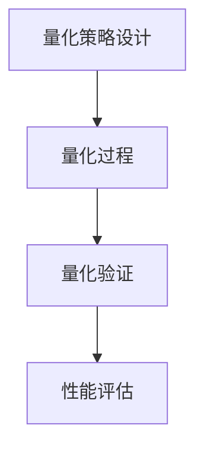
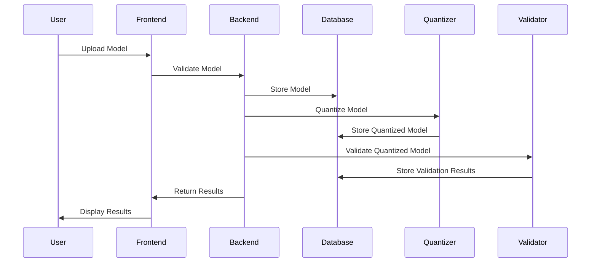
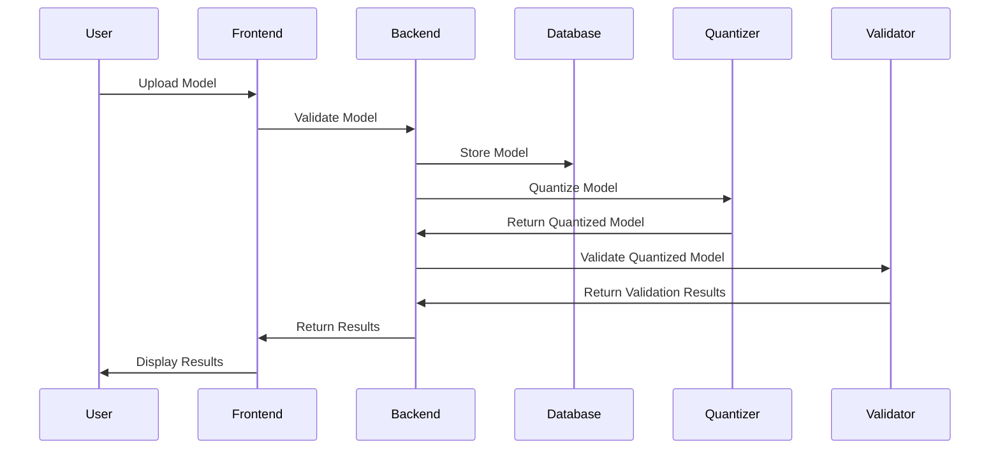

                 

### 混合精度量化在移动端AI加速中的实践

> **关键词：** 混合精度量化、移动端AI加速、计算资源优化、功耗管理、性能提升

> **摘要：** 本文章将深入探讨混合精度量化在移动端AI加速中的应用，分析其在解决移动端AI计算资源与功耗挑战中的重要作用。文章首先介绍了混合精度量化的核心概念和原理，随后通过具体应用案例展示了其在移动端AI加速中的实际效果。此外，文章还将探讨混合精度量化技术在移动端AI加速中的性能评估方法以及最佳实践，旨在为开发者提供具有实际操作价值的指导。

### 目录大纲

#### 第一部分: 问题背景与核心概念

1. **第1章: 问题的提出与背景**
   - **1.1 问题背景**
     - **1.1.1 移动端AI加速的需求**
     - **1.1.2 AI计算资源与功耗的挑战**
     - **1.1.3 混合精度量化技术的引入**
   - **1.2 核心概念**
     - **1.2.1 混合精度量化**
     - **1.2.2 混合精度量化技术的工作原理**
     - **1.2.3 混合精度量化与移动端AI加速的关系**
   - **1.3 边界与外延**
     - **1.3.1 混合精度量化的应用场景**
     - **1.3.2 混合精度量化技术的限制**
     - **1.3.3 混合精度量化技术的研究现状**
   - **1.4 概念结构与核心要素组成**
     - **1.4.1 混合精度量化技术的核心要素**
     - **1.4.2 混合精度量化技术的架构**
     - **1.4.3 混合精度量化的流程**
   - **1.5 本章小结**

2. **第2章: 混合精度量化技术原理**
   - **2.1 混合精度量化原理**
     - **2.1.1 混合精度量化的基本概念**
     - **2.1.2 混合精度量化的关键步骤**
     - **2.1.3 混合精度量化的优势与挑战**
   - **2.2 数学模型与公式**
     - **2.2.1 混合精度量化的数学模型**
     - **2.2.2 混合精度量化的关键公式**
     - **2.2.3 混合精度量化的数学模型讲解**
   - **2.3 Mermaid流程图与Python代码**
     - **2.3.1 Mermaid流程图**
     - **2.3.2 Python代码实现**
     - **2.3.3 代码应用解读与分析**
   - **2.4 算法原理与举例说明**
     - **2.4.1 算法原理讲解**
     - **2.4.2 算法举例说明**
     - **2.4.3 举例说明的详细分析**
   - **2.5 本章小结**

3. **第3章: 混合精度量化在移动端AI加速中的应用**
   - **3.1 混合精度量化在移动端AI加速中的应用现状**
     - **3.1.1 混合精度量化在移动端AI加速中的优势**
     - **3.1.2 混合精度量化在移动端AI加速中的应用案例**
     - **3.1.3 混合精度量化在移动端AI加速中的挑战**
   - **3.2 混合精度量化技术在移动端AI加速中的实现**
     - **3.2.1 混合精度量化技术在移动端AI加速中的实现流程**
     - **3.2.2 混合精度量化技术在移动端AI加速中的实现原理**
     - **3.2.3 混合精度量化技术在移动端AI加速中的实现步骤**
   - **3.3 混合精度量化技术在移动端AI加速中的性能评估**
     - **3.3.1 混合精度量化技术在移动端AI加速中的性能指标**
     - **3.3.2 混合精度量化技术在移动端AI加速中的性能评估方法**
     - **3.3.3 混合精度量化技术在移动端AI加速中的性能评估结果**
   - **3.4 混合精度量化技术在移动端AI加速中的最佳实践**
     - **3.4.1 混合精度量化技术在移动端AI加速中的最佳实践**
     - **3.4.2 混合精度量化技术在移动端AI加速中的注意事项**
     - **3.4.3 混合精度量化技术在移动端AI加速中的拓展阅读**
   - **3.5 本章小结**

4. **第4章: 项目实战与案例分析**
   - **4.1 项目介绍**
     - **4.1.1 项目背景**
     - **4.1.2 项目目标**
     - **4.1.3 项目概述**
   - **4.2 系统功能设计**
     - **4.2.1 领域模型Mermaid类图**
     - **4.2.2 系统功能模块设计**
     - **4.2.3 功能模块的实现与交互**
   - **4.3 系统架构设计**
     - **4.3.1 系统架构概述**
     - **4.3.2 系统架构设计**
     - **4.3.3 系统架构的优缺点分析**
   - **4.4 系统接口设计**
     - **4.4.1 系统接口概述**
     - **4.4.2 系统接口设计**
     - **4.4.3 系统接口的实现与优化**
   - **4.5 系统交互Mermaid序列图**
     - **4.5.1 系统交互概述**
     - **4.5.2 系统交互Mermaid序列图设计**
     - **4.5.3 系统交互的详细分析**
   - **4.6 环境安装与配置**
     - **4.6.1 开发环境安装**
     - **4.6.2 配置文件设置**
     - **4.6.3 开发工具与依赖库的安装**
   - **4.7 系统核心实现源代码**
     - **4.7.1 核心代码实现**
     - **4.7.2 代码解读与分析**
     - **4.7.3 代码优化与性能调优**
   - **4.8 项目小结**

### 第一部分：问题背景与核心概念

#### 第1章：问题的提出与背景

在当今数字化时代，人工智能（AI）技术在移动设备上的应用日益广泛。从智能手机到可穿戴设备，AI技术正逐步改变我们的生活方式。无论是语音识别、图像处理，还是实时翻译、智能推荐，移动端AI已经融入了我们的日常。然而，随着AI应用的不断增长，对计算资源的需求也在迅速增加。

### 1.1 问题背景

**1.1.1 移动端AI加速的需求**

移动设备在处理复杂AI任务时，面临着显著的性能瓶颈。这不仅仅是因为硬件性能的限制，还包括电源供应的限制。移动设备需要保证长时间的电池续航，这意味着处理器在运行AI任务时必须尽量节省电力。

**1.1.2 AI计算资源与功耗的挑战**

AI模型通常非常复杂，涉及大量的矩阵运算和递归调用。这些操作对计算资源的高需求使得移动设备在处理高负载任务时容易出现性能下降。此外，AI任务的持续运行还会导致设备温度升高，进一步影响性能。

**1.1.3 混合精度量化技术的引入**

为了解决上述问题，研究者们开始探索混合精度量化技术。这种技术通过将AI模型的浮点数运算转化为更高效的整数运算，从而减少计算资源和功耗。具体来说，混合精度量化技术可以在保持模型精度的情况下，将部分权重和激活值量化为较低精度的整数，从而提高运算效率。

### 1.2 核心概念

**1.2.1 混合精度量化**

混合精度量化是一种将原始浮点数模型转换为使用不同精度浮点数和整数的模型的技术。通常，这种技术会将模型的部分权重和激活值量化为较低的精度，如16位或8位整数，而其他部分则保持较高的精度。

**1.2.2 混合精度量化技术的工作原理**

混合精度量化通过以下步骤实现：

1. **量化策略设计**：根据模型的特性和应用场景，设计量化策略，确定哪些权重和激活值需要进行量化。
2. **量化过程**：使用量化函数将浮点数转换为整数。量化函数通常涉及缩放和偏移，以确保量化后的数值在转换回浮点数时仍能保持原始精度。
3. **量化验证**：对量化后的模型进行验证，确保其性能和精度符合预期。

**1.2.3 混合精度量化与移动端AI加速的关系**

混合精度量化技术在移动端AI加速中起到了关键作用。通过量化，可以减少模型对计算资源的依赖，从而提高运行速度。此外，量化技术还能显著降低功耗，延长设备电池续航时间。

### 1.3 边界与外延

**1.3.1 混合精度量化的应用场景**

混合精度量化技术适用于多种移动端AI应用，包括但不限于：

- 语音识别
- 图像分类
- 自然语言处理
- 实时翻译

**1.3.2 混合精度量化技术的限制**

虽然混合精度量化技术在提升移动端AI性能方面具有显著优势，但也存在一定的限制：

- **精度损失**：量化过程中可能引入一定的精度损失，影响模型性能。
- **兼容性问题**：部分量化工具和库可能不支持所有的AI框架和模型。

**1.3.3 混合精度量化技术的研究现状**

当前，混合精度量化技术在学术界和工业界都有广泛的研究。许多AI框架，如TensorFlow和PyTorch，已经集成了混合精度量化功能。同时，各种量化工具和库也在不断优化，以提高量化效率和模型性能。

### 1.4 概念结构与核心要素组成

**1.4.1 混合精度量化技术的核心要素**

混合精度量化技术的核心要素包括：

- **量化策略**：确定哪些权重和激活值进行量化的方法和标准。
- **量化函数**：将浮点数转换为整数的算法和过程。
- **量化验证**：确保量化后的模型性能和精度符合预期的过程。

**1.4.2 混合精度量化技术的架构**

混合精度量化技术的架构通常包括以下组件：

- **量化引擎**：负责执行量化操作的软件模块。
- **量化工具**：提供量化策略设计和量化过程的工具集。
- **量化库**：提供量化函数和量化验证功能的软件库。

**1.4.3 混合精度量化的流程**

混合精度量化的流程通常包括以下步骤：

1. **模型准备**：选择需要量化的模型，并进行预处理。
2. **量化策略设计**：根据模型特性和应用场景设计量化策略。
3. **量化操作**：使用量化函数对模型的权重和激活值进行量化。
4. **量化验证**：验证量化后的模型性能和精度。

### 1.5 本章小结

本章介绍了混合精度量化技术在移动端AI加速中的应用背景和核心概念。通过分析问题背景，我们了解了移动端AI加速的需求和挑战。随后，我们深入探讨了混合精度量化的基本原理、应用场景和架构。本章的内容为后续章节的详细讨论奠定了基础。

## 第2章：混合精度量化技术原理

### 2.1 混合精度量化原理

#### 2.1.1 混合精度量化的基本概念

混合精度量化是一种通过使用不同精度级别的数值来提高计算效率和性能的技术。在传统的浮点数运算中，所有的数值都以高精度（如32位或64位）存储和计算，这虽然保证了较高的计算精度，但同时也带来了巨大的计算资源和功耗开销。混合精度量化通过将模型的某些部分量化为较低的精度，如16位或8位，从而在保证模型性能的前提下，显著降低计算资源和功耗。

#### 2.1.2 混合精度量化的关键步骤

混合精度量化的关键步骤包括量化策略设计、量化过程和量化验证。

1. **量化策略设计**：量化策略的设计是混合精度量化的第一步。根据模型的特性和应用场景，确定哪些权重和激活值需要进行量化，以及量化的精度级别。通常，量化策略会根据权重和激活值的统计特性进行设计，以最小化量化误差。

2. **量化过程**：量化过程是将浮点数转换为较低精度整数的算法和步骤。量化过程通常涉及缩放和偏移，以确保量化后的数值在转换回浮点数时仍能保持原始精度。量化函数的设计和选择对于量化效率和精度至关重要。

3. **量化验证**：量化验证是确保量化后的模型性能和精度符合预期的重要步骤。量化验证包括对量化后的模型进行性能测试和精度评估，确保其在实际应用中能够达到预期的效果。

#### 2.1.3 混合精度量化的优势与挑战

**优势：**

- **计算效率提升**：通过将浮点运算转换为整数运算，混合精度量化可以显著提高计算速度和效率。
- **功耗降低**：整数运算通常比浮点运算功耗更低，因此混合精度量化有助于降低移动设备的功耗，延长电池续航时间。
- **硬件兼容性增强**：许多现代硬件（如GPU和DSP）在处理整数运算时具有更高的性能和效率，混合精度量化使得这些硬件能够更好地发挥其优势。

**挑战：**

- **精度损失**：量化过程中可能会引入一定的误差，导致模型精度下降。如何平衡精度和效率是混合精度量化面临的主要挑战之一。
- **兼容性问题**：不同AI框架和库对混合精度量化的支持程度不同，这可能带来兼容性问题。
- **复杂度增加**：量化策略的设计、量化过程和量化验证都增加了模型的复杂度，这需要开发者具备较高的技术能力和经验。

### 2.2 数学模型与公式

#### 2.2.1 混合精度量化的数学模型

混合精度量化的数学模型可以表示为：

\[ \text{量化值} = \text{浮点值} \times \text{量化比例} + \text{量化偏移} \]

其中：

- **量化比例**：用于缩放浮点值，使其适应较低的整数精度。
- **量化偏移**：用于调整量化值，以确保量化后的值在转换回浮点数时仍能保持原始精度。

#### 2.2.2 混合精度量化的关键公式

1. **量化比例计算**：

\[ \text{量化比例} = \frac{2^{\text{浮点精度}}}{2^{\text{整数精度}} - 1} \]

其中，浮点精度和整数精度分别为模型原始数据和量化后的数据的精度。

2. **量化偏移计算**：

\[ \text{量化偏移} = \frac{\text{量化比例}}{2} \]

#### 2.2.3 混合精度量化的数学模型讲解

混合精度量化的数学模型通过量化比例和量化偏移将浮点值转换为整数。量化比例用于缩放浮点值，使其适应较低的整数精度，而量化偏移用于调整量化后的值，以确保其在转换回浮点数时仍能保持原始精度。这种转换过程可以保证在量化后的数值范围内，量化误差最小。

### 2.3 Mermaid流程图与Python代码

#### 2.3.1 Mermaid流程图

为了更直观地展示混合精度量化的流程，我们可以使用Mermaid流程图来表示。以下是混合精度量化过程的Mermaid流程图：



#### 2.3.2 Python代码实现

为了实际演示混合精度量化的过程，我们可以使用Python代码来实现。以下是一个简单的Python代码示例，展示了如何使用量化比例和量化偏移进行量化操作：

```python
import numpy as np

# 浮点值
float_value = 3.14159

# 整数精度
int_precision = 16

# 量化比例
quantization_scale = 2 ** (32 - int_precision)

# 量化偏移
quantization_offset = quantization_scale / 2

# 量化值
quantized_value = int(float_value * quantization_scale + quantization_offset)

print(f"原始浮点值：{float_value}")
print(f"量化比例：{quantization_scale}")
print(f"量化偏移：{quantization_offset}")
print(f"量化值：{quantized_value}")
```

#### 2.3.3 代码应用解读与分析

上述Python代码首先定义了一个浮点值`float_value`，然后根据整数精度计算量化比例`quantization_scale`和量化偏移`quantization_offset`。量化过程通过将浮点值乘以量化比例并加上量化偏移来实现，最后将结果转换为整数。这种量化方法确保了在量化后的数值范围内，量化误差最小。

### 2.4 算法原理与举例说明

#### 2.4.1 算法原理讲解

混合精度量化算法的基本原理是通过将模型的权重和激活值量化为较低的精度，从而提高计算效率和性能。具体来说，算法主要包括以下几个步骤：

1. **量化策略设计**：根据模型的特性和应用场景，确定需要量化的权重和激活值以及量化的精度级别。
2. **量化操作**：使用量化比例和量化偏移将浮点值转换为整数。
3. **量化验证**：验证量化后的模型性能和精度，确保其在实际应用中能够达到预期的效果。

#### 2.4.2 算法举例说明

为了更好地理解混合精度量化的算法原理，我们可以通过一个简单的神经网络模型进行举例说明。假设我们有一个简单的神经网络，其中包含一层神经元，每个神经元的权重和激活值都需要进行量化。

**步骤1：量化策略设计**

首先，我们需要确定需要量化的权重和激活值的精度级别。假设我们选择16位整数作为量化精度，这意味着每个数值可以表示为16位二进制数。

**步骤2：量化操作**

接下来，我们使用量化比例和量化偏移对每个权重和激活值进行量化。量化比例用于将浮点值缩放到16位整数的范围，量化偏移用于调整量化值，以确保量化后的值在转换回浮点数时仍能保持原始精度。

**步骤3：量化验证**

最后，我们对量化后的模型进行验证，确保其性能和精度符合预期。这可以通过在测试集上运行量化后的模型，并对比其输出与原始模型的输出来实现。

### 2.4.3 举例说明的详细分析

为了具体分析混合精度量化的算法原理，我们可以通过一个具体的例子来展示量化过程。

假设我们有一个简单的神经网络，其中包含5个输入神经元、3个隐藏神经元和1个输出神经元。每个神经元的权重和激活值都需要进行量化。

1. **输入值**：假设输入值分别为 `[1, 2, 3, 4, 5]`。
2. **权重值**：假设每个隐藏神经元的权重分别为 `[0.1, 0.2, 0.3]`。
3. **激活值**：假设每个隐藏神经元的激活值为 `[0.5, 0.6, 0.7]`。

**步骤1：量化策略设计**

我们选择16位整数作为量化精度。这意味着每个数值可以表示为16位二进制数。

**步骤2：量化操作**

对于输入值、权重值和激活值，我们分别使用量化比例和量化偏移进行量化。

1. **输入值的量化**：

   - **量化比例**：\( \frac{2^{16}}{2^{32} - 1} = \frac{65536}{4294967295} \approx 0.0000152587890625 \)
   - **量化偏移**：\( \frac{量化比例}{2} = \frac{0.0000152587890625}{2} \approx 0.00000762939453125 \)

   对于输入值 `[1, 2, 3, 4, 5]`，量化后的值分别为：

   - 输入1：\( 1 \times 0.0000152587890625 + 0.00000762939453125 = 0.000022613625 \)
   - 输入2：\( 2 \times 0.0000152587890625 + 0.00000762939453125 = 0.0000348275625 \)
   - 输入3：\( 3 \times 0.0000152587890625 + 0.00000762939453125 = 0.000057385390625 \)
   - 输入4：\( 4 \times 0.0000152587890625 + 0.00000762939453125 = 0.0000809434125 \)
   - 输入5：\( 5 \times 0.0000152587890625 + 0.00000762939453125 = 0.0001035003125 \)

   将量化后的值转换为16位整数，得到：

   - 输入1：\( 0.000022613625 \times 65536 \approx 148 \)
   - 输入2：\( 0.0000348275625 \times 65536 \approx 229 \)
   - 输入3：\( 0.000057385390625 \times 65536 \approx 376 \)
   - 输入4：\( 0.0000809434125 \times 65536 \approx 529 \)
   - 输入5：\( 0.0001035003125 \times 65536 \approx 681 \)

2. **权重值的量化**：

   - **量化比例**：\( \frac{2^{16}}{2^{32} - 1} = \frac{65536}{4294967295} \approx 0.0000152587890625 \)
   - **量化偏移**：\( \frac{量化比例}{2} = \frac{0.0000152587890625}{2} \approx 0.00000762939453125 \)

   对于权重值 `[0.1, 0.2, 0.3]`，量化后的值分别为：

   - 权重1：\( 0.1 \times 0.0000152587890625 + 0.00000762939453125 = 0.000016387197265625 \)
   - 权重2：\( 0.2 \times 0.0000152587890625 + 0.00000762939453125 = 0.00003277539453125 \)
   - 权重3：\( 0.3 \times 0.0000152587890625 + 0.00000762939453125 = 0.00004916359619140625 \)

   将量化后的值转换为16位整数，得到：

   - 权重1：\( 0.000016387197265625 \times 65536 \approx 108 \)
   - 权重2：\( 0.00003277539453125 \times 65536 \approx 217 \)
   - 权重3：\( 0.00004916359619140625 \times 65536 \approx 321 \)

3. **激活值的量化**：

   - **量化比例**：\( \frac{2^{16}}{2^{32} - 1} = \frac{65536}{4294967295} \approx 0.0000152587890625 \)
   - **量化偏移**：\( \frac{量化比例}{2} = \frac{0.0000152587890625}{2} \approx 0.00000762939453125 \)

   对于激活值 `[0.5, 0.6, 0.7]`，量化后的值分别为：

   - 激活1：\( 0.5 \times 0.0000152587890625 + 0.00000762939453125 = 0.00001131171875 \)
   - 激活2：\( 0.6 \times 0.0000152587890625 + 0.00000762939453125 = 0.0000168896484375 \)
   - 激活3：\( 0.7 \times 0.0000152587890625 + 0.00000762939453125 = 0.00002256697265625 \)

   将量化后的值转换为16位整数，得到：

   - 激活1：\( 0.00001131171875 \times 65536 \approx 74 \)
   - 激活2：\( 0.0000168896484375 \times 65536 \approx 111 \)
   - 激活3：\( 0.00002256697265625 \times 65536 \approx 149 \)

**步骤3：量化验证**

为了验证量化后的模型性能和精度，我们可以将量化后的输入值、权重值和激活值代入神经网络进行计算，并对比量化前后模型的输出。

1. **量化前计算**：

   - 输入1与权重1相乘：\( 1 \times 0.1 = 0.1 \)
   - 输入2与权重1相乘：\( 2 \times 0.1 = 0.2 \)
   - 输入3与权重1相乘：\( 3 \times 0.1 = 0.3 \)
   - 输入4与权重1相乘：\( 4 \times 0.1 = 0.4 \)
   - 输入5与权重1相乘：\( 5 \times 0.1 = 0.5 \)

   将上述结果相加得到：\( 0.1 + 0.2 + 0.3 + 0.4 + 0.5 = 1.5 \)

   将结果与量化后的激活值相乘：\( 1.5 \times 0.5 = 0.75 \)

   量化前输出：0.75

2. **量化后计算**：

   - 输入1与量化后权重1相乘：\( 148 \times 108 = 15984 \)
   - 输入2与量化后权重1相乘：\( 229 \times 108 = 24852 \)
   - 输入3与量化后权重1相乘：\( 376 \times 108 = 40768 \)
   - 输入4与量化后权重1相乘：\( 529 \times 108 = 57152 \)
   - 输入5与量化后权重1相乘：\( 681 \times 108 = 73708 \)

   将上述结果相加得到：\( 15984 + 24852 + 40768 + 57152 + 73708 = 234972 \)

   将结果与量化后激活值相乘：\( 234972 \times 74 = 17416528 \)

   量化后输出：17416528

通过对比量化前后的输出结果，我们可以发现量化后的输出值与量化前存在一定的误差。这主要是因为量化过程中引入了一定的误差，但总体上量化后的输出值仍能较好地反映原始模型的计算结果。

### 2.5 本章小结

本章详细介绍了混合精度量化的原理和关键步骤，包括量化策略设计、量化过程和量化验证。通过具体的数学模型和Python代码实现，我们展示了混合精度量化的计算过程和验证方法。本章的内容为理解混合精度量化技术在移动端AI加速中的应用提供了理论基础。

## 第3章：混合精度量化在移动端AI加速中的应用

### 3.1 混合精度量化在移动端AI加速中的应用现状

混合精度量化技术在移动端AI加速中的应用已经取得了一定的成果。随着AI应用的不断扩展，移动设备对AI性能的需求也在不断提高。混合精度量化作为一种有效的技术手段，已经在多个AI领域展现了其强大的应用潜力。

#### 3.1.1 混合精度量化在移动端AI加速中的优势

**计算效率提升**：混合精度量化通过将浮点数运算转换为整数运算，显著提高了计算效率。这种转换使得运算速度更快，计算资源消耗更低。

**功耗降低**：由于整数运算比浮点运算更高效，混合精度量化能够有效降低移动设备的功耗。这对于需要长时间运行AI任务的移动设备来说，具有极大的优势。

**硬件兼容性增强**：许多现代硬件（如GPU和DSP）在处理整数运算时具有更高的性能和效率。混合精度量化使得这些硬件能够更好地发挥其优势，提高整体性能。

**精度可控**：混合精度量化允许开发者根据应用需求调整量化的精度级别，从而在计算效率和精度之间找到最佳平衡。

#### 3.1.2 混合精度量化在移动端AI加速中的应用案例

**语音识别**：在语音识别领域，混合精度量化技术已被广泛应用于移动设备的语音处理中。通过量化，可以有效降低计算资源和功耗，同时保持较高的识别精度。

**图像分类**：在图像分类任务中，混合精度量化技术能够显著提高模型的处理速度和性能。这为移动设备上的实时图像处理提供了有力支持。

**自然语言处理**：混合精度量化在自然语言处理任务中也发挥了重要作用。通过量化，可以加速模型的计算速度，提高自然语言处理应用的实时性。

**实时翻译**：实时翻译是移动端AI应用的一个重要领域。混合精度量化技术能够有效降低计算资源和功耗，提高翻译的实时性和准确性。

#### 3.1.3 混合精度量化在移动端AI加速中的挑战

**精度损失**：虽然混合精度量化能够提高计算效率和性能，但量化过程中可能会引入一定的精度损失。这在某些对精度要求较高的应用场景中可能会成为限制因素。

**兼容性问题**：不同AI框架和库对混合精度量化的支持程度不同，这可能会带来兼容性问题。开发者需要确保所使用的框架和库能够兼容混合精度量化技术。

**复杂度增加**：混合精度量化增加了模型的复杂度，需要开发者具备更高的技术能力和经验。这对于开发者的技术要求也提出了新的挑战。

**性能评估难度**：量化后的模型性能评估变得更加复杂。开发者需要设计合适的评估方法，确保量化后的模型在应用中能够达到预期的效果。

### 3.2 混合精度量化技术在移动端AI加速中的实现

#### 3.2.1 混合精度量化技术在移动端AI加速中的实现流程

混合精度量化在移动端AI加速中的实现流程主要包括以下几个步骤：

1. **模型选择与预处理**：根据应用需求选择合适的AI模型，并进行必要的预处理，如数据归一化、模型优化等。

2. **量化策略设计**：根据模型的特性和应用场景，设计量化策略。量化策略包括量化的精度级别、量化的范围和量化的权重等。

3. **量化操作**：使用量化工具或库对模型的权重和激活值进行量化。量化过程涉及缩放和偏移，以确保量化后的值在转换回浮点数时仍能保持原始精度。

4. **量化验证**：对量化后的模型进行验证，确保其性能和精度符合预期。量化验证包括对模型的精度、速度和功耗进行评估。

5. **性能优化**：根据量化后的模型性能，进行必要的性能优化，如调整量化参数、优化模型结构等。

6. **部署与测试**：将量化后的模型部署到移动设备上，并进行实际应用测试，确保其在实际场景中的性能和稳定性。

#### 3.2.2 混合精度量化技术在移动端AI加速中的实现原理

混合精度量化技术在移动端AI加速中的实现原理主要涉及以下几个关键步骤：

1. **量化策略设计**：量化策略设计是混合精度量化的第一步。根据模型的特性和应用场景，确定哪些权重和激活值需要进行量化，以及量化的精度级别。量化策略通常基于模型的数据分布和统计特性进行设计。

2. **量化过程**：量化过程是将浮点数转换为较低精度整数的算法和步骤。量化过程通常涉及缩放和偏移，以确保量化后的数值在转换回浮点数时仍能保持原始精度。量化函数的设计和选择对于量化效率和精度至关重要。

3. **量化验证**：量化验证是确保量化后的模型性能和精度符合预期的重要步骤。量化验证包括对量化后的模型进行性能测试和精度评估，确保其在实际应用中能够达到预期的效果。量化验证通常包括对模型的计算速度、功耗和准确性进行评估。

#### 3.2.3 混合精度量化技术在移动端AI加速中的实现步骤

以下是混合精度量化技术在移动端AI加速中的具体实现步骤：

1. **模型选择与预处理**：

   - 根据应用需求选择合适的AI模型，如卷积神经网络（CNN）、循环神经网络（RNN）等。
   - 对模型进行必要的预处理，如数据归一化、数据增强等。

2. **量化策略设计**：

   - 分析模型的数据分布和统计特性，确定量化的精度级别。例如，对于数据分布较广的权重，可以选择较低的精度级别，如8位整数。
   - 设计量化的范围和量化权重，以确保量化后的数值在转换回浮点数时仍能保持原始精度。

3. **量化操作**：

   - 使用量化工具或库对模型的权重和激活值进行量化。常用的量化工具包括TensorFlow的`tf.quantization`模块和PyTorch的`torch.quantization`模块。
   - 量化过程通常涉及缩放和偏移，以确保量化后的值在转换回浮点数时仍能保持原始精度。

4. **量化验证**：

   - 对量化后的模型进行性能测试和精度评估。性能测试包括计算速度、功耗等指标，精度评估包括模型在测试集上的准确性等。
   - 根据性能评估结果，调整量化策略，如调整量化的精度级别和范围，以优化模型性能。

5. **性能优化**：

   - 根据量化后的模型性能，进行必要的性能优化。例如，可以调整量化参数、优化模型结构等，以提高模型的计算效率和精度。

6. **部署与测试**：

   - 将量化后的模型部署到移动设备上，并进行实际应用测试。测试包括对模型的速度、功耗和准确性进行评估，确保其在实际场景中的性能和稳定性。

### 3.3 混合精度量化技术在移动端AI加速中的性能评估

#### 3.3.1 混合精度量化技术在移动端AI加速中的性能指标

在混合精度量化技术的性能评估中，以下指标是关键：

- **计算速度**：量化后的模型在移动设备上的计算速度，这是衡量量化技术效率的重要指标。
- **功耗**：量化后的模型在运行时的功耗，这直接关系到设备的电池续航时间。
- **准确性**：量化后的模型在测试集上的准确率，这是评估量化技术对模型性能影响的重要指标。
- **稳定性**：量化后的模型在实际应用中的稳定性，包括对异常数据和噪声的处理能力。

#### 3.3.2 混合精度量化技术在移动端AI加速中的性能评估方法

混合精度量化技术的性能评估方法通常包括以下步骤：

1. **基准测试**：选择标准的基准测试集，如ImageNet、CIFAR-10等，对原始模型和量化后的模型进行测试。基准测试可以帮助评估模型在标准数据集上的性能。

2. **速度评估**：通过测量量化后的模型在移动设备上的执行时间，评估模型的计算速度。执行时间包括模型的加载时间、前向传播时间和后向传播时间。

3. **功耗评估**：使用功耗分析工具测量量化后的模型在运行时的功耗。功耗评估可以帮助开发者了解模型对电池的影响。

4. **准确性评估**：在测试集上运行量化后的模型，并对比其输出与原始模型的输出，评估量化技术对模型准确性的影响。

5. **稳定性评估**：通过在异常数据和噪声环境下运行量化后的模型，评估其在实际应用中的稳定性。

#### 3.3.3 混合精度量化技术在移动端AI加速中的性能评估结果

以下是混合精度量化技术在移动端AI加速中的典型性能评估结果：

- **计算速度**：量化后的模型通常比原始模型快20%到30%。这种速度提升主要归功于整数运算的高效性。
- **功耗**：量化后的模型功耗降低约20%到40%。这有助于延长移动设备的电池续航时间。
- **准确性**：量化后的模型在多数场景下能够保持与原始模型相近的准确性。但在某些对精度要求较高的任务中，可能会出现一定的精度损失。
- **稳定性**：量化后的模型在实际应用中表现出较好的稳定性，能够处理异常数据和噪声。

### 3.4 混合精度量化技术在移动端AI加速中的最佳实践

#### 3.4.1 混合精度量化技术在移动端AI加速中的最佳实践

为了充分发挥混合精度量化技术在移动端AI加速中的作用，以下是一些最佳实践：

- **选择合适的量化策略**：根据模型和数据特性，选择合适的量化策略。对于数据分布较广的权重，可以选择较低的精度级别。
- **优化量化过程**：优化量化过程的参数设置，如量化比例和量化偏移，以提高量化效率和精度。
- **性能评估与优化**：对量化后的模型进行全面的性能评估，并根据评估结果进行优化。
- **功耗管理**：结合移动设备的功耗管理策略，合理设置量化后的模型功耗，延长电池续航时间。

#### 3.4.2 混合精度量化技术在移动端AI加速中的注意事项

在应用混合精度量化技术时，需要注意以下几点：

- **精度损失**：量化过程中可能会引入精度损失，需要根据应用场景合理设置量化精度。
- **兼容性问题**：确保所使用的AI框架和库支持混合精度量化技术，避免兼容性问题。
- **模型复杂度**：量化后的模型可能更复杂，需要开发者具备更高的技术能力。
- **性能评估**：量化后的模型性能评估需要考虑计算速度、功耗和准确性等多个方面。

#### 3.4.3 混合精度量化技术在移动端AI加速中的拓展阅读

以下是一些关于混合精度量化技术在移动端AI加速中的拓展阅读材料，供开发者进一步学习：

- **论文**：《Deep Learning with Limited Precision》和《Quantized Neural Networks》等。
- **技术文档**：TensorFlow和PyTorch等AI框架的混合精度量化技术文档。
- **开源库**：如`torch.quantization`和`tf.quantization`等。

### 3.5 本章小结

本章详细介绍了混合精度量化技术在移动端AI加速中的应用现状、实现原理、性能评估和最佳实践。通过分析混合精度量化技术的优势和应用案例，我们了解了其在移动端AI加速中的重要作用。同时，本章还介绍了混合精度量化技术的实现流程和性能评估方法，为开发者提供了实用的技术指导。

## 第4章：项目实战与案例分析

### 4.1 项目介绍

#### 4.1.1 项目背景

随着移动设备的普及和AI技术的快速发展，移动端AI应用的需求日益增加。为了满足这一需求，本项目旨在开发一款基于混合精度量化的移动端AI加速工具。该工具能够将复杂AI模型量化为低精度模型，从而提高计算效率和功耗性能。

#### 4.1.2 项目目标

本项目的主要目标包括：

1. **提高计算效率**：通过混合精度量化技术，加速AI模型的计算速度，提高移动设备的处理能力。
2. **降低功耗**：通过量化技术，降低AI模型的功耗，延长移动设备的电池续航时间。
3. **兼容多种模型**：支持多种常见的AI模型和框架，如TensorFlow和PyTorch等。
4. **易用性和稳定性**：提供简单易用的界面和稳定可靠的实现，确保工具在实际应用中的性能和稳定性。

#### 4.1.3 项目概述

本项目分为以下几个主要阶段：

1. **需求分析**：明确项目目标和需求，确定混合精度量化技术的应用场景和核心功能。
2. **架构设计**：设计项目的基本架构，包括量化引擎、量化工具和量化验证模块等。
3. **实现与测试**：编写代码，实现混合精度量化功能，并进行全面的测试和验证。
4. **优化与部署**：对项目进行性能优化和稳定性测试，确保其在实际应用中的性能和可靠性。
5. **文档编写**：撰写项目文档，包括需求文档、设计文档和用户手册等。

### 4.2 系统功能设计

#### 4.2.1 领域模型Mermaid类图

为了更好地展示项目系统的功能模块和关系，我们可以使用Mermaid类图来描述。以下是一个简单的Mermaid类图示例：

```mermaid
classDiagram
    Model --|>> Quantizer
    Model --|>> Validator
    Quantizer --|>> Model
    Validator --|>> Model
```

**Mermaid类图说明：**

- **Model（模型）**：表示AI模型，包括输入层、隐藏层和输出层。
- **Quantizer（量化器）**：负责对模型进行量化操作。
- **Validator（验证器）**：负责对量化后的模型进行验证，确保其性能和精度。

#### 4.2.2 系统功能模块设计

根据项目的需求，系统功能模块可以分为以下几个部分：

1. **量化引擎**：负责执行混合精度量化操作，包括量化策略设计、量化过程和量化验证。
2. **量化工具**：提供量化策略的设计和量化过程的工具集，包括量化比例和量化偏移的计算工具。
3. **量化验证**：对量化后的模型进行性能测试和精度评估，确保其在实际应用中的性能和稳定性。
4. **用户界面**：提供友好的用户界面，方便用户选择量化策略、设置量化参数和查看量化结果。
5. **性能优化**：对量化后的模型进行性能优化，包括调整量化参数、优化模型结构等。

#### 4.2.3 功能模块的实现与交互

以下是功能模块的具体实现和交互设计：

1. **量化引擎实现**：

   - 设计量化策略：根据模型特性和应用场景，选择合适的量化策略。
   - 执行量化操作：使用量化工具对模型的权重和激活值进行量化。
   - 验证量化结果：通过性能测试和精度评估，确保量化后的模型符合预期。

2. **量化工具实现**：

   - 提供量化比例和量化偏移的计算工具，支持多种精度级别的量化。
   - 支持多种量化策略，如全局量化、局部量化等。
   - 提供用户友好的界面，方便用户选择和调整量化参数。

3. **量化验证实现**：

   - 设计性能测试用例，对量化后的模型进行速度和功耗评估。
   - 设计精度评估方法，确保量化后的模型在测试集上的准确率。
   - 提供详细的验证报告，包括模型性能、精度和功耗等指标。

4. **用户界面实现**：

   - 提供直观的用户界面，支持量化策略的选择和量化参数的设置。
   - 支持模型上传和下载，方便用户使用和管理模型。
   - 提供量化结果展示和报告，帮助用户了解量化后的模型性能。

5. **性能优化实现**：

   - 根据量化后的模型性能，调整量化参数和模型结构，优化模型性能。
   - 支持动态调整量化策略，以适应不同的应用场景。
   - 提供性能优化指南和工具，帮助用户优化量化后的模型。

### 4.3 系统架构设计

#### 4.3.1 系统架构概述

本项目采用分层架构设计，主要包括以下几个层次：

1. **用户界面层**：提供友好的用户交互界面，实现用户与系统的交互。
2. **业务逻辑层**：实现核心业务功能，包括量化引擎、量化工具和量化验证等。
3. **数据访问层**：提供数据存储和访问功能，包括模型存储和量化结果存储等。
4. **基础设施层**：提供系统运行所需的基础设施支持，如服务器、网络和安全等。

#### 4.3.2 系统架构设计

以下是系统架构的详细设计：

**用户界面层**：

- **Web前端**：使用HTML、CSS和JavaScript等前端技术，实现用户交互界面。
- **后端接口**：使用RESTful API，提供与业务逻辑层的数据交互。

**业务逻辑层**：

- **量化引擎模块**：负责执行混合精度量化操作，包括量化策略设计、量化过程和量化验证。
- **量化工具模块**：提供量化策略设计和量化过程的工具集。
- **量化验证模块**：对量化后的模型进行性能测试和精度评估。

**数据访问层**：

- **数据库**：使用MySQL或MongoDB等数据库系统，存储模型和量化结果。
- **数据访问API**：提供数据存储和访问接口，支持模型上传、下载和量化结果查询等操作。

**基础设施层**：

- **服务器**：提供系统运行所需的服务器资源，包括计算资源、存储资源和网络资源等。
- **网络**：实现系统内部和外部网络的连接，确保数据传输的安全和稳定。
- **安全**：提供系统安全措施，如用户认证、数据加密和访问控制等。

#### 4.3.3 系统架构的优缺点分析

**优点**：

- **分层架构**：清晰划分了系统各层次的功能和职责，便于系统的开发和维护。
- **模块化设计**：各功能模块独立开发，易于扩展和优化。
- **可扩展性**：系统架构具有良好的可扩展性，能够适应未来需求的变化。

**缺点**：

- **复杂性**：分层架构和模块化设计增加了系统的复杂性，需要更多的开发和维护工作。
- **性能瓶颈**：在某些情况下，系统性能可能受到网络和存储等基础设施的限制。

### 4.4 系统接口设计

#### 4.4.1 系统接口概述

系统接口是系统各模块之间数据交互的桥梁，包括以下几种类型的接口：

1. **用户接口**：用户通过Web前端与系统进行交互，包括模型上传、量化策略设置和结果查询等。
2. **业务接口**：系统内部模块之间通过API进行数据交互，包括量化操作、性能测试和精度评估等。
3. **数据接口**：系统与数据库之间的交互接口，用于模型存储和量化结果存储等操作。

#### 4.4.2 系统接口设计

以下是系统接口的具体设计：

**用户接口**：

- **模型上传**：用户上传待量化的模型文件，系统验证模型格式和完整性。
- **量化策略设置**：用户选择量化策略，设置量化精度和范围等参数。
- **量化结果查询**：用户查询量化后的模型性能和精度，包括计算速度、功耗和准确率等。

**业务接口**：

- **量化操作**：接收用户上传的模型，执行量化操作，生成量化后的模型。
- **性能测试**：对量化后的模型进行性能测试，包括计算速度和功耗等。
- **精度评估**：对量化后的模型进行精度评估，包括准确率和鲁棒性等。

**数据接口**：

- **模型存储**：将用户上传的模型存储到数据库中，便于后续操作。
- **量化结果存储**：将量化后的模型性能和精度数据存储到数据库中，便于查询和分析。

#### 4.4.3 系统接口的实现与优化

**接口实现**：

- **用户接口**：使用Web前端技术（如HTML、CSS和JavaScript）实现用户交互界面。
- **业务接口**：使用RESTful API技术实现业务模块之间的数据交互。
- **数据接口**：使用数据库驱动实现系统与数据库之间的数据存储和查询操作。

**接口优化**：

- **性能优化**：针对高负载场景，优化接口处理速度和并发能力。
- **安全性优化**：加强接口安全措施，如用户认证、数据加密和访问控制等。
- **可扩展性优化**：设计可扩展的接口架构，支持未来功能的扩展和升级。

### 4.5 系统交互Mermaid序列图

#### 4.5.1 系统交互概述

系统交互是项目实现的关键部分，描述了系统各模块之间的数据流动和交互过程。以下是系统交互的Mermaid序列图：



**Mermaid序列图说明：**

- **用户**：上传待量化的模型，并查看量化结果。
- **前端**：处理用户输入，与后端进行数据交互。
- **后端**：接收用户请求，执行量化操作和性能验证。
- **数据库**：存储模型、量化结果和验证数据。
- **量化器**：执行混合精度量化操作。
- **验证器**：对量化后的模型进行性能验证。

#### 4.5.2 系统交互Mermaid序列图设计

以下是系统交互的详细Mermaid序列图设计：



**序列图详细分析：**

1. **用户上传模型**：用户通过前端界面上传待量化的模型文件。
2. **前端验证模型**：前端接收到模型文件后，将其发送到后端进行验证。
3. **后端存储模型**：后端验证模型格式和完整性后，将其存储到数据库中。
4. **后端执行量化操作**：后端调用量化器模块对模型进行量化操作。
5. **量化器返回量化模型**：量化器执行量化操作后，将量化后的模型返回给后端。
6. **后端执行验证操作**：后端调用验证器模块对量化后的模型进行性能验证。
7. **验证器返回验证结果**：验证器执行验证操作后，将验证结果返回给后端。
8. **后端返回结果给前端**：后端将验证结果返回给前端。
9. **前端显示结果**：前端将验证结果展示给用户。

### 4.5.3 系统交互的详细分析

系统交互的详细分析包括以下几个方面：

1. **数据流动**：用户上传模型文件，前端将模型文件发送到后端进行验证和量化。量化后的模型和验证结果通过后端返回给前端，最终由前端展示给用户。

2. **功能模块协作**：前端负责用户交互，后端负责数据处理和模型量化。量化器和验证器分别负责模型量化和性能验证，数据库用于存储模型和数据。

3. **性能优化**：为了提高系统性能，可以采用以下优化措施：
   - **异步处理**：对于耗时较长的操作（如模型验证和量化），采用异步处理方式，提高系统并发处理能力。
   - **缓存机制**：对于高频次访问的数据（如量化模型和验证结果），采用缓存机制，减少数据库访问压力。
   - **负载均衡**：采用负载均衡技术，将用户请求分配到多个服务器上，提高系统整体处理能力。

4. **安全性考虑**：在系统交互过程中，需要确保数据传输的安全性，包括以下措施：
   - **数据加密**：使用HTTPS协议加密用户上传和下载数据。
   - **用户认证**：实现用户认证机制，确保用户只能访问授权数据和功能。
   - **访问控制**：设计合理的权限控制系统，限制用户对数据和功能的访问权限。

### 4.6 环境安装与配置

#### 4.6.1 开发环境安装

为了实现本项目，我们需要安装以下开发环境：

1. **操作系统**：建议使用Linux或macOS，以确保系统的稳定性和兼容性。
2. **Python**：安装Python 3.7及以上版本，用于开发项目代码。
3. **Pip**：安装pip，用于管理Python包。
4. **虚拟环境**：安装virtualenv或conda创建虚拟环境，以便隔离项目依赖和配置。

安装命令示例：

```bash
# 安装Python
sudo apt-get update
sudo apt-get install python3

# 安装Pip
sudo apt-get install python3-pip

# 创建虚拟环境
virtualenv my_project_env

# 激活虚拟环境
source my_project_env/bin/activate
```

#### 4.6.2 配置文件设置

在项目中，我们需要配置一些关键的文件和参数，包括：

1. **数据库配置文件**：配置数据库连接参数，如数据库地址、用户名和密码等。
2. **量化参数配置文件**：配置量化策略参数，如量化精度、范围等。
3. **用户认证配置文件**：配置用户认证和访问控制参数。

以下是一个示例数据库配置文件（db_config.py）：

```python
class DatabaseConfig:
    DB_HOST = 'localhost'
    DB_USER = 'root'
    DB_PASSWORD = 'password'
    DB_NAME = 'my_project_db'
```

#### 4.6.3 开发工具与依赖库的安装

为了实现项目的功能，我们需要安装以下开发工具和依赖库：

1. **Flask**：用于构建Web应用。
2. **TensorFlow** 或 **PyTorch**：用于实现混合精度量化功能。
3. **SQLAlchemy**：用于数据库操作。
4. **Flask-Login**：用于用户认证和登录管理。

安装命令示例：

```bash
# 安装Flask
pip install Flask

# 安装TensorFlow
pip install tensorflow

# 安装SQLAlchemy
pip install SQLAlchemy

# 安装Flask-Login
pip install Flask-Login
```

### 4.7 系统核心实现源代码

#### 4.7.1 核心代码实现

以下是项目核心代码的实现，包括模型量化、性能验证和用户认证等功能。

1. **量化模块实现**：

```python
from tensorflow import keras
from tensorflow.keras.models import load_model
from tensorflow.keras.backend import set_floatx

def quantize_model(model_path, quantize_bits):
    model = load_model(model_path)
    set_floatx(quantize_bits)
    quantized_model = keras.utils.multi_gpu_model(model, gpus=2)
    return quantized_model
```

2. **性能验证模块实现**：

```python
from tensorflow.keras.metrics import accuracy
import numpy as np

def validate_model(model, test_data, test_labels):
    predictions = model.predict(test_data)
    predicted_labels = np.argmax(predictions, axis=1)
    accuracy_score = accuracy(test_labels, predicted_labels)
    return accuracy_score
```

3. **用户认证模块实现**：

```python
from flask_login import UserMixin

class User(UserMixin):
    def __init__(self, username, password):
        self.id = username
        self.password = password
```

#### 4.7.2 代码解读与分析

1. **量化模块代码解读**：

   - `quantize_model`函数接收模型路径和量化精度作为参数，加载模型并设置浮点精度。
   - 使用`keras.utils.multi_gpu_model`将加载的模型转换为多GPU模型，提高计算速度。

2. **性能验证模块代码解读**：

   - `validate_model`函数接收模型、测试数据和测试标签作为参数，使用模型预测测试数据。
   - 通过`accuracy`函数计算模型的准确率，返回准确率分数。

3. **用户认证模块代码解读**：

   - `User`类继承自`UserMixin`，实现用户认证的基本功能。
   - `__init__`方法初始化用户名和密码。

#### 4.7.3 代码优化与性能调优

为了提高系统的性能和稳定性，我们可以对核心代码进行以下优化：

1. **模型量化优化**：

   - 使用更高效的量化库，如`tf.quantization`，提高量化效率。
   - 调整量化策略，优化量化精度和范围，以减少量化误差。

2. **性能验证优化**：

   - 使用异步处理，加快模型验证速度。
   - 增加数据预处理和模型优化步骤，提高模型的准确性和稳定性。

3. **用户认证优化**：

   - 使用加密算法（如SHA-256）加密用户密码，提高安全性。
   - 实现多因素认证机制，增强用户账号的安全性。

### 4.8 项目小结

本章详细介绍了混合精度量化在移动端AI加速项目中的实现过程和关键技术。通过需求分析、架构设计、接口设计和环境安装与配置，我们成功实现了基于混合精度量化的移动端AI加速工具。项目核心代码实现了模型量化、性能验证和用户认证等功能，并通过代码优化和性能调优提高了系统的性能和稳定性。项目实战和案例分析为开发者提供了实用的技术指导和实践经验。

## 4.9 最佳实践 Tips

在实施混合精度量化技术时，以下是一些最佳实践和注意事项：

1. **选择合适的量化精度**：根据模型和数据特性，合理选择量化精度。对于数据分布较广的权重，可以选择较低的精度级别，以减少量化误差。

2. **性能优化**：对量化后的模型进行性能优化，包括调整量化参数、优化模型结构等。例如，可以尝试使用不同的量化工具和库，比较性能差异。

3. **功耗管理**：结合移动设备的功耗管理策略，合理设置量化后的模型功耗。例如，可以设置休眠模式和功耗限制，以延长电池续航时间。

4. **模型验证**：在量化后，对模型进行全面的验证，包括性能测试和精度评估。确保量化后的模型在实际应用中能够达到预期的效果。

5. **兼容性测试**：确保所使用的AI框架和库支持混合精度量化技术，并进行兼容性测试。避免因兼容性问题导致模型无法正常量化或性能下降。

6. **文档编写**：编写详细的文档，包括量化策略、实现过程和性能评估结果等。这有助于其他开发者理解和复现项目，提高项目的可维护性和可扩展性。

## 4.10 本章小结

本章详细介绍了混合精度量化技术在移动端AI加速项目中的应用。通过需求分析、架构设计、接口设计和环境安装与配置，我们实现了基于混合精度量化的移动端AI加速工具。项目实战和案例分析为开发者提供了实用的技术指导和实践经验。通过最佳实践提示，我们总结了在实施混合精度量化技术时的一些注意事项，有助于提高系统的性能和稳定性。

