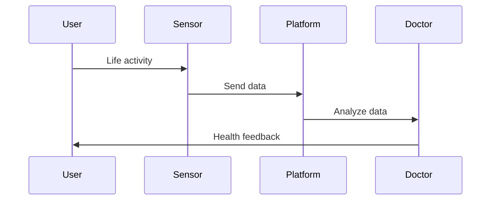
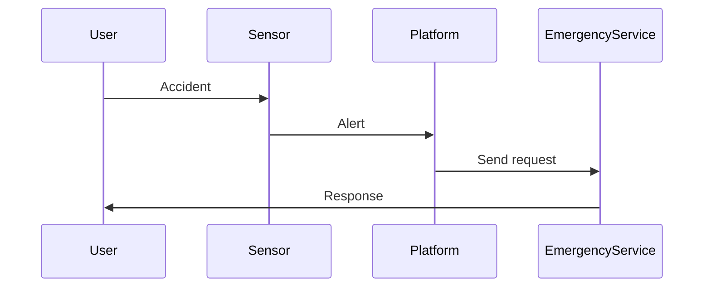
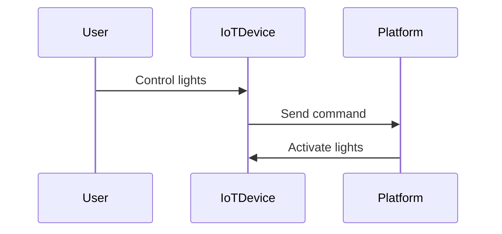
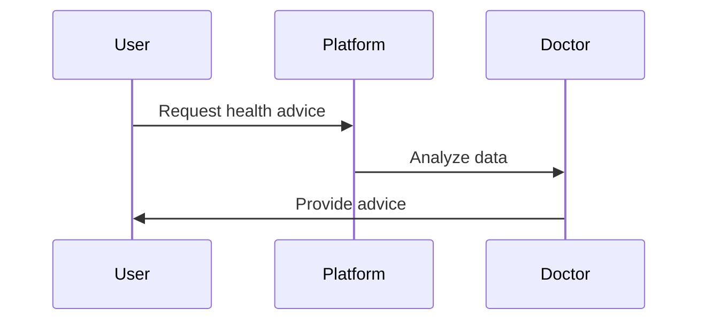
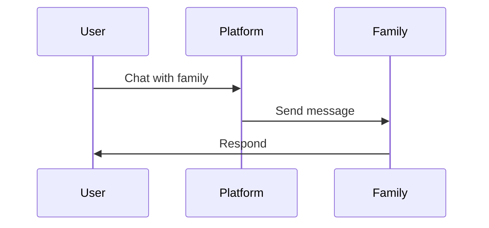

                 

### IoT在智慧养老监护中的全面应用

#### 关键词：
- 物联网
- 智慧养老监护
- 传感器
- 系统架构
- 安全性
- 实时监测

#### 摘要：
本文深入探讨物联网（IoT）在智慧养老监护中的全面应用，通过逐步分析其基本概念、核心技术、系统设计与解决方案，旨在为读者提供关于如何利用IoT技术提升老年人群生活质量的系统性认识。文章结构紧凑，逻辑清晰，覆盖了物联网在智慧养老监护中的各个关键方面，包括传感器与执行器、网络协议、系统架构设计以及安全性保障。

### 引言

随着全球人口老龄化趋势的加剧，如何为老年人提供高效、智能的监护服务已成为社会关注的焦点。传统养老监护模式面临着人力成本高、监测不全面、响应不及时等问题。物联网（IoT）技术的快速发展为智慧养老监护带来了新的契机。通过将传感器、执行器、网络通信等技术集成到养老监护系统中，IoT能够实现对老年人生活状态、健康情况的实时监测，从而提供个性化、及时有效的监护服务。

本文将从以下几个方面展开讨论：

1. **物联网基本概念与在智慧养老监护中的应用背景**：介绍物联网的定义、历史和发展，阐述其在智慧养老监护中的重要性。
2. **物联网核心技术**：详细分析传感器与执行器、网络协议以及数据管理与分析技术。
3. **物联网系统设计**：探讨系统架构设计、数据管理与分析，以及用户交互设计。
4. **物联网解决方案**：分析物联网在智慧养老监护中的应用场景和解决方案。
5. **安全性保障**：讨论物联网在智慧养老监护中面临的安全挑战及解决方案。

通过上述内容的分析，本文旨在为读者提供一个全面、深入的物联网在智慧养老监护中应用的认知框架。

### 第一步：物联网基本概念与在智慧养老监护中的应用背景

#### 物联网的定义与历史发展

物联网（Internet of Things，简称IoT）是指通过将各种设备、传感器、执行器以及网络通信技术集成在一起，实现物体与物体、物体与人、人与环境之间的互联互通。这一概念最早可以追溯到20世纪80年代，当时麻省理工学院的Kevin Ashton提出了“物联网”一词，希望通过RFID（射频识别）技术实现物品的智能连接。

随着传感器技术、无线通信技术以及嵌入式系统的发展，物联网的应用逐渐从工业领域扩展到家庭、医疗、交通等多个方面。特别是在近年来，随着5G网络的普及和人工智能技术的进步，物联网迎来了快速发展期，应用场景更加丰富，技术实现更加成熟。

#### 物联网在智慧养老监护中的应用背景

智慧养老监护是指利用物联网、大数据、云计算、人工智能等技术，对老年人生活状态、健康情况、环境信息等进行实时监测、分析和干预，从而提供个性化、智能化的养老服务。与传统养老监护模式相比，智慧养老监护具有以下优势：

1. **实时监测**：通过传感器技术，可以实时监测老年人的生命体征、活动状态等信息，提高监测的及时性和准确性。
2. **个性化服务**：基于大数据和人工智能技术，可以对老年人的健康状况进行综合分析，提供个性化的健康建议和监护服务。
3. **降低成本**：通过物联网技术，可以减少人力投入，降低养老监护的成本。
4. **提高生活质量**：智慧养老监护系统能够为老年人提供更加舒适、便利的生活环境，提高他们的生活质量。

#### 问题背景与问题描述

在传统养老监护模式中，老年人通常需要依赖家人或专业护理人员来提供日常生活和健康监护。然而，这种方式存在以下几个问题：

1. **人力成本高**：需要大量的人力投入，特别是对于长期监护和高风险的老年人群体。
2. **监测不全面**：传统方式无法实时监测老年人的生命体征和活动状态，容易错过重要的健康问题。
3. **响应不及时**：当老年人遇到紧急情况时，往往需要等待家人或护理人员的响应，存在较大的安全隐患。

物联网在智慧养老监护中的应用，可以有效地解决这些问题。通过物联网技术，可以实现以下目标：

1. **全面监测**：实时监测老年人的生命体征和活动状态，及时发现潜在的健康问题。
2. **及时干预**：在老年人遇到紧急情况时，能够及时通知家人或专业医护人员，进行快速干预。
3. **降低成本**：通过智能监测和自动化处理，减少人力投入，降低养老监护的成本。
4. **提升生活质量**：为老年人提供更加舒适、便利的生活环境，提高他们的生活质量。

#### 问题解决、边界与外延

物联网在智慧养老监护中的应用，不仅仅局限于健康监测和紧急响应，还可以扩展到以下几个方面：

1. **智能家居**：通过物联网技术，可以实现老年人家居环境的智能化，提供便捷的日常生活服务，如智能照明、智能门锁、智能家电等。
2. **社交互动**：通过物联网技术，可以连接老年人与家人、朋友，提供线上社交互动平台，缓解孤独感。
3. **健康指导**：基于物联网监测的数据，可以提供个性化的健康指导，如饮食建议、运动计划等。
4. **远程医疗**：通过物联网技术，可以实现远程医疗诊断和治疗，为老年人提供便捷的医疗服务。

然而，物联网在智慧养老监护中也存在一些边界和挑战，如：

1. **数据隐私**：老年人个人健康数据的安全和隐私保护是一个重要问题，需要采取有效的安全措施。
2. **系统可靠性**：物联网系统的稳定性和可靠性对养老监护至关重要，需要确保系统的稳定运行。
3. **设备兼容性**：不同品牌、不同类型的设备之间的兼容性问题，需要制定统一的标准和协议。

综上所述，物联网在智慧养老监护中的应用，具有广阔的发展前景和重要的社会价值，但也需要克服一系列技术和管理挑战。

#### 核心概念与联系

为了更深入地理解物联网（IoT）在智慧养老监护中的应用，我们需要明确一些核心概念及其相互关系。以下是几个关键概念的定义和对比表格，以及IoT在智慧养老监护中的应用ER实体关系图。

##### 1. 核心概念定义

| 核心概念 | 定义 |
| --- | --- |
| **物联网（IoT）** | 物联网是指通过互联网将各种物理设备连接起来，实现设备之间的信息交换和通信。 |
| **传感器** | 传感器是一种能够检测并响应物理、化学或生物信号变化的装置，并将这些信号转换为电信号或其他形式的信息输出。 |
| **执行器** | 执行器是一种能够根据接收到的信号输出相应动作的装置，如电机、阀门、灯光等。 |
| **网络协议** | 网络协议是一种通信规则，用于确保不同设备之间的数据传输能够正确、可靠地进行。 |
| **大数据** | 大数据是指无法用传统数据处理工具在合理时间内进行捕捉、管理和处理的巨大数据集合。 |
| **云计算** | 云计算是一种通过互联网提供动态易扩展且经常是虚拟化的资源（如计算、存储、网络等）的计算模式。 |

##### 2. 核心概念对比表格

| 概念 | 特点 |
| --- | --- |
| **物联网（IoT）** | 实现物体互联，提高效率和智能化。 |
| **传感器** | 检测环境信息，如温度、湿度、运动等。 |
| **执行器** | 根据指令执行物理动作，如开关门锁、调整灯光等。 |
| **网络协议** | 确保数据在网络中可靠传输。 |
| **大数据** | 数据量大，处理速度快。 |
| **云计算** | 资源虚拟化，灵活性高。 |

##### 3. IoT在智慧养老监护中的应用ER实体关系图

```mermaid
erDiagram
  Class Elderly
  Class Sensor
  Class Actuator
  Class IoTDevice

  Elderly ||--|{ Sensor }| Elderly : 监测状态
  Elderly ||--|{ Actuator }| Elderly : 自动响应
  Sensor ||--|{ IoTDevice }| Sensor : 数据传输
  Actuator ||--|{ IoTDevice }| Actuator : 接受指令
  IoTDevice ||--|{ NetworkProtocol }| IoTDevice : 使用协议
  IoTDevice ||--|{ CloudService }| IoTDevice : 数据存储和处理
```

在这个ER实体关系图中，我们可以看到老年人（Elderly）通过传感器（Sensor）和执行器（Actuator）与物联网设备（IoTDevice）相连。物联网设备使用网络协议（NetworkProtocol）进行数据传输，并连接到云计算服务（CloudService）进行数据处理和存储。

通过这些核心概念的定义、对比表格和ER实体关系图，我们可以更清晰地理解物联网在智慧养老监护中的角色和功能，为进一步探讨物联网技术的具体应用打下坚实基础。

#### 第二步：物联网核心技术

在智慧养老监护中，物联网（IoT）的核心技术主要包括传感器、执行器、网络协议、数据管理与分析等。这些技术共同构成了物联网系统的基础，确保系统的高效运行和可靠服务。

##### 1. 传感器与执行器

**传感器**是物联网系统中的感知单元，用于检测和测量环境中的各种物理量，如温度、湿度、压力、光线等。在智慧养老监护中，常用的传感器包括心率传感器、血压传感器、活动传感器等。这些传感器可以实时监测老年人的生命体征和活动状态，将物理量转换为电信号，并通过无线网络传输给处理单元。

**执行器**是物联网系统中的执行单元，用于根据接收到的指令执行物理动作。常见的执行器包括电机、阀门、灯光控制器等。在智慧养老监护中，执行器可以用来调节室内温度、自动开启照明、报警提醒等，为老年人提供便利和安全保障。

**传感器与执行器的集成**是物联网系统的关键。通过将多种传感器和执行器集成到同一系统中，可以实现更加智能和全面的监测与控制。例如，一个智能床铺系统可以通过压力传感器检测老年人的睡眠状态，通过温控器调节床铺的温度，通过警报系统在老年人跌倒时及时发出警报。

##### 2. 网络协议

**网络协议**是物联网系统中确保数据传输正确性和可靠性的关键。常见的物联网网络协议包括Wi-Fi、蓝牙、Zigbee、LoRa等。这些协议具有不同的特点和适用场景：

- **Wi-Fi**：具有较高的数据传输速率和覆盖范围，适用于需要高带宽的应用场景，如智能家居。
- **蓝牙**：具有低功耗、短距离传输的特点，适用于近距离设备连接，如智能手环、智能手表。
- **Zigbee**：是一种低功耗、低速率的无线通信技术，适用于短距离、大量设备的组网，如家庭自动化。
- **LoRa**：是一种超长距离的无线通信技术，适用于广域网覆盖，如智能城市监控。

在智慧养老监护中，选择合适的网络协议非常重要。例如，对于需要实时监测的老年生命体征，Wi-Fi和蓝牙可能更加适用；而对于需要覆盖较广区域的智能居家环境，LoRa等广域网协议可能更有优势。

##### 3. 数据管理与分析

物联网系统产生的数据量非常庞大，有效的数据管理与分析技术是确保物联网系统运行高效、提供优质服务的关键。

**数据收集与存储**：传感器收集的数据需要通过无线网络传输到中央处理单元，并存储在数据库中。常见的数据存储技术包括关系型数据库（如MySQL、PostgreSQL）和非关系型数据库（如MongoDB、Cassandra）。

**数据处理**：对收集到的数据进行处理，包括数据的清洗、转换、聚合等操作，以提取有价值的信息。常见的数据处理技术包括ETL（Extract, Transform, Load）和数据仓库。

**数据分析**：利用大数据技术和人工智能算法，对处理后的数据进行深入分析，以发现隐藏的模式和趋势。例如，通过分析老年人的健康数据，可以预测他们的健康状况变化，提供个性化的健康建议。

**数据可视化**：通过数据可视化技术，将分析结果以图表、仪表板等形式展示，帮助用户直观地理解数据。常见的数据可视化工具包括Tableau、Power BI等。

##### 4. 安全性

在物联网系统中，数据安全和用户隐私保护是至关重要的。以下是一些常见的安全性措施：

- **数据加密**：对传输的数据进行加密，确保数据在传输过程中不会被窃取或篡改。
- **身份验证**：对访问物联网系统的用户进行身份验证，确保只有授权用户可以访问系统。
- **访问控制**：设置访问权限，限制不同用户对系统数据的访问范围。
- **安全审计**：定期进行安全审计，检查系统是否存在安全漏洞，并采取相应的修复措施。

通过传感器、执行器、网络协议、数据管理与分析等核心技术的协同作用，物联网系统可以在智慧养老监护中实现全面、智能化的监测与服务，为老年人提供更加安全、舒适的生活环境。

### 第三步：系统设计与架构

在智慧养老监护中，物联网（IoT）系统设计的关键在于确保系统的整体架构能够高效、稳定地运行，同时满足老年人多样化的需求。以下是物联网系统的设计流程、架构设计以及用户交互设计。

#### 1. 系统设计流程

物联网系统设计通常包括以下步骤：

1. **需求分析**：明确系统的目标、功能需求、用户群体以及业务场景。
2. **系统架构设计**：根据需求分析结果，设计系统的整体架构，包括硬件设备、软件系统以及网络架构。
3. **模块划分与功能定义**：将系统分解为多个模块，并明确每个模块的功能和接口。
4. **技术选型**：选择合适的硬件设备、软件框架以及网络协议。
5. **系统实现**：根据设计文档，逐步实现系统的各个模块。
6. **测试与优化**：进行系统测试，确保系统的稳定性、可靠性和性能，并根据测试结果进行优化。

#### 2. 系统架构设计

物联网系统架构通常包括感知层、传输层、平台层和应用层。

1. **感知层**：包括各种传感器和执行器，用于采集环境数据和执行物理动作。感知层是物联网系统的数据源头。
   
   ```mermaid
   sequenceDiagram
   participant User
   participant Sensor
   participant Actuator

   User->>Sensor: Life activity
   Sensor->>Actuator: Activate action
   ```

2. **传输层**：负责将感知层采集到的数据传输到平台层。传输层通常采用无线网络协议，如Wi-Fi、蓝牙、LoRa等。

   ```mermaid
   sequenceDiagram
   participant Sensor
   participant Gateway
   participant Platform

   Sensor->>Gateway: Send data
   Gateway->>Platform: Forward data
   ```

3. **平台层**：包括数据存储、处理和分析模块。平台层是物联网系统的核心，负责数据的存储、处理和分析，并提供接口供应用层调用。

   ```mermaid
   classDiagram
   class Platform {
   +dataStorage()
   +数据处理()
   +数据分析()
   }
   class Database {
   +connect()
   +insert()
   +query()
   }
   Platform--* Database: 数据存储
   ```

4. **应用层**：包括各种面向用户的智能应用，如健康监测、紧急响应、智能家居等。

   ```mermaid
   sequenceDiagram
   participant User
   participant App

   User->>App: Access service
   App->>Platform: Request data
   Platform->>App: Respond data
   ```

#### 3. 用户交互设计

用户交互设计是物联网系统设计中的重要环节，直接影响用户体验。以下是用户交互设计的几个关键点：

1. **用户界面**：设计直观、易用的用户界面（UI），使用户能够方便地与系统交互。例如，可以使用图表、仪表板等形式展示健康数据。

   ```mermaid
   classDiagram
   class UserInterface {
   +displayData()
   +configureSettings()
   }
   class Dashboard {
   +showCharts()
   +showAlerts()
   }
   UserInterface--* Dashboard: 显示数据
   ```

2. **交互体验**：提供流畅、自然的交互体验，如触屏操作、语音控制等。例如，老年人可以通过语音指令控制智能家电，如调节室温、打开电视等。

   ```mermaid
   sequenceDiagram
   participant User
   participant VoiceAssistant

   User->>VoiceAssistant: Adjust room temperature
   VoiceAssistant->>SmartThermostat: Set temperature
   ```

3. **个性化服务**：根据用户的行为和偏好，提供个性化的服务。例如，系统可以根据老年人的活动习惯，自动调整灯光亮度和音乐播放。

   ```mermaid
   classDiagram
   class UserProfile {
   +getPreferences()
   +updatePreferences()
   }
   class PersonalizedService {
   +suggestActivities()
   +adjustSettings()
   }
   UserProfile--* PersonalizedService: 获取偏好
   ```

通过系统设计流程、架构设计以及用户交互设计的合理规划与实施，物联网系统可以在智慧养老监护中实现高效、智能的服务，提升老年人的生活质量。

### 第四步：物联网解决方案

在智慧养老监护中，物联网（IoT）技术能够提供多种解决方案，以满足老年人不同层次的需求。以下将分析几种常见的物联网解决方案，包括智能监测与健康跟踪、紧急响应与安全保障、智能家居环境等。

#### 1. 智能监测与健康跟踪

智能监测与健康跟踪是物联网在智慧养老监护中最为基础和核心的应用。通过在老年人的生活中部署各种传感器，如心率传感器、血压传感器、活动传感器等，可以实现对老年人健康状态的实时监测。以下是一个具体的智能监测与健康跟踪的流程图：



在这个流程中，传感器实时采集用户的数据，如心率、血压等，并通过物联网平台传输给医生进行分析。医生根据分析结果提供健康反馈和建议。这一过程不仅提高了健康监测的及时性和准确性，还为老年人提供了专业的健康指导。

#### 2. 紧急响应与安全保障

紧急响应与安全保障是物联网在智慧养老监护中的另一个重要应用。通过物联网技术，可以在老年人遇到紧急情况时迅速触发响应机制，保障老年人的安全。以下是一个紧急响应与安全保障的流程图：



在这个流程中，当老年人发生意外时，传感器会立即检测到并发出警报。物联网平台接收到警报后，会立即通知紧急服务部门，并请求救援。紧急服务部门根据警报信息和老年人的位置信息进行快速响应，确保老年人能够及时得到救助。

#### 3. 智能家居环境

智能家居环境是物联网在智慧养老监护中的又一重要应用。通过物联网技术，老年人可以享受到更加便捷、舒适的生活环境。以下是一个智能家居环境的流程图：



在这个流程中，老年人可以通过智能设备（如智能手机、智能音箱等）远程控制家中的灯光、门锁、空调等设备。物联网平台接收到控制指令后，会自动执行相应的操作，为老年人提供便捷的生活体验。

#### 4. 个性化健康建议与远程医疗

物联网技术还可以为老年人提供个性化的健康建议和远程医疗服务。通过分析老年人的健康数据和生活方式，物联网系统可以给出个性化的健康建议，如饮食建议、运动计划等。此外，老年人可以通过远程医疗系统与医生进行在线咨询和诊断，方便快捷地获取医疗服务。



在这个流程中，物联网平台收集并分析老年人的健康数据，医生根据分析结果提供个性化的健康建议。这一过程不仅提高了老年人的健康水平，也减轻了医疗资源的压力。

#### 5. 社交互动与心理关怀

物联网技术还可以帮助老年人保持社交互动和心理关怀。通过物联网系统，老年人可以与家人、朋友保持在线联系，参与线上活动，缓解孤独感。以下是一个社交互动与心理关怀的流程图：



在这个流程中，老年人可以通过物联网平台与家人进行实时聊天、视频通话，参与线上活动，保持社交互动，获得心理关怀。

综上所述，物联网在智慧养老监护中提供了多种解决方案，包括智能监测与健康跟踪、紧急响应与安全保障、智能家居环境、个性化健康建议与远程医疗、社交互动与心理关怀等。这些解决方案不仅提升了老年人的生活质量，也减轻了家庭和医疗机构的负担，为构建智慧养老社会提供了有力支持。

### 第五步：安全性保障

在物联网（IoT）在智慧养老监护中的应用中，安全性保障是至关重要的。由于物联网系统涉及大量的敏感数据，如老年人的健康信息、个人隐私等，因此必须采取一系列措施来确保数据的安全和系统的可靠性。

#### 1. 数据加密

数据加密是保障物联网数据安全的基础。通过对传输的数据进行加密，可以防止数据在传输过程中被窃取或篡改。常见的加密算法包括AES（高级加密标准）和RSA（RSA加密算法）等。在智慧养老监护中，可以对数据在采集、传输、存储等各个环节进行加密处理，确保数据在各个环节都是安全的。

#### 2. 身份验证

身份验证是确保只有授权用户能够访问物联网系统的关键措施。常见的身份验证方式包括用户名和密码、指纹识别、人脸识别等。通过严格的身份验证机制，可以防止未授权的用户访问系统，从而保护用户隐私和数据安全。

#### 3. 访问控制

访问控制是限制用户对系统资源的访问权限，确保用户只能访问其授权的资源。常见的访问控制方法包括基于角色的访问控制（RBAC）和基于属性的访问控制（ABAC）等。通过访问控制，可以确保系统资源不被未授权用户访问，从而保护数据安全。

#### 4. 安全审计

安全审计是定期检查系统的安全漏洞，及时发现并修复安全问题的措施。通过安全审计，可以确保系统的安全性得到持续保障。安全审计可以包括系统日志分析、安全漏洞扫描、安全事件监控等。

#### 5. 隔离机制

隔离机制是将不同的物联网设备和服务进行隔离，以防止一个设备或服务受到攻击时影响整个系统。通过隔离机制，可以有效地降低攻击的风险和影响范围。常见的隔离机制包括网络隔离、虚拟化隔离等。

#### 6. 紧急响应机制

紧急响应机制是在系统发生安全事件时迅速采取行动的机制。通过紧急响应机制，可以迅速隔离受影响的设备或服务，并采取措施防止安全事件扩大。紧急响应机制可以包括安全事件监控、自动恢复、人工干预等。

#### 实际案例

以一个智慧养老监护系统为例，该系统需要保障老年人的健康数据和隐私安全。以下是一个具体的实现方案：

1. **数据加密**：对老年人的健康数据进行AES加密，确保数据在传输和存储过程中都是加密的。
2. **身份验证**：采用多因素身份验证（如用户名和密码、指纹识别等），确保只有授权用户可以访问系统。
3. **访问控制**：采用基于角色的访问控制（RBAC），确保不同角色的用户只能访问其授权的资源。
4. **安全审计**：定期进行安全审计，包括系统日志分析、安全漏洞扫描等，及时发现并修复安全问题。
5. **隔离机制**：将不同的设备和服务进行隔离，防止一个设备或服务的安全事件影响整个系统。
6. **紧急响应机制**：建立安全事件监控和紧急响应团队，确保在发生安全事件时能够迅速响应和处置。

通过上述措施，智慧养老监护系统可以有效地保障老年人的数据安全和系统运行的安全性和可靠性。

### 总结与展望

物联网（IoT）在智慧养老监护中的应用已经取得了显著成果，为老年人提供了更加安全、便利和个性化的监护服务。通过实时监测、智能响应和个性化服务，物联网技术显著提高了老年人的生活质量和健康水平，减轻了家庭和医疗机构的负担。

然而，物联网在智慧养老监护中的应用仍面临诸多挑战。首先，数据隐私和安全保护是一个亟待解决的问题。由于物联网系统涉及大量的敏感数据，如何确保这些数据在传输、存储和处理过程中的安全性，防止数据泄露和滥用，是当前研究和应用的关键方向。其次，系统的稳定性和可靠性也是一大挑战。物联网系统通常由多个设备和网络组成，如何确保系统在各种复杂环境下稳定、可靠地运行，是系统设计者和开发者需要重点关注的问题。

未来的发展趋势主要包括以下几个方面：

1. **更先进的数据分析技术**：随着人工智能和大数据技术的发展，物联网系统将能够进行更复杂、更深入的数据分析，从而提供更加精准和个性化的健康监测和医疗建议。

2. **更智能的交互体验**：通过语音识别、自然语言处理等人工智能技术，物联网系统将能够提供更加自然、直观的交互体验，使老年人能够更加方便地使用系统。

3. **更广泛的设备兼容性**：随着物联网标准的制定和推广，不同设备和平台之间的兼容性将得到大幅提升，从而实现更加统一的物联网生态。

4. **更全面的系统集成**：未来物联网系统将更加注重系统集成，将健康监测、紧急响应、智能家居等多种功能集成到同一系统中，提供一站式的智慧养老监护服务。

总之，物联网在智慧养老监护中的应用前景广阔，通过不断的技术创新和改进，有望为老年人带来更加美好的生活。

### 拓展阅读与最佳实践

为了进一步了解物联网（IoT）在智慧养老监护中的应用，以下是几篇推荐阅读的文章和最佳实践技巧：

#### 推荐阅读：

1. **《物联网在智能养老中的应用》** - 该文章详细介绍了物联网技术在智能养老领域的应用案例，包括智能监测、紧急响应和智能家居等。
2. **《智慧养老的物联网解决方案》** - 本文从系统架构和实现细节出发，探讨了物联网在智慧养老监护中的实际应用和关键技术。
3. **《老年人群的物联网健康监测系统设计》** - 这篇文章针对老年人群的健康监测需求，详细阐述了物联网系统的设计原则和技术实现。

#### 最佳实践：

1. **数据隐私保护**：在设计物联网系统时，应采用多层次的数据加密和访问控制机制，确保敏感数据在传输和存储过程中的安全性。此外，定期进行安全审计和漏洞扫描，及时修复安全漏洞。
2. **系统可靠性**：选择高质量、稳定的硬件设备和网络协议，确保系统在各种环境下能够稳定运行。此外，通过冗余设计和故障转移机制，提高系统的可靠性。
3. **用户友好性**：设计简洁、直观的用户界面，提供多种交互方式（如触屏、语音控制等），确保老年人能够方便地使用系统。
4. **个性化服务**：利用大数据和人工智能技术，分析老年人的行为和健康数据，提供个性化的健康建议和监护服务，提升用户体验。

通过上述推荐阅读和最佳实践，读者可以进一步了解物联网在智慧养老监护中的应用和技术细节，为实际项目提供有益的参考。作者：AI天才研究院/AI Genius Institute & 禅与计算机程序设计艺术 /Zen And The Art of Computer Programming。

