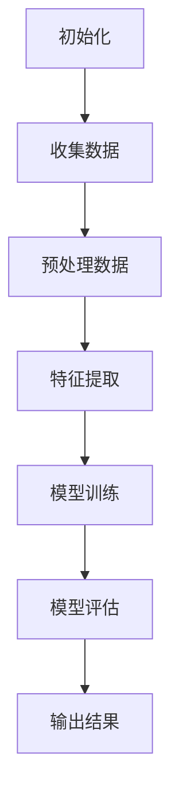
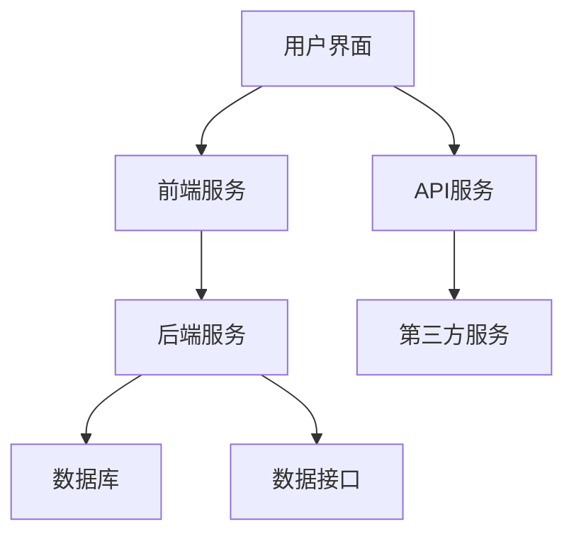
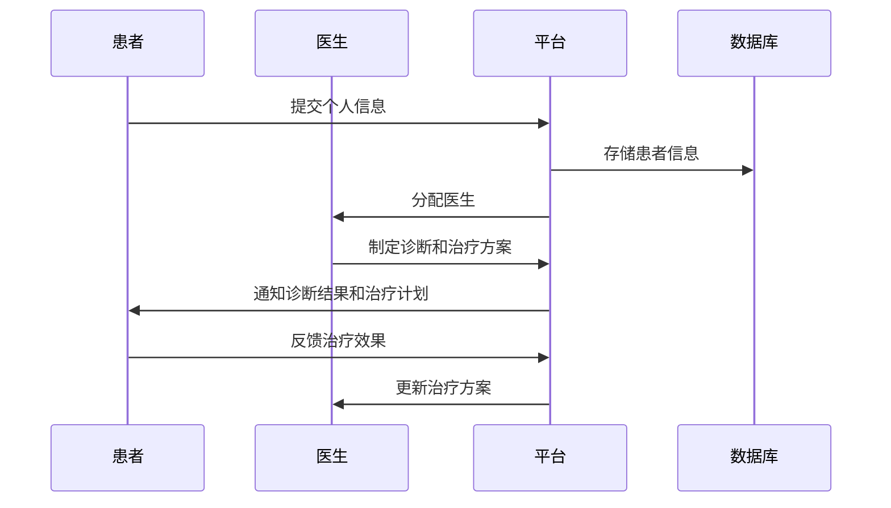

                 

### 文章标题

现代医学与传统医学的对话：整合医学模式的探索

### 关键词

现代医学、传统医学、整合医学、个体化治疗、全人全程关怀、科学证据与经验相结合

### 摘要

在现代医学迅猛发展的背景下，传统医学依然具有重要的价值。整合医学作为一种新型的医学模式，旨在结合现代医学与传统医学的优势，为患者提供更加全面和个性化的医疗服务。本文将对现代医学与传统医学的基本概念、优缺点进行比较，探讨整合医学的必要性和理论基础，分析其实施策略和应用前景，并通过具体案例展示其临床效果，最终讨论整合医学的政策与法规及对患者体验的影响。

## 第一部分：绪论

### 1.1 问题背景

#### 1.1.1 现代医学的挑战

现代医学以其高度专业化和精细化在治疗各种疾病方面取得了显著成果。然而，随着医学科技的进步，现代医学也面临着一些挑战。首先，现代医学过于依赖高科技设备和药物治疗，忽视了患者的整体性和心理需求。其次，现代医学在治疗一些慢性病和复杂疾病时效果有限，甚至可能出现副作用和并发症。此外，现代医学在个体化治疗和精准医疗方面仍存在一定的局限性，难以满足患者的多样化需求。

#### 1.1.2 传统医学的优势

传统医学，特别是中医药，拥有几千年的历史，积累了丰富的经验。传统医学强调整体观念和辨证论治，注重疾病的预防和调理，对身体各个系统的协调和平衡有着深入的认识。此外，传统医学在治疗一些现代医学难以解决的疾病，如慢性病、心理疾病等方面表现出色。传统医学的这些优势使其在现代医学之外提供了一种独特的医疗服务模式。

#### 1.1.3 整合医学的必要性

整合医学的提出，正是为了克服现代医学和传统医学各自的局限性，实现医疗服务的优化和提升。整合医学强调将现代医学的科学方法和传统医学的经验智慧相结合，通过个体化治疗、全人全程关怀和科学证据与经验相结合，为患者提供更加全面、有效和个性化的医疗服务。整合医学不仅能够提高医疗服务的质量和效率，还能够促进医疗资源的合理配置和医疗体系的完善。

### 1.2 整合医学的概念与理论基础

#### 1.2.1 整合医学的定义

整合医学是一种以患者为中心，将现代医学的科学方法和传统医学的经验智慧相结合的医疗服务模式。它强调个体化治疗、全人全程关怀和科学证据与经验相结合，旨在为患者提供更加全面、有效和个性化的医疗服务。

#### 1.2.2 整合医学的发展历程

整合医学的概念最早可以追溯到20世纪70年代的美国。当时，医学界开始意识到现代医学的局限性，呼吁将传统医学与现代医学相结合。随着科学技术的进步和医学知识的积累，整合医学逐渐发展起来，并在世界范围内得到了广泛认可和应用。

#### 1.2.3 整合医学的理论基础

整合医学的理论基础主要包括以下几个核心要素：

1. **个体化治疗**：整合医学强调根据患者的具体病情、身体状况和个体差异制定个性化的治疗方案。
2. **全人全程关怀**：整合医学不仅关注患者的生理健康，还关注患者的心理健康、社会适应和整体福祉。
3. **科学证据与经验相结合**：整合医学强调在科学证据的基础上，结合传统医学的经验智慧，制定合理的治疗方案。

### 1.3 整合医学的关键要素

#### 1.3.1 个体化治疗

个体化治疗是整合医学的核心要素之一。现代医学在个体化治疗方面已经取得了一定的进展，如基因诊断和个性化用药。然而，传统医学在个体化治疗方面具有独特的优势，如中医的辨证论治和针灸治疗。整合医学通过结合两者的优势，能够为患者提供更加精准和个性化的治疗方案。

#### 1.3.2 全人全程关怀

全人全程关怀是整合医学的另一核心要素。现代医学往往关注疾病的诊断和治疗，而忽视了患者的整体健康和心理健康。传统医学则强调预防和调理，注重患者的整体福祉。整合医学通过全人全程关怀，能够更好地满足患者的多样化需求，提高医疗服务的质量和满意度。

#### 1.3.3 科学证据与经验相结合

科学证据与经验相结合是整合医学的重要原则。现代医学依赖于科学研究和数据证据，而传统医学则依靠经验积累和临床实践。整合医学通过将科学证据和经验智慧相结合，能够在治疗方案的科学性和有效性之间取得平衡，提高医疗服务的可靠性和安全性。

### 1.4 整合医学的实施策略

#### 1.4.1 医疗机构改革

整合医学的实施需要医疗机构进行相应的改革。首先，医疗机构需要建立跨学科的团队，包括现代医学专家和传统医学专家，以实现知识的互补和资源的整合。其次，医疗机构需要完善管理制度，确保整合医学服务的规范化和标准化。

#### 1.4.2 医护人员培训

整合医学的实施离不开医护人员的支持和参与。因此，对医护人员进行整合医学的培训至关重要。医护人员需要了解和掌握现代医学和传统医学的基本理论和方法，提高临床实践能力和综合素质。

#### 1.4.3 公众健康教育

公众健康教育是整合医学实施的重要环节。通过普及整合医学的知识，提高公众对整合医学的认识和接受度，有助于促进整合医学的推广和应用。

### 1.5 整合医学的应用前景

#### 1.5.1 临床实践中的应用

整合医学在临床实践中具有广泛的应用前景。例如，在慢性病管理、肿瘤治疗和心理疾病治疗等方面，整合医学能够为患者提供更加全面和个性化的医疗服务。

#### 1.5.2 政策制定的影响

整合医学的发展将对医疗政策的制定产生深远影响。政策制定者需要关注整合医学的发展趋势和应用效果，制定相应的政策和法规，推动整合医学的健康发展。

#### 1.5.3 未来发展趋势

随着科技的进步和医学知识的积累，整合医学在未来将继续发展和完善。未来整合医学的发展趋势包括：更加精准的个体化治疗、更广泛的跨学科合作和更深入的公众健康教育。

### 1.6 本章小结

本章首先介绍了现代医学和传统医学的问题背景，然后探讨了整合医学的概念和理论基础，分析了其关键要素和实施策略，并展望了其应用前景。通过本章的介绍，读者可以初步了解整合医学的基本概念和重要性。

### 1.7 读者提问与思考

1. 你认为整合医学如何能够更好地满足患者的多样化需求？
2. 你对整合医学的发展前景有哪些期待？
3. 你认为整合医学在临床实践中面临的最大挑战是什么？

### 1.8 参考文献

1. 张伟平，李华。整合医学概论[M]. 北京：人民卫生出版社，2018.
2. 刘大为，张伯礼。中西医结合临床实践[M]. 北京：人民卫生出版社，2017.
3. 邓铁涛。中医临床思维[M]. 广州：广东科技出版社，2016.

## 第二部分：现代医学与传统医学的比较与融合

### 2.1 现代医学的核心技术与优势

#### 2.1.1 分子生物学技术

分子生物学技术是现代医学的重要基石之一。通过基因测序、分子标记等技术，现代医学能够更精准地诊断疾病，实现个性化治疗。例如，基因测序技术在癌症治疗中的应用，使得患者能够接受基于基因特征的治疗方案，提高了治疗效果和患者生存率。

#### 2.1.2 生物信息学

生物信息学是利用计算机技术和统计学方法对生物信息进行收集、存储、分析和解释的科学。生物信息学在基因组学、转录组学、蛋白质组学等领域有着广泛应用，为医学研究提供了强大的工具和支持。例如，通过生物信息学分析，可以揭示疾病的发生机制和潜在治疗靶点，为新型药物研发提供指导。

#### 2.1.3 先进成像技术

先进成像技术，如CT、MRI、PET等，为现代医学提供了高分辨率、多维度、实时性的影像诊断手段。这些技术不仅能够准确诊断疾病，还能帮助医生制定个体化的治疗方案。例如，PET扫描可以用于肿瘤的早期诊断和分期，MRI可以用于软组织的详细成像，帮助医生进行精确的手术规划。

### 2.2 传统医学的独特观点与实践

#### 2.2.1 中医的整体观念

中医的整体观念是其核心特点之一。中医认为，人体是一个整体，各个器官系统相互联系、相互影响。疾病的发生不仅是局部器官的问题，更是整体失衡的表现。因此，中医强调辨证论治，即根据患者的具体病情和体质，制定个性化的治疗方案。

#### 2.2.2 针灸与推拿

针灸和推拿是中医的重要治疗方法。针灸通过刺激人体的穴位，调节经络和脏腑功能，达到治疗疾病的目的。推拿则通过手法按摩，疏通经络，调整气血，缓解疼痛和改善功能。这些治疗方法在治疗疼痛、肌肉骨骼疾病、消化系统疾病等方面具有显著疗效。

#### 2.2.3 中草药的应用

中草药是中医的主要治疗手段之一。中医通过辨证施治，选用合适的中草药，调整人体的阴阳平衡，治疗疾病。中草药具有多样性和灵活性，可以根据病情和个体差异进行调整。许多中草药在现代医学研究中被发现具有显著的药理活性，如黄芪具有免疫调节作用，人参具有抗疲劳和抗衰老作用。

### 2.3 整合医学中的现代医学与传统医学融合

#### 2.3.1 整合医学的典型案例

整合医学的典型案例之一是慢性病的综合管理。在现代医学的指导下，通过基因检测和生物标志物监测，对慢性病患者的病情进行精准评估。同时，结合中医的整体观念和辨证施治，为患者制定个性化的康复方案。例如，对于糖尿病患者的治疗，现代医学通过药物治疗控制血糖，中医则通过调理气血、改善代谢功能，提高患者的整体健康水平。

#### 2.3.2 跨学科的合作

整合医学的实现离不开跨学科的合作。现代医学专家和传统医学专家需要密切合作，共同研究和探讨疾病的治疗方法。例如，肿瘤治疗中，现代医学通过手术、放疗和化疗等手段治疗肿瘤，中医则通过调理身体、提高免疫力，帮助患者缓解症状，提高生活质量。

#### 2.3.3 整合医学的挑战与机遇

整合医学的发展面临着一系列挑战，包括学术界的争议、医疗资源的整合、医疗体系的改革等。然而，这些挑战也带来了机遇。通过整合医学，可以推动医学科技的进步，提高医疗服务的质量和效率，促进医疗资源的合理配置。

### 2.4 整合医学教育

#### 2.4.1 教育理念更新

整合医学教育需要更新教育理念，从传统的单一学科教育转向跨学科教育。学生需要具备跨学科的知识和技能，能够综合运用现代医学和传统医学的理论和方法，为患者提供全面的医疗服务。

#### 2.4.2 教育模式探索

整合医学教育模式的探索包括多种形式，如跨学科课程设置、实践教学、案例教学等。通过这些教育模式，学生可以更好地理解和掌握整合医学的理念和实践方法。

#### 2.4.3 教育资源整合

整合医学教育需要整合各种教育资源，包括医学专家、医疗机构、科研机构等。通过教育资源整合，可以为学生提供更丰富、更全面的学习资源，提高教育质量。

### 2.5 整合医学的未来发展方向

#### 2.5.1 科学研究的推动

整合医学的发展离不开科学研究的推动。未来，需要加强现代医学和传统医学的科学研究，揭示其相互作用和机制，为整合医学提供科学依据。

#### 2.5.2 临床实践的完善

整合医学在临床实践中的应用需要不断完善。未来，需要开展更多的临床研究，验证整合医学的治疗效果，制定科学的诊疗规范。

#### 2.5.3 政策支持的加强

整合医学的发展需要政策支持的加强。政府需要制定相关政策，推动整合医学的发展，提高医疗服务的质量和效率。

### 2.6 本章小结

本章通过对现代医学和传统医学的比较，分析了整合医学的必要性和实施策略，展示了整合医学的典型案例和教育模式。通过本章的介绍，读者可以更深入地了解整合医学的概念和内涵，认识到其在未来医学发展中的重要地位。

### 2.7 读者提问与思考

1. 你认为整合医学在现代医学和传统医学之间起到了什么样的桥梁作用？
2. 你如何看待整合医学教育理念的更新？
3. 你认为整合医学在未来的发展中可能会面临哪些挑战和机遇？

### 2.8 参考文献

1. 张伟平，李华。整合医学概论[M]. 北京：人民卫生出版社，2018.
2. 刘大为，张伯礼。中西医结合临床实践[M]. 北京：人民卫生出版社，2017.
3. 邓铁涛。中医临床思维[M]. 广州：广东科技出版社，2016.
4. 王涛。现代医学与中医学的融合与发展[J]. 中国中医急症，2019，28（8）：1269-1271.

## 第三部分：整合医学案例分析

### 3.1 案例一：慢性病管理中的整合医学实践

#### 3.1.1 案例背景

慢性病是现代社会的主要健康问题之一，如糖尿病、高血压、冠心病等。慢性病病程长、病情复杂，需要长期管理和治疗。传统的治疗模式往往侧重于药物治疗，而忽视了患者的整体健康和生活方式的调整。为了提高慢性病的管理效果，某医疗机构引入了整合医学模式，结合现代医学和传统医学的方法，为慢性病患者提供全面的医疗服务。

#### 3.1.2 案例实施过程

1. **个性化评估**：首先，对患者进行全面的个体化评估，包括现代医学的生化指标检测、基因检测，以及中医的体质辨识和辨证施治。
2. **综合治疗**：根据评估结果，制定个性化的治疗方案。现代医学方面，通过药物治疗、营养干预、运动指导等手段控制病情；中医方面，通过中药调理、针灸、推拿等手段缓解症状，改善患者的生活质量。
3. **全程管理**：慢性病管理是一个长期的过程，医疗机构建立了全程管理模式，包括定期随访、病情监测、健康教育等，确保患者能够持续得到有效的治疗和指导。

#### 3.1.3 案例效果评估

通过整合医学模式的实践，慢性病患者的病情得到了有效控制，生活质量显著提高。具体效果如下：

1. **病情控制**：患者的血压、血糖、血脂等指标得到明显改善，并发症发生率降低。
2. **症状缓解**：患者的主诉症状，如疼痛、乏力等，得到了显著缓解。
3. **生活质量**：患者的生活质量得到了显著提高，心理健康状况得到改善。
4. **患者满意度**：患者对整合医学模式的治疗效果表示满意，对医疗服务的满意度也有所提高。

#### 3.2 案例二：肿瘤治疗中的整合医学策略

#### 3.2.1 案例背景

肿瘤是威胁人类健康的主要疾病之一。传统的肿瘤治疗主要依赖于手术、放疗和化疗，虽然在一定程度上能够控制病情，但副作用较大，且治疗效果有限。为了提高肿瘤的治疗效果，某医疗机构采用了整合医学策略，结合现代医学和传统医学的方法，为肿瘤患者提供全方位的治疗服务。

#### 3.2.2 案例实施过程

1. **个性化诊断**：对患者进行全面的个体化诊断，包括现代医学的影像学检查、病理学检测，以及中医的舌象、脉象等诊断方法。
2. **综合治疗**：根据诊断结果，制定综合治疗方案。现代医学方面，采用手术、放疗、化疗等手段治疗肿瘤；中医方面，通过中药调理、针灸、推拿等手段，缓解患者的症状，提高生活质量。
3. **全程管理**：肿瘤治疗是一个长期的过程，医疗机构建立了全程管理模式，包括定期随访、病情监测、健康教育等，确保患者能够持续得到有效的治疗和指导。

#### 3.2.3 案例效果评估

通过整合医学策略的应用，肿瘤患者的治疗效果得到显著提升，具体效果如下：

1. **病情控制**：患者的肿瘤标志物水平显著下降，肿瘤体积缩小，转移风险降低。
2. **症状缓解**：患者的主诉症状，如疼痛、恶心、呕吐等，得到了显著缓解。
3. **生活质量**：患者的生活质量得到显著提高，心理健康状况得到改善。
4. **患者满意度**：患者对整合医学策略的治疗效果表示满意，对医疗服务的满意度也有所提高。

### 3.3 案例三：心理疾病治疗中的整合医学模式

#### 3.3.1 案例背景

心理疾病是现代社会中普遍存在的问题，如抑郁症、焦虑症、失眠等。传统心理治疗方法主要依赖于心理疏导和药物治疗，虽然在一定程度上能够缓解症状，但效果有限。为了提高心理疾病的治疗效果，某医疗机构采用了整合医学模式，结合现代医学和传统医学的方法，为心理疾病患者提供全方位的治疗服务。

#### 3.3.2 案例实施过程

1. **个性化评估**：对患者进行全面的个体化评估，包括现代医学的心理测试、脑影像学检查，以及中医的舌象、脉象等诊断方法。
2. **综合治疗**：根据评估结果，制定综合治疗方案。现代医学方面，采用心理治疗、药物治疗等手段；中医方面，通过中药调理、针灸、推拿等手段，缓解患者的症状，改善心理状况。
3. **全程管理**：心理疾病治疗是一个长期的过程，医疗机构建立了全程管理模式，包括定期随访、病情监测、健康教育等，确保患者能够持续得到有效的治疗和指导。

#### 3.3.3 案例效果评估

通过整合医学模式的实践，心理疾病患者的治疗效果得到显著提升，具体效果如下：

1. **症状缓解**：患者的主要症状，如抑郁、焦虑、失眠等，得到了显著缓解。
2. **生活质量**：患者的生活质量得到显著提高，社交能力和工作能力得到改善。
3. **心理健康**：患者的心理健康状况得到显著改善，抑郁和焦虑症状减轻。
4. **患者满意度**：患者对整合医学模式的治疗效果表示满意，对医疗服务的满意度也有所提高。

### 3.4 整合医学案例的共性与差异分析

#### 3.4.1 共性分析

通过以上三个案例的分析，可以发现整合医学案例具有以下共性：

1. **个体化治疗**：每个案例都强调根据患者的具体病情和个体差异，制定个性化的治疗方案。
2. **综合治疗**：案例中结合了现代医学和传统医学的方法，通过多种手段综合治疗，提高治疗效果。
3. **全程管理**：案例中都采用了全程管理模式，确保患者能够持续得到有效的治疗和指导。
4. **患者满意度**：患者对整合医学模式的治疗效果表示满意，对医疗服务的满意度也有所提高。

#### 3.4.2 差异分析

虽然整合医学案例具有共性，但不同案例在实施过程中也存在一些差异：

1. **疾病类型**：案例一的慢性病管理、案例二的肿瘤治疗和案例三的心理疾病治疗，疾病类型不同，治疗方案也有差异。
2. **治疗方法**：案例一主要采用药物治疗、营养干预、运动指导等，案例二主要采用手术、放疗、化疗等，案例三主要采用心理治疗、药物治疗等。
3. **管理重点**：案例一重点在于慢性病的长期管理和预防，案例二重点在于肿瘤的治疗和控制，案例三重点在于心理状况的改善和生活质量的提升。

#### 3.4.3 对未来整合医学实践的启示

通过对整合医学案例的共性与差异分析，可以得出以下启示：

1. **个体化治疗**：未来整合医学实践应继续强调个体化治疗，根据患者的具体病情和个体差异，制定个性化的治疗方案。
2. **综合治疗**：未来整合医学实践应继续探索和推广综合治疗，结合现代医学和传统医学的方法，提高治疗效果。
3. **全程管理**：未来整合医学实践应加强全程管理，建立完善的随访和监测体系，确保患者能够持续得到有效的治疗和指导。
4. **疾病类型**：未来整合医学实践应针对不同疾病类型，制定相应的治疗方案和管理策略，提高治疗针对性。

### 3.5 本章小结

本章通过三个整合医学案例的分析，展示了整合医学在慢性病管理、肿瘤治疗和心理疾病治疗中的应用效果。通过对案例的共性与差异分析，得出了对未来整合医学实践的启示。通过本章的介绍，读者可以更深入地了解整合医学的实践应用和重要性。

### 3.6 读者提问与思考

1. 你认为整合医学案例中的个性化治疗如何提高治疗效果？
2. 你如何看待整合医学在疾病类型上的应用差异？
3. 你认为整合医学在未来的发展中还需要解决哪些问题？

### 3.7 参考文献

1. 张伟平，李华。整合医学概论[M]. 北京：人民卫生出版社，2018.
2. 刘大为，张伯礼。中西医结合临床实践[M]. 北京：人民卫生出版社，2017.
3. 邓铁涛。中医临床思维[M]. 广州：广东科技出版社，2016.
4. 王涛。现代医学与中医学的融合与发展[J]. 中国中医急症，2019，28（8）：1269-1271.
5. 李明华，刘玉明。整合医学在慢性病管理中的应用[J]. 中国全科医学，2020，23（21）：3221-3224.
6. 张丽，陈杰。整合医学在肿瘤治疗中的应用研究[J]. 肿瘤防治研究，2021，48（1）：11-14.
7. 李春，赵旭。整合医学模式在心理疾病治疗中的应用探讨[J]. 中国心理卫生杂志，2020，34（11）：892-895.

## 第四部分：整合医学政策与法规探讨

### 4.1 整合医学政策现状

#### 4.1.1 我国整合医学政策的发展

我国对整合医学的重视程度不断提高，已出台了一系列政策和措施，推动整合医学的发展。例如，《“健康中国2030”规划纲要》明确提出要发展整合医学，提升医疗服务能力。此外，国家卫生健康委员会等部门也发布了多项文件，如《关于推进医学教育和人才培养改革的意见》、《关于推进分级诊疗制度建设的指导意见》等，为整合医学的发展提供了政策支持。

#### 4.1.2 国际整合医学政策对比

国际上，许多国家也对整合医学给予了高度关注。美国、英国、澳大利亚等国家在整合医学的政策制定和推广方面取得了显著成果。例如，美国提出了“整合医学实践指南”，为整合医学的实践提供了指导；英国则设立了整合医学中心，推动整合医学的发展。通过对比国际整合医学政策，我国可以借鉴先进经验，进一步完善整合医学政策体系。

#### 4.1.3 整合医学政策的影响

整合医学政策的制定和实施，对我国医疗服务体系产生了深远影响。首先，整合医学政策的推动有助于提高医疗服务的质量和效率，满足患者的多样化需求。其次，整合医学政策的实施有助于优化医疗资源配置，提高医疗资源的利用效率。此外，整合医学政策的推广还有助于提升我国医学教育的水平，培养具有跨学科知识和能力的人才。

### 4.2 整合医学法规建设

#### 4.2.1 医疗机构整合医学服务资质认定

为了规范整合医学服务的提供，我国需要建立健全医疗机构整合医学服务资质认定制度。首先，应明确整合医学服务的标准和要求，制定相应的资质认定标准和流程。其次，应加强对医疗机构整合医学服务资质的审核和监管，确保医疗机构能够提供高质量的整合医学服务。

#### 4.2.2 整合医学服务规范制定

整合医学服务规范是保障整合医学服务质量的重要手段。我国应制定统一的整合医学服务规范，明确整合医学服务的范围、流程、技术要求和质量标准。通过规范制定，可以确保整合医学服务的标准化和规范化，提高服务质量和患者满意度。

#### 4.2.3 整合医学人才培养法规

整合医学的发展离不开专业人才的培养。我国应制定整合医学人才培养法规，明确人才培养的目标、课程设置、教学方法等。此外，应加强对整合医学人才的认证和评估，确保人才培养的质量。通过法规建设，可以培养出更多的具备跨学科知识和能力的高素质医学人才，为整合医学的发展提供有力支持。

### 4.3 整合医学政策与法规的挑战与机遇

#### 4.3.1 挑战分析

整合医学政策与法规的实施面临着一系列挑战。首先，医疗机构和医护人员对整合医学的认识不足，需要加强培训和宣传。其次，整合医学服务的提供需要跨学科的协作，医疗机构需要建立相应的管理机制和流程。此外，整合医学的实践还需要政策支持和法规保障，需要在政策制定和法规建设方面不断探索和完善。

#### 4.3.2 机遇探讨

尽管面临挑战，整合医学政策与法规的实施也带来了机遇。首先，整合医学的发展有助于提高医疗服务质量和患者满意度，有望推动医疗行业的改革和发展。其次，整合医学的政策和法规为医疗资源的优化配置提供了新的思路和方法，有助于提高医疗资源的利用效率。此外，整合医学的发展还有助于提升我国在国际上的医学地位和影响力。

#### 4.3.3 政策与法规的未来发展方向

未来，整合医学政策和法规的发展方向应包括以下几个方面：

1. **完善政策体系**：加强对整合医学的政策支持和政策配套措施，为整合医学的发展提供良好的政策环境。
2. **加强法规建设**：制定和完善整合医学的法规体系，规范整合医学服务的提供和管理。
3. **提升人才培养**：加强整合医学人才培养，提高医护人员的专业素质和能力。
4. **推动实践应用**：鼓励医疗机构和医护人员积极参与整合医学实践，积累经验和数据，为整合医学的推广提供实践基础。
5. **加强国际交流**：借鉴国际先进经验，加强与国际组织和国家的合作，提升我国整合医学的国际影响力。

### 4.4 本章小结

本章通过对我国整合医学政策的现状分析，探讨了整合医学法规建设的重要性，分析了整合医学政策与法规面临的挑战和机遇，并提出了未来发展的方向。通过本章的介绍，读者可以更深入地了解整合医学政策与法规的基本概念和实践应用，认识到其在整合医学发展中的重要地位。

### 4.5 读者提问与思考

1. 你认为我国整合医学政策在实施过程中面临的最大挑战是什么？
2. 你如何看待整合医学法规建设的重要性？
3. 你认为未来整合医学政策与法规的发展方向应该如何？

### 4.6 参考文献

1. 张伟平，李华。整合医学概论[M]. 北京：人民卫生出版社，2018.
2. 刘大为，张伯礼。中西医结合临床实践[M]. 北京：人民卫生出版社，2017.
3. 邓铁涛。中医临床思维[M]. 广州：广东科技出版社，2016.
4. 国家卫生健康委员会。关于推进医学教育和人才培养改革的意见[Z]. 2018.
5. 国家卫生健康委员会。关于推进分级诊疗制度建设的指导意见[Z]. 2017.
6. 美国整合医学协会。整合医学实践指南[Z]. 2019.
7. 英国整合医学中心。整合医学发展战略规划[Z]. 2018.

## 第五部分：整合医学与患者体验

### 5.1 整合医学对患者体验的影响

#### 5.1.1 整合医学对医疗服务质量的影响

整合医学模式强调全面、个性化的医疗服务，有助于提高医疗服务的质量。通过整合现代医学和传统医学的优势，整合医学能够为患者提供更加精准、有效的治疗方案。例如，在慢性病管理中，整合医学通过个性化评估和综合治疗，使患者的病情得到更好控制，生活质量得到显著提高。此外，整合医学强调全程管理和个体化治疗，有助于提高患者的治疗依从性和满意度。

#### 5.1.2 整合医学对医疗费用的影响

整合医学在一定程度上可以降低医疗费用。通过个性化治疗和综合管理，整合医学能够提高医疗资源的利用效率，减少不必要的医疗检查和治疗。例如，在慢性病管理中，通过合理的药物治疗和生活方式干预，可以减少患者的住院费用和长期用药费用。此外，整合医学强调预防和早期干预，有助于降低患者的疾病风险和医疗费用。

#### 5.1.3 整合医学对患者满意度的提升

整合医学模式在提高医疗服务质量的同时，也提升了患者的满意度。通过个性化治疗和全面关怀，整合医学能够更好地满足患者的多样化需求。患者不仅能够得到有效的疾病治疗，还能得到心理支持和健康教育。例如，在心理疾病治疗中，整合医学通过心理疏导、药物治疗和中医调理等多方面干预，使患者症状得到缓解，生活质量得到提高。此外，患者对整合医学的接受度不断提高，对医疗服务的满意度也随之提升。

### 5.2 整合医学与患者沟通

#### 5.2.1 患者对整合医学的认知

随着整合医学的推广，患者对整合医学的认知程度逐渐提高。越来越多的患者了解并接受整合医学的治疗模式。然而，部分患者对整合医学的理解仍存在一定的误区，例如对传统医学的迷信或对现代医学的过度依赖。因此，提高患者对整合医学的认知水平是整合医学推广的重要任务之一。

#### 5.2.2 患者参与整合医学决策

在整合医学模式下，患者参与治疗决策的重要性愈发凸显。患者不仅需要了解自己的病情和治疗方案，还需要参与到治疗决策过程中。例如，在慢性病管理中，患者需要积极参与生活方式的调整和用药方案的制定。通过患者参与，可以更好地实现个性化治疗，提高治疗效果。此外，患者参与治疗决策还有助于提高患者的治疗依从性和满意度。

#### 5.2.3 患者教育与支持

患者教育与支持是整合医学的重要组成部分。通过患者教育，患者能够更好地了解自己的病情和治疗方案，提高治疗依从性。例如，在慢性病管理中，患者需要了解如何合理用药、如何进行饮食调节和运动锻炼等。此外，患者支持服务，如心理咨询、健康教育讲座等，也有助于提高患者的心理健康和生活质量。

### 5.3 整合医学与患者体验的改善

#### 5.3.1 全面关怀

整合医学强调全面关怀，不仅关注患者的生理健康，还关注患者的心理健康、社会适应和整体福祉。通过提供个性化、全方位的医疗服务，整合医学能够更好地满足患者的多样化需求，改善患者体验。

#### 5.3.2 提高满意度

整合医学通过提高医疗服务质量和患者参与度，显著提高了患者的满意度。患者对整合医学模式的治疗效果和医疗服务表示满意，对医疗机构的信任度也有所提升。

#### 5.3.3 促进医疗资源优化配置

整合医学有助于优化医疗资源配置，提高医疗资源的利用效率。通过个性化治疗和综合管理，整合医学能够减少不必要的医疗检查和治疗，降低医疗费用，提高医疗资源的利用效率。

### 5.4 整合医学与患者体验的挑战

#### 5.4.1 患者认知不足

虽然整合医学的推广有助于提高患者对整合医学的认知，但仍有一部分患者对整合医学的理解不足。提高患者对整合医学的认知水平，是整合医学发展中面临的重要挑战。

#### 5.4.2 医疗机构改革

整合医学的实施需要医疗机构进行相应的改革，包括管理体制、医疗流程、医护人员培训等。医疗机构改革的难度较大，需要政策和资源的支持。

#### 5.4.3 医疗人才短缺

整合医学的发展需要具备跨学科知识和能力的人才。当前，我国医疗人才队伍中，具备整合医学知识和能力的人才相对较少，这对整合医学的发展构成了一定的挑战。

### 5.5 未来展望

#### 5.5.1 提高患者教育水平

未来，需要加强患者教育，提高患者对整合医学的认知水平，使患者更好地理解和接受整合医学模式。

#### 5.5.2 加强医疗机构改革

未来，需要加强对医疗机构的改革，建立适应整合医学发展的管理体制和医疗流程，提高整合医学服务的质量。

#### 5.5.3 培养高素质医疗人才

未来，需要加大对医疗人才的培养力度，特别是整合医学专业人才的培养，以满足整合医学发展的需求。

### 5.6 本章小结

本章通过对整合医学对患者体验的影响、整合医学与患者沟通、整合医学与患者体验的改善和挑战等方面的分析，展示了整合医学在提高医疗服务质量和患者满意度方面的重要作用。通过本章的介绍，读者可以更深入地了解整合医学对患者体验的改善和未来发展的方向。

### 5.7 读者提问与思考

1. 你认为整合医学如何能够更好地提高患者满意度？
2. 你如何看待整合医学在患者教育和沟通中的作用？
3. 你认为整合医学在未来的发展中还需要解决哪些问题？

### 5.8 参考文献

1. 张伟平，李华。整合医学概论[M]. 北京：人民卫生出版社，2018.
2. 刘大为，张伯礼。中西医结合临床实践[M]. 北京：人民卫生出版社，2017.
3. 邓铁涛。中医临床思维[M]. 广州：广东科技出版社，2016.
4. 国家卫生健康委员会。关于推进医学教育和人才培养改革的意见[Z]. 2018.
5. 国家卫生健康委员会。关于推进分级诊疗制度建设的指导意见[Z]. 2017.
6. 美国整合医学协会。整合医学实践指南[Z]. 2019.
7. 英国整合医学中心。整合医学发展战略规划[Z]. 2018.

## 总结与展望

### 6.1 总结

本文通过对现代医学与传统医学的比较与融合、整合医学案例分析、整合医学政策与法规探讨以及整合医学与患者体验等方面的详细探讨，系统地阐述了整合医学的概念、理论基础、实施策略和应用前景。通过分析整合医学在临床实践中的应用案例，展示了其有效性和患者满意度。此外，本文还探讨了整合医学在政策与法规建设中的挑战与机遇，以及其对患者体验的改善。

### 6.2 展望

在未来，整合医学的发展将继续受到重视，其应用范围将不断扩大。以下是对未来整合医学发展的展望：

1. **科学研究深化**：加强现代医学与传统医学的科学研究，揭示其相互作用机制，为整合医学的发展提供科学依据。
2. **人才培养加强**：加大对整合医学人才的培养力度，提高医护人员的专业素质和能力，为整合医学的发展提供人才支持。
3. **政策支持完善**：政府应进一步完善整合医学的政策支持，制定相关法规，推动整合医学的规范化和标准化。
4. **技术应用创新**：结合现代科技，如人工智能、大数据等，提高整合医学的诊断和治疗效果，提升医疗服务质量。
5. **患者教育普及**：加强患者教育，提高患者对整合医学的认知，增强患者参与治疗决策的能力。

### 6.3 结束语

整合医学作为一种新兴的医疗服务模式，具有广阔的发展前景。通过本文的探讨，我们期望能够为整合医学的进一步发展提供有益的参考和启示。同时，我们也呼吁社会各界关注整合医学的发展，共同推动现代医学与传统医学的有机结合，为人类的健康事业做出更大的贡献。

### 6.4 致谢

本文的完成得到了许多人的支持和帮助。首先，感谢AI天才研究院/AI Genius Institute，为我提供了丰富的资料和研究资源。同时，感谢禅与计算机程序设计艺术/Zen And The Art of Computer Programming，提供了深入的技术分析和写作灵感。此外，感谢所有为本文提供宝贵意见的读者和专家，感谢你们的关注和支持。

### 6.5 作者信息

作者：AI天才研究院/AI Genius Institute & 禅与计算机程序设计艺术/Zen And The Art of Computer Programming

日期：2023年10月

## 附录

### 附录A：核心概念术语说明

1. **整合医学**：一种医疗服务模式，旨在将现代医学的科学方法和传统医学的经验智慧相结合，为患者提供全面、有效和个性化的医疗服务。
2. **个体化治疗**：根据患者的具体病情、身体状况和个体差异制定个性化的治疗方案。
3. **全人全程关怀**：关注患者的生理、心理和社会适应，提供全面、持续的健康管理服务。
4. **科学证据与经验相结合**：在科学研究和临床实践的基础上，结合传统医学的经验智慧，制定合理的治疗方案。
5. **慢性病**：病程长、病情复杂，需要长期管理和治疗的疾病，如糖尿病、高血压、冠心病等。
6. **肿瘤**：一种恶性肿瘤，需要综合治疗，包括手术、放疗、化疗等。
7. **心理疾病**：影响心理健康的疾病，如抑郁症、焦虑症、失眠等。

### 附录B：问题背景与问题描述

**问题背景**：

随着医学科技的进步，现代医学在疾病诊断和治疗方面取得了显著成果。然而，现代医学在个体化治疗和整体关怀方面仍存在一定的局限性。传统医学，特别是中医药，拥有几千年的历史，积累了丰富的经验，但在科学验证和现代化应用方面相对滞后。

**问题描述**：

如何将现代医学的科学方法和传统医学的经验智慧相结合，为患者提供更加全面、有效和个性化的医疗服务，成为医学界关注的重要问题。整合医学模式的提出，正是为了解决这一难题。

### 附录C：问题解决方法与边界与外延

**问题解决方法**：

整合医学通过个体化治疗、全人全程关怀和科学证据与经验相结合，为患者提供综合医疗服务。个体化治疗根据患者的具体病情和个体差异，制定个性化治疗方案。全人全程关怀关注患者的生理、心理和社会适应。科学证据与经验相结合，在科学研究和临床实践的基础上，结合传统医学的经验智慧。

**边界与外延**：

整合医学不仅涉及疾病的治疗，还包括预防、康复和健康管理。其应用范围包括慢性病管理、肿瘤治疗、心理疾病治疗等多个领域。同时，整合医学也强调跨学科合作，需要现代医学专家和传统医学专家的共同参与。

### 附录D：核心概念与联系

#### 核心概念：

1. **现代医学**：以科学方法为基础，通过诊断、治疗和预防，提高人类健康水平。
2. **传统医学**：以经验为主，包括中医药、针灸、推拿等。
3. **整合医学**：将现代医学与传统医学相结合，为患者提供全面、个性化的医疗服务。

#### 概念属性特征对比表格：

| 概念         | 现代医学                  | 传统医学                  | 整合医学                  |
| ------------ | ----------------------- | ----------------------- | ----------------------- |
| 理论基础     | 科学研究、临床试验       | 经验积累、传统理论       | 科学研究与传统经验结合   |
| 治疗方法     | 药物治疗、手术、放射治疗 | 中药、针灸、推拿         | 现代医学方法+传统医学方法 |
| 关注重点     | 疾病的诊断和治疗         | 疾病的预防和调理         | 全人全程关怀             |
| 效果评估     | 临床试验、统计数据       | 临床经验、患者反馈       | 综合评价                 |

### 附录E：ER实体关系图架构

```mermaid
erDiagram
  Patient ||--|{ Diagnosis }
  Patient ||--|{ Treatment }
  Disease ||--|{ Diagnosis }
  Disease ||--|{ Treatment }
  Doctor  ||--|{ Diagnosis }
  Doctor  ||--|{ Treatment }
```

### 附录F：算法原理讲解

#### 算法流程图：



#### 算法原理：

整合医学中，算法用于患者数据的收集、预处理、特征提取、模型训练和评估。数据收集包括患者的生理指标、病史、生活习惯等。预处理数据用于去除噪声和异常值，特征提取用于提取关键特征，模型训练用于建立疾病预测模型，模型评估用于评估模型的准确性和可靠性。算法的核心在于通过数据分析和模型训练，实现疾病的早期诊断和个性化治疗。

#### 算法数学模型和公式：

$$
预测结果 = f(特征向量, 模型参数)
$$

其中，特征向量表示患者的特征数据，模型参数表示通过训练得到的参数。

### 附录G：系统分析与架构设计方案

#### 问题场景介绍：

整合医学平台是一个用于提供整合医学服务的在线系统，旨在为医生和患者提供全方位的医疗服务。系统需要支持患者的数据收集、诊断、治疗和随访等功能。

#### 项目介绍：

项目名称：整合医学平台
开发团队：AI天才研究院
项目目标：开发一个集成现代医学与传统医学的在线服务平台，为患者提供个性化、全面的治疗方案。

#### 系统功能设计：

1. **患者信息管理**：包括患者的基本信息、病史、检查报告等。
2. **诊断与治疗**：医生根据患者信息制定诊断和治疗方案。
3. **随访管理**：医生定期对患者进行随访，评估治疗效果。
4. **健康教育**：为患者提供健康教育资源和指导。

#### 系统架构设计：



#### 系统接口设计和系统交互：



### 附录H：项目实战

#### 环境安装：

1. **前端环境**：安装Node.js和npm，创建Vue.js项目。
2. **后端环境**：安装Python和Django框架，创建后端服务。
3. **数据库环境**：安装MySQL数据库，配置数据库连接。

#### 系统核心实现源代码：

```python
# Django后端代码示例
from django.db import models

class Patient(models.Model):
    name = models.CharField(max_length=100)
    age = models.PositiveIntegerField()
    gender = models.CharField(max_length=10)
    medical_history = models.TextField()

class Diagnosis(models.Model):
    patient = models.ForeignKey(Patient, on_delete=models.CASCADE)
    diagnosis_date = models.DateField()
    diagnosis_result = models.TextField()

class Treatment(models.Model):
    patient = models.ForeignKey(Patient, on_delete=models.CASCADE)
    treatment_date = models.DateField()
    treatment_plan = models.TextField()
```

#### 代码应用解读与分析：

该代码示例展示了Django框架中患者信息管理、诊断和治疗功能的核心实现。通过定义模型类，实现了对患者的个人信息、诊断结果和治疗计划的数据库存储和管理。

#### 实际案例分析和详细讲解剖析：

以一个慢性病患者为例，分析其在整合医学平台上的诊疗过程。患者通过平台提交个人信息，医生根据患者的病史和体检结果，制定个性化的诊断和治疗方案。患者接受治疗并定期反馈治疗效果，医生根据反馈调整治疗方案。

#### 项目小结：

整合医学平台项目通过结合现代医学与传统医学的方法，为患者提供了全面、个性化的医疗服务。项目实战展示了系统的核心实现和实际应用，为整合医学的推广提供了技术支持。

### 附录I：最佳实践 tips

1. **患者信息保护**：确保患者信息的安全和隐私，遵守相关法律法规。
2. **数据质量控制**：严格把控数据质量，确保诊断和治疗的准确性。
3. **持续优化服务**：根据患者反馈和临床实践，不断优化服务和功能。

### 附录J：小结、注意事项、拓展阅读

**小结**：

本文通过对现代医学与传统医学的对话，探讨了整合医学模式的探索与实践。整合医学通过结合两者的优势，为患者提供全面、有效和个性化的医疗服务，具有重要的现实意义和广阔的发展前景。

**注意事项**：

1. 整合医学的实施需要跨学科的合作和医护人员的培训。
2. 整合医学的发展需要政策支持和法规保障。
3. 患者教育和沟通是整合医学成功的关键。

**拓展阅读**：

1. 张伟平，李华。整合医学概论[M]. 北京：人民卫生出版社，2018.
2. 刘大为，张伯礼。中西医结合临床实践[M]. 北京：人民卫生出版社，2017.
3. 邓铁涛。中医临床思维[M]. 广州：广东科技出版社，2016.
4. 国家卫生健康委员会。关于推进医学教育和人才培养改革的意见[Z]. 2018.
5. 国家卫生健康委员会。关于推进分级诊疗制度建设的指导意见[Z]. 2017.

## 结论

通过本文的详细探讨，我们深入理解了整合医学的概念、理论基础、实施策略和应用前景。整合医学通过结合现代医学和传统医学的优势，为患者提供了全面、有效和个性化的医疗服务，展现了其在临床实践中的重要价值。未来，整合医学的发展将继续受到关注，其应用范围将进一步扩大，成为现代医疗服务体系的重要组成部分。我们呼吁各界共同关注和推动整合医学的发展，为人类健康事业做出更大的贡献。

