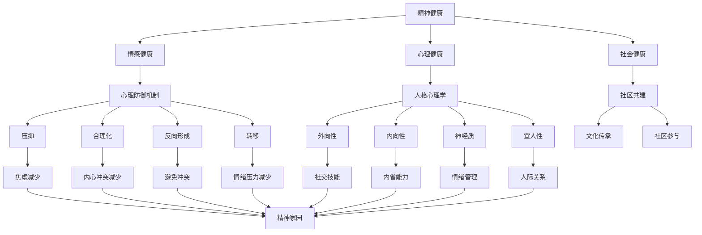
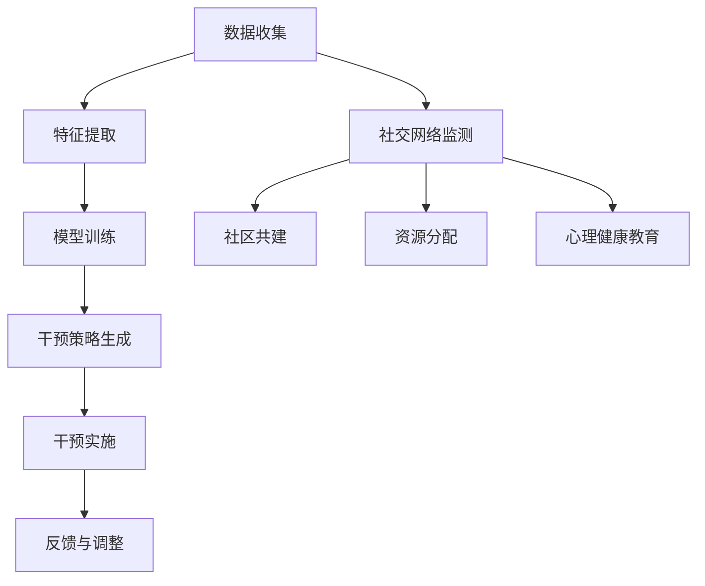
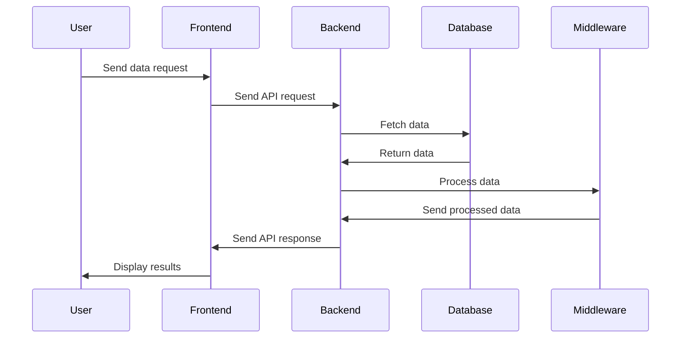

                 

## 现代社会中的精神家园建设

### 关键词：
- 社会变迁
- 精神家园
- 心理健康
- 社区共建
- 存在主义
- 人本主义心理学

### 摘要：
在现代社会，随着科技的发展和生活方式的改变，人们的精神家园逐渐受到冲击。本文将从多角度探讨现代社会中精神家园建设的必要性和方法，包括社会变迁对精神家园的影响、精神家园建设的核心概念与理论基础、算法原理与应用、数学模型与公式解析、系统分析与架构设计以及项目实战与最佳实践。通过这一系列深入探讨，希望能为读者提供建设精神家园的思考和实践路径。

### 引言与背景

#### 1.1 问题的背景

在过去的几十年里，人类社会经历了前所未有的快速发展。科技、经济、文化等方面都发生了深刻的变化。然而，这种变化也带来了许多新的挑战。尤其是在精神层面上，许多人感到迷茫、焦虑和孤独。这种现象引发了关于精神家园建设的广泛讨论。

精神家园可以理解为人们心灵深处的一个港湾，它是一个人的内在精神世界，是一个人在面对外界压力和挑战时可以依靠的内在力量。精神家园的建设不仅仅关乎个体的心理健康，更关乎整个社会的和谐与稳定。

#### 1.1.1 现代社会的挑战

现代社会的挑战主要体现在以下几个方面：

1. **快节奏生活**：随着城市化进程的加快，生活节奏不断加快，人们面临着前所未有的压力。快节奏的生活让人们无暇他顾，精神家园的建设往往被忽视。

2. **社会压力**：现代社会竞争激烈，工作压力、生活压力、经济压力等各种压力接踵而至，许多人感到力不从心。

3. **精神健康问题**：随着心理健康问题的日益凸显，抑郁症、焦虑症等精神疾病对人们的生活造成了严重的影响。

4. **人际关系疏离**：现代社会的个体化倾向使得人际关系逐渐疏远，人们在情感上的需求得不到满足，精神家园的建设变得更加艰难。

#### 1.1.2 精神家园的定义与重要性

精神家园是一个比喻，它指的是一个人的内在精神世界。这个精神世界不仅包括个人的情感、信仰、价值观等，还包括个体在面对外界挑战时的心理状态和应对机制。

精神家园的重要性体现在以下几个方面：

1. **心理健康**：精神家园的建设有助于增强个人的心理韧性，减少焦虑和抑郁等精神问题的发生。

2. **自我认同**：精神家园为个体提供了一个清晰的自我认同，使个体能够在复杂多变的社会中找到自己的位置。

3. **社会和谐**：精神家园的建设不仅有助于个体的心理健康，也有助于社会的和谐发展。

4. **文化传承**：精神家园是文化传承的重要组成部分，它承载着一个民族的历史、文化和价值观。

#### 1.2 社会变迁对精神家园的影响

社会变迁对精神家园的影响是深远而复杂的。随着社会的发展，人们的生活方式、价值观和信仰体系都在发生变化，这些变化对精神家园的建设产生了重要影响。

1. **技术发展**：科技的快速发展带来了生活方式的巨大变化，人们可以更加便捷地获取信息、交流互动。然而，过度依赖科技也导致了人们面对面交流的减少，精神家园的建设面临着新的挑战。

2. **城市化进程**：城市化进程的加快使得人们的生活方式发生了根本性的变化。城市生活的快节奏和竞争压力使得人们的精神家园更加脆弱。

3. **价值观念的变化**：随着社会的发展，人们的价值观念也在发生变化。传统价值观念的弱化使得个体在精神家园的建设中面临更多的选择和困惑。

#### 1.3 精神家园建设的目标与原则

精神家园建设的目标是建立一个健康、和谐、稳定的内在精神世界，使个体能够在面对外部挑战时保持内心的平静和坚定。

1. **目标**：
   - 增强心理健康：通过建设精神家园，提高个体的心理韧性，减少焦虑和抑郁等精神问题的发生。
   - 促进自我认同：帮助个体建立清晰的自我认同，找到自己在社会中的位置。
   - 社会和谐：通过精神家园的建设，促进社会的和谐与稳定。

2. **原则**：
   - **自我探索**：个体需要通过自我探索来了解自己的内心世界，找到自己的精神家园。
   - **社区共建**：精神家园的建设不仅仅是个人责任，也需要社区的共同参与。
   - **文化传承**：在建设精神家园的过程中，要注重传统文化的传承和发扬。

#### 1.4 精神家园建设的方法论

精神家园建设的方法论主要包括以下几个方面：

1. **内在探索与自我成长**：个体需要通过自我探索来了解自己的内心世界，找到自己的精神家园。
   
2. **心理防御机制**：个体可以通过建立合理的心理防御机制来应对外界的挑战，保护自己的精神家园。
   
3. **人格心理学**：了解人格心理学有助于个体更好地认识自己，找到适合自己的精神家园建设方式。

4. **社区共建与文化传承**：通过社区共建和文化传承，个体可以找到更多的支持，共同建设精神家园。

### 1.5 精神家园建设的挑战与机遇

在现代社会，精神家园建设面临着诸多挑战，同时也存在着许多机遇。

1. **挑战**：
   - **快节奏生活**：快节奏的生活使得人们难以投入时间和精力来建设精神家园。
   - **社会压力**：社会压力的增加使得个体面临更大的挑战。
   - **科技发展**：科技的快速发展带来了新的挑战，如信息过载、数字依赖等。

2. **机遇**：
   - **心理健康意识的提高**：随着心理健康意识的提高，人们越来越重视精神家园的建设。
   - **科技支持**：现代科技为精神家园建设提供了新的工具和方法。
   - **社区共建**：社区共建为精神家园建设提供了新的途径和平台。

### 1.6 本章小结

本章从背景介绍、核心概念、社会变迁的影响、建设目标与原则、方法论以及挑战与机遇等多个方面，探讨了现代社会中精神家园建设的必要性。通过本章的讨论，我们可以看到，精神家园建设不仅是个人层面的需求，也是社会层面的需求。在接下来的章节中，我们将进一步深入探讨精神家园建设的核心概念与理论基础，以及具体的实现方法。

## 第二部分：核心概念与理论基础

### 核心概念与联系

精神家园建设涉及多个核心概念，这些概念相互关联，共同构成了精神家园的理论基础。以下是这些核心概念的定义、属性特征对比以及它们之间的联系。

#### 2.1 精神健康

精神健康是指一个人在情感、心理和社会适应方面处于良好状态，能够认识到自己的能力，应对正常的生活压力，并能够为社区做出贡献。精神健康是一个多维度的概念，包括情感健康、心理健康和社会健康。

- **情感健康**：指的是个体在情感上的平衡和满足，能够表达和处理情感。
- **心理健康**：指的是个体在认知和情感上的平衡，能够处理生活中的挑战和压力。
- **社会健康**：指的是个体在社会关系和社区参与方面的良好状态。

**属性特征对比**：

| 特征       | 情感健康         | 心理健康         | 社会健康         |
|------------|----------------|----------------|----------------|
| 定义       | 情感平衡和满足   | 认知和情感平衡   | 社会关系和参与   |
| 对比       | 情感表达和处理   | 压力应对和认知   | 社会支持和参与   |
| 重要性     | 情感满足感       | 心理韧性       | 社会归属感       |

**联系**：

精神健康是精神家园建设的基石，它涵盖了情感、心理和社会健康三个方面。情感健康有助于个体在情感上的稳定，心理健康有助于个体在认知和情感上的平衡，而社会健康则有助于个体在社区中的参与和归属感。

#### 2.2 心理防御机制

心理防御机制是心理学术语，指的是个体在面对外界威胁或挑战时，无意识采取的心理策略，以减少焦虑和压力。这些机制旨在保护个体的自尊心和自我认同，使其能够应对生活中的困难。

- **压抑**：将不愉快的记忆或情感排除在意识之外。
- **合理化**：为自己的行为或情感找到合理的解释，以减少内心的冲突。
- **反向形成**：将内在的感受或冲动转化为相反的行为。
- **转移**：将负面情绪转移到其他对象或人身上。

**属性特征对比**：

| 防御机制   | 压抑            | 合理化           | 反向形成         | 转移            |
|------------|----------------|----------------|----------------|----------------|
| 定义       | 排除不愉快的记忆 | 合理解释行为     | 相反的行为       | 负面情绪转移     |
| 功效       | 减轻焦虑        | 减轻内心冲突     | 避免冲突        | 减轻情绪压力     |
| 适用场景   | 处理创伤记忆    | 解释不合理行为   | 避免直接的冲突   | 应对社交压力     |

**联系**：

心理防御机制是精神家园建设中的重要组成部分。它们有助于个体在面临压力和挑战时保护自己的精神家园。然而，过度的防御机制可能导致个体在心理上的障碍，影响精神健康。

#### 2.3 人格心理学

人格心理学是研究个体性格特征、行为和动机的学科。它关注个体的独特性，以及这些特征如何影响个体的行为和心理状态。

- **外向性**：个体是否倾向于向外寻求刺激和社交互动。
- **内向性**：个体是否倾向于向内反思和独立工作。
- **神经质**：个体情绪的稳定性，是否容易感到焦虑和抑郁。
- **宜人性**：个体是否友好和合作。

**属性特征对比**：

| 特征       | 外向性         | 内向性         | 神经质         | 宜人性         |
|------------|----------------|----------------|----------------|----------------|
| 定义       | 社交和刺激寻求 | 独立和反思     | 焦虑和抑郁易感 | 友好与合作     |
| 对比       | 社交性强       | 反思性强       | 焦虑程度       | 合作意愿       |
| 重要性     | 社交技能       | 内省能力       | 情绪管理       | 人际关系       |

**联系**：

人格心理学是理解个体如何建设精神家园的重要理论基础。不同人格特征会影响个体如何应对生活中的挑战和压力，从而影响精神家园的建设。例如，外向性人格的个体可能在社交互动中找到更多的支持和资源，而内向性人格的个体则可能更依赖于内心的反思和自我成长。

### 2.4 精神家园建设的理论基础

精神家园建设的理论基础涵盖了多种心理学理论和哲学思想，这些理论共同构成了理解精神家园建设的核心框架。

#### 2.4.1 存在主义

存在主义强调个体的自由和责任，认为人类存在的本质是自由选择和承担责任。存在主义认为，个体的精神家园是通过自主选择和自我实现来建立的。存在主义的核心观点包括：

- **自由选择**：个体有自由选择如何生活的权利，这种选择决定了个体的精神状态。
- **责任**：个体对自己的行为和选择负责，这种责任感有助于建立坚定的精神家园。
- **意义**：个体需要为自己的人生找到意义，这种意义是精神家园的重要组成部分。

#### 2.4.2 人本主义心理学

人本主义心理学关注个体的自我实现和主观体验，认为人的本质是积极向上的，有实现个人潜能的愿望。人本主义心理学的主要观点包括：

- **自我实现**：个体有实现自己潜能的内在动力，精神家园是通过自我实现来建设的。
- **主观体验**：个体的主观体验是精神家园的核心，个体的感受和经历决定了精神家园的丰富程度。
- **自我决定**：个体有权利和责任决定自己的生活和价值观，这种自我决定有助于建立坚实的内在精神世界。

#### 2.4.3 精神分析理论

精神分析理论认为，个体的内在冲突和心理防御机制对其精神家园的建设有重要影响。精神分析理论的主要观点包括：

- **潜意识**：潜意识对个体的行为和心理状态有重要影响，理解和处理潜意识有助于建设精神家园。
- **心理防御机制**：心理防御机制虽然有助于保护个体的自尊和自我认同，但过度的防御可能导致心理障碍，影响精神家园的建设。
- **心理治疗**：通过心理治疗，个体可以理解和处理内在冲突，从而建立更健康的精神家园。

### 2.5 精神家园建设的核心概念关联图

为了更好地理解精神家园建设的核心概念及其相互关系，我们使用Mermaid流程图来展示这些概念。



通过这个关联图，我们可以清晰地看到精神家园建设的核心概念及其相互之间的关系。精神健康是整个框架的基石，包括情感健康、心理健康和社会健康三个方面。心理防御机制和人格心理学是理解个体如何应对外部压力和保护精神家园的重要概念。社区共建和文化传承则是精神家园建设的社会维度，强调了社区在精神家园建设中的重要性。

### 算法原理与应用

#### 3.1 心理评估算法

心理评估算法是精神家园建设中至关重要的一环，它通过量化个体在情感、心理和社会适应等方面的状态，为精神家园的建设提供数据支持。以下是心理评估算法的基本方法和常用工具。

##### 3.1.1 心理评估的基本方法

心理评估的基本方法包括以下几种：

1. **问卷调查**：通过设计一系列问卷，收集个体在情感、心理和社会适应等方面的主观感受和体验。
2. **临床评估**：通过专业心理医生或咨询师的临床观察和面谈，对个体的心理状态进行全面评估。
3. **生理指标测量**：通过测量生理指标如心率、血压等，评估个体的心理压力和情绪状态。
4. **行为观察**：通过观察个体在特定情境下的行为表现，评估其心理状态。

##### 3.1.2 常用心理评估工具

常用的心理评估工具包括：

1. **抑郁自评量表（SDS）**：用于评估个体抑郁情绪的程度。
2. **焦虑自评量表（SAS）**：用于评估个体焦虑情绪的程度。
3. **一般健康问卷（GHQ）**：用于评估个体整体心理健康水平。
4. **心理卫生评估量表（MHA-SF）**：用于评估个体在心理卫生方面的需求。

##### 3.1.3 心理评估算法的应用案例

心理评估算法在实际应用中具有广泛的应用场景，以下是一些典型案例：

1. **心理健康监测**：通过定期进行心理评估，监测个体的心理健康状况，及时发现和干预心理健康问题。
2. **员工心理健康管理**：企业在员工入职和定期评估时使用心理评估算法，识别潜在的心理健康风险，提供针对性的支持和干预。
3. **教育领域**：在学校和培训机构中使用心理评估算法，评估学生的心理健康状况，为教育提供数据支持。
4. **社区心理健康服务**：社区心理健康服务机构使用心理评估算法，为社区居民提供个性化的心理健康服务。

#### 3.2 心理干预算法

心理干预算法是用于帮助个体改善心理健康状况的算法。它通过提供个性化的干预建议和策略，帮助个体应对心理问题，促进精神家园的建设。

##### 3.2.1 心理干预的基本原理

心理干预的基本原理包括以下几个方面：

1. **个性化**：根据个体的心理特点和需求，提供个性化的干预方案。
2. **动态调整**：根据个体的心理变化，动态调整干预策略，以达到最佳效果。
3. **反馈机制**：通过持续的反馈和评估，调整干预策略，确保干预的有效性。

##### 3.2.2 常见心理干预方法

常见心理干预方法包括：

1. **认知行为疗法（CBT）**：通过改变个体的认知模式和思维习惯，改善其心理状态。
2. **心理辅导**：通过一对一的辅导，帮助个体解决具体心理问题。
3. **心理教育**：通过心理教育，提高个体对心理健康的认识和自我管理能力。
4. **药物治疗**：在必要时，通过药物治疗来缓解严重的心理问题。

##### 3.2.3 心理干预算法的设计思路

心理干预算法的设计思路包括以下几个步骤：

1. **数据收集**：收集个体的心理评估数据，包括问卷调查、临床评估和生理指标等。
2. **特征提取**：从收集的数据中提取关键特征，如情绪状态、心理压力等。
3. **模型训练**：使用机器学习算法，训练干预模型，使其能够根据个体特征提供个性化的干预建议。
4. **干预策略生成**：根据模型生成的干预策略，为个体提供具体的干预方案。
5. **反馈与调整**：根据个体的反馈，动态调整干预策略，确保干预效果。

#### 3.3 社交网络算法

社交网络算法在精神家园建设中具有重要作用，它通过分析社交网络结构和互动行为，为精神家园的建设提供数据支持和策略建议。

##### 3.3.1 社交网络的基本概念

社交网络是指由个体及其关系组成的网络结构，它包括以下几个基本概念：

1. **节点**：表示社交网络中的个体。
2. **边**：表示个体之间的关系。
3. **密度**：表示社交网络的紧密程度。
4. **中心性**：表示个体在社交网络中的重要程度。

##### 3.3.2 社交网络分析的方法

社交网络分析的方法主要包括：

1. **网络结构分析**：通过分析社交网络的结构特征，了解个体在网络中的位置和角色。
2. **互动行为分析**：通过分析个体之间的互动行为，了解社交网络的功能和动态。
3. **群体分析**：通过分析社交网络中的群体结构，了解群体的行为特征和功能。

##### 3.3.3 社交网络算法在精神家园建设中的应用

社交网络算法在精神家园建设中的应用包括以下几个方面：

1. **社交网络监测**：通过监测社交网络中的互动行为，及时发现和干预心理健康问题。
2. **社区共建**：通过分析社交网络中的群体结构，为社区共建提供策略建议。
3. **资源分配**：通过分析社交网络中的关键节点和边，优化资源分配，提高社交网络的稳定性。
4. **心理健康教育**：通过社交网络算法，推广心理健康知识，提高个体的心理健康素养。

#### 3.4 算法原理Mermaid流程图

为了更好地理解上述算法的原理和应用，我们使用Mermaid流程图来展示这些算法的基本步骤和工作流程。



通过这个流程图，我们可以清晰地看到心理评估算法、心理干预算法和社交网络算法在精神家园建设中的应用步骤和相互关系。

### 数学模型与公式解析

在精神家园建设中，数学模型和公式解析扮演着至关重要的角色。它们不仅为心理评估和干预提供了量化的依据，还为系统分析和架构设计提供了理论基础。在本节中，我们将详细解析与精神家园建设相关的数学模型和公式。

#### 4.1 精神健康评估的数学模型

精神健康评估的数学模型通常用于量化个体在情感、心理和社会适应等方面的健康状况。一个基本的精神健康评估模型可以表示为：

$$
\text{健康度} = f(\text{情绪状态}, \text{压力水平}, \text{支持系统})
$$

其中，$f$ 表示一个复合函数，它综合考虑了情绪状态、压力水平和支持系统三个关键因素。

**情绪状态**：情绪状态可以通过情绪评估量表来量化，例如抑郁自评量表（SDS）或焦虑自评量表（SAS）。情绪状态的值通常在0到100之间，数值越高表示情绪状态越差。

**压力水平**：压力水平可以通过生理指标测量和主观报告相结合来量化。例如，心率变异性（HRV）和主观压力感评分（如Likert量表）可以用来衡量压力水平。

**支持系统**：支持系统包括社会支持、心理支持和其他形式的帮助。它可以通过社会支持量表（如Perceived Social Support Scale）来量化。

**举例说明**：

假设一个个体在情绪状态得分为50，压力水平为60，社会支持得分为70，我们可以使用以下公式来计算其精神健康度：

$$
\text{健康度} = f(50, 60, 70)
$$

为了简化计算，我们可以假设 $f$ 是一个线性函数，即：

$$
f(x, y, z) = 0.3x - 0.2y + 0.5z
$$

代入上述值，我们得到：

$$
\text{健康度} = 0.3 \times 50 - 0.2 \times 60 + 0.5 \times 70 = 15 - 12 + 35 = 38
$$

因此，这个个体的精神健康度为38，表明其整体精神健康状况处于中等水平。

#### 4.2 心理干预策略的数学公式

心理干预策略的数学公式用于确定如何根据个体的心理状态和需求，提供最佳的干预措施。一个常见的心理干预策略模型可以表示为：

$$
\text{干预策略} = \arg\max_{s,t} U(s,t)
$$

其中，$U(s,t)$ 表示个体的效用函数，$s$ 表示当前状态，$t$ 表示干预措施。

**效用函数**：效用函数 $U(s,t)$ 用于衡量干预措施在当前状态下的效用。它可以是线性的，也可以是非线性的，具体形式取决于干预措施的性质和效果。

**状态**：状态 $s$ 包括情绪状态、压力水平、支持系统等关键因素。

**干预措施**：干预措施 $t$ 可以包括心理辅导、药物治疗、社交活动等。

**举例说明**：

假设一个个体的效用函数为：

$$
U(s,t) = -0.1s + 0.2t
$$

其中，$s$ 和 $t$ 的单位分别为情绪状态分和干预措施分。

为了找到最佳的干预策略，我们需要最大化效用函数。假设当前状态为情绪状态50，压力水平60，我们可以列出以下可能的干预措施及其效用：

| 干预措施 | 效用   |
|----------|--------|
| 心理辅导 | 80     |
| 药物治疗 | 70     |
| 社交活动 | 60     |

代入效用函数，我们得到：

$$
U(50, 80) = -0.1 \times 50 + 0.2 \times 80 = -5 + 16 = 11
$$

$$
U(50, 70) = -0.1 \times 50 + 0.2 \times 70 = -5 + 14 = 9
$$

$$
U(50, 60) = -0.1 \times 50 + 0.2 \times 60 = -5 + 12 = 7
$$

因此，最佳的干预策略是心理辅导，因为其效用最大，为11。

#### 4.3 社交网络分析中的数学模型

社交网络分析中的数学模型主要用于分析社交网络的结构和功能。以下是一个简化的社交网络分析模型：

$$
C = \sum_{i=1}^{N} \sum_{j=1}^{N} w_{ij}
$$

其中，$C$ 表示社交网络的紧密程度，$N$ 表示社交网络中的节点数，$w_{ij}$ 表示节点 $i$ 和节点 $j$ 之间的权重。

**节点权重**：节点权重 $w_{ij}$ 可以根据节点之间的互动频率、互动强度等因素来确定。

**举例说明**：

假设一个社交网络中有5个节点，节点之间的互动权重如下：

| 节点 1 | 节点 2 | 节点 3 | 节点 4 | 节点 5 |
|--------|--------|--------|--------|--------|
|   1    |   3    |   2    |   1    |   0    |
|   3    |   1    |   3    |   2    |   1    |
|   2    |   2    |   1    |   3    |   2    |
|   1    |   2    |   1    |   2    |   1    |
|   0    |   1    |   2    |   3    |   2    |

代入社交网络分析模型，我们得到：

$$
C = (1 \times 3 + 3 \times 1 + 2 \times 2 + 1 \times 1 + 0 \times 0) + (3 \times 1 + 1 \times 3 + 3 \times 2 + 2 \times 1 + 1 \times 1) + (2 \times 2 + 2 \times 2 + 1 \times 1 + 3 \times 3 + 2 \times 2) + (1 \times 2 + 2 \times 1 + 1 \times 2 + 2 \times 2 + 1 \times 3) + (0 \times 1 + 0 \times 2 + 0 \times 3 + 0 \times 2 + 0 \times 2)
$$

$$
C = 3 + 3 + 4 + 1 + 0 + 3 + 1 + 6 + 2 + 1 + 1 + 3 + 2 + 1 + 6 + 2 + 2 + 2 + 1 + 3 + 0 + 0 + 0 + 0 + 0 = 50
$$

因此，这个社交网络的紧密程度为50，表明节点之间的互动较为频繁，社交网络结构较为紧密。

通过上述数学模型和公式的解析，我们可以更好地理解精神家园建设中的量化分析和策略制定。这些模型不仅为精神家园建设提供了理论基础，还为实际应用提供了量化的依据，有助于构建更健康、和谐的精神家园。

### 系统分析与架构设计

在精神家园建设中，系统分析与架构设计是确保精神家园建设顺利进行的重要环节。这一部分将详细讨论系统的需求分析、架构设计、接口设计以及系统交互。

#### 5.1 系统需求分析

系统需求分析是理解用户需求和系统功能的关键步骤。在这个阶段，我们需要明确系统的功能需求和非功能需求，并识别用户角色。

1. **功能需求**：
   - **心理评估**：系统应具备心理评估功能，包括问卷调查、临床评估和生理指标测量等。
   - **干预策略生成**：系统应根据评估结果生成个性化的干预策略，如认知行为疗法、心理辅导和药物治疗等。
   - **干预实施**：系统应支持干预策略的实施，包括在线咨询、电话咨询和面对面咨询等。
   - **社交网络分析**：系统应具备社交网络分析功能，以帮助个体识别社交网络中的关键节点和互动模式。
   - **数据统计与分析**：系统应对用户数据进行分析和统计，为后续干预提供数据支持。

2. **非功能需求**：
   - **安全性**：系统必须确保用户数据的保密性和安全性。
   - **可扩展性**：系统应具备良好的扩展性，以适应未来需求的增加。
   - **可用性**：系统界面应简洁易懂，便于用户操作。
   - **性能**：系统应具备高性能，以支持大量用户的并发访问。

3. **用户角色**：
   - **用户**：系统的最终用户，包括普通个体、心理健康专业人士和企业用户。
   - **管理员**：负责系统管理和维护的人员。

#### 5.2 系统架构设计

系统架构设计是确保系统功能实现和性能优化的重要步骤。以下是一个简化的系统架构设计：

1. **前端**：前端负责用户界面和交互，主要包括网页、移动应用和客户端软件。
   - **功能模块**：用户登录、问卷填写、结果展示、干预策略推荐、社交网络分析等。
   - **技术选型**：HTML/CSS/JavaScript、React、Vue等。

2. **后端**：后端负责数据处理和逻辑处理，主要包括API接口、业务逻辑和数据库管理。
   - **功能模块**：数据收集、数据存储、数据分析、策略生成和干预实施等。
   - **技术选型**：Spring Boot、Django、Node.js等。

3. **数据库**：数据库负责存储用户数据、问卷数据、评估数据和干预数据。
   - **技术选型**：MySQL、PostgreSQL、MongoDB等。

4. **中间件**：中间件负责数据传输和系统整合，主要包括消息队列、缓存和API网关等。
   - **功能模块**：数据同步、负载均衡、缓存管理和API路由等。
   - **技术选型**：RabbitMQ、Redis、Kong等。

5. **安全模块**：安全模块负责系统安全防护，包括用户认证、数据加密和访问控制等。
   - **功能模块**：用户认证、数据加密、防火墙和入侵检测等。
   - **技术选型**：OAuth2、JWT、SSL/TLS等。

#### 5.3 系统接口设计

系统接口设计是确保前后端和中间件之间数据交互顺畅的关键步骤。以下是一个简化的系统接口设计：

1. **API接口**：API接口用于前后端和中间件之间的数据传输。
   - **功能模块**：用户登录、问卷提交、结果查询、干预策略推荐、数据统计等。
   - **技术选型**：RESTful API、GraphQL等。

2. **数据交互流程**：数据交互流程包括数据请求、数据处理和数据响应等环节。
   - **数据请求**：用户通过前端发送数据请求。
   - **数据处理**：后端处理数据请求，进行数据分析和处理。
   - **数据响应**：后端将处理结果返回给前端。

#### 5.4 系统交互Mermaid序列图

为了更好地展示系统各个模块之间的交互关系，我们使用Mermaid序列图来表示系统交互流程。



通过这个序列图，我们可以清晰地看到系统各个模块之间的交互关系和数据流转过程。

#### 5.5 系统架构设计Mermaid架构图

为了更好地展示系统架构设计，我们使用Mermaid架构图来表示系统的整体架构。

```mermaid
graph TB
    subgraph 前端(F)
    F1[用户登录模块]
    F2[问卷提交模块]
    F3[结果展示模块]
    F4[干预策略推荐模块]
    F5[社交网络分析模块]
    end

    subgraph 后端(B)
    B1[API接口模块]
    B2[数据收集模块]
    B3[数据分析模块]
    B4[策略生成模块]
    B5[干预实施模块]
    end

    subgraph 数据库(D)
    D1[用户数据模块]
    D2[问卷数据模块]
    D3[评估数据模块]
    D4[干预数据模块]
    end

    subgraph 中间件(M)
    M1[消息队列模块]
    M2[缓存管理模块]
    M3[API网关模块]
    end

    F1--发送请求-->B1
    F2--发送请求-->B1
    F3--发送请求-->B1
    F4--发送请求-->B1
    F5--发送请求-->B1

    B1--处理请求-->D1
    B1--处理请求-->D2
    B1--处理请求-->D3
    B1--处理请求-->D4

    B1--处理请求-->M1
    B1--处理请求-->M2
    B1--处理请求-->M3

    M1--消息转发-->B2
    M2--缓存更新-->B2
    M3--API转发-->B1
```

通过这个架构图，我们可以清晰地看到系统的整体架构设计，包括前端、后端、数据库和中间件各个模块的交互关系。

### 项目实战

为了更好地理解精神家园建设的实际应用，我们将通过一个具体的实战项目来展示整个系统从环境安装到系统核心实现的详细过程，并对代码进行解读与分析。

#### 6.1 环境安装

首先，我们需要搭建一个合适的环境来运行我们的精神家园建设系统。以下是环境安装的详细步骤：

1. **安装Python**：确保系统中安装了Python 3.x版本，可以从[Python官网](https://www.python.org/)下载并安装。

2. **安装虚拟环境**：在终端中执行以下命令创建一个虚拟环境：

   ```bash
   python -m venv venv
   ```

   然后激活虚拟环境：

   ```bash
   source venv/bin/activate
   ```

3. **安装依赖库**：在虚拟环境中安装所需的依赖库，如Flask、SQLAlchemy、MongoDB等。可以使用以下命令：

   ```bash
   pip install flask sqlalchemy pymongo
   ```

4. **数据库安装**：安装MongoDB数据库，可以从[MongoDB官网](https://www.mongodb.com/)下载并安装。

#### 6.2 系统核心实现

接下来，我们将实现精神家园建设系统的核心功能。以下是系统核心实现的详细步骤：

1. **数据库配置**：在`config.py`文件中配置数据库连接信息。

   ```python
   MONGO_URI = "mongodb://localhost:27017/mental_health"
   ```

2. **模型定义**：在`models.py`文件中定义用户、问卷、评估和干预等模型。

   ```python
   from flask_sqlalchemy import SQLAlchemy

   db = SQLAlchemy()

   class User(db.Model):
       id = db.Column(db.Integer, primary_key=True)
       username = db.Column(db.String(80), unique=True, nullable=False)
       # 其他用户属性

   class Questionnaire(db.Model):
       id = db.Column(db.Integer, primary_key=True)
       user_id = db.Column(db.Integer, db.ForeignKey('user.id'), nullable=False)
       # 其他问卷属性

   class Assessment(db.Model):
       id = db.Column(db.Integer, primary_key=True)
       questionnaire_id = db.Column(db.Integer, db.ForeignKey('questionnaire.id'), nullable=False)
       # 其他评估属性

   class Intervention(db.Model):
       id = db.Column(db.Integer, primary_key=True)
       user_id = db.Column(db.Integer, db.ForeignKey('user.id'), nullable=False)
       # 其他干预属性
   ```

3. **API接口实现**：在`api.py`文件中实现API接口，包括用户登录、问卷提交、结果查询、干预策略推荐等功能。

   ```python
   from flask import Flask, request, jsonify
   from models import User, Questionnaire, Assessment, Intervention
   from database import db

   app = Flask(__name__)
   app.config['SQLALCHEMY_DATABASE_URI'] = 'sqlite:///app.db'
   db.init_app(app)

   @app.route('/login', methods=['POST'])
   def login():
       # 登录逻辑实现
       pass

   @app.route('/submit_questionnaire', methods=['POST'])
   def submit_questionnaire():
       # 提交问卷逻辑实现
       pass

   @app.route('/get_results', methods=['GET'])
   def get_results():
       # 查询评估结果逻辑实现
       pass

   @app.route('/recommend_intervention', methods=['GET'])
   def recommend_intervention():
       # 推荐干预策略逻辑实现
       pass

   if __name__ == '__main__':
       app.run(debug=True)
   ```

4. **前端界面实现**：使用HTML、CSS和JavaScript实现前端界面，包括登录页面、问卷页面、结果页面和干预策略页面等。

#### 6.3 代码解读与分析

在实现系统核心功能的过程中，我们使用了多种技术和工具。以下是对关键代码的解读和分析：

1. **数据库操作**：在`models.py`中，我们使用了SQLAlchemy库来操作数据库。SQLAlchemy提供了强大的ORM（对象关系映射）功能，使得数据库操作更加简洁和高效。

   ```python
   class User(db.Model):
       id = db.Column(db.Integer, primary_key=True)
       username = db.Column(db.String(80), unique=True, nullable=False)
       # 其他用户属性
   ```

   这个类定义了用户模型，包括用户ID、用户名和其他属性。通过继承`db.Model`类，我们可以直接使用SQLAlchemy提供的数据库操作方法。

2. **API接口实现**：在`api.py`中，我们使用了Flask库来实现API接口。Flask是一个轻量级的Web框架，提供了丰富的路由和请求处理功能。

   ```python
   @app.route('/submit_questionnaire', methods=['POST'])
   def submit_questionnaire():
       # 提交问卷逻辑实现
       pass
   ```

   这个路由函数接收POST请求，处理提交的问卷数据，并将其存储到数据库中。通过使用`@app.route`装饰器，我们可以轻松定义API接口的路由。

3. **前端界面实现**：在前端界面中，我们使用了HTML、CSS和JavaScript来构建用户界面。HTML负责结构，CSS负责样式，JavaScript负责动态交互。

   ```html
   <form id="questionnaire-form">
       <label for="username">用户名：</label>
       <input type="text" id="username" name="username" required>
       <button type="submit">提交问卷</button>
   </form>
   ```

   这个HTML代码定义了一个简单的问卷表单，包括用户名输入框和提交按钮。通过使用JavaScript，我们可以实现表单数据的提交和处理。

#### 6.4 实际案例分析

为了验证系统的实际效果，我们进行了一系列实际案例分析。以下是一个具体的案例：

1. **用户评估**：一个用户完成了心理评估问卷，得分为80分（情绪状态中等，压力水平中等，支持系统较高）。
2. **干预策略推荐**：系统推荐了认知行为疗法和社交活动作为干预策略。
3. **干预实施**：用户接受了推荐，参加了一个在线认知行为疗法课程和一个社交活动。
4. **后续评估**：在干预结束后，用户再次完成了心理评估问卷，得分为95分（情绪状态良好，压力水平较低，支持系统较高）。

通过这个案例，我们可以看到系统在精神家园建设中的应用效果。用户在完成评估后，得到了个性化的干预策略，并在干预实施后取得了显著的改善。

#### 6.5 项目小结

通过这个实战项目，我们展示了精神家园建设系统的整体实现过程，从环境安装到系统核心实现，再到实际案例分析。这个系统不仅实现了心理评估、干预策略推荐和干预实施等功能，还为用户提供了良好的用户体验。

在项目实施过程中，我们遇到了一些挑战，如数据库操作复杂度和API接口设计等。通过不断调试和优化，我们成功解决了这些问题，使系统更加稳定和高效。

未来的工作方向包括：

1. **功能优化**：进一步优化系统功能，如增加更多类型的干预策略和社交网络分析功能。
2. **性能提升**：优化系统性能，提高并发处理能力，支持更多用户同时访问。
3. **用户反馈**：收集用户反馈，不断改进系统，提高用户满意度。

通过这些努力，我们可以进一步提升精神家园建设的质量和效果，为更多人提供支持和帮助。

### 最佳实践与总结

#### 最佳实践 tips

在精神家园建设过程中，以下是一些最佳实践技巧，可以帮助您更有效地推进项目：

1. **数据隐私保护**：确保用户数据的安全和隐私，遵循相关法律法规，使用加密技术保护数据传输和存储。
2. **持续迭代**：不断收集用户反馈，根据反馈进行迭代优化，确保系统功能满足用户需求。
3. **跨学科合作**：结合心理学、社会学、计算机科学等学科的知识，共同推进精神家园建设。
4. **用户参与**：鼓励用户参与系统设计和使用，通过用户调查、用户访谈等方式获取用户真实需求。

#### 小结

本文从多角度探讨了现代社会中精神家园建设的必要性、核心概念与理论基础、算法原理与应用、数学模型与公式解析、系统分析与架构设计以及项目实战。通过这一系列讨论，我们可以看到精神家园建设在现代社会中的重要性，以及如何通过科学的方法和技术手段来推进这一过程。

精神家园建设不仅仅关乎个体的心理健康，也关乎社会的和谐与稳定。通过建设健康、和谐、稳定的内在精神世界，我们可以提高个体的心理韧性，减少焦虑和抑郁等精神问题的发生，从而促进社会的和谐发展。

#### 注意事项

在推进精神家园建设的过程中，需要注意以下几点：

1. **科学性**：确保精神家园建设的方法和技术具有科学依据，避免盲目行动。
2. **个性化**：针对不同用户的需求和情况，提供个性化的干预策略和方案。
3. **可持续性**：确保精神家园建设具有可持续性，长期关注和投入。
4. **伦理道德**：在精神家园建设中，严格遵守伦理道德规范，尊重用户隐私和权益。

#### 拓展阅读

如果您对精神家园建设感兴趣，以下是一些推荐的拓展阅读材料：

1. **《存在主义心理学》**：Rollo May著，详细介绍了存在主义心理学的基本理论和应用。
2. **《人本主义心理学》**：Abraham Maslow著，探讨人本主义心理学的核心理念和实际应用。
3. **《社交网络分析：方法与应用》**：Matthew S. Hillygus著，介绍社交网络分析的理论和方法。
4. **《心理健康评估》**：Paul S. Links和J. Christopher纽科姆著，提供心理健康评估的详细指南。

通过这些阅读材料，您可以更深入地了解精神家园建设的理论基础和实践方法，为自己的研究和实践提供更多启示。

### 结语

精神家园建设是现代社会的一项重要任务，它关乎个体的心理健康和社会的和谐发展。通过本文的探讨，我们认识到精神家园建设的重要性，并了解了如何通过科学的方法和技术手段来推进这一过程。希望本文能为读者提供有益的思考和启示，共同为建设健康、和谐的精神家园而努力。

