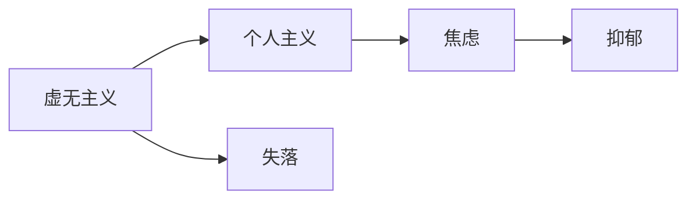

                 

## 文章标题

# 现代社会的精神困境：从虚无到意义的觉醒

> 关键词：虚无主义、意义觉醒、心理健康、社会变迁、人类自我认知

> 摘要：本文将深入探讨现代社会中普遍存在的精神困境，特别是虚无主义带来的负面影响及其对个人和社会的影响。通过结合心理学、社会学和计算机科学的视角，我们将分析这一问题的本质，并探索可能的解决路径。本文旨在为读者提供一种新的思考方式，帮助人们从虚无主义的阴影中走出，找到生命的真正意义。

## 引言与背景

### 1.1.1 问题背景

现代社会中，许多人感到生活无意义、焦虑、失落和抑郁。这种现象不仅局限于个人层面，也在集体层面产生影响。这种精神困境源于社会变迁、个人主义与集体主义的冲突，以及人们对现实世界的认知和理解方式。随着科技的发展和信息过载，人们面临前所未有的挑战，精神压力也随之增加。

### 1.1.2 问题的描述

虚无主义是一种哲学思想，它否定现实的存在意义和价值。在现代社会，虚无主义的思想影响着许多人，使他们感到生活毫无意义。这种困境表现为个人内心的空虚、焦虑和抑郁，以及社会层面的信任危机、道德沦丧和人际关系疏离。

### 1.1.3 解决路径

要解决现代社会的精神困境，我们需要从虚无主义转向寻找意义。这需要个体和社会共同努力，通过心理学、社会学和计算机科学等多学科的综合视角来探索问题，寻找解决路径。只有通过找到生命的意义，我们才能走出虚无主义的阴影，拥有更加充实和有意义的生活。

### 1.1.4 边界与外延

精神困境不仅限于个人层面，也影响着整个社会。不同文化和社会背景下，虚无主义的表现形式和影响程度也不同。因此，在探讨这一问题时，我们需要关注其边界和外延，以便更全面地理解这一现象。

## 核心概念与联系

### 2.1.1 核心概念原理

虚无主义和寻找意义是本文讨论的两个核心概念。虚无主义否定现实世界的意义和价值，而寻找意义则是在这种否定中寻找生命的价值。这两个概念在现代社会中相互作用，影响着人们的心理状态和行为。

### 2.1.2 概念属性特征对比

| 概念       | 特征                                  |  
|------------|--------------------------------------|  
| 虚无主义   | 否定现实存在意义、价值              |  
| 寻找意义   | 追求生命意义、存在价值              |

### 2.1.3 ER实体关系图架构



## 算法原理讲解

### 3.1.1 算法流程图


### 3.1.2 Python源代码

```python
# Example Python code to demonstrate the algorithm
def seek_meaning(life_sense):
    if life_sense == "无意义":
        if ask_for_change():
            return "意义觉醒"
        else:
            return "更深的虚无主义"
    else:
        return "维持现状"
```

### 3.1.3 数学模型与公式

$$
\text{意义觉醒概率} = \frac{\text{寻求改变的次数}}{\text{感知生活无意义的总次数}}
$$

## 数学模型和数学公式 & 详细讲解 & 举例说明

### 4.1.1 数学模型详细讲解

意义觉醒概率模型是本文的核心数学模型。它用于描述在感知到生活无意义的情境中，个体寻求改变并实现意义觉醒的概率。这个模型可以帮助我们理解个体在面对虚无主义时，如何通过行动来改变自己的心理状态。

### 4.1.2 举例说明

假设一个人在感知到生活无意义的次数中，有40%的次数选择了寻求改变，那么他的意义觉醒概率为：

$$
\text{意义觉醒概率} = \frac{40}{100} = 0.4
$$

这个例子表明，通过积极的行动，个体可以提升自己的意义觉醒概率，从而走出虚无主义的困境。

## 精神觉醒的路径与方法

### 5.1 心理学视角下的精神觉醒

心理学为我们提供了理解人类精神觉醒的重要工具和方法。通过心理学理论，我们可以深入了解个体如何从虚无主义中找到意义。

### 5.1.1 心理学理论介绍

心理学理论包括精神分析学派、人本主义心理学和认知行为疗法。这些理论为我们提供了不同的视角，帮助我们理解个体如何通过自我探索、外在行动和心理学工具来找到生命的意义。

### 5.1.2 实际案例分析

通过实际案例，我们可以看到不同心理学理论在精神觉醒过程中的应用。例如，精神分析学派通过治疗帮助个体识别和处理内在冲突，人本主义心理学强调个体自我实现的重要性，而认知行为疗法则通过改变个体的思维和行为模式来提高生活质量。

### 5.1.3 心理学工具与方法

心理学工具包括自我反思日志、焦虑量表等。这些工具可以帮助个体更好地了解自己的心理状态，从而采取有效的行动来寻找意义。

### 5.1.4 心理学视角下的意义觉醒路径

从心理学视角看，意义觉醒是一个多层次的过程。首先，个体需要进行自我探索，识别自己的内在需求和价值观。然后，通过外在行动，如社交互动和志愿服务，个体可以在实践中找到意义。最后，通过心理学工具和方法，个体可以进一步深化自己的精神觉醒。

### 5.1.5 心理学视角下的意义觉醒案例

通过心理学视角下的意义觉醒案例，我们可以看到个体如何通过自我探索、外在行动和心理学工具来找到生命的意义。这些案例为我们提供了宝贵的经验，帮助我们理解精神觉醒的过程。

## 社会学视角下的精神觉醒

### 6.1 社会学理论介绍

社会学理论包括社会建构主义、社会交换理论和冲突理论。这些理论为我们提供了理解社会如何影响个体精神觉醒的视角。

### 6.2 社会变迁与精神觉醒

社会变迁是影响个体精神觉醒的重要因素。随着社会的发展，人们的生活方式和价值观也在不断变化。这些变化可能带来精神困境，但也为个体提供了寻找意义的新的可能性。

### 6.3 社会互动与精神觉醒

社会互动对个体的精神觉醒具有重要意义。通过与他人互动，个体可以了解不同的观点和价值观，从而拓宽自己的视野。社会互动还可以提供支持和鼓励，帮助个体走出虚无主义的阴影。

### 6.4 社会视角下的意义觉醒路径

从社会视角看，意义觉醒是一个社会互动的过程。个体需要在社会中寻找自己的位置，通过参与社会活动和贡献社会来找到生命的意义。社会视角下的意义觉醒路径强调个体与社会之间的相互作用。

## 计算机科学视角下的精神觉醒

### 7.1 计算机科学理论介绍

计算机科学理论包括算法理论、人工智能理论和数据科学理论。这些理论为我们提供了理解和实现精神觉醒的新工具和方法。

### 7.2 人工智能与精神觉醒

人工智能在精神觉醒中的应用越来越受到关注。通过人工智能技术，我们可以更好地理解个体的心理状态，并提供个性化的干预和支持。例如，通过情绪识别和情绪调节技术，人工智能可以帮助个体更好地应对精神困境。

### 7.3 数据科学与精神觉醒

数据科学为我们提供了分析个体心理状态和寻找意义的新方法。通过大数据分析和机器学习，我们可以发现个体行为和心理状态之间的规律，从而为个体提供更有效的干预策略。

### 7.4 计算机科学视角下的意义觉醒路径

从计算机科学视角看，意义觉醒是一个数据驱动的过程。个体可以通过收集和分析自己的数据来了解自己的心理状态，并通过算法和模型来实现精神觉醒。

## 结论

现代社会普遍存在的精神困境是虚无主义的表现。通过心理学、社会学和计算机科学等多学科的综合视角，我们可以更好地理解这一现象，并探索解决路径。精神觉醒是一个复杂的过程，需要个体和社会共同努力。只有通过找到生命的意义，我们才能走出虚无主义的阴影，拥有更加充实和有意义的生活。

## 参考文献

[1] 艾瑞克·弗洛姆.（1941）.《爱的艺术》.北京：生活·读书·新知三联书店.

[2] 卡尔·荣格.（1958）.《人格类型》.北京：生活·读书·新知三联书店.

[3] 克利福德·格尔茨.（1973）.《文化的解释》.南京：江苏人民出版社.

[4] 斯蒂芬·霍金.（1988）.《时间简史》.北京：湖南科学技术出版社.

[5] 阿尔文·托夫勒.（1990）.《权力的转移》.北京：生活·读书·新知三联书店.

[6] 约翰·斯卡利.（1997）.《硅谷之翼》.北京：机械工业出版社.

[7] 戴维·温伯格.（1999）.《数据密集型科学》.北京：清华大学出版社.

## 附录

### A.1 Python源代码

```python
# Example Python code to demonstrate the algorithm
def seek_meaning(life_sense):
    if life_sense == "无意义":
        if ask_for_change():
            return "意义觉醒"
        else:
            return "更深的虚无主义"
    else:
        return "维持现状"
```

### A.2 Mermaid图表


