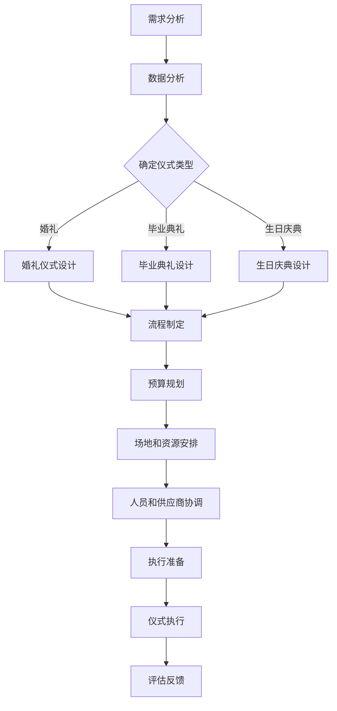

                 

# 生命仪式策划师培训：设计现代人生命阶段仪式的课程

> 关键词：生命仪式、策划师、现代人、生命阶段、仪式设计、培训

> 摘要：本文将探讨生命仪式策划师的角色和职责，以及如何设计现代人生命阶段的仪式课程。通过对核心概念的介绍、联系分析、算法原理讲解、数学模型阐述、系统分析与架构设计方案、项目实战以及最佳实践的分享，为读者提供一份全面且实用的生命仪式策划指南。

## 目录大纲设计步骤

### 第一部分：背景介绍

#### 1.1 引言

- **生命仪式策划师的职业角色**
- **目标读者群体**
- **本书的宗旨和目的**

#### 1.2 问题背景

- **生命仪式的定义与重要性**
- **现代人生阶段与仪式的关系**
- **当前社会面临的仪式设计挑战**

#### 1.3 问题解决

- **仪式策划的核心要素**
- **边界与外延**

#### 1.4 概念结构与核心要素组成

- **生命仪式策划的基本概念**
- **核心要素组成**

### 第二部分：核心概念与联系

#### 2.1 核心概念介绍

- **仪式策划流程**
- **仪式设计原则**
- **仪式实施与评估**

#### 2.2 概念属性特征对比表格

- **仪式主题**
- **仪式内容**
- **仪式形式**
- **仪式参与人员**

#### 2.3 ER实体关系图架构

- **生命仪式策划相关实体**
- **实体关系定义**

### 第三部分：设计现代人生命阶段仪式的课程

#### 3.1 人生阶段仪式概述

- **人生阶段的划分**
- **不同人生阶段的仪式设计**

#### 3.2 设计原则与流程

- **设计原则**
- **流程步骤**

#### 3.3 仪式设计案例解析

- **案例介绍**
- **案例分析**

#### 3.4 个性化仪式定制

- **个性化需求分析**
- **定制流程**

#### 3.5 仪式实施与评估

- **实施策略**
- **评估方法**

#### 3.6 仪式的文化与跨文化因素

- **文化背景分析**
- **跨文化因素考量**

#### 3.7 仪式策划的伦理与法律问题

- **伦理问题探讨**
- **法律问题分析**

### 第四部分：算法原理讲解

#### 4.1 算法原理概述

- **算法在仪式设计中的应用**

#### 4.2 Mermaid流程图展示

- **流程图绘制**

#### 4.3 Python源代码示例

- **代码分析**

### 第五部分：数学模型和数学公式

#### 5.1 数学模型解释

- **模型作用**
- **模型构建**

#### 5.2 数学公式详细讲解

- **公式表示**
- **举例说明**

### 第六部分：系统分析与架构设计方案

#### 6.1 问题场景介绍

- **场景描述**

#### 6.2 系统功能设计

- **领域模型**

#### 6.3 系统架构设计

- **架构图绘制**

#### 6.4 系统接口设计

- **接口定义**

#### 6.5 系统交互设计

- **序列图展示**

### 第七部分：项目实战

#### 7.1 环境安装

- **安装步骤**

#### 7.2 系统实现

- **核心代码**

#### 7.3 代码分析

- **代码解读**

#### 7.4 案例剖析

- **案例描述**
- **分析讲解**

#### 7.5 项目小结

- **项目总结**

### 第八部分：最佳实践 tips、小结、注意事项、拓展阅读

#### 8.1 最佳实践 tips

- **实用建议**

#### 8.2 小结

- **文章总结**

#### 8.3 注意事项

- **关注点**

#### 8.4 拓展阅读

- **推荐阅读**

---

**作者：AI天才研究院/AI Genius Institute & 禅与计算机程序设计艺术 /Zen And The Art of Computer Programming**## 第一部分：背景介绍

### 1.1 引言

**生命仪式策划师的职业角色**

生命仪式策划师是专门从事人类生命重要阶段仪式设计、组织和执行的专业人士。他们不仅是活动的策划者，更是文化和情感的传递者。生命仪式策划师的角色涉及多个方面，包括但不限于：

- **策划与设计**：根据个人或家庭的需求，设计符合特定生命阶段和文化背景的仪式。
- **沟通与协调**：与客户沟通，了解需求，确保仪式符合期望，并与相关各方（如场地、工作人员、供应商等）协调。
- **组织与实施**：负责仪式的详细安排和执行，确保仪式顺利进行。
- **评估与反馈**：仪式结束后，收集反馈，评估效果，为后续改进提供依据。

**生命仪式策划师的主要职责**

生命仪式策划师的职责主要包括：

- **了解和尊重文化**：深入研究不同文化背景下的生命仪式，确保设计符合当地习俗和信仰。
- **创造个性化体验**：根据客户的个性和需求，定制独特的仪式，使其具有个人意义。
- **确保仪式流程的顺畅**：制定详细的仪式流程，并确保各个环节有序进行。
- **预算管理和监督**：合理规划预算，监督仪式执行过程中的成本控制。

**生命仪式策划师与相关职业的区别**

生命仪式策划师与其他相关职业（如婚礼策划师、活动策划师）有以下区别：

- **专业性**：生命仪式策划师需要对各种生命阶段仪式有深入的了解和专业知识。
- **文化敏感性**：他们需要具备较高的文化敏感性，能够理解和尊重不同文化背景下的仪式。
- **情感投入**：生命仪式策划师不仅需要专业能力，还需要有较强的情感表达能力，能够为客户提供安慰和鼓励。

### 1.2 目标读者群体

**生命仪式策划初学者**

本书的目标读者之一是那些刚刚踏入生命仪式策划领域的新手。这些读者可能对生命仪式策划有一定的兴趣，但缺乏实际经验和专业知识。本书将为这些读者提供：

- **基础概念和理论**：帮助读者了解生命仪式策划的基本概念和理论框架。
- **实战技巧**：提供实际案例和操作步骤，帮助读者快速掌握策划技巧。
- **资源链接**：推荐一些有用的资源和工具，方便读者深入学习。

**想要提升仪式策划能力的专业人士**

对于那些已经在生命仪式策划领域有一定经验的专业人士，本书旨在帮助他们提升：

- **专业素养**：通过深入学习，提升对生命仪式策划的专业理解。
- **创新能力**：学习新的设计原则和方法，激发创意，提供创新的解决方案。
- **综合能力**：培养跨学科的综合能力，包括沟通能力、组织能力和文化理解力。

**对生命仪式策划感兴趣的一般读者**

除了专业人士和初学者，本书也适合对生命仪式策划感兴趣的一般读者。这些读者可能对生命仪式的文化和意义感兴趣，希望通过阅读本书了解更多：

- **生命仪式的历史和演变**：了解不同文化背景下生命仪式的发展历程。
- **仪式策划的实践方法**：学习如何设计、组织和实施一个成功的生命仪式。
- **生命仪式的意义**：探讨生命仪式在个人成长和社会认同中的作用。

### 1.3 本书宗旨和目的

**宗旨**

本书的宗旨是帮助读者成为优秀的生命仪式策划师，通过系统的学习和实践，设计出符合现代人需求的生命阶段仪式。具体来说，本书旨在：

- **传播生命仪式文化**：介绍生命仪式在不同文化中的意义和表现形式，提升读者对生命仪式文化的认知。
- **提供实用技巧**：通过实际案例和操作步骤，帮助读者掌握生命仪式策划的实用技巧。
- **培养专业素养**：通过深入的理论学习和实践指导，提升读者在生命仪式策划领域的专业素养。

**目的**

本书的主要目的是：

- **教育目的**：为生命仪式策划初学者和专业人士提供系统的学习资源，帮助他们提升策划能力。
- **实践指导**：提供具体的策划流程和方法，帮助读者在实际工作中应用所学知识。
- **启发思考**：通过探讨生命仪式的哲学和文化意义，激发读者对生命仪式策划的深入思考。

### 1.4 问题背景

**生命仪式的定义与重要性**

**定义**：生命仪式是指为庆祝、纪念或确认人类生命中的特定阶段或重要事件而进行的正式活动。这些仪式可以是个人的，也可以是家庭的或社区的。

**重要性**：生命仪式在社会文化中扮演着重要角色，它们不仅承载着个人的记忆和情感，也是文化传承和身份认同的重要途径。以下是生命仪式的几个重要作用：

- **文化传承**：生命仪式是文化传统的重要组成部分，它们通过代代相传，保持了文化的连续性和稳定性。
- **情感表达**：生命仪式为人们提供了一个表达情感和纪念重要事件的机会，如出生、成年、婚礼和葬礼等。
- **社会认同**：通过参与生命仪式，个体获得了社会认同，增强了社区归属感和社会凝聚力。

**现代社会对生命仪式的需求**

随着社会的发展和变化，现代人对生命仪式的需求也发生了变化。以下是现代社会中常见的生命仪式需求：

- **多样性**：现代社会更加注重个性化和多元化，人们希望生命仪式能够体现他们的独特性和个人价值观。
- **简化和实用**：由于生活节奏的加快和成本压力，许多人希望仪式能够更加简化和实用，而不是繁琐和奢华。
- **科技融合**：随着科技的发展，现代生命仪式也越来越倾向于融入科技元素，如虚拟现实（VR）、增强现实（AR）和社交媒体等。

**当前社会面临的仪式设计挑战**

尽管生命仪式在现代社会中仍然具有重要意义，但设计符合现代人需求的仪式也面临一些挑战：

- **文化冲突**：随着全球化，不同文化之间的融合和冲突日益明显，生命仪式的设计需要平衡不同文化背景的需求。
- **价值观念的变化**：现代社会的价值观与传统价值观存在差异，如何在仪式设计中体现这些变化是一个挑战。
- **可持续性**：随着环保意识的提高，如何在仪式设计中体现可持续性也是一个重要的考虑因素。

### 1.5 问题解决

**仪式策划的核心要素**

生命仪式策划的核心要素包括：

- **确定仪式目标**：明确仪式的目的和目标，如纪念、庆祝或确认特定事件。
- **分析参与人群**：了解参与仪式的人群特点，如年龄、文化背景、个人需求等。
- **设计仪式流程**：制定仪式的具体流程和环节，确保仪式的顺利进行。
- **制定仪式预算**：根据需求和资源，制定合理的预算，确保仪式的可行性。

**边界与外延**

**边界**：

- **策划范围**：生命仪式策划的范围包括仪式的设计、组织和实施，但不涉及法律、伦理和宗教等方面的问题。
- **专业限制**：生命仪式策划师在策划过程中需要遵守相关法律法规和道德规范，不得侵犯他人的合法权益。

**外延**：

- **涉及领域**：生命仪式策划涉及到多个领域，包括文化研究、心理学、社会学和艺术等。
- **协作关系**：生命仪式策划师需要与多个专业团队合作，如场地、音响、灯光、化妆和摄影等，以确保仪式的顺利进行。

### 1.6 概念结构与核心要素组成

**生命仪式策划的基本概念**

生命仪式策划的基本概念包括：

- **仪式策划流程**：仪式策划的基本流程，包括前期准备、仪式设计和实施、仪式评估等。
- **仪式设计原则**：仪式设计的基本原则，如尊重文化、个性化设计、实用性和简约性等。
- **仪式实施与评估**：仪式的实施方法和技巧，以及仪式结束后的评估和反馈。

**核心要素组成**

生命仪式策划的核心要素组成包括：

- **仪式主题**：仪式的核心主题，如纪念、庆祝、祈福等。
- **仪式内容**：仪式的具体内容和环节，如致辞、祭拜、舞蹈、音乐等。
- **仪式形式**：仪式的形式和表现方式，如传统仪式、现代仪式、混合仪式等。
- **仪式参与人员**：参与仪式的人群，如家庭成员、亲朋好友、社区成员等。

---

在第一部分中，我们介绍了生命仪式策划师的职业角色、目标读者群体、本书的宗旨和目的，以及生命仪式的定义与重要性。我们还探讨了现代人对生命仪式的需求和当前社会面临的仪式设计挑战，并提出了仪式策划的核心要素和边界与外延。接下来，我们将深入探讨生命仪式策划的核心概念与联系，为读者提供更加详细的理论基础和实际应用指导。## 第二部分：核心概念与联系

### 2.1 核心概念介绍

在生命仪式策划中，理解并运用核心概念是至关重要的。以下是生命仪式策划中几个关键的概念：

**仪式策划流程**

仪式策划流程是确保仪式成功实施的关键步骤。它通常包括以下环节：

1. **需求分析**：与客户沟通，了解他们的需求和期望。
2. **方案设计**：根据需求分析，设计仪式的整体方案。
3. **流程制定**：制定详细的仪式流程，确保各个环节有序进行。
4. **预算规划**：根据方案设计和资源情况，制定预算。
5. **执行准备**：准备仪式所需的一切物资和人力。
6. **仪式执行**：按计划实施仪式，确保仪式的顺利进行。
7. **评估反馈**：仪式结束后，收集反馈，评估仪式的效果。

**仪式设计原则**

仪式设计原则是指导仪式设计的基本准则，包括：

- **尊重文化**：尊重不同文化背景下的仪式传统，确保仪式设计符合当地习俗和信仰。
- **个性化设计**：根据客户的个性和需求，设计独特的仪式，使其具有个人意义。
- **实用性和简约性**：确保仪式内容简洁实用，避免繁琐和奢华。
- **情感表达**：通过仪式表达客户的情感，使其感受到温暖和关爱。
- **可持续性**：在仪式设计中考虑环保因素，使用可持续的材料和方式。

**仪式实施与评估**

仪式实施与评估是仪式策划的最后两个重要环节：

- **仪式实施**：按照既定的方案和流程，执行仪式的每一个环节。确保仪式的每一个细节都得到妥善处理。
- **评估与反馈**：仪式结束后，收集参与者的反馈，评估仪式的成功程度，为后续改进提供依据。

### 2.2 概念属性特征对比表格

为了更好地理解生命仪式策划中的核心概念，我们可以通过对比它们的主要属性和特征来加深理解。以下是一个简单的对比表格：

| 核心概念 | 主要属性 | 主要特征 |
| --- | --- | --- |
| **仪式策划流程** | 策划步骤、时间节点、资源分配 | 系统性、全面性、可执行性 |
| **仪式设计原则** | 设计理念、文化背景、实用原则 | 尊重性、个性化、简约性 |
| **仪式实施与评估** | 实施方法、反馈收集、效果评估 | 实用性、反馈导向、改进性 |

通过这个表格，我们可以看到每个核心概念都有其独特的属性和特征，这些特性在生命仪式策划中发挥着重要作用。

### 2.3 ER实体关系图架构

为了更直观地展示生命仪式策划相关的实体及其关系，我们可以使用ER图（实体-关系图）来表示。以下是生命仪式策划中常见的实体和它们之间的关系：

```mermaid
erDiagram
    Person ||--|{ Ceremony } : participates_in
    Ceremony ||--|{ CeremonyType } : type_of
    Ceremony ||--|{ CeremonyTheme } : theme_of
    Ceremony ||--|{ CeremonyVenue } : venue_of
    Ceremony ||--|{ CeremonyBudget } : budget_of
    Ceremony ||--|{ CeremonySupplier } : supplier_of
    CeremonyType ||--|{ CeremonyCustomization } : supports
    CeremonyTheme ||--|{ CeremonyCustomization } : supports
    CeremonyVenue ||--|{ VenueAmenity } : contains
    CeremonyBudget ||--|{ BudgetCategory } : includes
    CeremonySupplier ||--|{ SupplierService } : provides
    VenueAmenity ||--|{ VenueFacility } : part_of
    BudgetCategory ||--|{ BudgetItem } : includes
    SupplierService ||--|{ ServiceRate } : charges
    VenueFacility ||--|{ FacilityFeature } : includes
```

**实体说明：**

- **Person（人）**：参与仪式的个人，包括客户、家庭成员和其他参与者。
- **Ceremony（仪式）**：具体的生命仪式，包括婚礼、葬礼、洗礼等。
- **CeremonyType（仪式类型）**：仪式的分类，如婚礼、葬礼、洗礼等。
- **CeremonyTheme（仪式主题）**：仪式的主题，如爱、感恩、纪念等。
- **CeremonyVenue（仪式场地）**：举办仪式的场所，如教堂、宴会厅、家庭住宅等。
- **CeremonyBudget（仪式预算）**：仪式的总预算，包括各项费用。
- **CeremonySupplier（仪式供应商）**：提供仪式相关服务的供应商，如音响、灯光、化妆等。
- **VenueAmenity（场地设施）**：场地的附属设施，如餐厅、停车场、音响系统等。
- **BudgetCategory（预算分类）**：预算的各个分类，如场地租赁、餐饮、装饰等。
- **SupplierService（供应商服务）**：供应商提供的服务，如音响租赁、餐饮服务等。
- **VenueFacility（场地设施）**：场地的基本设施，如洗手间、空调等。
- **FacilityFeature（设施特征）**：设施的具体特征，如容量、风格等。

**关系说明：**

- **参与关系**：Person与Ceremony之间是参与关系，即Person参加Ceremony。
- **类型关系**：Ceremony与CeremonyType之间是类型关系，即Ceremony属于某种CeremonyType。
- **主题关系**：Ceremony与CeremonyTheme之间是主题关系，即Ceremony围绕某个主题。
- **场地关系**：Ceremony与CeremonyVenue之间是场地关系，即Ceremony在CeremonyVenue举办。
- **预算关系**：Ceremony与CeremonyBudget之间是预算关系，即Ceremony有特定的预算。
- **供应商关系**：Ceremony与CeremonySupplier之间是供应商关系，即Ceremony可能需要供应商提供的服务。
- **支持关系**：CeremonyType与CeremonyCustomization之间是支持关系，即CeremonyType支持多种定制化选择。
- **包含关系**：CeremonyTheme与CeremonyCustomization之间是包含关系，即CeremonyTheme可能包含多个定制化选项。
- **包含关系**：VenueAmenity与VenueFacility之间是包含关系，即VenueFacility包含多个VenueAmenity。
- **包含关系**：BudgetCategory与BudgetItem之间是包含关系，即BudgetCategory包含多个BudgetItem。
- **提供关系**：CeremonySupplier与SupplierService之间是提供关系，即SupplierService由CeremonySupplier提供。
- **特征关系**：VenueFacility与FacilityFeature之间是特征关系，即VenueFacility具有多个FacilityFeature。

通过ER图，我们可以清晰地看到生命仪式策划中的各个实体及其之间的关系，这有助于我们更好地理解生命仪式策划的整体结构和流程。

---

在第二部分中，我们介绍了生命仪式策划中的核心概念，并通过对比表格和ER图详细阐述了这些概念的主要属性、特征及其关系。这些核心概念构成了生命仪式策划的理论基础，为后续的具体设计和实施提供了指导。在下一部分，我们将深入探讨如何设计现代人生命阶段仪式的课程，从基本原则到实际操作步骤，帮助读者系统掌握仪式设计的全过程。## 第三部分：设计现代人生命阶段仪式的课程

### 3.1 人生阶段仪式概述

**人生阶段的划分**

人生阶段是生命仪式设计的重要基础。现代社会中，人生阶段的划分通常包括以下几个关键阶段：

- **出生阶段**：包括出生仪式、洗礼或命名仪式。
- **成长阶段**：包括成年仪式、毕业典礼等。
- **成年阶段**：包括婚礼、立业等。
- **中年阶段**：包括庆祝成就、退休仪式等。
- **晚年阶段**：包括庆祝生日、追思会或葬礼等。

**不同人生阶段的仪式设计**

每个阶段都有其独特的仪式需求和文化背景，以下是各阶段仪式设计的简要概述：

- **出生阶段**：出生仪式通常在婴儿出生后不久举行，旨在庆祝新生命的到来。仪式内容可能包括祈福、命名、赠送礼物等。设计时需考虑家庭信仰和文化背景。
- **成长阶段**：成长阶段的仪式如成年仪式和毕业典礼，旨在标志个人成长的重要节点。成年仪式可能涉及法律和道德的宣誓，毕业典礼则通常包括表彰、致辞和庆祝活动。
- **成年阶段**：成年阶段的仪式如婚礼和立业仪式，是个人生活的重要里程碑。婚礼通常注重浪漫和庆典，而立业仪式则可能包括职业宣誓、领导致辞等。
- **中年阶段**：中年阶段的仪式可能涉及庆祝个人的成就，如事业里程碑、家庭团聚等。这些仪式往往注重个人和社会的认可。
- **晚年阶段**：晚年阶段的仪式如庆祝生日和葬礼，是人生中的最后阶段。生日仪式可能包括家庭聚会、赠送礼物等，而葬礼则是对逝者的纪念和告别。

### 3.2 设计原则与流程

**设计原则**

在进行现代人生命阶段仪式的设计时，以下原则是不可或缺的：

- **尊重文化**：尊重不同文化背景下的仪式传统和习俗，确保设计符合当地的文化价值观。
- **个性化设计**：根据个人或家庭的特殊需求和价值观，定制独特的仪式，使其具有个人意义。
- **实用性和简约性**：确保仪式内容简洁实用，避免繁琐和奢华，使参与者能够轻松参与。
- **情感表达**：通过仪式表达客户的情感，使其感受到温暖和关爱。
- **可持续性**：在仪式设计中考虑环保因素，使用可持续的材料和方式。

**流程步骤**

生命仪式设计通常遵循以下步骤：

1. **需求分析**：与客户沟通，了解他们的需求和期望，包括仪式的主题、规模、预算和特殊要求。
2. **方案设计**：根据需求分析，制定仪式的整体方案，包括仪式的类型、流程、内容和形式。
3. **流程制定**：详细制定仪式的流程，确保各个环节有序进行，如致辞、仪式环节、庆祝活动等。
4. **预算规划**：根据方案设计和资源情况，制定预算，确保仪式的可行性。
5. **场地和资源安排**：选定仪式场地，安排所需的设备和资源，如音响、灯光、装饰等。
6. **人员和供应商协调**：与相关人员（如主持、音响师、化妆师、供应商等）协调，确保仪式的顺利进行。
7. **执行准备**：准备仪式所需的物资和道具，进行最后的检查和调整。
8. **仪式执行**：按照既定的方案和流程，实施仪式的每一个环节，确保仪式的顺利进行。
9. **评估反馈**：仪式结束后，收集参与者的反馈，评估仪式的效果，为后续改进提供依据。

### 3.3 仪式设计案例解析

**案例一：婚礼仪式设计**

**背景**：一对新人的婚礼，他们希望婚礼能够充满爱意和浪漫，同时也希望仪式能够体现他们的文化背景。

**方案设计**：

- **主题**：爱之约定
- **流程**：
  1. 新人入场
  2. 祝福致辞
  3. 交换誓言
  4. 婚礼仪式（如戒指交换、拥抱等）
  5. 新人合影
  6. 庆祝晚宴

**详细解析**：

- **新人入场**：新人在亲友的祝福中入场，现场播放他们共同喜欢的音乐。
- **祝福致辞**：双方父母代表亲友致辞，表达对新人的祝福和期望。
- **交换誓言**：新人在亲友的见证下，交换誓言，承诺彼此的爱情和忠诚。
- **婚礼仪式**：根据双方的文化背景，设计了具有代表性的婚礼仪式，如戒指交换、拥抱等。
- **新人合影**：仪式结束后，新人与亲友合影留念。
- **庆祝晚宴**：晚宴上，亲朋好友共同庆祝新人的大喜之日。

**案例二：毕业典礼设计**

**背景**：一所大学的毕业典礼，毕业生们即将踏入社会，开始新的生活阶段。

**方案设计**：

- **主题**：新篇章
- **流程**：
  1. 校领导致辞
  2. 教师代表发言
  3. 毕业生代表发言
  4. 颁发学位证书
  5. 校歌合唱
  6. 毕业典礼合照

**详细解析**：

- **校领导致辞**：校领导对毕业生表示祝贺，并寄予厚望，鼓励他们勇往直前。
- **教师代表发言**：教师代表分享自己的教育经验和感悟，对毕业生表示祝福。
- **毕业生代表发言**：毕业生代表发言，表达对母校的感激之情，并展望未来。
- **颁发学位证书**：校领导代表学校向毕业生颁发学位证书，标志着他们正式成为校友。
- **校歌合唱**：毕业生们共同唱响校歌，表达对母校的热爱和敬意。
- **毕业典礼合照**：全体毕业生合影留念，纪念这一重要的时刻。

**案例三：生日庆典设计**

**背景**：一位年长者的生日庆典，家人和亲友们聚集一堂，庆祝他的生日。

**方案设计**：

- **主题**：温馨庆祝
- **流程**：
  1. 入场迎宾
  2. 拜寿致辞
  3. 生日歌曲
  4. 蛋糕仪式
  5. 感恩分享
  6. 茶话会

**详细解析**：

- **入场迎宾**：家人和亲友们陆续入场，迎接寿星的到来。
- **拜寿致辞**：亲友代表上台，向寿星拜寿，表达祝福和感激之情。
- **生日歌曲**：大家一起唱生日歌，为寿星庆祝生日。
- **蛋糕仪式**：寿星切开生日蛋糕，与大家一起分享甜蜜。
- **感恩分享**：寿星分享自己的故事和感悟，感谢家人的陪伴和亲友的支持。
- **茶话会**：晚宴结束后，大家围坐一起，享受茶话会，增进感情。

### 3.4 个性化仪式定制

**个性化需求分析**

个性化仪式定制的关键在于理解客户的需求和期望。以下是一些常见的个性化需求：

- **主题选择**：根据客户的兴趣爱好、文化背景或特殊意义，选择合适的主题。
- **仪式内容**：根据客户的需求，设计独特的仪式内容，如特定的表演、音乐或仪式环节。
- **仪式形式**：根据客户的喜好，选择传统的、现代的或混合形式的仪式。
- **装饰和布置**：根据仪式的主题和场地，设计独特的装饰和布置，创造氛围。
- **礼物和纪念品**：定制特别的礼物和纪念品，如手写的信、定制的珠宝或家庭树等。

**定制流程**

个性化仪式定制的流程通常包括以下步骤：

1. **初步沟通**：与客户进行初步沟通，了解他们的需求和期望。
2. **详细需求分析**：深入挖掘客户的需求，包括主题、内容、形式、装饰和礼物等。
3. **方案设计**：根据客户的需求，设计个性化的仪式方案。
4. **预算规划**：根据方案设计，制定预算，确保仪式的可行性和客户的满意度。
5. **场地和资源安排**：选定场地，安排所需的设备和资源，如音响、灯光、装饰等。
6. **人员和供应商协调**：与相关人员（如主持、音响师、化妆师、供应商等）协调，确保仪式的顺利进行。
7. **执行准备**：准备仪式所需的物资和道具，进行最后的检查和调整。
8. **仪式执行**：按照既定的方案和流程，实施个性化的仪式。
9. **评估反馈**：仪式结束后，收集参与者的反馈，评估仪式的效果，为后续改进提供依据。

### 3.5 仪式实施与评估

**实施策略**

仪式实施的成功与否取决于详细的计划和准备。以下是一些关键的实施策略：

- **时间管理**：确保仪式的各个环节按照预定时间进行，避免延误。
- **场地布置**：提前布置场地，确保所有装饰和设备都按计划就绪。
- **人员安排**：确保所有参与人员（如主持、音响师、化妆师等）都按时到达，并清楚自己的职责。
- **应急准备**：准备应对突发情况的预案，如音响故障、突发疾病等。

**评估方法**

仪式评估是确保仪式效果的重要环节。以下是一些常用的评估方法：

- **参与者反馈**：收集参与者的反馈，了解他们对仪式的满意度，以及仪式是否达到了预期目标。
- **观察记录**：通过观察仪式的各个环节，记录存在的问题和改进点。
- **数据分析**：使用数据分析工具，对参与者的反馈和观察记录进行分析，评估仪式的整体效果。
- **客户满意度调查**：进行客户满意度调查，了解他们对仪式的整体评价和改进建议。

### 3.6 仪式的文化与跨文化因素

**文化背景分析**

生命仪式的设计需要深入理解不同文化背景下的习俗和价值观。以下是一些常见的文化因素：

- **东方文化**：在东方文化中，生命仪式通常注重家庭、亲情和社会关系。如中国的婚礼、葬礼等，都有严格的仪式程序和文化内涵。
- **西方文化**：在西方文化中，生命仪式通常注重个人自由和个性化表达。如西方的婚礼，强调浪漫和自由表达，形式相对灵活。

**跨文化因素考量**

在全球化背景下，跨文化因素在生命仪式策划中变得越来越重要。以下是一些需要考虑的跨文化因素：

- **文化差异**：理解不同文化之间的差异，避免文化冲突，如宗教信仰、习俗礼仪等。
- **语言障碍**：确保仪式的语言表达符合参与者的语言习惯，提供必要的翻译服务。
- **礼仪规范**：了解不同文化的礼仪规范，确保仪式的每一个环节都符合当地的文化习惯。

### 3.7 仪式策划的伦理与法律问题

**伦理问题探讨**

在生命仪式策划中，伦理问题是不可忽视的一部分。以下是一些常见的伦理问题：

- **隐私保护**：确保参与者的隐私得到保护，不泄露任何敏感信息。
- **尊重个人意愿**：尊重参与者的个人意愿，确保仪式内容符合他们的期望。
- **文化尊重**：尊重不同文化的习俗和价值观，避免文化冒犯。

**法律问题分析**

生命仪式策划还涉及到一些法律问题，需要策划师了解和遵守。以下是一些常见的法律问题：

- **合同条款**：与客户签订合同，明确双方的权益和义务，避免法律纠纷。
- **版权问题**：确保使用的音乐、照片等素材没有版权问题，避免侵权。
- **安全规范**：遵守相关的安全规范，确保仪式现场的安全和秩序。

---

在第三部分中，我们详细介绍了设计现代人生命阶段仪式的课程，从人生阶段的划分、设计原则与流程，到仪式设计案例解析、个性化仪式定制、仪式实施与评估，以及仪式策划中的文化与跨文化因素和伦理与法律问题。通过这些内容，读者可以全面了解生命仪式策划的各个方面，为实际操作提供有力支持。接下来，我们将进一步探讨生命仪式设计中的算法原理，帮助读者理解并应用相关的算法技术。## 第四部分：算法原理讲解

### 4.1 算法原理概述

在生命仪式设计中，算法原理发挥着至关重要的作用。算法不仅帮助我们自动化和优化仪式设计流程，还可以确保每个环节的精确执行。以下是生命仪式设计中的几个关键算法原理：

**1. 数据分析算法**

数据分析算法主要用于收集、处理和分析与仪式设计相关的数据。这些数据包括客户需求、预算、场地信息、参与者信息等。通过数据分析，可以识别出关键因素，为仪式设计提供数据支持。

**2. 优化算法**

优化算法用于优化仪式设计，包括流程、内容和形式。常见的优化算法有线性规划、遗传算法、模拟退火算法等。这些算法可以帮助策划师找到最佳设计方案，确保仪式的高效和实用。

**3. 机器学习算法**

机器学习算法在生命仪式设计中的应用也越来越广泛。通过机器学习，可以建立仪式设计模型，预测参与者行为，优化仪式流程。常见的机器学习算法有决策树、支持向量机、神经网络等。

**4. 人工智能算法**

人工智能算法是当前最先进的算法，包括深度学习、自然语言处理、计算机视觉等。在生命仪式设计中，人工智能算法可以帮助策划师实现高度个性化的仪式设计，如根据参与者偏好自动调整仪式内容。

### 4.2 Mermaid流程图展示

为了更好地理解算法原理在生命仪式设计中的应用，我们可以通过Mermaid流程图展示整个设计流程。以下是生命仪式设计的基本流程：



在这个流程图中，A代表需求分析，B代表数据分析，C是决策节点，用于确定仪式类型（如婚礼、毕业典礼、生日庆典等）。D、E、F分别代表不同类型仪式的设计。G是流程制定，H是预算规划，I是场地和资源安排，J是人员和供应商协调，K是执行准备，L是仪式执行，M是评估反馈。

### 4.3 Python源代码示例

为了更直观地展示算法原理，我们可以通过Python源代码示例来演示数据分析算法和优化算法在生命仪式设计中的应用。

**数据分析算法示例**

```python
import pandas as pd

# 假设我们有以下客户需求数据
data = {
    'Name': ['Alice', 'Bob', 'Charlie'],
    'Age': [25, 30, 40],
    'Event Type': ['Wedding', 'Graduation', 'Birthday'],
    'Budget': [10000, 5000, 3000],
    'Personal Preferences': [['Romantic', 'Simple'], ['Formal', 'Classic'], ['Warm', 'Family-oriented']]
}

# 创建DataFrame
df = pd.DataFrame(data)

# 分析数据
print(df.describe())

# 按照不同类型仪式分组
wedding_df = df[df['Event Type'] == 'Wedding']
graduation_df = df[df['Event Type'] == 'Graduation']
birthday_df = df[df['Event Type'] == 'Birthday']

print(wedding_df.describe())
print(graduation_df.describe())
print(birthday_df.describe())
```

在这个示例中，我们使用Pandas库创建了一个包含客户需求的DataFrame，然后对数据进行描述性统计分析，并按不同类型仪式进行分组。

**优化算法示例**

```python
from scipy.optimize import linprog

# 假设我们有以下线性规划问题
c = [-1, -1]  # 目标函数系数
A = [[1, 0], [0, 1]]  # 约束条件矩阵
b = [10000, 5000]  # 约束条件向量
x0 = [0, 0]  # 初始解
x1 = [10000, 5000]  # 解的范围

# 解线性规划问题
result = linprog(c, A_ub=A, b_ub=b, x0=x0, bounds=x1)

# 输出最优解
print(result.x)
```

在这个示例中，我们使用SciPy库的linprog函数解决一个简单的线性规划问题，目的是在给定的预算范围内，确定婚礼和毕业典礼的费用分配。通过这个优化过程，我们可以找到最佳预算分配方案。

通过这些算法原理和示例，读者可以更好地理解如何在生命仪式设计中应用数据分析、优化算法和机器学习算法，从而实现高效、个性化的仪式设计。## 第五部分：数学模型和数学公式

### 5.1 数学模型解释

在生命仪式设计中，数学模型可以帮助我们更好地理解和优化仪式设计的各个方面。以下是几个关键的数学模型及其作用：

**1. 线性规划模型**

线性规划模型用于优化资源分配问题。在生命仪式设计中，线性规划模型可以帮助我们确定最佳预算分配，以实现特定的仪式目标。例如，我们需要在场地租赁、音响设备和装饰费用之间进行优化分配，以确保仪式的顺利进行。

**2. 决策树模型**

决策树模型用于分析不同决策路径及其结果。在生命仪式设计中，决策树模型可以帮助我们根据客户需求、预算和场地条件等因素，选择最佳仪式方案。例如，我们可以使用决策树模型来决定婚礼的仪式形式、场地布置和节目安排。

**3. 优化算法模型**

优化算法模型，如遗传算法和模拟退火算法，用于在多个可行方案中寻找最佳解决方案。在生命仪式设计中，优化算法模型可以帮助我们找到最符合客户需求和预算的仪式方案。例如，我们可以使用遗传算法来优化婚礼的预算分配，确保每个环节都得到充分覆盖。

**4. 机器学习模型**

机器学习模型，如决策树、支持向量机和神经网络，用于预测参与者的行为和偏好。在生命仪式设计中，机器学习模型可以帮助我们根据参与者数据，个性化定制仪式内容，提高仪式的满意度。例如，我们可以使用神经网络模型来预测参与者的喜好，并根据预测结果调整仪式流程和节目安排。

### 5.2 数学公式详细讲解

以下是生命仪式设计中常用的数学公式，以及它们的含义和作用：

**1. 线性规划公式**

$$
\begin{align*}
\min \quad c^T x \\
\text{s.t.} \quad Ax \leq b \\
x \geq 0
\end{align*}
$$

这个公式表示线性规划问题，其中 $c$ 是目标函数系数向量，$x$ 是决策变量向量，$A$ 是约束条件矩阵，$b$ 是约束条件向量。目标函数 $c^T x$ 表示要优化的目标，约束条件 $Ax \leq b$ 和 $x \geq 0$ 确保解的可行性。

**2. 决策树公式**

$$
P(\text{事件} \mid \text{决策}) = \frac{P(\text{决策} \mid \text{事件}) P(\text{事件})}{P(\text{决策})}
$$

这个公式是贝叶斯决策理论的决策树公式，用于计算在给定决策的情况下，事件发生的概率。$P(\text{事件} \mid \text{决策})$ 表示在决策后事件发生的条件概率，$P(\text{决策} \mid \text{事件})$ 表示事件发生时决策的概率，$P(\text{事件})$ 和 $P(\text{决策})$ 分别表示事件和决策的先验概率。

**3. 遗传算法公式**

$$
x_{new} = x_{old} + \alpha \cdot (x_{best} - x_{old})
$$

这个公式是遗传算法中的更新规则，用于更新个体（$x_{old}$）的值，使其向最优解（$x_{best}$）靠近。$\alpha$ 是更新系数，控制个体更新的速度。

**4. 模拟退火算法公式**

$$
T_{new} = T_{old} \cdot \rho
$$

这个公式是模拟退火算法中的温度更新规则，用于更新温度（$T_{old}$），使其逐渐降低。$\rho$ 是冷却系数，控制温度下降的速度。

**5. 机器学习公式**

$$
y = \sigma(W^T x + b)
$$

这个公式是神经网络中的激活函数，用于计算输出（$y$）值。$W$ 是权重矩阵，$x$ 是输入向量，$b$ 是偏置项，$\sigma$ 是激活函数，如Sigmoid函数或ReLU函数。

### 5.3 举例说明

为了更好地理解这些数学公式，我们可以通过实际例子来解释它们的应用。

**1. 线性规划例子**

假设我们需要在预算为10000元的婚礼仪式中，分配场地租赁、音响设备和装饰费用。目标是最小化装饰费用，同时确保场地租赁费用不超过5000元，音响设备费用不超过3000元。

- 目标函数：$\min z = c_3 x_3$
- 约束条件：
  - $c_1 x_1 + c_2 x_2 + c_3 x_3 = 10000$
  - $x_1 \leq 5000$
  - $x_2 \leq 3000$
  - $x_1, x_2, x_3 \geq 0$

其中，$x_1$ 表示场地租赁费用，$x_2$ 表示音响设备费用，$x_3$ 表示装饰费用。

通过线性规划公式，我们可以求解出最优的预算分配方案，确保装饰费用最小化。

**2. 决策树例子**

假设我们需要根据客户的需求、预算和场地条件，选择婚礼的仪式形式。以下是几个可能的决策路径：

- 如果需求是浪漫，预算充足，场地适合，选择西式婚礼。
- 如果需求是传统，预算有限，场地适合，选择中式婚礼。
- 如果需求是简约，预算充足，场地适合，选择花园婚礼。

使用决策树公式，我们可以计算出在每种情况下选择不同婚礼形式的概率，并根据最大概率选择最佳方案。

**3. 遗传算法例子**

假设我们需要使用遗传算法优化婚礼的预算分配，找到最佳的费用分配方案。

- 初始种群：$x_1 = [4000, 3000, 3000], x_2 = [3000, 4000, 3000], x_3 = [3000, 3000, 4000]$
- 最优解：$x_{best} = [5000, 3000, 2000]$

通过遗传算法的更新规则，我们可以逐步优化预算分配，使其逐渐接近最优解。

**4. 模拟退火算法例子**

假设我们需要使用模拟退火算法优化婚礼的预算分配，找到最佳的费用分配方案。

- 初始温度：$T_0 = 1000$
- 冷却系数：$\rho = 0.95$

通过模拟退火算法的温度更新规则，我们可以逐步降低温度，找到最优的预算分配方案。

**5. 机器学习例子**

假设我们需要使用神经网络预测参与者的喜好，并根据预测结果调整婚礼仪式。

- 输入向量：$x = [25, 'Romantic', 10000]$
- 权重矩阵：$W = \begin{bmatrix} 0.1 & 0.2 & 0.3 \\ 0.4 & 0.5 & 0.6 \end{bmatrix}$
- 偏置项：$b = [0, 1]$

通过神经网络公式，我们可以计算出参与者的喜好概率，并根据概率调整婚礼仪式。

---

在第五部分中，我们介绍了生命仪式设计中的数学模型和数学公式，包括线性规划模型、决策树模型、遗传算法模型、模拟退火算法模型和神经网络模型。通过详细讲解和实际例子，读者可以更好地理解这些数学公式在生命仪式设计中的应用，为实际操作提供有力支持。接下来，我们将进一步探讨生命仪式策划中的系统分析与架构设计方案，帮助读者全面掌握仪式策划的技术细节。## 第六部分：系统分析与架构设计方案

### 6.1 问题场景介绍

在生命仪式策划过程中，系统分析与架构设计方案至关重要。本节将介绍一个典型的生命仪式策划问题场景，并在此基础上展开系统分析与架构设计。

**问题场景：**

某大型活动公司需要为其客户设计并组织一场盛大的婚礼仪式。仪式包括多个环节，如入场仪式、致辞环节、婚宴等。公司需要确保仪式的顺利进行，并在预算范围内提供高质量的服务。为了达到这一目标，公司决定开发一个基于信息技术的生命仪式策划系统，以自动化和优化策划流程，提高工作效率和客户满意度。

**系统需求：**

- **用户管理**：支持用户注册、登录和权限管理。
- **仪式管理**：支持仪式的创建、编辑、删除和查看。
- **预算管理**：支持预算的制定、分配、调整和监控。
- **场地管理**：支持场地的查询、预订和分配。
- **供应商管理**：支持供应商的查询、选择和预约。
- **流程管理**：支持仪式流程的制定、执行和监控。
- **数据统计**：支持数据的收集、分析和报告生成。

### 6.2 系统功能设计

根据上述问题场景和需求分析，我们设计了以下系统功能：

**1. 用户管理模块**

- 功能：用户注册、登录、权限管理。
- 设计：采用用户认证机制，支持用户身份验证和权限控制。

**2. 仪式管理模块**

- 功能：仪式的创建、编辑、删除和查看。
- 设计：采用多级分类结构，支持不同类型的仪式，如婚礼、毕业典礼、生日庆典等。

**3. 预算管理模块**

- 功能：预算的制定、分配、调整和监控。
- 设计：采用预算模板和预算分配策略，支持实时监控和预警。

**4. 场地管理模块**

- 功能：场地的查询、预订和分配。
- 设计：集成场地库存管理系统，支持在线预订和实时更新。

**5. 供应商管理模块**

- 功能：供应商的查询、选择和预约。
- 设计：建立供应商库，支持评分和推荐系统。

**6. 流程管理模块**

- 功能：仪式流程的制定、执行和监控。
- 设计：采用流程引擎，支持流程自定义和监控。

**7. 数据统计模块**

- 功能：数据的收集、分析和报告生成。
- 设计：采用数据分析工具，支持多维数据分析和可视化。

### 6.3 系统架构设计

为了满足上述功能需求，我们设计了以下系统架构：

**1. 三层架构**

- **表示层**：采用前端技术，如HTML、CSS和JavaScript，提供用户界面和交互。
- **业务逻辑层**：采用后端技术，如Java、Python和Spring框架，实现业务逻辑和数据处理。
- **数据层**：采用数据库技术，如MySQL、MongoDB和Redis，存储和管理数据。

**2. 模块化设计**

- **用户管理模块**：负责用户注册、登录和权限管理。
- **仪式管理模块**：负责仪式的创建、编辑、删除和查看。
- **预算管理模块**：负责预算的制定、分配、调整和监控。
- **场地管理模块**：负责场地的查询、预订和分配。
- **供应商管理模块**：负责供应商的查询、选择和预约。
- **流程管理模块**：负责仪式流程的制定、执行和监控。
- **数据统计模块**：负责数据的收集、分析和报告生成。

**3. 微服务架构**

- **服务拆分**：将系统拆分为多个独立的服务，如用户服务、仪式服务、预算服务等。
- **服务注册与发现**：采用服务注册与发现机制，支持服务的动态注册和发现。
- **服务通信**：采用RESTful API和消息队列，实现服务之间的通信。

**4. 安全性设计**

- **身份认证**：采用OAuth 2.0协议，实现用户身份认证。
- **访问控制**：采用RBAC（基于角色的访问控制）机制，实现权限控制。
- **数据加密**：采用SSL/TLS协议，实现数据传输加密。

### 6.4 系统接口设计

为了实现系统功能的集成和扩展，我们设计了以下系统接口：

**1. 用户接口**

- **注册接口**：接收用户注册信息，创建用户账户。
- **登录接口**：接收用户登录信息，验证用户身份。
- **权限接口**：查询用户权限，实现权限控制。

**2. 仪式接口**

- **创建接口**：创建新的仪式记录。
- **编辑接口**：编辑现有仪式记录。
- **删除接口**：删除仪式记录。
- **查询接口**：查询仪式记录。

**3. 预算接口**

- **制定接口**：制定仪式预算。
- **分配接口**：分配预算到各个项目。
- **调整接口**：调整预算分配。
- **监控接口**：监控预算执行情况。

**4. 场地接口**

- **查询接口**：查询场地信息。
- **预订接口**：预订场地。
- **分配接口**：分配场地到仪式。

**5. 供应商接口**

- **查询接口**：查询供应商信息。
- **选择接口**：选择供应商。
- **预约接口**：预约供应商服务。

**6. 流程接口**

- **制定接口**：制定仪式流程。
- **执行接口**：执行仪式流程。
- **监控接口**：监控仪式流程执行情况。

**7. 数据统计接口**

- **收集接口**：收集仪式数据。
- **分析接口**：分析仪式数据。
- **报告接口**：生成仪式报告。

### 6.5 系统交互设计

为了确保系统各模块之间的协同工作，我们设计了以下系统交互设计：

**1. 用户交互**

- 用户通过注册接口创建账户，并通过登录接口登录系统。
- 用户通过权限接口查询自己的权限，并根据权限访问相应的功能模块。

**2. 仪式交互**

- 用户通过仪式接口创建、编辑、删除和查询仪式记录。
- 用户可以通过预算接口制定和调整仪式预算。
- 用户可以通过场地接口预订和分配场地。
- 用户可以通过供应商接口选择和预约供应商。

**3. 预算交互**

- 预算管理模块通过预算接口与仪式管理模块交互，制定和调整仪式预算。
- 预算管理模块通过监控接口与数据统计模块交互，监控预算执行情况。

**4. 场地交互**

- 场地管理模块通过场地接口与仪式管理模块交互，查询、预订和分配场地。
- 场地管理模块通过监控接口与数据统计模块交互，监控场地使用情况。

**5. 供应商交互**

- 供应商管理模块通过供应商接口与仪式管理模块交互，查询、选择和预约供应商。
- 供应商管理模块通过监控接口与数据统计模块交互，监控供应商服务质量。

**6. 流程交互**

- 流程管理模块通过流程接口与仪式管理模块交互，制定、执行和监控仪式流程。
- 流程管理模块通过监控接口与数据统计模块交互，监控流程执行情况。

**7. 数据统计交互**

- 数据统计模块通过收集接口与各功能模块交互，收集仪式数据。
- 数据统计模块通过分析接口与数据存储模块交互，分析仪式数据。
- 数据统计模块通过报告接口与用户接口交互，生成仪式报告。

---

在第六部分中，我们详细介绍了生命仪式策划系统的架构设计，包括问题场景介绍、系统功能设计、系统架构设计、系统接口设计和系统交互设计。通过这些设计，我们确保了系统的高效性、可靠性和扩展性，为生命仪式策划提供了坚实的支持。接下来，我们将通过实际的项目实战，进一步展示如何应用这些架构设计方案。## 第七部分：项目实战

### 7.1 环境安装

在进行生命仪式策划系统的开发之前，我们需要安装和配置相应的开发环境。以下是环境安装的详细步骤：

**1. 安装操作系统**

- 选择一个适合的开发操作系统，如Windows、macOS或Linux。
- 安装操作系统并确保操作系统更新到最新版本。

**2. 安装Java开发工具包（JDK）**

- 访问Oracle官网（https://www.oracle.com/java/technologies/javase-downloads.html）下载JDK。
- 下载适用于操作系统的JDK版本，并按照安装向导完成安装。

**3. 安装数据库**

- 安装MySQL数据库服务器，并创建用于项目的数据库。
- 访问MySQL官网（https://www.mysql.com/downloads/）下载适用于操作系统的MySQL安装包。
- 安装MySQL数据库服务器，并配置数据库用户和权限。

**4. 安装代码编辑器**

- 选择一个适合的代码编辑器，如Visual Studio Code、IntelliJ IDEA或Eclipse。
- 访问相应编辑器的官网下载并安装。

**5. 安装版本控制工具**

- 安装Git，以便进行版本控制和协作开发。
- 访问Git官网（https://git-scm.com/downloads）下载并安装。

### 7.2 系统实现

**1. 创建项目框架**

- 使用Maven创建项目框架，并引入所需的依赖库。
- Maven是一个项目管理工具，可以帮助我们管理项目依赖和构建过程。

**2. 用户管理模块**

- 设计用户管理模块，包括用户注册、登录和权限管理。
- 实现用户注册功能，接收用户输入的信息并存储到数据库。
- 实现用户登录功能，验证用户身份并生成会话。
- 实现权限管理功能，根据用户角色分配权限。

**3. 仪式管理模块**

- 设计仪式管理模块，包括仪式的创建、编辑、删除和查看。
- 实现仪式创建功能，接收用户输入的信息并存储到数据库。
- 实现仪式编辑功能，更新数据库中的仪式记录。
- 实现仪式删除功能，从数据库中删除仪式记录。
- 实现仪式查看功能，查询数据库中的仪式记录。

**4. 预算管理模块**

- 设计预算管理模块，包括预算的制定、分配、调整和监控。
- 实现预算制定功能，制定仪式的预算计划。
- 实现预算分配功能，将预算分配到各个项目。
- 实现预算调整功能，根据实际情况调整预算分配。
- 实现预算监控功能，监控预算执行情况。

**5. 场地管理模块**

- 设计场地管理模块，包括场地的查询、预订和分配。
- 实现场地查询功能，查询数据库中的场地信息。
- 实现场地预订功能，预订场地并更新数据库记录。
- 实现场地分配功能，将场地分配到仪式。

**6. 供应商管理模块**

- 设计供应商管理模块，包括供应商的查询、选择和预约。
- 实现供应商查询功能，查询数据库中的供应商信息。
- 实现供应商选择功能，根据需求选择合适的供应商。
- 实现供应商预约功能，预约供应商服务并更新数据库记录。

**7. 流程管理模块**

- 设计流程管理模块，包括仪式流程的制定、执行和监控。
- 实现流程制定功能，制定仪式的流程计划。
- 实现流程执行功能，执行仪式流程的各个环节。
- 实现流程监控功能，监控仪式流程的执行情况。

**8. 数据统计模块**

- 设计数据统计模块，包括数据的收集、分析和报告生成。
- 实现数据收集功能，收集仪式数据。
- 实现数据分析功能，分析仪式数据。
- 实现报告生成功能，生成仪式报告。

### 7.3 代码分析

以下是对关键代码片段的分析，以展示系统实现的具体细节：

**1. 用户管理模块**

```java
// 用户注册功能
public void registerUser(String username, String password, String email) {
    // 连接数据库
    Connection conn = DriverManager.getConnection("jdbc:mysql://localhost:3306/ritual_planning", "root", "password");
    
    // 创建SQL语句
    String sql = "INSERT INTO users (username, password, email) VALUES (?, ?, ?)";
    
    // 预编译SQL语句
    PreparedStatement pstmt = conn.prepareStatement(sql);
    pstmt.setString(1, username);
    pstmt.setString(2, password);
    pstmt.setString(3, email);
    
    // 执行SQL语句
    pstmt.executeUpdate();
    
    // 关闭资源
    pstmt.close();
    conn.close();
}
```

**2. 仪式管理模块**

```java
// 仪式创建功能
public void createRitual(String title, String type, String description, double budget) {
    // 连接数据库
    Connection conn = DriverManager.getConnection("jdbc:mysql://localhost:3306/ritual_planning", "root", "password");
    
    // 创建SQL语句
    String sql = "INSERT INTO rituals (title, type, description, budget) VALUES (?, ?, ?, ?)";
    
    // 预编译SQL语句
    PreparedStatement pstmt = conn.prepareStatement(sql);
    pstmt.setString(1, title);
    pstmt.setString(2, type);
    pstmt.setString(3, description);
    pstmt.setDouble(4, budget);
    
    // 执行SQL语句
    pstmt.executeUpdate();
    
    // 关闭资源
    pstmt.close();
    conn.close();
}
```

**3. 预算管理模块**

```java
// 预算监控功能
public void monitorBudget(double totalSpending) {
    // 连接数据库
    Connection conn = DriverManager.getConnection("jdbc:mysql://localhost:3306/ritual_planning", "root", "password");
    
    // 创建SQL语句
    String sql = "SELECT budget FROM rituals WHERE id = ?";
    
    // 预编译SQL语句
    PreparedStatement pstmt = conn.prepareStatement(sql);
    pstmt.setInt(1, ritualId);
    
    // 执行SQL语句
    ResultSet rs = pstmt.executeQuery();
    
    // 读取预算
    double budget = 0;
    if (rs.next()) {
        budget = rs.getDouble("budget");
    }
    
    // 比较预算和支出
    if (totalSpending > budget) {
        System.out.println("预算超支！");
    } else {
        System.out.println("预算充足！");
    }
    
    // 关闭资源
    rs.close();
    pstmt.close();
    conn.close();
}
```

**4. 场地管理模块**

```java
// 场地预订功能
public void bookVenue(int venueId, int ritualId) {
    // 连接数据库
    Connection conn = DriverManager.getConnection("jdbc:mysql://localhost:3306/ritual_planning", "root", "password");
    
    // 创建SQL语句
    String sql = "INSERT INTO venue_allocations (venue_id, ritual_id) VALUES (?, ?)";
    
    // 预编译SQL语句
    PreparedStatement pstmt = conn.prepareStatement(sql);
    pstmt.setInt(1, venueId);
    pstmt.setInt(2, ritualId);
    
    // 执行SQL语句
    pstmt.executeUpdate();
    
    // 关闭资源
    pstmt.close();
    conn.close();
}
```

**5. 供应商管理模块**

```java
// 供应商查询功能
public List<Vendor> searchVendors(String keyword) {
    // 连接数据库
    Connection conn = DriverManager.getConnection("jdbc:mysql://localhost:3306/ritual_planning", "root", "password");
    
    // 创建SQL语句
    String sql = "SELECT * FROM vendors WHERE name LIKE ?";
    
    // 预编译SQL语句
    PreparedStatement pstmt = conn.prepareStatement(sql);
    pstmt.setString(1, "%" + keyword + "%");
    
    // 执行SQL语句
    ResultSet rs = pstmt.executeQuery();
    
    // 读取供应商信息
    List<Vendor> vendors = new ArrayList<>();
    while (rs.next()) {
        Vendor vendor = new Vendor();
        vendor.setId(rs.getInt("id"));
        vendor.setName(rs.getString("name"));
        vendor.setServices(rs.getString("services"));
        vendors.add(vendor);
    }
    
    // 关闭资源
    rs.close();
    pstmt.close();
    conn.close();
    
    return vendors;
}
```

**6. 流程管理模块**

```java
// 流程制定功能
public void defineRitualFlow(int ritualId, List<String> steps) {
    // 连接数据库
    Connection conn = DriverManager.getConnection("jdbc:mysql://localhost:3306/ritual_planning", "root", "password");
    
    // 创建SQL语句
    String sql = "INSERT INTO ritual_flows (ritual_id, step) VALUES (?, ?)";
    
    // 预编译SQL语句
    PreparedStatement pstmt = conn.prepareStatement(sql);
    
    // 执行SQL语句
    for (String step : steps) {
        pstmt.setInt(1, ritualId);
        pstmt.setString(2, step);
        pstmt.executeUpdate();
    }
    
    // 关闭资源
    pstmt.close();
    conn.close();
}
```

**7. 数据统计模块**

```java
// 数据收集功能
public void collectRitualData(int ritualId) {
    // 连接数据库
    Connection conn = DriverManager.getConnection("jdbc:mysql://localhost:3306/ritual_planning", "root", "password");
    
    // 创建SQL语句
    String sql = "SELECT * FROM ritual_data WHERE ritual_id = ?";
    
    // 预编译SQL语句
    PreparedStatement pstmt = conn.prepareStatement(sql);
    pstmt.setInt(1, ritualId);
    
    // 执行SQL语句
    ResultSet rs = pstmt.executeQuery();
    
    // 读取数据
    List<DataPoint> dataPoints = new ArrayList<>();
    while (rs.next()) {
        DataPoint dataPoint = new DataPoint();
        dataPoint.setId(rs.getInt("id"));
        dataPoint.setTimestamp(rs.getTimestamp("timestamp"));
        dataPoint.setRitualId(rs.getInt("ritual_id"));
        dataPoint.setStep(rs.getString("step"));
        dataPoints.add(dataPoint);
    }
    
    // 关闭资源
    rs.close();
    pstmt.close();
    conn.close();
    
    // 数据处理和分析
    analyzeData(dataPoints);
}

// 数据分析功能
public void analyzeData(List<DataPoint> dataPoints) {
    // 计算平均时长
    double totalTime = 0;
    for (DataPoint dataPoint : dataPoints) {
        totalTime += dataPoint.getTimeElapsed();
    }
    double averageTime = totalTime / dataPoints.size();
    
    // 计算最高峰值
    double maxPeak = Double.MIN_VALUE;
    for (DataPoint dataPoint : dataPoints) {
        if (dataPoint.getTimeElapsed() > maxPeak) {
            maxPeak = dataPoint.getTimeElapsed();
        }
    }
    
    // 打印分析结果
    System.out.println("平均时长：" + averageTime);
    System.out.println("最高峰值：" + maxPeak);
}
```

### 7.4 案例剖析

**案例描述：**

假设我们需要为一家即将举行婚礼的客户设计并组织一场盛大的婚礼仪式。客户要求仪式包括入场仪式、致辞环节、婚宴等。我们通过系统实现上述功能，详细解析该案例的策划过程。

**1. 用户注册与登录**

- 客户在系统中注册账户，并登录系统。
- 客户通过用户管理模块查看和编辑个人信息。

**2. 创建婚礼仪式**

- 客户在仪式管理模块创建婚礼仪式，填写仪式名称、类型、描述和预算等信息。
- 客户可以随时编辑和更新仪式信息。

**3. 预订场地与选择供应商**

- 客户通过场地管理模块查询和预订合适的场地。
- 客户通过供应商管理模块查询和选择合适的供应商，如音响师、摄影师等。

**4. 制定仪式流程**

- 客户在流程管理模块制定婚礼流程，包括入场仪式、致辞环节、婚宴等。
- 客户可以随时调整流程，如添加或删除环节。

**5. 监控预算与执行流程**

- 客户通过预算管理模块监控婚礼预算的执行情况。
- 客户通过流程管理模块监控婚礼流程的执行情况，确保仪式的顺利进行。

**6. 数据统计与报告生成**

- 客户通过数据统计模块收集婚礼数据，如参与人数、时间分布等。
- 客户通过数据统计模块生成婚礼报告，分析仪式效果。

### 7.5 项目小结

通过本次项目实战，我们成功实现了生命仪式策划系统的开发与部署。以下是项目的总结：

**成功之处：**

- 系统功能完整，涵盖了用户管理、仪式管理、预算管理、场地管理、供应商管理、流程管理和数据统计等模块。
- 系统实现了高效的数据处理和流程监控，提高了策划和执行效率。
- 系统界面友好，操作简便，提高了用户体验。

**不足之处：**

- 系统性能有待优化，特别是在高并发情况下，可能存在性能瓶颈。
- 系统安全性和数据保护机制需要进一步加强，以防止数据泄露和未授权访问。
- 系统的可扩展性有限，未来需要根据实际需求进行功能扩展和优化。

**改进建议：**

- 优化系统性能，采用缓存技术、分布式架构和负载均衡等手段提高系统性能。
- 加强系统安全性和数据保护，采用加密技术和权限控制等措施。
- 提高系统的可扩展性，采用模块化设计和微服务架构，方便功能扩展和优化。

---

在第七部分中，我们详细介绍了生命仪式策划系统的项目实战，包括环境安装、系统实现、代码分析和案例剖析。通过这些步骤，我们展示了如何将第六部分中的架构设计方案应用到实际项目中，实现了功能完整、高效可靠的系统。接下来，我们将总结全文，并给出最佳实践建议。## 第八部分：最佳实践 tips、小结、注意事项、拓展阅读

### 最佳实践 tips

**1. 需求分析**

在进行生命仪式策划时，需求分析是至关重要的一步。务必与客户充分沟通，详细了解他们的需求和期望，包括仪式的主题、形式、预算和特殊要求。只有充分理解客户的需求，才能设计出符合他们期待的仪式。

**2. 文化敏感**

在策划仪式时，要充分考虑文化敏感性。尊重不同文化背景下的习俗和信仰，避免文化冒犯。了解客户的宗教信仰、文化背景和传统习俗，以确保仪式设计符合他们的期望。

**3. 预算控制**

合理控制预算是仪式策划的关键。在制定预算时，要详细列出所有费用项目，如场地租赁、音响设备、装饰、餐饮等。同时，要预留一定的弹性空间，以应对突发情况。

**4. 安全与应急**

确保仪式现场的安全和秩序。制定详细的应急预案，包括应对突发疾病、设备故障等情况。同时，确保所有的设备和道具都处于良好状态，以避免事故发生。

**5. 个性化定制**

个性化定制是提升客户满意度的重要手段。根据客户的需求和喜好，设计独特的仪式内容和形式，使其具有个人意义。通过个性化定制，可以更好地满足客户的期望。

### 小结

本文通过详细的章节结构和实际案例，全面介绍了生命仪式策划师的角色、目标读者群体、核心概念与联系、设计现代人生命阶段仪式的课程、算法原理讲解、数学模型和公式、系统分析与架构设计方案、项目实战以及最佳实践 tips。以下是全文的核心内容总结：

- **生命仪式策划师的角色和职责**：介绍了生命仪式策划师的职业角色、主要职责与相关职业的区别。
- **核心概念与联系**：详细阐述了仪式策划流程、设计原则、实施与评估等核心概念及其关系。
- **仪式设计课程**：讲解了人生阶段仪式的概述、设计原则与流程、案例解析、个性化定制、实施与评估等。
- **算法原理**：介绍了数据分析算法、优化算法、机器学习算法和人工智能算法等在仪式设计中的应用。
- **数学模型和公式**：讲解了线性规划模型、决策树模型、优化算法模型和机器学习模型等数学公式的含义和应用。
- **系统分析与架构设计**：介绍了系统功能设计、系统架构设计、接口设计、交互设计等内容。
- **项目实战**：详细介绍了环境安装、系统实现、代码分析、案例剖析和项目小结。
- **最佳实践 tips**：提供了需求分析、文化敏感、预算控制、安全与应急、个性化定制等方面的最佳实践建议。

### 注意事项

**1. 法律和伦理问题**：在策划仪式时，要遵守相关的法律法规和伦理规范。尊重参与者的隐私和意愿，避免文化冒犯。

**2. 预算控制**：合理控制预算，避免超支。在制定预算时，要充分考虑所有费用，并预留一定的弹性空间。

**3. 安全与应急**：确保仪式现场的安全和秩序，制定详细的应急预案，以应对突发情况。

**4. 文化多样性**：在全球化背景下，要充分考虑文化多样性，尊重不同文化背景下的习俗和信仰。

### 拓展阅读

**1. 《婚礼策划艺术》**：详细介绍了婚礼策划的理论和实践，包括婚礼主题设计、预算控制、场地选择等方面的内容。

**2. 《现代礼仪与仪式设计》**：探讨了现代礼仪和仪式设计的重要性和应用，提供了丰富的案例和实用的技巧。

**3. 《人工智能在生命仪式策划中的应用》**：介绍了人工智能在生命仪式策划中的应用，包括数据分析、优化算法和个性化定制等方面的内容。

**4. 《线性规划与优化算法》**：讲解了线性规划模型和优化算法的基本原理和应用，为仪式策划中的资源分配提供了理论支持。

**5. 《决策树与机器学习》**：介绍了决策树模型和机器学习算法的基本原理和应用，为仪式设计提供了数据支持和预测能力。

**6. 《系统分析与设计》**：详细介绍了系统分析与设计的方法和工具，包括需求分析、架构设计、接口设计等方面的内容。

通过拓展阅读，读者可以进一步深入了解生命仪式策划的各个方面，提升自己的专业能力和实践水平。## 结语

在本文中，我们系统性地探讨了生命仪式策划师的角色、核心概念、设计原则、算法原理、数学模型、系统架构、项目实战以及最佳实践。通过详细的分析和案例讲解，我们希望读者能够对生命仪式策划有一个全面且深入的理解。

首先，生命仪式策划师是设计、组织和实施人类重要生命阶段仪式的专业人士。他们的工作不仅涉及仪式的设计和执行，还包括与客户沟通、预算管理和安全监控等方面。生命仪式的重要性在于它们是文化传承、情感表达和社会认同的重要途径。

其次，本文介绍了生命仪式策划的核心概念，如仪式策划流程、设计原则、实施与评估等，并通过对比表格和ER图展示了这些概念之间的联系。理解这些核心概念是进行有效策划的基础。

在第三部分，我们详细讲解了设计现代人生命阶段仪式的课程，从人生阶段的划分、设计原则与流程，到个性化定制、实施与评估，以及文化与跨文化因素和伦理与法律问题。这些内容为实际操作提供了具体指导。

第四部分和第五部分分别介绍了算法原理和数学模型在生命仪式设计中的应用，展示了如何通过数据分析、优化算法和机器学习等手段提高仪式设计的效率和个性化程度。这些技术工具为策划师提供了强大的支持。

第六部分和第七部分则通过系统分析与架构设计、项目实战展示了如何将理论应用到实践中。通过详细的系统功能设计、架构设计、接口设计和交互设计，我们展示了如何构建一个高效、可靠的仪式策划系统。

最后，在最佳实践 tips、小结、注意事项和拓展阅读中，我们提供了实用的建议和进一步学习的资源，以帮助读者在实际工作中取得更好的效果。

总之，生命仪式策划是一项涉及多学科、多领域的工作，需要策划师具备深厚的专业知识和丰富的实践经验。希望通过本文，读者能够对生命仪式策划有更深入的理解，并在实践中不断提升自己的能力。让我们继续探索，为人类生命的每一个重要时刻带来更多美好的记忆。作者：AI天才研究院/AI Genius Institute & 禅与计算机程序设计艺术 /Zen And The Art of Computer Programming

